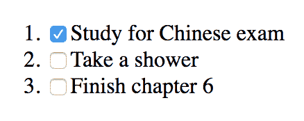

# 第六章：使用 React 构建 Web 应用程序

在本章中，我们将涵盖以下食谱：

+   理解 React 元素和 React 组件

+   组合组件

+   有状态的组件和生命周期方法

+   使用 React.PureComponent 进行操作

+   React 事件处理器

+   组件的条件渲染

+   使用 React 渲染列表

+   在 React 中处理表单和输入

+   理解 refs 以及如何使用它们

+   理解 React 端口

+   使用错误边界组件捕获错误

+   使用 PropTypes 进行类型检查属性

# 技术要求

你将需要了解 Go 编程语言，以及 Web 应用程序框架的基础知识。你还需要安装 Git，以便使用本书的 Git 仓库。最后，还需要具备在命令行上使用 IDE 进行开发的技能。

本章的代码文件可以在 GitHub 上找到：

[`github.com/PacktPublishing/MERN-Quick-Start-Guide/tree/master/Chapter06`](https://github.com/PacktPublishing/MERN-Quick-Start-Guide/tree/master/Chapter06)

查看以下视频，以查看代码的实际效果：

[`goo.gl/J7d7Ag`](https://goo.gl/J7d7Ag)

# 简介

React 是一个用于构建 **用户界面**（**UI**）的 JavaScript 库。React 是基于组件的，这意味着每个组件都可以独立于其他组件存在并管理自己的状态。复杂的 UI 可以通过组合组件来创建。

组件通常使用 JSX 语法创建，它具有类似 XML 的语法，或者使用 `React.createElement` 方法。然而，JSX 是使 React 在构建 Web 应用程序时特别适合声明式编程的原因。

在 MVC 模式下，React 通常与 View 相关联。

# 理解 React 元素和 React 组件

**React 元素**可以使用 JSX 语法创建：

```js
const element = <h1>Example</h1> 
```

这被转换成：

```js
const element = React.createElement('h1', null, 'Example') 
```

JSX 是 JavaScript 之上的语言扩展，它允许你轻松地创建复杂的 UI。例如，考虑以下：

```js
const element = ( 
    <details> 
        <summary>React Elements</summary> 
        <p>JSX is cool</p> 
    </details> 
) 
```

之前的示例可以不使用 JSX 语法来编写：

```js
const element = React.createElement( 
    'details', 
    null, 
    React.createElement('summary', null, 'React Elements'), 
    React.createElement('p', null, 'JSX is cool'), 
  ) 
```

React 元素可以是任何 HTML5 标签，任何 JSX 标签都可以自闭合。例如，以下将创建一个包含空内容的段落 React 元素：

```js
const element = <p /> 
```

就像使用 HTML5 一样，你可以向 React 元素提供属性，在 React 中称为属性或 props：

```js
const element = ( 
    <input type="text" value="Example" readOnly /> 
) 
```

**React 组件**允许你将你的 Web 应用程序的部分作为可重用的代码块或组件进行隔离。它们可以以多种方式定义。例如：

+   **函数组件**：这些是接受属性作为第一个参数的普通 JavaScript 函数，并返回 React 元素：

```js
      const InputText = ({ name, children }) => ( 
          <input 
              type="text" 
              name={name} 
              value={children} 
              readOnly 
          />­ 
      ) 
```

+   **类组件**：使用 ES6 类允许你定义生命周期方法和创建有状态的组件。它们通过 `render` 方法渲染 React 元素：

```js
class InputText extends React.Component { 
    render() { 
              const { name, children } = this.props 
              return ( 
                  <input 
                      type="text" 
                      name={name} 
                      value={children} 
                      readOnly 
                  /> 
              ) 
          } 
      } 
```

+   **表达式**：这些保持对 React 元素或组件实例的引用：

```js
const InstanceInputText = ( 
          <InputText name="username"> 
              Huang Jx 
          </InputText> 
      ) 
```

有一些属性是独特的，并且仅属于 React。例如，`children` 属性指的是标签内的元素：

```js
<MyComponent> 
    <span>Example</span> 
</MyComponent> 
```

在上一个示例中，`MyComponent` 接收到的 `children` 属性将是一个 `span` React 元素的实例。如果传递了多个 React 元素或组件作为子元素，则 `children` 属性将是一个数组。然而，如果没有传递子元素，则 `children` 属性将为 `null`。`children` 属性不一定是 React 元素或组件；它也可以是一个 JavaScript 函数或 JavaScript 原始值：

```js
<MyComponent> 
    {() => { 
        console.log('Example!') 
        return null
    }} 
</MyComponent> 
```

React 也认为返回或渲染字符串的功能组件和类组件是有效的 React 组件。例如：

```js
const SayHi = ({ to }) => ( 
    `Hello ${to}` 
) 
const element = ( 
    <h1> 
        <SayHi to="John" />, how are you? 
    </h1> 
) 
```

React 组件的名称必须以大写字母开头。否则，React 将将小写 JSX 标签视为 React 元素

**在 React 中将组件渲染到 DOM 中** 不是一个复杂的过程。React 提供了多种方法，通过 `ReactDOM` 库将 React 组件渲染到 DOM 中。React 使用 JSX 或 `React.createElement` 创建一个树或 DOM 树的表示。它是通过使用虚拟 DOM 来实现的，这使得 React 能够将 React 元素转换为 DOM 节点，并仅更新已更改的节点。

这就是通常使用 `ReactDOM` 库的 `render` 方法渲染应用程序的方式：

```js
import * as ReactDOM from 'react-dom' 
import App from './App' 
ReactDOM.render( 
   <App />, 
   document.querySelector('[role="main"]'), 
) 
```

`render` 方法提供的第一个参数是一个 React 组件或 React 元素。第二个参数告诉你在 DOM 中的哪个位置渲染应用程序。在上一个示例中，我们使用文档对象的 `querySelector` 方法查找具有 `role` 属性设置为 `"main"` 的 DOM 节点。

React 还允许你将 React 组件作为 HTML 字符串渲染，这对于在服务器端生成内容并将内容直接作为 HTML 文件发送到浏览器非常有用：

```js
import * as React from 'react' 
import * as ReactDOMServer from 'react-dom/server' 
const OrderedList = ({ children }) => ( 
   <ol> 
      {children.map((item, indx) => ( 
         <li key={indx}>{item}</li> 
      ))} 
   </ol> 
) 
console.log( 
   ReactDOMServer.renderToStaticMarkup( 
      <OrderedList> 
         {['One', 'Two', 'Three']} 
      </OrderedList> 
   ) 
) 
```

它将在控制台输出以下内容：

```js
<ol> 
   <li>One</li> 
   <li>Two</li> 
   <li>Three</li> 
</ol> 
```

# 准备工作

在本食谱中，你将创建一个简单的 React 应用程序，使用你学到的关于 React 组件和 React 元素的概念。在你开始之前，创建一个包含以下内容的新的 `package.json` 文件：

```js
{ 
  "scripts": { 
    "start": "parcel serve -p 1337 index.html" 
  }, 
  "devDependencies": { 
    "babel-plugin-transform-class-properties": "6.24.1", 
    "babel-preset-env": "1.6.1", 
    "babel-preset-react": "6.24.1", 
    "babel-core": "6.26.3", 
    "parcel-bundler": "1.8.1", 
    "react": "16.3.2", 
    "react-dom": "16.3.2" 
  } 
} 
```

接下来，创建一个名为 `.babelrc` 的 Babel 配置文件，并添加以下内容：

```js
{ 
    "presets": ["env","react"], 
    "plugins": ["transform-class-properties"] 
} 
```

然后，通过打开终端并运行以下命令来安装依赖项：

```js
npm install 
```

# 如何操作...

创建一个 React 应用程序，通过编写功能、类和表达式组件来显示欢迎信息：

1.  创建一个名为 `basics.js` 的新文件。

1.  导入 React 和 ReactDOM 库：

```js
      import * as React from 'react' 
      import * as ReactDOM from 'react-dom' 
```

1.  定义一个新的功能组件，该组件将渲染一个 `span` React 元素，其 `style` 属性中的 `color` 设置为红色：

```js
      const RedText = ({ text }) => ( 
          <span style={{ color: 'red' }}> 
              {text} 
          </span> 
      ) 
```

1.  定义另一个功能组件，该组件将渲染一个 `h1` React 元素和作为其 `children` 的 `RedText` 功能组件：

```js
      const Welcome = ({ to }) => ( 
          <h1>Hello, <RedText text={to}/></h1> 
      ) 
```

1.  定义一个表达式，其中将包含对 React 元素的引用：

```js
      const TodoList = ( 
          <ul> 
              <li>Lunch at 14:00 with Jenny</li> 
              <li>Shower</li> 
          </ul> 
      ) 
```

1.  定义一个名为 `Footer` 的类组件，用于显示当前日期：

```js
      class Footer extends React.Component { 
          render() { 
              return ( 
                  <footer> 
                      {new Date().toDateString()} 
                  </footer> 
              ) 
          } 
      } 
```

1.  将应用程序渲染到 DOM 中：

```js
      ReactDOM.render( 
          <div> 
              <Welcome to="John" /> 
              {TodoList} 
              <Footer /> 
          </div>, 
          document.querySelector('[role="main"]'), 
      ) 
```

1.  保存文件。

然后，创建一个 `index.html` 文件，你将在其中渲染 React 应用程序：

1.  创建一个名为 `index.html` 的新文件

1.  添加以下代码：

```js
      <!DOCTYPE html> 
      <html lang="en"> 
      <head> 
          <meta charset="UTF-8"> 
          <title>MyApp</title> 
      </head> 
      <body> 
          <div role="main"></div> 
          <script src="img/basics.js"></script> 
      </body> 
      </html> 
```

1.  保存文件

# 让我们测试一下...

要查看之前的工作效果：

1.  在项目目录根目录下打开一个终端并运行：

```js
 npm start
```

1.  然后，在您的网络浏览器中打开一个新标签页并转到：

```js
      http://localhost:1337/
```

1.  你应该能够看到 React 应用程序渲染到 DOM 中

# 组合组件

在 React 中，所有组件都可以被隔离，通过组合组件可以构建复杂的 UI，这使它们具有可复用性。

# 准备工作

在这个菜谱中，你将使用可复用组件来生成一个包含三个部分的主页：一个页眉、一个带有描述的段落和一个页脚。这三个部分将被编写为三个单独的组件，稍后将被组合起来构建主页。在你开始之前，创建一个包含以下内容的新的`package.json`文件：

```js
{ 
  "scripts": { 
    "start": "parcel serve -p 1337 index.html" 
  }, 
  "devDependencies": { 
    "babel-plugin-transform-class-properties": "6.24.1", 
    "babel-preset-env": "1.6.1", 
    "babel-preset-react": "6.24.1", 
    "babel-core": "6.26.3", 
    "parcel-bundler": "1.8.1", 
    "react": "16.3.2", 
    "react-dom": "16.3.2" 
  } 
} 
```

接下来，创建一个 babel 配置文件`.babelrc`，添加以下内容：

```js
{ 
    "presets": ["env","react"], 
    "plugins": ["transform-class-properties"] 
} 
```

然后，通过打开终端并运行以下命令来安装依赖项：

```js
npm install
```

# 如何操作...

在项目根目录中创建一个名为`component`的新文件夹。然后，按照以下顺序创建以下三个文件：

1.  `Header.js`

1.  `Footer.js`

1.  `Description.js`

`Header`组件将生成一个代表页面标题的`h1` React 元素。它期望接收一个`title`属性：

1.  在`component`目录中创建一个名为`Header.js`的新文件

1.  添加以下代码：

```js
      import * as React from 'react' 
import * as ReactDOM from 'react-dom' 
      export default ({ title }) => ( 
          <h1>{title}</h1> 
      ) 
```

1.  保存文件

`Footer`组件将生成一个放置在页面末尾的`footer` React 元素。它期望接收一个`date`属性：

1.  在`component`目录中创建一个名为`Footer.js`的新文件

1.  添加以下代码：

```js
      import * as React from 'react' 
      import * as ReactDOM from 'react-dom' 
      export default ({ date }) => ( 
          <footer>{date}</footer> 
      ) 
```

1.  保存文件

`Description`组件将生成一个段落，显示页面的描述：

1.  在`component`目录中创建一个名为`Description.js`的新文件

1.  添加以下代码：

```js
      import * as React from 'react' 
      import * as ReactDOM from 'react-dom' 
      export default () => ( 
          <p>This is a cool website designed with ReactJS</p> 
      ) 
```

1.  保存文件

接下来，从`component`目录退回到项目根目录（其中包含`package.json`）并创建以下文件：

1.  创建一个名为`composing-react.js`的新文件

1.  导入 React 和`ReactDOM`库：

```js
      import * as React from 'react' 
      import * as ReactDOM from 'react-dom' 
```

1.  导入之前定义的组件：

```js
      import Header from './component/Header' 
      import Footer from './component/Footer' 
      import Description from './component/Description' 
```

1.  定义一个`App`组件，该组件将渲染你之前定义的组件：

```js
      const App = () => ( 
          <React.Fragment> 
              <Header title="Simple React App" /> 
              <Description /> 
              <Footer date={new Date().toDateString()} /> 
          </React.Fragment> 
      ) 
```

1.  渲染应用程序：

```js
      ReactDOM.render( 
          <App />, 
          document.querySelector('[role="main"]'), 
      ) 
```

1.  保存文件

然后，创建一个`index.html`文件，你将在其中渲染 React 应用程序：

1.  创建一个名为`index.html`的新文件

1.  添加以下代码：

```js
      <!DOCTYPE html> 
      <html lang="en"> 
      <head> 
          <meta charset="UTF-8"> 
          <title>Composing Components</title> 
      </head> 
      <body> 
          <div role="main"></div> 
          <script src="img/composing-react.js"></script> 
      </body> 
      </html> 
```

1.  保存文件

# 让我们测试一下...

要查看之前的工作效果，请执行以下步骤：

1.  在您的项目目录根目录下打开一个终端并运行：

```js
 npm start
```

1.  然后，在您的网络浏览器中打开一个新标签页并转到：

```js
      http://localhost:1337/ 
```

1.  如果你在浏览器开发者工具中检查 DOM 树，你应该能够看到以下 DOM 结构：

```js
      <div role="app"> 
      <h1>React App</h1> 
      <p>This is a cool website designed with ReactJS</p> 
      <footer>Tue May 22 2018</footer> 
      </div> 
```

# 它是如何工作的...

每个 React 组件都写在单独的文件中。然后，我们在主应用程序文件`composing-react.js`中导入组件，并使用组合来生成虚拟 DOM 树。每个组件都是可重用的，因为它可以在应用程序的其他部分或其他组件中再次使用，只需导入文件。然后，使用`ReactDOM`库中的`render`方法来生成虚拟 DOM 树的 DOM 表示。

# 还有更多...

你注意到我们使用了`React.Fragment`吗？这是 React v16 引入的新功能。它允许你返回多个元素而不创建额外的 DOM 节点。组件不能以下方式返回多个 React 组件或元素：

```js
const Example = () => ( 
   <span>One</span> 
   <span>Two</span> 
) // < will trow an error 
```

然而，使用`React.Fragment`，你可以做以下操作：

```js
const Example = () => ( 
   <React.Fragment> 
      <span>One</span> 
      <span>Two</span> 
   </React.Fragment> 
) 
```

# 有状态组件和生命周期方法

React 组件可以管理它们自己的状态，并且只有当状态发生变化时才会更新。使用 ES6 类编写的有状态 React 组件如下：

```js
class Example extends React.Component { 
   render() { 
      <span>This is an example</span> 
   } 
} 
```

React 类组件有一个`state`实例属性来访问它们的内部状态，以及一个`props`属性来访问传递给组件的属性：

```js
class Example extends React.Component {  
    state = { title: null } 
    render() { 
        return ( 
            <React.Fragment>  
                <span>{this.props.title}</span>  
                <span>{this.state.title}</span>  
            </React.Fragment>  
        ) 
    } 
} 
```

并且它们的状态可以通过使用`setState`实例方法来修改：

```js
class Example extends React.Component { 
    state = { 
        title: "Example", 
        date: null, 
    } 
    componentDidMount() { 
        this.setState((prevState) => ({ 
            date: new Date().toDateString(), 
        })) 
    } 
    render() { 
        return ( 
            <React.Fragment>  
                <span>{this.state.title}</span>  
                <span>{this.state.date}</span>  
            </React.Fragment>  
        ) 
    } 
} 
```

状态只初始化一次。然后，当组件挂载时，应该只使用`setState`方法来修改状态。这样，React 能够检测状态的变化并更新组件。

`setState`方法接受一个回调函数作为第一个参数，该回调函数将在将当前状态（按惯例为`prevState`）作为第一个参数传递给回调函数，并将当前`props`作为第二个参数时执行。这是因为`setState`是异步的，状态可能在你在组件的不同部分执行其他操作时被修改。

如果你不需要在更新状态时访问当前状态，你可以直接将一个对象作为第一个参数传递。例如，上一个例子可以写成如下形式：

```js
componentDidMount() { 
   this.setState({ 
      date: new Date().toDateString(), 
   }) 
} 
```

`setState`还接受一个可选的回调函数作为第二个参数，该回调函数在状态更新后被调用。因为`setState`是异步的，你可能想在状态更新后执行一次操作，所以可以使用第二个回调：

```js
componentDidMount() { 
   this.setState({ 
      date: new Date().toDateString(), 
   }, () => { 
      console.log('date has been updated!') 
   }) 
   console.log(this.state.date) // null 
} 
```

一旦组件挂载，控制台将首先输出`null`，即使我们在它之前使用了`setState`；这是因为状态是异步设置的。然而，一旦状态更新，控制台将显示“date has been updated”。

当使用`setState`方法时，React 将前一个状态与当前给定的状态合并。内部上，它类似于执行以下操作：

```js
currentState = Object.assign({}, currentState, nextState) 
```

每个类组件都有*生命周期方法*，这些方法让你从组件创建到销毁的过程中控制组件的生命周期，以及控制其他属性，例如知道组件是否接收到新的属性以及组件是否应该更新。这些是所有类组件中存在的生活周期方法：

+   `constructor(props)`: 在初始化组件的新实例并在组件挂载之前，这个方法会被调用。`props`必须通过`super(props)`传递给超类，以便 React 正确设置`props`。`constructor`方法也很有用，可以用来初始化组件的初始状态。

+   `static getDerivedStateFromProps(nextProps, nextState)`: 当组件被实例化并且组件将接收到新的`props`时，这个方法会被调用。当状态或其部分依赖于传递给组件的`props`中的值时，这个方法很有用。它必须返回一个对象，该对象将与当前状态合并，或者如果接收到新的`props`后不需要更新状态，则返回`null`。

+   `componentDidMount()`: 在组件被挂载并在第一次`render`调用之后，这个方法会被调用。它对于与第三方库集成、访问 DOM 或向端点发送 HTTP 请求很有用。

+   `shouldComponentUpdate(nextProps, nextState)`: 当组件更新了状态或接收到了新的 props 时，这个方法会被调用。这个方法允许 React 知道是否应该更新组件。如果你在你的组件中没有实现这个方法，它默认返回`true`，这意味着每次状态改变或接收到新的 props 时，组件都应该被更新。如果你实现这个方法并返回`false`，它将告诉 React 不要更新组件。

+   `componentDidUpdate(prevProps, prevState, snapshot)`: 在渲染方法之后或发生更新时（除了第一次渲染），这个方法会被调用。

+   `getSnapshotBeforeUpdate(prevProps, prevState)`: 在渲染方法之后或发生更新时，但在`componentDidUpdate`生命周期方法之前，这个方法会被调用。这个方法的返回值作为`componentDidUpdate`的第三个参数传递。

+   `componentWillUnmount()`: 在组件卸载和其实例被销毁之前，这个方法会被调用。如果你使用第三方库，这个方法有助于清理。例如，清除定时器或取消网络请求。

+   `componentDidCatch(error, info)`：这是 React v16 的新特性，用于错误处理。我们将在接下来的菜谱中更详细地探讨这个特性。

# 准备工作

在这个菜谱中，你将使用我们所学到的所有生命周期方法来构建一个组件。首先，创建一个包含以下内容的新的`package.json`文件：

```js
{ 
  "scripts": { 
    "start": "parcel serve -p 1337 index.html" 
  }, 
  "devDependencies": { 
    "babel-plugin-transform-class-properties": "6.24.1", 
    "babel-preset-env": "1.6.1", 
    "babel-preset-react": "6.24.1", 
    "babel-core": "6.26.3", 
    "parcel-bundler": "1.8.1", 
    "react": "16.3.2", 
    "react-dom": "16.3.2" 
  } 
} 
```

接下来，创建一个 babel 配置文件作为`.babelrc`，添加以下内容：

```js
{ 
    "presets": ["env","react"], 
    "plugins": ["transform-class-properties"] 
} 
```

然后，通过打开终端并运行以下命令来安装依赖项：

```js
npm install  
```

# 如何实现...

构建一个 `LifeCycleTime` 组件，其唯一目的是显示当前时间。该组件将每 100 毫秒更新一次，以保持组件与时间变化的同步。我们将在这个组件中使用生命周期方法来完成以下目的：

+   `constructor(props)`: 用于初始化组件的初始状态。

+   `static getDerivedStateFromProps(nextProps, nextState)`: 用于合并 `props` 和状态。

+   `componentDidMount()`: 设置一个每 100 毫秒执行一次的函数，使用 `setInterval` 更新状态为当前时间。

+   `shouldComponentUpdate(nextProps, nextState)`: 用于决定组件是否应该被渲染。检查 `props` 是否有一个属性 `dontUpdate` 设置为 `true`，这意味着组件在状态或 `props` 变化时不应更新。

+   `componentDidUpdate(prevProps, prevState, snapshot)`: 用于在控制台简单地记录组件已被更新，并显示 `snapshot` 的值。

+   `getSnapshotBeforeUpdate(prevProps, prevState)`: 为了说明这个方法的功能，只需返回一个字符串，该字符串将被传递给 `componentDidUpdate` 的第三个参数。

+   `componentWillUnmount()`: 当组件被销毁或卸载时，清除在 `componentDidMount` 中定义的间隔。否则，在组件卸载后，您将看到一个错误信息被显示。

首先，创建一个 `index.html` 文件，您将在其中渲染 React 应用程序：

1.  创建一个名为 `index.html` 的新文件

1.  添加以下代码：

```js
      <!DOCTYPE html> 
      <html lang="en"> 
      <head> 
          <meta charset="UTF-8"> 
          <title>Life cycle methods</title> 
      </head> 
      <body> 
          <div role="main"></div> 
          <script src="img/stateful-react.js"></script> 
      </body> 
      </html> 
```

1.  保存文件

接下来，执行以下步骤来构建 `LifeCycleTime` 组件：

1.  创建一个名为 `stateful-react.js` 的新文件

1.  导入 React 和 `ReactDOM` 库：

```js
      import * as React from 'react' 
      import * as ReactDOM from 'react-dom' 
```

1.  定义一个 `LifeCycleTime` 类组件，并使用之前描述的生命周期方法：

```js
      class LifeCycleTime extends React.Component { 
          constructor(props) { 
              super(props) 
              this.state = { 
                  time: new Date().toTimeString(), 
                  color: null, 
                  dontUpdate: false, 
              } 
          } 
          static getDerivedStateFromProps(nextProps, prevState) { 
              return nextProps 
          } 
          componentDidMount() { 
              this.intervalId = setInterval(() => { 
                  this.setState({ 
                      time: new Date().toTimeString(), 
                  }) 
              }, 100) 
          } 
          componentWillUnmount() { 
              clearInterval(this.intervalId) 
          } 
          shouldComponentUpdate(nextProps, nextState) { 
              if (nextState.dontUpdate) { 
                  return false 
              } 
              return true 
          } 
          getSnapshotBeforeUpdate(prevProps, prevState) { 
              return 'snapshot before update' 
          } 
          componentDidUpdate(prevProps, prevState, snapshot) { 
              console.log( 
                  'Component did update and received snapshot:', 
                  snapshot, 
              ) 
          } 
          render() { 
              return ( 
                  <span style={{ color: this.state.color }}> 
                      {this.state.time} 
                  </span> 
              ) 
          } 
      } 
```

1.  然后，定义一个 `App` 类组件，该组件将用于测试你之前创建的组件。添加三个按钮：一个按钮会在红色和蓝色之间切换颜色属性，并将其作为属性传递给 `LifeCycleTime` 组件，另一个按钮用于在状态中的 `dontUpdate` 属性之间切换 true 和 false，然后将其作为属性传递给 `LifeCycleTime`，最后，一个按钮在被点击时将挂载或卸载 `LifeCycleTime` 组件：

```js
      class App extends React.Component { 
          constructor(props) { 
              super(props) 
              this.state = { 
                  color: 'red', 
                  dontUpdate: false, 
                  unmount: false, 
              } 
              this.toggleColor = this.toggleColor.bind(this) 
              this.toggleUpdate = this.toggleUpdate.bind(this) 
              this.toggleUnmount = this.toggleUnmount.bind(this) 
          } 
          toggleColor() { 
              this.setState((prevState) => ({ 
                  color: prevState.color === 'red' 
                      ? 'blue' 
                      : 'red', 
              })) 
          } 
          toggleUpdate() { 
              this.setState((prevState) => ({ 
                  dontUpdate: !prevState.dontUpdate, 
              })) 
          } 
          toggleUnmount() { 
              this.setState((prevState) => ({ 
                  unmount: !prevState.unmount, 
              })) 
          } 
          render() { 
              const { 
                  color, 
                  dontUpdate, 
                  unmount, 
              } = this.state 
              return ( 
                  <React.Fragment> 
                      {unmount === false && <LifeCycleTime 
                          color={color} 
                          dontUpdate={dontUpdate} 
                      />} 
                      <button onClick={this.toggleColor}> 
                          Toggle color 
                          {JSON.stringify({ color })} 
                      </button> 
                      <button onClick={this.toggleUpdate}> 
                          Should update? 
                          {JSON.stringify({ dontUpdate })} 
                      </button> 
                      <button onClick={this.toggleUnmount}> 
                          Should unmount? 
                          {JSON.stringify({ unmount })} 
                      </button> 
                  </React.Fragment> 
              ) 
          } 
      } 
```

1.  渲染应用程序：

```js
      ReactDOM.render( 
          <App />, 
          document.querySelector('[role="main"]'), 
      ) 
```

1.  保存文件。

# 让我们测试一下...

要查看之前的工作效果，请执行以下步骤：

1.  在您的项目目录根目录下打开一个终端，并运行：

```js
 npm start
```

1.  然后，在您的网络浏览器中打开一个新标签页，并转到：

```js
 http://localhost:1337/
```

1.  使用这些按钮来切换组件的状态，并理解生命周期方法如何影响组件的功能。

# 使用 React.PureComponent 进行操作

`React.PureComponent` 与 `React.Component` 类似。区别在于 `React.Component` 内部实现了 `shouldComponentUpdate` 生命周期方法，以进行浅比较 `state` 和 `props`，以决定组件是否应该更新。

# 准备工作

在这个菜谱中，您将编写两个组件，一个扩展 `React.PureComponent`，另一个扩展 `React.Component`，以便了解当将相同的属性传递给它们时它们的行为。在开始之前，创建一个包含以下内容的 `package.json` 文件：

```js
{ 
  "scripts": { 
    "start": "parcel serve -p 1337 index.html" 
  }, 
  "devDependencies": { 
    "babel-plugin-transform-class-properties": "6.24.1", 
    "babel-preset-env": "1.6.1", 
    "babel-preset-react": "6.24.1", 
    "babel-core": "6.26.3", 
    "parcel-bundler": "1.8.1", 
    "react": "16.3.2", 
    "react-dom": "16.3.2" 
  } 
} 
```

接下来，创建一个 babel 配置文件 `.babelrc`，添加以下内容：

```js
{ 
    "presets": ["env","react"], 
    "plugins": ["transform-class-properties"] 
} 
```

然后，通过打开终端并运行以下命令来安装依赖项：

```js
npm install  
```

# 如何操作...

构建一个 React 应用程序来展示和更好地理解 `React.PureComponent` 的工作原理。创建两个组件：一个将扩展 `React.Component`，另一个将扩展 `React.PureComponent`。这两个组件将被放置在另一个名为 `App` 的 React 组件内部，该组件大约每秒更新一次其状态。在两个组件中使用生命周期方法 `componentDidUpdate`，在控制台记录哪个组件在父组件 `App` 更新时被更新。

首先，创建一个 `index.html` 文件，其中将渲染 react 应用程序：

1.  创建一个名为 `index.html` 的新文件。

1.  添加以下 HTML 代码：

```js
      <!DOCTYPE html> 
      <html lang="en"> 
      <head> 
          <meta charset="UTF-8"> 
          <title>React.PureComponent</title> 
      </head> 
      <body> 
          <div role="main"></div> 
          <script src="img/pure-component.js"></script> 
      </body> 
      </html> 
```

1.  保存文件

然后，按照以下步骤构建 React 应用程序：

1.  创建一个名为 `pure-component.js` 的新文件。

1.  导入 React 和 ReactDOM 库：

```js
      import * as React from 'react' 
      import * as ReactDOM from 'react-dom' 
```

1.  定义一个扩展 `React.PureComponent` 类的 `Button` 类组件：

```js
      class Button extends React.PureComponent { 
          componentDidUpdate() { 
              console.log('Button Component did update!') 
          } 
          render() { 
              return ( 
                  <button>{this.props.children}</button> 
              ) 
          } 
      } 
```

1.  定义一个扩展 `React.Component` 类的 `Text` 类组件：

```js
      class Text extends React.Component { 
          componentDidUpdate() { 
              console.log('Text Component did update!') 
          } 
          render() { 
              return this.props.children 
          } 
      } 
```

1.  定义一个简单的 `App` 组件，该组件将渲染两个组件。`App` 组件在挂载后设置计时器，并且大约每秒更新一次状态：

```js
      class App extends React.Component { 
          state = { 
              counter: 0, 
          } 
          componentDidMount() { 
              this.intervalId = setInterval(() => { 
                  this.setState(({ counter }) => ({ 
                      counter: counter + 1, 
                  })) 
              }, 1000) 
          } 
          componentWillUnmount() { 
              clearInterval(this.intervalId) 
          } 
          render() { 
              const { counter } = this.state 
              return ( 
                  <React.Fragment> 
                      <h1>Counter: {counter}</h1> 
                      <Text>I'm just a text</Text> 
                      <Button>I'm a button</Button> 
                  </React.Fragment> 
              ) 
          } 
      } 
```

1.  渲染应用程序：

```js
      ReactDOM.render( 
          <App />, 
          document.querySelector('[role="main"]'), 
      ) 
```

1.  保存文件。

# 让我们测试一下...

要查看之前工作的效果，请执行以下步骤：

1.  在项目目录的根目录下打开终端并运行：

```js
 npm start
```

1.  然后，在您的网页浏览器中打开一个新标签页并转到：

```js
 http://localhost:1337/  
```

1.  计数器大约每秒增加一次。打开浏览器中的开发者工具并检查控制台输出。您应该看到以下内容：

```js
      [N] Text Component did update! 
```

# 它是如何工作的...

因为 `React.PureComponent` 内部实现了 `shouldComponentUpdate` 生命周期方法，所以它不会更新 `Button` 组件，因为其 `state` 或 `props` 没有改变。然而，它确实更新了 `Text` 组件，因为 `shouldComponentUpdate` 默认返回 `true`，告诉 React 更新组件，即使其 props 或 state 没有改变。

# React 事件处理器

React 的事件系统内部使用一个名为 `SyntheticEvent` 的包装器来处理原生 HTML DOM 事件，以实现跨浏览器支持。React 事件遵循 W3C 规范，可以在 [`www.w3.org/TR/DOM-Level-3-Events/`](https://www.w3.org/TR/DOM-Level-3-Events/) 找到。

React 事件名称采用驼峰式命名，而不是 HTML DOM 事件的小写。例如，HTML DOM 事件 `onclick` 在 React 中会被调用为 `onClick`。有关支持事件的完整列表，请访问 React 官方文档关于事件的页面：[`reactjs.org/docs/events.html`](https://reactjs.org/docs/events.html)

# 准备工作

在这个菜谱中，你将编写一个组件来查看它是如何定义和工作的。在你开始之前，创建一个包含以下内容的新的 `package.json` 文件：

```js
{ 
  "scripts": { 
    "start": "parcel serve -p 1337 index.html" 
  }, 
  "devDependencies": { 
    "babel-plugin-transform-class-properties": "6.24.1", 
    "babel-preset-env": "1.6.1", 
    "babel-preset-react": "6.24.1", 
    "babel-core": "6.26.3", 
    "parcel-bundler": "1.8.1", 
    "react": "16.3.2", 
    "react-dom": "16.3.2" 
  } 
} 
```

接下来，创建一个名为 `.babelrc` 的 Babel 配置文件，并添加以下内容：

```js
{ 
    "presets": ["env","react"], 
    "plugins": ["transform-class-properties"] 
} 
```

然后，通过打开终端并运行以下命令来安装依赖项：

```js
npm install 
```

# 如何做到这一点...

首先，创建一个 `index.html` 文件，React 应用程序将在其中渲染：

1.  创建一个名为 `index.html` 的新文件

1.  添加以下 HTML 代码：

```js
      <!DOCTYPE html> 
      <html lang="en"> 
      <head> 
          <meta charset="UTF-8"> 
          <title>React Events Handlers</title> 
      </head> 
      <body> 
          <div role="main"></div> 
          <script src="img/events.js"></script> 
      </body> 
      </html> 
```

1.  保存文件

接下来，编写一个组件，定义一个用于 `onClick` 事件的处理器：

1.  创建一个名为 `events.js` 的新文件。

1.  导入 React 和 ReactDOM 库：

```js
      import * as React from 'react' 
      import * as ReactDOM from 'react-dom' 
```

1.  定义一个类组件，该组件将渲染一个 `h1` React 元素和一个 `button` React 元素，每次点击时都会触发 `onBtnClick` 方法：

```js
      class App extends React.Component { 
          constructor(props) { 
              super(props) 
              this.state = { 
                  title: 'Untitled', 
              } 
              this.onBtnClick = this.onBtnClick.bind(this) 
          } 
          onBtnClick() { 
              this.setState({ 
                  title: 'Hello there!', 
              }) 
          } 
          render() { 
              return ( 
                  <section> 
                      <h1>{this.state.title}</h1> 
                      <button onClick={this.onBtnClick}> 
                          Click me to change the title 
                      </button> 
                  </section> 
              ) 
          } 
      } 
```

1.  渲染应用程序：

```js
      ReactDOM.render( 
          <App />, 
          document.querySelector('[role="main"]'), 
      ) 
```

1.  保存文件。

# 让我们测试一下...

要查看应用程序的工作情况，请执行以下步骤：

1.  在您的项目目录根目录中打开终端并运行以下命令：

```js
       npm start
```

1.  然后，在您的网络浏览器中打开一个新标签页，并转到：

```js
      http://localhost:1337/
```

1.  点击按钮以更改标题。

# 它是如何工作的...

React 事件作为 `props` 传递给 React 元素。例如，我们传递了 `onClick` prop 给 `button` React 元素，以及一个回调函数的引用，我们期望当用户点击按钮时调用该函数。

# 还有更多...

你注意到我们经常使用 `bind` 吗？当一个方法作为 prop 传递给子组件时，它会失去 `this` 的上下文，因此绑定到上下文是必要的。以下是一个示例：

```js
class Example { 
    fn() { return this } 
} 
const examp = new Example() 
const props = examp.fn 
const bound = examp.fn.bind(examp) 
console.log('1:', typeof examp.fn()) 
console.log('2:', typeof props()) 
console.log('3:', typeof bound()) 
```

显示的输出将是：

```js
1: object 
2: undefined 
3: object 
```

即使常量 `props` 有对 `Example` 类的 `examp` 实例的 `fn` 方法的引用，它也会失去 `this` 的上下文。这就是为什么绑定允许你保持原始上下文。在 React 中，我们将方法绑定到原始的 `this` 上下文，以便在将函数向下传递给子组件时使用我们自己的实例方法，例如 `setState`。否则，`this` 的上下文将是 `undefined`，函数将失败。

# 组件的条件渲染

通常在构建复杂的 UI 时，您需要根据接收到的状态或 props 来渲染组件或 React 元素。

React 组件允许在花括号内执行 JavaScript，并且可以使用条件三元运算符来决定渲染哪个组件或 React 元素。例如：

```js
const Meal = ({ timeOfDay }) => (  
    <span>{timeOfDay === 'noon' 
        ? 'Pizza' 
        : 'Sandwich' 
    }</span>  
) 
```

这也可以写成：

```js
const Meal = ({ timeOfDay }) => (  
    <span children={timeOfDay === 'noon' 
        ? 'Pizza' 
        : 'Sandwich' 
    } />  
) 
```

如果将 `"noon"` 作为 `timeOfDay` 属性的值传递，它将生成以下 HTML 内容：

```js
<span>Pizza</span> 
```

或者当 `timeOfDay` 属性未设置为 `"noon"` 时：

```js
<span>Sandwich</span> 
```

# 准备工作

在这个菜谱中，你将构建一个组件，该组件根据给定的条件渲染其子组件之一。首先，创建一个包含以下内容的新的 `package.json` 文件：

```js
{ 
  "scripts": { 
    "start": "parcel serve -p 1337 index.html" 
  }, 
  "devDependencies": { 
    "babel-plugin-transform-class-properties": "6.24.1", 
    "babel-preset-env": "1.6.1", 
    "babel-preset-react": "6.24.1", 
    "babel-core": "6.26.3", 
    "parcel-bundler": "1.8.1", 
    "react": "16.3.2", 
    "react-dom": "16.3.2" 
  } 
} 
```

接下来，创建一个名为 `.babelrc` 的 Babel 配置文件，并添加以下内容：

```js
{ 
    "presets": ["env","react"], 
    "plugins": ["transform-class-properties"] 
} 
```

然后，通过打开终端并运行以下命令来安装依赖项：

```js
npm install
```

# 如何做到这一点...

编写一个 React 组件，该组件将根据传递给组件的`condition`属性来决定显示两个不同的 React 元素中的哪一个。如果条件为真，则显示第一个子元素。否则，应显示第二个子元素。

首先，创建一个`index.html`文件，React 应用程序将在其中渲染：

1.  创建一个名为`index.html`的新文件

1.  添加以下 HTML 代码：

```js
      <!DOCTYPE html> 
      <html lang="en"> 
      <head> 
          <meta charset="UTF-8"> 
          <title>Conditional Rendering</title> 
      </head> 
      <body> 
          <div role="main"></div> 
          <script src="img/conditions.js"></script> 
      </body> 
      </html> 
```

1.  保存文件

然后，创建一个包含 React 应用程序逻辑和组件的新文件：

1.  创建一个名为`conditions.js`的新文件

1.  导入 React 和 ReactDOM 库：

```js
      import * as React from 'react' 
      import * as ReactDOM from 'react-dom' 
```

1.  定义一个名为`Toggle`的功能组件，该组件将接收一个`condition`属性，该属性将被评估以确定要渲染哪个 React 元素。它期望接收两个 React 元素作为子元素：

```js
      const Toggle = ({ condition, children }) => ( 
          condition 
              ? children[0] 
              : children[1] 
      ) 
```

1.  定义一个名为`App`的类组件，该组件将根据定义的条件渲染一个 React 元素。当按钮被点击时，它将切换`color`状态：

```js
      class App extends React.Component { 
          constructor(props) { 
              super(props) 
              this.state = { 
                  color: 'blue', 
              } 
              this.onClick = this.onClick.bind(this) 
          } 
          onClick() { 
              this.setState(({ color }) => ({ 
                  color: (color === 'blue') ? 'lime' : 'blue' 
              })) 
          } 
          render() { 
              const { color } = this.state 
              return ( 
                  <React.Fragment> 
                      <Toggle condition={color === 'blue'}> 
                          <p style={{ color }}>Blue!</p> 
                          <p style={{ color }}>Lime!</p> 
                      </Toggle> 
                      <button onClick={this.onClick}> 
                          Toggle Colors 
                      </button> 
                  </React.Fragment> 
              ) 
          } 
      } 
```

1.  渲染应用程序：

```js
      ReactDOM.render( 
          <App />, 
          document.querySelector('[role="main"]'), 
      ) 
```

1.  保存文件。

# 让我们测试一下...

要运行和测试应用程序，请执行以下步骤：

1.  在您的项目目录根目录中打开一个终端并运行：

```js
 npm start
```

1.  然后，在您的网络浏览器中打开一个新标签页并转到：

```js
      http://localhost:1337/
```

1.  点击按钮以切换显示哪个 React 元素

# 它是如何工作的...

因为`children`属性可以是一个 React 元素的数组，所以我们可以访问每个单独的 React 元素并决定渲染哪一个。我们使用了`condition`属性来评估给定的条件是否为真以渲染第一个 React 元素。否则，如果值为假，则渲染第二个 React 元素。

# 使用 React 渲染列表

React 允许您以数组的形式将 React 元素或组件的集合作为`children`传递。例如：

```js
   <ul> 
      {[ 
         <li key={0}>One</li>, 
         <li key={1}>Two</li>, 
      ]} 
   </ul> 
```

React 元素或组件的集合必须提供一个特殊的 props 属性，名为`key`。该属性让 React 知道在更新发生时，集合中的哪些元素已更改、移动或从数组中删除：

# 准备工作

在这个菜谱中，您将构建一个实用组件，该组件将映射数组的每个项到组件的 props 并将它们作为列表渲染。在开始之前，创建一个包含以下内容的新的`package.json`文件：

```js
{ 
  "scripts": { 
    "start": "parcel serve -p 1337 index.html" 
  }, 
  "devDependencies": { 
    "babel-plugin-transform-class-properties": "6.24.1", 
    "babel-preset-env": "1.6.1", 
    "babel-preset-react": "6.24.1", 
    "babel-core": "6.26.3", 
    "parcel-bundler": "1.8.1", 
    "react": "16.3.2", 
    "react-dom": "16.3.2" 
  } 
} 
```

接下来，创建一个 babel 配置文件`.babelrc`，添加以下内容：

```js
{ 
    "presets": ["env","react"], 
    "plugins": ["transform-class-properties"] 
} 
```

然后，通过打开终端并运行以下命令来安装依赖项：

```js
 npm install
```

# 如何实现...

创建一个名为`MapArray`的 React 组件，该组件将负责将数组的项映射到 React 组件。

首先，创建一个`index.html`文件，React 应用程序将在其中渲染：

1.  创建一个名为`index.html`的新文件

1.  添加以下 HTML 代码：

```js
      <!DOCTYPE html> 
      <html lang="en"> 
      <head> 
          <meta charset="UTF-8"> 
          <title>Rendering Lists</title> 
      </head> 
      <body> 
         <div role="main"></div> 
          <script src="img/lists.js"></script> 
      </body> 
      </html> 
```

1.  保存文件

然后，按照以下步骤构建 React 应用程序：

1.  创建一个名为`lists.js`的新文件。

1.  导入 React 和 ReactDOM 库：

```js
      import * as React from 'react' 
      import * as ReactDOM from 'react-dom' 
```

1.  定义一个名为 `MapArray` 的函数组件，它将期望接收三个属性：`from`，它期望是一个值数组，`mapToProps`，它期望是一个将值映射到属性的回调函数，最后是 `children`，它将接收一个 React 组件，其中数组的值将被映射到：

```js
      const MapArray = ({ 
          from, 
          mapToProps, 
          children: Child, 
      }) => ( 
          <React.Fragment> 
              {from.map((item) => ( 
                  <Child {...mapToProps(item)} /> 
              ))} 
          </React.Fragment> 
      ) 
```

1.  定义一个 `TodoItem` 组件，它期望接收两个属性，`done` 和 `label`：

```js
      const TodoItem = ({ done, label }) => ( 
          <li> 
              <input type="checkbox" checked={done} readOnly /> 
              <label>{label}</label> 
          </li> 
      ) 
```

1.  定义一个包含待办列表对象值的数组：

```js
      const list = [ 
          { id: 1, done: true, title: 'Study for Chinese exam' }, 
          { id: 2, done: false, title: 'Take a shower' }, 
          { id: 3, done: false, title: 'Finish chapter 6' }, 
      ] 
```

1.  定义一个回调函数，该函数将映射数组的对象值到 `TodoItem` 组件的预期属性。将 `id` 属性重命名为 `key`，将 `title` 属性重命名为 `label`：

```js
      const mapToProps = ({ id: key, done, title: label }) => ({ 
          key, 
          done, 
          label, 
      }) 
```

1.  定义一个 `TodoListApp` 组件，该组件将使用 `MapArray` 组件为待办列表数组中的每个项目创建 `TodoItem` 实例：

```js
      const TodoListApp = ({ items }) => ( 
          <ol> 
              <MapArray from={list} mapToProps={mapToProps}> 
                  {TodoItem} 
              </MapArray> 
          </ol> 
      ) 
```

1.  渲染应用程序：

```js
      ReactDOM.render( 
          <TodoListApp items={list} />, 
          document.querySelector('[role="main"]'), 
      ) 
```

1.  保存文件。

# 让我们测试一下...

要运行和测试应用程序，请执行以下步骤：

1.  在您的项目目录根目录中打开一个终端并运行：

```js
 npm start
```

1.  然后，在您的网络浏览器中打开一个新标签页并转到：

```js
      http://localhost:1337/
```

1.  应显示待办事项列表：



待办事项列表

# 它是如何工作的...

看看下面的代码：

```js
<ol> 
   <MapArray from={list} mapToProps={mapToProps}> 
      {TodoItem} 
   </MapArray> 
</ol> 
```

这基本上与编写相同：

```js
<ol> 
   <React.Fragment> 
      {from.map((item) => ( 
         <TodoItem {...mapToProps(item) } /> 
      ))} 
   </React.Fragment> 
</ol> 
```

然而，`MapArray` 作为辅助组件来完成同样的工作，同时使代码更易于阅读。

您注意到 `TodoItem` 组件只期望两个属性吗？然而，我们还在将项目的 `id` 作为 `key` 传递。如果没有传递 `key` 属性，则在渲染组件时将显示警告。

# 在 React 中使用表单和输入

**与表单相关的元素**，如 `<input>` 和 `<textarea>`，通常维护自己的内部状态并根据用户输入进行更新。在 React 中，当使用 React 状态管理 **与表单相关的元素** 的输入时，它被称为 **受控组件**。

默认情况下，在 React 中，如果输入的 `value` 属性未设置，则用户输入可以修改输入的内部状态。但是，如果设置了 `value` 属性，则输入为只读，并且它期望 React 通过使用 `onChange` React 事件来管理用户输入，并使用 React 状态来更新输入状态（如果需要）。例如，此 `input` React 元素将渲染为只读：

```js
<input type="text" value="Ms.Huang Jx" /> 
```

然而，因为 React 期望找到一个 `onChange` 事件处理器，所以之前的代码将在控制台输出一个警告消息。为了修复这个问题，我们可以向 `onChange` 属性提供一个回调函数来处理用户输入：

```js
<input type="text" value="Ms.Huang Jx" onChange={event => null} /> 
```

因为用户输入由 React 处理，并且在之前的示例中我们没有更新输入的值，所以输入看起来是只读的。之前的代码类似于只设置一个 `readOnly` 属性而不是提供一个无用的 `onChange` 属性。

React 还允许你定义**不受控组件**，这基本上意味着 React 不会控制输入的更新方式或内容。例如，当使用第三方库来处理输入时，**不受控组件**有一个名为`defaultValue`的属性，它类似于`value`属性。然而，它允许输入通过用户输入而不是 React 来控制其内部状态。这意味着具有`defaultValue`属性的**表单相关元素**允许其状态通过用户输入进行修改：

```js
<input type="text" defaultValue="Ms.Huang Jx" /> 
```

与使用`value`属性相反，你现在可以直接在输入框中输入来更改其值，因为输入的内部状态是可变的。

# 准备工作

在这个菜谱中，你将构建一个简单的登录表单组件。在开始之前，创建一个包含以下内容的`package.json`文件：

```js
{ 
  "scripts": { 
    "start": "parcel serve -p 1337 index.html" 
  }, 
  "devDependencies": { 
    "babel-plugin-transform-class-properties": "6.24.1", 
    "babel-preset-env": "1.6.1", 
    "babel-preset-react": "6.24.1", 
    "babel-core": "6.26.3", 
    "parcel-bundler": "1.8.1", 
    "react": "16.3.2", 
    "react-dom": "16.3.2" 
  } 
} 
```

接下来，创建一个 babel 配置文件`.babelrc`，添加以下内容：

```js
{ 
    "presets": ["env","react"], 
    "plugins": ["transform-class-properties"] 
} 
```

然后，通过打开终端并运行来安装依赖项：

```js
 npm install
```

# 如何操作...

定义一个名为`LoginForm`的类组件，该组件将处理`username`输入和`password`输入。

首先，创建一个`index.html`文件，React 应用程序将在其中渲染：

1.  创建一个名为`index.html`的新文件。

1.  添加以下 HTML 代码：

```js
      <!DOCTYPE html> 
      <html lang="en"> 
      <head> 
          <meta charset="UTF-8"> 
          <title>Forms and Inputs</title> 
      </head> 
      <body> 
          <div role="main"></div> 
          <script src="img/forms.js"></script> 
      </body> 
      </html> 
```

1.  保存文件

接下来，构建`LoginForm`组件，并利用 React**受控组件**赋予的输入状态控制权，也禁止在`username`输入中输入数字：

1.  创建一个名为`forms.js`的新文件。

1.  导入 React 和 ReactDOM 库：

```js
      import * as React from 'react' 
      import * as ReactDOM from 'react-dom' 
```

1.  定义一个名为`LoginForm`的类组件。在类中，定义一个输入变化的事件处理程序，并检查`username`输入的值以禁止输入数字：

```js
      class LoginForm extends React.Component { 
          constructor(props) { 
              super(props) 
              this.state = { 
                  username: '', 
                  password: '', 
              } 
              this.onChange = this.onChange.bind(this) 
          } 
          onChange(event) { 
              const { name, value } = event.target 
              this.setState({ 
                  [name]: name === 'username' 
                      ? value.replace(/d/gi, '') 
                      : value 
              }) 
          } 
          render() { 
              return ( 
                  <form> 
                      <input 
                          type="text" 
                          name="username" 
                          placeholder="Username" 
                          value={this.state.username} 
                          onChange={this.onChange} 
                      /> 
                      <input 
                          type="password" 
                          name="password" 
                          placeholder="Password" 
                          value={this.state.password} 
                          onChange={this.onChange} 
                      /> 
                      <pre> 
                          {JSON.stringify(this.state, null, 2)} 
                      </pre> 
                  </form> 
              ) 
          } 
      } 
```

1.  渲染应用程序：

```js
      ReactDOM.render( 
          <LoginForm />, 
          document.querySelector('[role="main"]'), 
      ) 
```

1.  保存文件。

# 让我们测试它...

要运行和测试应用程序，请执行以下步骤：

1.  在你的项目目录根目录下打开终端并运行：

```js
 npm start
```

1.  然后，在您的网络浏览器中打开一个新标签页并转到：

```js
http://localhost:1337/
```

1.  尝试在`username`输入中输入一个数字，以查看对数字的验证是如何工作的。

# 它是如何工作的...

我们定义了一个`onChange`事件处理程序，它在两个输入元素中使用。然而，我们检查输入的名称是否为`username`以决定是否应用验证。使用`RegExp`测试输入中的数字并将它们替换为空字符串。这就是为什么在`username`输入时不会显示数字的原因。

# 理解引用及其使用方法

在常规工作流程中，React 组件通过传递`props`与其子组件进行通信。然而，在某些情况下，需要访问子组件的实例以进行通信或修改其行为。React 使用`refs`来允许我们访问子组件的实例。

重要的是要理解，React 组件的实例为您提供对其实例方法和属性的访问。然而，React 元素的实例是一个 HTML DOM 元素的实例。通过给 React 组件或 React 元素一个 `ref` 属性来访问引用。它期望值是一个回调函数，该函数将在实例创建时被调用，并提供一个引用作为回调函数的第一个参数传递给实例。

React 提供了一个名为 `createRef` 的辅助函数，用于定义设置引用的正确函数回调。例如，以下代码获取了 React 组件和 React 元素的引用：

```js
class Span extends React.Component { 
    render() { 
        return <span>{this.props.children}</span> 
    } 
} 
class App extends React.Component { 
    rf1 = React.createRef() 
    rf2 = React.createRef() 
    componentDidMount() { 
        const { rf1, rf2 } = this 
        console.log(rf1.current instanceof HTMLSpanElement) 
        console.log(rf2.current instanceof Span) 
    } 
    render() { 
        return ( 
            <React.Fragment> 
                <span ref={this.rf1} /> 
                <Span ref={this.rf2} /> 
            </React.Fragment> 
        ) 
    } 
} 
```

在这个例子中，控制台将输出 `true` 两次：

```js
true // rf1.current instanceof HTMLSpanElement 
true // rf2.current instanceof Span 
```

这证明了我们刚刚学到的。

函数组件没有 `refs`。因此，将 `ref` 属性赋予函数组件将在控制台显示警告并失败。

**引用**在以下情况下特别有用，用于处理 *未受控组件*：

+   与第三方库的集成

+   访问 HTML DOM 元素的本地方法，这些方法在其他情况下无法从 React 访问，例如 `HTMLElement.focus()` 方法

+   使用某些网络 API，例如选择网络 API、网络动画 API 和媒体播放方法

# 准备工作

在这个菜谱中，你将处理未受控组件，并使用引用向表单 HTML 元素发送一个自定义事件。在你开始之前，创建一个包含以下内容的 `package.json` 文件：

```js
{ 
  "scripts": { 
    "start": "parcel serve -p 1337 index.html" 
  }, 
  "devDependencies": { 
    "babel-plugin-transform-class-properties": "6.24.1", 
    "babel-preset-env": "1.6.1", 
    "babel-preset-react": "6.24.1", 
    "babel-core": "6.26.3", 
    "parcel-bundler": "1.8.1", 
    "react": "16.3.2", 
    "react-dom": "16.3.2" 
  } 
} 
```

接下来，创建一个 Babel 配置文件 `.babelrc`，添加以下内容：

```js
{ 
    "presets": ["env","react"], 
    "plugins": ["transform-class-properties"] 
} 
```

然后，通过在终端中运行以下命令安装依赖项：

```js
 npm install
```

# 如何做到这一点...

定义一个 `LoginForm` 类组件，该组件将渲染一个包含两个输入的表单：一个用于用户名，另一个用于密码。在表单 React 元素外部包含一个按钮，该按钮将用于在表单 React 元素上触发 `onSubmit` 事件。

首先，创建一个 `index.html` 文件，React 应用程序将在其中渲染：

1.  创建一个名为 `index.html` 的新文件

1.  添加以下 HTML 代码：

```js
      <!DOCTYPE html> 
      <html lang="en"> 
      <head> 
          <meta charset="UTF-8"> 
          <title>Refs</title> 
      </head> 
      <body> 
          <div role="main"></div> 
          <script src="img/refs.js"></script> 
      </body> 
      </html> 
```

1.  保存文件

现在，开始构建 React 应用程序：

1.  创建一个名为 `refs.js` 的新文件。

1.  导入 React 和 ReactDOM 库：

```js
      import * as React from 'react' 
import * as ReactDOM from 'react-dom' 
```

1.  定义一个名为 `LoginForm` 的类组件，该组件将渲染表单和一个按钮，当点击按钮时，将使用 `refs` 触发 `onSubmit` 表单事件：

```js
      class LoginForm extends React.Component { 
          refForm = React.createRef() 
          constructor(props) { 
              super(props) 
              this.state = {} 
              this.onSubmit = this.onSubmit.bind(this) 
              this.onClick = this.onClick.bind(this) 
          } 
          onSubmit(event) { 
              const form = this.refForm.current 
              const data = new FormData(form) 
              this.setState({ 
                  user: data.get('user'), 
                  pass: data.get('pass'), 
              }) 
              event.preventDefault() 
          } 
          onClick(event) { 
              const form = this.refForm.current 
              form.dispatchEvent(new Event('submit')) 
          } 
          render() { 
              const { onSubmit, onClick, refForm, state } = this 
              return ( 
                  <React.Fragment> 
                      <form onSubmit={onSubmit} ref={refForm}> 
                          <input type="text" name="user" /> 
                          <input type="text" name="pass" /> 
                      </form> 
                      <button onClick={onClick}>LogIn</button> 
                      <pre>{JSON.stringify(state, null, 2)}</pre> 
                  </React.Fragment> 
              ) 
          } 
      } 
```

1.  渲染应用程序：

```js
      ReactDOM.render( 
          <LoginForm />, 
          document.querySelector('[role="main"]'), 
      ) 
```

1.  保存文件。

# 让我们测试它...

要运行和测试应用程序，请执行以下步骤：

1.  在项目目录的根目录中打开一个终端并运行：

```js
 npm start
```

1.  然后，在您的网络浏览器中打开一个新标签页，并转到：

```js
http://localhost:1337/
```

# 它是如何工作的...

1.  点击 `LogIn` 按钮以测试表单 `onSubmit` 事件是否被触发。

1.  首先，将表单 DOM 元素的实例引用保存在一个名为 `reform` 的实例属性中。

1.  然后，一旦按钮提交，我们使用 `EventTarget` 网络 API 的 `dispatchEvent` 方法在表单 DOM 元素上触发一个自定义事件 `submit`。

1.  然后，分发的 `submit` 方法被 React 的 `SyntheticEvent` 捕获。

1.  最后，React 触发传递给表单的 `onSubmit` 属性的回调方法。

# 理解 React 端口

React 端口允许我们在父组件生成的 DOM 树之外的不同 DOM 元素中渲染子组件，同时保持 React 树仿佛该组件位于父组件生成的 DOM 树内部。例如，即使子组件位于不同的 DOM 节点中，子组件中生成的事件也会冒泡到 React 父组件。

React 端口是通过 ReactDOM 库的 `createPortal` 方法创建的，它具有与 `render` 方法相同的签名：

```js
ReactDOM.createPortal(  
    ReactComponent, 
    DOMNode,  
) 
```

然而，`render` 和 `createPortal` 之间的区别在于，后者返回一个特殊标签，该标签用于在 React 树中标识此元素为 React 端口，并像使用 React 元素一样使用它。例如：

```js
<article> 
   {ReactDOM.createPortal( 
      <h1>Example</h1>, 
      document.querySelector('[id="heading"]'), 
   )} 
</article> 
```

# 准备工作

在开始之前，创建一个包含以下内容的 `package.json` 文件：

```js
{ 
  "scripts": { 
    "start": "parcel serve -p 1337 index.html" 
  }, 
  "devDependencies": { 
    "babel-plugin-transform-class-properties": "6.24.1", 
    "babel-preset-env": "1.6.1", 
    "babel-preset-react": "6.24.1", 
    "babel-core": "6.26.3", 
    "parcel-bundler": "1.8.1", 
    "react": "16.3.2", 
    "react-dom": "16.3.2" 
  } 
} 
```

接下来，创建一个 `.babelrc` 的 babel 配置文件，并添加以下内容：

```js
{ 
    "presets": ["env","react"], 
    "plugins": ["transform-class-properties"] 
} 
```

然后，通过打开终端并运行以下命令来安装依赖项：

```js
 npm install
```

# 如何操作...

首先，创建一个 `index.html` 文件，其中将渲染 React 应用程序，同时包含一个 HTML `header` 标签，其中将渲染 React 端口元素：

1.  创建一个名为 `index.html` 的新文件

1.  添加以下 HTML 代码：

```js
      <!DOCTYPE html> 
      <html lang="en"> 
      <head> 
          <meta charset="UTF-8"> 
          <title>Portals</title> 
      </head> 
      <body> 
          <header id="heading"></header> 
          <div role="main"></div> 
          <script src="img/portals.js"></script> 
      </body> 
      </html> 
```

1.  保存文件

接下来，构建一个将渲染一个段落和一个 `h1` HTML 元素到 `header` HTML 元素之外的 React 应用程序：

1.  创建一个名为 `portals.js` 的新文件。

1.  导入 React 和 ReactDOM 库：

```js
      import * as React from 'react' 
      import * as ReactDOM from 'react-dom' 
```

1.  定义一个名为 `Header` 的函数组件，并创建一个端口以将 `children` 渲染到不同的 DOM 元素：

```js
      const Header = () => ReactDOM.createPortal( 
          <h1>React Portals</h1>, 
          document.querySelector('[id="heading"]'), 
      ) 
```

1.  定义一个名为 `App` 的函数组件，该组件将渲染一个 React 元素和 `Header` React 组件：

```js
      const App = () => ( 
          <React.Fragment> 
              <p>Hello World!</p> 
              <Header /> 
          </React.Fragment> 
      ) 
```

1.  渲染应用程序：

```js
      ReactDOM.render( 
          <App />, 
          document.querySelector('[role="main"]'), 
      ) 
```

1.  保存文件。

# 让我们测试一下...

要运行和测试应用程序，请执行以下步骤：

1.  在您的项目目录根目录中打开一个终端并运行：

```js
 npm start
```

1.  然后，在您的网络浏览器中打开一个新标签页，并转到：

```js
http://localhost:1337/
```

1.  生成的 HTML DOM 树将类似于以下内容：

```js
      <header id="heading"> 
         <h1>React Portals</h1> 
      </header> 
      <section role="main"> 
         <p>Hello World!</p> 
      </section> 
```

# 它是如何工作的...

即使在 React 树中，`Header` 组件看起来是在 `p` HTML 标签之后渲染的，但实际上渲染的 `Header` 组件是在它之前。这是因为 `Header` 组件实际上是在一个出现在主应用程序渲染的 `section` HTML 标签之前的 `header` HTML 标签上渲染的。

# 使用错误边界组件捕获错误

**错误边界组件**是实现了 `componentDidCatch` **生命周期方法**的 React 组件，用于捕获其子组件中的错误。它们在类组件初始化失败时捕获 `constructor` 方法中的错误，在生命周期方法中，以及在渲染过程中。无法捕获的错误来自异步代码、事件处理程序，以及错误边界组件本身的错误。

`componentDidCatch`生命周期方法接收两个参数：第一个是一个`error`对象，而第二个接收的参数是一个包含`componentStack`属性的对象，该属性具有友好的堆栈跟踪，描述了组件在 React 树中失败的位置。

# 准备工作

在这个菜谱中，您将构建一个错误边界组件，并在渲染时出现错误时提供一个回退 UI。在开始之前，创建一个包含以下内容的新的`package.json`文件：

```js
{ 
  "scripts": { 
    "start": "parcel serve -p 1337 index.html" 
  }, 
  "devDependencies": { 
    "babel-plugin-transform-class-properties": "6.24.1", 
    "babel-preset-env": "1.6.1", 
    "babel-preset-react": "6.24.1", 
    "babel-core": "6.26.3", 
    "parcel-bundler": "1.8.1", 
    "react": "16.3.2", 
    "react-dom": "16.3.2" 
  } 
} 
```

接下来，创建一个 babel 配置文件`.babelrc`，添加以下内容：

```js
{ 
    "presets": ["env","react"], 
    "plugins": ["transform-class-properties"] 
} 
```

然后，通过打开终端并运行以下命令来安装依赖项：

```js
 npm install 
```

# 如何做...

首先，创建一个`index.html`文件，React 应用程序将在其中渲染：

1.  创建一个名为`index.html`的新文件

1.  添加以下 HTML 代码：

```js
      <!DOCTYPE html> 
      <html lang="en"> 
      <head> 
          <meta charset="UTF-8"> 
          <title>Catching Errors</title> 
      </head> 
      <body> 
          <div role="main"></div> 
          <script src="img/error-boundary.js"></script> 
      </body> 
      </html> 
```

1.  保存文件

接下来，定义一个错误边界组件，它将捕获错误并在渲染时显示回退 UI，显示错误发生的位置和错误消息。同时定义一个`App`组件并创建一个`button`React 元素，当点击按钮时将导致应用程序失败并设置状态：

1.  创建一个名为`error-boundary.js`的新文件。

1.  导入 React 和 ReactDOM 库：

```js
      import * as React from 'react' 
      import * as ReactDOM from 'react-dom' 
```

1.  定义一个`ErrorBoundary`组件，当应用程序渲染失败时将显示回退消息：

```js
      class ErrorBoundary extends React.Component { 
          constructor(props) { 
              super(props) 
              this.state = { 
                  hasError: false, 
                  message: null, 
                  where: null, 
              } 
          } 
          componentDidCatch(error, info) { 
              this.setState({ 
                  hasError: true, 
                  message: error.message, 
                  where: info.componentStack, 
              }) 
          } 
          render() { 
              const { hasError, message, where } = this.state 
              return (hasError 
                  ? <details style={{ whiteSpace: 'pre-wrap' }}> 
                      <summary>{message}</summary> 
                      <p>{where}</p> 
                  </details> 
                  : this.props.children 
              ) 
          } 
      } 
```

1.  定义一个名为`App`的类组件，它将渲染一个`button`React 元素。一旦按钮被点击，它将故意抛出一个错误：

```js
      class App extends React.Component { 
          constructor(props) { 
              super(props) 
              this.onClick = this.onClick.bind(this) 
          } 
          onClick() { 
              this.setState(() => { 
                  throw new Error('Error while setting state.') 
              }) 
          } 
          render() { 
              return ( 
                  <button onClick={this.onClick}> 
                      Buggy button! 
                  </button> 
              ) 
          } 
      } 
```

1.  在`ErrorBoundary`组件内包装`App`以渲染应用程序：

```js
      ReactDOM.render( 
          <ErrorBoundary> 
              <App /> 
          </ErrorBoundary>, 
          document.querySelector('[role="main"]'), 
      ) 
```

1.  保存文件。

# 让我们测试一下...

要运行和测试应用程序，请执行以下步骤：

1.  在项目目录的根目录中打开一个终端并运行：

```js
 npm start
```

1.  然后，在您的网络浏览器中打开一个新标签页并转到：

```js
      http://localhost:1337/
```

1.  点击`button`以导致应用程序失败

1.  显示以下错误的回退 UI：

```js
      Error while setting state.  
          in App 
          in ErrorBoundary 
```

# 使用 PropTypes 检查属性类型

React 允许您实现组件属性的运行时类型检查。这有助于捕获错误并确保您的组件正确接收`props`。这可以通过只需在您的组件上设置静态`propType`属性轻松完成。例如：

```js
class MyComponent extends React.Component { 
   static propTypes = { 
      children: propTypes.string.isRequired, 
   } 
   render() { 
      return<span>{this.props.children}</span> 
   } 
} 
```

之前的代码将需要`MyComponent`的`children`属性是一个`string`。否则，如果提供了不同类型的属性，React 将在控制台显示警告。

`propTypes`方法是在组件实例创建时被触发的函数，用于检查给定的`props`是否与`propTypes`模式匹配。

`propTypes`具有一个广泛的方法列表，可用于验证属性。您可以在 React 官方文档中找到完整的列表：[`reactjs.org/docs/typechecking-with-proptypes.html`](https://reactjs.org/docs/typechecking-with-proptypes.html)。

# 准备工作

在这个菜谱中，您将看到并编写用于检查属性类型的自定义验证规则。在开始之前，创建一个包含以下内容的新的`package.json`文件：

```js
{ 
  "scripts": { 
    "start": "parcel serve -p 1337 index.html" 
  }, 
  "devDependencies": { 
    "babel-core": "6.26.3", 
    "babel-plugin-transform-class-properties": "6.24.1", 
    "babel-preset-env": "1.6.1", 
    "babel-preset-react": "6.24.1", 
    "parcel-bundler": "1.8.1", 
    "prop-types": "15.6.1", 
    "react": "16.3.2", 
    "react-dom": "16.3.2" 
  } 
} 
```

接下来，创建一个 `.babelrc` 的 babel 配置文件，添加以下内容：

```js
{ 
    "presets": ["env","react"], 
    "plugins": ["transform-class-properties"] 
} 
```

然后，通过打开终端并运行以下命令来安装依赖项：

```js
npm install 
```

# 如何做到这一点...

首先，创建一个 `index.html` 文件，React 应用程序将在其中渲染：

1.  创建一个名为 `index.html` 的新文件。

1.  添加以下 HTML 代码：

```js
      <!DOCTYPE html> 
      <html lang="en"> 
      <head> 
          <meta charset="UTF-8"> 
          <title>Type Checking</title> 
      </head> 
      <body> 
          <div role="main"></div> 
          <script src="img/type-checking.js"></script> 
      </body> 
      </html> 
```

1.  保存文件。

接下来，定义一个期望接收两个 React 元素作为 `children` 的 `Toggle` 类组件。使用 `PropTypes` 创建一个自定义验证规则来检查 `children` 属性是否是 React 元素的数组，并且组件接收了正好两个 React 元素：

1.  创建一个名为 `type-checking.js` 的新文件。

1.  导入 React、ReactDOM 和 `PropTypes` 库：

```js
      import * as React from 'react' 
      import * as ReactDOM from 'react-dom' 
      import * as propTypes from 'prop-types' 
```

1.  定义一个名为 `Toggle` 的类组件。使用 `propTypes` 对 `condition` 和 `children` 属性进行类型检查。使用自定义 `propType` 来检查 `children` 是否是 React 元素的数组，并且它包含正好两个 React 元素：

```js
      class Toggle extends React.Component { 
          static propTypes = { 
              condition: propTypes.any.isRequired, 
              children: (props, propName, componentName) => { 
                  const customPropTypes = { 
                      children: propTypes 
                          .arrayOf(propTypes.element) 
                          .isRequired 
                  } 
                  const isArrayOfElements = propTypes 
                      .checkPropTypes( 
                          customPropTypes, 
                          props, 
                          propName, 
                          componentName, 
                  ) 
                  const children = props[propName] 
                  const count = React.Children.count(children) 
                  if (isArrayOfElements instanceof Error) { 
                      return isArrayOfElements 
                  } else if (count !== 2) { 
                      return new Error( 
                          `"${componentName}"` + 
                          ` expected ${propName}` + 
                          ` to contain exactly 2 React elements` 
                      ) 
                  } 
              } 
          } 
          render() { 
              const { condition, children } = this.props 
              return condition ? children[0] : children[1] 
          } 
      } 
```

1.  定义一个名为 `App` 的类组件，它将渲染 `Toggle` 组件。提供三个 React 元素作为其 `children`，以及一个 `button`，当点击时，将状态中的 `value` 属性从 `true` 切换到 `false`，反之亦然：

```js
      class App extends React.Component { 
          constructor(props) { 
              super(props) 
              this.state = { value: false } 
              this.onClick = this.onClick.bind(this) 
          } 
          onClick() { 
              this.setState(({ value }) => ({ 
                  value: !value, 
              })) 
          } 
          render() { 
              const { value } = this.state 
              return ( 
                  <React.Fragment> 
                      <Toggle condition={value}> 
                          <p style={{ color: 'blue' }}>Blue!</p> 
                          <p style={{ color: 'lime' }}>Lime!</p> 
                          <p style={{ color: 'pink' }}>Pink!</p> 
                      </Toggle> 
                      <button onClick={this.onClick}> 
                          Toggle Colors 
                      </button> 
                  </React.Fragment> 
              ) 
          } 
      } 
```

1.  渲染应用程序：

```js
      ReactDOM.render( 
          <App />, 
          document.querySelector('[role="main"]'), 
      ) 
```

1.  保存文件。

# 让我们测试一下...

要运行和测试应用程序，请执行以下步骤：

1.  在你的项目目录根目录打开一个终端并运行：

```js
 npm start
```

1.  然后，在您的网络浏览器中打开一个新标签页并转到：

```js
      http://localhost:1337/
```

1.  浏览器中的控制台将显示以下警告：

```js
      Warning: Failed prop type: "Toggle" expected children to contain exactly 2 React       elements 
          in Toggle (created by App) 
          in App 
```

1.  点击 `button` 将在第一个和第二个 React 元素之间切换，而第三个 React 元素将被忽略。

# 如何工作...

我们为 `children` 属性定义了一个自定义函数验证器。在函数内部，我们首先使用内置的 `propTypes` 函数来检查 `children` 是否是 React 元素的数组。如果验证的结果不是一个 `Error` 实例，那么我们使用 React `Children` 的 `count` 工具方法来知道提供了多少个 React 元素，如果 `children` 中的 React 元素数量不是 `2`，则返回一个错误。

# 更多内容...

你注意到我们使用了 `propTypes.checkPropTypes` 方法吗？这是一个实用函数，它允许我们在 React 之外检查 `propTypes`。例如：

```js
const pTypes = { 
   name: propTypes.string.isRequired, 
   age: propTypes.number.isRequired, 
} 
const props = { 
   name: 'Huang Jx', 
   age: 20, 
} 
propTypes.checkPropTypes(pTypes, props, 'property', 'props') 
```

`pTypes` 对象作为一个模式提供来自 `propTypes` 的验证函数。`props` 常量只是一个包含在 `pTypes` 中定义的属性的普通对象。

运行前面的示例在控制台不会输出任何警告，因为 `props` 中的所有属性都是有效的。然而，将 `props` 对象更改为：

```js
const props = { 
   name: 20, 
   age: 'Huang Jx', 
} 
```

然后，我们将在控制台输出中看到以下警告：

```js
Warning: Failed property type: Invalid property `name` of type `number` supplied to `props`, expected `string`. 
Warning: Failed property type: Invalid property `age` of type `string` supplied to `props`, expected `number`. 
```

`checkPropTypes` 工具方法具有以下签名：

```js
checkPropTypes(typeSpecs, values, location, componentName, getStack) 
```

在这里，`typeSpecs` 指的是一个包含 `propTypes` 函数验证器的对象。`values` 参数期望接收一个对象，其值需要与 `typeSpecs` 进行验证。`componentName` 指的是源名称，这通常是一个在警告消息中用于显示错误起源位置组件的名称。最后一个参数 `getStack` 是可选的，它期望是一个回调函数，该函数应返回一个 `Stack Trace`，并将其添加到警告消息的末尾，以更好地描述错误的确切起源位置。

`propTypes` 仅在开发中使用，并且在使用 React 的生产构建时，你必须设置打包器将 `process.env.NODE_ENV` 替换为 `"production"`。这样，你的应用程序的生产构建中会移除 `propTypes`。
