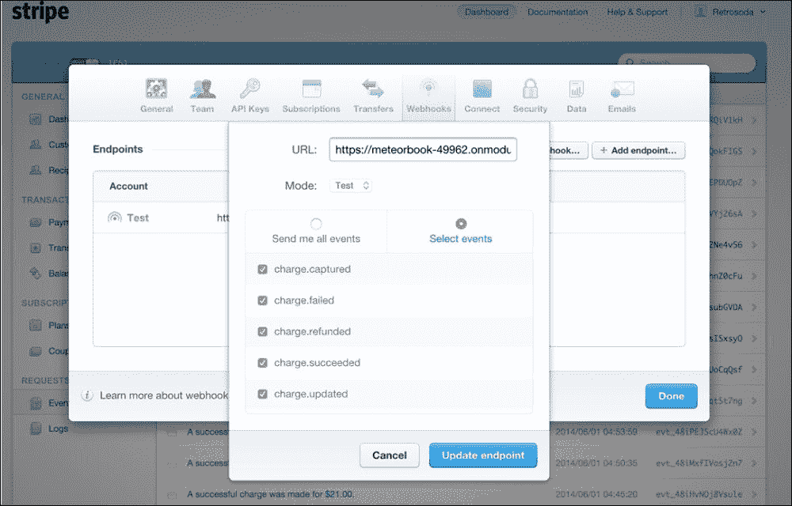

# 第四章 应用模式

本章将涵盖共享服务器和客户端代码的应用程序级模式。使用这些模式，你的代码将变得更加安全且易于管理。你将学习以下主题：

+   过滤和分页集合

+   安全性

+   外部 API

# 过滤和分页集合

到目前为止，我们发布集合时并没有过多考虑我们向客户端推送了多少文档。我们发布的文档越多，网页加载的时间就越长。为了解决这个问题，我们将学习如何只显示一定数量的文档，并允许用户通过过滤或分页在集合中导航。

使用 Meteor 的响应性构建过滤器和分页很容易。

## 路由注意事项

路由器始终可以接受两种类型的参数：查询参数和普通参数。查询参数是通常在网站 URL 后面跟着一个问号（`<url-path>?page=1`）的对象，而普通参数是你在路由 URL 中定义的类型（`<url>/<normal-parameter>/named_route/<normal-parameter-2>`）。在分页等事物上设置查询参数是一种常见的做法，以避免你的路由创建 URL 冲突。

当两个路由看起来相同但参数不同时，会发生 URL 冲突。例如，一个产品路由如`/products/:page`与一个产品详情路由如`/products/:product-id`冲突。虽然由于普通参数的不同，这两个路由的表达方式不同，但你使用相同的 URL 到达这两个路由。这意味着路由器唯一能够区分它们的方法是通过编程路由。因此，用户必须知道必须运行`FlowRouter.go()`命令才能到达任何一个产品页面，而不是简单地使用 URL。

这就是为什么我们将使用查询参数来保持我们的过滤和分页状态。

## 状态化分页

状态化分页简单来说就是给用户一个选项，让他们能够复制并粘贴 URL 到不同的客户端，并看到集合中完全相同的部分。这对于使网站易于分享非常重要。

在第二章中，我们创建了产品发布者和订阅者来详细说明我们的发布者。现在我们将了解如何以响应式的方式控制我们的订阅，以便用户可以导航整个集合。

首先，我们需要设置我们的路由器以接受页码。然后我们将使用这个数字在我们的订阅者中获取所需的数据。为了设置路由器，我们将使用`FlowRouter`查询参数（在 URL 旁边放置问号的参数）。

让我们设置我们的查询参数：

```js
# /products/client/products.coffee

Template.created "products", ->
  @autorun =>
    tags = Session.get "products.tags"
 filter =
 page: Number(FlowRouter.getQueryParam("page")) or 0

    if tags and not _.isEmpty tags
      _.extend filter,
        tags:tags

    order = Session.get "global.order"
    if order and not _.isEmpty order
      _.extend filter,
        order:order

    @subscribe "products", filter

Template.products.helpers
  ...

 pages:
 current: ->
 FlowRouter.getQueryParam("page") or 0

Template.products.events
 "click .next-page": ->
 FlowRouter.setQueryParams
 page: Number(FlowRouter.getQueryParam("page")) + 1

 "click .previous-page": ->
 if Number(FlowRouter.getQueryParam("page")) - 1 < 0
 page = 0
 else
 page = Number(FlowRouter.getQueryParam("page")) - 1

 FlowRouter.setQueryParams
 page: page

```

我们在这里做的事情很简单。首先，我们使用`page`键扩展过滤器对象，该键获取当前页面查询参数的值，如果该值不存在，则将其设置为`0`。"`getQueryParam`"是一个反应性数据源，`autorun`函数将在值变化时重新订阅。然后我们将创建一个视图的辅助函数，这样我们就可以看到我们所在的页面以及设置页面查询参数的两个事件。

但是等等。我们如何知道分页限制何时达到？这正是`tmeasday:publish-counts`包非常有用的地方。它使用发布者的特殊函数来精确计算正在发布的文档数量。

让我们设置我们的发布者：

```js
# /products/server/products_pub.coffee

Meteor.publish "products", (ops={}) ->
  limit = 10
 product_options =
 skip:ops.page * limit
 limit:limit
 sort:
 name:1

  if ops.tags and not _.isEmpty ops.tags
    @relations
      collection:Tags
      ... 
          collection:ProductsTags
          ...
              collection:Products
              foreign_key:"product"
 options:product_options
              mappings:[
                ...
              ]

  else
 Counts.publish this,"products",
 Products.find()
 noReady:true

    @relations
      collection:Products
 options:product_options
      mappings:[
        ...
      ]

  if ops.order and not _.isEmpty ops.order
    ...

  @ready()
```

为了发布我们的计数，我们使用了`Counts.publish`函数。这个函数接受几个参数：

```js
Counts.publish <always this>,<name of count>, <collection to count>, <parameters>
```

注意，我们使用了`noReady`参数来防止`ready`函数提前运行。通过这样做，我们生成一个计数器，可以通过运行`Counts.get "products"`在客户端访问。现在你可能想知道，为什么不使用`Products.find().count()`呢？在这个特定场景中，这确实是一个很好的主意，但你绝对必须使用`Counts`函数来使计数反应化，这样如果任何依赖项发生变化，它们都会被考虑在内。

让我们修改我们的视图和辅助函数以反映我们的计数器：

```js
# /products/client/products.coffee

...

Template.products.helpers
  pages:
    current: ->
      FlowRouter.getQueryParam("page") or 0

    is_last_page: ->
      current_page = Number(FlowRouter.getQueryParam("page")) or 0

      max_allowed = 10 + current_page * 10
      max_products = Counts.get "products"

      max_allowed > max_products

//- /products/client/products.jade

template(name="products")
  div#products.template
    ...
      section#featured_products
        div.container
          div.row
            br.visible-xs
            //- PAGINATION
            div.col-xs-4
              button.btn.btn-block.btn-primary.previous-page
                i.fa.fa-chevron-left

            div.col-xs-4
              button.btn.btn-block.btn-info {{pages.current}}

            div.col-xs-4
              unless pages.is_last_page
                button.btn.btn-block.btn-primary.next-page
                  i.fa.fa-chevron-right

            div.clearfix
            br

            //- PRODUCTS
            +momentum(plugin="fade-fast")
                         ...
```

太好了！现在用户可以复制并粘贴 URL 以获得他们之前的结果。这正是我们需要确保我们的客户可以分享链接的原因。如果我们保持页面变量局限于`Session`或`ReactiveVar`，那么分享 Web 应用的状态将是不可能的。

## 过滤

过滤和搜索也是任何 Web 应用的关键方面。过滤的工作方式类似于分页；发布者接受额外的变量来控制过滤。我们想确保这是有状态的，因此我们需要将其集成到我们的路由中，并且我们需要编程我们的发布者来对此做出反应。此外，过滤器需要与分页器兼容。让我们先修改发布者：

```js
# /products/server/products_pub.coffee

Meteor.publish "products", (ops={}) ->
  limit = 10
  product_options =
    skip:ops.page * limit
    limit:limit
    sort:
      name:1

 filter = {}

 if ops.search and not _.isEmpty ops.search
 _.extend filter,
 name:
 $regex: ops.search
 $options:"i"

  if ops.tags and not _.isEmpty ops.tags
    @relations
      collection:Tags
      mappings:[
          ...
          collection:ProductsTags
          mappings:[ 
              collection:Products
 filter:filter
              ...
      ]

  else
    Counts.publish this,"products",
 Products.find filter
      noReady:true

    @relations
      collection:Products
 filter:filter
      ...

  if ops.order and not _.isEmpty ops.order
    ...

  @ready()
```

要构建任何过滤器，我们必须确保创建过滤器的属性存在，并基于此`_.extend`我们的`filter`对象。这使得我们的代码更容易维护。注意，我们可以轻松地将过滤器添加到包含`Products`集合的每个部分。通过这种方式，我们确保了即使在标签过滤了数据的情况下，过滤器也始终被使用。通过将过滤器添加到`Counts.publish`函数中，我们确保了发布者也与分页兼容。

让我们构建我们的控制器：

```js
# /products/client/products.coffee

Template.created "products", ->
  @autorun =>
    ops =
      page: Number(FlowRouter.getQueryParam("page")) or 0
      search: FlowRouter.getQueryParam "search"
    ...

    @subscribe "products", ops

Template.products.helpers
  ...

  pages:
    search: ->
      FlowRouter.getQueryParam "search"

    ...

Template.products.events
  ...

  "change .search": (event) ->
    search = $(event.currentTarget).val()

    if _.isEmpty search
      search = null

    FlowRouter.setQueryParams
      search:search
      page:null
```

首先，我们将`filter`对象重命名为`ops`，以保持发布者和订阅者之间的统一。然后，我们在`ops`对象上附加了一个`search`键，该键接受搜索查询参数的值。请注意，我们可以为`search`传递一个未定义的值，并且我们的订阅者不会失败，因为发布者已经检查了该值是否存在，并基于此扩展了过滤器。始终在服务器端验证变量以确保客户端不会意外地破坏事物更好。此外，我们还需要确保我们知道该参数的值，以便在`pages`辅助程序下创建一个新的`search`辅助程序。最后，我们为搜索栏构建了一个事件。请注意，当它们不适用时，我们正在将查询参数设置为`null`。这确保了如果不需要它们，它们不会出现在我们的 URL 中。

最后，我们需要创建搜索栏：

```js
//- /products/client/products.jade

template(name="products")
  div#products.template
    header#promoter
      ...

    div#content
      section#features
        ...

      section#featured_products
        div.container
          div.row
            //- SEARCH
            div.col-xs-12
              div.form-group.has-feedback
                input.input-lg.search.form-control(type="text" placeholder="Search products" autocapitalize="off" autocorrect="off" autocomplete="off" value="{{pages.search}}")
                span(style="pointer-events:auto; cursor:pointer;").form-control-feedback.fa.fa-search.fa-2x

            ...
```

注意，我们的搜索输入有点杂乱，带有特殊属性。所有这些属性都确保我们的输入不会执行我们不希望它执行的事情，针对 iOS Safari。保持对非标准属性（如这些）的关注很重要，以确保网站对移动设备友好。您可以在以下位置找到这些属性的更新列表：[`developer.apple.com/library/safari/documentation/AppleApplications/Reference/SafariHTMLRef/Articles/Attributes.html`](https://developer.apple.com/library/safari/documentation/AppleApplications/Reference/SafariHTMLRef/Articles/Attributes.html)。

# 安全性

许多包保护 Meteor 堆栈的某些部分，即使如此，你也不能完全依赖这些包。此外，你必须非常小心地选择你选择的包！一些包可能会拦截核心功能，将信息从你的应用程序中过滤出来。这意味着在安装之前，你应该始终查看该包的源代码。

这个话题通常是新手 Meteor 开发者的疏忽，然而，它却是需要了解的最重要的话题之一。为了确保我们的 webapp 安全，我们需要：

+   定义角色（设置用户之间的区别）

+   为每个集合定义模式（限制它们可以修改的字段）

+   定义拒绝规则（限制谁可以修改字段）

+   在必要时使用方法来检查参数（确保需要时具有复杂的安全性）

+   设置浏览器策略

## 角色

使用角色，几乎每个 Web 应用都会在用户和他们可以做什么之间创建区别。为了帮助我们轻松管理角色，我们安装了`alanning:roles`包。使用此包，我们将控制谁访问我们的路由以及谁可以修改我们的集合。

此包使`Roles.userIsInRole`函数可用，该函数使用`roles`集合确保用户处于正确的角色：

```js
Roles.userIsInRole <user-id OR user-object>, [<list of allowed roles>], <group>
```

假设你需要在用户访问某个功能之前检查该用户是`admin`还是`manager`。为此，你只需做以下操作：

```js
if Roles.userIsInRole Meteor.userId(), ["admin","manager"]
  # allow
```

让我们在应用程序中添加一个 `admin` 角色。我们可以从创建一个初始化文件开始，该文件将自动构建我们的管理员用户：

```js
# /_globals/server/initial_setup.coffee

Meteor.startup ->
  # Users
  if Meteor.users.find().count() is 0
    user = Accounts.createUser
      email:"you@email.com"
      password:"1234"

    Roles.addUsersToRoles user,["admin"]
```

注意，我们正在使用 `Roles.addUsersToRoles` 函数将新用户的角色设置为 `admin`，并且这一操作是在服务器端完成的。始终在服务器端设置用户角色。接下来，让我们构建一个只有未登录时才能访问的登录路由：

```js
# /login/login_route.coffee

FlowRouter.route "/login",
  name:"login"
  triggersEnter:[RT.non_user_only]
  action: ->
    BlazeLayout.render "layout",
      content:"login"
```

为了确保在用户第一次访问网站时角色在正确的时间运行，我们需要确保 `FlowRouter` 在角色加载后激活。为此，我们使用 `FlowRouter.initialize()` 和 `FlowRouter.wait()`。

```js
# /_globals/router/config.coffee

if Meteor.isClient
  BlazeLayout.setRoot 'body'

  FlowRouter.wait()
  Meteor.startup ->
    # Initialize roles before FlowRouter
    Tracker.autorun (computation) ->
      if Roles.subscription.ready() and not FlowRouter._initialized
        FlowRouter.initialize()
        computation.stop()
```

`FlowRouter.route` 函数接受一个 `triggersEnter` 参数和一个 `triggersExit` 参数。这可以用来根据角色重定向用户。这两个参数都是函数数组，因此可以为每个路由添加多个触发器。为了让我们更容易操作，我们将在全局 `RT` 对象下创建一个触发器字典。注意，我们不在触发器数组中执行函数，所以不包括括号。

让我们先移动 `/router` 文件夹到 `/_globals` 文件夹。这将确保 `RT` 对象是首先定义的东西。完成此操作后，我们应该定义两个触发器：

```js
# /_globals/router/triggers.coffee

@RT =
  non_user_only: (context,redirect) ->
    if Meteor.userId()
      if context and context.oldRoute
        redirect context.oldRoute.path
      else
        redirect "/"

  admin_only: (context,redirect) ->
    if not Roles.userIsInRole Meteor.userId(),["admin"]
      if context and context.oldRoute
        redirect context.oldRoute.path
      else
        redirect "/"
```

注意，当 `FlowRouter` 调用这些函数时，它将包括一个 `context` 对象和一个 `redirect` 函数。`context` 对象包含我们试图连接的路由和我们的上一个路由的信息，而 `redirect` 函数用于重定向用户。在这种情况下，我们尝试将用户重定向到上一个路由，如果它存在的话；如果不存在，则重定向到根目录。

现在，让我们将 `admin_only` 触发器添加到除 `products` 和 `login` 之外的所有路由：

```js
# /_globals/router/triggers.coffee

@RT =
  non_user_only: (context,redirect) ->
    ...

  admin_only: (context,redirect) ->
    ...

FlowRouter.triggers.enter [RT.admin_only], except:["products","login","cart","order_quantity"]
```

我们可以轻松地创建一个全局触发器，该触发器不适用于 `products` 和 `login` 路由，使用 `FlowRouter.triggers.<enter or exit>` 函数。我们不必担心包含我们的 `404` 路由，因为默认情况下，它不会运行触发器。

最后，让我们构建一个自定义登录页面：

```js
//- /login/client/login.jade

template(name="login")
  div#login.template
    div.vertical-align.container
      div.row
        div.col-xs-12.col-sm-6.col-sm-offset-3
          form.login
            div.form-group
              label Email
              input.email.input-lg.form-control.text-center(type="text" placeholder="email" value="{{email}}" autocapitalize="off" autocorrect="off" autocomplete="off")

            div.form-group
              label Password
              input.password.input-lg.form-control.text-center(type="password" placeholder="password")

            if error
              div.row
                div.col-xs-12
                  div.alert.alert-warning {{error}}

            button.login.btn.btn-block.btn-primary.btn-lg Log In

# /login/client/login.coffee

Template.created "login", ->
  @error = new ReactiveVar false

Template.login.events
  "submit .login": (event,i) ->
    event.preventDefault()
    email = $(".email").val()
    pw = $(".password").val()

    # Check Email
    if email and not _.isEmpty email.trim()
      email = email.replace /\s/g,""
      email = email.trim().toLowerCase()
    else
      i.error.set "Email is invalid"
      return

    # Check Password
    if not pw or _.isEmpty pw
      i.error.set "Password is invalid"
      return

    i.error.set false

    Meteor.loginWithPassword email, pw, (error) ->
      if not error
        i.error.set false
        $("input").val ""
        FlowRouter.go "dashboard"
      else
        i.error.set error.reason

Template.login.helpers
  "error": ->
    Template.instance().error.get()
```

在这里，我们使用了 Meteor 的核心 `Meteor.loginWithPassword` 函数进行登录，并使用 `ReactiveVar` 变量跟踪错误。

## Collection2

假设一个恶意用户访问网站并迅速在浏览器控制台中识别出我们的一个集合。他们将通过调用 `Products.update` 函数来更新其中一个产品。因为我们的网站不安全，他们可以成功调用类似以下的内容：

```js
# Malicious User
Products.update("productid",{$set:{you:"have been modified"}})
```

这样将成功创建一个对于该特定产品不应存在的字段！

使用 `aldeed:collection2` 包，我们将通过白名单字段来保护我们的集合。这确保了允许的用户只能在我们的集合上设置可接受的价值，并且这些值符合某些标准。

一个 `collection` 字段可以接受以下参数：

| 参数 | 用途 |
| --- | --- |
| `type` | 这定义了值的类型。这可以是任何 JavaScript 原始类型：`String`、`Number`、`Boolean`、`Date`、`Object` 或原始类型的数组，例如 `[Object]`、`[String]`。 |
| `decimal` | 这仅在 `type:Number` 时可用。这定义了一个数字是否是十进制。这可以是 `true` 或 `false`。 |
| `optional` | 这定义了在插入时字段是否是必需的。这可以是 `true` 或 `false`。 |
| `regEx` | 这用于检查字符串是否与定义的 `regEx` 表达式匹配。这可以是任何 `regEx` 表达式，例如 `/^[A-Z]$/`。 |
| `allowedValues` | 这用于检查字符串是否与数组中的任何值匹配。这只能是一个字符串数组，例如 `["Green","Blue"]`。 |
| `blackbox` | 这允许任何组合的值和对象被放置为值。这只能是 `true` 或 `false`。 |
| `denyUpdate` | 这定义了字段是否可以被更新。这只能是 `true` 或 `false`。 |
| `denyInsert` | 这定义了字段是否可以被插入。如果此字段设置为 `true`，则必须同时设置 `optional:true`。这只能是 `true` 或 `false`。 |
| `autoValue` | 这定义了字段在操作期间将采取的值。这只能是 `function`。 |
| `custom` | 这定义了将验证字段的自定义函数。这只能是 `function`。 |
| `unique` | 这定义了字段值是否应该是唯一的。这只能是 `true` 或 `false`。 |

使用这些参数，可以轻松锁定包括 `Meteor.users` 集合在内的每个集合，并极大地提高我们应用程序的安全性。

由于我们将把所有数值数据以百为单位保存，所以我们永远不会使用 `decimal` 参数。无论是否处理金钱，都应该始终避免使用小数。

自动值和自定义参数在其上下文中暴露了关键的变量和函数：

| 上下文变量和函数 | 使用 |
| --- | --- |
| `this.isInsert` | 布尔型。这用于检查字段是否正在被插入。 |
| `this.isUpdate` | 布尔型。这用于检查字段是否正在被更新。 |
| `this.upsert` | 布尔型。检查字段是否正在被更新。 |
| `this.userId` | 字符串型。这用于检查当前的 `userId`。如果不存在则返回 `undefined`，对于所有由服务器启动的函数返回 `null`。 |
| `this.isFromTrustedCode` | 布尔型。这用于检查字段是否被服务器端代码修改。 |
| `this.isSet` | 布尔型。这用于检查字段是否正在被修改。 |
| `this.value` | 任何类型。如果 `this.isSet`，则这将代表字段的值。 |
| `this.operator` | 字符串型。如果 `this.isSet` 和 `this.isUpdate`，则这将代表修改值的操作符（`$pull`、`$push`、`$addToSet`、`$set` 等）。 |
| `this.field("<field-name>")` | 这是一个返回对象的函数。它获取正在修改的字段的对象表示。从这个对象中，你可以使用 `isSet`、`value` 和 `operator` 来获取更多信息。例如，`this.field("name").value` 将返回字段名称的值，如果它被设置的话。 |

使用这些函数，我们可以根据修改的状态添加自定义验证器和自定义自动值。我们还可以检查其他字段的值，并在需要时对其做出反应。如果你的验证需要与其他集合的复杂查询，请不要依赖这个包！这个工具严格用于控制特定集合的值，而不是关系。请记住，并非我们所有的集合都在客户端可用，因此无法正确验证。我们将在下一个主题中解决这类验证。

让我们保护所有我们的集合。我们将只显示 `Orders` 和 `OrderDetails` 集合的模式：

```js
# /_globals/lib/collections/orders/orders_collection.coffee

@Orders = new Mongo.Collection "orders"

Orders.attachSchema new SimpleSchema
  status:
    type:String
    allowedValues:["new","pending","complete"]

  total_products:
    type:Number

  subtotal:
    type:Number

  tax_total:
    type:Number
    optional:true

  total:
    type:Number

  date_created:
    type:Number
    autoValue: ->
      if @isInsert
        return Date.now()
      if @isUpsert
        $setOnInsert:Date.now()

@OrderDetails = new Mongo.Collection "order_details"

OrderDetails.attachSchema new SimpleSchema
  order:
    type:String

  product:
    type:String

  price:
    type:Number

  quantity:
    type:Number

  subtotal:
    type:Number

  tax:
    type:Object
    optional:true

  "tax.rate":
    type:Number

  "tax.amount":
    type:Number

  total:
    type:Number
```

如您所见，在我们的集合中为字段设置白名单的模式是一个包含 `Collection2` 参数的简单对象。请注意，我们可以使用 MongoDB 的点表示法来定义子对象的规则。这意味着我们也可以以相同的方式为数组和对象数组设置规则：

```js
people:
  type:[Object]

"people.$.name":
  type:String

"people.$.age":
  type:Number
```

尽管如此，你不必经常设置复杂的规则，因为它们是创建新集合的明确指标。

注意，除了`name`和`type`之外，在我们的模式中我们没有使用任何复杂的自定义验证。为什么？我们应该检查用户是否是管理员，或者修改是否来自服务器端代码，或者订单是否属于客户？

虽然我们可以开始为每个字段添加一些检查列表，但问题的真正根源在于允许用户直接从控制台修改我们的集合。为了完全保护我们的订单，我们需要修改允许/拒绝规则并使用可信代码。

理解这些模式也被服务器端代码使用是很重要的。这确保了客户端和服务器都无法破坏我们的键。

## 拒绝规则

现在我们知道了将在我们的集合中出现的字段，我们需要确保服务器允许正确的人修改这些集合。为此，我们首先需要确切了解允许/拒绝规则是如何工作的。

Meteor 有两个核心函数控制集合修改是否允许：`Meteor.allow` 和 `Meteor.deny`。

`Meteor.allow` 函数允许在其中一个规则解析为 `true` 时立即修改集合。这也意味着其他允许规则不会被评估！了解这一点后，一些开发者将逻辑塞入单个允许规则中，这很容易失败。这是不好的做法，因为代码将难以维护。

另一方面，`Meteor.deny` 函数将始终运行，并覆盖解析为 `true` 的 `Meteor.allow` 规则。为了有效地管理我们的拒绝规则，我们将使用 `ongoworks:security` 包。使用这个包，我们可以轻松地构建可重用且易于阅读的规则，并将其设置在我们的集合上。

让我们从移除我们项目中的所有允许规则开始。然后我们可以为我们的 `Orders` 集合设置一些规则：

```js
/_globals/lib/collections/orders/server/orders_permissions.coffee

Meteor.startup ->
  # Admin may only modify status
  Orders.permit "update"
    .ifLoggedIn()
    .ifHasRole "admin"
    .onlyProps "status"
    .apply()
```

通过这个简单的规则，我们拒绝了所有不符合此规则的任何内容。此包直接与我们的 `roles` 包集成，因此我们可以轻松使用 `ifHasRole` 函数。此规则确保只有管理员用户可以通过控制台更新订单的 `status` 字段。为了确保规则被应用，我们使用了 `apply` 函数。

我们需要了解关于拒绝规则的三件事：逻辑、内置函数和自定义函数。

规则中的逻辑决定了它们是作为 AND 还是 OR 操作符来执行。如果我们在一个规则中包含多个函数，那么我们定义 AND 规则。我们为我们的订单定义的函数是一个 AND 规则，因为它在允许修改通过之前会检查 `ifLoggedIn` AND `ifHasRole` AND `onlyProp`。如果我们想创建一个 OR 规则，我们只需创建一个新的规则。让我们试试这个：

```js
  Orders.permit "update"
    .ifLoggedIn()
    .ifHasRole "admin"
    .onlyProps "status"
    .apply()

  Orders.permit ["insert","remove"]
    .never()
    .apply()
```

在这里，我们声明用户可以 `update` `ifLoggedIn` AND `ifHasRole` AND `onlyProp` 或永远不允许 `insert`/`remove`。

该包包含一些内置函数，有助于应用规则：

| 函数 | 用途 |
| --- | --- |
| `never()` | 这阻止数据库操作 |
| `ifLoggedIn()` | 如果用户已登录，则允许数据库操作 |
| `ifHasUserId(<用户 ID>)` | 如果用户 ID 是特定字符串，则允许数据库操作 |
| `ifHasRole(<角色字符串>)` `ifHasRole({role:<角色字符串>,group:<组>})` | 如果用户属于特定角色，则允许数据库操作 |
| `onlyProps(<字符串或字符串数组>)` | 这仅允许对某些顶级字段进行数据库操作（这不会识别数组和子对象） |
| `exceptProps(<字符串或字符串数组>)` | 这允许对除了这些之外的所有顶级字段进行数据库操作（这不会识别数组和子对象） |

## 自定义拒绝规则

虽然 `security` 包的函数很有用，但你可能需要自定义函数来更精确地处理你的安全。要构建自定义函数，你需要使用 `Security.defineMethod` 函数：

```js
Security.defineMethod <function name>,
  transform:<function>
  deny: <function (type, args, userid, doc, fields, modifier)>
```

此函数接受两个参数：`transform` 和 `deny`。`transform` 函数允许在它们进入 `deny` 函数之前修改字段，而 `deny` 函数是 `Meteor.deny` 的扩展版本。`deny` 函数传递多个参数，包括有关正在修改的文档和用户的信息。这些参数是：`type`、`arguments`、`userId`、`document`、`fields` 和 `modifier`。最后两个参数（`fields` 和 `modifier`）仅在 `type` 等于 `update` 时传递。

让我们添加一个自定义函数：

```js
# /_globals/server/security.coffee

Security.defineMethod "ifUserIsOwner",
  deny: (type,args,user,doc) ->
    user isnt (doc.user or doc._id)
```

在这里，我们定义了一个`ifUserIsOwner`函数，该函数检查当前登录用户的 ID 是否等于修改的文档上的`用户`字段或`_id`字段。

### 小贴士

注意，规则逻辑拒绝非文档所有者的用户进行数据库操作。

现在我们可以使用这个规则来保护我们的`用户`集合：

```js
# /_globals/server/security.coffee

Security.defineMethod "ifUserIsOwner",
  ...

Security.permit(["update"]).collections([Meteor.users])
  .ifUserIsOwner()
  .onlyProps ["emails"]
  .apply()

Security.permit(["insert","update","remove"]).collections([Meteor.users])
  .ifHasRole "admin"
  .apply()
```

注意，我们以不同的方式将规则附加到`Meteor.users`集合上。我们这样做是因为`Meteor.users`集合是一个特殊的集合，它的初始化方式与我们的其他集合不同，这样我们就确保了规则被正确附加。

在这个例子中，我们允许用户从控制台自由修改`电子邮件`字段，而只有管理员用户可以从控制台修改所有用户。

然而，现在我们已经从客户端锁定代码，我们该如何使事情正常工作呢？直接从客户端的事件运行代码将会失败，因为代码是不可信的。我们需要构建一个可信的代码来处理对数据库的更改。解决方案很简单：Meteor 方法。

## Meteor 方法 – 第二轮

我们已经介绍了`Meteor.methods`的工作方式，但我们还没有讨论可信代码和不可信代码之间的区别。

可信代码可以通过将`multi`设置为`true`一次修改多个文档，并可以使用任意的 Mongo 选择器来查找要修改的文档。它绕过了由允许和拒绝设置的任何访问控制规则。可信代码包括所有服务器端代码和`Meteor.methods`。

不可信代码一次只能修改一个指定的`_id`的单个文档。修改只有在检查了任何适用的允许和拒绝规则之后才允许。不可信代码不能执行更新插入操作。不可信代码包括客户端代码，如事件处理程序和控制台。

这意味着每次我们直接在客户端修改集合时，我们都在运行受限于我们的拒绝规则的不可信代码。了解这一点后，很明显，大多数代码，尤其是具有关系的复杂代码，应该在 Meteor 方法上运行。

但等等。用户能否在客户端修改方法的代码？他们当然可以，但请记住代码是在一个存根中运行的。存根确保正确的代码在服务器上运行，而客户端代码在服务器响应之前临时更新集合。这就是 Meteor 所说的**乐观 UI**。

因此，如果有人篡改了我们 Meteor 方法的客户端版本，服务器端版本仍然会正常运行，UI 也会正确更新。

但重要的是要理解，`Meteor.methods`仍然绑定到我们在`Collection2`上设置的规则，这对于团队环境中的团队来说是一个很好的功能，因为不是每个人都了解所有数据模型的结构。

那么我们应该在哪里使用不受信任的代码？答案很大程度上取决于你的应用程序，但大部分情况下，你希望所有内容都在受信任的代码上运行，因为它更容易维护且更安全。不受信任的代码主要用于控制数据库未连接的事物，或允许用户几乎可以要求任何信息。

为了正确使用 `Meteor.methods`，我们需要对 `Meteor.methods` 进行验证。我们使用 Meteor 的核心 `check` 包来完成此操作。让我们升级我们的 `cart.add-to-cart` 方法：

```js
# /orders/cart/cart_methods.coffee

Meteor.methods
  "cart.add-to-cart": (ops={}) ->
    # Validate data
    check ops,
      order:Match.Optional(Match.OneOf(String,null))
      product:String
      quantity:Number

    ...

    # Insert Order if it doesn't exist
    unless order
      ...
    else
      # Validate order status
      if order.status isnt "new"
        throw new Meteor.Error 405, "Not Allowed"

      order_id = order._id

    ...
```

首先，我们使用了 `check` 函数来验证 `ops` 对象的结构，并确保对象中的每个键都匹配正确的数据原语类型。当验证失败时，函数将自动停止并返回一个 **404 Match Failed** 错误给客户端。

接下来，我们检查了订单的状态。如果订单不是新的，则抛出 `Meteor.Error`。这将同样短路函数并返回 `error` 对象给客户端。当你设置 Meteor 方法中的错误时，你将始终使用 `throw new Meteor.Error(<error message>)` 来传达错误。

我们不需要担心对错误做任何事情。我们将在不同的主题中看到如何跟踪应用程序错误。

`check` 函数只接受两个变量：

```js
check <value>, <pattern>
```

`value` 参数接受将被分析的变量，而 `pattern` 参数接受验证器。模式可以是像 `String`、`Number` 和 `Boolean` 这样的 JavaScript 原始类型，验证器的数组，验证器的对象，或者像函数一样复杂。模式只需返回 `true` 以使验证通过。

Meteor 通过 `Match` 对象包含了一些有用的 `pattern` 函数：

| 模式函数 | 使用 |
| --- | --- |
| `Match.Any()` | 这允许任何值通过验证。 |
| `Match.Integer()` | 这允许任何 32 位整数。不允许 `Infinity` 和 `NaN`。 |
| `Match.ObjectIncluding(<object>:<pattern>)` | 这允许一个对象包含不在对象中定义的键/值对。我们使用的示例不允许其他键/值对进入方法。 |
| `Match.Optional(<second-pattern>)` | 这允许一个值可以是 `undefined`。如果值已定义，则将评估 `second-pattern`。 |
| `Match.OneOf(<pattern1>, <pattern2>,...)` | 这允许一个值通过如果它与定义的任何模式匹配。 |
| `Match.Where(<function(value){}>)` | 这将运行 `function` 并将定义的值作为第一个参数传递。如果函数返回 `true`，则验证通过。 |

现在这一切都很棒，让我们感觉更加安全，但事实上，我们正在将服务器端逻辑共享到客户端。这意味着我们绝对不能在 Meteor 方法中包含敏感数据。如果我们想传递敏感数据，最好将其存储在服务器端变量中并调用它，或者如果您想走得更远，可以使用文件夹将客户端方法与服务器分离。

## 管理等待时间

第一章简要解释了阻止对客户端可能产生的影响。总结来说，如果一个函数正在等待第三方或执行耗时操作，你应该解除该函数的阻止。然而，这会产生什么影响呢？

记住，方法被放置在传送带上。当我们解除一个函数的阻止时，我们将方法放置在另一个传送带上，我们无法在其中放置其他方法。这意味着如果另一个方法依赖于解除阻止的方法来完成，可能会出现严重问题，因为该方法可以在解除阻止的方法之前、期间或之后运行。

注意，我们的`cart.add-to-cart`方法没有解除阻止的函数。这是为了保证服务器按照客户端的顺序将项目添加到购物车中。那么，如果我们方法内部有可以放在单独传送带上的内容，我们该怎么办？是否可以并行执行某些操作，而用户不必等待继续？

`Meteor.defer(<function>)`是一个特殊且未记录的函数，它可以接受一段特定的代码片段并在不阻止调用它的函数的情况下在单独的传送带上运行。假设我们想在每次创建新订单时通知管理员，如下所示：

```js
# /orders/cart/cart_methods.coffee

Meteor.methods
  "cart.add-to-cart": (ops={}) ->
    # Validate data
    ...

    # Insert Order if it doesn't exist
    unless order
      ...
      if Meteor.isServer
        Meteor.defer ->
          Email.send
            to:"you@email.com"
            from:"me@email.com"
            subject:"New Customer!"
            text:"Someone has created a new order"

    ...
```

在这个例子中，我们将`Email.send`函数包裹在`Meteor.defer`函数中，以便并行运行电子邮件。通过并行运行延迟函数并专注于产生对用户真正重要的结果，这样做提高了代码的性能。通过这种方式，我们确保了电子邮件，一个我们知道需要很长时间才能完成的进程，不会阻塞服务器。

## 浏览器策略

现在我们能够保护我们的集合和函数，我们需要保护整个应用程序。我们可以使用`browser-policy`包来实现这种保护。现在让我们安装它：

```js
meteor add browser-policy
```

这个包究竟做了什么？通过添加这个包，我们打开了访问一系列配置选项的途径，这将帮助我们设置应用程序头和内容安全策略，以防止跨站脚本和数据注入攻击。

这类攻击通常被用来窃取您的数据（数据盗窃）、改变您网站的外观（网站篡改）以及分发恶意软件。我们肯定希望避免所有这些攻击。

那么，这是如何工作的呢？通过添加包，我们默认已经保护了我们的应用程序免受许多攻击，但我们需要能够控制这一点。为此，该包公开了两个对象，每个对象都有特定的一组函数：`BrowserPolicy.framing`和`BrowserPolicy.content`。这两个函数都必须在服务器上设置。

## 框架

使用`BrowserPolicy.framing`，我们可以控制我们的 Web 应用程序是否可以在 iframe 中渲染。我们有三个函数来控制这一点：

| 函数 | 用途 |
| --- | --- |
| `*.framing.disallow()` | 这将永远不会在 iframe 中渲染，无论来源如何。 |
| `*.framing.restrictToOrigin(origin)` | 这将仅在由指定来源创建的 iframe 中渲染。这可能只需要一个`origin`字符串，并且只能调用一次。此外，它在 WebKit 中并不完全受支持。 |
| `*framing.allowAll()` | 这将在任何 iframe 中渲染。 |

你会发现自己在大多数情况下使用`BrowserPolicy.framing.disallow()`，但重要的是要理解，如果来源相同，你仍然可以将你的应用程序 iframe 化。

## 内容

使用`BrowserPolicy.content`，我们可以精确控制内容将如何加载到我们的 Web 应用程序中。我们为此有很多函数。然而，我们实际上最终只会使用其中的一些。这些函数是：

| 函数 | 用途 |
| --- | --- |
| `*.content.allowInlineScripts()` | 这允许 DOM 脚本标签运行。`DEFAULT`。 |
| `*.content.disallowInlineScripts()` | 这不允许 DOM 脚本标签运行。 |
| `*.content.allowEval()` | 这允许通过使用`eval`函数从字符串构建 JavaScript。 |
| `*.content.disallowEval()` | 这不允许通过使用`eval`函数从字符串构建 JavaScript。`DEFAULT`。 |
| `*.content.allowInlineStyles()` | 这允许内联样式和样式 DOM 元素运行。`DEFAULT`。 |
| `*.content.disallowInlineStyles()` | 这不允许内联样式和样式 DOM 元素运行。 |

还有更多！下一组函数定义了内容类型的白名单以及它们如何被允许加载。`ContentType`可以取以下值：`Script`、`Object`、`Image`、`Media`、`Font`、`Frame`和`Connect`。

| 函数 | 用途 |
| --- | --- |
| `*.allow<ContentType>Origin(origin)``*.allowScriptOrigin(origin)``*.allowObjectOrigin(origin)``*.allowImageOrigin(origin)``*.allowMediaOrigin(origin)``*.allowFontOrigin(origin)``*.allowFrameOrigin(origin)``*.allowConnectOrigin(origin)` | 这允许从`origin`字符串加载`ContentType`。此函数可以多次调用，并支持通配符。如果没有指定协议（`http` / `https`），则两者都允许。 |
| `*.allow<ContentType>DataUrl()` | 这允许从`data:` URL 加载`ContentType`。这将允许以 base64 编码的图像渲染。 |
| `*.allow<ContentType>SameOrigin()` | 这允许从与 Web 应用程序相同的来源加载`ContentType`。 |
| `*.disallow<ContentType>()` | 这不允许加载 `ContentType`。 |
| `*.allowSameOriginForAll()` | 这允许从与 webapp 相同的源加载所有类型的内容。 |
| `*.allowDataUrlForAll()` | 这允许从 `data:` URL 加载所有类型的内容。 |
| `*.allowOriginForAll(origin)` | 这允许从指定的 `origin` 加载所有类型的内容。 |
| `*.disallowAll()` | 这不允许从任何地方加载任何类型的内容。 |

根据我们想要我们的应用程序实现的目标，我们可能需要调整我们的规则。让我们将我们的安全策略配置为推荐选项：

```js
# /_globals/server/security.coffee

Meteor.startup ->
  # Prevent webapp from loading on an iframe
  BrowserPolicy.framing.disallow()

  # Prevent inline scripting
  BrowserPolicy.content.disallowInlineScripts()

  trusted_sites = [
    '*.google-analytics.com'
    '*.mxpnl.com'
    'placehold.it'
    'placeholdit.imgix.net'
  ]

  _.each trusted_sites, (trusted_site) ->
    BrowserPolicy.content.allowOriginForAll "https://#{trusted_site}"
```

# 外部 API

现在我们知道了如何保护我们的应用程序，我们需要了解如何保持外部数据源是最新的。我们可以使用两种模式来确保我们服务器上的信息是最新的：**同步**和**webhooks**。

## 同步

同步基本上会从我们的数据源持续获取数据并刷新数据库。这种技术在我们需要从数据源保存信息并使用这些信息通过聚合框架生成分析数据时非常有用。

为了保持我们的服务器同步，我们需要确保获取信息的进程不会阻塞服务器。我们可以使用非阻塞函数，如 `Meteor.setInterval` 来确保这一点。

让我们与 Stripe 进行同步。首先，我们需要创建一个集合来捕获支付，然后我们必须设置权限和我们的 Stripe 密钥，最后，我们将构建 HTTP `GET` 函数：

```js
# /_globals/lib/collections/stripe/payments_collection.coffee

@Payments = new Mongo.Collection "payments"

# /_globals/lib/collections/stripe/server/payments_permissions.coffee

Meteor.startup ->
  # Nobody may modify
  Payments.permit ["insert","remove","update"]
    .never()
    .apply()

# /_globals/server/stripe.coffee

@Stripe =
  secret:"secret-key"
  publishable:"publishable-key"

# /stripe/server/payments.coffee

_.extend Stripe,
  get_payments: (ops={}) ->
    params =
      limit:100

    if ops.starting_after_id
      _.extend params,
        starting_after:ops.starting_after_id

    HTTP.get "https://api.stripe.com/v1/charges",
      headers:
        "Authorization":"Bearer #{Stripe.secret}"
      params:params
      (error,result) ->
        if not error
          _.each result.data?.data, (charge) ->
            Payments.upsert _id:charge.id,
              $set:charge

          if result.data.has_more
            last = _.last result.data.data
            Stripe.get_payments
              starting_after_id:last.id

        else
          throw new Meteor.Error error

Meteor.setInterval Stripe.get_payments,3600000
```

注意，当我们创建我们的集合时，我们没有给它一个模式。我们这样做是因为我们想要确保我们的集合在端点数据发生变化时具有灵活性。为了保护我们的集合，我们需要确保没有人能够以任何方式修改它，除非是受信任的代码。然后我们创建了一个配置对象，它将保存我们的 Stripe 密钥和公钥。

此外，我们还创建了一个 `/stripe/server/payments.coffee` 目录。在这里，我们将 `get_payments` 函数添加到了我们在 `_` `globals` 目录中定义的 `Stripe` 对象。为了使这正常工作，我们必须传递一个 `params` 对象来控制我们从 Stripe 服务器请求数据的方式。预期在构建每个 `GET` 请求时都会传递 `params`，因为这将控制端点的 `分页`。Stripe 在其文档中解释说，我们可以通过首先检查是否存在更多数据（通过 `has_more` 键）然后通过 `starting_after` 参数传递最后一个对象 ID 来获取数据的下一页。

在这一切结束时，我们使用了`Meteor.setInterval(<function>,<delay in milliseconds>)`函数来确保函数每小时运行一次。我们完成了吗？还没有。虽然这段代码确实会填充我们的`Payments`集合，但它也可能导致我们的服务器崩溃。为什么？请求总是从时间的开始查询到今天，这使得服务器逐渐花费更长的时间。另一个重要的问题是，如果有一个`GET`请求正在处理，并且在一小时内没有完成，另一个请求可能会并行开始，消耗更多的资源。

我们可以通过控制我们的间隔和限制间隔获取数据的时间范围来防止这种情况。

首先，让我们确保一次只有一个间隔在运行：

```js
# /stripe/server/payments.coffee

_.extend Stripe,
 payments:
    get: (ops={}) ->
 if not Stripe.payments.is_running
 Stripe.payments.is_running = true

        params =
          limit:100

        if ops.starting_after_id
          _.extend params,
            starting_after:ops.starting_after_id

        HTTP.get "https://api.stripe.com/v1/charges",
          headers:
            "Authorization":"Bearer #{Stripe.secret}"
          params:params
          (error,result) ->
            if not error
              _.each result.data?.data, (charge) ->
                Payments.upsert _id:charge.id,
                  $set:charge

              if result.data.has_more
                last = _.last result.data.data
                Stripe.payments.get
                  starting_after_id:last.id
 else
 Stripe.payments.is_running = false

            else
 Stripe.payments.is_running = false
              throw new Meteor.Error error

 set_interval: ->
 Meteor.setInterval Stripe.payments.get,360000

 is_running:false

Stripe.payments.set_interval()
```

注意，我们现在将支付一起放在一个`payments`对象下。然后我们简单地设置并检查了一个`is_running`布尔键，以查看该过程是否正在运行。现在，如果我们把间隔减少到 1 毫秒，它将在前一个请求处理完毕后才会从外部 API 获取数据。

现在，我们可以使用`starting_after`参数来确保我们只获取最新的信息。为此，我们必须使用`moment`函数按时间过滤数据，并获取最新的支付信息：

```js
# /stripe/server/payments.coffee

_.extend Stripe,
  payments:
    get: (ops={}) ->
      if not Stripe.payments.is_running
        Stripe.payments.is_running = true

        params =
          limit:100

        if ops.starting_after_id
          _.extend params,
            starting_after:ops.starting_after_id
 else
 date_after = moment().utc().startOf("day").subtract(10,"days").unix()
 latest_payment = Payments.findOne created:$gte:date_after,
 sort:
 created:1

 if latest_payment
 _.extend params
 starting_after:latest_payment.id
        ...
```

在这个例子中，我们只是使用`moment`来识别 10 天前的 Unix 时间戳。`moment`对象是通过`momentjs:moment`包提供的。请注意，我们正在使用`utc()`函数来在开发和生产环境中一致地设置`startOf("day")`。然后我们查询了服务器，如果支付存在，我们将使用支付 ID 作为我们的`starting_after`参数。

重要的是要理解，我们之所以能够轻松地进行此查询，仅仅是因为 Stripe 发送的信息中包含 Unix 时间戳。并非每个 API 都有 Unix 时间戳。很可能会让你插入或转换他们的数据以适应自己的需求。这可以通过在需要时扩展他们的响应来解决。

## Webhooks

Webhooks 是通过其他服务器直接与我们通信的方式。它们基本上会向我们的一个端点发送一个`POST`请求，通知我们的服务器发生了某些事情。

在 Stripe 的情况下，我们将添加一个端点来捕获 Stripe 的所有收费 webhooks。为此，我们将使用`nimble:restivus`包。

`Restivus`是一个优秀的包，它使得维护带有版本控制和用户认证的 RESTful API 变得容易。它只在服务器端运行，以确保安全性。

首先，我们需要创建一个`Restivus`的实例。这个实例将持有我们端点的第一个版本的路线：

```js
# /_globals/server/stripe.coffee

@Stripe =
  secret:"secret"
  publishable:"public"
  hooks:
    v1:new Restivus
      apiPath:"stripe"
      version:"v1"
```

在这里，我们将我们的新服务器端端点附加到全局`Stripe`对象下的`hooks`和`v1`键下。这将使得在服务器中的任何位置创建版本 1 的新路由变得容易。`Restivus`实例接受一些参数，你最终会用到的最常见参数包括：

| 参数 | 使用 |
| --- | --- |
| `apiPath` | 字符串定义了所有端点的父路由。如果我们定义`apiPath`为`"stripe"`，并且一个路由为`"charge"`，那么该路由的路径将是`ROOT_URL/stripe/charge`。 |
| `version` | 字符串定义 API 的版本号并将其添加到父路由。如果我们定义`version`为`"v1"`，那么所有路由都将采用以下形式：`ROOT_URL/<apiPath>/v1/<route>`。 |
| `enableCors` | 布尔值设置路由是否可以从外部域名访问。默认：`true`。 |

现在让我们创建一个更新`Payments`集合的端点。要创建一个端点，我们需要在`Restivus`实例上定义一个路由。为此，我们只需调用我们定义的全局对象并使用`addRoute`函数：

```js
# /stripe/server/endpoints/charges.coffee

Meteor.startup ->
  Stripe.hooks.v1.addRoute "charge",
    post: ->
      payment = @request.body.data?.object
      if payment
        Payments.upsert _id:payment.id,
          $set:payment

      @done()
```

现在我们的端点可以捕获 Stripe 的 webhook 通知。注意，`POST`请求中包含的信息位于`@request.body`对象中。在分析此对象后，我们可以看到 Stripe 发送的对象。在这种情况下，Stripe 发送一个包含`data`键的对象，该键又包含一个`object`键，它包含支付信息。如果你想看到 Stripe 响应的信息，只需在控制台中登录即可。

此外，我们正在返回一个`@done()`函数，该函数通知 Stripe 请求已被处理。这确保 Stripe 不需要再次尝试通知我们的服务器。

`addRoute`函数可以处理所有类型的 HTTP 请求，包括`get`、`put`、`delete`、`patch`和`options`。端点在其上下文中包含这些变量以帮助处理请求：

| 上下文变量 | 使用 |
| --- | --- |
| `this.user` | 认证通过后的`Meteor.user`对象。 |
| `this.userId` | 认证通过后的`Meteor.userId`字符串。 |
| `this.urlParams` | 在 URL 字符串中定义的参数:`ROOT_URL/stripe/v1/charge/:more`要访问`more`参数，你需要调用`@urlParams.more`。 |
| `this.queryParams` | 在 URL 字符串中定义的查询参数:`ROOT_URL/stripe/v1/charge?more=data`要访问`more`参数，你需要调用`@urlQueryParams.more`。 |
| `this.bodyParams` | 请求的主体。这相当于`@request.body`。 |
| `this.request` | 一个 NodeJS 请求对象。 |
| `this.response` | 一个 NodeJS 响应对象。 |
| `this.done()` | 在处理响应后必须调用此函数。 |

现在，我们可以通过访问 Stripe 的设置页面并创建一个 webhook 来设置 Stripe 的 webhooks。确保将它们的 URL 指向我们构建的 URL。



我们也可以发送几个测试钩子，以确保一切按预期工作。通过使用同步模式和 webhooks 模式，我们能够保持我们的数据是最新的。如果 API 允许，你应该始终使用这两种模式。为什么？这是因为他们的 webhooks 服务器可能会失败。

# 摘要

本章涵盖了三个重要内容：如何控制我们发布的数据量，如何保护我们的应用，以及如何更好地与外部 API 集成。我们学习了一种构建具有过滤功能的分页模式。然后我们学习了如何构建用户角色和模式以更好地保护我们的应用程序的访问。接下来，我们了解了允许/拒绝规则的限制，并通过编写有效的拒绝规则来解决这些限制。我们很快意识到这些拒绝规则因为不安全而阻止了所有事件处理程序的功能。为了克服这一限制，我们学习了如何构建可信代码。在最后，集成 Stripe 教会了我们如何创建非阻塞的同步函数，以及如何使用`restivus`来捕获来自外部服务器的传入消息。

下一章将介绍如何测试和维护我们的代码的基础知识。有了下一章，我们就可以分享我们的代码，而不用担心其他人会破坏它。
