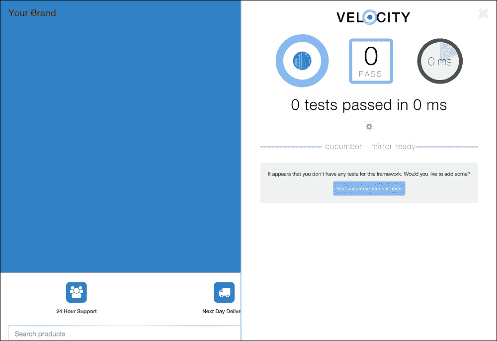
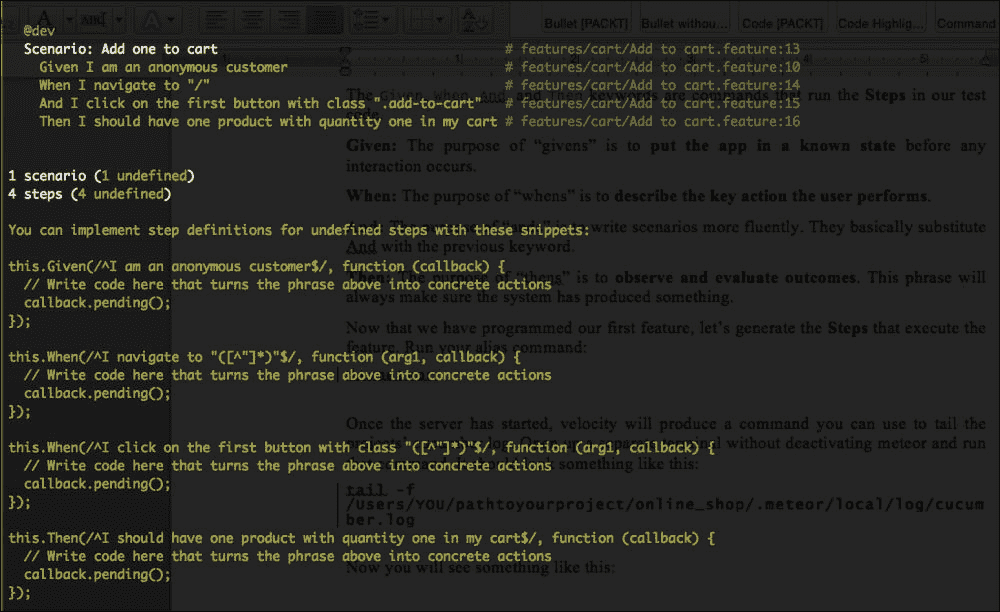

# 第五章 测试模式

本章将介绍确保我们的代码易于维护的测试模式。通过这些模式，您将学习如何实现回归测试——一种在代码投入生产之前识别新代码是否破坏旧代码的方法。构建测试对于维护代码和与他人协作至关重要。您将学习以下主题：

+   行为测试

+   单元测试

在 Meteor 中进行测试仍在积极开发中，但我们将要介绍的功能是基本的，不太可能发生变化。

# 行为测试

行为测试也被称为端到端测试。行为测试的目的是简单的：确保项目的某个功能正在工作。功能指的是应用程序背后的业务逻辑。例如，我们当前项目的功能之一是在我们的着陆页中查看产品列表。另一个功能是能够将可变数量的产品添加到订单中。

要在 Meteor 中运行行为测试，我们实际上需要构建一个可以访问我们的网站并尝试使这些功能工作的机器人。虽然这听起来很复杂，但与 Cucumber 结合时，Meteor Velocity 项目简化了其中许多操作。

Velocity 是一个为其他测试框架奠定基础的项目。它通过创建测试可以运行的项目的镜像来实现。

Cucumber 是一个基于示例的测试框架。它的目的是在编程之前用简单的英语描述应用程序功能。在协作环境中，这些测试是最重要的，因为它们确保应用程序按预期运行。我们现在将使用 Cucumber 包，因为它是目前唯一支持行为测试的测试框架之一。

要构建测试，我们首先需要安装`xolvio:cucumber`包：

```js
meteor add xolvio:cucumber

```

此包会自动安装 Velocity 以及所有其他必需的包。现在运行 Meteor 命令以启动服务器。以下将发生以下两件事：

+   如果有要运行的测试，将打开一个新浏览器窗口

+   当前项目将在右上角有一个点

我们称之为**镜像**的新浏览器窗口是运行我们定义的所有行为测试的客户端。虽然这很好，但每次运行 Meteor 命令时都打开和关闭第二个浏览器窗口很烦人。

要消除第二个浏览器窗口，我们可以使用`phantomjs`来运行测试。为此，我们将简单地使用一些设置运行 Meteor 命令：

```js
SELENIUM_BROWSER=phantomjs meteor

```

PhantomJS 是一个无头浏览器。无头浏览器是一个没有**图形用户界面**（**GUI**）的网页浏览器（如 Safari 和 Chrome）。换句话说，它是一个为机器人设计的浏览器，这正是我们的机器人需要运行测试的。

让我们使用此命令创建一个自定义的 Meteor 别名。使用您喜欢的文本编辑器打开`~/.bash_profile`目录。如果您使用 Sublime Text 3，可以运行以下命令：

```js
sublime ~/.bash_profile

```

在此文件中，将此行添加到文档的末尾：

```js
# ~/.bash_profile

alias devmeteor='SELENIUM_BROWSER=phantomjs meteor'
```

现在，完全退出您的终端，然后再次打开它。前往您的项目，并运行 `devmeteor` 命令以启动您的项目。

前往项目 URL。在这里，您将注意到项目右上角有一个蓝色圆圈。点击此按钮以显示 velocity 测试仪表板。每次测试失败时，您将在这里看到失败的原因。每次代码发生变化时，所有测试都会重新运行。



让我们从构建我们的第一个行为测试开始。在这个测试中，我们将检查我们是否可以向订单中添加项目。为此，我们需要编程两个关键组件：

+   功能

+   步骤

**步骤**基本上是 JavaScript 或 CoffeeScript 中的代码片段，用于解释**功能**。在编写功能后，步骤片段会自动生成。因此，我们需要首先编写功能的描述。

我们所有的测试都将保存在 `/tests` 目录下。行为测试将始终放在 `/cucumber` 文件夹下。在撰写本书时，这已经成为强制性的，因为 Velocity 仅在以下特殊目录下运行：

```js
# /tests/cucumber/features/cart/add to cart.feature

Feature: Add to Cart

  As a customer
  I want to add items to my cart
  So I can checkout

  Background:
    Given I am an anonymous customer

  @dev
  Scenario: Add one to cart
    When I navigate to "/"
    And I click on the first button with class ".add-to-cart"
    Then I should have one product with quantity 1 in my cart
```

注意，文件以 `.feature` 结尾，位于 `/features` 目录下。将文件放置在 `features` 目录下对于测试套件能够识别您的功能文件也是强制性的。

此文件是用 Gherkin 语言编写的。如果您想添加注释，可以使用井号（`#`），就像我们在 CoffeeScript 中做的那样。`Feature` 关键字描述了功能；这可以是任何内容，只要它能帮助您识别功能即可。在此之后，我们可以看到三行，描述了功能的目的。这种描述可以是您想要的任何内容，因为这不影响测试，但通常使用以下语法来帮助识别功能是否有用：

```js
  As a [role]
  I want [feature]
  So that [benefit]
```

接下来，我们将找到 `Background` 和 `Scenario` 关键字。两者都是一系列导致结果的操作。对于每个功能，可以有多个场景来测试功能的各个部分。`Background` 关键字定义了在运行 `Scenario` 关键字下的操作之前要执行的操作列表。尽量保持背景简短且简单，并记住它们将为每个场景运行。

此外，请注意，我们在 `Scenario` 关键字上方有一个 `@dev` 关键字；此关键字控制 `Scenario` 将在哪里运行。如果您不包含关键字，它只有在您在终端中运行 `meteor --test` 时才会运行。如果您包含 `@dev`，则测试将在您对 Web 应用程序进行更改时每次运行。此外，您还可以包含 `@ignore` 以完全忽略测试。

`Given`、`When`、`And` 和 `Then` 关键字是运行我们测试代码中的步骤的命令：

+   `Given`：`Given` 的目的是在发生任何交互之前将应用程序置于已知状态。

+   `When`：`When` 的目的是描述用户执行的关键操作。

+   `And`：`And`的目的在于更流畅地编写场景。它们基本上用前一个关键字替换`And`。

+   `Then`：`Then`的目的在于观察和评估结果。这个短语将始终确保系统已经产生了某些东西。

现在我们已经编写了第一个功能，让我们生成将执行该功能的步骤。运行您的别名命令：

```js
devmeteor

```

一旦服务器启动，Velocity 将生成一个可以用来跟踪项目`cucumber.log`的命令。在不关闭 Meteor 的情况下打开一个单独的终端并运行该命令。它应该看起来像这样：

```js
tail -f /Users/YOU/pathtoyourproject/online_shop/.meteor/local/log/cucumber.log

```

现在，您将看到类似以下内容：



如果您不这样做，您可以在不离开`cucumber.log`的情况下重新启动 Meteor 项目。在这里，我们可以看到该功能期望的步骤的 JavaScript 版本。让我们在特殊的`/step_definitions`目录下重写这些步骤。此目录必须始终是相关`.feature`文件的兄弟目录。

复制代码片段，并在`/tests/cucumber/features/cart/step_definitions/steps.coffee`目录下创建一个新文件。我们将把这些片段转换为 CoffeeScript，因为我们一直在使用它。您可以在[`js2.coffee`](http://js2.coffee)快速完成此操作。

注意到每个函数都在最后传递一个`callback`变量并调用`pending()`函数。当测试运行时，这表明函数尚未构建，并在 Cucumber 日志中显示为挂起。我们在完成与函数的工作后可以移除`callback`变量。注意，也会传递参数。

使用此代码运行测试将不会工作；我们需要正确初始化测试。为此，我们首先使用 CoffeeScripts 的`do`函数并将命令附加到`module.exports`函数。您需要为每个测试文件执行此操作：

```js
# /tests/cucumber/features/cart/step_definitions/steps.coffee

do ->
  'use strict'

  module.exports = ->
    @Given ...
    @When ...
    @Then ...
```

现在测试实际上正在运行，我们可以深入了解。我们将首先解决的函数是`Given`。`Given`需要确保用户是完全新的并且没有任何活跃的订单。为此，我们将使用**固定装置**。固定装置是仅在测试中可用的`Meteor.methods`。我们可以使用这些方法来清除我们的数据库或添加种子数据。让我们首先创建一个确保用户是匿名的固定装置，以及一个清除所有订单的固定装置：

```js
# /tests/cucumber/fixtures/cart_fixtures.coffee

do ->
  'use strict'

  Meteor.methods
    "anonymous_user": ->
      if @userId
        @setUserId null

    "reset_orders": ->
      Orders.remove {}
      OrderDetails.remove {}
```

现在，我们可以在`Given`函数（或任何其他函数）中使用`@server.call`函数调用这些方法：

```js
# /tests/cucumber/features/cart/step_definitions/steps.coffee

do ->
  'use strict'

  module.exports = ->
    @Given /^I am an anonymous customer$/, ->
      @server.call "reset_orders"
      @server.call "anonymous_user"
```

注意，我们正在使用`@server`，但我们可以使用`@client`，因为这是一个对`Meteor.method`的调用。现在让我们编写`When`：

```js
# /tests/cucumber/features/cart/step_definitions/steps.coffee

do ->
  'use strict'
  ...

  module.exports = ->
    url = require('url')
    @Given /^I am an anonymous customer$/, ->
      ...

    @When /^I navigate to "([^"]*)"$/, (path) ->
      @browser
        .url url.resolve(process.env.ROOT_URL, path)

    @When /^I click on the first button with class "([^"]*)"$/, (button) ->
      @browser
        .waitForExist "body *"
        .waitForVisible ".product"
        .element ".product:nth-child(1) #{button}"
        .click()
```

`@browser`对象提供了 webdriver 实例的访问权限。这意味着我们可以使用 webdriver 函数来模拟用户点击、检查元素和浏览网络。注意，我们也可以通过`require`函数要求 NPM 模块。在这种情况下，我们将要求`url`模块来帮助识别路由。

第一个`When`函数需要一个由正则表达式定义的单个参数。在这种情况下，它是`path`变量。参数将按它们在正则表达式中定义的顺序逐个列出，并以回调函数（我们不需要使用）结束：`(arg1, arg2, arg3, callback) ->`。

第二个`When`函数需要在对其进行操作之前等待 DOM 加载。为此，我们将使用`waitForExist`和`waitForVisible`函数。如果元素没有渲染，则由于该函数中的超时，测试将失败。记住，如果你想要查看测试正在做什么，你可以浏览到你的镜像。

你可以在[`webdriver.io/api.html`](http://webdriver.io/api.html)找到可用的 webdriver 函数的完整列表，但这里列出了你将最常使用的几个：

| 函数 | 使用 |
| --- | --- |
| `waitForExist(selector[,timeout,reverse])` | 默认超时时间：`500`，反向：`false`。这等待一个元素在 DOM 上渲染。将`reverse`标志设置为`true`将等待元素停止存在。 |
| `waitForVisible(selector[,timeout,reverse])` | 默认超时时间：`500`，反向：`false`。这等待一个元素变得可见（检查显示 CSS 属性是否未设置为任何值，元素是否不在视口中，以及`opacity`CSS 属性是否未设置为`0`）。将`reverse`标志设置为`true`将等待元素变得不可见。 |
| `click(selector)``doubleClick(selector)``leftClick(selector)``rightClick(selector)` | 这将点击一个元素。可以接受 CSS 选择器。 |
| `setValue(selector,values)``addValue(selector,values)` | 这向元素发送一系列按键。也可以使用 Unicode 字符来模拟诸如退格键和箭头键等操作。`addValue`函数将附加到一个已设置的值上。 |
| `getText(selector)``getValue(selector)` | 这将获取节点文本或输入值。 |
| `getCssProperty(selector,property)``getAttribute(selector,attribute)` | 这将获取 CSS 属性或 DOM 元素属性的数据。`property`变量将返回一个对象而不是字符串。 |
| `then(function(valueFromGet))` | 这使用从任何`get`函数获得的数据。第一个参数总是`get`函数的值。 |

现在让我们构建我们的`Then`函数，并使用**Chai**来评估一切是否按预期进行：

```js
# /tests/cucumber/features/cart/step_definitions/steps.coffee

do ->
  'use strict'

  module.exports = ->
    ...

    @Then /^I should have one product with quantity one in my cart$/, ->
      @browser
        .waitForVisible ".order_detail"
        .getText ".order_detail:nth-child(1) .quantity"
        .then (quantity) ->
          expect quantity
            .to.equal "1"
```

在这里，我们使用了`then`函数来处理`.quantity`节点的值。我们使用 Chai 来检查获取的值是否正确。Chai 函数的列表很长，你将发现自己会使用它们中的大多数。它们很容易猜测！你可以在这里找到所有这些函数：[`chaijs.com/api/bdd`](http://chaijs.com/api/bdd)。

# 单元测试

单元测试比行为测试更容易构建。这些测试确保只有 Web 应用程序的一部分工作正确，例如`Meteor.method`或模板辅助函数。

单元测试使查找损坏行为测试中的错误更快。它们应该主要用于容易损坏的部分，例如发布者或特定的辅助工具。

要运行单元测试，我们将使用`sanjo:jasmine`包：

```js
meteor add sanjo:jasmine

```

现在创建两个目录：`/jasmine/client/integration` 和 `/jasmine/server/integration`。这些是`jasmine`运行测试的特殊目录。让我们为`products`发布者快速构建一个测试：

```js
# /tests/jasmine/client/integration/publishers/products_pub_test.coffee

do ->
  'use strict'

  describe "Products publisher", ->
    it "should return product data", ->
      # SETUP
      subscription = Meteor.subscribe("products")

      if subscription.ready()
        # EXECUTE
        product = Products.findOne()

        # VERIFY
        expect product
          .not.toBeUndefined()
```

Jasmine 很简单。首先，您使用`describe`函数描述功能对象，然后使用`it`函数解释功能中应该工作的每个部分。通常将评估函数分为三个块：`SETUP`、`EXECUTE`和`VERIFY`。在设置阶段，我们确保一切准备就绪以便测试运行，然后执行一系列函数，最后使用 Chai 表达式验证测试是否通过或失败。

单元测试非常适合测试代码中的特殊之处，这些特殊之处用户可能看不到在视觉上反映出来。请查看 Jasmine 文档中的[`jasmine.github.io/2.3/introduction.html`](http://jasmine.github.io/2.3/introduction.html)，以获取一系列优秀的示例。

# 摘要

在本章中，我们学习了如何为我们的 Web 应用程序构建简单的测试。此外，我们还了解到，它们是团队和非团队环境中维护应用程序开发过程中的关键部分。行为测试是确保应用程序按预期运行所有功能的测试，而单元测试是确保特定弱点按预期运行的测试。在测试时要小心。虽然保持测试活跃以进行维护很重要，但更重要的是关注产品的编程。如果您没有时间编写完整的行为测试，至少为对 Web 应用程序运行至关重要的函数编写一个单元测试。

在下一章中，我们将介绍如何将我们的 Web 应用程序部署到生产质量的服务器上，以及如何在应用程序运行后轻松识别应用程序产生的错误。
