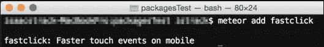

# 第二章. 使用包进行定制

在本章中，我们将涵盖以下主题：

+   添加 Meteor 包

+   移除 Meteor 包

+   使用 Atmosphere 发现新包

+   使用 Iron Router 创建多页面应用程序

+   构建自定义包

+   使用 npm 模块

+   将自定义包发布到 Atmosphere

# 简介

Meteor 中的包系统使你的开发生活变得更加轻松。这也体现了 Meteor 的核心原则之一——模块化开发。如果你想使用整个默认的 Meteor 堆栈，那太好了！如果你不喜欢某个部分，并想用第三方包替换它，那也很好！这完全取决于你。Meteor 允许你快速添加和删除功能，使用其他人共享的最新代码，并创建你自己的可重用代码段。本章将为你提供充分利用 Meteor 包系统所需的食谱。

# 添加 Meteor 包

核心 Meteor 开发组（**MDG**）已经为你开发了超过 140 个包供你使用。这些包提供了从简单的显示调整到完全集成的账户管理等功能和功能。这些包不仅很有用，而且非常容易添加到你的项目中。除了核心 MDG 包之外，还有数百个第三方包可供选择，所有这些包都是免费的，并且可以同样容易地添加。这个食谱将向你展示如何将 Meteor 包添加到你的项目中。

## 准备工作

你需要安装 Meteor 并创建一个项目。任何项目都可以。你还应该打开一个终端窗口，导航到你的项目根目录，例如，如果你的项目名称是`packagesTest`，位于`~/Documents/MeteorProjects`文件夹中，你需要在终端窗口中输入以下命令：

```js
$ cd ~/Documents/MeteorProjects/packagesTest

```

## 如何做...

让我们以安装`fastclick`包为例。这个包消除了移动/触摸屏的 300 毫秒延迟。

在你的终端窗口中，在根目录下，输入以下命令：

```js
$ meteor add fastclick

```

这将在你的项目中安装 bootstrap 包，并显示类似以下的消息：



## 它是如何工作的...

`meteor add [包名]`命令告诉 Meteor 在 Meteor 包注册表中查找命名的包，并将适当的文件复制到你的项目中。此外，包名被添加到你的项目的声明文件中，这样当 Meteor 启动你的项目时，将添加并执行命名的项目文件。

## 还有更多...

如前所述，你可以使用相同的`meteor add`命令安装第三方包。核心 MDG 包和第三方包之间的区别在于，第三方包有创建者的账户 ID 作为前缀，例如，要添加优秀的 HammerJS 包到你的应用中，你需要输入以下命令：

```js
$ meteor add chriswessels:hammer

```

本章中的其他食谱将指导你发现和实现第三方包，所以请保持关注！

## 参见

+   本章中的 *使用 Atmosphere 发现新包* 菜谱

# 移除 Meteor 包

移除 Meteor 包与添加它们一样简单。这个菜谱将向你展示如何快速移除一个 Meteor 包。

## 准备工作

你需要安装 Meteor 并创建一个项目。你还应该打开一个终端窗口，并导航到你的项目根目录。例如，如果你的项目名称是 `packagesTest`，位于 `~/Documents/MeteorProjects` 文件夹中，请在终端窗口中输入以下命令：

```js
$ cd ~/Documents/MeteorProjects/packagesTest

```

## 如何操作...

让我们移除 `insecure` Meteor 包。在你的终端窗口中，输入以下命令：

```js
$ meteor remove insecure

```

这将移除 `insecure` 包。

## 工作原理...

`meteor remove [包名]` 命令将指导 Meteor 在你的项目声明文件中查找指定的包，并从你的项目中移除该包的声明和源文件。

## 更多...

有时候检查并查看你添加到项目中的包非常有帮助。为了查看这个列表，请在你的终端窗口中输入以下命令：

```js
$ meteor list

```

这将给你一个包含在你项目中的所有包的快速列表。

# 使用 Atmosphere 发现新包

Meteor 是一个新兴的平台，每天都在增长其受欢迎程度。Meteor 社区几乎每天都在提出新的包和与现有 JavaScript 库的集成。由于核心 Meteor 团队没有时间测试和应用社区制作的每个新包，因此创建了一个包注册表，它具有简化的安装流程。这个包注册表被称为 Atmosphere。Atmosphere 拥有干净、简单的用户界面，允许你通过流行度搜索、评分和发现新包。这个菜谱将向你展示如何使用 Atmosphere 来查找和实现 Meteor 和第三方包。

## 准备工作

这里实际上没有什么可做的，但你绝对需要安装 Meteor 并创建一个项目，以便立即开始使用 Atmosphere 上列出的包！

## 如何操作...

要使用 Atmosphere 发现新包，请按照以下步骤操作：

1.  在浏览器中，导航到 [`atmospherejs.com`](https://atmospherejs.com)。你应该会看到一个带有居中搜索输入框的非常简单的页面。让我们查找官方的 Twitter `bootstrap` 包。

1.  输入单词 `bootstrap` 并观察搜索结果随着你的输入出现。你应该会看到以下截图类似的内容：

    你会注意到搜索结果中的每个卡片底部都有一些统计数据。向下箭头统计是下载次数，这（与包的年龄）是搜索结果排名中的主要统计指标。你会看到一个星号，代表有多少开发者将该包标记为收藏/星标。最后，你将看到一个背景中的灰色线条，表示随时间的变化趋势。

    ### 注意

    第二个结果（`twbs:bootstrap`）是官方的 Twitter Bootstrap 包。

1.  点击`twbs:bootstrap`卡片，将出现该包的概述。你将看到有关该包的更多信息。这包括使用说明、GitHub 仓库链接（如果有的话）、包的扩展历史、相关包、依赖项和依赖包。在页面顶部将会有添加包到项目的说明：

1.  你可以复制文本并在终端窗口中执行它，在你的根项目文件夹中，如下所示：

    ```js
    $ meteor add twbs:bootstrap

    ```

    在简短的下载过程之后，官方 Bootstrap 包将被安装到你的项目中。

    如前例所述，Atmosphere 有几种额外的发现选项。有链接到包贡献者个人资料（这样你可以看到他们可能贡献的其他包），如下所示：

    

    如以下截图所示，有相关包的链接：

    

    如以下截图所示，还有链接到依赖项和依赖包：

    

任何这些链接都将帮助你发现其他可以补充原始包并可能在你的应用程序中很有用的包。

在 Atmosphere 中查找包的选项还有更多。如果你导航回主页[`atmospherejs.com/`](https://atmospherejs.com/)并向下滚动，你会看到**趋势**、**最常用**、**最近**和**热门搜索**等部分。所有这些都值得浏览，以发现一些最新和最好的可用包：


随意探索和发现。你会在 Atmosphere 中发现一些隐藏的宝藏，而且最重要的是，你会意识到几乎每样东西都有一个 Meteor 包。如果没有，你可以创建一个，就像本章后面找到的“构建自定义包”食谱一样。

## 它是如何工作的…

Atmosphere 网站只是简单地在 Meteor 包仓库的顶部添加了一个用户友好的包装。它做得非常好，该网站的贡献者/创建者应受到赞扬。Atmosphere 正在不断改进，如果你愿意，你可以为其成功做出贡献。你可以通过访问 Atmosphere FAQ 来查看即将推出什么内容，该 FAQ 位于[`atmospherejs.com/i/faq`](https://atmospherejs.com/i/faq)。

## 还有更多…

如果你急于行事或者非常喜欢命令行，你可以在项目根目录的终端窗口中执行搜索。以下是一个基于 CLI 的搜索示例：

```js
$ meteor search bootstrap

```

结果将以字母顺序列出，每个结果都有简要说明：


请注意，这个结果可能相当庞大（没有结果优先级），因此使用基于 CLI 的搜索的有效性会有所不同。

## 参见

+   本章中的*构建自定义包*和*将自定义包发布到 Atmosphere*配方

# 使用 Iron Router 创建多页面应用程序

Iron Router 是一个非常有用的 Atmosphere 包。它允许你快速轻松地向你的 Meteor 项目添加多个服务器页面。这个配方将向你展示如何配置你的项目以使用 Iron Router。

## 准备工作

你需要安装 Meteor。你还需要一个空的 Meteor 项目（参见第一章中的*设置你的项目文件结构*配方，*优化你的工作流程*）。

最后，你需要在你的 Meteor 项目中添加 Iron Router 包。你可以参考本章前面找到的*添加 Meteor 包*配方，或者在项目根目录的终端窗口中输入以下命令：

```js
$ meteor add iron:router

```

## 如何做到这一点...

我们将创建一个非常简单的多页面示例，并使用一个全新的空白项目来完成。

1.  首先，设置多个页面的路由路径。在你的项目`both`子文件夹中创建一个名为`router`的子文件夹。这可以在导航到你的项目根文件夹后，在终端窗口中执行以下命令来完成：

    ```js
    $ mkdir both/router

    ```

1.  现在，在`router`文件夹中创建一个名为`router.js`的新文件。在文本编辑器中打开`router.js`文件，添加以下代码，并保存你的更改：

    ```js
    Router.configure({ layout:'routeexample' });

    Router.map(function (){ this.route('thing1', { path: '/' });
      this.route('thing2', { path: '/second' });
    });
    ```

1.  接下来，在编辑器中打开位于`client`子文件夹中的`main.html`文件。将以下模板声明添加到文件的底部并保存更改：

    ```js
    <template name="routeexample">
    {{yield}}
    </template>

    <template name="thing1">
    <div> I am the FIRST page</div>
    </template>

    <template name="thing2">
    <div> I am the SECOND page</div>
    </template>
    ```

1.  现在，在编辑器中打开位于`[项目文件夹]/client/scripts/main.js`的`main.js`文件。定位到`Template.hello.events`方法，并将`'click button'`函数体更改为以下内容：

    ```js
    Template.hello.events({
        'click button' : function () {
          Router.current().route.getName()=='thing1'? Router.go('thing2'): Router.go('thing1');
        }
      });
    ```

1.  使用`meteor`命令保存所有文件的更改并运行你的应用程序。

    当你在浏览器中导航到你的项目主页（`http://localhost:3000/`）时，你应该看到以下截图类似的内容：

    

1.  点击标记为**点击我**的按钮，或者导航到`http://localhost:3000/second/`，屏幕应该变为以下内容：

1.  你可以通过点击屏幕上的按钮在两个页面之间继续切换。

## 它是如何工作的...

Iron Router 使用你的 URL 中的路径在客户端和服务器中调用事件。在大多数情况下（除非你明确使用`where`参数设置 Iron Router 路径在服务器上渲染），事件和随后的渲染仅在客户端发生。

从本质上讲，Iron Router 使用路径作为参数列表，根据路径中包含的信息调用函数并渲染适当的模板。

让我们分析一下我们刚刚输入的代码，以启动 Iron Router，从 `router.js` 开始：

```js
Router.configure({
     layout:'routeexample'
});
```

这段代码片段告诉 Iron Router 使用名为 `routeexample` 的 `<template>` 标签作为页面的主要/默认模板。

我们在 `main.html` 中创建了 `routeexample` 模板，如下所示：

```js
<template name="routeexample">
{{yield}}
</template>
```

在这个模板中找到的 `yield` 语句被称为主要 `yield`。它是一个占位符，用于其他模板，一旦 Iron Router 完成映射过程，这些模板将被渲染。

继续阅读，在 `router.js` 文件中，我们有 `Router.map` 函数：

```js
Router.map(function (){
  this.route('thing1', {
    path: '/'
  });
  this.route('thing2', {
    path: '/second'
  });
});
```

这创建了两个映射的路由，使用 `this.route` 函数。在每个函数调用中，第一个参数指定了路由的名称，因为我们没有指定特定的模板，这也意味着它也隐含了要使用的模板名称。在这种情况下，我们使用了 `thing1` 和 `thing2` 模板，这些模板我们在 `main.html` 中创建：

```js
<template name="thing1">
<div> I am the FIRST page</div>
</template>

<template name="thing2">
<div> I am the SECOND page</div>
</template>
```

这些模板非常简单，这也是它们在我们的例子中易于理解的原因。每个模板都会渲染一个简单的 `div` 元素，其中包含一个消息，指示用户当前所在的页面。

回到 `router.js`，每个 `this.route` 函数调用中都有一个路径参数。这个路径参数告诉 Iron Router 在 URL 中寻找什么以确定映射。在我们的第一个页面（渲染 `thing1` 模板）的情况下，`path` 元素被设置为 "/"，即根路径。在我们的第二个页面（渲染 `thing2` 模板）的情况下，`path` 被设置为 "/second"。

到目前为止，Iron Router 已经正确映射，这意味着它将根据映射的路由渲染适当的模板。我们希望使在两个路由之间切换变得容易，因此我们修改了 `main.js` 脚本，如下所示：

```js
Template.hello.events({
    'click button' : function () {
      Router.current().route.getName()=='thing1'? Router.go('thing2'): Router.go('thing1');
    }
  });
```

现在，当我们的按钮被点击时，我们会检查当前映射的路由名称（通过 `Router.current().route.getName()` 获取）是否为 `thing1`。如果是，我们告诉 Iron Router 将当前渲染的模板（以及 URL 路径）更改为名为 `thing2` 的第二个模板，其 `path` 值设置为 "/second"。如果当前映射的路由不是 `thing1`，则切换回原始映射的路由。

`Router.go` 语句更改了 URL 路径，从而触发了事件，以渲染适当的模板并将其插入到主要 `yield` 中。

## 还有更多…

Iron Router 是一个非常复杂且强大的包，它包含许多有用的功能，例如预渲染事件、设置数据上下文以及访问服务器端函数。如果你打算构建一个多页面的 Meteor 应用程序，你将需要仔细阅读完整的文档，该文档可在 [`github.com/EventedMind/iron-router`](https://github.com/EventedMind/iron-router) 找到。

## 参见

+   在第十二章 创建有用的项目 的 *使用 Iron Router 创建完整的应用程序* 菜谱，*创建有用的项目*

# 构建自定义包

随着你对 Meteor 的熟悉程度提高，你将想要开始创建自己的自定义包，该包将整合你在多个项目中可能发现有用的代码。这个菜谱将指导你创建自己的个人 Meteor 包的基础知识。

## 准备工作

制作这个食谱只需要 Meteor 和一个文本编辑器。

## 如何操作…

我们将创建一个包，它将使我们能够轻松地在客户端网页控制台以及服务器终端控制台中写入控制台。

1.  要创建一个新的基线包，打开一个终端窗口并导航到你希望你的包驻留的位置。一旦到达那里，执行以下命令：

    ```js
    $ meteor create --package [myMeteorID]:testpack

    ```

    确保将 `[myMeteorID]` 替换为你自己的 Meteor 开发者账户 ID 或你所属的 Meteor 组织 ID，例如（在本章的其余部分），我们将使用 `packtmeteor` 组织。因此，我们的命令将如下所示：

    ```js
    $ meteor create --package packtmeteor:testpack

    ```

1.  我们现在将添加我们包的代码。打开名为 `testpack.js` 的文件，并添加以下代码：

    ```js
    TestPack = {
      log: function(msg){
        console.log(msg);
        Meteor.call('serverlog',msg);
      }
    };
    ```

    保存你的更改，并在同一文件夹中创建一个名为 `servertestpack.js` 的新文件。打开此文件进行编辑，并添加以下代码：

    ```js
    Meteor.methods({
      serverlog : function(msg){
        console.log(msg);
      }
    });
    ```

1.  我们现在需要对 `package.js` 进行一些修改，以确保我们的包能够正常工作。打开 `package.js` 并修改 `Package.onUse()` 方法，使其看起来如下所示：

    ```js
    Package.onUse(function(api) {
      api.versionsFrom('1.0.3.2');
      api.addFiles('testpack.js', 'client');
     api.addFiles('servertestpack.js', 'server');
    });
    ```

    接下来，在 `Package.onUse()` 方法中添加以下代码，紧接在最后一个 `api.AddFiles()` 调用之后：

    ```js
    Package.onUse(function(api) {

      api.addFiles('servertestpack.js', 'server');

     if (api.export){
     api.export('TestPack');
     }
    });
    ```

    最后，通过从测试文件名中移除前缀来修改 `Package.onTest()` 方法，如下所示：

    ```js
    Package.onTest(function(api) {
      api.use('tinytest');
      api.use('packtmeteor:testpack');
      api.addFiles('testpack-tests.js');
    });
    ```

1.  保存所有更改，你的包就准备好在应用程序中使用。选择一个你正在进行的项目，或者使用 `meteor create` 命令创建一个默认的 Meteor 项目，并在 `[项目根]/packages/` 中添加一个子文件夹。将 `testpack/` 文件夹复制并粘贴到 `[项目根]/packages/` 文件夹中。然后，在终端窗口中，执行以下命令：

    ```js
    $ meteor add packtmeteor:testpack

    ```

    你的自定义包将注册用于你的项目，你现在可以启动你的应用程序：

    ```js
    $ meteor

    ```

    打开浏览器，导航到 `http://localhost:3000` 并打开网页控制台。在网页控制台中，输入以下命令：

    ```js
    > TestPack.log('my package is worky!')

    ```

    你应该在浏览器控制台中看到以下屏幕：

    

    你应该在服务器终端控制台中看到以下内容：

    

恭喜！你刚刚创建了自己的个人包。

## 工作原理…

在 Meteor 中，包实际上只是有组织的文件集合，其中有一个配置文件告诉 Meteor 如何使用这些文件。

在这个例子中，我们使用 `meteor create --package` 命令创建了一个默认的包模板。请注意，我们遵循了 `[所有者]:[包名]` 的命名约定，这是 Meteor 所要求的，如果我们想在 Atmosphere 上发布此包供他人使用（有关详细信息，请参阅本章中的 *将自定义包发布到 Atmosphere* 菜单）。

一旦创建，我们就添加了我们的功能，这非常简单。我们只是在客户端和服务器上调用 `console.log()`。

然后，我们修改了配置文件，该文件总是命名为 `package.js`。以下表格显示了该文件包含的三个部分：

| `Package.describe()` | 这包含了我们的包的名称、摘要和版本号。 |
| --- | --- |
| `Package.onUse()` | 这列出了依赖项并公开了我们包中可用的方法。 |
| `Package.onTest()` | 这列出了测试期间要运行的依赖项和测试方法。 |

对于这个配方，我们没有修改 `Package.describe()` 方法。Meteor 自动为我们创建了这一部分，并给了我们一个 *版本号*，这是必需的。

### 小贴士

包的版本号遵循 **语义化版本规范（SemVer）**（3 个数字+一个可选的包装，例如 `1.0.2-rc_beta`）。有关 SemVer 规范的更多信息，请参阅 [`semver.org/`](http://semver.org/)

我们的大部分更改发生在 `Package.onUse()` 中，所以我们将逐项说明这个方法。

`api.versionsFrom()` 方法指定了你的包中使用的核心包应该来自哪个 Meteor 版本。这很有用，因为 Meteor 更新得很频繁，而且一些运行你的包所需的依赖项可能在后续版本中发生变化。此方法允许你将你在应用程序中使用的依赖包的发布版本“冻结”，以防止兼容性问题。

`api.addFiles()` 方法允许我们包含在包目录中找到的文件，并指定它们是客户端特定还是服务器特定。在我们的例子中，我们使用 `api.addFiles()` 与 `client` 参数一起告诉 Meteor，`testpack.js` 文件是客户端特定的。然后我们使用 `server` 参数告诉 Meteor，`servertestpack.js` 文件是服务器特定的。

然后，我们使用了 `api.export()` 方法来声明/暴露 `TestPack` 对象。这使得我们能够在浏览器的网页控制台中使用 `TestPack.log()` 调用。

最后，我们有 `Package.onTest()` 方法。它包含两个 `api.use()` 方法调用，这些调用声明了在测试期间运行 `testpack-test.js` 文件所需的包依赖项。

### 小贴士

`api.use()` 方法不仅限于测试。你还可以在 `Package.onUse()` 方法中使用它来包含 MDG 核心或第三方包。

完成我们的修改后，我们将整个包复制到了项目中的 `packages/` 子文件夹。这对于任何未部署的包都是必要的。当你使用 `meteor add` 命令添加包时，Meteor 会检查两个地方：在线 Meteor 包仓库（Atmosphere）和 `[项目根]/packages/` 子文件夹。在这种情况下，因为我们的包没有部署到 Atmosphere，我们在 `packages/` 子文件夹中有一个包的副本。

## 还有更多...

存在着几种其他配置包的选项（其中一些包含在本章的其他菜谱中）。这些选项的完整列表可以在 Meteor 文档中找到，文档位于 [`docs.meteor.com/#/full/packagejs`](http://docs.meteor.com/#/full/packagejs)。

## 相关内容

+   本章中的 *Using npm modules* 和 *Publishing custom packages to Atmosphere* 菜单

+   第十一章中的 *Building custom server methods* 菜单，*利用高级功能*

# 使用 npm 模块

**Node 包管理器**（**NPM**）有数千个模块可供使用。知道如何在 Meteor 项目中添加 npm 模块，你可以访问所有这些模块。本菜谱将向你展示如何做到这一点。

## 准备工作

你需要确保你已经安装了 Meteor 和 Node/npm。

你还需要一个使用自定义构建包的项目。我们将使用本章中 *Building a custom package* 菜单中的项目。

## 如何操作...

我们首先需要添加一个对我们要添加的 npm 包的引用，在这个例子中，将是 `colors` 模块。

1.  在你的自定义包（应用 `packages/` 子文件夹中的那个）的 `package.js` 文件中，将 `Npm.depends` 语句添加到文件末尾，如下例所示：

    ```js
    Npm.depends({
        "colors": "0.6.2"
    });
    ```

1.  现在我们需要向 `colors` 模块添加一个 `Npm.require` 引用，并将我们的 `console.log()` 命令更改为使用彩虹水果口味。将你的 `server-test.js` 文件修改如下例所示：

    ```js
    var colors = Npm.require('colors');

    Meteor.methods({
      serverlog : function(msg,warn){
        console.log(msg.rainbow);
      }
    });
    ```

1.  保存你的更改，我们就可以测试更新后的包了。在浏览器中导航到 `http://localhost:3000`，打开浏览器控制台，并多次执行以下命令：

    ```js
    > TestPack.log('rainbows and unicorns')

    ```

1.  如果你切换到你的控制台窗口，你应该会看到一个多彩的响应，如下面的截图所示：

## 它是如何工作的...

在 `package.js` 文件中的 `Npm.depends` 声明告诉 Meteor，每次启动时，它需要安装列出的 npm 模块。在这种情况下，我们告诉 Meteor 去 npm 注册表中获取 `colors` 模块，版本 `0.6.2`。

在 `server-test.js` 中的 `Npm.require` 函数调用使 `colors` 模块的功能在服务器上可用。现在，每次我们进行 `console.log()` 调用时，传递给调用的字符串可以添加一个 `.color` 引用。在我们的例子中，我们选择了 `.rainbow`，这使得打印到控制台中的每个字母都显示为不同的颜色。

### 小贴士

要查看 npm `colors` 模块中所有可用的各种选项，请访问 [`npmjs.org/package/colors`](https://npmjs.org/package/colors)。

## 更多内容…

您可以在自定义 Meteor 包中使用任何您想要的 npm 模块。其中一些依赖于异步方法和事件，因此您必须使用特定的异步 Meteor 方法来包装这些模块。您可以在第十一章（[part0083.xhtml#aid-2F4UM1 "第十一章。利用高级功能"）中了解更多关于这些方法的信息，*利用高级功能*。

## 相关内容

+   第八章（[part0069.xhtml#aid-21PMQ1 "第八章。集成第三方库"）中关于*直接使用 npm 包*的配方，*集成第三方库*

+   第十一章（[part0083.xhtml#aid-2F4UM1 "第十一章。利用高级功能"）中关于*处理异步方法和使用异步函数*的配方，*利用高级功能*

# 将自定义包发布到 Atmosphere

当您创建了一个有用的包并希望与世界分享时，Atmosphere 是您的最佳选择。这个配方将向您展示如何上传您的自定义包到 Atmosphere，并提供了一些维护您包的最佳实践。

## 准备工作

要创建一个快速 Atmosphere 包，请完成本章中找到的*使用 npm 模块*配方。

您还需要在 GitHub 上创建一个空白的仓库。假设您有 GitHub 登录，请导航到首页([`github.com`](https://github.com))并创建一个新的仓库：


为您的仓库添加标题和描述，然后点击标记为**创建仓库**的按钮。

要填充您的新 Git 仓库，您需要 Git URL，可以从您新 Git 项目的首页复制。它看起来可能像[`github.com/strack/packt-testpack.git`](https://github.com/strack/packt-testpack.git)。

记住这个 URL，因为您将使用它来填充您新仓库的内容。

## 如何操作…

要注册和上传我们的包，我们需要检查我们的配置文件，将我们的代码上传到 GitHub，然后部署我们的包。

1.  要配置`package.js`，请打开位于您包根目录下的`package.js`文件。在我们的例子中，该文件位于`[项目根]/packages/testpack/package.js`。我们首先将修改摘要，如下例所示：

    ```js
      // Brief, one-line summary of the package.
      summary: 'Demonstration of an Atmosphere Package',
    ```

    接下来，我们将添加 GitHub URL 到`git`属性：

    ```js
      // URL to the Git repository...
      git: 'https://github.com/strack/packt-testpack.git',
    ```

    您会注意到文档属性引用了`README.md`文件，这意味着我们的 GitHub 文档将具有双重用途。打开`README.md`并添加以下行：

    ```js
    Demonstration of an Atmosphere Package, deployed to Atmosphere
    ```

1.  要将代码推送到 GitHub，请保存所有文件，并在终端窗口中导航到您的包根目录（不是应用程序的根目录）。在我们的例子中，根目录是`[项目根]/packages/testpack/`。输入以下行以填充 GitHub 仓库：

    ```js
    $ git init
    $ git add -A
    $ git commit -m "Created color server console"
    $ git remote add origin https://github.com/strack/packt-testpack.git
    $ git pull origin master –m "initial pull"
    $ git push origin master

    ```

1.  完成后，要发布到 Atmosphere，请使用以下命令调用`meteor publish`：

    ```js
    $ meteor publish --create

    ```

    哇！您已将您的包添加到 Atmosphere。

### 小贴士

我们直接从应用程序的 `packages` 子文件夹中部署了所有包。最佳实践是在独立于任何应用程序的情况下开发和部署您的包。请参阅 *构建自定义包* 的说明。

您可以通过导航到 [`atmospherejs.com`](https://atmospherejs.com) 并按名称搜索来在 Atmosphere 上查看您的包，如下面的截图所示：


就像在 Atmosphere 中找到的任何其他 Meteor 包一样，您可以使用终端中的 `meteor add` 命令将其添加到您的任何项目中。

## 它是如何工作的…

Atmosphere 读取需要发布的 `package.js` 文件，检查所有信息是否准确，然后从 GitHub 仓库发布一个链接到您的项目。在这个特定案例中，我们在文件中添加了一个摘要，在 `git` 属性中指定了 GitHub URL，并在创建 GitHub 仓库后调用 `meteor publish` 来部署包。

## 还有更多…

更多关于如何发布到 Atmosphere 的说明可以在 [`atmospherejs.com/i/publishing`](https://atmospherejs.com/i/publishing) 找到。

## 参见

+   本章中的 *添加 Meteor 包* 和 *使用 Atmosphere 发现新包* 的说明
