# 第三章. 构建出色的用户界面

在本章中，我们将涵盖以下主题：

+   使用 Spacebars 插入模板

+   使用三重花括号插入原始 HTML

+   创建动态列表

+   使用 Bootstrap 构建平滑的界面

+   创建自定义的全局辅助函数

+   创建自定义组件

+   使用反应性 HTML 属性

+   使用动态模板

+   动画 DOM 元素

# 简介

就像 Meteor 中的其他一切一样，UI 开发被设计成简单、优雅且强大。只需几个命令，你就能创建复杂且动态的用户界面，显著加快你的原型/线框设计工作。

本章中的食谱将带你了解最常用的 UI 和模板构建技术，这些技术将成为你未来 Meteor 应用程序的基础。

# 使用 Spacebars 插入模板

**Spacebars**是 Meteor 的模板语言。在 Meteor 中，所有**文档对象模型**（**DOM**）元素都是通过 Meteor 的默认模板引擎**Blaze**程序化创建的。因此，可以使用纯 JavaScript 创建元素。然而，使用 JavaScript 创建 HTML 元素并不一定快速和简单。

受到流行的 HTML 模板语言**Handlebars**的启发，Spacebars 使得使用模板结构化和声明 HTML 元素变得极其简单。它还为你提供了访问 Meteor 所有反应性和动态功能的机会。这个食谱将向你展示如何使用 Spacebars 语法创建模板。

## 准备工作

你需要安装 Meteor 并创建一个项目。我们建议你有一个简单的项目，类似于在第一章中找到的*设置你的项目文件结构*食谱，*优化你的工作流程*，但任何项目都可以。你需要找到你的`<body>`标签，它通常位于你的`main.html`文件中。

## 如何做...

为了使这个食谱更有用，我们将创建两个模板，并使用以下步骤将一个模板嵌套在另一个模板中：

1.  首先，创建一个名为`templates.html`的文件，并将其添加到你的`client`文件夹中：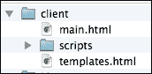

1.  在编辑器中打开`templates.html`，添加以下代码，并保存你的更改：

    ```js
    <template name="firstTemplate">
        <div id="title">This is my first ever template</div>
        <svg height="200" width="100%" id="shapes">
            {{> one}}
        </svg>
    </template>

    <template name="one">
        <circle cx="100" cy="50" r="40" stroke="#ffc348" stroke-width="3" fill="#31be4f" />
    </template>
    ```

1.  接下来，打开你的`main.html`文件（或包含你的`<body>`标签的`.html`文件）并编辑你的`body`标签，添加以下代码：

    ```js
    <body>
      {{> firstTemplate}}
    </body>
    ```

1.  保存更改，如果 Meteor 尚未运行，请启动它，并在浏览器中导航到你的 Meteor 托管页面（通常是`http://localhost:3000`）: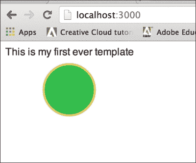

## 它是如何工作的...

我们创建了两个模板，第一个是一个非常简单的`svg`元素：

```js
<template name="one">
    <circle cx="100" cy="50" r="40" stroke="#ffc348" stroke-width="3" fill="#31be4f" />
</template>
```

我们给模板分配了一个`name`属性值为`"one"`，并添加了具有位置和外观属性的格式良好的 HTML `<circle>`元素。我们还创建了一个父模板，如下所示：

```js
<template name="firstTemplate">
    <div id="title">This is my first ever template</div>
    <svg height="200" width="100%">
        {{> one}}
    </svg>
</template>
```

此模板还有一个名称（`"firstTemplate"`）并且包含一个`<div>`元素，其中包含我们模板的标题。我们声明了一个`<svg>`元素，并使用`{{>}}`命令在`<svg>`和`</svg>`标签之间插入名为`one`的模板。

最后，在`main.html`中，我们使用`{{>}}`命令（也称为**模板包含**）在主`<body>`和`</body>`标签之间插入`firstTemplate`模板。

如您所见，我们模板的内容主要由 HTML 标签组成。这是我们 UI 的基本构建块，也是我们从一开始创建模板的方式。任何包含在双花括号（`{{…}}`）中的内容都是针对 Blaze 的命令，Blaze 是 Meteor 的模板引擎。在这种情况下，我们告诉 Blaze：

1.  将`firstTemplate`模板插入到我们的`<body>`元素中。

1.  将`one`模板插入到我们的`<svg>`元素中，在`firstTemplate`内部。

## 还有更多…

您可以在官方 Meteor 文档中阅读有关模板的所有信息，该文档位于[`docs.meteor.com/#/full/templates`](http://docs.meteor.com/#/full/templates)。

# 使用三重花括号插入原始 HTML

有时，您可能想在您的 Meteor 页面上插入原始 HTML。这通常发生在您有由其他进程或库生成的 HTML 时。本配方将向您展示如何在 Meteor 模板中渲染您的原始 HTML。

## 准备工作

您需要安装 Meteor 并创建一个至少包含一个模板的项目。我们建议您使用本章中*使用 Spacebars 插入模板*配方中创建的文件。

如果您的`client`文件夹中还没有`templates.js`文件，您应该创建一个来将模板`helpers`和`events`逻辑与其他 JavaScript 代码分开。

## 如何操作…

识别您根模板的名称并打开包含模板定义的文件。在我们的例子中，根模板命名为`firstTemplate`，可以在我们的`templates.html`文件中找到，该文件位于我们的`[项目根]/client`文件夹中。按照以下步骤使用三重花括号插入原始 HTML：

1.  在`</template>`标签之前插入以下行，并保存您的更改：

    ```js
    <template name="firstTemplate">
        ...
     {{{rawInsert}}}
    </template>
    ```

    现在，打开您的`templates.js`文件并添加以下辅助函数：

    ```js
    Template.firstTemplate.helpers({ rawInsert: function () { return "<div><strong>Raw HTML!</strong></div>";
      }
    });
    ```

1.  保存您的更改，如果 Meteor 尚未运行，请启动它，并在浏览器中导航到您的 Meteor 托管页面（通常是`http://localhost:3000`）。您应该在屏幕底部看到渲染的 HTML，如下面的截图所示：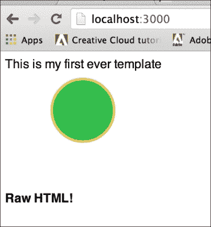

## 它是如何工作的…

我们创建并调用了我们的`Template.firstTemplate.rawInsert`辅助函数，通过在模板底部添加`{{{rawInsert}}}`标签并在我们的`templates.js`文件中声明`rawInsert`辅助函数来实现。

三重花括号标签通知 Blaze，从辅助函数返回的对象将是原始 HTML，需要以这种方式渲染。相应地，Blaze 期望一个字符串，并尝试渲染它。

要查看 Blaze 通常如何处理原始 HTML，将三重花括号标签更改为双花括号标签 `( {{rawInsert}})`，保存你的文件，并在浏览器中查看结果，如下面的截图所示：

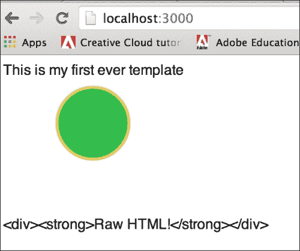

## 参见

+   在第七章 “使用客户端方法”的 *使用 SVG 和 Ajax 创建动态图表* 菜谱中，*使用客户端方法*

# 创建动态列表

Meteor Spacebars 语法支持通过使用模板块标签快速开发列表、表格和其他数据展示。在模板中使用，块标签可以快速添加动态列表，甚至可以根据每个元素的独特属性自定义其外观和感觉。本菜谱将向你展示如何使用 `#each` 块标签在 Blaze 模板中显示集合的多个元素。

## 准备工作

我们将使用本章中找到的 *使用 Spacebars 插入模板* 菜谱中的代码作为我们的基准项目。

如果你还没有这样做，请在你的 `[project root]/client` 文件夹中创建并保存一个名为 `templates.js` 的新文件。

在你的 `[project root]/both` 文件夹中创建并保存一个名为 `collections.js` 的新文件。

我们将想要对 `templates.html` 文件中的 HTML 进行一项修改。我们将把我们的 `<svg>` 元素的高度从 `200` 改为 `800`：

```js
<svg height="800" width="100%" id="shapes">
```

最后，我们希望将 `random` 包添加到我们的项目中，以帮助我们生成一些随机颜色和位置。在终端窗口中，导航到你的项目根目录，并输入以下命令：

```js
$ meteor add random

```

## 如何做到这一点…

要创建动态列表，请按照以下步骤操作：

1.  首先，让我们声明一个 `shapes` 集合。打开 `collections.js`，添加以下代码，并保存你的更改：

    ```js
    Shapes = new Mongo.Collection('shapes');
    ```

1.  现在，让我们动态地向页面添加形状。打开你的 `templates.html` 文件，对 `one` 模板进行以下更改，并保存你的更改：

    ```js
    <template name="one">
     {{#each svgShapes}}
        <circle cx="{{x}}" cy="{{y}}" r="40" stroke="{{border}}" stroke-width="3" fill="{{color}}" />
     {{/each}}
    </template>
    ```

1.  我们现在将创建一个模板辅助函数，它返回我们的动态集合。打开 `templates.js`，添加以下辅助函数，然后关闭并保存你的更改：

    ```js
    Template.one.helpers({
      svgShapes: function () {
        return Shapes.find();
      }
    });
    ```

1.  我们现在可以动态地向 `shape` 集合添加形状，它们将在我们的页面上渲染。在浏览器中打开 JavaScript 控制台，并输入以下命令：

    ```js
    > Shapes.insert({x:200,y:50,border:'#123456',color:'#bada55'})

    ```

    你应该在屏幕上看到一个带有深色边框的绿色圆形，类似于以下截图：

    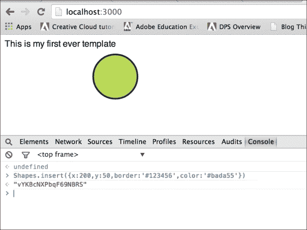

    让我们添加更多圆形来证明我们的模板正在渲染 `Shapes` 集合中的所有形状。

1.  在 `templates.js` 中，添加以下代码：

    ```js
    Template.firstTemplate.events({ 'click svg': function (e,t){ var xpos,ypos;
        if(e.offsetX==undefined)
        {
          xpos = e.pageX-$('#shapes').offset().left;
          ypos = e.pageY-$('#shapes').offset().top;
        }
        else
        {
          xpos = e.offsetX;
          ypos = e.offsetY;
        }
            choices = ['#bada55','#B43831', '783BA3', '#00AB1B', '#143275', '#FFA700'],
            color = Random.choice(choices),
            border = Random.choice(choices);
        Shapes.insert({x:xpos,y:ypos,border:border,color:color});
        },
        'dblclick': function(e,t){ Meteor.call('resetShapes');
        }
    });
    ```

1.  我们现在想显示形状的总数，因此我们需要向 `Template.firstTemplate.helpers` 方法调用中添加一个 `shapeCount` 函数：

    ```js
    Template.firstTemplate.helpers({
      shapeCount: function () {
        return Shapes.find().count();
      },
      rawInsert: function () {...
    We will also need to Modify templates.html to display a count of the shapes collection:
    <template name="firstTemplate">
        <div id="title">shapes collection count: {{shapeCount}}</div>
    ```

1.  让我们添加一个 `resetShapes` 方法。打开/创建位于你的 `[project root]/server` 文件夹中的 `server.js` 文件，并添加以下代码：

    ```js
    Meteor.methods({
        resetShapes: function(){
            Shapes.remove({});
        }
    });
    ```

1.  保存所有更改，如果 Meteor 还未运行，请启动它，并在浏览器中导航到你的 Meteor 主办的页面（通常是 `http://localhost:3000`）。

    现在，当你点击浏览器中的某个位置时，新的圆圈将出现，屏幕的左上角将显示你的 `shapes` 集合计数：

    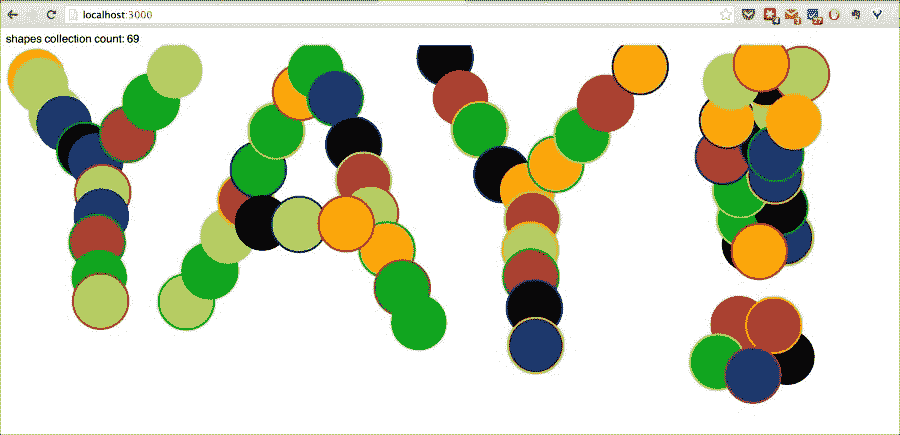

随意添加你想要的任何形状，或者通过在屏幕上的任何位置双击来重置为零。

## 工作原理…

我们在 `templates.js` 中创建了 `Template.one.svgShapes` 辅助函数，它返回对 `shapes` 集合的指针。这为我们的模板设置了数据上下文，并且可以通过添加到 `templates.html` 中的 `one` 模板中的 `{{#each svgShapes}}` 块标签来访问。

由于模板和模板辅助函数是响应式计算，它们会在集合更新时做出反应。这种反应导致 Blaze 重新渲染页面，使用 `#each` 块标签内找到的动态模板。

## 更多内容…

其他块辅助函数也存在，并且它们同样易于使用。有关更详细的说明，请参阅 GitHub 上的 Spacebars 文档，网址为 [`github.com/meteor/meteor/blob/devel/packages/spacebars/README.md`](https://github.com/meteor/meteor/blob/devel/packages/spacebars/README.md)。

## 相关内容

+   在 第四章 中实现简单集合的菜谱，*创建模型*

+   在 第七章 中使用 SVG 和 Ajax 创建动态图形的菜谱，*使用客户端方法*

# 使用 Bootstrap 构建平滑的界面

作为一名网页开发者，你时间消耗最大的一个方面就是页面样式设计。Bootstrap 提供了一种优雅、简洁的设计，以及足够的现成组件样式，让你可以快速启动，无需陷入编写 CSS 的困境。这个菜谱将带你了解一些 Bootstrap 组件样式，并展示它们的使用是多么简单。

## 准备工作

我们将使用本章中找到的 *创建动态列表* 菜谱作为我们代码的基准。

我们还需要将官方 Bootstrap 包添加到我们的 Meteor 项目中，使用 Meteor 的包仓库。打开一个终端窗口，导航到你的项目的根目录，并输入以下命令：

```js
$ meteor add twbs:bootstrap

```

### 小贴士

有其他一些包与官方 Bootstrap 包相辅相成。你可以在 [`atmospherejs.com/?q=bootstrap`](https://atmospherejs.com/?q=bootstrap) 找到这些包的完整列表。

## 如何操作…

我们将使用 Bootstrap 内置的 `btn` 和 `navbar` 样式来使标题和集合计数看起来更美观。按照以下步骤使用 Bootstrap 构建平滑的界面：

1.  首先，让我们修改我们的标题，添加一个子 `<div>` 标签，并像 Bootstrap 按钮一样对其进行样式化。打开 `templates.html`，进行以下代码更改，并保存你的文件：

    ```js
    <div id="title">Shapes Collection Count:
     <div id="resetShapes" class="btn btn-warning">
           {{shapeCount}}
     </div>
       </div>
    ```

1.  在此更改之后，你的标题应该看起来更加引人注目，如下面的截图所示：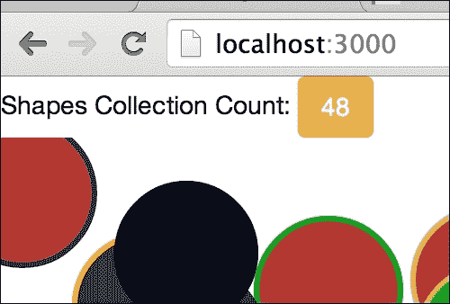

1.  现在，我们将添加`navbar`样式到整个标题，使其具有独特、故意的样子。再次打开`templates.html`，并将标题`<div>`标签替换为以下代码：

    ```js
        <nav class="navbar navbar-default">
            <div class="container-fluid">
                <div class="navbar-header">
                    <div id="title" class="navbar-brand">Shapes Collection Count</div>
                </div>
                <div class="nav navbar-left">
                    <div id="resetShapes" class="btn btn-warning navbar-btn">
                        {{shapeCount}}
                    </div>
                </div>
            </div>
        </nav>
    ```

1.  保存这些更改，你的页面应该会更新。现在，**Shapes Collection Count**部分应该以独特的`navbar`样式出现，类似于以下截图：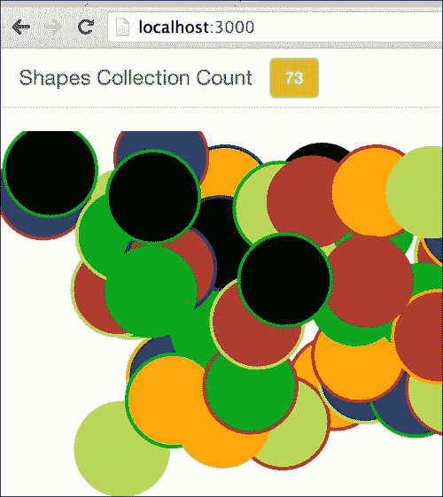

1.  最后，让我们将计数按钮变成一个实际的按钮。打开`templates.js`，将`dblclick`事件更改为特定的`click`事件。此事件放置在`Template.firstTemplate.events`函数的底部：

    ```js
    Template.firstTemplate.events({
        …
     'click #resetShapes': function(e,t){
            Meteor.call('resetShapes');
        }
    })
    ```

    我们现在已经禁用了双击作为重置我们的`shapes`集合的方法，并将其转移到**Shapes Collection Count**总数。通过点击橙色按钮，集合将重置为零：

    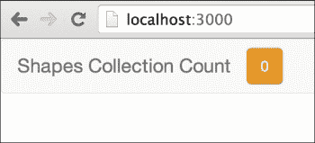

## 它是如何工作的…

使用 Bootstrap 更改页面的外观和感觉只是添加正确的 CSS `class`声明和适当地结构化我们的 HTML。

为了样式化`shapes`集合计数，我们在`class`属性中添加了`btn`和`btn-warning`值。这允许 Bootstrap CSS 适当地样式化`<div>`标签，使其看起来像一个橙色按钮。

为了样式化我们的标题，我们首先必须为`navbar`标签创建脚手架。我们通过在本质上用`<nav>`标签包裹我们的`<div>`标签来实现这一点。然后，通过添加`nav`、`navbar`、`navbar-header`和`navbar-left`到`class`属性中，适当地结构化包含标签。其他的`class`声明（`navbar-default`、`navbar-brand`和`navbar-btn`）是严格的样式声明，改变颜色/形状但不影响整体结构或布局。

## 还有更多…

Bootstrap 非常健壮，并附带出色的文档。你可以在[`getbootstrap.com/`](http://getbootstrap.com/)了解更多关于 Bootstrap 的信息。

## 参见

+   在第二章的*Adding Meteor packages*和*Discovering new packages with Atmosphere*食谱中，*使用包进行自定义*

# 创建自定义的全局助手

当你真正开始深入研究模板时，你很快会发现模板助手有多么真正出色。你可以内联访问数据，并极大地减少你需要编写的代码量。

然而，你最终会遇到一个情况，你发现自己正在多个模板助手中重复相同的逻辑。如果有一种方法可以创建任何模板都可以访问的全局助手会怎么样？嗯，Meteor 也有解决方案！这个食谱将向你展示如何使用`Template.registerHelper`函数创建全局模板助手。

## 准备工作

我们将使用本章中找到的*Building a smooth interface with Bootstrap*食谱中的代码库。请首先遵循该食谱或下载相应的代码库。

## 如何操作…

我们将创建一个全局随机颜色生成器，并通过以下步骤将随机颜色添加到屏幕上的所有对象中：

1.  打开位于你的 `[项目根]/client` 文件夹中的 `templates.html`，并对 `one` 模板的颜色属性进行以下更改：

    ```js
    <template name="one">
        {{#each svgShapes}}
        <circle cx="{{x}}" cy="{{y}}" r="40" stroke="{{randColor}}" stroke-width="3" fill="{{randColor}}" />{{/each}}
    </template>
    ```

1.  我们还将在 `<div>` 标题中使用 `randColor` 辅助函数，给它一点（随机）颜色。在 `firstTemplate` 模板中，查找并按以下方式修改 `<div>` 标题：

    ```js
    <div class="navbar-header">
                    <div id="title" class="navbar-brand" style="color:{{randColor}}">Shapes Collection Count</div>
    ```

1.  保存你的更改，如果还没有启动，请启动你的 Meteor 应用程序。当你用浏览器查看你的 Meteor 页面时，你会注意到所有的圆都变成了黑色。这是因为尽管我们引用了全局辅助函数，但我们还没有真正创建它。

1.  因此，让我们来处理这个问题。打开位于你的 `[项目根]/client` 文件夹中的 `templates.js`，并在底部添加以下函数：

    ```js
    Template.registerHelper('randColor',function(){
        choices = ['#bada55','#B43831', '783BA3', '#00AB1B', '#143275', '#FFA700'];
        return Random.choice(choices);
    });
    ```

1.  保存更改后，你的页面将刷新，圆现在将具有随机颜色，应用程序的标题栏也是如此。为了证明它确实使用了全局的 `randColor` 辅助函数，请打开另一个浏览器窗口，导航到你的页面（通常是 `http://localhost:3000`），并查看结果。当你点击页面以添加圆或刷新页面时，颜色将随机变化，并且与下一个浏览器窗口不同，如以下截图所示：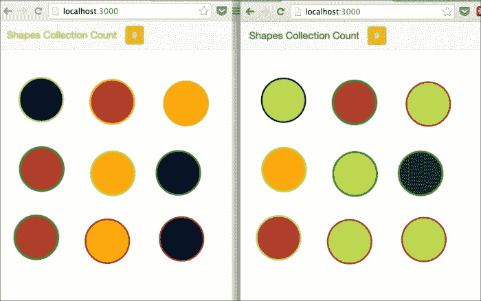

## 它是如何工作的...

`Template.registerHelper` 函数声明了一个可以在任何模板上下文中看到的辅助函数。把它想象成一种声明全局函数的方法，这些函数可以在 Spacebars 语法中使用。

`Template.registerHelper` 的第一个参数是一个字符串值，它包含我们辅助函数的名称（在模板内联引用时使用的名称）。在为全局辅助函数选择名称时，请记住它确实是全局的。因此，它应该是唯一的，以防止冲突，或者其值可能会被特定模板的辅助函数覆盖。我们的例子非常简单，所以我们可以使用 `randColor`；然而，随着你构建更复杂的模板，给你的辅助函数起更独特的名称是个好主意。返回的值显然是随机选择的一种颜色，使用的是我们在原始 `firstTemplate` 点击事件处理器中使用的相同技术。

我们随后在两个不同的模板中使用了这个全局辅助函数。首先，我们将圆的 `svg` 声明中的 `{{color}}` 和 `{{border}}` 替换为 `{{randColor}}`，导致我们的圆每次都显示为随机颜色。最后，我们在 `<div>` 标题中添加了 `style="color:{{randColor}}"` 属性，这样在页面刷新时就会随机分配文本颜色。

## 还有更多...

使用全局辅助函数，你可以完成一些非常高级的技术，例如使用其他与模板相关的函数，如 `Template.instance()` 和 `Template.currentData`。所有这些内容都无法在本食谱中涵盖，但我们鼓励你探索 Meteor 文档，以便熟悉全局辅助函数能做什么。

### 小贴士

要了解可用的模板实用工具的概述，请参阅 Meteor 文档 [`docs.meteor.com/#/full/templates_api`](http://docs.meteor.com/#/full/templates_api)。

## 参见

+   本章中的 *使用 Spacebars 插入模板* 和 *使用 HTML 属性进行响应式操作* 食谱

# 创建自定义组件

在 Meteor 中添加和使用模板是加快你工作流程的绝佳方式。使用 Meteor 内置的内容块辅助函数可以进一步简化你的工作流程，通过允许嵌套和延迟模板调用。本质上，你可以组合和嵌套模板来创建自己的“组件”。本食谱将向你展示如何使用 `Template.contentBlock` 构建 Spacebars 自定义块辅助函数。

## 准备工作

我们将使用本章中 *使用 Bootstrap 构建平滑界面* 食谱中的代码库。请首先遵循该食谱，或下载相应的代码库。

## 如何做到这一点...

按照以下步骤创建自定义组件：

1.  我们需要将特定于模板的 `shapeCount` 辅助函数全局化，以便我们可以在组件内部使用它。在 `templates.js` 文件中，删除 `Template.firstTemplate.helpers()` 方法调用中找到的 `shapeCount` 函数，并将以下函数添加到页面底部：

    ```js
    Template.registerHelper('shapeCount',function (){
      return Shapes.find().count();
    });
    ```

1.  现在，我们将创建我们的组件。我们首先创建一个 `navbutton` 模板，它将使用新创建的 `shapeCount` 辅助函数。在你的 `[project_root]/client` 文件夹中创建一个新的模板文件，命名为 `navbar.html`。在文本编辑器中打开此文件，并添加以下模板代码：

    ```js
    <template name="navbutton">
        <div class="nav navbar-left">
            <div id="resetShapes" class="btn btn-warning navbar-btn">
                {{shapeCount}}
            </div>
        </div>
    </template>
    ```

1.  要创建自定义的 `navbar` 块标签，将 `navbar` 模板添加到同一文件中，包括 `Template.contentBlock` 引用，如下所示：

    ```js
    <template name="navbar">
        <nav class="navbar navbar-default">
            <div class="container-fluid">
                <div class="navbar-header">
                    <div id="title" class="navbar-brand">Shapes Collection Count</div>
                </div>
                {{> Template.contentBlock}}
            </div>
        </nav>
    </template>
    ```

1.  我们组件现在已完成！让我们在我们的代码中使用它。打开 `templates.html` 并完全删除 `<nav>` 元素块，包括 `firstTemplate` 模板中的代码。此更改后，将只剩下 `<svg>` 元素。就在 `<svg>` 元素上方，我们将使用 `{{#[template name]}}` 块标签调用我们的 `navbar` 模板，如下所示：

    ```js
    <template name="firstTemplate">
     {{#navbar}}
     {{> navbutton}}
     {{/navbar}}
        <svg>
    ```

1.  保存所有更改，如果 Meteor 实例尚未运行，请启动它，并在浏览器中查看结果。你会注意到没有任何变化。我们具有与之前相同的功能；但现在，我们已经创建了一个自定义 Spacebars 组件（正式上称为自定义块辅助工具），并且可以根据需要向 `navbar` 标签添加更多组件或输入显式 HTML，例如，将 `{{> navbutton}}` 替换为 `<div>{{shapeCount}}</div>` 将会显示 **形状集合计数**，而无需使用 `navbutton` 模板，类似于以下截图（不太美观，但你能理解这个意思）：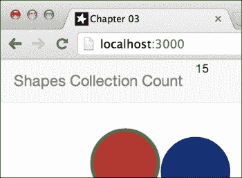

如果你检查浏览器中的元素，你会注意到手动输入的 `<div>…</div>` 已经被插入到占位符块中，类似于以下示例：

```js
<nav class="navbar navbar-default">
  ...
 <div>15</div>
  ...
</nav>
```

## 工作原理…

构建块辅助工具的关键在于 `Template.contentBlock` 函数。我们创建了一个新的 `navbar` 模板，并在该模板内部使用了 `{{> Template.contentBlock}}` 来指定一个占位符。这个占位符（称为**内容** **块**）可以在稍后指定，而不是必须显式地在 `navbar` 模板内部指定。这个简单的添加内容块的操作将我们的 `navbar` 模板转换成了一个 *组件*。

一旦我们创建了块辅助工具以及要放入块辅助工具中的模板，我们就添加了一个 `Spacebars` 块标签，带有 `{{#navbar}}` 和结束的 `{{/navbar}}` 调用。在这个块内部，我们使用 `{{> navbutton}}` 调用我们的新 `navbutton` 模板，它被插入到 `{{> Template.contentBlock}}` 占位符中。在运行时，所有这些模板函数将按顺序执行，Blaze 将渲染实际的 HTML DOM 元素。

## 更多内容…

自定义块辅助工具也可以通过使用 `UI.elseBlock` 来利用 `#if`、`#else` 和 `#unless` 逻辑。使用这些命令，你可以创建可重用、动态的块辅助工具和模板，进一步简化你的开发过程。

### 小贴士

要详细了解所有选项，请参阅 Spacebars 的 GitHub 文档，位于 [`github.com/meteor/meteor/blob/devel/packages/spacebars/README.md`](https://github.com/meteor/meteor/blob/devel/packages/spacebars/README.md)。

## 参见

+   本章中的 *使用 Spacebars 插入模板* 和 *创建自定义全局辅助工具* 食谱

# 使用反应性 HTML 属性

在 Meteor 中，隐藏的宝藏之一是你对 HTML 渲染的极细粒度控制。Blaze 是这样设计的，你可以动态地修改、添加或删除 HTML 元素属性，而不会影响 DOM 中的其他任何内容！本食谱将指导你如何在元素属性中使用动态、反应性数据。

## 准备工作

我们将使用来自 *创建自定义组件* 食谱的代码库，这是本章中的前一个食谱。请首先遵循该食谱或下载相应的代码库。

## 如何操作…

按照以下步骤使用 HTML 属性进行响应性操作：

1.  我们首先需要创建一个新的`navcolor`模板。在您的`[project root]/client`文件夹中打开`navbar.html`并添加以下代码：

    ```js
    <template name="navcolor">
        <div class="nav navbar-form navbar-right">
            <input type="checkbox" id='bgCheck' checked="{{useBG}}"/>
            <input type="text" id='bgColor' placeholder="#bgcolor" value="{{bgColor}}" />
        </div>
    </template>
    ```

1.  我们现在需要将我们的新模板添加到`navbar`内容块中，以便我们可以输入新的背景颜色并开启或关闭它。打开`templates.html`（同样在`client`文件夹中）并修改`firstTemplate`模板，在`{{> navbutton}}`调用下方添加一个模板调用，类似于以下内容：

    ```js
    {{#navbar this}}
     {{> navbutton}}
     {{> navcolor}}
        {{/navbar}}
    ```

1.  在下一行，给`<svg>`元素添加一个`style`属性，这样我们就可以更改背景颜色，如下所示：

    ```js
    <svg height="800" width="100%" id="shapes" style="background-color:{{bgColor}}">
    ```

1.  在前面的代码中，我们设置了两个辅助函数的引用：`bgColor`和`useBG`。现在我们将创建这些全局模板辅助函数。打开`templates.js`并添加以下两个函数：

    ```js
    Template.registerHelper('bgColor', function () { if (Session.equals('useBG', true)) {return Session.get('bgColor');
        } else return null;
    });

    Template.registerHelper('useBG', function(){return Session.get('useBG');
    });
    ```

1.  如果我们保存这些更改并打开浏览器中的网络控制台，我们现在可以以编程方式更改和切换背景颜色。在网络控制台中，执行以下两行：

    ```js
    > Session.set('bgColor','lig
    htgrey')
    > Session.set('useBG',true)

    ```

    屏幕上应该有以下三个变化：

    +   现在背景应该是浅灰色

    +   您`navbar`标签右上角的复选框应该被勾选

    +   现在右上角的文本框中应该出现**lightgrey**这个词

    您的屏幕现在应该看起来类似于以下截图：

    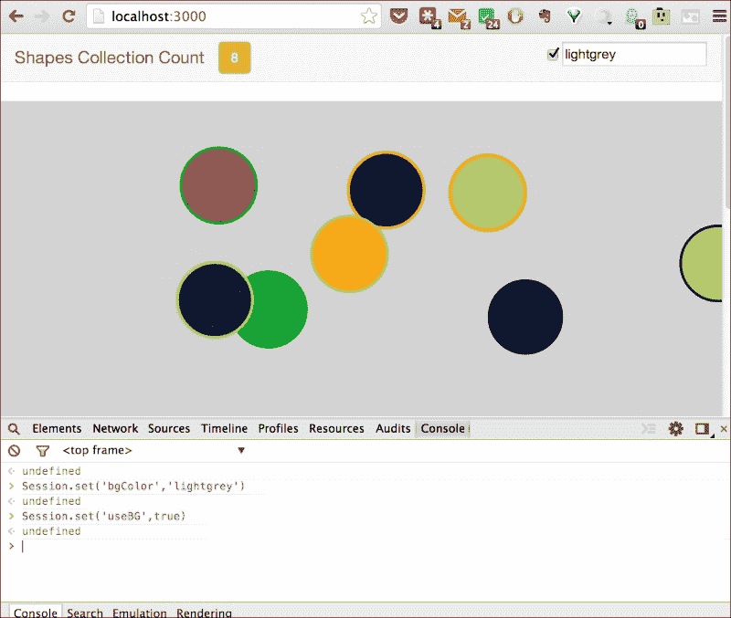

1.  剩下的就是将事件连接到复选框和文本框的`<input>`元素。在您的`[project_root]/client`文件夹中创建一个名为`navbar.js`的新文件，并添加以下`events`处理程序声明：

    ```js
    Template.navcolor.events({ 'click #bgCheck': function (e, c) { Session.set('useBG', e.currentTarget.checked);
      }, 'change #bgColor, keyup #bgColor': function (e, c) { if (!Session.equals('bgColor', e.currentTarget.value)) { Session.set('bgColor', e.currentTarget.value);
        }
      }
    });
    ```

1.  保存您的更改，您的元素现在将影响背景。勾选/取消勾选复选框将切换背景颜色，更改文本框中的值将动态更改显示的背景。

1.  我们想观察这将对 DOM 产生的影响。打开浏览器中的`开发者`面板并定位到`<svg>`元素。当您使用复选框切换背景的开启和关闭时，观察顶部`<svg>`标签内的属性列表。您会注意到，根据复选框的状态，`style`属性会出现和消失，类似于以下截图：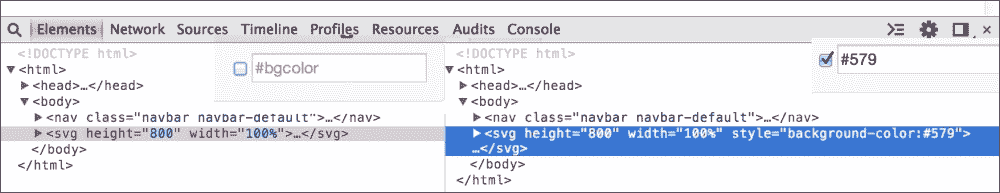

如您所见，属性不仅仅是变为空。它被完全移除了。您还会注意到，在这种情况下，屏幕或元素视图都没有刷新。这是因为 DOM 没有被重建。属性是根据`{{bgColor}}`的状态被添加和移除的。同样，当您修改文本框中的值时，其他什么都不会受到影响（没有屏幕刷新，或状态丢失）。

## 它是如何工作的…

随着 Blaze 模板引擎的引入，Meteor 停止了字符串操作，并开始直接与 DOM 树/DOM 元素交互。与其它模板库相比，这种变化简化了开发过程，因为 DOM 元素不需要在 HTML 每次更改时都重新渲染。

在`style`属性的情况下，属性内的唯一参数是对`bgColor`辅助函数的引用。如果辅助函数或数据上下文中的值是`null`/`undefined`，并且该值是属性中的唯一值，Blaze 会自动移除该属性，而不是将其渲染为无值。

因此，在这种情况下，当`{{bgColor}}`辅助函数返回`null`（当`Session.useBG`为`false`或`undefined`时），Blaze 会从`<svg>`元素中移除`style`属性。

## 参考内容

+   本章中的*使用 Spacebars 插入模板*食谱

+   在第四章的*使用 Session 对象*食谱中，*创建模型*

# 使用动态模板

Meteor 还有另一项模板技巧！除了自定义代码块、响应式数据上下文以及所有其他各种模板优点外，Meteor 还允许你动态地在渲染的模板之间切换。本食谱将展示如何使用`Template.dynamic`辅助函数动态渲染模板。

## 准备工作

我们将使用本章中*创建自定义组件*食谱中的代码库。请首先遵循该食谱或下载相应的代码库。

## 如何操作...

我们将添加一个动态模板，在渲染时将我们的形状从圆形切换到正方形。按照以下步骤使用动态模板：

1.  首先，我们需要创建我们的备用模板。在`templates.html`中，位于你的`[项目根]/client`文件夹内，添加以下模板，就在现有`one`模板声明下方：

    ```js
    <template name="two">
        {{#each svgShapes}}
            <rect x="{{x}}" y="{{y}}" width="80" height="80" stroke="{{border}}" stroke-width="3" fill="{{color}}" />
        {{/each}}
    </template>
    ```

1.  我们需要为这个模板提供一个数据上下文。幸运的是，我们可以重用`Shapes`集合。打开`templates.js`，复制`svgShapes`函数，并将其添加到新的`Template.two.helpers()`方法调用中，如下所示：

    ```js
    Template.two.helpers({ svgShapes: function () { return Shapes.find();
      }
    });
    ```

    现在，我们将根据`Session.curTemplate`变量在`one`和`two`模板之间切换逻辑。在`templates.js`的底部，添加以下`helpers()`方法调用：

    ```js
    Template.firstTemplate.helpers({   curTemplate: function () { var curTempl = Session.get('curTemplate');
     if (!curTempl) { curTempl = 'one';
     Session.set('curTemplate', curTempl);
     }
     return curTempl;
     }
    });
    ```

1.  剩下的工作就是添加动态模板声明并创建一种简单的方法来在模板之间切换。让我们先处理声明。打开`templates.html`并修改`<svg>`元素内的双括号，如下所示：

    ```js
    <svg height="800" width="100%" id="shapes">
        {{> Template.dynamic template = curTemplate}}
    </svg>
    ```

1.  现在，我们将添加一些切换按钮并将事件连接到更改`Session.curTemplate`变量的值。打开`navbar.html`并在底部添加以下模板：

    ```js
    <template name="navshapes">
        <div class="nav navbar-right">
            <button id="btnCircles" class="btn btn-success navbar-btn">one</button>
            <button id="btnSquares" class="btn btn-danger navbar-btn">two</button>
        </div>
    </template>
    ```

1.  我们需要在我们的块助手中包含 `navshapes` 模板。打开 `templates.html` 并在 `{{/navbar}}` 块标签之前添加以下模板包含：

    ```js
    {{#navbar}}
      ...
     {{> navshapes}}
    {{/navbar}}
    ```

1.  最后一个添加，为了连接事件，我们就可以开始了。在您的 `[项目根]/client` 文件夹中创建一个 `navbar.js` 文件，并添加以下代码：

    ```js
    Template.navshapes.events({ 'click button.btn': function(e,c){ Session.set('curTemplate',e.currentTarget.textContent);
      }
    });
    ```

1.  保存所有更改，如果项目尚未运行，请启动您的 Meteor 项目，并在浏览器中导航到您的项目（通常是 `http://localhost:3000`）。您将在屏幕右上角看到两个按钮。点击它们，来回切换，以查看屏幕上的形状在圆形和正方形之间切换，类似于以下截图：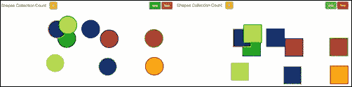

## 它是如何工作的…

`Template.dynamic` 接收一个 `template` 参数，并使用适当的名称渲染模板。因为我们通过使用 `curTemplate` 助手使模板参数动态和响应式，所以渲染的模板将随着 `Session.curTemplate` 的值的变化而变化。这种动态渲染模板的能力是流行的 Meteor 包 `iron:router` 的基础。它可以用在多个你想根据响应式数据源切换模板的情况中。

## 还有更多…

Iron Router 将动态模板提升到了全新的水平。Iron Router 的文档可以在 [`github.com/iron-meteor/iron-router/blob/devel/Guide.md`](https://github.com/iron-meteor/iron-router/blob/devel/Guide.md) 找到。

## 另请参阅

+   在第二章 使用包定制 的 *使用 Iron Router 创建多页面应用* 菜谱，*使用包定制*

+   本章的 *创建自定义组件* 菜谱

+   在第四章 创建模型 的 *使用 Session 对象菜谱*，*创建模型*

+   在第十二章 创建完整应用与 Iron Router 的 *使用 Iron Router 创建完整应用* 菜谱，*创建有用项目*

# 动画 DOM 元素

Meteor 有一种非常优雅的方式来渲染我们的 Web 应用中的 DOM 元素，但直到现在，这还没有包括动画。幸运的是，现在 Meteor 支持动画，包括当元素首次添加到 DOM 时发生的动画。这个菜谱将指导你如何在 Meteor 中使用标准的 CSS 动画技术。

## 准备工作

我们将使用本章中 *使用动态模板* 菜谱的代码库。请首先遵循该菜谱或下载相应的代码库。

## 如何做到这一点...

我们将动画化我们之前菜谱中的形状，演示在元素首次创建和渲染之前和之后的动画效果。

由于我们使用了 SVG 元素而不是 DOM 元素，我们需要修改 jQuery 以能够使用 `.addClass` 和 `.removeClass`。幸运的是，有一个自定义包可以同时添加 SVG 支持和 Meteor UI 事件支持。

1.  在终端窗口中，导航到你的项目根目录并执行以下行：

    ```js
    $ meteor add appmill:animation-hooks

    ```

    这将安装`animation-hooks`包，该包包括 jQuery 对 SVG 的支持。

1.  我们现在将添加一个非常简单的悬停动画效果。在`[项目根目录]/client/lib/styles`文件夹中打开或创建一个`style.css`文件，并添加以下代码：

    ```js
    circle,rect {
        opacity:1;
        transition:all 500ms 0ms ease-in;
    }

    circle:hover, rect:hover{
        opacity:0;
    }
    ```

1.  保存你的更改，如果你的 Meteor 项目尚未启动，请启动它，并在浏览器中导航到你的项目 URL（通常是`http://localhost:3000`）。如果你屏幕上没有形状，请点击添加一些，然后悬停在形状上。当你悬停时，你会注意到形状会慢慢淡出，当你将鼠标移开时，形状会慢慢淡入，直到它们恢复到全不透明度。现在我们将使用 jQuery 同时移动屏幕上的所有形状。在`navbar.html`中，在底部添加以下模板：

    ```js
    <template name="navoffset">
        <div class="nav navbar-right">
            <button id="btnNegative" class="btn btn-danger navbar-btn" data-offset="-">red</button>
            <button id="btnPositive" class="btn btn-info navbar-btn" data-offset="">blue</button>
        </div>
    </template>
    ```

1.  在`templates.html`中，在`navshapes`声明之前添加对新`navoffset`模板的调用：

    ```js
        {{#navbar this}}
         {{> navbutton}}
     {{> navoffset}}
         {{> navshapes}}
        {{/navbar}}
    ```

    我们现在通过修改`navbar.js`来添加`button`事件的代码，在底部添加以下函数：

    ```js
    Template.navoffset.events({
      'click button.btn': function(e,c){
        var shapes = ($('rect').length)? $('rect'):$('circle');
        if (shapes.length==0) return;
        var offset = e.currentTarget.dataset.offset;
        _.each(shapes,function(d,i){
          var randVal = Math.ceil(Math.random()*200)+'px';
          var randOffset = offset+randVal;
          var translate = ('translate('+randOffset+','+randOffset+')');
          $(d).css('transform',translate);
        });
      }
    });
    ```

1.  我们还希望对我们的`nav`按钮添加一点修饰，所以将以下 CSS 添加到`style.css`文件中，在底部：

    ```js
    div.nav {
        margin-left: 20px;
    }
    ```

1.  保存所有这些更改，现在你的网页应该包含两个新的按钮，分别标记为**红色**和**蓝色**。当你交替点击这些按钮时，屏幕上的所有形状将随机移动其位置，在屏幕上左右对角移动。

1.  我们现在将使用内置的动画钩子，称为`_uihooks`，来动态地将形状添加到 DOM 中时进行动画处理。打开`templates.html`并对`one`和`two`模板进行以下修改：

    ```js
    {{#each svgShapes}}
     {{#Animate}}
     <circle class="shape animate" ...
     {{/Animate}}
    {{/each}
    ...
    {{#each svgShapes}}
     {{#Animate}}
     <rect class="shape animate" ...
     {{/Animate}}
    {{/each}}
    ```

1.  我们有一个最后的步骤，那就是通过我们的`.animate`CSS 声明将形状的初始*之前*状态添加到形状中。打开`style.css`并在底部添加以下声明：

    ```js
    rect.animate, circle.animate {
        transform: translate(-300px,-100px);
        opacity:0;
    }
    ```

1.  保存你的更改，并通过添加新的形状到屏幕（点击任何地方）或通过将形状从圆形更改为正方形，然后再回到圆形（点击**one**和**two**按钮）来测试新的动画功能。当你点击时，你会看到形状淡入并从左侧移动到位置。

## 它是如何工作的…

因为 Blaze 现在根据 DOM 渲染对象，而不是根据基于文本的 HTML 标签渲染，它能够了解创建的元素的样式和条件，例如，因为我们已经在`style.css`中添加了`opacity:0`样式到我们的`:hover`形状元素，鼠标下方的元素会淡出并保持淡出状态，即使我们点击/添加新的形状。使用 jQuery，我们可以以编程方式添加样式和转换，就像我们在`navbar.js`中使用`.css()`函数所做的那样。Blaze 也会尊重这些更改，因为对 CSS/DOM 的编程更改会被记住，即使添加了新元素。

`_uihooks`声明包含三个事件处理器：

| `insertElement` | 在 DOM 节点渲染之前触发，这样我们就可以操作其位置，映射节点动画时的位置，然后渲染节点时对其进行动画处理。 |
| --- | --- |
| `removeElement` | 在 DOM 节点被移除之前触发。我们检查是否有出行的动画，如果有，则对节点进行动画处理。否则，我们直接移除它。 |
| `moveElement` | 当 DOM 节点在 DOM 中的索引位置发生变化时触发。我们可以在索引变化之前添加任何动画，并在索引变化期间创建动画效果。 |

对于我们的示例，我们只需要关注插入和移除元素。每个元素都通过模板分配了 CSS `animate`类，这使得元素偏移到预期的位置（-300,-100）。我们的动画方式是通过让元素在屏幕上以偏移位置（`animate`类生效）出现，然后通过移除`animate`类来触发过渡/动画，因为元素移动到其预期位置。多亏了`_uihooks`和`insertElement`事件处理器，我们可以在元素最初渲染后立即以编程方式移除`class`声明，使它们进行动画。这使得形状看起来像是从左上角淡入。同样，我们可以在元素被移除之前将它们添加回来，以执行出行的动画。

我们通过将元素包裹在`{{#Animate}}…{{/Animate}}`块助手中来声明哪些元素会受到影响的，这会导致`insertElement`和`removeElement`处理器在包裹的元素上触发。

## 还有更多…

随着 Meteor 继续改进动画支持，我们预计会有一些变化，尽管主要功能已经存在。同时，您可以通过在客户端源中添加断点来了解`_uihooks`的工作方式，在`packages/appmill:animations-hooks/animation-hooks.js`文件中，类似于以下截图：

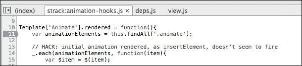

您也可以在[`github.com/strack/meteor-animation-hooks`](https://github.com/strack/meteor-animation-hooks)上获得（稍微）更详细的解释。

## 参见

+   本章的*使用响应性 HTML 属性*配方
