# 第六章 掌握响应式编程

在本章中，您将学习以下主题：

+   创建和消费响应式值

+   使用 Ajax 查询结果修改 UI 元素响应式

+   使自定义库响应式

+   不使用 Mongo 更新 Blaze 模板

+   使用内联数据响应式地修改 UI 元素

+   集成 jQuery UI

# 简介

**响应式编程**是一种新兴的开发方法，其中数据的变化会自动触发整个系统的变化。这允许您，作为开发者，以声明式的方式编写代码，并让响应式元素管理任何变化。Meteor 可能是今天最好的、最全面实现的响应式编程。通过理解响应式编程的核心概念，您可以使用`Tracker`（以前称为`Deps`）库创建简单、声明式的代码，同时避免与响应式和异步 JavaScript 编程相关的常见陷阱。本章中的食谱将为您提供简单、清晰的示例，说明 Meteor 响应模型的主要组件是如何工作的。

# 创建和消费响应式值

`Tracker`，简单来说，是 Meteor 的变量跟踪系统。它用于管理响应式值、数据结构和计算（消耗响应式值的函数）。本食谱将向您展示如何创建响应式值，并使用`Tracker.autorun()`对这些值进行计算。换句话说，它将教会您在 Meteor 内部如何进行响应式编程。这个食谱将作为更复杂功能的基础非常有用。

## 准备工作

为了简化，我们将使用默认的 Meteor 项目，并添加`reactive-var`包。打开一个终端窗口，导航到您想要创建根项目的地方，并执行以下命令：

```js
$ meteor create reactiverecipes
$ cd reactiverecipes
$ meteor add reactive-var
$ meteor

```

您现在可以开始使用响应式变量了。

## 如何操作...

我们将根据响应式变量修改按钮的文本；因此，我们需要创建按钮并连接响应式上下文。

1.  在您最喜欢的文本编辑器中打开您的项目，并编辑`reactiverecipes.html`文件，为`<button>`元素添加一个 ID，如下例所示：

    ```js
    <button id='btnReact'>Click Me</button>
    ```

1.  现在，打开`reactiverecipes.js`，并在`if (Meteor.isClient)`条件下方添加以下代码行：

    ```js
     if (Meteor.isClient) {
     btnText = new ReactiveVar('Click Me');
     Tracker.autorun(function () {
     $('#btnReact').text(btnText.get());
     });

    ```

1.  最后，在`Template.hello.events`声明中添加以下行，位于`'click button'`函数中的`Session.set()`函数下方：

    ```js
    Session.set("counter"...);
    btnText.set('Again!');

    ```

1.  保存您的更改，并在浏览器中导航到`http://localhost:3000`。一旦到达那里，点击标有**点击我**的按钮，并观察文本变为**再次！**：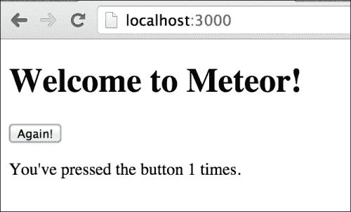

    您可以通过在浏览器中打开控制台窗口并使用`btnText.set()`命令来手动更改按钮文本，如下例所示：

    ```js
    > btnText.set('Pretty please...')

    ```

    按钮文本将立即变为您设置的任何值。

## 它是如何工作的...

前面的例子似乎过于简化，但关于这一点我们有两点要说。

首先，它之所以简单，是因为 Meteor 是为了使您的代码非常简单和易于理解而构建的。这使得您的开发和调试工作大大减少了时间消耗。

注意声明响应式变量的过程是如何由一行代码组成的。当我们添加 `btnText = new ReactiveVar('Click Me')` 语句时，我们只是声明了一个变量（并将其初始化为 `'Click Me'`），但我们通过声明知道它是一个响应式变量。

接下来，我们在 `Tracker.autorun()` 块内部封装了一个极其简单的 jQuery 语句。这个块被称为**响应式计算**。响应式计算最初运行一次，然后每当任何包含在其中的响应式变量发生变化时，它都会重新运行（重新计算）。因此，在这个例子中，我们告诉 `Tracker` 监控 `btnText`（一个响应式变量）的值，并在它发生变化时自动再次运行（因此得名 `autorun`）代码块。

注意我们不必担心任何时间条件，例如“这是第一次运行吗？”或者“好吧，当有变化时……”。我们只需简单地声明 jQuery 语句，让 `Tracker` 为我们确定时间。

这就是**透明响应式编程**这个术语的含义。有一套代码用于初始化，另一套代码用于处理变化。除了变量声明外，您的整个代码库都可以用普通的、老式的 JavaScript 编写。

其次，它在底层所做的事情绝对不简单！为了给您，程序员，提供这样的前端简单性，Meteor 实现了响应式提供者和响应式计算。

我们将牺牲一点精确度来使概念更容易理解。当调用 `Tracker.autorun` 时，它会做四件事：

+   它创建一个计算

+   它将 `Tracker.currentComputation` 设置为那个计算

+   它调用传递给它的函数

+   它将 `Tracker.currentComputation` 设置为 `null`

计算本质上是一个事件处理函数，并包含传递给 `Tracker.autorun` 的函数的引用。计算所等待的事件是调用 `computation.invalidate` 方法。当调用 `invalidate` 方法时，计算会重新运行它包含的函数。

现在我们来看函数。传递给 `Tracker.autorun` 的函数如果包含**响应式提供者**，则被视为响应式函数。响应式提供者是一个具有获取和设置某些值的功能的对象，并跟踪依赖关系。当调用 `get` 函数时，它会做三件事：

1.  它检查 `Tracker.currentComputation` 是否有值。

1.  如果它有，计算就会被添加到内部列表中。

1.  它返回 getter 请求的变量的值。

这两个步骤都是通过调用`depend()`方法来执行的，这是一个在依赖对象上找到的方法。`reactive-var`库自动处理这部分，所以你不需要直接调用`depend()`方法。你所要做的就是使用反应性变量！

同样，当调用`set`函数时，它会做两件事：

+   它改变了内部变量的值

+   对于内部列表中的每个计算，都会调用`invalidate()`方法

通过调用`changed()`方法，循环调用`invalidate()`方法，这是一个在依赖对象上找到的`helper`方法。再次强调，`reactive-var`为你处理了这部分。欢迎你！

当每个计算被无效化时，它会重新运行包含它的函数。整个循环从新重新运行的函数调用 getter 开始，getter 返回它们的值（比如我们的`btnReact`按钮的`text`值）并将计算添加到提供者的内部列表中，再次等待 setter 被调用。

尽管它们被极度简化（任何阅读此内容的 MDG 核心成员可能正在喷咖啡……），以下是`ReactiveVar`和`autorun`对象所做的工作：

```js
function ReactiveVar(value) {
 // create the dependency object (a helper class)
    var _dependency = new Tracker.Dependency;
 //set the default internal value
    var _internalVal = value;

    var getValue = function () {
 // call depend(), which adds the computation
        _dependency.depend();
 // return the internal value
        return _internalVal;
    };

    var setValue = function (newValue) {
 // update the internal value
        _internalVal = newValue;
 // loop through computations and call invalidate()
        _dependency.changed();
    };

    return this;
}

function autorun(func) {
 // creates computation and assigns it to
 // Tracker.currentComputation
    var computation = new Tracker.Computation(func, Tracker.currentComputation);

    // Calls the onInvalidate method the first time,
    // so that func function will run
    Tracker.onInvalidate({...});

    return computation;
}
```

为了清晰起见，我们省略了两件事，但为了有一个完整的理解，这两件事很重要。首先，`depend()`辅助方法还设置了一个`onInvalidate()`监听器，它会从反应性提供者的内部列表中移除计算。其次，在将计算添加到内部列表之前，会检查计算是否已经存在于内部列表中。

当你问为什么在计算被无效化时移除计算，简短的答案是，这使得整个计算`add-execute-remove`循环非常优雅。它保持所有计算都是最新的，并且依赖函数只运行一次，无论在同一个函数内部调用 getter 的次数有多少。如果它们没有被移除，函数会被多次运行，这可不是什么好事。

因此，让我们回顾一下在这个配方中我们做了什么：

+   `autorun`方法创建一个计算并将你的函数传递给这个计算

+   计算有一个`onInvalidate`方法，它除了其他事情外，还会运行你的函数

+   在`autorun`创建了一个计算之后，它会使用`onInvalidate`方法运行你的函数一次

+   你的函数中包含反应性变量，它们有自己的待办列表

+   当你的函数运行时，会调用 getter，它们会将计算添加到待办列表中

+   也会调用 setter，执行待办列表并清除它们

+   因为待办事项列表中的函数有反应性变量，所以这个过程会重复（函数会被重新运行）

+   重复上述步骤

再次强调，这个解释被极大地简化了，因此，相当不准确；然而，从概念上讲，它可能会帮助你更好地理解底层发生了什么。

## 还有更多……

Meteor 还提供了 `ReactiveDict` 对象，它运行方式与 `ReactiveVar` 完全相同，但可以以键值对的形式存储一系列的响应式变量。语法与 `ReactiveVar` 完全相同，但您需要在 `set` 和 `get` 方法中添加一个键，如下面的代码所示：

```js
    btnText.get(); // ReactiveVar
    txtFields.get('btnText'); // ReactiveDict
    ...
    btnText.set('Click Me'); // ReactiveVar
    txtFields.set('btnText','Click Me') // ReactiveDict
```

要使用 `ReactiveDict`，只需使用以下终端命令添加 `reactive-dict` 包：

```js
$ meteor add reactive-dict

```

最后，您不必使用 `ReactiveVar` 或 `ReactiveDict`，而是可以自己*实现*响应式提供者。请参阅本章中找到的 *制作自定义库响应式* 菜谱作为示例。

## 参见

+   第三章 *创建动态列表* 菜谱，*构建出色的用户界面*

+   本章中的 *制作自定义库响应式* 菜谱

# 使用 Ajax 查询结果填充 ReactiveVar

无论何时我们使用 Ajax，请求（甚至接收）数据都相当简单。当我们需要用新的或更新的数据更新 UI 时，问题就出现了。借助 Meteor 的响应式编程能力，这个问题就不再是问题。在这个菜谱中，您将看到如何使用 Meteor 的 `ReactiveVar` 库来更新您的 UI。

## 准备工作

为了快速启动，我们将使用默认的 Meteor 项目，并添加了一些包。打开一个终端窗口，导航到您想要创建根项目的地方，并执行以下命令：

```js
$ meteor create ajaxreactive
$ cd ajaxreactive
$ meteor add reactive-var
$ meteor add http
$ meteor add twbs:bootstrap
$ meteor

```

我们现在准备好构建一个响应式的 Ajax 查询了！

## 如何做到这一点…

我们将从 `openweathermap.org` 拉取天气数据，使用他们免费的（但仅用于测试）API。我们将从我们的 `openweathermap.org` 查询结果中提取数据，并将它们放入 `ReactiveVar` 库中，以便它们可以被我们的 Blaze 模板响应式地消费。

让我们先从修改 UI 开始：

1.  打开 `ajaxreactive.html` 并在我们的即将创建的 `weather` 模板调用下添加对现有 `hello` 模板的调用，如下面的代码所示：

    ```js
    {{> hello}}
    {{> weather}}

    ```

1.  我们还希望在我们的 `hello` 模板中重新使用计数器，以告诉我们起始经度将是什么。按照以下方式更改 `hello` 模板中的 `<p>` 元素的描述：

    ```js
    <template name="hello">
        <button>Click Me</button>
        <p>You are starting at {{counter}} longitude.</p>
    </template>
    ```

1.  接下来，添加我们的 `weather` 模板，它只是一个简单的表格，添加了一些美观性，多亏了 bootstrap！在 `ajaxreactive.html` 的底部添加以下模板：

    ```js
    <template name="weather">
        {{#if reports}}
        <table class="table">
            <thead>
                <th>name</th>
                <th>weather</th>
                <th>temp</th>
                <th>humidity</th>
            </thead>
            <tbody>
        {{#each reports}}
                <tr class={{severity}}>
                    <td>{{name}}</td>
                    <td>{{description}}</td>
                    <td>{{temp}}</td>
                    <td>{{humidity}}</td>
                </tr>
        {{/each}}
            </tbody>
        </table>
        {{/if}}
    </template>
    ```

1.  保存您的更改并导航到 `http://localhost:3000`。虽然除了计数器的描述外，没有什么会改变，但我们很快就会想查看我们的天气数据。

1.  让我们打开 `ajaxreactive.js` 并声明我们的 `ReactiveVar` 库。在 `Session.setDefault()` 下方添加以下代码：

    ```js
    Session.setDefault("counter", 0);
    weatherlist = new ReactiveVar;

    ```

1.  我们现在将修改 `'click button'` 函数以增加计数器并执行我们的 Ajax 调用。在 `Template.hello.events` 部分找到该函数，并按以下方式修改代码：

    ```js
    // increment the counter when button is clicked
    if (Session.get("counter") <= 60)
        Session.set("counter", Session.get("counter") + 4);
    else
     Session.set("counter", 0)

    getWeather();

    ```

    ### 注意

    不要忘记将计数器增加的值改为 `4`；否则，您点击时 `weather` 数据不会改变太多。

1.  接下来，我们需要添加`Template.weather.helpers`，以便我们的 UI 能够正确填充。在`Template.hello.events`部分之后，添加以下内容：

    ```js
    Template.weather.helpers({
        reports: function () {
            if (!weatherlist) return false;
            return weatherlist.get();
        },
        severity: function () {
            if (this.weather && this.weather[0].main == "Clear")
                return "success";
            else
                return "warning";
        },
        description: function () {
            if (this.weather && this.weather[0])
                return this.weather[0].description;
            else
                return "";
        },
        temp: function () {
            if (this.main)
                return this.main.temp;
            else
                return "";
        },
        humidity: function () {
            if (this.main)
                return this.main.humidity;
            else
                return "";
        }
    });
    ```

1.  最后，我们需要添加我们的 Ajax 调用和异步回调函数，一旦结果返回。在`Template.weather.helpers`部分之后，添加以下两个函数：

    ```js
    function getWeather() {
        var long1 = +Session.get("counter"),
            long2 = long1+5;
        HTTP.get("http://api.openweathermap.org/data/2.5/
      box/city?bbox=12,"+long1+",15,"+long2+",10&cluster=yes", 
      harvestWeather);
    }
    function harvestWeather(error, data) {
        if (data && data.content) {
            var weather = EJSON.parse(data.content);
            weatherlist.set(weather.list);
        }
    }
    ```

1.  保存所有更改，并在浏览器中的项目页面上点击按钮。你应该会看到以下截图类似的内容：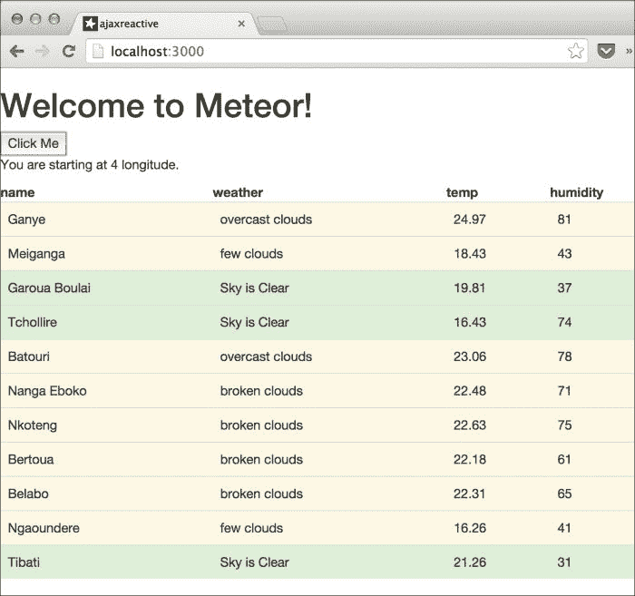

随着你的点击，给定区域的天气结果将显示出来，向北移动。

## 它是如何工作的…

在这种情况下，我们没有使用自动反应的 Mongo 集合。相反，我们调用了`openweather.org api`，并使用`set`方法更新了`ReactiveVar`库（在这种情况下，`weatherList`变量）。因为模板辅助函数依赖于对该相同`ReactiveVar`的`get`方法的调用，所以当`ReactiveVar`更新时，它们会自动重新运行。让我们来分解一下。

我们首先在 HTML 中创建了`weather`模板：

```js
<template name="weather">
  {{#if reports}}
  ...
  {{/if}}
</template>
```

模板使用`{{#each...}}`块遍历`reports`辅助对象，用结果填充 HTML 表格。

接下来，在我们的客户端 JavaScript 中，我们使用新的`ReactiveVar`库声明了我们的反应式变量`weatherlist`：

```js
weatherlist = new ReactiveVar;
```

然后，我们在`reports`辅助对象中使用了`weatherlist.get()`，该对象位于`Template.weather.helpers`：

```js
reports: function () {
  ...
  return weatherlist.get();
}
```

通过在这里使用它，我们设置了一个依赖关系，以便每次调用`weatherlist.set()`时，模板的数据都会刷新，并且模板会更新/重新运行。

最后，我们使用`HTTP.get()`将我们的按钮连接到 Ajax 调用，并将`harvestWeather`函数作为回调（`HTTP.get(url,arg,callback)`）：

```js
function getWeather() {
  var long1 = ...
  HTTP.get("...", harvestWeather);
}
```

一旦回调被触发，它会整理 Ajax 调用中的数据，并使用`weatherlist.set()`重新填充我们的反应式变量：

```js
function harvestWeather(error, data) {
  ...
    weatherlist.set(weather.list);
}
```

如前所述，当这个`set`函数被调用时，它会使模板函数无效，并反应式地更新我们的 UI。

你可以在回调函数（`harvestWeather`）和天气模板辅助函数（`reports`）中非常清楚地看到，这些调用是常规的、纯 JavaScript。我们实际上只是在调用一个`get`或`set`函数。因为我们调用这些函数的对象是一个`ReactiveVar`，所以所有反应式依赖和 UI 更新都由我们处理。

你可以快速看到 Meteor 的反应式编程模型是多么强大。我们不是在处理事件和处理器，也不是担心回调地狱，我们使用了简单的、干净的`set`命令，让 Meteor 为我们处理所有细节。

## 参见

+   在第三章的*创建动态列表*食谱中，*构建出色的用户界面*

+   本章的*创建和消费反应值*食谱

# 创建一个自定义库的反应性

因为我们经常处理变量和数据，所以有时会忽略 Meteor 的响应性不仅适用于响应式值。任何 JavaScript 库中的任何函数都可以被转换成响应式提供者。这个配方将向你展示如何使用 `Tracker.depend()` 和 `Tracker.changed()` 命令创建自己的响应式提供者。

## 准备工作

为了使示例简单，我们将使用默认的 Meteor 项目，包含一个 `bootstrap` 包和一个随机颜色生成器。打开一个终端窗口，导航到您想要创建根项目的地方，并执行以下命令：

```js
$ meteor create customreactive
$ cd customreactive
$ meteor add twbs:bootstrap
$ meteor add rzymek:randomcolor
$ meteor

```

## 如何操作…

让我们假设你有一个（相当酷）的库叫做 `colorsaurus`。你的 `colorsaurus` 对象喜欢咆哮。很多。主要是因为在恐龙语中，“rawr”意味着“我爱你”，而且 `colorsaurus` 希望尽可能多地与所有朋友分享随机颜色。每次你从这个杂色生物那里请求一个颜色时，它会立即给你一个随机颜色。这显然是有史以来最有用的库，所以让我们开始构建它！

1.  打开 `customreactive.js` 并在 `Template` 声明下方添加以下 `colorsaurus` 对象，位于 `Meteor.isClient` 条件语句内：

    ```js
    colorsaurus = {
        color: function(){
            return randomColor();
        },
        rainbowRoar: function (){
            console.log('rawr');
        }
    };
    ```

1.  当我们在 `customreactive.js` 中时，让我们添加 `numcolor` 辅助函数。定位到 `Template.hello.helpers` 方法，并在方法顶部添加以下内容：

    ```js
    Template.hello.helpers({
     numcolor: function(){
     return colorsaurus.color();
     },
      counter: ...
    });
    ```

1.  保存您的更改，导航到 `http://localhost:3000`，并在控制台窗口中输入以下命令：

    ```js
    > 
    colorsaurus.color()
    > colorsaurus.rainbowRoar()

    ```

1.  你应该会得到一个随机颜色和来自我们的朋友 `colorsaurus` 函数的一个简洁的 *我爱你*：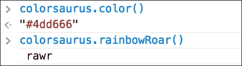

1.  它还不是响应式的，但我们需要先准备我们的用户界面，以便释放响应式 `colorsaurus` 函数的所有强大功能。打开 `customreactive.html` 并对 `hello` 模板进行以下修改：

    ```js
    <button id='btnColor'>Click Me</button>
    <p style="color:{{numcolor}}">You've pressed the button {{counter}} times.</p>
    ```

1.  现在，我们需要更改 `click` 事件以使 `colorsaurus` 发出咆哮声。在 `customreactive.js` 中修改 `Template.hello.events` 部分，如下所示：

    ```js
    Template.hello.events({
        'click button': function () {
          // increment the counter when button is clicked
          Session.set("counter", Session.get("counter") + 1);
     colorsaurus.rainbowRoar();
        }
      });
    ```

1.  剩下的工作就是让 `colorsaurus` 具有响应性并设置一个 `autorun` 函数。再次打开 `customreactive.js` 并添加以下响应式语句，包括添加 `Tracker.Depenency` 对象：

    ```js
    var colorDep = new Tracker.Dependency;

    colorsaurus = {
        color: function(){
     colorDep.depend();
            return randomColor();
        },
        rainbowRoar: function (){
            console.log('rawr');
     colorDep.changed();
        }
    };
    ```

1.  现在，在 `colorsaurus` 代码块之后立即添加一个 `Tracker.autorun` 函数，如下面的代码所示：

    ```js
    Tracker.autorun(function(){
        $('#btnColor').css('background-color' , colorsaurus.color());
        $('body').css('background-color', colorsaurus.color());
     });
    ```

1.  保存您的更改，转到您的浏览器，并点击按钮，直到您的小小心灵渴望为止。您将获得一些非常棒的颜色组合，如下面的截图所示：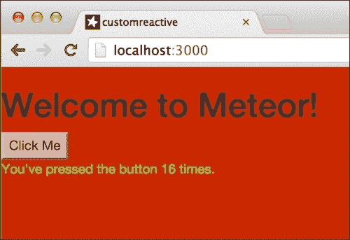

## 它是如何工作的…

注意按钮、文本和页面背景是如何变化的，并且它们都变成了随机、不同的颜色。这是因为我们使用了一个响应式库函数，每次调用时都会返回一个随机颜色，而不是返回一个固定的变量。

通过让我们的 `color()` 函数返回 `randomColor()` 的结果，我们确保每次调用 `colorsaurus.color()` 时，都会得到不同的结果。

我们在返回函数中添加了 `colorDep.depend()`，这会记录由 `Tracker.autorun` 或响应式模板（见本章中 *创建和消费响应式值* 的配方，以获取完整解释）创建的计算。

最后，我们调用了 `colorDep.changed()`，这会运行记录的计算。

代码的每一部分都是独立的，因此不依赖于其他代码部分或库。通过 `Tracker.Dependency` 对象，Meteor 会为我们跟踪一切，这样我们就可以随意添加或删除响应式依赖项。例如，尝试在您的浏览器控制台中运行以下行：

```js
> Tracker.autorun(function(){console.log(colorsaurus.color());});

```

现在，每次您点击页面上的按钮时，您都会从 `colorsaurus` 获得另一个随机颜色，并将其打印到您的控制台：

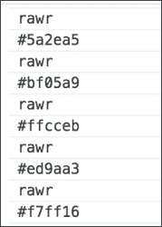

这就是最好的响应式编程。Rawr！

## 参见

+   第三章 中 *使用响应性与 HTML 属性* 的配方，*构建出色的用户界面*

+   本章中 *创建和消费响应式值* 的配方

# 无 Mongo 更新 Blaze 模板

我们的用户界面中的并非所有内容都必须依赖于 Mongo 集合。实际上，我们可以在模板中使用几乎任何响应式对象，并且更改将立即显示。这个配方将快速向您展示如何使用自定义集合来填充和更新 UI 模板。

## 准备工作

让我们从基础 Meteor 项目开始，并添加 `bootstrap` 和 `reactive-var` 包。在终端窗口中，导航到您希望项目驻留的位置，并输入以下命令：

```js
$ meteor create mongoless
$ cd mongoless
$ meteor add twbs:bootstrap
$ meteor add reactive-var
$ meteor

```

最后，打开浏览器并导航到 `http://localhost:3000`，以便您可以看到实时更新。

## 如何做到这一点...

我们将创建一个简单的按钮点击快照数组，每次页面上的按钮被点击时，都会向数组中添加一个新元素。随后，这些按钮将使用 `{{#each}}` 模板块添加到 UI 中。

1.  首先，打开 `mongoless.html` 并将以下块添加到 `hello` 模板中，紧随 `<p>` 元素之后，并在关闭 `</template>` 标签之前，如下例所示：

    ```js
    {{#each buttonPresses}}
     <div class="btn btn-info pressed">#{{btnRank}}</div>
    {{/each}}
    </template>
    ```

1.  现在，我们需要添加一个响应式变量并将一些辅助函数附加到 `Template.hello.helpers` 对象上。打开 `mongoless.js` 并添加以下高亮代码：

    ```js
    if (Meteor.isClient) {
     presses = new ReactiveVar;
      // counter starts at 0
      Session.setDefault("counter", 0);

      Template.hello.helpers({
        counter: function () {
          return Session.get("counter");
        },
     buttonPresses: function(){
     return presses.get();
     },
     btnRank: function(){
     return this.rank;
     }
      });
    ```

1.  剩下的只是每次按钮被按下时更新 `presses` 变量。在 `Template.hello.events` 中，在 `'click button'` 事件处理程序中，在 `Session.set()` 调用之后立即添加以下代码行：

    ```js
    Session.set("counter", Session.get("counter") + 1);
    var _presses = presses.get() || [];
    _presses.push({rank:Session.get("counter")});
    presses.set(_presses);

    ```

1.  保存所有更改，打开你的浏览器，并开始点击标记为 **点击我** 的按钮。你应该会在每次点击按钮时看到一个新按钮被创建，类似于以下内容：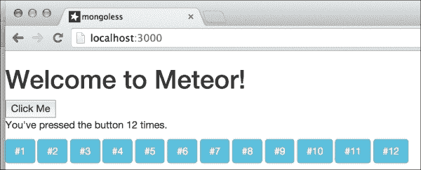

## 它是如何工作的…

当我们将 `buttonPresses` 辅助函数添加到 `Template.hello.helpers` 对象时，我们只是用存储在 `ReactiveVar` 元素内的简单数组替换了我们通常会用 MongoDB 集合来做的操作：

```js
presses = new ReactiveVar;
```

集合是响应式提供者，这意味着它们会根据需要跟踪和重新运行计算。`presses` 对象也是一个响应式提供者，因此它执行完全相同的事情。当值更新时，它会重新运行任何存储的计算/响应式函数。在这种情况下，当数组被修改并且调用 `presses.set()` 时，它会重新运行计算。

## 参见

+   第三章中的 *Creating dynamic lists* 菜谱，*Building Great User Interfaces*

+   本章中的 *Creating and consuming a reactive value* 菜谱

# 使用内联数据动态修改 UI 元素

通常，当 HTML 页面中的元素被渲染时，这种渲染并不直接与创建它们的任何数据相关联，例如，如果我们有一个对象数组，我们可能会通过遍历数组并为数组中的每个对象添加 `<div>` 元素来生成一些 HTML。除非我们手动将它们与对象数组相关联，否则这些新创建的元素在没有任何方式与创建它们的数据相关联。这导致开发者尝试强行加入关联数据，这些数据用于事件和其他下游函数。简而言之，仅使用现有的网络技术，很难确保所有数据与 HTML DOM 元素完全同步。Meteor 被设计用来优雅地解决这个问题，跟踪每个 DOM 元素的上下文，因此允许即时访问最初创建元素时使用的数据。这个菜谱将指导你如何检索和使用与单个 DOM 元素关联的数据。

## 准备工作

我们将使用本章中找到的 *Updating Blaze templates without Mongo* 菜谱中的代码库。请完成该菜谱，然后在项目根目录中运行以下终端命令来添加 `randomcolor` 包：

```js
> meteor add rzymek:randomcolor

```

请确保你的浏览器也打开到 `http://localhost:3000`，这样我们就可以实时看到更改。

## 如何操作...

我们将向现有的按钮创建功能添加一些功能。首先，我们将为每个新按钮添加一个随机颜色；其次，当按钮被点击时，我们将移除该颜色；第三，我们将根据关联的内联数据恢复颜色。

那么，让我们开始吧。我们需要更新`hello`模板，为新按钮设置初始背景颜色。我们还需要一种随机移除这些颜色的方法。我们将通过添加一个新的控制按钮来实现这一点。

1.  打开你的`.html`文件（可能是`mongoless.html`），修改`hello`模板以使其看起来如下：

    ```js
    <template name="hello">
      <button id="addBtn">Click Me</button>
     <button id="chgColor">Or Me!</button>
      <p>You've pressed the button {{counter}} times.</p>
      {{#each buttonPresses}}
        <div class="btn btn-info pressed"
     style="background-color:{{btnColor}}">
        #{{btnRank}}</div>
      {{/each}}
    </template>
    ```

1.  现在，我们需要将`btnColor`辅助函数添加到`Template.hello.helpers`中，并修改存储的数据对象以为新颜色腾出空间。我们还需要细化按钮上的`click`事件，以区分添加新按钮和移除按钮颜色。打开你的`.js`文件（可能是`mongoless.js`），对变量声明和辅助函数进行以下更改：

    ```js
    if (Meteor.isClient) {
      presses = new ReactiveVar;
     counter = new ReactiveVar(0);

      Template.hello.helpers({
        counter: function () {
     return counter.get();
        },
        buttonPresses: function () {
          return presses.get();
        },
        btnRank: function () {
          return this.rank;
        },
     btnColor: function () {
     return this.color;
        }
      });
      ...
    ```

1.  现在，我们需要修改现有的`click`事件，添加一个新的事件来移除颜色，并添加一个最终的处理程序来设置所有新按钮在点击时恢复颜色。对`Template.hello.events`部分进行以下更改：

    ```js
    Template.hello.events({
        'click #addBtn': function () {
          // increment the counter when button is clicked
          counter.set(counter.get() + 1);
          var _presses = presses.get() || [];
     var newBtn = {
     color: randomColor(),
     rank: counter.get()
     };
     _presses.push(newBtn);
          presses.set(_presses);
        },
     'click #chgColor': function () {
     var rndBtn = ~~(Math.random() * counter.get());
     $('.pressed')[rndBtn].style.backgroundColor = '';

     },
     'click .pressed': function (e, n) {
     e.currentTarget.style.backgroundColor = this.color;
     }
      });
    ```

1.  保存所有更改并点击屏幕上的**点击我**按钮 5-10 次。你会注意到所有新添加的按钮都被分配了随机颜色，如下面的截图所示：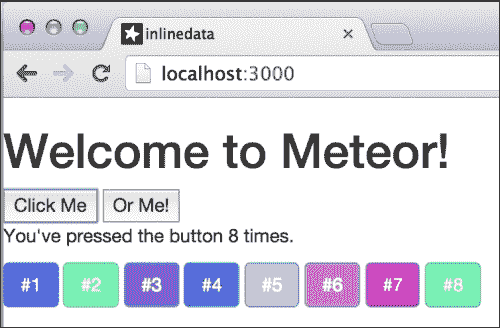

1.  现在，多次点击**或我**按钮。随机地，按钮会失去随机颜色并变为由`bootstrap`提供的默认`btn-info`蓝色，如下面的截图所示：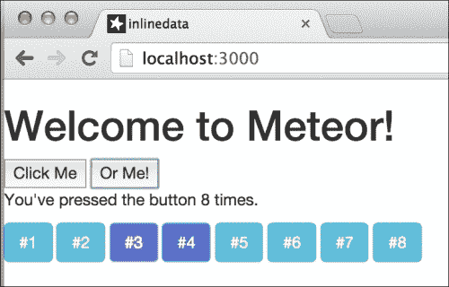

任何失去颜色的按钮都可以通过直接点击按钮来恢复颜色。

## 它是如何工作的…

这个菜谱的核心在于`'click .pressed'`事件处理程序内部。在那里，我们将点击按钮的`backgroundColor`属性分配给`this.color`：

```js
'click .pressed': function (e, n) {
  e.currentTarget.style.backgroundColor = this.color;
}
```

在这种情况下，有一个对该 DOM 元素相关联的数据对象的引用。Meteor 跟踪每个元素是如何创建的。因此，当模板内部发生事件时，Meteor 将数据对象作为*上下文*（即`this`）在事件处理程序中提供。这样，Meteor 可以提供对每个渲染元素的内置数据的即时访问。

注意，即使我们手动使用`'click #chgColor'`事件更改了`backgroundColor`，Meteor 仍然保留用于渲染元素的 data 对象的引用。这变得很重要，因为我们现在不再需要将数据作为 DOM 元素的属性存储——不再需要`data-color`或`data-whatever`属性来杂乱无章地填充 UI 并可能暴露数据。虽然数据对象对 UI 是隐藏的，但它们可以立即和直接地访问。因此，为了访问必要的相关数据，不需要进行任何复杂的计算或 DOM 操作。

## 还有更多…

上述示例使用默认的 Meteor `Template` 事件处理器，因此当然数据是可用的。但是，即使您绕过 Meteor 的 `Template` 事件处理器并使用，例如，jQuery 事件，通过调用元素的 `Blaze.getData()` 函数，相关数据也将可用。

在此情况下设置事件处理器有点棘手。我们必须首先将每个按钮的填充移动到新的模板中，因为 jQuery `click` 事件处理器必须在 `rendered()` 函数回调内部运行。为此，请对您的 `.html` 文件（可能是 `mongoless.html`）进行以下更改：

```js
<template name="hello">
  <button id="addBtn">Click Me</button>
  <button id="chgColor">Or Me!</button>
  <p>You've pressed the button {{counter}} times.</p>
  {{#each buttonPresses}}
 {{> helloBtn}}
  {{/each}}
</template>
<template name="helloBtn">
 <div class="btn btn-info pressed"
 style="background-color:{{btnColor}}">
 #{{btnRank}}</div>
</template>

```

您还需要从 `Template.hello.events` 中移除 `'click .pressed'` 事件处理器。一旦移除事件处理器，请在 `Template.btnRank.rendered` 代码块内添加 `jQuery.click()` 事件处理器，以便在新按钮渲染时立即运行，如下面的代码所示：

```js
Template.helloBtn.rendered = function () {
    this.$('.pressed').click(function (e) {
      e.currentTarget.style.backgroundColor = Blaze.getData(this).color;
    });
  };
```

最后，由于我们将 `div` 渲染移动到了新的 `helloBtn` 模板，我们需要将 `btnRank` 和 `btnColor` 辅助函数从 `Template.hello.helpers` 移动到新创建的 `Template.helloBtn.helpers` 块，如下面的代码所示：

```js
Template.helloBtn.helpers({
  btnRank: function () {
    return this.rank;
  },
  btnColor: function () {
    return this.color;
  }
});
```

这是一项大量工作以获得相同的结果，但它有助于说明 Blaze/Meteor 关联数据功能的灵活性。我们只需稍微修改事件辅助函数，将其指向 `Blaze.getData(this).color` 而不是 `this.color`。尽管每个事件处理器中都有相同的关键字，但 jQuery 事件处理器内的 `this` 指的是 DOM 元素，而不是原始 Meteor 事件处理器内的关联数据对象。`Blaze.getData(element)` 以 DOM 元素作为参数，并检索该元素的关联内联数据。

在任何情况下，获取相关数据都非常简单，这允许您以编程方式对 UI 进行任何操作，而无需担心破坏/更改与每个渲染元素关联的数据。

## 参见

+   在 第三章 的 *使用 Spacebars 插入模板* 和 *创建动态列表* 菜谱中，请参阅 第三章。

# 集成 jQuery UI

jQuery 库非常受欢迎，这是有充分理由的。当正确使用时，它可以加快开发过程，并为我们提供可靠的方式来执行那些否则需要大量编码的工作。

jQuery 的补充是 jQuery UI，它是一组小部件、主题和动画效果。使用 jQuery UI，您可以快速创建拖放组件、可排序列表以及许多其他有用的 UI 美化功能。

本食谱将指导您在 Meteor 模板中创建一个 jQuery UI-sortable 小部件。

## 准备工作

对于这个配方，我们肯定希望客户端和服务器文件夹保持代码的整洁和可读性。为了实现这一点，我们将依赖我们的默认模板脚手架。请使用 第一章 中 *设置你的项目文件结构* 配方创建一个名为 `swatches` 的新项目，作为你的起始文件结构。

一旦完成脚手架搭建，我们需要将 `randomcolor` 包添加到我们的项目中。在终端窗口中，导航到你的项目根目录，并运行以下命令：

```js
> meteor add rzymek:randomcolor

```

我们还希望有一个漂亮的主题，所以让我们使用 Google 的 Material Design 主题的修改版，以增添乐趣。在相同的终端窗口中输入以下命令：

```js
> meteor add html5cat:bootstrap-material-design

```

接下来，我们想要直接从 `jqueryui.com` 获取 jQuery UI 的定制版本。在浏览器中导航到 [`jqueryui.com/`](http://jqueryui.com/)，并点击右侧的 **Custom Download**：

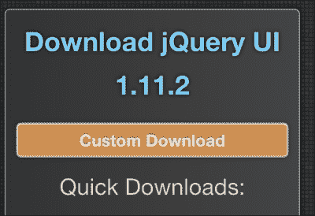

在下载构建器中，进行以下选择：

+   选择最新稳定版本

+   在 **Components** 下取消选择 **Toggle All** 复选框

+   在 **UI Core** 下选择 **Toggle All** 复选框

+   在 **Interactions** 下选择 **Sortable** 复选框

+   在底部，从 **Theme** 下拉菜单中选择 **No Theme**

你的选择将类似于以下截图：

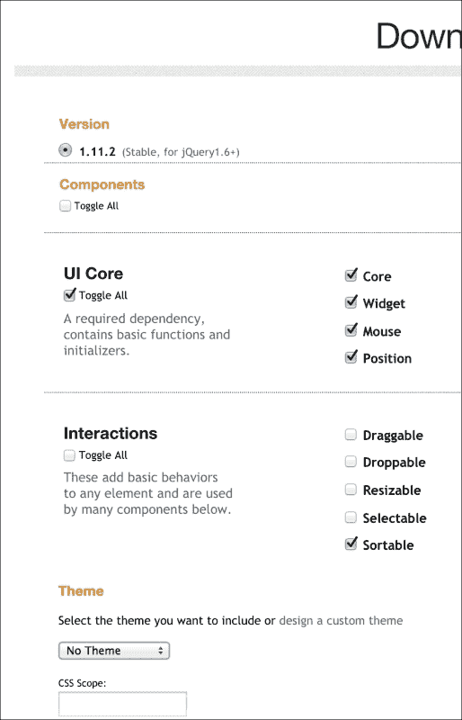

我们只需要可排序交互和 UI 核心。其他所有内容都会增加我们的文件大小，所以我们将省略它们。点击 **Download**，下载完成后解压文件，找到 `jquery-ui.min.js` 文件，并将其复制到 `[project root]/client/lib/scripts` 文件夹中。

我们可以简单地使用社区包引入 jQuery UI，但它体积较大，并且不能帮助我们了解如何在 Meteor 中使用未打包的第三方库。因此，我们将采用这种手动安装方式。

打开浏览器到 `http://localhost:3000`，以便我们可以实时查看更改。我们现在已准备好将 jQuery UI-sortable 小部件添加到我们的项目中。

## 如何操作...

我们将创建色卡，它们将显示它们所代表的十六进制代码，并且它们将是可排序的，这意味着我们可以通过拖放来移动它们。

1.  要实现这一点，我们首先需要创建一个 `Swatches` 集合，该集合在客户端和服务器上均可访问。在你的 `[project root]/both/` 文件夹中，创建或编辑一个名为 `model.js` 的文件，并添加以下集合声明：

    ```js
    Swatches = new Mongo.Collection('swatches');
    ```

1.  接下来，让我们使用名为 `swatches` 的模板创建我们的用户界面。打开或创建 `[project root]/client/main.html` 文件，删除所有内容，并添加以下代码：

    ```js
    <head>
      <title>Swatches</title>
    </head>

    <body>
      {{> colors}}
    </body>

    <template name="colors">
      <h1>Yay Colors!</h1>
      <div id="cList">
          {{#each swatches}}
              <div class="swatch"
     style="background-color:{{color}}">
    {{color}}</div>{{color}}</div>
          {{/each}}
      </div>
      <input id="btnNew" type="button" class="btn btn-primary" value="New Color" />
    </template>
    ```

1.  我们希望对其进行一点格式化，以便使色卡尺寸保持一致。打开或创建一个名为 `[project root]/client/lib/styles/style.css` 的文件，并添加以下 CSS 声明：

    ```js
    .swatch {
        min-height: 100px;
        min-width: 100px;
        display:inline-block;
        color:white;
        text-align: center;
    }
    #cList {
        width: 520px;
    }
    ```

1.  最后，我们将创建添加色卡并能够将它们拖动到屏幕上的逻辑。打开/创建 `[项目根]/client/scripts/main.js` 文件，删除文件内的所有内容，并添加以下 `Template.helpers` 和 `Rankings` 声明：

    ```js
    Template.colors.helpers({
        swatches: function(){
            return Swatches.find({},{ sort: { rank:1}});
        }
    })

    Rankings = {
        beforeFirst: function(first) { return first - 1;},
        middle: function(before,after){ return (before+after)/2;},
        afterLast: function(last){ return last + 1; }
    };
    ```

1.  现在，有趣的部分来了！我们将创建 `jQuery.sortable` 对象及其 `stop()` 函数，并使用常规 jQuery 将我们的 `button.click` 事件处理器连接起来。为了正确添加 `sortable` 和 `click` 事件处理器，我们需要在 `Template.rendered()` 函数内部声明它们。在 `main.js` 文件中，在 `Rankings` 声明下方，输入以下代码：

    ```js
    Template.colors.rendered = function(){
        this.$('#cList').sortable({
            stop: function (e,ui){
                var el = ui.item.get(0);
                var before = ui.item.prev().get(0);
                var after = ui.item.next().get(0);
                var newRank = null;
                if (!before){
                    newRank = Rankings.beforeFirst(Blaze.getData(after).rank);
                } else if (!after) {
                    newRank = Rankings.afterLast(Blaze.getData(before).rank);
                } else {
                    newRank = Rankings.middle(Blaze.getData(before).rank,Blaze.getData(after).rank);
                }
                Swatches.update(Blaze.getData(el)._id,
                                {$set: {rank:newRank}});
            }
        });

        this.$('#btnNew').click(function(e){
            var newColor = randomColor({luminosity:'random',
    hue:'random'});
           Swatches.insert({color:newColor, rank: Swatches.find().count()+1});
        });
    };
    ```

保存所有更改，然后转到你的浏览器。页面应该有一个标有 **NEW** **COLOR** 的漂亮、时尚的蓝色按钮。每次你点击这个按钮，都会添加一个新的色卡，颜色是随机的。如果你将任何色卡从一个位置拖放到另一个位置，色卡将会适当地重新排序。这种重新排序不是临时的。如果你刷新页面或打开另一个浏览器窗口，你通过拖放所做的重新排序将会保持。

例如，假设你将色卡从最后一个元素移动到第一个。这个变化将会保持，并且任何打开到同一页面的其他客户端/浏览器将立即反映这个变化。

当以下紫色色卡被拖动并放置时，变化将如以下截图右侧所示：

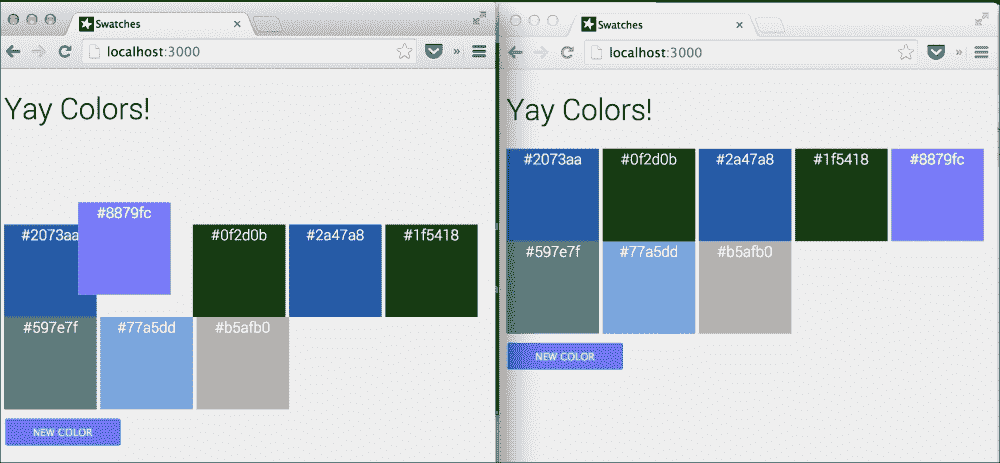

如以下截图所示，它会在每个 UI 中立即更新：

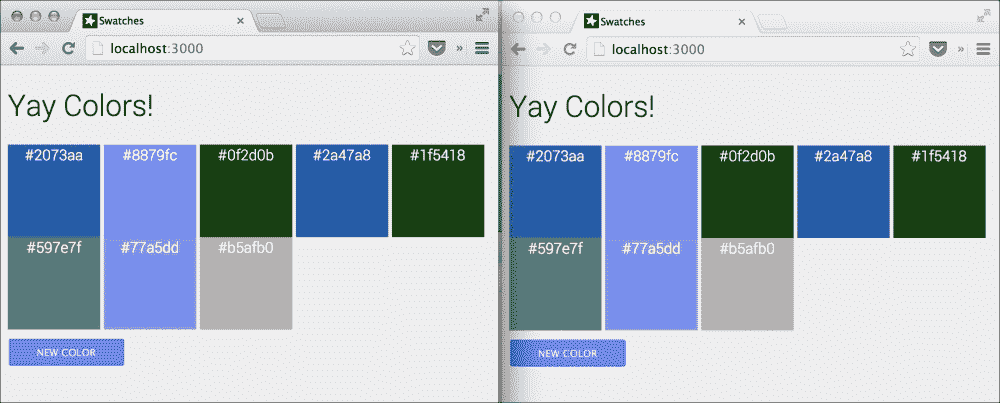

## 它是如何工作的...

多亏了我们的 `click` 事件处理器，每当使用 `Swatches.insert()` 添加色卡时，都会为该色卡分配一个排名：

```js
this.$('#btnNew').click(function(e){
  ...
  Swatches.insert({..., rank: Swatches.find().count()+1});
});
```

如果我们查看 `Template.colors.helpers` 中的 `swatches` 辅助函数，我们可以看到 MongoDB 的 `Collection.find()` 查询是按 `rank` 排序的：

```js
swatches: function(){
  return Swatches.find({},{ sort: { rank:1 }});
}
```

这保留了 UI 中色卡的顺序，并允许我们通过拖放来操作它们的顺序。

在我们的 `sortable.stop()` 函数内部，我们正在确定色卡被拖动并放置到列表中的位置。一旦我们确定了色卡的位置，我们就使用 `Rankings` 辅助函数计算该色卡的新排名。然后我们立即使用新排名更新 `swatches` 集合，这将传播并使 UI 的位置变化永久化。

## 更多内容...

关键要点在于，虽然可以使用 jQuery（或任何其他第三方库）来执行直接的 DOM 操作，但这些操作不会超出单个用户的会话，甚至不会超出服务器下一次 DDP 变更。

为了使操作永久化并充分利用 Blaze 渲染引擎的出色响应式编程模型，我们需要修改数据源（在这种情况下，是 `swatches` 集合）。修改将立即处理，而且不需要我们做任何努力，通过响应式来实现。

因此，为了回顾，第三方库可以直接在 Meteor 应用程序中操作 DOM 元素，第三方代码将在`Template.rendered()`函数块内部执行。

要使更改“生效”，我们只需更新相应的 Mongo 集合即可。使用这种技术，我们可以几乎集成所有现有的 JavaScript 库（如果还没有人为我们完成[`atmospherejs.com/`](https://atmospherejs.com/)上的工作）。

## 参见

+   第一章中的*设置你的项目文件结构*配方，*优化你的工作流程*

+   本章中的*使用内联数据动态修改 UI 元素*配方
