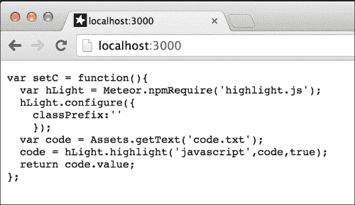
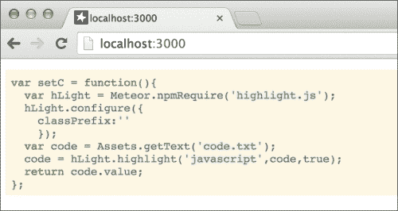
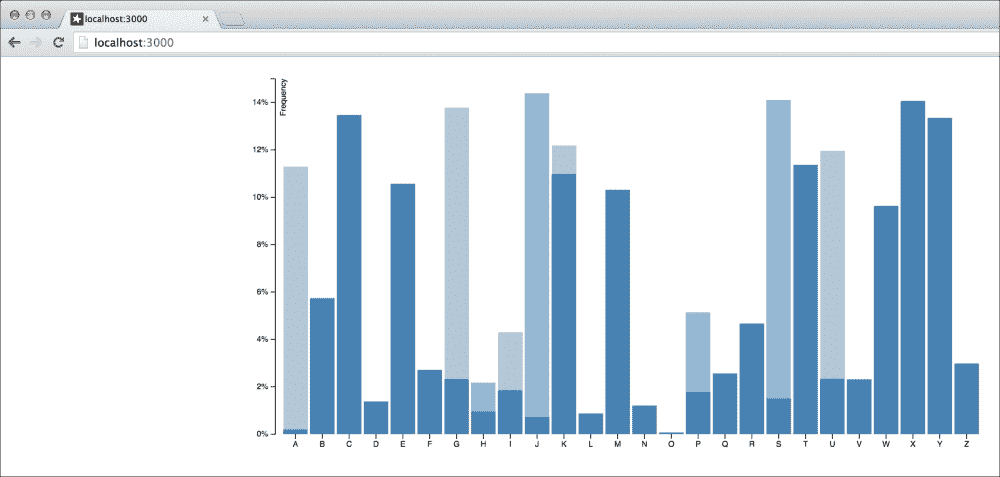
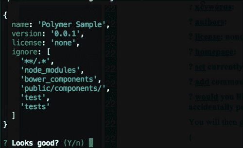
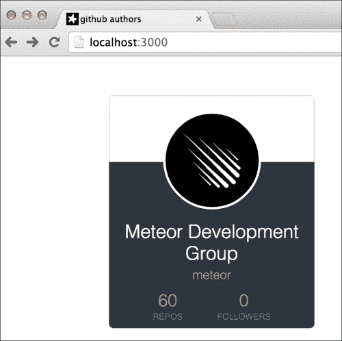
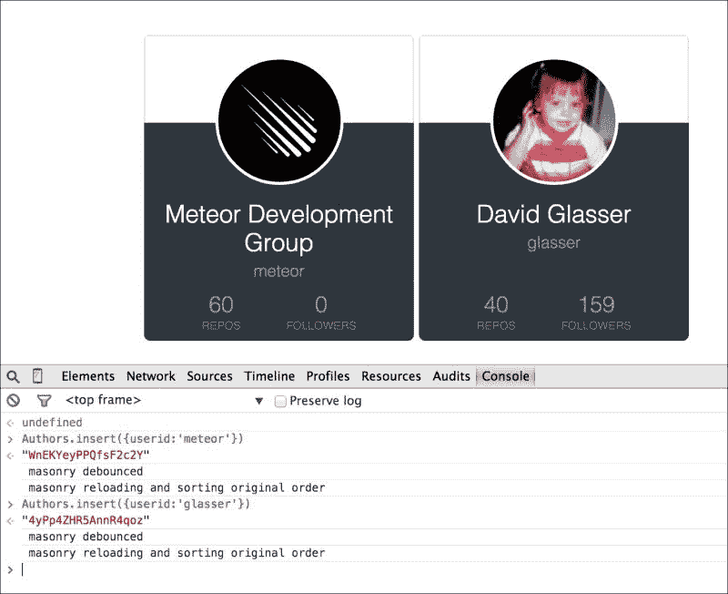
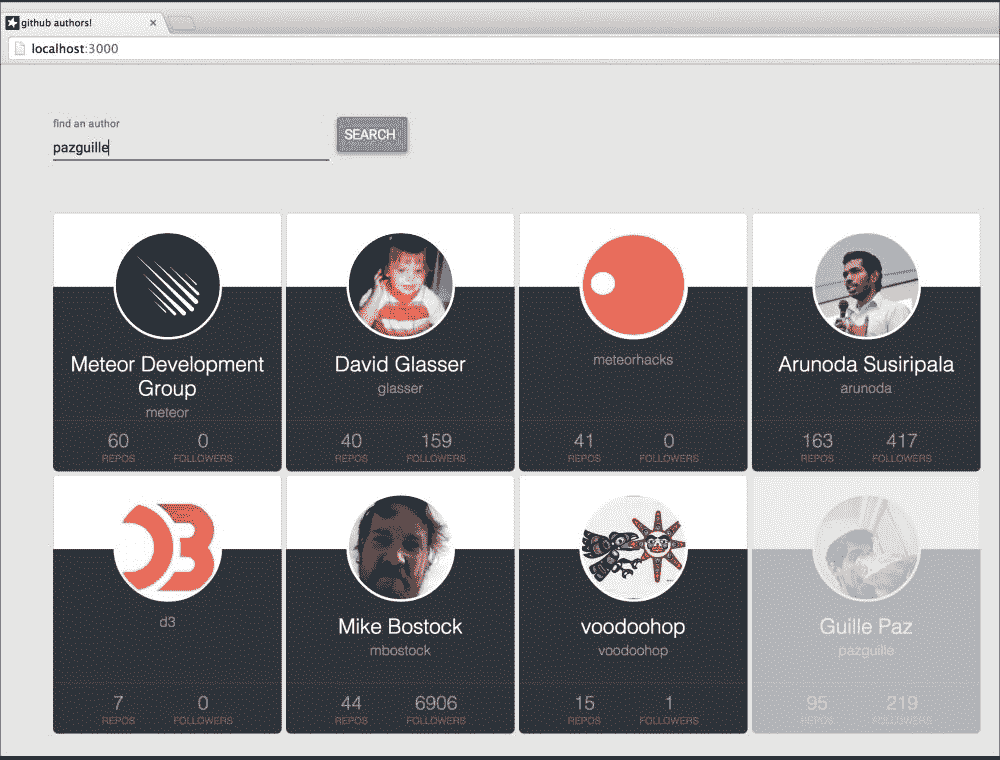

# 第八章。集成第三方库

在本章中，您将学习以下主题：

+   直接使用 npm 包

+   使用 D3.js 构建图表

+   使用 Polymer 创建前沿的 UI

# 简介

由于 Atmosphere 提供了如此多的第三方包，因此构建任何东西都非常容易！如果您有特定的开发需求——某种类型的逻辑或库——很可能其他人已经为您打包好了（如果还没有，那将是一个很好的机会！）。

话虽如此，并非所有包都是平等的。一些将拥有出色的文档，包括如何在 Meteor 中实现库的示例和教程。而另一些则不然。在任何情况下，您最终都需要自己动手做一些工作。在本章中，我们将介绍一些更受欢迎的第三方库，并展示如何在 Meteor 中实现它们。

# 直接使用 npm 包

在第二章中，我们通过“使用 npm 模块”配方了解了如何使用 `Npm.depends()` 指令将 npm 包封装到您自己的个人包中，这是在“使用包进行自定义”部分的内容。这当然很好，但如果我们只想直接使用 npm，而不创建自定义包呢？Arunoda Susiripala——最富有创造力（且才华横溢）的 Meteor 社区开发者之一，已经编写了一个包，可以帮助我们实现这一点。在本配方中，您将学习如何使用 `meteorhacks:npm` 包直接在您的代码中实现 npm 模块。具体来说，我们将使用 `Highlight.js` 模块在服务器上正确格式化 JavaScript 代码，就像您在 Markdown 或在线代码编辑器中看到的那样。

## 准备工作

我们将使用默认项目安装，包括 `client`、`server` 和 `both` 文件夹，以保持代码的整洁和可读性。我们还将使用 `private` 文件夹来存储一些静态内容，所以让我们在此时添加它。在终端窗口中，导航到您希望项目驻留的位置，并执行以下命令：

```js
$ meteor create npmdirect
$ cd npmdirect
$ rm npmdirect.*
$ mkdir {client,server,private,both}

```

我们还希望使用 `meteorhacks:npm` 包，所以现在就让我们来做吧。在终端中运行以下命令：

```js
$ meteor add meteorhacks:npm
$ meteor

```

最后，我们希望打开浏览器到 `http://localhost:3000`，这样我们就可以观看有趣的内容了！我们现在已经准备好开始创建我们的直接 npm 集成。

## 如何做到这一点...

我们将添加 `Highlight.js` Node 模块，并添加一些示例代码来利用该模块，使用内联模板作为我们的工作区域。按照以下步骤直接使用 npm 包：

1.  我们首先将添加 `Highlight.js` Node 模块。为了添加直接使用的 npm 模块，我们将在 `packages.json` 文件中进行简单的声明，该文件是在我们添加 `meteorhacks:npm` 时自动添加到我们的项目中的。打开 `[项目根目录]/packages.json` 并添加以下声明：

    ```js
    {
     "highlight.js" : "8.4.0"
    }
    ```

    如果您查看运行 Meteor 的终端窗口，您将看到类似以下文本的内容：

    ```js
    npm-container: updating npm dependencies -- highlight.js...
    => Meteor server restarted

    ```

    我们的 `Highlight.js` 模块现在可以使用了！

1.  我们现在将创建使用 `Highlight.js` 所需的服务器逻辑。在 `[项目根目录]/server/` 目录中创建一个名为 `server.js` 的文件。打开该文件进行编辑，并添加以下代码：

    ```js
    Meteor.methods({
      highlight : function(){
        return setC();
      }
    });

    var setC = function(){
      var hLight = Meteor.npmRequire('highlight.js');
      var code = Assets.getText('code.txt');
      code = hLight.highlight('javascript',code,true);
      return code.value;
    };
    ```

1.  接下来，让我们在 `private` 文件夹中创建一个示例代码文件。我们将使用一个基础文本文件来突出显示代码，以便使语法更加简单（而不是尝试在 JavaScript `var` 中完成，这可能会因为转义序列而变得混乱）。Meteor 允许我们使用 `[项目根目录]/private/` 文件夹来存储仅在服务器上可见的静态文件。在 `private` 文件夹中创建一个名为 `code.txt` 的文件，并在文件中添加一些（有效的）JavaScript 代码。我们将重用前一步中的 `var setC = …` 函数，但你可以放入任何你想要的，只要它是有效的 JavaScript。一旦添加了代码，保存你的更改。

1.  我们现在需要创建一个简单的代码面板模板。在 `[项目根目录]/client/` 中创建一个名为 `main.html` 的文件。打开该文件进行编辑，并添加以下代码：

    ```js
    <body>
    {{> code}}
    </body>
    <template name="code">
      <pre class="hljs">{{{highlighted}}}</pre>
    </template>
    ```

1.  在模板就位后，我们可以添加 `Template.code.helpers` 并使用 `Meteor.call()`。在 `[项目根目录]/client/` 中创建一个名为 `tmpl-code.js` 的文件，并添加以下代码：

    ```js
    Template.code.helpers({
      highlighted : function(){
        return Session.get('code');
      }
    });

    Meteor.startup(function(){
      Meteor.call('highlight', function(e,d){
        if (e) return;
          Session.set('code',d);
      });
    });
    ```

    保存这些更改后，你的 `code.js` 文件中的代码将可见，尽管几乎没有 CSS 格式化。如果你检查浏览器，你应该会看到以下类似的截图：

    

1.  嗯，这并不那么令人印象深刻，对吧？让我们通过一些自定义 CSS 真正突出显示正在发生的事情。在浏览器中，导航到官方的 `Highlights.js` 主题列表，位于 [`github.com/isagalaev/highlight.js/tree/master/src/styles`](https://github.com/isagalaev/highlight.js/tree/master/src/styles)，并选择你喜欢的任何主题。只需单击主题名称，然后单击标有 **Raw** 的按钮，并复制相应的 CSS 代码。然后，在你的 `[项目根目录]/client/` 文件夹中创建一个名为 `style.css` 的文件，粘贴你复制的代码，并保存文件。你的格式化文本现在应该有一些明显的格式化和着色，类似于以下截图（这是 `Solarized Light` 主题，从我们之前提到的链接中的 `solarized_light.css` 复制而来）:

## 工作原理...

在我们的 `server.js` 文件中，我们创建了一个简单的 `Meteor` 方法，该方法通过 `Meteor.call()` 在客户端可用并被调用。我们创建了一个单独的函数，即使在方法内部调用也不必要（我们本可以直接在方法调用中放置逻辑），因为我们希望保持代码的整洁和易于理解。在 `setC()` 函数内部，我们通过使用 `Meteor.npmRequire()` 直接使用一个 npm 模块：

```js
var hLight = Meteor.npmRequire('highlight.js');
```

通过`Assets.getText()`快速引用我们的文本文件，我们将示例代码通过`.highlight()`方法管道输入到`Highlights.js`文件中，该方法以语言(`'javascript'`)作为参数，让模块知道我们希望在结果格式化文本中看到哪种语言高亮：

```js
var code = Assets.getText('code.txt');
code = hLight.highlight('javascript',code,true);
return code.value;
```

我们返回格式化后的文本，随后通过`Session.get('code')`变量更新客户端 UI。模板渲染原始 HTML 字符串，多亏了使用`{{{triple moustaches}}}`而不是双大括号，我们添加的 CSS 文件则负责美化。

简而言之，这确实非常简单——通过添加`meteorhacks:npm`包，我们可以在`packages.json`文件中简单地声明我们希望使用的 npm 模块，然后在 Meteor 中通过`Meteor.npmRequire()`函数直接使用它们。

## 更多内容...

如您所知，npm 严格异步运行且非阻塞。这意味着在许多情况下，当您想在 Meteor 中使用 npm 模块，并希望同步使用时，您需要将调用包装在`Async`包装器中。我们将在第十一章（*利用高级功能*）中更深入地探讨如何做到这一点，但`meteorhacks:npm`包允许我们通过`Async.wrap()`和`Async.runSync()`方法快速/轻松地做到这一点。

### 小贴士

要了解更多关于`Async.wrap`和其他在`meteorhacks:npm`中可用的方法，请参阅[`atmospherejs.com/meteorhacks/npm`](https://atmospherejs.com/meteorhacks/npm)上的介绍。

最后，尽管它没有文档说明（因此不是官方支持/可能更改），核心 Meteor 服务器库中使用了某些 npm 模块，这些模块在服务器端是公开和可用的。要使用这些模块中的任何一个，只需在您的服务器代码中使用`Npm.require()`，您不需要实现任何其他内容。您可以直接使用它们。截至`v1.0.2`的当前列表如下：

+   `child_process`

+   `crypto`

+   `fibers`

+   `fibers/future`

+   `fs`

+   `http`

+   `os`

+   `path`

+   `semver`

+   `source-map-support`

+   `underscore`

+   `url`

## 参见

+   在第二章（*使用包进行自定义*）的*使用 npm 模块*食谱中，*使用包进行自定义*

+   在第三章（*构建出色的用户界面*）的*使用三重大括号插入原始 HTML*食谱中，*构建出色的用户界面*

+   在第十一章（*利用高级功能*）的*处理异步事件*和*使用异步函数*食谱中，*利用高级功能*

# 使用 D3.js 构建图表

在 Meteor 中使用第三方库来渲染内容非常简单且易于操作，而且市面上有很多优秀的库。我们个人非常喜欢的一个库是 `D3.js` 库([`d3js.org/`](http://d3js.org/))。它有很好的文档支持，并且是其他（大多数）自包含图形渲染库实现的一个典型例子。在这个菜谱中，我们将创建一个包含动画的演示图形应用程序，使用 `D3.js`。

## 准备工作

我们将使用默认的项目安装，包括 `client`、`server` 和 `both` 文件夹，并且当然需要官方的 `D3.js` 包。在一个终端窗口中，导航到你希望项目存放的位置，并执行以下命令：

```js
$ meteor create d3sample
$ cd d3sample
$ rm d3sample.*
$ mkdir {client,server,both}
$ meteor add d3js:d3
$ meteor

```

现在我们可以开始构建一些 D3 的示例图形了！

## 如何操作...

通常，`D3.js` 数据源是手动更新，或者作为某种类型的数据源的结果进行更新，调用某种类型的 `update` 语句。由于 Meteor 允许反应式计算（参见第六章 *掌握反应性* 中的 *创建和消费反应性值* 菜谱），我们将把 `D3.js` 渲染逻辑直接放入一个 `Tracker.autorun()` 计算中。让我们设置我们的反应性数据源，将渲染逻辑放入一个 `autorun` 中，并且为了增加效果，添加一些动画！

1.  我们首先需要创建和初始化 `Letters` 集合。在你的 `[项目根目录]/both/` 文件夹中创建一个名为 `model.js` 的文件，并添加以下代码：

    ```js
    Letters = new Mongo.Collection('letters');
    ```

    让我们同时添加这个集合的初始化。在你的 `[项目根目录]/server/` 文件夹中，创建一个名为 `server.js` 的文件，并添加以下 `Meteor.startup` 函数代码：

    ```js
    Meteor.startup(function(){
      if (!Letters.find().fetch().length){
        Letters.insert({letter:'A',frequency:.08167});
        Letters.insert({letter:'B',frequency:.01492});
        Letters.insert({letter:'C',frequency:.02782});
        Letters.insert({letter:'D',frequency:.04253});
        Letters.insert({letter:'E',frequency:.12702});
        Letters.insert({letter:'F',frequency:.02288});
        Letters.insert({letter:'G',frequency:.02015});
        Letters.insert({letter:'H',frequency:.06094});
        Letters.insert({letter:'I',frequency:.06966});
        Letters.insert({letter:'J',frequency:.00153});
        Letters.insert({letter:'K',frequency:.00772});
        Letters.insert({letter:'L',frequency:.04025});
        Letters.insert({letter:'M',frequency:.02406});
        Letters.insert({letter:'N',frequency:.06749});
        Letters.insert({letter:'O',frequency:.07507});
        Letters.insert({letter:'P',frequency:.01929});
        Letters.insert({letter:'Q',frequency:.00095});
        Letters.insert({letter:'R',frequency:.05987});
        Letters.insert({letter:'S',frequency:.06327});
        Letters.insert({letter:'T',frequency:.09056});
        Letters.insert({letter:'U',frequency:.02758});
        Letters.insert({letter:'V',frequency:.00978});
        Letters.insert({letter:'W',frequency:.02360});
        Letters.insert({letter:'X',frequency:.00150});
        Letters.insert({letter:'Y',frequency:.01974});
        Letters.insert({letter:'Z',frequency:.00074});
      }
    });
    ```

1.  当我们打开 `server.js` 文件时，让我们快速添加一个更新频率的辅助方法，稍后我们会用到。将以下代码添加到 `server.js` 文件中：

    ```js
    Meteor.methods({
      updateFrequency : function(letter,frequency){
        Letters.update({letter:letter},
          {$set:{frequency:frequency}});
      }
    });
    ```

1.  现在，我们将添加一些简单的脚手架和样式。我们的 HTML 非常简单，因为 `D3.js` 正在执行繁重的工作。尽管如此，我们仍然希望将我们的 `svg` 元素放入一个 Meteor 模板中。导航到你的 `[项目根目录]/client/` 文件夹，创建一个名为 `client.html` 的文件，并添加以下代码：

    ```js
    <body>
      {{> diagram}}
    </body>

    <template name="diagram">
      <svg class="chart"></svg>
    </template>
    ```

    让我们添加一些简单的样式来调整字体和颜色等。创建一个名为 `[项目根目录]/client/style.css` 的文件，并添加以下 CSS 声明：

    ```js
    .bar {
      fill: steelblue;
    }
    .bar:hover {
      fill: brown;
    }
    .axis {
      font: 10px sans-serif;
    }
    .axis path,
    .axis line {
      fill: none;
      stroke: #000;
      shape-rendering: crispEdges;
    }
    .x.axis path {
      display: none;
    }
    ```

    我们现在准备好在 `rendered`/`autorun` 中添加 `D3.js` 渲染逻辑。以下代码几乎逐行来自 Mike Bostock 的关于 `D3.js` 的出色入门教程。最简单的事情就是从该教程的现有代码库中复制粘贴到本地文件，然后进行修改。要做到这一点，请在浏览器中导航到 [`bl.ocks.org/mbostock/3885304`](http://bl.ocks.org/mbostock/3885304)，并将 `<script>` 标签内的所有内容复制到结束的 `</script>` 标签。在您的 `[项目根]/client/` 文件夹中创建一个名为 `client.js` 的文件，并将代码粘贴到新文件中（大约 60 行代码）。

    我们现在将以以下四种方式修改该页面的代码：

    +   将所有代码包裹在 `Template.rendered` 回调中

    +   在 `autorun` 计算中包裹和扩展 `d3.selectAll` 渲染代码

    +   将轴渲染代码移出 `autorun`

    +   将数据更改为指向我们的 `Letters.find()` MongoDB 查询

    完成的 `Template.diagram.rendered` 回调如下所示。它主要由 `D3.js` 示例代码组成，前四个修改已突出显示。如果更容易，您可以直接从下面复制粘贴，而不是自己进行修改。然而，至少浏览一下这些更改，看看代码是如何修改的。在您的 `client.js` 文件中，对现有代码进行以下修改：

    ```js
    Template.diagram.rendered = function(){
     //we wrap everything in the Template.rendered() callback,
     // so that we don't interfere with Blaze
      var margin = {top: 20, right: 20, bottom: 30, left: 40},
        width = 960 - margin.left - margin.right,
        height = 500 - margin.top - margin.bottom;

     //We are going to set the domains for x an y immediately
     //(assuming the alphabet isn't going to change)
     x = d3.scale.ordinal()
      .domain('ABCDEFGHIJKLMNOPQRSTUVWXYZ'.split(''))
      .rangeRoundBands([0, width], .1);

     //ALSO: note that we *removed* the 'var' declarations,
     //so that x and y are global / accessible
     y = d3.scale.linear()
      .domain([0,0.15])
      .range([height, 0]);

      var xAxis = d3.svg.axis()
      .scale(x)
      .orient("bottom");

      var yAxis = d3.svg.axis()
      .scale(y)
      .orient("left")
      .ticks(10, "%");

     // We are moving the axes creation (and SVG init)
     // to be *outside* our autorun()
      var svg = d3.select("body").append("svg")
      .attr("width", width + margin.left + margin.right)
      .attr("height", height + margin.top + margin.bottom)
      .append("g")
      .attr("transform", "translate(" + margin.left + "," + margin.top + ")");

      svg.append("g")
      .attr("class", "x axis")
      .attr("transform", "translate(0," + height + ")")
      .call(xAxis);

      svg.append("g")
      .attr("class", "y axis")
      .call(yAxis)
      .append("text")
      .attr("transform", "rotate(-90)")
      .attr("y", 6)
      .attr("dy", ".71em")
      .style("text-anchor", "end")
      .text("Frequency");

      //We move D3.js rendering inside Tracker.autorun()
      this.autorun(function(){
        // Instead of reading data from a static file,
        // we access the Letters collection
        var data = Letters.find().fetch();
        if (!data.length) return;

        // To use D3.js's built-in update tracking,
        // we need access to our d3.selectAll() object..
        var bars = svg
        .selectAll(".bar")
        .data(data, function(d){return d._id;});

        // On new (when initializing), we append and animate
        bars.enter()
        .append("rect")
        .attr("class", "bar")
        .attr("x", function(d) { return x(d.letter); })
        .attr("width", x.rangeBand())
     .attr("height",0)
     .attr("y", height)
     .transition()
        .attr("y", function(d) { return y(d.frequency); })
        .attr("height", function(d) { return height - y(d.frequency); });

        // On change, we just animate to the new position
        bars
        .transition()
        .duration(200)
        .ease("sin-out")
        .attr("y", function(d) { return y(d.frequency); })
        .attr("height", function(d) { return height -       y(d.frequency); });

      });
    };
    ```

1.  我们现在可以创建和调用 `randomize` 函数。我们的页面现在应该可以正确渲染了（请在 `http://localhost:3000` 上检查并亲自验证），但它没有移动或做任何其他事情。让我们通过为我们的字母更改随机频率值来改变这一点。在 `client.js` 的底部，`autorun` 块之后，以及渲染的 `callback` 块的结束括号之前，添加以下定时器调用：

    ```js
    });//<--- end of autorun()

    // everything's set! let's randomize 5 times / second...
     Meteor.setInterval(randomize,200);

    };//<-- end of rendered()
    ```

    最后，在文件的底部添加 `randomize()` 函数，在所有其他内容之后：

    ```js
    // Our randomize function
    randomize = function(){
      // get a random position between 0-25
      var ranLetter = ~~(Math.random()*26),
      // and a random frequency between 0-15%
        ranFreq = (Math.random()*0.15);

      // get the actual character
      ranLetter = x.domain()[ranLetter];

    // update the frequency using a server call,
    // because it's easier than tracking down the _id
      Meteor.call('updateFrequency',ranLetter,ranFreq);
    };
    ```

    保存所有更改，您的条形图应该会快乐地跳跃，类似于以下截图：

    

## 它是如何工作的…

在整合 `D3.js`（以及由此扩展的任何其他渲染引擎）时，有两个关键规则需要记住：

1.  将所有您的 DOM/SVG 操作逻辑放在 `Template.rendered()` 内

1.  使数据源具有反应性，并将渲染逻辑包裹在 `Tracker.autorun()` 内

当我们将整个 `D3.js` 逻辑从教程中添加到 `Template.diagram.rendered()` 中时，我们遵循了规则 #1。这告诉 Blaze 不要干涉我们将要做的任何事情。我们实际上是在告诉 Blaze 去抽根烟休息一下，同时我们实现一些传统的 DOM/SVG 操作（以及动画！）。

然后，我们不是依赖于非响应式数据源，在那里我们不得不定期检查更新和/或每当结果更改时调用`update()`函数，而是通过在`autorun`函数中包装`D3.js`逻辑来使用 Meteor 的声明式、响应式编程风格。由于`var data = Letters.find().fetch()`是一个响应式数据源，这个`autorun`函数将在`Letters`集合有更改时重新运行。

换句话说，我们通过创建一个`D3.js`友好的响应式计算来遵循规则#2，而不是使用像流浪汉一样的功能（非响应式）数据模型。Mike Bostock 会为我们感到骄傲，因为避免使用函数式编程是`D3.js`的核心原则之一。

由于`D3.js`示例代码，我们似乎写了大量的代码，而且我们省略了一些细节，例如将`y`和`x`轴渲染逻辑移出`autorun`函数（因为我们不希望每次都重新渲染），但实际上真的很简单。注意在`randomize()`函数内，我们的更新语句是多么的简单（并且松散耦合）：一行。

当涉及到第三方渲染器时，使用 `rendered()` 进行包装，并使用 `autorun()` 进行响应式处理。

### 小贴士

使用 `rendered()` 进行包装，使用 `autorun()` 进行响应式处理。

## 还有更多……

我们强烈建议您深入了解`D3.js`，正如之前提到的，它运行在相同的声明式编程原则之上，正如它与 Meteor 的集成如此干净一样，这确实有原因，对于 SVG 图表和动画来说，它确实是顶级的。

### 小贴士

`D3.js`的教程可以在[`github.com/mbostock/d3/wiki/Tutorials`](https://github.com/mbostock/d3/wiki/Tutorials)找到。

## 参考以下内容

+   在第三章的*创建动态列表*食谱中，*构建出色的用户界面*。

+   在第七章的*使用 SVG 和 Ajax 创建动态图表*食谱中，*使用客户端方法*，创建前沿的 UI。

# 使用 Polymer 创建尖端 UI。

Polymer ([`www.polymer-project.org/`](https://www.polymer-project.org/))是雄心勃勃的。它以最好的方式雄心勃勃，如果它成功，它将使我们的开发生活变得更好。

作为网络开发者，我们经历的最大浪费时间活动之一是调整 CSS，重新定位 DOM 元素，并尝试手动编写动画。并不是说这些事情不好（我们中的一些人非常喜欢设计良好的组件）；而是几乎每次，当引入新的项目或设计主题时，我们的努力都会付诸东流。

通过使用在所有现代浏览器上（至少目标是这样的——雄心勃勃，对吧？）都能正常工作的可重用、可靠的组件，Polymer 旨在将设计从开发中抽象出来，让开发者专注于开发，设计师专注于设计。

这个食谱将向您展示如何在 Meteor 应用程序中使用 Polymer 组件。

## 准备工作

我们将把实际的步骤分解为两部分：配置 Meteor 和 Polymer 以及将 Polymer 元素添加到我们的应用中。因此，我们将把配置和设置放在 *准备工作* 步骤中，以使代码和代码的解释更容易理解。

### 创建你的应用和文件夹

我们将需要一些我们通常不使用的文件夹和子文件夹，所以让我们先整理好整个文件结构。打开终端窗口，导航到你想要创建根项目的地方，并执行以下命令：

```js
$ meteor create polymersample
$ cd polymersample
$ rm polymersample.*
$ mkdir -p client/templates/init
$ mkdir {both,server}
$ mkdir -p public/components

```

### 创建你的文件

为了节省以后逐个创建文件的时间，我们现在就一次性创建它们。在同一个终端窗口中，在你的 `[项目根目录]` 文件夹中，执行以下命令：

```js
$ touch .bowerrc
$ touch client/imports.html
$ touch client/main.html
$ touch client/styles.css
$ touch client/templates/tmpl-authors.html
$ touch client/templates/tmpl-authors.js
$ touch client/templates/tmpl-search.html
$ touch client/templates/tmpl-search.js
$ touch client/templates/init/head.html
$ touch both/model.js
$ touch server/server.js

```

### 配置 Bower 和安装 Polymer

**Bower** 是安装 Polymer 库最安全、最好的方式，因为它确保我们拥有最新和最好的版本。你需要确保已经安装了 Bower。如果没有，在你的终端窗口中运行以下命令：

```js
$ npm install -g bower

```

### 小贴士

你可能需要以 `sudo` 运行 npm，因为你正在全局安装。如果是这样，请运行以下命令：

```js
sudo npm install -g bower.

```

安装 Bower 后，我们想要告诉 Bower 我们希望将 Polymer 组件安装在哪里。在 Meteor 中，那就是在 `public`/`components` 文件夹中。在文本编辑器中打开 `[项目根目录]/.bowerrc` 文件，添加以下行并保存更改：

```js
{"directory":"public/components/"}
```

我们现在已准备好使用 Bower 初始化我们的项目。在终端窗口中，在你的 `[项目根目录]/` 目录中，输入以下命令：

```js
$ bower init

```

Bower 即将问你很多问题！好消息是大多数问题的答案是 *回车键*，或者 *空格键然后回车键*。更好的消息是，大多数答案并不真正重要。但是，你需要完成这个过程，这样 Bower 才会为你生成 `bower.json` 文件，该文件将跟踪我们安装了哪些 Polymer 库（关于这一点稍后详细说明），所以回答问题时可以参考以下示例：

```js
? name: Polymer Sample
? version: 0.0.1
? description: 
? main file: 
? what types of modules does this package expose?: 
? keywords: 
? authors: 
? license: none
? homepage: 
? set currently installed components as dependencies?: No
? add commonly ignored files to ignore list?: Yes
? would you like to mark this package as private which prevents it from being accidentally published to the registry?: Yes

```

然后，你将看到你的 `bower.json` 文件的预览，如下面的截图所示：



假设 `private:true` 和 `ignore:[...]` 已经设置好，输入 *Y* 并按 *Enter*。你的 Bower 配置现在已完成！

我们现在已准备好安装 Polymer 库。在同一个终端窗口中，依次输入以下命令，完成一个后再进行下一个：

```js
$ bower install polymer --save
$ bower install polymer/core-elements --save
$ bower install polymer/paper-elements --save
$ bower install polymer-github-card --save

```

在最后的安装中，Bower 将询问 `polymer` 和 `core-components` 的哪个版本将支持 `polymer-github-card`。选择其他组件所依赖的版本（截至本文撰写时，这是 `[library]#⁰.5.0`）。

### 添加辅助 Meteor 包

我们需要添加三个第三方包。其中之一（`voodoohop:masonrify`）将帮助我们布局，另外两个（`meteorhacks:inject-initial`和`differential:vulcanize`）将允许以最小的痛苦将 Polymer 元素添加到我们的 Meteor 项目中（我们怀疑这将在未来变得更好，但现在这是一个解决方案；而且说实话，这并不真的很糟糕）。在终端窗口中，在您的`[项目根目录]/`文件夹中，输入以下命令：

```js
$ meteor add voodoohop:masonrify
$ meteor add meteorhacks:inject-initial
$ meteor add differential:vulcanize

```

### 配置 Meteor

设置几乎完成！Meteor 通常与其他框架相处得很好，但由于 Polymer 有一些预渲染 DOM 操作（这真的很酷，但会干扰 Meteor 的魔力...）我们必须能够向`<body>`标签注入一个属性，我们还需要确保基本`polymer`和`webcomponents`文件被正确引用。

在编辑器中打开`[项目根目录]/server/server.js`文件，并添加以下 HTML 注入代码：

```js
Meteor.startup(function(){
  Inject.rawModHtml('addUnresolved',function(html){
    return html = html.replace('<body>', '<body unresolved>');
  })
});
```

现在我们将处理基本文件引用。打开`[项目根目录]/client/templates/init/head.html`文件，并添加以下代码：

```js
<head>
  <script src="img/webcomponents.js"></script>
  <title>github authors</title>
</head>
```

最后一步（这是为了让`vulcanize`能够合并所有组件引用），打开`[项目根目录]/client/imports.html`文件，并添加以下行：

```js
<!-- Components -->
<link rel="import" href="/components/polymer/polymer.html">

<!-- Styles -->
<link rel="import" href="/components/font-roboto/roboto.html">
```

设置已完成！让我们启动 Meteor（在终端中运行`meteor`命令），打开浏览器到`http://localhost:3000`，并开始使用 Polymer 组件！

## 如何做到这一点...

我们即将要做的事情有两个注意事项：首先，目前 Polymer 与 Chrome 浏览器配合得最好。下面的示例在其他浏览器中也能工作，但有一些特性，如`click`或`keypress`事件，可能会引起一些挫败感。其次，由于时间问题，当您修改代码时，可能需要手动刷新浏览器（这在使用 Meteor 时是非常罕见的）。

请记住，Polymer 还远未达到`1.0`版本——您使用这个配方正处于前沿——所以您需要耐心等待，因为我们将在 Meteor 中使用 Polymer 的基础知识。优化所有其他浏览器的时间、事件和其他行为本身就是一本书的内容，所以让我们专注于基础部分，随着 Meteor 和 Polymer 的发展，这些问题将自行解决。

1.  我们首先添加我们的 CSS 样式。Polymer 在这里做了大部分工作，所以让我们先处理我们必须要贡献的少量 CSS。打开`[项目根目录]/client/styles.css`文件，并添加以下 CSS 声明：

    ```js
    html,body {
      height: 100%;
      margin: 0;
      font-family: 'RobotoDraft', sans-serif;
    }
    .container {
      width: 80%;
      margin: 50px auto;
    }
    div.sText {
      display:inline-block;
      width: 20rem;
    }
    div.sBtn {
      display: inline-block;
      width: 5rem;
      vertical-align: text-top;
    }
    paper-button.colored {
      color: white);
    }
    paper-button[raised].colored {
      background: rgb(66, 133, 244);
      color: white;
    }
    ```

1.  让我们看看`polymer-github-card`组件，使用静态表示，只是为了看看我们在玩什么。打开`[项目根目录]/client/imports.html`文件，并在`Components`部分的`"…polymer.html"`条目下方添加以下行：

    ```js
    <link rel="import" 
    href="/components/polymer-github-card/dist/polymer-github-card.html">
    ```

    现在打开与文件夹相同的`main.html`文件，并添加以下代码：

    ```js
    <body>
      <div class="container">
        <polymer-github-card user="meteor"></polymer-github-card>
      </div>
    </body>
    ```

    在你的浏览器中，在`vulcanize`重新编译你的`<header>`之后，你应该会看到以下截图类似的内容：

    

1.  既然我们已经确认 Polymer 运行正常，让我们将`polymer-github-card`组件放入 Meteor 模板中，并创建基于 Mongo 集合添加多个卡片的能力。打开`[项目根目录]/both/model.js`并添加以下行：

    ```js
    Authors = new Mongo.Collection('authors');
    ```

1.  现在让我们创建我们的模板。你会记得我们正在使用`voodoohop:masonrify`来控制布局，因此我们需要将模板声明包裹在适当的`{{#masonry…}}`块中。打开`[项目根目录]/client/templates/tmpl-authors.html`并添加以下代码：

    ```js
    <template name="authors">
      {{#masonryContainer columnWidth=265 gutter=5 transitionDuration="0.2s" id="MasonryContainer" }}
        {{#each authors}}
          {{> authorCard}}
        {{/each}}
      {{/masonryContainer}}
    </template>

    <template name="authorCard">
      {{#masonryElement "masonryContainer"}}
        <div>
          <polymer-github-card user="{{userid}}">
          </polymer-github-card>
        </div>
      {{/masonryElement}}
    </template>
    ```

    再次强调，前面的代码的大部分与布局有关。实际调用动态填充`polymer-github-card`组件的代码位于`authorCard`模板中，并引用了`user`属性中的`{{userid}}`。`userid`是免费的，因为它是`Authors`集合中每条记录的属性。

1.  现在让我们创建`Template.helper`函数，通过`Collection.find()`函数传递`Authors`集合。打开`[项目根目录]/client/templates/tmpl-authors.js`并添加以下代码：

    ```js
    Template.authors.helpers({
      authors: function(){
        return Authors.find().fetch();
      }
    });
    ```

1.  当我们做这件事的时候，让我们使删除记录变得非常简单。在`tmpl-authors.js`中，在底部添加以下事件处理程序：

    ```js
    Template.authors.events({
      'dblclick polymer-github-card': function(e){
        Authors.remove({_id:this._id});
      }
    });
    ```

1.  我们现在需要修改我们的主模板以引用我们新的动态模板。打开`main.html`并修改内容，使其看起来如下：

    ```js
    <body>
     <div class="container">
     {{> authors}}
     </div>
    </body>
    ```

1.  保存所有更改，查看你的浏览器（给`vulcanize`一点时间来完成其任务），你应该会看到一个完全空白的页面。哇！这仅仅是因为我们的`Authors`集合是空的。让我们来修复这个问题。在你的浏览器控制台中，执行以下命令：

    ```js
    > Authors.insert({userid:'meteor'})
    > Authors.insert({userid:'glasser'})

    ```

    当你输入每个命令时，一个新的卡片会出现在适当的位置，带有 Meteor 标志和 David Glasser 微笑快乐的童年照片，如下截图所示：

    

    命令行已经过时了！让我们更新我们的页面，使用一些纸张元素组件，并给我们一个简单的方法来添加更多的 GitHub 作者。

1.  打开`[项目根目录]/imports.html`并为我们将要使用的组件添加链接（顺便说一下，这些组件位于我们的`public/components/`文件夹中…）在`"…polymer.html"`声明下方。完成后，你的文件应该看起来如下：

    ```js
    <!-- Components -->
    <link rel="import" href="/components/polymer/polymer.html">
    <link rel="import" href="/components/paper-ripple/paper-ripple.html">
    <link rel="import" href="/components/paper-shadow/paper-shadow.html">
    <link rel="import" href="/components/paper-input/paper-input.html">
    <link rel="import" href="/components/paper-button/paper-button.html">
    <link rel="import" href="/components/polymer-github-card/dist/polymer-github- card.html">

    <!-- Styles -->
    <link rel="import" href="/components/font-roboto/roboto.html">
    ```

    让我们创建我们的`search`模板，它将包含一个`paper-input`组件和一个`paper-button`组件。打开`[项目根目录]/client/templates/tmpl-search.html`并添加以下代码：

    ```js
    <template name="search">
      <div class="sText">
        <paper-input-decorator id="searchText"
          floatingLabel
          label="find an author">
          <input is="core-input" id="sInput">
        </paper-input-decorator>
      </div>
      <div class="sBtn">
        <paper-button raised class="colored" role="button" tabindex="0">
          search
          </paper-button>
      </div>
    </template>
    ```

    在 Meteor 方面，前面的代码没有什么特别之处。它只是直接的 Polymer 格式化和配置。

    ### 小贴士

    要了解更多关于 Polymer 组件的信息，请访问：

    [`www.polymer-project.org/docs/polymer/polymer.html`](https://www.polymer-project.org/docs/polymer/polymer.html).

1.  我们希望在执行搜索时添加新卡片，也就是说，在我们`paper-input`组件内部按下*Enter*键或点击我们的`paper-button`组件时。打开位于同一`client/templates/`文件夹中的`tmpl-search.js`，并添加以下代码：

    ```js
    Template.search.events({
      'keypress #sInput' : function(e){
        if (e.keyCode!=13) return;
        addAuthor();
      },
      'click paper-button': function(e){
        addAuthor();
      }
    });

    function addAuthor(){
      var sInput = $('#sInput'),
          sVal = sInput.val();
      sInput.blur();
      if (!sVal || (Authors.findOne({userid:sVal}))) return;
      sInput.val('');
      Authors.insert({userid:sVal});
    }
    ```

1.  最后一步是为我们的`search`模板在`main.html`中添加一个模板包含。打开`[项目根]/client/main.html`并添加以下高亮代码：

    ```js
    <body>
     <div class="container">
     {{> search}}
     </div>
      <div class="container">
        {{> authors}}
      </div>
    </body>
    ```

    完成了！在浏览器中查看您的应用程序，允许刷新/重新编译，您应该能够添加您想要的任何 GitHub 作者卡片。添加一些作者（建议：`meteorhacks` , `arunoda` , `d3` , `mbostock` , `voodoohop` , `pazguille` , `polymer` , `addyosmani`），在每次输入后都会出现新卡片，如下面的截图所示：

    

## 它是如何工作的…

我们很少需要参考“准备就绪”部分来完全理解正在发生的事情，但关于在哪里以及如何放置 Polymer 文件的环境很重要，所以让我们从这里开始。我们将 Bower 指向将所有 Polymer 文件放入属于`[项目根]/public/`的子文件夹。Meteor 对待`public`文件夹中的文件与其他文件夹不同——它将它们视为静态文件，并且不会处理其中找到的`.js`或`.html`文件。

这对我们有利，因为目前 Polymer 和 Meteor 渲染器之间存在一些相当棘手的冲突。具体来说，两者都使用`{{double-stache}}`符号和`<template>`标签，但它们的解释不同。为了解决这些冲突（诺贝尔和平奖即将到来！...）我们“隔离”每个框架，允许 Polymer 链接到`public`文件夹中的任何内容，并让 Meteor 忽略同一位置的所有内容。这几乎就像**Meteor 开发组**（**MDG**）有意这样设计的一样！当然，他们是这样的，预计并鼓励使用其他有偏见的框架。MDG 确实希望 Meteor 与其他人良好地协作，在这种情况下，它允许我们在应用程序中使用 Polymer。

还需要进行一些其他调整，例如在`<head>`块中插入链接元素，并将未解析的属性注入到`<body>`元素中，但这些只是小问题，只需一次性解决，一旦完成，我们就可以随心所欲地使用 Polymer 组件。

至于 Polymer 组件的使用，我们既可以直接使用它们（如步骤#2 所示），无需 Meteor 的参与，也可以将它们整合到我们的`{{#each…}}`模板或其他模板中。这样我们就有了访问正常的 Meteor `Template.helpers`和`Template.events`的权限，这为我们提供了对反应性数据的简单、声明式访问。

具体来说，如果我们查看`tmpl-authors.html`文件，我们会看到我们正在使用`{{#each authors}}`和`{{userid}}`模板助手，动态地迭代和渲染`polymer-github-card`组件：

```js
<template name="authors">
  ...
 {{#each authors}}
    {{> authorCard}}
 {{/each}}
  ...
</template>

<template name="authorCard">
  ...
    <polymer-github-card user="{{userid}}">
    </polymer-github-card>
  ...
</template>
```

在`tmpl-authors.js`和`tmpl-search.js`中，我们使用`Template.events`来解析`keypressed`、`click`和`dblclick`事件，并能够使用上下文（内联）数据来修改记录，例如当我们使用`Authors.remove({_id:this._id})`语句删除记录时：

```js
Template.authors.events({
  'dblclick polymer-github-card': function(e){
    Authors.remove({_id:this._id});
  }
});
```

## 更多内容...

Polymer 和 Meteor 之间存在大量交互和兼容性/性能的细微差别，这些内容超出了本食谱（以及本书）的范围。我们建议浏览 Stack Overflow ([`stackoverflow.com/questions/tagged/meteor`](http://stackoverflow.com/questions/tagged/meteor))、气象论坛([`forums.meteor.com/`](https://forums.meteor.com/))，或者直接打开 hood 进行实验，以获得更多关于正确集成 Polymer 和 Meteor 的经验。

## 参见

+   在第二章的*添加气象包*食谱，*使用包进行自定义*

+   在第三章的*创建自定义组件*食谱中，*构建出色的用户界面*

+   在第四章的*实现简单集合*食谱中，*创建模型*
