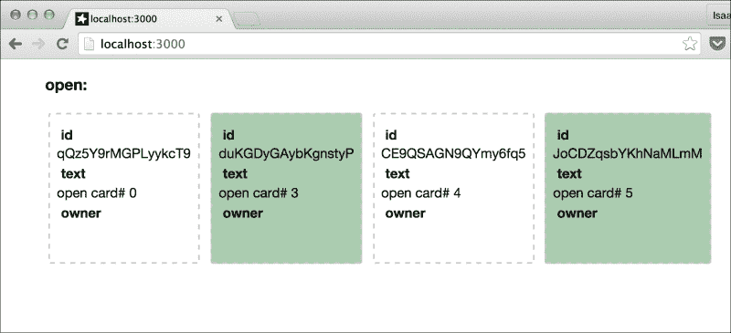
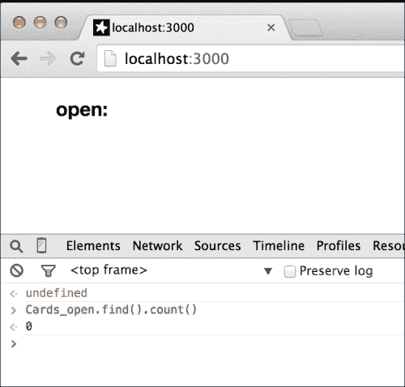
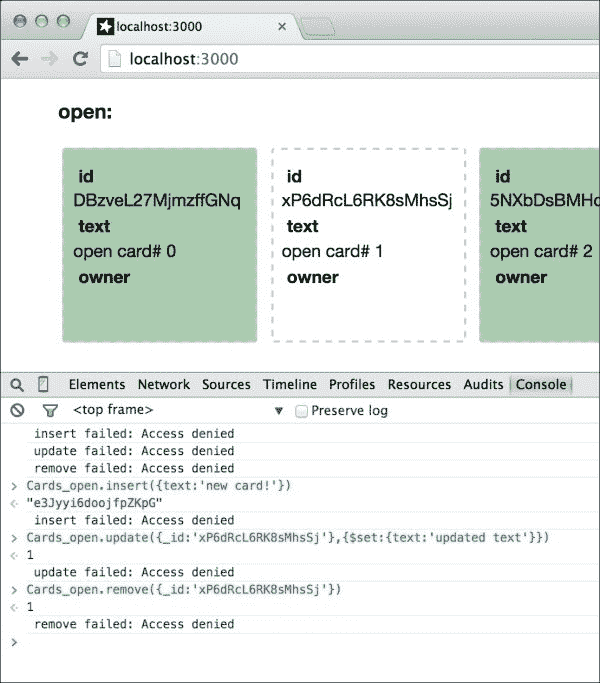
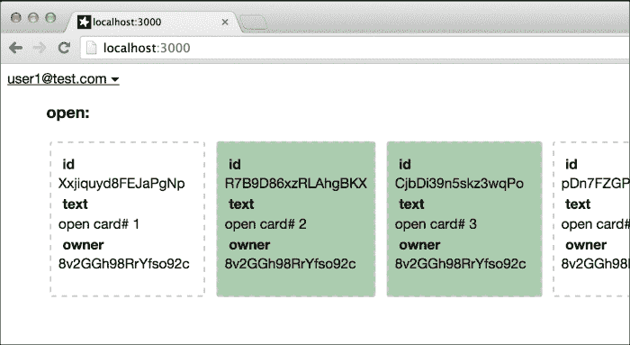
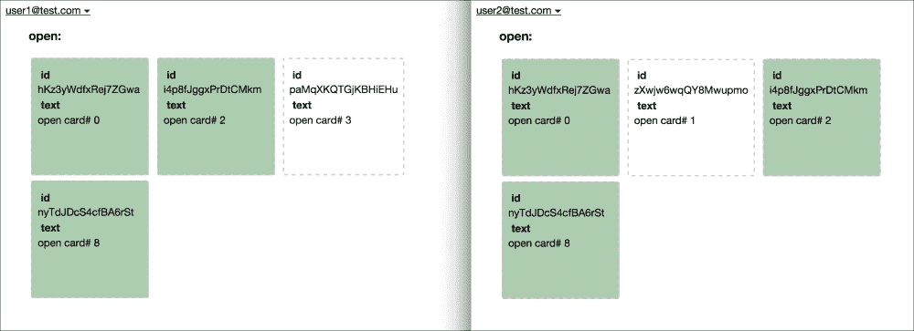
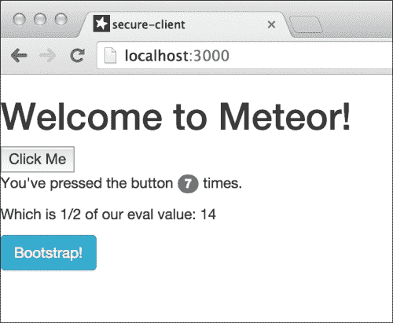
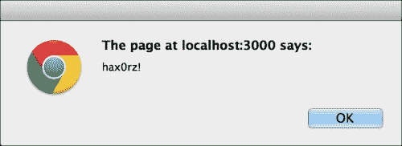
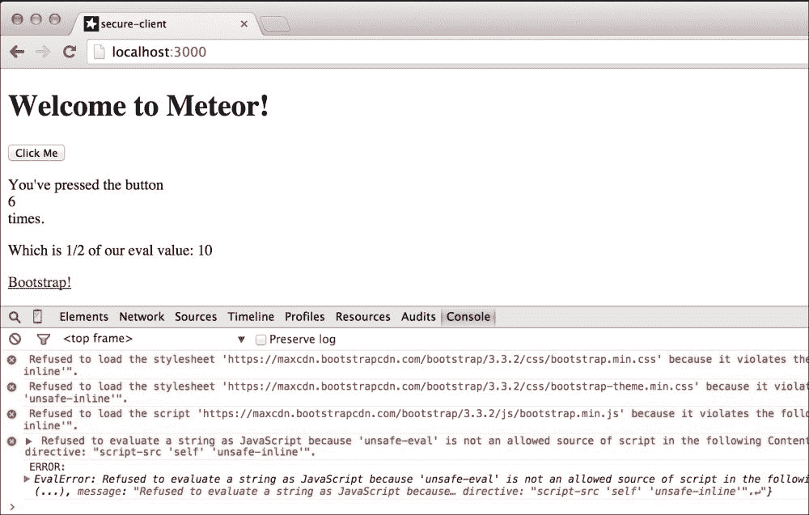
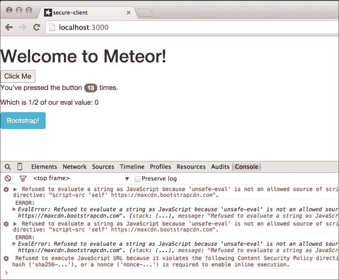

# 第九章。保护你的应用程序

在本章中，你将学习以下主题：

+   基本安全 - 关闭 `autopublish`

+   基本安全 - 移除 `insecure`

+   使用 `allow` 和 `deny` 保护数据交易

+   使用外观隐藏数据

+   使用 `browser-policy` 保护客户端

# 简介

Meteor 使开发和原型设计尽可能快速和简单。为了实现这一点，有一些默认包被安装，但在生产应用程序中并不需要。当你准备你的应用程序用于生产时，你将想要移除那些使原型设计更容易的包，并用一些安全最佳实践来替换它们，以使你的应用程序更加安全。在本章中，我们将讨论为生产准备应用程序所需的基线安全机制。

# 基本安全 - 关闭 autopublish

快速轻松地访问你的数据在原型设计时可以节省你大量的时间！默认情况下安装在每个新创建的 Meteor 应用程序中的 `autopublish` 包，使你能够快速管理和访问你的数据集合，以便你能够快速编写出优秀的代码。然而，当需要的时候，向每个数据集合中的每个字段广播是不高效且不安全的。这个配方将向你展示移除 `autopublish` 包的基本方法，并实现你自己的 `publish`/`subscribe` 代码以保持应用程序按预期工作。

## 准备工作

我们将创建一个非常基础的应用程序，在屏幕上显示简单的文本卡片，然后展示 `autopublish` 和 `subscribe`/`publish` 对这些卡片的影响。为此，我们需要创建我们的文件夹结构，添加一些基本模板，并添加一些样式。

### 项目设置

在终端窗口中，通过输入以下命令创建你的根项目：

```js
$ meteor create secure-autopublish
$ cd secure-autopublish
$ rm secure-autopublish.*
$ mkdir {client,server,both}
$ meteor

```

### 创建基本模板

在文本编辑器中，在你的 `[项目根目录]/both/` 文件夹中创建一个名为 `collections.js` 的文件，并添加以下行：

```js
Cards_open = new Mongo.Collection('open');
```

接下来，创建一个名为 `[项目根目录]/client/main.html` 的文件，并添加以下 `<template>` 和 `<body>` 声明：

```js
<body>
  <div class="container">
    {{> open}}
  </div>
</body>

<template name="open">
  <h3 id="new-open">open:</h3>
  {{#each opens}}
  <div class="card {{shared}}">
    <div class="label id">id</div>
    <div class="id">{{_id}}</div>
    <div class="label text">text</div>
    <div class="text">{{text}}</div>
    <div class="label owner">owner</div>
    <div class="owner">{{owner}}</div>
  </div>
  {{/each}}
</template>
```

我们只需要添加一点逻辑来显示和创建，然后我们就可以继续到样式部分。创建一个名为 `[项目根目录]/client/templatehelpers.js` 的新文件，并添加以下 `Template.helpers` 和 `Template.events` 函数：

```js
Template.open.helpers({
  opens: function(){
    return Cards_open.find({},{sort:{text:1}}).fetch();
  },
  shared: function(){
    return (this.shared? 'shared':null);
  }
});

Template.open.events({
  'dblclick #new-open' : function(e){
    e.preventDefault();
    var txt = 'open card# ' + Cards_open.find({}).count();
    Cards_open.insert({text:txt});
  },
  'click .text' : function(e){
    e.preventDefault();
    var shrd = (!this.shared);
    Cards_open.update({_id:this._id},{$set:{shared:shrd}});
  },
  'dblclick .id' : function(e){
    e.preventDefault();
    Cards_open.remove({_id:this._id});
  }
});
```

### 添加 CSS 样式

我们只需要一点 CSS 来使事物更具视觉吸引力。创建一个名为 `[项目根目录]/client/styles.css` 的文件，并添加以下 CSS：

```js
body {
  font-family: 'helvetica neue';
}
.card {
  display: inline-block;
  min-width:10rem;
  height: 10rem;
  border: 2px dashed #ccc;
  border-radius: 0.21rem;
  margin: 0.25rem 0.25rem;
  padding: 0.5rem;
  vertical-align: top;
}

.container {
  width:90%;
  margin: auto;
}

.shared {
  background-color: rgba(25, 121, 36, 0.36);
}

.label {
  font-weight: bold;
  margin: 0.2rem 0;
  padding: 0.1rem;
  padding-left: 0.3rem;
}

.label:hover {
  background-color: rgba(7, 180, 21, 0.76);
  border-radius: 0.2rem;
}
```

你的应用程序现在应该已经启动并运行。在浏览器中导航到 `http://localhost:3000`，然后双击 **open:** 标签来创建一些新的卡片。点击卡片中的 **text** 标签来修改共享属性（卡片将变为绿色），并双击 **id** 标签来删除卡片。经过一番操作后，你的屏幕将类似于以下截图：



如果一切正常，我们就准备好移除 `autopublish` 包。

## 如何操作...

按照以下步骤关闭 `autopublish`：

1.  在一个新的终端窗口（保持 Meteor 运行！）中，导航到你的 `[project root]` 并输入以下命令：

    ```js
    $ meteor remove autopublish

    ```

    你的网页屏幕现在将显示无结果，如果你对 `Cards_open` 集合进行计数，即使你创建了多个记录，计数也会返回 **0**：

    

1.  我们现在将添加 `publish` 和 `subscribe`。`Cards_open` 集合仍然存在。然而，由于我们移除了 `autopublish` 包，客户端和服务器之间的通信已经被切断。为了恢复它，我们需要在服务器上添加一个 `publish` 方法，并在客户端添加一个 `subscribe` 方法。创建一个名为 `[project root]/server/collections-server.js` 的文件，并添加以下 `publish` 函数调用：

    ```js
    Meteor.publish('open',function(){
      return Cards_open.find({});
    });
    ```

1.  现在，创建一个名为 `[project root]/client/collections-client.js` 的文件，并添加以下 `subscribe()` 函数调用：

    ```js
    Meteor.subscribe('open');
    ```

完成了！你已经成功移除了 `autopublish` 包，并重新创建了允许客户端仍然看到 `Cards_open` 集合所需的 `publish`/`subscribe` 调用。现在，当你使用之前提到的点击和双击创建、修改和删除时，你的浏览器应该能够正确显示结果。

## 它是如何工作的...

简而言之，`autopublish` 会检查存在哪些集合，并自动为你编写 `publish` 和 `subscribe` 函数调用。它为它找到的每个集合都这样做，因此既不高效也不安全。

通过移除 `autopublish`，我们停止了 `publish` 和 `subscribe` 函数自动调用。因此，我们必须重新创建这些调用，在服务器上创建一个简单的 `publish()` 调用（在 `'open'` 通道上），在客户端上创建一个 `subscribe()` 调用（在相同的 `'open'` 通道上）。

在 `publish` 函数中的 `find()` 语句检索所有内容，这本身既不安全也不高效，但我们将在其他菜谱中修复这个问题。本菜谱的重点是如何移除 `autopublish` 包，而不影响我们应用程序的功能。

## 参见

+   在 第二章 的 *使用包进行自定义* 部分的 *移除 Meteor 包* 菜谱中

# 基本安全 - 移除不安全

在移除 `autopublish` 后，我们将想要控制数据的添加、删除和更新方式，并采取适当的措施来确保安全。为了启用这种级别的控制，我们需要移除名为 `insecure` 的包。在移除 `insecure` 包后恢复功能，我们需要使用基本的 `collection.allow` 声明。这个菜谱将向你展示如何做到这一点。

## 准备工作

我们将使用本章中找到的*基本安全 - 关闭自动发布*配方作为我们的基准。一旦你完成了这个配方，复制`secure-autopublish`文件夹（注意：你需要所有子文件夹，包括隐藏的`.meteor`文件夹），将其重命名为`secure-rm-insecure`，在终端中使用`meteor`命令启动你的应用程序，你就可以继续进行了。

## 如何做...

就像之前的`autopublish`配方一样，我们只需要移除`insecure`包，然后恢复功能。

1.  在一个新的终端窗口（保持 Meteor 运行！），导航到你的项目根目录，并输入以下命令：

    ```js
    $ meteor remove insecure

    ```

    你的应用程序现在禁止对`Cards_open`集合进行任何客户端更改。尝试添加一张新卡片、分享一张卡片或删除一张卡片，你将无法做到。无论是通过 UI 使用点击和双击，还是通过通过 Web 控制台编程方式，你将无法进行任何更改，如下面的截图所示：

    

1.  好的，现在我们需要恢复我们的超级能力！打开`[项目根目录]/server/collections-server.js`文件，并将以下代码添加到文件底部：

    ```js
    Cards_open.allow({
      insert : function(userId,doc){
        return true;
      },
      update : function(userId,doc,fieldNames,modifier){
        return true;
      },
      remove : function(userId,doc){
        return true;
      }
    });
    ```

    保存这些更改后，我们的`insert`、`update`和`remove`功能已恢复。你现在可以添加、修改和删除你想要的任何数量的卡片，无论是通过 UI 还是通过通过 Web 控制台编程方式。

## 它是如何工作的...

`insecure`包几乎与`autopublish`对发布安全所做的一样，对数据集合安全进行操作 - 它找到它能够找到的所有集合，并为所有函数（`insert`、`update`和`remove`）自动创建一个`collection.allow`函数。通过移除`insecure`包，我们阻止了`Cards_open`集合允许任何客户端更改。

为了解决这个问题，并为更细粒度的安全做准备（本章后面的配方中提供详细信息），我们调用了`Cards_open.allow()`，并通过对每个检查函数返回`true`来启用所有集合修改。

因此，尽管我们应用程序的网络安全性没有改变，我们现在准备修改我们的发布和安全设置，使我们的应用程序准备好生产使用。

## 参见

+   在第二章的*使用包进行自定义*中，*移除 Meteor 包*配方

# 使用 allow 和 deny 保护数据交易

正确配置的 Meteor 集合非常安全。我们对允许和不允许的内容的细粒度控制使我们能够适当地保护我们的应用程序。在本配方中，你将学习如何使用`allow`和`deny`来保护你的集合和控制访问。

## 准备工作

使用本章中找到的*基本安全 - 移除不安全*配方，我们已经移除了`autopublish`和`insecure`包的应用程序。一旦我们添加并配置适当的用户`accounts`包，我们就可以继续进行了。

以*基本安全 - 移除不安全*配方的一个副本作为基准，打开一个终端窗口，导航到你的项目根目录，并执行以下命令：

```js
$ meteor add accounts-ui
$ meteor add accounts-password

```

如果你的应用程序还没有运行，请确保使用`meteor`命令启动它。

我们现在需要添加`loginButtons`模板，并修改我们的`insert`语句，为每条记录添加`owner`属性。

打开你的`[项目根]/client/main.html`文件，并在`<body>`标签下方添加`loginButtons`模板包含，如下面的示例所示：

```js
<body>
 {{> loginButtons}}
  <div class="container">
    ...
```

接下来，打开你的`[项目根]/client/templatehelpers.js`文件，并修改`Template.open.events`插入逻辑以添加`owner`，并且只有当有登录用户时才触发。你的代码更改应如下所示：

```js
Template.open.events({
  'dblclick #new-open' : function(e){
    e.preventDefault();
 if (!Meteor.userId()) return;
    var txt = 'open card# ' + Cards_open.find({}).count();
    Cards_open.insert({text:txt , owner: Meteor.userId()});
  },
```

最后，在你的浏览器中，创建一个新用户，并确保你以该用户身份登录（用户名不重要 - 我们建议使用一个假的用户名，例如`user1@test.com`）。

现在，每次你创建新卡片时，**所有者**部分将自动填充为登录用户的唯一 ID，如下面的截图所示：



## 如何操作...

当前应用程序的状态不安全。任何人都可以`插入`、`删除`和`更新`任何卡片，即使它们属于另一个用户！我们将通过使用`collection.allow()`和`collection.deny()`声明来解决这个问题。

1.  首先，我们将需要登录用户进行`insert`。打开你的`[项目根]/server/collections-server.js`文件，找到`Cards_open.allow()`函数调用，并对`insert`函数声明进行以下修改：

    ```js
    Cards_open.allow({
      insert : function(userId,doc){
     return(userId!=null);
      },
    ```

    你现在将无法在注销状态下创建新卡片（如果你愿意，可以测试一下）。

1.  接下来，我们只允许记录的所有者`更新`或`删除`卡片。在相同的`collections-server.js`文件中，修改`update`和`remove`函数声明如下：

    ```js
    update : function(userId,doc,fieldNames,modifier){
     return (doc.owner==userId);
      },
      remove : function(userId,doc){
     return (doc.owner==userId);
      }
    ```

1.  保存你的更改，并通过以新用户身份登录（如果需要，请创建一个），尝试更改结果，尝试在不登录的情况下添加新卡片等来测试你的新规则。有了这些规则，只有登录用户才能创建新卡片，只有卡片的所有者才能修改卡片或删除它。

## 它是如何工作的...

所有客户端尝试以任何方式更改集合的操作都通过两个回调函数：`allow`和`deny`。为了使集合更改被服务器接受，传入的更改必须从`allow`函数之一收到一个`true`响应（例如，如果`userId!=null`，我们在`insert`函数中返回`true`），并且必须从任何`deny`函数中收到零个`true`响应。

在这个特定的情况下，我们在`allow`回调中对`insert`进行简单的检查，以确保用户已登录，这相当于`userId!=null`。对于`update`和`remove`，检查是查看登录用户是否是卡片的拥有者/创建者，通过`return`（`doc.owner==userId`）。

你可以声明任意数量的`allow`或`deny`回调，尽管通常最好在可能的情况下将它们合并，使用“悲观”的安全模型（只允许需要的，而不是允许所有，只拒绝需要的）。

## 还有更多…

之前的`allow`规则在仅使用 UI 的情况下工作得很好。然而，有人可能会打开控制台窗口并直接进行数据操作调用，这可能会引起一些问题。

首先，我们对`insert`的检查只是`userId!=null`。任何额外的字段，甚至是恶意的`insert`，都可以通过命令行添加，例如，假设我拥有另一个用户的`userId`（这并不难得到，它在每张卡的`owner`字段中都可以找到）。我可以轻松地插入带有恶意的文本卡片，或者更新现有卡片的文本和所有者，使其看起来是另一个用户创建了笔记。

例如，如果我以`user2@test.com`登录，并且我知道`user1@test.com`的`userId`值是`'8v2GGh98RrYfso92c'`，我可以在浏览器控制台中运行以下命令，并可能让`user1`陷入麻烦：

```js
> Cards_open.insert({text:'NSFW !@##%!!!',owner:'8v2GGh98RrYfso92c'})

```

我们可以通过几种方式来处理这个问题。我们要么使我们的`allow`回调函数更复杂，使用多个`if…else`语句，要么使用`deny`回调来禁止某些行为。在`[项目根目录]/server/collections-server.js`中，创建一个新的`deny`回调，代码如下：

```js
Cards_open.deny({
  insert : function(userId,doc){
   return (doc.owner!=userId);
  },
  update : function(userId,doc,fieldNames,modifier){
    return (fieldNames.length!=1 || !(~fieldNames.indexOf('shared')));
  }
});
```

对于`insert`，如果`doc.owner!=userId`，`deny`回调将返回`true`。对于`update`，如果尝试修改除共享字段外的任何字段，`deny`回调也将返回`true`。使用这两个回调函数，我们进一步增强了安全性，并消除了任何控制台操作的不当行为。

## 参见

要了解`allow`和`deny`可以做什么，请参阅官方的 Meteor 文档，可在[`docs.meteor.com/#/full/allow`](http://docs.meteor.com/#/full/allow)找到。

# 使用外观隐藏数据

我们的一些安全（和性能）问题可以通过限制对数据集中某些字段和记录的访问来解决，例如，如果记录的`owner`字段没有发送到客户端，潜在的攻击者将永远无法获取另一个用户的`userId`值。同样，如果只将属于特定`userId`的记录或标记为共享的记录传递给客户端，私人记录可以保持私密，并且只对创建它们的用户可见。这个方法将向您展示如何创建外观来限制发送到客户端的字段和记录。

## 准备工作

请完成本章中找到的 *使用 allow 和 deny 保护数据事务* 菜谱，包括在 *更多内容…* 部分中找到的附加 `deny` 回调函数。完成这些后，并且您的 Meteor 应用程序正在运行，您就可以使用这个菜谱了。

## 如何操作...

我们将修改服务器上的 `publish` 函数，使其只返回属于或与登录用户共享的记录，并且我们将停止广播 `owner` 字段。

1.  打开 `[项目根目录]/server/collections-server.js` 文件，定位到 `Cards_open.publish` 部分，并对 `Cards_open.find()` 方法进行以下修改：

    ```js
    Meteor.publish('open',function(){
      return Cards_open.find({$or:
     [ {shared:true},
     {owner:this.userId}
     ]
     },
     {fields:{owner:0}});
    });
    ```

1.  现在，由于 `owner` 字段不再在客户端可见，我们可以从 `[项目根目录]/client/main.html` 文件中的公开模板中删除以下两行：

    ```js
    <div class="label owner">owner</div>
    <div class="owner">{{owner}}</div>
    ```

1.  保存这些更改后，任何登录用户只能看到由该用户创建的卡片，或者共享的卡片。如果你在两个不同的浏览器中登录，使用两个不同的用户，你将能够看到共享如何使记录对另一个用户可见，反之亦然。以下截图显示了两个用户共享一些记录而未共享其他记录的示例：

## 它是如何工作的...

通过修改选择器和 `fields` 选项，我们能够限制发布给客户端的记录集。客户端尽管尝试，但永远无法看到选择器排除的任何记录，也无法看到任何排除的 `fields`，因为服务器在发布时根本不会发送它们。

具体来说，我们使用了一个 `{$or: [...]}` 选择器来限制哪些记录被发布，只包括由当前用户创建的记录（`owner:this.userId`），或者已共享的记录（`shared:true`）。我们使用了 `{fields:{owner:0}}` 选项，以返回所有 `fields` 除了 `owner`。这种 *黑名单* 方法比 *白名单* 方法安全性较低，但为了使这个菜谱更简单，我们决定告诉查询要排除哪些字段（乐观）而不是包含哪些字段（悲观）。

要白名单而不是黑名单，列出您希望显示的字段，并传递一个值为 `1` 的值（例如：`{text:1 , _id:1 , shared:1}`）。所有未指定的字段将自动不随查询返回。

## 参见

+   在第四章 *创建模型* 的 *使用 MongoDB 查询进行过滤* 菜谱中，*创建模型*

# 使用浏览器策略保护客户端

在 Meteor 中保护数据库相当直接，但客户端安全怎么办？Meteor 同样为您提供了保障，使用标准的 `Content-Security-Policy` 和 `X-Frame-Options` 安全措施。本菜谱将指导您添加 `browser-policy` 包，并配置基本的客户端安全。

## 准备工作

我们将像往常一样创建一个新的项目，但我们将保留默认文件，在创建过程中添加一些不安全的脚本功能。

### 框架设置

在终端窗口中，导航到你的项目根目录，并执行以下命令：

```js
$ meteor create secure-client
$ cd secure-client
$ mkdir {client,server,both}
$ mv secure-client.* client/
$ meteor

```

### 添加 CDN 托管的 Bootstrap

访问官方 Bootstrap 的 `入门` 页面，位于 [`getbootstrap.com/getting-started/`](http://getbootstrap.com/getting-started/)，并滚动到标记为 **Bootstrap CDN** 的部分。复制该部分的内容，并将其插入到 `[project root]/client/secure-client.html` 文件的 `<head>` 块中。完成后，你的更改应类似于以下代码：

```js
<head>
  <title>secure-client</title>
 <!-- Latest compiled and minified CSS -->
 <link rel="stylesheet" href="https://maxcdn.bootstrapcdn.com/bootstrap/3.3.2/css/bootstrap.min.css">

 <!-- Optional theme -->
 <link rel="stylesheet" href="https://maxcdn.bootstrapcdn.com/bootstrap/3.3.2/css/bootstrap-theme.min.css">

 <!-- Latest compiled and minified JavaScript -->
 <script src="img/bootstrap.min.js"></script>
</head>
```

### 添加内联和 eval() 脚本

当我们打开 `secure-client.html` 时，让我们修改模板，添加一些指示器，一个 `href` 属性中的内联脚本，以及一个用于显示 `eval()` 结果的新部分。修改你的 `hello` 模板，使其看起来如下代码：

```js
<template name="hello">
  <button>Click Me</button>
  <p>You've pressed the button
 <div class="badge">{{counter}}</div>
  times.</p>
 <p>Which is 1/2 of our eval value: {{dblCounter}}</p>
 <a href="javascript:alert('hax0rz!'); Meteor.call('dropTable');">
 <div class="btn btn-info">Bootstrap!</div>
 </a>
</template>
```

我们需要添加一些逻辑，以确保模板能够正确显示。首先，我们将创建一个名为 `Test` 的简单集合。创建一个名为 `[project root]/both/model.js` 的文件，并添加以下行：

```js
Test = new Mongo.Collection('test');
```

现在，配置服务器方法 `dropTable` 以模拟有人删除数据库。创建一个名为 `[project root]/server/methods.js` 的文件，并添加以下代码：

```js
Meteor.methods({
  dropTable: function(){
   Test.remove({});
  }
});
```

接下来，我们需要修改 `hello` 模板助手和事件，使其对我们的巧妙黑客攻击“易受攻击”！打开 `[project root]/client/secure-client.js`，将 `Template.hello.helpers` 部分修改为以下内容：

```js
Template.hello.helpers({
  counter: function () {
 try {
 var x = Test.find().count();
 Session.set('counter', eval("x*2"));
 } catch (err) {
 console.log('ERROR: ', err);
 }
 return x;
 },
 dblCounter: function () {
 return Session.get('counter');
 }
});
```

最后，修改 `Template.hello.events` 以向 `Test` 集合添加记录，而不是更新 `counter` 变量。你的代码应类似于以下内容：

```js
Template.hello.events({
  'click button': function () {
    // increment the counter when button is clicked
 Test.insert({action:'click'});
  }
});
```

保存所有这些更改后，我们的应用程序已经彻底“被黑”，使用了 `eval()` 来加倍正常点击计数器，一个内联脚本将删除我们的 `Test` 集合中的所有记录，并且使用了来自备用站点（Bootstrap CDN）的脚本和样式。

导航到 `http://localhost:3000/` 并稍微玩一下按钮。点击几次后，你的屏幕将类似于以下截图：



要激活内联“黑客”，点击标记为 **Bootstrap!** 的按钮——会出现一个通知，告诉你你已经被黑了，点击 **OK** 后，`Test` 集合将被清空。通知看起来可能如下截图：



你现在可以关闭所有这些高级黑客技术了！

## 如何做到这一点...

为了保护我们的应用程序，我们将添加 `browser-policy` 包，然后根据我们的环境适当配置它。

1.  在一个新的终端窗口中，导航到你的项目根目录（保持你的应用程序运行！）并执行以下命令：

    ```js
    $ meteor add browser-policy

    ```

    您的应用程序现在将失去所有的 Bootstrap 格式化，以及那个将您的计数器翻倍和 eval()函数，它也将不再工作。当您点击**点击我**按钮时，您的计数器会增加，但双倍计数器不会。您的屏幕应该类似于以下截图，其中在 Web 控制台中有很多错误解释说之前的不安全“黑客”行为现在不再被允许：

    

1.  我们现在将使用`BrowserPolicy.content`微调我们的安全设置。内联脚本漏洞仍然存在（如果您想测试它，请点击**Bootstrap!**），而且我们之前认为不是黑客行为的那种格式化也不再起作用。因此，我们在一个领域（内联脚本）上不够严格，而在另一个领域（拒绝从 Bootstrap CDN 获取所有内容，这是一个可信来源）上过于严格。让我们来纠正这个问题。在`[项目根目录]/server/`文件夹中创建一个名为`policy.js`的新文件。添加以下两行，并保存您的更改：

    ```js
    BrowserPolicy.content.allowStyleOrigin( 'https://maxcdn.bootstrapcdn.com/');
    BrowserPolicy.content.allowScriptOrigin( 'https://maxcdn.bootstrapcdn.com/');
    ```

1.  我们已经恢复了 Bootstrap 格式化！现在，让我们禁止内联脚本，以及防止连接到任何服务器。将以下两行添加到`policy.js`文件中并保存您的更改：

    ```js
    BrowserPolicy.content.disallowInlineScripts();
    BrowserPolicy.content.disallowConnect();
    ```

    那个正在删除我们的`Test`集合的内联脚本现在将不再运行。然而，通过禁止所有连接，我们意外地破坏了与我们的服务器`DDP`连接。我们需要通过将我们的`//:localhost:3000`地址列入白名单来修复这个问题，对于 HTTP 和 websockets（对于`DDP`）。

1.  将以下三行添加到`policy.js`文件的末尾并保存您的更改：

    ```js
    var rootUrl = __meteor_runtime_config__.ROOT_URL;
    BrowserPolicy.content.allowConnectOrigin(rootUrl);
    BrowserPolicy.content.allowConnectOrigin(rootUrl.replace('http', 'ws'));
    ```

    ### 小贴士

    由于我们正在处理您浏览器的安全策略，每次您对`policy.js`进行更改时都需要手动刷新。

    最后，刷新您的浏览器一次，现在所有应该允许的内容都在工作，所有不应该的内容（内联脚本、`eval()`等）都被禁止。经过几次点击后，您的屏幕应该看起来像以下截图：

    

## 它是如何工作的...

默认情况下，安装`browser-policy`包将禁用`eval()`脚本，并且只允许来自您站点的资源（图像等）。这就是为什么仅仅添加`browser-policy`就禁用了双倍计数器`eval()`脚本，并移除了所有 Bootstrap 文件。

为了允许 Bootstrap 资源，我们使用两个`BrowserPolicy.content`函数——`allowStyleOrigin()`和`.allowScriptOrigin()`——将 Bootstrap CDN 的样式和脚本列入白名单。

接下来，我们使用`disallowInlineScripts()`函数关闭内联脚本。我们还使用`disallowConnect()`函数防止任何 AJAX/远程服务器调用。

这样严格的设置也破坏了我们服务器的`DDP`连接，我们使用`allowConnectOrigin()`函数将其恢复，适用于 HTTP 和`ws`。

## 参见

我们有许多其他选项可供选择（这只是一个入门指南），所以如果您真的想精细调整您的安全设置，我们推荐 Arunoda Susiripala 撰写的一篇极好的文章，位于[`meteorhacks.com/xss-and-meteor.html`](https://meteorhacks.com/xss-and-meteor.html)，以及可在 Atmosphere 上找到的`browser-policy`文档：[`atmospherejs.com/meteor/browser-policy`](https://atmospherejs.com/meteor/browser-policy)。
