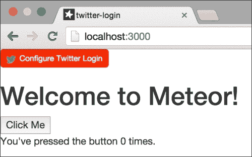
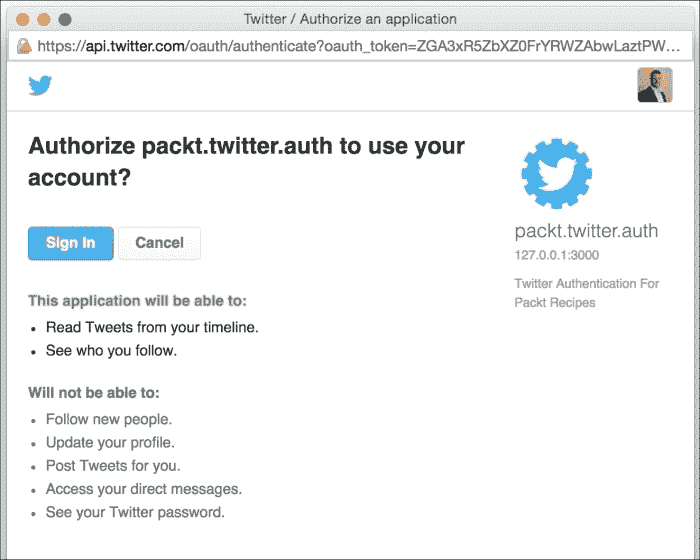
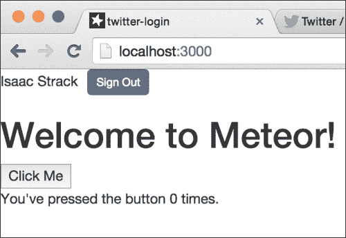
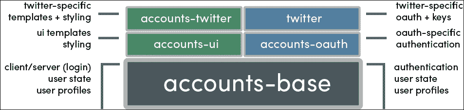
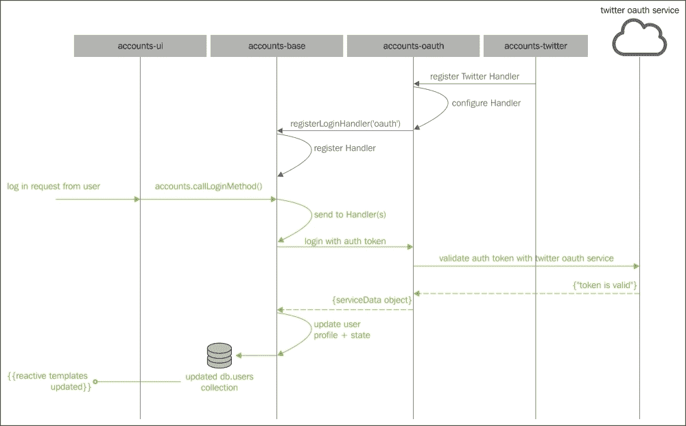
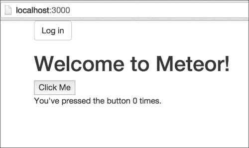
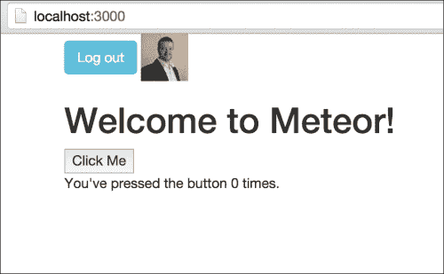
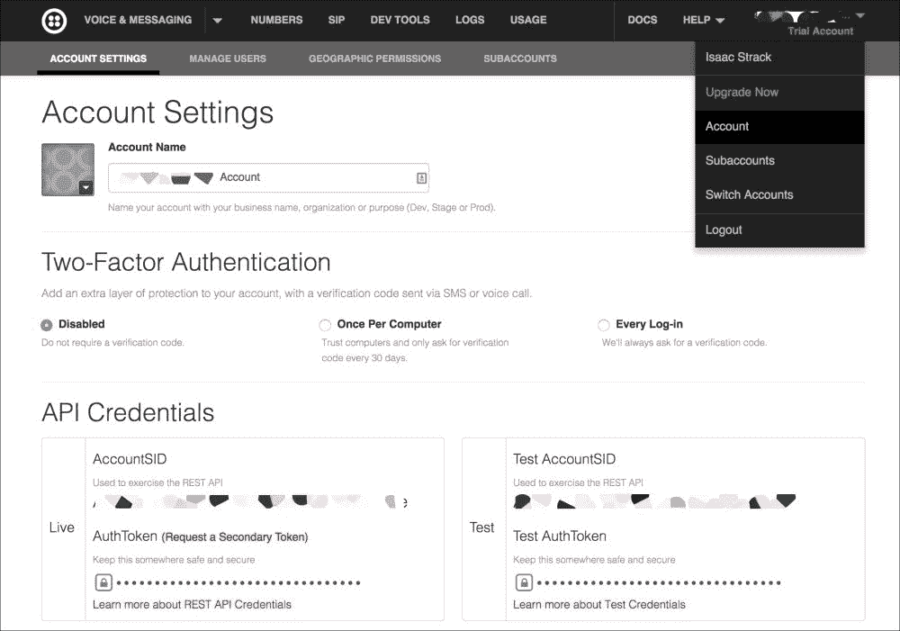
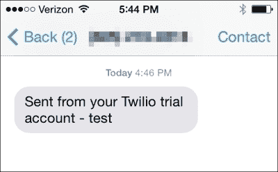
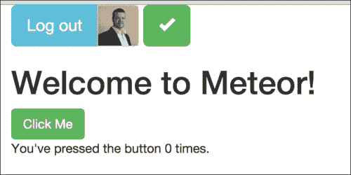

# 第十章。使用账户

在这个章节中，你将学习以下主题：

+   实现 OAuth 账户包

+   自定义账户登录

+   执行双因素认证

# 简介

几乎对我们构建的每个应用程序来说，某种类型的认证和用户识别都是至关重要的。通常，我们会花费几天甚至几周的时间来开发账户系统，而我们可以用这些时间来编写我们的应用程序。Meteor 解决了这个问题，并且做得很好。从与主要 OAuth 提供者的集成（如 Twitter、Google、Facebook 等）到简单、安全的基于密码的系统，在 Meteor 应用程序中添加账户和认证既快又简单。本章中的配方将涵盖 Meteor 的`accounts`包最重要的方面，使你能够轻松处理用户账户并继续其他工作。

# 实现 OAuth 账户包

今天，有如此多的流行认证服务可供选择，用户基数如此庞大，不利用这些服务似乎有点愚蠢。如果你使用像 Twitter 或 GitHub 这样的主要服务的账户系统，你立刻就能接触到庞大的用户群，这可以增加你应用程序的使用率。这个配方将向你展示如何在 Meteor 应用程序中实现 OAuth 账户系统，以 Twitter 账户服务为例。

## 准备工作

我们将几乎完全专注于我们应用程序的账户和认证部分，因此我们只需要一个非常简单的基础应用程序。

在终端窗口中，通过输入以下命令创建你的根项目：

```js
$ meteor create twitter-login
$ cd twitter-login
$ mkdir {client,server,both}
$ mv twitter-login.* client/
$ meteor add twbs:bootstrap
$ meteor

```

就这些了。其他所有事情都将在我们配方内部完成，所以让我们开始吧！

## 如何操作...

我们将添加适当的 `accounts` 包，并配置我们的 Twitter 登录服务。按照以下步骤进行：

1.  在一个新的终端窗口（保持你的应用程序运行），导航到你的项目根目录，并输入以下两个命令：

    ```js
    $ meteor add accounts-twitter
    $ meteor add accounts-ui

    ```

    这将添加几个依赖包，所以你不必这样做。Meteor 为我们做这件事是多么周到和绅士啊！

    ### 小贴士

    你也可以轻松地使用其他认证服务，只需将此步骤中使用的 `accounts-twitter` 替换为以下任何一个：`accounts-facebook`、`accounts-github`、`accounts-google`、`accounts-meetup`、`account-weibo` 或 `accounts-meteor-developer`。

1.  打开 `[项目根目录]/client/twitter-login.html` 并在起始 `<body>` 标签之后添加以下模板包含：

    ```js
    <body>
     {{> loginButtons}}

    ```

1.  保存此更改，并在浏览器中导航到你的应用程序（通常是 `http://localhost:3000/`）。在你的屏幕左上角，你会看到一个写着**配置 Twitter 登录**的红色按钮，如下面的截图所示：

1.  点击**配置 Twitter 登录**按钮，将出现配置你的 Twitter 应用程序的指令。严格按照这些指令操作，在适当的位置输入你的`consumerkey`（API 密钥）和消费者`secret`密钥（API 密钥）。

    ### 小贴士

    对于这个配方，你在网站字段中输入的值将是 `http://127.0.0.1:3000` 而不是 `http://localhost:3000`。Twitter 不允许使用 `localhost`。

1.  配置好服务后，你就可以登录了。点击蓝色的（以前是红色的）带有**使用 Twitter 登录**标签的按钮，应该会弹出一个新窗口，要求你授权你的应用程序，如下面的截图所示：

1.  一旦你授权了应用程序，你应该已经登录，这可以通过登录按钮中的状态变化来表示，如下面的截图所示：

## 如何工作...

这个配方相当简洁，所以涉及的代码不多。但我们可以分析一下正在发生的事情，这样我们就可以在需要时了解如何调整这个配方。

让我们深入探讨一下认证部分是如何工作的。`accounts-twitter` 依赖于 `accounts-base`、`accounts-oauth` 和 `twitter` 包。如果我们逐一打开这些包，就能看到为我们做了多少前期工作：



尽可能简单地说，`accounts-ui` 和 `accounts-twitter` 为你提供了一个响应式用户界面，并调用 `accounts-base`，它处理所有的账户管理。`accounts-oauth` 通过处理 OAuth 特定的事件和调用帮助 `accounts-base`。`accounts-oauth` 由 `twitter` 包配置，该包提供了使用 Twitter OAuth 服务所需的特定 URL 和参数。

这里有一个更详细的解释：

`accounts-base` 包是一个通用的账户包，接受不同类型的登录方法，提供账户管理的辅助方法，并帮助维护`users`集合。`users`集合是我们存储登录状态、首选项和配置文件信息的地方。

`accounts-base` 中暴露的一个方法是 `Accounts.registerLoginHandler()`，它可以被更具体的登录包（如 `accounts-oauth` 或 `accounts-password`）用来注册登录信息的处理程序：



当 `accounts-base` 收到登录请求时，该请求有一个特定的 `type`，并包含某些 `service` 参数。`accounts-base` 将信息通过所有已注册的登录处理程序运行，并让每个处理程序响应，可以是 `undefined` ("这不是我的登录方法")、`error` ("凭证错误") 或 `serviceData` 对象 ("登录被接受")，包括用于轻松重连的令牌。

`accounts-oauth` 包通过注册类型为 `'oauth'` 的登录处理程序并在其上公开一些自己的助手来构建在 `accounts-base` 之上。`accounts-oauth` 助手允许我们配置特定的 OAuth 服务。每个 OAuth 服务都需要定制的 URL 和参数。我们选择了 Twitter OAuth 服务，因此使用了 `twitter` 和 `accounts-twitter` 包来配置这些 URL 和参数。

`accounts-oauth` 包也负责通过弹出式身份验证表单处理来自 OAuth 服务的消息/回调。也就是说，当 Twitter 的弹出式身份验证完成时，它重定向到 `http://localhost:3000/_oauth/twitter` 并有一个 OAuth 令牌传递给我们的应用程序。`accounts-oauth` 包评估该特定 URL（因为我们使用 `twitter` 包配置了它），抓取令牌，然后尝试使用类似以下内容的 JSON 通过 `Accounts.callLoginMethod()` 进行登录：

```js
{
methodArguments: [{oauth: {
credentialToken: "m3OHQUrRWU34anuq40Bx3q7JBoEmVgwKGICU1jY4H7_"
credentialSecret: "2qPoqew8m-AXiC2OVfrkWem0_M_APcdMpnz-cGsl6-k"
}},
...
]}
```

`accounts-oauth` 注册的登录处理程序接收此 JSON，并与（Twitter）OAuth 服务确认令牌是否有效。如果有效，将在 `users` 集合中创建/更新 `user` 配置文件，并通过回调函数将包含登录令牌等内容的 `serviceData` 传递给客户端。由于回调，并且客户端正在订阅 `users` 集合，客户端会看到有已登录用户，并相应地采取行动。

`twitter` 和 `accounts-twitter` 包包含在 `accounts-base` 和 `accounts-oauth` 之上工作的便捷方法。例如，`twitter` 包有一个服务器文件（`twitter_server.js`），它声明了特定的 Twitter URL，通过 `OAuth.registerService()` 方法注册了 `twitter` 服务，甚至创建了一个针对 Twitter 的特定凭证调用，如下面的代码所示：

```js
Twitter.retrieveCredential = 
 function(credentialToken, credentialSecret) {
    return OAuth.retrieveCredential(
      credentialToken, credentialSecret);
 };
```

`accounts-twitter` 包创建了 `Meteor.loginWithTwitter()` 方法，并使用 `Accounts.addAutoPublishFields()` 声明了哪些配置文件字段在客户端可见。

## 还有更多...

有时，查看用户和配置信息是如何存储的，有助于理解底层发生了什么。我们可以通过在终端窗口中使用 `meteor mongo` 命令来完成这项操作。打开一个新的终端窗口（保持应用程序运行），导航到您的项目根目录，并输入以下命令：

```js
$ meteor mongo

```

现在，您将能够通过命令行访问存储用户信息和登录服务配置的集合。

要查看 Twitter 配置设置，请输入以下命令：

```js
> db.meteor_accounts_loginServiceConfiguration.find()

```

您将看到您的 Twitter 登录服务的配置，如下面的代码所示：

```js
{ "service" : "twitter", 
  "consumerKey" : "th2is2i2safa333kecon442sume24r433key", 
  "secret" : "th9isi9sa9fa87kesecr666e3t", 
  "loginStyle" : "popup", "_id" : "DBfakeYnnFbmidbC" 
}
```

如果您想重新配置您的 Twitter 登录服务，可以使用以下命令删除条目：

```js
> db.meteor_accounts_loginServiceConfiguration.remove({})

```

完成此操作后，您可以按照屏幕上的说明操作，并重新输入您在先前的配方中使用的 Twitter 凭据。

要查看登录用户的不同的状态，运行并重新运行以下命令：

```js
> db.users.findOne()

```

尝试运行它，当用户注销时，当用户登录时，以及当用户尚未存在时。特别关注 `services` 部分，你将能够看到 `twitter` 和 `resume` 登录服务如何处理登录。

## 参见

+   本章中的 *定制账户登录* 菜单

+   在第十一章的 *构建自定义服务器方法* 和 *处理异步事件* 菜单中，*利用高级功能*，第十一章

# 定制账户登录

打包的账户登录很棒，但它们并不总是与页面的设计相匹配，或者它们提供了过多的功能，而我们只需要一点功能。这个菜谱将向你展示如何使用 Twitter OAuth 服务作为示例来定制 Meteor 的账户包。

## 准备工作

我们将基本上使用本章中找到的 *实现 OAuth 账户包* 菜谱作为我们的基线，但我们不会添加 `accounts-ui` 包，因此我们不会通过 UI 配置 Twitter 服务，所以我们需要自己动手。

在终端窗口中，通过输入以下命令创建你的根项目：

```js
$ meteor create twitter-custom
$ cd twitter-custom
$ mkdir {client,server,both}
$ mv twitter-custom.* client/
$ meteor add twbs:bootstrap
$ meteor

```

打开一个新的终端窗口（保持你的应用运行）并添加 `accounts-twitter` 和 `service-configuration` 包：

```js
$ meteor add service-configuration
$ meteor add accounts-twitter

```

我们现在需要手动配置我们的登录服务，使用我们现有的 Twitter 服务（使用 *实现 OAuth 账户包* 菜谱创建的）中的 API 密钥和 API 密钥。创建一个名为 `[项目根目录]/server/auth-init.js` 的文件，并添加以下代码，用你的密钥和密钥替换相应的部分：

```js
ServiceConfiguration.configurations.upsert({
  service:"twitter" },
  {
    $set: {
      "consumerKey" : "[your API Key from apps.twitter.com]",
      "secret" : "[your API secret from apps.twitter.com]"
    }
  }
);
```

### 提示

当你从 Twitter 应用页面复制密钥时，通常会在末尾有一个额外的空格字符。确保你删除该字符（例如，`"key123 "` 需要改为 `"key123"`），否则你的认证将失败！

我们现在准备好构建我们自己的定制登录。

## 如何操作...

要构建我们自己的登录系统，我们需要几个按钮和一些表示我们已登录的指示器。简单得很。

1.  打开 `[项目根目录]/client/twitter-custom.html` 并添加以下模板：

    ```js
    <template name="customLogin">
      {{#if currentUser}}
        <div id="logout" class="btn btn-info">Log out</div>
        
      {{else}}
        <div id="login" class="btn btn-default">Log in</div>
      {{/if}}
    </template>
    ```

1.  我们现在想调用我们的模板。在 `<body>` 标签内进行以下更改，并保存文件：

    ```js
    <body>
     <div class="container">
     {{>customLogin}}

        <h1>Welcome to Meteor!</h1>

        {{> hello}}
      </div>
    </body>
    ```

1.  创建一个名为 `[项目根目录]/client/templatehelpers.js` 的新文件，并添加以下 `customLogin` 模板辅助函数：

    ```js
    Template.customLogin.helpers({
      profPic: function(){
        var loggedin = Meteor.user();
        return loggedin &&
    loggedin.services...url;
      }
    });
    ```

1.  现在，让我们连接我们的登录和注销按钮。在同一个 `templatehelpers.js` 文件中，添加以下事件声明：

    ```js
    Template.customLogin.events({
      'click #login' : function(e){
        Meteor.loginWithTwitter();
      },
      'click #logout': function(e){
        Meteor.logout();
      }
    });
    ```

1.  保存你的更改，并在浏览器中导航到你的应用（通常是 `http://localhost:3000`）。你应该能看到一个登录按钮，如下面的截图所示：

1.  如果您点击 **登录** 按钮，并在弹出窗口中授权 Twitter 应用程序，您将获得认证，您的 Twitter 头像将出现在 **注销** 按钮旁边，如下面的截图所示：

## 它是如何工作的...

从 `customLogin` 模板开始，我们使用 `{{#if currentUser}}` 辅助函数，该函数检查 `Meteor.user()` 是否为 `null`。换句话说，如果用户已登录，`currentUser` 返回 `true`。

如果 `currentUser` 是 `true`，我们添加一个 **注销** 按钮，以及一个 `` 标签，其 `src` 属性设置为用户资料上找到的属性。具体来说，如果用户已登录，`profPic` 返回 `services.twitter.profile_image_url` 属性。

对于登录和注销事件，我们只需调用由 `accounts-twitter` 包提供的 `Meteor.loginWithTwitter()` 和 `Meteor.logout()` 方法。Meteor 会为我们处理其余部分。

## 还有更多…

账户界面本身非常可定制，在 [`atmospherejs.com/?q=accounts-ui`](https://atmospherejs.com/?q=accounts-ui) 提供了许多可用的包。

我们建议安装 `accounts-ui-unstyled` 包，并尝试使用 CSS/样式。您可以通过查看在 [`github.com/meteor/meteor/tree/devel/packages/accounts-ui-unstyled`](https://github.com/meteor/meteor/tree/devel/packages/accounts-ui-unstyled) 可用的原始存储库来获得有关可用选项和 DOM 元素的极佳概述。

请特别注意 `login_buttons.html` 和 `login_buttons.js` 文件，因为它们会为您提供一些可能的提示。

## 参见

+   本章的 *实现 OAuth 账户包* 菜谱

# 执行双因素认证

通过提供双因素认证，我们可以使任何应用程序更加安全（并且更安全地免受机器人或黑客攻击）。双因素认证要求个人使用两种不同的方法来验证其身份。其中一种方法，即短信文本验证，因其便利性和难以模仿而变得相当流行。本菜谱将向您展示如何在 Meteor 应用程序中创建双因素认证，使用 Twitter OAuth 和 Twilio SMS 服务。

## 准备工作

使用本章中提供的 *自定义账户登录* 菜谱，我们已经有了一个针对 Twitter 进行认证的应用程序。我们将扩展该菜谱，并添加 Twilio SMS 服务以发送用于第二次认证挑战的 6 位验证码。为了我们可以专注于认证部分，我们将在这里设置 Twilio 服务，而不是在主菜谱中。

### 创建我们的基线应用程序

请遵循本章中找到的 *自定义账户登录* 菜谱，并重新创建该项目，将名称从 `twitter-custom` 更改为 `two-factor`。

### 为 Twilio SMS 服务注册

在浏览器中导航到 [`www.twilio.com/try-twilio`](https://www.twilio.com/try-twilio)，或者访问主页 [`www.twilio.com/`](https://www.twilio.com/)，然后点击右上角的 **SIGN UP** 链接。

输入创建账户所需的信息，然后点击 **Get Started**。

通过输入你的电话号码并点击 **Text Me** 来验证你是一个人类。不久之后，你将收到一条短信（如果没有收到，可以重试）。将短信中的代码输入到验证部分，然后点击 **Verify** 按钮。

现在，将为你生成一个电话号码。接受默认号码，或者选择一个自己的号码（默认号码是免费的），然后点击 **Go To Your Account** 按钮。

### 小贴士

记下分配给你的电话号码，因为你稍后需要用到它。

恭喜，你已经通过 Twilio 设置了一个试用账户！

### 在 Twilio 上创建 SMS 服务

在登录到 Twilio 后，点击页面右上角的你的名字。选择 **Account** 选项以转到 **Account** **Settings** 页面。在那里，你会看到两组 API 密钥。你可以使用其中任何一个进行测试，但显然你希望在生产应用中使用实时凭证。你的屏幕应该看起来像以下截图：



决定你将使用哪些凭证，并记下 **AccountSID** 和 **AuthToken**。

### 安装 twilio-node npm 包

在终端中停止你的应用（*Ctrl* + *C*），然后输入以下命令：

```js
$ meteor add meteorhacks:npm

```

再次运行你的应用，输入以下命令：

```js
$ meteor

```

你将收到一条消息，告诉你 `meteorhacks:npm` 已经初始化，如下例所示：

```js
-> npm support has been initialized.
-> please start your app again.

```

在我们再次启动应用之前，我们需要声明我们将使用 `twilio-node` npm 包。打开新创建的 `[project root]/packages.json` 文件，并添加以下声明：

```js
{
 "twilio":"1.10.0"
}
```

现在，在终端中再次启动你的应用，使用 `meteor` 命令，如前例所示。

在安装了 `twilio-node` npm 包之后，剩下的就是创建一个 Twilio 消息方法并测试它。

### 创建和测试 sendTwilio() 方法

在 `[project root]/server` 目录下创建一个名为 `twilio.js` 的新文件，并添加以下代码，根据需要替换 `AccountSID`、`AuthToken` 和 `Twilio Phone Number`：

```js
sendTwilio = function (phone, message) {
  return Meteor.wrapAsync(function (phone, message, callback) {
    var Twilio = Meteor.npmRequire('twilio')
      ('[YOUR AccountSID GOES HERE]',
        '[YOUR AuthToken GOES HERE]');
    var phoneNum = '+1' + phone;
    var twilioPhone = '[TWILIO NUMBER PATTERN: +1NUMBER]';

    Twilio.sendMessage({
      to: phoneNum,
      from: twilioPhone,
      body: message
    }, function (err, msg) {
      if (err) {
        callback && callback(err);
      } else {
        callback && callback(null, msg);
      }
    });
  })(phone, message);
};
```

一部分时间可以用来解释前面所有代码的功能，但简单来说，`Twilio.sendMessage()` 方法通过 `Meteor.wrapAsync()` 和回调函数被调用，因为 Twilio 是一个 npm 模块，因此需要这个包装器。你现在应该能够向你的手机发送消息了，你可以通过打开一个新的终端窗口（保持你的应用运行），导航到你的根目录，并使用 `meteor shell` 命令来测试。

如果你的手机号码是 `555.867.5309`，你应该输入以下内容：

```js
$ meteor shell
> sendTwilio('5558675309','test',function(e,d){console.log(e,d);})

```

如果一切设置正确，你会在手机上收到一条文本消息，类似于以下截图：



如果出现问题，控制台将输出错误信息，你可以追踪到错误的来源。

希望一切顺利，我们现在已经准备好完成我们的双因素认证流程！

## 如何做到这一点...

我们将首先确保服务器端的运行顺畅，并引入一个新的登录状态称为 `verified`。一旦服务器端完成，我们将在我们的 UI 中构建不同的用户状态。

我们需要生成一个 6 位数的代码发送给用户，我们可以利用现有的 Meteor 包来完成这个任务。

1.  在一个新的终端窗口中（保持你的应用运行），在项目根目录下，输入以下命令：

    ```js
    $ meteor add random

    ```

1.  现在，创建一个名为 `[项目根目录]/both/helpers.js` 的文件，并添加以下代码：

    ```js
    Random.digits = function(len){
      var numArr = [0,1,2,3,4,5,6,7,8,9];
      var ret = '';
      while(ret.length<len){
        ret+=Random.choice(numArr);
      }
      return ret;
    };
    ```

1.  我们刚刚扩展了随机包，使其能够输出我们选择的任何长度的简单代码。如果你想测试，可以在网页控制台中输入 `Random.digits(6)`。

1.  打开 `[项目根目录]/server/auth-init.js` 并追加以下声明：

    ```js
    var verifiedField = ['services.twofactor.verified', 'services.twofactor.phone'];
    Accounts.addAutopublishFields({ forLoggedInUser: verifiedField, forOtherUsers: [] });
    ```

1.  现在，为了确保 `services.twofactor.verified` 属性存在于每个账户上，我们将在账户创建时以及用户成功登录时初始化它。将以下代码追加到 `auth-init.js`：

    ```js
    Accounts.onCreateUser(function(options,user) {
      check(options, Object);
      check(user, Object);
      user.services.twofactor = {};
      user.services.twofactor.code = Random.digits(6);
      user.services.twofactor.verified = false;
      user.profile = options.profile;
      return user;
    });

    Accounts.onLogin(function(options){
      if (options.type!=='resume'){
        Meteor.users.update(
          options.user._id,
          {$set:
           {"services.twofactor.verified":false,
            "services.twofactor.code":Random.digits(6)
           }
          }
        );
      }
    });
    ```

1.  现在我们已经准备好创建短信认证挑战。创建一个名为 `[项目根目录]/server/auth-methods.js` 的新文件，并添加以下 `Meteor.methods` 声明：

    ```js
    Meteor.methods({
      sendChallenge : function (phone){
        if (!this.userId) return;
        var newCode = Random.digits(6);
        if (phone!=null){
          Meteor.users.update(
            this.userId,
            {$set:
             {"services.twofactor.phone":phone,
              "services.twofactor.code":newCode}});
        } else {
          Meteor.users.update(
            this.userId,
            {$set:
             {"services.twofactor.code":newCode}});

        }
        var curUser = Meteor.users.findOne(this.userId);
        return sendTwilio(curUser.services.twofactor.phone, curUser.services.twofactor.code);
      },
      verifyCode : function(code){
        if (!this.userId) return;
        var curUser = Meteor.users.findOne(this.userId);
        if (!curUser) return;
        if (curUser.services.twofactor.code == code){
          Meteor.users.update(
            this.userId,
            {$set:
             {"services.twofactor.verified":true}});
        }
      }
    });
    ```

1.  在服务器端设置好一切之后，我们现在需要更新客户端的模板和事件。让我们首先创建一种视觉信号来表示我们已经成功认证。打开 `[项目根目录]/client/two-factor.html` 并修改 `<button>` 元素如下：

    ```js
    <button class="btn {{btnState}}">Click Me</button>
    ```

1.  现在打开同一文件夹中的 `two-factor.js`，并在 `Template.hello.helpers` 声明中添加以下内容：

    ```js
    counter: function () {
          return Session.get('counter');
        },
     btnState: function(){
     var curUser =Meteor.user();
     if (curUser && curUser.services.twofactor.verified)
     return 'btn-success';
     return 'btn-danger';
     }

    ```

1.  最后，对 `'click button'` 事件处理程序进行以下修改：

    ```js
    'click button': function () {
          // increment the counter when button is clicked
     var curUser =Meteor.user();
     if (curUser && curUser.services.twofactor.verified) {
     Session.set('counter', Session.get('counter') + 1);
     } else {
     alert ('not authorized!');
     }
        }
    ```

1.  所有的其他工作都已经完成。我们现在只需要提供一个方法来调用我们的服务器。打开 `[项目根目录]/client/two-factor.html` 并对 `customLogin` 模板进行以下修改：

    ```js
    <template name="customLogin">
     <div class="btn-toolbar">
     <div class="btn-group" role="group">
          {{#if currentUser}}
          <div type="button" id="logout" class="btn btn-info btn-lg">Log out</div>
     <div id="profile" class="btn btn-default btn-lg">
           
     </div>
          {{else}}
          <div type="button" id="login" class="btn btn-default btn-lg">Log in</div>
          {{/if}}
        </div>
     {{#if currentUser}}
     {{>secondLogin}}
     {{/if}}
      </div>
    </template>
    ```

1.  我们现在需要创建一个 `secondLogin` 模板，根据用户是否已验证来设置条件。将以下模板追加到 `two-factor.html` 的底部：

    ```js
    <template name="secondLogin">
      {{#if verified}}
      <div class="btn btn-success btn-lg">
        <span class="glyphicon glyphicon-ok"></span>
      </div>
      {{else}}
      <div class="btn-group" role="group">
        <div class="btn btn-primary btn-lg" id="btnChallenge">
          <span class="glyphicon glyphicon-phone"></span>
        </div>
        <input type="text" id="phoneNum" class="btn btn-default btn-lg" placeholder="{{defaultPhone}}">
      </div>
      <div class="btn-group" role="group">
        <input type="text" id="verCode" class="btn btn-default btn-lg" placeholder="code...">
        <div class="btn btn-primary btn-lg" id="btnVerify">
          <span class="glyphicon glyphicon-check"></span>
        </div>
      </div>
      {{/if}}
    </template>
    ```

1.  我们需要添加一点 CSS 来使我们的个人资料图片表现正常。打开名为 `[项目根目录]/client/two-factor.css` 的文件，并添加以下 CSS 声明：

    ```js
    #profile img {
      max-height: 44px;
      margin: 0 0;
    }

    #profile {
      padding: 0 0;
    }
    ```

1.  打开 `[项目根目录]/client/templatehelpers.js` 并添加以下辅助函数：

    ```js
    Template.secondLogin.helpers({
      verified: function(){
        var curUser = Meteor.user();
        return (curUser&&curUser.services.twofactor.verified);
      },
      defaultPhone: function(){
        var curUser = Meteor.user();
        return curUser && curUser.services.twofactor.phone;
      }
    });
    ```

1.  最后，我们需要添加按钮的事件处理程序来发送短信文本以及验证短信消息中找到的代码。将以下代码追加到 `templatehelpers.js`：

    ```js
    Template.secondLogin.events({
      'click #btnChallenge' : function (e){
        var phoneNum = $('#phoneNum').val();
        if (!phoneNum.length)
          phoneNum = $('#phoneNum').attr('placeholder');
        if (!phoneNum.length==10) return;
        Meteor.call('sendChallenge',phoneNum);
      },
      'click #btnVerify' : function(e){
        var verCode = $('#verCode').val();
        if (!verCode.length==6) return;
        Meteor.call('verifyCode',verCode);
      }
    });
    ```

1.  保存所有更改，然后测试您的新 UI。通过 Twitter 进行认证后，您将收到两个文本提示和两个按钮，如下面的截图所示：

    左侧的按钮会将随机生成的代码发送到您指定的电话号码（如果存在已保存的电话号码，则发送到该号码）。右侧的按钮将提交验证代码。如果您输入了正确的代码（在发送到您手机的短信中找到的代码），您将得到验证，并且您的屏幕将类似于以下截图：

    

恭喜你，你已经在你的 Meteor 应用中实现了双因素认证！

## 它是如何工作的...

为了实现双因素认证，必须完成几件事情。首先，我们需要通过一个名为 `twofactor` 的新服务扩展用户集合。一些 `services.twofactor` 属性需要暴露给客户端使用，并且每当创建新用户或用户使用 Twitter OAuth 登录时，我们必须将 `services.twofactor.verified` 设置为 `false`。在我们的 `auth-init.js` 文件中，我们通过调用 `Accounts.addAutopublishFields()` 方法，然后通过监听并更新 `Accounts.onCreateUser()` 和 `Accounts.onLogin()` 事件处理器来完成这两项任务：

```js
Accounts.addAutopublishFields({ forLoggedInUser: verifiedField, forOtherUsers: [] });
Accounts.onCreateUser(function(options,user) {
  ...
  user.services.twofactor.code = Random.digits(6);
 user.services.twofactor.verified = false;
  ...
});
  Accounts.onLogin(function(options){
    ...
        {$set:
         {"services.twofactor.verified":false,
          "services.twofactor.code":Random.digits(6)
         }
    ...
  });
```

我们添加了两个服务器方法来帮助我们验证用户。第一个，`sendChallenge()`，生成一个新的 6 位随机代码，更新 `services.twofactor.code` 属性，然后通过 Twilio 服务将代码发送到指定的电话号码。第二个，`verifyCode()`，接收用户的手动输入，将手动输入的代码与 `services.twofactor.code` 属性进行比较，如果匹配则将 `services.twofactor.verified` 更新为 `true`：

```js
Meteor.methods({
 sendChallenge : function (phone){
    if (!this.userId) return;
    var newCode = Random.digits(6);
    ...
    return sendTwilio(...);
  },
 verifyCode : function(code){
    ...
    if (curUser.services.twofactor.code == code){
      Meteor.users.update(
        this.userId,
        {$set:
         {"services.twofactor.verified":true}});
    }
  }
});
```

通过添加 `verified` 属性和用于将 `verified` 属性从 `false` 更改为 `true` 的服务器方法，我们现在可以在我们的 UI 中使用 `verified`。我们创建了一个辅助方法 `Template.secondLogin.verified`，用于检查 `services.twofactor.verified` 属性是否设置为 `true`。然后我们在 `secondLogin` 模板中使用这个辅助方法来显示用户已登录并得到验证：

```js
<template name="secondLogin">
 {{#if verified}}
  <div class="btn btn-success btn-lg">
    <span class="glyphicon glyphicon-ok"></span>
  </div>
 {{else}}
    ...
 {{/if}}
</template>
```

UI 上的其余事件处理器和辅助工具用于方便起见，或者用于调用之前概述的服务器方法。

简而言之：我们扩展了 `users` 集合，添加了一个 `verified` 属性。我们使用短信文本和验证来改变 `verified` 属性的值。我们不允许客户端 UI 进行任何活动，除非 `verified==true`。这个检查作为检查是否有已登录用户的补充，使我们能够在我们的 UI 中要求双因素认证。

## 还有更多...

这种通过添加新的 `services` 属性来扩展 `users` 集合的模型可以用于几乎所有事情，而不仅仅局限于 SMS 文本挑战。通过添加和公开新的 `services` 属性，你可以控制哪些功能可用，这取决于用户的状态。想象一下，能够根据用户购买的订阅计划限制一些 UI 功能。或者想象一下，根据用户保存的首选项记住布局和视图偏好。所有这些，以及更多，都可以通过扩展 `users` 集合来实现。

## 参见

+   [使用 Bootstrap 构建平滑界面](https://part0036.xhtml#aid-12AK81 "第三章。构建出色的用户界面")中的 *构建平滑界面* 菜单，*构建出色的用户界面*

+   [直接使用 npm 包](https://part0069.xhtml#aid-21PMQ1 "第八章。集成第三方库")中的 *使用 npm 包直接* 菜单，*集成第三方库*

+   本章中 *自定义账户登录* 的菜谱

+   [使用异步函数](https://part0083.xhtml#aid-2F4UM1 "第十一章。利用高级功能")中的 *使用异步函数* 菜单，*利用高级功能*
