# 第十二章：创建有用的项目

在本章中，我们将涵盖以下主题：

+   创建 RESTful Web 服务

+   使用 Iron Router 创建完整的应用

+   将应用部署到移动设备

+   添加社交分享

# 简介

在您学习 Meteor 的旅途中，您将达到一个掌握基础知识的阶段。在那个阶段，您将希望开始将所有基础知识整合到实际有用的应用或包中。外面的开发世界很大，有很多机会。Meteor 的领域仍然处于起步阶段，如果您已经遵循了本书中的所有（或大多数）食谱，您可能已经准备好开始定义这个领域。最后一章将指导您了解适用于大多数项目的四个最有用的食谱。这将为您独立定义、发现和构建提供更坚实的基础！

# 创建 RESTful Web 服务

唉，唉，整个开发世界还没有意识到 DDP 协议有多么神奇（还没有呢！）。数据通过线传输是一个惊人的概念，我们相信它（或类似的东西）将是应用程序通信的未来。与此同时，我们有一些非常有用且已建立的协议，如果在我们应用中实现，将增加我们应用在其他平台上的覆盖范围和可访问性。

所有这些协议中，REST 是始祖。REST 已经成熟、定义明确，几乎在所有可想象的编程语言中都有实现。如果我们/当我们与外星种族接触时，第一个信号很可能是`POST`请求。鉴于其当前状态（以及我们最可能的选择，即和平的星际谈判），我们希望将 REST 功能添加到我们的某些应用中。本食谱将指导您使用 Iron Router 实现服务器端 REST 实现。

## 准备工作

由于在本食谱中我们只处理应用的 REST 部分，所以我们不需要任何花哨的东西。一个简单的、标准的 Meteor 应用就足够了，只需要几个服务器端文件。

### 创建基线应用

打开终端窗口，导航到您希望项目根目录所在的位置，并输入以下命令：

```js
$ meteor create RESTSample
$ cd RESTSample
$ rm RESTSample.*
$ mkdir -p server/api
$ mkdir server/model
$ meteor add iron:router
$ meteor

```

### 安装和配置 Postman

我们需要一种手动调用我们的 REST 服务的方法，Postman 插件/应用对于 Chrome 来说是个不错的选择。如果您有自己的手动调用 REST 服务的方法，请随意使用。如果没有，以下是安装 Postman 的方法：

1.  在浏览器中，导航到[`getpostman.com`](http://getpostman.com)，然后点击页面底部的**立即获取**链接。Postman 应用的预览将弹出，在右上角将有一个安装 Postman 的按钮。点击该按钮，按照指示操作，并打开 Postman。

1.  在 Postman 的请求窗口中，在**常规**选项卡下，输入以下 URL：

    ```js
    http://localhost:3000/api/

    ```

1.  然后，点击**头部**按钮，在**头部** | **值**部分下输入以下内容：

    ```js
    Content-Type | application/json

    ```

1.  完成后，您的屏幕应该看起来像以下截图：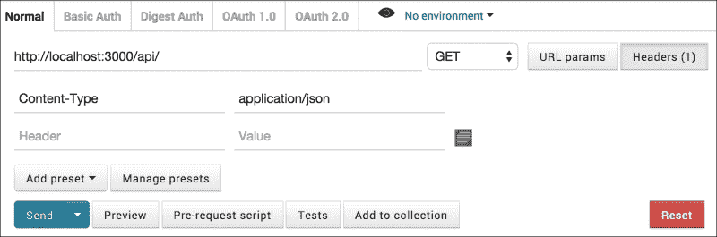

我们现在准备好构建我们的 REST 服务，并使用 Postman 进行测试。

## 如何操作...

按照以下步骤创建 RESTful Web 服务：

1.  首先，我们将声明`Quotes`集合。创建一个名为`[项目根目录]/server/model/quotes.js`的文件，并添加以下代码：

    ```js
    Quotes = new Mongo.Collection('quotes');
    ```

1.  接下来，我们将添加`writeHeaders`函数。创建一个名为`[项目根目录]/server/api/REST.js`的文件，并将以下函数添加到文件底部：

    ```js
    function writeHeaders(self) {
      self.response.statusCode = 200;
      self.response.setHeader('Content-type', 'application/json');
      self.response.setHeader('Access-Control-Allow-Origin', '*');
      self.response.setHeader('Access-Control-Allow-Headers', 'Origin, X-Requested-With, Content-Type, Accept');
    }
    ```

1.  我们现在将编写处理`GET`请求的代码。在`REST.js`文件的顶部，创建以下`Router.route()`方法调用：

    ```js
    Router.route('/api', {
        where: 'server'
      })
      .get(function () {
        //write headers
        writeHeaders(this);
        //send our response...
        this.response.end('GET not supported\n');
      });
    ```

    保存所有更改，确保您的应用程序正在运行，然后在 Postman 中点击**发送**按钮。在结果部分，点击**正文**选项卡和**原始**按钮。您应该看到以下信息：

    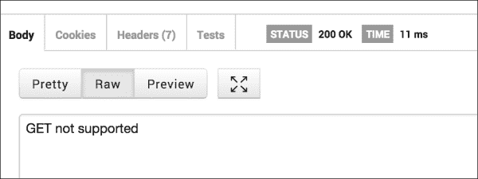

    恭喜你，你刚刚创建了你第一个 REST 服务！

1.  现在，让我们继续到`post`调用。我们将假设一个`POST`查询是请求查看我们`Quotes`集合中属于特定用户的任何引用。在`REST.js`中，从`.get()`函数调用中删除最后一个分号（我们正在链式调用命令，所以你这样做很重要），并在你删除分号的地方添加以下代码：

    ```js
    .post(function () {
        writeHeaders(this);
        var user = this.request.body.owner;
        if (!user) {
          this.response.end('No user specified...\n');
          return;
        }
        var quotes = Quotes.find({
          owner: user
        }).fetch();
        this.response.end(JSON.stringify(quotes));
      })
    ```

1.  在我们的集合中有数据之前，测试`POST`查询并没有太多意义，对吧？让我们立即通过添加对`PUT`的支持来解决这个问题。在你刚刚输入的代码之后（作为函数链的延续），添加以下代码：

    ```js
    .put(function () {
        writeHeaders(this)
        var upQuote = this.request.body.update;
        if (!upQuote) {
          this.response.end('nothing to update');
        }
        var update = Quotes.upsert({
          _id: upQuote.id
        }, {
          $set: upQuote.changes

        });
        this.response.end('Quote accepted!...\n');

      });
    ```

    ### 注意

    注意，我们在末尾有一个分号，这意味着我们已经完成，可以开始使用我们的完整功能服务了！

1.  在 Postman 中，将服务类型从`GET`更改为`PUT`。在输入字段中，点击标有**原始**的按钮，并输入以下 JSON 代码：

    ```js
    {"update":{
    "changes":{"author":"Jerry Pournelle and Larry Niven", "text":"Second guessing God is an old, old game.", "owner":"me"    
    }
    }}
    ```

    您的屏幕应该看起来像以下截图：

    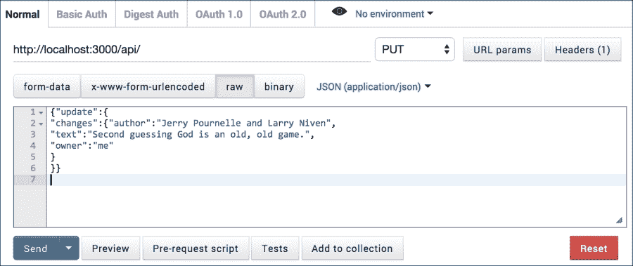

1.  点击**发送**按钮，只需几毫秒，响应区域将显示以下信息：

    ```js
    Quote accepted!...

    ```

1.  重复前面的步骤，根据需要更改引用/作者和所有者。

1.  我们现在可以测试`POST`查询。将服务类型从`PUT`更改为`POST`，并在输入字段中输入以下 JSON：

    ```js
    {"owner":"me"}
    ```

1.  点击**发送**按钮，然后在输出窗口中点击**美化**按钮。输出将是一些格式良好的 JSON，至少包含一个条目，类似于以下截图所示：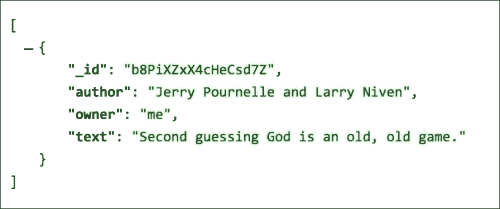

你刚刚在 Meteor 中编写了一个简单但功能齐全的 REST 服务。

## 工作原理...

这个食谱的繁重工作由 Iron Router 完成。当我们添加`iron:router`包时，该包会在服务器端监听所有传入的请求。我们配置 Iron Router 监听`http://[yourapp.url]/api/`路由的`GET`、`POST`和`PUT`请求。为了使 Iron Router 监听那个特定的路由，我们使用了`Router.route('/api'...)`方法调用。重要的是，我们声明该路由将在服务器端使用`{where: 'server'}`参数进行处理。

将每种类型的请求链接到`.route()`调用，我们使用了`.get()`、`.post()`和`.put()`方法调用。在这些调用中，我们可以通过引用`this.request.body.[key]`来读取请求中传递的 JSON 数据。

最后，我们能够通过使用 Iron Router 的`response`对象来发送响应，我们使用它来设置头信息并发送消息回调用客户端。

## 还有更多...

如往常一样，我们尽量将功能保持到最小，以减少这个食谱的信号与噪声。然而，这里已经足够让你对使用 Iron Router 的 REST 服务能做什么有一个很好的了解。如果你想要更多关于 Iron Router 中 RESTful 函数的信息和具体细节，请访问 Iron Router 指南：[`github.com/iron-meteor/iron-router/blob/devel/Guide.md#server-routing`](https://github.com/iron-meteor/iron-router/blob/devel/Guide.md#server-routing)。

## 参见

+   在第二章的*使用 Iron Router 创建多页应用程序*食谱中，*使用包进行自定义*

+   本章的*使用 Iron Router 创建完整的应用程序*食谱

# 使用 Iron Router 创建完整的应用程序

从 Meteor 的几乎一开始，开发重点就放在了“智能”客户端应用程序上。我们很久以前就离开了以服务器为主的世界，因此，单页模型在 Meteor 开发堆栈中得到了极好的支持。

对于这类应用程序来说，`iron:router`包（[`atmospherejs.com/iron/router`](https://atmospherejs.com/iron/router)）是必不可少的。是的，从技术上讲，你可以不使用 Iron Router 构建一个多功能的、以移动端优先的应用程序，但与使用 Iron Router 相比，这将耗费更多的时间和更复杂的操作。想象一下 Iron Router 就像使用微波炉而不是在篝火旁户外烹饪。没有任何工具。在雨中。还有携带狂犬病的浣熊在你周围捣乱。好吧，好吧，可能没有这么糟糕，但你的意思很清楚——你应该使用 Iron Router。

这个食谱将指导你构建一个功能齐全的报价跟踪服务，前端使用 Iron Router 构建的单页应用程序。

## 准备工作

我们通常会为食谱添加很多准备工作步骤，但在这个食谱中，我们需要一次性构建所有内容作为食谱的一部分。因此，我们在这里只添加最基本的内容。

打开一个终端窗口，导航到你希望应用程序根目录所在的位置，并输入以下命令：

```js
$ meteor create QuotesApp
$ cd QuotesApp
$ rm QuotesApp.*
$ mkdir {client,both}
$ meteor add twbs:bootstrap
$ meteor

```

我们有很多工作要做，所以让我们开始吧！

## 如何做到这一点...

这个菜谱的主要部分如下：

+   创建顶部的`navbar`

+   添加用户认证

+   添加`Quotes`集合

+   添加 Iron Router 路由

+   创建页面过渡动画

+   显示`Quotes`集合

+   添加和编辑`Quotes`

+   部署应用程序

各个部分之间会有一些交叉，但我们应该能够保持事情相当整洁，所以如果你想在移动过程中切换一些功能或添加一些功能，请随时这样做。

1.  首先，我们需要创建顶部的`navbar`。

    我们将使用标准的 Bootstrap `navbar`元素，因为我们不想在 CSS 样式上花费大量时间。一旦你对 CSS 更加熟悉，你可以扩展或替换 Bootstrap 样式，使其成为你自己的。

    首先，由于这是一个面向移动端的 app，让我们设置我们的标题，并使用 Google 字体。创建一个名为`[project root]/client/header.html`的新文件，并添加以下声明：

    ```js
    <head>
      <meta name="viewport" content="width=device-width, initial-scale=1.0, maximum-scale=1.0, user-scalable=0">
      <link href='http://fonts.googleapis.com/css?family=Raleway' rel='stylesheet' type='text/css'>
    </head>
    ```

    创建一个名为`[project root]/client/layout.html`的新文件，并添加以下模板，它将作为我们导航工具栏的基础：

    ```js
    <template name="layout">
      <div class="navbar navbar-default navbar-fixed-top" role="navigation">
        <div class="navbar-header">
          <a class="navbar-brand" id="btn-home" href="/">
            <span class="glyphicon glyphicon-book"></span></a>
          <button type="button" class="navbar-toggle collapsed" data-toggle="collapse" data-target=".navbar-collapse">
            <span class="sr-only">Toggle navigation</span>
            <span class="icon-bar"></span>
            <span class="icon-bar"></span>
            <span class="icon-bar"></span>
          </button>
        </div>
        <div class="navbar-collapse collapse">
          <ul class="nav navbar-nav navbar-right">
            <!-- Login buttons will go here -->
          </ul>
        </div>
      </div>
      <!-- App panels will go here-->
    </template>
    ```

    我们将在之后临时添加一个`body`元素，以便我们可以检查显示（当我们实现`iron:router`时我们将移除它）：

    ```js
    <body>
      {{> layout}}
    </body>
    ```

    最后，我们需要添加一些微小的 CSS，以确保即将到来的所有内容都能顺利运行。创建一个名为`[project root]/client/styles.css`的文件，并添加以下 CSS 声明：

    ```js
    body {font-family: 'Raleway', sans-serif;}
    .page {vertical-align: top;position: absolute;width: 100%;height: 100%;background-color: #eee;top: 50px;}
    .page-detail {background-color: #fff;color: #555;}
    .glyphicon-book {font-size: 3rem;line-height: 2rem;}
    .toggle-edit{margin-top: 1.4rem;font-size: 2rem;
    background-color: #777;border-radius: 50%;
    border: none;padding: 1.5rem;width: 5rem;height: 5rem;}
    .input-group {margin-top: 1.4rem;}
    .quote {font-size:2rem;}
    .title {font-size:3rem;}
    .author {margin-bottom:2rem;margin-top:1rem;}
    .tag {margin:0.25rem;}
    .tags {margin-top:1rem;}
    .add-quote {height:9rem;}
    .add-quote .btn{color:#5bc0de;font-size:4rem;}
    ```

1.  接下来，我们需要添加用户认证。

    由于我们过去有经验，我们将启用 Twitter 认证。我们还将使用一些与我们的 Bootstrap 工具栏相匹配的样式化登录按钮。打开一个终端窗口，导航到你的项目根目录，并输入以下命令：

    ```js
    $ meteor add accounts-twitter
    $ meteor add ian:accounts-ui-bootstrap-3

    ```

    我们现在需要将`loginButtons`模板添加到我们的工具栏中。打开`[project root]/client/layout.html`并定位到以下注释：

    ```js
    <!-- Login buttons will go here -->
    ```

    用以下代码替换这个注释：

    ```js
    {{> loginButtons}}
    ```

    保存你的更改并导航到你的 app 在浏览器中。右上角将包含一个**配置 Twitter**按钮。点击此按钮并根据说明配置 Twitter，就像我们在第十章的*实现 OAuth 账户包*菜谱中做的那样，*与账户一起工作*。

    配置完成后，你可能想使用你的 Twitter 账户测试登录。如果一切顺利，我们可以继续到我们应用程序的核心部分。

1.  让我们添加`Quotes`集合。

    我们肯定准备好添加我们的 `Quotes` 集合，但我们希望根据用户是否登录来控制发送到客户端的记录。为了实现这一点，我们需要移除 `autopublish`。在终端窗口中，在我们的项目根目录下，输入以下命令：

    ```js
    $ meteor remove autopublish

    ```

    接下来，创建一个名为 `[project root]/both/model.js` 的文件，并将以下行添加到该文件中：

    ```js
    Quotes = new Mongo.Collection('quotes');
    ```

    通常，我们会在客户端文件中添加一个 `subscribe` 命令，在服务器端文件中添加一个 `publish` 命令，但逻辑如此简单，所以我们只需直接将它们添加到本例中的 `model.js` 文件中。将以下代码添加到 `model.js` 并保存你的更改：

    ```js
    if (Meteor.isClient) {
      Meteor.subscribe('quotes');
    } else {
      Meteor.publish('quotes', function () {
        return Quotes.find({
          owner: this.userId
        });
      })
    }
    ```

1.  接下来，我们需要添加我们的 Iron Router 路由。

    当你添加 Iron Router 时，在运行的 Meteor 实例中需要的更改相当重大。技术上，你可以在不停止应用的情况下添加 Iron Router，但我们建议在安装和配置 Iron Router 时停止你的 Meteor 应用。

    一旦你停止了你的应用，在终端窗口中输入以下命令：

    ```js
    $ meteor add iron:router

    ```

    现在我们声明默认布局模板。创建一个名为 `[project root]/both/router.js` 的文件，并添加以下行：

    ```js
    Router.configure({ layoutTemplate: 'layout' });
    ```

    现在我们的布局模板已被 Iron Router 调用，我们不再需要之前在 `layout.html` 文件中临时放置的 body 元素。打开 `[project root]/client/layout.html` 并删除整个 `<body>...</body>` 段落。

    我们在 `layout.html` 中为我们的应用页面预留了一个占位符，我们需要用传统的 Iron Router yield 指令来填充。在 `layout.html` 中找到以下行：

    ```js
    <!-- App panels will go here-->
    ```

    将该行替换为以下代码：

    ```js
    {{> yield}}
    ```

    我们需要创建两个路由，现在就来做这件事。打开 `[project root]/both/router.js` 并添加以下 `Router.map` 声明：

    ```js
    Router.map(function(){
      this.route('main', {
        path: '/',
        template:'main'
      });
      this.route('detail', {
        path: '/quote/:_id',
        template:'detail', data: function () {
          return Quotes.findOne({_id: this.params._id});
        }
      });
    });
    ```

    我们已经创建了路由，现在我们需要为这些路由创建占位符模板。创建一个名为 `[project root]/client/main.html` 的文件，并添加以下模板：

    ```js
    <template name="main">
      <div class="page">
        <h1>this is the main page</h1>
      </div>
    </template>
    ```

    创建一个名为 `[project root]/client/detail.html` 的文件，并添加以下模板：

    ```js
    <template name="detail">
      <div class="page page-detail">
        <h1>this is the detail page</h1>
      </div>
    </template>
    ```

    现在，你可以重新启动你的应用（在你的终端中输入 `meteor` 命令）并测试路由。当你导航到 `http://localhost:3000` 和 `http://localhost:3000/quote/1234` 时，你应该能看到以下截图中的类似页面：

    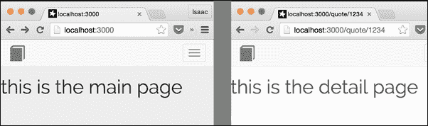

1.  我们现在将创建页面转换动画。

    在那里有一个名为 `momentum` 的优秀 Atmosphere 包。通过 Percolate Studios 创建的 Iron Router 特定包，我们可以轻松地将 `momentum` 扩展到 Iron Router 路由转换。在终端窗口中，输入以下命令：

    ```js
    $ meteor add percolate:momentum-iron-router

    ```

    创建一个名为 `[project root]/client/transitions.js` 的文件，并将以下转换声明作为一个 `Template` 辅助函数添加：

    ```js
    Template.layout.helpers({
      transition: function () {
        return function (from, to, element) {
          if (to.template=="main") return 'left-to-right';
          return 'right-to-left';
        }
      }
    });
    ```

    我们还需要用 `momentum` 模板辅助函数包围我们的 `{{> yield}}` 包含。打开 `layout.html` 并添加以下包装器：

    ```js
    {{#momentum plugin='iron-router' options=transition}}
          {{> yield}}
    {{/momentum}}

    ```

    保存您的更改，并再次导航到`http://localhost:3000/page/1234`。一旦页面加载，点击页面左上角的书籍图标。主页面应该滑动到合适的位置。如果您在浏览器中点击后退按钮，将发生反向动画。

1.  我们现在准备显示`Quotes`集合。

    我们将在主模板中为每个引用显示一些简要信息，然后将其扩展到详细模板中的更多细节。让我们从主模板开始。

    打开`[project root]/client/main.html`，删除`<h1>`占位符标签，并添加以下代码，该代码遍历`Quotes`集合并为每个创建分组项：

    ```js
     <template name="main">
      <div class="page">
     <div class="list-group">
     {{#each quotes}}
     <a class="list-group-item quote-title">
     <span class="glyphicon glyphicon-menu-right pull-right"></span>
     <h4 class="list-group-item-heading">{{title}}</h4>
     {{#each tagsFormatted}}
     <div class="btn btn-xs btn-primary">{{tag}}</div>
     {{/each}}
     </a>
     {{/each}}
     </div>
      </div>
    </template>
    ```

    我们需要添加几个辅助器来支持之前创建的模板，因此创建一个名为`[project root]/client/main.js`的文件，并添加以下代码：

    ```js
    Template.main.helpers({
      quotes: function(){
        return Quotes.find().fetch();
      },
      tagsFormatted: function(){
        var tags = this.tags;
        if (!tags) return [];
        return _.map(tags.split(','),function(d){
          var retTag = '#' + d;
          return {tag:retTag};
        });
      }
    });
    ```

    我们还需要一个`click`事件处理程序，它将在我们点击引用分组项时将我们带到`detail`页面模板。将以下代码添加到`main.js`文件的底部：

    ```js
    Template.main.events({
      'click .quote-title' : function(e){
        Router.go('/quote/'+this._id);
      }
    });
    ```

    保存您的更改。现在让我们以编程方式向`Quotes`集合添加几个条目。在浏览器中导航到`http://localhost:3000/`。确保您已使用 Twitter 账户登录，打开浏览器控制台，并执行以下命令两三次：

    ```js
    Quotes.insert({owner:Meteor.userId(), title:'quote title', quote:'quote body', author:'quote author', tags:'test,tags,field'})

    ```

    在这样做之后，您的屏幕应该看起来类似于以下截图：

    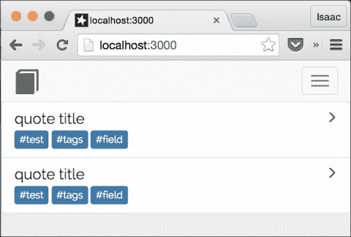

    如果您点击其中一个项目，通用的详细页面应该滑动到视图中。现在让我们处理`detail`页面模板，以便它能够显示引用的详细信息。打开`[project root]/client/detail.html`文件，并用以下内容替换模板内容：

    ```js
    <template name="detail">
      <div class="page page-detail">
        <div class="container">
          {{#if editing}}
          {{else}}
          <h3 class="title">{{title}}</h3>
          <div class="container quote">{{quote}}</div>
          <div class="row container author">
            <div class="pull-right">-{{author}}</div>
          </div>
          <div class="row container tags">
            {{#each tagsFormatted}}
            <div class="btn btn-xs btn-primary tag">{{tag}}</div>
            {{/each}}
          </div>
          {{/if}}
        </div>
      </div>
    </template>
    ```

    保存您的更改，并点击其中一个占位符引用。您应该看到一个屏幕出现，看起来类似于以下截图：

    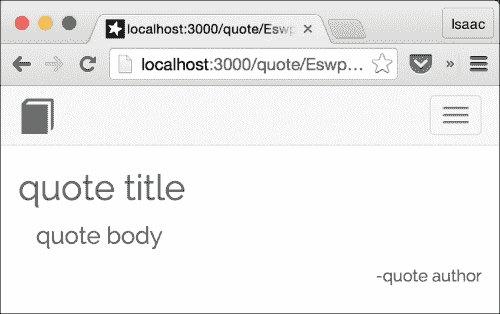

    标签没有显示出来，因为我们还没有添加必要的辅助器。创建一个名为`[project root]/client/detail.js`的文件，并添加以下辅助器声明：

    ```js
    Template.detail.helpers({
      tagsFormatted: function () {
        var tags = this.tags;
        if (!tags) return [];
        return _.map(tags.split(','), function (d) {
          var retTag = '#' + d;
          return {
            tag: retTag
          };
        });
      }
    });
    ```

    在浏览器中回顾一下；标签现在应该出现在详细页面模板上。

1.  现在我们已经处理好了显示，让我们添加编辑和插入新`quote`对象的能力。

    首先，让我们调整`detail.html`文件并添加一个编辑切换按钮。打开`detail.html`，在最后一个`</div>`标签之前添加以下`div`元素：

    ```js
        </div>
     <div class="container">
     <div class="btn btn-danger toggle-edit pull-right">
     <span class="glyphicon {{editbuttonstate}}"></span>
     </div>
     </div>
      </div>
    </template>
    ```

    接下来，让我们添加用于编辑/插入的输入字段。在相同的`detail.html`文件中，在`{{#if editing}}`部分添加标题输入字段。使用 Bootstrap `input-group`样式，如下所示：

    ```js
    {{#if editing}}
     <div class="input-group input-group-lg">
     <span class="input-group-addon" id="addon-title">Title</span>
     <input type="text" id="input-title" class="form-control" placeholder="title..." value="{{title}}">
     </div>
    {{else}}
    ```

    接下来是`quote`正文的`input-group`元素。在上述代码片段中`title`分组之后添加以下内容：

    ```js
          </div>
     <div class="input-group">
     <span class="input-group-addon" id="addon-quote">Quote</span>
     <textarea name="input-quote" id="input-quote" rows="4" class="form-control">{{quote}}
     </textarea>
     </div>
    {{else}}
    ```

    我们需要一个`input-group`元素用于作者。将其添加到`quote`分组下方，如下所示：

    ```js
          </div>
     <div class="input-group">
     <input type="text" id="input-author" class="form-control" placeholder="author..." value="{{author}}">
     <span class="input-group-addon" id="addon-author">Author</span>
     </div>
    {{else}}
    ```

    最后但同样重要的是，对于模板来说，标签也很重要。在`author`组下方，添加以下代码：

    ```js
          </div>
     <div class="form tags">
     <textarea name="input-tags" id="input-tags" class="form-control" rows="5">{{tags}}</textarea>
     </div>
    {{else}}
    ```

    我们需要添加一些额外的助手。打开`detail.js`文件，在`tagsFormatted`助手块之后立即添加以下两个助手，在`Template.detail.helpers()`方法中（别忘了在顶部添加额外的逗号！）：

    ```js
      },
     editbuttonstate: function () {
     return (Session.get('editing')) ?
     'glyphicon-ok' : 'glyphicon-pencil';
     },
     editing: function () {
     return (Session.equals('editing', true));
     }
    });
    ```

    现在我们需要添加在编辑和显示之间切换的事件处理器。我们还需要添加一个提交按钮。所以，让我们一石二鸟，给我们的切换按钮添加在状态变化时变成提交按钮的能力。在`detail.js`文件的底部，添加以下 Template `events`声明：

    ```js
    Template.detail.events({
      'click .toggle-edit': function (e) {
        e.preventDefault();
        var editflag = Session.equals('editing', true);
        if (editflag && Meteor.userId()) {
          var upQuote = {};
          upQuote.title = $('#input-title').val();
          upQuote.quote = $('#input-quote').val();
          upQuote.author = $('#input-author').val();
          upQuote.tags = $('#input-tags').val();
          upQuote.owner = Meteor.userId();
          Quotes.upsert({
            _id: this._id
          }, {
            $set: upQuote
          });
        }
        if (!editflag && !Meteor.userId()) return;
        Session.set('editing', (!editflag));
      }
    });
    ```

    保存你的更改，导航到显示单个引言，然后点击右下角的铅笔图标。你可以将通用引言更改为特定引言，如下面的截图所示：

    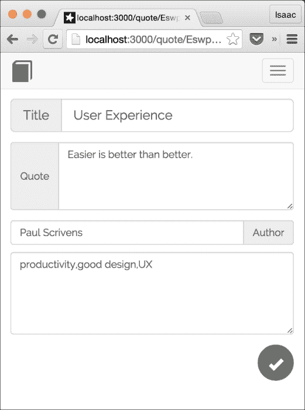

    点击勾选标记，你的更改应该会保存，如下面的截图所示：

    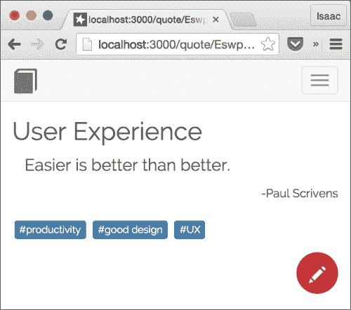

    我们已经处理了编辑；现在我们需要允许用户添加新的引言。我们将使用的逻辑将依赖于我们的编辑。当点击“新引言”按钮时，我们将在`Quotes`集合中立即创建一个新的`quote`对象，然后导航到编辑屏幕。打开`[项目根目录]/client/main.html`文件，在最后一个`{{/each}}`标签之后立即添加以下按钮组，但仍然在`list-group` `</div>`标签内：

    ```js
          {{/each}}
     <a href="#" class="list-group-item add-quote">
     <div class="btn btn-lg center-block">
     <span class="glyphicon glyphicon-plus"></span>
     </div>
     </a>
        </div>
      </div>
    </template>
    ```

    当点击此按钮时，我们希望在`Quotes`集合中插入一个新的对象，然后导航到编辑屏幕。打开`main.js`文件，在`Template.main.events()`方法调用中添加以下事件处理器，紧接在`.quote-title`事件处理器之后（再次，别忘了逗号！）：

    ```js
      },
     'click .add-quote' : function(e){
     if (!Meteor.userId()) return;
     Quotes.insert({owner:Meteor.userId()},
     function(e,d){
     if (!e){
     Session.set('editing',true);
     Router.go('/quote/'+d);
     }
     });
     }
    });
    ```

    保存所有更改，在浏览器中导航到`http://localhost:3000`，你应该会在引言组底部看到一个大的蓝色加号。点击按钮，你将被带到类似于以下截图的新鲜、干净的编辑屏幕。在这里，你可以输入一个新的引言：

    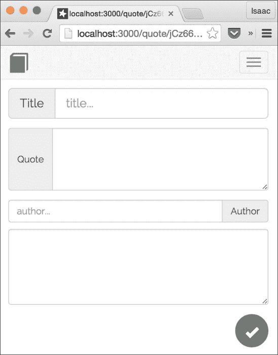

1.  在所有功能就绪后，我们就可以部署我们的应用了。

    我们可以在任何我们想要的地方部署我们的应用（请参阅第一章中的许多部署配方，*优化你的工作流程*以获取详细信息），但在这个配方中，我们将选择最简单/最快的方式来部署，即直接部署到 Meteor 服务器。

    使用*Ctrl* + *C*在终端停止你的应用运行，并执行以下命令，将`[your-test-url]`替换为你想要的任何内容：

    ```js
    $ meteor deploy [your-test-url].meteor.com

    ```

    在我们的案例中，我们使用了以下命令：

    ```js
    $ meteor deploy packt-quotes.meteor.com

    ```

    等待你的应用构建并上传，你应该会得到一个熟悉的消息，类似于以下内容：

    ```js
    Deploying to packt-quotes.meteor.com. 
    Now serving at http://packt-quotes.meteor.com

    ```

    导航到您新部署的应用程序，如果需要的话配置 Twitter（您需要一个指向新部署 URL 的新 Twitter 应用 ID），登录，并添加一些引语。完成之后，您的应用程序应该看起来类似于以下截图：

    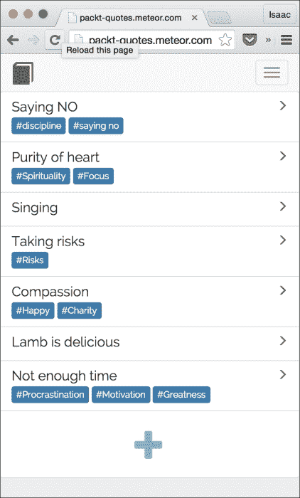

恭喜！您已经通过八个步骤创建并部署了一个完整的应用程序。您应该为自己感到骄傲。去拿一杯汽水或一块庆祝的披萨吧。您应得的！

## 它是如何工作的…

由于前面的每个步骤都涉及其他章节的食谱，我们不会过多关注代码的细节。相反，我们将概述每个步骤的作用，并在需要的地方添加细节。

我们首先添加了我们的顶部菜单/导航栏。使用 Bootstrap 内置的`navbar`和`navbar-fixed-top`CSS 类，我们几乎不费吹灰之力就将`navbar`定位在屏幕顶部。我们在头部文件中添加了一个网络字体（感谢，谷歌！）并设置了在移动设备上使用的参数。

对于用户身份验证，我们依赖于默认的 Meteor 账户包（特别是`accounts-twitter`包）。对于格式化，我们使用了由 Ian Martorell 创建的优秀设计的`Bootstrap`包。他为我们的重活儿做了很多工作，所以我们只需要添加这个包，并将我们的`{{> loginButtons}}`包含放置在正确的位置。

我们在客户端和服务器都能看到的文件中声明了`Quotes`集合，就像往常一样，并添加了一个`publish`函数，该函数只会将创建者登录用户创建的结果发送到客户端。

我们添加了 Iron Router 包，并利用该包的`Router.map()`和`layoutTemplate`助手来实现基线布局模板、主模板和详情模板。

我们接下来利用了 Percolate Studios 的一点点魔法，称为`momentum`。他们为`momentum`创建了一个插件，允许您将`{{>yield}}`指令包装起来，并将其指向一个模板助手，在那里我们执行一些快速逻辑，比如，“如果我们要去主页，从左到右走。如果不是，从右到左走。”这是一个设计精良的包，并且非常容易实现！

我们接下来的步骤（显示、编辑和创建引语）可以被认为是食谱的核心，但由于所有脚手架已经就位，并且因为这种类型的功能在 Meteor 中实现起来非常容易，我们只是简单地使用了`{{#each…}}`指令、一些响应式数据绑定和几个`click`事件处理器来显示和编辑`Quotes`集合中的记录。

事实上，整个项目中最复杂的部分是将`tags`属性解析成数组使用`_.map()`。想想看。我们整个应用中最技术性“挑战”的部分是解析一个字符串。Meteor 真的很棒，不是吗？

我们最后的步骤是部署，这也很简单，因为我们已经在第一章中做过几次了。

总体来看，从头开始构建整个应用似乎很令人畏惧。将其分解为离散的步骤不仅使其变得简单，而且实际上还很有趣。我们希望你喜欢这个过程，我们希望你会修改这个食谱，扩展它，并创建一些快速、有用的应用！

## 还有更多...

如果你仔细检查了这个食谱的最终产品，你可能已经注意到一些功能缺失和一些需要进一步改进的地方。例如，目前还没有删除引言的方法，我们无法按标签/主题/作者排序，而且我们实际上在部署时没有移除不安全的包。

换句话说，我们可以从前面章节中应用很多其他的食谱来改进这个应用。我们将把这个任务留给你，当你构建和扩展你自己的应用时，我们迫不及待地想看看你能想出什么！

## 参见

+   在第一章中，*优化你的工作流程*的*将测试应用部署到 Meteor*食谱

+   在第二章中，*使用包进行自定义*的*添加 Meteor 包*食谱

+   在第三章中，*构建出色的用户界面*的*使用 Bootstrap 构建平滑界面*食谱

+   在第十章中，*使用账户*的*实现 OAuth 账户包*食谱

# 将应用部署到移动设备

如果你只是将单页应用以网页的形式提供，那么构建具有各种酷炫功能的单页应用有什么好处呢？这个食谱将带你完成所有必要的步骤，以测试和部署你的应用到 iOS 设备。

## 准备工作

你需要一个应用来完成这个食谱。我们将使用本章前面找到的*使用 Iron Router 创建完整应用*食谱中创建的应用。如果你没有你想部署的应用，请先完成那个食谱，然后回到这个食谱来学习如何部署你的应用。

## 如何操作…

部署你的应用有两个部分。第一部分是在使用已经部署到生产 URL 的服务端代码的同时在设备上测试它。第二部分是为部署到 App Store 准备应用构建。

1.  首先，让我们设置我们的移动应用构建环境。要将应用部署到 iOS 设备，你需要一个 Apple 开发者许可证，一台运行 Mac OS X 的机器，以及在该机器上安装的 Xcode。

    要获取 Apple 开发者许可证，请访问[`developer.apple.com/programs/`](https://developer.apple.com/programs/)并按照链接/说明加入 iOS 开发者计划。

    一旦您加入了该计划，请从[`developer.apple.com/xcode/downloads/`](https://developer.apple.com/xcode/downloads/)下载并安装 Xcode。您需要正确配置 Xcode，包括根据需要添加证书和移动配置文件。这涉及一个学习曲线，我们强烈建议您在继续之前花些时间学习开发、认证和 App Store 提交流程。

    打开一个终端窗口，导航到您的应用目录，并输入以下命令：

    ```js
    $ meteor install-sdk ios

    ```

    这可能需要一段时间，但请确保 SDK 已正确安装，并根据指示修复任何错误或未完成的安装项。

    完成后，输入以下命令：

    ```js
    $ meteor add-platform ios

    ```

    您现在已正确配置，可以在 iOS 设备上测试/部署您的应用。

1.  现在我们来测试我们的应用在 iOS 设备上的运行情况。

    通过 USB 线将您的 iOS 设备连接到您的计算机。在命令行中输入以下命令：

    ```js
    $ meteor run ios-device --mobile-server [your-app-url.com]

    ```

    这里，`[you-app-url.com]`被替换为您部署的服务器实例的 URL。在我们的例子中，我们使用了以下命令（当然，所有内容都在一行中）：

    ```js
    $ meteor run ios-device --mobile-server packt-quotes.meteor.com

    ```

    应用将被构建和打包，然后`Xcode`将打开。一旦应用在`Xcode`中编译完成，您将在`Xcode`应用程序的顶部中间看到以下消息：

    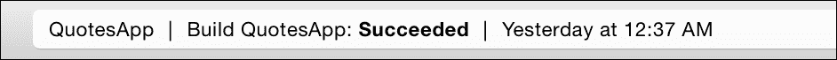

    从下拉菜单中选择您的 iOS 设备，然后点击显示在此截图中的播放按钮。

    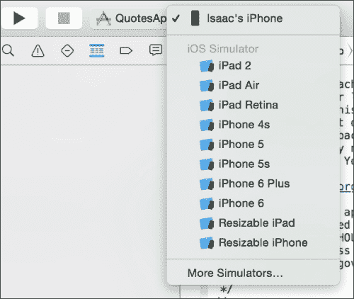

    确保您的设备已解锁，并在进行一些下载和代码推送活动后，您的设备上会出现带有 Meteor 标志的图标。应用将快速打开；然后，经过短暂的延迟，您的应用将像在浏览器中拉起一样运行，但它是在您的设备上作为一个完整的应用程序运行的！以下是`Quotes`应用在 iPhone 上运行的截图：

    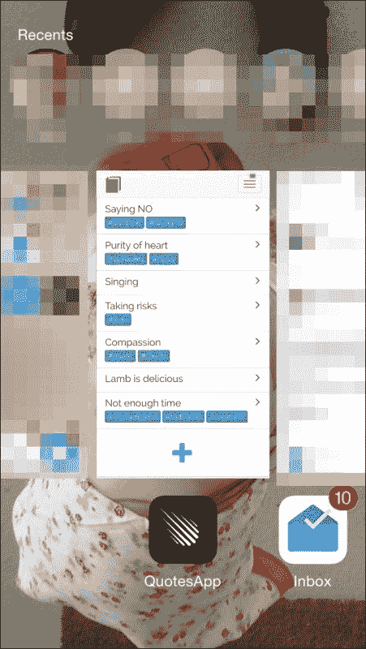

1.  下一步是构建一个独立的移动应用文件。

    一旦您测试了一切并且一切按预期工作，您将想要创建一个实际的应用文件，您可以将其提交到 Apple App Store。当您在移动设备上安装测试应用时，Meteor 会自动为您的应用创建几个资产。您可以通过导航到`[项目根目录]/.meteor/local/cordova-build/resources`文件夹来查看这些资产，如下面的截图所示：

    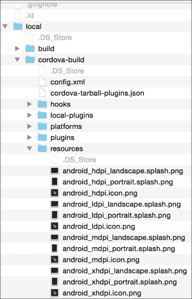

    您可以使用这些资源或根据需要替换它们。一旦您放置了正确的图标和启动画面，您将需要创建一个名为`[项目根目录]/mobile-config.js`的文件，并添加以下参数，至少包括以下内容：

    ```js
    App.info({
    name: '[yourappname]',
    description: 'Description of my app',
    version: '0.0.1'
    });

    App.icons({
    'iphone': 'resources/icons/icon-60.png',
    'iphone_2x': 'resources/icons/icon-60@2x.png'
    });

    App.launchScreens({
    'iphone': 'resources/splash/Default~iphone.png',
    'iphone_2x': 'resources/splash/Default@2x~iphone.png',
    'iphone5': 'resources/splash/Default-568h@2x~iphone.png'
    });
    ```

    您当然可以更改此文件中的任何内容，并且您还可以添加其他几个参数来进一步调整安装。请参阅`[项目根目录]/.meteor/local/cordova-build/config.xml`文件以获取一个很好的选项列表。

    一旦你对配置满意，导航到根应用目录，并在终端中输入以下命令（当然，所有内容都在一行中）：

    ```js
    $ meteor build [your-output-directory] --server=[your-app-url]

    ```

    例如，我们的`Quotes`应用的命令看起来会是这样（当然，所有内容都在一行中）：

    ```js
    $ meteor build ~/builds/ --server=packt-quotes.meteor.com

    ```

    一旦完成，你可以在`Xcode`中打开项目目录（在我们的例子中，项目目录会是`~/builds/ios/project`），并随心所欲地进行配置。一旦一切正确并且按照你的期望运行，你可以签名应用并将其提交到苹果应用商店。

## 它是如何工作的……

Meteor 利用`cordova`库、`Xcode`和你的 Mac 操作系统来打包、编译和打包你的应用程序。重点是将其放入`Xcode`，在那里你可以像操作任何原生应用一样操作应用，进行测试、部署或提交到应用商店。

关于在`Xcode`中做什么以及在提交到苹果应用商店时的具体操作超出了本书的范围。如果你想了解更多关于 Meteor 特定应用构建的信息，请访问[`github.com/meteor/meteor/wiki/How-to-submit-your-iOS-app-to-App-Store`](https://github.com/meteor/meteor/wiki/How-to-submit-your-iOS-app-to-App-Store)。

## 还有更多……

第一次做任何事情都是脑力劳动。构建和部署移动应用也不例外。以下是一些帮助你在出现问题时进行故障排除的技巧：

+   **进行“拨号音”测试**：如果你的应用正在构建，但在设备上“启动”需要花费很长时间，或者你只看到一个空白屏幕，首先尝试确保你的所有网络和 Xcode 配置都是正确的。你可以通过使用`meteor create my-test-app`创建一个新的 Meteor 项目，并将这个裸机应用部署到你的移动设备上来做这个测试。如果它能正常启动，那么你已经成功得到了“拨号音”，可以开始找出导致你加载缓慢的包或代码片段。

+   **铁路路由配置必须准确**：如果你使用 Iron Router 并且你的 Iron Router 路由配置不正确，应用通常会拒绝加载。如果你遇到问题，实现最基本的路由，没有花哨的代码，并看看你是否能在设备上启动路由。再次强调，从简单开始。

+   **使用模拟器**：你不必总是将应用推送到实际设备。使用`meteor run ios`或`meteor run android`命令几乎可以在瞬间启动一个模拟器，在那里你可以比在实际设备上更快地测试和调试。

+   **使用 Xcode 的日志**：如果有问题，请检查日志，日志位于 Xcode 的右下角面板中。你还可以在应用在你的设备上运行时使用 Xcode 设置断点，这可以帮助你隔离潜在的问题。

除此之外，坚持下去。我们可以向你保证，一旦你正确配置，将内容部署到移动设备上将非常简单，成功率极高。不要放弃！相信很快就会“点击”成功，你将不会在构建移动应用程序时遇到任何问题/焦虑。实际上，当你看到你的应用程序在 App Store 或人们的设备上时，这会变得很有趣，并且极具成就感。值得学习曲线！

## 参见

+   本章中的 *使用 Iron Router 创建完整应用程序* 菜谱

# 添加社交分享

随着将社交媒体集成到你的应用程序中的需求不断增长，你需要了解如何直接从你的应用程序中发送/发布/分享。这个菜谱将向你展示如何将 Twitter 发布（推文）添加到你的应用程序中。

## 准备工作

我们将使用之前在本章中找到的 *使用 Iron Router 创建完整应用程序* 菜单中的 Quotes 应用程序。请在继续之前完成该菜谱。

我们还将使用 `npm` 的 `twit` 模块来完成这个菜谱。有关每个步骤的详细步骤和解释，请参阅第十一章 *利用高级功能* 中 *处理异步事件* 菜谱的第一部分，*利用高级功能*。

快速查看以下步骤，你需要安装和配置 `twit` 模块：

1.  执行以下终端命令：

    ```js
    $ meteor add meteorhacks:npm
    $ meteor

    ```

1.  打开 `packages.json` 文件并添加以下代码：

    ```js
    {
      "twit" : "1.1.20"
    }
    ```

1.  运行以下终端命令：

    ```js
    $ meteor

    ```

1.  创建 `[项目根目录]/server/config-twit.js` 文件并添加以下配置：

    ```js
    Twitter = Meteor.npmRequire('twit');

    Twit = new Twitter({
      consumer_key: '…',
      consumer_secret:'…',
      access_token: '…',
      access_token_secret: '…'
    });
    ```

在我们的 Twitter 密钥、令牌和秘密都到位，并且 `twit` 已经初始化后，我们准备开始发推文！

## 如何做到这一点…

我们需要创建一个服务器方法，更新我们的用户界面，并给出一个引用已被分享的提示。多亏了 twit，对 Twitter API 的实际调用相当简单。让我们开始吧。

1.  首先，让我们创建 `twuote` 服务器方法。

    创建一个名为 `[项目根目录]/server/tweets.js` 的文件，并添加以下 `Meteor.methods` 声明：

    ```js
    Meteor.methods({
      twuote : function(id){
      }
    });
    ```

    我们首先检查用户是否已登录，以及是否传递了有效的 `quote` 变量的 `id` 参数。在 `twuote` 函数调用中，添加以下行：

    ```js
        if (!id || !this.userId) return;
        var quote = Quotes.findOne({_id:id});
        if (!quote || !quote.quote || !quote.author) return;
    ```

    现在，我们需要操作 `quote` 和 `author` 字符串，确保其长度不超过 `140` 个字符。在之前插入的行下方，添加以下字符串操作逻辑：

    ```js
        var tweet = '"';
        if (quote.quote.length>138){
          tweet += quote.quote.slice(0,135);
          tweet += '..."';
        } else {
          tweet += quote.quote + '" --' + quote.author;
        }
        if (tweet.length>140){
          tweet = tweet.slice(0,137) + '...';
        }
    ```

    在整理完引言后，我们准备发送推文！在字符串操作逻辑下方，添加以下 `Twit.post()` 函数和包装回调函数：

    ```js
        Twit.post('statuses/update', { status: tweet },
          Meteor.bindEnvironment(function(err, data, response) {
          Quotes.update({_id:id},{$set:{tweeted:true}});
        })
        );
        return tweet;
    ```

    我们的方法已经完成。让我们修改我们的用户界面。

1.  我们将通过添加分享按钮来开始修改我们的用户界面。

    打开 `[项目根目录]/client/detail.html` 文件，并在 `toggle-edit` 按钮下方，在父容器元素内添加以下按钮：

    ```js
        <div class="container">
          <div class="btn btn-danger toggle-edit pull-right">
            ...
          </div>
     <div class="btn pull-left {{tweetColor}}" id="btn-tweet">{{tweetText}}
     </div>
        </div>
    ```

    我们希望给我们的按钮一个轻微的下推，所以请在 `[项目根目录]/client/styles.css` 文件底部添加以下 CSS 指令：

    ```js
    #btn-tweet{margin-top: 2.4rem;}
    ```

    我们还需要为我们的按钮添加几个额外的辅助函数。打开 `[项目根目录]/client/detail.js`，并将以下两个辅助函数添加到 `Template.detail.helpers` 代码块的底部（就像往常一样，别忘了在行前加上逗号）：

    ```js
    editing: function () {
        ...
      },
     tweetText: function (){
     return (this.tweeted)?'shared':'share...';
     },
     tweetColor: function (){
     return (this.tweeted)?'btn-success':'btn-info';
     }
    });
    ```

    剩下的只是连接点击事件。打开 `[项目根目录]/client/detail.js` 文件，找到 `Template.detail.events` 声明，并在括号内添加以下点击 `事件` 处理器（别忘了在处理器前的那一行加上逗号）：

    ```js
      },
     'click #btn-tweet' : function (e) {
     if (this.tweeted) return;
     Meteor.call('twuote',this._id);
     }
    });
    ```

    保存所有更改，在浏览器中导航到你的应用（通常是 `http://localhost:3000`），点击一个引语以打开详情页面，然后点击以下截图所示的 **分享...** 按钮：

    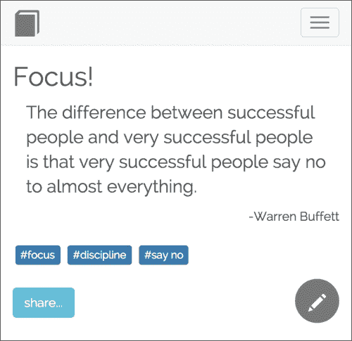

    给你的服务器一点时间来发送推文。**分享...** 按钮将变为绿色，文本将更改为 **已分享**。你的推文将在 Twitter 上实时显示，如下面的截图所示：

    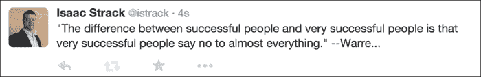

## 它是如何工作的…

重要的代码都位于 `[项目根目录]/server/tweets.js` 文件中的 `Meteor.methods({})` 声明中。

我们调用 `Twit.post()`，它接受一个回调作为最后一个参数。由于 `twit` 是一个 Node 模块，这个回调是异步的。因为它异步，我们需要在调用期间保留环境当前状态的方法，以及当回调执行时将进程放回 `事件循环` 的方法（有关完整解释，请参阅第十一章 *处理异步事件* 的 *Handling asynchronous events* 菜谱，*Leveraging Advanced Features*）。

我们通过将回调包裹在 `Meteor.bindEnvironment()` 中来完成这两项任务。当回调触发时，我们更新 `Quotes` 集合，为相应的引语添加 `{tweeted : true}` 属性。

这个属性反过来导致我们的 UI 使用绿色按钮更新，并禁止额外的推文（在 `[项目根目录]/client/detail.js` 的 `click 事件` 处理器中检查）。

就这样，我们添加了社交分享功能。从这里，你可以将这个菜谱应用到其他社交平台，使其更无缝地集成到你的应用中。

## 还有更多…

我们必须小心，不要在生产环境中使用前面的代码！我们移除了所有的安全和错误处理。没有验证，示例是为单个服务器端用户硬编码的。如果你在生产应用中以这种方式使用此代码，会发生一些不太愉快的事情，而且这不是我们的责任（不允许责备！）。

相反，我们建议您详细阐述这些元素，特别是允许使用已登录用户的访问令牌而不是硬编码的用户令牌。

只需稍加润色，您就可以轻松使用此代码来补充您的 Meteor 应用程序，并扩展其功能以支持 Facebook、Instagram、LinkedIn、Pinterest 等等。

### 小贴士

有关使用 `twit` 模块可以做什么的完整说明，请访问 [`github.com/ttezel/twit`](https://github.com/ttezel/twit)。

## 参见

+   在第二章“使用包进行自定义”中的*添加 Meteor 包*配方

+   在第十一章“利用高级功能”中的*处理异步事件*配方

+   本章中的*使用 Iron Router 创建完整应用*配方
