# 第一章. Backbone 应用程序的架构

Backbone 最好的特性之一是能够自由地使用你选择的库来构建应用程序，无需附带任何电池。请注意，Backbone 不是一个框架，而是一个库；因此，使用 Backbone 构建应用程序可能会具有挑战性，因为它不提供任何结构。作为开发者，你负责代码的组织以及如何在应用程序中连接代码的各个部分；这是一项重大的责任。不良的决策可能导致存在缺陷且难以维护的应用程序，没有人愿意与之合作。

在小型 Backbone 应用程序中进行代码组织并不是什么大问题。为模型、集合和视图创建一个目录；为所有可能的路由放置一个路由器；并将业务逻辑直接写入视图。然而，这种方式开发 Backbone 应用程序并不适合大型项目。应该有更好的方法来分离责任和文件组织，以便创建可维护的应用程序。

如果你根本不了解 Backbone，那么这一章可能会很难理解；为了更好地理解这里所展示的原则，你需要至少了解 Backbone 的基础知识。因此，如果你是 Backbone 的初学者，我鼓励你首先了解 Backbone 是什么以及它是如何工作的。

本章的目标是探讨在两个主要层面上的项目组织最佳实践：逻辑组织和文件结构。在本章中，你将学习以下内容：

+   将适当的职责委托给 Backbone 提供的对象

+   定义普通的 JavaScript 对象以处理超出 Backbone 对象作用域的逻辑

+   将应用程序拆分为小型且易于维护的脚本

+   为你的项目创建一个清晰的文件结构

# 基于子应用程序的架构

我们可以用许多独立的子应用程序来组合一个 Backbone 应用程序。子应用程序应该独立工作。你可以将每个子应用程序视为一个小型 Backbone 应用程序，具有自己的依赖项和职责；它不应直接依赖于其他子应用程序。

子应用程序应专注于特定的领域区域。例如，你可以有一个用于发票的子应用程序，另一个用于邮箱，还有一个用于支付；有了这些子应用程序，你可以构建一个应用程序来通过电子邮件管理支付。

为了使子应用程序相互解耦，我们可以构建一个负责管理子应用程序、启动整个应用程序以及为子应用程序提供公共功能和服务的应用程序基础设施：

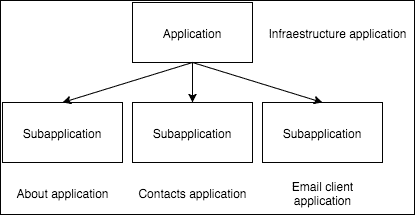

图 1.1\. 基于子应用程序的 Backbone 应用程序的组成

您可以使用基础设施应用程序为您的子应用程序提供诸如确认和对话框消息、通知弹出窗口、模态框等服务。基础设施应用程序本身不执行任何操作，它作为子应用程序的框架存在。

当子应用程序想要与其他子应用程序通信时，可以使用基础设施应用程序作为通信通道，它可以利用 `Backbone.Event` 对象来发送和接收消息。

在以下图中，您可以看到子应用程序通过基础设施应用程序进行通信的场景。当用户在邮箱子应用程序中点击**撰写消息**时，基础设施应用程序创建并渲染**撰写邮件**子应用程序，并允许用户撰写电子邮件。

当用户完成操作后，他们必须在**撰写**子应用程序中点击**发送**按钮；然后电子邮件通过 RESTful API 或使用纯 SMTP 发送，不重要的是，重要的是，当它完成时，它会在 `email:sent` 基础设施应用程序中触发一个事件。

基础设施应用程序将事件转发到邮箱子应用程序，以便更新已发送电子邮件的列表。另一个有趣的事情是，基础设施应用程序可以使用 `email:sent` 事件向用户显示一个成功的弹出消息，告诉他们电子邮件已成功发送：

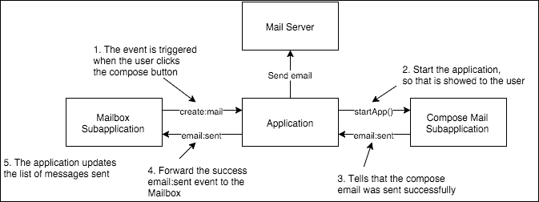

图 1.2\. 子应用程序之间的通信

## 子应用程序结构

如前所述，子应用程序就像一个小型的 Backbone 应用程序；它们应该独立于其他子应用程序，并作为一个独立的应用程序运行。您应该能够在没有任何其他子应用程序的空白页面上放置撰写邮件子应用程序，并且仍然能够发送电子邮件。

为了实现这一点，子应用程序应包含所有必要的对象，以便它们可以自动包含。您可以看到子应用程序的入口点是 `Backbone.Router`。当浏览器更改 URL 并为特定子应用程序匹配到一个路由时，路由器创建一个子应用程序控制器并将其委托处理路由。

子应用程序控制器协调模型/集合以及它们的显示方式。控制器可以指示**应用程序**基础设施在数据检索时显示加载消息，并在完成后，控制器可以使用最近检索到的模型和集合构建必要的视图，以便在 DOM 中显示。

简而言之，子应用程序的行为与一个小型的 Backbone 应用程序完全相同，主要区别在于它使用应用程序基础设施来委托常见任务以及子应用程序之间的通信通道。

在下一节中，我们将检查这些部分是如何连接的，我会向你展示一个工作联系人应用的代码。以下图显示了子应用的结构视图：

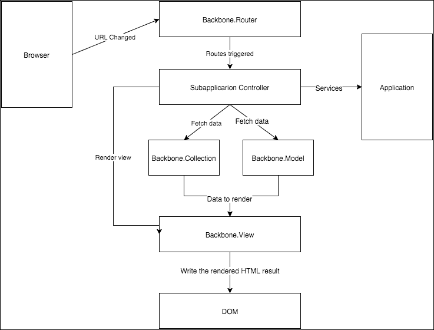

图 1.3. 子应用结构

# Backbone 对象的责任

Backbone 文档最大的问题之一是不知道如何使用其对象。作为开发者，你应该弄清楚应用程序中每个对象的责任；如果你有一些使用 Backbone 的经验，那么你就会知道构建 Backbone 应用程序有多困难。

在本节中，我将描述 Backbone 对象的最佳用途。从这一点开始，你将对 Backbone 中责任的范围有一个更清晰的认识，这将引导我们应用架构的设计。记住，Backbone 是一个仅包含基础对象的库；因此，你需要自己带来对象和结构，以创建可扩展、可测试和健壮的 Backbone 应用程序。

## 视图

视图的唯一责任是处理 **文档对象模型** (**DOM**) 和监听低级事件（jQuery/DOM 事件），并将它们转换为领域事件。Backbone 视图与模板引擎紧密合作，以创建代表模型和集合中包含的信息的标记。

视图抽象用户交互，将它们的操作转换为应用程序的业务价值数据结构。例如，当 DOM 中的保存按钮触发点击事件时，视图应将事件转换为类似于 `save:contact` 事件，使用 Backbone Events 将表单中写入的数据。然后，一个特定领域的对象可以对数据进行一些业务逻辑处理，并显示结果。

规则是避免在视图中使用业务逻辑；然而，基本表单验证，如只接受数字，是允许的。复杂的验证仍然应该在模型或控制器上完成。

## 模型

Backbone 模型在服务器端类似于数据库网关，它们的主要用途是从 RESTful 服务器获取和保存数据，然后为应用程序的其余部分提供一个 API 以处理信息。它们可以运行通用业务逻辑，例如验证和数据转换，处理其他服务器连接，并为模型上传图片。

模型对视图一无所知；然而，它们可以实现对视图有用的功能。例如，你可以有一个显示发票总额的视图，而发票模型可以实现一个执行计算的方法，使视图无需了解计算过程。

## 收藏

你可以将 Backbone 集合视为一组 Backbone 模型的容器，例如，`Contacts`模型的集合。使用模型，你一次只能获取一个文档；然而，集合允许我们获取模型列表。

与模型相比，集合应该用作只读，它们获取数据但不应在服务器上写入；此外，在这里看到业务逻辑也不常见。

集合的另一个用途是将 RESTful API 响应抽象化，因为每个服务器都有不同的方式来处理资源列表。例如，有些服务器接受`skip`参数用于分页，而其他服务器则有一个`page`参数用于相同的目的。另一个情况是在响应中，服务器可以返回一个纯数组，而其他服务器则更倾向于发送一个包含`data`、`list`或其他键的对象，其中对象数组被放置。没有标准的方式。集合可以处理这些问题，使服务器请求对应用程序的其他部分来说是透明的。

## 路由器

路由器有一个简单的职责：监听浏览器中的 URL 变化并将它们转换为对处理器的调用。路由器知道对于给定的 URL 应该调用哪个处理器。此外，它们还需要解码 URL 参数并将它们传递给处理器。基础设施应用程序启动应用程序；然而，路由器决定哪个子应用程序将被执行。因此，路由器是一种入口点。

# Backbone 未提供对象

只使用前一小节中描述的 Backbone 对象来开发 Backbone 应用程序是可能的；然而，对于中型到大型应用程序来说，这还不够。我们需要引入一种具有明确职责的新对象，这些对象使用并协调 Backbone 基础对象。

## 子应用程序外观

此对象是子应用程序的公共接口。任何与子应用程序的交互都应该通过其方法来完成。直接调用子应用程序内部对象的调用是不被鼓励的。通常，此控制器上的方法是从路由器调用的；然而，它们也可以从任何地方调用。

此对象的主要责任是简化子应用程序的内部结构。其主要工作是通过对模型或集合从服务器获取数据，如果在过程中发生错误，它负责向用户显示错误消息。一旦数据被加载到模型或集合中，它就创建一个子应用程序控制器，该控制器知道应该渲染哪些视图，并让处理器处理其事件。

## 子应用程序控制器

控制器充当视图、模型和集合的空中交通控制器。当给定一个 Backbone 数据对象时，它将实例化和渲染适当的视图，然后协调它们。在复杂的布局中，协调视图与模型和集合并不是一件容易的事情。

应在此处实现用例的业务逻辑。子应用控制器实现了一个**中介者模式**，允许其他基本对象，如视图和模型保持简单和松散耦合。

由于松散耦合的原因，视图不应直接调用其他视图的方法或事件。相反，视图触发事件，控制器处理事件并在必要时编排视图的行为。注意视图是如何隔离的，仅处理其拥有的 DOM 部分，并在需要通信时触发事件。

# 联系人应用

在本书中，我们将开发一个简单的联系人应用来演示如何根据本书中解释的原则开发 Backbone 应用。该应用应能够列出所有可用的联系人，并通过 RESTful API 提供显示和编辑它们的机制。

应用程序在浏览器中加载应用程序基础设施并调用其上的`start()`方法时启动。它将引导所有通用组件，然后实例化子应用中所有可用的路由器：

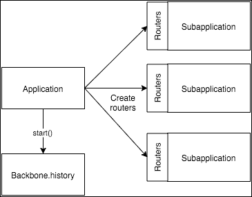

图 1.4. 应用程序实例化子应用中所有可用的路由器

```js
// app.js
var App = {
  Models: {},
  Collections: {},
  Routers: {},
  start() {
    // Initialize all available routes
    _.each(_.values(this.Routers), function(Router) {
      new Router();
    });

    // Create a global router to enable sub-applications to
    // redirect to other urls
    App.router = new DefaultRouter();
    Backbone.history.start();
  }
}
```

子应用的入口点由其路由给出，理想情况下这些路由共享相同的命名空间。例如，在联系人子应用中，所有路由都以`contacts/`前缀开始：

+   `Contacts`：列出所有可用的联系人

+   `contacts/new`：显示一个表单来创建新的联系人

+   `contacts/view/:id`：根据其 ID 显示发票

+   `contacts/edit/:id`：显示一个表单来编辑联系人

子应用应将其路由器注册到`App.Routers`全局对象中以便初始化。对于联系人子应用，`ContactsRouter`负责这项工作：

```js
// apps/contacts/router.js
'use strict';

App.Routers = App.Routers || {};

class ContactsRouter extends Backbone.Router {
  constructor(options) {
    super(options);
    this.routes = {
      'contacts': 'showContactList',
      'contacts/page/:page': 'showContactList',
      'contacts/new': 'createContact',
      'contacts/view/:id': 'showContact',
      'contacts/edit/:id': 'editContact'
    };
    this._bindRoutes();
  }

  showContactList(page) {
    // Page should be a postive number grater than 0
    page = page || 1;
    page = page > 0 ? page : 1;

    var app = this.startApp();
    app.showContactList(page);
  }

  createContact() {
    var app = this.startApp();
    app.showNewContactForm();
  }

  showContact(contactId) {
    var app = this.startApp();
    app.showContactById(contactId);
  }

  editContact(contactId) {
    var app = this.startApp();
    app.showContactEditorById(contactId);
  }

  startApp() {
    return App.startSubApplication(ContactsApp);
  }
}

// Register the router to be initialized by the infrastructure
// Application
App.Routers.ContactsRouter = ContactsRouter;
```

当用户将其浏览器指向这些路由之一时，会触发一个路由处理器。处理器函数解析 URL 并将请求委派给子应用门面：

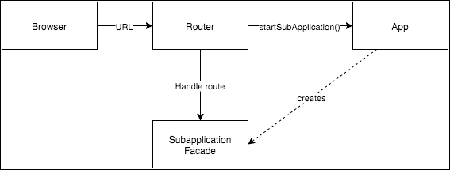

图 1.5. 路由委派到子应用门面

`App`对象中的`startSubApplication()`方法启动一个新的子应用并关闭在给定时间运行的任何其他子应用，这有助于在用户的浏览器中释放资源：

```js
var App = {
  // ...
  // Only a subapplication can be running at once, destroy any
  // current running subapplication and start the asked one
  startSubApplication(SubApplication) {
    // Do not run the same subapplication twice
    if (this.currentSubapp &&
        this.currentSubapp instanceof SubApplication) {
      return this.currentSubapp;
    }

    // Destroy any previous subapplication if we can
    if (this.currentSubapp && this.currentSubapp.destroy) {
      this.currentSubapp.destroy();
    }

    // Run subapplication
    this.currentSubapp = new SubApplication({
      region: App.mainRegion
    });
    return this.currentSubapp;
  },
}
```

### 小贴士

**下载示例代码**

您可以从您在[`www.packtpub.com`](http://www.packtpub.com)的账户下载示例代码文件，以获取您购买的所有 Packt Publishing 书籍。如果您在其他地方购买了这本书，您可以访问[`www.packtpub.com/support`](http://www.packtpub.com/support)并注册以直接将文件通过电子邮件发送给您。

`App.mainRegion` 属性是一个指向页面中 DOM 元素的 `Region` 对象实例；区域对于在 DOM 的包含区域中渲染视图非常有用。我们将在第二章中了解更多关于这个对象的信息，*管理视图*。

当子应用启动时，将对其调用外观方法来处理用户请求。外观的责任是从 RESTful API 获取必要的数据并将数据传递给控制器：

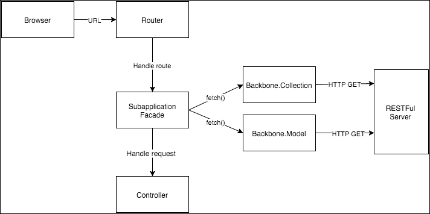

图 1.6\. 外观责任

```js
// apps/contacts/app.js
'use strict';

class ContactsApp {
  constructor(options) {
    this.region = options.region;
  }

  showContactList() {
    App.trigger('loading:start');
    App.trigger('app:contacts:started');

    new ContactCollection().fetch({
      success: (collection) => {
        // Show the contact list subapplication if
        // the list can be fetched
        this.showList(collection);
        App.trigger('loading:stop');
      },
      fail: (collection, response) => {
        // Show error message if something goes wrong
        App.trigger('loading:stop');
        App.trigger('server:error', response);
      }
    });
  }

  showNewContactForm() {
    App.trigger('app:contacts:new:started');
    this.showEditor(new Contact());
  }

  showContactEditorById(contactId) {
    App.trigger('loading:start');
    App.trigger('app:contacts:started');

    new Contact({id: contactId}).fetch({
      success: (model) => {
        this.showEditor(model);
        App.trigger('loading:stop');
      },
      fail: (collection, response) => {
        App.trigger('loading:stop');
        App.trigger('server:error', response);
      }
    });
  }

  showContactById(contactId) {
    App.trigger('loading:start');
    App.trigger('app:contacts:started');

    new Contact({id: contactId}).fetch({
      success: (model) => {
        this.showViewer(model);
        App.trigger('loading:stop');
      },
      fail: (collection, response) => {
        App.trigger('loading:stop');
        App.trigger('server:error', response);
      }
    });
  }

  showList(contacts) {
    var contactList = this.startController(ContactList);
    contactList.showList(contacts);
  }

  showEditor(contact) {
    var contactEditor = this.startController(ContactEditor);
    contactEditor.showEditor(contact);
  }

  showViewer(contact) {
    var contactViewer = this.startController(ContactViewer);
    contactViewer.showContact(contact);
  }

  startController(Controller) {
    if (this.currentController &&
        this.currentController instanceof Controller) {
      return this.currentController;
    }

    if (this.currentController &&
        this.currentController.destroy) {
      this.currentController.destroy();
    }

    this.currentController = new Controller({
      region: this.region
    });
    return this.currentController;
  }
}
```

外观对象接收一个区域对象作为参数，以指示子应用应在何处渲染。`Region` 对象将在第二章中详细解释，*管理视图*。

当外观从 RESTful 服务器获取数据时，会在 `App` 对象上发出 `loading:start` 事件，以便我们可以向用户显示正在进行的加载视图。当加载完成后，它创建并使用一个知道如何处理模型或获取的集合的控制器。

当控制器被调用时，业务逻辑开始，它将为请求渲染所有必要的视图并展示给用户，然后它将监听视图中的用户交互：

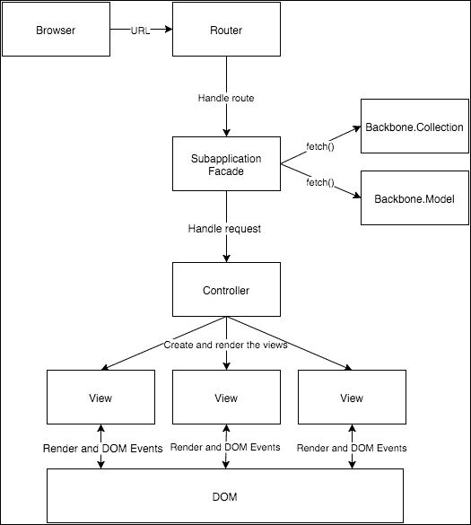

图 1.7\. 控制器创建必要的视图

对于 `ContactList` 控制器，以下是一段非常简单的代码：

```js
// apps/contacts/contactLst.js
class ContactList {
  constructor(options) {
    // Region where the application will be placed
    this.region = options.region;

    // Allow subapplication to listen and trigger events,
    // useful for subapplication wide events
    _.extend(this, Backbone.Events);
  }

  showList(contacts) {
    // Create the views
    var layout = new ContactListLayout();
    var actionBar = new ContactListActionBar();
    var contactList = new ContactListView({collection: contacts});

    // Show the views
    this.region.show(layout);
    layout.getRegion('actions').show(actionBar);
    layout.getRegion('list').show(contactList);

    this.listenTo(contactList, 'item:contact:delete',
      this.deleteContact);
  }

  createContact() {
    App.router.navigate('contacts/new', true);
  }

  deleteContact(view, contact) {
    let message = 'The contact will be deleted';
    App.askConfirmation(message, (isConfirm) => {
      if (isConfirm) {
        contact.destroy({
          success() {
            App.notifySuccess('Contact was deleted');
          },
          error() {
            App.notifyError('Ooops... Something went wrong');
          }
        });
      }
    });
  }

  // Close any active view and remove event listeners
  // to prevent zombie functions
  destroy() {
    this.region.remove();
    this.stopListening();
  }
}
```

处理请求的功能非常简单，并且所有其他控制器都遵循相同的模式，如下所示：

+   它使用传递的模型或集合创建所有必要的视图

+   它在 DOM 的一个区域中渲染视图

+   它监听视图中的事件

如果你完全不理解区域和布局的含义，不要担心，我将在第二章中详细解释这些对象的实现，*管理视图*。在这里，重要的是之前描述的算法：

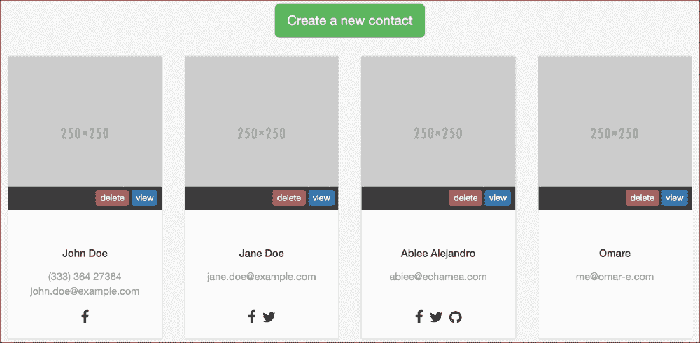

图 1.8\. ContactList 控制器结果

如上图所示，联系人列表为列表中的每个联系人显示一组卡片。用户可以通过点击**删除**按钮来删除联系人。当发生这种情况时，会触发 `contact:delete` 事件，控制器正在监听该事件并使用 `deleteContact()` 方法来处理该事件：

```js
  deleteContact(view, contact) {
    let message = 'The contact will be deleted';
    App.askConfirmation(message, (isConfirm) => {
      if (isConfirm) {
        contact.destroy({
          success() {
            App.notifySuccess('Contact was deleted');
          },
          error() {
            App.notifyError('Ooops... Something went wrong');
          }
        });
      }
    });
  }
```

处理器很容易理解，它使用基础设施应用中的 `askConfirmation()` 方法来请求用户确认。如果用户确认删除，则联系人将被销毁。基础设施应用提供了两种方法向用户显示通知：`notifySuccess()` 和 `notifyError()`。

这些 App 方法的一个优点是控制器不需要了解确认和通知机制的具体细节。从控制器的角度来看，它只是正常工作。

请求确认的方法可以是一个简单的`confirm()`调用，如下所示：

```js
// app.js
var App = {
  // ...
  askConfirmation(message, callback) {
    var isConfirm = confirm(message);
    callback(isConfirm);
  }
};
```

然而，在现代 Web 应用程序中，使用普通的`confirm()`函数并不是请求确认的最佳方式。相反，我们可以显示一个 Bootstrap 对话框或使用可用的库。为了简单起见，我们将使用漂亮的 JavaScript `SweetAlert`库；然而，你可以使用任何你想要的：

```js
// app.js
var App = {
  // ...

  askConfirmation(message, callback) {
    var options = {
      title: 'Are you sure?',
      type: 'warning',
      text: message,
      showCancelButton: true,
      confirmButtonText: 'Yes, do it!',
      confirmButtonColor: '#5cb85c',
      cancelButtonText: 'No'
    };

    // Show the message
    swal(options, function(isConfirm) {
      callback(isConfirm);
    });
  }
};
```

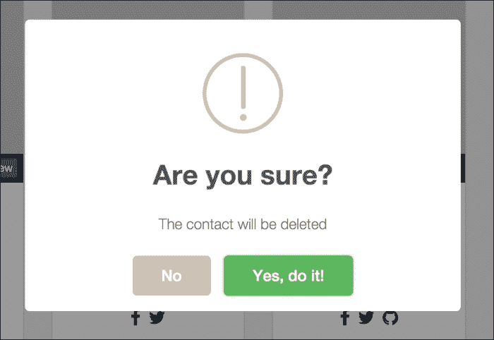

图 1.9\. 使用 SweetAlert 进行确认消息

我们可以以类似的方式实现通知方法。我们将使用 JavaScript `noty`库；然而，你可以使用任何你想要的：

```js
// app.js
var App = {
  // ...

    notifySuccess(message) {
    new noty({
      text: message,
      layout: 'topRight',
      theme: 'relax',
      type: 'success',
      timeout: 3000 // close automatically
    });
  },

  notifyError(message) {
    new noty({
      text: message,
      layout: 'topRight',
      theme: 'relax',
      type: 'error',
      timeout: 3000 // close automatically
    });
  }
};	
```

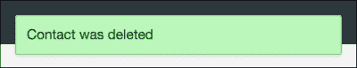

图 1.10\. 使用 noty 显示通知消息

这就是你可以实现一个健壮且可维护的 Backbone 应用程序的方法；请访问本书的 GitHub 仓库，以查看应用程序的完整代码。由于我们将在第二章中详细讨论，本章没有涵盖视图。

## 文件组织

当你与 MVC 框架一起工作时，文件组织是微不足道的。然而，Backbone 不是一个 MVC 框架，因此，自己带来文件结构是规则。你可以按照这些路径组织代码：

+   `apps/`：这个目录是模块或子应用程序所在的位置。所有子应用程序都应该在这个路径上

+   `Components/`：这些是多个子应用程序需要或在使用公共布局时作为面包屑组件使用的通用组件

+   `core/`：在这个路径下，我们可以放置所有核心功能，如工具、助手、适配器等

+   `vendor/`：在供应商下，你可以放置所有第三方库；这里你可以放置 Backbone 及其依赖项。

+   `app.js`：这是应用程序的入口点，从`index.html`加载

+   子应用程序可以有自己的文件结构，因为它们是小的 Backbone 应用程序。

+   `models/`：这定义了模型和集合

+   `app.js`：这是从`index.html`加载的应用程序外观，由路由器调用

+   `router.js`：这是由根应用程序在引导过程中实例化的应用程序路由器

+   `contactList.js`、`contactEditor.js`、`contactViewer.js`：这些是应用程序的控制器

对于一个`联系人`应用程序，代码组织可以像以下所示：

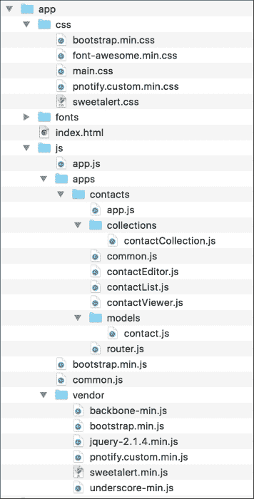

图 1.11\. 文件结构

# 摘要

我们首先以一般的方式描述了 Backbone 应用程序的工作方式。它描述了两个主要部分：根应用程序和子应用程序。根应用程序为其他较小且专注的应用程序提供公共基础设施，我们称之为子应用程序。

子应用应该与其他子应用松散耦合，并拥有自己的资源，例如视图、控制器、路由器等。子应用通过一个由`Backbone.Events`驱动的事件总线与基础设施应用进行通信，管理系统的一部分，具有明确的业务价值。

用户通过子应用渲染的视图与应用程序进行交互。子应用控制器协调视图、模型和集合之间的交互，并拥有用例的业务逻辑。

最后，文件系统组织解释了放置文件的正确位置，以保持项目整洁和有序。这种组织不遵循 MVC 模式；然而，它强大且简单。它将模块的所有必要代码封装在单个路径（子应用路径）中，而不是将所有代码分散在多个路径上。

以这种方式，Backbone 应用程序的结构已被证明是健壮的，这一点可以从遵循（或多或少）此处公开的原则的几个开源应用程序（如 TodoMVC）中得到证明。由于职责分离，这有助于提高代码的可测试性，因此每个对象都可以单独进行测试。

大型 Backbone 应用程序通常建立在 Backbone Marionette 之上，因为它减少了样板代码；然而，Marionette 使用自己的约定来工作。如果您对使用自己的约定感到满意，那么您将很高兴在 Backbone 之上使用 Marionette。

然而，如果您喜欢按照自己的方式做事的自由，您可能更喜欢纯 Backbone，并创建自己的实用工具和类。

在下一章中，我将向您展示如何管理和组织视图，简化复杂的布局，并识别视图的常见用法。您将构建通用视图，这些视图将对所有项目都有用，并且可以忘记`render()`方法的实现。
