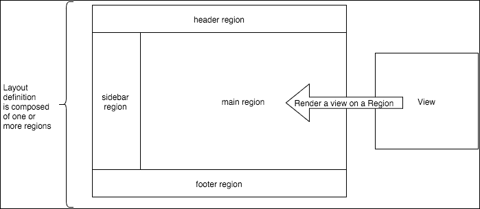
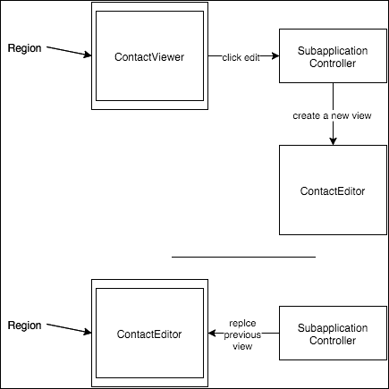
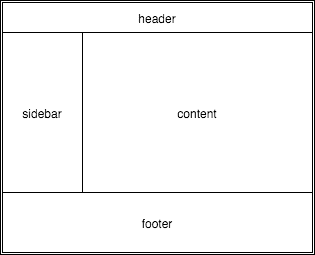
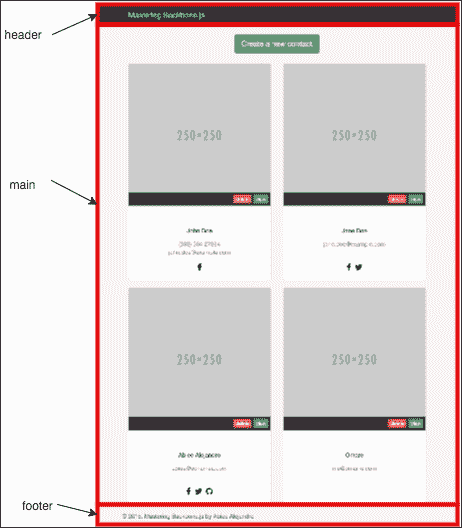
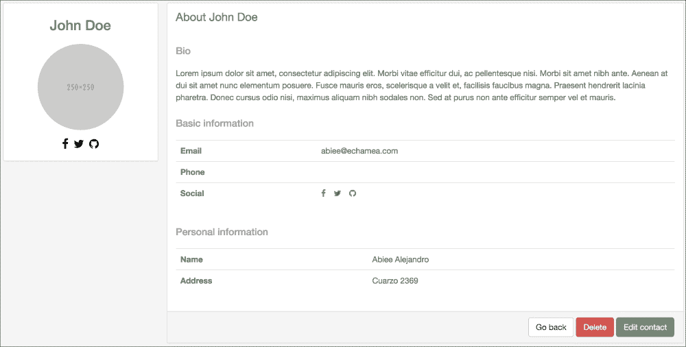
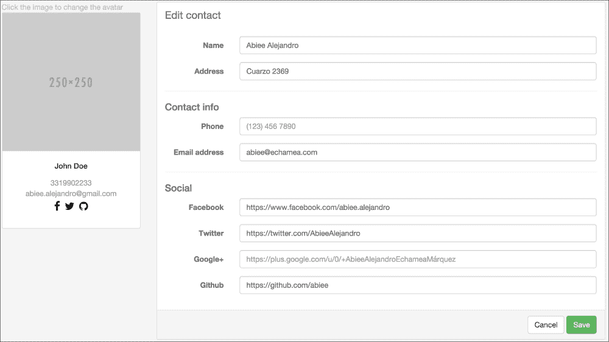

# 第二章 管理视图

正如我们在上一章所看到的，Backbone 视图负责管理用户与应用程序之间的**DOM（文档对象模型**）交互。一个典型的 Backbone 应用程序由许多具有非常特定行为的视图组成；例如，我们可以有一个用于显示联系数据的视图，另一个用于编辑它。正如你所知，渲染单个视图是一个简单的任务，但协调多个视图的复杂布局可能会很痛苦。

开发更好的策略来处理复杂的视图交互，以使项目更容易维护和开发，这一点很重要。如果你不重视视图的组织，你可能会得到一个脏 DOM 和混乱的代码，这使得引入新功能或更改现有功能变得困难。

正如我们在上一章所做的那样，我们将通过识别常见的视图用例来分离责任，然后我们将学习如何通过使用小视图来组合布局。

在本章中，你将学习如何：

+   识别常见的视图类型

+   实现可重用的视图以处理常见类型

+   使用可重用的视图类型轻松组合复杂视图

# 识别视图类型

在使用 Backbone 一段时间后，你可以看到视图的常见用例出现；它们如此常见，以至于可以用于不同的无关项目。这些视图可以被提取出来，并且如果它们被正确构建，可以在任何项目中使用。查看 Backbone 文档，视图不实现默认的渲染方法，所以这里的技巧是为不同的用例定义一组具有默认渲染方法的视图：

+   **带有模型的视图** – 使用模型数据渲染模板。

+   **带有集合的视图** – 使用集合数据渲染视图集合；它应该在集合更改时自动更新视图列表。

+   **区域** – 这个视图像一个容器；它指向特定的 DOM 节点，并管理该节点的内。它用于渲染其他视图。

+   **布局** – 布局由一个或多个区域组成；它定义了一个 HTML 结构来组织区域将放置的位置。

图 2.1 显示了一个应用程序的简单线框；正如你所见，这是一个在 Web 应用程序中非常常见的布局，对于理解常见的视图类型之间的关系非常有用。



图 2.1：视图、区域和布局关系

通过这些基础视图，你将拥有一个简单但强大的框架来管理你的视图，因此你不再需要实现`render()`方法。

# ModelView

最简单的实现是渲染单个模型；这是一个非常直接的算法。从模型中提取数据，并使用模板引擎使用数据实际渲染；最后，将结果附加到 DOM 中：

```js
class MyView extends Backbone.View {
  constructor(options) {
    super(options);
    template: _.template($("#my-template").html());
  }

  render() {
       var data = this.model.toJSON();
    var renderedHtml = this.template(data);
    this.$el.html(renderedHtml);
    return this;
  }
}
```

在下面的代码中，我们可以识别渲染视图的五个步骤。

1.  获取模板：

    ```js
    $("#my-template").html()

    ```

1.  编译模板：

    ```js
    _.template($("#my-template").html())

    ```

1.  从模型获取数据：

    ```js
    var data = this.model.toJSON()

    ```

1.  使用模型数据渲染模板：

    ```js
    renderedHtml = this.template(data)

    ```

1.  将结果放入 DOM 中：

    ```js
    this.$el.html(renderedHtml)

    ```

注意，我们在`render()`方法中返回这个对象；这对于链式调用很有用。这些步骤适用于所有需要渲染模型的视图，因此我们可以将这种行为提取到一个新的视图类型中。这个视图将拥有通用的算法，并允许特定的部分进行扩展：

```js
class ModelView extends Backbone.View {
  render() {
    var data = this.serializeData();

    // Compile the template
    var renderedHtml = _.template(this.template, data);

    // Put the result in the DOM
    this.$el.html(renderedHtml);
    return this;
  }

  serializeData() {
    var data;

    // Serialize only if a model is present
    if (this.model) {
      data = this.model.toJSON();
    }

    return data;
  }
});
```

模型数据现在是在一个单独的方法`serializeData()`中完成的，这允许我们以不同的方式向视图提供数据；然而，它实现了一个在大多数情况下需要的默认行为。

现在模板使用 Underscore 模板引擎在过程中编译，因此您必须提供模板文本，让它完成其余工作。但这使得视图与模板引擎高度耦合；如果您需要使用不同的模板引擎，如 Handlebars，怎么办？

我们可以在`serializedData()`方法中使用与之前相同的策略，并将此行为放入一个单独的方法中。所有模板引擎都需要两样东西：模板文本和数据。模板文本可以通过 jQuery 选择器、字符串变量、预编译模板等方式获得。因此，我们将将其留给最终实现：

```js
  class ModelView extends Backbone.View {  
    // Compile template with underscore templates. This method
    // can be redefined to implemente another template engine
    // like Handlebars or Jade
    compileTemplate() {
      var $el = $(this.template);
      return _.template($el.html());
    }

    // ...
  }
```

而且，就像我们对`serializedData()`所做的那样，实现了一个默认行为。

```js
class ModelView extends Backbone.View {
  render() {
    // Get JSON representation of the model
    var data = this.serializeData();
    var renderedHtml;

    // If template is a function assume that is a compiled
    // template, if not assume that is a CSS selector where
    // the template is defined and is compatible with
    // underscore templates
    if (_.isFunction(this.template)) {
      renderedHtml = this.template(data);
    } else if (_.isString(this.template)) {
      var compiledTemplate = this.compileTemplate();
      renderedHtml = compiledTemplate(data);
    }

    this.$el.html(renderedHtml);
    return this;
  }

  // …
}
```

在这种情况下，`template`属性可以是函数或字符串。如果使用字符串，则默认行为将使用 Underscore 模板引擎。如果使用函数，则函数为我们提供了使用任何模板引擎的自由。

如果我们想在视图中渲染模型，我们可以这样做：

```js
var contact = new Backbone.Model({
  name: 'John Doe',
  phone: '5555555'
});

var ContactView extends ModelView {
  constructor(options) {
    super(options);
    this.template = $('#contact-template').html();
  }

  // ... anything else like event handlers
}

var contactView = new ContactView({
  model: contact,
  el: 'body'
});
contactView.render();
```

您只需指定模板和模型，然后就可以完成了！

# CollectionView

Backbone 集合由许多模型组成，因此当渲染集合时，我们需要渲染`Views`的列表：

```js
class CollectionView extends Backbone.View {
  render() {
    // Render a view for each model in the collection
    var html = this.collection.map(model => {
      var view = new this.modelView(model);
      view.render();
      return view.$el;
    });

    // Put the rendered items in the DOM
    this.$el.html(html);
    return this;
  }
}
```

注意，`modelView`属性应该是视图类；它可以是上一节中的`ModelView`类或任何其他视图。看看对于集合中的每个模型，它如何实例化和渲染一个带有当前模型的`this.modelView`。结果，`html`变量将包含所有渲染视图的数组。最后，`html`数组可以轻松地附加到`$el`元素上。

有关如何使用`CollectionView`的示例，请参阅以下示例：

```js
class MyModelView extends ModelView {
  // …
)

class MyView extends CollectionView {
  constructor(options) {
    super(options);
    this.el = '#main';
    this.modelView = MyModelView;
  }
}

var view = new MyView({collection: someCollection});
view.render();
```

这段代码将完成这项工作，它将为`someCollection`对象中的每个模型渲染一个`MyModelView`，并将结果列表放入`#main`元素中。

然而，如果您向集合中添加模型或删除它们，视图将不会更新。这不是期望的行为。当添加模型时，它应该在列表末尾添加一个新的视图；如果从集合中删除模型，则应删除与该模型关联的视图。

一种快速且简单的方法是在集合的每次更改时重新渲染整个视图，以同步集合更改和视图，但这种方法非常低效，因为当重新渲染不需要更改的视图时，会消耗客户端资源。应该存在更好的方法。

## 添加新模型

当模型被添加到集合中时，会触发一个 `add` 事件；我们可以创建一个事件处理器来更新视图：

```js
class CollectionView extends Backbone.View {
  initialize() {
    this.listenTo(this.collection, 'add', this.addModel);
  }

  // ...
}
```

当调用 `addModel` 方法时，它应该创建并渲染一个新的视图，包含添加的模型的数据，并将其放在列表的末尾。

```js
var CollectionView = Backbone.View.extend({
  // ...
  // Render a model when is added to the collection
  modelAdded(model) {
    var view = this.renderModel(model);
    this.$el.append(view.$el);
  }

  render() {
    // Render a view for each model in the collection
    var html = this.collection.map(model => {
      var view = this.renderModel(model);
      return view.$el;
    });

    // Put the rendered items in the DOM
    this.$el.html(html);
    return this;
  }

  renderModel(model) {
    // Create a new view instance, modelView should be
    // redefined as a subclass of Backbone.View
    var view = new this.modelView({model: model});

    // Keep track of which view belongs to a model
    this.children[model.cid] = view;

    // Re-trigger all events in the children views, so that
    // you can listen events of the children views from the
    // collection view
    this.listenTo(view, 'all', eventName => {
      this.trigger('item:' + eventName, view, model);
    });

    view.render();
    return view;
  }
}
```

添加了 `renderModel()` 方法，因为 `render()` 和 `modelAdded()` 两个方法都需要以相同的方式渲染模型。这里应用了 DRY 原则。

当一个子视图被渲染时，监听给定视图的所有事件是有用的，这样我们就可以监听来自集合的子事件。

```js
var myCollectionView = new CollectionView({...});

myCollectionView.on('item:does:something', (view, model) => {
  // Do something with the model or the view
});
```

我们的事件处理器非常简单；它使用 `renderModel()` 方法渲染添加的模型，为视图中的任何事件附加事件处理器，并将结果追加到 DOM 元素的末尾。

## 删除模型

当模型从集合中移除时，包含该模型的视图应该从 DOM 中删除，以反映集合的当前状态。考虑一个用于 `removed` 事件的处理器：

```js
function modelRemoved(model) {
  var view = getViewForModel(model); // Find view for this model
  view.destroy();
}
```

我们如何获取与模型关联的视图？我们目前没有简单的方法来做这件事。为了使其更容易，我们可以跟踪模型-视图关联；这样，获取视图就非常容易：

```js
class CollectionView extends Backbone.View {
  initialize() {
    this.children = {};
    this.listenTo(this.collection, 'add', this.modelAdded);
    this.listenTo(this.collection, 'remove', this.modelRemoved);
  }

  // ...

  // Close view of model when is removed from the collection
  modelRemoved(model) {
    var view = this.children[model.cid];

    if (view) {
      view.remove();
      this.children[model.cid] = undefined;
    }
  }

  // ...

  renderModel(model) {
    // Create a new view instance, modelView should be
    // redefined as a subclass of Backbone.View
    var view = new this.modelView({model: model});

    // Keep track of which view belongs to a model
    this.children[model.cid] = view;

    // Re-trigger all events in the children views, so that
    // you can listen events of the children views from the
    // collection view
    this.listenTo(view, 'all', eventName => {
      this.trigger('item:' + eventName, view, model);
    });

    view.render();
    return view;
  }
}
```

在渲染时间，我们在 `this.children` 哈希表中存储视图的引用，以便将来参考，因为 `render()` 和 `modelAdded()` 使用相同的方法进行渲染；这个更改在一个地方完成，即 `renderModel()` 方法。

当一个模型被移除时，`modelRemoved()` 方法可以轻松找到视图，并通过调用标准的 `remove()` 方法以及销毁 `this.children` 哈希表中的引用来移除它。

## 销毁视图

当一个 `CollectionView` 被销毁时，它应该移除所有子视图以正确清理内存。这应该通过扩展 `remove()` 方法来完成：

```js
class CollectionView extends Backbone.View {
  // ...

  // Close view of model when is removed from the collection
  modelRemoved(model) {
    if (!model) return;

    var view = this.children[model.cid];
    this.closeChildView(view);
  }

  // ...

  // Called to close the collection view, should close
  // itself and all the live childrens
  remove() {
    Backbone.View.prototype.remove.call(this);
    this.closeChildren();
  }

  // Close all the live childrens
  closeChildren() {
    var children = this.children || {};

    // Use the arrow function to bind correctly the "this" object
    _.each(children, child => this.closeChildView(child));
  }

  closeChildView(view) {
    // Ignore if view is not valid
    if (!view) return;

    // Call the remove function only if available
    if (_.isFunction(view.remove)) {
      view.remove();
    }

    // Remove event handlers for the view
    this.stopListening(view);

    // Stop tracking the model-view relationship for the
    // closed view
    if (view.model) {
      this.children[view.model.cid] = undefined;
    }
  }
}
```

现在，当视图需要被移除时，它将执行此操作并清理所有子视图。

## 重置集合

当一个集合被清除时，视图应该重新渲染整个集合，因为所有项目都被替换了：

```js
class CollectionView extends Backbone.View {
  initialize() {
    // ...
    this.listenTo(this.collection, 'reset', this.render);
  }

  // ...
}
```

这可以工作，但之前的视图也应该关闭；正如我们在上一节中看到的，最佳做法是在渲染方法中完成它：

```js
class CollectionView extends Backbone.View.extend({
  // ...
  render () {
    // Clean up any previous elements rendered
    this.closeChildren();

    // Render a view for each model in the collection
    var html = this.collection.map(model => {
      var view = this.renderModel(model);
      return view.$el;
    });

    // Put the rendered items in the DOM
    this.$el.html(html);
    return this;
  }

  // ...
}
```

如果一个视图还没有项目，`closeChildren()` 方法将不会做任何事情。

# 区域

一个常见的用例是在一个常见的 DOM 元素之间切换视图；这可以通过在两个视图中使用相同的 `el` 属性并在你想要看到的视图中调用 `render()` 方法来实现。但这种方式不会清理内存和事件绑定，因为两个视图都将保留在内存中，即使它们不在 DOM 中。

一个特别有用的场景是在需要切换子应用程序时，因为子应用程序通常在同一个 DOM 元素中渲染。例如，当用户想要编辑联系信息时，他/她将点击一个 **编辑** 按钮，当前视图将被替换为编辑表单。



图 2.2：使用区域交换视图

要在视图之间切换，可以使用`Region`类，如下所示：

```js
var mainRegion = new Region({el: '#main'});
var contactViewer = new ContactViewer({model: contact});

contactViewer.on('edit:contact', function(contact) {
  var editContact = new EditContactView({ model: contact });
  mainRegion.show(editContact);
});

mainRegion.show(contactViewer);
```

`Region`对象指向一个现有的 DOM 元素；要在该元素上显示一个视图，应在`Region`对象上调用`show()`方法。请注意，视图没有设置`el`属性，因为区域会将元素放入 DOM 中，而不是视图本身。这给我们带来了一个额外功能，视图不再需要设置`el`属性，并且可以在任何可用的区域上渲染。

可以使用以下代码实现一个基本的区域管理器：

```js
class Region {
  constructor(options) {
    this.el = options.el;
  }

  // Closes any active view and render a new one
  show(view) {
    this.closeView(this.currentView);
    this.currentView = view;
    this.openView(view);
  }

  closeView(view) {
    // Only remove the view when the remove function
    // is available
    if (view && view.remove) {
      view.remove();
    }
  }

  openView(view) {
    // Be sure that this.$el exists
    this.ensureEl();

    // Render the view on the this.$el element
    view.render();
    this.$el.html(view.el);
  }

  // Create the this.$el attribute if do not exists
  ensureEl() {
    if (this.$el) return;
    this.$el = $(this.el);
  }

  // Close the Region and any view on it
  remove() {
    this.closeView(this.currentView);
  }
}
```

当调用`show()`方法时，如果存在当前视图，则关闭它，然后分配一个新的`currentView`并打开视图。当一个视图打开时，`Region`确保存在`$el`属性，首先调用`ensureEl()`方法。然后发生有趣的部分：

```js
view.render();
this.$el.html(view.el);
```

Backbone 文档解释了视图的工作方式：

> *所有视图始终都有一个 DOM 元素（el 属性），无论它们是否已经插入到页面中。以这种方式，视图可以在任何时候渲染，并一次性插入到 DOM 中 [...]*

这里发生的就是这个：我们首先在内存中渲染视图，调用`view.render()`，然后将结果插入由 Region 的`$el`属性指向的 DOM 中。

还实现了`remove()`方法，以便使区域与 Backbone Views 兼容。当一个区域被移除时，它需要关闭拥有的视图，因此这使我们能够轻松地做到这一点。

假设我们有一个拥有许多视图的`CollectionView`的区域；当在区域上调用`remove()`方法时，它将调用`CollectionView`上的`remove()`方法，该方法将调用每个子视图的`remove()`方法。

# 布局

布局用于定义结构；其目的是创建一个骨架，其他视图将放置在其中。一个常见的 Web 应用程序布局由一个页眉、一个侧边栏、页脚和一个公共区域组成，例如。使用布局，我们可以以声明的方式定义这些元素将放置的区域。在布局渲染后，我们可以在这些视图上显示我们想要的视图。

在下面的图中，我们可以看到一个布局；这些元素中的每一个都是一个区域，因此应该创建其他视图来填充这些区域——例如，为头部区域创建一个 HeaderView 类：



图 2.3：一个常见的 Web 应用程序布局

这个示例的实现可能如下所示：

```js
var AppLayout = new Layout({
  template: $('#app-layout').html(),
  regions: {
    header: 'header',
    sicebar: '#sidebar',
    footer: 'footer',
    main: '#main'
  }
});

Var layout = new AppLayout({ el: 'body' });
var header = new HeaderView();

layout.render();
layout.getRegion('header').show(header);
```

看看区域是如何声明的：一对名称和一个选择器。布局将通过`getRegion()`方法公开区域，该方法接收区域的名称并返回一个`Region`类的实例，可以在前一个部分中看到其用法。

还要注意，布局需要定义一个`template`属性；它应遵循在`ModelView`实现中使用的相同规则。该模板将定义区域将被指向的 HTML。

下面的代码展示了如何创建一个布局视图：

```js
class Layout extends ModelView {
  render() {
    // Clean up any rendered DOM
    this.closeRegions();

    // Render the layout template
    var result = ModelView.prototype.render.call(this);

    // Creand and expose the configurated regions
    this.configureRegions();
    return result;
  }

  configureRegions() {
    var regionDefinitions = this.regions || {};

    if (!this._regions) {
      this._regions = {};
    }

    // Create the configurated regions and save a reference
    // in the this._regions attribute
    _.each(regionDefinitions, (selector, name) => {
      let $el = this.$(selector);
      this._regions[name] = new Region({el: $el});
    });
  }

  // Get a Region instance for a named region
  getRegion(regionName) {
    // Ensure that regions is a valid object
    var regions = this._regions || {};
    return regions[regionName];
  }

  // Close the layout and all the regions on it
  remove(options) {
    ModelView.prototype.remove.call(this, options);
    this.closeRegions();
  }

  closeRegions() {
    var regions = this._regions || {};

    // Close each active region
    _.each(regions, region => {
      if (region && region.remove) region.remove();
    });
  }
}
```

布局直接扩展自`ModelView`，因此`render()`方法的行为类似于`ModelView`，但在渲染后扩展其行为，创建必要的区域。`configurateRegions()`方法为`regions`属性上声明的每个区域创建一个区域。区域名称与`Region`实例之间的关联存储在`_regions`属性中，以供未来引用。

当布局被移除时，它应该关闭任何打开的区域，以便所有资源都能干净地释放。这是`closeRegions()`方法的工作；它遍历所有使用`configurateRegions()`创建的区域，并对每个区域调用`remove()`方法。

由于区域存储在名为`_regions`的私有属性中，因此需要一个访问区域的方法；`getRegion()`方法返回与区域名称关联的区域实例。

# 将所有内容整合在一起

我们已经创建了四种简单但强大的新视图类型，可以在项目中轻松使用，最大限度地减少工作量并减少冗余代码。在下一节中，我们将把我们的联系人项目转换成一个更复杂的项目，使用在这里学到的知识：



图 2.4：应用程序根布局

我们的应用程序将有一个包含三个部分的根布局：

+   页眉 – 将包含导航栏

+   页脚 – 版权信息

+   主视图 – 此元素根据需要显示所有子应用程序

这个布局描述不是布局对象；相反，它描述了 HTML 根内容：

```js
<!doctype html>
<html lang="">
  <head>
    <meta charset="utf-8">
    <title>mastering backbone design</title>
    <meta name="description" content="">
    <meta name="viewport" content="width=device-width, initial-scale=1">

    <link rel="shortcut icon" href="/favicon.ico">
    <link rel="apple-touch-icon" href="/apple-touch-icon.png">
    <!-- Place favicon.ico and apple-touch-icon.png in the root directory -->

    <link rel="stylesheet" href="css/bootstrap.min.css">
    <link rel="stylesheet" href="css/sweetalert.css">
    <link rel="stylesheet" href="css/pnotify.custom.min.css">
    <link rel="stylesheet" href="css/font-awesome.min.css">
    <link rel="stylesheet" href="css/main.css">
  </head>
  <body>
    <!--[if lt IE 10]>
      <p class="browsehappy">You are using an <strong>outdated</strong> browser. Please <a href="http://browsehappy.com/">upgrade your browser</a> to improve your experience.</p>
    <![endif]-->

    <nav class="navbar">
      <div class="container">
        <div class="navbar-header">
          <a class="navbar-brand" href="#">
            Mastering Backbone.js
          </a>
        </div>
      </div>
    </nav>

    <div id="main" class="container"></div>

    <script src="img/jquery-2.1.4.min.js"></script>
    <script src="img/bootstrap.min.js"></script>
    <script src="img/sweetalert.min.js"></script>
    <script src="img/pnotify.custom.min.js"></script>
    <script src="img/underscore-min.js"></script>
    <script src="img/backbone-min.js"></script>

  </body>
</html>
```

在这个根布局中，页眉和页脚非常简单，因此没有必要为它们创建单独的视图。有一个`main` div，它将成为我们的主要区域，用于整个应用程序。

## 显示列表

`ContactList`子应用程序负责在 DOM 中渲染集合。因此，`ContactList`对象将实例化必要的视图：

```js
// apps/contacts/contactList.js
showList(contacts) {
  // Create the views
  var layout = new ContactListLayout();
  var actionBar = new ContactListActionBar();
  var contactList = new ContactListView({collection: contacts});

  // Show the views
  this.region.show(layout);
  layout.getRegion('actions').show(actionBar);
  layout.getRegion('list').show(contactList);

  this.listenTo(contactList, 'item:contact:delete',
    this.deleteContact);
}
```

创建一个布局，将`CollectionView`放入其中；布局模板有一个`div`，其`contact-list-layout` ID 将用作目标区域：

```js
// index.html
<script id="contact-list-layout" type="text/template">
  <div class="actions-bar-container"></div>
  <div class="list-container"></div>
  <div class="footer text-muted">
    © 2015\. <a href="#">Mastering Backbone.js</a> by <a href="https://twitter.com/abieealejandro" target="_blank">Abiee Alejandro</a>
  </div>
</script>
```

布局代码非常简单：

```js
// apps/contacts/contactList.js
class ContactListLayout extends Layout {
  constructor(options) {
    super(options);
    this.template = '#contact-list-layout';
    this.regions = {
      actions: '.actions-bar-container',
      list: '.list-container'
    };
  }

  get className() {
    return 'row page-container';
  }
}
```

展示联系人群的视图非常简单明了，因为它只需要指定`modelView`属性：

```js
// apps/contacts/contactList.js
class ContactListView extends CollectionView {
  constructor(options) {
    super(options);
    this.modelView = ContactListItemView;
  }

  get className() {
    return 'contact-list';
  }
}
```

联系人卡片模板显示联系人姓名、电话号码、电子邮件及其社交网络：

```js
// index.html
<script id="contact-list-item" type="text/template">
  <div class="box thumbnail">
    <div class="photo">
      
      <div class="action-bar clearfix">
        <div class="action-buttons pull-right">
          <button id="delete"
            class="btn btn-danger btn-xs">delete</button>
          <button id="view"
            class="btn btn-primary btn-xs">view</button>
        </div>
      </div>
    </div>
    <div class="caption-container">
      <div class="caption">
        <h5><%= name %></h5>
        <% if (phone) { %>
          <p class="phone no-margin"><%= phone %></p>
        <% } %>
        <% if (email) { %>
          <p class="email no-margin"><%= email %></p>
        <% } %>
        <div class="bottom">
          <ul class="social-networks">
            <% if (facebook) { %>
            <li>
              <a href="<%= facebook %>" title="Google Drive">
                <i class="fa fa-facebook"></i>
              </a>
            </li>
            <% } %>
            <% if (twitter) { %>
            <li>
              <a href="<%= twitter %>" title="Twitter">
                <i class="fa fa-twitter"></i>
              </a>
            </li>
            <% } %>
            <% if (google) { %>
            <li>
              <a href="<%= google %>" title="Google Drive">
                <i class="fa fa-google-plus"></i>
              </a>
            </li>
            <% } %>
            <% if (github) { %>
            <li>
              <a href="<%= github %>" title="Github">
                <i class="fa fa-github"></i>
              </a>
            </li>
            <% } %>
          </ul>
        </div>
      </div>
    </div>
  </div>
</script>
```

`ContactListItemView`类应处理删除和视图事件：

```js
// apps/contacts/contactList.js
class ContactListItemView extends ModelView {
  constructor(options) {
    super(options);
    this.template = '#contact-list-item';
  }

  get className() {
    return 'col-xs-12 col-sm-6 col-md-3';
  }

  get events() {
    return {
      'click #delete': 'deleteContact',
      'click #view': 'viewContact'
    };
  }

  initialize(options) {
    this.listenTo(options.model, 'change', this.render);
  }

  deleteContact() {
    this.trigger('contact:delete', this.model);
  }

  viewContact() {
    var contactId = this.model.get('id');
    App.router.navigate(`contacts/view/${contactId}`, true);
  }
}
```

当用户点击**删除**按钮时，视图触发`contact:delete`事件，并让控制器处理删除过程。因为**视图**按钮比**删除**按钮简单，所以我们可以从视图重定向用户到联系人列表；请注意，将这个非常简单的任务委托给控制器将增加更多开销而没有好处。

操作栏允许用户添加新用户。

```js
<script id="contact-list-action-bar" type="text/template">
  <button class="btn btn-lg btn-success">
    Create a new contact
  </button>
</script>
```

`ContactListActionBar`仅渲染其模板并等待对其按钮的点击。

```js
// apps/contacts/contactList.js
class ContactListActionBar extends ModelView {
  constructor(options) {
    super(options);
    this.template = '#contact-list-action-bar';
  }

  get className() {
    return 'options-bar col-xs-12';
  }

  get events() {
    return {
      'click button': 'createContact'
    };
  }

  createContact() {
    App.router.navigate('contacts/new', true);
  }
}
```

当按钮被点击时，我们将用户重定向到联系表单以创建新用户。

## 显示详细信息

联系人详细信息显示单个联系人的只读版本；在这里，你可以看到给定联系人的所有详细信息，但不能编辑。以下截图显示了它的外观：



图 2.5：联系人详细信息

要显示联系人的只读版本，我们首先需要定义一个布局：

```js
<script id="contact-view-layout" type="text/template">
  <div class="row page-container">
    <div id="contact-widget"
      class="col-xs-12 col-sm-4 col-md-3"></div>
    <div class="col-xs-12 col-sm-8 col-md-9">
      <div class="row">
        <div id="about-container"></div>
        <div id="call-log-container"></div>
      </div>
    </div>
  </div>
  <div class="footer text-muted">
    © 2015\. <a href="#">Mastering Backbone.js</a> by <a href="https://twitter.com/abieealejandro" target="_blank">Abiee Alejandro</a>
  </div>
</script>
```

布局定义了两个区域，一个用于左侧的小部件，另一个用于主要内容：

```js
// apps/contacts/contactViewer.js
class ContactViewLayout extends Layout {
  constructor(options) {
    super(options);
    this.template = '#contact-view-layout';
    this.regions = {
      widget: '#contact-widget',
      about: '#about-container'
    };
  }

  get className() {
    return 'row page-container';
  }
}
```

当`ContactViewLayout`被渲染时，小部件和关于信息应该被渲染。这些视图的模板非常简单，所以为了节省空间，这里将不会展示；如果你想看到实现细节，请访问这本书的 GitHub 仓库。

`ContactAbout`视图包括三个按钮，用于返回列表，另一个用于删除联系人，最后一个用于编辑它。

```js
// apps/contacts/contactViewer.js
class ContactAbout extends ModelView {
  constructor(options) {
    super(options);
    this.template = '#contact-view-about';
  }

  get className() {
    return 'panel panel-simple';
  }

  get events() {
    return {
      'click #back': 'goToList',
      'click #delete': 'deleteContact',
      'click #edit': 'editContact'
    };
  }

  goToList() {
    App.router.navigate('contacts', true);
  }

  deleteContact() {
    this.trigger('contact:delete', this.model);
  }

  editContact() {
    var contactId = this.model.get('id');
    App.router.navigate(`contacts/edit/${contactId}`, true);
  }
}
```

正如我们在`ContactList`中所做的那样，我们将删除过程委托给控制器；视图不应该处理这个业务逻辑。然而，编辑和返回按钮是简单的 URL 重定向，可以直接在视图中实现。

## 编辑信息

图 2.6 显示了联系人编辑表单的外观。表单视图应该能够从输入框中获取信息并更新传递给它的联系人模型。

应在此处创建一个布局模板，以将左侧的小部件与右侧的表单视图分开：

```js
<script id="contact-form-layout" type="text/template">
  <div id="preview-container"
    class="col-xs-12 col-sm-4 col-md-3"></div>
  <div id="form-container"
    class="col-xs-12 col-sm-8 col-md-9"></div>

  <div class="footer text-muted">
    © 2015\. <a href="#">Mastering Backbone.js</a> by <a href="http://themeforest.net/user/Kopyov" target="_blank">Abiee Alejandro</a>
  </div>
</script>
```



图 2.6：编辑联系人表单

布局定义了两个区域：

```js
// apps/contacts/contactEditor.js
class ContactFormLayout extends Layout {
  constructor(options) {
    super(options);
    this.template = '#contact-form-layout';
    this.regions = {
      preview: '#preview-container',
      form: '#form-container'
    };
  }

  get className() {
    return 'row page-container';
  }
}
```

为了编辑联系人，我们需要定义一个表单：

```js
// index.html
<script id="contact-form" type="text/template">
  <div class="panel panel-simple">
    <div class="panel-heading">Edit contact</div>
    <div class="panel-body">
      <form class="form-horizontal">
        <div class="form-group">
          <label for="name"
            class="col-sm-2 control-label">Name</label>
          <div class="col-sm-10">
            <input id="name" type="text"
              class="form-control" placeholder="Full name"
              value="<%= name %>" />
          </div>
        </div>
        // ...

        <hr />

        <h4>Contact info</h4>
        <div class="form-group">
          <label for="name"
            class="col-sm-2 control-label">Phone</label>
          <div class="col-sm-10">
            <input id="name" type="text"
              class="form-control"
              placeholder="(123) 456 7890" value="<%= phone %>" />
          </div>
        </div>
        // ...
      </form>
    </div>
    <div class="panel-footer clearfix">
      <div class="panel-buttons">
        <button id="cancel" class="btn btn-default">Cancel</button>
        <button id="save" class="btn btn-success">Save</button>
      </div>
    </div>
  </div>
</script>
```

由于空间原因，我在书中删除了重复的代码，但你可以在 GitHub 仓库中看到完整的代码。请注意，此表单将用于编辑和创建新的联系人。对于模型中的每个属性，都会渲染一个包含属性内容的输入：

```js
// apps/contacts/contactEditor.js 
class ContactForm extends ModelView {
  constructor(options) {
    super(options);
    this.template = '#contact-form';
  }

  get className() {
    return 'form-horizontal';
  }

  get events() {
    return {
      'click #save': 'saveContact',
      'click #cancel': 'cancel'
    };
  }

  serializeData() {
    return _.defaults(this.model.toJSON(), {
      name: '',
      age: '',
      phone: '',
      email: '',
      address1: '',
      address2: ''
    });
  }

  saveContact(event) {
    event.preventDefault();
    this.model.set('name', this.getInput('#name'));
    this.model.set('phone', this.getInput('#phone'));
    this.model.set('email', this.getInput('#email'));
    this.model.set('address1', this.getInput('#address1'));
    this.model.set('address2', this.getInput('#address2'));
    this.model.set('facebook', this.getInput('#facebook'));
    this.model.set('twitter', this.getInput('#twitter'));
    this.model.set('google', this.getInput('#google'));
    this.model.set('github', this.getInput('#github'));
    this.trigger('form:save', this.model);
  }

  getInput(selector) {
    return this.$el.find(selector).val();
  }

  cancel() {
    this.trigger('form:cancel');
  }
}
```

当用户点击**取消**按钮时，会触发一个由`ContactEditor`子应用控制器处理的`form:cancel`事件。

```js
// apps/contacts/contactEditor.js 
  cancel() {
    // Warn user before make redirection to prevent accidental
    // cencel
    App.askConfirmation('Changes will be lost', isConfirm => {
      if (isConfirm) {
        App.router.navigate('contacts', true);
      }
    });
  }
```

当模型被渲染时，它可能包含或不包含属性，这取决于服务器响应；因此，我们扩展了`serializeData()`方法来分配默认值。

当用户点击**保存**按钮时，会调用`saveContact()`，它从输入中获取数据并将新值分配给模型，然后触发一个`form:save`事件，由`ContactEditor`子应用控制器处理。

```js
// apps/contacts/edit-contact.js 
  saveContact(contact) {
    contact.save(null, {
      success() {
        // Redirect user to contact list after save
        App.notifySuccess('Contact saved');
        App.router.navigate('contacts', true);
      },
      error() {
        // Show error message if something goes wrong
        App.notifyError('Something goes wrong');
      }
    });
  }
```

# 渲染第三方插件

在渲染视图时，一个常见的问题是未能渲染其他人的插件，因为它们是为传统的 Web 应用程序设计的，而不是为 SPA 设计的；这是因为许多插件依赖于 DOM，这意味着目标元素应该存在于实际的 DOM 中。为了更清楚地了解这个问题，让我用一个 jQueryUI 日历插件示例来展示。让我们在我们的`ContactEditor`中添加一个`birthdate`字段，替换年龄字段。

```js
// index.html
// ...
<div class="form-group">
  <label for="birthdate">Birth date</label>
  <input id="birthdate " type="text"
    class="form-control" value="<%= birthdate %>" />
//...
```

并在视图中进行适当的更改：

```js
class ContactForm extends ModelView {
  // ...
  serializeData() {
    return _.defaults(this.model.toJSON(), {
      name: '',
      birthdate: '',
      // ...
    });
  },
  saveContact(event) {
    event.preventDefault();
    this.model.set('name', this.$el.find('#name').val());
    this.model.set('birthdate',
      this.$el.find('#birthdate').val()
    );
    // ...
  },
// ...
});
```

要在`birthdate`字段上显示日历，我们需要在某个地方调用`$('#birthdate').datepicker()`，但最佳位置在哪里呢？

```js
// ... edit-contact.js
class ContactEditor {
  // ...

  showEditor(contact) {
    var contactForm = new ContactForm({model: contact});
    this.region.show(contactForm);
    contactForm.$('#birthdate').datepicker();

    this.listenTo(contactForm, 'form:save', this.saveContact);
    this.listenTo(contactForm, 'form:cancel', this.cancel);
  };
};
```

在对`region`对象调用`show()`方法后，`contactForm`视图在 DOM 中是活跃的，因此在该之后调用`datepicker()`方法是有意义的。然而，这不是一个好的策略，因为我们的控制器对象知道 DOM 元素，而这不是它的职责。

视图应该负责处理 DOM，因此渲染第三方插件也包括在内。另一种方法可能是扩展`FormView`类的`render()`方法，但我们已经有了在渲染过程之后被调用的`onRender()`回调。

```js
// ... edit-contact.js
var ContactForm extends ModelView {
  // ...
  onRender() {
    this.$('#birthdate').datepicker();
  },
  //...
});
```

但这不会起作用，因为我们是在一个区域上渲染视图。你记得`show()`方法吗？

```js
class Region {
// ...
  openView(view) {
    this.ensureEl();
    view.render();
    this.$el.html(view.el);
  }
// ...
}
```

显示过程首先在内存中渲染视图，然后使其在 DOM 中可用。这就是为什么这不起作用的原因。`onRender()`方法的目的是在将模板更改提供给 DOM 之前进行更改。我们需要添加一个新的回调方法，当视图在 DOM 中时将被调用。

```js
class Region {
// ...
  openView(view) {
    this.ensureEl();
    view.render();
    this.$el.html(view.el);

    // Callback when the view is in the DOM
    if (view.onShow) {
      view.onShow();
    }
  }
// ...
}
```

记得也要在`CollectionView`中实现这个功能。

```js
// common.js
class CollectionView extends Backbone.View {
  // ...
  onShow() {
    var children = this.children || {};
    _.each(children, child => {
      if (child.onShow) {
        child.onShow();
      }
    });
  }
}
```

因此，我们的`ContactForm`将以类似以下的方式结束。

```js
// apps/contacts/contactEditor.js
class ContactForm extends ModelView {
  // ...

  // Call the onShow method for each children
  onShow() {
    // Ensure that children exists
    var children = this.children || {};

    _.each(children, child => {
      if (child.onShow) {
        child.onShow();
      }
    });
  }
  //...
}
```

记住，大多数第三方插件需要在 DOM 中具有元素才能工作，否则它们将无法运行，因此你应该在渲染视图之后调用插件。调用插件的最佳位置是在扩展的视图类中，这样 DOM 操作的责任就被封装在视图中。

# 结论

我们首先创建了适用于几乎所有项目的通用视图类型。这些视图在原则上很简单但功能强大；我们可以有效地管理嵌套视图，而不用担心内存不足。

我们了解到，通过在`render()`方法中封装常见模式，我们可以创建有用的视图类型；在本章中，我们看到了四种，但如果你好奇，我鼓励你查看 Marionette 框架，它建立在 Backbone 之上。

Marionette 包括这里公开的所有视图：`ItemView`、`CollectionView`、`LayoutView`、区域，以及其他有用的视图类型。Marionette 对象的行为与我们在这里看到的行为非常相似，因此你可以轻松地交换 Marionette 对象和本章中描述的对象。

插件应该在视图进入 DOM 之后调用，因为大多数插件都是依赖于 DOM 的。在渲染插件时，请记住在视图中而不是外部进行；`onShow()`回调策略确保视图在 DOM 中可用，因此这是渲染第三方插件的最佳位置。

在下一章中，你将学习更多关于如何同步视图和模型的内容。你将看到如何管理复杂数据并在视图中有效地渲染它。验证是应用程序的一个重要功能；你将学习如何验证模型并使用这些信息在视图中显示错误消息。
