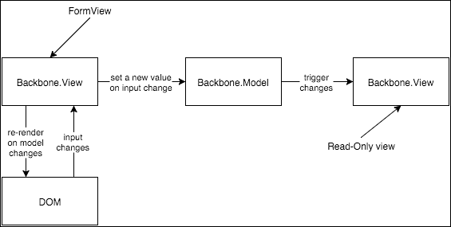
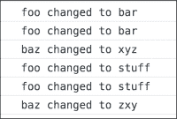
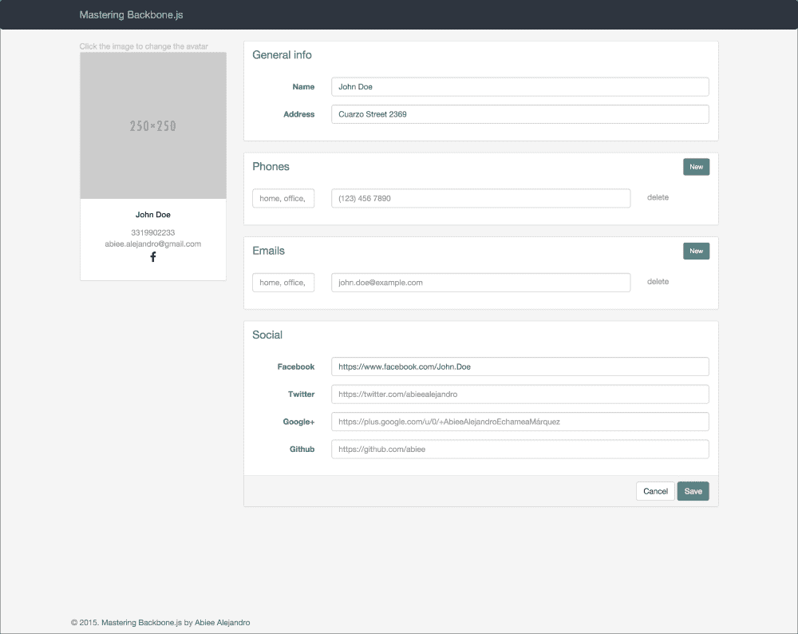
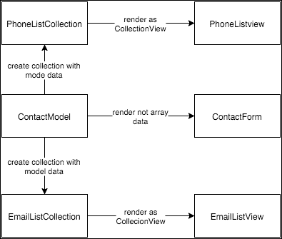

# 第三章。模型绑定

保持模型与其他对象（如视图）同步可能具有挑战性，如果做得不正确，可能会导致代码混乱。在本章中，我们将探讨如何处理数据同步以简化数据绑定。但是，什么是数据绑定？维基百科将数据绑定定义为：

> *数据绑定是建立应用程序 UI（用户界面）和业务逻辑之间连接的过程。如果设置和通知设置正确，数据会在更改时反映变化。它也可以意味着当 UI 发生变化时，底层数据将反映这一变化。*

模型绑定中常见的问题是如何处理包含其他嵌入对象或列表的复杂模型结构；在本章中，我们将定义一种处理这些场景的策略。Backbone 缺少的功能是双向绑定；在接下来的几节中，我们将看到如何在不头疼的情况下实现它。

让我们从描述如何手动将模型数据与视图绑定开始本章，以了解 Backbone 的工作原理；之后，我们可以使用 Backbone.Stickit 使其变得更加容易。在了解如何同步模型数据和视图之后，我们将探讨如何在模型上执行验证以及如何显示错误消息。

# 手动绑定

为了简化，想象我们有一个具有简单布局的表单：姓名、电话和电子邮件地址：

```js
<script id="form-template" type="text/template">
<form>
<div class="form-group">
<label for="name">Name</label>
<input id="name" class="form-control" type="text"
value="<%= name %>" />
</div>
<div class="form-group">
<label for="phone">Name</label>
<input id="phone" class="form-control" type="text"
value="<%= phone %>" />
</div>
<div class="form-group">
<label for="email">Name</label>
<input id="email" class="form-control" type="text"
value="<%= email %>" />
</div>
<button type="submit"class="btn btn-default">Save now</button>
</form>
</script>

<script id="preview-template" type="text/template">
<h3><%= name %></h3>
<ul>
<li><%= phone %></li>
<li><%= email %></li>
</ul>
</script>
```

在这个片段中，我们有两个将在同一时间渲染的视图。当用户点击表单中的 **保存** 按钮时，预览模板将使用模型数据更新：

```js
'use strict';

var contact = new Backbone.Model({
  name: 'John Doe',
  phone: '555555555',
  email: 'john.doe@example.com'
});

class FormView extends ModelView {
  constructor(options) {
    super(options);
    this.template = '#form-template';
    this.model = contact;
  }
}

class ContactPreview extends ModelView {
  constructor(options) {
    super(options);
    this.template = '#preview-template';
    this.model = contact;

    // Re-render the view if something in the model
    // changes
    this.model.on('change', this.render, this);
  }
}

var form = new FormView({
  el: '#contact-form'
});

var preview = new ContactPreview({
  el: '#contact-preview'
});

form.render();
preview.render();
```

这段代码将在表单和预览中渲染 `contact` 模型的内容。当点击 **立即保存** 按钮时，没有任何操作发生，因为它还没有被编程，所以让我们在模型中保存这些更改：

```js
var FormView = ModelView.extend({
  // ...
  events() {
    return {
      'click button[type="submit"]': 'saveContact'
    };
  }

  saveContact(event) {
    event.preventDefault();
    this.model.set('name', this.$('#name').val());
    this.model.set('phone', this.$('#phone').val());
    this.model.set('email', this.$('#email').val());
  }
});
```

让我们看看这里发生了什么。在 `FormView` 中，我们使用表单输入中的数据更新模型；这个动作同步了表单数据与模型，触发模型上的 `'change'` 事件。因为 `ContactPreview` 正在监听变化，所以事件将使用模型中的数据更新自己。

Backbone 不是通过 *自动魔法* 视图-模型绑定构建的，因此这是开发者的责任来实现它。幸运的是，有一些 Backbone 插件可以帮助我们使其不那么痛苦；其中之一是 *纽约时报* 开发的 `Backbone.Stickit`。

# 双向绑定

`Angular.js` 在前端普及了双向数据绑定；双向数据绑定的理念是保持视图和模型同步。当你在一个输入字段中做出更改时，视图应该立即更新模型，如果你在模型中更改一个属性，视图应该立即显示当前值：



图 3.1 使用 Backbone 的双向数据绑定

Backbone 不提供实现此功能的简单机制；然而，我们可以使用 Backbone 模型提供的事件系统来完成它。图 3.1 显示了如何实现。

`Backbone.View`监听 DOM 中的输入控件上的`keyup`和`change`事件；当从 DOM 触发更改时，`Backbone.View`可以从输入中提取新值并设置模型：

```js
class FormView extends ModelView {
  // ...

  events() {
    return {
      'click button[type="submit"]': 'saveContact',
      'keyup input': 'inputChanged',
      'change input': 'inputChanged'
    };
  }

  inputChanged(event) {
    var $target = $(event.target);
    var value = $target.val();
    var id = $target.attr('id');
    this.model.set(id, value);
  }

// ...
}
```

当你在`Backbone.View`上调用`set()`方法时，至少会触发两个事件：`change`和`change:<fieldname>`。我们可以使用这些事件来更新必要的视图：

```js
var myModel = new Backbone.Model();

myModel.on('change:foo', event => {
  console.log('foo changed to', event.changed.foo);
});
myModel.on('change', event => {
  var changedKeys = _.keys(event.changed);

  changedKeys.forEach(key => {
    console.log(key, 'changed to', event.changed[key]);
  });
});

myModel.set('foo', 'bar');
myModel.set('baz', 'xyz');
myModel.set({
  foo: 'stuff',
  baz: 'zxy'
});
```

你可以在以下图中看到前面代码片段的输出：



图 3.2 更改事件的输出

我们可以使用这些事件在必要时更新视图。实际上，我们已有的代码足以保持`ContactForm`和`ContactPreview`视图同步。

```js
this.model.on('change', this.render, this);
```

`ContactPreview`正在监听模型中的每一个变化，并在有变化时重新渲染视图。然而，每次都重新渲染整个视图是一个耗时的过程；如果只在必要时进行更改会更好。

首先，你需要使用标识符识别每个字段：

```js
<script id="preview-template" type="text/template">
<h3 id="name"><%= name %></h3>
<ul>
<li id="phone"><%= phone %></li>
<li id="email"><%= email %></li>
</ul>
</script>
```

并且更改事件处理程序将只更新已识别元素的內容：

```js
class ContactPreview extends ModelView {
  constructor(options) {
    //...

    // Re-render the view if something in the model
    // changes
    this.model.on('change', this.handleChange, this);
  }

  handleChange(event) {
    var changedKeys = _.keys(event.changed);

    changedKeys.forEach(key => {
      let $target = this.$('#' + key);
      if ($target) {
        $target.html(event.changed[key]);
      }
    });
  }
}
```

尽管双向数据绑定的结果应该谨慎使用；有些人认为双向数据绑定不是一个好主意，并将其视为反模式。

## 参考文献

有关更多信息，请参阅以下链接：

+   为什么你不应该使用 AngularJS：[`bit.ly/1Mue1kC`](http://bit.ly/1Mue1kC)

+   AngularJS 的反模式和陷阱：[`bit.ly/1kTHKqS`](http://bit.ly/1kTHKqS)

+   Angular 1 的问题在哪里：[`bit.ly/1N9wHok`](http://bit.ly/1N9wHok)

# 使用插件进行数据绑定

如前节所示，Backbone 不提供同步你的模型及其使用视图的简单机制。一些 Backbone 插件已被开发出来以最小化这个问题；其中之一是`Backbone.Stickit`。

如果你想要一种简单而强大的方式来绑定 DOM 节点和 Backbone 模型，`Backbone.Stickit`将做得很好：

```js
var FormView = ModelView.extend({
template: '#form-template',
  bindings: {
    '#name': 'name',
    '#phone': 'phone',
    '#email': 'email'
  },
  onRender: function() {
    this.stickit();
  }
});
```

以下代码示例显示了其外观；请查阅项目文档以了解更多信息。

# 绑定嵌入数据

Backbone 最常见的问题之一是如何处理复杂模型数据：

```js
{
"name": "John Doe",
"address": {
"street": "Seleme",
"number": "1975 int 6",
"city": "Culiacán"
  },
"phones": [{
"label": "Home",
"number": "55 555 123"
  }, {
"label": "Office",
"number": "55 555 234"
  }],
"emails": [{
"label": "Work",
"email": "john.doe@example.com"
  }]
}
```

对于这个模型数据，渲染只读视图可能很简单；然而，真正的挑战是如何将表单操作与嵌入数组绑定。在 Backbone 中，很难在数组对象上使用事件系统；如果你在列表中推入一个新项目，不会触发任何事件。这使得难以保持模型数据与编辑其内容的视图同步。

## 绑定嵌入列表

想象一下，我们的联系人应用现在将允许我们添加多个电话和电子邮件。我们需要更改编辑表单视图以支持添加、删除和修改电话和电子邮件数组中的项目：



图 3.3.带有电话和电子邮件列表的联系人表单布局

图 3.3 显示了添加**新建**按钮的结果，允许用户动态添加他们想要的电话和电子邮件数量。列表中的每个项目还应包括一个**删除**按钮，以便用户可以删除它们。

为了渲染电话和电子邮件列表以及将表单与模型同步，我们将采用不同的策略；图 3.4 展示了我们的策略将如何呈现：



图 3.4 嵌入式数组渲染策略

我们将创建两个新的 Backbone 集合，一个用于电话，另一个用于电子邮件。有了 `Contact` 模型中的数据，我们可以初始化这些集合并将它们作为常规 `CollectionView` 渲染。

正如我们在上一章中看到的，`CollectionView` 对象负责它所渲染的集合中的更改，因此我们可以修改集合对象，视图将按预期行为。

当用户点击**保存**按钮时，我们可以在调用 `save()` 方法之前序列化这些集合的内容并更新模型。

电话和电子邮件的每个项目都将有一个非常相似的模板：

```js
<script id="contact-form-phone-item" type="text/template">
<div class="col-sm-4 col-md-2">
<input type="text" class="form-control description" 
placeholder="home, office, mobile"
 value="<%= description %>" />
</div>
<div class="col-sm-6 col-md-8">
<input type="text" class="form-control phone" 
placeholder="(123) 456 7890" value="<%= phone %>" />
</div>
<div class="col-sm-2 col-md-2 action-links">
<a href="#" class="pull-rigth delete">delete</a>
</div>
</script>
```

此模板将用作 `CollectionView` 的 `ModelView`：

```js
// apps/contacts/contactEditor.js
class PhoneListItemView extends ModelView {
  constructor(options) {
    super(options);
    this.template = '#contact-form-phone-item';
  }

  get className() {
    return 'form-group';
  }
}

class PhoneListView extends CollectionView {
  constructor(options) {
    super(options);
    this.modelView = PhoneListItemView;
  }
}
```

联系人表单现在应包括两个区域用于 `PhoneListView` 和 `EmailListView`：

```js
<div class="panel panel-simple">
<div class="panel-heading">
    Phones
<button id="new-phone"
class="btn btn-primary btn-sm pull-right">New</button>
</div>
<div class="panel-body">
<form class="form-horizontal phone-list-container"></form>
</div>
</div>

<div class="panel panel-simple">
<div class="panel-heading">
    Emails
<button id="new-email"
 class="btn btn-primary btn-sm pull-right">New</button>
</div>
<div class="panel-body">
<form class="form-horizontal email-list-container"></form>
</div>
</div>
```

`ContactForm` 应该改为支持区域；我们将从 `Layout` 扩展而不是 `ModelView`：

```js
// apps/contacts/contactEditor.js
class ContactForm extends Layout {
  constructor(options) {
    super(options);
    this.template = '#contact-form';
    this.regions = {
      phones: '.phone-list-container',
      emails: '.email-list-container'
    };
  }

  // ...
}
```

我们将需要两个新的模型：`Phone` 和 `Email`。由于这两个模型非常相似，我将只展示 `Phone`：

```js
// apps/contacts/models/phone.js
'use strict';

App.Models = App.Models || {};

class Phone extends Backbone.Model {
  get defaults() {
    return {
      description: '',
      phone: ''
    };
  }
}

App.Models.Phone = Phone;
```

使用 `Phone` 模型的集合：

```js
// apps/contacts/collections/phoneCollection.js
'use strict';

App.Collections = App.Collections || {};

class PhoneCollection extends Backbone.Collection {
  constructor(options) {
    super(options);
  }

  get model() {
    return App.Models.Phone;
  }
}

App.Collections.PhoneCollection = PhoneCollection;
```

现在我们有了渲染表单所需的必要对象，让我们在控制器中将它们全部组合起来。首先，我们需要从模型数据中创建集合实例：

```js
// apps/contacts/contactEditor.js
class ContactEditor {
  // ...

  showEditor(contact) {
// Data
    var phonesData = contact.get('phones') || [];
    var emailsData = contact.get('emails') || [];
this.phones = new App.Collections.PhoneCollection(phonesData);
this.emails = new App.Collections.EmailCollection(emailsData);

    // ...
  }

  // ...
}
```

在设置了集合之后，我们可以正确地构建 `CollectionView`s：

```js
// apps/contacts/contactEditor.js
class ContactEditor {
  // ...

  showEditor(contact) {
    // ...

    // Create the views
    var layout = new ContactFormLayout({model: contact});
    var phonesView = new PhoneListView({collection: this.phones});
    var emailsView = new EmailListView({collection: this.emails});
    var contactForm = new ContactForm({model: contact});
    var contactPreview = new ContactPreview({model: contact});

    // ...
  }

  // ...
}
```

`phonesView` 和 `emailsView` 可以在 `contactForm` 对象公开的区域中渲染：

```js
// apps/contacts/contactEditor.js
class ContactEditor {
  // ...

  showEditor(contact) {
    // ...

    // Render the views
    this.region.show(layout);
    layout.getRegion('form').show(contactForm);
    layout.getRegion('preview').show(contactPreview);
    contactForm.getRegion('phones').show(phonesView);
    contactForm.getRegion('emails').show(emailsView);

    // ...
  }

  // ...
}
```

当用户点击**新建**按钮时，应在适当的列表中添加一个新项目：

```js
// apps/contacts/contactEditor.js
class ContactForm extends Layout {
  // ...

  get events() {
    return {
      'click #new-phone': 'addPhone',
      'click #new-email': 'addEmail',
      'click #save': 'saveContact',
      'click #cancel': 'cancel'
    };
  }

  addPhone() {
    this.trigger('phone:add');
  }

  addEmail() {
    this.trigger('email:add');
  }

  // ...
}
```

`ContactForm` 对我们在控制器中使用的集合一无所知，因此它们不能直接在集合中添加项目；控制器应该监听 `contactForm` 中的事件并更新集合：

```js
// apps/contacts/contactEditor.js
class ContactEditor {
  // ...

  showEditor(contact) {
    // ...

    this.listenTo(contactForm, 'phone:add', this.addPhone);
    this.listenTo(contactForm, 'email:add', this.addEmail);

    // ...
  }

  addPhone() {
    this.phones.add({});
  }

  addEmail() {
    this.emals.add({});
  }

  // ...
}
```

当用户点击列表中某个项目的**删除**链接时，该项目应从集合中移除：

```js
// apps/contacts/contactEditor.js
class PhoneListItemView extends ModelView {
  //...

  get events() {
    return {
      'click a': 'deletePhone'
    };
  }

  deletePhone(event) {
    event.preventDefault();
    this.trigger('phone:deleted', this.model);
  }
}
```

就像我们对 `add` 所做的那样，控制器将通过在列表视图中附加事件监听器来管理集合数据：

```js
// apps/contacts/contactEditor.js
class ContactEditor {
  // ...

  showEditor(contact) {
    // ...

    this.listenTo(phonesView, 'item:phone:deleted',
(view, phone) => {
this.deletePhone(phone);
}
);
    this.listenTo(emailsView, 'item:email:deleted',
 (view, email) => {
this.deleteEmail(email);
}
);

    // ...
  }

  deletePhone(phone) {
    this.phones.remove(phone);
  }

  deleteEmail(email) {
    this.emails.remove(email);
  }

  // ...
}
```

如前文片段所示，向列表中添加项目（以及移除它们）相当简单；我们只需更新底层集合，视图将自动更新。我们在上一章中对 `CollectionViews` 做得很好。

为了在模型中保存电话和电子邮件属性，我们需要从集合中提取存储的数据并替换模型中的现有数据：

```js
// apps/contacts/contactEditor.js
class ContactEditor {
  // ...

  saveContact(contact) {
    var phonesData = this.phones.toJSON();
    var emailsData = this.emails.toJSON();

    contact.set({
      phones: phonesData,
      emails: emailsData
    });

    contact.save(null, {
      success() {
        // Redirect user to contact list after save
        App.notifySuccess('Contact saved');
        App.router.navigate('contacts', true);
      },
      error() {
        // Show error message if something goes wrong
        App.notifyError('Something goes wrong');
      }
    });
  }
  // ...
}
```

然而，集合与表单不同步，您最终会得到空邮箱和电话号码。为了解决这个问题，我们需要将模型与输入绑定：

```js
// apps/contacts/contactEditor.js
class PhoneListItemView extends ModelView {
  // ...

  get events() {
    return {
      'change .description': 'updateDescription',
      'change .phone': 'updatePhone',
      'click a': 'deletePhone'
    };
  }

  updateDescription() {
    var $el = this.$('.description');
    this.model.set('description', $el.val());
  }

  updatePhone() {
    var $el = this.$('.phone');
    this.model.set('phone', $el.val());
  }

  // ...
}
```

现在，如果您点击 **保存** 按钮，电话和电子邮件的数据将按预期存储。

通过中间集合将嵌入式数组绑定到视图中的这种方式简化了您与列表的工作方式，并将使您的代码更加简单和易于维护。

# 验证模型数据

通常，在前端应用程序中，输入验证是通过 UI 插件如 jQuery Validation 进行的，它侧重于用户界面。换句话说，数据是在 DOM 上直接验证的。然而，对于更大的应用程序，这并不是最佳方法。

Backbone 中的验证可以是手动进行或通过插件进行。当然，最佳方法是使用插件，因为它可以节省时间和精力，但在我们学习如何使用 `backbone.validation` 插件之前，我想向您展示原生验证是如何工作的。

## 手动验证

Backbone 模型有三个属性帮助我们验证模型数据：`validate()`、`validationError()` 和 `isValid()`。如果模型数据正确，`validate()` 方法应该返回空值，否则返回其他值。

Backbone 留下了 `validate()` 方法应该返回什么内容，因此您可以返回一个纯字符串消息或一个复杂对象：

```js
class Chapter extends Backbone.Model{
  validate(attrs, options) {
    if (attrs.end < attrs.start) {
      return "can't end before it starts";
    }
  }
}
```

您可以调用 `isValid()` 方法来确保您的模型处于有效状态；内部，Backbone 将调用 `validate()` 方法，并根据返回值返回一个布尔值：如果 `validate()` 返回空值，则返回 `true`，如果返回其他值，则返回 `false`。

使用 `validationError`，您可以获取模型中的最新验证错误——例如：

```js
var one = new Chapter({
  title : "Chapter One: The Beginning",
  start: 15,
  end: 10
});

If (!one.isValid()) {
  alert(one.validationError);
}
```

当您想要保存模型时，Backbone 会调用 `validate()` 方法，如果模型无效，将触发一个 `'invalid'` 事件：

```js
one.on("invalid", function(model, error) {
  alert(model.get("title") + " " + error);
});

one.save({
  start: 15,
  end: 10
});
```

在联系人编辑器中，我们没有进行任何验证。是时候开始进行一些验证了；让我们验证联系人的姓名：

```js
// apps/contacts/models/contact.js
var Contact extends Backbone.Model {
  validate(attrs) {
    if(_.isEmpty(attrs.name)) {
      return {
        attr: 'name',
        message: 'name is required'
      };
    }
  }
}

var contact = new Contact({
// ...
});
```

记住，`validate()` 方法可以返回任何内容。Backbone 只会在 `validate()` 方法不返回任何内容时认为模型是有效的。在这种情况下，会返回一个对象。对象比纯字符串更有用，因为它们可以返回更多可用于改善用户体验的信息。

当发生错误时，将触发一个 `'invalid'` 事件。编辑表单应显示错误，因此表单将监听模型中的 `'invalid'` 事件，并管理 DOM 以显示错误消息：

```js
// apps/contacts/contactEditor.js
class ContactForm extends Layout {
  constructor(options) {
    super(options);
    this.template = '#contact-form';
    this.regions = {
      phones: '.phone-list-container',
      emails: '.email-list-container'
    };

    this.listenTo(this.model, 'invalid', this.showError);
  }

// ...

  showError(model, error) {
    this.clearErrors();

    var selector = '#' + error.attr;
    var $msg = $('<span>')
      .addClass('error')
      .addClass('help-block')
      .html(error.message);
    this.$(selector)
      .closest('.form-group')
      .addClass('has-error');
    this.$(selector)
      .after($msg);
  }

  clearErrors() {
    this.$('.has-error').removeClass('has-error');
    this.$('span.error').remove();
  }
}
```

`showError()` 方法在输入框下方追加一个 `span` 消息，这样用户就可以看到哪里出错了。通过错误对象的 `attr` 属性，我们可以将错误消息放入正确的框中；这就是为什么使用错误对象比使用纯文本消息更好的原因。

注意我们在 `showError()` 方法中创建了一个 DOM 元素。我在动态创建元素以简化视图中的代码。当然，你也可以直接在模板中创建一个 `span` 元素，并根据需要显示/隐藏它。

## 使用 Backbone.Validation 插件进行验证

`Backbone.Validation` 简化了验证过程，允许我们以声明式的方式编写验证规则，而不是程序化地编写。此外，它还内置了你可以直接使用的验证规则。当使用 `Backbone.Validation` 时，验证模型的方式会简化，我们将在下面展示。

要开始使用 `Backbone.Validation`，在包含 Backbone 之后安装插件。

```js
<script src="img/backbone.js"></script>
<script src="img/backbone-validation.js"></script>
```

现在我们可以使用这个插件；`Backbone.Validation` 在模型中使用验证属性来指定验证规则：

```js
class Contactextends Backbone.Model {
get validation: {
    name: {
      required: true,
      minLength: 3
    }
  }
}
```

而不是使用 `validate()` 方法，你可以在配置对象中编写验证规则，其中对象的键是模型中字段的名称；在这种情况下，我们正在验证 `name` 字段。`required` 和 `minLength` 验证规则通过 `Backbone.Validation` 应用到 `name` 字段。

现在，`Contact` 模型有了验证配置，我们需要在 Backbone 模型中重写默认的 `validate()` 方法来激活 `Backbone.Validation` 插件。要做到这一点，我们需要在 `onRender()` 方法中调用 `Backbone.Validation.bind()` 方法：

```js
class ContactForm extends Layout {
// ...

  onRender() {
    Backbone.Validation.bind(this);
  }

  // …
});
```

由于我们在模型上重写了 `validate()` 方法，`showError()` 和 `clearErrors()` 现在不再必要。`Backbone.Validation` 插件提供了钩子来告诉你模型何时有效；我们将使用这些钩子作为快捷方式。目前，`save:contact` 处理程序应更改为调用 `isValid()` 方法：

```js
formLayout.on('save:contact', function() {
  if (!contact.isValid(true)) {
    return;
  }
  contact.unset('phones', { silent: true });
  contact.set('phones', phoneCollection.toJSON());
});
```

注意 `isValid()` 方法中的 `true` 参数；这个参数应该用于验证所有模型属性。

当 `Backbone.Validation` 检测到一个字段无效时，它将尝试在表单中显示一个错误消息；然而，默认行为是基于表单输入中的 `name` 属性。你可以更改默认行为，在我们的布局中正确地显示错误：

```js
// app.js
_.extend(Backbone.Validation.callbacks, {
  valid(view, attr) {
    var $el = view.$('#' + attr);
    if ($el.length === 0) {
      $el = view.$('[name~=' + attr + ']');
    }

    // If input is inside an input group, $el is changed to
    // remove error properly
    if ($el.parent().hasClass('input-group')) {
      $el = $el.parent();
    }

    var $group = $el.closest('.form-group');
    $group.removeClass('has-error')
      .addClass('has-success');

    var $helpBlock = $el.next('.help-block');
    if ($helpBlock.length === 0) {
      $helpBlock = $el.children('.help-block');
    }
    $helpBlock.slideUp({
      done: function() {
        $helpBlock.remove();
      }
    });
  },

  invalid(view, attr, error) {
    var $el = view.$('#' + attr);
    if ($el.length === 0) {
      $el = view.$('[name~=' + attr + ']');
    }

    $el.focus();

    var $group = $el.closest('.form-group');
    $group.removeClass('has-success')
      .addClass('has-error');

    // If input is inside an input group $el is changed to
    // place error properly
    if ($el.parent().hasClass('input-group')) {
      $el = $el.parent();
    }

    // If error already exists and its message is different to new
    // error's message then the previous one is replaced,
    // otherwise new error is shown with a slide down animation
    if ($el.next('.help-block').length !== 0) {
      $el.next('.help-block')[0].innerText = error;
    } else if ($el.children('.help-block').length !== 0) {
      $el.children('.help-block')[0].innerText = error;
    } else {
      var $error = $('<div>')
                 .addClass('help-block')
                 .html(error)
                 .hide();

      // Placing error
      if ($el.prop('tagName') === 'div' &&
 !$el.hasClass('input-group')) {
        $el.append($error);
      } else {
        $el.after($error);
      }

      // Showing animation on error message
      $error.slideDown();
    }
  }
});
```

当发现无效数据时，将调用 `invalid()` 方法；回调函数将使用视图实例、具有无效数据的字段名称和消息作为参数调用。有了这些信息，我们可以创建一个 `span` 错误消息，并将 `has-error` 类添加到包含输入的 `control-group`。

请查阅 `Backbone.Validation` 文档以了解更多关于其优点和使用方法。

# 摘要

在本章中，我们学习了如何保持模型和视图同步。一般来说，同步模型和视图是容易的，但如果模型包含嵌套数组，事情可能会变得复杂。你可以使用插件来简化数据绑定；`Backbone.Stickit` 是一个不错的选择，因为它允许你以声明式的方式创建绑定。

我向你展示了如何使用纯 Backbone 实现双向数据绑定，利用事件系统；在应用中过度使用双向数据绑定并不总是好主意，但在某些情况下它可能很有用。

最后，我们学习了如何使用 Backbone 验证模型，以及如何使用验证 API 在视图中显示错误信息。`Backbone.Validation` 插件可以帮助你轻松地通过最小努力验证 Backbone 模型，一旦验证回调设置正确。

在下一章中，我们将学习如何模块化我们的联系人应用，使其更易于维护并更有效地管理依赖关系。然后我们将整个应用打包成一个脚本，以便更快地加载。
