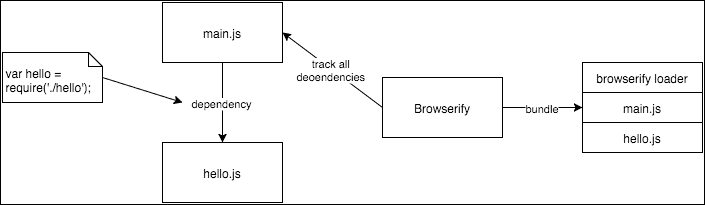
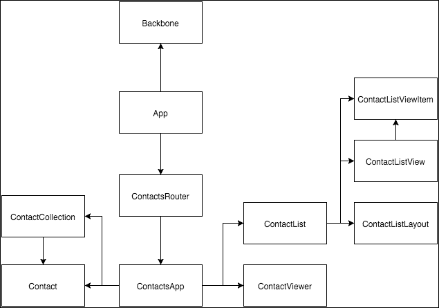
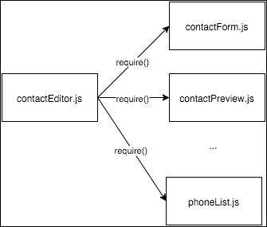
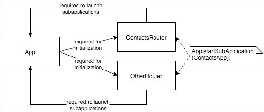
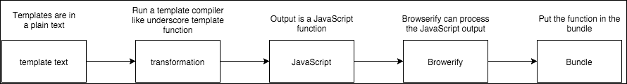

# 第四章 模块化代码

随着你项目代码的增长，项目中的脚本数量会越来越多，脚本加载的复杂性也会不断增加。经典的加载 JavaScript 文件的方式是为每个脚本编写一个`<script>`标签，但你必须按照正确的顺序执行；如果不这样做，你的代码可能会停止工作。这不是中型项目的一个高效方式。

如果你忘记了加载顺序会发生什么？如果你对代码进行了重构并且脚本顺序发生了变化呢？修复它并跟踪所有代码及其依赖项将会很痛苦。

这个问题已经以不同的方式得到了解决。一种方法是通过创建模块语法来创建、加载和明确声明模块的依赖项；这种语法被称为**AMD**（**异步模块定义**）。AMD 模块定义了一个模块依赖项列表，模块内部的代码只有在依赖项完全加载后才会执行。

依赖项是异步加载的；这意味着你不需要通过`<script>`标签在 HTML 页面中加载所有脚本。AMD 模块比纯 JavaScript 更好，因为它们明确地定义了依赖项，并且可以自动加载。

尽管 AMD 模块比`<script>`标签更优越，但在进行单元测试时，与 AMD 模块一起工作可能会很痛苦，因为你需要了解库如何加载模块的细节；当你想要进行单元测试时，你需要隔离待测试的代码片段，但在 RequireJS 中很难做到，即使你做到了，结果也可能存在 bug。

最近，另一个模块加载器和依赖项管理器出现了；Browserify 似乎是目前最受欢迎的。然而，它并不是唯一的；还有许多其他潜在的选择，如 jspm 和 steal.js。

在这本书中，我们将使用 Browserify，因为它很受欢迎，因此你可以在网上找到大量关于它的信息和文档；另一个好理由是，许多项目都是用它构建的，这证明了它的成熟度和生产就绪状态。Browserify 使用与 Node 模块相同的语法来定义模块和依赖项，所以如果你已经了解 Node，你可以直接进入 Browserify 部分。

# CommonJS 模块

近年来，Node 在软件行业中的受欢迎程度一直在上升；确实，它正在成为全 JavaScript 技术栈中后端开发的非常受欢迎的选择。如果你不了解 Node，你可以将其视为在服务器上而不是在浏览器中使用的 JavaScript。

Node 使用 CommonJS 模块语法来定义其模块；一个 CommonJS 模块是一个导出一个单一值以供其他模块使用的文件。使用 CommonJS 是有用的，因为它提供了一种管理 JavaScript 模块和依赖项的清晰方式。

为了支持 CommonJS，Node 使用 `require()` 函数。使用 `require()`，您可以在不使用 `<script>` 标签的情况下加载 JavaScript 文件，而是通过调用 `require()` 并将所需的模块/依赖项的名称传递给它，并将其分配给一个变量。

为了说明 CommonJS 模块的工作原理，让我们编写一个 Node 模块并看看如何使用 `require()` 函数。以下代码展示了一个简单的模块，它暴露了一个具有 `sayHello()` 方法的简单对象：

```js
hello = {
  sayHello(name) {
    name = name || 'world';
    console.log('hello', name);
  }
}

module.exports = hello;
```

此脚本可以放置在名为 `hello.js` 的文件中，例如。hello 模块可以通过调用 `require()` 函数从另一个模块中加载，如下面的代码所示：

```js
var hello = require('./hello');
hello.sayHello('world); // prints "hello world"
```

当我们使用 `require()` 函数调用脚本时，我们不需要添加 .js 扩展名，Node 会自动为我们添加。请注意，如果您向脚本名称添加扩展名，Node 仍然会添加扩展名，并且您将收到错误，因为 `hello.js.js` 文件不存在。

这就是您可以为项目定义 CommonJS 模块的方法：我们只需使用 `module.exports` 导出我们想要暴露给模块外部的变量，然后在需要的地方使用 `require()` 加载模块。

CommonJS 模块是单例，这意味着每次您加载一个模块时，您都会得到该对象的相同实例。Node 在第一次调用时将缓存返回的值，并在后续调用中重用它。

# NPM 和 package.json

使用 Browserify，我们可以创建可以在浏览器中执行的 CommonJS 模块。当您在浏览器中使用 CommonJS 模块时，Browserify 将提供必要的工具来加载模块，包括 `require()` 函数的定义。

当您使用 Browserify 时，您可以使用 Node 包管理器为您的项目安装和定义依赖项。一个有用的工具是 npm 命令行工具，用于安装和管理项目依赖项。

Node 项目中的 `package.json` 文件是一个 JSON 文件，用于定义、安装和管理项目依赖项的版本。`package.json` 文件可以包含许多配置选项；您可以在 Node 网站上查看完整的文档，网址为 [`docs.npmjs.com/`](https://docs.npmjs.com/)。以下是主要值的列表。

+   `Name` – 项目名称，不带空格

+   `Description` – 项目的简短描述

+   `Version` – 项目的版本号，通常以 0.0.1 开头

+   `Dependencies` – 项目依赖的库及其版本号的列表

+   `devDependencies` – 与 `dependencies` 相同，但这个列表仅用于开发环境——例如，用于放置测试库

+   `licence` – 项目代码的许可证名称

我们可以从一个非常简单的 `package.json` 文件开始，该文件仅包含一些基本字段，然后根据需要扩展它：

```js
{
  "name": "backbone-contacts ",
  "version": "0.0.1",
  "description": "Example code for the book Mastering Backbone.js",
  "author": "Abiee Alejandro <abiee.alejandro@gmail.com>",
  "license": "ISC",
  "dependencies": {
  },
  "devDependencies": {
  }
}
```

如您所见，我们目前还没有任何依赖。我们可以使用 `npm` 安装我们的第一个依赖项：

```js
$ npm install --save underscore jquery backbone bootstrap

```

此命令将安装与 `backbone` 一起工作的基本依赖项；保存标志将自动更新 `package.json` 文件，添加库的名称及其当前版本：

```js
  "dependencies": {
    "backbone": "¹.2.1",
    "bootstrap": "³.3.5",
    "jquery": "².1.4",
    "underscore": "¹.8.3"
  }
```

库版本格式遵循 `semver` 标准；你可以在官方 `semver` 网站上了解更多关于此格式的信息。

在你的项目中使用 `package.json` 文件的一个优点是，下次你想安装依赖项时，你不需要记住库及其版本；你只需不带任何参数点击 **安装**，Node 就会读取 `package.json` 文件并为你进行安装：

```js
$ npm install

```

使用 `npm` 你可以安装开发包，例如 mocha 测试库，但不要使用保存标志，而是使用 `save-dev`：

```js
$ npm install --save-dev mocha

```

现在你已经知道了如何安装依赖项并将它们保存在 `package.json` 文件中，我们就可以开始在联系人应用中使用 Browserify 了。

# Browserify

使用 Browserify，我们可以在浏览器中直接使用 Node 模块。这意味着你可以利用 npm 包管理器和在前几节中暴露的 Node 模块语法来构建你的项目。然后 Browserify 可以将你的源代码进行一些转换，以便能够在浏览器环境中运行你的代码。

一个非常简单的模块，它暴露了一个带有打印问候消息的方法的对象，可以写成 Node 模块的形式：

```js
// hello.js
module.exports = {
  sayHello: function(name) {
    name = name || 'world';
    console.log('hello', name);
  }
}
```

这段简单的代码可以从另一个脚本中加载，如下所示：

```js
// main.js
var hello = require('./hello');
hello.sayHello();        // hello world
hello.sayHello('abiee'); // hello abiee
```

这段代码与 Node 完美兼容。你可以按照以下方式运行它：

```js
$ node main.js

```

然而，这段代码在浏览器中无法运行，因为 `require` 函数和模块对象未定义。Browserify 会跟踪你的项目入口代码中的所有依赖项，创建一个包含所有脚本的单一文件：

```js
$ browserify main.js
(function e(t,n,r){function s(o,u){if(!n[o]){if(!t[o]){var a=typeof require=="function"&&require;if(!u&&a)return a(o,!0);if(i)return i(o,!0);var f=new Error("Cannot find module '"+o+"'");throw f.code="MODULE_NOT_FOUND",f}var l=n[o]={exports:{}};t[o][0].call(l.exports,function(e){var n=t[o][1][e];return s(n?n:e)},l,l.exports,e,t,n,r)}return n[o].exports}var i=typeof require=="function"&&require;for(var o=0;o<r.length;o++)s(r[o]);return s})({1:[function(require,module,exports){
module.exports = {
  sayHello: function(name) {
    name = name || 'world';
    console.log('hello', name);
  }
}

},{}],2:[function(require,module,exports){
var hello = require('./hello');

hello.sayHello();
hello.sayHello('abiee');

},{"./hello":1}]},{},[2]);
```



图 4.1 使用 Browserify 打包

注意，我们的代码仍然在其中；Browserify 会定义缺失的对象并将所有脚本合并到一个文件中。图 4.1 显示了发生的图形表示。如果你使用像 Backbone 这样的库，那么你的最终脚本将包含输出文件中的所有 Backbone 代码。

要告诉 Browserify 你想要创建一个文件而不是仅仅将结果输出到标准输出，请使用 `-o` 标志：

```js
$ browserify main.js -o app.js

```

这将创建一个包含 `hello.js` 和 `main.js` 文件内容的 `app.js` 文件。

# 应用程序依赖

当应用程序在浏览器中加载时，它会按特定顺序加载所有 JavaScript 文件。顺序很重要，因为它代表了依赖链。

```js
<script src="img/jquery-2.1.4.min.js"></script>
<script src="img/bootstrap.min.js"></script>
<script src="img/sweetalert.min.js"></script>
<script src="img/jquery.noty.packaged.min.js"></script>
<script src="img/underscore-min.js"></script>
<script src="img/backbone-min.js"></script>
<script src="img/backbone-validation-min.js"></script>

<script src="img/common.js"></script>
<script src="img/app.js"></script>
<script src="img/router.js"></script>
<script src="img/contact.js"></script>
<script src="img/phone.js"></script>
<script src="img/email.js"></script>
<script src="img/contactCollection.js"></script>
<script src="img/phoneCollection.js"></script>
<script src="img/emailCollection.js"></script>
<script src="img/contactList.js"></script>
<script src="img/contactViewer.js"></script>
<script src="img/contactEditor.js"></script>
<script src="img/app.js"></script>
<script type="text/javascript">App.start();</script>
```

这是一种标准的脚本加载方式；浏览器负责解析这些脚本标签，从资产服务器获取脚本文件，然后按顺序执行它们。因此，浏览器将首先执行 jQuery，然后是 Bootstrap，然后是 Underscore，依此类推。

如你所知，Backbone 依赖于 Underscore 和 jQuery 来工作；它在 Backbone 视图中使用 jQuery 来处理 DOM 选择，并使用 Underscore 作为工具库。因此，jQuery 和 Underscore 应该在 Backbone 之前加载。

在项目代码中，`app.js` 依赖于 Backbone，因此它在 Backbone 之后加载。`apps/contacts/app.js` 模块是应用程序外观。它依赖于子应用程序中的所有其他模块，这就是为什么它最后加载的原因。

图 4.2 以图形方式显示了模块的依赖关系。请注意，这是一个简化，并不是所有的依赖关系都显示出来。



图 4.2 依赖关系图

# 在应用程序中使用 Browserify

到目前为止，我们已经了解了 Browserify 是什么以及如何使用它。现在，我们将把这个背景应用到我们的联系人应用程序中，以将所有代码作为 Node 模块加载。

在我们继续之前，请确保您已安装了项目所需的所有依赖项：

```js
{
  "name": "mastering-backbone-04",
  // ...
  "dependencies": {
    "backbone": "¹.2.3",
    "backbone-validation": "⁰.11.5",
    "body-parser": "¹.14.1",
    "bootstrap": "³.3.5",
    "browser-sync": "².9.11",
    "crispy-string": "0.0.2",
    "express": "⁴.13.3",
    "http-proxy": "¹.11.3",
    "jquery": "².1.4",
    "lodash": "³.10.1",
    "morgan": "¹.6.1",
    "sweetalert": "¹.1.3",
    "underscore": "¹.8.3"
  }
}
```

最容易转换的模块是模型和集合，因为它们没有巨大的依赖关系。

```js
// apps/contacts/models/contact.js
'use strict'

var Backbone = require('backbone');

class Contact extends Backbone.Model {
  // ...
}

module.exports = Contact;
```

如你所见，模块几乎保持不变。我们只是在文件的末尾添加了 `require()` 调用和导出语句：

```js
// apps/contacts/contactCollection.js
'use strict';

var Backbone = require('backbone');
var Contact = require('../models/contact');

class ContactCollection extends Backbone.Collection {
  // ...

  get model() {
return Contact;
  }
}

module.exports = ContactCollection;
```

视图也容易转换。我们只需像对 `Contact` 和 `ContactCollection` 模块所做的那样添加 `require()` 调用。在我们继续之前，我们需要对视图进行一个额外的步骤；目前，给定控制器的所有视图都包含在一个单独的脚本中；例如，`contactEditor.js` 包含 `ContactForm`、`ContactPreview` 和 `PhoneList` 等。

由于我们正在模块化项目，将每个视图放入其自己的文件并在需要时调用它是一个好主意。以下展示了这个想法。你有很多理由这样做：为了隔离你的组件进行测试、保持你的文件小、提高维护性以及获得可互换的模块。



图 4.3 将视图分割到它们自己的文件中

```js
'use strict';

var Layout = require('../../common').Layout;

class ContactFormLayout extends Layout {
// ...
}

module.exports = ContactFormLayout;
```

如你所见，将纯 JavaScript 文件转换为 Node 模块非常容易。业务逻辑的代码完全相同。子应用程序控制器依赖于我们在上一步中转换的视图。

```js
'use strict';

var _ = require('underscore');
var Backbone = require('backbone');
var App = require('../../app');
var ContactFormLayout = require('./views/contactFormLayout');
var ContactPreview = require('./views/contactPreview');
var PhoneListView = require('./views/phoneListView');
var EmailListView = require('./views/emailListView');
var ContactForm = require('./views/contactForm');
var PhoneCollection = require('./collections/phoneCollection');
var EmailCollection = require('./collections/emailCollection');

class ContactEditor {
  // ...
}

module.exports = ContactEditor;
```

应用程序外观依赖于许多子应用程序控制器、模型和集合：

```js
'use strict';

var App = require('../../app');
var ContactList = require('./contactList');
var ContactViewer = require('./contactViewer');
var ContactEditor = require('./contactEditor');
var Contact = require('./models/contact');
var ContactCollection = require('./collections/contactCollection');

function ContactsApp(options) {
  // ...
}

// ...

module.exports = ContactsApp;
```

路由依赖于子应用程序外观和应用程序基础设施：

```js
'use strict';

var Backbone = require('backbone');
var App = require('../../app');
var ContactsApp = require('./app');

var ContactsRouter = Backbone.Router.extend({
  // ...
});

module.exports = new ContactsRouter();
```

App 对象负责加载所有子应用程序路由并启动历史模块：

```js
'use strict';

var _ = require('underscore');
var Backbone = require('backbone');
var BackboneValidation = require('backbone-validation');
var swal = require('sweetalert');
var noty = require('noty');
var Region = require('./common').Region;

// Initialize all available routes
require('./apps/contacts/router');

var App = {
start() {
    // The common place where sub-applications will be showed
    App.mainRegion = new Region({el: '#main'});

    // Create a global router to enable sub-applications to
    // redirect to other URLs
    App.router = new DefaultRouter();
    Backbone.history.start();
  },

// ...
};

// ...

module.exports = App;
```

下一步是通过在 App 对象上调用 `start()` 方法来启动应用程序；这是从 `index.html` 文件中完成的：

```js
<script type="text/javascript">App.start();</script>
```

由于我们正在使用 Browserify 重新打包应用程序，最好在主入口点创建一个新文件：

```js
// main.js
var App = require('./app');

App.start();
```

一旦我们的应用程序被编写为 Node 模块，我们就可以使用 Browserify 将代码打包成一个单独的脚本：

```js
$ mkdir –p .tmp/js
$ cd app/js
$ browserify main.js -o ../../.tmp/js/app.js

```

这将创建一个包含所有依赖项的打包文件。为了使用代码的打包版本，我们必须将 `index.htm` 文件更改为加载它，而不是加载所有单个文件：

```js
<html>
<head>
    // ...
</head>
<body>
// ...
<script src="img/app.js"></script>
</body>
</html>
```

这应该足够了；然而，应用程序不会启动，因为我们有一个循环依赖问题。

## 解决循环依赖

有两个相互依赖的模块被称为 **循环依赖**。在我们的 Contacts 应用程序中，基础设施应用程序依赖于子应用程序路由器，而路由器依赖于应用程序基础设施来加载子应用程序控制器和外观。图 4.4 显示了这是如何表现的。



图 4.4 循环依赖

由于循环依赖，无法正确运行应用程序。以下是详细情况。

+   应用程序模块被执行

+   应用程序需要 `ContactsRouter`:

    ```js
    var ContactsRouter = require('./apps/contacts/router');
    ```

+   `ContactsRouter` 需要应用程序模块，但应用程序模块尚未导出：

    ```js
    var App = require('../../app'); // returns undefined
    ```

+   `ContactsRouter` 为 `App` 变量接收一个 `undefined` 值

+   应用程序模块继续执行并最终暴露 `App` 值：

    ```js
    var App = {
      // ...
    };

    module.exports = App;
    ```

+   `ContactsRouter` 匹配一个路由，但由于 `App` 值未定义，它触发了错误：

    ```js
    startApp() {
      // App = undefined
      return App.startSubApplication(ContactsApp);
    }
    ```

我们应该以某种方式打破循环。一个简单的方法是在导出 `App` 模块之后要求它。我们可以在文件顶部从 `ContactsRouter` 中要求 `App` 模块，而不是在必要时才这样做：

```js
// apps/contacts/router.js
class ContactsRouter extends Backbone.Router {
  // ...

  startApp() {
    var App = require('../../app');
    var ContactsApp = require('./app');
    return App.startSubApplication(ContactsApp);
  }
}
```

这是一个简单但有效的方法来打破循环依赖。现在你可以重新打包应用程序并再次运行它。应该可以工作：

```js
$ mkdir –p .tmp/js
$ cd app/js
$ browserify main.js -o ../../.tmp/js/app.js

```

# 模块化模板

到目前为止，模板已经在 `index.html` 文件中声明为脚本标签。虽然这对于小型项目来说是一个好方法，但将所有模板直接放入 HTML 文件中并不是一个好主意。

使用 Browserify，你可以将所有模板文件提取到单独的文件中，具有模块化和更干净的 `index.html` 文件的优势。模块化模板的另一个好处是，你可以预编译所有模板，从而在用户的浏览器中节省资源。

使用 Browserify，你可以模块化几乎任何模板格式：jade、Handlebars、Underscore 等。它使用图 4.5 中描述的转换过程。如果你使用过其他打包工具，如 webpack，转换类似于预处理器。



图 4.5 转换过程

模板是纯文本；文本被传递到一个函数中，该函数将其编译成一个浏览器 ify 可以处理的 JavaScript 函数，作为一个常规 JavaScript 文件。为了对模板应用必要的转换，你需要安装一个转换插件：

```js
$ npm install --save-dev jstify

```

转换过程发生在你指示 webpack 在编译时使用 jstify 时：

```js
$ browserify main.js -t [ jstify --engine underscore ] -o ../../.tmp/js/app.js

```

模板很容易模块化；只需提取脚本标签中的文本并将其放入新文件中：

```js
// apps/contacts/templates/contactListLayout.tpl
<div class="actions-bar-container"></div>
<div class="list-container"></div>
<div class="footer text-muted">
  © 2015\. <a href="#">Mastering Backbone.js</a> by <a href="https://twitter.com/abieealejandro" target="_blank">Abiee Alejandro</a>
</div>
```

`contactListLayout.tpl` 现在包含联系列表布局模板的文本。在 `ContactListLayout` 视图中，你可以将模板作为常规 JavaScript 文件导入，但不要忘记包含 `tpl` 扩展名：

```js
// apps/contacts/views/contactListLayout.js
'use strict';

var Layout = require('../../../common').Layout;
var template = require('../templates/contactListLayout.tpl');

class ContactListLayout extends Layout {
  constructor(options) {
    super(options);
    this.template = template;
    this.regions = {
      actions: '.actions-bar-container',
      list: '.list-container'
    };
  }

  get className() {
    return 'row page-container';
  }
}

module.exports = ContactListLayout;
```

当你导入模板时，你会使用一个函数。因为我们的通用视图同时支持 CSS 选择器和预编译模板，所以它应该可以正常工作：

```js
// common.js
render() {
  // Get JSON representation of the model
  var data = this.serializeData();
  var renderedHtml;

  // If template is a function assume that is a compiled
  // template, if not assume that is a CSS selector where
  // the template is defined and is compatible with
  // underscore templates
  if (_.isFunction(this.template)) {
    renderedHtml = this.template(data);
  } else if (_.isString(this.template)) {
    var compiledTemplate = this.compileTemplate();
    renderedHtml = compiledTemplate(data);
  }

  this.$el.html(renderedHtml);

  // Call onRender callback if is available
  if (this.onRender) {
    this.onRender();
  }

  return this;
}
```

现在你有一个完全模块化的项目，其中每个代码片段都在一个小文件中；这个优势之一是你可以专注于小块代码，从而避免大型文件的开销。

# 摘要

在本章中，我们学习了 Browserify 是什么以及如何将你的项目组织成 Node 模块，以便以更整洁的方式管理你的代码和依赖。为了使 Contacts 项目与 `npm` 兼容，我们不得不修改项目的代码；然而，这些更改非常小。

除了 Browserify，还有其他替代方案；require.js 和 AMD 模块定义也是不错的选择。然而，使用 require.js 进行测试可能会非常困难；如果你想要测试独立的模块（单元测试），我不建议你使用 `require.js`。

Webpack 是捆绑和组织你的代码库的另一个流行选择。其主要目的是与前端依赖项一起工作；它可以加载 CommonJS 模块和 AMD 模块。然而，webpack 的配置和管理更为复杂。

Browserify 是捆绑 JavaScript 项目的最受欢迎的选择，比 webpack 更容易配置和维护；使用 Node 用于管理其依赖项的相同工具是有用的，并且它做得很好。

在下一章中，我们将探讨如何在 Backbone 项目中处理文件；通过 RESTful API 处理文件是一个常见问题，因此我们将发现常见的模式和策略。

在第七章，我们将探讨如何使用自动化工具构建应用程序；每次我们更改代码时，我们不必手动运行 Browserify 命令，我们将创建必要的脚本来自动完成这项工作。
