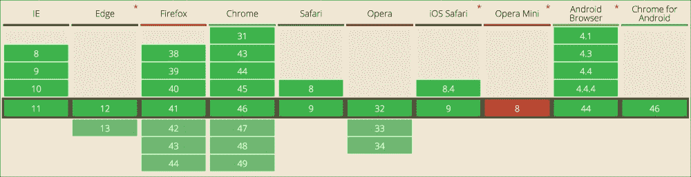
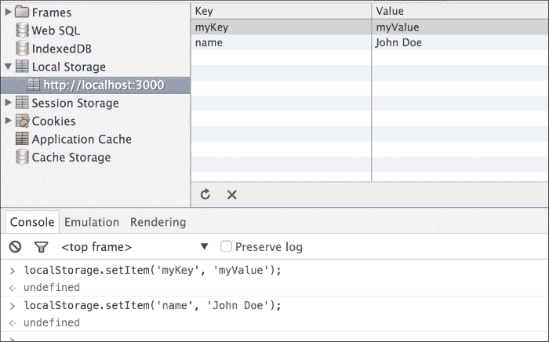
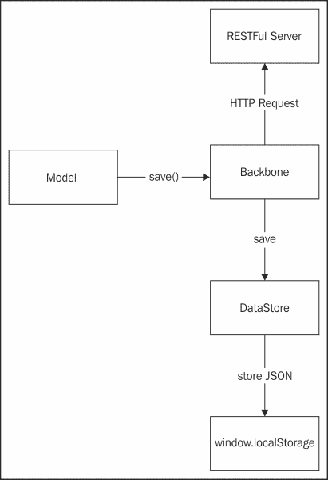
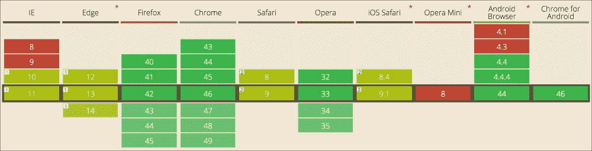
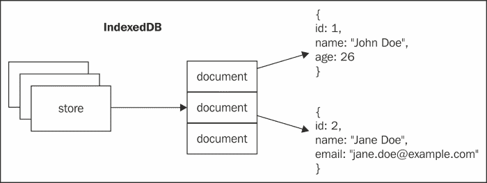
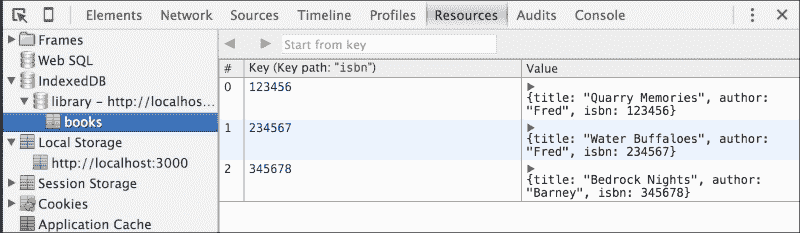

# 第六章 存储浏览器中的数据

Backbone 主要被设计用来与 RESTful API 服务器一起工作；然而，你并不总是想在服务器上存储数据以供离线应用程序使用，或者为了打破应用程序加载，将缓存数据存储在浏览器中。

在用户浏览器中存储数据，我们有两种选择：使用 localStorage 或新的 IndexedDB API。虽然 localStorage 在主流浏览器中得到了广泛的支持，但 IndexedDB 是一个尚未在近期得到支持的全新规范。目前还有一个可用的选项，但已处于弃用状态，那就是 Web SQL。如果你正在开发现代网络应用程序，你应该避免使用 Web SQL。

在本章中，你将学习以下主题：

+   localStorage 基础

+   IndexedDB 基础

+   使用 localStorage 而不是 RESTful 服务器来存储信息

+   使用 IndexedDB 而不是 RESTful 服务器来存储信息

# localStorage

localStorage 是最简单且支持最广泛的浏览器数据存储。在撰写本书时，它几乎在所有主流浏览器中都得到了支持。如图所示，唯一不支持 localStorage 的浏览器是 Opera Mini：



图 6.1 localStorage 的浏览器支持

localStorage 是一个简单的键/值数据库，只能存储文本。在 localStorage 中，你有三个主要方法来访问数据：`setItem()`、`getItem()` 和 `removeItem()`。有了这三个函数，你可以很好地管理存储中的数据。

localStorage 的缺点是它没有表或集合，因此所有数据都是混合的；localStorage 的另一个问题是它限制在 5 Mb 的信息量。如果你的存储需求超过这个量，你将需要使用 IndexedDB。

## 从 localStorage 开始

要在 localStorage 中存储数据，你需要调用 `localStorage` 全局对象中的 `setItem()` 方法：

```js
localStorage.setItem('myKey', 'myValue');
localStorage.setItem('name', 'John Doe');
```

就这样，这些指令会在浏览器中存储信息。我们可以在以下图中探索这些指令的结果：



图 6.2 Google Chrome 和 localStorage

存储在 localStorage 中的数据是按站点组织的，这意味着你只能访问存储在你站点上的数据。在上面的图中，你可以看到左侧可用的站点（`http://localhost:4000`）。在右侧，你可以探索我们使用 `setItem()` 方法为给定站点存储的数据。

要从 localStorage 中检索信息，你必须使用 `getItem()` 方法：

```js
localStorage.getItem('myKey'); // myValue
localStorage.getItem('name'); // John Doe
localStorage.getItem('notExists'); // null
```

要从存储中删除一个项目，我们可以使用 `removeItem()` 方法：

```js
localStorage.removeItem('name');
localStorage.getItem('name'); // null
```

如前所述，localStorage 只能存储字符串。然而，我们想要存储对象，我们该如何做呢？

```js
varmyObj = {name: 'John Doe', age: 26};
localStorage.setItem('object', myObj);
localStorage.getItem('object'); // [Object object]
```

哎呀……这不是我们预期的结果。localStorage 在存储对象之前会自动将其转换为字符串。你可以使用`JSON.stringify()`函数序列化对象，这样 localStorage 接收到的就是一个字符串而不是对象：

```js
varmyObj = {name: 'John Doe', age: 26};
var serialized = JSON.stringify(myObj);

localStorage.setItem('object', serialized);
```

要获取存储的对象，你可以使用`JSON.parse()`的逆函数，它将字符串转换为对象：

```js
var data = localStorage.getItem('object');
varobj = JSON.parse(data);
```

这就是如何在 localStorage 中存储和检索对象的方法。在存储和检索对象时，你需要进行编码和解码。由于 JSON 函数的使用非常频繁，不建议在 localStorage 中存储大对象；每次编码或解码对象时，JavaScript 线程都会阻塞该对象。

# Backbone 和 localStorage

要在 localStorage 中存储 Backbone 模型，你可以使用`ID`属性作为键，将序列化数据作为值。然而，请记住，localStorage 中的所有数据都是混合的，这种策略会导致标识符冲突。

假设你有两个不同的模型（联系人和发票）具有相同的`ID`；当你将其中一个存储在 localStorage 中时，它会覆盖另一个。

localStorage 的另一个问题是，当你想在从存储中获取项目之前从存储中检索数据时，你需要知道它具有哪个键。然而，在 localStorage 中，我们没有关于当前存储中 ID 的信息，因此，我们需要一种方法来跟踪在给定时间存储中的 ID。

为了处理这些问题，你可以在存储中创建一个已知键作为给定集合可用 ID 的索引。以下是如何工作的示例：

```js
var data = localStorage.get('contacts'); // index name
varavailableIds = data.split(',');
varcontactList = [];

// Get all contacts
for (leti = 0; i<availableIds.length; i++) {
let id = availableIds[i];
let contact = JSON.parse(localStorage.getItem(id));
contactList.push(contact);
}
```

为了防止具有相同 ID 的模型集合之间的冲突，你可以为集合项生成前缀键，这样你就可以使用像`contacts-1`这样的键，而不是像`1`这样的数字键：

```js
var data = localStorage.get('contacts'); // 1, 5, 6
varavailableIds = data.split(',');
varcontactList = [];

// Get all contacts
for (let i = 0; i<availableIds.length; i++) {
let id = 'contacts-' + availableIds[i];
let contact = JSON.parse(localStorage.getItem(id));
contactList.push(contact);
}
```

# 在 localStorage 中存储模型

现在你已经知道了如何从 localStorage 存储和检索数据，是时候存储你的模型了。在下面的图中，你可以看到如何将数据存储在本地而不是远程服务器。

默认情况下，当你对一个 Backbone 模型调用`save()`方法时，它会将操作转换为对 RESTFul 服务器的 HTTP 请求。为了在本地存储数据，你需要更改默认行为，以便使用 localStorage 而不是发起 HTTP 请求；你将在下一节中学习如何做到这一点。

为了使存储层易于维护，你首先需要为 localStorage 创建一个 Backbone 驱动器。驱动器的职责是从 localStorage 存储和检索数据，以便 Backbone 和 localStorage 之间的连接更加简单：



图 6.3 在 localStorage 中存储模型

在下一节中，我将向你展示如何构建`DataStore`驱动器，以便在 localStorage 中存储 Backbone 模型。

# 在 localStorage 中存储 Backbone 模型

现在是时候使用你关于 `localStorage` 的知识来存储和检索对象了。`DataStore` 对象负责将模型转换为字符串以便存储在 localStorage 中：

```js
class DataStore {
  constructor(name) {
    this.name = name;

    // Keep track of all ids stored for a particular collection
this.index = this.getIndex();
  }

getIndex() {
var index = localStorage.getItem(this.name);
    return (index &&index.split(',')) || [];
  }
}
```

DataStore 对象需要一个名称作为集合索引的前缀。第一个用例是创建一个新的条目：

```js
class DataStore {
// ...

  create(model) {
    // Assign an id to new models
    if (!model.id&& model.id !== 0) {
      model.id = generateId();
model.set(model.idAttribute, model.id);
    }

    // Save model in the store with an unique name,
    // e.g. collectionName-modelId
localStorage.setItem(
this.itemName(model.id), this.serialize(model)
    );

    // Keep track of stored id
this.index.push(model.get(model.idAttribute));
this.updateIndex();

    // Return stored model
    return this.find(model);
  }
}
```

当创建一个新的模型时，它使用 `generateId()` 函数分配一个新的 ID：

```js
var crispy = require('crispy-string');

const ID_LENGTH = 10;

function generateId() {
 return crispy.base32String(ID_LENGTH);
}

```

`itemName()` 函数根据模型 ID 生成一个在 localStorage 中使用的键；`serialize()` 方法将模型转换为一个准备存储在 localStorage 中的 JSON 字符串。最后，DataStore 中的 `index` 属性跟踪所有可用的 ID，因此我们应该将模型 ID 推送到索引中。

对于更新方法，我们将覆盖模型的当前值：

```js
class DataStore {
// ...

  update(model) {
    // Overwrite the data stored in the store,
    // actually makes the update
localStorage.setItem(
this.itemName(model.id), this.serialize(model)
    );

    // Keep track of the model id in the collection
varmodelId = model.id.toString();
    if (_.indexOf((this.index, modelId)) >= 0) {
this.index.push(modelId);
this.updateIndex();
    }

    // Return stored model
    return this.find(model);
  }
}
```

如果你使用 `setItem()` 方法在 localStorage 中对一个已存在的键进行操作，原来的值会被新的值覆盖，这实际上是一个更新操作。

当你在寻找一个模型时，你需要设置模型的 ID，并在其上调用 `fetch()` 方法以从服务器检索数据。在我们的 DataStore 中，我们可以将此操作称为 `find`：

```js
class DataStore {
// ...

  find(model) {
    return this.deserialize(
localStorage.getItem(this.itemName(model.id))
    );
  }
}
```

`find()` 方法非常简单，它尝试使用 `itemName()` 方法构建的 ID 从 localStorege 中获取数据；如果找不到模型，它将返回一个 `null` 值。虽然返回单个模型非常简单，但检索它们的列表是一个更复杂的操作：

```js
class DataStore {
// ...

findAll() {
var result = [];

    // Get all items with the id tracked for the given collection
    for (let i = 0, id, data; i<this.index.length; i++) {
      id = this.index[i];
      data = this.deserialize(localStorage.getItem(
this.itemName(id)
      ));

      if (data) {
result.push(data);
      }
    }

    return result;
  }
}
```

此方法遍历给定集合的所有可用键；对于列表中的每个项目，它将其从字符串转换为 JSON 对象。所有项目都聚合到一个数组中，并作为结果返回。

要从 DataStore 中删除一个项目，你需要从 localStorage 中删除其值并丢弃与其相关的索引：

```js
class DataStore {
// ...

  destroy(model) {
    // Remove item from the store
localStorage.removeItem(this.itemName(model.id));

    // Rmoeve id from tracked ids
varmodelId = model.id.toString();
    for (let i = 0; i<this.index.length; i++) {
      if (this.index[i] === modelId) {
this.index.splice(i, 1);
      }
    }
this.updateIndex();

    return model;
  }
}
```

当在 localStorage 中修改模型集合时，我们使用 `updateIndex()` 方法；它应该存储一个 ID 列表作为字符串：

```js
class DataStore {
// ...

  // Save the ids comma separated for a given collection
updateIndex() {
localStorage.setItem(this.name, this.index.join(','));
  }
}
```

模型 ID 使用集合名称及其 ID 生成：

```js
class DataStore {
// ...
itemName(id) {
    return this.name + '-' + id;
  }
}
```

`DataStore` 类本身可以存储和检索 localStorage 中的模型；然而，它并没有完全集成到 Backbone 中。在下一节中，我们将探讨 Backbone 如何从 RESTful API 存储和检索模型，以及如何更改此行为以使用 `DataStore` 驱动程序。

# Backbone.sync

负责处理 RESTful 服务器与 Backbone 应用程序之间连接的是 Backbone.sync 模块。它将 `fetch()` 和 `save()` 操作转换为 HTTP 请求：

+   `fetch()` 被映射为一个 `read` 操作。这将使得对具有模型 ID 的模型或集合的 `urlRoot` 属性执行 `GET` 请求。

+   `save()` 被映射为 `create` 或 `update` 操作，这取决于 `isNew()` 方法：

    +   如果模型没有 ID（`isNew()` 方法返回 `true`），这将映射为 `create` 操作。执行一个 POST 请求。

    +   如果模型已经有一个 ID（`isNew()` 方法返回 `false`），这将映射为 `update`。执行 PUT 请求。

+   `destroy()` 被映射为 `delete` 操作。这将导致对具有模型 ID 的模型或集合的 `urlRoot` 属性执行 DELETE 操作。

为了更好地理解 `Backbone.sync` 是如何工作的，考虑以下示例：

```js
// read operation will issue a GET /contacts/1
varjohn= new Contact({id: 1});
john.fetch();

// update operation will issue a PUT /contacts/1
john.set('name', 'Johnson');
john.save();

// delete operation will issue a DELETE /contacts/1
john.destroy();
varjane = new Contact({name: 'Jane'});
// create operation will issue a POST /contacts
jane.save();
```

如你在 Backbone 文档中所读到的，`Backbone.sync` 有以下签名：

```js
sync(method, model, [options])
```

在这里，方法是将要执行的操作（`read`、`create`、`update` 或 `delete`）。你可以轻松地覆盖这个函数，以便将请求重定向到 localStorage 而不是 RESTful 服务器：

```js
Backbone.sync = function(method, model, options) {
var response;
var store = model.dataStore ||
 (model.collection&&model.collection.dataStore);
var defer = Backbone.$.Deferred();

 if (store) {
 // Use localstorage in the model to execute the query
 switch(method) {
 case 'read':
 response = model.id ?store.find(model) : store.findAll();
 break;

 case 'create':
 response = store.create(model);
 break;

 case 'update':
 response = store.update(model);
 break;

 case 'delete':
 response = store.destroy(model);
 break;
 }
 }

 // Respond as promise and as options callbacks
 if (response) {
defer.resolve(response);
 if (options &&options.success) {
options.success(response);
 }
 } else {
defer.reject('Not found');
 if (options &&options.error) {
options.error(response);
 }
 }

 return defer.promise();
};

```

虽然 localStorage API 是同步的，但它不需要使用回调或承诺；然而，为了与默认实现兼容，我们需要创建一个 `Deferred` 对象并返回一个 `promise`。

如果你不知道什么是承诺或 `Deferred` 对象，请参阅 jQuery 文档以获取更多关于它的信息。承诺如何工作的解释超出了本书的范围。

之前的 `Backbone.sync` 实现正在寻找模型/集合中的 `dataStore` 属性。为了正确存储，这些对象应包含该属性。正如你可能猜到的，它应该是我们 DataStore 驱动程序的实例：

```js
// apps/contacts/models/contact.js
class Contact extends Backbone.Model {
  constructor(options) {
    super(options);

this.validation = {
      name: {
        required: true,
minLength: 3
      }
    };

this.dataStore = new DataStore('contacts');
  }
  // ...
}

// apps/contacts/collections/contactCollection.js
class ContactCollection extends Backbone.Collection {
  constructor(options) {
    super(options);
this.dataStore = new DataStore('contacts');
  }

// ...
}
```

我们之前为 localStorage 所做的实现受到了 Backbone.localStorage 插件的启发。如果你想将所有模型存储在浏览器中，请使用社区支持的插件。

由于 localStorage 的限制，不适合在上面存储头像图片，因为我们只需存储少量记录就会达到限制。

## 使用 localStorage 作为缓存

数据存储驱动程序对于开发不需要从远程服务器获取和存储数据的小型应用程序很有用。它足以原型化小型 Web 应用程序或存储配置数据在浏览器中。

然而，驱动程序的另一个用途可以是缓存服务器响应以加快应用程序性能：

```js
// cachedSync.js
var _ = require('underscore');
var Backbone = require('backbone');

function getStore(model) {
  return model.dataStore;
}

module.exports =  _.wrap(Backbone.sync, (sync, method, model, options) => {
var store = getStore(model);

  // Try to read from cache store
  if (method === 'read') {
    let cachedModel = getCachedModel(model);

    if (cachedModel) {
      let defer = Backbone.$.Deferred();
defer.resolve(cachedModel);

      if (options &&options.success) {
options.success(cachedModel);
      }

      return defer.promise();
    }
  }

  return sync(method, model, options).then((data) => {
    // When getting a collection data is an array, if is a
    // model is a single object. Ensure that data is always
    // an array
    if (!_.isArray(data)) {
      data = [data];
    }

data.forEach(item => {
      let model = new Backbone.Model(item);
cacheResponse(method, store, model);
    });
  });
});
```

当应用程序需要读取数据时，它首先尝试从 localStorage 中读取数据。如果没有找到模型，它将使用原始的 `Backbone.sync` 函数从服务器获取数据。

当服务器响应时，它将响应存储在 localStorage 中供将来使用。为了缓存服务器响应，当模型被删除时，应该存储服务器响应或从缓存中删除模型：

```js
// cachedSync
function cacheResponse(method, store, model) {
  if (method !== 'delete') {
updateCache(store, model);
  } else {
dropCache(store, model);
  }
}
```

从缓存中删除模型相当简单：

```js
function dropCache(store, model) {
  // Ignore if cache is not supported for the model
  if (store) {
store.destroy(model);
  }
}
```

在缓存中存储和检索数据更为复杂；你应该有一个缓存过期策略。对于这个项目，我们将缓存响应在 15 分钟后过期，这意味着我们将删除缓存数据然后进行 `fetch`：

```js
// cachedSync.js
// ...

const SECONDS = 1000;
const MINUTES = 60 * SECONDS;
const TTL = 15 * MINUTES;

function cacheExpire(data) {
  if (data &&data.fetchedAt) {
    let now = new Date();
    let fetchedAt = new Date(data.fetchedAt);
    let difference = now.getTime() - fetchedAt.getTime();

    return difference > TTL;
  }

  return false;
}

function getCachedModel(model) {
var store = getStore(model);

  // If model does not support localStorage cache or is a
  // collection
  if (!store&& !model.id) {
    return null;
  }

var data = store.find(model);

  if (cacheExpire(data)) {
dropCache(store, model);
    data = null;
  }

  return data;
}
```

`fetchedAt`属性用于显示我们从服务器获取数据的时间。当缓存过期时，它会从缓存中删除模型并返回`null`以强制服务器`fetch`。

当一个模型被缓存时，它应该在第一次获取时设置`fetchedAt`属性：

```js
// cachedSync.js
function updateCache(store, model) {
  // Ignore if cache is not supported for the model
  if (store) {
varcachedModel = store.find(model);

    // Use fetchedAt attribute mdoel is already cached
    if (cachedModel&&cachedModel.fetchedAt) {
model.set('fetchedAt', cachedModel.fetchedAt);
    } else {
model.set('fetchedAt', new Date());
    }

store.update(model);
  }
}
```

最后，我们需要替换原始的 Backbone.sync 函数：

```js
// app.js
varcachedSync = require('./cachedSync');

// ...

Backbone.sync = cachedSync;
```

# IndexedDB

如前几节所示，localStorage 非常简单；然而，它有 5MB 存储容量的限制。另一方面，IndexedDB 没有这个限制；然而，它有一个复杂的 API。IndexedDB 的主要缺点是它不是在所有主要浏览器上完全受支持：



图 6.4：IndexedDB 的浏览器支持

在撰写本书时，IndexedDB 在 Chrome 和 Firefox 上完全受支持，而 Safari 和 IE 有部分支持。

localStorage 和 IndexedDB 之间的一大区别是 IndexedDB 不是一个键/值存储；IndexedDB 有集合（表）和查询 API。如果你使用过 MongoDB，你将熟悉 IndexedDB 存储数据的方式。

## 开始使用 IndexedDB

一个 IndexedDB 数据库由一个或多个存储组成。存储就像一个 JSON 容器，它包含一组 JSON。如果你使用过 SQL，那么存储就像一个表。如果你使用过 MongoDB，存储就像一个集合。与 MongoDB 相同，IndexedDB 是无模式的，这意味着你不需要定义记录（JSON）的模式。

无模式的一个后果是集合中的数据不是异构的，你可以在同一个存储中存储不同类型的 JSON 对象。例如，你可以在同一个存储中存储联系人和发票数据。

IndexedDB 比 localStorage 更灵活、更强大；然而，强大的力量伴随着巨大的责任。你将不得不处理存储、游标、索引、事务、迁移和异步 API：



图 6.5：IndexedDB

## 数据库版本

数据库通常随时间而变化；可能需要一个新的存储或添加一个索引来适应新功能。所有 IndexedDB 数据库都有一个版本号。当你第一次创建一个新的数据库时，它从版本 1 开始。借助每个版本号，你可以根据需要定义存储和索引。

IndexedDB 不允许你创建新的存储或索引，除非你更改了版本号。当检测到新的版本号时，IndexedDB 进入`versionchange`状态并调用`onupgradedneeded()`回调，你可以使用它来修改数据库。

每次你更改版本号时，你都有机会在`onupgradedneeded()`回调中运行数据库迁移。每次你使用 IndexedDB 打开连接时，你都可以指定一个版本号：

```js
indexedDB.open(<database name>, <version number>)
```

当你第一次打开数据库时，IndexedDB 进入`versionchange`状态并调用`onupgradedneeded()`回调。

## 创建存储

要在 IndexedDB 上创建存储，你需要将数据库置于版本更改状态，你可以通过以下两种方式之一来完成：

1.  创建一个新的数据库。

1.  更改数据库的版本号。

在以下示例中，我们正在创建一个名为 library 的新数据库：

```js
var request = indexedDB.open("library");

// In this callback the database is in the versionchange state
request.onupgradeneeded = function() {
  // The database did not previously exist, so that
  // we can create object stores and indexes.
vardb = request.result;
var store = db.createObjectStore("books", {keyPath: "isbn"});

  // Populate with initial data.
store.put({
title: "Quarry Memories",
 author: "Fred",
isbn: 123456});
store.put({
title: "Water Buffaloes",
 author: "Fred",
isbn: 234567});
store.put({
title: "Bedrock Nights",
 author: "Barney",
isbn: 345678});
};

request.onsuccess = function() {
window.db = request.result;
};
```

当调用`open()`方法时，它返回一个请求对象，我们可以使用它来注册当数据库成功打开并准备好使用时调用的`onsuccess()`回调。由于我们正在创建一个新的数据库，所以会调用`onupgradeneeded()`回调。

数据库处理程序位于`request`对象的`result`属性中。你可以使用数据库处理程序的`createObjectStore()`方法来创建一个新的存储：

```js
createObjectStore(name, options)
```

`createObjectStore()`方法的第一个参数是存储的名称，在我们的例子中是 library。`options`参数应该是一个普通对象，其中可用的字段如下：

| 选项名称 | 描述 | 默认值 |
| --- | --- | --- |
| **autoIncrement** | 这会自动增加`主键`属性 | `false` |
| **keyPath** | 这是对象中用作`主键`的属性名称 | `null` |

在对象存储创建之后，会返回一个存储处理程序，你可以使用它来在最近创建的对象存储中插入新记录。`put()`方法用于在存储中插入新记录，它接受要存储的 JSON 作为参数：



图 6.6：Google Chrome 中的 IndexedDB

如前图所示，对象存储具有我们使用`put()`方法在`onupgradeneeded`事件中插入的对象。

## 删除数据库

你始终可以使用`deleteDatabase()`方法删除数据库。如果你做错了什么并且想从头开始，只需删除数据库：

```js
indexedDB.deleteDatabase('library');
```

## 向对象存储添加元素

你已经看到了如何创建和删除存储。现在，你将看到如何在`onupgradeneeded()`回调之外连接到数据库并向对象存储添加记录：

```js
vartx = db.transaction("books", "readwrite");
var store = tx.objectStore("books");

store.put({
  title: "Quarry Memories",
  author: "Fred",
isbn: 123456
});
store.put({
  title: "Water Buffaloes",
  author: "Fred",
isbn: 234567
});
store.put({
  title: "Bedrock Nights",
  author: "Barney",
isbn: 345678
});

tx.oncomplete = function() {
console.log('Records added!');
};
```

注意，我们正在创建一个 IndexedDB 事务。W3C 的 IndexedDB 规范将事务定义为如下：

*事务用于与数据库中的数据进行交互。每当数据被读取或写入数据库时，都是通过使用事务来完成的。*

*事务提供了一些防止应用程序和系统失败的保护。可以使用事务来存储多个数据记录或条件性地修改某些数据记录。事务代表了一组原子且持久的对数据访问和数据修改操作。*

`indexedDB`对象的`transaction()`方法有两个参数：作用域和模式，如下表所示：

| 参数 | 描述 | 示例 |
| --- | --- | --- |
| **作用域** | 事务与之交互的存储或存储 | 'books',['contacts', 'invoices'] |
| **模式** | 这表示将要进行的交互类型 | 'readonly', 'readwrite' |

当事务创建时，您可以通过事务对象的 `objectStore()` 方法访问存储，该方法返回一个对象存储处理程序，您可以使用它来添加或删除记录。

`put()` 方法用于将对象插入到存储中；然而，该方法是非同步的，这意味着记录不会像在 localStorage 中那样立即存储。您应该在事务对象中注册一个 `oncomplete()` 回调函数，当操作完成时将被调用。

## 执行查询

要查询对象存储中的数据，您需要打开一个 `readonly` 事务：

```js
vartx = db.transaction("books", "readonly");
var store = tx.objectStore("books");

var request = store.openCursor(IDBKeyRange.only(123456));
request.onsuccess = function() {
var cursor = request.result;
  if (cursor) {
    // Called for each matching record.
console.log(cursor.value);
cursor.continue();
} else {
    // No more matching records, cursor === null
console.log('Done!');
  }
};
```

查询应通过使用 `openCursor()` 方法打开游标来完成。`openCursor()` 方法的第一个参数是一个查询，它应该是一个 `IDBKeyRange` 对象：

+   `only(value)`: 它查找该值，例如一个 == 操作

+   `lower(value)`: 它查找小于或等于该值的值，例如一个 <= 操作

+   `lowerOpen(value)`: 它查找小于该值的值，例如一个 < 操作

+   `upper(value)`: 它查找大于或等于该值的值，例如一个 >= 操作

+   `upperOpen(value)`: 它查找大于该值的值，例如一个 > 操作

这些是一些可用的查询；请参阅 IndexedDB 规范以获取所有可用查询的完整列表。IndexedDB 使用查询来比较作为参数传递的值与存储中的对象；然而，存储中比较的是哪个属性？答案是 `keyPath` 中指定的键。在我们的例子中，将使用 `isbn` 属性。

游标将为每个找到的对象重复调用 `onsuccess()` 回调，您应该在游标对象上调用 `continue()` 方法以获取下一个对象。当没有更多对象时，结果将是 `null`。

如果您想根据不同的属性查询对象，您应该在存储中为所需的属性创建索引。使用不同的版本号向对象存储添加新索引：

```js
var request = indexedDB.open("library", 2);

request.onupgradeneeded = function() {
vardb = request.result;
var store = db.createObjectStore("books", {keyPath: "isbn"});
vartitleIndex = store.createIndex("by_title", "title", {
    unique: true
  });
varauthorIndex = store.createIndex("by_author", "author");

  // ...
};

request.onsuccess = function() {
db = request.result;

vartx = db.transaction("books", "readonly");
var store = tx.objectStore("books");
var index = store.index("by_title");

var request = index.get("Bedrock Nights");
request.onsuccess = function() {
    // ...
  };
};
```

如前例所示，您可以使用索引来查询对象。每次索引找到结果时，都会调用相同的 `onsuccess()` 方法。

## 删除存储中的对象

要删除对象，您应该在对象存储中调用 `delete()` 方法，并传递一个查询参数，用于移除这些对象：

```js
vartx = db.transaction("books", "readwrite");
var store = tx.objectStore("books");

store.delete(123456); // deletes book with isbn == 123456
store.delete(IDBKeyRange.lowerBound(456789)); // deletes books with store <= 456789
```

# Backbone 中的 IndexedDB

由于 IndexedDB API 比 localStorage 更复杂，因此创建一个与 Backbone 相似的 IndexedDB 驱动器会更困难；在本节中，您将使用您所学的 IndexedDB 知识来构建一个 Backbone 驱动器。

驱动器在第一次创建时应打开数据库并初始化存储。

```js
// indexedDB/dataStore.js
'use strict';

var Backbone = require('backbone');

const ID_LENGTH = 10;

var contacts = [
  // ...
];

class DataStore {
constructor() {
this.databaseName = 'contacts';
  }

openDatabase() {
var defer = Backbone.$.Deferred();

    // If a database connection is already active use it,
    // otherwise open a new connection
    if (this.db) {
defer.resolve(this.db);
    } else {
      let request = indexedDB.open(this.databaseName, 1);

request.onupgradeneeded = () => {
        let db = request.result;
this.createStores(db);
      };

request.onsuccess = () => {
        // Cache recently opened connection
this.db = request.result;
defer.resolve(this.db);
      };
    }

    return defer.promise();
  }

createStores(db) {
var store = db.createObjectStore('contacts', {keyPath: 'id'});

    // Create the first records
contacts.forEach(contact => {
store.put(contact);
    });
  }
}
```

当连接打开时，它创建联系人存储并将第一条记录放入存储中。之后，它将数据库处理程序缓存在 `db` 属性中以重用连接进行未来的请求。

现在，我们应该创建必要的创建、更新、删除和从存储中读取数据的方法：

```js
// indexedDB/dataStore.js

var crispy = require('crispy-string');

// ...

class DataStore {
  create(model) {
var defer = Backbone.$.Deferred();

    // Assign an id to new models
    if (!model.id&& model.id !== 0) {
      let id = this.generateId();
model.set(model.idAttribute, id);
    }

    // Get the database connection
this.openDatabase()
.then(db =>this.store(db, model))
.then(result =>defer.resolve(result));

    return defer.promise();
  }

generateId() {
    return crispy.base32String(ID_LENGTH);
  }
  // ...
}
```

当创建记录时，我们应该确保模型有一个 ID。我们可以为没有分配 ID 的模型生成它。`store()` 方法将记录放入 indexedDB 数据库：

```js
// indexedDB/dataStore.js

var crispy = require('crispy-string');

// ...

class DataStore {
  // ...

store(db, model) {
var defer = Backbone.$.Deferred();

    // Get the name of the object store
varstoreName = model.store;

    // Get the object store handler
vartx = db.transaction(storeName, 'readwrite');
var store = tx.objectStore(storeName);

    // Save the model in the store
varobj = model.toJSON();
store.put(obj);

tx.oncomplete = function() {
defer.resolve(obj);
    };

tx.onerror = function() {
defer.reject(obj);
    };

    return defer.promise();
  }

  // ...
}
```

`store()` 方法从 `modelstore` 属性获取存储的名称，然后为给定的存储名称创建一个 `readwrite` 事务，以便将记录放在上面。`update()` 方法使用相同的 `store()` 方法来保存记录：

```js
// indexedDB/dataStore.js
class DataStore {
  // ...

  update(model) {
var defer = Backbone.$.Deferred();

    // Get the database connection
this.openDatabase()
.then(db =>this.store(db, model))
.then(result =>defer.resolve(result));

    return defer.promise();
  }

  // ...
}
```

更新方法不会为模型分配 ID，它完全用新的模型数据替换了之前的记录。要删除记录，可以使用对象存储处理器的 `delete()` 方法：

```js
// indexedDB/dataStore.js
class DataStore {
  // ...

destroy(model) {
var defer = Backbone.$.Deferred();

    // Get the database connection
this.openDatabase().then(function(db) {
      // Get the name of the object store
      let storeName = model.store;

      // Get the store handler
vartx = db.transaction(storeName, 'readwrite');
var store = tx.objectStore(storeName);

      // Delete object from the database
      let obj = model.toJSON();
store.delete(model.id);

tx.oncomplete = function() {
defer.resolve(obj);
      };

tx.onerror = function() {
defer.reject(obj);
      };
    });

    return defer.promise();
  }

  // ...
}
```

要获取对象存储上存储的所有模型，你需要打开一个游标并将所有项目放入一个数组中，如下所示：

```js
// indexedDB/dataStore.js
class DataStore {
  // ...

findAll(model) {
var defer = Backbone.$.Deferred();

    // Get the database connection
this.openDatabase().then(db => {
      let result = [];

      // Get the name of the object store
      let storeName = model.store;

      // Get the store handler
      let tx = db.transaction(storeName, 'readonly');
      let store = tx.objectStore(storeName);

      // Open the query cursor
      let request = store.openCursor();

      // onsuccesscallback will be called for each record
      // found for the query
request.onsuccess = function() {
        let cursor = request.result;

        // Cursor will be null at the end of the cursor
        if (cursor) {
result.push(cursor.value);

          // Go to the next record
cursor.continue();
        } else {
defer.resolve(result);
        }
      };
    });

    return defer.promise();
  }

  // ...
}
```

注意这次打开的事务是在 `readonly` 模式下。可以通过查询模型 ID 获取单个对象：

```js
// indexedDB/dataStore.js
class DataStore {
  // ...

  find(model) {
var defer = Backbone.$.Deferred();

    // Get the database connection
this.openDatabase().then(db => {
      // Get the name of the collection/store
      let storeName = model.store;

      // Get the store handler
      let tx = db.transaction(storeName, 'readonly');
      let store = tx.objectStore(storeName);

      // Open the query cursor
      let request = store.openCursor(IDBKeyRange.only(model.id));

request.onsuccess = function() {
        let cursor = request.result;

        // Cursor will be null if record was not found
        if (cursor) {
defer.resolve(cursor.value);
        } else {
defer.reject();
        }
      };
    });

    return defer.promise();
  }

  // ...
}
```

与我们处理 localStorage 的方式相同，这个 IndexedDB 驱动程序可以用作覆盖 `Backbone.sync` 函数：

```js
// app.js
var store = new DataStore();

// ...

Backbone.sync = function(method, model, options) {
var response;
var defer = Backbone.$.Deferred();

  switch(method) {
    case 'read':
      if (model.id) {
        response = store.find(model);
      } else {
        response = store.findAll(model);
      }
      break;

    case 'create':
      response = store.create(model);
      break;

    case 'update':
      response = store.update(model);
      break;

    case 'delete':
      response = store.destroy(model);
      break;
  }

response.then(function(result) {
    if (options &&options.success) {
options.success(result);
defer.resolve(result);
    }
  });

  return defer.promise();
};
```

然后，模型应该添加 `store` 属性来指示模型将在哪个对象存储中保存：

```js
class Contact extends Backbone.Model {
  constructor(options) {
// ,,,
this.store = 'contacts';
  }

  // ...
}

class ContactCollection extends Backbone.Collection {
  constructor(options) {
// ...
this.store = 'contacts';
  }

// ...
}
```

IndexedDB 允许你存储比 localStorage 更多的数据；因此，你也可以用它来存储头像图片。只需确保 `avatar` 属性被设置，以便始终选择一个图片：

```js
class ContactPreview extends ModelView {
  // ...

fileSelected(event) {
event.preventDefault();

var $img = this.$('img');

    // Get a blob instance of the file selected
var $fileInput = this.$('#avatar')[0];
varfileBlob = $fileInput.files[0];

    // Render the image selected in the img tag
varfileReader = new FileReader();
fileReader.onload = event => {
      $img.attr('src', event.target.result);

this.model.set({
        avatar: {
url: event.target.result
        }
      });
    };
fileReader.readAsDataURL(fileBlob);

this.trigger('avatar:selected', fileBlob);
  }
}
```

不要尝试上传图片：

```js
class ContactEditor {
// ...

showEditor(contact) {
    // ...

    // When avatar is selected, we can save it inmediatly if the
    // contact already exists on the server, otherwise just
    // remember the file selected
    //this.listenTo(contactPreview, 'avatar:selected', blob => {
    //  this.avatarSelected = blob;

    //  if (!contact.isNew()) {
    //    this.uploadAvatar(contact);
    //  }
    //});
  }
saveContact(contact) {
// ...

    // The avatar attribute is read-only
    //if (contact.has('avatar')) {
    //  contact.unset('avatar');
    //}

// ...
  }

  // ...
}
```

# 摘要

你已经学会了两种在浏览器中存储数据并用作 RESTful API 服务器替代的方法。localStorage 方法有一个简单的 API，并且被所有主流浏览器广泛支持；如果你想要支持旧浏览器，这将是你首选的选择；然而，它有一个限制，就是你只能存储五兆字节。

IndexedDB 功能强大；然而，它的 API 比 localStorage 更复杂。在开始使用它之前，你需要学习一些概念。一旦你知道它是如何工作的，你应该异步地编写你的应用程序。
