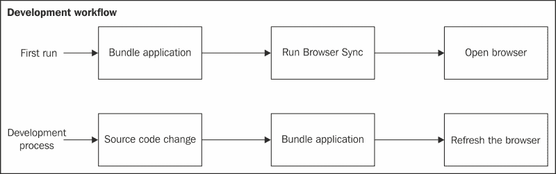
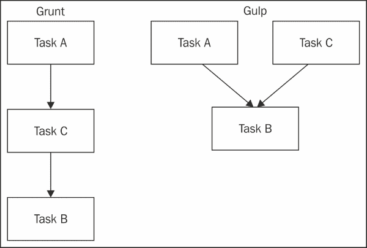
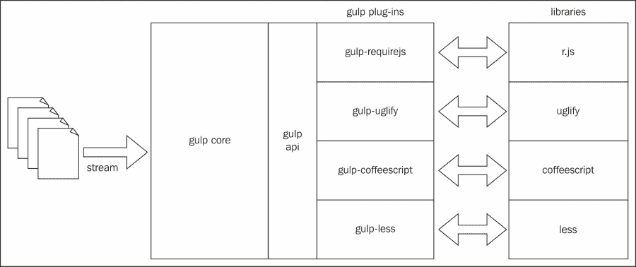
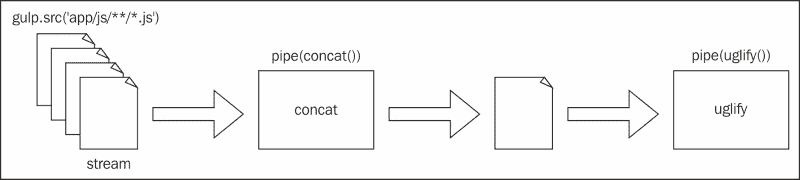
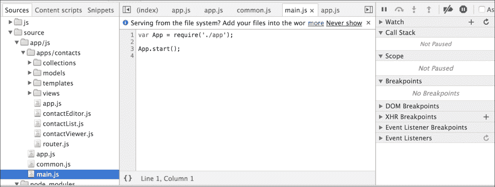

# 第七章.像专业人士一样构建

几年前，你可以用 PHP 创建一个网站，通过 FTP 上传源文件到服务器，然后上线。在那些日子里，JavaScript 是整个系统的一个紧密部分，用于 UI 任务，如验证表单或小块功能。

现在，网络越来越依赖于 JavaScript，我们正在构建网络应用程序而不是网站，这意味着 JavaScript 不再是应用程序的一个微不足道的部分，它现在是一个核心部分。因此，在部署到生产之前打包我们的 JavaScript 应用程序非常重要。

在本章中，你将学习以下内容：

+   构建自动处理源文件的流程

+   压缩应用程序脚本大小

+   在应用程序加载时减少对服务器的请求数量

+   压缩图片

+   优化 CSS 文件

+   在 HTML 文件中连接所有内容

+   设置开发环境以自动重新加载应用程序

在撰写本书时，有许多工具可以构建 JavaScript 应用程序；然而，其中两个最受欢迎的是 Grunt 和 Gulp。Grunt 是一个较老的选择，拥有庞大的社区和令人惊叹的插件集合。另一方面，Gulp 每天都在获得更多的关注，几乎拥有 Grunt 存在的大部分最受欢迎的插件。

# 开发工作流程

当你在开发应用程序时，有些任务非常重复；例如，我们的联系人应用程序使用 Browserify 来管理依赖项。每次你进行更改时，都需要重新打包源代码，这意味着你需要每次都运行`browserify`命令：

```js
$ npm bundle
$ npm start

```

每次你进行小更改时都运行这些命令是一个非常繁琐的任务，应该有更好的方法来做这件事：



图 7.1\. 开发工作流程

上图显示了理想的开发生成过程；第一次运行应用程序时，你应该打包源文件，并运行 BrowserSync 网络服务器，然后打开浏览器。之后，对于你在任何源文件中进行的任何更改，应用程序都应该重新打包，然后刷新浏览器以获取新更改。

目前，我们正在手动执行此过程；然而，在下一节中，你将学习如何自动化此任务，让机器为你完成所有这些工作。

# 什么是任务运行器？

任务运行器是一种计算机程序，它会在你的源代码上运行一系列任务，对文件应用转换。例如，假设你正在用 CoffeeScript 编程语言编写源代码，一个任务可能是将所有源代码编译成 JavaScript，其他任务可以是将所有输出 JavaScript 文件合并成一个文件，第三个任务可以将合并后的文件进行压缩以减小文件大小。

这些任务将由任务运行器自动运行，你只需要编写一个脚本文件来编程需要执行的操作，然后忘记再次运行任何命令行。任务运行器提供触发器，以便在更改文件时启动任务，使其透明完成。

正如你所见，任务运行器可以提高你的生产力，一旦你正确配置了任务运行器，你就可以忘记编译过程的细节。它将允许你自动化所有这些重复且无聊的任务，然后，你可以专注于产品开发。

Grunt 和 Gulp 是最流行的 JavaScript 任务运行器；它们在运行任务时采取不同的方法。在 Grunt 中，任务是顺序运行的：一旦一个任务开始运行，下一个任务不能开始，直到第一个任务完成。在 Gulp 中，任务可以并行运行，如下所示：



图 7.2 Grunt 和 Gulp 运行任务的不同方法

上图展示了 Grunt 和 Gulp 将如何运行三个任务。任务 B 取决于任务 A 和任务 C 是否已完成。请注意，Grunt 可以通过插件并行运行这些任务。而 Gulp 则从其核心设计上就支持这样做。

Grunt 和 Gulp 之间的另一个区别是，在 Grunt 中，你可以在编写一个大的配置对象时配置任务。而在 Gulp 中，你将编写标准的 JavaScript 函数。一个有趣的观点是，Grunt 和 Gulp 可以在同一个项目中一起工作；然而，为了减少复杂性，最好只选择其中一个。

如果你的项目使用 Grunt，除非有很好的理由，否则不应切换到 Gulp。

# Gulp 的工作原理

正如我在本章开头提到的，Gulp 是在撰写本书时最受欢迎的 JavaScript 任务运行器，这也是我们选择它的主要原因。Gulp 和 Grunt 的工作方式类似，它们都使用第三方插件来工作。请记住，Gulp 更像是一个框架，它本身并不做太多。

Gulp 作为协调构建工作流程的粘合剂；它有一些基本功能和一个 API，Gulp 插件可以使用它来完成工作。插件使用编译器和实用程序程序来执行真正的文件处理，例如 CoffeeScript 编译器。插件将这些程序连接到 Gulp 工作流程中：



图 7.3 Gulp 插件和库之间的关系

前面的图显示了之前描述的关系，你可以更好地了解 Gulp 如何与其插件连接；注意插件如何将文件处理委托给它们连接的实用程序。

Gulp 由几个命名任务组成，每个任务都可以依赖于其他任务。一个典型的 Gulp 任务在开始时打开一个文件流，并使用已安装的插件对流中的每个文件进行转换。

使用 `gulp.src()` 方法打开一个流。它启动一个流，你可以将其连接到多个管道以应用必要的转换。当你打开一个流时，你需要指定将在流中使用的目标文件。你将使用 `node-glob 格式` 选择这些文件：

```js
// get only the index.html file
gulp.src('app/index.html');

// get all the files with .html extension
gulp.src('app/*.html');

// get all the .js files available 1 path depth in 
// the app directory
gulp.src('app/*/*.js');

// get all the .js files in every subdirectory available
gulp.src('app/**/*.js');
```

指定流中的文件很容易，这与你在命令行中做的类似。下面的图示显示了流和管道是如何连接的。选定的文件被流式传输到 Gulp 插件中，它们进行转换并将输出放回流中，下一个插件可以继续工作，并将结果放回流中：



图 7.4 使用 node-blob 选择文件

在管道的末尾，你通常会将结果写入一个已准备好使用的文件。你可以放置你需要的任何数量的 Gulp 任务，每个任务都可以有它需要的任何数量的依赖项。

# 开始使用 Gulp

首先，全局安装 Gulp 包；这将使你能够访问 `gulp` 命令：

```js
$ npm install -g gulp

```

一旦全局安装了 Gulp，你还需要在本地项目中安装它，以便能够访问 Gulp 核心工具：

```js
$ npm install -save-dev gulp

```

要配置 Gulp 任务，你需要创建一个名为 `gulpfile.js` 的文件，每次运行 `gulp` 命令时 Gulp 都会读取此文件。所有 Gulp 任务都有一个名称和一个在任务被调用时执行的功能：

```js
var gulp = require('gulp');

gulp.task('hello', function() {
  console.log('Hello world!');
});
```

以下简单的 Gulp 任务将在控制台打印 Hello world!：

```js
$ gulp hello
[22:43:15] Using gulpfile ~/path/to/project/gulpfile.js
[22:43:15] Starting 'hello'...
Hello world!
[22:43:15] Finished 'hello' after 118 μs

```

注意我们是如何调用 Gulp 的，`gulp hello`，命令中使用的参数是要执行的任务的名称。这是你可以编写的最简单的 Gulp 任务，也是开发有效构建管道的起点。

# 创建开发工作流程

在本节中，我们将构建一个脚本以帮助我们进行开发过程，并在之后构建一个可用于生产的脚本。首先，你需要安装基本依赖项：

```js
$ npm install --save-dev gulp gulp-load-plugins gulp-util

```

`gulp-load-plugins` 非常有用，可以自动加载所有可用的插件，而无需在 `gulpfile.js` 脚本中手动引入它们；`gulp-util` 插件提供了如日志消息等实用函数。

## 使用 Browserify 打包 JavaScript 文件

`gulp-browserify` 插件目前已被弃用，不应使用。项目作者建议使用 Gulp 开发团队开发的食谱之一。

仓库中描述的食谱需要先安装一些插件：

```js
$ npm install --save-dev jstifywatchify vinyl-source-stream

```

在 `gulpfile.js` 中，我们可以定义 `browserify` 任务：

```js
var gulp = require('gulp');
var $ = require('gulp-load-plugins')();
var browserify = require('browserify');
var jstify = require('jstify');
var source = require('vinyl-source-stream');

// Bundle files with browserify
gulp.task('browserify', () => {
  // set up the browserify instance on a task basis
  var bundler = browserify({
    entries: 'app/js/main.js',
    debug: true,
    // defining transforms here will avoid crashing your stream
    transform: [jstify]
  });

  return bundler.bundle()
    .on('error', $.util.log)
    .pipe(source('app.js'))
    .pipe(gulp.dest('.tmp/js'));
});
```

注意我们是如何配置 Browserify 打包的，我们使用 Browserify 的 `jstify` 转换来编译 underscore 模板。由于 `browserify` 任务不是一个标准的 Gulp 插件，我们使用 `vinyl-source-stream` 将文件流式传输到打包器。最后，我们将输出写入 `.tmp/js` 路径。

现在，你可以使用 Browserify 参数运行 Gulp 来执行任务：

```js
$ gulp browserify
[07:13:18] Using gulpfile ~/path/to/your/project/gulpfile.js
[07:13:18] Starting 'browserify'...
[07:13:19] Finished 'browserify' after 1.13 s

```

`.tmp/js/app.js` 文件应该存在并准备好使用。您可以运行项目以验证一切是否正常工作：

```js
$ npm start

```

### 源映射

当您运行项目时，浏览器将获得一个名为 `app.js` 的单个文件，其中包含所有连接的源代码。这对于生产环境来说很好，因为它减少了服务器请求资产的数量。然而，在开发环境中，更有用的是在浏览器中看到单个文件，就像您在源代码中进行调试过程时那样。

您可以确保浏览器显示带有源映射的原始源文件，这样您就可以放置调试断点或简单地检查代码，而无需其他依赖项（如 Backbone 库）的噪音。

要在 `browserify` 任务中包含源映射，您需要安装一些额外的依赖项：

```js
$ npm install --save-dev vinyl-buffergulp-sourcemaps

```

然后，修改任务：

```js
// ...
var buffer = require('vinyl-buffer');

// Bundle files with browserify
gulp.task('browserify', () => {
  // set up the browserify instance on a task basis
  var bundler = browserify({
    entries: 'app/js/main.js',
    debug: true,
    // defining transforms here will avoid crashing your stream
    transform: [jstify]
  });

  return bundler.bundle()
    .on('error', $.util.log)
    .pipe(source('app.js'))
 .pipe(buffer())
 .pipe($.sourcemaps.init({loadMaps: true}))
 // Add transformation tasks to the pipeline here.
 .on('error', $.util.log)
 .pipe($.sourcemaps.write('./'))
    .pipe(gulp.dest('.tmp/js'));
});
```

以下图显示了 Google Chrome 浏览器中的源文件。您可以检查原始文件并放置断点，浏览器将确保在正确的时间停止执行。

对于 Browserify 打包，看到所有原始文件而不是一个巨大的脚本非常有用；然而，这种技术也可以用于编译的编程语言，例如 CoffeeScript，或者您也可以用 ECMAScript 6 编写源代码，然后用 babel 进行转译，然后，带有源映射的原始文件：



图 7.5 源映射的实际应用

### 自动重新打包

如果您更改了源文件，那么您将需要再次运行 `browserify` 任务。您可以通过安装另一个 Browserify 插件来确保 Gulp 和 Browserify 为您完成这项工作。首先，您需要安装另一个 Browserify 插件：

```js
$ npm install --save-dev watchify

```

`watchify` 插件会监听源代码中的文件更改，并可用于触发重新打包任务：

```js
//...
var watchify = require('watchify');

// Bundle files with browserify
gulp.task('browserify-2', () => {
  // set up the browserify instance on a task basis
  var bundler = browserify({
    entries: 'app/js/main.js',
    debug: true,
    // defining transforms here will avoid crashing your stream
    transform: [jstify]
  });

 bundler = watchify(bundler);

 var rebundle = function() {
    return bundler.bundle()
      .on('error', $.util.log)
      .pipe(source('app.js'))
      .pipe(buffer())
      .pipe($.sourcemaps.init({loadMaps: true}))
        // Add transformation tasks to the pipeline here.
        .on('error', $.util.log)
      .pipe($.sourcemaps.write('./'))
      .pipe(gulp.dest('.tmp/js'));
 };

 bundler.on('update', rebundle);

 return rebundle();
});
```

当触发更改时，`rebundle()` 函数将自动执行，这样您就只需要刷新浏览器。在下一节中，您将看到如何自动化这个过程。

## BrowserSync

BrowserSync 是一个用于开发的资产服务器，您应该避免在生产环境中使用它。BrowserSync 是一个运行 HTTP 服务器的 Node 包，当检测到服务文件的更改时，它会自动重新加载浏览器。使用 BrowserSync，您可能会忘记每次更改时手动刷新浏览器。

在开始使用之前，您需要安装此包：

```js
$ npm install --save-dev browser-sync

```

一旦安装了包，我们就可以创建一个新的 Gulp 任务来运行 BrowserSync：

```js
// ...
var browserSync = require('browser-sync');
var reload = browserSync.reload;

gulp.task('serve', () =>{
  browserSync({
    port: 9000,
    ui: {
      port: 9001
    },
    server: {
      baseDir: ['.tmp', 'app']
    }
  });

  gulp.watch([
    'app/*.html',
    'app/**/*.css',
    '.tmp/**/*.js'
  ]).on('change', reload);
});
```

在这个 Gulp 任务中，我们将运行 BrowserSync 在 9000 端口，并打开一个额外的 9001 端口以允许我们配置 BrowserSync 的行为。例如，您可以远程调试您的应用程序，这对于移动设备非常有用。

我们配置 BrowserSync 以从 `app` 和 `.tmp` 目录中提供文件。如果您从浏览器访问 `http://localhost:9000/`，则默认提供 `app/index.html` 文件，并使用 `.tmp` 目录中的脚本文件。

为了在检测到源文件更改时自动刷新浏览器，我们使用 `gulp.watch()` 方法，因为它接受一个以 `node-blob` 格式表示的文件列表，然后我们可以监听 `change` 事件，通过 BrowserSync 包含的 `reload()` 函数向浏览器发送刷新信号。

由于服务器任务依赖于 bundle 脚本文件的存在，这个任务应该依赖于我们之前创建的 Browserify 任务。为了向 Gulp 指示任务有依赖关系，我们应该向 `gulp.task()` 函数添加一个新参数：

```js
// ...
var browserSync = require('browser-sync');
var reload = browserSync.reload;

gulp.task('serve', ['browserify'], () => {
// ...
});
```

第二个参数是一个字符串列表，表示任务依赖于哪些内容。在前面的代码片段中，Gulp 将确保 `browserify` 任务先运行并完成，然后再执行 `browserify` 任务函数。

## 使用 Express 运行服务器

现在我们已经让资产服务器工作，我们需要使用 `nodemon` 运行我们的 Express 服务器，这个包与 BrowserSync 非常相似；然而，它不包括浏览器功能。使用 nodemon，你可以运行一个会监视 JavaScript 文件更改的 node 脚本。当检测到更改时，node 脚本将自动重新加载。

您需要首先安装 npm 包：

```js
$ npm install --save-dev gulp-nodemon

```

然后，我们可以为 nodemon 创建任务：

```js
// ...
var nodemon = require('gulp-nodemon');

gulp.task('express', () => {
  nodemon({
    script: 'server/index.js',
    ignore: ['app']
  });
});
```

在这个任务中，我们正在通知 nodemon 忽略 `app` 目录下的更改。这样做的原因是 `app` 路径已经被 BrowserSync 监视。

现在我们有了服务器，并且资产被自动服务和重新加载，我们可以合并这两个任务以在开发模式下运行项目：

```js
var httpProxy = require('http-proxy');

gulp.task('serve', ['browserify', 'express'], () => {
 var serverProxy = httpProxy.createProxyServer();

  browserSync({
    port: 9000,
    ui: {
      port: 9001
    },
    server: {
      baseDir: ['.tmp', 'app'],
 middleware: [
 function (req, res, next) {
 if (req.url.match(/^\/(api|avatar)\/.*/)) {
 serverProxy.web(req, res, {
 target: 'http://localhost:8000'
 });
 } else {
 next();
 }
 }
 ]
    }
  });

  gulp.watch([
    'app/*.html',
    'app/**/*.css',
    '.tmp/**/*.js'
  ]).on('change', reload);
});
```

应该安装一个新的依赖项，**http-proxy**。这个依赖项允许我们将所有 API 请求重定向到 Express 服务器，这样 BrowserSync 就不会尝试服务这些请求：

```js
$ npm install --save-dev http-proxy

```

这次，我们将 `express` 任务依赖项添加到 `serve` 任务中。因为我们现在在不同的端口上运行两个服务器，资产在 9000 端口，API 在 8000 端口，我们在 BrowserSync 中添加了一个中间件来将开始于 `/api/` 或 `/avatar/` 的流量重定向到位于 8000 端口的服务器。

现在，当您从命令行运行 `serve` 任务时，您将获得一个令人惊叹的开发环境。每次前端文件更改时，浏览器都会自动使用新的包重新加载。如果检测到服务器文件中的更改，Express 服务器也会重新加载。

这对您的开发工作流程来说是一个巨大的改进；您将更加高效，并且可以忘记手动重新加载。

# 创建生产工作流程

在前几节中构建的开发工作流程对项目来说是一个巨大的改进；然而，我们还没有完成。在本节中，你将看到如何优化要在生产环境中运行的项目。

在本节中，你将学习如何最小化你的 JavaScript 和 CSS 文件以混淆源代码并减少浏览器加载资产文件所需的时间。图像也可以被压缩以减少其重量，同时不改变其外观。

## Gulp useref

`gulp-useref` 插件会处理你的 HTML 文件，将你的 JavaScript 和 CSS 资产合并成一个单独的文件。请注意，JavaScript 已经由 Browserify 处理，因此不需要使用 useref 处理 JavaScript 文件；另一方面，CSS 可以在这里处理。

你需要使用 npm 将插件作为开发依赖项安装：

```js
$ npm install --save-dev gulp-useref

```

然后，为了使用它，你需要创建一个新的任务。让我们称它为 `html`：

```js
// ...

gulp.task('html', function() {
  var assets = $.useref.assets();

  return gulp.src('app/*.html')
    .pipe(assets)
    .pipe(assets.restore())
    .pipe($.useref())
    .pipe(gulp.dest('dist'));
});
```

`gulp.src('app/*.html')` 函数抓取所有具有 `.html` 扩展名的文件。在我们的例子中，只有 `index.html` 文件存在，因此它是唯一将被处理的文件。`useref.assets()` 函数将 HTML 文件中找到的所有资产合并到一个流中，`assets.restore()` 函数将恢复最初选择的 HTML 文件原始流。

当你调用 `useref()` 函数时，HTML 文件将被解析以替换单个 HTML 标签中的资产文件。例如，如果你有五个 CSS 文件，它将替换 HTML 文件中的这五个链接标签，并在一个指向合并版本的标签中。

你应该指示 `useref` 任务如何在 HTML 文件中使用特殊标签来合并文件：

```js
<html>
<head>
<!-- ... -->
<!-- build:css(app) css/vendor.css -->
<link rel="stylesheet" href="css/bootstrap.css">
<link rel="stylesheet" href="css/main.css">
<!-- endbuild -->
<!-- ... -->
</head>
<!-- ... -->
</html>
```

你需要在代码中添加两个 HTML 注释，这些注释对我们来说有特殊的意义。其语法如下：

```js
<!-- build:<type>(alternate search path) <path> -->
... HTML Markup, list of script / link tags.
<!-- endbuild -->
```

由于我们正在处理 CSS 文件，我们使用 `css` 作为类型，搜索路径表示 useref 将查找文件的位置。如果我们留这个可选参数为空，那么它将使用根项目路径。最后一个 `path` 参数表示合并的 CSS 文件将被放置的位置。

如果你运行 Gulp `html` 任务，你将得到一个在 `dist/css/vendor.css` 路径下的所有样式合并的文件。输出 HTML 文件将指向此文件而不是开发版本：

```js
<html>
<head>
<!-- ... -->
<link rel="stylesheet" href="css/vendor.css">
<!-- ... -->
</head>
<!-- ... -->
</html>
```

你可以通过使用 `gulp-minify-css` 插件来优化输出 CSS 文件。正如你可能已经猜到的，你应该使用 npm 安装此插件：

```js
$ npm install --save-dev gulp-minify-css

```

然后，你可以在构建过程中使用此插件，如下所示：

```js
// ...
var minifyCss = require('gulp-minify-css');

gulp.task('html', function() {
  var assets = $.useref.assets();

  return gulp.src('app/*.html')
    .pipe(assets)
 .pipe(minifyCss())
    .pipe(assets.restore())
    .pipe($.useref())
    .pipe(gulp.dest('dist'));
});
```

这将压缩合并后的 CSS 文件。然而，由于 `useref` 可以处理 CSS 和 JavaScript 文件，如果添加了 JavaScript 构建标签，代码可能会出现错误。为了防止错误，你可以使用 `gulp-if` 插件：

```js
$ npm install --save-dev gulp-if gulp-uglify

```

这也将安装 `uglify` 以处理 JavaScript 文件：

```js
// ...

gulp.task('html', function() {
  var assets = $.useref.assets();

  return gulp.src('app/*.html')
    .pipe(assets)
 .pipe($.if('*.js', uglify()))
 .pipe($.if('*.css', minifyCss()))
    .pipe(assets.restore())
    .pipe($.useref())
    .pipe(gulp.dest('dist'));
});
```

使用 `gulp-if` 我们测试流中的文件是否是 CSS 或 JavaScript 文件，然后应用正确的转换。

## 图片优化

当你在本地机器上开发项目时，资源加载相当快，因为图片和代码都存储在同一台计算机上；然而，当你访问生产环境中的图片时，它们将通过互联网传输到用户的机器。

通过图片优化，我们可以压缩这些图片以减少应用程序从服务器下载的数据量。使用 node，你可以使用 `imagemin` 包；然而，由于我们使用 Gulp，`gulp-imagemin` 将完成这项工作。

如我们之前所做的那样，你需要首先安装插件：

```js
$ npm install --save-dev gulp-imagemin

```

现在插件已经安装，我们可以使用它：

```js
gulp.task('images', function() {
  gulp.src('app/images/*.{jpg,gif,svg,png}')
    .pipe($.imagemin())
    .pipe(gulp.dest('dist/images'));
});
```

它从 `app/images` 路径中获取图片，并对每个图片应用 `imagemin()` 处理。

## 字体

Bootstrap 的字体位于 `node_modules/` 目录下。如果你安装了其他类型的字体，例如 Font Awesome，或者下载了特定的字体；它们应该被复制到 `dist/` 目录。你可以创建一个 `fonts` 任务来完成这个操作，如下所示：

```js
// ...

gulp.task('fonts', function () {
  return gulp.src([
    'app/{,styles/}fonts/**/*',
    'node_modules/bootstrap/dist/fonts/**/*'
  ])
    .pipe($.flatten())
    .pipe(gulp.dest('dist/fonts'));
});
```

注意，你需要安装 `gulp-flatten` 插件；此插件将删除任何前缀目录：

```js
$ npm install --save-dev gulp-flatten
```

## 打包生产环境的 JavaScript 文件

我们拥有的 `browserify` 任务对开发很有用，它创建 sourcemaps，输出未压缩。如果你想进入生产环境，你需要移除 sourcemaps 并最小化输出。

对于生产环境，我们将 ECMAScript 6 代码转换为 JavaScript 以支持不支持 ECMAScript 6 的浏览器。Babel 是目前最好的转换器来完成这个转换。

Browserify 的 babelify 插件将应用以下转换：

```js
$ npm install --save-dev babelify

```

在使用 babelify 插件之前，你需要配置 Babel。在 Babel 6 中，你必须为想要支持的函数安装单个包。对于这个项目，我们支持 ES2015：

```js
$ npm install --save-dev babel-preset-es2015

```

在 `.babelrc` 文件中，你应该配置预设：

```js
// .babelrc
{
  "presets": ["es2015"]
}
```

一旦你正确配置了 Babel，我们就可以为生产创建 `browserify` 任务：

```js
// Bundle files with browserify for production
gulp.task('browserify:dist', function () {
  // set up the browserify instance on a task basis
  var bundler = browserify({
    entries: 'app/js/main.js',
    // defining transforms here will avoid crashing your stream
    transform: [babelify, jstify]
  });

  return bundler.bundle()
    .on('error', $.util.log)
    .pipe(source('app.js'))
    .pipe(buffer())
    .pipe($.uglify())
    .pipe(gulp.dest('dist/js'));
});
```

此任务不会生成 sourcemaps 并优化输出。

## 整合所有内容

你已经学习了如何优化多种类型的资源：CSS、JavaScript 和图片。现在让我们将这些整合起来，以构建我们的应用程序。`serve:dist` 任务将所有过程连接成一个管道：

```js
gulp.task('serve:dist', ['browserify:dist', 'images', 'fonts', 'express'], () => {
  var serverProxy = httpProxy.createProxyServer();

  browserSync({
    port: 9000,
    ui: {
      port: 9001
    },
    server: {
      baseDir: 'dist',
      middleware: [
        function (req, res, next) {
          if (req.url.match(/^\/(api|avatar)\/.*/)) {
            serverProxy.web(req, res, {
              target: 'http://localhost:8000'
            });
          } else {
            next();
          }
        }
      ]
    }
  });
});
```

要测试我们的管道，我们可以在终端中运行 `serve:dist` 任务：

```js
$ gulp serve:dist
[11:18:04] Using gulpfile ~/Projects/mastering-backbone/ch07/gulpfile.js
[11:18:04] Starting 'browserify:dist'...
[11:18:04] Starting 'images'...
[11:18:04] Finished 'images' after 305 ms
[11:18:04] Starting 'fonts'...
[11:18:04] Starting 'express'...
[11:18:05] Finished 'express' after 141 ms
[11:18:05] gulp-imagemin: Minified 0 images
[11:18:05] [nodemon] 1.8.1
[11:18:05] [nodemon] to restart at any time, enter `rs`
[11:18:05] [nodemon] watching: *.*
[11:18:05] [nodemon] starting `node server/index.js`
Express server is running on port 8000
[11:18:08] Finished 'fonts' after 4.04 s
[11:18:12] Finished 'browserify:dist' after 8.02 s
[11:18:12] Starting 'serve:dist'...
[11:18:12] Finished 'serve:dist' after 40 ms
[11:18:12] [nodemon] restarting due to changes...
[BS] Access URLs:
 --------------------------------------
 Local: http://localhost:9000
 External: http://192.168.100.4:9000
 --------------------------------------
 UI: http://localhost:9001
 UI External: http://192.168.100.4:9001
 --------------------------------------
[BS] Serving files from: dist
[11:18:12] [nodemon] starting `node server/index.js`
Express server is running on port 8000

```

注意任务是如何由 Gulp 执行的。在所有这些过程之后，浏览器将自动打开，指向 `http://localhost:9000` 地址，在生产环境中运行应用程序。

# 摘要

在本章中，我们看到了如何使用工具来构建我们的 Backbone 应用程序。首先，你学习了什么是任务运行器以及 Node 中最流行的选择。然后，我们看到了 Gulp 的工作原理和创建任务的方式。

使用 Gulp，你可以构建一个开发环境并对其进行配置，以便为生产环境中的资源应用优化。Gulp 是基于流的，这意味着你可以从 `glob` 规范中抓取一串文件，并将这些文件流式传输以应用所需的转换，例如编译、连接、转译等。

任务运行器是惊人的工具，它允许你自动化任务。你不仅可以创建开发和生产工作流程，还可以为几乎所有你不想重复的事情创建任务。例如，创建部署的任务。

在下一章中，我们将看到如何测试 Backbone 应用程序。你将学习如何隔离和模拟依赖关系以方便测试，以及如何进行 Backbone 测试。
