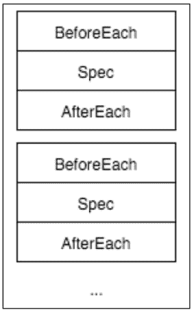

# 第八章。测试 Backbone 应用程序

无论你是一个经验丰富的程序员，还是在某个时间点犯代码错误都是非常正常的。没有人是完美的，软件开发中错误总是时有发生。作为开发者，你的工作是将软件中的缺陷数量降到最低。

错误可能来自不同的来源；一个意外的输入，一个处理不当的错误，第三方插件的更改，内存问题等等。你的代码应该准备好处理这类事情。

在软件行业，一个普遍的规则是始终测试你的代码。当你测试你的应用程序时，最终产品质量更好，因为许多缺陷在用户注意到之前就已经被检测和纠正。

测试不仅仅是为了防止软件中的错误。以下是在进行测试时你可以获得的一些好处：

+   提高最终产品的质量

+   让你在应用中充满自信

+   允许你安全地重构代码片段

+   保留功能

+   模拟错误并改进你的错误处理代码

+   提高你的代码质量，迫使你编写可测试的代码

如果你从未测试过你的软件，现在你有很好的理由开始这样做。`Make` 测试可能会在开始时减缓你的开发过程；然而，你将在中期看到好处。

在本章中，你将学习以下内容：

+   哪些工具可用于测试前端应用程序

+   如何测试 Backbone 应用程序

+   如何应用应用程序测试的最佳实践

+   如何自动运行你的测试

# 测试工具

测试工具可以是库或框架，帮助你编写应用程序的测试并评估结果。在测试工具下，你可以找到以下内容：

+   **测试库**：这为你提供了钩子和函数来描述测试

+   **断言库**：这为你提供了创建期望的功能

+   **测试运行器**：这会发现并运行你的测试

+   **测试覆盖率**：这告诉你哪些代码部分被测试了，哪些没有被测试

+   **测试报告**：这会以不同的格式生成报告，如 HTML 和 JSON

+   **模拟、存根、伪造工具**：这些为你提供了创建具有可预测行为的假对象的方法

+   **模块模拟**：这用假模块替换所需的模块，有助于隔离模块

+   **压力工具**：这会对应用进行多次请求，以查看它在高需求环境下的行为

+   **浏览器测试**：这模拟用户在整个应用程序中输入

解释和展示所有这些工具如何工作超出了本书的范围。在本章中，你将使用测试库、断言库、测试运行器和模拟。

对于 JavaScript，有许多测试库可供你使用；然而，在撰写本书时，有两个更受欢迎：`Jasmine` 和 `Mocha`。

`Mocha` 是一个小型库，允许你编写测试驱动程序，它本身不包含任何断言函数。这意味着你应该将 `Mocha` 与你选择的断言库集成；一个非常流行的选择是使用 Mocha 和 Chai.js 的组合。

`Jasmine` 更像是一个框架，它提供了一个与 Mocha 非常相似的 API；然而，它包括了断言函数。因此，使用起来更简单，因为你不需要创建额外的步骤。

对于这本书，我们将使用 Jasmine，因为它是最受欢迎的测试工具，并且更容易开始使用。与 Mocha 一样，你可以将 Jasmine 用作测试运行器并选择不同类型的报告。

# Jasmine 入门

要编写测试，你应该创建两样东西：测试套件和规范。规范（简称 spec）是你从代码中测试的功能的一部分；例如，如果你的代码是计算 $100.00 的 5% 税，你预期它应该是 $5。测试套件是一组在主题下分组的预期。在上面的例子中，测试套件可以是“发票总额计算”。

要开始使用 Jasmine，你应该从 npm 安装它，如下所示：

```js
$ npm install --save-dev jasmine

```

然后，你可以开始编写你的测试。使用 Jasmine，你有两个函数：`describe()` 用于创建测试套件，`it()` 用于创建规范：

```js
// specs/mathSpec.js	
describe('Basic mathematicfunctions', () => {
it('should result 4 the sum of 2 + 2', () => {
  });

it('should result 1 the substract of 3 - 2', () => {
  });

it('should result 3 the division of 9 / 3', () => {
  });

it('should throw an error when divide by zero', () => {
  });
});
```

上述代码定义了一个针对假设的数学函数集的测试套件。注意在 `describe()` 函数中，你应该写一段文字来告诉人们测试的上下文；而在 `it()` 函数中，文字应该说明你要测试的内容。

现在，让我们为测试套件构建 `math` 函数，如下所示：

```js
// app/js/math.js
var math = {
sum(a, b) {
return a + b;
  },

substract(a, b) {
return a - b;
  },

divide(a, b) {
if (b === 0) {
throw new Error('Can not divide by zero');
    }

return a / b;
  }
};

module.exports = math;
```

`math` 对象具有通过测试套件所需的功能；然而，要实际测试 `math` 对象，你需要制定一系列预期。

## 预期

预期是函数，用于比较函数的输出与预期输出。在下面的例子中，我们使用 `2` 和 `2` 作为输入调用 `sum()` 函数。我们预期结果应该是 `4`：

```js
expect(sum(2, 2)).toEqual(4);
```

`toEqual()` 预期函数比较函数的输出和预期值是否相等；如果两者相同，测试将通过，否则，测试将失败。下表显示了 Jasmine 中最常用的预期，请查阅文档以获取完整的可用预期函数集：

| 预期函数 | 描述 | 示例 |
| --- | --- | --- |
| `toEqual` | 值应该完全相等 | `expect('hello').toEqual('hello')` |
| `toMatch` | 值将与正则表达式匹配 | `expect('Hello').toMatch(/[Hh]ello/)` |
| `toBeTruthy` | 值应该是真值 | `expect(true).toBeTruthy();` `expect(100).toBeTruthy();` |
| `toBeFalsy` | 值应该是假值 | `expect(false).toBeFalsy();` `expect(null).toBeFalsy();` |
| `toThrowError` | 这验证了被调用的函数会抛出错误 | `expect(function() {``math.divide(1, 0);``}).toThrowError();` |

在将所有期望添加到我们已有的示例测试套件之后，代码应该如下所示：

```js
// spec/mathSpec.js
var math = require('../app/js/math');

describe('Basic mathematic functions', () => {
it('should result 4 the sum of 2 + 2', () => {
expect(math.sum(2, 2)).toBe(4);
  });

it('should result 1 the substract of 3 - 2', () => {
expect(math.substract(3, 2)).toBe(1);
  });

it('should result 3 the division of 9 / 3', () => {
expect(math.divide(9, 3)).toBe(3);
  });

it('should throw an error when divide by zero', () => {
expect(() =>math.divide(9, 0)).toThrowError();
  });
});
```

要运行测试套件，你应该首先配置 Jasmine 测试运行器。为此，你应该创建一个脚本：

```js
// spec/run.js
var Jasmine = require('jasmine');
var jasmine = new Jasmine();

jasmine.loadConfig({
spec_dir: 'spec',
spec_files: [
    '**/*[sS]pec.js'
  ]
});

jasmine.execute();
```

Jasmine 将在 `spec/` 目录下查找测试，它将查找所有以 `spec.js` 或 `Spec.js` 结尾的文件。由于我们的测试文件命名为 `mathSpec.js`，Jasmine 测试运行器将加载并运行它，如下所示：

```js
$ node spec/run.js
Started
....

4 specs, 0 failures
Finished in 0.008 seconds

```

你可以看到测试失败时会发生什么；例如，你将求和测试改为 `5` 而不是 `4`：

```js
$ node spec/run.js
Started
F...

Failures:
1) Basic mathematic functions should result 4 the sum of 2 + 2
 Message:
 Expected 4 to be 5.
 Stack:
 Error: Expected 4 to be 5.
at Object.<anonymous>(/path/to/your/project/spec/mathSpec.js:5:28)

4 specs, 1 failure
Finished in 0.009 seconds

```

现在，如果你犯了一个错误，Jasmine 会告诉你哪里出了问题。注意 Jasmine 如何通知你错误：

> *"基本的数学函数应该得到 2 + 2 的和 4"*

然后，它告诉你它期望的是 `5`，但收到了 `4`。请注意，在 `describe()` 和 `it()` 函数中放入的消息非常重要，因为它们将帮助你快速诊断问题。

## 测试异步代码

当你需要测试异步代码，如 Ajax 调用，你需要额外的一步。当你编写 `it()` 函数时，你应该传递一个 `done` 参数，Jasmine 将在那里放置一个回调函数，你应该在测试完成后调用它。

为了说明这一点，让我们模拟一个求两个数的和的异步任务，如下所示：

```js
var math = {
  // ...

asyncSum(a, b, callback) {
    // Will respond after 1.5 seconds.
setTimeout(function() {
callback(a + b);
    }, 1500);
  },

  // ...
};
```

遵循 JavaScript 标准，`syncSum()` 函数接收第三个参数，即当求和完成时将被调用的回调函数。在以下示例中，回调函数将在 1,500 毫秒后调用：

```js
math.asyncSum(2, 2, result => {
  // After 1500ms result will be equal to 4
});
```

要使用此函数编写测试，我们应该将 `done` 回调函数传递给 `it()` 函数：

```js
it('sums two numbers asynchronously', done => {
math.asyncSum(2, 2, function(result) {
expect(result).toEqual(4);
done();
  });
});
```

# Karma 测试运行器

Karma 是一个流行的 JavaScript 测试运行器，它与许多其他测试库和框架（如 Jasmine 和 Mocha）一起工作。Jasmine 附带的 Node 测试运行器已经足够好；然而，Karma 为这个方程式增加了超级功能。

使用 Karma，你可以在真实的网络浏览器上运行测试，例如 Google Chrome、Firefox、Opera 等。一旦 Karma 设置并运行，它将负责查找要测试的文件，运行测试，然后给出报告。

在开始使用 Karma 之前，你需要安装 Karma：

```js
$ npm install --save-dev karma karma-jasmine karma-browserify karma-chrome-launcher karma-spec-reporter

```

然后，你可以使用名为 `karma.conf.js` 的脚本配置 Karma：

```js
// Karma configuration
// http://karma-runner.github.io/0.12/config/configuration-file.html

module.exports = function(config) {
  'use strict';

config.set({
    // enable / disable watching file and executing tests whenever
    // any file changes
autoWatch: true,

    // base path, that will be used to resolve files and exclude
basePath: '',

    // testing framework to use (jasmine/mocha/qunit/...)
frameworks: ['browserify', 'jasmine'],

    // list of files / patterns to load in the browser
files: [
      'spec/**/*Spec.js'
    ],

    // preprocess matching files before serving them to 
    // the browser available preprocessors:
    // https://npmjs.org/browse/keyword/karma-preprocesso
preprocessors: {
      'spec/**/*Spec.js': ['browserify']
    },

    // Cobfigure how to bundle the test files with Browserify
browserify: {
debug: true,
transform: ['jstify'],
extensions: ['.js', '.tpl']
    },

    // report on console and growl if available
    //
    // More info about growl notifications on
    // http://mattn.github.io/growl-for-linux/
    // http://growl.info/
reporters: ['spec'],

    // list of files / patterns to exclude
exclude: [],

    // web server port
port: 9876,

    // enable / disable colors in the output (reporters and logs)
colors: true,

    // level of logging
    // possible values:
    // LOG_DISABLE || LOG_ERROR || LOG_WARN || 
    // LOG_INFO || LOG_DEBUG
logLevel: config.LOG_INFO,

    // Continuous Integration mode
    // if true, it capture browsers, run tests and exit
singleRun: false,

    // Start these browsers, currently available:
    // - Chrome
    // - ChromeCanary
    // - Firefox
    // - Opera
    // - Safari (only Mac)
    // - PhantomJS
    // - IE (only Windows)
browsers: ['Chrome']
});
};
```

`files` 字段告诉 Karma 哪些文件将以 `glob` 格式进行测试。`preprocessors` 字段告诉 Karma 是否应该对从 `files` 字段选择的文件进行预处理，以便在运行测试之前。由于我们使用 Browserify 来管理依赖项，我们应该使用 Browserify 预处理文件以创建测试包。

你可以选择 Karma 如何向你报告测试状态。`reporters`字段使得这一点成为可能，你可以搜索更多可用的报告器；然而，`spec`报告器是最常用的之一。

一旦 Karma 配置完成，你可以运行我们用 Karma 配置的测试，而不是使用 Jasmine 测试运行器：

```js
$ ./node_modules/karma/bin/karma start 

```

你可以使用 Gulp 来自动化 Karma 的运行，毕竟那是它的职责：

```js
// configuration of Gulp

```

# 要测试什么以及如何测试 Backbone 应用程序

Backbone 库有不同的组件，每个组件都有自己的意图和职责，这就是为什么你必须以不同的方式测试它们。请记住，你应该只测试你的代码，而不是 Backbone 内置的功能。

在接下来的章节中，你将看到你的 Backbone 应用程序的各个部分以及如何测试它们；我们将从简单的事情开始，然后逐步过渡到更复杂的内容。然后，你将学习如何隔离模块，以便一次只测试一个模块。

# 测试模型和集合

最基本的测试是确保模型和集合具有正确的属性设置，以防止其属性发生意外更改。在模型的情况下，你可以测试创建新联系人时的默认值，并验证`url`属性是否正确：

```js
// spec/apps/contacts/models/contactSpec.js
var Contact = require('../../../../app/js/apps/contacts/models/contact');

describe('Contact model', () => {
describe('creating a new contact', () => {
it('has the default values', () => {
var contact = new Contact();

expect(contact.get('name')).toEqual('');
expect(contact.get('phone')).toEqual('');
expect(contact.get('email')).toEqual('');
expect(contact.get('address1')).toEqual('');
expect(contact.get('address2')).toEqual('');
expect(contact.get('avatar')).toEqual(null);
    });
  });

it('has the rigthurl', () => {
var contact = new Contact();
expect(contact.url()).toEqual('/api/contacts');
  });
});
```

对于集合，你可以验证`url`是否正确：

```js
// spec/apps/contacts/collections/contactCollectionSpec.js
varContactCollection = require('../../../../app/js/apps/contacts/collections/contactCollection');

describe('Contac collection', () => {
it('has the rigthurlRoot', () => {
var collection = new ContactCollection();
expect(collection.url).toEqual('/api/contacts');
  });
});
```

# 测试视图

视图管理数据（如模型或集合）与用户交互（DOM）之间的关系。在视图的情况下，你应该测试以下内容：

+   渲染：给定一个模型或集合，你应该验证输出 HTML 是否正确

+   事件：这验证了 DOM 事件是否被正确处理

+   模型更改：如果模型发生变化，视图应该与之同步

对于这个例子，我们将测试`ContactForm`视图；这个视图的职责是向用户展示一个表单，然后获取用户输入以更新模型。

在对视图进行测试时，建议使用模拟模型而不是原始的`Contact`模型。这样做的主要原因是为了隔离`ContactView`对象，这样如果测试失败，你就会知道错误是孤立在视图中的，并不依赖于`Contact`模型。

你可以开始测试渲染的 HTML 是否正确，如下所示：

```js
var Backbone = require('backbone');
var ContactForm = require('../../../../app/js/apps/contacts/views/contactForm');

describe('Contact form', () => {
var fakeContact;

beforeEach(() => {
fakeContact = new Backbone.Model({
name: 'John Doe',
facebook: 'https://www.facebook.com/john.doe',
twitter: '@john.doe',
github: 'https://github.com/johndoe',
google: 'https://plus.google.com/johndoe'
    });
  });

it('has the rigth class', () => {
var view = new ContactForm({model: fakeContact});
expect(view.className).toEqual('form-horizontal');
  });

it('renders the rigth HTML', () => {
var view = new ContactForm({model: fakeContact});

view.render();

expect(view.$el.html()).toContain(fakeContact.get('name'));
expect(view.$el.html()).toContain(fakeContact.get('twitter'));
expect(view.$el.html()).toContain(fakeContact.get('github'));
expect(view.$el.html()).toContain(fakeContact.get('google'));
expect(view.$el.html())
.toContain(fakeContact.get('facebook'));
  });
});
```

注意在测试中，我们是在查看输出 HTML 是否包含特定的文本。你可以使用特定的选择器来代替：

```js
expect(view.$el.find('#name').val())
.toContain(fakeContact.get('name'));
```

然而，不建议在不稳定的应用程序中这样做，因为设计可能会迅速改变，即使屏幕上有名称，测试也会失败：



图 8.1 Jasmine 测试函数

图 8.1 说明了`beforeEach()`、`afterEach()`和`it()`函数之间的关系。当你定义一个或多个`beforeEach()`函数在`describe()`中，那么所有的`beforeEach()`函数都将始终在`it()`函数之前执行。这个特性非常有用，因为它可以确保每个测试都有相同的初始条件。

在`ContactForm`对象的示例测试套件中，我们确保`fakeContact`始终具有相同的属性；如果你在`it()`函数下更改模型中的某些内容，下一个函数将始终获得一个干净的`fakeContact`模型进行测试。

`ContactForm`对象有一个**保存**按钮，当点击时会触发一个`form:save`事件；为了测试这个，你可以在 Jasmine 的**间谍函数**上监听这个事件。间谍函数是一个什么也不做，只是记录何时以及如何被调用的函数。然后，你可以用它来在其中设置期望：

```js
it('triggers a form:save event when save button is cliecked', () => {
var view = new ContactForm({model: fakeContact});
var callback = jasmine.createSpy('callback');

view.on('form:save', callback);
view.render();

// Emulate a user click
view.$el.find('#save').trigger('click');

expect(callback).toHaveBeenCalled();
});
```

Jasmine 的`createSpy()`方法创建了一个间谍函数，该函数将被用作`form:save`事件的处理器。然后，它模拟在保存按钮上触发一个点击事件，并测试`callback`函数是否被调用。

我们可以更进一步，检查函数是否以模型作为参数被调用：

```js
expect(callback).toHaveBeenCalledWith(mockContact);
```

现在是测试用户在表单中输入并点击**保存**按钮的时候；我们期望的是模型随着输入值的改变而改变：

```js
it('updates the model when the save button is clicked', () => {
var view = new ContactForm({model: fakeContact});
var callback = jasmine.createSpy('callback');
varexpectedValues = {
name: 'Jane Doe',
facebook: 'https://www.facebook.com/example',
twitter: '@example',
github: 'https://github.com/example',
google: 'https://plus.google.com/example'
  };

view.on('form:save', callback);
view.render();

  // Change the input fields
  view.$el.find('#name').val(expectedValues.name);
view.$el.find('#facebook').val(expectedValues.facebook);
view.$el.find('#twitter').val(expectedValues.twitter);
view.$el.find('#github').val(expectedValues.github);
view.$el.find('#google').val(expectedValues.google);

  // Emulate a change events on all input fields
view.$el.find('input').trigger('change');

  // Emulate a user click
view.$el.find('#save').trigger('click');

// Get the argument passed to the callback function
var callArgs = callback.calls.argsFor(0);
var model = callArgs[0];

expect(model.get('name')).toEqual(expectedValues.name);
expect(model.get('facebook')).toEqual(expectedValues.facebook);
expect(model.get('twitter')).toEqual(expectedValues.twitter);
expect(model.get('github')).toEqual(expectedValues.github);
expect(model.get('google')).toEqual(expectedValues.google);
});
```

在这个测试中，我们更改输入字段的值，然后在表单中点击保存按钮。`callback`间谍函数记录了`form:save`事件是如何被触发的，并提取传递给它的参数。我们可以使用这个参数来测试模型是否按预期更新。

# 测试控制器

控制器比测试更复杂，因为它们比模型、集合和视图有更多的依赖。如果你查看这些对象的代码，你会看到它们唯一的依赖是 Backbone 和 Underscore。

你可以用所有依赖来测试控制器，这意味着在测试`ContactEditor`控制器时，你将测试所有附加到它的视图和模型，因为模块需要这些对象。

这对单元测试来说不是很好，因为你最终会得到集成测试。如果`Contact`模型有缺陷，那么`ContactEditor`将失败，即使它没有错误。

你需要将模块从其他模块的混乱中隔离出来。记住，你应该信任你的库，因为它们已经有了自己的测试套件。我们需要一个机制来伪造模块的依赖。

使用依赖注入，你可以覆盖`require()`函数，而不是加载指向的脚本，以便使用一个假对象。这将保证正在测试的代码是隔离的，并且其行为对单元测试来说是可预测的。

## 模拟依赖

在 Node 中模拟依赖有两个主要选择：`rewire`和`proxyquireify`；使用这些库，你可以覆盖模块的原始依赖，以便使用假版本。

使用 Browserify 时，你应该有`proxyquireify`。使用 npm 安装它，如下所示：

```js
$ npm install --save-dev proxyquirefy

```

一旦库安装完成，我们需要在 Karma 配置文件中添加适当的配置：

```js
// ...

browserify: {
debug: true,
plugin: ['proxyquireify/plugin'],
transform: ['jstify'],
extensions: ['.js', '.tpl']
},

// ...
```

你应该在使用之前初始化`proxyquireify`。因为`proxyquireify`覆盖了原始的`require()`函数，所以它应该在使用之前初始化。初始化函数返回一个与原始`require()`函数类似的功能对象；然而，它具有伪造依赖项的额外功能，如下所示：

```js
var proxyquire = require('proxyquireify')(require);
```

`proxyquire`对象可以用来加载模块：

```js
var ContactViewer = proxyquire('./contacts/contactViewer');
```

当你使用`proxyquireify`加载模块时，你可以使用第二个参数来覆盖原始依赖项。它是一个对象，其中键是依赖项的名称，值是替换原始依赖项的对象：

```js
var targetFile = '../../app/js/apps/contacts/contactViewer';
var fakes = {
'./views/ContactView': Backbone.View
}
var ContactViewer = proxyquire(targetFile, fakes);
```

此配置将用空的`Backbone.View`对象替换`ContactView`对象，以便在测试`ContactViewer`对象时，模块不会加载原始的`ContactView`模块。

## 伪造对象

一个伪造对象是一个具有与原始对象相同功能的简单对象；然而，它具有可预测的行为，这样你就可以使用伪造对象来隔离正在测试的模块。例如，我们所有的控制器都依赖于`App`对象来工作；然而，为了测试的目的使用真实的`App`对象并不是一个好主意。如果`App`对象出现错误，那么控制器测试将会失败。

如下所示是`App`对象的伪造：

```js
// spec/fakes/app.js
'use strict';

var fakeRouter = {
navigate: jasmine.createSpy()
};

var FakeApp = {
router:  fakeRouter,

notifySuccess(message) {
this.lastSuccessMessage= message;
  },

notifyError(message) {
this.lastErrorMessage = message;
  },

reset() {
deletethis.lastSuccessMessage;
deletethis.lastErrorMessage;
this.router.navigate = jasmine.createSpy();
  }
};

_.extend(FakeApp, Backbone.Events);

module.exports = FakeApp;
```

这个简单的对象可以模拟成真实的`App`对象，正如你所见，这个对象什么也不做；然而，它将在下一节中用于测试`ContactEditor`控制器。

区域也可以被伪造，以消除原始区域的所有开销：

```js
// spec/fakes/region.js
'use strict';

class FakeRegion {
show(view) {
view.render();
  }
}

module.exports = FakeRegion;
```

这非常简单，只需渲染传递给它的视图。

## 测试 ContactEditor

`ContactEditor`控制器的职责是渲染必要的视图，以便用户可以更新或创建新的联系人。它与许多视图和`Contact`模型密切相关。

我们将使用`proxyquireify`来隔离`ContactEditor`控制器，并且不是使用真实对象，我们将伪造其中大部分。第一个测试是检查子应用程序是否在正确的区域渲染：

```js
// spec/apps/contacts/contactEditor.js
var proxyquery = require('proxyquireify')(require);
var Backbone = require('backbone');

var FakeRegion = require('../../fakes/region');
var fakes = {
'./views/contactPreview': Backbone.View,
'./views/phoneListView': Backbone.View,
'./views/emailListView': Backbone.View,
'./collections/phoneCollection': Backbone.Collection,
'./collections/emailCollection': Backbone.Collection
};

var ContactEditor = proxyquery('../../../app/js/apps/contacts/contactEditor', fakes);

describe('Contact editor', () => {
var fakeContact;
var editor;
var region;

beforeEach(() => {
region = new FakeRegion();
editor = new ContactEditor({region});
fakeContact = new Backbone.Model({
name: 'John Doe',
facebook: 'https://www.facebook.com/john.doe',
twitter: '@john.doe',
github: 'https://github.com/johndoe',
google: 'https://plus.google.com/johndoe'
    });
  });

describe('showing a contact editor', () => {
it('renders the editor in the given region', () => {
spyOn(region, 'show').and.callThrough();
editor.showEditor(fakeContact);
expect(region.show).toHaveBeenCalled();
    });
  });
});
```

我们几乎伪造了`ContactEditor`控制器的所有视图，我们不需要真实的视图，因为我们不是在测试输出 HTML，这是视图测试的工作。唯一没有被伪造的视图是`FormLayout`视图：

```js
// spec/fakes/formLayout.js
'use strict';

var Common = require('../../app/js/common');

class FakeFormLayout extends Common.Layout {
constructor(options) {
super(options);
this.template = '<div class="phone-list-container" />' +
                    '<div class="email-list-container" />';

this.regions = {
phones: '.phone-list-container',
emails: '.email-list-container'
    };
  }
}

module.exports = FakeFormLayout;
```

然后添加伪造对象，如下所示：

```js
var FakeFormLayout = require('../../fakes/formLayout');

var fakes = {
'./views/contactPreview': Backbone.View,
'./views/phoneListView': Backbone.View,
'./views/emailListView': Backbone.View,
'./views/contactForm': FakeFormLayout,
'./collections/phoneCollection': Backbone.Collection,
'./collections/emailCollection': Backbone.Collection
};

// ...
```

在`ContactEditor`控制器中，我们正在监听`ContactPreview`视图的`avatar:selected`事件，我们应该确保事件被正确处理。然而，我们有一个问题，我们无法访问视图实例。为了使控制器可测试，将视图作为控制器的属性放置是一个常见的做法，如下面的代码所示：

```js
class ContactEditor {
  // ...

showEditor(contact) {
    // Data
var phonesData = contact.get('phones') || [];
var emailsData = contact.get('emails') || [];
this.phones = new PhoneCollection(phonesData);
this.emails = new EmailCollection(emailsData);

    // Create the views
this.layout = new ContactFormLayout({model: contact});
this.phonesView = new PhoneListView({
collection: this.phones
});
this.emailsView = new EmailListView({
collection: this.emails
});
this.contactForm = new ContactForm({model: contact});
this.contactPreview = new ContactPreview({
controller: this,
model: contact
    });

    // Render the views
this.region.show(this.layout);
this.layout.getRegion('form').show(this.contactForm);
this.layout.getRegion('preview').show(this.contactPreview);
this.contactForm.getRegion('phones').show(this.phonesView);
this.contactForm.getRegion('emails').show(this.emailsView);

this.listenTo(this.contactForm, 'form:save',
this.saveContact);
this.listenTo(this.contactForm, 'form:cancel', this.cancel);
this.listenTo(this.contactForm, 'phone:add', this.addPhone);
this.listenTo(this.contactForm, 'email:add', this.addEmail);

this.listenTo(this.phonesView, 'item:phone:deleted', 
(view, phone) => {
this.deletePhone(phone);
    });
this.listenTo(this.emailsView, 'item:email:deleted',
 (view, email) => {
this.deleteEmail(email);
    });

    // When avatar is selected, we can save it inmediatly if the
    // contact already exists on the server, otherwise just
    // remember the file selected
this.listenTo(this.contactPreview, 'avatar:selected',
blob => {
this.avatarSelected = blob;

if (!contact.isNew()) {
this.uploadAvatar(contact);
      }
    });
  }

  // ...
}
```

通过这个更改，我们可以进行适当的测试，它验证了当`contactPreview`视图选择一个图像时，`avatarSelected`属性被设置：

```js
it('binds the avatar:selected event in the contact preview', () => {
var expectedBlob = new Blob(['just text'], {
type: 'text/plain'
});

editor.showEditor(fakeContact);
// Fake the uploadAvatar method to prevent side effects
editor.uploadAvatar = jasmine.createSpy();

editor.contactPreview.trigger('avatar:selected', expectedBlob);
expect(editor.avatarSelected).toEqual(expectedBlob);
});
```

`ContactEditor` 控制器的核心功能是在用户点击 **保存** 按钮时正确保存联系信息，如下所示：

```js
describe('Contact editor', () => {
  // ...
describe('saving a contact', () => {
beforeEach(() => {
jasmine.Ajax.install();

      // Fake the contact url, it is not important here
      fakeContact.url = '/fake/contact';

      // Fake upload avatar, we are not testing this feature
editor.uploadAvatar = function(contact, options) {
options.success();
      };

editor.showEditor(fakeContact);
    });

afterEach(() => {
jasmine.Ajax.uninstall();
FakeApp.reset();
    });
  }
}
```

在这个测试用例中，控制器将在模型中调用 `save()` 方法以保存联系信息，Backbone 将向服务器发起 Ajax 调用。在测试时，你不应该建立真实的服务器连接，因为这会使你的测试变慢并容易失败。

使用 `jasmine-ajax` 插件，你可以伪造 Ajax 调用，从而完全控制测试的行为。你需要先安装该包：

```js
$ npm install --save-devkarma-jasmine-ajax

```

然后，更新 Karma 的配置以包括插件，如下所示：

```js
frameworks: ['browserify', 'jasmine-ajax', 'jasmine'],
```

插件覆盖了原始的 `XMLHttpRequest` 对象，因此，在开始测试之前初始化 Ajax 插件并完成测试后恢复原始对象非常重要。

在 `beforeEach()` 函数中，我们将通过调用 `jasmine.Ajax.install()` 初始化插件，并在 `afterEach()` 中使用 `jasmine.Ajax.uninstall()` 恢复原始的 `XMLHttpRequest` 对象。

当你的应用程序发起 Ajax 调用时，插件将捕获请求，然后你可以检查请求或伪造响应，如下所示：

```js
it('shows a success message when the contact is saved', () => {
editor.saveContact(fakeContact);

jasmine.Ajax.requests.mostRecent().respondWith({
status: '200',
contentType: 'application/json',
responseText: '{}'
  });

expect(FakeApp.lastSuccessMessage).toEqual('Contact saved');
expect(FakeApp.router.navigate)
.toHaveBeenCalledWith('contacts', true);
});
```

在前面的测试中，我们保存了联系信息并伪造了一个 HTTP `200` 响应。当这种情况发生时，应用程序将显示成功消息并将应用程序重定向到联系列表。

如果服务器响应错误，那么应用程序将显示错误消息，而不会将应用程序重定向到联系列表：

```js
it('shows an error message when the contact cant be saved', () => {
editor.saveContact(fakeContact);

jasmine.Ajax.requests.mostRecent().respondWith({
status: '400',
contentType: 'application/json',
responseText: '{}'
  });

expect(FakeApp.lastErrorMessage)
.toEqual('Something goes wrong');
expect(FakeApp.router.navigate)
.not.toHaveBeenCalled();
});
```

`saveContact()` 方法还做的一件事是设置联系模型中的 `phones` 和 `emails` 属性。测试将确保这些属性被正确地发送到服务器，如下面的代码所示：

```js
it('saves the model with the phones and emails added', () => {
var expectedPhone = {
description: 'test',
phone: '555 5555'
  };
var expectedEmail = {
description: 'test',
phone: 'john.doe@example.com'
  };

editor.phones = new Backbone.Collection([expectedPhone]);
editor.emails = new Backbone.Collection([expectedEmail]);
editor.saveContact(fakeContact);

var requestText = jasmine.Ajax.requests.mostRecent().params;
var request = JSON.parse(requestText);

expect(request.phones.length).toEqual(1);
expect(request.emails.length).toEqual(1);
expect(request.phones).toContain(expectedPhone);
expect(request.emails).toContain(expectedEmail);
});
```

我们设置了一个 `phones` 和 `emails` 的列表，然后测试服务器是否接收到正确的请求。

如果联系信息无效，那么控制器将不会向服务器发送任何信息：

```js
it('does not save the contact if the model is not valid', () => {
  // Emulates an invalid model
fakeContact.isValid = function() {
return false;
  };

editor.saveContact(fakeContact);
expect(jasmine.Ajax.requests.count()).toEqual(0);
});
```

`ContactEditor` 对象只有在模型是新的情况下才应上传头像图片。如果模型不是新的，那么当用户选择图片时，头像会立即上传：

```js
it('uploads the selected avatar if model is new', () => {
  // Emulates a new model
fakeContact.isNew= function() {
return true;
  };

editor.uploadAvatar = jasmine.createSpy('uploadAvatar');
editor.saveContact(fakeContact);

jasmine.Ajax.requests.mostRecent().respondWith({
status: '200',
contentType: 'application/json',
responseText: '{}'
  });

expect(editor.uploadAvatar).toHaveBeenCalled();
});

it('does not upload the selected avatar if model is not new', () => {
  // Emulates a not new model
fakeContact.isNew= function() {
return false;
  };

editor.uploadAvatar = jasmine.createSpy('uploadAvatar');
editor.saveContact(fakeContact);

jasmine.Ajax.requests.mostRecent().respondWith({
status: '200',
contentType: 'application/json',
responseText: '{}'
  });

expect(editor.uploadAvatar).not.toHaveBeenCalled();
});
```

# 测试子应用 Façade

子应用 Façade 的职责是创建模型或收集对象，并创建适当的子应用控制器以渲染获取的数据。为了显示联系编辑器，Façade 应根据其 ID 获取联系信息，然后运行 `ContactEditor` 子应用：

```js
var proxyquery = require('proxyquireify')(require);

var FakeApp = require('../../fakes/app');
var FakeRegion = require('../../fakes/region');
var FakeContactEditor = require('../../fakes/contactEditor');

var fakes = {
'../../app': FakeApp,
'./contactEditor': FakeContactEditor,
'./contactList': {},
'./contactViewer': {}
};

var ContactsApp = proxyquery('../../../app/js/apps/contacts/app', fakes);

describe('Contacts application facade', () => {
var app;
var region;

function respond(request) {
var fakeResponse = {
name: 'John Doe',
facebook: 'https://www.facebook.com/john.doe',
twitter: '@john.doe',
github: 'https://github.com/johndoe',
google: 'https://plus.google.com/johndoe'
    };

request.respondWith({
status: 200,
contentType: 'application/json',
responseText: JSON.stringify(fakeResponse)
    });
  }

beforeEach(() => {
region = new FakeRegion();
app = new ContactsApp({region});

jasmine.Ajax.install();
  });

afterEach(() => {
jasmine.Ajax.uninstall();
  });

describe('showing contact editor', () => {

  });
});
```

这个测试套件的设置与控制器非常相似。我们应该伪造 `Ajax` 调用并创建一个 Façade 对象，该对象将在规格说明中使用。我们的第一个测试将是验证它是否获取了正确的数据：

```js
it('fetches data from the server', () => {
app.showContactEditorById('1');

var request = jasmine.Ajax.requests.mostRecent();
expect(request.url).toEqual('/api/contacts/1');
});
```

当从服务器获取数据时，Façade 应触发 `loading: start`：

```js
it('triggers a loading:start event', () => {
var callback = jasmine.createSpy('callback');

FakeApp.on('loading:start', callback);
app.showContactEditorById('1');

expect(callback).toHaveBeenCalled();
});
```

然后，它应在请求完成时停止：

```js
it('triggers a loading:stop event when the contact is loaded', () => {
var callback = jasmine.createSpy('callback');

FakeApp.on('loading:stop', callback);
app.showContactEditorById('1');
respond(jasmine.Ajax.requests.mostRecent());

expect(callback).toHaveBeenCalled();
});
```

最后，它应显示编辑器：

```js
it('shows the rigth contact', () => {
spyOn(FakeContactEditor.prototype, 'showEditor');
app.showContactEditorById('1');
respond(jasmine.Ajax.requests.mostRecent());

expect(FakeContactEditor.prototype.showEditor)
.toHaveBeenCalled();

var args = FakeContactEditor.prototype
.showEditor.calls.argsFor(0);
var model = args[0];

expect(model.get('id')).toEqual('1');
expect(model.get('name')).toEqual('John Doe');
});
```

# 摘要

如果你想要构建具有最少缺陷的健壮应用程序，你应该测试你的代码。即使你非常擅长编码，有时你也可能忘记一个验证或破坏一个依赖关系，直到你的应用程序的最终用户发现错误时你才会知道。

作为一名专业开发者，你应该确保你的代码始终为生产做好准备；成功做到这一点的一种方式是在你的开发工作流程中运行测试。测试应用程序的另一个好处是，你将对你的代码更有信心，这意味着你可以放心地改进你的代码，而不用担心意外破坏某些内容。

在 Backbone 中，测试依赖于你正在测试的对象的责任。模型、视图、控制器和外观都是按照自己的方式测试的。然而，无论对象是什么，Jasmine 都能出色地帮助你制作一个良好的测试库。

在下一章中，你将学习如何将你的 Backbone 应用程序部署到服务器进行生产，以及如何为你的应用程序构建一个生产环境。如果你不想处理服务器配置的内部细节，或者想看看所有部分是如何深入连接的，你可以设置一个 Heroku 实例。我将向你展示如何配置一个 Ubuntu 服务器以便进行部署。
