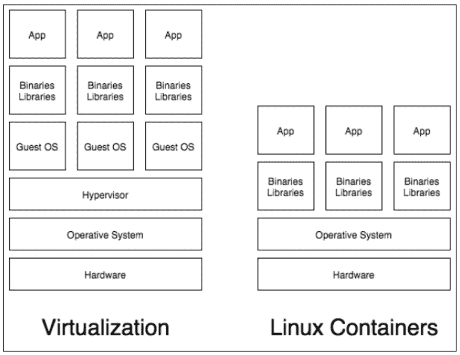
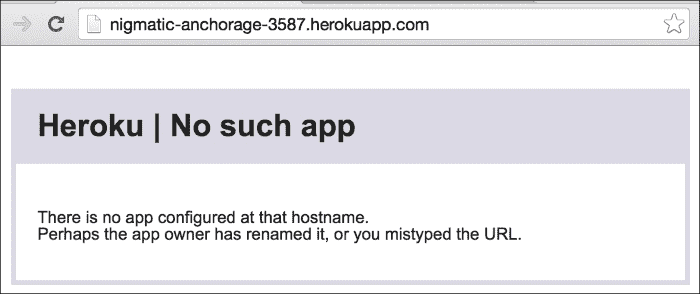
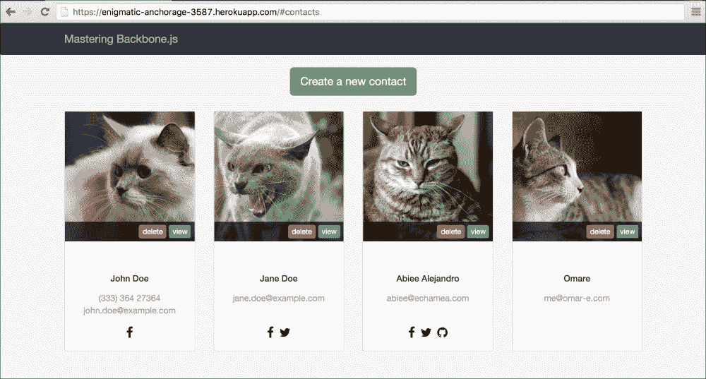
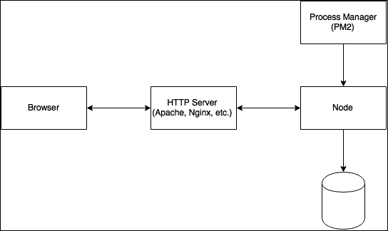
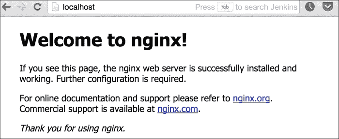
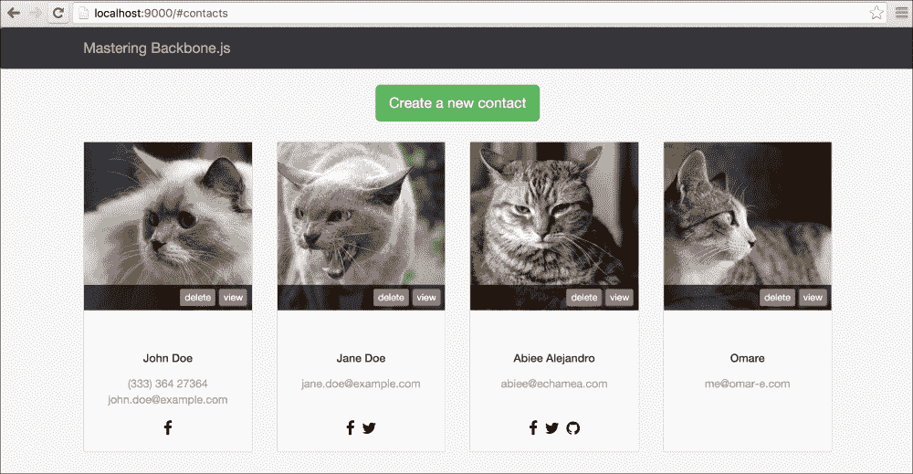

# 第九章。部署到生产环境

你已经构建了一个伟大的项目：它模块化，有测试，已经自动化以执行常见任务，最后你使用 Gulp 构建了一个生产版本；然而，现在你如何将项目部署到生产服务器？

本章将探讨如何处理你项目的生产版本。在这里，你将看到如何在生产环境中运行你的节点服务器和前端资源。

在生产模式下运行你的项目有许多选择；你可以在裸金属服务器上部署，使用虚拟机，在 DigitalOcean 或 RackSpace 等共享主机上，或者也许只是将其部署到 **PaaS**（**平台即服务**）服务，如 Heroku。

在下一节中，我们将看到如何部署到 Heroku 实例，这是部署的最简单方法，因为你不必担心服务器细节，你可以在单个配置文件中管理所有配置。

如果你已经有了自己的基础设施，或者只是喜欢与 DigitalOcean 或 RackSpace 虚拟服务器等服务器实例一起工作，我们将向你展示如何在服务器上配置生产环境，在那里你可以访问 shell。

# Heroku

Heroku 是一个 PaaS，这意味着你不必担心你部署代码的服务器配置细节，你只需关注你的代码；Heroku 将完成基础设施配置的困难工作。

与使用 shell 安装、配置和调整你的包以在生产模式下运行相比，你只需要编辑一个配置文件，然后使用标准的 `git push` 命令发布你的更改。

## Dynos

Heroku 使用轻量级的 Linux 容器来运行你的项目在 Heroku 平台上。Heroku 将这些容器称为 Dynos。一个 Dyno 可以托管你的代码，并在隔离的 Linux 环境中以单个进程运行它。

如果你没有 Linux 容器（如 Docker）的经验，你可以想象一个容器就像一个没有硬件仿真的小虚拟机；Linux 容器使用与主机机器相同的内核，这意味着你不需要仿真硬件：



图 9.1 虚拟化和容器之间的区别

默认情况下，Heroku 将使用 Celadon Cedar 栈来构建 Dynos；Celadon Cedar 栈基于 Ubuntu 发行版。考虑到这一点，你将获得一个类似 Ubuntu 的发行版，你可以在其中运行你用以下语言编写的代码：

+   Ruby on Rails

+   Node.js

+   Java 或 Spring

+   Python 或 Django

+   Clojure

+   Scala 或 Play

+   PHP

+   Go

Dyno 有三种不同的类型，如下所示：

+   **Web Dynos**：它们用于运行服务器代码并响应 HTTP 请求。

+   **工作 Dynos**：它们对于后台作业，如图像处理器非常有用。

+   **一次性 Dynos**：它们的作用是为其他两种 Dyno 类型提供维护。

如你所猜，在这本书中，我们只会使用 Node.js 的 Web Dynos 来运行我们的 `Contacts app`。

## 开始使用 Heroku

为了开始使用 Heroku，首先要做的事情是注册该服务，具体步骤如下：


图 9.2 Heroku 注册表单

一旦您在平台上注册，您需要在您的宿主机上安装 Heroku Toolbelt；有适用于 Linux、Mac OS X 和 Windows 的版本。安装过程完成后，您可以使用 `heroku` 命令对服务进行身份验证：

```js
$heroku login
Enter your Heroku credentials.
Email: your.email@example.com
Password (typing will be hidden):
Authentication successful.

```

在您通过 Heroku 服务进行身份验证后，您可以使用 create 命令开始创建 Dynos：

```js
$ heroku create
Creating enigmatic-anchorage-3587... done, stack is cedar-14
https://enigmatic-anchorage-3587.herokuapp.com/ | https://git.heroku.com/enigmatic-anchorage-3587.git
Git remote heroku added

```

当您在 Heroku 上创建一个新的 Dyno 时，它会为您的 Dyno 生成一个随机名称。在前面的示例中，名称是 `enigmatic-anchorage-3587`，您可以通过 [`enigmatic-anchorage-3587.herokuapp.com`](https://enigmatic-anchorage-3587.herokuapp.com) 访问您的 Dyno：



图 9.3 Dyno 默认输出

您可以通过将更改推送到位于 [`git.heroku.com/enigmatic-anchorage-3587.git`](https://git.heroku.com/enigmatic-anchorage-3587.git) 的 Git 服务器来部署您的应用程序。您需要将此地址添加为您的仓库中的远程服务器：

```js
$ git remote add heroku https://git.heroku.com/enigmatic-anchorage-3587.git

```

如果您现在进行推送，部署将不会工作，这是因为您需要告诉 Heroku 如何运行您的项目；这是通过一个名为 `Procfile` 的配置文件完成的，您应该将其放在应用程序根目录中：

```js
web: node server/index.js

```

代码非常简单，运行 `server/index.js` 脚本。您可以使用 `local` 命令测试配置是否正常工作；此命令在真正部署之前查找错误或问题非常有用：

```js
$ heroku local
Installing Heroku Toolbelt v4... done
Setting up iojs-v3.2.0... done
Installing core plugins heroku-apps, heroku-fork, heroku-git, heroku-local, heroku-run, heroku-status... done
Downloading forego-0.16.1 to /Users/abiee/.heroku... done
forego | starting web.1 on port 5000
web.1  | Server running

You can access the server using the browser at the http://localhost:8000/ URL. If you don't get any issues, you can make a real deployment by pushing the code at the master branch:
$ git checkout master
$ gulp build
$ git add .
$ git commit "Deployment build"
$ git push heroku master
Counting objects: 63, done.
Delta compression using up to 8 threads.
Compressing objects: 100% (57/57), done.
Writing objects: 100% (63/63), 380.85 KiB | 0 bytes/s, done.
Total 63 (delta 3), reused 0 (delta 0)
remote: Compressing source files... done.
remote: Building source:
remote:
remote: -----> Node.js app detected
remote:
remote: -----> Creating runtime environment
remote:
remote:        NPM_CONFIG_LOGLEVEL=error
remote:        NPM_CONFIG_PRODUCTION=true
remote:        NODE_ENV=production
remote:        NODE_MODULES_CACHE=true
remote:
remote: -----> Installing binaries
remote:        engines.node (package.json):  unspecified
remote:        engines.npm (package.json):   unspecified (use default)
remote:
remote:        Resolving node version (latest stable) via semver.io...
remote:        Downloading and installing node 0.12.7...
remote:        Using default npm version: 2.11.3
remote:
remote: -----> Restoring cache
remote:        Skipping cache (new runtime signature)
remote:
remote: -----> Building dependencies
remote:        Pruning any extraneous modules
remote:        Installing node modules (package.json)
...
remote: -----> Caching build
remote:        Clearing previous node cache
remote:        Saving 1 cacheDirectories (default):
remote:        - node_modules
remote:
remote: -----> Build succeeded!
remote:        ├── backbone@1.2.2
remote:        ├── body-parser@1.13.3
remote:        ├── browser-sync@2.8.2
remote:        ├── express@4.13.3
remote:        ├── http@0.0.0
remote:        ├── http-proxy@1.11.2
remote:        ├── jquery@2.1.4
remote:        ├── lodash@3.10.1
remote:        ├── morgan@1.6.1
remote:        ├── multer@1.0.3
remote:        └── underscore@1.8.3
remote:
remote: -----> Discovering process types
remote:        Procfile declares types -> web
remote:
remote: -----> Compressing... done, 25.4MB
remote: -----> Launching... done, v3
remote:        https://enigmatic-anchorage-3587.herokuapp.com/ deployed to Heroku
remote:
remote: Verifying deploy.... done.
To https://git.heroku.com/enigmatic-anchorage-3587.git

```

在输出日志中，您可以看到 Heroku 正在做什么：

+   Heroku 会检测项目的类型，以便知道如何构建正确的环境。它可能会检测到这是一个 `Node` 项目，因为存在 `package.json` 文件。

+   知道这是一个 Node 项目后，它可以为运行生产模式下的项目设置一些有用的环境变量。您可以在代码中使用 `NODE_ENV` 环境变量来使用针对生产环境的特殊配置。

+   然后，阅读 `package.json` 文件以查看要安装的节点版本。您可以使用 engines 配置指定要安装的节点版本，如下所示：

    ```js
    "engines": {
      "node": "⁰.12.21"
    },
    ```

+   在 Dyno 中安装正确的节点版本后，Heroku 将安装 `package.json` 文件中指定的项目依赖项。

+   然后，它将查找启动的 Dyno 类型的配置，并查看如何在 `Procfile` 中运行项目。

+   最后，它将压缩构建并启动项目。

一旦项目在 Heroku 基础设施中运行，您可以在 [`enigmatic-anchorage-3587.herokuapp.com/`](https://enigmatic-anchorage-3587.herokuapp.com/) 上看到结果：



图 9.4 在 Heroku 上部署的应用程序

如你所见，部署到 Heroku 基础设施非常简单，你不必担心服务器细节，如 HTTP 服务器或进程管理，这样你可以专注于应用程序开发，而无需担心基础设施。

如果你在生产中的应用程序遇到任何问题，你可以使用`logs`命令查看发生了什么：

```js
$ heroku logs –tail

```

这将显示 Heroku 服务器上的最后一条日志消息。请查阅服务的在线文档以获取更多详细信息；在这里你可以找到有关如何扩展你的应用程序、将 Dyno 实例连接到数据库等信息。

# 生产环境

如果你有一台裸金属服务器或者想要使用虚拟服务器，例如 DigitalOcean 或 Rackspace，你可以创建自己的生产环境。在本节中，你将了解如何实现这一点。

无论情况如何，因为你在这类服务器上配置生产环境的方式都是相同的。然而，请记住，这里展示的生产环境是为简单的 Web 应用程序设计的。

如果你有一个高流量的应用程序，你可以从这里开始；然而，服务器架构应该有复杂的组织。关于如何扩展你的部署的详细信息超出了本书的范围。

对于服务器，我将使用 Ubuntu 服务器，因为它是最简单且最受欢迎的应用程序部署选择。如果你熟悉其他发行版，如 CentOS，你也可以使用它；然而，说明并不相同。

下面的图显示了生产环境中**Node**服务器的典型配置：



图 9.5 部署图

由于 Node 不是构建为功能齐全且健壮的 Web 服务器，你应该在 Node 之前放置一个 HTTP 服务器来响应用户请求，而不是直接使用 Node。HTTP 服务器将请求转发到 Node 进程，并将 Node 服务器的响应返回给用户。

在前面的图中，你可以看到我们正在使用一个**进程管理器**，其工作是将 Node 进程保持运行状态；如果 Node 进程由于某种原因崩溃，**PM2**将负责处理并重启进程。

此外，你可以实时监控应用程序消耗的内存和处理器，手动重启和停止进程，检查日志等。最后，数据库的访问是从**Node**服务器进行的。

当用户从其浏览器发起请求时，服务器将按以下方式处理请求：

+   客户端向服务器主机发送请求

+   HTTP 服务器接收请求

+   HTTP 服务器将请求转发到 Node 服务器

+   Node 进程处理其内部请求过程

+   Node 进程向 HTTP 服务器返回答案

+   HTTP 服务器将答案转发给客户端

+   客户端接收请求

在接下来的章节中，我们将探讨如何安装和配置所有组件，以便运行 Node 应用程序。我们将使用**Ubuntu-14.04**虚拟机来执行安装过程。如果您有不同的环境，配置内容应该仍然有效；然而，安装说明和配置文件的存放位置可能会有所不同。

# HTTP 服务器

HTTP 服务器处理与客户端的连接，并将所有请求转发到 Node 服务器。在某种程度上，它是一种代理。目前，市场上主要有两个广泛用于生产的 HTTP 服务器：Apache 和 Nginx，两者都可以用于托管 Node 应用程序。然而，在这本书中，我们将介绍 Nginx。做出这个决定的主要原因是它的简单性和性能，并且它比 Apache 小。

要安装 Nginx，请使用`apt-get`：

```js
$ sudo apt-get install nginx
[sudo] password for abiee:
Reading package lists... Done
Building dependency tree
Reading state information... Done
The following extra packages will be installed:
 nginx-common nginx-core
Suggested packages:
 fcgiwrap nginx-doc
The following NEW packages will be installed:
 nginx nginx-common nginx-core
0 upgraded, 3 newly installed, 0 to remove and 30 not upgraded.
Need to get 348 kB of archives.
After this operation, 1297 kB of additional disk space will be used.
Do you want to continue? [Y/n] Y

```

在 Nginx 服务器安装后，Ubuntu 将自动启动服务器；然而，您可以使用服务命令管理服务器守护进程：

```js
#Start the nginx server
$ sudo service nginx start
#Stop the nginx server
$ sudo service nginx stop
#Restart the nginx server
$ sudo service nginx restart

```

您可以通过将浏览器指向服务器 IP 来检查服务器是否正在运行，如下面的截图所示：



图 9.6 Nginx 全新安装

Nginx 配置文件位于`/etc/nginx`，在这个路径中还有两个子路径，如下所示：

+   **sites-available**：每个文件都是一个单一主机的配置（子域名）。请注意，这些文件在未放入 sites-enabled 之前不是活动的。

+   **sites-enabled**：虽然 sites-available 包含一组配置文件，但 sites-enabled 是一组实际激活的网站。

要创建一个新的网站，您需要在 sites-available 路径中创建一个新的配置文件：

```js
$ sudo editor /etc/nginx/sites-available/webapp

```

配置内容如下所示：

```js
upstream webapp {
  server 127.0.0.1:8000;
}

server {
  listen 80 default_server;

  # Configure logs
  access_log /var/log/nginx/webapp.access.log;
  error_log /var/log/nginx/webapp.error.log;

  # Make site accessible from http://www.example.com/
# server_name localhost;
  server_name www.example.com;

  location / {
    # Proxy headers
    proxy_set_header X-Real-IP $remote_addr;
    proxy_set_header X-Forwarder-For $proxy_add_x_forwarded_for;
    proxy_set_header Host $http_host;
    proxy_set_header X-NginX-Proxy true;

    # Proxy to Nodejs
    proxy_pass http://webapp;
    proxy_redirect off;
  }
}
```

Nginx 的上游模块定义了一个或一组服务器，这些服务器可以通过`proxy_pass`进行引用，这意味着当请求到达 Nginx 时需要击中的目标。服务器配置创建了一个新的虚拟主机，监听对`server_name`地址的请求。在这种情况下，它正在监听`www.example.com`。

在`location`块中，它描述了如何处理请求；在先前的示例中，它将请求转发到指向`127.0.0.1:8000`的`webapp`上游。要激活网站，您需要将此文件的 内容链接到`sites-enabled`路径：

```js
$ sudo ln -s /etc/nginx/sites-available/webapp /etc/nginx/sites-enabled/

```

可能您需要删除之前启用的默认网站：

```js
$ sudo rm /etc/nginx/sites-enabled/default

```

然后重新启动 Nginx 服务器以加载新的配置：

```js
$ sudo service nginx restart

```

如果一切正常，服务器将启动：



图 9.7 Nginx 在没有 node.js 工作的情况下运行

上一张图片显示了一个`502`错误，这是因为 Nginx 服务器指向了具有`127.0.0.1:8000`地址的`proxy_pass`设置；然而，在那个套接字上没有任何东西在运行。你需要有一个东西在`127.0.0.1:8000`套接字上监听请求，因此，你应该在同一主机上运行项目，这样`502`错误就会消失：

```js
$ npm install --production
$ nodejs app.js

```

这应该足以让服务器工作。然而，我们不想每次都手动运行`app.js`脚本，有一个更好的方法可以自动启动 Node 进程。

# 不要以 root 身份运行

以 root 身份运行服务器进程可能很危险。如果有人发现 node 或你的应用程序代码中的漏洞，那么他们可能会对系统造成严重损害。创建一个仅用于运行应用程序服务器的用户总是一个好主意：

```js
$ sudo useradd -m production

```

`m`选项将在`/home/production`位置创建一个家目录，你可以在这里克隆项目仓库：

```js
$ sudo su - production
$ cd ~
$ git clone https://example.com/path/to/the/project.git

```


图 9.7 运行 node.js 进程后

# 进程管理

任何时候你在电脑上运行一个程序，它都可能因为许多原因而失败：可能它所依赖的服务器已经关闭，或者更糟糕的是，一个未处理的异常可能会终止正在运行的进程。这对生产应用来说是非常糟糕的，因为你直到注意到服务器不工作之前，你的用户都没有服务器可用。

这就是进程管理器发挥作用的地方，你可以在进程管理器后面运行你的代码，并且它会确保进程始终在运行。如果出现问题并导致程序崩溃，进程管理器将自动重置整个应用程序。

对于 Node 有两个流行的进程管理器：`forever`和`pm2`，它们的工作方式类似；然而，`pm2`似乎更受欢迎，并且提供了比以往更多的实用工具。因此，我们将使用`pm2`作为栈。

Ubuntu 自带一个名为 Upstart 的集成进程管理器。你可以使用操作系统的进程管理器；然而，`pm2`专注于 Node 应用，它允许你运行多个进程实例，而不是只运行一个进程。

你可以使用`npm`工具安装`pm2`，别忘了将其安装为全局包：

```js
$ npm install -g pm2

```

安装完成后，你可以使用`start`命令在`pm2`后面运行你的进程：

```js
$ pm2 start app.js
[PM2] Starting app in fork_mode (1 instance)
[PM2] Done.
┌──────────┬────┬──────┬───────┬────────┬─────────┬────────┬─────────────┬──────────┐
│ App name │ id │ mode │ pid   │ status │ restart │ uptime │ memory      │ watching │
├──────────┼────┼──────┼───────┼────────┼─────────┼────────┼─────────────┼──────────┤
│ app      │ 0  │ fork │ 16427 │ online │ 0       │ 0s     │ 15.801 MB   │ disabled │
└──────────┴────┴──────┴───────┴────────┴─────────┴────────┴─────────────┴──────────┘
 Use `pm2 show <id|name>` to get more details about an app

```

在你完成这个步骤后，脚本开始运行，你可以通过日志命令和应用 ID 查看进程的输出：

```js
$ pm2 logs 0
[PM2] Tailing last 20 lines for [0] process

app-0 (out): Server running
app-0 (out): GET / 200 5.911 ms - 8908
app-0 (out): GET /css/vendor.css 200 2.740 ms - 131
app-0 (out): GET /js/app.js 200 3.821 ms - 396191
app-0 (out): GET /api/contacts 200 2.528 ms - 55

[PM2] Streaming realtime logs for [0] process

```

你可以用名称而不是进程的原始 ID 来命名你的运行进程：

```js
$ pm2 start app.js --name app

```

你也可以运行多个实例，这样你就可以有两个相同应用正在运行的实例，`pm2`将在它们之间加载和平衡请求：

```js
$ pm2 start app.js --name app –i 2

```

运行多个 Node 服务器实例是一个好主意，因为 Node 阻塞正在进行的 I/O 操作。如果你运行多个实例，那么其他进程可以在另一个被阻塞时继续服务传入的请求。

你可以将应用程序参数保存到 JSON 文件中，并使用它而不是在命令行中放置所有选项：

```js
{
  "apps": [{
    "name": "contacts-app",
    "script": "/path/to/the/application/app.js",
    "cwd": "/path/to/the/application",
    "watch": false,
    "instances": 2,
    "error_file": "/path/to/your/home/contacts-app/app-err.log",
    "out_file": "/path/to/your/home/app-out.log",
    "pid_file": "//path/to/your/home/app.pid"
    "env": {
      "NODE_ENV": "production"
    }
  }]
}
```

使用 JSON 文件，你有这样的优势，你不必记住如何运行应用程序，因为文件包含所有必需的配置，并且相同的环境可以轻松地在不同的主机上重现。

如果你对设置满意，并且一切按预期工作，下一步就是将`pm2`进程持久化，以便每次服务器重启时都作为守护进程运行；这总是一个好主意，因为如果服务器因某种原因（如维护）重启，你的进程将自动启动。

幸运的是，`pm2`提供了一个简单的方法，使用`startup`命令为许多操作系统守护化你的配置，如下所示：

```js
$ pm2 startup -h

 Usage: startup [options] [platform]

 auto resurrect process at startup. [platform] = ubuntu, centos, redhat, gentoo, systemd, darwin, amazon
$ sudo env PATH=$PATH:/usr/local/bin pm2 startup ubuntu -u production
[PM2] Generating system init script in /etc/init.d/pm2-init.sh
[PM2] Making script booting at startup...
[PM2] -ubuntu- Using the command:
 su -c "chmod +x /etc/init.d/pm2-init.sh && update-rc.d pm2-init.sh defaults"
 System start/stop links for /etc/init.d/pm2-init.sh already exist.
[PM2] Done.

```

第一个命令显示了可用的操作系统。由于`startup`命令写入`/etc/`路径，我们需要以 root 用户运行此命令，这就是为什么我们使用 sudo 命令的原因。

要运行守护进程，你需要运行以下命令：

```js
$ service pm2-init.sh start

```

然而，在运行此命令之前，你需要在守护进程配置中导出你的当前配置，如果你跳过此步骤，服务将不会启动任何进程：

```js
$ pm2 start process.json
$ pm2 save
[PM2] Dumping processes

```

使用此命令，每次服务器重启或你手动重启服务时，都将使用`pm2`的当前配置。

这就是你在生产环境中运行你的 Node 应用程序的方法；运行一个真实的 HTTP 服务器，并在其后面运行你的 Node 进程，借助像`pm2`这样的进程管理器。

# 摘要

在本章中，我们看到了如何在 Heroku 平台以及裸机或虚拟机服务器上运行 Node 应用程序，这两种部署 Node 应用程序的方法很简单；然而，它们是更复杂部署的基础。例如，你可以在 Docker 容器上进行部署。使用 Docker，你需要知道如何像我们一样在你的新鲜 Linux 安装中安装你的应用程序，然后，像 Heroku 一样管理容器作为进程。

在本章中，我们没有看到很多与 Backbone 相关的内容；然而，如果你有一个由 Node 支持的 Backbone 应用程序，你可能希望将你的代码部署到生产环境中。在本章中，我们看到了如何将分发文件的输出部署到生产服务器。
