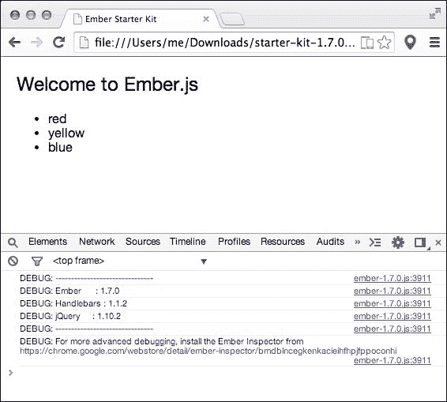
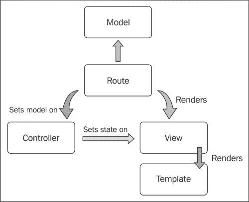

# 第一章：Ember.js 简介

本章将介绍**Ember.js**，包括其起源、发布周期及其关键元素。它将专注于描述一旦创建应用程序后可以执行的不同功能。因此，在章节结束时，您将更好地理解以下内容：

+   Ember.js 的起源

+   下载 Ember.js 及其依赖项

+   创建基本的 Ember.js 应用程序

+   Ember.js 应用程序概念

# Ember.js 的起源

Ember.js 是一个用于创建雄心勃勃的 Web 应用程序的有趣且高效的开源 JavaScript 框架。它通过使用常见的 Web 约定而不是琐碎的配置来保证开发效率。它的官方网站是[`emberjs.com`](http://emberjs.com)。

它是由 Yehuda Katz 和 Tom Dale 从 SproutCore 分叉出来的。SproutCore 是一个力求提供类似 Apple 的 Cocoa API 用于 Max OS X 的强大 JavaScript 小部件工具包的 MVC 框架。额外的用户界面小部件功能被发现对大多数开发者来说是不必要的，因此进行了分叉。结果是，一个更轻量级、易于使用的库，同时仍然实现了以下承诺：

+   减少开发时间

+   通过使用常见的客户端 Web 应用程序开发最佳实践来创建健壮的应用程序

+   友好的 API 使客户端编程变得有趣

Ember.js 具有广泛的应用范围。它非常适合显示动态数据和具有增强用户交互的应用程序。这些应用程序包括任务管理器、仪表板、论坛、聊天和消息应用程序等。想想 Gmail、Facebook 和 Twitter 这样的应用程序。话虽如此，Ember.js 并不适合静态网站。

Ember.js 被世界各地的许多公司使用，包括但不限于 Apple、Groupon、Square、Zendesk 和 Tilde Inc.

# 下载 Ember.js

最常被问到的一个问题就是，我从哪里下载 Ember.js？该库的最稳定版本可以从[`emberjs.com/builds/#/release`](http://emberjs.com/builds/#/release)下载。然而，主页([`emberjs.com/`](http://emberjs.com/))通常包含一个指向包含所需依赖项的入门套件的链接。在撰写本书时，Ember.js 的当前稳定版本是 1.7.0，我们将全书使用这个版本。在我们的情况下，我们将使用来自[`github.com/emberjs/starter-kit/archive/v1.7.0.zip`](https://github.com/emberjs/starter-kit/archive/v1.7.0.zip)的相应入门套件，您应该下载并解压缩到您的工作目录中。

升级 Ember.js 变得容易多了。新版本通常在[`emberjs.com/blog/tags/releases.html`](http://emberjs.com/blog/tags/releases.html)上宣布，并详细讨论发布中可以期待的内容。

现在，在解压缩提供的入门套件后，在`js/libs`目录下，我们注意到运行 Ember.js 的两个基本要求：

+   **jQuery**：Ember.js 使用 jQuery 进行基本功能，如 HTTP 请求、DOM 操作和事件管理。jQuery 是最受欢迎的 DOM 操作库；因此，有经验的读者会感到很自在。这也意味着我们可以轻松地将我们喜欢的第三方 jQuery 库集成到我们的 Ember.js 应用程序中。

+   **Handlebars**：这是 Ember.js 使用的模板引擎库，通过自动更新和更好的用户交互向用户显示响应式页面。值得注意的是，我们仍然可以通过一些努力使用其他模板引擎，如 Ender 或 Jade。

索引文件以以下方式加载这些文件：

```js
  <script src="img/jquery-1.10.2.js"></script>
  <script src="img/handlebars-1.1.2.js"></script>
  <script src="img/ember-1.7.0.js"></script>
  <script src="img/app.js"></script>
```

`app.js`文件包含我们所有的应用程序代码，但随着应用程序的增长，我们可能会将应用程序的关注点分离到更多的文件中。值得注意的是，脚本加载的顺序很重要。一旦页面加载，Ember.js 会记录使用的依赖项及其版本，如下面的截图所示：



两个库和 Ember.js 可以从全局作用域作为`jQuery`（或`$`）、`Handlebars`和`Ember`（或`Em`）分别访问，如下面的代码所示：

```js
console.log(jQuery);
console.log(Handlebars);
console.log(Ember);
```

### 小贴士

**下载示例代码**

您可以从[`www.packtpub.com`](http://www.packtpub.com)的账户下载您购买的所有 Packt 书籍的示例代码文件。如果您在其他地方购买了这本书，您可以访问[`www.packtpub.com/support`](http://www.packtpub.com/support)并注册，以便将文件直接通过电子邮件发送给您。

# 创建您的第一个应用程序

入门套件中的应用程序脚本文件（`js/app.js`）包含一个基本的 Ember.js 应用程序。如果您在浏览器中加载`index.html`文件，您应该看到显示的三种主要颜色：

```js
App = Ember.Application.create();

App.Router.map(function() {
  // put your routes here
});

App.IndexRoute = Ember.Route.extend({
  model: function() {
    return ['red', 'yellow', 'blue'];
  }
});
```

导致这一结果的是哪些步骤？

+   首先，创建了一个 Ember.js 应用程序，然后创建了路由器。

+   负责状态管理的路由器将应用程序转换成两种状态，第一种是应用程序状态。这种状态导致应用程序模板被渲染到 DOM 中，因此出现了**欢迎使用 Ember.js**的消息。

+   取代应用程序状态的是索引状态，其路由`App.IndexRoute`在应用程序模板内渲染了索引模板。

+   索引路由还提供了模板、列表和颜色作为模型上下文。

这可以总结如下图所示：



仅此一个示例就介绍了以下一些关键的 Ember.js 概念。

## 路由器

路由器协调应用程序的状态与浏览器的位置。它支持传统的 Web 功能，例如使用浏览器的后退和前进按钮导航应用程序的历史记录，以及通过链接返回到应用程序。

根据当前的 URL，它调用匹配的路由，在页面上渲染多个嵌套模板。每个模板都有一个模型上下文。路由器在初始化时自动创建。因此，我们只需要调用其`map`方法来定义应用程序路由，如下面的代码所示：

```js
App.Router.map(function() {
  // put your routes here
});
```

### 路由

路由主要负责提供模板的模型上下文。它由`Ember.Route`类定义，如下所示：

```js
App.IndexRoute = Ember.Route.extend();
```

它将在第三章中广泛介绍，*路由和状态管理*。

## 控制器

控制器代理由路由提供的模型，并进一步用显示逻辑装饰它们。它们也是通过显式依赖指定在不同应用程序状态之间的通信渠道，正如我们将在第五章中学习的那样，*控制器*。要创建控制器，我们扩展`Ember.Controller`类，如下面的代码行所示：

```js
App.IndexController = Ember.Controller.extend();
```

## 视图

视图用于管理事件。它们将用户生成的事件委派回控制器和路由。视图通常用于集成其他 DOM 操作库，例如第三方 jQuery 包。它们通常从`Ember.View`类创建：

```js
App.IndexView = Ember.View.extend();
```

我们将在第六章中详细讨论它们，*视图和事件管理*。

### 模板

模板是一组编译成 HTML 并渲染到 DOM 中的表达式。模板通常使用以下签名定义：

```js
<script type="text/x-handlebars" id="index">
<!-- our template goes in here -- >
</script>
```

### 组件

组件是 Ember.js 中的一个新概念，它根据**W3C Web Components**规范允许创建可重用元素。这些元素理想上不是特定于应用程序的，因此可以在其他应用程序中重用。

# 初始化应用程序

Ember.js 应用程序通过实例化`Ember.Application`类来创建：

```js
App = Ember.Application.create();
```

当应用程序首次创建时，会发生一些事情。

为我们定义视图、控制器和路由的应用程序创建了一个新的命名空间。这防止了我们污染全局作用域。因此，定义一个路由，例如，应该附加到它上，如下所示：

```js
App.IndexRoute = Ember.Route.extend({
  model: function() {
    return ['red', 'yellow', 'blue'];
  }
});
```

Ember.js 通常通过调用其`initialize`方法来初始化应用程序。可以通过调用应用程序的`deferReadiness`方法来延迟初始化，然后通过`advanceReadiness`重新开始。例如，假设我们的应用程序需要先加载 Google 客户端库，如下所示：

```js
<script src="img/client.js?onload=onLoadCallback">< /script>
<script src="img/app.js">
```

这是我们的应用程序在库加载后立即完成其准备的方式：

```js
App = Em.Application.create();
App.deferReadiness();
window.onLoadCallback = function(){
  App.advanceReadiness();
}
```

现在我们应用程序准备使用 SDK，我们将通过一个初始化器加载任何当前登录的用户。初始化器在应用程序初始化时被调用，因此是执行各种功能的好机会，例如使用应用程序的容器注入依赖。这个容器用于组织应用程序内的不同组件，可以按以下方式引用：

```js
App.__container__
```

例如，内部，可以按以下方式访问路由的一个实例：

```js
App.__container__.lookup('route:index');
```

由于我们现在已经加载了第三方库，我们可以继续创建一个用户初始化器，该初始化器将加载任何当前登录的用户：

```js
Ember.Application.initializer({
  name: 'user',
  initialize: function(container, App) {

    var user = new Ember.RSVP.Promise(function(resolve, reject) {

      var opts = {
        'client_id': '-- --',
        'scope': 'email',
        'immediate': false
      };
      gapi
        .auth
        .authorize(opts, function(res){

          if (!res || res.error) {
            return reject();
          }
          resolve(res);
        });

    });

    container.register('user:main', user);
    container.lookup('user:main');
  }
});

Ember.Application.initializer({
  name: 'injectUser',
  initialize: function(container, App) {
    container.typeInjection('controller', 'user', 'user:main');
    container.typeInjection('route', 'user', 'user:main');
  }
});
```

这两个模块演示了在前面代码中提到的应用程序容器的两种用途。第一个展示了如何注册一个可访问的应用程序组件；在这种情况下，用户现在将按以下方式访问：

```js
App.__container__.lookup('user:main');
```

此用户最初在初始化器中作为一个承诺。**承诺**是一个有状态的对象，其值可以在稍后的时间点设置。我们将在本章中不深入讨论承诺，但有一点需要注意，一旦登录过程完成，登录回调 `gapi.auth.authorize` 要么拒绝要么解决承诺。解决承诺将用户对象从挂起状态转换为满足状态。

第二个模块演示了依赖注入，这是我们之前也讨论过的。在这种情况下，我们现在将能够通过以下代码在路由和控制器中访问此用户：

```js
this.get('user');
```

## 嵌入 Ember.js 应用程序

可以通过指定应用程序的 `rootElement` 将 Ember.js 应用程序嵌入到现有页面中。此属性是一个 jQuery 选择器。例如，要将应用程序嵌入到 `#chat-container` 元素中，请使用以下代码行：

```js
App = Ember.Application.create({
   rootElement: '#chat-container'
});
```

当我们创建此类应用程序（如小部件）时，这很有用。指定根元素确保只有在该元素内部引发的事件才由 Ember.js 应用程序管理。

# 摘要

本章是 Ember.js 的入门指南。它侧重于介绍构成 Ember.js 应用程序的关键元素。这些元素继承自 `Ember.Object` 原始类型，这将在下一章中讨论。
