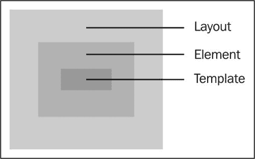

# 第六章。视图和事件管理

我们在前两章讨论了模板和控制器。我们注意到控制器呈现模型，这些模型由模板渲染给用户。我们还了解到，当用户与应用程序交互时，模板通常会使用动作模板助手将这些事件传播回控制器。实际上，这些动作表达式是视图，最初将事件委托给控制器，然后委托给路由。因此，在本章中，我们将学习如何将视图直接集成到模板中，特别是当出现以下应用程序需求时：

+   应用程序的一个部分需要复杂的事件管理

+   需要构建可重用的组件

+   应用程序需要集成第三方库

因此，到本章结束时，你应该能够：

+   定义视图

+   创建视图实例

+   自定义视图

+   在视图中管理事件

+   使用内置视图

+   使用第三方库

如第一章所述，我们很少需要定义视图，除非我们确实需要严格控制 DOM 结构。在下一章中，我们将讨论如何使用 ember 组件，它是视图的高级结构。

# 定义视图

应用程序中的视图通过数据绑定和委托用户发起的事件来管理模板。就像控制器一样，视图类是从基类 `Ember.View` 定义的：

```js
var View = Ember.View.extend({});
```

通过调用视图的 `create` 方法可以创建先前视图的实例：

```js
var view = View.create();
```

我们仍然可以从已经定义的类中创建额外的视图，如下面的代码所示：

```js
var UserView = View.extend({
  isLoggedIn: true,
  isAdmin: false
});
```

到现在为止，我们已经知道 Ember.js 类可以接受任何数量的混合，如前例所示。然而，使用混合创建的实例始终使用 `createWithMixins` 方法：

```js
var mixinA = Ember.Mixin.create({
  isLoggedIn: true
});

var mixinB = Ember.Mixin.create({
  isAdmin: false
});

var userView = View.createWithMixins(mixinA, mixinB);
```

# 访问视图的控制器

视图通常由相应控制器的实例支持。一旦视图被插入到 DOM 中，相应的控制器可以通过 `controller` 属性访问，如下面的示例所示：

```js
view.get('controller').getSortedBooks();
```

# 指定视图的模板

每个视图都将模板渲染到 DOM 中。视图可以通过多种方式分配要使用的模板。例如，让我们考虑以下路由：

```js
App.Router.map(function(){
  this.route('new');
});
```

Ember.js 预期新路由将有一个定义的 `App.NewRoute` 类：

```js
App.NewRoute = Ember.Route.extend({
  model: function(){
    return Em.Object.create();
  }
});
```

如果定义了此路由，任何访问此路由的操作都将使用以下 Ember.js 对象：

+   `App.NewController` 对象

+   `Ember.TEMPLATES.new` 模板

+   `App.NewView` 对象

默认行为是模板的名称决定了要使用的视图。如果我们希望使用不同的模板，例如 `Ember.TEMPLATES.form`，我们将在路由的 `renderTemplates` 钩子中实现它，如下所示：

```js
App.NewRoute = Ember.Route.extend({
  model: function(){
    return Em.Object.create();
  },
  renderTemplate: function(controller, model){
    this.render('form');
  }
});
```

如预期的那样，此路由将使用 `App.FormView` 视图类。使用的模板通常作为脚本标签包含在应用程序中。例如，我们可以定义将用于 `App.NewView` 的新模板，如下所示：

```js
<script type='text/x-handlebars' id='new'>
<input name='name' >
<input name='gender' >
<button type='submit'>save</button>
</script>
```

注意，之前的模板仍然可以通过 `Ember.TEMPLATES.new` 访问。因此，指定视图模板的另一种方法是通过实用地更新其值来使用所需的编译模板，如下面的代码所示：

```js
var template = [
 '<input name='name' >',
 '<input name='gender' >',
'<button type='submit'>save</button>'
].join('');

Ember.TEMPLATES['new'] = Ember.Handlebars.compile(template);
```

在生产环境中，建议在服务器端编译这些模板，然后为了性能原因将它们捆绑起来。我们仍然可以通过视图类上的 `templateName` 属性指定模板，例如：

```js
<script type='text/x-handlebars' id='form'>
   <input name='name' >
   <input name='gender' >
   <button type='submit'>save</button>
</script>

   App.NewView = Ember.View.extend({
     templateName: 'form'
  });
```

# 指定视图的元素标签

视图的模板通常默认包裹在一个 `div` 元素中，如下面的示例所示：

```js
<div>{{name}}</div>
<div>{{gender}}</div>
```

这会产生以下结果：

```js
<div id='ember10' class='ember-view'>
  <div>Jon Doe</div>
  <div>Male</div>
</div>
```

可以使用 `view` 类的 `tagName` 属性来更改元素类型，如下面的代码所示：

```js
var View = Ember.View.extend({
  templateName: 'user',
  tagName: 'header'
});
```

之前的代码片段将产生类似以下的结果：

```js
<header div id='ember10' class='ember-view'>
  <div>Jon Doe</div>
  <div>Male</div>
</header>
```

# 更新视图的元素类属性

在上一节中，我们了解到视图通常被包裹在一个可配置的 DOM 元素中。元素的类属性也可以使用视图的 `classNames` 数组属性静态指定。例如，可以创建一个 Twitter Bootstrap 按钮，如下所示：

```js
var view = Ember.View.extend({
  tagName: 'button',
  classNames: ['btn', 'btn-primary]
});
```

这将产生类似以下的结果：

```js
<button class='btn btn-primary'>Button</button>
```

元素的类也可以使用视图的 `classNameBindings` 数组属性动态更改，如下面的代码所示：

```js
var View = Ember.View.extend({
  tagName: 'button',
  classNames: ['btn'],
  classNameBindings: ['btnWarning'],
  btnWarning: true
});
```

这个示例会产生以下结果：

```js
<button class='btn btn-warning'>Button</button>
```

这些类名按照 Ember.js 命名约定进行了连字符化。因此，`btnWarning` 属性映射到 `btn-warning` 类名。

有时，你可能希望根据给定的状态指定要使用的类名。例如，我们在第四章中学习了这一点，*编写应用模板*：

```js
var View = Ember.View.extend({
  tagName: 'button',
  classNames: ['btn'],
  classNameBindings: ['warn:btnWarning'],
  warn: true
});
```

在前面的示例中，`btn-warning` 类将被添加到元素的类属性中，这是基于视图的 `warn` 属性。

最后，我们可以根据某种状态添加不同的类。例如，假设我们想要显示 Bootstrap 按钮的不同状态。这可以通过以下签名实现：

```js
classNameBindings: ['property:truthyClassName:falsyClassName'],
```

例如：

```js
var View = Ember.View.extend({
  tagName: 'button',
  classNames: ['btn'],
  classNameBindings: ['controller.warn:btnWarning:btnPrimary'],
});
```

在前面的示例中，当视图控制器的 `warn` 属性变为 `true` 时，将产生以下结果：

```js
<button class='btn btn-warning'>checkout</button>
```

否则，将使用其他类：

```js
<button class='btn btn-primary'>checkout</button>
```

到现在为止，你可能会注意到绑定行为与我们之前在第四章中学习的类似。

# 更新其他视图的元素属性

除了类属性之外，视图元素的其余属性也可以动态更改。例如，让我们创建一个缩略图视图，如下面的代码所示：

```js
var thumb = Ember.View.create({
  tagName: 'img',
  attributeBindings: ['width', 'height', 'src'],
  width: 50,
  height: 50,
  src: 'http://www.google.com/doodles/new-years-day-2014'
});
```

这会产生以下结果：

```js

```

可以使用绑定的布尔属性来改变属性的存在性。例如，我们可以禁用表单中相应输入未填写时的 `save` 按钮，如下面的示例所示：

```js
// view

App.FormButton = Em.View.extend({
  tagName: 'button',
  attributeBindings: ['disabled'],
  disabled: function(){
     return !this.get('controller.model.title');
  }.property('controller.model.title')
});

// route

App.NewRoute = Em.Route.extend({
  model: function(){
    return Em.Object.create({
   });
  }
});

{{! new template }}

<form {{action 'save' model on='submit'}}>
  {{input value=model.title}}
  {{#view App.FormButton}}save{{/view}}
</form>
```

当模型的 `title` 属性未定义时，视图的禁用属性将为真。因此，视图的元素将获得禁用属性，反之亦然。这个例子允许用户仅在表单有效时提交表单。请注意，定义的视图可以重新实现为：

```js
App.FormButton = Em.View.extend({
  tagName: 'button',
  attributeBindings: ['modelIsValid::disabled'],
  modelIsValid: function(){
     return !this.get('model.title');
  }.property('model.title')
});
```

这个例子表明，任何属性，在这个例子中是 `modelIsValid`，都可以用来提供在状态改变时显示或隐藏的属性，只要它使用以下签名指定：

```js
"propertyName:attributeWhenTrue:attributeWhenFalse" 
```

# 将视图插入到 DOM 中

我们刚刚了解到，视图有模板，它们将渲染到 DOM 中。需要手动执行此操作的应用程序需要利用视图实例的 `appendTo` 方法，如下面的示例所示：

```js
view.appendTo('#header');
```

此方法接受一个 jQuery 查询选择器，这是我们已经在以下示例中熟悉的，如下所示：

```js
view.appendTo('header');
view.appendTo('#header');
view.appendTo('.header');
view.appendTo('body > header');
```

注意，只使用了一个匹配的元素。因此，在第三个例子中，视图将被插入到最后找到的 `header` 元素中。

为了方便起见，视图有一个 `append` 方法，可以直接将其插入到 DOM 的主体部分：

```js
view.append(); // appends view to the body section
```

您可能还希望使用 `remove` 方法从 DOM 中移除视图，如下所示：

```js
view.remove();
```

注意，如果视图被销毁，它将自动从 DOM 中移除，如下面的代码行所示：

```js
view.destroy();
```

# 将视图插入到模板中

视图是分层的，因此它们可以插入到构成模板层次结构的其他视图的模板中，这是我们讨论过的第四章，*编写应用程序模板*。例如，考虑以下应用程序模板：

```js
<script type='text/x-handlebars' id='application'>
{{view App.HeaderView}}
{{view App.FooterView}}
</script>
```

如所示，定义的视图使用 `view` 表达式插入到所需的模板中。这些 `view` 表达式也可以被包裹在块子句中，如下面的代码所示。然后可以在此块表达式中插入额外的视图：

```js
{{! application template}}
<script type='text/x-handlebars' id='application'>

 {{view App.HeaderView}}

 {{#view App.ContentView}}
   {{view App.SideView}}
   {{view App.PaneView}}
 {{/view}}

 {{view App.FooterView}}

</script>
```

# 指定视图布局

我们已经了解到，视图的模板被包裹在一个元素中，这通常由 `tagName` 属性指定。此外，此模板还可以被另一个模板包裹，如下面的图所示：



通过添加 `yield` 表达式，可以将模板标记为布局，如下面的代码所示：

```js
<script type='text/x-handlebars' id='container'>
  <div id='container'>
   {{yield}}
  </div>
</script>
```

就像 `outlet` 表达式一样，`yield` 表达式充当被包裹的模板将被插入的部分。然后我们在视图中指定此布局：

```js
var View = Ember.View.extend({
  tagName: 'section',
  layoutName: 'container',
  templateName: 'book'
});
```

假设我们的 `book` 模板如下：

```js
<script type='text/x-handlebars' id='book'>
  <p>Author: Jon Doe</p>
   </script>
```

这将产生以下结果：

```js
<div id='container'>
 <section>
  <p>Author: Jon Doe</p>
 </section>
   </div>
```

重要的是要注意，具有自闭合 HTML 元素的视图不能有布局。这些视图包括 `<input>` 和 ``。

# 在视图中注册事件处理器

视图可以在它们渲染的模板中的元素上注册事件处理器，除了使用 `action` 模板表达式。例如，让我们重用第四章的一个例子，*编写应用程序模板*：

```js
  <button {{action 'checkout'}}>checkout</button>
```

此示例可以轻松地重新实现为一个视图，如下面的代码所示：

```js
App.CheckoutButton = Ember.View.extend({
  tagName: 'button',
  click: function(event){
    this.get('controller').send('checkout');
  }
});

{{! template }}
{{#view App.CheckoutButton }}checkout{{/view}}
```

在此示例中，我们创建了一个自定义按钮视图，注册了一个点击事件处理程序。

每个视图仅管理从其模板调用的事件。然而，子视图通常将事件冒泡到父视图，直到根元素，直到事件被处理。

Ember.js 支持以下事件：

| 触摸事件 | 键盘事件 | 鼠标事件 | 表单事件 | HTML5 拖放事件 |
| --- | --- | --- | --- | --- |
| `touchStart` | `keyDown` | `mouseDown` | `submit` | `dragStart` |
| `touchMove` | `keyUp` | `mouseUp` | `change` | `drag` |
| `touchEnd` | `keyPress` | `contextMenu` | `focusIn` | `dragEnter` |
| `touchCancel` |   | `click` | `focusOut` | `dragLeave` |
|   |   | `doubleClick` | `input` | `drop` |
|   |   | `mouseMove` |   | `dragEnd` |
|   |   | `focusIn` |   |   |
|   |   | `focusOut` |   |   |
|   |   | `mouseEnter` |   |   |
|   |   | `mouseLeave` |   |   |

现在是尝试编写使用这些事件之一的视图的好机会。

# 从视图中发出动作

我们已经了解到，视图通过 `controller` 属性引用上下文控制器。视图可以使用控制器的 `send` 方法将用户发起的事件委派给相应的路由，如下面的示例所示：

```js
App.CheckoutButton = Ember.View.extend({
  tagName: 'button',
  click: function(event){
    this.get('controller').send('checkout');
  }
});
```

# 使用内置视图（组件）

在 第四章，*编写应用程序模板*中，我们承诺要讨论 Ember.js 提供的内置视图。其中大部分是高级视图（组件），从控件中保证了表单设计的无痛苦。

## 文本字段

文本字段视图用于在表单中创建一个绑定文本输入。它通常由 `Ember.TextField` 类创建。我们可以通过实现视图的 `change` 事件处理程序来订阅输入值的变化，如下面的代码所示：

```js
App.InputView = Ember.TextField.extend({
  change: function(event){
    console.log(this.get('value')); 
  }
});
```

就像任何其他视图一样，我们可以将此视图插入到模板中，如下所示：

```js
{{view App.InputView name='name' valueBinding='controller.name'}}
```

在此示例中，我们创建了一个文本输入框，每当其值发生变化时，都会更新上下文控制器的名称属性。这是此类视图的许多用例之一。

## 文本区域

文本区域与文本字段非常相似，两者都接受一些额外的属性，例如 `rows` 和 `cols`，例如：

```js
{{view Ember.TextArea name='content' valueBinding='content' rows=10 cols=10}}
```

## 选择菜单

另一个常见的表单控件是选择菜单。Ember.js 提供了一个 `Ember.Select` 类，可以用来创建此控件。例如，让我们创建一个选择菜单，提示用户在此控件中选择他们最喜欢的水果：

```js
// controller

App.ApplicationController = Ember.Controller.extend({
  selectedFruit: null,
  fruits: [{
    id: 1,
    name: 'mango'
  }, {
    id: 2,
    name: 'apple'
 }],
}); 

{{! template }}

{{view Ember.Select
  prompt='Select a fruit:'
  contentBinding='fruits'
  selectionBinding='selectedFruit'
  optionLabelPath='content.name'
  optionValuePath='content.id'}}
```

在前面的示例中，用户被提供了两种水果进行选择。他们首先会看到一个**选择一个水果**的提示，该提示是在定义时传递的。视图的`content`属性通常是应显示的选择项的数组，而`selection`属性则持有选中的选项。通常，这些选择项通常是对象而不是字符串，如前面的示例所示。因此，需要使用两个属性进行额外的自定义：

+   `optionLabelPath`属性：此属性指定选项的标签

+   `optionValuePath`属性：此属性指定要查找的选中选项的值

因此，前面的示例指定了水果的名称作为要显示的属性，以及 ID 作为确定选择的属性。

## 复选框

复选框也可以使用`Ember.Checkbox`视图类以相同的方式进行实现。这些控件使用户能够从给定集合中选择各种选项，例如：

```js
{{view Ember.Checkbox name='is-complete' valueBinding='isComplete'}}
{{view Ember.Checkbox name='is-done' valueBinding='isDone'}}
{{view Ember.Checkbox name='is-empty' valueBinding='isEmpty'}}
```

这将产生如下所示的结果：

```js
<input type='checkbox' name='is-complete' checked >
<input type='checkbox' name='is-done' >
<input type='checkbox' name='is-empty' >
```

此视图实例的绑定值通常是一个布尔值。

## 容器视图

我们已经了解到，可以使用`view`模板助手将视图插入到其他视图中，如下面的代码行所示：

```js
{{#view App.ContentView}}
  {{view App.SideView}}
  {{view App.PaneView}}
{{/view}}
```

在某些情况下，我们可能希望父视图，在这种情况下是`App.ContentView`，能够手动管理子视图。`Ember.ContainerView`是一个可枚举的视图，应用程序可以实用地添加或从其中移除子视图，如下面的示例所示：

```js
var sideView = Ember.View.create();
var paneView = Ember.View.create();
var contentView = Ember.ContainerView.create();
contentView.pushObjects([
  sideView, paneView
]);
```

这些子视图通常包含在`childViews`属性中。因此，你可以将前面的示例实现如下：

```js
var compile = Em.Handlebars.compile;
var contentView = Ember.ContainerView.create({
  childViews: ['sideView', 'paneView'],
  sideView: Ember.View.create({
    template: compile('Side')
  }),
  paneView = Ember.View.create({
    template: compile('Pane')
  })
});
```

这会产生如下所示的结果：

```js
<div>
  <div>Side</div>
  <div>Pane</div>
</div>
```

需要注意的是，由于容器视图包含其他视图，它们不能有模板或布局。因此，指定的模板或布局将被忽略。

其他 HTML 表单控件可以抽象出来以实现更简单的视图。因此，作为一个练习，创建一个`Ember.Radios`视图类，该类显示一组 HTML 单选按钮。请注意，实现将与`Ember.Select`非常相似。

## 与第三方 DOM 操作库集成

许多 jQuery 库主要操纵 DOM 以实现所需的效果。我们都知道，只有在 DOM 准备好时才需要初始化这些库：

```js
$(docoment).ready(function(event){
  // initialize library
  $('#menu').dropdown();
});
```

jQuery 是 Ember.js 的依赖项，因此将此类库集成到应用程序中非常容易。想象一下，我们有一个想要应用到这个插件上的菜单视图。视图有`willInsertElement`和`didInsertElement`钩子，我们可以使用这些钩子来实现这样的需求，如下面的代码所示：

```js
// view
App.MenuView = Ember.View.extend({
  didInsertElement: function(){
    this._super();
    Ember.run.schedule('afterRender', this, function() {
      this.$().dropdown();
    });
  }
});

{{! template}}
{{view App.MenuView}}
```

`didInsertElement` 钩子确保视图已插入到 DOM 中，因此，我们可以将其应用于任何插件。请注意，调用 `this.$()` 返回相对于视图的 jQuery 元素选择器。另外，请注意我们确保调用 `_super` 方法，因为可能存在我们无法失去的父实现。我们还将此代码**安排**在元素渲染到 DOM 之后运行。

在稍后的某个时间点，我们可能会决定从 DOM 中移除视图。因此，在移除视图之前，我们需要移除插件设置的所有事件。Ember.js 提供了 `willDestroy` 钩子，可用于完成此操作：

```js
App.MenuView = Ember.View.extend({
  willDestroy: function(){
    this._super();
    this.$().tearDownDropdown();
  }
});
```

# 摘要

在本章中，我们讨论了视图的定义和创建方式，以及如何自定义它们。我们还学习了如何管理这些视图中的事件。最后，我们探讨了 Ember.js 提供的不同组件以及如何通过视图将第三方库（如 jQuery 插件）集成到应用程序中。

本章的结尾标志着 Ember.js 核心概念的完成。在接下来的章节中，我们将开始构建完整的示例应用程序，同时探索更多功能。因此，你应该熟悉以下 Ember.js 概念和对象：

+   对象

+   路由

+   模板

+   控制器

+   视图
