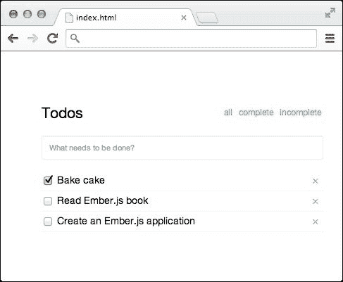

# 第八章. 通过 REST 实现数据持久化

到目前为止，我们一直在处理由 Ember.js 驱动的应用程序的前端方面。然而，您的典型应用程序将需要连接到后端服务，例如数据库。Ember.js 通过集成满足此类需求解决方案使其变得简单。本章假设您对服务器端技术没有了解，但它将尽可能清晰地解释包含服务器端代码的任何示例。确保您也尝试完成给定的练习，以便理解以下内容：

+   发送 Ajax 请求

+   理解 Ember-data

+   创建数据存储

+   定义模型

+   声明模型关系

+   创建记录

+   更新记录

+   删除记录

+   持久化数据

+   查找记录

+   定义存储适配器

+   创建 REST API

+   自定义存储序列化器

# 发送 Ajax 请求

大多数网络应用程序通过以下两种技术之一与后端服务进行通信：

+   Web sockets

+   Ajax

本章将主要处理 Ajax，它通过使用 `XMLHttpRequests` 允许客户端应用程序向远程服务发送异步请求。Web sockets 将在后面的章节中处理，但我们会发现许多概念是相关的。以下是一个向音乐目录端点发送 `POST` 请求的示例：

```js
  var data = JSON.stringify({
    album: 'Folie A Deux',
    artiste: 'Fall Out Boy'
  });

  function onreadystatechange(event){
    if (event.target.readyState != 4) return;
    console.log('POST /albums %s', event.target.status);
  }

  var xhr = new XMLHttpRequest();
  xhr.onreadystatechange = onreadystatechange;
  xhr.open('POST', '/albums');
  xhr.setRequestHeader('Content-type', 'application/json');
  xhr.send(data);
```

这显然是样板代码，jQuery 使其变得非常简单：

```js
$
  .post('/albums', data)
  .then(function(albut){
    console.log('POST /albums 200');
  });
```

我们有无数种方法可以将这些集成到 Ember.js 应用程序中。例如，如果这是在表单提交后启动的，我们可以在 `save` 动作中实现它，如下所示：

```js
<script type='text/x-handlebars'>{{outlet}}</script>
<script type='text/x-handlebars' id='index'>

  {{#with model}}
  <form {{action 'saveAlbum' this on='submit'}}>
      {{input value=artiste}}
      {{input value=album}}
      {{input value='save' type='submit'}}
  </form>
  {{/with}}

</script>

<script>

  App = Ember.Application.create();

  App.Router.map(function(){});

  App.IndexRoute = Ember.Route.extend({
    model: function(){
      return {};
    },
    actions: {
      saveAlbum: function(album){
        var data =  {
          album: album.album,
          artiste: album.artiste
        };
      $
        .post('/albums', data)
        .then(function(album){
           console.log('POST /albums 200');
         }, function(response){
           alert('failed!');
         });
      }
    }
  });
</script>
```

当用户提交提供的表单时，索引控制器的 `saveAlbum` 动作会被调用，使用 jQuery 将专辑发布到服务器。理想情况下，我们可以创建一个 `album` 类来分离关注点，如下所示：

```js
App.Album = Ember.Object.extend({
  toJSON: function(){
    return {
      album: this.get('album'),
      artiste: this.get('artiste')
    };
  },
  save: function(){ // function to persist album to the server
    $
      .post('/albums', this.toJSON())
      .then(function(event){
        console.log('POST /albums 200');
      }, function(event){
        alert('failed!');
      });
  }
});
```

通过这个课程，我们就可以进行最后的重构，如下所示：

```js
App.IndexRoute = Ember.Route.extend({
  model: function(){
    return App.Album.create();
  },
  actions: {
    saveAlbum: function(album){
      album.save();
    }
  }
});
```

此外，我们可能希望从服务器加载已保存的专辑以向用户展示。一种简单的方法是实现一个 `find` 类方法来加载这些专辑，如下所示：

```js
Album.reopenClass({
  find: function(){
    return $.getJSON('/albums');
  }
});
```

此示例向 `Album` 类添加了一个静态类方法，然后可以使用它来查询后端专辑，如下所示：

```js
App.AlbumsRoute = Ember.Route.extend({
  model: function(){
    return App.Album.find();
  }
});
```

由于这是一个常见的做法，Ember.js 社区还维护了另一个名为 **Ember-data** 的项目（[`github.com/emberjs/data`](http://github.com/emberjs/data)），该项目的目标是抽象化此类需求。因此，本章将带我们了解如何在 RESTful 应用程序中使用 Ember-data。这些应用程序使用 **REST**（**表示状态传输**），正如我们所知，它允许我们消费使用以下 HTTP 动词的一些 API：

+   `GET`

+   `POST`

+   `PUT`

+   `DELETE`

# 理解 Ember-data

Ember-data 是另一个雄心勃勃、有观点的开源项目，用于开发需要与后端数据库服务通信的应用程序。可以从 [`builds.emberjs.com/`](http://builds.emberjs.com/) 下载合适的版本。在我们的案例中，我们将使用已包含在章节示例中的 1.0.0-beta.9 版本构建。这些示例定义了一个简单的 **Todos** 应用程序实现，位于 [`github.com/component/todo`](http://github.com/component/todo)：



我们将首先使用 `fixtures-adapter` 示例，您可以通过 `index.html` 文件来加载它。此应用程序允许用户执行以下操作：

+   加载保存的待办事项

+   创建并保存新的待办事项

+   通过状态（已完成与未完成）过滤已加载的待办事项

# Ember-data 命名空间

Ember-data 库利用其自己的全局命名空间 `DS`，我们将从其中引用常用类，如 `DS.Store` 和 `DS.Model`。

# 创建数据存储

使用 Ember-data 的应用程序通常使用单个存储库，该存储库存储所有可供应用程序使用的记录。此存储库由 `DS.Store` 类定义，如下所示：

```js
App.ApplicationStore = DS.Store.extend({
});
```

上一段代码将由 Ember.js 自动执行，因此我们不需要做任何事情。就像路由器一样，这个类通常会被自动实例化，并作为 `store` 属性对所有路由和控制器可用。以下是一个演示如何访问应用程序存储的示例：

```js
App.BooksRoute = Ember.Route.extend({
  model: function(){
    return this.store.find('book');
  }
   });
```

不要担心这会做什么。从前面代码片段中学习的重要事情是如何访问存储实例。

# 定义模型

在介绍性章节中，我们学习了如何将应用程序对象组织成可重用的类，称为 `models`。Ember-data 提供了对定义此类模型的支撑，这些模型扩展 `DS.Model`，然后可以从中创建记录。例如，让我们回顾一下在示例中定义的 `Todo` 模型：

```js
App.Todo = DS.Model.extend({
  title: DS.attr('string'),
  complete: DS.attr('boolean', {
    defaultValue: false
  })
});
```

如上图所示，模型是通过扩展 `DS.Model` 类定义的。然后我们使用 `DS.attr` 类方法定义了两个属性，该方法接受两个参数：

+   属性的名称

+   可选的选项对象

属性的类型通常是以下之一：

+   字符串

+   数字

+   日期

+   布尔

然而，我们稍后了解到，可以定义其他自定义类型。选项对象通常包含一个 `defaultValue` 属性，它可以是值或函数，该函数评估为用作默认值的值。

# 声明关系

我们应用程序中的记录可能相关；因此，Ember-data 支持定义以下常见关系：

+   一对一

+   一对多

+   多对多

## 一对一

在这种关系类型中，只有一个模型可以属于另一个。例如，我们可以定义两个对象，一个人和一个护照，其中这个人只拥有一本护照：

```js
App.Person = DS.Model.extend({
```

# 查找记录

Ember-data 提供了各种方法来查询已加载的记录，以及从后端服务拉取新的记录。要查找特定模型的全部记录，我们可以简单地利用存储的`find`方法，如下所示：

```js
// GET /todos

store.find('todo');
```

此方法通过一个我们随后消费的承诺从服务器加载所有待办事项，如下所示：

```js
store
  .find('todo')
  .then(function(todos){
    todos.map(function(todo){
      todo.set('complete', false);
      return todo;
    });
  });
```

如果我们只想查询已加载的记录，我们可以使用存储的`all`方法，如下所示：

```js
store.all('todo');
```

同样，我们可能想通过给定的`id`查询一个记录，如下所示：

```js
// GET /todos/1

store.find('todo', id);
```

通过搜索词查询记录同样简单：

```js
// GET /todos?complete=true

store.find('todo', {
  complete: true
});
```

# 定义商店的适配器

每个商店都需要一个位于网络层的适配器，在那里它执行实际的 API 请求调用。这就是我们的 Todos 应用程序的两个变体之间的区别，其中每个商店定义了一个与不同远程数据存储进行通信的适配器。例如，第一个示例如下定义其适配器：

```js
App.ApplicationAdapter = DS.FixtureAdapter;
```

所有适配器都需要实现以下方法：

+   `find`

+   `findAll`

+   `findQuery`

+   `createRecord`

+   `updateRecord`

+   `deleteRecord`

这些适配器使应用程序能够与各种数据存储保持同步，例如：

+   本地缓存

+   浏览器的本地存储或 indexdb

+   通过 REST 的远程数据库

+   通过 RPC 的远程数据库

+   通过 WebSockets 的远程数据库

因此，如果应用程序需要使用不同的数据提供者，这些适配器是可以互换的。Ember-data 自带两个内置适配器：`fixtures-adapter`和`rest-adapter`。

fixtures 适配器使用浏览器内的缓存来存储应用程序的记录。此适配器在项目的后端服务因测试不可用或仍在开发时特别有用。使用此适配器时，可能需要添加初始数据，称为 fixtures，以模拟现有记录。这些记录可以通过在受影响的模型的`FIXTURES`属性中添加它们来加载到应用程序的存储中，如下所示：

```js
App.Todo.FIXTURES = [
  { id: 1, title: 'Bake cake', complete: true },
];
```

# 创建 REST API

一旦对模型的工作原理感到满意，我们就可以用`rest-adapter`替换掉 fixtures 适配器，正如你所猜想的，它通过 REST 与远程数据存储进行通信。第二个示例包括一个简单的 Node.js 服务器（Server.js），它使用 Express.js ([`expressjs.com`](http://expressjs.com)) 来演示此适配器的使用。为了测试应用程序，你需要按照以下步骤安装 Node.js：

1.  在 [`nodejs.org/download/`](http://nodejs.org/download/) 下载你平台的 Node.js 二进制文件。

1.  解压下载的包。

1.  将未存档目录中的`bin`目录的位置添加到你的环境`PATH`设置中。

1.  在终端中运行`node`来测试安装。

要启动应用程序，请导航到`rest-adapter`示例目录，然后在你的 shell 模拟器中简单地运行以下两个命令：

```js
npm install
node server

```

然后，在您的浏览器中访问`http://localhost:5000`。我们注意到，两个应用程序的不同之处在于后者将数据持久化到运行的后端。如果我们添加新的待办事项并访问新标签页，我们会意识到新更改已反映出来。然而，该应用程序不会将更改持久化到真实数据库中，因为这超出了本书的范围。因此，作为一个练习，尝试在您喜欢的服务器端堆栈中重新实现此示例。

Rest-adapter 对我们的待办事项服务器 API 必须遵守的一些假设如下表所示：

| 动作 | 请求 HTTP 动词 | 请求 URL | 请求 JSON 有效负载 | 响应 JSON 数据 |
| --- | --- | --- | --- | --- |
| `Create` | `POST` | `/todos` | `{todo: data}` | `{todo: data} or id` |
| `Find all` | `GET` | `/todos` | `None` | `{todo: data}` |
| `Find query` | `GET` | `/todos?complete=true` | `None` | `{todo: data}` |
| `Find one` | `GET` | `/todos/1` | `None` | `{todo: data}` |
| `Update` | `UPDATE` | `/todos/1` | `{todo: data}` | `{todo: data} or None` |
| `Delete` | `DELETE` | `/todos/1` | `None` | `None` |

此实现可以在`api.js`模块中找到。因此，在创建主要供 Ember-data 应用程序消费的新 API 时使用此格式是明智的。此约定也在[`jsonapi.org/`](http://jsonapi.org/)中进行了记录，这可能是一个对您非常有用的资源。

相关对象也可以以类似的方式加载。例如，在我们的*tweet-retweet*案例中，我们可以加载特定推文的转发，如下所示：

```js
{ tweet: {
  id: 1,
  title: 'New book out',
  retweets: [{
    id: 1,
    title: 'RT New book out',
    user: 'Jon',
  }, {
    id: 2,
    title: 'RT  New book out',
    user: 'Doe'
  }]
}}
```

注意，Ember-data 期望响应数据中包含相关对象的属性应命名为相关模型的复数形式：

```js
retweets: DS.hasMany('retweet')

retweet => retweets
person => people
```

或者，API 可以只发送相关对象的 ID，如下所示：

```js
{ tweet: {
  id: 1,
  title: 'New book out',
  retweets: [1, 2, 3]
}}
```

Ember-data 将随后将相应的对象*侧加载*到数据存储中。

有时，一个模型可能具有多个相同模型的关联关系。例如，典型的 Facebook 用户有粉丝和关注者，其模型可以定义为如下：

```js
App.User = DS.Model.extend({
  followers: DS.hasMany('user'),
  followings: DS.hasMany('user')
});
```

Ember-data 将期望响应数据包含一个名为`users`的相关对象列表。然而，由于有多个属性依赖于用户模型，我们可以通过使用`inverse`选项轻松解决这个问题，如下所示：

```js
App.User = DS.Model.extend({
  followers: DS.hasMany('user', { inverse: 'followers'} ),
  followings: DS.hasMany('user', { inverse: 'followings'} )
});
```

使用这种方式，我们就可以返回如下所示的响应：

```js
{ user: {
  id: 1,
  followers: [],
  following: []
}}
```

如果应用程序从不同的端点消费 API，我们需要为每个模型定义不同的适配器，如下所示：

```js
App.BookAdapter = DS.RESTAdapter.extend({
  namespace: 'v3/',
  host: 'http://books.example.com'
});

App.PenAdapter = DS.RESTAdapter.extend({
  namespace: 'v3/',
  host: 'http://pens.example.com'
});
```

如前述代码所示，适配器可以以多种不同的方式自定义，以满足您的 API 和领域逻辑的需求。这确保了现有的 API 仍然可以轻松消费，而不是必须为 Ember-data 应用程序构建单独的 API 端点。

# 自定义存储序列化器

除了存储的适配器之外，所有存储都包含一个序列化器，该序列化器将应用程序进出数据序列化和反序列化。例如，如果我们的后端数据模型使用除 `id` 之外的主键，我们可以轻松地做到这一点：

```js
DS.RESTSerializer.reopen({
  primaryKey: 'key'
});
```

注意，这也可以按模型指定，如下所示：

```js
App.PhoneSerializer = DS.RESTSerializer.extend({
  primaryKey: 'phone_id'
});
```

# 创建自定义转换

转换是不同类型的模型属性。应用程序作者不仅限于内置的转换，因此他们可以轻松地定义自己的转换。例如，我们的后端服务可能将布尔值表示为零和一：

```js
1 – true
0 – false
```

我们可以创建一个转换，在必要时解决这些值：

```js
App.BinaryBoolean = DS.Transform.extend({
  serialize: function(boolean){
    return (!boolean)
     ? 0
     : 1;
  },
  deserialize: function(binary){
    return (!!!binary)
     ? false
     : true;
  }
});
```

我们通过扩展 `DS.Transform` 并定义以下两个作用于属性值的方法来创建了一个新的转换：

+   `序列化`: 这将属性值转换为服务器可接受的格式

+   `反序列化`: 这将服务器加载的值转换为应用程序将使用的格式

然后，我们可以轻松地使用这种新类型，如下所示：

```js
App.Todo = DS.Todo.extend({
  complete: DS.attr('binaryBoolean')
});
var todo = store.createRecord('todo', {
  complete: true
});
todo.save(); // POST /todos {'todo': {complete: 1}}
```

# 摘要

在本章中，我们讨论了如何使用 Ember-data 创建需要通过 REST 与后端存储服务通信的应用程序。我们学习了如何从定义的模型中创建记录以及更新和删除它们。我们还学习了为了尽可能多地使用现有 API，我们需要进行的不同定制。因此，我们应该足够舒适地开始编写任何由 REST API 支持的客户端应用程序。随着我们进入其他令人兴奋的章节，我们应该开始思考如何无缝地将 WebSocket、JSONP 和 RPC 集成到 Ember-data 中。
