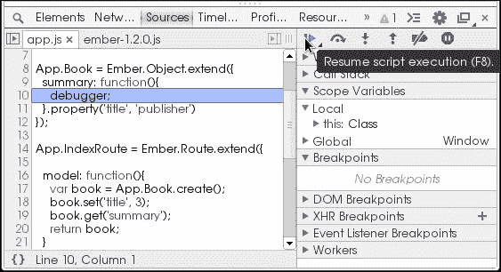
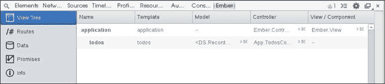
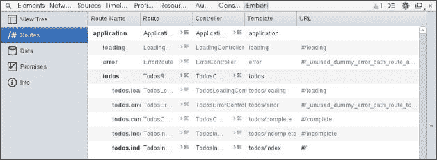
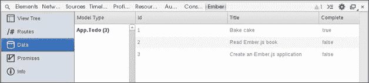

# 第九章：记录、调试和错误管理

到目前为止，我们已经学习了构建 Ember.js 应用程序的基础知识。在本章中，我们将学习如何调试这些应用程序，不仅为了减少开发时间，还为了使开发更加有趣。因此，我们将涵盖以下主题：

+   记录

+   跟踪事件

+   调试错误

+   使用 Ember.js 检查器

# 记录和调试

Ember.js 可以以两种格式下载，分别适用于开发和生产环境。建议在应用程序开发期间使用放大（开发）构建，以便更容易进行调试。有各种方法可以记录和检查应用程序内部创建的对象。我们将详细讨论如何记录和调试这些对象中的每一个。

## 对象

除了浏览器`console`对象提供的记录函数之外，Ember.js 还提供了以下`Ember.Logger`记录工具，这些工具专门用于记录 Ember.js 对象：

+   `assert`

+   `debug`

+   `error`

+   `info`

+   `log`

+   `warn`

Ember.js 绑定可以在它们发生时进行记录。要启用此记录，请在应用程序初始化之前将以下代码添加到程序中：

```js
Ember.LOG_BINDINGS = true;
```

大多数浏览器允许在应用程序的预定点设置断点。断点使用`debugger`关键字暂停程序的执行。暂停程序可以帮助解决问题以及跟踪事件。例如，我们可以设置一个断点，以了解一个属性是否按预期计算：

```js
App.Book = Ember.Object.extend({
  summary: function(){
    debugger;
  }.property('title', 'publisher')
});
```

这将创建一个断点，如下面的截图所示：



按下*F8*键可以恢复应用程序的执行。可以设置多个断点来跟踪事件的执行。然后可以使用开发者工具右侧的侧边栏来启用、禁用或检查这些点。

## 路由和路由

当应用程序从一个路由转换到另一个路由时，在出现异常行为的情况下，可能需要跟踪这些事件。启用此行为很简单：

```js
var App = Em.Application.create({
  LOG_TRANSITION: true
});
```

通过此外传递`LOG_TRANSITIONS_INTERNAL`选项为`true`可以启用更详细的记录：

```js
var App = Em.Application.create({
  LOG_TRANSITIONS_INTERNAL: true
});
```

即使是这样一个简单的应用程序，运行它也会记录以下转换：

```js
Transitioned into 'index'
```

应用程序控制器包含有关当前应用程序状态的两个有用信息。要获取当前应用程序的路由名称，我们将从应用程序控制器引用，如下所示：

```js
var currentRouteName = this
  .controllerFor("application")
  .get("currentRouteName");
Ember.Logger.log(currentRouteName); // post.like
```

当前路由的完整路径可以适当查找，如下所示：

```js
var currentPath = this
  .controllerFor("application")
  .get("currentPath");
Ember.Logger.log(currentPath); // user.post.like
```

任何实例化的路由都可以从应用程序容器中引用，如下所示：

```js
App.__container__.lookup("route:index");
```

## 模板

正如我们一次又一次看到的，可以从`Ember.TEMPLATES`对象中查找模板；例如：

```js
Ember.TEMPLATES['index'];
```

断点也可以直接从模板中设置！例如，考虑我们有一个如下定义的`index`模板：

```js
<script type='text/x-handlebars' id='index'>
     {{#link-to 'books'}}books{{/link-to}}
  {{#link-to 'pens'}}pens{{/link-to}}
</script>
```

我们可能想通过使用 `debugger` 表达式来检查此模板的渲染：

```js
<script type='text/x-handlebars' id='index'>
     {{#link-to 'books'}}books{{/link-to}}
     {{debugger}}
  {{#link-to 'pens'}}pens{{/link-to}}
   </script>
```

使用 `log` 表达式也可以从模板中进行记录：

```js
{{log model}}
```

这会将路由的模型记录到浏览器的控制台。

## 控制器

可以通过主应用程序容器全局查找特定的控制器：

```js
App.__container__.lookup("controller:index");
```

此应用程序容器注册由应用程序实例化的类，这些类反过来可以被引用。请注意，前面的示例仅应用于调试目的。控制器依赖项应代替从路由和控制器中访问其他控制器，如下面的示例所示：

```js
App.ApplicationController = Em.Controller.extend({
  title: 'My app'
});

App.IndexController = Em.Controller.extend({
  needs: [
    'application'
  ],
  actions: {
    save: function(){
      var title =this.get('controllers.application');
      console.log(title);
    }
  }
});
```

最后，我们可以在应用程序实例化期间传递另一个选项来启用指示控制器生成的日志，如下面的示例所示：

```js
App = Ember.Application.create({
  LOG_ACTIVE_GENERATION: true
});
```

## 视图

实例化的视图具有唯一的 ID，因此可以相应地查找，如下所示：

```js
Ember.Logger.log(Ember.View.views['ember1']);
```

就像路由一样，我们也可以在路由转换时记录视图事件。在需要验证注册的视图类是否被使用的情况下，这可能很有用。此行为可以通过以下方式启用：

```js
var App = Ember.Application.create({
  LOG_VIEW_LOOKUPS: true
});
```

# 使用 Ember.js 检查器

Ember.js 应用程序可以通过适用于 Chrome、Opera 和 Firefox 的浏览器扩展进行检查。此扩展允许您从开发者工具中创建的 Ember.js 标签页检查您的应用程序中的对象。要在 Chrome 中开始使用，您需要执行以下操作：

1.  访问 `chrome://flags` 并确保 **实验性扩展 API** 已启用。

1.  在 [`chrome.google.com/webstore/detail/ember-inspector/bmdblncegkenkacieihfhpjfppoconhi`](https://chrome.google.com/webstore/detail/ember-inspector/bmdblncegkenkacieihfhpjfppoconhi) 安装扩展。

1.  重新启动 Chrome。

1.  打开您的 Ember.js 应用程序并按 *Ctrl* + *U* 键以启动开发者工具。

应该在 **控制台** 标签旁边创建一个 **Ember** 标签，如下面的截图所示：


从侧边栏中，点击 **视图树** 可以获得有关应用程序当前状态的详细信息，如下面的截图所示：



下一张标签页显示了应用程序中注册的所有路由、视图、控制器和模板。以下是从上一章中使用的 **Todos** 应用程序中捕获的截图：



如果应用程序使用 Ember.js 数据，**数据** 标签将显示所有加载的模型：



# 客户端跟踪

在开发 Ember.js 或任何其他 MVC 应用程序时，追踪应用程序中发生的事件可能是一个明智的选择。追踪事件的好处是，当以图形形式呈现时，可以产生有意义的统计数据。可以通过记录进行中的事件预定的点的戳记来实现一个简单的追踪器。例如，让我们创建一个追踪从服务器加载模型进度的应用程序：

```js
App.ApplicationRoute = Ember.Route.extend({
  trace: function(event){
    var timestamp = Date.now();
    var data = {
      timestamp: timestamp,
      event: event
    };
    Ember.$.ajax('/logs', {
      type: 'POST',
      data: data
    });
  },
  model: function(){
    this.trace('load-application-model');
    return this.getJSON('/books');
  },
  setupController: function(controller, model){
   this._super(controller, model);
   this.trace('load-application-model');
  }
});
```

这将产生类似于以下代码的日志：

```js
{
  timestamp: 1396376883120,
    event: 'load-application-model'
}
{
  timestamp: 1396376883130,
    event: 'load-application-model'
}
```

绘制这些数据可以帮助我们深入了解我们应用程序的性能。

# 错误管理

除了将日志保存回服务器外，我们还可以通过以下签名`POST`应用程序中可能发生的任何错误：

```js
Ember.onerror = function(error) {
  var data = {
    stack: error.stack,
    event: 'error'
  };
  Ember.$.ajax('/logs', {
    type: 'POST',
    data: data
  });
};
```

# 摘要

我们刚刚学习了如何在 Ember.js 应用程序中记录事件以及调试瓶颈。通过在客户端应用程序中正确记录和跟踪事件，可以节省大量的开发时间。在下一章中，我们将学习如何为我们的应用程序编写和运行测试。
