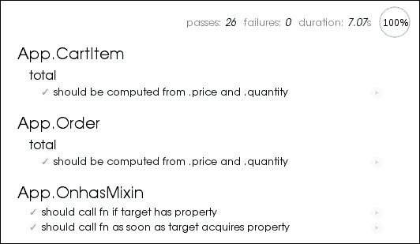

# 第十章. 测试您的应用程序

测试是在任何软件项目中进行的重要活动。测试自动化了错误检查，并确保新功能不仅按预期工作，而且不会引入不希望的行为。因此，雄心勃勃的 Ember.js 项目需要经过良好的测试，以确保其稳定性和确保满意的用户体验。因此，在本章结束时，我们应该能够：

+   测试对象计算属性

+   测试对象观察者

+   测试控制器

+   测试视图

+   测试组件

+   测试用户旅程

# 编写测试

Ember.js 支持编写以下两种常见的测试类型：

+   单元

+   集成

单元测试测试应用程序中定义的类（或实例）的特定属性。例如，考虑以下场景：

+   创建的用户对象有一个名称

+   从用户的首名和姓氏正确计算出用户的完整姓名

+   在保存到服务器之前，图书模型得到了正确的验证

+   观察者正确地响应了变化

集成测试另一方面，测试用户旅程和重要的应用程序工作流程；例如：

+   只有经过身份验证的用户才能访问应用程序

+   提交表单将表单数据持久化到存储中，并将用户重定向回列表页

+   点击结账按钮将产品添加到购物车

在本章中，我们将测试一个典型的电子商务网站的简单实现，您可以通过位于章节示例中的`index.html`文件来加载它。


前一截图中的网站具有以下功能：

+   用户可以订购要送至指定地点的餐点

+   管理员可以登录网站添加新餐点

+   管理员可以查看订单

要测试管理员界面，请使用用户名`admin`和密码`pass`登录。该应用程序已通过以下库进行测试：

+   Mocha.js ([`visionmedia.github.io/mocha`](http://visionmedia.github.io/mocha))：这是一个测试库

+   Sinon.js ([`sinonjs.org/`](http://sinonjs.org))：这是一个间谍、存根和模拟库

+   Chai.js ([`chaijs.com`](http://chaijs.com))：这是一个断言库

+   Ember mocha 适配器 ([`github.com/teddyzeenny/ember-mocha-adapter`](https://github.com/teddyzeenny/ember-mocha-adapter))

在浏览器中加载`test.html`将运行位于`test.integration.js`和`test.unit.js`中的两种测试类型，如下截图所示：



如果我们检查测试加载器文件的内容，我们会看到测试框架需要创建以下元素：

```js
<div id='mocha'></div> 
```

这是测试报告渲染的元素。我们还需要以相同的方式创建我们应用程序的根元素：

```js
<div id='ember'></div> 
```

在文件底部附近，按照以下顺序加载了应用程序脚本：

```js
<script src="img/jquery.js"></script> 
<script src="img/bootstrap.min.js"></script> 
<script src="img/handlebars.js"></script> 
<script src="img/ember.js"></script> 
<script src="img/ember-data.js"></script> 
<script src="img/app.js"></script> 
<script src="img/fixtures.js"></script> 
```

最后，加载了测试库：

```js
<script src='lib/mocha.js'></script> 
<script src='lib/ember-mocha-adapter.js'></script> 
<script src='lib/chai.js'></script> 
<script src='lib/sinon.js'></script> 
```

Ember.js 自带了测试工具，有助于编写这些测试。这些测试助手旨在与任何你选择的测试库一起使用。在我们的例子中，我们使用了 Mocha.js，这是一个流行且易于使用的库。我们首先需要完成的任务是设置测试环境。这是通过首先定义 Ember.js 应用程序的根元素来完成的。这确保了 Ember.js 应用程序只在该元素内执行，不会影响测试环境的其他部分：

```js
App.rootElement = '#ember';
```

然后我们需要运行应用程序的`setupForTesting`方法。这延迟了应用程序的可用性，以便在测试期间稍后执行。它还防止了测试操作窗口的位置：

```js
App.setupForTesting();
```

我们还需要调用另一个方法，`injectTestHelpers`，它将 Ember.js 测试助手注入到测试环境中：

```js
App.injectTestHelpers();
```

我们最终加载并执行了两个文件中包含的测试，如下所示：

```js
Em.$(function() { 
  mocha.run(); 
});

<script src='test.unit.js'></script> 
<script src='test.integration.js'></script>
```

你会注意到，对于每个测试，我们都定义了`beforeEach`和`afterEach`钩子，分别用于在测试执行前后被调用：

```js
 beforeEach(App.beforeEach); 
 afterEach(App.afterEach);
```

例如，默认的预测试运行钩子使用了`visit`助手将应用程序过渡到`index`路由，如下所示：

```js
App.beforeEach = function() { 
  visit('/'); 
}
```

另一方面，测试后的钩子通过销毁如 Ember-data 存储这样的实例来在每个测试后重置应用程序状态：

```js
App.afterEach = function() {
  App.reset();
}
```

Ember.js 自带了许多测试助手，我们将使用它们来帮助我们编写测试。

## 异步测试助手

这些助手用于执行异步操作。这意味着如果使用它们，下一组测试需要被包裹在一个运行循环函数中。它们包括以下内容：

+   `visit(url)`: 这个方法执行异步应用程序转换到提供的 URL 路由。

+   `fillIn(selector, text)`: 这个方法用于异步设置匹配给定选择器的输入的值，并使用给定的文本。

+   `click(selector)`: 这个方法用于在匹配给定选择器的元素上触发点击事件。这对于`triggerEvent(selector, "click")`助手很有用。

+   `keyEvent(selector, type, keyCode)`: 这个方法用于在给定的选择器上触发一个按键事件。

+   `triggerEvent(selector, type, options)`: 这个方法用于在给定的选择器上触发其他 DOM 事件。

## 同步测试助手

这些助手用于执行同步操作。它们包括以下内容：

+   `find(selector, context)`: 这个助手用于在给定的可选上下文中执行元素选择。

+   `currentPath()`: 这个方法用于获取当前应用程序的路由路径

+   `currentRouteName()`: 这个方法用于获取当前应用程序路由的名称

+   `currentURL()`: 这个方法用于获取当前路由的 URL

## 等待助手

目前只有一种此类助手：`andThen`。它在之前的异步操作完成后运行一系列测试操作。

# 编写单元测试

单元测试涉及测试对象计算属性、观察者和方法调用。

## 测试计算属性

让我们从本章示例中的第一个测试对象-计算属性开始，即`App.CartItem`的`total`属性，它是由`App.TotalMixin`应用而来的：

```js
App.CartItem = Em.Object.extend(App.TotalMixin, { 
  product: null, 
  quantity: null, 
  price: null 
});
```

当用户点击餐点的订单按钮时，我们期望购物车被新项目填充。我们还期望项目的`total`属性会增加，这如下所示：

```js
describe('App.CartItem', function() {

  describe('total', function(){

    beforeEach(App.beforeEach);

    afterEach(App.afterEach);

    it('should be computed from .price and .quantity', function() {

      andThen(function(){
        var order = App.CartItem.create();
        order.get('total').should.equal(0);
        order.set('price', 10);
        order.get('total').should.equal(0);
        order.set('quantity', 1);
        order.get('total').should.equal(10);
        order.set('quantity', 2);
        order.get('total').should.equal(20);
        order.set('price', 20);
        order.get('total').should.equal(40);

      });

    });

  });

});
```

首先，我们创建了一个订单并验证其总额默认为零。然后我们更新了其数量和价格，并确认在每种情况下总额都被正确计算。我们也对`App.Order`模型做了同样的操作，这次是从商店创建订单：

```js
var store = App.__container__.lookup('store:main');
var order = store.createRecord('order', {});
```

注意如何从主应用程序容器中引用存储实例。

## 测试方法调用

应用程序包含一个混合`App.OnhasMixin`，它定义了一个`onhas`函数，如果正在绑定的属性已定义或一旦被设置，就会调用给定的回调。这相当于一种情况，即如果您有足够的钱，您现在可以购买一台新电脑，或者等到您收到工资支票。我们首先测试了第一种情况：

```js
var object = Em.Object.createWithMixins(App.OnhasMixin, {
  id: 1
});
object.onhas('id', done);
```

在这种情况下，函数在对象已经包含`id`属性时被触发。我们只需要传递由 Mocha 测试运行器提供的回调`done`。第二个测试用例断言只有当绑定属性按如下方式设置时，回调才会被调用：

```js
var object = Em.Object.createWithMixins(App.OnhasMixin, {
  id: null
});
object.onhas('id', andThen.bind(null, done.bind(null, null)));
object.set('id', 1);
```

## 测试观察者

其中一个观察者`App.UserController#storeUser`将当前登录用户的用户名存储到本地存储中：

```js
storeUser: function(){
  var username = this.get('content.username');
  window.localStorage.setItem('user', username);
}.observes('content.username')
```

为了测试观察者，我们在预测试钩子中首先清除了本地存储中存储的任何用户：

```js
window.localStorage.setItem('user', null);
```

然后，我们创建了用户控制器，设置了用户，并断言用户实际上被存储在浏览器的本地存储中：

```js
var controller = App.UserController.create({
  content: {}
});

// spy
var spy = sinon.spy(controller, 'storeUser');

controller.set('username', 'username-1');  // 1
window.localStorage.getItem('user').should.equal('username-1');
```

我们还使用**Sinon.js**设置了一个间谍来记录观察者的调用：

```js
spy.callCount.should.to.equal(2);
spy.restore();
```

如前代码所示，间谍（spy）使我们能够验证观察者是否正确订阅了属性变化。

# 编写集成测试

我们现在已经知道集成测试测试应用程序中的导入工作流程和用户旅程。Ember.js 框架经过了良好的测试；审查这些测试对于学习如何为您的应用程序编写测试非常有帮助。许多功能，如绑定和观察者，已经过测试，因此您将编写比单元测试更多的集成测试。本章示例中的集成测试涵盖了应用程序中几乎所有的用户交互。我们将首先遍历所有与消费者相关的案例，首先是确认用户可以在第一页看到可用的餐点：

```js
find('.products li').length.should.equal(4);
```

此示例展示了同步`find`辅助函数的使用，它返回了列出餐点的元素。我们还检查了餐点属性是否被正确地显示给用户：

```js
// name label

find('.products li:nth-of-type(1) .product-name')
  .text()
  .trim()
  .should
  .equal(product.get('name'));

// price label

find('.products li:nth-of-type(1) .product-price')
  .text()
  .trim()
  .should
  .equal('$'+product.get('price'));

// order button

find('.products li:nth-of-type(1) .product-add-to-cart')
  .text()
  .trim()
  .should
  .equal('order now');
```

我们接下来的检查验证了导航栏上的购物车链接表明购物车是空的：

```js
find('.nav-cart').text().should.equal('cart 0');
```

在购物车链接旁边，我们还确认用户能够看到登录链接：

```js
find('.nav-login').text().should.equal('login');
```

最后，我们检查了客户是否也能看到网站品牌：

```js
find('.brand').text().should.equal('LocalLunch.io');
```

下一个测试用例集验证了用户是否能够将产品添加到购物车中。在每个测试用例之前，我们在第一顿饭的结账按钮上触发一个点击事件，将饭添加到购物车：

```js
click('.products li:nth-of-type(1) .product-add-to-cart');
```

第一个测试检查了是否将所需的饭菜实际添加到了购物车：

```js
var store = App.__container__.lookup('store:main');
var controller = App.__container__.lookup('controller:cart');

store
  .find('product', 1)
  .then(function(product){

    controller.get('length').should.equal(1);

    var item = controller.objectAt(0);
    item.get('product.id').should.equal(product.get('id'));
    item.get('price').should.equal(product.get('price'));
    item.get('quantity').should.equal(1);

  });
```

我们首先从商店查询了这个产品，然后断言它确实被添加到了购物车控制器中。我们还断言购物车项目包含预期的属性：`product`、`price`和`quantity`。

到那时，我们预计购物车链接计数指示器会增加：

```js
find('.nav-cart').text().should.equal('cart 1');
```

我们还预计用户已经过渡到购物车页面：

```js
currentPath().should.equal('cart');
```

接下来的测试测试了用户过渡到的购物车页面。首先，我们测试了查看空购物车页面会显示适当的消息：

```js
find('.message').text().should.equal('Cart is empty.');
```

然后我们测试了当购物车被填满时的页面，首先在预测试钩子中向购物车添加两个项目：

```js
var controller = App.__container__.lookup('controller:cart');
var store = App.__container__.lookup('store:main');

store
  .find('product', 1)
  .then(function(product){
    controller.addItem(product);
    controller.addItem(product);
  });
```

我们使用`controller.addItem`方法将两个产品添加到购物车。就像先前的测试用例一样，我们断言购物车链接表明已向购物车添加了两个购物车项目，如下面的代码所示：

```js
find('.nav-cart').text().should.equal('cart 2');
```

购物车页面包含一个显示购物车详情的表格。它还包含左侧的附加信息；其中之一是购物车总金额：

```js
var store = App.__container__.lookup('store:main');
store
  .find('product', 1)
  .then(function(product){

    var total = product.get('price') * 2;
    find('label.checkout')
    .text()
    .trim()
    .should
    .equal(total.toString());

  });
```

`find`辅助函数返回显示订单总金额的标签。我们获取其`textContent`并断言它等于订单总金额。然后我们继续测试购物车表格，首先确保相关的表头单元格按正确的顺序显示：

```js
[
  'Product',
  'Price',
  'Quantity'
].forEach(function(cell, i){
  find(find('thead td')[i]).text().should.equal(cell);
});
```

然后我们测试了表格体：

```js
find(find('tbody td'[0])
  .text()
  .should
  .equal(product.get('name'));
find(find('tbody td')[1])
  .text()
  .should
  .equal(product.get('price').toString());
find(find('tbody input'))
  .val()
  .should
  .equal('2');
```

上述代码通过断言它显示预期的值来测试表格的第一行。对于第三列，我们测试输入包含预期的产品数量。用户可以使用此输入自由调整产品数量。我们在下一个测试用例中测试这一点。首先，我们将输入更新为新值，如下所示：

```js
fillIn(find('tbody input'), 4);
```

然后我们允许任何触发的操作完成，在我们断言购物车中的数量已更新之前：

```js
andThen(function(){

  find('.nav-cart')
  .text()
  .should
  .equal('cart 4');

});
```

这个断言展示了如何使用`fillIn`辅助函数异步更新输入的值。我们还断言购物车总金额已更新：

```js
  var total = product.get('price') * 4;
  find('label.checkout')
  .text()
  .trim()
  .should
  .equal(total.toString());
```

一旦用户对订单详情满意，他们应该可以通过点击支付按钮转到支付页面：

```js
click('.pay');
andThen(function(){
  currentPath().should.equal('checkout');
});
```

一旦用户进入结账页面，如果他们的购物车为空，将显示适当的消息：

```js
find('.message').text().should.equal('Cart is empty.');
```

如果购物车不为空，用户会看到一个总结订单的表格：

```js
[
  'Name',
  'Quantity'
].forEach(function(cell, i){
  find(find('thead td')[i]).text().should.equal(cell);
});
```

表格体列出了订单的产品名称及其数量：

```js
[
  product.get('name'),
  '2'
].forEach(function(cell, i){
  find(find('tbody td')[i]).text().should.equal(cell);
});
```

表格还显示了订单总金额：

```js
var total = product.get('price') * 2;
find('.checkout').text().trim().should.equal(total.toString());
```

测试的表格位于页面左侧。主页包含一个表单，用户在提交前输入他们的支付信息。我们使用`triggerEvent`辅助函数来调用此事件：

```js
triggerEvent('.form-pay', 'submit');
```

显示一个成功消息给用户，通知他们订单将很快被送到他们手中：

```js
find('.message')
  .text()
  .should
  .equal('Success! Your order will arrive in 20 minutes. Thank you.');
```

这测试了结账控制器中定义的支付动作：

```js
pay: function(model){
  var self = this;
  var controller = self.get('controllers.cart');
  controller.forEach(function(item){
    self.store.createRecord('order', item).save();
  });
  model.set('success', true);
  controller.set('content', []);
}
```

如所示，购物车项目被转换为商店管理员可以看到的实际订单：

```js
store
  .find('order')
  .then(function(orders){

    orders.get('length').should.equal(1);

    var order = orders.objectAt(0);
    order.get('product.id').should.equal(product.get('id'));
    order.get('quantity').should.equal(2);
    order.get('price').should.equal(product.get('price'));

  });
```

作为回顾，你可以看到前面的测试用例测试了用户从索引页面通过购物车页面到结账页面的旅程。这就是集成测试的构成。

下一个案例将测试管理员的用户旅程。管理员可以通过在登录页面使用正确的凭据登录应用程序来访问管理员仪表板：

```js
fillIn('.input-username', user.get('username'));
fillIn('.input-password', user.get('password'));
triggerEvent('.form-login', 'submit');

andThen(function(){
  currentPath().should.equal('index');
});
```

成功登录会将用户重定向到索引路由。我们还测试了当用户尝试使用错误的凭据访问管理员仪表板的情况：

```js
fillIn('.input-username', 'username');
fillIn('.input-password', 'password');
triggerEvent('.form-login', 'submit');

andThen(function(){
  currentPath().should.equal('login');
});
```

我们期望用户在登录失败时保持在登录路由上。

一旦登录，管理员应该能够添加餐点以及编辑或删除现有的餐点。这些在下一个测试中得到了覆盖，我们首先通过文件底部定义的登录助手以管理员身份登录到网站：

```js
fillIn('.input-username', username);
fillIn('.input-password', 'pass');
triggerEvent('.form-login', 'submit');

andThen(function(){
  if (done){
    done();
  } else {
    visit('/');
  }
});
```

应用程序包含一个隐藏的表单，其文件输入提示用户在点击列表产品组件时选择餐点图片：

```js
<script type="text/x-handlebars" id="components/list-product">
  add
</script>

<script type="text/x-handlebars">
  <form class="list-product-form">
  <input
    class='list-product-form-input'
    type="file"
    style="top: -1000px; position: absolute"
    aria-hidden="true">
  </form>
</script>
```

相应的`App.ListProductComponent`定义了一个点击事件处理程序，当组件被点击时会被调用：

```js
var self = this;

// submit

var input = Em.$('.list-product-form input');
input.one('change', upload);

// show file chooser

input.click();

// upload

function upload(event){

  var file = input[0].files[0];
  var reader = new FileReader;
  reader.onload = post.bind(this, reader);
  reader.readAsDataURL(file);

};

// post

function post(reader){
  self.sendAction('action', reader.result);
}
```

一旦用户选择文件，前面的`post`方法就会调用，并带有`FileReader`实例参数，我们从其中获取所选图片的 URL 表示形式以进行存储。显然，在实际应用中，你会将此文件上传到存储服务，如 S3 或 Google Cloud Storage。我们最终创建产品，它将自动列在页面上。由于无法更新文件输入的值，我们的下一个测试规范通过手动将产品添加到购物车来部分确认这一点：

```js
Em.run(function(){

  var controller = App.__container__.lookup('controller:index');
  controller.send('createProduct', 'data:');

  Em.run.next(function(){     
    find('.products li').length.should.equal(5);
    done();
  });

});
```

在这里，我们在索引控制器上触发了`createProduct`动作，这会将产品添加到购物车中。请注意，这是由`post`函数调用的同一个动作。在下一个运行循环中，我们断言一个新的产品被添加到了列表中。由于这个产品的名称和价格尚未定义，下一个测试用例检查管理员是否真的可以编辑这些产品：

```js
var name = 'test';
var price = 1000;

fillIn('.products li:nth-of-type(1) .product-name', name);
fillIn('.products li:nth-of-type(1) .product-price', price);

andThen(function(){
  product.get('name').should.equal(name);
  product.get('price').should.equal(price.toString());
});
```

前一个测试用例表明管理员能够通过提供的相应输入更新产品的名称和价格。在实际应用中，你可能会添加一个`保存`按钮，以将更改持久化到后端。

在导航栏中，有一个用户可以点击以过渡到订单页面的`orders`链接：

```js
{{#link-to "orders" class='nav-orders'}}orders{{/link-to}}
```

下一个测试确认点击链接会将用户过渡到订单页面：

```js
click('.nav-orders');

andThen(function(){
  find('.message')
  .text()
  .should
  .equal('No new orders have been made.');
});
```

最后，如果还没有订单，管理员会看到一个消息。然而，如果有订单，管理员应该能够看到列出它们的表格：

```js
visit('/orders');

[
  'ID',
  'Product',
  'Price',
  'Quantity',
  'Total'
].forEach(function(cell, i){
  find(find('thead td')[i]).text().should.equal(cell);
});

[
  product.get('name'),
  product.get('price').toString(),
  order.get('quantity').toString(),
  order.get('total').toString()
].forEach(function(cell, i){
  find(find('tbody td')[++i]).text().trim().should.equal(cell);
});
```

# 摘要

我们刚刚学习了你可以使用的各种测试技术来确保应用程序的稳定性。由于你将主要编写集成测试，最佳方法是将你的应用程序分解为清晰的用户旅程。然后，测试任何预期的交互以及转换。这显然会在开发新功能时进行。当测试外部资源时，你可以使用如 Sinon 这样的库来模拟这些服务或扩展测试超时，如下所示：

```js
describe('visit /orders', function(){
  this.timeout(5000);
});
```

在下一章中，我们将学习如何构建由外部实时数据和资源支持的应用程序。我们将特别学习如何在 Ember.js 应用程序中使用流行的 **socket.io** 库。
