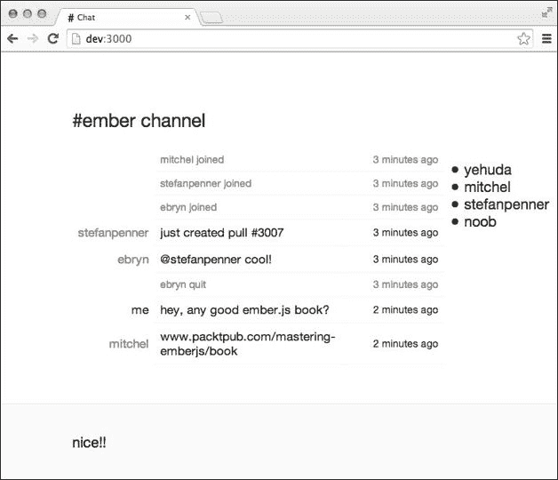

# 第十一章。构建实时应用程序

到目前为止，我们创建的应用程序并不需要任何实时功能。然而，现代应用程序力求通过减少页面刷新、高效的数据传输和改进的性能来提供最佳的用户体验。此外，这些应用程序可能还需要尽可能快地与服务器发送和接收数据。有几种网络技术可以用来满足这一需求：

+   Adobe Flash sockets

+   JSONP 轮询

+   XHR 长轮询

+   XHR 多部分流

+   ActiveX HTMLFile

+   Web sockets

+   服务器发送事件

+   WebRTC

在本章中，我们将学习如何使用**Socket.io**([`socket.io`](http://socket.io))库，该库使 Web 客户端和服务器之间的双向通信成为可能。它通过提供与上述机制类似的 API 来实现这一点，除了最后两个。此外，它根据多个因素（如浏览器支持等）选择最佳机制来使用。

在深入使用 Socket.io 之前，值得注意的是，如果客户端应用程序旨在从后端持续接收更新而几乎不进行推送，那么服务器发送事件是一个不错的选择。Facebook 新闻源和 Twitter 时间线是这种技术可以带来好处的用例的好例子。以下资源可以帮助开发此类应用程序：

+   **Sse 客户端库**可在[`github.com/segmentio/sse`](https://github.com/segmentio/sse)找到

+   **Sse Node.js 库**可在[`github.com/segmentio/sse-stream`](https://github.com/segmentio/sse-stream)找到

**WebRTC**是适用于需要点对点通信的应用程序的良好选择，例如音频和视频流。

# 设置 Socket.io

为了帮助掌握 Socket.io，我们将探索捆绑的章节示例，这是一个简单的 IRC 风格的聊天应用程序，其后端是用 Node.js 构建的，如下截图所示：



唯一的前提是 Node.js，可以从[`nodejs.org/download`](http://nodejs.org/download)下载。然后可以执行以下测试以验证安装：

```js
node --version
v0.10.29

npm --version
1.4.14

```

然后，使用以下命令启动应用程序：

```js
npm install
node server.js

```

后端使用**Express.io**([`express.io`](http://express.io))库，该库将流行的 Express.js([`expressjs.com`](http://expressjs.com)) Web 应用程序框架与 Socket.io 集成，以减少设置样板代码到以下内容：

```js
var app = require('express.io')();
app.http().io();
app.listen(3000);
```

Express.io 随附 Socket.io 客户端库，并在启动时在`/socket.io/socket.io.js`上提供服务。因此，我们只需要将其与其他应用程序文件一起加载，如下所示：

```js
<script src="img/socket.io.js"></script>
<script src="img/moment.js"></script>
<script src="img/jquery-1.10.2.js"></script>
<script src="img/handlebars-1.1.2.js"></script>
<script src="img/ember-1.2.0.js"></script>
<script src="img/app.js"></script>
```

客户端库当然也可以从[`socket.io/download/`](http://socket.io/download/)下载并相应地提供。客户端库通常通过在公开的`io`全局变量上调用`connect`方法来初始化，如下面的代码所示：

```js
App = Ember.Application.create({
  rootElement: '#wrap'
});
App.io = io.connect();
```

注意，还有其他用其他语言实现的 Socket.io 库可以用作官方 Node.js 库的替代品。

# 连接用户

当应用程序在`http://localhost:3000`加载时，用户在通过`/join <desired nick>`格式提交期望的昵称之前，需要指定要使用的处理程序。`App.MessageField`视图将此事件委派给`index`控制器的`chat`操作，如下所示：

```js
{{view App.MessageField
  required="required"
  placeholder="message"
  action="chat"
  id="message-input"
  value=controller.message}}

App.MessageField = Em.TextField.extend({
  insertNewline: function(){
    this.triggerAction();
  }
});
```

这是我们从第六章中学习到的内容，即*视图和事件管理*部分下的*从视图中发出操作*。正如我们稍后将看到的，应用程序的其他可见性直到用户第一次成功连接才会被隐藏。在相应的控制器`chat`操作`App.IndexController`中，我们首先确保提交的消息不为空：

```js
var message = self.get('message');
if (message) message = message.trim();
if (!message || message === '') return;
```

我们随后检查用户是否意图加入聊天：

```js
var match = message.match(/\/join (\w+)/);
if (match){
  if (nick){
    self.send('tip', 'Already connected!');
  } else {
    self.send('join', match[1], view);
  }
}
```

当然，如果用户已经连接，我们将通过工具提示通知他们。这个工具提示是通过`tip`操作显示的，该操作将显示的消息作为其唯一参数：

```js
$('.tooltip') 
  .text(msg)
  .show()
  .click(function(){
    $(this).fadeOut();
  });
```

如果匹配到昵称，我们将其传递给`join`操作，该操作首先订阅三个服务器更新。第一个更新是在新用户加入聊天时触发的，并将此特定用户添加到控制器的`nicks`数组中，以便在用户界面上显示，如下面的代码所示：

```js
App.io.on('join', function(data){
  self.get('nicks').pushObject(data.nick);
});
```

下一个处理器，另一方面，从集合中移除断开连接的用户：

```js
App.io.on('quit', function(data){
  self.get('nicks').removeObject(data.nick);
});
```

我们还订阅传入的消息并将它们存储在控制器的`messages`属性中：

```js
App.io.on('chat', function(data) {
  self.get('messages').pushObject(App.Message.create(data));
});
```

Socket.io 的`.on`实例方法用于通过订阅后端发出的事件来执行拉取操作，如前三个处理器所示。另一方面，`.emit`方法用于将数据推送到后端。在这种情况下，我们通知服务器有新用户希望加入聊天，如下所示：

```js
App.io.emit('ready', { nick: nick }, function(data) {
});
```

前一个调用将一个`ready`事件和昵称一起发送到后端。同样地，后端也设置了事件处理器，其中第一个处理器监听`ready`事件：

```js
// server.js
app.io.route('ready', function(req) {
});
```

监听器首先检查昵称是否被现有用户占用，以及现有用户是否占用了该昵称：

```js
var success = nicks.indexOf(req.data.nick) === -1;
```

如果确实已被占用，我们将通过另一个更新通知用户此失败：

```js
req.io.respond({
  success: success
});
```

客户端应用程序需要做的只是通过工具提示显示通知：

```js
if (data.success){
} else {
  self.send('tip', 'Nick is taken');
}
```

然而，如果昵称未被占用，我们首先将昵称存储在`session`中以供以后参考：

```js
req.session.nick = req.data.nick;
```

在群聊应用程序中，我们期望已登录到聊天的用户在其他人加入时收到通知，正如在不同的标签页上加载应用程序所展示的那样。因此，当用户连接时，我们首先将适当的消息添加到消息存储中：

```js
var message = {
  isjoin: true,
  nick: req.data.nick,
  message: req.data.nick+' joined',
  date: (new Date).toISOString()
};
messages.push(message);
```

然后，我们*广播*此事件给其他已登录用户：

```js
req.io.broadcast('join', req.data);
req.io.broadcast('chat', message);
```

Socket.io 提供了通过`.broadcast`方法向所有活动连接发送事件（除了当前连接）的途径。前面的广播事件导致用户被添加到客户端应用程序右侧的昵称列表中，并伴随加入通知：

```js
<ul class="nicks">
  {{#each nicks}}
  <li> {{this}}</li>
  {{/each}}
</ul>
```

我们最终使用`respond`方法通知连接用户连接成功：

```js
req.io.respond({
  success: success,
  nicks: nicks,
  messages: messages.slice(0, -1)
});
```

此外，我们还向他们发送当前登录用户的列表以及最近的五条消息。一旦连接，我们清除消息字段并填充`users`和`nicks`集合，如下所示：

```js
self.set('message', '');
self.set('connected', true);
self.set('nick', nick);
self.get('nicks').pushObjects(data.nicks);
self.get('messages').pushObjects(data.messages.map(function(data){
  var message = App.Message.create(data);
  if (message.get('nick') === nick) message.set('isme', true);
  return message;
}));
```

当消息流进来时，我们通过使用观察者使消息列表的底部可见于视口：

```js
  messagesLengthDidChange: function(){
    Em.run.debounce(this, 'send', 'scrollToBottom', 200);
  }.observes('messages.length'),
```

这所做的就是触发控制器的`scrollToBottom`动作，在 200 毫秒的窗口中显示，如下所示：

```js
$('html, body')
  .animate({ scrollTop: $(document).height() }, 'slow');
```

一旦用户连接，应用程序的其余部分可见性由绑定实现：

```js
<div id="content" {{bind-attr class="connected:show"}}></div>
```

在这种情况下，消息容器元素获取了`show`属性，从而将不透明度重置为`1`：

```js
#title,
#content{
  opacity: 0.1;
}

#title.show,
#content.show{
  opacity: 1;
}
```

后续消息通过聊天操作转发到服务器并广播给其他用户：

```js
if (!nick) return self.send('tip', '/join <nick>');

var msg = App.Message.create({
  isme: true,
  message: message,
  nick: nick
});
self.get('messages').pushObject(msg);
App.io.emit('chat', msg.toJSON());
self.set('message', '');
```

再次，在后台，我们订阅此事件并将消息转发给其他用户：

```js
app.io.route('chat', function(req) {
  messages.push(req.data);
  req.io.broadcast('chat', req.data);
});
In the client app, conveniently use a table, for convenience, to list the messages:
{{#each messages}}
<tr {{bind-attr class="isnotice:notice isjoin:join isquit:quit isme:me"}}>
  <td {{bind-attr class=":nick"}}>
    <span>{{#if isme}}me{{else}}{{nick}}{{/if}}</span>
  </td>
  <td class="message">
    <span>{{message}}</span>
  </td>
  <td class="date" data-timestamp="{{timestamp}}">
    <span>{{message-date date=date}}</span>
  </td>
</tr>
{{/each}}
```

你会注意到我们定义了一个`message-date`组件，该组件使用 Moment.js 库格式化显示消息的日期：

```js
<script type="text/x-handlebars" id="components/message-date">
  {{formatedDate}}
</script>

App.MessageDateComponent = Ember.Component.extend({

  tagName: 'span',

  didInsertElement: function(){

    var self = this;

    var id = setInterval(fn, 15000);
    this.set('intervalId', id);
    fn();
    function fn(){
      self.set(
'formatedDate', moment((new Date(self.get('date')))).fromNow()
     );
    }

  },

  willDestroyElement: function(){
    clearInterval(this.get('intervalId'));
  }

});
```

为了提供更好的实时体验，该组件每 15 秒更新一次格式化日期以展示老化效果：

最后，当用户断开连接时，我们从`nicks`集合中删除他们的句柄并通知其他用户：

```js
app.io.route('disconnect', function(req) {

  var nick = req.session.nick;
  if (!nick) return;

  var message = {
    isquit: true,
    nick: nick,
    message: nick+' quit',
    date: (new Date).toISOString()
  };
  messages.push(message);

  var index = nicks.indexOf(nick);
  if (index > -1) {
    nicks.splice(index, 1);
  }

  req.io.broadcast('chat', message);
  req.io.broadcast('quit', {
    nick: nick
  });

});
```

你会注意到我们从`session`中引用了保存的用户句柄：

可以对应用程序进行一些改进，例如多频道、表情符号和用户头像支持等。

# 摘要

这是对构建与实时网络技术集成的 Ember.js 应用程序的简要介绍。它展示了在不花费太多时间进行琐碎选择的情况下使用第三方库是多么容易。我们学习了如何初始化 Socket.io 库，并订阅和从服务器接收和发送更新。在下一章中，我们将学习如何将我们的应用程序组件化成可重用的组件。
