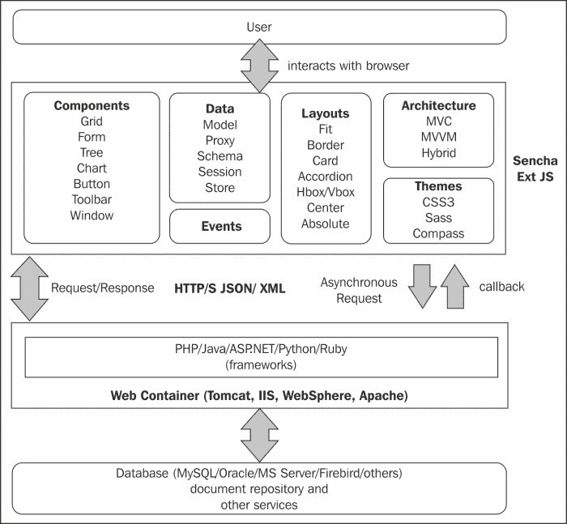
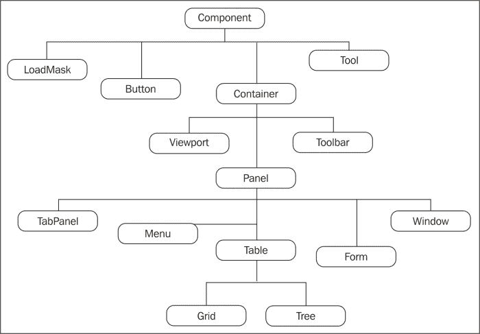
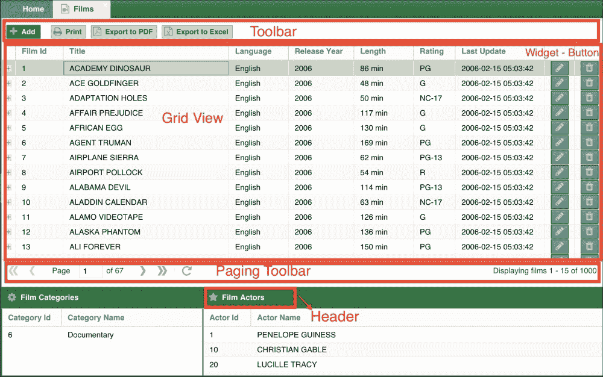
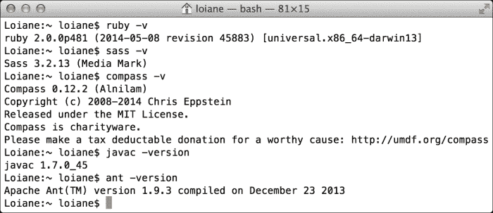
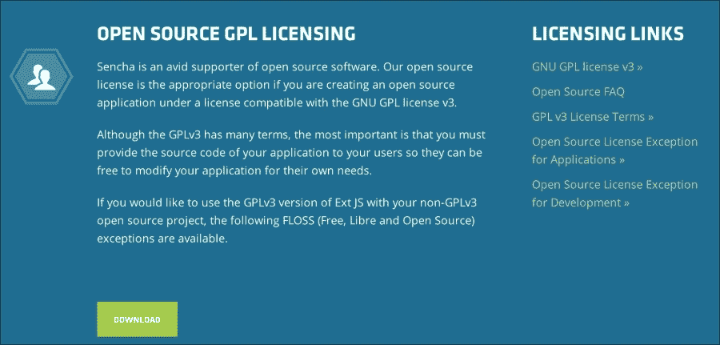
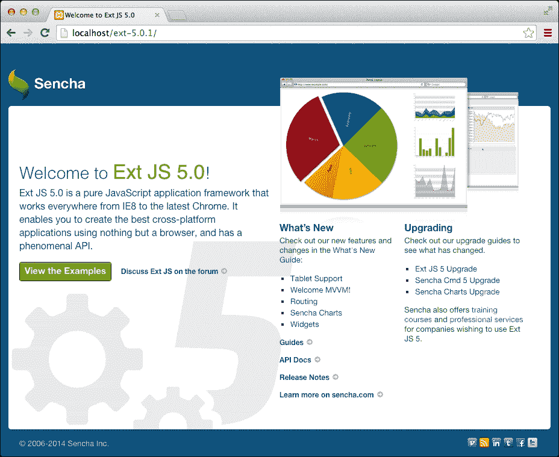
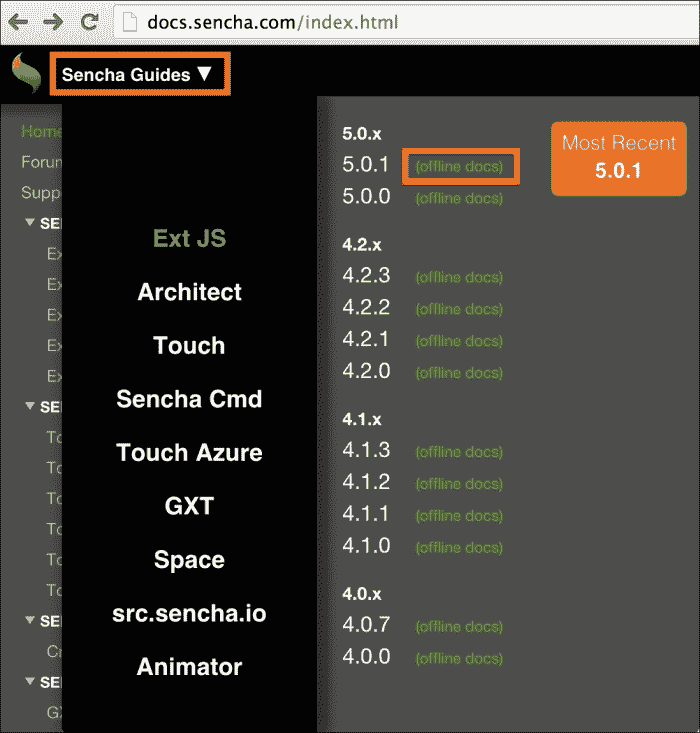
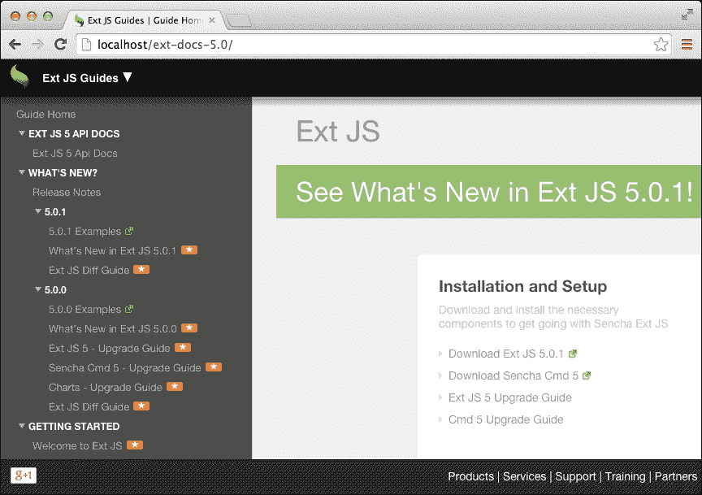

# 第一章. Sencha Ext JS 概述

现在，市场上有很多前端框架和库的版本。如果你只想操作 **文档对象模型** (**DOM**)，有你可以使用的框架；如果你只想用于样式，有你可以使用的框架；有用于用户友好组件的框架；有用于设计项目的框架，等等。还有 Ext JS，这是一个用于创建 **富互联网应用** (**RIA**) 的框架，但它不仅仅有漂亮的组件，还有许多其他功能。

在这本书中，我们将学习如何使用 Ext JS 5 从头到尾开发一个应用程序，同时涵盖使我们的应用程序工作所需的后端的一些部分。我们将通过一些实际示例学习如何使用 Ext JS，包括一些组件、它们的工作原理以及如何在每一章中使用它们。

但首先，如果你是第一次接触这个框架，你将学习 Ext JS 能够做什么。

# 理解 Sencha Ext JS

我们可以使用 Ext JS 来操作 DOM 吗？如果我们想要漂亮且用户友好的组件（表单、网格、树等），我们可以使用它吗？如果我们需要一些漂亮的图表，我们可以使用它吗？我们可以使用 Ext JS 的 **模型-视图-控制器** (**MVC**) 架构来组织应用程序吗？如果我们想在模型和视图之间使用双向数据绑定，我们可以使用 Ext JS 做到这一点吗？如果我们不喜欢 Ext JS 组件的外观和感觉的颜色，我们可以轻松地更改它吗？现在是一个难题；我们可以使用 Ext JS 对我们的应用程序的 CSS 和 JavaScript 文件进行构建以混淆和优化吗？Ext JS 是否响应式？我们可以在移动设备上使用它吗？

令人惊讶的是，所有前面的问题的答案都是肯定的！正如我们所见，Ext JS 是一个完整的前端框架。Ext JS 背后的智囊公司是 Sencha Inc. ([`sencha.com`](http://sencha.com))。

Sencha Ext JS 还有一个叫做 **Sencha Touch** 的表亲。它也有我们刚才提到的惊人特性，但专注于移动跨平台世界。我们将在本书的后续章节中非常简要地讨论 Ext JS 和 Sencha Touch。

## Ext JS 应用程序的架构

在我们开始之前，让我们确保我们理解了一些核心概念。Ext JS 是一个基于 JavaScript 和 HTML5 的前端框架。这意味着 Ext JS 并不直接连接到数据库。对于存储，我们可以使用 HTML5 存储的一种类型，例如 Web SQL 或本地存储，但这些存储类型只能让我们存储 5 MB 的数据，这对于一个普通应用来说非常少。

通常，我们希望使用 MySQL、Oracle、MS Server 或任何其他数据库。为了能够在数据库中存储信息，我们需要使用一种服务器端语言，例如 PHP、Java、C#、Ruby、Python、Node.js 等。Ext JS 将与服务器端语言（或 Web 服务）进行通信，服务器将连接到数据库或其他存储（例如文档库）。

以下图表展示了使用 Ext JS 开发的应用程序架构：

# Ext JS 概述

我们已经提到了一些 Ext JS 的功能。让我们简要地看一下每一个。但首先，如果你想查看官方 Sencha Ext JS 网页，请访问 [`www.sencha.com/products/extjs/`](http://www.sencha.com/products/extjs/)。

## 基础教程

在深入本书之前，建议您阅读以下链接的内容。它们包含任何开发者开始使用 Ext JS 之前需要了解的基本信息：

+   基础教程和 Ext JS 概述：[`www.sencha.com/products/extjs/up-and-running`](http://www.sencha.com/products/extjs/up-and-running)

+   Ext JS 指南：[`docs.sencha.com/extjs/5.0/`](http://docs.sencha.com/extjs/5.0/)

+   Ext JS 文档：[`docs.sencha.com/extjs/5.0/apidocs/`](http://docs.sencha.com/extjs/5.0/apidocs/)

+   Ext JS 示例：[`dev.sencha.com/ext/5.0.1/examples/index.html`](http://dev.sencha.com/ext/5.0.1/examples/index.html)

+   论坛（成为社区的一部分）：[`www.sencha.com/forum/`](http://www.sencha.com/forum/)

## 类系统

Ext JS 使用面向对象（**OO**）的方法。我们使用在 Ext JS 中称为配置和方法的属性声明类（JavaScript 中的函数）。

Ext JS 也遵循一种命名约定。如果你熟悉面向对象编程，你可能也熟悉 Ext JS 的命名约定。例如，类名是字母数字的，以大写字母开头，其余字母采用驼峰式。例如，如果我们想创建一个表示客户端详情的类，我们可以将其命名为 `ClientDetails`。方法和属性名以小写字母开头，其余字母采用驼峰式。例如，`retrieveClientDetails()` 是一个良好的方法名，而 `clientName` 是一个良好的属性名。

Ext JS 也按照包进行组织。包是一种组织具有相同目的代码的方式。例如，在 Ext JS 中，有一个名为 `data` 的包，用于处理框架中与数据相关的一切。还有一个名为 `grid` 的包，包含所有与 GridPanels 相关的代码。

### 注意

关于类系统的更多信息，请阅读 [`docs.sencha.com/extjs/5.0/core_concepts/classes.html`](http://docs.sencha.com/extjs/5.0/core_concepts/classes.html)。

## 组件

一些人们考虑使用 Ext JS 的主要原因可能是因为其丰富且用户友好的组件。Ext JS 包含了网络应用程序中最常用的组件，如表单、网格和树。我们还可以使用触摸友好的图表（意味着它们在触摸屏上也能工作）以及使用所有 **可缩放矢量图形** (**SVG**) 和 HTML5 优势的绘图包。

您可以查看官方 Sencha Ext JS 示例页面[`dev.sencha.com/extjs/5.0.0/examples/index.html`](http://dev.sencha.com/extjs/5.0.0/examples/index.html)，以了解我们可以用示例做什么。

### 组件层次结构

您会注意到，在这本书的整个过程中，我们将提到诸如组件、容器和小部件之类的术语。以下图表展示了 Ext JS 中的组件层次结构：

**组件**类是所有 Ext JS 小部件的父类。在**组件**类下面，我们有**容器**类。**容器**类可能包含其他组件。例如，让我们看看以下 GridPanel：

`Grid Panel`类扩展自`Panel`类，这是 Ext JS 中一个非常流行的组件。`Panel`类支持标题、停靠项（工具栏），并且包含一个主体空间。`Panel`类的子类，如`DataView`、`Tree`、`Grid`和`Form`，是面板，但它们没有主体，而是有一个专门的`View`类，负责渲染特定信息。例如，`Grid`面板的`View`类专门用于渲染网格列；`Tree`面板的`View`类专门用于渲染层次信息，而`Form`面板（称为 BasicForm）的`View`类专门用于渲染表单字段。

## GridPanel

网格组件是网络应用中最常用的组件之一。它用于显示表格数据。

要创建网格，开发者需要声明至少两个配置：`columns`和`Store`。`Store`类在 Ext JS 中组织数据集合，并负责向网格提供要显示的信息。我们将在讨论数据包时探讨它。

网格组件可以用作简单的数据网格，只显示信息记录。或者，如果我们有大量数据，我们可以使用其分页功能，或者如果我们真的有大量数据，我们也可以使用大数据网格。还有其他功能，例如分组表头网格（也称为 Pivot Grid）；我们还可以拥有带有锁定列甚至带有小部件的网格，例如聊天，如前一个截图所示。在其他功能中，我们还可以对网格内的信息进行排序和筛选，并使用一些插件来完成诸如展开行以显示更多信息而不弹出、使用复选框选择行以及自动编号行等任务。还有更多：网格组件还支持通过打开一个小弹出行来编辑信息，以便您可以直接在网格中编辑信息。网格还支持单元格编辑，这与我们在 MS Excel 中可以做的类似——通过双击单元格来编辑信息。

### 注意

如需更多信息，请参阅[`docs.sencha.com/extjs/5.0/apidocs/#!/api/Ext.grid.Panel`](http://docs.sencha.com/extjs/5.0/apidocs/#!/api/Ext.grid.Panel)和[`docs.sencha.com/extjs/5.0/components/grids/grids.html`](http://docs.sencha.com/extjs/5.0/components/grids/grids.html)。

## TreePanel

树显示层次数据，例如文件目录。树的数据来自 TreeStore 或预定义在`root`配置中。树还支持排序和过滤，可以使用复选框选择行，我们还可以将树与网格混合，并使用 TreeGrid 组件。

它还支持插件，如树之间的拖放。

### 注意

如需更多信息，请参阅[`docs.sencha.com/extjs/5.0/apidocs/#!/api/Ext.tree.Panel`](http://docs.sencha.com/extjs/5.0/apidocs/#!/api/Ext.tree.Panel)和[`docs.sencha.com/extjs/5.0/components/trees.html`](http://docs.sencha.com/extjs/5.0/components/trees.html)。

## 表单

接下来，我们有表单组件。我们可以使用文本、区域和数字字段实现强大的表单。我们还可以使用日期/月份选择器、复选框、单选按钮、组合框，甚至文件上传。所有字段都有基本的原生验证支持（带有错误消息给用户），例如必填字段和最小值或最大值或长度，但我们可以轻松自定义并创建自定义验证（例如 IP 地址）。

### 注意

如需更多信息，请参阅[`docs.sencha.com/extjs/5.0/apidocs/#!/api/Ext.form.Panel`](http://docs.sencha.com/extjs/5.0/apidocs/#!/api/Ext.form.Panel)和[`docs.sencha.com/extjs/5.0/components/forms.html`](http://docs.sencha.com/extjs/5.0/components/forms.html)。

## 其他组件

我们还有图表。我们可以构建柱状图、条形图、折线图、面积图、散点图、饼图、径向图、仪表图，甚至金融图表。我们还可以有基本图、堆叠图、多轴图和 3D 图表。图表也由 Store 提供数据。

当然，还有一些基本组件可以帮助我们的应用程序看起来更好，例如菜单、标签页、面板、窗口、警报、工具栏等等。这些组件具有**Web Accessibility Initiative – Accessible Rich Internet Applications** (**WAI-ARIA**)支持，并且也支持从右到左的语言。

看起来不错，对吧？我们将通过本书中的示例来介绍大部分组件及其功能。

## 布局

Ext JS 支持不同的可能性。它还有一个出色的布局管理器（只有当我们使用其基础组件（Viewport）创建 Ext JS 应用程序时，布局管理器才可用。对于在独立表单（在`
`标签中渲染）中使用的组件，当减小浏览器窗口大小时，布局管理器不起作用）。

支持的布局中包括绝对布局（在这种情况下，我们需要使用组件在屏幕或组件内的绝对*x*和*y*位置）；手风琴布局、边界布局、卡片布局、中心布局、列布局、适应布局、Hbox 和 Vbox 布局，以及表格布局。

在应用程序中最常用的布局是边框、卡片、适应和 HBox 以及 VBox。我们将在本书的示例中介绍不同的布局。

### 注意

如需更多信息，请查看[`dev.sencha.com/ext/5.0.1/examples/kitchensink/#layouts`](http://dev.sencha.com/ext/5.0.1/examples/kitchensink/#layouts)以及[`docs.sencha.com/extjs/5.0/apidocs/#!/api/Ext.layout.container.Absolute`](http://docs.sencha.com/extjs/5.0/apidocs/#!/api/Ext.layout.container.Absolute)中的`layout.container`包。

## 数据包

`data`包是 Ext JS SDK 中最重要的包之一。Ext JS 组件如网格、树形图，甚至表单都是数据驱动的。

服务器端语言通常支持数据较好。在 Java、PHP、**C#**和其他语言中，我们可以创建称为**纯 Java 对象**（**POJOs**）、**持久化域对象**（**PDOs**）和**值对象**（**VOs**）的实体，以及其他我们通常给这些实体取的名字。Ext JS 支持数据，因此我们也在前端表示实体。

基本上有三个主要部分：

+   **模型**: 这代表实体。它可以代表服务器端的一个类或数据库中的一个表。模型支持字段、验证、关联（**一对一**、**一对多**、**多对多**）。

+   **存储**: 这代表模型集合。它还支持分组、过滤和排序。

+   **代理**: 这代表我们将如何连接到服务器（或本地存储）。它可以是 Ajax、REST、JSONP、内存或 HTML5 LocalStorage。在代理内部，我们可以定义`Reader`和`Writer`。`Reader`属性负责解码我们从服务器接收到的数据（如果它是 JSON 或 XML，我们也可以定义其格式）。`Writer`属性负责将数据编码为要发送到服务器的数据；它可以是 JSON 或 XML，我们也可以定义其格式。代理可以放在模型或存储内部。

### 注意

如需更多信息，请阅读[`docs.sencha.com/extjs/5.0/core_concepts/data_package.html`](http://docs.sencha.com/extjs/5.0/core_concepts/data_package.html)。

## MVC 和 MVVM 架构

在使用 Ext JS 时，我们可以为前端代码选择两种架构：**模型-视图-控制器**（**MVC**）和**模型-视图-视图模型**（**MVVM**）。还有一个第三种选择，即**MVC**和**MVVM**之间的**混合**架构。

在本书中，我们将学习更多关于 MVC、MVVM 以及混合方法的内容。

### 注意

如需更多信息，请阅读[`docs.sencha.com/extjs/5.0/application_architecture/application_architecture.html`](http://docs.sencha.com/extjs/5.0/application_architecture/application_architecture.html)。

## Ext JS 应用程序的外观和感觉

我们还可以自定义 Ext JS 应用程序的主题。主题基于 Sass 和 Compass。我们将在本书的最后一章深入探讨主题。

### 注意

更多信息请参阅 [`docs.sencha.com/extjs/5.0/core_concepts/theming.html`](http://docs.sencha.com/extjs/5.0/core_concepts/theming.html)。

# 安装 Ext JS

让我们看看如何在本地安装 Ext JS。这一步是必需的，因为我们将在使用 **Sencha Cmd** 创建应用程序之前需要在我们的计算机上拥有 Ext JS SDK。

## Ext JS 和 Sencha Cmd 的先决条件

在下载 Ext JS 和 Sencha Cmd 之前，我们需要设置我们的计算机以准备就绪。以下是我们创建 Ext JS 应用程序所需的软件列表：

1.  **Ruby 1.8 或 1.9**：撰写本文时，Ruby 的当前版本是 2.x。为了能够创建 Ext JS 应用程序，我们需要安装 Ruby 1.8 或 1.9。Ruby 是必需的，因为 Ext JS 所使用的主题引擎基于 Sass 和 Compass，它们是 Ruby gems。要下载和安装 Ruby，请遵循 [`www.ruby-lang.org/en/installation/`](https://www.ruby-lang.org/en/installation/) 中的说明。

1.  **Sass 和 Compass**：这些不是 CSS 框架。Sass 是一种新的编写 CSS 的方法。可以使用变量并定义函数和混入。它是 **Less** 的替代品（也许你使用过 Less 或者听说过它——Sass 非常相似）。在下载并安装 Ruby 之后，请安装 Sass。安装说明可以在 [`sass-lang.com/install`](http://sass-lang.com/install) 找到（遵循命令行说明）。Compass 是一个 Sass 框架，也是必需的。请从 [`compass-style.org/install/`](http://compass-style.org/install/) 安装它。Sass 和 Compass 是 Ext JS 主题引擎的核心。我们将为我们的应用程序创建的所有自定义 CSS 都将由 Sass/Compass 编译。

1.  **Java JDK**：如果你是 Java 开发者，你可能已经安装了 Java JDK。如果没有，请下载并执行 [`www.oracle.com/technetwork/articles/javase/index-jsp-138363.html`](http://www.oracle.com/technetwork/articles/javase/index-jsp-138363.html) 中的安装程序。安装 Java JDK 后，我们还需要配置 `JAVA_HOME` 环境变量。说明可以在 [`goo.gl/JFtKHF`](http://goo.gl/JFtKHF) 找到。Java JDK 是必需的，因为我们的下一步是 ANT。

1.  **Apache ANT**：创建应用程序和构建应用程序的 Sencha Cmd 引擎基于 ANT，一个 Java 库。我们需要从 [`ant.apache.org/bindownload.cgi`](http://ant.apache.org/bindownload.cgi) 下载 ANT，将其解压到我们选择的目录中，并设置 `ANT_HOME` 环境变量 ([`ant.apache.org/manual/install.html`](http://ant.apache.org/manual/install.html))。

我们可以通过在终端应用程序中执行以下命令来检查我们是否拥有正确的环境：

注意，安装的 Ruby 版本是 2.x，但只要您的 classpath 中有 1.8 或 1.9 兼容版本，您应该没问题。

最后一步是设置一个 Web 服务器。我们可以使用的最简单的服务器是 Apache Xampp。请下载并按照[`www.apachefriends.org`](https://www.apachefriends.org)上的安装说明进行操作。

### 注意

本书提到的所有软件环境均适用于 Linux、Windows 和 Mac OS。

## 下载 Ext JS 和 Sencha Cmd

现在我们已经配置好了环境，我们可以下载 Ext JS。Ext JS 有一些不同的许可版本：商业版和开源版。对于本书，我们将使用开源版。您可以在[`www.sencha.com/products/extjs/details`](http://www.sencha.com/products/extjs/details)下载开源版本。滚动到页面底部并选择**OPEN SOURCE GPL LICENSING**，如下截图所示：

### 注意

本书撰写时，Ext JS 的最新版本是 5.1。

我们还需要从[`www.sencha.com/products/sencha-cmd/download`](http://www.sencha.com/products/sencha-cmd/download)下载并安装 Sencha Cmd。Sencha Cmd 负责创建应用程序，并生成、构建和编译 Sass 和 Compass 以生成应用程序的 CSS。安装 Sencha Cmd 后，`sencha`命令也将从终端应用程序中可用。

下载完 Ext JS SDK 后，将其解压到 Apache Xampp 的`htdocs`文件夹内。一旦我们启动 Apache 服务器，我们就能从本地环境执行 Ext JS 示例：

## 离线文档

在使用 Ext JS 进行开发时，我们会经常查阅文档。每当本书提到 Ext JS 组件的名称时，建议您查阅文档并查看相关信息。Ext JS 文档可在[`docs.sencha.com/extjs/5.0/`](http://docs.sencha.com/extjs/5.0/)找到。它包含指南（在深入本书之前，我们强烈建议您花些时间阅读指南，因为指南提供了关于框架的基本知识），以及指向博客文章和文档本身的链接。由于我们会经常查阅，我们建议您也本地安装文档。为此，请访问[`docs.sencha.com/`](http://docs.sencha.com/)，打开**Sencha Guides**菜单，并选择**离线文档**链接，如下截图所示：

将文档解压到 Xampp 的`htdocs`文件夹内，并访问您的`localhost`，如下截图所示：

### 注意

一个包含逐步说明的视频教程，用于设置 Ext JS 的开发环境，可在 [`youtu.be/B43bEnFBRRc`](http://youtu.be/B43bEnFBRRc) 找到。

## 集成开发环境（IDE）

您可以使用任何您偏好的 IDE 或编辑器来使用 Ext JS 进行开发。以下是一些非常受欢迎的编辑器：Sublime Text、Atom、Eclipse（如果您是 Java 开发者）、Netbeans、Visual Studio（如果您是 C# 开发者）、Notepad++ 和 WebStorm 等。

如果您正在寻找自动完成功能，您可以使用 Sencha Complete（付费）中的 Sencha Eclipse 插件，该插件可在 [`www.sencha.com/products/complete/`](http://www.sencha.com/products/complete/) 找到，或者您可以使用 WebStorm（也是付费的），可在 [`www.jetbrains.com/webstorm/`](https://www.jetbrains.com/webstorm/) 找到。

此外，还有 Sencha Architect（也具有自动完成功能）。它是一个所见即所得（**WYSIWYG**）编辑器，并且是一个优秀的 Sencha 工具，可以与您偏好的 IDE（用于开发应用的客户端代码）一起使用。

请随意使用您最舒适的编辑器或 IDE 来开发本书的源代码！

# 摘要

在本章中，我们快速概述了 Ext JS 并提供了一些有用的参考资料，以获取理解本书中将使用的术语和组件所需的基本知识。

在下一章中，我们将介绍本书中将使用的应用，并且我们也将使用 Sencha Cmd 来创建它。
