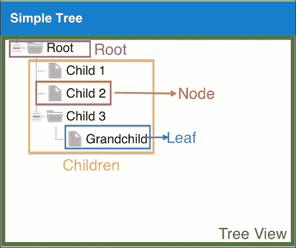

# 第五章. 高级动态菜单

我们已经实现了登录功能，这在第三章“登录页面”中进行了实现，以及应用程序的基础，这在第四章“注销和多语言功能”中进行了实现。在我们的应用程序基础中，缺少一个部分，那就是菜单。因此，接下来我们将开发的是动态菜单。

一旦用户经过认证，我们将显示应用程序的基本屏幕，它由一个带有 Border 布局的 Viewport 组成。在 Viewport 的左侧，我们将显示一个菜单。这个菜单将是动态的，菜单上显示的项目取决于用户拥有的权限，这就是为什么我们称之为动态菜单。

其中一个选项是渲染系统的所有屏幕，然后根据用户角色隐藏或显示它们。然而，这不是我们在这本书中将要使用的方法。我们将只渲染和显示用户可以访问的屏幕。我们将采用的方法是动态根据用户权限渲染菜单。

因此，在本章中，我们将学习如何使用不同的 Ext JS 组件和布局（我们尚未介绍）来显示动态菜单。总结来说，在本章中，我们将涵盖：

+   使用 Accordion 布局和 TreePanel 创建动态菜单

+   使用模型关联从服务器加载数据

+   在服务器上处理动态菜单

+   动态打开菜单项

+   使用 MVC 架构

# 动态菜单概述

因此，在本章中，我们将首先实现动态菜单。我们本可以使用仅 TreePanel 来显示菜单，但我们喜欢挑战，并希望为用户提供最佳体验。因此，我们将使用 Accordion 布局和 TreePanels 来实现动态菜单，从而得到一个更高级的动态菜单。

我们的系统由模块组成，每个模块都有子项，这些子项是系统的屏幕。一个 Accordion 面板将代表包含所有模块的菜单；这样，用户可以展开以一次查看每个模块的选项。而对于每个模块的选项，我们将使用 TreePanel；菜单的每个选项都将来自 TreePanel 的一个节点。

因此，在本主题结束时，我们将拥有如下截图所示的动态菜单：


在我们开始动态菜单之前，让我们快速了解一下 Ext JS TreePanel 组件的工作原理以及 Accordion 布局的工作原理。首先理解这两个概念将有助于我们理解动态菜单的实现方式。

## Ext JS TreePanel

树形面板是显示应用程序中层次数据的完美组件。这就是为什么我们将使用它来显示菜单。以下图像展示了树形面板及其组成部分：



如我们在第一章中学习的，*Sencha Ext JS 概述*，树形面板扩展自`Ext.panel.Table`类，同样，网格面板也是如此。`Ext.panel.Table`类扩展自`Panel`类。所有`Panel`类都有一个*外壳*，即面板本身，这允许我们设置标题并添加工具栏，还可以添加子项。

负责显示数据的部分称为视图，它是`Ext.view.View`类型，并放置在`Panel`容器内。我们可以通过两种方式将数据设置到树形面板中：使用`root`配置预定义或使用存储器。

存储器充当我们的**数据访问对象**（**DAO**）。在这个例子中，我们将从服务器加载数据，所以我们将使用存储器。存储器加载一个我们称之为`Model`（`Ext.data.Model`）的对象集合。在树形面板的情况下，这些模型被装饰了`NodeInterface`（`Ext.data.NodeInterface`）。

### 注意

关于装饰器模式的更多信息，请访问[`en.wikipedia.org/wiki/Decorator_pattern`](http://en.wikipedia.org/wiki/Decorator_pattern)。

我们可以选择显示或隐藏树形面板的`Root`。在前面的图像中，`Root`是可见的（称为`Root`的节点）。

树形面板的每个**节点**都可以有**子节点**（在所需的嵌套级别中）。当一个**节点**没有任何子节点时，我们称之为**叶节点**。

当我们在本章后面实现菜单时，我们将更深入地探讨树形面板。现在，这些是我们需要熟悉的概念。

## 手风琴布局

手风琴布局管理多个面板，以可展开的手风琴样式，默认情况下，任何给定时间只能展开一个面板（这可以通过将`multi`配置设置为`true`来更改）。只有 Ext 面板和`Ext.panel.Panel`的所有子类可以在手风琴布局容器中使用。

我们可以使用树形面板单独实现动态菜单，但我们喜欢挑战！此外，从 UI 的角度来看，使用手风琴布局容器将模块分开比简单的树形面板更美观，正如我们在以下图像中可以看到的：


菜单本身是一个使用手风琴布局的面板。一个树形面板代表菜单的每个模块（注意，由于手风琴布局的能力，你可以展开或折叠每个模块）。我们将从服务器加载所需的数据来显示这个菜单，并且我们将根据用户的权限从数据库中加载数据。这就是为什么我们称之为动态菜单。

### 注意

关于这种方法的注意事项：我们为每个模块创建一个 TreePanel 用于导航。同时创建许多对象有一些缺点，例如内存消耗。我们也可以创建一个单独的 TreePanel，并将所有模块作为带有子节点的节点显示。有关 JavaScript、内存消耗及其问题的更多信息，请阅读 [`developer.chrome.com/devtools/docs/javascript-memory-profiling`](https://developer.chrome.com/devtools/docs/javascript-memory-profiling)。

既然我们已经熟悉了所有概念，我们就可以开始菜单了！

# 数据库模型 – 组、菜单和权限

我们已经创建了 `user` 和 `groups` 表。为了存储菜单及其选项的信息以及每个组拥有的权限，我们需要创建另外两个表：`menu` 和 `permissions` 表，如下截图所示：


在 `menu` 表中，我们将存储所有的 `menu` 信息。由于 `menu` 表的每个选项都将是一个 TreePanel 的节点，我们将以表示 TreePanel 的方式存储信息。因此，我们有一个 `id` 字段来识别节点，一个 `text` 字段作为将在节点上显示的文本（在我们的情况下，我们将存储翻译文件的属性，因为我们使用多语言功能），`iconCls` 代表用于显示每个节点图标的 `css` 类，`className` 代表我们将动态实例化和在应用程序中央选项卡面板中打开的类的 `alias` (`xtype`)，最后是 `menu_id` 字段，代表 `root` 节点（如果有的话——模块节点将没有 `menu_id` 字段，但模块项将有）。

然后，由于 `menu` 表与 `groups` 表之间存在 **N:N** 的关系，我们需要创建一个 `permissions` 表来表示这种关系。我们将在下一章中学习如何将用户分配到组中。

### 提示

如果你对数据库关系不熟悉，以下链接提供了一个很好的教程：[`goo.gl/hXRsPx`](http://goo.gl/hXRsPx)。

因此，要创建新的表，我们将使用以下 SQL 脚本：

```js
USE `sakila` ;

CREATE  TABLE IF NOT EXISTS `sakila`.`menu` (
  `id` INT NOT NULL AUTO_INCREMENT ,
  `text` VARCHAR(45) NOT NULL ,
  `iconCls` VARCHAR(15) NULL ,
  `className` VARCHAR(45) NULL ,
  `menu_id` INT NULL ,
  PRIMARY KEY (`id`) ,
  INDEX `fk_menu_menu1_idx` (`menu_id` ASC) ,
  CONSTRAINT `fk_menu_menu1`
  FOREIGN KEY (`menu_id` )
  REFERENCES `sakila`.`menu` (`id` )
    ON DELETE NO ACTION
    ON UPDATE NO ACTION)
  ENGINE = InnoDB;

CREATE  TABLE IF NOT EXISTS `sakila`.`permissions` (
  `menu_id` INT NOT NULL ,
  `groups_id` INT NOT NULL ,
  PRIMARY KEY (`menu_id`, `groups_id`) ,
  INDEX `fk_permissions_groups1_idx` (`groups_id` ASC) ,
  CONSTRAINT `fk_permissions_menu1`
  FOREIGN KEY (`menu_id` )
  REFERENCES `sakila`.`menu` (`id` )
    ON DELETE NO ACTION
    ON UPDATE NO ACTION,
  CONSTRAINT `fk_permissions_groups1`
  FOREIGN KEY (`groups_id` )
  REFERENCES `sakila`.`groups` (`id` )
    ON DELETE NO ACTION
    ON UPDATE NO ACTION)
  ENGINE = InnoDB;
});
```

我们还需要用一些数据填充 `menu` 和 `permissions` 表。我们可以使用以下 SQL 代码创建本书中将开发的全部模块和菜单选项。我们还将授予上一章中创建的用户对所有菜单选项的访问权限，因为这个用户是 *管理员*。以下是封装本段讨论内容的代码：

```js
INSERT INTO `menu` (`id`,`text`,`iconCls`,`className`,`menu_id`) 
VALUES 
(1,'menu1','fa fa-group fa-lg',NULL,NULL),
(2,'menu11','xf0c0','panel',1),
(3,'menu12','xf007','panel',1),
(4,'staticData','fa fa-database fa-lg',NULL,NULL),
(5,'actors','xf005','panel',4),
(6,'categories','xf013','panel',4),
(7,'languages','xf1ab','panel',4),
(8,'cities','xf018','panel',4),
(9,'countries','xf0ac','panel',4),
(10,'cms','fa fa-film fa-lg',NULL,NULL),
(11,'films','xf1c8','panel',10),
(12,'reports','fa fa-line-chart fa-lg',NULL,NULL),
(13,'salesfilmcategory','xf200','panel',12);

INSERT INTO `permissions` (`menu_id`,`groups_id`) VALUES 
(1,1), (2,1), (3,1), (4,1), (5,1), (6,1), (7,1),
(8,1), (9,1), (10,1), (11,1), (12,1), (13,1);
```

在本书的整个过程中，我们将创建应用程序的屏幕，并且我们需要运行一些更新查询。现在，每次我们点击任何菜单选项时，应用程序都将打开一个空面板，以便我们可以对其进行测试。

### 注意

注意，所有选项的`className`都设置为`Panel`。在接下来的章节中，我们将相应地更新数据库中的记录。

# 动态菜单 - MVC 方法

我们已经在第二章中介绍了 MVC 架构的概念，*入门*，但让我们再次快速概述一下。

模型代表我们想要操作的数据。它是我们数据库中表的表示。模型实例代表表的单个数据行。Store 将负责从服务器加载模型集合。Store 通常绑定到 View。View 是用户看到屏幕的组件（我们已创建了一些；例如，GridPanel 提供了 Store 中找到的数据的视觉表示）。控制器是保持一切在一起的东西。控制器将捕获来自 View 的事件，并基于它执行一些逻辑。控制器还可以将逻辑重定向到模型或 Store，使所有部件相互通信，表现得像一个调解者。

在前面的章节中，我们使用了 MVVM 架构。我们看到了仅使用 View 和 ViewController 的示例，以及使用 View、ViewModel（预定义数据）和 ViewController 的示例。我们还了解到，ViewController 绑定到其 View 的生命周期，这意味着它在 View 创建时创建，在 View 销毁时销毁。在 MVC 方法中，Controllers 只要浏览器中的应用程序在运行就保持活跃。

当在 ViewController 中时，我们可以轻松检索视图的引用或其任何子视图的引用（使用`reference`配置），而在 Controller 中，我们需要定义我们想要监听哪些组件的事件，并且还有另一种方法来检索组件引用。

MVC 并不比 MVVM 或反之更好。这取决于应用程序、你正在开发的屏幕类型、用例以及你的个人偏好（为什么不呢？）。这就是为什么我们将在本书的示例中使用所有可能性。这样，你可以学习所有这些（MVVM、MVC 和混合架构），并使用你最喜欢的一个！

## 创建模型

在使用 MVC 架构工作时，我们通常首先创建模型。

首先，我们将创建一个名为`Packt.model.menu.Accordion`的类。为此，我们需要创建`app/model/menu`目录，并创建一个名为`Accordion.js`的文件。有了这个模型，我们将能够表示我们想要创建的每个手风琴面板（这些面板将由 TreePanel 表示）。因此，对于每个模块（或 TreePanel），我们想要设置一个标题以及一个图标。

以下代码片段展示了`Packt.model.menu.Accordion`类的实现：

```js
Ext.define('Packt.model.menu.Accordion', {
    extend: 'Ext.data.Model',

    fields: [ //#1
        { name: 'id', type: 'int'}, //#2
        { name: 'text' },
        { name: 'iconCls' }
    ]
});
```

模型的主配置称为 `fields`（`#1`）。在这个配置中，我们可以声明模型的所有 `fields`（这类似于数据库表中的列）。`Ext.data.field.Field` 类代表每个字段。每个字段都可以有 `name` 属性，也可以有 `type` 属性。可用的类型有 `string`、`int`、`number`、`boolean`、`date` 和 `auto`（当未定义类型时，在这种情况下，字段不会尝试将值转换为任何默认类型）。`text` 和 `iconCls` 字段的类型为 `auto`。

每个模型都需要一个作为其唯一标识符的字段。在这种情况下，我们将字段 `id`（`#2`）定义为我们的唯一字段。如果模型的唯一标识符不是 `id`，我们需要使用 `idProperty` 配置在模型中配置此信息。例如，如果我们的 ID 被命名为 `accordionId`，我们通常会声明它，并在模型内部添加 `idProperty: 'accordionId'`，这样模型就会知道该字段是标识符。

### 注意

`Model` 和 `Field` 类还有其他功能。请参考 Ext JS 文档中的它们，以查看所有功能，Ext JS 文档非常完整且充满示例。请查看 [`docs.sencha.com/extjs/5.0/apidocs/#!/api/Ext.data.Model`](http://docs.sencha.com/extjs/5.0/apidocs/#!/api/Ext.data.Model) 和 [`docs.sencha.com/extjs/5.0/apidocs/#!/api/Ext.data.field.Field`](http://docs.sencha.com/extjs/5.0/apidocs/#!/api/Ext.data.field.Field)。

我们还需要一个模型来表示菜单选项，它由 TreePanel 的树节点组成。为此，我们将声明以下模型：

```js
Ext.define('Packt.model.menu.TreeNode', {
    extend: 'Ext.data.Model',

    fields: [
        { name: 'id', type: 'int'},
        { name: 'text' },
        { name: 'iconCls' },
        { name: 'className' },
        { name: 'parent_id', mapping: 'menu_id'} //#1
    ]
});
```

`TreeNode` 模型声明了三个在 `NodeInterface` 类中存在的字段，它们是 `id`、`text` 和 `iconCls`。`className` 值将被用作 `xtype` 来实例化表示菜单选项屏幕的类。我们稍后会更多地讨论这个问题。然后，我们有 `parent_id` 字段。在 JSON 中，当我们从服务器加载数据时，我们将有 `menu_id` 属性而不是 `parent_id`。我们可以使用 `mapping` 配置来建立这个链接（`#1`）。这很好，因为我们的 Ext JS 模型不需要与从服务器来的数据完全相同（但如果它们相同，这会使我们的生活更轻松）。

### 与 hasMany 关联一起工作

在 Ext JS 中处理关联有两种不同的方式。第一种是使用在 Ext JS 4 中引入的 `Ext.data.association.Association`。第二种是使用在 Ext JS 5 中引入的 `reference` 配置。尽管 Ext JS 4 的这些功能在源代码中被标记为遗留代码，但 Ext JS 5 与 Ext JS 4 的模型关联保持向后兼容。

在这个例子中，我们将使用 Ext JS 4 中引入的`hasMany`关联。在本书的后面部分，我们将看到另一个使用`reference`的例子，我们将能够比较两者的区别并选择何时使用其中一个。

要使用`hasMany`关联，我们首先需要在`Accordion`模型中添加`hasMany`配置：

```js
hasMany: {
    model: 'Packt.model.menu.TreeNode',
    foreignKey: 'parent_id',
    name: 'items' //#1
}
```

这意味着将为`Accordion`模型创建一个名为`items` (`#1`)的新字段。对于`Accordion`模型的每个实例，也将有一个名为`items()`的方法可用于检索`TreeNode`模型实例。

我们不能忘记在`Accordion`模型的开头添加`requires`声明，如下面的代码所示：

```js
requires: [
    'Packt.model.menu.TreeNode'
],
```

## 从服务器创建存储加载菜单

现在我们已经定义了模型，我们可以继续创建存储。我们将创建一个名为`Packt.store.Menu`的新类，因此我们需要在`app/store`文件夹下创建一个名为`Menu.js`的新文件，其内容如下：

```js
Ext.define('Packt.store.Menu', {
    extend: 'Ext.data.Store',

    requires: [
        'Packt.util.Util' //#1
    ],

    model: 'Packt.model.menu.Accordion', //#2

    proxy: {
        type: 'ajax',             //#3
        url: 'php/menu/list.php', //#4

        reader: { //#5
            type: 'json',
            rootProperty: 'data'
        },
        listeners: {
            exception: function(proxy, response, operation){ //#6
              Packt.util.Util.showErrorMsg(response.responseText);
            }
        }
    }
});
```

在存储中，我们需要声明两个重要属性：`model`和`proxy`。`model`告诉存储需要从服务器（或客户端存储）加载什么类型的数据，而`proxy`告诉存储如何以及在哪里获取数据。

这个存储将使用模型`Packt.model.` (`#2`)。除了使用`model`配置外，还可以直接在存储中使用`fields`配置声明字段（它将是从模型复制过来的`fields`）。在这种情况下，存储将使用所谓的“匿名模型”。

存储将通过代理使用 Ajax 请求与提供的`url`通信。`reader` (`#5`)告诉代理如何从服务器解码信息并将其转换为指定模型的集合。这个存储期望一个具有`rootProperty`（在 Ext JS 4 中称为`root`）名为`data`的 JSON 格式，如下所示：

```js
{
  "data":[
    {
      "id":"1",
      "text":"menu1",
      "iconCls":"fa fa-group fa-lg",
      "items":[
        {
          "id":"2",
          "text":"menu11",
          "iconCls":"xf0c0",
          "className":"panel",
          "menu_id":"1",
          "leaf":true
        },
        {
          "id":"3",
          "text":"menu12",
          "iconCls":"xf007",
          "className":"panel",
          "menu_id":"1",
          "leaf":true
        }
      ]
    }
  ]
}
```

### 注意

由于我们在前面的主题中声明了关联，存储知道如何解码嵌套的 JSON 并创建相应的模型实例。

当然，也可能发生异常！因此，我们可以在`proxy`中添加`exception` `listener` (`#6`)，以便我们可以向用户显示错误消息。由于我们正在使用我们创建的`Util`类，我们还需要在`requires`声明中添加这个类（`#1`）。

我们可以在控制器中监听视图和存储的事件；然而，存储没有任何异常事件。因此，需要直接在`proxy`中添加`listener`。这是一个可选步骤，但如果发生错误，UI 中不会发生任何操作（Ext JS 将在浏览器的控制台中输出错误消息，但用户不会使用带有开发者工具控制台打开的应用程序）。这就是为什么在每一个我们使用的代理中声明`exception listener`是一个好习惯。我们将开发一个更优雅的方法，但现在我们将这样使用它。

### 注意

我们可以在 Store 中而不是在 Model 中声明 `proxy`。您可以在您偏好的位置声明 `proxy`。然而，如果您在 Model 和 Store 上声明 `proxy`，当使用 Store 的 `sync()` 方法时，它将调用 Store 上声明的 `proxy` 实例；否则将使用 Model 的 `proxy`。

现在我们知道了需要从服务器检索的数据格式，让我们来实现它！

## 处理服务器上的动态菜单

正如我们在 `Packt.store.Menu` 商店中声明的，我们需要在 `php` 文件夹下创建一个名为 `menu/list.php` 的新文件。以下是我们需要遵循的编程逻辑：

1.  从会话中获取已登录的用户。

1.  打开与数据库的连接。

1.  从 `permission` 表中选择菜单 `id` 实例，以便我们知道会话中的用户有什么权限。

1.  选择用户有权限访问的模块——`menu_id` 为 `null`。

1.  对于每个模块，选择用户可以访问的节点（菜单选项）。

1.  将结果编码为 JSON 格式，并将其包装在 `data` 根节点中（如商店所指定）。

让我们动手编写代码。以下代码是按函数组织的，因此我们可以按照前面指令列表中的顺序组织代码：

```js
<?php
require('menuFunctions.php'); // #1

session_start(); // #2

$userName = $_SESSION['username']; // #3

$permissions = retrievePermissions($userName); // #4
$modules = retrieveModules($permissions);      // #5
$result = retrieveMenuOptions($modules, $permissions); // #6

echo json_encode(array( // #7
    "data" => $result
));
```

由于代码是按函数组织的，让我们在 `php/menu` 文件夹内创建另一个名为 `menuFunction.php` 的文件。由于我们将在该文件中编写函数，我们需要在 `menu/list.php` 中包含此文件（`#1`）。

然后，我们将获取会话中已登录的用户（`#2`）。因此，我们将获取已登录用户的权限，稍微提高一点安全性。

然后，我们将按照以下步骤进行。对于每个我们与数据库建立连接的功能，我们将检索用户的权限（`#4`），然后检索用户有权限访问的模块（`#5`），然后根据模块，检索用户也有权限访问的菜单选项（`#6`）。

最后，我们将结果数组以 JSON 格式（`#7`）进行编码，并将生成前述主题中列出的 JSON。

### 获取用户权限

现在，让我们深入了解 `menuFunctions.php` 文件内部声明的每个函数。第一个是用于检索用户权限的函数，如下所示：

```js
function retrievePermissions($userName){

    require('../db/db.php'); // #8

    $sqlQuery = "SELECT p.menu_id menuId FROM User u "; // #9
    $sqlQuery .= "INNER JOIN permissions p ON u.groups_id = p.groups_id ";
    $sqlQuery .= "INNER JOIN menu m ON p.menu_id = m.id ";
    $sqlQuery .= "WHERE u.username = '$userName' ";

    $permissions = [];

    if ($resultDb = $mysqli->query($sqlQuery)) { // #10
        while($user = $resultDb->fetch_assoc()) { // #11
            $permissions[] =  $user['menuId'];
        }
    }

    $resultDb->free(); // #12
    $mysqli->close();  // #13

    return $permissions; // #14
}
```

首先，我们将打开数据库连接（`#8`），然后准备 SQL 查询以获取用户有权限访问的 `menu` 表中的 `id` 实例（`#9`）。我们使用 `JOIN` 是因为我们拥有的唯一信息是 `username`，我们需要通过 `groups` 表到达 `permissions` 表。

我们执行 SQL 查询（`#10`），并创建一个包含用户有权限使用的菜单 `id` 的数组（`#11`）。

最后，我们释放结果集（`#12`），关闭数据库连接（`#13`），并返回 `permissions` 数组（`#14`）。

### 获取用户有权访问的模块

现在让我们看看根据用户权限检索模块的功能：

```js
function retrieveModules($permissions){

    require('../db/db.php');

    $inClause = '(' . join(',',$permissions) . ')'; // #15

    $sqlQuery = "SELECT id, text, iconCls FROM menu WHERE menu_id IS NULL AND id in $inClause"; // #16

    $modules = [];

    if ($resultDb = $mysqli->query($sqlQuery)) { // #17
        while($module = $resultDb->fetch_assoc()) {
            $modules[] = $module;

        }
    }

    $resultDb->free();
    $mysqli->close();

    return $modules; // #18
}
```

为了能够检索用户可以访问的模块，我们需要知道用户有权访问哪些模块（来自 `menu` 表且没有 `menu_id` 父菜单的记录）。在我们的 SQL 查询中（`#16`），有一个 `IN` 子句用于检索所有模块。因为我们有 `permissions` 数组，我们可以使用 `join` PHP 函数（`#15`），它将返回一个由我们告知的 "`,`" 分隔符分隔的所有数组值的字符串。然后，我们将它与 "`( )`" 连接起来，我们就准备好了。

下一步是执行 SQL 查询（`#17`），然后使用数据库的结果创建一个包含用户可以访问的 `modules` 的数组，并在函数末尾返回这个信息（`#18`）。

`modules` 变量代表我们创建的 `Accordion Model` 类。

### 根据模块和权限检索菜单选项

在检索到用户可以访问的 `permissions` 和 `modules` 之后，是时候检索创建动态菜单数据的最后一部分，即检索菜单选项。代码如下所示：

```js
function retrieveMenuOptions($modules, $permissions){

    require('../db/db.php');

    $inClause = '(' . join(',',$permissions) . ')'; // #1

    $result = [];

    foreach ($modules as $module) { // #2

        $sqlQuery = "SELECT * FROM menu WHERE menu_id = '"; // #3
        $sqlQuery .= $module['id'] ."' AND id in $inClause";

        if ($resultDb = $mysqli->query($sqlQuery)) { // #4

            $count = $resultDb->num_rows; // #5
            if ($count > 0){ // #6
                $module['items'] = array(); // #7
                while ($item = $resultDb->fetch_assoc()) {
                    $module['items'][] = $item; // #8
                }
            }
            $result[] = $module; // #9
        }
    }
    $resultDb->close();
    $mysqli->close();

    return $result; // #10
}
```

对于用户可以访问的每个 `module`（`#2`），我们将检索菜单选项（`#3`）。为此，我们需要模块的 ID 和 `permissions`（`#1`）。由于每个模块可能有多个菜单选项，用户可能没有权限访问所有这些选项。

接下来，我们执行查询（`#4`）并检索数据库返回的记录数（`#5`）。如果这个数字是正数（`#6`），我们创建 `items` 数组（`#7`），即 `hasMany` 关联，并获取每个项目，将其添加到 `module['items']` 数组中（`#8`）。

`module['items']` 内的每个 `$item` 变量代表 `TreeNode` 模型。

最后，我们将 `$item` 添加到 `result` 变量中（`#9`）并返回它（`#10`）。这个 `result` 变量是会被包裹在 `data` 根节点内，并编码为 JSON 格式以返回给 Ext JS 的。

`menu`数据库与 Ext JS 的需求完美匹配。我们根据 Ext JS 的期望设计了`menu`表，并且以一种对我们来说更容易检索信息的方式。前面的服务器端代码也完美地符合 Ext JS 的需求。除非我们有在从头开始的项目中自己设计数据库的机会，否则我们可能有一个不同的设计；因此，检索信息的服务器端代码也会略有不同。完全没有问题。数据库看起来如何或你需要编写什么服务器端代码来检索信息都无关紧要。然而，Ext JS 期望以特定的格式将信息发送回前端代码，不幸的是，我们需要以这种特定格式（前面列出的 JSON）发送信息。如果我们从数据库检索到的信息不是 Ext JS 期望的格式（与前面代码相同的格式），我们只需要解析和转换它，这意味着在我们的服务器端代码在将其发送回 Ext JS 之前将有一个额外的步骤。

## 使用折叠布局和树面板创建菜单

我们可以回到 Ext JS 代码中，现在开始实现动态菜单视图组件。首先，我们需要在`app/view/menu`下创建一个新文件夹，并创建一个名为`Accordion.js`的新文件，如下所示：

```js
Ext.define('Packt.view.menu.Accordion', {
    extend: 'Ext.panel.Panel',
    xtype: 'mainmenu', // #1

    width: 250, // #2
    layout: {
        type: 'accordion', // #3
        multi: true        // #4
    },
    collapsible: true, // #3
    split: true,       // #4
    iconCls: 'fa fa-sitemap fa-lg', // #5
    title: translations.menu  // #6
});
```

这个类将是一个面板，它将包裹作为菜单的 TreePanels。它将使用折叠布局（`#3`）；这样，用户可以展开或折叠所需的模块。默认行为是所有模块都将展开（`#4`）。如果一次只应该展开一个模块，我们可以注释掉`#4`行。

由于我们将在`Main`类的`west`区域使用这个类，我们将声明`xtype`（`#1`）。

在声明`xtype`时非常小心。始终记得创建一个唯一的`xtype`，而不是任何已经被 Ext JS 组件使用的`xtype`。例如，假设有一个你可能想要使用的`xtype`属性，但如果我们去文档中快速搜索，我们会看到这个`xtype`属性已经被 Ext JS 使用，如下所示：


由于此面板将在`west`区域渲染，我们需要设置一个`width`（`#2`）——记住，无论何时我们使用 Border 布局，都需要为`west`和`east`区域指定一个`width`。我们还将允许用户调整`west`区域的尺寸（`#4`）并折叠（`#3`），以便为中心屏幕腾出更多空间。

最后，为了美化，我们声明了一个 Font Awesome 图标（`#5`）和一个`title`属性（`#6`）。我们绝不能忘记在`locale/en.js`文件中添加以下条目及其翻译：

```js
menu: 'menu',
```

### 注意

您可以通过从本书下载源代码包或从 GitHub 仓库 [`github.com/loiane/masteringextjs`](https://github.com/loiane/masteringextjs) 下载来获取西班牙语和葡萄牙语的翻译。

接下来，我们需要创建一个 TreePanel 来表示每个模块。我们将创建一个名为 `Packt.view.menu.Tree` 的新类；因此，我们需要在 `app/view/menu` 下创建一个名为 `Tree.js` 的新文件：

```js
Ext.define('Packt.view.menu.Tree', {
    extend: 'Ext.tree.Panel',
    xtype: 'menutree',

    border: 0,
    autoScroll: true,
    rootVisible: false
});
```

这个类是一个 TreePanel。我们不想为我们的模块设置 `border` 属性，并且 `root` 属性将不可见。正如我们所看到的，我们没有设置很多属性。我们将在控制器上动态设置缺失的信息。

最后一步是回到 `Main` 类，并将 `Accordion` 添加到 `west` 区域。要做到这一点，首先我们不能忘记将类 `'Packt.view.menu.Accordion'` 添加到 `requires` 中，并将 `west` 区域代码更改为以下内容：

```js
{
 xtype: 'mainmenu',
    region: 'west'
}
```

我们移除了所有配置（`width`，`split`）并将 `xtype` 替换为 `menu.Accordion`。当我们执行应用程序时，我们将能够看到现在有一个面板的 `west` 区域。动态菜单的创建仍在等待中，我们将在下一步处理它。

## 创建菜单控制器

我们已经拥有了所有的视图、模型和存储，并且也覆盖了服务器端。现在唯一剩下的事情就是实现控制器，这是所有魔法发生的地方。所以，让我们继续创建一个名为 `Menu.js` 的新文件，位于 `app/controller` 文件夹下：

```js
Ext.define('Packt.controller.Menu', {
    extend: 'Ext.app.Controller',

    init: function(application) {

     this.control({ // #1
            "menutree": { // #2
                itemclick: this.onTreePanelItemClick // #3
            },
            "mainmenu": {
                render: this.renderDynamicMenu // #4
            }
        });
    }
});
```

### 注意

在 MVC 方法中，所有控制器都创建在 `app/controller` 文件夹内，而在 MVVM 方法中，ViewController 创建在视图相同的文件夹中。

当应用程序启动时，会调用 `init` 函数，并且它会在应用程序的 `launch` 函数之前被调用。我们可以使用这个函数在第一个视图（`Login` 或视口）创建之前执行任何逻辑。在这个函数内部也是我们想要设置控制器要监听的事件的地方，使用 `control` 函数（`#1`）。

在这个控制器中，我们想要监听两个事件。第一个事件是当视口（`Main` 类）被渲染后，我们想要渲染动态菜单（`#4`）。第二个事件是无论用户点击菜单选项（来自 TreePanel 的节点——`#2`），我们想要在中心面板（#3）内打开屏幕。

要在 `control` 方法中监听一个事件，我们需要定义三件事：选择器、控制器要监听的事件以及要执行的方法。它具有以下格式：

```js
"{selector}": {
    event1: this.methodToBeExecuted1,
    event2: this.methodToBeExecuted2
}
```

找到选择器是最具挑战性的部分。在这个例子中，范围不是视图（ViewController 中的 View），而是应用程序。对于选择器，我们通常使用`xtype`组件。当它是一个为应用程序创建的`xtype`组件，而不是 Ext JS 的`xtype`（例如`'tree'`）时，它很有帮助；例如，`'menutree'`更好，因为我们缩小了可能性（应用程序中可能有多个 TreePanels，但我们知道只有动态菜单中的 TreePanels 的`xtype`是`menutree`）。我们必须记住，如果我们使用选择器`'tree'`（TreePanel 的`xtype`），控制器将监听应用程序中所有 TreePanels 的事件，所以最好尽可能具体。

我们可以监听来自选择器的任意多个事件。我们只需要用“`,`”分隔事件即可。

例如，让我们首先实现`renderDynamicMenu`方法。我们使用`mainmenu`作为选择器。这是`view.menu.Accordion`类的`xtype`组件，它正在`Main`类的`west`区域（Viewport）中被渲染。所以，当这个组件被渲染时，控制器将执行`renderDynamicMenu`方法。让我们在`Menu`控制器中声明这个方法：

```js
renderDynamicMenu: function(view, options) {
  console.log('menu rendered');
}
```

我们可以通过在控制器中添加`console.log`或`alert`消息来始终从控制器开始实现事件监听器的实现，以确保该方法正在执行。

### 小贴士

记住，始终去查阅文档以验证传递给事件的参数，这样我们才能声明它们。对于`render`事件，通常是组件本身和`options`。

让我们声明`onTreePanelItemClick`，这样我们就可以测试这个控制器：

```js
onTreePanelItemClick: function(view, record, item, index, event, options){ },
```

方法签名已经足够，我们不会得到任何错误。

我们还需要在`Application.js`中添加这个控制器。所以，回到`Application.js`并添加以下突出显示的代码：

```js
controllers: [
    'Root',
 'Menu'
],
```

如果我们运行应用程序，我们将得到以下截图所示的输出：


这意味着它正在按预期工作。不要担心其他警告信息；我们将在本书的后面部分处理它们（重要的是不要出现错误信息）。

因此，让我们继续添加所需的业务逻辑。

### 从嵌套 JSON（hasMany 关联）渲染菜单

我们需要添加负责创建包含从服务器接收的信息的动态菜单的逻辑。我们将在`renderDynamicMenu`方法中添加以下代码：

```js
var dynamicMenus = [];  //#1

view.body.mask('Loading Menus... Please wait...');  //#2

this.getMenuStore().load(function(records, op, success){ //#3

    Ext.each(records, function(root){ //#4

        var menu = Ext.create('Packt.view.menu.Tree',{ //#5
            title: translations[root.get('text')],     //#6
            iconCls: root.get('iconCls')               //#7
        });

        var treeNodeStore = root.items(),     //#8
            nodes = [],
   item;

        for (var i=0; i<treeNodeStore.getCount(); i++){ //#9
            item = treeNodeStore.getAt(i);              //#10

            nodes.push({                      //#11
                text: translations[item.get('text')],
                leaf: true,                   //#12
                glyph: item.get('iconCls'),   //#13
                id: item.get('id'),
                className: item.get('className')
            });
        }
       menu.getRootNode().appendChild(nodes); //#14
        dynamicMenus.push(menu); //#15
    });
    view.add(dynamicMenus); //#16
    view.body.unmask();     //#17
});
```

我们将要做的第一件事是创建一个空数组，以便我们可以将所有模块添加到其中（#1）。由于我们将向服务器发出请求，并且最初 `west` 区域中的菜单将是空的，因此添加一个加载消息（#2）以备不时之需是个不错的选择，以防服务器响应有任何延迟（*Ajax 是异步的*）。`view` 作为参数传递给事件，是对 `Packt.view.menu.Accordion` 类实例的引用。

然后，我们需要加载 `Menu` Store（#3），它负责从服务器加载嵌套的 JSON（#1）。注意，我们使用 `this.getMenuStore()` 来检索 Store，这意味着这是一个来自 Controller 的方法。我们需要在 Controller 的 `stores` 配置中声明 `menu` Store，这样它就会为我们生成这个方法：

```js
stores: [
    'Menu'
],
```

在这种情况下，没有必要声明 Store 的完整名称——只需 `'Packt.store'` 后面的部分即可。由于采用了 MVC 架构，Ext JS 会知道它需要在 `app/store` 文件夹内查找名为 `Menu.js` 的文件。由于 Store 的名称是 `Menu`，一旦 Store 被加载，Controller 将会生成一个名为 `get` + `Menu` + `Store`（即 `getMenuStore`）的方法（这就是为什么我们要在加载回调中处理动态菜单的创建）。对于 Store 返回的每个 `record`（即 #4），我们将创建一个 TreePanel（`Packt.view.menu.Tree`——#5）来表示每个模块。我们将设置 `title` 属性（从本地化文件中获取 `title` 属性——#6）。在数据库中，我们将 `en.js` 文件中的键存储在 `text` 列中，并设置 `iconCls`（#7）以使其看起来更美观（一个 Font Awesome 图标）。

### 注意

**Ext.create 或 Ext.widget**

在 第二章 中，*入门*，当我们在这本书中第一次实例化一个类时，我们讨论了在需要实例化一个 `component` 类时我们可以使用的选项。只是为了提醒你，我们可以使用 `Ext.create` 并传递类的完整名称作为参数，或者我们可以使用 `Ext.widget` 并传递类别名作为参数（还有其他方法，但这两个更常用）。这是一个个人喜好问题，但你可以使用我们在 第二章 中提到的任何方法，*入门*。

因此，使用这段代码，我们能够显示代表每个模块的每个 TreePanel（没有菜单选项）。下一步是获取要在 TreePanel 中显示的数据。这些数据已经通过我们配置的 `hasMany` 关联在 JSON 中可用。由于 `hasMany` 关联，Store 中的每个 Model 实例内部将创建一个名为 `items`（即我们配置的关联的 `name`）的方法。`items` 方法返回一个包含 `hasMany` 数据的 Store（#8）。

当我们不确定方法是否被创建时，我们总是可以在控制台中检查 Model 实例。例如，如果我们想在`load`回调中输出`console.log(this)`，我们将在浏览器控制台中看到 Store 的输出。检查`data`配置，在`data`配置中，我们将找到`items`，它包含如以下截图所示的 Model 集合：


对于从 Store（`#9`和`#10`）中获取的每个`Packt.model.menu.TreeNode` Model 实例，我们将一个新节点（`#11`）推入一个数组。在添加新节点时，我们设置来自`NodeInterface`类的`text`和`leaf`（`#12`）属性。我们添加了不是`NodeInterface`类一部分的`id`和`className`。

为了添加所有创建的节点，我们需要访问 TreePanel 的`Root`节点。由于`Root`也是一个节点（装饰了`NodeInterface`类），它有一个名为`appendChild`的方法，可以用来将节点追加到特定的节点（在这种情况下，`Root`）。因此，我们一次性添加我们创建的所有节点（`#14`）。

为了避免在 DOM 中进行许多更改，这不是一个好的做法，我们将创建一个包含我们创建的所有菜单的数组（`#15`）。然后，我们将一次性将所有菜单添加到`Accordion`面板中（这将避免浏览器重排）。

### 注意

最小化浏览器重排是一种提高性能的技术。我们可以在循环内部进行插入操作，但这会增加 DOM 操作，而这是非常昂贵的。通过在代码中进行简单的更改，一次性添加所有需要添加的内容，我们可以略微提高性能。更多信息，请访问[`developers.google.com/speed/articles/reflow`](https://developers.google.com/speed/articles/reflow)。

最后，我们从`Accordion`菜单中移除`mask`（`#17`）。

如果我们执行代码，菜单将被渲染。

#### 在 TreePanel 中使用 glyphs – 使用覆盖

在上一个主题中没有涵盖代码的一部分，即行`#13`中的节点`glyph`配置。我们知道我们可以使用像 Font Awesome 这样的图标字体与 Ext JS 一起使用，但支持仍然有限。在 TreePanel 节点中无法使用 Font Awesome 图标。然而，有一个覆盖可以让我们做到这一点。

这本书中第一次提到**glyph**这个术语。它基本上与我们至今使用的字体图标相同，但它有一个替代配置。例如，我们在`Login`类中使用了键图标，并将`iconCls`设置为如下：

```js
iconCls: 'fa fa-key fa-lg'
```

我们可以使用`glyph`配置作为替代方案：

```js
glyph:'xf084@FontAwesome'
```

上述代码也可以写成如下形式：

```js
glyph:'xf084'
```

但我们需要在`Application.js`中的`Packt.Application`类内部配置`glyphFontFamily`配置，如下所示：

```js
glyphFontFamily: 'FontAwesome'
```

然后，我们可以从 `glyph` 配置中移除 `'@FontAwesome'`。

### 注意

Font Awesome 提供了一个包含 CSS 名称和符号代码的速查表，可以在[`fortawesome.github.io/Font-Awesome/cheatsheet/`](http://fortawesome.github.io/Font-Awesome/cheatsheet/)找到。

Font Awesome 的 `iconCls` 不会在树节点上工作，但如前所述，我们可以应用覆盖。覆盖是一种改变 Ext JS 类行为的方式。这类似于修改 JavaScript 对象的原型——新的行为将应用于该类的所有实例。

尽管 Ext JS 是开源的，但我们应避免直接更改源代码（尽管开源代码哲学）。更改源代码可能在将来升级框架版本时成为一个问题。使用覆盖更为优雅。

### 注意

我们将要使用的覆盖可以在[`www.sencha.com/forum/showthread.php?281383-Glyph-support-on-treepanels`](http://www.sencha.com/forum/showthread.php?281383-Glyph-support-on-treepanels)找到。

我们将在文件 `app/overrides/tree/ColumnOverride.js` 内创建覆盖。我们不要忘记将覆盖的名称更改为 `Packt.overrides.tree.ColumnOverride`（代码的第一行）。

然后，在`Application.js`内部，我们将添加以下代码以确保在应用程序加载和覆盖应用时加载，如下所示：

```js
requires: [
    'Packt.overrides.tree.ColumnOverride'
],
```

我们还可以在 `Packt.view.menu.Tree` 类内部添加此 `require` 声明，以提醒我们我们也在使用覆盖，但这不是必需的。

这是当前 `menu` 表的样子。模块有 Font Awesome CSS，菜单选项有符号代码（`iconCls` 列），如下所示：


在整个应用程序中，您只能使用符号代码。我们同时使用它们来展示这是可能的。从现在开始，您可以使用您喜欢的任何方法。

#### 菜单区域支持

我们还需要将键添加到 `en.js` 文件（以及其他区域文件）中。对于菜单，这些是需要条目：

```js
menu1 : 'Security',
menu11 : 'Groups and Permissions',
menu12 : 'Users',
staticData: 'Static Data',
actors: 'Actors',
categories: 'Categories',
languages: 'Languages',
cities: 'Cities',
countries: 'Countries',
cms: 'Content Management',
films: 'Films',
reports: 'Reports',
salesfilmcategory: 'Sales by Film Category'
```

### 注意

注意键与 `menu` 表中的 `text` 列的条目相同。

### 以编程方式打开菜单项

菜单渲染后，用户将能够从中选择一个选项。该方法背后的逻辑是：当用户从菜单中选择一个选项时，我们需要验证标签页是否已经在标签面板上创建。如果是，我们不需要再次创建它；我们只需要在标签面板上选择标签并使其活动。如果不是，那么我们需要实例化用户选择的屏幕。为此，控制器将执行以下方法：

```js
onTreePanelItemClick: function(view, record, item, index, event, options){
    var mainPanel = this.getMainPanel(); // #1

    var newTab = mainPanel.items.findBy( // #2
        function (tab){ 
           return tab.title === record.get('text'); // #3
    });

    if (!newTab){ // #4
        newTab = mainPanel.add({            // #5
            xtype: record.get('className'), // #6
            closable: true,                 // #7
            glyph: record.get('glyph'),     // #8
            title: record.get('text')       // #9
        });
    }
    mainPanel.setActiveTab(newTab); // #10
}
```

首先，我们需要获取标签面板的引用（`#1`）。我们使用 `this.getMainPanel()`，这是由控制器创建的。

在 Controller 方法中获取对象引用有三种方式。第一种是使用传递给方法的方法参数。第二种是使用`ComponentQuery`（我们尚未讨论），第三种是使用`refs`。

对于这个例子，我们将使用`refs`。我们需要在 Controller 中添加以下代码：

```js
refs: [
    {
        ref: 'mainPanel',
        selector: 'mainpanel'
    }
],
```

我们可以配置 Controller 要搜索的选择器和引用的名称。在这种情况下，Controller 将创建一个名为`get` + `mainPanel`（在`ref`名称中，第一个字母变为大写）的方法，结果为`getMainPanel`。这相当于 ViewController 使用的`reference`。

然后，我们需要验证所选菜单选项是否已经创建（`#2`），我们将通过比较标签`title`与所选节点的`text`配置来完成此操作（`#3`）。

如果不是新标签页，我们将将其添加到标签面板中，并将实例传递给`add`方法（`#5`）。因此，我们将从节点的`className`获取我们打算添加的组件的`xtype`配置（`#6`），标签可以`关闭`（`#7`）；它将具有与节点相同的`glyph`（`#8`）并且也将具有与节点相同的`title`（`#9`—菜单选项）。

然后，我们将将其设置为活动标签。如果屏幕已经渲染，我们只会将`active`标签更改为用户从菜单中选择的屏幕（`#10`）。

动态菜单功能现在已完成！

# 摘要

在本章中，我们学习了如何使用折叠布局和为应用程序的每个模块使用 TreePanels 实现一个高级动态菜单。我们学习了如何在服务器端处理动态逻辑，以及如何在 Ext JS 端处理其返回值，通过加载 Store 动态构建菜单。最后，我们还学习了如何通过编程方式打开菜单项并在应用程序的中心组件上显示它。我们还首次使用了 MVC 架构。

在下一章中，我们将学习如何实现列出、创建和更新用户以及如何将组分配给用户的屏幕。
