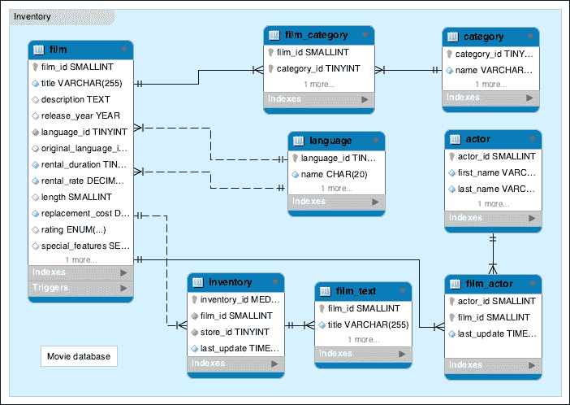
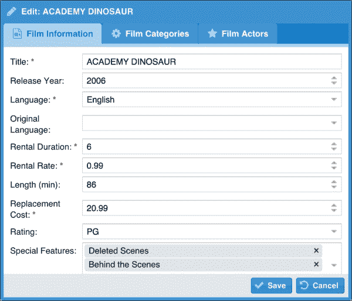
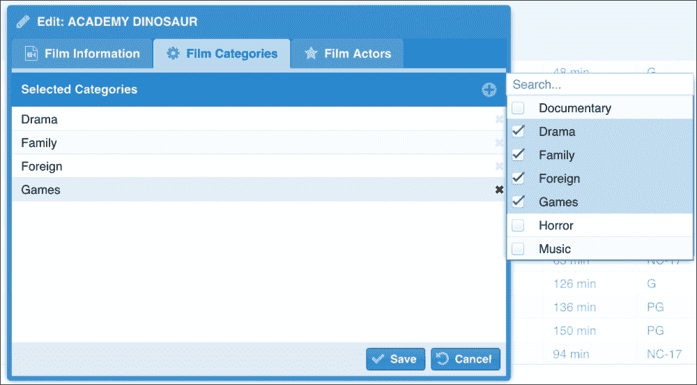
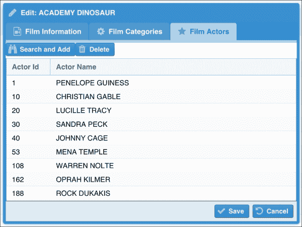

# 第八章 内容管理

在上一章中，我们开发了静态数据模块，该模块模拟了从数据库中编辑表格的过程。基本上，它是一个带有一些额外功能的单个表的**创建、读取、更新、删除**（**CRUD**）操作。在本章中，我们将进一步探讨从表中管理信息的复杂性。通常，在现实世界的应用程序中，我们想要管理的表与其他表有关联，我们必须管理这些关联。这正是本章的主题。我们如何在 Ext JS 中构建屏幕并管理复杂信息？

因此，在本章中，我们将涵盖：

+   使用 Ext JS 管理复杂信息

+   如何处理多对多关联

+   带关联的表单

+   组件重用

# 管理信息 – 电影

Sakila 数据库内部有四个主要模块：**库存**，它包含了电影信息以及库存信息（每个店面有多少部电影可供出租）；客户数据，它包含了客户信息；业务，它包含了店面、员工以及租赁和支付信息（这取决于库存和客户数据以提供一些信息）；以及视图，它包含了我们可以用于报告和图表的数据。

目前，我们只对**库存**、客户数据和业务感兴趣，这些包含了应用程序的核心业务信息。让我们来看看**库存**，它比其他两个表有更多的表：



根据 Sakila 文档：

*`电影`表是所有可能存放在店面中的电影的列表。每种电影的实际库存副本在`库存`表中表示。*

*`电影`表引用了`语言`表，并被`电影类别`、`电影演员`和`库存`表引用。*

`电影`表与`类别`和`演员`表之间存在多对多关系。它与`语言`表有两个多对一关系。在上一章中，我们已经开发了管理`类别`、`演员`和`语言`表的代码。现在，我们需要管理`电影`表与其他表之间的关系。

Ext JS 5 确实具有管理类似于`电影`表的关联实体的出色功能。我们将在本章深入探讨这些功能。

因此，让我们简要地看看本章将要开发的屏幕。

首先，我们需要一个屏幕来列出我们拥有的电影，如下所示：


这个屏幕显示了三个数据网格。第一个是`film`表，它将显示所有**电影**的列表。第二个是**电影类别**，它表示`film`和`category`表之间的多对多关系。第三个是**电影演员**，它表示`film`和`actor`表之间的多对多关系。

然后，如果我们想创建或编辑一个电影，我们将在窗口内创建一个表单面板，以便我们可以编辑其信息，如下所示：



由于`film`表与`categories`表有一个多对多关联，我们还需要在表单面板中使用不同的标签页来处理它。如果我们想添加更多与电影相关的类别，我们可以**搜索**并添加，如下所示：



同样，`film`表也与`actor`表有一个多对多关联，因此我们还需要在表单面板中处理它。以下截图展示了这一点：



如果我们想添加更多与电影相关的演员，我们可以使用**搜索并添加演员**，如下所示：


注意，我们对每个屏幕采取了不同的方法。这样我们可以学习更多在 Ext JS 中处理这些场景的方法。到本章结束时，我们将学会创建这个复杂的表单并保存相关数据。

因此，现在我们已经对在本章中将要实现的内容有了概念，让我们享受乐趣并动手实践吧！

# 显示电影数据网格

首先，让我们从基础知识开始。每次我们需要实现一个复杂的屏幕时，我们都需要从我们可以开发的 simplest component 开始。当这个组件工作后，我们可以开始逐步增加它并添加更复杂的功能。所以首先，我们需要创建一个模型来表示`film`表。在本章中，我们将使用 MVVM 方法，这样我们可以深入了解之前章节中没有涉及到的功能。一旦这部分代码工作正常，我们就可以处理`category`、`language`和`actor`表之间的关系。

## 电影模型

首先，我们将创建一个模型来表示`film`表。现在我们先不考虑这个表之间的关系。

我们需要创建一个名为`Packt.view.film.FilmsGrid`的新类，如下所示：

```js
Ext.define('Packt.model.film.Film', {
    extend: 'Packt.model.staticData.Base', //#1

    entityName: 'Film',

    idProperty: 'film_id',

    fields: [
        { name: 'film_id' },
        { name: 'title'},
        { name: 'description'},
        { name: 'release_year', type: 'int'},
        { name: 'language_id'},
        { name: 'original_language_id'},
        { name: 'rental_duration', type: 'int'},
        { name: 'rental_rate', type: 'float'},
        { name: 'length', type: 'int'},
        { name: 'replacement_cost', type: 'float'},
        { name: 'rating'},
        { name: 'special_features'}
    ]
});
```

由于所有 Sakila 表都有`last_update`列，我们将扩展`Packt.model.staticData.Base`以避免在创建代表 Sakila 表的每个模型时声明此字段。`staticData.Base`类也扩展了`Packt.model.Base`，它包含我们模型的`schema`和`proxy`细节。

对于字段，我们将与`film`表中的字段相同。

## 电影模型视图

我们下一步是创建一个 ModelView，它将包含一个 Store，该 Store 将加载影片集合。让我们在 ViewModel 中创建一个名为 `films` 的 Store（记住，Store 的名称总是 Model 名称的复数形式——如果你想要遵循 Sencha 命名约定），如下所示：

```js
Ext.define('Packt.view.film.FilmsModel', {
    extend: 'Ext.app.ViewModel',

    alias: 'viewmodel.films',

    stores: {
        films: {
            model: 'Packt.model.film.Film', //#1
            pageSize: 15,   //#2
            autoLoad: true, //#3
            session: true   //#4
        }
    }
});
```

我们需要在 `app/view/film` 文件夹内创建一个名为 `FilmsModel.js` 的文件，并将前面的代码放入该文件中。

在 `films` Store 中，我们像往常一样声明 `model` (`#1`)，并且我们还声明 `pageSize` 为 `15` (`#2`)，这意味着我们将使用 Films 数据网格中的分页工具栏，并且我们将每单位时间检索 15 部影片的集合来显示在 GridPanel 中。

`autoLoad` 配置也被设置为 `true` (`#3`)。由于 ViewModel 在 View 实例化后创建，因此 Store 也会在 View 创建时加载。

最后，我们有一个 `session` 配置 (`#4`)。到目前为止，我们在这本书中还没有使用会话。当我们上一章中处理 CRUD 时，我们使用了 Store 来保存数据。在这一章中，我们将处理关联数据，并且当我们需要从不同的模型中保存数据时，会话可以非常有帮助。会话将在 View 中创建。在 ViewModel 中的 Store 内声明 `session: true` 将 Store 与 View 的会话链接起来。我们将在本章的后面讨论它是如何工作的。

## 影片数据网格（带分页）

现在我们已经有了 Model 和带有 Store 的 ViewModel，我们需要创建 `FilmsGrid`，我们可以按照以下方式操作：

```js
Ext.define('Packt.view.film.FilmsGrid', {
    extend: 'Packt.view.base.Grid', //#1
    xtype: 'films-grid',

    bind : '{films}',  //#2

    reference: 'filmsGrid', //#3

    columns: [{
        text: 'Film Id',
        width: 80,
        dataIndex: 'film_id'
    },{
        text: 'Title',
        flex: 1,
        dataIndex: 'title',
     renderer: function(value, metaData, record ){  //#4
            metaData['tdAttr'] = 'data-qtip="' +
                    record.get('description') + '"'; //#5
            return value;
        }
    },{
        text: 'Language',
        width: 100,
        dataIndex: 'language_id'
    },{
        text: 'Release Year',
        width: 110,
        dataIndex: 'release_year'
    },{
        text: 'Length',
        width: 100,
        dataIndex: 'length',
        renderer: function(value, metaData, record ){ //#6
            return value + ' min';
        }
    },{
        text: 'Rating',
        width: 70,
        dataIndex: 'rating'
    }]
});
```

随着我们的应用程序开始增长，我们注意到我们在不同的组件中使用了某些配置。例如，对于大多数的 GridPanels，我们使用带有**添加**、**编辑**和**删除**按钮的工具栏，或者我们可以使用带有**添加**按钮的工具栏，并将**编辑**和**删除**按钮放在网格内的 Widget Columns（或 Action Columns）中。由于 Sakila 数据库中的所有表都有**最后更新**列，因此这个列也是我们用于列出 Sakila 表信息的所有 GridPanels 的共同点。因此，我们可以创建一个超级 GridPanel（就像我们为静态数据模块专门创建的那样）。所以，对于影片 GridPanel，我们将从我们将要创建的 `base.Grid` (`#1`) 扩展。

已经声明了 ViewModel 后，我们也可以在这个网格中将 `films` Store 进行绑定 (`#2`)。为了使我们的工作更简单，我们还将声明这个网格的 `reference` (`#3`)。

然后，我们有列映射 `dataIndex` 与 Film 模型的字段。当我们想要操作将在网格中显示的信息时，我们可以使用 `renderer` 函数。对于长度列，我们想要显示长度和 `'min'`，因为影片的长度是以分钟为单位的。因此，我们可以返回值本身（长度）与我们要连接的字符串（`#6`）。

在渲染函数内部，我们还可以使用其他字段通过从`record`检索所需的字段来操作信息。例如，在标题列的渲染函数（`#4`）中，当用户将鼠标悬停在标题列上时，我们想要显示一个包含电影`description`（`#5`）的工具提示。但我们没有改变将要显示的值，即`title`（渲染函数的`value`参数）本身。

### 创建基础网格

要创建基本的`Grid`类，我们将在`app/view`内部创建一个名为`base`的新基本文件夹，以便我们可以放置所有的`base`类。然后我们将创建一个名为`Grid.js`的新文件，内容如下：

```js
Ext.define('Packt.view.base.Grid', {
    extend: 'Ext.grid.Panel',

    requires: [
        'Packt.util.Glyphs'
    ],

    columnLines: true,
    viewConfig: {
        stripeRows: true
    },

    initComponent: function() {
        var me = this;

        me.columns = Ext.Array.merge(
            me.columns,
            [{
                xtype    : 'datecolumn',
                text     : 'Last Update',
                width    : 150,
                dataIndex: 'last_update',
                format: 'Y-m-j H:i:s',
                filter: true
            },{
                xtype: 'widgetcolumn',
                width: 50,
                sortable: false,
                menuDisabled: true,
                widget: {
                    xtype: 'button',
                    glyph: Packt.util.Glyphs.getGlyph('edit'),
                    tooltip: 'Edit',
 handler: 'onEdit'   //#1
                }
            },{
                xtype: 'widgetcolumn',
                width: 50,
                sortable: false,
                menuDisabled: true,
                widget: {
                    xtype: 'button',
                    glyph: Packt.util.Glyphs.getGlyph('destroy'),
                    tooltip: 'Delete',
 handler: 'onDelete'  //#2
                }
            }]
        );

        me.callParent(arguments);
    }
});
```

我们在第七章中创建了一个与此类似的类。然而，这个类有一些不同。在`#1`和`#2`行中，我们声明了一个将在 ViewController 中处理的`handler`。使用 MVVM 和 Widget 列工作比使用 MVC 方法简单得多，因为我们不需要触发自定义事件；我们可以在 ViewController 内部简单地声明`onEdit`和`onDelete`方法。

### 添加 RowExpander 插件

让我们回到`FilmsGrid`类并添加`RowExpander`插件。`film`表中的列比我们在`FilmsGrid`类内部显示的列要多。我们可以使用`RowExpander`插件来显示其他信息。

我们将在`FilmsGrid`类内部添加以下代码，如下所示：

```js
plugins: [{
    ptype: 'rowexpander',
    rowBodyTpl: [
        '<b>Description:</b> {description}</br>',
        '<b>Special Features:</b> {special_features}</br>',
        '<b>Rental Duration:</b> {rental_duration}</br>',
        '<b>Rental Rate:</b> {rental_rate}</br>',
        '<b>Replacement Cost:</b> {replacement_cost}</br>'
    ]
}]
```

我们需要配置一个模板来显示我们想要显示的额外信息。在这种情况下，我们显示电影的`description`和一些无法适应列的其他信息，例如`rental`信息。

### 注意

如需了解有关模板的更多信息，请访问[`docs.sencha.com/extjs/5.0/5.0.0-apidocs/#!/api/Ext.Template`](http://docs.sencha.com/extjs/5.0/5.0.0-apidocs/#!/api/Ext.Template)和[`docs.sencha.com/extjs/5.0/5.0.0-apidocs/#!/api/Ext.XTemplate`](http://docs.sencha.com/extjs/5.0/5.0.0-apidocs/#!/api/Ext.XTemplate)。

不幸的是，无法使用`RowExpander`插件与关联模型一起使用。如果我们想显示关联数据，我们可以使用`SubTable`插件。同时使用`RowExpander`和`SubTable`插件也是不可能的。

使用前面的代码，网格中将添加一个新列，以便我们可以看到这些额外信息：


### Actor-Language – 处理 hasOne 关联

在第六章中，我们通过在`User`模型中添加新字段（创建`User`模型部分）使用`hasOne`关联处理了`User`和`Group`模型之间的关系。在本章中，我们将学习一种不同的方法来在网格中显示`hasOne`关联。

一部电影与语言有一个 `hasOne` 关联（语言与电影有一个 `hasMany` 关联）。我们将使用以下代码中的 `renderer` 函数显示语言 `name` 而不是 `language_id`：

```js
dataIndex: 'language_id',
renderer: function(value, metaData, record ){
   var languagesStore = Ext.getStore('staticData.Languages'); //#1
   var lang = languagesStore.findRecord('language_id', value);//#2
   return lang != null ? lang.get('name') : value;            //#3
} 
```

我们将利用 `Languages` Store 是在应用程序的全局范围内创建的事实（我们在 第七章，*静态数据管理* 中创建的）并使用它。这样，我们就不需要再次从服务器加载语言 `name`。因此，我们将使用存储管理器检索 Store (`#1`) 并搜索具有 `language_id` 的 `Language` 模型，这是我们正在寻找的 (`#2`)。如果存在该值，则显示它；否则，无论如何都显示 `language_id` 参数 (`#3`)。

尽管 Ext JS 有从服务器加载信息并使用关联功能解析的能力，但在这种情况下使用它是否值得，因为我们已经有一个包含我们需要的值的 Store 加载了？如果我们使用关联，这意味着将从服务器加载更多数据，其中一些数据对于不同的模型（在这种情况下，所有电影都有 `language_id` 为 `1`，即英语）可能是重复的。因此，相同的语言模型将被加载多次，我们从服务器加载的 JSON 也会更大。

### 添加分页工具栏

接下来，我们将声明一个分页工具栏。在 `FilmsGrid` 类内部，我们将添加以下代码：

```js
dockedItems: [{
    dock: 'bottom',
    xtype: 'pagingtoolbar',
    bind : {
        store: '{films}' //#1
    },
    displayInfo: true,
    displayMsg: 'Displaying films {0} - {1} of {2}',
    emptyMsg: "No films to display"
}]
```

分页工具栏是一个特殊的工具栏，它与 Store 相绑定。因此，我们需要指定 Store (`#1`)。在这种情况下，它将是我们在 `FilmsGrid` 中声明的同一个 Store。

#### 处理服务器端分页

由于我们正在使用分页工具栏，因此记住以下几点很重要。Ext JS 提供了帮助我们分页内容的工具，但让我们强调一下“提供”这个词。如果一次从数据库中检索所有记录，Ext JS 不会为我们进行分页。

### 注意

如果我们想要分页已加载的数据，我们可以使用 Ext JS SDK 内提供的 `PagingMemoryProxy` (`Ext.ux.data.PagingMemoryProxy`)。

如果我们查看 Ext JS 发送到服务器的请求，我们会发现当我们使用分页工具栏时，它会发送三个额外的参数。这些参数是 **start**、**limit** 和 **page**。例如，正如我们所看到的，当我们第一次加载 GridPanel 信息时，**start** 是 **0**，**limit** 是我们在 Store 上设置的 `pageSize` 配置（在这种情况下，**15**），而 **page** 是 **1**。以下图示了这一点：


当我们点击 GridPanel 的下一页时，**start** 将会是 **15**（0 + **limit**（15）= 15），**limit** 将保持 **15**（除非我们动态更改 `pageSize`，否则此值不会改变），而 **page** 将是 **2**。这可以通过以下图示来演示：


### 注意

有一个第三方插件可以根据用户的选项动态更改 `pageSize`，请参阅 [`github.com/loiane/extjs4-ux-paging-toolbar-resizer`](https://github.com/loiane/extjs4-ux-paging-toolbar-resizer)。

这些参数帮助我们分页数据库上的信息。例如，对于 MySQL，我们只需要 `start` 和 `limit`，因此我们需要从请求中获取它们，如下所示：

```js
$start = $_REQUEST['start'];
$limit = $_REQUEST['limit'];
```

然后，当我们执行 `SELECT` 查询时，我们需要在末尾添加 `LIMIT $start, $limit`（在 `WHERE`、`ORDER BY`、`GROUP BY` 子句之后，如果有这些子句）：

```js
$sql = "SELECT * FROM film LIMIT $start,  $limit";
```

这将从数据库中获取我们所需的信息。

另一个非常重要的细节是，分页工具栏显示了我们在数据库上拥有的总记录数：

```js
$sql = "SELECT count(*) as num FROM film";
```

因此，我们还需要在 JSON 中返回一个 `total` 属性，包含表的计数：

```js
echo json_encode(array(
  "success" => $mysqli->connect_errno == 0,
  "data" => $result,
  "total" => $total
));
```

然后 Ext JS 将接收到所有必需的信息，以便按预期工作分页。

##### MySQL、Oracle 和 Microsoft SQL Server 的分页查询

我们需要小心，因为如果我们使用不同的数据库，直接从数据库分页查询信息的方式就不同。

如果我们使用的是 Oracle 数据库，带有分页的 `SELECT` 查询如下所示：

```js
SELECT * FROM
  (select rownum as rn, f.* from
    (select * from film order by film_id) as f
  ) WHERE rn > $start  and rn <= ($start + $limit)
```

这将比 MySQL 复杂得多。现在让我们看看 Microsoft SQL Server（SQL Server 2012）：

```js
SELECT  *
FROM ( SELECT ROW_NUMBER() OVER ( ORDER BY film_id ) AS RowNum, *
          FROM films
        ) AS RowConstrainedResult
WHERE   RowNum > $start
    AND RowNum <= ($start + $limit)
ORDER BY RowNum
```

在 SQL Server 2012**中**，这要简单得多：

```js
SELECT * FROM film
ORDER BY film_id
OFFSET $start ROWS
FETCH NEXT $limit ROWS ONLY
```

在 Firebird**中**，这比 MySQL 简单：

```js
SELECT FIRST $limit SKIP $start * FROM film
```

所以，如果你使用的是不同于 MySQL 的数据库，请小心 SQL 语法。

# 创建电影容器

下一步是创建我们在本章开头提到的 **Films** 屏幕。它由一个带有按钮（**添加**）的工具栏、电影网格和两个相关网格（类别和演员）组成。我们将在这个 `Films.js` 文件中创建这个视图，如下所示：

```js
Ext.define('Packt.view.film.Films', {
    extend: 'Ext.panel.Panel',
    xtype: 'films',

    requires: [
        'Packt.view.base.TopToolBar',
        'Packt.view.film.FilmsGrid',
        'Packt.view.film.FilmActorsGrid',
        'Packt.view.film.FilmCategoriesGrid',
        'Packt.view.film.FilmsModel',
        'Packt.view.film.FilmsController'
    ],

    controller: 'films', //#1
    viewModel: {
        type: 'films'    //#2
    },

    session: true,       //#3

    layout: {
        type: 'vbox',
        align: 'stretch'
    },

    items: [{
        xtype: 'films-grid',  //#4
        flex: 1
    },{
        xtype: 'container',
        split: true,
        layout: {
            type: 'hbox',
            align: 'stretch'
        },
        height: 150,
        items: [{
            xtype: 'film-categories', //#5
            flex: 1
        },{
            xtype: 'film-actors',    //#6
            flex: 2
        }]
    }],

    dockedItems: [{
        xtype: 'top-tool-bar'    //#7
    }]
});
```

在这个类中，我们声明了一个 ViewController (`#1`) 和 ViewModel (`#2`)。ViewModel 已经创建，因此我们需要创建 ViewController。

接下来，我们有 `session` (`#3`)。如果提供，将为该组件创建一个新的会话实例。由于这个类是其他类的容器，因此会话将被所有子组件继承。当我们工作在 ViewController 时，我们将深入研究会话。

在第 `#4` 行，我们有我们创建的 `FilmsGrid` 类。在第 `#5` 和 `#6` 行，我们有 `categories` 和 `actors` 网格，我们将使用它们来显示多对多关联。

我们还在第 `#7` 行声明了 `TopToolBar`。这个工具栏是单独创建的，因此我们可以重用它，如下所示：

```js
Ext.define('Packt.view.base.TopToolBar', {
    extend: 'Ext.toolbar.Toolbar',
    xtype: 'top-tool-bar',

    requires: [
        'Packt.util.Glyphs'
    ],

    dock: 'top',
    items: [
        {
            xtype: 'button',
            text: 'Add',
            itemId: 'add',
            glyph: Packt.util.Glyphs.getGlyph('add'),
            listeners: {
                click: 'onAdd'
            }
        }
    ]
});
```

我们不能忘记更新 `menu` 表以反映电影的 `xtype`：

```js
UPDATE `sakila`.`menu` SET `className`='films' WHERE `id`='11';
```

我们将在下一章中向这个工具栏添加更多按钮。

## 处理多对多关联

`film`和`category`表通过多对多关系相关联。当这种情况发生时，会创建一个矩阵表，包含两列以存储相关实体的 ID 对。有一个矩阵表代表`film`和`category`表之间的多对多关系，称为`film_category`，还有一个称为`film_actor`的表代表`film`和`actor`之间的多对多关系。

要在 Ext JS 中表示多对多关系，我们需要将以下代码添加到`Film`模型中：

```js
manyToMany: {
    FilmCategories: {         //#1
        type: 'Category',     //#2
        role: 'categories',   //#3
        field: 'category_id', //#4
        right: {
            field: 'film_id', //#5
            role: 'films'     //#6
        }
    },
    FilmActors: {
        type: 'Actor',
        role: 'actors',
        field: 'actor_id',
        right: {
            field: 'film_id',
            role: 'films'
        }
    }
}
```

对于每个多对多关系，我们需要定义一个`名称`（`#1`）。该名称必须在模式内是唯一的。我们还需要定义一个`类型`（`#2`）。`类型`是关联`模型`的名称——我们可以使用`entityName`来定义关联的模型。我们还可以定义`角色`（`#3`），这将作为生成以检索关联数据的方法的名称。我们还需要指定用于标识关联的外键（`#4`）。由于多对多关系是在两个表之间创建的，我们还可以指定将此模型链接到矩阵表的信息，即`字段`（外键——`#5`）以及`关联`在`Category`和`Actor`模型中的`角色`（`#6`）。

在`Category`模型中，我们还将声明多对多关联：

```js
manyToMany: {
    CategoryFilms: {
        type: 'Film',
        role: 'films',
        field: 'film_id',
        right: {
            field: 'category_id',
            role: 'categories'
        }
    }
}
```

我们同样在`Actor`模型内部执行此操作：

```js
manyToMany: {
    ActorFilms: {
        type: 'Film',
        role: 'films',
        field: 'film_id',
        right: {
            field: 'actor_id',
            role: 'actors'
        }
    }
}
```

### 从服务器加载嵌套 JSON

在服务器端代码中，我们需要检索电影信息及其类别和演员。服务器将返回给 Ext JS 的 JSON 将具有以下格式：

```js
{
   "success":true,
   "data":[
      {
         "film_id":"1",
         "title":"ACADEMY DINOSAUR",
         "description":"A Epic Drama of a Feminist And a Mad Scientist who must Battle a Teacher in The Canadian Rockies",
         "release_year":"2006",
         "language_id":"1",
         "original_language_id":null,
         "rental_duration":"6",
         "rental_rate":"0.99",
         "length":"86",
         "replacement_cost":"20.99",
         "rating":"PG",
         "special_features":"Deleted Scenes,Behind the Scenes",
         "last_update":"2006-02-15 05:03:42",
         "categories":[
            {
               "category_id":"6",
               "name":"Documentary",
               "last_update":"2006-02-15 04:46:27"
            }
         ],
         "actors":[
            {
               "actor_id":"1",
               "first_name":"PENELOPE",
               "last_name":"GUINESS",
               "last_update":"2006-02-15 04:34:33"
            },
            {
               "actor_id":"10",
               "first_name":"CHRISTIAN",
               "last_name":"GABLE",
               "last_update":"2006-02-15 04:34:33"
            }
         ]
      }
   ],
   "total":"1000"
}
```

### 注意

服务器端代码包含在此书的源代码中。

如果我们检查`films` Store 的`Film`模型实例，我们会看到为每个关联创建了一个函数/方法，如下所示：


### 注意

当访问`model.actors()`或`model.categories()`时，方法将返回每个关联的 Store，而不是`Actor`或`Category`模型的数组。

#### 更改 ViewModel – 连锁 store

Ext JS 将理解这种关联，并能够创建方法和关联的 store，但我们需要通过在相同的 ViewModel 中添加`actors`和`categories` Store 来将 store 添加到会话中，如下所示：

```js
categories: {
 source: 'staticData.Categories',
    autoLoad: true,
    session: true
},
actors: {
 source: 'staticData.Actors',
    autoLoad: true,
    session: true
}
```

注意高亮的代码。我们正在创建的 stores 使用现有的 stores（我们在上一章中创建的，并且可以通过它们的`storeId`在应用程序的全局范围内访问）通过`source`配置。这种能力也在 Ext JS 5 中引入，被称为链式 store（`Ext.data.ChainedStore`）。链式 store 是一个现有 store 的视图。数据来自`source`；然而，这个 store 的视图可以独立地进行排序和过滤，而不会对源 store 产生影响。当我们想要有两个不同但数据同步的独立实例时，这非常有用。

### Film-Actor – 处理多对多关联

现在我们已经设置了多对多关联，我们可以创建`FilmActorsGrid`类。这个类将包含以下内容：

```js
Ext.define('Packt.view.film.FilmActorsGrid', {
    extend: 'Ext.grid.Panel',
    xtype: 'film-actors',

    requires: [
        'Packt.util.Glyphs'
    ],

 bind : '{filmsGrid.selection.actors}', //#1
    border: true,

    title: 'Film Actors',
    glyph: Packt.util.Glyphs.getGlyph('actor'),

    columns: [
        {
            text: 'Actor Id',
            width: 80,
            dataIndex: 'actor_id'
        },
        {
            xtype: 'templatecolumn',
            text: 'Actor Name',
            flex: 1,
            tpl: '{first_name} {last_name}' //#2
        }
    ]
});
```

这个网格包含一个我们迄今为止尚未使用的列，即模板列。当使用这个列时，你可以创建一个模板来显示多个字段（`#2`），而不是使用`renderer`函数来做到这一点。

上一段代码展示了如何在详细网格中显示关联数据。当我们从`FilmsGrid`中选择一部电影时，Actors 网格将自动通过将`actors`（关联的角色）与 Actors 网格绑定（`#1`）来显示关联数据。

### Film-Category – 处理多对多关联

我们将使用与 Film-Actor 多对多关联相同的处理方法来处理 Film-Category 多对多关联。我们将创建一个名为`FilmCategoriesGrid`的类。这个类将包含以下内容：

```js
Ext.define('Packt.view.film.FilmCategoriesGrid', {
    extend: 'Ext.grid.Panel',
    xtype: 'film-categories',

    requires: [
        'Packt.util.Glyphs'
    ],

 bind : '{filmsGrid.selection.categories}', //#1
    border: true,

    title: 'Film Categories',
    glyph: Packt.util.Glyphs.getGlyph('category'),

    columns: [
        {
            text: 'Category Id',
            width: 100,
            dataIndex: 'category_id'
        },
        {
            text: 'Category Name',
            flex: 1,
            dataIndex: 'name'
        }
    ]
});
```

我们还将`绑定`这个网格的 Store 到从关联（`#1`）加载的数据。

# 创建 ViewController

现在缺少的部分是 ViewController，它将处理我们在代码中声明的所有处理程序和监听器。我们将代码分成两个类：包含通用代码并可重用的`base.ViewController`，以及包含处理`Films`视图特定细节的代码的`film.FilmsController`。

## 基础 ViewController

在这个类中，我们将放置所有可以被具有与`Films`视图相同行为的其他视图重用的通用代码。例如，通过点击 Widget 列的按钮来编辑或删除记录会打开弹出窗口。如果用户点击**添加**按钮，然后关闭用于创建或编辑信息的弹出窗口。

这个类的代码如下所示：

```js
Ext.define('Packt.view.base.ViewController', {
    extend: 'Ext.app.ViewController',

    requires: [
        'Packt.util.Util',
        'Packt.util.Glyphs'
    ],

    onAdd: function(button, e, options){ //#1
        this.createDialog(null);
    },

    onEdit: function(button){ //#2
        this.createDialog(button.getWidgetRecord());
    },

    onCancel: function(button, e, options){ //#3
        var me = this;
        me.dialog = Ext.destroy(me.dialog);
    },

    onDelete: function(button, e, options){ //#4
        var record = button.getWidgetRecord();
        Ext.Msg.show({
            title:'Delete?',
            msg: 'Are you sure you want to delete?',
            buttons: Ext.Msg.YESNO,
            icon: Ext.Msg.QUESTION,
            fn: function (buttonId){
                if (buttonId == 'yes'){
                    record.drop();
                }
            }
        });
    }
});
```

在前一章中，你了解到在 MVC 中创建一个通用的控制器来处理来自多个屏幕的事件是可能的。它是通过使用我们创建的组件的通用选择器来实现的。在 MVVM 中，也可以创建一个通用的`ViewController`，但不是使用通用选择器（因为我们不与选择器一起工作）。这是可能的，如果我们设置一个监听器模式（组件将具有相同的`handler`名称），并声明一个通用的`ViewController`。然而，我们还需要为视图指定一个特定的`ViewController`，这个`ViewController`将扩展我们的基本`ViewController`。`ViewController`中的通用代码通过继承来处理。

在`FilmsGrid`类中，我们有两个处理程序：一个用于**编辑**Widget 按钮和一个用于**删除**Widget 按钮。

对于**删除**按钮（`#4`），我们只需要询问用户是否确定要删除`记录`，然后如果我们收到积极的回应，我们使用`record.drop()`方法来执行删除。`drop`方法将记录标记为已删除并等待在服务器上删除。当记录被删除时，它将自动从所有关联存储中移除，并且与该记录关联的任何子记录也将被删除（级联删除），具体取决于级联参数。由于视图和存储与会话相关联，当我们调用`drop`方法时，会话记录将此记录及其关联数据需要被删除，并且存储也会被通知。我们也可以使用存储的`remove`方法；它会产生相同的结果。

对于**添加**（`#1`）和**编辑**（`#2`）处理程序，我们希望打开**编辑**窗口，以便我们可以修改或创建一个新的电影。我们将使用我们在第六章中处理`Users`和`Groups`时使用的方法。`createDialog`方法将在特定的`ViewController`中创建，即我们将创建的`FilmsController`类。这样我们就可以有通用代码，但细节将在特定的`ViewController`中实现。

对于`edit`和`delete`处理程序的一个细节是，我们可以轻松地使用按钮（Widget 列）中的`getWidgetRecord`方法从网格中检索`record`。这种方法与我们前一章中使用的方法非常不同（在那里我们在 MVC 控制器中创建了一个自定义事件来处理）。

就像我们在第六章中做的那样，*用户管理*，我们将创建**编辑**窗口，并且它将包含一个**取消**按钮。当用户点击此按钮时，我们将销毁该窗口（`#3`）。

### 注意

我们可以回到第六章，并修改代码以使用这个`ViewController`。

## 创建`FilmsController`

现在，我们将实现`Films`视图的`ViewController`。它的初始代码如下；在随后的主题中，我们将向其中添加更多代码：

```js
Ext.define('Packt.view.film.FilmsController', {
    extend: 'Packt.view.base.ViewController',

    alias: 'controller.films'
});
```

## 添加或编辑电影

现在，`FilmsGrid`已经被渲染和加载，并且`add`和`edit`处理程序已经在`ViewController`中就位，我们需要创建`createDialog`方法。但首先，我们需要创建`Edit`窗口类。

正如我们在本章开头的屏幕截图中所见，**编辑**窗口有三个标签：一个用于编辑电影详情，另一个用于编辑与电影相关的类别，第三个用于编辑与电影相关的演员。目前，我们将只处理电影详情。

因此，在`app/view/film`中，我们将创建一个新的视图名为`Packt.view.film.FilmWindow`。这个类将是一个包含具有标签面板作为`item`的表单的窗口。在每个标签中，我们将放置电影的详情、类别和演员，如下所示：

```js
Ext.define('Packt.view.film.FilmWindow', {
    extend: 'Packt.view.base.WindowForm', //#1
    xtype: 'film-window',                 //#2

    requires: [
        'Packt.view.film.FilmFormContainer',
        'Packt.view.film.FilmActorsGrid',
        'Packt.view.film.FilmFormCategories'
    ],

    width: 537,

    items: [
        {
            xtype: 'form',
            reference: 'filmForm',  //#3
            layout: {
                type: 'fit'
            },
            items: [{
                xtype: 'tabpanel', //#4
                activeTab: 0,
                items: [{
                    xtype: 'film-form-container', //#5
                    glyph: Packt.util.Glyphs.getGlyph('film')
                },{
                    xtype: 'film-categories-form', //#6
                    glyph: Packt.util.Glyphs.getGlyph('category')
                }
                //film actors here
            ]
        }
    ]
});
```

这个窗口扩展自我们将要创建的自定义类（`#1`）。至于网格行的创建和编辑，我们总是使用窗口，因此我们可以创建一个具有通用配置的超级窗口类，并在我们的应用程序中使用它。我们将在一分钟内创建这个新类；让我们首先完成对这个类的概述。我们不能忘记声明一个`xtype`配置（`#2`）；我们将在`ViewController`中稍后使用这个`xtype`配置。

在这个窗口内部，我们有一个表单（`#3`），我们需要声明一个引用以便在`ViewController`中轻松检索。在表单内部，我们有一个标签面板（`#4`），其中包含一个包含电影信息的标签（`#5`）——我们将为它创建一个单独的类，以及类别（`#6`），我们也将为它创建一个单独的类。

这个类的最后一部分是以下代码中展示的演员详情：

```js
{
    xtype: 'film-actors',    //#7
    reference: 'actorsGrid', //#8
    dockedItems: [{
        dock: 'top',
        items: [
            {
                xtype: 'button',
                text: 'Search and Add',
                glyph: Packt.util.Glyphs.getGlyph('searchAndAdd'),
                listeners: {
                    click: 'onAddActor' //#9
                }
            },
            {
                xtype: 'button',
                text: 'Delete',
                glyph: Packt.util.Glyphs.getGlyph('destroy'),
                listeners: {
                    click: 'onDeleteActor' //#10
                }
            }
        ]
    }]
}
```

对于演员详情，我们将重用`Films`视图中显示的`Actors`网格（`#7`）。我们还将添加一个引用（`#8`），因为它在我们处理**搜索和添加**屏幕上的`onAddActor`（`#9`）监听器时将非常有用。最后，我们还需要一个用于删除按钮的监听器（`#10`）。

**添加**和**删除**演员按钮将向`film_actor`表中添加和删除条目。

### Packt.view.base.WindowForm

我们已经实现的所有**编辑**窗口都是一个具有适应布局的窗口，通常在其中包含一个表单面板。该窗口还包含一个**取消**和一个**保存**按钮。由于所有这些配置都是我们组件的默认配置，我们可以为它们创建一个超级窗口：

```js
Ext.define('Packt.view.base.WindowForm', {
    extend: 'Ext.window.Window',
    alias: 'widget.windowform',

    requires: [
        'Packt.util.Util',
        'Packt.util.Glyphs',
        'Packt.view.base.CancelSaveToolbar'
    ],

    height: 400,
    width: 550,
    autoScroll: true,
    layout: {
        type: 'fit'
    },
    modal: true,
    closable: false,

    bind: {
        title: '{title}', //#1
        glyph: '{glyph}'  //#2
    },

    dockedItems: [{
        xtype: 'cancel-save-toolbar'
    }]
});
```

注意，我们在`initConfig`方法中没有声明配置（这个方法在这个类中不存在）。这意味着这个类是一个基础类，任何东西都可以在子类中被覆盖。

这里一个重要的细节是，在这个窗口中使用的`标题`（`#1`）和`图标`（`#2`）配置可以绑定到 ViewModel 的信息。我们将在`createDialog`方法中处理这些细节。

这个窗口类使用`CancelSaveToolbar`。这个工具栏的代码如下：

```js
Ext.define('Packt.view.base.CancelSaveToolbar', {
    extend: 'Ext.toolbar.Toolbar',
    xtype: 'cancel-save-toolbar',

    requires: [
        'Packt.util.Glyphs'
    ],

    dock: 'bottom',
    ui: 'footer',
    layout: {
        pack: 'end',
        type: 'hbox'
    },
    items: [
        {
            xtype: 'button',
            text: 'Save',
            glyph: Packt.util.Glyphs.getGlyph('save'),
            listeners: {
                click: 'onSave' //#3
            }
        },
        {
            xtype: 'button',
            text: 'Cancel',
            glyph: Packt.util.Glyphs.getGlyph('cancel'),
            listeners: { 
                click: 'onCancel' //#4
            }
        }
    ]
});
```

在前面的类中，有对**保存**按钮（`#3`）的`监听器`，我们将在`FilmsController`类中处理它，以及对于**取消**按钮（`#4`），它由基础`ViewController`类处理。

### 小贴士

我们可以回到我们在第六章中实现的代码，*用户管理*和第七章，*静态数据管理*，并进行重构以使用基础类和工具栏类。这就是 Ext JS 及其面向对象方法的好处：它允许你重用代码，并且你可以像在其他面向对象语言中一样重构它，而且没有头痛的问题。

### 电影表单

TabPanel 的第一个项目是`film-form-container`。在这个类中，我们将声明所有代表`film`表列的字段。

让我们回到 Sakila 文档，看看`film`表的字段（[`dev.mysql.com/doc/sakila/en/sakila-structure-tables-film.html`](http://dev.mysql.com/doc/sakila/en/sakila-structure-tables-film.html)）。您也可以参考本章的第一张图片：

+   `film_id`: 这是表的主键，具有唯一值。因此，对于这个字段，我们可以使用隐藏字段来控制它。

+   `标题`: 这是电影的标题。因此，我们可以为它使用一个文本字段。数据库中的最大长度为 255，因此我们还需要添加验证。

+   `描述`: 这是电影的简短描述或剧情摘要。由于描述长度可达 5,000 个字符，我们可以使用文本区域来表示它。

+   `release_year`: 这是电影发布的年份。这可以是一个数值字段，最小值为 1950 年，直到当前年份加 1（比如说我们想要添加一部明年将要上映的电影）。

+   `language_id`: 这是一个指向语言表的键。它标识电影的语种。这可以是一个带有语言存储的组合框（当加载应用程序时已经填充）。

+   `original_language_id`: 这是一个指向语言表的键，用于标识电影的原始语言。当电影被翻译成新语言时使用。此外，这可以是一个带有语言存储的组合框（当加载应用程序时已经填充）。

+   `rental_duration`: 这是租赁期限的天数。这可以是一个数字字段，最小值为`1`，最大值为`10`（让我们给最大值设置一个限制）。

+   `rental_rate`：这是在`rental_duration`列指定的期间租用电影的费用。这也可以是一个数字字段。最小值是`0`，最大值是`5`，并且我们需要允许小数值。

+   `length`：这是电影以分钟为单位的时间长度。`length`列也可以是一个介于 1 到 999 之间的数值字段。

+   `replacement_cost`：这是如果电影未归还或损坏归还时向客户收取的金额。这也是一个数值字段。让我们设置最小值为`0`，最大值为`100`。

+   `rating`：这是分配给电影的评级。它可以是一组`G`、`PG`、`PG-13`、`R`或`NC-17`中的任何一个。由于这些有固定值，我们可以在单选按钮组或组合框中代表它们。我们将使用组合框。

+   `special_features`：这列出了 DVD 上包含哪些常见的特殊功能。它可以包括零个或多个预告片、评论、删减场景和幕后花絮。由于这可以是一个或多个，我们可以使用 Ext JS 5 中引入的 TagField。我们还可以使用复选框或允许多选的组合框。

首先让我们声明类结构，如下所示：

```js
Ext.define('Packt.view.film.FilmFormContainer', {
    extend: 'Ext.panel.Panel',
    xtype: 'film-form-container',

    requires: [
        'Packt.util.Util',
        'Packt.util.Glyphs'
    ],

    bodyPadding: 10,
    layout: {
        type: 'anchor'
    },
    title: 'Film Information',
    defaults: {
        anchor: '100%',
        msgTarget: 'side',
        labelWidth: 105
    },

    items: [
        //fields
    ]
});
```

字段将位于一个使用锚布局的面板（它将成为一个标签页）内，每个字段将占用所有可用的水平空间（`anchor: 100%`）。标签宽度为`105`像素，任何错误信息都将显示在字段的`side`上。到目前为止，我们还没有收到任何消息。

让我们声明前两个字段——`title`和`release_year`：

```js
{
    xtype: 'textfield',
    fieldLabel: 'Title',
    afterLabelTextTpl: Packt.util.Util.required,
    bind : '{currentFilm.title}' //#1
},
{
    xtype: 'numberfield',
    fieldLabel: 'Release Year',
    allowDecimals: false,               //#2
    bind : '{currentFilm.release_year}' //#3
},
```

这两个值都绑定到名为`currentFilm`的记录的字段上（我们将在`FilmsController`中稍后创建）。`Release Year`是一个数值字段，由于我们希望值是整数，因此不允许用户输入小数（`#2`）。

### 备注

关于表单和字段验证的更多信息，请参阅[`docs.sencha.com/extjs/5.0/components/forms.html`](http://docs.sencha.com/extjs/5.0/components/forms.html)。

接下来，我们有语言字段，如下所示：

```js
{
    xtype: 'combobox',
    fieldLabel: 'Language',
    displayField: 'name',
    valueField: 'language_id',
    queryMode: 'local',
    store: 'staticData.Languages', //#4
    afterLabelTextTpl: Packt.util.Util.required,
    bind : '{currentFilm.language_id}' //#5
},
{
    xtype: 'combobox',
    fieldLabel: 'Original Language',
    displayField: 'name',
    valueField: 'language_id',
    queryMode: 'local',
    store: 'staticData.Languages',
    bind : '{currentFilm.original_language_id}' //#6
},
```

由于这两个组合框都代表语言，它们的配置将完全相同，除了`fieldLabel`和`bind`（`#5`和`#6`）。

注意，我们正在使用相同的存储器（`#4`）来处理这两个字段，并且我们希望它们具有相同的值，这意味着如果用户在静态数据的语言 GridPanel 中添加或更改语言，我们希望这些更改同时应用于这些存储器，这就是为什么我们使用与静态数据模块相同的存储器。

然后我们有四个数值字段：`rental_duration`、`rental_rate`、`length`和`replacement_cost`：

```js
{
    xtype: 'numberfield',
    fieldLabel: 'Rental Duration',
    allowDecimals: false,
    afterLabelTextTpl: Packt.util.Util.required,
    bind : '{currentFilm.rental_duration}'
},
{
    xtype: 'numberfield',
    fieldLabel: 'Rental Rate',
    step: 0.1,
    afterLabelTextTpl: Packt.util.Util.required,
    bind : '{currentFilm.rental_rate}'
},
{
    xtype: 'numberfield',
    fieldLabel: 'Length (min)',
    allowDecimals: false,
    bind : '{currentFilm.length}'

},
{
    xtype: 'numberfield',
    name: 'replacement_cost',
    fieldLabel: 'Replacement Cost',
    step: 0.1,
    afterLabelTextTpl: Packt.util.Util.required,
    bind : '{currentFilm.replacement_cost}'
},
```

有一件事非常重要：无论何时我们都有数值字段并且想要从模型中加载它们，我们需要模型中的字段也是数值的（`int`或`float`）；否则，表单将无法正确加载值。

然后我们有带有其`store`的评级组合框，如下所示：

```js
{
    xtype: 'combobox',
    fieldLabel: 'Rating',
    displayField: 'text',
    valueField: 'text',
    queryMode: 'local',
    bind: {
        value: '{currentFilm.rating}', //#6
        store: '{ratings}'             //#7
    }
},
```

我们有一个与这个组合框绑定的`value`（`#6`）和一个`store`（`#7`）。我们将在`FilmsModel`中创建这个 Store。

最后，我们有`tagfield`和`textareafield`：

```js
{
    xtype: 'tagfield',
    fieldLabel: 'Special Features',
    displayField: 'text',
    valueField: 'text',
    filterPickList: true,
    queryMode: 'local',
    publishes: 'value',
    stacked: true,
    bind: {
        value: '{specialFeatures}', //#8
        store: '{special_features}' //#9
    }
},
{
    xtype: 'textareafield',
    fieldLabel: 'Description',
    bind : '{currentFilm.description}'
}
```

Tag field 是在 Ext JS 5 中引入的，其行为与允许您选择多个值的组合框非常相似。为了设置选定的值，我们需要传递一个数组（`#8`）。在`Film`模型中，`special_features`是一个字符串。因此，我们将在 ViewModel 中也使用公式来处理这些值。我们还将创建一个`store`配置（`#9`）在 ViewModel 中来表示这个静态 Store。

### 电影分类

现在我们已经涵盖了电影详情部分，我们可以处理最复杂的部分，即与`分类`和`演员`表的关联。`分类`和`演员`表与`电影`表有多个对多个的关联。

如在电影表单中声明的那样，我们将声明一个新的类来表示这个标签页：

```js
Ext.define('Packt.view.film.FilmFormCategories', {
    extend: 'Ext.container.Container',

    xtype: 'film-categories-form',

    requires: [
        'Ext.view.MultiSelector'
    ],

    title: 'Film Categories',

    layout: 'fit',

    items: [{
        xtype: 'multiselector',
        title: 'Selected Categories',
        reference: 'categoriesMultiSelector',

        fieldName: 'name',

        viewConfig: {
            deferEmptyText: false,
            emptyText: 'No categories selected'
        },

        bind: '{currentFilm.categories}', //#1

        search: {
            field: 'name',
            store: {
                type: 'categories', //#2
                autoLoad: true
            }
        }
    }]
});
```

这个类包含一个`多选器`，这是 Ext JS 5 中引入的新组件。它创建了一个网格来渲染选定的值，并且它还将显示一个红色交叉符号来移除不需要的值。我们可以在其 Store（`#1`）中设置任何选定的值。此组件还允许您使用由`search`配置设置的加号添加值。我们还需要设置一个`store`（`#2`）来提供用户可以选择的选项。

### 电影演员

与电影的关系，演员与电影的关系非常类似于`分类`和`电影`表之间的关系，意味着它也是一个多对多关系。我们将以与处理`电影分类`不同的方式来处理`演员`表的多对多关系。由于可用的分类选项有限，我们可以使用`多选器`组件来表示它。我们不知道我们数据库中可以有多少演员，所以这要复杂一些。我们将采用的方法是显示一个网格来渲染选定的演员，并有一个**添加**按钮，以便用户可以搜索并添加所需值。

我们已经在`FilmWindow`类内部声明了网格。待定的是将显示弹出窗口以搜索可用演员的类。

#### 搜索演员 – 实时搜索组合框

Live Search 组合框的想法是为用户显示**搜索**屏幕和一个组合框字段，用户可以在其中输入几个字符，然后系统将进行实时搜索，显示与用户搜索匹配的演员。所有与搜索匹配的演员都将显示为组合框的项目，组合框还将具有分页功能。当用户选择演员时，我们将显示其`last_name`和`first_name`。除了演员姓名外，我们还将显示该演员出演的电影列表。

##### 模型

首先，我们需要一个模型来表示从服务器检索的信息。我们将检索演员信息以及该演员已经制作的电影。因此，我们可以创建一个从`Actor`模型扩展的模型，在`SearchActor`模型中，我们只需要声明缺失的字段：

```js
Ext.define('Packt.model.film.SearchActor', {
    extend: 'Packt.model.staticData.Actor',

    fields: [
        { name: 'film_info' }
    ]
});
```

##### 存储

接下来，我们需要一个存储库来加载`SearchActor`模型集合，如下所示：

```js
Ext.define('Packt.store.film.SearchActors', {
    extend: 'Ext.data.Store',

    requires: [
        'Packt.model.film.SearchActor'
    ],

    alias: 'store.search-actors',

    model: 'Packt.model.film.SearchActor',

    pageSize: 2,

    proxy: {
        type: 'ajax',
        url: 'php/actor/searchActors.php',

        reader: {
            type: 'json',
            rootProperty: 'data'
        }
    }
});
```

在服务器上，我们将使用`actor_info`视图来检索信息。然而，组合框还传递了三个额外的参数：用于分页的`start`和`limit`，以及一个名为`query`的参数，包含用户输入的用于实时搜索的文本。

我们的`SELECT`查询将类似于以下内容：

```js
$start = $_REQUEST['start'];
$limit = $_REQUEST['limit'];
$query = $_REQUEST['query'];

//select the information
$sql = "SELECT * FROM actor_info ";
$sql .= "WHERE first_name LIKE '%" . $query . "%' OR ";
$sql .= "last_name LIKE '%" . $query . "%' ";
$sql .= "LIMIT $start,  $limit";
```

由于我们正在处理分页，我们不能忘记计算与搜索匹配的记录数，并将结果返回到 JSON 的`total`属性中：

```js
$sql = "SELECT count(*) as num FROM actor_info ";
$sql .= "WHERE first_name LIKE '%" . $query . "%' OR ";
$sql .= "last_name LIKE '%" . $query . "%' ";
```

现在，我们能够根据用户输入的搜索文本检索信息。

##### 实时搜索组合框

我们接下来的步骤是实现将要提供搜索工具的视图。因此，我们将创建一个从`Ext.window.Window`扩展的类，在这个类中，我们将有一个组合框，它将提供所有进行实时搜索的功能。代码如下所示：

```js
Ext.define('Packt.view.film.FilmSearchActor', {
    extend: 'Ext.window.Window',
    xtype: 'search-actor',

    requires: [
        'Packt.store.film.SearchActors'
    ],

    width: 600,
    bodyPadding: 10,
    layout: {
        type: 'anchor'
    },
    title: 'Search and Add Actor',
    autoShow: true,
    closable: false,
    glyph: Packt.util.Glyphs.getGlyph('searchAndAdd'),
    reference: 'search-actor',

    items: [
        {
            //combobox // #1
        }, {
            xtype: 'component',
            style: 'margin-top:10px',
            html: 'Live search requires a minimum of 2 characters.'
        }
    ]
});
```

在底部，只有一个注释，提示用户至少输入两个字符，以便实时搜索可以工作，如下面的截图所示：


现在，让我们看看之前代码中`#1`位置所对应的组合框的代码：

```js
xtype: 'combo',
reference: 'comboActors',   //#2
displayField: 'first_name', //#3
valueField: 'actor_id',     //#4
typeAhead: false,
hideLabel: true,
hideTrigger:true,           //#5
anchor: '100%',
minChars: 2,                //#6
pageSize: 2,                //#7
store: {
    type: 'search-actors'   //#8
},

displayTpl: new Ext.XTemplate( //#9
        '<tpl for=".">' +
        '{[typeof values === "string" ? values : values["last_name"]]}, ' +
        '{[typeof values === "string" ? values : values["first_name"]]}' +
        '</tpl>'
),

listConfig: {                //#10
    loadingText: 'Searching...',
    emptyText: 'No matching posts found.',

    // Custom rendering template for each item
    getInnerTpl: function() {
        return '<h3><span>{last_name}, {first_name}</span></h3></br>' +
            '{film_info}';
    }
}
```

为了开始，我们将声明`reference`，这样我们可以在 ViewController 中轻松检索此组件（`#2`）。像往常一样，我们需要一个`store`声明（`#8`）来填充组合框。在这个例子中，我们通过其类型实例化存储库。因此，我们需要在这个类的`requires`中声明存储库的完整名称。

然后我们需要`displayField`（`#3`）。`displayField`将只显示当从实时搜索中选择演员时的演员的`first_name`。然而，我们希望显示`last_name`和`first_name`。因此，为了能够做到这一点，我们需要重写`displayTpl`模板（`#9`）。这将是我们得到的结果：


接下来，我们有`valueField`（`#4`），它是所选演员的 ID；我们将隐藏下拉箭头（称为`trigger`—`#5`），以便实时搜索可以工作。用户需要至少输入两个字符（`#6`），组合框将每页显示两个演员（`#7`）。

然后，我们有`listConfig`（`#10`），在这里我们可以配置加载文本和空文本，以及显示演员信息的模板。基本上，我们在顶部显示`last_name`和`first_name`并加粗，在下一行显示该演员已经制作的所有电影。

## 补充 ViewModel

在 ViewModel 中，我们需要完成两个待办事项：添加 `ratings` 和 `special_features` 存储，并实现我们在电影详情表单中使用的 `specialFeatures` 公式。

那么，让我们开始声明我们的 ViewModel 中的存储，如下所示：

```js
ratings: {
    model: 'Packt.model.TextCombo',
    data : [ // ENUM('G','PG','PG-13','R','NC-17')
        ['G'],
        ['PG'],
        ['PG-13'],
        ['R'],
        ['NC-17']
    ],
    session: true
},
special_features: {
    model: 'Packt.model.TextCombo',
    data : [
        ['Trailers'],
        ['Commentaries'],
        ['Deleted Scenes'],
        ['Behind the Scenes']
    ],
    session: true
}
```

这两个存储都有预定义的 `data`，这意味着它们是 ArrayStore 的实例。这种类型的 Store 在这种情况下非常有用。这两个存储使用的模型如下所示：

```js
Ext.define('Packt.model.TextCombo', {
    extend: 'Ext.data.Model',

    idProperty: 'text',

    fields: [
        { name: 'text' }
    ]
});
```

模型非常简单，只有一个字段。我们可以为任何创建用于组合框的 Store 重复使用这个模型。

### 与公式和双向数据绑定一起工作

我们创建了一个标签字段来声明电影的特殊功能。这个字段需要设置一个值数组，并且还需要返回一个值数组作为字段值。模型中的输出字段 `special_features` 是一个字符串，显然这不是一个数组！直到 Ext JS 4，我们不得不在控制器（或者在代码的其他地方，但最好是控制器）中手动编码和解码值。随着 Ext JS 5 的推出以及 ViewModel 的引入，我们可以使用一个名为公式的功能。

可以创建类似于我们可以在模型中声明的额外 `fields` 的简单公式（我们在 `User` 模型中声明 `groupName`），也可以声明更复杂的 `formulas`。在 Ext JS 示例中，我们可以找到一些如何使用简单 `formulas` 的示例。

让我们看看绑定到 `FilmFormContainer` 类中的 `tagfield` 的名为 `specialFeatures` 的公式：

```js
formulas: {
    specialFeatures : { //#1

        bind: {
            bindTo: '{currentFilm.special_features}', //#2
            deep: true                                //#3
        },

        get: function(value){ //#4
            var values = value ? value.split(',') : [],
                texts = [];
            values.forEach(function(item){
                texts.push(Ext.create('Packt.model.TextCombo',{
                    text: item
                }));
            });
            return texts;
        },

        set: function(value){ //#5
            if (value){
                this.get('currentFilm').set('special_features', value.join());
            }
        }
    }
}
```

我们需要做的第一件事是为我们的 `formulas` 声明命名（`#1`）。我们可以将我们的公式绑定到现有的值（例如选择）。在我们的例子中，我们绑定到 `currentFilm.special_features` 的 `special_features` 属性（`#2`）——我们将在 ViewController 中的稍后时间传递给 **编辑** 窗口）。我们还指定这是一个 `deep` 数据绑定（`#3`），这意味着 `currentFilm.special_features` 中发生的任何更改都将更新公式，或者通过其方法发生的任何更新也将更新 `currentFilm.special_features`。

我们还可以为公式定义一个获取器和设置器方法。首先，我们定义一个 `get` 方法（`#4`）。这个方法接收来自 `currentFilm.special_features` 的 `value`，分割字符串，并将其转换为数组，将被标签字段使用。同样，我们有一个 `set` 方法（`#5`），它将接收在标签字段中设置的 `value`，将其转换为字符串，并更新 `currentFilm.special_features`。只需记住 `currentFilm` 是 `Film` 模型的实例。

# 电影 ViewController

在前面的章节中，我们已经介绍了一些如何保存数据的示例。我们使用了 `submit` 表单、Ajax `request` 以及 Store 中的写入资源。在本章中，让我们关注我们尚未实现的功能。不要担心，完整的实现可以在本书附带源代码中找到。

## `createDialog` 方法

我们为我们的应用程序创建了所有视图。在基础 `ViewController` 中，我们创建了添加和编辑按钮的处理程序，并且两者都调用 `createDialog` 方法，这是我们接下来要开发的。

策略是，当用户点击 `Add` 按钮时显示一个空的 `Edit` 窗口，而当用户点击 `Edit` 按钮时显示选定的电影。此方法的源代码如下：

```js
createDialog: function(record){

    var me = this,
        view = me.getView(),        //#1
        glyphs = Packt.util.Glyphs;

    me.isEdit = !!record;           //#2
    me.dialog = view.add({          //#3
        xtype: 'film-window',
        viewModel: {                //#4
            data: {                 //#5
                title: record ? 'Edit: ' + record.get('title') : 'Add Film',
                glyph: record ? glyphs.getGlyph('edit') : glyphs.getGlyph('add')
            },
            links: {                     //#6
                currentFilm: record || { //#7
                    type: 'Film',
                    create: true
                }
            }
        },
        session: true //#8
    });

    me.dialog.show(); //#9
}
```

我们首先要做的是获取视图的引用，即 `Films` 类 (`#1`)。接下来，我们还将创建一个 `isEdit` 标志 (`#2`) 并将其分配给 ViewController，这样我们就可以稍后访问其他方法（如 `save` 方法）。

然后，我们将实例化 `Edit` 窗口，将其添加到视图 (`#3`)。当我们向主视图添加子视图时，它将继承 ViewModel 和 ViewController。然而，在这种情况下，我们正在为 `Edit` 窗口的 ViewModel 设置特定的配置 (`#4`)，这意味着它将能够访问已经存在的配置以及我们设置的配置，例如 `title` 和 `glyph`，这是预定义的数据 (`#5`)。

接下来，我们将创建一个链接 (`#6`) 到一个名为 `currentFilm` 的记录（`(#7)`），我们在 `Edit` 窗口的绑定配置中使用过。如果是编辑，它将链接到网格中的选定行；否则，我们创建一个新的 `Film` 模型实例。

我们还将为这个视图创建一个子 `session` (`#8`)。当我们讨论 `save` 方法时，我们将讨论 `session`。

最后，我们显示 `Edit` 窗口弹出 (`#9`)。

## 从 Live Search 获取选定的演员

当用户搜索演员并点击 `Add Selected` 时，我们将在 `ViewController` 的 `onSaveActors` 方法中处理该事件。此方法的逻辑是，我们需要获取 combobox 中选定的演员 ID 并在 `actors` Store 中搜索其值。一旦我们有了 `Actor` 模型实例，我们就可以将其添加到 `actorsGrid` Store 中。代码如下：

```js
onSaveActors: function(button, e, options){
    var me = this,
        value = me.lookupReference('comboActors').getValue(), //#1
        store = me.getStore('actors'),                        //#2
        model = store.findRecord('actor_id', value),          //#3
        actorsGrid = me.lookupReference('actorsGrid'),        //#4
        actorsStore = actorsGrid.getStore();                  //#5

    if (model){
        actorsStore.add(model); //#6
    }

    me.onCancelActors(); //#7
}  
```

首先，我们获取 combobox 的引用 (`#1`) 并获取其 `value`，这将返回选定演员的 ID。接下来，我们将获取在 `FilmsModel` 中声明的 `actors` Store 的引用 (`#2`)。我们将在 Store 中搜索选定的演员 (`#3`)；它将返回 `Actor` 模型引用或 null（如果演员不存在）。然后我们获取 `actorsGrid` 的引用（`(#4)`——在 films 表单内部），我们还获取其 Store (`#5`)。

如果找到一个演员，我们将将其添加到`actorsGrid`存储库中（`#6`）。这个网格绑定到所选电影演员的关联，因此如果从网格存储中添加或删除演员，它也将从关联中添加或删除。这是 Ext JS 5 中双向数据绑定的另一个例子。

最后，我们使用以下方法关闭 Live Search 弹出窗口（`#7`）：

```js
onCancelActors: function(button, e, options){
    var me = this;
    me.searchActors = Ext.destroy(me.searchActors);
}
```

## 保存表单和会话操作

现在是保存任何更新、删除或创建的数据的时候了。我们在表单中进行的任何更改都将保存到会话中（`Ext.data.Session`）。会话是在 Ext JS 5 中引入的，当我们在处理关联时非常有用。我们通过在它中添加配置`session: true`将一个会话添加到我们的电影视图中。然后，ViewModel 中的所有存储都将绑定到会话，这意味着在存储或会话中进行的任何更改都将同步。

让我们看看`onSave`方法：

```js
onSave: function(button, e, options){
    var me = this,
        dialog = me.dialog,
        form = me.lookupReference('filmForm'),
        isEdit = me.isEdit,
        session = me.getSession(), //#1
        id;

    if (form.isValid()) {
        if (!isEdit) {
            id = dialog.getViewModel().get('currentFilm').id; //#2
        }
        dialog.getSession().save(); //#3
        if (!isEdit) {
            me.getStore('films').add(session.getRecord('Film', id)); //#4
        }
        me.onCancel();
    }

    var batch = session.getSaveBatch(); //#5
    if (batch){
        batch.start();                  //#6
    }
}
```

我们将从会话中获取待保存的信息并将其保存在服务器上。首先，我们需要获取`session`（`#1`）。然后，如果是一部新电影，我们将获取电影的`id`（`(#2)`——Ext JS 为每个模型创建一个随机临时 ID，通常以实体名称和顺序号命名）。这个`id`在我们将其保存到数据库并使用数据库表顺序 ID 后将被覆盖。

记住，当我们创建对话框时，我们分配了一个子会话给**编辑**窗口？这允许我们在不提交数据的情况下工作，这意味着我们可以通过销毁**编辑**窗口轻松地回滚更改。当我们想将子会话中的数据正式保存到`Films`会话中时，我们可以从**编辑**窗口调用`getSession`方法并保存它（`#3`）。这将保存子会话数据到`Film`会话。

接下来，如果是一部新电影，我们还想将记录添加到`films`存储库中（这样它也可以在`FilmsGrid`中显示——(`#4`)）。

从会话中保存信息有两种不同的方式。第一种方式是使用`batch`（`Ext.data.Batch`），可以从会话中检索（`#5`），第二种方式是执行其`start`（`#6`）方法。这将触发 CRUD 操作，并使用`proxy`详细信息连接到会话中待保存模型的服务器。

### 自定义 Writer – 保存相关数据

然而，会话不会保存相关数据。如果我们创建一个电影、类别和演员，每个相应模型将触发创建操作，但不会将要在多对多矩阵表中保存的数据发送到服务器。

我们可以创建一个自定义的`writer`类，将任何相关数据作为一个批次发送到服务器。然后，我们需要在服务器上处理相关数据的适当 CRUD 操作。代码如下：

```js
Ext.define('Packt.ux.data.writer.AssociatedWriter', {
    extend: 'Ext.data.writer.Json',
    alias: 'writer.associatedjson',

    constructor: function(config) {
        this.callParent(arguments);
    },

    getRecordData: function (record, operation) {
        record.data = this.callParent(arguments);
        Ext.apply(record.data, record.getAssociatedData());
        return record.data;
    }
});
```

然后，我们需要回到`Packt.model.Base`类，将此`writer`类添加到`requires`声明中，并按以下方式更改写入器类型：

```js
writer: {
 type: 'associatedjson',
    //...
},
```

所有相关数据都将发送到服务器；同样地，当我们从服务器读取信息时，我们也会接收到嵌套的 JSON。

### 手动保存会话数据

将会话数据保存到服务器的第二种方法是手动操作。如果我们使用会话的`getChanges`方法，它将返回一个对象，其中包含所有待保存到服务器上的信息，包括关联数据。

例如，如果我们尝试编辑一个影片，添加一些演员信息和分类信息，并调用`JSON.stringify(session.getChanges(), null, 4)`，我们将得到以下类似的输出：

```js
{
    "Film": {
        "U": [
            {
                "title": "ACADEMY DINOSAUR - edit",
                "language_id": "2",
                "original_language_id": "3",
                "film_id": "1",
                "id": null
            }
        ],
        "categories": {
            "D": {
                "1": [
                    "6"
                ]
            },
            "C": {
                "1": [
                    "7",
                    "8",
                    "9"
                ]
            }
        },
        "actors": {
            "D": {
                "1": [
                    "1"
                ]
            },
            "C": {
                "1": [
                    "71"
                ]
            }
        }
    }
}
```

这意味着我们正在更新（`U`）ID 为`1`的影片的一些字段，从影片`1`中删除（`D`）ID 为`6`的分类，并将分类`7`、`8`和`9`添加（`C`）到影片`1`中。我们还在影片`1`中删除（`D`）演员`1`并添加（`C`）演员`71`。请注意，`categories`和`actors`是我们为`Film`模型创建的多对多关联的名称。

我们还可以使用此对象手动在服务器上保存数据。

# 摘要

在本章中，你学习了如何实现一个更复杂的屏幕来管理从数据库中获取的库存信息。你还学会了如何处理多对多关联。你学习了如何使用不同的表单字段以及如何进行实时搜索。此外，你还学习了如何从会话中保存数据。

在下一章中，我们将学习如何将一些不属于 Ext JS API 原生功能的额外功能添加到我们迄今为止已经开发的屏幕中，例如打印、导出到 Excel 和导出到 PDF，以及 GridPanel 的内容。我们还将学习如何实现图表并将它们导出为图像和 PDF。
