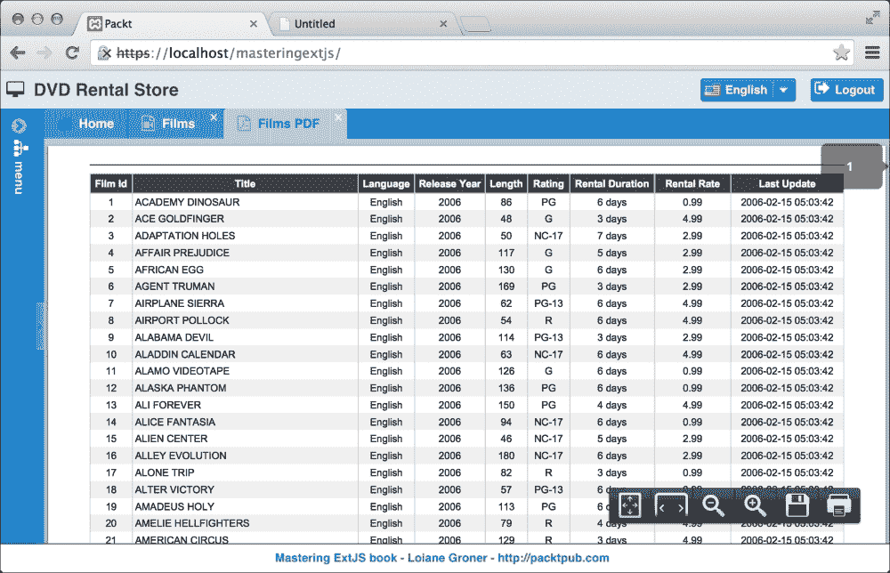

# 第九章。添加额外功能

我们几乎到了应用程序的最后阶段。Ext JS 提供了强大的功能，但还有一些功能我们需要借助其他技术自己编码。尽管我们拥有具有分页、排序和过滤功能的 GridPanel，但有时用户可能会对应用程序有更高的期望。添加打印、导出到 Excel 和 PDF 以及将图表导出到图片和 PDF 的功能可以为应用程序增添巨大价值，并取悦最终用户。

因此，在本章中，我们将涵盖：

+   打印 GridPanel 的记录

+   将 GridPanel 信息导出为 PDF 和 Excel

+   创建图表

+   将图表导出到 PDF 和图片

+   使用第三方插件

# 将 GridPanel 导出为 PDF 和 Excel

我们将要实现的第一项功能是将 GridPanel 的内容导出到 PDF 和 Excel。我们将为前一章中实现的 `Films` GridPanel 实现这些功能。然而，对于您可能在 Ext JS 应用程序中拥有的任何 GridPanel，逻辑都是相同的。

我们首先要做的是将导出按钮添加到 GridPanel 工具栏中。我们将添加三个按钮：一个用于打印 GridPanel 的内容（我们将在稍后开发这个功能，但现在让我们先添加这个按钮），一个用于 **导出到 PDF** 的按钮，以及一个用于 **导出到 Excel** 的按钮：


记住，在前一章中，我们创建了一个工具栏，`Packt.view.base.TopToolBar`。我们将在该工具栏上添加这三个按钮：

```js
items: [
    //Add Button
    {
        xtype: 'tbseparator'
    },
    {
        xtype: 'button',
        text: 'Print',
        glyph: Packt.util.Glyphs.getGlyph('print'),
        listeners: {
            click: 'onPrint'
        }
    },
    {
        xtype: 'button',
        text: 'Export to PDF',
        glyph: Packt.util.Glyphs.getGlyph('pdf'),
        listeners: {
            click: 'onExportPDF'
        }
    },
    {
        xtype: 'button',
        text: 'Export to Excel',
        glyph: Packt.util.Glyphs.getGlyph('excel'),
        listeners: {
            click: 'onExportExcel'
        }
    }
]
```

所有按钮都有 `listeners`，我们将在 ViewController 中处理。在这种情况下，按钮将位于 `FilmsController` 类中。

在 `Glyphs` 类中，我们还将添加以下属性来表示图标：

```js
print: 'xf02f',
pdf: 'xf1c1',
excel: 'xf1c3'
```

## 导出到 PDF

现在按钮已经在 `Films` GridPanel 中显示，是时候回到 `FilmsController` 并添加这些功能了。

我们将监听第一个按钮的 **导出到 PDF** `click` 事件。当用户点击此按钮时，我们将执行以下方法：

```js
onExportPDF: function(button, e, options) {
    var mainPanel = Ext.ComponentQuery.query('mainpanel')[0]; //#1

    var newTab = mainPanel.add({
        xtype: 'panel',
        closable: true,
        glyph: Packt.util.Glyphs.getGlyph('pdf'),
        title: 'Films PDF',
        layout: 'fit',
        html: 'loading PDF...',
        items: [{
            xtype: 'uxiframe',                 //#2
            src: 'php/pdf/exportFilmsPdf.php' //#3
        }]
    });

    mainPanel.setActiveTab(newTab); //#4
}
```

我们想要实现的是，当用户点击 **导出到 PDF** 按钮时，将打开一个新标签页（`#4`），其中包含 PDF 文件。这意味着我们需要获取我们声明的作为应用程序视口中心项的 **Main** **Panel** 类（xtype `mainpanel`）（`#1`），向其中添加一个新标签页，由于 PDF 文件将包含在其中，我们可以将其实现为 **iFrame**。要在 Ext JS 中实现 iFrame，我们可以使用 SDK 内部分发的 iFrame 插件（`#2`）。

在 ViewController 内部，我们可以访问 `Films` 视图，但我们需要访问 `mainpanel`。我们可以使用 `getView` 方法获取 `Films` 视图，然后使用 `up` 方法获取 `mainpanel`，或者我们可以使用 `Ext.ComponentQuery` 来查询 `mainpanel`。记住，`Ext.ComponentQuery` 返回所有匹配结果的数组，但正如我们所知，应用程序中只有一个 `mainPanel`，因此我们可以检索第一个位置。

最重要的是：Ext JS 并没有提供原生的 **导出为 PDF** 功能。如果我们想让应用程序具备这个功能，我们需要使用不同的技术来实现。在这种情况下，PDF 将在服务器端生成（`#3`），我们将在 iFrame 内部显示其输出。

当我们执行代码时，我们将得到以下输出：



### 在服务器上生成 PDF 文件 – PHP

由于我们需要在服务器端生成文件，因此我们可以使用服务器端使用的任何框架或库。我们可以使用 *TCPDF* ([`www.tcpdf.org/`](http://www.tcpdf.org/))。还有其他库可供选择，你可以使用你最熟悉的那个。

### 小贴士

如果你使用的是 Java，你可以使用 *iText* ([`itextpdf.com/`](http://itextpdf.com/))，如果你使用的是 .NET，你可以使用 *excellibrary* ([`code.google.com/p/excellibrary/`](https://code.google.com/p/excellibrary/))。

### 使用 JavaScript – HTML5 生成和查看 PDF 文件

多亏了 HTML5，我们也可以使用 HTML5 API 生成 PDF 文件。我们可以使用一些解决方案来生成文件，而无需使用任何服务器端代码，仅使用 JavaScript。其中之一是使用 jsPDF ([`github.com/MrRio/jsPDF`](https://github.com/MrRio/jsPDF))。

默认情况下，浏览器将使用用户在计算机上安装的任何 PDF 查看器软件来查看 PDF 文件。也可以使用用 JavaScript 开发的 PDF 查看器 `pdf.js`。这个解决方案是由 Mozilla 实现和维护的 ([`github.com/mozilla/pdf.js/`](https://github.com/mozilla/pdf.js/))。还有一个基于 `pdf.js` 开发的 Ext JS 插件 ([`market.sencha.com/extensions/pdf-panel-without-plugin-needed`](https://market.sencha.com/extensions/pdf-panel-without-plugin-needed))。

## 导出为 Excel

要将 GridPanel 导出为 Excel，我们也将使用服务器端技术来帮助我们。

在 Ext JS 方面，我们唯一需要做的就是调用以下将生成 Excel 文件的 URL：

```js
onExportExcel: function(button, e, options) {
    window.open('php/pdf/exportFilmsExcel.php');  
}
```

在服务器端，我们将使用 *PHPExcel* ([`phpexcel.codeplex.com/`](http://phpexcel.codeplex.com/)) 库来帮助我们生成 Excel 文件。

### 小贴士

如果你使用的是 Java，你可以使用 Apache POI 库 ([`poi.apache.org/`](http://poi.apache.org/))，如果你使用的是 .NET，你可以使用 *excellibrary* ([`code.google.com/p/excellibrary/`](https://code.google.com/p/excellibrary/))。

如果你想将任何其他 Ext JS 组件的 GridPanel 或其他内容导出到 Excel、PDF、.txt 或 Word 文档，你可以使用相同的方法。

### 注意

还有一个 Ext JS 插件可以将网格导出为 Excel 文件：[`goo.gl/E7jif4`](http://goo.gl/E7jif4)。

# 使用 GridPrinter 插件打印 GridPanel 内容

我们将要实现的下一种功能是打印 GridPanel 的内容。当用户点击 **打印** 按钮时，应用程序将打开一个新的浏览器窗口，并在此新窗口中显示网格的内容。

要做到这一点，我们将使用一个名为 `Ext.ux.grid.Printer` 的插件，该插件接收要打印的 GridPanel 引用，获取 Store 上的信息，从这些内容生成 HTML，并在新窗口中显示信息。

### 注意

GridPrinter 插件是一个可在 [`github.com/loiane/extjs4-ux-gridprinter`](https://github.com/loiane/extjs4-ux-gridprinter) 获取的第三方插件。此插件只会打印 GridPanel Store 上可用的信息，这意味着如果你使用分页工具栏，插件将只生成当前页的 HTML。该插件还支持 RowExpander 插件。请随时为此插件（或任何其他 Ext JS 插件）做出贡献，这样我们就可以帮助 Ext JS 社区的发展！它与 Ext JS 4 和 5 兼容。

要安装插件，我们将获取 `ux` 文件夹的内容，并将其放置在 `app/ux` 文件夹内。由于 Ext JS 也通过带有命名空间 `Ext.ux` 的原生 SDK 提供了一些插件，我们将把插件从 `Ext.ux.grid.Printer` 重命名为 `Packt.ux.grid.Printer` 以避免冲突（你可以在 `Printer.js` 文件中搜索出现并替换它）。这样，插件将成为应用程序的一部分。以下截图展示了安装插件后项目结构将如何看起来：


安装插件后，我们只需将其添加到 `FilmsController` 的 `requires` 声明中：

```js
requires: [
    // other requires here
    Packt.ux.grid.Printer'
]
```

当用户点击 **打印** 按钮时，控制器将执行以下方法：

```js
onPrint: function(button, e, options) {
    var printer = Packt.ux.grid.Printer;
    printer.printAutomatically = false;
    printer.print(this.lookupReference('filmsGrid'));
},
```

`printAutomatically` 属性表示你希望自动显示打印窗口。如果设置为 `false`，则插件将显示打印窗口，然后，如果用户想要打印它，他们需要转到浏览器的菜单并选择 **打印** (*Ctrl* + *P*)。

要使插件工作，我们需要将 GridPanel 引用传递给 `print` 方法。在这种情况下，我们可以获取 `Films` GridPanel 引用。

当我们执行代码时，我们将得到以下输出：


# 创建按电影类别划分的销售图表

Ext JS 提供了一套出色的可视化图表，我们可以实现，用户喜欢这样的事物。因此，我们将使用三个不同的系列（饼图、柱图和条形图）来实现图表，用户可以看到**按电影类别销售的图表**。

以下是在本主题结束时我们将得到的最终结果的截图。正如我们在以下截图中所见，我们有一个图表。在其上方，我们有一个包含两个按钮的工具栏：**更改图表类型**，用户将能够将图表系列从**饼图**更改为**柱图**或**条形图**，以及**下载图表**按钮，用户将能够以下列格式下载图表：**作为图像下载**或**作为 PDF 下载**。以下是我们要讨论的截图：


## Ext JS 5 图表和术语

在我们开始编码之前，让我们了解一下 Ext JS 图表是如何工作的。Ext JS 4 通过利用 HTML5 画布和 SVG 功能引入了出色的图表功能。然而，在 Ext JS 5 中，Ext JS 4 中引入的图表已弃用。Ext JS 5 引入了一个新的 Sencha Charts 包，它来自 Sencha Touch，并内置了对触摸的支持，这意味着我们可以使用触摸手势与图表进行交互。

你可能会问，为什么我对图表中的触摸支持感兴趣？有许多公司希望在平板电脑上使用与触摸设备具有相同功能的相同应用程序，而不需要为触摸设备开发新应用程序。Ext JS 5 提供了这种功能。我们将在稍后讨论更多关于触摸支持的内容。

Sencha Charts 支持三种类型的图表：

+   **笛卡尔图表**：这代表使用笛卡尔坐标的图表。笛卡尔图表有两个方向，*x* 方向和 *y* 方向。系列和轴沿着这些方向进行协调。默认情况下，*x* 方向是水平的，*y* 方向是垂直的（方向也可以翻转）。

+   **极坐标图表**：这代表使用极坐标的图表。极坐标图表有两个轴：一个角度轴（即一个圆）和一个径向轴（从圆心到圆边的直线）。角度轴通常是类别轴，而径向轴通常是数值轴。

+   **空间填充图表**：这创建了一个填充整个图表区域的图表，例如，一个仪表或树状图图表。

一个图表由**图例**、**轴**、**系列**、**交互**和**主题**组成，可以从 Store 加载数据，如下面的图像所示：


**系列**包含关于数据如何在图表中渲染的逻辑。系列可以是**饼图**、**折线图**、**条形图**、**柱图**等等。

**轴**负责根据数据类型渲染图表轴。有三种类型的轴：`numeric`、`category` 和 `time`。`numeric` 类型用于渲染数值，`category` 用于渲染有限集的数据（例如，一年的月份名称），而 `time` 用于渲染表示时间的数值。

**图例**负责显示图表的图例框。

Sencha Charts 也支持交互。可用的交互如下所示：

+   **十字准线**：这允许用户在图表的特定点上获得精确的值。这些值是通过在图表上单指拖动来获得的。

+   **交叉缩放**：这允许用户在图表的选定区域进行缩放。

+   **项目高亮**：这允许用户在图表中突出显示系列项。

+   **项目信息**：这允许在弹出面板中显示关于系列数据点的详细信息。

+   **平移/缩放**：这允许用户通过平移或缩放来导航一个或多个图表轴的数据。

+   **旋转**：这允许用户围绕图表的中心点旋转极坐标图。对于 3D 饼图，还有一个特殊的旋转交互。

### 注意

通过深入了解 *Charts Kitchen Sink* 示例（[`dev.sencha.com/ext/5.1.0/examples/kitchensink/?charts=true`](http://dev.sencha.com/ext/5.1.0/examples/kitchensink/?charts=true)）和文档中的 `charts` 包（[`docs.sencha.com/extjs/5.0/5.0.0-apidocs/#!/api/Ext.chart.AbstractChart`](http://docs.sencha.com/extjs/5.0/5.0.0-apidocs/#!/api/Ext.chart.AbstractChart)）可以获得有关图表的更多信息。

## 将 Sencha Charts 添加到项目中

一个非常重要的细节：Sencha Charts 可以通过一个包在 Ext JS 5 应用程序中使用，这意味着图表的源代码不会自动对像网格、表单和其他组件这样的应用程序可用。Sencha 应用程序中的包与 Ruby 中的 gems 或 Java 中的 JARs 有类似的概念。

要将 Sencha Charts 添加到我们的项目中，我们需要打开位于应用程序根目录中的 `app.json` 文件。大约在第 34 行，我们应该找到 `requires` 声明。我们需要将 `sencha-charts` 添加到 `requires` 中。它看起来如下所示：

```js
"requires": [
    "sencha-charts"
],
```

在此更改之后，如果我们开始在项目中使用图表，我们的代码应该可以工作。

### 注意

我们不能忘记在终端应用程序中执行 `sencha app watch`。

此外，这里是我们将在 `menu` 表中进行的最后更新，以便在应用程序菜单中看到报告选项：

```js
UPDATE `sakila`.`menu` SET `className`='salesfilmcategory' WHERE `id`='13';
```

## 在 ViewModel 内部创建 Store

让我们回到我们的代码，开始实现一些图表。Store 将为图表提供数据。无论我们想要创建饼图、柱状图还是条形图，我们都需要一个 Store 来提供我们想要显示的信息。

由于我们将创建图表，我们需要创建一个 Store，它将保存专门用于图表的数据集合，这意味着它不会在应用程序的任何其他地方使用。因此，我们可以在 ViewModel 中直接创建它。所以我们将创建一个名为`reports`的新包，位于`app/view`文件夹中，我们将放置这个主题的文件。我们将开始创建 ViewModel，如下所示：

```js
Ext.define('Packt.view.reports.SalesFilmCategoryModel', {
    extend: 'Ext.app.ViewModel',

    alias: 'viewmodel.sales-film-category',

    stores: {
        salesFilmCategory: {
            fields: [                  // #1
                {name: 'category'},
                {name: 'total_sales'}
            ],
            autoLoad: true,
            proxy: {                  // #2
                type: 'ajax',
                url: 'php/reports/salesFilmCategory.php',
                reader: {
                    type: 'json',
                    rootProperty: 'data'
                }
            }
        }
    }
});
```

对于这个 Store，我们不会声明一个 Model；我们将在它上面直接声明其`fields`（`#1`）。由于这个 Store 将仅用于图表，因此没有必要为它创建一个特定的 Model，因为我们不打算稍后重用它。

我们还将声明带有`ajax`、`url`和`reader`详细信息的`proxy`（`#2`）。我们之前创建的大多数模型都是包含`proxy`的`schema`的一部分。这次，我们没有这方面的信息，因此我们需要声明它。

在服务器端，我们可以从 Sakila 数据库的`sales_by_film_category`视图中查询将用于图表的数据，如下所示：

```js
SELECT * FROM sales_by_film_category
```

## 饼图

现在我们能够从服务器检索所需的信息，让我们开始实现图表。首先，我们将开发饼图，如下所示：

```js
Ext.define('Packt.view.reports.SalesFilmCategoryPie', {
    extend: 'Ext.chart.PolarChart',      //#1
    alias: 'widget.salesfilmcategorypie',

    legend: {
        docked: 'left'   //#2
    },
    interactions: ['rotate', 'itemhighlight'], //#3

    bind: '{salesFilmCategory}', //#4
    insetPadding: 40,          
    innerPadding: 20,
    series: {
        type: 'pie',       //#5
        highlight: true,
        donut: 20,         //#6
        distortion: 0.6,
        style: {           //#7
            strokeStyle: 'white',
            opacity: 0.90
        },
        label: {
            field: 'category',   //#8
            display: 'rotate'
        },
        tooltip: {               //#9
            trackMouse: true,
            renderer: function(storeItem, item) {
                this.setHtml(storeItem.get('category') + ': ' 
                    + storeItem.get('total_sales'));
            }
        },
        xField: 'total_sales'  //#10
    }
});
```

让我们回顾一下前面代码中最重要的一部分；首先，我们需要扩展`PolarChart`类（`#1`），因为我们想要实现一个带有`pie`系列的图表（`#5`）。

接下来，我们将向此图表添加`legend`，并将其停靠在`left`（`#2`）。我们还将为此图表添加一些交互（`#3`）。用户将能够旋转并突出显示`pie`的切片。我们还将绑定在 ViewModel 中声明的 Store（`#4`）。

接下来是`series`配置，它定义了我们正在实现哪种类型的图表（`#5`），在这个例子中是饼图。饼图需要一个字段来执行求和并计算每个部分的分数。我们只有两个字段，而`total_sales`（`#10`）是数值字段，因此我们将使用这个字段。`donut`配置（`#6`）设置甜甜圈的半径。实际上，这个图表是一个甜甜圈图（因为饼图的中间有一个洞）。

我们还可以为我们的图表设置样式（`#7`）。在这个例子中，样式将添加一些分隔图表每个切片的白色线条。

在每个切片内部，我们还想显示其电影类别，这样我们就可以轻松识别它。我们可以通过向`series`添加`label`配置（`#8`）来实现这一点。

在`tooltip`配置中，我们可以定义是否要显示快速提示（`#9`）。在这种情况下，我们希望 Ext JS 跟踪鼠标的移动，如果用户将鼠标悬停在图表的任何项目上，Ext JS 将显示一个包含`category`名称和`total_sales`数字的提示。

### 注意

在图表中也可以定义`主题`。我们可以通过在这个类中添加`theme`配置来实现这一点。我们可以设置的值包括：`'green'`、`'sky'`、`'red'`、`'purple'`、`'blue'`、`'yellow'`——从`'category1'`到`'category6'`——以及带有`'-gradients'`后缀的提到的主题名称（例如`'green-gradients'`等）。

## 3D 柱状图

由于我们可以更改图表`类型`，因此我们还将实现一个看起来如下截图的柱状图：


因此，让我们动手编写以下代码：

```js
Ext.define('Packt.view.reports.SalesFilmCategoryColumn', {
    extend: 'Ext.chart.CartesianChart',  //#1
    alias: 'widget.salesfilmcategorycol',

    bind: '{salesFilmCategory}', //#2

    insetPadding: {
        top: 40,
        bottom: 40,
        left: 20,
        right: 40
    },
    interactions: 'itemhighlight', //#3

    //axes
    //series
});
```

柱状图从`CartesianChart`类（`#1`）扩展，因为我们想显示带有*x*轴和*y*轴的图表。我们还将使用在饼图中使用的相同存储（`#2`），并且用户也将能够突出显示（`#3`）此图表中的柱状图。

让我们看看以下代码中的`axes`声明：

```js
axes: [{
    type: 'numeric',   //#4
    position: 'left',
    fields: ['total_sales'],
    label: {
        renderer: Ext.util.Format.numberRenderer('0,0')
    },
    titleMargin: 20,
    title: {
        text: 'Total Sales',
        fontSize: 14
    },
    grid: true,
    minimum: 0
}, {
    type: 'category', //#5
    position: 'bottom',
    fields: ['category'],
    titleMargin: 20,
    title: {
        text: 'Film Category',
        fontSize: 14
    }
}],
```

在柱状图中，我们有两个`轴`。*x*轴将显示`类别`（`#5`），它将被放置在`底部`，而*y*轴将显示在`右侧`或`左侧`（在这个例子中，我们选择了`左侧`）显示的`数值`（#4）。在条形图中，我们只需交换轴。`类别`值成为*y*轴，而`数值`成为*x*轴。

让我们来看看`series`配置以完成图表的配置：

```js
series: [{
    type: 'bar3d', //#6
    highlight: true,
    style: {
        minGapWidth: 20
    },
    label: {
        display: 'insideEnd',
        'text-anchor': 'middle',
        field: 'total_sales',     //#7
        renderer: Ext.util.Format.numberRenderer('0'),
        orientation: 'vertical',
        color: '#333'
    },
    xField: 'category',   //#8
    yField: 'total_sales' //#9
}]
```

在这个例子中，我们正在实现一个 3D 柱状图（`#6`），它也可以用作 3D 条形图。如果我们想实现普通图表，系列类型将是`'bar'`。如前所述，柱状图和条形图非常相似；只是*x*轴和*y*轴的配置被交换了。如果我们想显示`标签`（`#7`），我们也可以配置一个。

重要的是要注意`xField`（`#8`）与`类别`轴（`#5`）匹配，而`yField`（`#9`）与`数值`轴（垂直/`左侧`位置——`#4`）匹配。

条形图代码与柱状图代码完全相同，只是有一点小变化。我们需要反转`Axis`（`类别`将变为`左侧`，`数值`将变为`底部`），`xField`（将变为`total_sales`而不是`category`），以及`yField`（将变为`category`而不是`total_sales`）。

条形图将看起来如下：


## 图表面板

由于我们想显示一个面板并给用户提供更改图表类型的机会，我们将创建一个面板并使用 Card 布局。为了刷新我们的记忆，Card 布局主要用于向导，以及当我们有多个项目但只想一次显示一个时。当前显示的项目使用 FitLayout。

因此，让我们创建一个图表面板，如下所示：

```js
Ext.define('Packt.view.reports.SalesFilmCategory', {
    extend: 'Ext.panel.Panel',
    alias: 'widget.salesfilmcategory',

    requires: [
        'Packt.view.reports.SalesFilmCategoryModel',
        'Packt.view.reports.SalesFilmCategoryController',
        'Packt.view.reports.SalesFilmCategoryPie',
        'Packt.view.reports.SalesFilmCategoryColumn',
        'Packt.view.reports.SalesFilmCategoryBar',
        'Packt.util.Glyphs'
    ],

    controller: 'sales-film-category', //#1
    viewModel: {
        type: 'sales-film-category'   //#2
    },

    layout: 'card',
    activeItem: 0,

    items: [{
        xtype: 'salesfilmcategorypie' //#3
    },{
        xtype: 'salesfilmcategorycol' //#4
    },{
        xtype: 'salesfilmcategorybar' //#5
    }],

    dockedItems: [{
        xtype: 'toolbar',
        flex: 1,
        dock: 'top',
        items: [
            //items of toolbar here #6
        ]
    }]
});
```

因此，我们需要声明`panel`并声明我们创建的每个图表作为项。因此，我们可以将饼图（`#3`）、柱状图（`#4`）和条形图（`#5`）声明为**按电影类别销售**面板的项。默认情况下，项`0`（即第一个项——饼图）将是当图表面板渲染时默认显示的项。

我们也不能忘记声明 ViewModel（`#2`）和视图控制器（`#1`），我们将创建下一个。

我们提到的所有类都是`xtype`，其中（`#1`到`#5`）都在`requires`声明中。

接下来，我们可以声明一个包含按钮和菜单的工具栏，以便用户可以选择`图表类型`和`下载类型`。我们将在前一段代码中的注释位置（`#6`）添加以下代码：

```js
{
    text: 'Change Chart Type',
    glyph: Packt.util.Glyphs.getGlyph('menuReports'),
    menu: {
        xtype: 'menu',
        defaults: {
            listeners: {
                click: 'onChangeChart' //#7
            }
        },
        items: [
            {
                xtype: 'menuitem',
                text: 'Pie',
                itemId: 'pie',  //#8
                glyph: Packt.util.Glyphs.getGlyph('chartPie')
            },
            {
                xtype: 'menuitem',
                text: 'Column',
                itemId: 'column',  //#9
                glyph: Packt.util.Glyphs.getGlyph('chartBar')
            },
            {
                xtype: 'menuitem',
                text: 'Bar',
                itemId: 'bar',  //#10
                glyph: Packt.util.Glyphs.getGlyph('chartColumn')
            }
        ]
    }
},
```

对于前述菜单，所有菜单项都有相同的`listener`声明（`#7`）。为了避免三次重复相同的代码，我们将在视图控制器中只声明一次。为了帮助我们识别哪个菜单项触发了事件，我们还将为每行`#8`、`#9`和`#10`上的每个菜单项声明`itemId`。前述代码的输出显示在以下屏幕截图中：


作为工具栏的第二个`item`，我们有**下载图表**按钮。遵循与**更改图表类型**按钮相同的操作，**下载图表**按钮也有一个包含两个菜单项的菜单，每个下载类型一个，如下所示：

```js
{
    text: 'Download Chart',
    glyph: Packt.util.Glyphs.getGlyph('download'),
    menu: {
        xtype: 'menu',
        defaults: {
            listeners: {
                click: 'onChartDownload' //#11
            }
        },
        items: [
            {
                xtype: 'menuitem',
                text: 'Download as Image',
                itemId: 'png',
                glyph: Packt.util.Glyphs.getGlyph('image')
            },
            {
                xtype: 'menuitem',
                text: 'Download as PDF',
                itemId: 'pdf',
                glyph: Packt.util.Glyphs.getGlyph('pdf')
            }
        ]
    }
}
```

我们将在视图控制器（ViewController）中为这个菜单设置`listener`（`#11`）。前述代码的输出如下：


## 视图控制器（ViewController）

在我们开发需要实现以结束本章的两个方法之前，让我们声明`reports`模块的`ViewController`结构：

```js
Ext.define('Packt.view.reports.SalesFilmCategoryController', {
    extend: 'Ext.app.ViewController',

    alias: 'controller.sales-film-category',

    //methods here
});
```

接下来，我们将看到如何开发`onChangeChart`和`onChartDownload`方法。

### 更改图表类型

由于用户可以通过从菜单中选择选项来更改图表类型，我们将开发以下方法：

```js
onChangeChart: function(item, e, options) {
    var panel = this.getView(); // #1

    if (item.itemId == 'pie'){
        panel.getLayout().setActiveItem(0); // #2
    } else if (item.itemId == 'column'){
        panel.getLayout().setActiveItem(1); // #3
    } else if (item.itemId == 'bar'){
        panel.getLayout().setActiveItem(2); // #4
    }
}
```

首先，我们需要获取图表面板。我们可以通过从视图控制器（ViewController）调用`getView`方法（`#1`）简单地检索它。

由于被点击的菜单项触发了事件 click，该方法接收的第一个参数是该项本身。我们可以获取其`itemId`属性来比较用户点击了哪个`itemId`，并根据用户选择的选项相应地设置`ActiveItem`（`#2`、`#3`和`#4`）。

`setActiveItem`方法来自卡片布局。从视图（View）中，我们可以获取布局，它将返回一个卡片布局的实例，并且该方法将可用。

### 将图表导出为图像（PNG 或 JPEG）

在`onChartDownload`方法中，我们将遵循与**更改图表类型**菜单项相同的逻辑。但在这个情况下，我们希望将图表保存为图像（PNG）或 PDF 文件。以下是我们的操作步骤：

```js
onChartDownload: function(item, e, options) {
    var panel = this.getView();
    var chart = panel.getLayout().getActiveItem(); //#1

    if (item.itemId == 'png'){
        Ext.MessageBox.confirm('Confirm Download', 
            'Would you like to download the chart as Image?', function(choice){
            if(choice == 'yes'){
                chart.download({   //#2
                    format: 'png', 
                    filename: 'SalesXFilmCategory'
                });
            }
        });
    } else if (item.itemId == 'pdf'){
        Ext.MessageBox.confirm('Confirm Download', 
            'Would you like to download the chart as PDF?', function(choice){
            if(choice == 'yes'){
                chart.download({  //#3
                    format: 'pdf',
                    filename: 'SalesXFilmCategory',
                    pdf: {
                        format: 'A4',
                        orientation: 'landscape',
                        border: '1cm'
                    }
                });
            }
        });
    }
}
```

`Chart`类已经有一个名为`download`的方法，我们可以使用它以不同格式下载图表。这是来自 Ext JS 的本地功能。

因此，首先，我们需要获取`Chart`类的引用，这可以通过图表面板的`ActiveItem`（`#1`）来获取。

然后，根据用户的选择，我们首先会询问用户是否真的想要以特定格式下载图表，如果是，我们将请求 Ext JS 生成文件。因此，如果用户选择以 PNG（`#2`）或 PDF（`#3`）格式下载，我们只需从图表引用调用`download`方法，传递用户选择的特定类型。在这种情况下，应用程序将向`http://svg.sencha.io`发送请求，并开始下载。

根据文档，我们可以向`download`方法传递一个包含一些选项的对象配置：

+   `url`: 这是要发送数据的 URL。默认情况下为 Sencha IO。

+   `format`: 这是导出图像的格式。默认情况下为`'png'`。可能的值是`png`、`pdf`、`jpeg`和`gif`。

+   `width`: 这是一个发送到服务器以配置图像宽度的值。默认情况下，在 Sencha IO 服务器上为自然图像宽度。

+   `height`: 这是一个发送到服务器以配置图像高度的值。默认情况下，在 Sencha IO 服务器上为自然图像高度。

+   `filename`: 这是下载图像的文件名。默认情况下，在 Sencha IO 服务器上为`'chart'`。`config.format`用作文件名扩展名。

+   `pdf`: 这是一个 PDF 特定的选项。此配置仅在`config.format`设置为`'pdf'`时使用。请参阅文档以获取更多详细信息。

+   `jpeg`: 这是一个 JPEG 特定的选项。此配置仅在`config.format`设置为`'jpeg'`时使用。请参阅文档以获取更多详细信息。

### 注意

如果你计划在支持触摸的设备上运行应用程序，建议你使用`preview`方法而不是`download`方法。`preview`方法会打开一个包含图表图像的弹出窗口，在这种情况下，用户可以使用设备的本地功能来保存图像。

以下截图是从选择将图表保存为 PNG 时生成的图像：


如果你想在你的服务器上生成图像或 PDF，你可以指定数据将要发送到的`url`。在服务器上，你可以检索一个名为`data`的 POST 变量。该变量包含以下内容（它是一个*Base64*图像），可以在服务器上对其进行操作以返回图像、PDF 或其他所需格式：


# 摘要

在本章中，我们学习了如何将 GridPanel 的内容导出为 PDF、Excel，以及一个打印友好的页面。

我们还学习了如何创建不同类型的图表，使用单个组件并更改其活动项，以及如何使用 Ext JS 原生功能将图表导出为图像或 PDF。

在下一章中，我们将学习如何测试应用程序，如何启用触摸支持（这样我们就可以从平板电脑或智能手机上执行应用程序），以及如何启用路由。
