# 第十一章。为生产准备和主题

我们在前一章完成了我们的应用程序。现在，是时候创建一个漂亮的主题，为应用程序增添个人风格，并准备将其部署到生产环境中。毕竟，我们一直在开发环境中工作，当我们想要上线时，我们不能简单地部署所有文件；我们首先需要进行一些准备。因此，在本章中，我们将涵盖：

+   创建自定义主题

+   为生产打包应用程序

# 开始之前

本章我们将使用的主要工具是 Sencha Cmd。使用 Sencha Cmd，我们将能够创建自定义主题并执行生产构建。我们始终需要确保我们使用的 Sencha Cmd 版本与我们所使用的 Ext JS 版本兼容。如果你从 Sencha 网站下载了前面的 Ext JS 版本，请同时获取最新的 Sencha Cmd（它将是兼容的）。

到目前为止，这是我们在这本书中开发的内容：

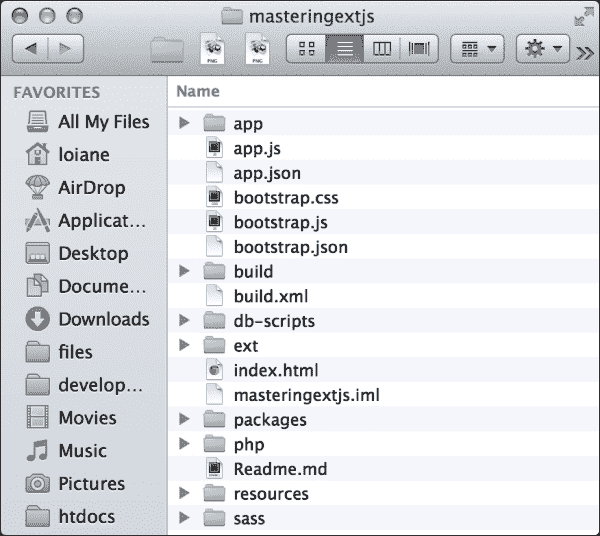

我们创建的所有代码都位于 `app`、`index.html`、`php`、`resources`（自定义图像图标、字体和自定义区域文件）以及 `sass`（自定义应用程序 CSS）中。其他文件夹和文件是由 Sencha Cmd 创建的，正如你在第二章中学习的，*入门*。

# 创建新主题

本章我们将执行的第一项任务是为我们项目创建一个新主题。为此，我们将使用 Sencha Cmd 和操作系统的终端应用程序。

Sencha Cmd 现在具有生成我们创建全新主题所需完整文件结构的能力。

因此，让我们一步一步地创建一个新主题。首先，在终端打开后，将目录更改为项目的根文件夹。然后，我们将使用以下命令：

```js
sencha generate theme masteringextjs-theme

```

前一个命令的输出如下：

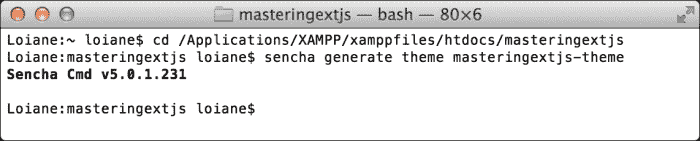

在这里，`masteringextjs-theme` 是我们主题的名称。此命令将在 `packages` 文件夹内创建一个以我们主题命名的新的目录，如下所示：

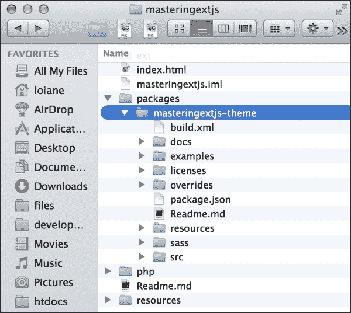

`package.json` 文件包含 Sencha Cmd 使用的主题的一些配置，例如主题名称、版本和依赖项。

`sass` 目录包含我们主题的所有 Sass 文件。在这个目录内，我们将找到三个更多的主目录：

+   `var`：这包含 Sass 变量。

+   `src`：这包含 Sass 规则和混入。这些规则和混入使用在 `sass/var` 目录内文件中声明的变量。

+   `etc`：这包含额外的实用函数和混入。

我们创建的所有文件都必须匹配我们正在样式的组件的类路径。例如，如果我们想样式化按钮组件，我们需要在文件 `sass/var/button/Button.scss` 内创建样式；如果我们想样式化组件面板，我们需要在文件 `sass/var/panel.scss` 内创建样式。

`resources` 文件夹包含我们的主题将使用的图像和其他静态资源。

`overrides` 文件夹包含所有可能用于主题化这些组件的组件 JavaScript 覆盖。

### 小贴士

花些时间探索 `packages` 文件夹内以下目录的内容，以更熟悉这种组织 Sass 文件的方式：`ext-theme-classic`、`ext-theme-gray` 和 `ext-theme-neptune`。

默认情况下，我们创建的任何主题都使用 `ext-theme-classic` 作为基础（经典的 Ext JS 蓝色主题）。我们将更改为我们一直使用的 `Neptune` 主题。要更改主题基础，打开 `package.json` 文件并找到 `extend` 属性。将其值从 `ext-theme-classic` 更改为 `ext-theme-neptune`。`package.json` 的内容将类似于以下内容：

```js
{
    "name": "masteringextjs-theme",
    "type": "theme",
    "creator": "anonymous",
    "summary": "Short summary",
    "detailedDescription": "Long description of package",
    "version": "1.0.0",
    "compatVersion": "1.0.0",
    "format": "1",
    "slicer": {
        "js": [
            {
                "path": "${package.dir}/sass/example/custom.js",
                "isWidgetManifest": true
            }
        ]
    },
    "output": "${package.dir}/build",
    "local": true,
    "requires": [],
 "extend": "ext-theme-neptune"
}
```

我们可以将任何 Ext JS 主题作为自定义主题的基础主题。以下是一些可能的选项：

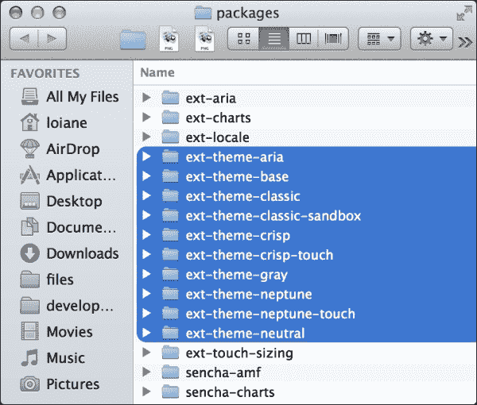

我们可以使用 Ext JS 中的任何主题包。这些包可以在 `ext/packages` 内找到。

### 注意

您可以从 Ext JS 示例页面尝试 Theme Viewer 示例，以尝试每个主题。

在创建主题结构并更改基础主题之后，让我们来构建它。为了构建它，我们将再次使用终端和 Sencha Cmd。将目录更改为 `packages/masteringextjs-theme` 并输入以下命令：

```js
sencha package build

```

结果将类似于以下截图：

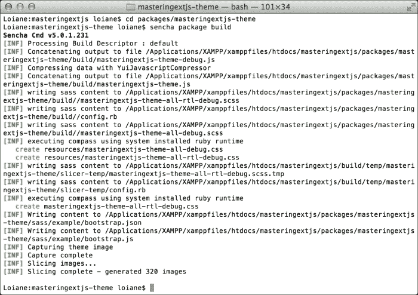

此命令的结果将在 `packages/masteringextjs-theme` 文件夹内创建 `build` 目录，如下所示：

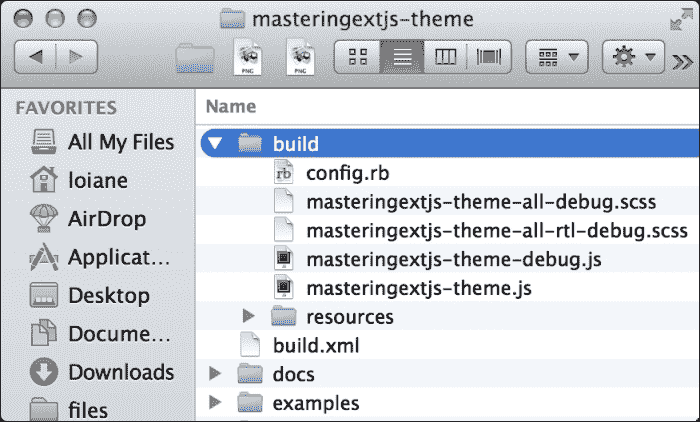

在这个 `build` 文件夹内，我们可以找到 `resources` 文件夹，在资源文件夹内我们可以找到一个名为 `masteringextjs-theme-all.css` 的文件，它包含我们在主题上样式化的所有组件的样式（目前还没有，但我们会达到那里）。尽管我们创建了一个完整的主题（样式化所有组件），但我们不能 100%确定我们将在我们的应用程序中使用所有这些组件。Sencha Cmd 有能力过滤并创建一个只包含我们将在项目中使用的组件的 CSS 文件。因此，我们不需要手动将 `masteringextjs-theme-all.css` 包含在我们的应用程序中。

### 注意

在 `build/masteringextjs-theme` 内部也将创建一个 `masteringextjs-theme.pkg` 文件。我们可以使用此文件将主题包分发给其他开发者。有关更多信息，请参阅 [`docs.sencha.com/cmd/5.x/cmd_packages/cmd_packages.html`](http://docs.sencha.com/cmd/5.x/cmd_packages/cmd_packages.html)。

因此，让我们设置我们的项目，使其可以使用我们的主题。在 `app.json` 中，找到主题条目并将其更改为：

```js
"theme": "masteringextjs-theme",
```

当在终端中执行`sencha app watch`时，我们将能够看到`Packt-all.css`将被覆盖。当我们刷新应用程序时，将不会有任何变化，因为我们还没有开始自定义我们的主题。

在进行下一步操作时，非常重要的一点是在我们做出更改的同时保持`sencha app watch`运行。这样我们只需刷新浏览器就能看到所做的修改。

## 更改基本颜色

让我们现在开始自定义主题！让我们回到`packages/masteringextjs-theme`文件夹。这是我们的主题自定义方式：

1.  在`sass/var`文件夹内，创建一个名为`Component.scss`的新文件。让我们向其中添加以下内容：

    ```js
    $base-color: #317040 !default;
    ```

1.  在前面的代码中，我们声明了一个名为`$base-color`的 Sass 变量，其值为绿色。这将把主题的基本颜色从蓝色改为绿色。让我们在我们的主题上应用这些更改并查看结果。

1.  打开浏览器，我们会看到如下截图：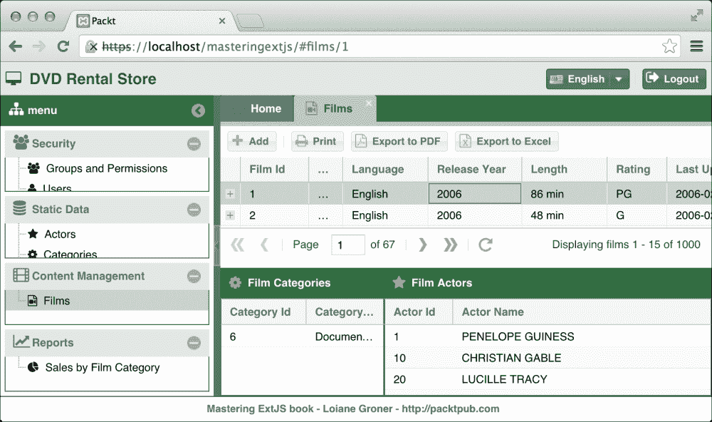

只用一行代码，我们就得到了一个全新的主题！我们可以继续添加更多样式到我们的自定义主题，并自定义每一个组件。

## 自定义组件

让我们在我们的主题中进行一些更改。在`Component.scss`内部，添加以下代码：

```js
$neutral-color: #8DF98B !default;
```

输出将是以下内容：


注意按钮背景、网格列标题以及折叠菜单内的面板标题是如何发生变化的。

让我们继续创建一些其他文件，以便我们可以添加更多自定义样式，如下所示：

1.  创建以下文件和文件夹：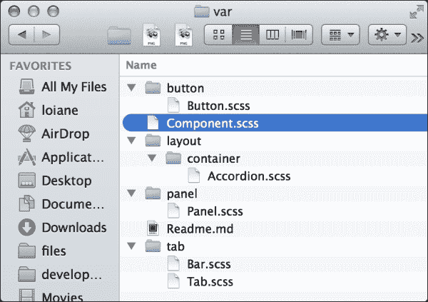

1.  在`Accordion.scss`内部，我们将添加以下代码：

    ```js
    $accordion-header-color: #336600 !default;
    ```

    这将改变折叠菜单内面板标题的颜色。

1.  在`Panel.scss`内部，我们将添加以下代码：

    ```js
    $panel-light-header-color: #336600 !default;
    ```

    此颜色将用于创建面板组件的不同绿色色调。

1.  在`Bar.scss`内部，我们将添加以下代码：

    ```js
    $tabbar-background-gradient: 'bevel' !default;
    ```

    这将改变标签面板栏的渐变效果。可能的值可以在[`goo.gl/fapTBA`](http://goo.gl/fapTBA)找到。

1.  在`Tab.scss`内部，我们将添加以下代码：

    ```js
    $tab-base-color-active: #E6F5EB !default;
    $tab-base-color-focus-over: #339933 !default;
    $tab-base-color-focus-active: #B2E0C2 !default;
    ```

    这将改变标签的颜色，使其呈现不同的绿色色调。

    到目前为止，这是我们得到的输出：

    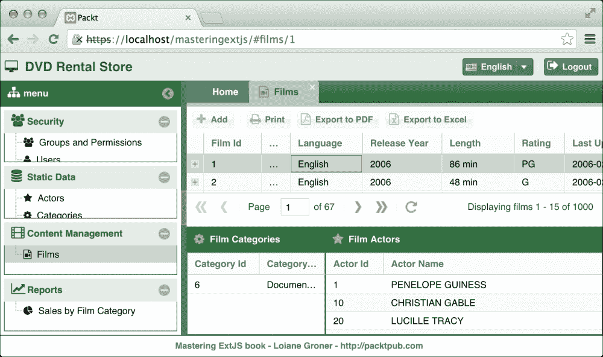

    尝试将其与之前的输出截图进行比较。

1.  在`Button.scss`内部，我们将添加以下代码：

    ```js
    $packt-background-color: #669999 !default;
    $packt-mate-gradient: 'matte' !default;
    $packt-light-color: #339933 !default;
    $packt-dark-color: #006600 !default;

    $button-default-base-color: $packt-background-color;
    $button-default-base-color-over: $packt-dark-color;
    $button-default-base-color-pressed: $packt-dark-color;
    $button-default-base-color-disabled: mix(#000, $packt-dark-color, 8%);
    $button-default-border-color: $packt-dark-color !default;

    $button-small-font-weight: bold !default;
    $button-medium-font-weight: bold !default;
    $button-large-font-weight: bold !default;

    $button-default-color: #fff !default;

    $button-default-glyph-color: $button-default-color;

    $button-small-border-radius: 1px !default;
    $button-medium-border-radius: 1px !default;
    $button-large-border-radius: 1px !default;

    $button-default-background-gradient: $packt-mate-gradient;
    $button-default-background-gradient-disabled: $packt-mate-gradient;
    $button-default-background-gradient-over: $packt-mate-gradient;
    $button-default-background-gradient-pressed: $packt-mate-gradient;

    $button-toolbar-border-color: $packt-background-color;

    $button-toolbar-background-color: $packt-light-color;
    $button-toolbar-background-color-over: $packt-dark-color;
    $button-toolbar-background-color-pressed: $packt-dark-color;
    $button-toolbar-background-color-disabled: mix(#000, $packt-dark-color, 8%);

    $button-toolbar-color: #fff !default;

    $button-toolbar-background-gradient: $packt-mate-gradient;
    $button-toolbar-background-gradient-disabled: $packt-mate-gradient;
    $button-toolbar-background-gradient-focus: $packt-mate-gradient;
    $button-toolbar-background-gradient-over: $packt-mate-gradient;
    $button-toolbar-background-gradient-pressed: $packt-mate-gradient;

    $button-default-glyph-color: #fff !default;
    ```

    这将是我们的新自定义按钮的输出：

    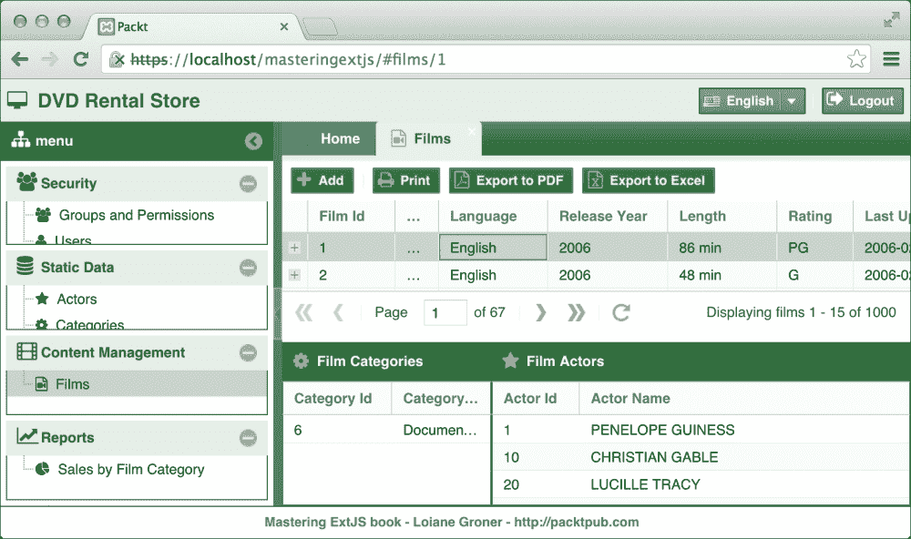

按钮现在看起来非常不同（包括普通按钮和放置在工具栏内的按钮）。

### 创建新主题时的一些有用提示

在 Ext JS 中，没有关于如何创建完全自定义主题的食谱或详细教程。通常，Ext JS 使用的 Sass 变量的名称是自解释的。例如，`$button-default-glyph-color`是用于渲染按钮图标的颜色。

以下是一些在创建 Ext JS 主题过程中可能有用的提示：

+   尝试学习 Sass 和 Compass。Sass 和 Compass 有混合和有用的功能来处理颜色，以及其他功能（[`sass-lang.com/documentation/file.SASS_REFERENCE.html`](http://sass-lang.com/documentation/file.SASS_REFERENCE.html)）。

+   查看作为基础主题使用的主题的变量和当前值。你可以在 `ext/packages/ext-theme-neptune/sass/var` 中找到其源代码。

+   实验！学习新事物的最佳方式是实践。一个不错的方法是复制之前列出的目录中的原始文件（例如，`Button.scss`），开始更改变量值，看看会发生什么！

+   在实验过程中，尝试使用不同的颜色（如红色、黄色、黑色、蓝色或任何你喜欢的颜色，以便对比），这样你就可以确切地看到主题中发生了什么变化！

+   咨询文档。Ext JS 中的每个类都有一个使用 Sass 变量的部分，包括描述和可能的值。确保充分利用它：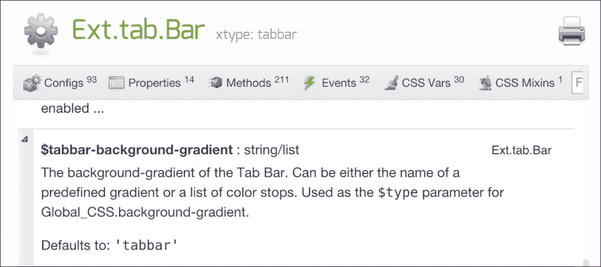

## 创建自定义 UI

Ext JS 还支持 UI，这是可以应用到特定组件上的特殊主题。例如，假设我们想要为 **打印**、**导出为 PDF** 和 **导出为 Excel** 按钮应用不同的主题。我们可以创建一个 UI。

1.  第一步是检查文档，了解可用的 UI，即称为 **CSS Mixins** 的内容：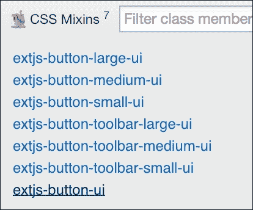

1.  然后，检查创建此混合所需的所有变量。我们可以在之前创建的 `masteringextjs-theme/sass/var/button/Button.scss` 文件中声明自定义变量，如下所示：

    ```js
    $button-packt-custom-color: #336600 !default;
    $packt-custom-base-color: #C2E0D1 !default;

    $button-packt-custom-small-border-radius: $button-small-border-radius;
    $button-packt-custom-small-border-width: 1px;

    $button-packt-custom-base-color: $packt-custom-base-color;
    $button-packt-custom-base-color-over: $packt-dark-color;
    $button-packt-custom-base-color-focus: $packt-dark-color;
    $button-packt-custom-base-color-pressed: $packt-dark-color;
    $button-packt-custom-base-color-disabled: lighten($button-packt-custom-base-color, 40%);

    $button-packt-custom-small-border-radius: 0px;
    $button-packt-custom-small-border-width: 1px;

    $button-packt-custom-border-color: darken($button-packt-custom-base-color, 20%);
    $button-packt-custom-border-color-over:$button-packt-custom-border-color;
    $button-packt-custom-border-color-focus:$button-packt-custom-border-color;
    $button-packt-custom-border-color-pressed:$button-packt-custom-border-color-over;
    $button-packt-custom-border-color-disabled:lighten($button-packt-custom-border-color, 40%);

    $button-packt-custom-small-padding: 2px;
    $button-packt-custom-small-text-padding: 4px;

    $button-packt-custom-background-color:$button-packt-custom-base-color;
    $button-packt-custom-background-color-over:$button-packt-custom-border-color;
    $button-packt-custom-background-color-focus:$button-packt-custom-background-color;
    $button-packt-custom-background-color-pressed:$button-packt-custom-base-color-pressed;
    $button-packt-custom-background-color-disabled:$button-packt-custom-base-color-disabled;

    $button-packt-custom-background-gradient: 'mate';
    $button-packt-custom-background-gradient-over: 'mate';
    $button-packt-custom-background-gradient-focus: 'mate';
    $button-packt-custom-background-gradient-pressed: 'mate-reverse';
    $button-packt-custom-background-gradient-disabled: 'mate';

    $packt-custom-font-size: 12px;
    $packt-custom-font-family: helvetica , arial , verdana , sans-serif;

    $button-packt-custom-color-over: #fff !default;
    $button-packt-custom-color-focus: $button-packt-custom-color-over;
    $button-packt-custom-color-pressed: $button-packt-custom-color-over;
    $button-packt-custom-color-disabled: $button-packt-custom-color-over;

    $button-packt-custom-small-font-size: $packt-custom-font-size;
    $button-packt-custom-small-font-size-over: $packt-custom-font-size;
    $button-packt-custom-small-font-size-focus: $packt-custom-font-size;
    $button-packt-custom-small-font-size-pressed: $packt-custom-font-size;
    $button-packt-custom-small-font-size-disabled: $packt-custom-font-size;

    $button-packt-custom-small-font-weight: $button-small-font-weight;
    $button-packt-custom-small-font-weight-over: $button-small-font-weight;
    $button-packt-custom-small-font-weight-focus: $button-small-font-weight;
    $button-packt-custom-small-font-weight-pressed: $button-small-font-weight;
    $button-packt-custom-small-font-weight-disabled: $button-small-font-weight;

    $button-packt-custom-small-font-family: $packt-custom-font-family;
    $button-packt-custom-small-font-family-over: $packt-custom-font-family;
    $button-packt-custom-small-font-family-focus: $packt-custom-font-family;
    $button-packt-custom-small-font-family-pressed: $packt-custom-font-family;
    $button-packt-custom-small-font-family-disabled: $packt-custom-font-family;

    $button-packt-custom-small-icon-size: 16px;
    $button-packt-custom-glyph-color: $button-packt-custom-color;
    $button-packt-custom-glyph-opacity: .5;
    $button-packt-custom-small-arrow-width: 12px;
    $button-packt-custom-small-arrow-height: 12px;
    $button-packt-custom-small-split-width: 14px;
    $button-packt-custom-small-split-height: 14px;
    ```

1.  然后，我们将创建一个名为 `masteringextjs-theme/sass/src/button/Button.scss` 的新文件，包含我们的自定义 UI：

    ```js
    @include extjs-button-ui(
      $ui: 'custom-btn-small',

      $border-radius: $button-packt-custom-small-border-radius,
      $border-width: $button-packt-custom-small-border-width,

      $border-color: $button-packt-custom-border-color,
      $border-color-over: $button-packt-custom-border-color-over,
      $border-color-focus: $button-packt-custom-border-color-focus,
      $border-color-pressed: $button-packt-custom-border-color-pressed,
      $border-color-disabled: $button-packt-custom-border-color-disabled,

      $padding: $button-packt-custom-small-padding,
      $text-padding: $button-packt-custom-small-text-padding,

      $background-color: $button-packt-custom-background-color,
      $background-color-over: $button-packt-custom-background-color-over,
      $background-color-focus: $button-packt-custom-background-color-focus,
      $background-color-pressed: $button-packt-custom-background-color-pressed,
      $background-color-disabled: $button-packt-custom-background-color-disabled,

      $background-gradient: $button-packt-custom-background-gradient,
      $background-gradient-over: $button-packt-custom-background-gradient-over,
      $background-gradient-focus: $button-packt-custom-background-gradient-focus,
      $background-gradient-pressed: $button-packt-custom-background-gradient-pressed,
      $background-gradient-disabled: $button-packt-custom-background-gradient-disabled,

      $color: $button-packt-custom-color,
      $color-over: $button-packt-custom-color-over,
      $color-focus: $button-packt-custom-color-focus,
      $color-pressed: $button-packt-custom-color-pressed,
      $color-disabled: $button-packt-custom-color-disabled,

      $font-size: $button-packt-custom-small-font-size,
      $font-size-over: $button-packt-custom-small-font-size-over,
      $font-size-focus: $button-packt-custom-small-font-size-focus,
      $font-size-pressed: $button-packt-custom-small-font-size-pressed,
      $font-size-disabled: $button-packt-custom-small-font-size-disabled,

      $font-weight: $button-packt-custom-small-font-weight,
      $font-weight-over: $button-packt-custom-small-font-weight-over,
      $font-weight-focus: $button-packt-custom-small-font-weight-focus,
      $font-weight-pressed: $button-packt-custom-small-font-weight-pressed,
      $font-weight-disabled: $button-packt-custom-small-font-weight-disabled,

      $font-family: $button-packt-custom-small-font-family,
      $font-family-over: $button-packt-custom-small-font-family-over,
      $font-family-focus: $button-packt-custom-small-font-family-focus,
      $font-family-pressed: $button-packt-custom-small-font-family-pressed,
      $font-family-disabled: $button-packt-custom-small-font-family-disabled,

      $icon-size: $button-packt-custom-small-icon-size,
      $glyph-color: $button-packt-custom-glyph-color,
      $arrow-width: $button-packt-custom-small-arrow-width,
      $arrow-height: $button-packt-custom-small-arrow-height,
      $split-width: $button-packt-custom-small-split-width,
      $split-height: $button-packt-custom-small-split-height,
      $opacity-disabled: $button-opacity-disabled,
      $inner-opacity-disabled: $button-inner-opacity-disabled
    );
    ```

注意，我们正在将自定义变量分配给创建此 UI 所需的混合变量。由于 Ext JS 中的按钮有三种大小，目前我们只为小按钮声明自定义 UI，但也可以为其他大小做同样的事情。

### 应用 UI

在我们的代码中，我们将创建一个名为 `app/view/base/CustomButton.js` 的新文件，内容如下：

```js
Ext.define('Packt.view.base.CustomButton', {
    extend: 'Ext.button.Button',
    xtype: 'custom-btn',

    ui: 'custom-btn'
});
```

然后，我们将替换我们想要应用此 UI 的按钮的 `xtype` 类（创建一个超级类比将 `ui` 配置应用到每个组件上更容易，但是否这样做取决于你）。我们将替换 `Print`、`Export to PDF` 和 `Export to Excel` 按钮的 `xtype` 配置，如下面的代码所示（`Films.js` 文件）：

```js
xtype: 'custom-btn',
text: 'Print',
```

如果我们再次尝试执行我们的应用程序，这将是我们得到的输出：

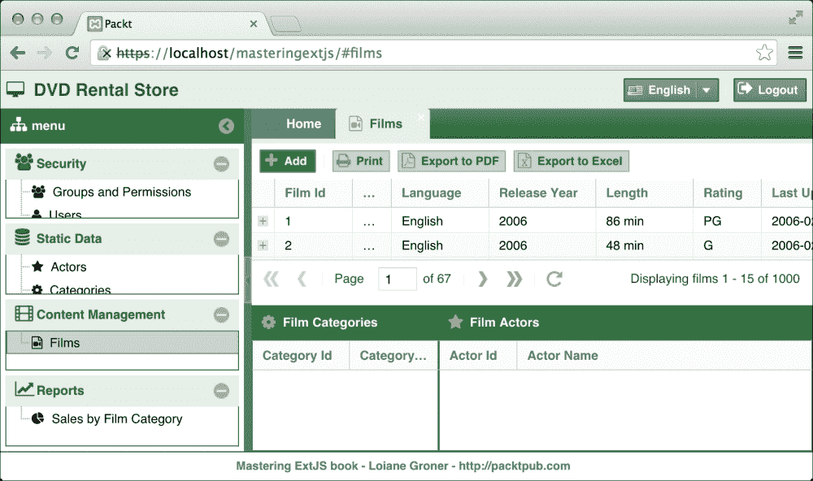

注意，**打印**和**导出**按钮与**添加**按钮看起来不同。

我们可以创建我们需要的任意多个 UI，并且对于任何支持它的组件。也有可能创建不属于主题的 UI，这意味着我们可以在`masteringextjs/sass`文件夹内创建它，遵循我们在本主题中遵循的相同结构。

现在，你只需要释放出你内心存在的那个设计师！

# 为生产打包应用程序

我们的主题已经创建，所以现在唯一剩下的事情就是进行生产构建并将代码部署到生产 Web 服务器上。同样，我们将再次使用 Sencha Cmd 来完成这项工作。

1.  要进行生产构建，我们需要打开一个终端。我们还需要将目录切换到应用程序的根目录，并输入以下命令：

    ```js
    sencha app build
    ```

    下面是终端上的命令外观：

    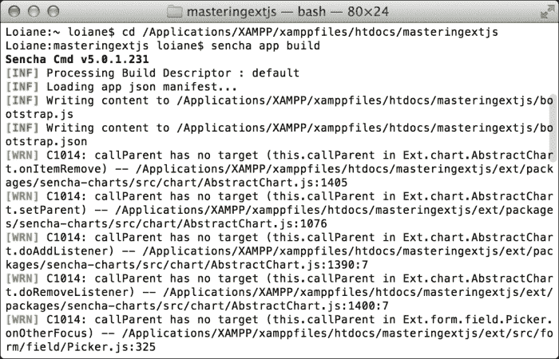

1.  一旦命令执行完成，它将创建一个名为`build/production/NameofTheApp`的新目录。由于我们的应用程序命名空间是`Packt`，它创建了`build/production/Packt`目录，如下所示：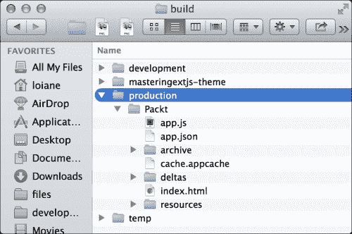

    这个命令的作用是获取我们开发的全部代码（位于`app`文件夹内）以及运行应用程序所需的 Ext JS 代码，并将它们放入`all-classes.js`文件中。然后，使用**YUI Compressor**，Sencha Cmd 将最小化代码并混淆 JavaScript 代码；这样，我们将得到一个非常小的 JavaScript 文件，用户需要加载它。此外，Sencha Cmd 将评估我们应用程序使用的所有组件，过滤掉不需要的 CSS，并将其放入`resources/Packt-all.css`文件中。所有我们的自定义图片（图标图片）也将从开发环境复制到`production`文件夹（同样位于`resources`文件夹内）。

1.  下一步是确保生产构建按预期工作。要访问开发环境，我们使用`http://localhost/masteringextjs`。要测试生产构建，我们需要访问`http://localhost/masteringextjs/build/production/Packt`。当我们测试时，我们会发现它并没有按我们预期的那样工作。我们会遇到一些错误。

1.  接下来，我们需要将`php`文件夹也复制到`production`文件夹中，如下截图所示：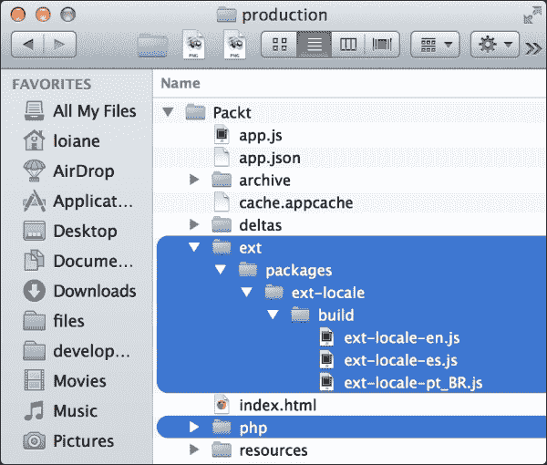

1.  我们也应该复制`ext/packages/ext-locale/build`以及我们将要使用的区域设置文件。

    现在，我们可以再次测试应用程序。它应该按预期工作。

## 编译 ext-locale

这里有一个关于`ext-locale`包的快速说明：如果你只使用一个区域设置，你可以在`app.json`的`requires`中添加`ext-locale`包，并添加一个新的条目`"locale" : "es"`，其中包含你想要使用的区域设置的代码。Ext JS 将编译所需的文件。

如果您使用多个区域设置，有两种选择：像我们这样做（手动复制文件）或者为每个区域设置制作生产构建。您可以通过探索`app.json`和**EXT JS Kitchen Sink**示例的源代码（[`dev.sencha.com/ext/5.0.1/examples/kitchensink/`](http://dev.sencha.com/ext/5.0.1/examples/kitchensink/)）来查看如何操作。

## 生产环境中要部署的内容

总是记住，我们有一个`app`文件夹，以及所有作为开发环境开发的代码。而在`production`文件夹中，我们拥有所有应该在生产环境中部署的代码。

所以，假设我们现在想部署这个应用程序。只需将`masteringextjs/build/production/Packt`中的所有内容传输到您的 Web 服务器上的目标文件夹，如下所示：

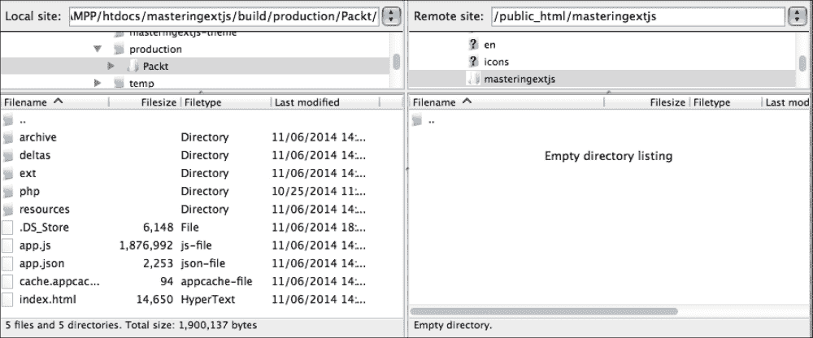

欢迎使用生产代码！

## 好处

生产构建有哪些好处？我们能否直接部署开发代码？我们可以在生产环境中直接部署开发代码，但并不推荐。使用生产构建，我们在加载文件时提升了性能，但文件被最小化，这也使得代码更难以阅读。

例如，让我们进行以下测试：在浏览器中打开应用程序，登录，并从静态数据模块打开**演员**屏幕。

使用开发代码，我们从 Chrome 开发者工具（或 Firebug）将得到以下结果：

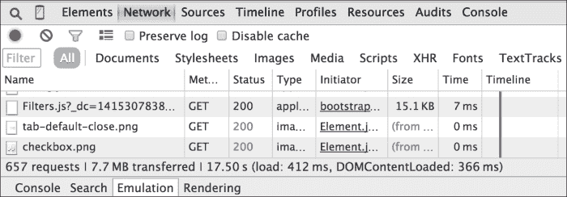

应用程序发出了**657**次**请求**，导致向用户传输了**7.7 MB**的数据，完成整个过程耗时**17.50 秒**。这已经很多了，而且提到向用户传输**7.7 MB**是不可接受的！

现在我们来看看使用生产构建的结果：

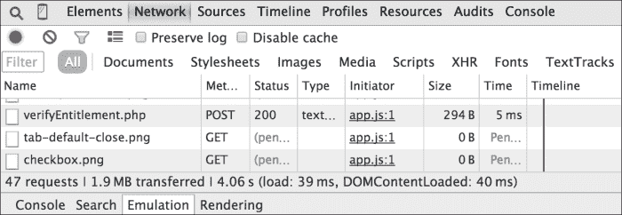

应用程序发出了**47**次请求，并**传输了 1.9 MB**的数据。最重要的变化是传输的数据大小：从**7.7 MB**减少到**1.9 MB**！这是一个巨大的改进，尽管**1.9 MB**仍然是一个很大的数据传输量。文件将被缓存，这个数字还会进一步减少。

另一点需要注意是正在加载的文件。在开发环境中，我们可以看到浏览器正在加载每个 Ext JS 类：

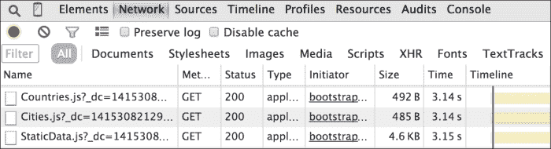

最后，仅仅为了渲染**登录**屏幕，就需要加载超过 400 个 JavaScript 文件。

如果我们尝试生产构建，我们会得到以下结果：

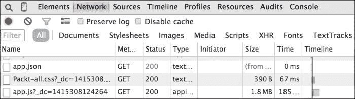

应用程序只加载了一个 JavaScript 文件，即应用程序的源代码和所需的 Ext JS SDK 代码（`app.js`）。

因此，出于性能考虑，始终部署生产构建。仅将开发代码用于开发目的。

### 注意

如果应用程序开始增长，传输到浏览器中的数据量将超过 2 MB，这并不好。您可以创建独立的小应用程序，并将它们像在门户应用程序中一样组合起来。这样，用户将能够只下载即将使用的应用程序部分的应用程序文件，而无需一次性下载整个应用程序的源代码。此链接包含有关此主题的良好讨论：[`goo.gl/az8uVT`](http://goo.gl/az8uVT)。

# 摘要

在本章中，我们学习了如何创建新的主题，我们还学习了如何创建自定义组件 UI。您了解到为什么制作生产构建很重要，以及如何进行，包括开发环境与生产环境之间文件的区别。

我希望您喜欢这本书！现在，让创造力流淌，创造出真正出色的 Ext JS 应用程序！
