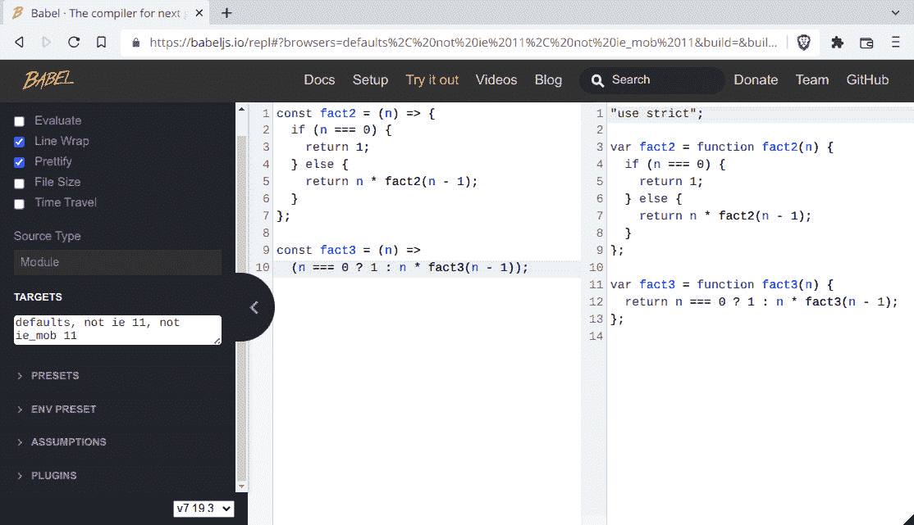

# 1

# 成为函数式——几个问题

**函数式编程**（或**FP**）自计算机的最早时期以来就存在，由于在多个框架和库中的使用增加，尤其是**JavaScript**，它经历了一种复兴。 

在本章中，我们将做以下几件事：

+   介绍一些 FP 的概念，以给出其含义的一小部分体验

+   展示使用函数式编程（FP）带来的好处（以及问题），以及为什么我们应该使用它

+   开始思考为什么 JavaScript 可以被认为是适合 FP 的语言

+   概述你应该了解的语言特性和工具，以便充分利用本书中的所有内容

到本章结束时，你将拥有我们将在这本书中使用的所有基本工具，所以让我们开始学习 FP。

# 什么是函数式编程？

如果你回顾计算机历史，你会发现仍在使用的第二古老的编程语言 Lisp 是基于 FP 的。从那时起，出现了更多功能性的语言，FP 的应用也更加广泛。但即便如此，如果你问人们什么是 FP，你可能会得到两个截然不同的答案。

一点趣闻

对于喜欢 trivia 或历史的人来说，仍在使用的最古老的编程语言是 Fortran，它在 1957 年出现，比 Lisp 早一年。在 Lisp 之后不久，又出现了一种长寿的语言，COBOL，用于面向商业的编程。

根据你询问的人不同，你可能会了解到它是一种现代、先进、开明的编程方法，超越了其他所有范式，或者它主要是一个理论上的东西，弊大于利，在现实世界中几乎无法实施。通常，真正的答案并不在极端，而是在两者之间。让我们先从理论与实践对比开始，看看我们计划如何使用 FP。

## 理论与实际

在这本书中，我们不会以理论的方式介绍 FP。相反，我们的目的是向你展示一些其技术和原则如何成功地应用于常见的日常 JavaScript 编程。但——这一点很重要——我们不会教条地这样做，而是以一种非常实用的方式。我们不会因为它们不符合 FP 的学术期望而摒弃有用的 JavaScript 结构。同样，我们也不会为了避免符合 FP 范式而避免使用实用的 JavaScript 特性。我们几乎可以说，我们将进行**Sorta Functional Programming**（**SFP**），因为我们的代码将是 FP 特性、更传统的命令式特性和**面向对象**的**编程**（**OOP**）的混合体。

虽然如此，我们所说的并不意味着我们会把所有理论都放在一边。我们会挑剔地选择，只触及主要的理论点，学习一些词汇和定义，并解释核心的 FP 概念，但我们始终会着眼于产生实际、有用的 JavaScript 代码的想法，而不是试图满足某些神秘、教条的 FP 标准。

面向对象编程（OOP）一直是解决编写大型程序和系统固有的复杂性、开发干净、可扩展、可伸缩的应用程序架构的方法；然而，由于今天 Web 应用程序的规模，所有代码库的复杂性持续增长。此外，JavaScript 的新特性使得开发几年前甚至不可能开发的应用程序成为可能；例如，使用 Ionic、Apache Cordova 或 React Native 制作的移动（混合）应用程序，或使用 Electron、Tauri 或 NW.js 制作的桌面应用程序。JavaScript 还通过 Node.js 或 Deno 迁移到后端，因此，今天，该语言的使用范围在处理现代设计的附加复杂性方面有了重大增长。

## 不同的思维方式

函数式编程（FP）是一种不同的编写程序的方式，有时可能难以学习。在大多数语言中，编程是命令式的：程序是一系列语句的序列，按照规定的方式执行，通过创建对象并操作它们来达到期望的结果，这通常意味着修改对象本身。FP 基于通过评估由函数组成的表达式来产生期望的结果。在 FP 中，传递函数（例如将参数传递给其他函数或返回计算的结果作为函数）是常见的，不使用循环（选择递归代替），并跳过副作用（如修改对象或全局变量）。

换句话说，函数式编程（FP）关注的是**应该做什么**，而不是**如何去做**。你不需要担心循环或数组，而是在一个更高的层面上工作，考虑需要完成的事情。习惯这种风格后，你会发现你的代码变得更加简单、更短、更优雅，并且可以轻松地进行测试和调试。然而，不要陷入将 FP 视为目标的陷阱！将 FP 仅视为达到目的的手段，就像所有软件工具一样。函数式代码并不仅仅因为其函数性而好，使用 FP 编写糟糕的代码与使用任何其他技术一样可能！

## 函数式编程和其他编程范式

编程范式根据编程语言的特征对编程语言进行分类。然而，一些语言可能被归类到多个范式——JavaScript 本身就是这样！

主要的划分是**命令式**与**声明式**语言。在前者中，开发者必须逐步指导机器如何完成其工作。编程可能是**过程式**的（如果指令被分组为过程），或者**面向对象**的（如果指令与相关状态一起分组）。

相反，在声明式语言中，开发者只需声明所求结果必须满足的属性，但不必说明如何计算它。声明式语言可能是**基于逻辑**的（基于逻辑规则和约束）、**响应式**的（基于数据和事件流）或**函数式**的（基于应用和函数的组合）。从某种意义上说，我们可以说命令式语言关注**如何**，而声明式语言关注**什么**。

JavaScript 是多范式的：它是命令式的（既过程式又面向对象），但也允许声明式编程，包括函数式（如本书中的几乎所有内容！特别是，我们将专门在*第五章*，*声明式编程*）和响应式（我们将在*第十一章*，*实现设计模式*）中探讨这一主题）。

为了给你一个命令式与声明式解决问题方式的区别的基本例子，让我们解决一个简单的问题：假设你有一组人的个人数据数组，如下所示：

```js
// imperative.js
const data = [
  { name: "John", age: 23, other: "xxx" },
  { name: "Paul", age: 18, other: "yyy" },
  { name: "George", age: 16, other: "zzz" },
  { name: "Ringo", age: 25, other: "ttt" },
];
```

假设你想要提取成年人的数据（至少 21 岁）。命令式地，你会做如下操作：

```js
// continued...
const result1 = [];
for (let i = 0; i < data.length; i++) {
  if (data[i].age >= 21) {
    result1.push(data[i]);
  }
}
```

你必须初始化所选人员的输出数组（`result1`）。然后，你必须指定一个循环，说明索引变量（`i`）如何初始化、测试和更新。在循环的每次迭代中，你检查相应人员的年龄，如果该人员是成年人，则将数据推送到输出数组。换句话说，你逐步指定代码将执行的所有操作。

以声明式工作，你更愿意写如下内容：

```js
// declarative.js
const isAdult = (person) => person.age >= 21;
const result2 = data.filter(isAdult);
```

第一行声明了如何测试一个人是否是成年人；第二行说明结果是过滤数据数组的结果，选择满足给定谓词的元素。（对于`isAdult()`，我们使用箭头函数；我们将在本章后面的*箭头函数*部分了解更多。）你不需要初始化输出数组，指定如何循环，或确保你的数组索引不超过数组的长度等——所有这些细节都由语言处理，因此你不需要。

阅读和理解命令式版本需要了解编程语言以及循环的算法或技术；声明式版本更易于编写，更易于维护，且可读性更强。

## FP 不是什么

由于我们已经谈论了很多关于 FP 是什么的内容，让我们也澄清一些常见的误解，并看看 FP 不是什么：

+   *FP 不仅仅是学术象牙塔中的事物*：FP 所基于的λ演算是由 Alonzo Church 在 1936 年开发的，作为一种证明理论计算机科学中一个重要结果（这比现代计算机语言早了 20 多年！）的工具；然而，FP 语言今天被用于各种系统。

+   *FP 不是面向对象（OOP）的对立面*：这并不是选择声明式或命令式编程方式的问题。你可以根据需要混合和匹配，我们将在整本书中这样做，将所有世界的最佳之处结合起来。

+   *FP 学习并不复杂*：一些函数式编程（FP）语言与 JavaScript 相当不同，但差异主要在于语法。一旦你掌握了基本概念，你就会发现你可以在 JavaScript 中实现与 FP 语言相同的结果。

还可能需要提到的是，几个现代框架，如 React 和 Redux 的组合，都包含了 FP 思想。

例如，在 React 中，据说视图（用户在任何给定时刻能看到的内容）是当前状态的函数。你使用一个函数来计算在每一刻必须生成的 HTML 和 CSS，以黑盒的方式思考。

同样，在 Redux 中，你有由 reducers 处理的行为的概念。一个行为提供了一些数据，而 reducer 是一个函数，它以函数式的方式从当前状态和提供的数据中生成应用程序的新状态。

因此，无论是由于理论优势（我们将在下一节中讨论这些优势）还是实际优势（例如，能够使用最新的框架和库），考虑使用 FP 编码都是合理的。让我们继续前进。

# 为什么使用 FP？

几年来，出现了许多编程风格和潮流。然而，FP 已经证明相当有弹性，并且今天非常受欢迎。你为什么想使用 FP？相反，首先应该问的问题是，你需要什么？然后，FP 才能满足你的需求？我们将在以下章节中回答这些重要问题。

## 我们需要

我们可以肯定地同意以下列表中的担忧是普遍的。我们的代码应该具有以下品质：

+   **模块化**：你的程序的功能应该分为独立的模块，每个模块都包含解决方案的一部分。模块或函数中的更改不应影响其余代码。

+   **易于理解**：你的程序读者应该能够不费吹灰之力地辨别其组件、函数和关系。这与代码的**可维护性**密切相关；你的代码将来必须得到维护，无论是为了更改还是为了添加新功能。

+   **可测试性**：**单元测试**尝试测试程序的小部分，验证其行为独立于其他代码。你的编程风格应该倾向于编写简化单元测试工作的代码。单元测试也像文档一样，可以帮助读者理解代码的预期功能。

+   **可扩展性**：这是一个事实，你的程序总有一天需要维护，可能需要添加新功能。这些更改应该对原始代码的结构和数据流只有最小的影响（如果有的话）。小的更改不应该意味着对代码进行大规模的重大重构。

+   **可重用性**：代码重用的目标是节省资源、时间和金钱，通过利用先前编写的代码来减少冗余。一些特性有助于实现这一目标，例如**模块化**（我们之前已经提到过）、**高内聚**（模块中的所有部分都属于一起）、**低耦合**（模块相互独立）、**关注点分离**（程序的部分应该在功能上尽可能少地重叠）和**信息隐藏**（模块的内部更改不应影响系统的其他部分）。

## 我们所得到的

那么，FP 是否提供了我们之前章节中列出的五个特性？

+   在 FP 中，目标是编写独立的函数，然后将它们组合起来以产生最终结果。

+   以函数式风格编写的程序通常更干净、更短，更容易理解。

+   函数可以单独测试，FP 代码在这方面具有优势。

+   你可以在其他程序中重用函数，因为它们是独立的，不依赖于系统的其他部分。大多数函数式程序共享一些公共函数，其中一些我们将在本书中讨论。

+   函数式代码没有副作用，这意味着你可以通过研究函数本身来理解其目标，而无需考虑整个程序。

最后，一旦你习惯了 FP 编程风格，代码就会变得更加可理解且易于扩展。因此，似乎我们可以通过 FP 实现所有五个特性！

为什么使用 FP？

为了全面了解使用函数式编程（FP）的理由，我建议阅读约翰·休斯（John Hughes）的《Why Functional Programming Matters》；它可在[www.cs.kent.ac.uk/people/staff/dat/miranda/whyfp90.pdf](http://www.cs.kent.ac.uk/people/staff/dat/miranda/whyfp90.pdf)在线获取。这本书并非针对 JavaScript 编写，但其中的论点易于理解。

## 并非所有都是金子

然而，让我们努力寻求一种平衡。使用 FP 并不是一个银弹，它会自动让你的代码变得更好。一些 FP 解决方案可能很棘手，有些开发者喜欢编写代码后问自己，这会做什么？如果你不小心，你的代码可能会变得只能写不能读，实际上难以维护；这样一来，可理解性、可扩展性和可重用性就都消失了！

另一个缺点是，你可能发现很难找到熟悉函数式编程（FP）的开发者。（快速问题：你见过多少 *FP-sought* 的招聘广告？）今天的大多数网络代码都是用命令式、非函数式的方式编写的，大多数程序员都习惯了这种方式。对于一些人来说，不得不转换思路并以不同的方式编写程序可能是一个难以逾越的障碍。

最后，如果你尝试完全采用函数式编程，你可能会发现自己在 JavaScript 上遇到了困难，简单的任务可能变得难以完成。正如我们一开始所说的，我们将选择 **SFP**，因此我们不会彻底拒绝任何非 100% 函数式的语言特性。毕竟，我们想要使用 FP 来简化我们的编码，而不是让它变得更加复杂！

因此，虽然我会努力向你展示在代码中采用函数式编程的优势，但就像任何改变一样，总会有些困难。然而，我坚信你能够克服这些困难，并且通过应用 FP，你的组织将能够编写更好的代码。敢于改变！所以，既然你接受 FP 可能适用于你的问题，让我们考虑另一个问题：我们能否以函数式的方式使用 JavaScript，这是否合适？

# JavaScript 是否是函数式的？

大约在这个时候，你应该问自己另一个重要的问题：*JavaScript 是一种函数式语言吗？* 通常，当人们想到 FP 时，提到的语言列表并不包括 JavaScript，而是包括一些不太常见的选项，如 Clojure、Erlang、Haskell 和 Scala；然而，并没有对 FP 语言或这些语言应包含的确切特征的定义。关键是，如果你认为一种语言支持与 FP 相关的常见编程风格，那么你可以认为这种语言是函数式的。让我们先了解一下为什么我们要使用 JavaScript，以及这种语言是如何发展到当前版本的，然后看看我们将使用的一些关键特性，这些特性将帮助我们以函数式的方式工作。

## JavaScript 作为一种工具

什么是 JavaScript？如果你考虑像 [www.tiobe.com/tiobe-index/](http://www.tiobe.com/tiobe-index/) 或 [pypl.github.io/PYPL.html](http://pypl.github.io/PYPL.html) 这样的流行度指数，你会发现 JavaScript 持续位于最受欢迎的 10 种语言之列。从更学术的角度来看，这种语言是一种混合体，从几种不同的语言中借鉴了特性。几个库通过提供一些不太容易获得的特性（如类和继承——今天语言的版本支持类，但不久前并不支持），帮助了语言的增长，否则这些特性可能需要通过一些原型技巧来实现。

名字里有什么？

*JavaScript* 这个名字的选择是为了利用 Java 的流行度——这纯粹是一种营销策略！它的原名是 *Mocha*，然后是 *LiveScript*，最后才是 *JavaScript*。

JavaScript 已经变得非常强大。但是，就像所有强大的工具一样，它不仅让你能够产生出色的解决方案，还能造成巨大的伤害。函数式编程（FP）可以被认为是一种减少或摒弃语言中最糟糕的部分，并专注于以更安全、更好的方式工作的方式；然而，由于现有的 JavaScript 代码量巨大，你不能期望它促进对语言的大规模重构，这会导致大多数网站失败。你必须学会接受好的一面和不好的一面，并简单地避免后者。

此外，该语言有各种各样的可用库，以多种方式完善或扩展了语言。在这本书中，我们将专注于使用 JavaScript，但我们会参考现有的、可用的代码。

如果我们问 JavaScript 是否是函数式的，答案将再次是“有点”。它之所以被视为函数式，是因为它具有一些特性，如一等函数、匿名函数、递归和闭包——我们稍后会回到这一点。另一方面，它也有许多非函数式编程（FP）的方面，如副作用（不纯性）、可变对象和递归的实际限制。因此，当我们以函数式编程的方式编程时，我们将利用所有相关、适当的语言特性，并尝试最小化由语言更传统部分引起的问题。从这个意义上说，JavaScript 是否是函数式的，将取决于你的编程风格！

如果你想要使用函数式编程（FP），你应该决定使用哪种语言；然而，选择完全功能性的语言可能并不那么明智。如今，编写代码并不仅仅是使用一种语言；你肯定需要框架、库和其他各种工具。如果我们能够利用所有提供的工具，同时在我们代码中引入函数式编程的工作方式，我们将能够兼顾两者之长，无论 JavaScript 是否是函数式的！

## 使用 JavaScript 进行函数式编程

JavaScript 经过多年的发展，我们将要使用的是（非正式地）称为 JS13，而（正式地）称为 ECMAScript 2022，通常简称为 ES2022 或 ES13；这个版本于 2022 年 6 月最终确定。之前的版本如下：

+   ECMAScript 1，1997 年 6 月

+   ECMAScript 2，1998 年 6 月，与之前的版本 ECMAScript 3 相同，1999 年 12 月发布，增加了几个新功能

+   ECMAScript 5，2009 年 12 月（而且，实际上从未有过 ECMAScript 4，因为它被放弃了）

+   ECMAScript 5.1，2011 年 6 月

+   ECMAScript 6（或 ES6；后来更名为 ES2015），2015 年 6 月 ECMAScript 7（也称为 ES7，或 ES2016），2016 年 6 月 ECMAScript 8（ES8 或 ES2017），2017 年 6 月

+   ECMAScript 9（ES9 或 ES2018），2018 年 6 月

+   ECMAScript 10（ES10 或 ES2019），2019 年 6 月

+   ECMAScript 11（ES11 或 ES2020），2020 年 6 月

+   ECMAScript 12（ES12 或 ES2021），2021 年 6 月

什么是 ECMA？

ECMA 最初代表欧洲计算机制造商协会，但如今，这个名字不再被视为首字母缩略词。该组织还负责除 JavaScript 之外的其他标准，包括 JSON、C#、Dart 等。有关更多详细信息，请访问其网站 [www.ecma-international.org/](http://www.ecma-international.org/)。

你可以在 [www.ecma-international.org/publications-and-standards/standards/ecma-262/](http://www.ecma-international.org/publications-and-standards/standards/ecma-262/) 阅读标准的语言规范。当我们在文本中提到 JavaScript 而没有进一步说明时，指的是 ES13（ES2022）；然而，就本书中使用的语言特性而言，如果你只使用 ES2015，那么你在这本书中遇到的问题将主要不会太多。

没有浏览器完全实现 ES13；大多数提供的是较旧的版本，即 JavaScript 5（2009 年发布），其中包含从 ES6 到 ES13 的（不断增长的）一些特性。这将会成为一个问题，但幸运的是，这是一个可解决的问题；我们很快就会讨论这个问题。本书将使用 ES13。

差异，差异……

ES2016 与 ES2015 之间只有少数差异，例如 `Array.prototype.includes` 方法和对数运算符 `**`。ES2017 与 ES2016 之间有更多差异——例如 `async` 和 `await`，一些字符串填充函数等——但它们不会影响我们的代码。我们还会在后面的章节中探讨更多现代添加的替代方案，例如 `flatMap()`。

由于我们将使用 JavaScript，让我们首先考虑与其函数式编程（FP）目标相关的最重要的特性。

## JavaScript 的关键特性

JavaScript 不是一个纯粹的功能性语言，但它拥有我们需要的所有特性，使其能够像功能性语言一样工作。我们将使用的语言的主要特性如下：

+   函数作为一等对象

+   递归

+   闭包

+   箭头函数

+   展开操作

让我们看看每个特性的示例，并找出它们为什么对我们有用。不过，请记住，JavaScript 还有我们将要使用的更多特性；接下来的章节只是突出我们用于函数式编程（FP）的最重要特性。

### 函数作为一等对象

说函数是 **一等对象**（也称为 **一等实体** 或 **一等公民**）意味着你可以用函数做任何可以用其他对象做的事情。例如，你可以将函数存储在变量中，你可以将其传递给另一个函数，你可以打印它，等等。这实际上是进行函数式编程的关键；我们经常会将函数作为参数（传递给其他函数）或作为函数调用的结果返回。

如果你已经进行过异步 Ajax 调用，那么你已经在使用这个特性了：**回调** 是一个在 Ajax 调用完成后将被调用并作为参数传递的函数。使用 jQuery，你可以编写如下内容：

```js
$.get("some/url", someData, function(result, status) {
  // check status, and do something
  // with the result
});
```

`$.get()` 函数接收一个回调函数作为参数，并在结果获取后调用它。

前进的道路

这更好解决，以更现代的方式，通过使用承诺或 `async`/`await`，但为了我们这个例子，旧的方式就足够了。不过，我们将在 *第十二章*，*构建更好的容器* 中再次回到承诺，当我们讨论单子时；特别是，请参阅 *意外的单子 –* *承诺* 部分。

由于函数可以存储在变量中，你也可以编写如下内容。请注意我们在 `$.get(...)` 调用中如何使用 `doSomething` 变量：

```js
var doSomething = function(result, status) {
  // check status, and do something
  // with the result
};
$.get("some/url", someData, doSomething);
```

我们将在 *第六章*，*生成函数* 中看到更多这样的例子。

### 递归

**递归** 是开发算法的最强大工具，也是解决大量问题的一个大帮手。其思想是，一个函数可以在某个时刻调用自己，当 *那个* 调用完成后，继续使用它所接收到的任何结果。这通常对某些类的问题或定义非常有帮助。最常引用的例子是阶乘函数（*n* 的阶乘写作 *n!*），它定义为非负整数值：

+   如果 *n* 是 0，那么 *n*! = 1

+   如果 *n* 大于 0，那么 *n*! = *n* * (*n*-1)!

排列事物

*n!* 的值是你将 *n* 个不同的元素排列成一行的不同方式数量。例如，如果你想将五本书排成一行，你可以为第一个位置选择任何一本，然后以所有可能的方式排列剩下的四本，所以 5! = 5*4!。要排列这四本，你可以为第一个位置选择任何一本，然后以所有可能的方式排列剩下的三本，所以 4! = 4*3!。如果你继续这个例子，你将得到 5! = 5*4*3*2*1=120，并且一般来说，*n*! 是所有不超过 *n* 的数的乘积。

这可以立即转换为代码：

```js
// factorial.js
function fact(n) {
  if (n === 0) {
    return 1;
  } else {
    return n * fact(n - 1);
  }
}
console.log(fact(5)); // 120
```

递归将是设计算法的一个大帮手。通过使用递归，你可以不用任何 `while` 或 `for` 循环——我们并不想那样做，但有趣的是我们可以做到！我们将把 *第九章*，*设计函数* 的全部内容都用于设计算法和递归编写函数。

### 闭包

闭包是实现数据隐藏（使用私有变量）的一种方式，这导致了模块和其他一些很好的特性。闭包的关键概念是，当你定义一个函数时，它不仅可以引用其局部变量，还可以引用函数上下文之外的一切。我们可以编写一个计数函数，它将使用闭包保持其 `count`：

```js
// closure.js
function newCounter() {
  let count = 0;
  return function () {
    count++;
    return count;
  };
}
const nc = newCounter();
console.log(nc()); // 1
console.log(nc()); // 2
console.log(nc()); // 3
```

即使`newCounter()`退出后，内部函数仍然可以访问`count`，但这个变量对代码的其他部分不可访问。

这不是一个很好的 FP 示例——一个函数（在这种情况下是`nc()`）不应该在用相同的参数调用时返回不同的结果！

我们会发现闭包有几种用途，例如**记忆化**（见*第四章*，*行为规范*，以及*第六章*，*生成函数*）和**模块模式**（见*第三章*，*从函数开始*，以及*第十一章*，*实现设计模式*），等等。

### 箭头函数

`(parameter, anotherparameter, ...etc) => { statements }` 或 `(parameter, anotherparameter, ...etc) => expression`。前者允许你编写尽可能多的代码，而后者是 `{ return expression }` 的简写。

我们可以将之前的 Ajax 示例重写如下：

```js
$.get("some/url", data, (result, status) => {
// check status, and do something
// with the result
});
```

因子代码的新版本可能如下——唯一的区别是使用了箭头函数：

```js
// factorial.js, continued...
const fact2 = (n) => {
  if (n === 0) {
    return 1;
  } else {
    return n * fact2(n – 1);
  }
};
```

函数，匿名

箭头函数通常被称为匿名函数，因为它们没有名字。如果你需要引用箭头函数，你必须将其分配给变量或对象属性，就像我们在这里做的那样；否则，你将无法使用它。我们将在*第三章**，*从函数开始*中的*箭头函数——现代方式*部分了解更多。

你可能会将 `fact2()` 写成一行代码——你能看到与我们之前代码的等价性吗？使用三元运算符代替 `if` 是相当常见的：

```js
// continued...
const fact3 = (n) => (n === 0 ? 1 : n * fact3(n - 1));
```

使用这种更简短的形式，你不需要写`return`，它是隐含的。

函数——lambda 方式

在 lambda 演算中，一个如 *x* => 2**x* 的函数会被表示为 λ*x.*2**x*。尽管存在语法上的差异，但定义是相似的。具有更多参数的函数稍微复杂一些；（*x,y*）=>*x*+*y* 会表示为 λ*x*.λ*y*.*x*+*y*。我们将在*第三章*，*从函数开始*，以及*第七章**，*变换函数*中的*关于 lambda 和函数*部分了解更多。

还有一点需要注意：当箭头函数只有一个参数时，你可以省略其周围的括号。我通常喜欢保留它们，但我已经应用了一个 JavaScript 美化器，*Prettier*，来美化代码，它会移除它们。是否包含它们完全取决于你！（有关此工具的更多信息，请参阅[github.com/prettier/prettier](http://github.com/prettier/prettier)。）顺便说一句，我的格式化选项是`--print-width 75 -- tab-width 2 --no-bracket-spacing`。

### 展开

展开运算符`...`（见[developer.mozilla.org/en/docs/Web/JavaScript/Reference/Operators/Spread_operator](http://developer.mozilla.org/en/docs/Web/JavaScript/Reference/Operators/Spread_operator)）允许你在需要多个参数、元素或变量的地方展开一个表达式。例如，你可以替换函数调用中的参数，如下面的代码所示：

```js
// sum3.js
function sum3(a, b, c) {
  return a + b + c;
}
const x  = [1, 2, 3];
const y = sum3(...x); // equivalent to sum3(1,2,3)
```

你还可以创建或连接数组，如下面的代码所示：

```js
// continued...
const f = [1, 2, 3];
const g = [4, ...f, 5]; // [4,1,2,3,5]
const h = [...f, ...g]; // [1,2,3,4,1,2,3,5]
```

它也适用于对象：

```js
// continued…
const p = { some: 3, data: 5 };
const q = { more: 8, ...p }; // { more:8, some:3, data:5 }
```

你也可以用它来处理期望单独参数而不是数组的函数。常见的例子包括`Math.min()`和`Math.max()`：

```js
// continued...
const numbers = [2, 2, 9, 6, 0, 1, 2, 4, 5, 6];
const minA = Math.min(...numbers); // 0
const maxArray = (arr) => Math.max(...arr);
const maxA = maxArray(numbers); // 9
```

我们指定`maxArray()`应该接收一个数字数组作为参数。

你还可以写出以下等式，因为`.apply()`方法需要一个参数数组，但`.call()`期望单独的参数，你可以通过展开来获取：

```js
someFn.apply(thisArg, arr) === someFn.call(thisArg, ...arr)
```

参数的助记符

如果你记不住`.apply()`和`.call()`需要哪些参数，这个助记符可能有所帮助：*A 代表 Array（数组），C 代表 Comma（逗号）*。更多信息请参阅[developer.mozilla.org/en-US/docs/Web/JavaScript/Reference/Global_Objects/Function/apply](http://developer.mozilla.org/en-US/docs/Web/JavaScript/Reference/Global_Objects/Function/apply)和[developer.mozilla.org/en-US/docs/Web/JavaScript/Reference/Global_Objects/Function/call](http://developer.mozilla.org/en-US/docs/Web/JavaScript/Reference/Global_Objects/Function/call)。

使用展开运算符有助于编写更短、更简洁的代码，我们将充分利用它。我们已经看到了我们将要使用的所有最重要的 JavaScript 特性。让我们通过查看我们将要使用的工具来结束这一章。

# 我们如何使用 JavaScript？

这一切都很不错，但正如我们之前提到的，实际上几乎到处可用的 JavaScript 版本并不是 ES13，而是更早的 JS5。一个例外是 Node.js。它基于 Chrome 的 V8 高性能 JavaScript 引擎，该引擎已经提供了几个 ES13 特性。然而，在撰写本文时，ES13 的覆盖范围并不是 100%完整，并且有一些特性你会错过。（更多信息请查看[nodejs.org/en/docs/es6/](http://nodejs.org/en/docs/es6/)关于 Node.js 和 v8。）由于 Internet Explorer 正在淡出（其支持已于 2022 年 6 月结束），已被 Microsoft 的 Edge 浏览器取代，后者与 Chrome 共享引擎，所以这一切都在改变。无论如何，我们仍然必须处理较旧、功能较弱的引擎。

如果在使用任何给定的新特性之前想要确保你的选择是正确的，请查看[kangax.github.io/compat-table/es6/](http://kangax.github.io/compat-table/es6/)上的兼容性表格（见*图 1.1*）。


图 1.1 – 最新 JavaScript 功能可能并不广泛和完全支持，所以在使用之前您需要检查

对于 Node.js 而言，请查看 [node.green/](http://node.green/)，它从 Kangax 表格中获取数据；参见 *图 1.2*：


图 1.2 – 专门针对 Node.js 的兼容性表格

那么，如果您想使用最新版本的代码，但可用的版本是较早的、功能较差的版本，您能做什么呢？或者，如果大多数用户都在使用不支持您热衷使用的花哨功能的旧浏览器，会发生什么呢？让我们看看一些解决方案。

## 使用转换器

要摆脱这种可用性和兼容性问题，有几个转换器您可以使用。转换器会将您的原始 ES13 代码（可能使用最现代的 JavaScript 功能）转换成等效的 JS5 代码。这是一种源到源转换，而不是在编译中使用的源到对象代码。您可以使用高级的 ES13 功能，但用户的浏览器将接收 JS5 代码。转换器还将让您跟上语言即将推出的版本，尽管浏览器需要时间在桌面和移动设备上采用新标准。

关于词源

如果您想知道“转换器”这个词是从哪里来的，它是由“translate”（翻译）和“compiler”（编译器）组合而成的。在技术术语中有很多这样的组合：*email*（电子和邮件）、*emoticon*（情感和图标）、*malware*（恶意和软件）、*alphanumeric*（字母数字），等等。

目前，最常用的 JavaScript 转换器是 **Babel** ([babeljs.io/](http://babeljs.io/))；几年前，我们还有 **Traceur** ([github.com/google/traceur-compiler](http://github.com/google/traceur-compiler))，但现在不再维护了。其他两种可能性是 **SWC** ([swc.rs/](http://swc.rs/)) 和 **Sucrase** ([sucrase.io/](http://sucrase.io/))；特别是后者拥有更快的转换速度。

使用 **npm** 或 **webpack** 等工具，配置代码以便自动转换并提供给最终用户相对容易。您还可以在线进行转换；参见 *图 1.3* 中的 Babel 在线环境示例：



图 1.3 – Babel 转换器将 ES13 代码转换为兼容的 JS5 代码

为您的编程环境安装这些工具有特定的方法，通常您不需要手动操作；更多信息请查看 [www.typescriptlang.org/download](http://www.typescriptlang.org/download)。

## 在线工作

有一些在线工具可以帮助你测试你的 JavaScript 代码。查看 **JSFiddle** ([jsfiddle.net/](http://jsfiddle.net/))、**CodePen** ([codepen.io/](http://codepen.io/)) 和 **JSBin** ([jsbin.com/](http://jsbin.com/)) 等工具。你可以在 *图 1.4* 中看到一个 CodePen 的例子：


图 1.4 – CodePen 允许你尝试现代 JavaScript 代码（包括 HTML 和 CSS），无需其他任何工具

使用这些工具提供了一种非常快速的方式来尝试代码或进行小实验 – 我确实可以为此作证，因为我已经用这种方式测试了本书中的大部分代码！

## 再进一步 – TypeScript

在本书的前几版中，我们使用了纯 JavaScript。然而，自那以后，微软的 **TypeScript** ([www.typescriptlang.org/](http://www.typescriptlang.org/))，作为自身编译成 JavaScript 的语言的超集，已经获得了大量的追随者，现在已成为许多框架的标准，并且你可以用于前端和后端代码。

TypeScript 的主要优势是能够为 JavaScript 添加（可选的）静态类型检查，这有助于在编译时检测编程错误。但请注意：与 Babel 一样，并非所有 ES13 的功能都将可用。然而，对于我们来说，这已经足够了，使我们能够更加谨慎地进行编码。

大多数关于编程语言流行度的统计数据都将 TypeScript 排在前十名；*图 1.5*（来自 [spectrum.ieee.org/top-programming-languages-2022](http://spectrum.ieee.org/top-programming-languages-2022)）证实了这一点：


图 1.5 – 根据 IEEE Spectrum 的 2022 年编程语言流行度

追根溯源

尽管使用了 TypeScript，但在本书的其余部分，我们仍将参考 JavaScript，毕竟这是被执行的语言。

你还可以通过使用 Facebook 的 **Flow** ([flow.org/](http://flow.org/)) 来执行类型检查。然而，与 Flow 相比，TypeScript 在使用外部库方面有更多的支持。此外，TypeScript 的工具和开发安装更为简单。

忽略类型？

有一个提议（可能不会实现 – 提醒您！）允许 JavaScript 通过忽略类型来处理，这样你就可以直接运行 TypeScript，而不需要进行任何预处理或转换。有关更多信息，请访问 [tc39.es/proposal-type-annotations/](http://tc39.es/proposal-type-annotations/)。

应该明确的是，TypeScript 不仅仅是一个类型检查器；它是一门语言（好吧，它非常类似于 JavaScript，但仍然……）。例如，它为语言添加了接口、装饰器、枚举类型等，因此你可以使用在其他语言中典型的这些特性。无论如何，如果你不关心 TypeScript，你只需忽略类型相关的语法，那么你将拥有纯 JavaScript。

TypeScript 可通过在线工具获得，你还可以在他们的游乐场中在线测试它（[www.typescriptlang.org/play/](http://www.typescriptlang.org/play/))。你可以设置选项以对数据类型检查进行更严格或更宽松的处理，并且你还可以立即运行你的代码；请参阅*图 1**.6*以获取更多详细信息：


图 1.6 – 你可以在 TypeScript 的网站上在线检查和转译你的代码

在本书的后面部分，在*第十二章* *构建更好的容器*的*指定数据类型*部分，我们将考虑函数式编程语言的正式类型系统（不仅仅是 JavaScript），并且我们会发现我们的 TypeScript 工作已经消除了大多数困难。

最后的坦白：有时，当你必须处理复杂的数据类型表达式时，TypeScript 可能看起来更像是一种阻碍而不是一种帮助。（将本书中的所有代码更新为 TypeScript 有时让我怀疑自己使用它的理智！）然而，从长远来看，用 TypeScript 编写的代码更不容易出错，因为它的静态类型检查可以检测并避免许多常见错误。

## 测试

我们还将涉及测试，毕竟，测试是函数式编程的主要优势之一。在本书的前几版中，我们使用了**Jasmine** ([jasmine.github.io/](http://jasmine.github.io/))，但现在，我们已经改为使用 Facebook 的**Jest** ([jestjs.io/](http://jestjs.io/)) – 它建立在 Jasmine 之上！

Jest 由于其易用性和广泛适用性而越来越受欢迎：你可以同样好地测试前端和后端代码，配置很少。（有关其安装和配置，请参阅[jestjs.io/docs/getting-started](http://jestjs.io/docs/getting-started)。）我们不会为本书中的每一块代码编写测试，但在遵循**测试驱动开发**（**TDD**）的思想时，我们通常会这样做。

# 摘要

在本章中，我们看到了函数式编程的基础、它的一些历史、它的优势（以及一些可能的劣势，公平地说），为什么我们可以在 JavaScript（这通常不被认为是函数式语言）中应用它，以及我们完成本书剩余部分所需哪些工具。

在*第二章* *函数式思考*中，我们将讨论一个简单问题的例子，以常见的方式审视它，并以函数式的方式解决它，并分析我们方法的优势。

# 问题

1.1 **TypeScript，请！** 让我们遵守承诺：将本章提供的 JavaScript 示例转换为 TypeScript。

1.2 **类作为一等对象**：我们了解到函数是一等对象，但你是否知道类也是一等对象？（尽管，当然，将类称为对象听起来有点奇怪。）看看下面的例子，看看是什么让它运转！请注意：里面有一些故意写得很奇怪的代码：

```js
const makeSaluteClass = (term) =>
  class {
    constructor(x) {
      this.x = x;
    }
    salute(y) {
      console.log(`${this.x} says "${term}" to ${y}`);
    }
  };
const Spanish = makeSaluteClass("HOLA");
new Spanish("ALFA").salute("BETA");
// ALFA says "HOLA" to BETA
new (makeSaluteClass("HELLO"))("GAMMA").salute("DELTA");
// GAMMA says "HELLO" to DELTA
const fullSalute = (c, x, y) => new c(x).salute(y);
const French = makeSaluteClass("BON JOUR");
fullSalute(French, "EPSILON", "ZETA");
// EPSILON says "BON JOUR" to ZETA
```

1.3 **递减阶乘**：我们实现阶乘的方法是从乘以 *n* 开始，然后是 *n*-1，然后是 *n*-2，以此类推，这可以称为递减方式。你能编写一个新的阶乘函数，使其向上循环吗？

1.4 **阶乘错误**：根据我们的定义，阶乘只应该对非负整数进行计算。然而，我们在 *递归* 部分编写的函数并没有检查其参数是否有效。你能添加必要的检查吗？尽量避免重复和冗余的测试！

1.5 **阶乘测试**：为上一题中的函数编写完整的测试。尽量达到 100%的覆盖率。

1.6 将 `newCounter()` 缩短到一半。你能看到如何做到吗？

1.7 `newCounter()` 函数？
