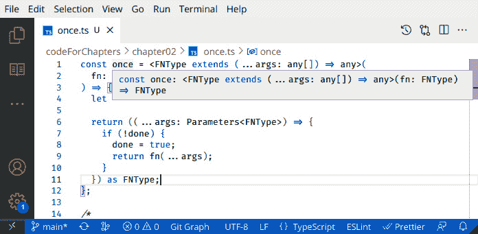
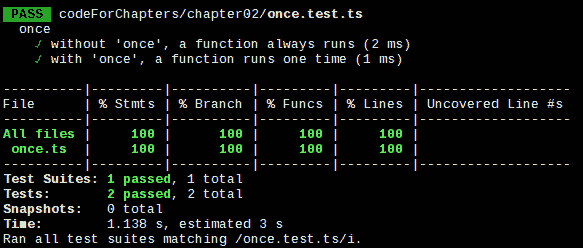

# 函数式思考 – 第一个例子

在*第一章*，*成为函数式开发者*中，我们介绍了什么是函数式编程（FP），提到了应用它的某些优点，并列出了我们在 JavaScript 中需要的工具。现在，让我们先放下理论，考虑一个简单的问题以及如何以函数式方式解决它。

在本章中，我们将做以下几件事：

+   看一个简单、与电子商务相关的问题

+   考虑几种通常的解决方法（及其相关缺陷）

+   通过函数式思考找到解决问题的方法

+   设计一个可以应用于其他问题的更高阶解决方案

+   学习如何进行功能解决方案的单元测试

在未来的章节中，我们将回到这里列出的某些主题，所以我们将不会深入探讨。我们只会展示函数式编程如何以不同的视角看待我们的问题，并将更多细节留到以后。

在完成本章内容后，你将首次接触到常见问题及其通过函数式思考方式解决问题的方法，这为本书后续内容做了铺垫。

# 我们的问题 – 只做一次的事情

让我们考虑一个简单但常见的情况。你已经开发了一个电子商务网站；用户可以填写他们的购物车，最后，他们必须点击一个**账单**按钮，以便他们的信用卡被扣款。然而，用户不应该点击两次（或更多次），否则他们将被多次扣款。

你的应用程序的 HTML 部分可能在某个地方有类似以下内容：

```js
<button id="billButton"
    onclick="billTheUser(some, sales, data)">Bill me
      </button>
```

在脚本中，你可能会看到以下类似的代码：

```js
function billTheUser(some, sales, data) {
  window.alert("Billing the user...");
  // actually bill the user
}
```

一个糟糕的例子

直接在 HTML 中分配事件处理器，就像我这样做的那样，是不推荐的。相反，你应该通过代码隐秘地设置处理器。所以，*照我说的做，别像我那样做*！

这是对网页问题的简单解释，但对我们来说已经足够了。现在，让我们开始思考如何避免重复点击该按钮。我们如何防止用户多次点击？这是一个有趣的问题，有几种可能的解决方案 – 让我们先看看不好的那些！

你能想到多少种解决我们问题的方法？让我们回顾几种解决方案并分析它们的质量。

## 解决方案 1 – 期望最好的结果！

我们该如何解决这个问题？第一个解决方案可能听起来像是一个玩笑：什么都不做，告诉用户不要点击两次，并期望最好的结果！你的页面可能看起来像*图 2**.1*：


图 2.1 – 一页实际的截图，只是提醒你避免多次点击

这是一种逃避问题的方法；我见过一些网站只是警告用户关于多次点击的风险，却没有采取任何预防措施。所以，用户被扣款两次？我们警告过他们...这是他们的错！

你的解决方案可能看起来像以下代码：

```js
<button
  id="billButton"
  onclick="billTheUser(some, sales, data)">Bill me
</button>
<b>WARNING: PRESS ONLY ONCE, DO NOT PRESS AGAIN!!</b>
```

好吧，这并不是一个真正的解决方案；让我们继续探讨更严肃的提议。

## 解决方案 2 – 使用全局标志

人们可能首先想到的解决方案是使用一些全局变量来记录用户是否已经点击了按钮。你可以定义一个名为 `clicked` 的标志，初始化为 `false`。当用户点击按钮时，如果 `clicked` 是 `false`，你将其更改为 `true` 并执行函数；否则，你什么都不做。这可以在以下代码中看到：

```js
let clicked = false;
.
.
.
function billTheUser(some, sales, data) {
  if (!clicked) {
    clicked = true;
    window.alert("Billing the user...");
    // actually bill the user
  }
}
```

这可行，但它有几个必须解决的问题：

+   你正在使用全局变量，并且可能会意外地更改其值。在 JavaScript 或其他语言中，全局变量不是一个好主意。你还必须记得在用户再次开始购买时将其重新初始化为 `false`。如果你不这样做，用户将无法进行第二次购买，因为支付将变得不可能。

+   你将难以测试此代码，因为它依赖于外部事物（即，点击变量）。

因此，这不是一个非常好的解决方案。让我们继续思考！

## 解决方案 3 – 移除处理程序

我们可能寻求一种横向的解决方案，而不是让函数避免重复点击，我们可能完全移除点击的可能性。以下代码正是这样做的；`billTheUser()` 做的第一件事就是从按钮中移除 `onclick` 处理程序，因此将不再可能进行进一步的调用：

```js
function billTheUser(some, sales, data) {
  document
    .getElementById("billButton")
    .onclick = null;
  window.alert("Billing the user...");
  // actually bill the user
}
```

这个解决方案也有一些问题：

+   代码与按钮紧密耦合，因此你无法在其他地方重用它。

+   你必须记得重置处理程序；否则，用户将无法进行第二次购买。

+   测试也将变得更加复杂，因为你将必须提供一些 DOM 元素。

我们可以增强这个解决方案，并通过在调用中提供按钮的 ID 作为额外的参数来避免将函数耦合到按钮上。（这个想法也可以应用于我们将会看到的某些其他解决方案。）HTML 部分如下；注意 `billTheUser()` 的额外参数：

```js
<button
  id="billButton"
  onclick="billTheUser('billButton', some, sales, data)"
>Bill me
</button>
```

我们还必须更改调用的函数，以便它将使用接收到的 `buttonId` 值来访问相应的按钮：

```js
function billTheUser(buttonId, some, sales, data) {
  document.getElementById(buttonId).onclick = null;
  window.alert("Billing the user...");
  // actually bill the user
}
```

这个解决方案稍微好一些。但，本质上，我们仍在使用一个全局元素 – 不是变量，而是 `onclick` 值。所以，尽管有所改进，但这也不是一个非常好的解决方案。让我们继续前进。

## 解决方案 4 – 更改处理程序

上一个解决方案的一个变体可能不是删除点击函数，而是分配一个新的函数。在这里，当我们将 `alreadyBilled()` 函数分配给点击事件时，我们正在使用函数作为一等对象。警告用户他们已经点击的函数可能看起来像这样：

```js
function alreadyBilled() {
  window.alert("Your billing process is running; don't
    click, please.");
}
```

我们的 `billTheUser()` 函数将如下所示 – 注意与上一节中分配 `null` 到 `onclick` 处理程序不同，现在分配的是 `alreadyBilled()` 函数：

```js
function billTheUser(some, sales, data) {
  document
    .getElementById("billButton")
    .onclick = alreadyBilled;
  window.alert("Billing the user...");
  // actually bill the user
}
```

这个解决方案也有优点；如果用户第二次点击，他们会收到警告不要这样做，但不会再次收费。（从用户体验的角度来看，这更好。）然而，这个解决方案仍然有与上一个相同的反对意见（代码与按钮耦合，需要重置处理器，以及更困难的测试），所以我们仍然认为它并不好。

## 解决方案 5 – 禁用按钮

在这里有一个类似的想法：我们不是移除事件处理器，而是禁用按钮，这样用户就无法点击。你可能有一个如下所示的函数，它通过设置按钮的`disabled`属性来执行这一操作：

```js
function billTheUser(some, sales, data) {
  document
    .getElementById("billButton")
    .setAttribute("disabled", "true");
  window.alert("Billing the user...");
  // actually bill the user
}
```

这也行得通，但我们仍然有与之前解决方案相同的反对意见（将代码与按钮耦合，需要重新启用按钮，以及更困难的测试），所以我们也不喜欢这个解决方案。

## 解决方案 6 – 重新定义处理器

另一个想法：我们不是在按钮上做任何改变，而是让事件处理器改变自己。技巧在于以下代码的第二行；通过给`billTheUser`变量赋一个新的值，我们动态地改变了函数的行为！第一次调用函数时，它会执行其操作，但它也会通过将其名称赋予一个新的函数来改变自己消失：

```js
function billTheUser(some, sales, data) {
  billTheUser = function() {};
  window.alert("Billing the user...");
  // actually bill the user
}
```

解决方案中有一个特殊的技巧。函数是全局的，所以`billTheUser=...`这一行改变了函数的内部工作方式。从那时起，`billTheUser`将变成新的（空）函数。这个解决方案仍然很难测试。更糟糕的是，你该如何恢复`billTheUser`的功能，将其恢复到原始目标？

## 解决方案 7 – 使用局部标志

我们可以回到使用标志的想法，但不是将其设置为全局的（这是我们反对第二个解决方案的主要原因），我们可以使用一个`clicked`，它将只对函数是局部的，在其他任何地方都不可见：

```js
var billTheUser = (clicked => {
  return (some, sales, data) => {
    if (!clicked) {
      clicked = true;
      window.alert("Billing the user...");
      // actually bill the user
    }
  };
})(false);
```

这个解决方案与全局变量解决方案类似，但使用私有、局部变量是一种改进。（注意`clicked`是如何从最后的调用中获得其初始值的。）我们唯一能找到的缺点是，我们必须重写每个只需要调用一次的函数，以便以这种方式工作（而且，正如我们将在下一节中看到的，我们的函数式解决方案在某些方面与之相似）。好吧，这并不太难做，但别忘了**不要重复自己**（**DRY**）的常规建议！

我们已经探讨了多种解决“只做一次”问题的方法 – 但正如我们所看到的，它们并不很好！让我们从功能的角度思考这个问题，以便我们得到一个更通用的解决方案。

# 我们问题的功能解决方案

让我们尝试更通用一些；毕竟，要求某些函数或其他函数只执行一次并不荒谬，可能在其他地方也需要！让我们制定一些原则：

+   原始函数（可能只能调用一次的函数）应该执行它预期执行的所有操作，而不做其他任何事情

+   我们不希望以任何方式修改原始函数

+   我们需要一个新函数，它将只调用原始函数一次

+   我们希望得到一个通用的解决方案，可以应用于任意数量的原始函数

SOLID 基础

之前列出的第一个原则是单一职责原则（SOLID 缩写中的 S），它指出每个函数都应该负责单一功能。有关 SOLID 的更多信息，请参阅 Uncle Bob（罗伯特·马丁，他写了这五个原则）的文章，见 [butunclebob.com/ArticleS.UncleBob.PrinciplesOfOod](http://butunclebob.com/ArticleS.UncleBob.PrinciplesOfOod)。

我们能行吗？是的，我们将编写一个高阶函数，它将能够应用于任何函数，以生成一个新的函数，该函数将只工作一次。让我们看看怎么做！我们将在*第六章*“生成函数”中介绍高阶函数。在那里，我们将测试我们的函数解决方案，并对它进行一些改进。

## 高阶解决方案

如果我们不希望修改原始函数，我们可以创建一个高阶函数，我们可以（富有创意地！）将其命名为 `once()`。这个函数将接收一个函数作为参数，并返回一个新的函数，该函数将只工作一次。（正如我们之前提到的，我们将在后面看到更多关于高阶函数的内容；特别是，请参阅*第六章**，*“一次做事情，重访”部分*）。

许多解决方案

Underscore 和 Lodash 已经有一个类似的函数，称为 `_.once()`。Ramda 也提供了 `R.once()`，大多数 FP 库都包括类似的功能，所以你不必自己编写它。

我们的 `once()` 函数一开始可能看起来有些吓人，但随着你习惯以 FP 风格工作，你会习惯这种代码，并发现它相当易于理解：

```js
// once.ts
const once = <FNType extends (...args: any[]) => any>(
  fn: FNType
) => {
  let done = false;
  return ((...args: Parameters<FNType>) => {
    if (!done) {
      done = true;
      return fn(...args);
    }
  }) as FNType;
};
```

让我们来看看这个函数的一些细节：

+   我们的 `once()` 函数接收一个函数（`fn`）作为其参数，并返回一个相同类型的新的函数。（我们将在稍后更详细地讨论这种类型。）

+   我们通过利用 *闭包*，就像在 *解决方案 7* 中那样，定义了一个内部、私有的 `done` 变量。我们选择不将其命名为 `clicked`（如我们之前所做的那样），因为你不一定需要点击按钮来调用函数；我们选择了更通用的术语。每次你将 `once()` 应用到某个函数时，都会创建一个新的、独特的 `done` 变量，并且只能从返回的函数中访问。

+   `return` 语句显示 `once()` 将返回一个函数，其参数类型与原始 `fn()` 相同。我们使用了在 *第一章* *成为函数式* 中看到的展开语法。在 JavaScript 的旧版本中，你必须处理参数对象；有关更多信息，请参阅 [developer.mozilla.org/en/docs/Web/JavaScript/Reference/Functions/arguments](http://developer.mozilla.org/en/docs/Web/JavaScript/Reference/Functions/arguments)。现代方式更简单、更简洁！

+   在调用 `fn()` 之前，我们将 `done = true` 赋值，以防该函数抛出异常。当然，如果你不想在函数成功结束之前禁用它，你可以将赋值移动到 `fn()` 调用下面。（有关此点的另一种看法，请参阅 *问题* 部分的 *问题 2.4*。）

+   设置完成后，我们最终调用原始函数。注意使用了展开运算符来传递原始 `fn()` 所有的参数。

`once()` 的类型定义可能有些晦涩。我们必须指定输入函数的类型和 `once()` 的类型是相同的，这就是定义 `FNType` 的原因。*图 2.2* 显示 TypeScript 正确理解了这一点（查看本书末尾 *问题 1.7* 的答案以获取此例的另一个示例）：



图 2.2 – 悬停显示 once() 输出的类型与输入的类型匹配

如果你还没有习惯使用 TypeScript，让我们看看纯 JavaScript 的等效代码，这同样是相同的代码，但用于类型定义：

```js
// once_JS.js
const once = (fn) => {
  let done = false;
  return (...args) => {
    if (!done) {
      done = true;
      return fn(...args);
    }
  };
};
```

那么，我们该如何使用它呢？我们首先创建一个计费函数的新版本。

```js
const billOnce = once(billTheUser);
```

然后，我们将 `onclick` 方法重写如下：

```js
<button id="billButton"
  onclick="billOnce(some, sales, data)">Bill me
</button>;
```

当用户点击按钮时，调用带有 `(some, sales, data)` 参数的函数不是原始的 `billTheUser()`，而是应用了 `once()` 的结果。结果是只能调用一次的函数。

你不可能总是得到你想要的！

注意，我们的 `once()` 函数使用了诸如一等对象、箭头函数、闭包和展开运算符等函数。在 *第一章* *成为函数式* 中，我们说过我们需要这些，所以我们信守承诺！我们唯一缺少的是递归，但正如滚石乐队所唱的，*你不可能总是得到你想要的*！

我们现在有一种功能方式来让函数只做一次事情，但我们应该如何测试它呢？现在让我们来探讨这个话题。

## 手动测试解决方案

我们可以运行一个简单的测试。让我们编写一个 `squeak()` 函数，当被调用时，它将适当地发出 *吱吱声*！代码很简单：

```js
// once.manual.ts
const squeak = a => console.log(a, " squeak!!");
squeak("original"); // "original squeak!!"
squeak("original"); // "original squeak!!"
squeak("original"); // "original squeak!!"
```

如果我们将 `once()` 应用到它上面，我们得到一个新的函数，它只会发出一次吱吱声。请看以下代码中高亮的行：

```js
// continued...
const squeakOnce = once(squeak);
squeakOnce("only once"); // "only once squeak!!" squeakOnce("only once"); // no output
squeakOnce("only once"); // no output
```

之前的步骤展示了我们如何手动测试我们的`once()`函数，但我们的方法并不完全理想。在下一节中，我们将看到为什么以及如何做得更好。

## 自动测试解决方案

手动运行测试并不合适：它会变得令人厌烦和无聊，而且过一段时间后，会导致不再运行测试。让我们做得更好，并使用**Jest**编写一些自动测试：

```js
// once.test.ts
import once } from "./once";
describe("once", () => {
  it("without 'once', a function always runs", () => {
    const myFn = jest.fn();
    myFn();
    myFn();
    myFn();
    expect(myFn).toHaveBeenCalledTimes(3);
  });
  it("with 'once', a function runs one time", () => {
    const myFn = jest.fn();
    const onceFn = jest.fn(once(myFn));
    onceFn();
    onceFn();
    onceFn();
    expect(onceFn).toHaveBeenCalledTimes(3);
    expect(myFn).toHaveBeenCalledTimes(1);
  });
});
```

这里有几个需要注意的点：

+   要监视一个函数（例如，统计它被调用的次数），我们需要将其作为参数传递给`jest.fn()`；我们可以对结果应用测试，它的工作方式与原始函数完全一样，但可以被监视。

+   当你监视一个函数时，Jest 会拦截你的调用并记录该函数被调用，以及调用次数和参数。

+   第一次测试只是检查如果我们多次调用函数，它会被调用相应次数。这很简单，但如果这种情况没有发生，我们就做错了什么！

+   在第二个测试中，我们将`once()`应用于一个（虚拟的）`myFn()`函数，并多次调用结果（`onceFn()`）。然后我们检查`myFn()`只被调用了一次，尽管`onceFn()`被调用了三次。

我们可以在*图 2**.3*中看到结果：



图 2.3 – 使用 Jest 对我们函数进行自动测试

通过这样，我们不仅看到了如何手动测试我们的函数解决方案，还看到了自动测试的方法，所以我们已经完成了测试。让我们最后考虑一个更好的解决方案，也是以函数方式实现的。

## 产生一个更好的解决方案

在之前的解决方案中，我们提到每次第一次点击后做一些事情是个好主意，而不是默默地忽略用户的点击。我们将编写一个新的高阶函数，它接受第二个参数——一个从第二次调用开始每次都要调用的函数。我们的新函数将被称为`onceAndAfter()`，可以写成以下形式：

```js
// onceAndAfter.ts
const onceAndAfter = <
  FNType extends (...args: any[]) => any
>(
  f: FNType,
  g: FNType
) => {
  let done = false;
  return ((...args: Parameters<FNType>) => {
    if (!done) {
      done = true;
      return f(...args);
    } else {
      return g(...args);
    }
  }) as FNType;
};
```

我们已经进一步探索了高阶函数；`onceAndAfter()`接受两个函数作为参数并产生一个第三个函数，它包含其他两个函数。

函数作为默认值

你可以通过为`g`提供一个默认值（例如`() => {}`）来使`onceAndAfter()`更强大，这样如果你没有指定第二个函数，它仍然可以正常工作，因为默认的不做任何事情函数会被调用而不是导致错误。

我们可以像之前一样进行快速测试。让我们向之前的`squeak()`函数添加一个`creak()`吱吱作响函数，并检查如果我们将`onceAndAfter()`应用于它们会发生什么。然后我们可以得到一个`makeSound()`函数，它应该先吱吱作响然后吱吱作响：

```js
// onceAndAfter.manual.ts
import { onceAndAfter } from "./onceAndAfter";
const squeak = (x: string) => console.log(x, "squeak!!");
const creak = (x: string) => console.log(x, "creak!!");
const makeSound = onceAndAfter(squeak, creak);
makeSound("door"); // "door squeak!!"
makeSound("door"); // "door creak!!"
makeSound("door"); // "door creak!!"
makeSound("door"); // "door creak!!"
```

为这个新函数编写测试并不难，只是稍微长一点。我们必须检查哪个函数被调用以及调用了多少次：

```js
// onceAndAfter.test.ts
import { onceAndAfter } from "./onceAndAfter";
describe("onceAndAfter", () => {
  it("calls the 1st function once & the 2nd after", () => {
    const func1 = jest.fn();
    const func2 = jest.fn();
    const testFn = jest.fn(onceAndAfter(func1, func2));
    testFn();
    testFn();
    testFn();
    testFn();
    expect(testFn).toHaveBeenCalledTimes(4);
    expect(func1).toHaveBeenCalledTimes(1);
    expect(func2).toHaveBeenCalledTimes(3);
  });
});
```

注意，我们始终检查 `func1()` 只被调用一次。同样，我们检查 `func2()`；调用次数从零开始（即 `func1()` 被调用时），然后每次调用增加一。

# 摘要

在本章中，我们看到了一个基于现实生活情况的常见简单问题。在分析了多种解决该问题的典型方法后，我们选择了函数式思考的解决方案。我们看到了如何将 FP 应用到我们的问题上，并找到了一个更通用的更高阶解决方案，我们可以将其应用于类似的问题，而无需进一步修改代码。我们还看到了如何为我们的代码编写单元测试，以完善开发工作。

最后，我们产生了一个更好的解决方案（从用户体验的角度来看），并看到了如何编码它以及如何进行单元测试。现在，你已经开始掌握如何以函数式的方式解决问题；接下来，在 *第三章*，*从函数开始*，我们将更深入地探讨函数，这是所有 FP 的核心。

# 问题

2.1 `done`，用来标记函数是否已经被调用。虽然这并不重要，但你能否不使用任何额外的变量来完成这个任务？请注意，我们并没有告诉你不要使用任何变量，只是不添加任何新的变量，例如 `done`，这只是一个练习！

2.2 `onceAndAfter()` 函数，你能编写一个 `alternator()` 高阶函数，它接受两个函数作为参数，并在每次调用时交替调用其中一个和另一个吗？预期的行为应如下例所示：

```js
const sayA = () => console.log("A");
const sayB = () => console.log("B");
const alt = alternator(sayA, sayB);
alt(); // A
alt(); // B
alt(); // A
alt(); // B
alt(); // A
alt(); // B
```

2.3 `once()`，你能编写一个高阶函数 `thisManyTimes(fn,n)`，它将允许你最多调用 `fn()` 函数 *n* 次，但在之后不做任何事情吗？为了举例，`once(fn)` 和 `thisManyTimes(fn,1)` 将产生具有相同行为的函数。也要为它编写测试。

2.4 将 `once()` 函数传递给一个函数，并且当该函数第一次被调用时崩溃。在这里，我们可能希望允许对该函数的第二次调用，希望它不会再次崩溃。我们需要一个 `onceIfSuccess()` 函数，它将接受一个函数作为参数，并生成一个新的函数，该函数只能成功运行一次，但在必要时允许失败（抛出异常）。实现 `onceIfSuccess()`，并且别忘了为它编写单元测试。

2.5 使用经典函数而不是箭头函数来实现 `once()`。这只是为了帮助你探索所需的数据类型语法略有不同的需求。
