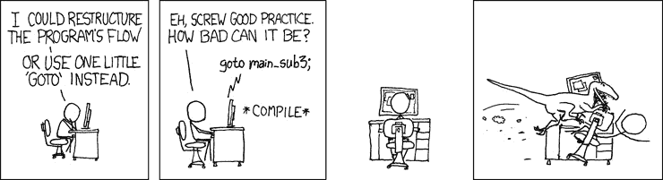

# 从函数开始 – 一个核心概念

在 *第二章* *函数式思考* 中，我们讨论了一个函数式编程思考的例子，但现在，让我们来看看基础知识并回顾一下函数。

在本章中，我们将做以下事情：

+   讨论 JavaScript 中的函数，包括如何定义它们，特别关注箭头函数

+   了解 currying 和函数作为一等对象

+   探索几种以函数式编程方式使用函数的方法

在学习完所有这些内容后，你将了解与函数相关的通用和特定概念，毕竟，函数是函数式编程的核心！

# 所有关于函数的内容

让我们从对 JavaScript 中的函数及其与函数式编程概念的关系的简要回顾开始。我们将从主要在第一章 *成为函数式* 的 *函数作为一等对象* 部分，以及在 *第二章* *函数式思考* 的几个地方提到的东西开始，然后继续讨论它们在实际编码中的使用。特别是，我们将关注以下内容：

+   关于 lambda 演算的一些基本概念，它是函数式编程的理论基础

+   箭头函数，这是 lambda 演算直接翻译到 JavaScript 的最直接方式

+   将函数作为一等对象使用，这是函数式编程中的一个关键概念

## 关于 lambda 和函数

在 lambda 演算的术语中，一个函数可以看起来像 λ*x*.2**x*。理解是 λ 字符后面的变量（希腊字母 *lambda* 的小写形式）是函数的参数，点号后面的表达式是你要替换传递作为参数的任何值的所在位置。在本章的后面部分，我们将看到这个特定的例子可以用 JavaScript 的箭头函数形式 `(x) => 2*x` 来编写，正如你所看到的，它非常相似。

一个押韵的辅助工具

如果你有时想知道参数和参数之间的区别，一个带有一些押韵的助记符可能会有所帮助：*参数是潜在的，参数是实际的*。参数是潜在值的占位符，这些值将被传递，而参数是传递给函数的实际值。换句话说，当你定义函数时，你列出它的参数，当你调用它时，你提供参数。

应用一个函数意味着你向它提供一个实际参数，这通常以括号内的方式书写。例如，(λ*x*.2**x*)(3) 将被计算为 6。这些 lambda 函数在 JavaScript 中的等效函数是什么？这是一个有趣的问题！定义函数的方式有几种，并且它们并不都具有相同的意义。

在 JavaScript 中，你可以有多少种方式定义函数？答案可能比你想象的要多！（一篇展示定义函数、方法等多种方式的优秀文章是 *JavaScript 中函数的多种面貌*，作者为 Leo Balter 和 Rick Waldron，可在 [bocoup.com/blog/the-many-faces-of-functions-in-javascript](http://bocoup.com/blog/the-many-faces-of-functions-in-javascript) 上阅读——值得一读！）至少，你可以写出以下内容——我将使用纯 JavaScript，因为在这里类型不是问题：

+   命名函数声明：`function` `first(...) {...};`

+   匿名函数表达式：`var second =` `function(...) {...};`

+   命名函数表达式：`var third = function` `someName(…) {...};`

+   立即调用的表达式：`var fourth = (function() { ...; return function(...) {...}; })();`

+   函数构造器：`var fifth =` `new Function(...);`

+   箭头函数：`var sixth = (...) => {...};`

如果你愿意，你可以添加对象方法声明，因为它们也意味着函数，但前面的列表应该足够了。

更多函数类型

JavaScript 还允许我们定义 `function*(...) {...}`) 返回一个 `Generator` 对象和 `async` 函数，它们是生成器和承诺的混合体。你可以在 [developer.mozilla.org/en/docs/Web/JavaScript/Reference/Statements/function](http://developer.mozilla.org/en/docs/Web/JavaScript/Reference/Statements/function) 和 [developer.mozilla.org/en-US/docs/Web/JavaScript/Reference/Statements/async_function](http://developer.mozilla.org/en-US/docs/Web/JavaScript/Reference/Statements/async_function) 分别了解更多关于它们的信息。

所有这些定义函数的方式之间有什么区别，为什么我们应该关心？让我们逐一探讨：

+   第一种定义，`function first(...) {...}`，是一个以 `function` 关键字开始的独立声明，可能是 JavaScript 中使用最广泛的方式，它定义了一个名为 `first` 的函数（即 `first.name==="first"`）。由于 `var` 定义；使用 `let` 或 `const` 时，不会应用提升。你可以在 [developer.mozilla.org/en-US/docs/Glossary/Hoisting](http://developer.mozilla.org/en-US/docs/Glossary/Hoisting) 上了解更多关于提升的信息。请记住，它仅适用于声明，而不适用于初始化。

+   将函数赋值给变量的`second = function(...) {...}`定义，也产生了一个函数，但是一个*匿名*（即没有名字）的函数。然而，许多 JavaScript 引擎可以推断出应该使用的名字，然后设置`second.name === "second"`。（查看以下代码，它显示了一个匿名函数没有分配名字的情况。）由于赋值没有提升，函数只有在赋值执行之后才能访问。此外，您可能更喜欢使用`const`而不是`var`来定义变量，因为您不会（不应该）更改函数——查看 ESLint 的`no-var`和`prefer-const`规则以强制执行此操作：

    ```js
    var second = function() {};
    console.log(second.name);
    // "second"
    var myArray = new Array(3);
    myArray[1] = function() {};
    console.log(myArray[1].name);
    // ""
    ```

+   第三个定义，`third = function someName(…) {...}`，与第二个定义相同，只是函数现在有自己的名字：`third.name === "someName"`。当您想要调用函数时，函数的名字是相关的，并且在递归调用时是必需的；我们将在*第九章*，*设计函数*中回到这一点。如果您只是需要一个用于，比如说，回调的函数，您可以使用一个没有名字的函数。然而，请注意，有名字的函数在错误跟踪中更容易被识别，这是您在试图理解发生了什么以及哪个函数调用了哪个函数时使用的列表。

+   第四个定义，`fourth = (function() { ...; return function(...) {...}; })()`，使用立即执行的表达式，允许您使用闭包。回到我们在*第一章**，*成为函数式开发者*部分的*闭包*部分中看到的计数器制作函数，我们可以编写如下内容。内部函数可以使用在外部函数中定义的变量或其他函数，以私有、封装的方式使用。外部函数接收一个参数（在这种情况下是`77`），用作`count`的初始值（如果没有提供初始值，我们从头开始`0`）。内部函数可以访问`count`（因为闭包），但变量不能在其他任何地方访问。在所有方面，返回的函数都是通用的——唯一的区别是它对私有元素的访问。这也是**模块**模式的基础：

    ```js
    const myCounter = (function myCounter(initialValue =
      0) {
      let count = initialValue;
      return function () {
        count++;
        return count;
      };
    })(77);
    console.log(myCounter()); // 78
    console.log(myCounter()); // 79
    console.log(myCounter()); // 80
    ```

+   第五个定义，`fifth = new Function(...)`，是不安全的，您不应该使用它！您首先传递参数的名字，然后是实际的函数体作为字符串，然后使用`eval()`的等效功能来创建函数——这允许许多危险的漏洞，所以不要这样做！（此外，TypeScript 无法推断出产生的函数的类型；它只是假设通用的`Function`类型。）为了激发您的兴趣，让我们看看重写我们在*第一章**，*成为函数式开发者*部分的*展开*部分中看到的非常简单的`sum3()`函数的例子：

    ```js
    const sum3 = new Function(
      "x",
      "y",
      "z",
      "const t = x+y+z; return t;"
    );
    sum3(4, 6, 7); // 17
    ```

`eval()`的怪癖

这种定义不仅不安全，还有一些其他的小问题——它们不会创建具有创建上下文的闭包，因此它们总是全局的。有关更多信息，请参阅[developer.mozilla.org/en-US/docs/Web/JavaScript/Reference/Global_Objects/Function](http://developer.mozilla.org/en-US/docs/Web/JavaScript/Reference/Global_Objects/Function)，但请记住，这种方式创建函数并不是一个好主意！

+   最后，最后一个定义，`sixth = (...) => {...}`，它使用了箭头`=>`，是定义函数最紧凑的方式，也是我们尽可能尝试使用的方式。

到目前为止，我们已经看到了几种定义函数的方法，所以让我们专注于箭头函数，这是我们在这本书的编码中将偏好的风格。

## 箭头函数——现代的方式

即使箭头函数在大多数情况下与其他函数的工作方式相同，它们之间以及与常规函数之间也有一些关键的区别（参见[developer.mozilla.org/en-US/docs/Web/JavaScript/Reference/Functions/Arrow_functions](http://developer.mozilla.org/en-US/docs/Web/JavaScript/Reference/Functions/Arrow_functions)）：箭头函数即使没有`return`语句也可以隐式返回一个值；`this`（函数的上下文）的值没有被绑定；没有`arguments`对象；它们不能用作构造函数；它们没有原型属性；并且由于不允许使用`yield`关键字，它们不能用作生成器。

在本节中，我们将探讨几个与 JavaScript 函数相关的话题，包括以下内容：

+   如何返回不同的值

+   如何处理`this`值的难题

+   如何处理不同数量的参数

+   一个重要的概念，柯里化（currying），我们将在本书的其余部分找到许多用途

### 返回值

在 lambda 编码风格中，函数只包含一个结果。为了简洁起见，新的箭头函数提供了一种语法来表示这一点。当你写一个像`(x,y,z) =>`后面跟着一个表达式的东西时，就隐含了一个`return`。例如，以下两个函数与之前展示的`sum3()`函数做的是同样的事情：

```js
const f1 = (x: number, y: number, z: number): number =>
  x + y + z;
const f2 = (x: number, y: number, z: number): number => {
  return x + y + z;
};
```

如果你想要返回一个对象，你必须使用括号；否则，JavaScript 会假设代码随后。不要认为这是一个极不可能的情况，请查看本章后面的*问题*部分中的*问题 3.1*，这是一个非常常见的场景！

有关风格的问题

当你定义一个只有一个参数的箭头函数时，你可以省略其周围的括号。为了保持一致性，我更喜欢总是包括它们。我使用的格式化工具 Prettier（我们在*第一章*，*成为函数式开发者*）最初并不赞成这样做，但在 2.0 版本中，它将`arrow-parens`配置项的默认值从`avoid`（意味着，尽量不使用括号）更改为`always`。

### 处理`this`值

JavaScript 中有一个经典问题，就是处理 `this`，其值并不总是你期望的。ES2015 通过箭头函数解决了这个问题，箭头函数会继承正确的 `this` 值，从而避免了问题。看看以下代码的例子，以了解可能存在的问题：当超时函数被调用时，`this` 将指向全局（`window`）变量而不是新对象，因此在控制台你会得到 `undefined`：

```js
function ShowItself1(identity: string) {
  this.identity = identity;
  setTimeout(function () {
    console.log(this.identity);
  }, 1000);
}
var x = new ShowItself1("Functional");
// after one second, undefined is displayed, not Functional
```

有一些传统的方法可以用老式的 JavaScript 解决这个问题：

+   一种解决方案是使用闭包并定义一个局部变量（通常命名为 `that` 或有时 `self`），它会获取 `this` 的原始值，因此它不会是 `undefined`。

+   第二种方法使用 `bind()`，因此超时函数将被绑定到正确的 `this` 值（我们在 *关于 lambda 和函数* 部分使用 `bind()` 达到类似的目的）。

+   第三种，更现代的方法只是使用箭头函数，这样 `this` 就会得到正确的值（指向对象），无需进一步操作。

让我们看看实际的三个解决方案。我们使用闭包处理第一个超时，绑定处理第二个，箭头函数处理第三个：

```js
// continued...
function ShowItself2(identity: string) {
  this.identity = identity;
  const that = this;
  setTimeout(function () {
    console.log(that.identity);
  }, 1000);
  setTimeout(
    function () {
      console.log(this.identity);
    }.bind(this),
    2000
  );
  setTimeout(() => {
    console.log(this.identity);
  }, 3000);
}
const x2 = new ShowItself2("JavaScript");
// after one second, "JavaScript"
// after another second, the same
// after yet another second, once again
```

如果你运行这段代码，你会在 1 秒后得到 `JavaScript`，然后又过一秒再次得到，再过一秒又得到一次。所有三种方法都正确工作，所以你选择哪一种只取决于你更喜欢哪一种。

### 处理参数

在 *第一章**，《成为函数式开发者》* 和 *第二章**，《函数式思考》* 中，我们看到了一些使用展开（`...`）操作符的例子。然而，我们将最实用地使用它来处理参数；我们将在 *第六章**，《生成函数》* 中看到一些这样的例子。

让我们回顾一下来自 *第二章**，《函数式思考》* 的 `once()` 函数：

```js
// once.ts
const once = <FNType extends (...args: any[]) => any>(
  fn: FNType
) => {
  let done = false;
  return ((...args: Parameters<FNType>) => {
    if (!done) {
      done = true;
      return fn(...args);
    }
  }) as FNType;
};
```

为什么我们写 `return (...args) =>` 然后紧接着 `func(...args)`？答案与处理可变数量（可能为零）的参数的更现代方式有关。你是如何管理 JavaScript 旧版本中的这类代码的？答案是 `arguments` 对象（不是一个数组；阅读 [developer.mozilla.org/en/docs/Web/JavaScript/Reference/Functions/arguments](http://developer.mozilla.org/en/docs/Web/JavaScript/Reference/Functions/arguments)），它允许你访问传递给函数的实际参数。

事实上，`arguments` 是一个类似数组的对象，而不是真正的数组——它唯一的数组属性是 `length`。你不能在 `arguments` 上使用 `map()`、`forEach()` 等方法。要将 `arguments` 转换为真正的数组，你必须使用 `slice()`；你还需要使用 `apply()` 来调用另一个函数，如下所示：

```js
function useArguments() {
  …
  var myArray = Array.prototype.slice.call(arguments);
  somethingElse.apply(null, myArray);
  …
}
```

在现代 JavaScript 中，你不需要使用参数、切片或应用：

```js
function useArguments2(...args) {
  …
  somethingElse(...args);
  …
}
```

在查看此代码时，你应该记住以下要点：

+   通过编写 `useArguments2(...args)`，我们立即清楚地表达我们的新函数接收几个（可能为零）参数。

+   你不需要做任何事情来得到一个数组；`args` 是一个真正的数组。

+   写 `somethingElse(...args)` 比使用 `apply()` 更清晰。

顺便说一下，`arguments` 对象在当前版本的 JavaScript 中仍然可用。如果你想从它创建一个数组，你有两种替代方法来做这件事，而无需求助于 `Array.prototype.slice.call` 技巧：

+   使用 `from()` 方法并编写 `myArray=Array.from(arguments)`。

+   写 `myArray=[...arguments]`，这显示了扩展运算符的另一种用法。

当我们讨论到高阶函数时，编写处理其他函数、可能未知数量的参数的函数将变得很常见。

JavaScript 提供了一种更简洁的方式来完成这个任务，所以你将不得不习惯这种用法。这是值得的！

### 一个参数还是多个？

还可以编写返回函数的函数，在 *第六章* *生成函数* 中，我们将看到更多关于这个的内容。例如，在 lambda 演算中，你不会写带有多个参数的函数，而只有一个；你使用一种称为 **currying** 的技术来做这件事。（但你为什么要这样做呢？保留这个想法；我们稍后会谈到。） 

双重认可

Currying 这个名字来源于 Haskell Curry，他提出了这个概念。一种函数式语言，*Haskell*，也是以他的名字命名的——双重认可！

例如，我们之前看到的那三个数字求和的函数可以这样写：

```js
// sum3.ts
const altSum3 = (x: number) => (y: number) => (z: number)
  =>
    x + y + z;
```

为什么我改变了函数的名称？简单地说，这 **不是** 我们之前看到的同一个函数。`sum3()` 的类型是 `(x: number, y: number, z: number) => number`，而 `altSum3()` 的类型是 `(x: number) => (y: number) => (z: number) => number`，这是不同的。（有关更多内容，请参阅 *问题 3.3*。）然而，它可以用来说明与我们的早期函数完全相同的结果。让我们看看你如何使用它，比如，来求和数字 1、2 和 3：

```js
altSum3(1)(2)(3); // 6
```

在继续阅读之前，先测试一下自己，并思考这个问题：如果你写了 `altSum3(1,2,3)`，会返回什么？提示：它不会是一个数字！要得到完整的答案，请继续阅读。

这是如何工作的？将其分解为许多调用可以帮助；这将是以这种方式由 JavaScript 解释器计算前一个表达式的：

```js
const fn1 = altSum3(1);
const fn2 = fn1(2);
const fn3 = fn2(3);
```

想象一下函数式！调用 `altSum3(1)` 的结果，根据定义，是一个函数，由于闭包，它解析为以下内容：

```js
const fn1 = y => z => 1 + y + z;
```

我们的 `altSum3()` 函数旨在接收单个参数，而不是三个！这个调用的结果，`fn1`，也是一个单参数函数。当你使用 `fn1(2)` 时，结果再次是一个函数，也只有一个参数，它等同于以下内容：

```js
const fn2 = z => 1 + 2 + z;
```

当你计算`fn2(3)`时，最终返回了一个值——太棒了！正如我们所说的，函数执行的计算类型与我们之前看到的相同，但方式本质上不同。

你可能会认为柯里化是一个奇特的技巧：谁会想只使用单参数函数呢？当我们考虑如何在*第八章*“连接函数”和*第十二章*“构建更好的容器”中将函数组合在一起时，你会看到这样做的原因，在这些章节中，从一个步骤传递超过一个参数到下一个步骤是不切实际的。

## 函数作为对象

首类对象的概念意味着函数可以被创建、分配、更改、作为参数传递，并且可以作为其他函数的结果返回，就像你可以用数字或字符串一样。让我们从它的定义开始。让我们看看你通常是如何定义一个函数的——你认出函数的名字了吗？（提示：谷歌“Colossal Cave Adventure”！）

```js
function xyzzy(...) { ... }
```

这（几乎）等同于编写以下内容：

```js
var xyzzy = function(...) { ... }
```

然而，这与提升（hoisting）不同，正如我们在*关于 lambda 函数和函数*部分中解释的那样。JavaScript 将所有定义移动到当前作用域的顶部，但不会移动赋值。在第一个定义中，你可以从代码的任何地方调用`xyzzy(...)`，但在第二个定义中，你必须等到赋值执行后才能调用该函数。

我们想要表达的观点是，一个函数可以被分配给一个变量，如果需要的话也可以重新分配。在类似的方面，我们可以在需要的地方定义函数。我们甚至可以不命名它们来做这件事：就像常见的表达式一样，如果它们只使用一次，你不需要命名它们或将它们存储在变量中。

一个巨大的并行

你看到与 70 年代的*Colossal Cave Adventure*游戏的平行了吗？在任何地方调用`xyzzy()`并不总是有效的！如果你从未玩过那个著名的交互式小说游戏，可以在线尝试——例如，在[www.web-adventures.org/cgi-bin/webfrotz?s=Adventure](http://www.web-adventures.org/cgi-bin/webfrotz?s=Adventure)或[www.amc.com/blogs/play-the-colossal-cave-adventure-game-just-like-halt-and-catch-fires-cameron-howe--1009966](http://www.amc.com/blogs/play-the-colossal-cave-adventure-game-just-like-halt-and-catch-fires-cameron-howe--1009966)。

让我们看看一个实际的代码示例，它涉及到函数的赋值。

### 一个 React-Redux reducer

正如我们在*第一章*“成为函数式”中提到的，React-Redux 通过分发由*reducer*处理的动作来工作。（更多关于这个话题的信息，请参阅[redux.js.org/tutorials/fundamentals/part-3-state-actions-reducers](http://redux.js.org/tutorials/fundamentals/part-3-state-actions-reducers)。）通常，reducer 包含带有 switch 语句的代码。以下是一个例子——我使用 JavaScript（而不是 TypeScript）来关注逻辑方面：

```js
// reducer.ts
function doAction(
  state = initialState,
  action = emptyAction
) {
  const newState: State = {};
  switch (action?.type) {
    case "CREATE":
      // update state, generating newState,
      // depending on the action data
      // to create a new item
      return newState;
    case "DELETE":
      // update state, generating newState,
      // after deleting an item
      return newState;
    case "UPDATE":
      // update an item,
      // and generate an updated state
      return newState;
    default:
      return state;
  }
}
```

初始状态

将`initialState`作为状态的默认值是一种初始化全局状态的方法。不要注意那个`default`；它与我们的例子无关，我之所以包含它，只是为了完整性。我还假设存在`State`、`Action`和其他类型——参见*问题 3.5*！

通过利用存储函数的可能性，我们可以构建一个**调度** **表**并简化前面的代码。首先，我们初始化一个对象，其中包含每个动作类型的函数代码。我们只是将前面的代码取出来，创建单独的函数：

```js
// continued...
const dispatchTable = {
  CREATE: (state, action) => {
    // update state, generating newState,
    // depending on the action data
    // to create a new item
    const NewState = {
      /* updated State */
    };
    return NewState;
  },
  DELETE: (state, action) => {
    // update state, generating newState,
    // after deleting an item
    const NewState = {
      /* updated State */
    };
    return NewState;
  },
  UPDATE: (state, action) => {
    // update an item,
    // and generate an updated state
    const NewState = {
      /* updated State */
    };
    return NewState;
  },
};
```

我们将处理每种动作的不同函数存储在作为调度表工作的对象属性中。此对象仅创建一次，并在应用程序执行期间保持不变。有了它，我们现在可以只用一行代码重写动作处理代码：

```js
// continued...
function doAction2(state, action) {
  return dispatchTable[action.type]
    ? dispatchTableaction.type
    : state;
}
```

让我们分析一下：给定动作，如果`action.type`与调度对象中的属性匹配，我们执行从对象中取出的相应函数。如果没有匹配，我们只返回当前状态，因为 Redux 要求这样做。如果没有能够将函数（存储和调用它们）作为一等对象处理，这种类型的代码是不可能的。

### 一个不必要的错误

然而，有一个常见的（尽管实际上是无害的）错误通常会被犯。你经常看到这样的代码：

```js
fetch("some/url").then(function(data) {
  processResult(data);
});
fetch("some/url").then((data) => processResult(data));
```

这段代码做什么？其思路是获取远程 URL，当数据到达时，调用一个函数——然后这个函数用`data`作为参数调用`processResult`。也就是说，在`then()`部分，我们想要一个函数，给定数据，计算`processResult(data)`。但我们不是已经有了这样的函数吗？

有一个规则，你可以在看到以下内容时应用：

```js
function someFunction(someData) {
  return someOtherFunction(someData);
}
```

此规则指出，你可以用`someOtherFunction`替换类似前面代码的代码。所以，在我们的例子中，我们可以直接写出以下内容：

```js
fetch("some/url").then(processResult);
```

这段代码与之前我们查看的方法等价（尽管由于避免了函数调用，它几乎更快），但它是否更容易理解？

一些术语

在λ演算术语中，我们是用简单的`func`替换了λ*x*.*func* *x*——这被称为**η (eta) 转换**，或者更具体地说，是**η** **归约**。（如果你反过来做，那将是**η** **抽象**。）在我们的情况下，它可以被认为是一个（非常，非常小的！）优化，但其主要优势是代码更短，更紧凑。

这种编程风格被称为**无点**（也称为**无点**）或**隐式**风格，其定义特征是您永远不会为每个函数应用指定参数。这种编码方式的一个优点是它帮助作者（以及未来的代码读者）思考函数及其含义，而不是在低级别上工作，传递数据，并与之交互。在代码的简短版本中，没有无关或无关紧要的细节：如果您知道被调用的函数做什么，您就理解了整个代码片段的含义。我们通常（但不一定总是）会以这种方式在我们的文本中工作。

传统的 Unix 风格

Unix/Linux 用户已经习惯了这种风格，因为他们使用管道将命令的结果作为输入传递给另一个命令时，以类似的方式进行工作。当您编写`ls|grep doc|sort`时，`ls`的输出是`grep`的输入，而`grep`的输出是`sort`的输入——但输入参数并没有写出来；它们是隐含的。我们将在*第八章*的*“无点风格”部分*中回到这一点，*“连接函数”*。

### 与方法交互

然而，有一个情况您应该注意：如果您调用一个对象的方法会发生什么？看看以下代码：

```js
fetch("some/remote/url").then(function (data) {
  myObject.store(data);
});
```

如果您的原始代码与前面的代码类似，那么看似明显的转换代码将失败：

```js
fetch("some/remote/url").then(myObject.store); // Fail!
```

为什么？原因是原始代码中，被调用的方法绑定到一个对象（`myObject`），但在修改后的代码中，它没有绑定，只是一个自由函数。我们可以通过使用`bind()`来修复它：

```js
fetch("some/remote/url").then(
  myObject.store.bind(myObject)
);
```

这是一个通用的解决方案。在处理方法时，您不能只是分配它；您必须使用 `bind()` 以确保正确的上下文可用。看看以下代码：

```js
const doSomeMethod = (someData) => {
  return someObject.someMethod(someData);
}
```

依照这个规则，这样的代码应该转换为以下形式：

```js
const doSomeMethod = someObject.someMethod.bind(someObject);
```

小贴士

在 [developer.mozilla.org/en/docs/Web/JavaScript/Reference/Global_objects/Function/bind](http://developer.mozilla.org/en/docs/Web/JavaScript/Reference/Global_objects/Function/bind) 上了解更多关于 `bind()` 的信息。

这看起来相当笨拙，并不太优雅，但这是必须的，以便方法将与正确的对象相关联。当我们*第六章*中的函数*“生成函数”进行*“Promise 化”时，我们将看到这种应用的例子。即使这段代码看起来并不那么令人愉快，但每当您必须与对象（记住，我们并没有说我们会尝试实现完全的函数式编程代码，而是说如果它们使事情变得更容易，我们会接受其他结构）交互时，您必须记得在以无点风格将它们作为一等对象传递之前绑定方法。

到目前为止，我们讨论了许多关于函数的方面；现在，让我们更深入地探讨 FP 中的函数，看看我们将如何使用它们。

# 使用函数进行 FP 编程方式

几种常见的编码模式利用了函数式编程（FP）风格，即使你并没有意识到。在本节中，我们将逐一介绍它们，并查看代码的功能性方面，以便你能够更习惯这种编码风格。

然后，我们将详细探讨以函数式编程（FP）方式使用函数，通过考虑以下几种函数式编程技术：

+   **注入**，这是排序不同策略以及其他用途所必需的

+   **Callbacks** 和 **promises**，引入 **continuation-passing** 风格

+   **Polyfilling** 和 **stubbing**

+   **Immediate** **invocation** schemes

## 注入 - 排序问题

`Array.prototype.sort()` 方法提供了传递函数作为参数的第一个例子。如果您有一个字符串数组并且想要对其进行排序，您可以直接使用 `sort()` 方法。例如，要对彩虹的颜色进行字母排序，我们会写如下内容：

```js
// sort.ts
const colors = [
  "violet",
  "indigo",
  "blue",
  "green",
  "yellow",
  "orange",
  "red",
];
colors.sort();
console.log(colors);
// 'blue', 'green', 'indigo', 'orange', 'red',
// 'violet', 'yellow'
```

注意，我们不需要向 `sort()` 调用提供任何参数，但数组被完美排序了。默认情况下，此方法根据字符串的 ASCII 内部表示进行排序。因此，如果您使用此方法对数字数组进行排序，它将失败，因为它会决定 20 必须位于 100 和 3 之间，因为 100 在 20（作为字符串）之前，而后者在 3 之前，所以这需要修复！以下代码显示了问题：

```js
// continued...
const someNumbers = [3, 20, 100];
someNumbers.sort();
console.log(someNumbers);
// 100, 20, 3
```

但让我们暂时忘记数字，专注于排序字符串。如果我们想要按照适当的区域规则对一些西班牙语单词（*palabras*）进行排序，会发生什么？我们会排序字符串，但结果可能不会正确：

```js
// continued...
const palabras = [
  "ñandú",
  "oasis",
  "mano",
  "natural",
  "mítico",
  "musical",
];
palabras.sort();
console.log(palabras);
// "mano", "musical", "mítico",
// "natural", "oasis", "ñandú" -- wrong result!
```

一个词中有什么？

对于语言或生物学爱好者来说，英语中的 *ñandú* 是 *rhea*，一种类似鸵鸟的奔跑鸟类。以 *ñ* 开头的西班牙语单词并不多，而且我们恰好在我所在的国家乌拉圭有这些鸟类，这就是这个奇怪单词的原因！

哎呀！在西班牙语中，*ñ* 位于 *n* 和 *o* 之间，但 `"ñandú"` 被排序到了最后。此外，`"mítico"`（在英语中意为神话般的；注意重音 *í*）应该位于 `"mano"` 和 `"musical"` 之间，因为波浪号应该被忽略。解决这个问题的适当方法是提供一个比较函数给 `sort()`。在这种情况下，我们可以使用 `localeCompare()` 方法，如下所示：

```js
// continued...
palabras.sort((a: string, b: string) =>
  a.localeCompare(b, "es")
);
console.log(palabras);
// "mano", "mítico", "musical",
// "natural", "ñandú", "oasis" –- correct result!
```

`a.localeCompare(b,"es")` 调用比较了 `a` 和 `b` 字符串，如果 `a` 在 `b` 之前，则返回负值；如果 `a` 在 `b` 之后，则返回正值；如果 `a` 和 `b` 相同，则返回 0 - 但根据西班牙语（`"es"`）的排序规则。

现在，一切正常！而且可以通过引入一个新的函数 `spanishComparison()` 来执行所需的字符串比较，使代码更清晰：

```js
// continued...
const spanishComparison = (a: string, b: string) =>
  a.localeCompare(b, "es");
palabras.sort(spanishComparison); // same correct result
```

国际排序

更多关于 `localeCompare()` 的可能性，请参阅 [developer.mozilla.org/en/docs/Web/JavaScript/Reference/Global_Objects/String/localeCompare](http://developer.mozilla.org/en/docs/Web/JavaScript/Reference/Global_Objects/String/localeCompare)。你可以指定要应用哪些区域规则，字母的大小写顺序，是否忽略标点符号，以及更多。但请注意：并非所有浏览器都支持所需的额外参数。

在接下来的章节中，我们将讨论函数式编程如何让你以更声明性的方式编写代码，生成更易于理解的代码，以及这种微小的变化是如何帮助的。当代码的读者到达 `sort` 函数时，他们将会立即推断出正在执行的操作，即使注释没有出现。

关于策略和模式

通过注入不同的比较函数来改变 `sort()` 函数的工作方式，这是一种策略 **设计模式** 的例子。我们将在 *第十一章*，*实现* *设计模式* 中了解更多。

将 `sort` 函数作为参数提供（以一种非常函数式编程的方式！）也可以帮助解决几个其他问题，例如以下内容：

+   默认情况下，`sort()` 只能与字符串一起使用。如果你想对数字进行排序（就像我们之前尝试的那样），你必须提供一个将数值比较的函数。例如，你会写类似 `myNumbers.sort((a:number, b:number) => a – b)` 的内容。（为什么？见 *问题 3.7*。）

+   如果你想要根据给定的属性对对象进行排序，你将使用一个与它比较的函数。例如，你可以使用类似 `myPeople.sort((a:Person, b:Person) => a.age - b.age)` 的方式对人们按年龄进行排序。

这是一个你可能之前使用过的简单例子，但毕竟它是一个函数式编程模式。让我们继续探讨在执行 Ajax 调用时将函数作为参数的更常见用法。

## 回调和承诺

函数作为一等对象传递的最常用例子之一与回调和承诺有关。在 Node.js 中，读取文件是通过以下类似代码的异步方式完成的：

```js
const fs = require("fs");
fs.readFile("someFile.txt", (err, data) => {
  if (err) {
    // handle the error
  } else {
    // do something with the received data
  }
});
```

`readFile()` 函数需要一个回调（在这个例子中是一个匿名函数），当文件读取操作完成时会被调用。

一种更好、更现代的方法是使用承诺；更多内容请参阅 [developer.mozilla.org/en-US/docs/Web/JavaScript/Reference/Global_Objects/Promise](http://developer.mozilla.org/en-US/docs/Web/JavaScript/Reference/Global_Objects/Promise)。使用这种方式，当使用 `fetch()` 函数执行 Ajax 网络服务调用时，你可以编写类似以下代码的内容：

```js
fetch("some/remote/url")
  .then((data) => {
    // do something with the received data
  })
  .catch((error) => {
    // handle the error
  });
```

最后，你也应该考虑使用`async`/`await`；更多关于它们的信息可以在[developer.mozilla.org/en-US/docs/Web/JavaScript/Reference/Statements/async_function](http://developer.mozilla.org/en-US/docs/Web/JavaScript/Reference/Statements/async_function)和[developer.mozilla.org/en-US/docs/Web/JavaScript/Reference/Operators/await](http://developer.mozilla.org/en-US/docs/Web/JavaScript/Reference/Operators/await)中找到。

## 延续传递风格

之前提到的代码，其中你调用一个函数，同时也传递另一个在输入/输出操作完成后要执行的函数，可以被认为是称为**延续传递风格**（**CPS**）的东西。这种编程技术是什么？一种看待它的方式是思考以下问题：*如果你被禁止使用 return 语句，你会如何编程？*

初看起来，这似乎是一种不可能的情况。然而，我们可以通过传递一个回调给被调用的函数来摆脱困境，这样当该过程准备好返回给调用者时，而不是返回，它将调用给定的回调。通过这样做，回调为被调用的函数提供了继续过程的方式，因此得名*延续*。我们现在不会深入探讨这个问题，但在*第九章*，*设计函数*中，我们将深入研究它。特别是，CPS 将帮助我们避免一个重要的递归限制，正如我们将看到的。

确定如何使用延续有时具有挑战性，但总是可能的。这种编程方式的令人兴奋的优势在于，通过指定过程将如何继续，你可以超越所有常规结构（`if`、`while`、`return`等），并实现你想要的任何机制。这在处理过程不一定是线性的问题中非常有用。当然，这也可能导致你发明一种比你可能想象的 GOTO 语句的潜在使用更糟糕的控制结构！*图 3.1*显示了这种做法的危险！



图 3.1 – 如果你开始篡改程序流程，最坏的情况会是什么？（这个 XKCD 漫画可在[xkcd.com/292/](http://xkcd.com/292/)在线查看）

你不仅限于传递单个延续。就像承诺一样，你可以提供两个或更多的替代回调。顺便说一句，这可以提供一种解决方案来解决如何处理异常的问题。如果我们简单地允许一个函数抛出错误，那么它将是对调用者的隐式返回，我们不希望这样。摆脱这种困境的方法是提供一个替代回调（即不同的延续），以便在抛出异常时（在*第十二章*，*构建更好的容器*中，我们将找到另一种使用单子的解决方案）使用。

```js
function doSomething(a, b, c,
  normalContinuation, errorContinuation) {
  let r = 0;
  // ... do some calculations involving a, b, and c,
  // and store the result in r
  // if an error happens, invoke:
  // errorContinuation("description of the error")
  // otherwise, invoke:
  // normalContinuation(r)
}
```

使用 CPS 甚至可以让你超越 JavaScript 提供的控制结构，但这超出了本书的目标，所以我会让你自己研究这一点！

## Polyfills

能够动态分配函数（就像你可以为变量分配不同的值一样）也允许你在定义 polyfills 时更加高效地工作。

### 检测 Ajax

让我们回到 Ajax 开始出现的时候。鉴于不同的浏览器以不同的方式实现了 Ajax 调用，你总是必须围绕这些差异进行编码。以下代码展示了你将如何通过测试几个不同的条件来实现 Ajax 调用：

```js
// ajax.ts
function getAjax() {
  let ajax = null;
  if (window.XMLHttpRequest) {
    // modern browser? use XMLHttpRequest
    ajax = new XMLHttpRequest();
  } else if (window.ActiveXObject) {
    // otherwise, use ActiveX for IE5 and IE6
    ajax = new ActiveXObject("Microsoft.XMLHTTP");
  } else {
    throw new Error("No Ajax support!");
  }
  return ajax;
}
```

这行代码运行了，但暗示了你会为每个调用重新进行 Ajax 检查，尽管测试结果永远不会改变。有一种更有效的方法来做这件事，这与使用函数作为一等对象有关。我们可以定义**两个**不同的函数，只测试一次条件，然后分配正确的函数供以后使用；研究以下代码以了解这种替代方案：

```js
// continued...
(function initializeGetAjax() {
  let myAjax = null;
  if (window.XMLHttpRequest) {
    // modern browsers? use XMLHttpRequest
    myAjax = function () {
      return new XMLHttpRequest();
    };
  } else if (window.ActiveXObject) {
    // it's ActiveX for IE5 and IE6
    myAjax = function () {
      new ActiveXObject("Microsoft.XMLHTTP");
    };
  } else {
    myAjax = function () {
      throw new Error("No Ajax support!");
    };
  }
  window.getAjax = myAjax;
})();
```

这段代码展示了两个重要的概念。首先，我们可以动态地分配一个函数：当这段代码运行时，`window.getAjax`（全局的`getAjax`变量）将根据当前浏览器获得三个可能值之一。当你后来在你的代码中调用`getAjax()`时，正确的函数将执行，而无需你进行任何进一步的浏览器检测测试。

第二个有趣的想法是我们定义了`initializeGetAjax()`函数并立即运行它——这种模式被称为**立即调用的函数表达式**（**IIFE**），我们已经在*第二章**——*函数式思考*中的*解决方案 7——使用局部标志*部分中看到了它。函数运行后会自行清理，因为所有变量都是局部的，并且在函数运行后甚至不会存在。我们将在本章后面了解更多关于这一点。

现在，你会使用模块而不是 IIFE，如下所示：

```js
// ajax.module.ts
let getAjax = null;
if (window.XMLHttpRequest) {
  // modern browsers? use XMLHttpRequest
  getAjax = function () {
    return new XMLHttpRequest();
  };
} else if (window.ActiveXObject) {
  // it's ActiveX for IE5 and IE6
  getAjax = function () {
    new ActiveXObject("Microsoft.XMLHTTP");
  };
} else {
  getAjax = function () {
    throw new Error("No Ajax support!");
  };
}
export { getAjax };
```

模块中的代码保证只运行一次。无论你需要进行 Ajax 调用的地方，你只需`import { getAjax } from "/path/to/ajax.module"`，然后你可以随意使用`getAjax()`。

### 添加缺失的函数

这种在运行时定义函数的想法也允许我们编写提供其他缺失函数的 polyfills。例如，假设我们有一些如下所示的代码：

```js
if (currentName.indexOf("Mr.") !== -1) {
  // it's a man
  ...
}
```

而不是这样做，你可能会非常倾向于使用较新的`includes()`方法，并简单地写下如下内容：

```js
if (currentName.includes("Mr.")) {
  // it's a man
  ...
}
```

如果你的浏览器不提供`includes()`会发生什么？再一次，我们可以在运行时定义适当的函数，但仅当需要时。如果`includes()`可用，你不需要做任何事情，但如果它缺失，你需要定义一个 polyfill 来提供相同的功能。（你可以在 Mozilla 的开发者网站上找到 polyfills 的链接。）以下代码展示了这样一个 polyfill 的示例：

```js
if (!String.prototype.includes) {
  String.prototype.includes = function (search, start) {
    "use strict";
    if (typeof start !== "number") {
      start = 0;
    }
    if (start + search.length > this.length) {
      return false;
    } else {
      return this.indexOf(search, start) !== -1;
    }
  };
}
```

当这段代码运行时，它会检查 `String` 原型是否已经有了 `includes()` 方法。如果没有，它会给它分配一个执行相同工作的函数，因此从那时起，你将能够使用 `includes()` 而无需进一步担心。顺便说一句，还有其他定义 polyfill 的方法：查看 *问题 3.7* 的答案以获取替代方案。另一个解决方案是 `core-js` 包 ([github.com/zloirock/core-js](http://github.com/zloirock/core-js))，它为 ECMAScript 提供了直到最新版本的 polyfill，甚至包括尚未进入语言的某些提案。

好或不好？

直接修改标准类型的原型对象通常是不被推荐的，因为本质上，这相当于使用全局变量，因此容易出错；然而，在这种情况下（为已建立且已知的功能编写 polyfill）引发冲突的可能性非常小。

最后，如果你认为之前展示的 Ajax 示例已经过时了，那么考虑一下这个：如果你想使用更现代的 `fetch()` 调用服务的方式，你也会发现并不是所有现代浏览器都支持它（通过访问 [caniuse.com/#search=fetch](http://caniuse.com/#search=fetch) 来验证这一点），因此你可能需要使用 polyfill，比如 [github.com/github/fetch](http://github.com/github/fetch) 上的那个。研究一下代码，你会发现它使用了之前描述的相同方法来检查是否需要 polyfill 并创建它。

## Stubbing

在这里，我们将探讨一个类似于使用 polyfill 的用例：一个函数根据环境执行不同的工作。这个想法是执行 stubbing，这是一个来自测试的概念，涉及用一个执行更简单工作的函数替换实际工作的函数。

Stubbing 通常与日志函数一起使用。你可能希望在开发时让应用程序执行详细的日志记录，但在生产时则不希望有任何输出。一个常见的解决方案可能是编写如下内容：

```js
let myLog = (someText) => {
  if (DEVELOPMENT) {
    console.log(someText); // or some other way of logging
  } else {
    // do nothing
  }
};
```

这方法是可行的，但就像 Ajax 检测的例子一样，它做了比所需更多的工作，因为它每次都会检查应用程序是否处于开发状态。

如果我们取消日志函数的记录功能，使其不记录任何内容，我们可以简化代码（并且获得一个非常非常小的性能提升！）！一个简单的实现方法如下：

```js
let myLog;
if (DEVELOPMENT) {
  myLog = (someText: string) => console.log(someText);
} else {
  myLog = (someText: string) => {};
}
```

我们可以使用三元运算符做得更好：

```js
const myLog = DEVELOPMENT
  ? (someText: string) => console.log(someText)
  : (someText: string) => {};
```

这有点晦涩，但我更喜欢它，因为它使用了 `const`，它不能被修改。

还有一种可能性：你可以像这样修改原始方法：

```js
if (DEVELOPMENT) {
  // do nothing, let things be
} else {
  console.log = (someText: string) => {};
}
```

在这种情况下，我们直接改变了 `console.log()` 的工作方式，因此它不会记录任何内容。

无用的参数 - 忽略还是排除？

由于 JavaScript 允许我们用比参数更多的参数调用函数，并且在我们不在开发阶段时，我们并没有在 `myLog()` 中做任何事情，我们也可以写成 `() => {}` 并正常工作。然而，我更喜欢保持相同的签名，这就是为什么我指定了 `someText` 参数，即使它不会被使用。但是，如果你使用 ESLint 的 `no-unused-vars` 规则来检测未使用的变量，你可能需要调整其配置以允许未使用的参数。

你会注意到我们反复使用函数作为一等对象的概念；浏览所有代码示例，你就会看到这一点！

## 立即调用（IIFE）

函数的另一种常见用法，通常在流行的库和框架中看到，它可以让您从其他语言中带来一些模块化优势到 JavaScript（即使是较旧的版本！）！通常的写法如下：

```js
(function () {
  // do something...
})();
```

或者，你可能还会发现 `(function(){ ... }())` – 注意函数调用中括号的放置方式不同。这两种风格都有其支持者；选择适合你的，并保持一致。

你还可以向函数传递一些参数，这些参数将用作其参数的初始值：

```js
(function (a, b) {
  // do something, using the
  // received arguments for a and b...
})(some, values);
```

最后，你也可以从函数中返回一些内容——通常是对象（带有多个方法）或函数：

```js
let x = (function (a, b) {
  // ...return an object or function
})(some, values);
```

注意函数周围的括号。这有助于解析器理解我们正在编写一个表达式。如果你省略第一组括号，JavaScript 会认为你正在编写一个函数声明而不是调用。括号还起到视觉提示的作用，因此你的代码的读者会立即识别出 IIFE。

如前所述，这种模式被称为 IIFE（发音为 *iffy*）。这个名字很容易理解：你定义一个函数并立即调用它，以便它立即执行。你为什么要这样做，而不是简单地内联编写代码呢？原因与作用域有关。

如果你定义了任何变量或函数在 IIFE 中，那么由于 JavaScript 定义函数的作用域，这些定义将是内部的，并且你的代码的其他部分将无法访问它们。想象一下，你想要编写一些复杂的初始化，如下所示：

```js
function ready() { ... }
function set() { ... }
function go() { ... }
// initialize things calling ready(),
// set(), and go() appropriately
```

会出什么问题？问题在于你可能会（意外地）有一个与这三个中的任何一个具有相同名称的函数，提升会导致最后一个函数被调用：

```js
function ready() {
  console.log("ready");
}
function set() {
  console.log("set");
}
function go() {
  console.log("go");
}
ready();
set();
go();
function set() {
  console.log("UNEXPECTED...");
}
// "ready"
// "UNEXPECTED"
// "go"
```

哎呀！如果你使用了 IIFE，这个问题就不会发生。（使用 ESLint 的 `no-func-assign` 规则也会防止这种情况。）此外，这三个内部函数甚至对代码的其他部分不可见，这有助于保持全局命名空间不太混乱。以下代码展示了这种广泛使用的模式：

```js
(function () {
  function ready() {
    console.log("ready");
  }
  function set() {
    console.log("set");
  }
  function go() {
    console.log("go");
  }
  ready();
  set();
  go();
})();
function set() {
  console.log("UNEXPECTED...");
}
// "ready"
// "set"
// "go"
```

要查看涉及返回值的示例，我们可以回顾*第一章* *成为函数式*中的示例，并编写以下代码，这将创建一个单独的计数器：

```js
const myCounter = (function () {
  let count = 0;
  return function () {
    count++;
    return count;
  };
})();
```

然后，每次调用 `myCounter()` 都会返回一个增加的计数，但没有任何其他部分的代码有机会覆盖内部的 `count` 变量，因为它只可以在返回的函数中访问。

# 摘要

在本章中，我们介绍了在 JavaScript 中定义函数的几种方法，主要关注箭头函数，它们在简洁性方面具有几个优点，优于标准函数。我们学习了柯里化（我们稍后会再次讨论）的概念，考虑了函数作为一等对象的一些方面，并回顾了几种实际上是完全函数式编程概念的技术。请放心，我们将使用本章中的所有内容作为本书其余部分更高级技术的基石；只需等待并观察！

在*第四章* *行为规范*中，我们将更深入地探讨函数，并了解纯函数的概念，这将引导我们走向更好的编程风格。

# 问题

3.1 `type` 属性，用于确定你正在创建什么类型的操作。以下代码据说会产生一个操作，但你能否解释意外结果？

```js
const simpleAction = (t:string) => {
  type: t;
};
console.log(simpleAction("INITIALIZE"));
// undefined
```

3.2 使用箭头函数而不是我们用 `function` 关键字的方式，从*处理参数*部分的 `useArguments()` 和 `useArguments2()`。

3.3 `sum3()` 和 `altsum3()`，但我们没有对 `fn1`、`fn2` 和 `fn3` 做这样的事情。这些函数的类型是什么？

3.4 `doAction2()` 作为一行代码，尽管从格式上无法看出这一点！你认为这是正确的还是不正确的？

```js
const doAction3 = (state = initialState, action) =>
  (dispatchTable[action.type] &&
    dispatchTableaction.type) ||
  state;
```

3.5 `doAction()`、`dispatchTable` 和 `doAction2()`？务必描述所有需要的类型。

3.6 `set()` 方法。在创建新的存储对象后，他编写了以下代码，以便在处理之前记录 `store.set()` 的参数。不幸的是，代码没有按预期工作。问题是什么？你能找到错误吗？

```js
window.store = new Store();
const oldSet = window.store.set;
window.store.set = (...data) => (
  console.log(...data), oldSet(...data)
);
```

3.7 `bind()` 不可用；你如何为它做 polyfill？

3.8 `myNumbers.sort((a:number, b:number) => a-b)` – 为什么/它是如何工作的？

3.9 **负数排序**：在之前的*注入 – 排序它*部分，我们看到了将数字作为字符串排序会产生意外的结果。如果数组中包含负数和正数，结果会是什么？

3.10 **字典序排序**：在排序，比如书籍标题或个人姓名时，会应用特殊的排序规则。例如，“THE SHINING”将被排序为“SHINING, THE”，而“Stephen King”将被排序为“King, Stephen”。你如何（高效地）实现这样的排序？

3.11 `console.log()` 方法没有正确的数据类型 – 例如，我们的版本仅允许单个参数。你能提供正确的数据类型定义吗？
