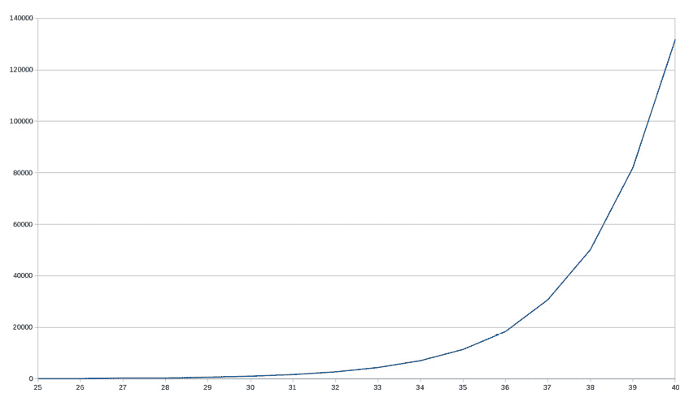
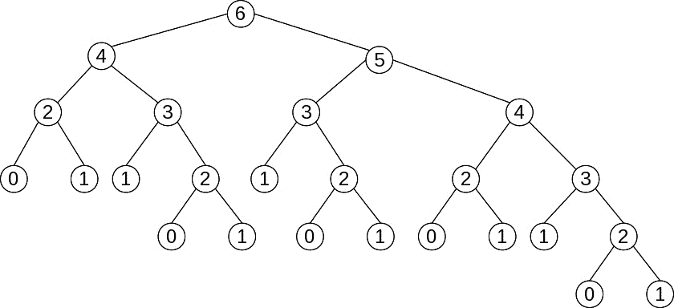
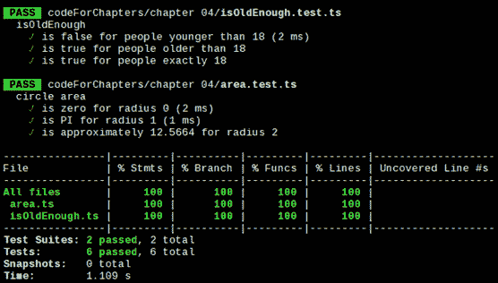

# 正确行为——纯净函数

在*第三章*，“函数入门”，我们考虑函数作为**函数式编程**（**FP**）中的关键元素，详细介绍了箭头函数，并介绍了一些概念，例如注入、回调、polyfilling 和 stubbing。在本章中，我们将有机会回顾或应用这些想法。

在本章中，我们将做以下事情：

+   考虑**纯净性**的概念以及为什么我们应该关注**纯净函数**——以及**不纯净函数**！

+   检查**指称透明性**的概念

+   认识到副作用所暗示的问题

+   展示纯净函数的一些优点

+   描述不纯净函数背后的主要原因

+   发现最小化不纯净函数数量的方法

+   专注于测试纯净函数和不纯净函数的方法

# 纯净函数

纯净函数的行为与数学函数相同，并提供各种好处。一个函数是纯净的，如果它满足以下两个条件：

+   **给定相同的参数，函数总是计算并返回相同的结果**：这应该在任何调用次数或调用条件下都成立。此结果不能依赖于任何外部信息或状态，这些信息或状态在程序执行过程中可能会改变，从而导致返回不同的值。同样，函数的结果也不能依赖于 I/O 结果、随机数、其他外部变量或无法直接控制的价值。

+   **在计算其结果时，函数不会引起任何可观察的副作用**：这包括输出到 I/O 设备、对象的修改、函数外部程序状态的改变等。

你可以简单地这样说，纯净函数不依赖于（也不修改）它们作用域之外的东西，并且对于相同的输入参数总是返回相同的结果。

在这个上下文中使用的另一个词是**幂等性**，但它并不完全相同。一个幂等的函数可以被调用任意多次，并且总是产生相同的结果。然而，这并不意味着函数没有副作用。

幂等性通常在 RESTful 服务上下文中提到。让我们看看一个简单的例子，说明纯净性和幂等性的区别。一个`PUT`调用会导致数据库记录被更新（副作用），但如果你重复调用，元素将不会被进一步修改，因此数据库的全局状态不会进一步改变。

我们还可能引用一个软件设计原则，并提醒自己，一个函数应该*只做一件事，只做那件事，而且只做那件事*。如果一个函数做了其他事情并且有一些隐藏的功能，那么这种对状态的依赖意味着我们无法预测函数的输出，这将使我们的开发工作变得更加困难。

让我们更详细地研究这些条件。

## 指称透明性

在数学中，引用透明性是指你可以用一个表达式的值来替换它，而不会改变你正在做的任何操作的结果。引用透明性的对立面，恰如其分地，是**引用不透明性**。一个引用不透明的函数不能保证它在用相同的参数调用时总是产生相同的结果。

以一个简单的例子来说明，让我们考虑一个执行**常量折叠**的优化编译器会发生什么。假设你有一个这样的句子：

```js
const x = 1 + 2 * 3;
```

编译器可能会通过注意到 `2*3` 是一个常量值来优化代码：

```js
const x = 1 + 6;
```

更好的是，新一轮的优化可以完全避免求和：

```js
const x = 7;
```

为了节省执行时间，编译器正在利用这样一个事实：所有数学表达式和函数（根据定义）都是引用透明的。

另一方面，如果编译器无法预测给定表达式的输出，它将无法以任何方式优化代码，计算将不得不在运行时完成。

（TypeScript 进行了类似的类型分析，并且根据原始的 `const x = 1 + 2 * 3` 行，它会正确地判断 `x` 的类型为 `number`。）

关于 lambda 和 beta

在 lambda 演算中，如果你用一个函数涉及的表达式的值替换为该函数的计算值，那么这个操作就称为**β (beta) 折减**。请注意，你只能安全地使用引用透明的函数来做这件事。

所有算术表达式（涉及数学运算符和函数）都是引用透明的：`22*9` 总是可以替换为 `198`。涉及 I/O 的表达式不透明，因为它们的执行结果在执行之前是无法知道的。同样地，涉及日期和时间相关函数或随机数的表达式也不透明。

关于你可以生成的 JavaScript 函数，编写一些不满足引用透明性条件的函数相当容易。实际上，函数甚至不需要返回一个值，尽管在这种情况下 JavaScript 解释器会返回 `undefined`。

区分的问题

一些语言区分函数和过程，函数预期返回一个值，而过程不返回任何值，但 JavaScript 的情况并非如此。一些语言甚至提供了确保函数是引用透明的手段。

如果你愿意，你可以这样对函数进行分类：

+   **纯函数**：这些函数返回的值仅取决于其参数，并且没有任何副作用。

+   `undefined`，但在这里这不相关）但确实会产生一些副作用。

+   **有副作用的函数**：这意味着它们返回的值可能不仅取决于函数参数，还涉及副作用。

在函数式编程（FP）中，对第一组（引用透明的纯函数）给予了更多重视。编译器可以推理程序行为（从而能够优化生成的代码），程序员也可以更容易地推理程序及其组件之间的关系。这反过来可以帮助证明算法的正确性或通过用等效函数替换函数来优化代码。

## 副作用

什么是副作用？我们可以将这些定义为在执行某些计算或过程中的状态变化或与外部元素（用户、网络服务、另一台计算机——无论什么）的交互，这些交互发生在执行某些计算或过程中的某个时刻。

对于这个含义的范围，可能存在一些误解。在日常用语中，当你说到副作用时，就像谈论附带损害——对于某个动作的一些意外后果；然而，在计算机科学中，我们包括函数之外的所有可能的效果或变化。如果你编写一个函数，目的是执行一个`console.log()`调用以显示结果，那么这将被视为副作用，即使这最初正是你打算让函数执行的事情！

在本节中，我们将探讨以下内容：

+   JavaScript 编程中的常见副作用

+   全局和内部状态引起的问题

+   函数修改其参数的可能性

+   一些总是麻烦的函数

### 常见的副作用

在编程中，有（太多！）被认为是副作用的事情。在 JavaScript 编程中，包括前端和后端编码，你可能会遇到以下更常见的情况：

+   更改全局变量。

+   修改作为参数接收的对象。

+   执行任何 I/O 操作，例如显示一个警告消息或记录一些文本。

+   与文件系统一起工作或更改文件系统。

+   查询或更新数据库。

+   调用一个网络服务。

+   查询或修改 DOM。

+   触发任何外部过程。

+   只调用另一个产生自身副作用的函数。可以说，不纯性是具有传染性的：调用一个不纯函数的函数自动变得不纯！

根据这个定义，让我们开始探讨什么可以导致函数的不纯性（或引用不透明性）。

### 全局状态

在所有上述点中，最常见的副作用原因是使用非局部变量，这些变量与其他程序部分共享全局状态。由于纯函数，根据定义，给定相同的输入参数总是返回相同的输出值，如果一个函数引用了其内部状态之外的内容，它就自动变成了不纯的。此外——这对调试是一个障碍——要了解一个函数做了什么，你必须了解状态是如何获得当前值的，这意味着理解程序的所有历史：这并不容易！

让我们编写一个函数来检测一个人是否是合法的成年人，通过检查他们是否至少 18 年前出生。（好吧——这不够精确，因为我们没有考虑出生的日和月，但请耐心等待；问题在其他地方。）一个`isOldEnough()`函数的版本可能如下所示：

```js
// isOldEnough.ts
const limitYear = 2004; // only good for 2022!
const isOldEnough = (birthYear: number) =>
  birthYear <= limitYear;
console.log(isOldEnough(1960)); // true
console.log(isOldEnough(2010)); // false
```

`isOldEnough()`函数正确地检测一个人是否至少 18 岁，但它依赖于一个外部变量——一个只适用于 2022 年的变量！尽管函数可以工作，但实现并不是最好的。除非你知道关于外部变量及其值的信息，否则你无法知道函数的功能。测试也很困难；你必须记得创建全局的`limitYear`变量，否则所有测试都会失败。

这条规则有一个例外。看看以下情况：以下`circleArea()`函数，它根据圆的半径计算圆的面积，是纯函数还是非纯函数？

```js
// area.ts
const PI = 3.14159265358979;
const circleArea = (r: number) => PI * r ** 2;
```

即使函数正在访问外部状态，由于`PI`是一个常数（因此不能被修改），我们可以将其在`circleArea`函数内部替换，而不会对函数的功能产生影响，因此我们应该接受这个函数是纯函数。该函数对于相同的参数总是返回相同的值，从而满足我们的纯函数要求。

如果你使用`Math.PI`而不是我们在代码中定义的常数（顺便说一句，这是一个更好的主意），由于常数不能被更改，所以函数将保持纯函数状态。

在这里，我们处理了由全局状态引起的问题；让我们继续讨论内部状态。

### 内部状态

这个概念也扩展到内部变量，其中存储并使用局部状态以供未来的调用。外部状态保持不变，但内部副作用意味着函数将返回的结果在未来会有所不同。让我们想象一个`roundFix()`舍入函数，它会考虑是否已经向上或向下舍入过多，以便下次它会向另一方向舍入，使累积差异更接近零。我们的函数将不得不累积先前舍入的效果，以决定如何进行下一步。实现可能如下所示：

```js
// roundFix.ts
const roundFix = (function () {
  let accum = 0;
  return (n: number): number => {
    // reals get rounded up or down
    // depending on the sign of accum
    const nRounded =
      accum > 0 ? Math.ceil(n) : Math.floor(n);
    console.log(
      "accum",
      accum.toFixed(5),
      " result",
      nRounded
    );
    accum += n - nRounded;
    return nRounded;
  };
})();
```

关于此函数的一些注释：

+   `console.log()`调用只是为了这个示例；它不会包含在现实世界的函数中。它列出了到该点的累积差异以及它将返回的结果：向上或向下舍入的给定数字。

+   我们正在使用来自*立即执行函数表达式（IIFE）*模式的`myCounter()`示例，该模式位于*第三章**，从函数开始*部分，以获取隐藏的内部变量。

+   `nRounded`的计算也可以写成`Mathaccum > 0 ? "ceil": "floor"`——我们测试`accum`以确定调用哪个方法（`"ceil"`或`"floor"`），然后使用`Object["method"]`的表示法间接调用`Object.method()`。我认为我们使用的方法更清晰，但我只是想提前提醒你，以防你偶然发现这种其他的编码风格。

只用两个值运行这个函数（认出它们了吗？）表明对于给定的输入，结果并不总是相同的。控制台日志的`result`部分显示了值是如何四舍五入的，向上或向下：

```js
roundFix(3.14159); // accum  0.00000  result 3
roundFix(2.71828); // accum  0.14159  result 3
roundFix(2.71828); // accum -0.14013  result 2
roundFix(3.14159); // accum  0.57815  result 4
roundFix(2.71828); // accum -0.28026  result 2
roundFix(2.71828); // accum  0.43802  result 3
roundFix(2.71828); // accum  0.15630  result 3
```

第一次，`accum`为零，所以 3.14159 被向下舍入，`accum`变为 0.14159。第二次，由于`accum`是正的（这意味着我们已经是在有利于我们的方向上舍入），2.71828 被向上舍入到 3，现在`accum`变为负数。第三次，相同的 2.71828 值被向下舍入到 2，因为累积的差异是负的——对于相同的输入我们得到了不同的值！其余的例子类似；你可以根据累积的差异得到向上或向下舍入的相同值，因为函数的结果取决于其内部状态。

为什么不是面向对象编程（OOP）？

正是因为这种内部状态的使用，许多函数式编程（FP）程序员认为使用对象可能是有缺陷的。在面向对象编程（OOP）中，我们开发者习惯于存储信息（属性）并用于未来的计算；然而，这种使用被认为是不纯的，因为重复的方法调用可能会返回不同的值，尽管传递了相同的参数。

我们现在已经处理了由全局和内部状态引起的问题，但还有更多的可能副作用。例如，如果一个函数改变了其参数的值会发生什么？让我们考虑这一点。

### 参数突变

你还需要意识到一个不纯的函数可能会修改其参数的可能性。在 JavaScript 中，参数是通过值传递的，除了数组和对象，它们是通过引用传递的。这意味着对函数参数的任何修改都将影响原始对象或数组的实际修改。这一点可能被几个`Math.max()`（无需进一步说明）的简短实现所进一步掩盖。一个简短的实现可能如下所示：

```js
// maxStrings.ts
const maxStrings = (a: string[]) => a.sort().pop();
const countries = [
  "Argentina",
  "Uruguay",
  "Brasil",
  "Paraguay",
];
console.log(maxStrings(countries)); // "Uruguay"
```

函数确实提供了正确的结果（如果你担心外语，我们已经在*第三章**，开始使用函数*）的*注入 – 解决问题*部分中看到了一种解决方案，但它有一个缺陷。让我们看看原始数组发生了什么：

```js
console.log(countries);
// ["Argentina", "Brasil", "Paraguay"]
```

哎呀——原始数组被修改了；这是定义上的副作用！（如果我们只为`maxStrings()`编写一个完整的类型定义，TypeScript 本可以帮助检测这个错误；有关详细信息，请参阅*问题 4.2*。）如果你再次调用`maxStrings(countries)`，那么它将不会返回之前的结果，而是产生另一个值；显然，这不是一个纯函数。

在这种情况下，一个快速的解决方案是在数组的副本上工作，我们可以使用扩展运算符来帮助。尽管如此，我们将在*第十章* *确保纯度*中讨论更多避免这类问题的方法。

```js
// continued...
const maxStrings2 = (a: string[]) => [...a].sort().pop();
let countries = [
  "Argentina",
  "Uruguay",
  "Brasil",
  "Paraguay",
];
console.log(maxStrings2(countries));
// "Uruguay"
console.log(countries);
// ["Argentina", "Uruguay", "Brasil", "Paraguay"]
```

因此，我们现在又找到了另一个副作用的原因：修改其参数的函数。需要考虑的最后一个情况是必须不纯的函数！

### 麻烦的函数

最后，一些函数也会引起问题。例如，`Math.random()`是不纯的：它并不总是返回相同的值，如果它这样做的话，就会违背其目的！此外，每次调用该函数都会修改一个全局种子值，下一个随机值将从该值计算出来。

并非真正的随机

随机数实际上是由一个内部函数计算出来的，这使得它们根本不是随机的；*伪随机*可能更适合它们的名称。如果你知道了使用的公式和种子初始值，你就能以完全非随机的方式预测接下来的数字。

例如，考虑以下从"A"到"Z"生成随机字母的函数：

```js
// random.ts
const getRandomLetter = (): string => {
  const min = "A".charCodeAt(0);
  const max = "Z".charCodeAt(0);
  return String.fromCharCode(
    Math.floor(Math.random() * (1 + max - min)) + min
  );
};
```

事实上，它不接受任何参数，但在每次调用时都期望产生不同的结果，这清楚地表明这个函数是不纯的。

随机解释

前往[developer.mozilla.org/en-US/docs/Web/JavaScript/Reference/Global_Objects/Math/random](http://developer.mozilla.org/en-US/docs/Web/JavaScript/Reference/Global_Objects/Math/random)了解我们的`getRandomLetter()`函数的解释，以及[developer.mozilla.org/en-US/docs/Web/JavaScript/Reference/Global_Objects/String/charCodeAt](http://developer.mozilla.org/en-US/docs/Web/JavaScript/Reference/Global_Objects/String/charCodeAt)了解`.charCodeAt()`方法。

不纯性可以通过调用函数来继承。如果一个函数使用了不纯的函数，它立即变得不纯。我们可能想使用`getRandomLetter()`来生成带有可选扩展名的随机文件名；那么我们的`getRandomFileName()`函数可以如下所示：

```js
// continued...
const getRandomFileName = (fileExtension = ""): string => {
  const NAME_LENGTH = 12;
  const namePart = new Array(NAME_LENGTH);
  for (let i = 0; i < NAME_LENGTH; i++) {
    namePart[i] = getRandomLetter();
  }
  return namePart.join("") + fileExtension;
};
```

由于使用了`getRandomLetter()`，`getRandomFileName()`也是不纯的，尽管它按预期执行，正确地生成了完全随机的文件名：

```js
getRandomFileName(".pdf"); // "SVHSSKHXPQKG.pdf"
getRandomFileName(".pdf"); // "DCHKTMNWFHYZ.pdf"
getRandomFileName(".pdf"); // "GBTEFTVVHADO.pdf"
getRandomFileName(".pdf"); // "ATCBVUOSXLXW.pdf"
getRandomFileName(".pdf"); // "OIFADZKKNVAH.pdf"
```

记住这个函数；我们将在本章后面讨论一些绕过单元测试问题的方法，并且我们会稍作修改以帮助解决这个问题。

对不纯的担忧也扩展到访问当前时间或日期的函数，因为它们的结果将取决于一个外部条件（即一天中的时间），这是应用程序的*全局*状态的一部分。我们可以重写我们的`isOldEnough()`函数以消除对全局变量的依赖，但这不会有多大帮助。一个尝试如下：

```js
// isOldEnough.js
const isOldEnough2 = (birthYear: number): boolean =>
  birthYear <= new Date().getFullYear() - 18;
console.log(isOldEnough2(1960)); // true
console.log(isOldEnough2(2010)); // false
```

一个问题已经被解决——新的`isOldEnough2()`函数现在更安全。此外，只要你不在大年夜午夜前后使用它，它将始终返回相同的结果，所以可以说——借用 19 世纪象牙肥皂的广告语——它是“大约 99.44%纯”；然而，一个不便之处仍然存在：你如何测试它？如果你编写了一些今天可以正常工作的测试，它们明年就会开始失败。我们得花点时间解决这个问题，稍后我们会看到。

几个也是不纯的函数包括那些引起输入/输出的函数。如果一个函数从某个来源（一个网络服务、用户本人、一个文件或其它来源）获取输入，那么结果显然可能会变化。你还应该考虑 I/O 错误的可能性，因此，同一个函数，调用相同的服务或读取相同的文件，可能在某个时刻因为其控制范围之外的原因而失败（你应该假设你的文件系统、数据库、套接字等可能不可用，因此某个特定的函数调用可能会产生错误，而不是预期的恒定、不变的答案）。

即使有一个纯输出和通常安全的声明（如`console.log()`），它内部没有改变任何东西（至少在可见的方式上），也会引起一些副作用，因为用户确实会看到变化：即产生的输出。

这是否意味着我们永远无法编写一个需要随机数、处理日期、执行 I/O 以及使用纯函数的程序？绝对不是——但这确实意味着某些函数不会是纯函数，它们将有一些我们必须考虑的缺点；我们稍后会回到这个问题。

## 纯函数的优势

使用纯函数的主要优势是它们没有任何副作用。当你调用一个纯函数时，你不需要担心任何其他事情，除了你传递给它的参数。更重要的是，你可以确信你不会引起任何问题或破坏其他东西，因为函数只会处理你给它的一切，而不会与外部来源交互。但这并不是它们的唯一优势。让我们在接下来的章节中了解更多。

### 执行顺序

另一种看待我们在这章中所说内容的方法是将纯函数视为健壮的。你知道它们的执行——无论顺序如何——永远不会影响系统。这个想法可以进一步扩展：你可以并行评估纯函数，确保结果不会与单线程执行的结果不同。（JavaScript 不提供 Java-like 线程，但我们可以用 workers 来做到这一点。我们将在*第五章*，*声明式编程*）中讨论这个话题。）

当你与纯函数一起工作时，需要记住的另一个考虑因素是，没有必要明确指定它们应该调用的顺序。如果你从事数学工作，表达式如 `f(2)+f(5)` 总是与 `f(5)+f(2)` 相同；这被称为*交换律*。

然而，当你处理不纯函数时，这可能是不正确的，如下面故意写出的棘手函数所示：

```js
// tricky.ts
let mult = 1;
const f = (x: number): number => {
  mult = -mult;
  return x * mult;
};
console.log(f(2) + f(5)); //  3
console.log(f(5) + f(2)); // -3
```

对于像前面那样的不纯函数，你不能假设计算 `f(3)+f(3)` 会产生与 `2*f(3)` 相同的结果，或者 `f(4)-f(4)` 实际上是零；你自己检查一下... 常见的数学属性，都流失了！

你为什么要关心这个？在编写代码时，无论是有意还是无意，你总是牢记你学到的那些属性，比如交换律。所以，虽然你可能认为这两个表达式应该产生相同的结果，并相应地编写代码，但当你使用不纯函数时，可能会遇到难以找到的难以修复的错误。

### 缓存

由于纯函数对于给定输入的输出始终相同，你可以缓存函数结果并避免可能昂贵的重新计算。这个过程，意味着只评估表达式一次并将结果缓存以供后续调用，被称为**缓存**。

我们将在*第六章*，*生成函数*中回到这个想法，但让我们先看看一个手工完成的例子。斐波那契序列总是用于这个例子，因为它简单且隐藏的计算成本。这个序列被定义为如下：

+   对于 *n*=0，fib(*n*)=0

+   对于 *n*=1，fib(*n*)=1

+   对于 *n*>1，fib(*n*)=fib(*n*-2)+fib(*n*-1)

斐波那契是谁？

斐波那契的名字实际上来自 *filius Bonacci* 或 *son of Bonacci*。他最著名的是引入了我们今天所知道的 0-9 位数的使用，而不是繁琐的罗马数字。他推导出以他的名字命名的序列作为解决涉及兔子的谜题的答案！你可以在 en.wikipedia.org/wiki/Fibonacci_number#History 或[plus.maths.org/content/life-and-numbers-fibonacci](http://plus.maths.org/content/life-and-numbers-fibonacci)上了解更多关于它和斐波那契生平的信息。

如果你运行这些数字，序列从 0 开始，然后是 1，从那时起，每个项都是前两个项的和：1 再次，然后是 2，3，5，8，13，21，34，55，等等。使用递归编程这个序列很简单；我们将在*第九章*，*设计函数*中重新审视这个例子。以下代码是定义的直接翻译，将执行——参见*问题 4.4*以获取另一种方法：

```js
// fibonacci.ts
const fib = (n: number): number => {
  if (n == 0) {
    return 0;
  } else if (n == 1) {
    return 1;
  } else {
    return fib(n - 2) + fib(n - 1);
  }
};
console.log(fib(10)); // 55, a bit slowly
```

如果你尝试使用递增的`n`值测试这个函数，你很快就会意识到存在问题，计算开始花费太多时间。例如，我在我的机器上进行了计时（以毫秒为单位），并在图表上绘制了它们。由于函数速度相当快，我不得不为 0 到 40 之间的`n`值运行 100 次计算。即便如此，小`n`值的计时仍然非常小；只有从 25 开始，我才得到了有趣的数据。

图表（见*图 4.1*）显示了指数增长，这预示着不祥：



图 4.1 – fib()递归函数的计算时间呈指数增长

如果你绘制出计算`fib(6)`所需的所有调用的图表，你会注意到问题：



图 4.2 – 计算 fib(6) 所需的计算显示了大量的重复

每个节点代表对计算`fib(n)`的调用。我们在节点中记录`n`的值。除了`n`=0 或`n`=1 的调用外，每个调用都需要进一步的调用，如图*图 4.2*所示。

增加延迟的原因变得明显：例如，`fib(2)`的计算在四次不同的情况下被重复，而`fib(3)`本身被计算了三次。鉴于我们的函数是纯函数，我们本可以将计算值存储起来以避免反复运行数字。一个可能的版本，使用用于先前计算值的缓存数组，如下所示：

```js
// continued...
const cache: number[] = [];
const fib2 = (n: number): number => {
  if (cache[n] === undefined) {
    if (n === 0) {
      cache[0] = 0;
    } else if (n === 1) {
      cache[1] = 1;
    } else {
      cache[n] = fib2(n - 2) + fib2(n - 1);
    }
  }
  return cache[n];
};
console.log(fib2(10)); // 55, as before, but more quickly!
```

初始时，`cache`数组为空。每次我们需要计算`fib2(n)`的值时，我们会检查它是否之前已经计算过。如果不是，我们就进行计算，但有一个转折：不是立即返回值，而是首先将其存储在缓存中，然后返回。这意味着不会进行两次计算：一旦我们为特定的`n`值计算了`fib2(n)`，未来的调用将不会重复该过程，而是返回之前评估的结果。

几点简要说明：

+   我们手动备忘录化了函数，但我们可以使用高阶函数来完成。我们将在*第六章*，*生产函数*中看到这一点。完全有可能备忘录化一个函数，而无需更改或重写它。

+   使用全局`cache`变量并不是一个好的做法；我们本可以使用 IIFE 和闭包来隐藏`cache`，你看懂了吗？（也请参阅本章末尾的*问题 4.3*。）*第三章**，从函数开始入门*，中的`myCounter()`示例在*立即执行*部分展示了如何做到这一点。

+   当然，你将受到可用缓存空间的限制，并且有可能最终通过消耗所有可用的 RAM 来崩溃你的应用程序。求助于外部内存（数据库、文件或云解决方案）可能会吞噬缓存的所有性能优势。有一些标准解决方案（涉及最终从缓存中删除项目），但这些超出了本书的范围。

当然，你不需要为程序中的每个纯函数都这样做。你只会对那些频繁调用且占用大量时间的函数进行此类优化；否则，增加的缓存管理时间可能会超过你预期的节省！

### 自我文档化

纯函数还有另一个优势。由于函数需要处理的所有内容都是通过其参数提供的，没有任何隐藏的依赖，当你阅读其源代码时，你就有所有你需要了解其目标所需的信息。

一个额外的优势：知道一个函数不会访问其参数之外的内容，这让你在使用它时更有信心，因为你不会意外地产生副作用；函数唯一能完成的事情就是通过其文档你已经了解的内容。

单元测试（我们将在下一节中介绍）也充当文档的作用，因为它们提供了函数在给定某些参数时返回的示例。大多数程序员都会同意，最好的文档是充满示例的，每个单元测试都可以被视为这样一个案例。

### 测试

纯函数的另一个优势——也是最重要的优势之一——与单元测试有关。纯函数只有一个职责：根据其输入产生输出。因此，当你为纯函数编写测试时，你的工作会大大简化，因为你不需要考虑任何上下文，也不需要模拟任何状态。

你可以专注于提供输入和检查输出，因为所有函数调用都可以在隔离状态下重现，独立于世界上的其他部分。

我们已经看到了纯函数的几个方面。让我们继续前进，了解一些不纯函数，最后测试纯函数和不纯函数。

# 不纯函数

如果你决定完全放弃所有副作用，那么你的程序就只能处理硬编码的输入，并且无法显示计算结果！同样，大多数网页将变得毫无用处：你将无法进行网络服务调用或更新 DOM；你将只有静态页面。而且你的 Node 代码对于服务器端工作将毫无用处，因为它无法执行任何 I/O 操作。

在函数式编程（FP）中，减少副作用是一个良好的目标，但我们不应该过分追求！因此，让我们思考如何尽可能避免使用不纯函数，如果无法避免，则如何处理它们，寻找最佳方法来限制或缩小它们的范围。

## 避免使用不纯函数

在本章的早期，我们看到了使用不纯函数的更常见原因。现在，让我们考虑如何减少不纯函数的数量，即使完全消除它们并不现实。基本上，我们将有两种方法：

+   避免使用状态

+   使用编程模式**注入**来控制不纯性

### 避免使用状态

关于全局状态的使用——获取和设置——解决方案是众所周知的。以下是关键点：

+   将全局状态所需的部分作为参数提供给函数

+   如果函数需要更新状态，它不应该直接进行，而应该生成一个新的状态版本并返回它

+   如果有返回的状态，更新全局状态应该是调用者的责任

这是 Redux 用于其 reducers 的技术。（我们在*第一章*的*什么是函数式编程不是*部分和*第三章*的*函数作为对象*部分中看到了这一点，分别是*成为函数式程序员*和*从函数开始*。）reducer 的签名是`(previousState, action) => newState`，这意味着它接受状态和动作作为参数，并返回一个新的状态作为结果。最具体地说，reducer 不应该改变`previousState`参数，它必须保持不变（我们将在*第十章*的*确保纯净性*中了解更多关于这一点）。

对于我们的第一个`isOldEnough()`函数版本，它使用了一个全局的`limitYear`变量，更改很简单：我们必须将`limitYear`作为参数提供给函数。通过这个更改，它将变得纯净，因为它将只通过使用其参数来生成结果。

更好的做法是提供当前年份，并让函数自己进行计算，而不是强迫调用者这样做。那么我们更新的成人年龄测试版本可以如下所示：

```js
// isOldEnough.ts
const isOldEnough3 = (
  birthYear: number,
  currentYear: number
): boolean => birthYear <= currentYear - 18;
```

显然，我们必须更改所有调用以提供所需的`currentYear`参数（我们也可以使用偏应用，正如我们将在*第七章*，*转换函数*）中看到的）。`currentYear`的值责任仍然在函数外部，就像之前一样，但我们已经设法避免了缺陷：

```js
console.log(isOldEnough3(1960, 2022)); // true
console.log(isOldEnough3(2010, 2022)); // false
```

我们还可以将此解决方案应用于我们特有的`roundFix()`函数。如您所回忆的，该函数通过累积舍入引起的差异并决定根据该累积器的符号向上还是向下舍入来工作。我们无法避免使用该状态，但我们可以将舍入部分从累积部分分离出来。我们的原始代码（注释较少，没有日志记录，并使用箭头函数）如下所示：

```js
// roundFix.ts
const roundFix1 = (() => {
  let accum = 0;
  return (n: number): number => {
    const nRounded =
      accum > 0 ? Math.ceil(n) : Math.floor(n);
    accum += n - nRounded;
    return nRounded;
  };
})();
```

新版本（有关更多信息，请参阅*问题 4.6*）将有两个参数：

```js
// continued...
const roundFix2 = (accum: number, n: number) => {
  const nRounded = accum > 0 ? Math.ceil(n) : Math.floor(n);
  accum += n - nRounded;
  return { accum, nRounded };
};
```

你会如何使用这个函数？初始化累积器，将其传递给函数，并在之后更新它现在是调用者代码的责任。你会有以下类似的内容：

```js
let accum = 0;
// ...some other code...
let { a, r } = roundFix2(accum, 3.1415);
accum = a;
console.log(accum, r); // 0.1415 3
```

注意以下内容：

+   `accum`值现在是应用程序的全局状态的一部分

+   由于`roundFix2()`需要它，其值在每次调用中提供

+   调用者负责更新全局状态，而不是`roundFix2()`

再次扩展

注意使用解构赋值来允许一个函数返回多个值，并轻松地将每个值存储在不同的变量中。有关更多信息，请参阅[developer.mozilla.org/en/docs/Web/JavaScript/Reference/Operators/Destructuring_assignment](http://developer.mozilla.org/en/docs/Web/JavaScript/Reference/Operators/Destructuring_assignment)。有关替代方案，请参阅*问题 4.7*。

这个新的`roundFix2()`函数是完全纯的，可以轻松测试。如果你想将累积器从应用程序的其余部分隐藏起来，你仍然可以使用闭包，就像我们在其他示例中看到的那样，但这又会再次在你的代码中引入不纯性——你的调用！

### 注入不纯函数

如果一个函数因为需要调用另一个自身不纯的函数而变得不纯，解决这个问题的方法是在调用中注入所需的函数。这种技术为你的代码提供了更多的灵活性，并允许更容易的未来更改和更简单的单元测试。

让我们考虑我们之前看到的随机文件名生成函数。这个函数的问题部分在于它使用`getRandomLetter()`来生成文件名：

```js
// random.ts
const getRandomFileNae = (fileExtension = ""): string => {
  … 
    namePart[i] = getRandomLetter();
  …

};
```

解决这个问题的方法是将不纯函数替换为一个注入的外部函数；我们现在必须为我们的随机文件名函数提供一个`randomLetterFunc()`参数来使用：

```js
// continued...
const getRandomFileName2 = (
  fileExtension = "",
  randomLetterFunc: () => string
): string => {
  const NAME_LENGTH = 12;
  const namePart = new Array(NAME_LENGTH);
  for (let i = 0; i < NAME_LENGTH; i++) {
    namePart[i] = randomLetterFunc();
  }
  return namePart.join("") + fileExtension;
};
```

现在，我们已经从这个函数中移除了固有的不纯性。如果我们想提供一个预定义的伪随机函数，该函数返回固定的、已知的值，我们可以轻松地对这个函数进行单元测试；我们将在下面的例子中看到。函数的使用将改变，我们可能需要编写以下内容：

```js
let fn = getRandomFileName2(".pdf", getRandomLetter);
```

如果这让你烦恼，你可能想为`randomLetterFunc`参数提供一个默认值，如下所示：

```js
// continued...
const getRandomFileName3 = (
  fileExtension = "",
  randomLetterFunc: () => string = getRandomLetter
): string => {
  const NAME_LENGTH = 12;
  const namePart = new Array(NAME_LENGTH);
  for (let i = 0; i < NAME_LENGTH; i++) {
    namePart[i] = randomLetterFunc();
  }
  return namePart.join("") + fileExtension;
};
```

你也可以使用**偏应用**来解决这个问题，我们将在*第七章**，*转换函数*中看到。

这实际上并没有避免使用不纯函数。通常，你会通过提供一个我们编写的随机字母生成器来调用`getRandomFileName()`，因此它表现得像一个不纯函数。然而，如果你出于测试目的提供一个返回预定义（即，非随机）字母的函数，你将能够更容易地像纯函数一样测试它。

但原始问题函数`getRandomLetter()`怎么办？我们可以应用同样的技巧并编写一个新的版本，如下所示，它将有一个产生随机数的参数：

```js
// random.ts
const getRandomLetter2 = (
  getRandomNum: () => number = Math.random.bind(Math)
): string => {
  const min = "A".charCodeAt(0);
  const max = "Z".charCodeAt(0);
  return String.fromCharCode(
    Math.floor(getRandomNum() * (1 + max - min)) + min
  );
};
```

我们应该将`getRandomFileName3()`修改为调用`getRandomLetter2()`。如果它不提供任何参数就调用它，`getRandomLetter2()`将以预期的随机方式运行。但如果我们想测试`getRandomFileName3()`是否按预期工作，我们可以通过注入一个返回我们决定的内容的函数来运行它，这样我们就可以彻底测试它。

绑定所有

对于`getRandomNum`的默认值，我们编写了`Math.random.bind(Math)`，如前一章的*与方法一起工作*部分所述。另一种（对某些人来说可能更清晰）的替代方法是`() => Math.random()`；我们将在本章后面的*你的函数是纯的吗？*部分使用它，只是为了多样化。

让我们用一个更复杂的案例来结束这一节：一个具有多个不纯性的函数会发生什么？例如，我们可能正在处理一个后端`calculateDebt()`服务，该服务根据人的`id`计算债务。为此，我们可以访问数据库，获取该人的发票列表，然后调用一些服务以获取每张发票的欠款金额；这些金额的总和就是计算出的债务。这样一个函数的骨架可能如下——我使用纯 JavaScript 来省略不必要的细节：

```js
// calculateDebt.js
const calculateDebt = async (id) => {
  // access a database to get a list of invoices
  const listOfInvoices =
    await mySqlConn.query(/* SQL query to get invoices */);
  // call a remote service to learn what's owed for each
  const owedAmounts =
    await axios.get(/* API call to get owed amounts */);
  const calculatedDebt = owedAmounts.reduce(
    (x, y) => x + y,
    0
  );
  return calculatedDebt;
};
```

（如果你不熟悉`calculatedDebt = wedAmounts.reduce(…)`，请参阅*第五章**，*声明式编程*中的*求和数组*部分。）

我们不能轻易地测试这样的函数，因为它依赖于数据库和另一个服务的可用性。为了*净化*它，我们需要注入两个函数：一个用于从数据库获取数据，另一个用于查询服务。净化后的函数将变成这样：

```js
// continued...
const calculateDebt2 = async (
  id,
  { getInvoices, getOwedAmounts } =
    { getInvoicesFromDb, getOwedAmountFromAPI }
) => {
  const listOfInvoices = await getInvoices(id);
  const owedAmounts = await getOwedAmounts(listOfInvoices);
  const calculatedDebt = owedAmounts.reduce(
    (x, y) => x + y,
    0
  );
  return calculatedDebt;
};
```

在这段代码中，`getInvoicesFromDb()`和`getOwedAmountFromAPI()`将是执行数据库访问和 API 调用的函数。我们的`calculateDebt2()`函数现在不知道（或不需要知道）如何访问和操作数据库或其他服务的细节；这是一个更好的软件设计。

现在，这个函数有两个参数：`id`（如前所述）和一个可选的对象，包含要注入的两个函数。在常规使用中，我们不会提供第二个参数，函数会根据需要访问数据库并调用 API。但这里是关键点：为了测试目的，我们注入一个包含两个模拟函数的对象，然后能够编写简单的测试。（如果你想知道为什么我们注入了一个对象，请参阅*问题 4.8*。）

一个额外的细节：在实际世界中彻底测试函数通常很难实现。例如，如何模拟断开连接或服务调用失败？使用注入，这不成问题；我们可以轻松提供一个返回错误值、抛出异常以及完成你需要的任何其他测试的模拟。

使用注入来避免杂质非常重要，并且对于其他问题有着广泛的应用。例如，我们不是让一个函数直接访问 DOM，而是可以给它提供一些注入的函数来完成这项工作。在测试目的下，简单地验证被测试的函数是否完成了它需要做的事情，而不需要真正与 DOM 交互（当然，我们得找到另一种方法来测试那些与 DOM 相关的函数）。这同样适用于需要更新 DOM、生成新元素以及进行各种操作的函数——你使用一些中间函数。我们甚至会在*第十一章**，实现设计模式*中应用注入，以推导出更好的系统架构，因此它是一个强大且关键的概念。

## 你的函数是纯函数吗？

让我们通过考虑一个重要问题来结束本节：你能确保一个函数真正是纯函数吗？为了展示这个任务的困难，我们将回到我们在*第一章*，*成为函数式开发者*，*散列*部分看到的简单`sum3()`函数，只是为了简洁而重写为使用箭头函数。你会说这个函数是纯函数吗？它看起来确实像是！

```js
// sum3.ts (in chapter 3)
const sum3 = (x: number, y: number, z: number): number =>
  x + y + z;
```

让我们看看：这个函数没有访问任何东西，除了它的参数，它甚至没有尝试修改它们（当然，它不能（或它能吗？）），它没有执行任何 I/O，也没有与任何我们之前提到的非纯函数或方法一起工作。可能出错的地方在哪里？

答案与检查你的假设有关。例如，谁说这个函数的参数应该是数字？在纯 JavaScript 中，我们可以用字符串调用它，但现在我们使用 TypeScript，它应该检查这一点，对吧？即使向函数传递字符串，你也可能会问自己：*好吧，它们可以是字符串，但函数仍然会是纯的，不是吗？* 对于这个（肯定邪恶！）问题的答案，请看以下代码：

```js
// sum3.trick.ts
const x = {} as number;
x.valueOf = () => Math.random();
const y = 1;
const z = 2;
console.log(sum3(x, y, z)); // 3.2034400919849431
console.log(sum3(x, y, z)); // 3.8537045249277906
console.log(sum3(x, y, z)); // 3.0833258308458734
```

恶劣的编码！

我们将一个新函数分配给`x.valueOf()`方法，使对象看起来像是一个数字。当我们说`x = {} as number`时，我们也撒了谎；否则，TypeScript 会反对你传递了一个期望数字的对象。

好吧，`sum3()`应该是纯函数，但实际上这取决于你传递给它的参数；你可以让一个纯函数表现得像不纯函数！你可能会自我安慰地想，肯定没有人会传递这样的参数，但边缘情况通常是错误所在。但你不必放弃纯函数的想法。正如我们所见，你甚至可以欺骗 TypeScript 接受错误的数据类型，所以你永远不能完全确定你的代码总是纯的！

在这些章节中，我们已经探讨了纯函数和不纯函数的特点。让我们通过看看如何测试这类函数来结束这一章。

# 测试 – 纯函数与不纯函数

我们已经看到纯函数在概念上比不纯函数更好，但我们不能发动一场十字军东征，从我们的代码中消除所有的不纯性。首先，没有人能否认副作用可能是有用的，或者至少是不可避免的：你需要与 DOM 交互或调用网络服务，而这两种方式都没有纯方法可以做到。因此，与其哀叹不得不允许不纯性，不如尝试结构化你的代码，将不纯函数隔离开来，让其余的代码尽可能做到最好。

考虑到这一点，你必须能够为所有类型的函数编写单元测试，无论是纯函数还是不纯函数。编写单元测试在难度和复杂性方面对纯函数和不纯函数是不同的。对于前者，编写测试代码通常相当简单，遵循一个基本模式，而对于后者，通常需要搭建脚手架和复杂的设置。因此，让我们通过看看如何测试这两种类型的函数来结束这一章。

## 测试纯函数

根据我们已描述的纯函数的特点，你大部分的单元测试可能是以下这样的：

+   使用给定的参数集调用函数

+   验证结果是否符合预期

让我们从几个简单的例子开始。测试`isOldEnough()`函数比我们需要的版本更复杂，因为那个版本需要访问全局变量。另一方面，最后一个版本`isOldEnough3()`，因为它接收了两个参数，所以不需要任何东西，测试起来很简单：

```js
// isOldEnough.test.ts
describe("isOldEnough", function () {
  it("is false for people younger than 18", () => {
    expect(isOldEnough3(2010, 2022)).toBe(false);
  });
  it("is true for people older than 18", () => {
    expect(isOldEnough3(1960, 2022)).toBe(true);
  });
  it("is true for people exactly 18", () => {
    expect(isOldEnough3(2004, 2022)).toBe(true);
  });
});
```

测试我们编写的另一个纯函数同样简单，但我们必须小心，因为考虑到精度。如果我们测试`circleArea`函数，我们必须使用 Jest 的`toBeCloseTo()`匹配器，它允许在处理浮点数时进行近似相等。有关 JavaScript 中的数学的更多信息，请参阅*问题 4.9*）。除了这一点，测试几乎相同——用已知的参数调用函数并检查预期的结果：

```js
// area.test.ts
describe("circle area", function () {
  it("is zero for radius 0", () => {
    const area = circleArea(0);
    expect(area).toBe(0);
  });
  it("is PI for radius 1", () => {
    expect(circleArea(1)).toBeCloseTo(Math.PI);
  });
  it("is approximately 12.5664 for radius 2", () =>
    expect(circleArea(2)).toBeCloseTo(12.5664));
});
```

完全没有难度！（我故意用不同的风格写了三个测试，只是为了多样化。）测试运行报告显示两个测试套件都成功（见*图 4.3*）：



图 4.3 – 一对纯函数的成功测试运行

我们不必担心纯函数；让我们继续处理我们通过转换为纯等价物来处理的非纯函数。

## 测试净化函数

当我们考虑以下`roundFix()`特殊函数时，它要求我们使用状态来累积舍入差异，我们通过提供当前状态作为附加参数并让函数返回两个值——舍入后的值和更新的状态来生成一个新的版本：

```js
// roundFix.ts
const roundFix2 = (accum: number, n: number) => {
  const nRounded = accum > 0 ? Math.ceil(n) :
    Math.floor(n);
  accum += n - nRounded;
  return { accum, nRounded };
};
```

这个函数现在是纯函数，但测试它不仅需要验证返回的值，还需要验证更新的状态。我们可以基于之前所做的实验来构建我们的测试。再次强调，我们必须使用`toBeCloseTo()`来处理浮点数（有关更多内容，请参阅*问题 4.10*），但对于整数，我们可以使用`toBe()`，这不会产生舍入错误。我们可以这样编写我们的测试：

```js
// roundFix.test.ts
describe("roundFix2", function () {
  it("rounds 3.14159->3 if differences are 0", () => {
    const { accum, nRounded } = roundFix2(0.0, 3.14159);
    expect(accum).toBeCloseTo(0.14159);
    expect(nRounded).toBe(3);
  });
  it("rounds 2.71828->3 if differences are 0.14159", () => {
    const { accum, nRounded } = roundFix2(0.14159,
      2.71828);
    expect(accum).toBeCloseTo(-0.14013);
    expect(nRounded).toBe(3);
  });
  it("rounds 2.71828->2 if differences are -0.14013", () => {
    const { accum, nRounded } = roundFix2(
      -0.14013,
      2.71828
    );
    expect(accum).toBeCloseTo(0.57815);
    expect(nRounded).toBe(2);
  });
  it("rounds 3.14159->4 if differences are 0.57815", () => {
    const { accum, nRounded } = roundFix2(0.57815,
      3.14159);
    expect(accum).toBeCloseTo(-0.28026);
    expect(nRounded).toBe(4);
  });
});
```

我们包括了几个案例，其中累积差异为正、零或负，并检查了它们在每种情况下是向上还是向下舍入。我们当然可以通过对负数进行舍入来进一步深入，但这个想法很明确：如果你的函数将当前状态作为参数并更新它，与纯函数的测试相比，唯一的区别是你还必须测试返回的状态是否符合你的预期。

现在让我们考虑一种测试我们的*净化*`getRandomLetter2()`函数的替代方法。这很简单：你必须提供一个生成随机数的函数。（在测试术语中，这种函数被称为存根。）存根的复杂性没有限制，但你希望保持它简单。

根据我们对函数工作原理的了解，我们可以进行一些测试来验证低值产生`"A"`输出，而接近 1 的值产生`"Z"`输出，这样我们就可以对没有产生额外值有一定的信心。我们还应该测试中间值（大约 0.5）应该生成字母表中中间位置的字母。然而，这种测试并不很好——如果我们用另一种方式实现了`getRandomLetter2()`，它可能工作得很好，但不会通过这个测试！我们的测试可以写成如下：

```js
// random.test.ts
describe("getRandomLetter2", function () {
  it("returns A for values close to 0", () => {
    const letterSmall = getRandomLetter2(() => 0.0001);
    expect(letterSmall).toBe("A");
  });
  it("returns Z for values close to 1", () => {
    const letterBig = getRandomLetter2(() => 0.99999);
    expect(letterBig).toBe("Z");
  });
  it("returns middle letter for values around 0.5", () => {
    const letterMiddle = getRandomLetter2(() =>
      0.49384712);
    expect(letterMiddle > "G").toBeTruthy();
    expect(letterMiddle < "S").toBeTruthy();
  });
  it("returns ascending letters for ascending #s", () => {
    const letter1 = getRandomLetter2(() => 0.09);
    const letter2 = getRandomLetter2(() => 0.22);
    const letter3 = getRandomLetter2(() => 0.60);
    expect(letter1 < letter2).toBeTruthy();
    expect(letter2 < letter3).toBeTruthy();
  });
});
```

通过使用存根来测试我们的文件名生成器可以类似地进行，我们可以提供一个简单的存根`f()`，它将按顺序返回`"SORTOFRANDOM"`中的字母（这个函数相当不纯；你能看出为什么吗？）。因此，我们可以验证返回的文件名与预期的名称匹配，以及返回的文件名的几个其他属性，例如其长度和扩展名。我们的测试可以写成如下所示：

```js
// continued...
describe("getRandomFileName3", function () {
  let a: string[] = [];
  const f = () => a.shift() as string;
  beforeEach(() => {
    a = "SORTOFRANDOM".split("");
  });
  it("uses the given letters for the file name", () => {
    const fileName = getRandomFileName3("", f);
    expect(fileName.startsWith("SORTOFRANDOM")).toBe(true);
  });
  it("includes right extension, has right length", () => {
    const fileName = getRandomFileName3(".pdf", f);
    expect(fileName.endsWith(".pdf")).toBe(true);
    expect(fileName.length).toBe(16);
  });
});
```

测试*纯化*不纯函数与测试原始纯函数相同。现在，我们需要考虑一些真正不纯函数的情况，因为正如我们所说，在某个时候，你肯定会需要使用这样的函数。

## 测试不纯函数

首先，我们将回到原始的`getRandomLetter()`函数。通过对其实现的内幕知识（这被称为`Math.random()`方法）设置一个模拟函数，该函数将返回我们想要的任何值。

我们可以回顾一下上一节中我们讨论的一些测试用例。在第一种情况下，我们将`Math.random()`设置为返回 0.0001（并测试它是否确实被调用），我们还检查最终返回的是`"A"`。在第二种情况下，为了多样化，我们设置了一个场景，使得`Math.random()`将被调用两次，返回两个不同的值。我们还验证了两个结果都是`"Z"`。我们回顾的测试可能如下所示：

```js
// continued...
describe("getRandomLetter", function () {
  afterEach(() => {
    // so count of calls to Math.random will be OK
    jest.restoreAllMocks();
  });
  it("returns A for values ~ 0", () => {
    jest.spyOn(Math, "random").mockReturnValue(0.00001);
    const letterSmall = getRandomLetter();
    expect(Math.random).toHaveBeenCalled();
    expect(letterSmall).toBe("A");
  });
  it("returns Z for values ~ 1", () => {
    jest
      .spyOn(Math, "random")
      .mockReturnValueOnce(0.988)
      .mockReturnValueOnce(0.999);
    const letterBig1 = getRandomLetter();
    const letterBig2 = getRandomLetter();
    expect(Math.random).toHaveBeenCalledTimes(2);
    expect(letterBig1).toBe("Z");
    expect(letterBig2).toBe("Z");
  });
  it("returns middle letter for values ~ 0.5", () => {
    jest.spyOn(Math, "random").mockReturnValue(0.49384712);
    const letterMiddle = getRandomLetter();
    expect(Math.random).toHaveBeenCalledTimes(1);
    expect(letterMiddle > "G").toBeTruthy();
    expect(letterMiddle < "S").toBeTruthy();
  });
});
```

（当然，你不会随意发明任何出现在你脑海中的测试。很可能会根据你开始编码或测试之前编写的预期`getRandomLetter()`函数的描述进行工作。在我们的情况下，我假设该规范存在，并且明确指出——例如——接近 0 的值应该产生`"A"`输出，接近 1 的值应该返回`"Z"`，并且函数应该对递增的随机值返回递增的字母。）

现在，你将如何测试原始的`getRandomFileName()`函数，即调用不纯的`getRandomLetter()`函数的那个函数？这是一个更复杂的问题。

你有什么样的期望？你无法知道它将给出的结果，因此你将无法编写任何`.toBe()`类型的测试。你可以做的是测试预期结果的某些属性，如果你的函数暗示了某种随机性，你可以重复测试任意多次，这样你就有更大的机会捕捉到错误。我们可以进行一些类似于以下代码的测试：

```js
// continued...
describe("getRandomFileName+impure getRandomLetter", () => {
  it("generates 12 letter long names", () => {
    for (let i = 0; i < 100; i++) {
      expect(getRandomFileName().length).toBe(12);
    }
  });
  it("generates names with letters A to Z, only", () => {
    for (let i = 0; i < 100; i++) {
      const name = getRandomFileName();
      for (let j = 0; j < name.length; j++) {
        expect(name[j] >= "A" && name[j] <=
          "Z").toBe(true);
      }
    }
  });
  it("includes right extension if provided", () => {
    const fileName1 = getRandomFileName(".pdf");
    expect(fileName1.length).toBe(16);
    expect(fileName1.endsWith(".pdf")).toBe(true);
  });
  it("doesn't include extension if not provided", () => {
    const fileName2 = getRandomFileName();
    expect(fileName2.length).toBe(12);
    expect(fileName2.includes(".")).toBe(false);
  });
});
```

我们没有将任何随机字母生成函数传递给`getFileName()`，因此它将使用原始的不纯函数。我们运行了一些测试一百次，作为额外的保险。我们的测试检查以下内容：

+   文件名长度为 12 个字母

+   名称只包含字母“`A`”到“`Z`”

+   文件名包含提供的扩展名

+   如果没有提供扩展名，则不包含任何扩展名

需要证据

在测试代码时，始终记住*没有证据并不意味着没有证据*。即使我们的重复测试成功，也不能保证它们不会在某个其他随机输入上产生意外、以前未检测到的错误。

让我们再进行另一个属性测试。假设我们想要测试一个洗牌算法；我们可能会决定按照以下代码实现 Fisher–Yates 版本。（关于此算法的更多信息——包括对粗心大意的程序员的陷阱——请参阅[en.wikipedia.org/wiki/Fisher-Yates_shuffle](http://en.wikipedia.org/wiki/Fisher-Yates_shuffle)。）按照实现，该算法是双重的非纯：它并不总是产生相同的结果（显然！）并且它修改了它的输入参数：

```js
// shuffle.test.ts
const shuffle = <T>(arr: T[]): T[] => {
  const len = arr.length;
  for (let i = 0; i < len - 1; i++) {
    let r = Math.floor(Math.random() * (len - i));
    [arr[i], arr[i + r]] = [arr[i + r], arr[i]];
  }
  return arr;
};
const xxx = [11, 22, 33, 44, 55, 66, 77, 88];
console.log(shuffle(xxx));
// [55, 77, 88, 44, 33, 11, 66, 22]
```

你如何测试这个算法？鉴于结果是不可预测的，我们可以检查其输出的属性。我们可以用一个已知的数组调用它，然后测试一些属性——但请参阅*问题 4.13*以了解一个重要细节：

```js
// continued...
describe("shuffleTest", function () {
  it("shouldn't change the array length", () => {
    const a = [22, 9, 60, 12, 4, 56];
    shuffle(a);
    expect(a.length).toBe(6);
  });
  it("shouldn't change the values", () => {
    const a = [22, 9, 60, 12, 4, 56];
    shuffle(a);
    expect(a.includes(22)).toBe(true);
    expect(a.includes(9)).toBe(true);
    expect(a.includes(60)).toBe(true);
    expect(a.includes(12)).toBe(true);
    expect(a.includes(4)).toBe(true);
    expect(a.includes(56)).toBe(true);
  });
});
```

我们不得不以这种方式编写单元测试的第二部分，因为正如我们所看到的，`shuffle()`会修改输入参数。对于不同（且不好！）的洗牌函数的测试，请参阅*问题 4.14*。

# 摘要

在本章中，我们介绍了纯函数的概念，并研究了它们为什么重要。我们还看到了由副作用（不纯函数的一个原因）引起的问题——查看一些净化这种不纯函数的方法，最后，我们看到了对纯函数和不纯函数进行单元测试的几种方法。有了这些技术，你将能够在编程中优先使用纯函数，当需要不纯函数时，你将有一些方法可以以受控的方式使用它们。

在*第五章* *声明式编程*中，我们将展示函数式编程的其他优点：如何在更高层次上以声明式方式编程，以获得更直接和健壮的代码。

# 问题

4.1 **必须返回吗？**一个简单、几乎哲学性的问题：纯函数是否总是必须返回一些东西？你能有一个不返回任何内容的纯函数吗？

4.2 `maxStrings()`？

```js
const maxStrings = (a: string[]): string => a.sort().pop();
```

4.3 为优化后的`fib2()`函数创建`cache`数组。

4.4 **最小化函数**：函数式程序员有时会以最小化方式编写代码。你能检查以下版本的斐波那契函数，并解释它是否工作，如果是的话，是如何工作的吗？

```js
// fibonacci.ts
const fib3 = (n: number): number =>
  n < 2 ? n : fib2(n - 2) + fib2(n - 1);
```

4.5 手动计算`fib4(6)`并与书中早些时候给出的示例进行比较：

```js
// fibonacci.ts
const fib4 = (n: number, a = 0, b = 1): number =>
  n === 0 ? a : fib4(n - 1, b, a + b);
```

4.6 `roundFix2()`函数？即使 TypeScript 可以自己解决这个问题（如本例所示），我也更喜欢明确地写出它以进行额外的检查。

4.7 将`roundFix2()`函数修改为返回一个元组而不是一个记录。这个重写的函数的输入可以是两个单独的参数或一个单一的元组参数。

4.8 **一个还是两个注入？**为什么用两个函数而不是两个单独的函数注入一个对象更好？换句话说，为什么不写如下内容？

```js
const calculateDebt2 = async (
  id,
  getInvoices = getInvoicesFromDb,
  getOwedAmounts = getOwedAmountFromAPI
) => … ;
```

4.9 `toBeCloseTo()`由于精度问题。一个相关的问题，经常在面试中问到，是*以下代码将输出什么，为什么？*

```js
const a = 0.1;
const b = 0.2;
const c = 0.3;
if (a + b === c) {
  console.log("Math works!");
} else {
  console.log("Math failure?");
}
```

4.10 `toBeCloseTo()`函数实用但可能引起问题。一些基本的数学属性如下：

+   一个数字应该等于它自己：对于所有数字*a*，*a*应该等于*a*

+   如果*a*等于*b*，那么*b*应该等于*a*

+   如果*a*等于*b*，且*b*等于*c*，那么*a*应该等于*c*

+   如果*a*等于*b*，且*c*等于*d*，那么*a*+*c*应该等于*b*+*d*，*a*-*c*应该等于*b*-*d*，*a***c*应该等于*b***d*，和*a*/*c*应该等于*b*/*d*

`toBeCloseTo()`是否满足所有这些属性？

4.11 `<T>`在`shuffle()`的定义中？

4.12 `shuffle()`在原地修改输入数组（副作用！）我们实际上不需要最后的`return arr`行，可以将其删除。那么`shuffle()`的类型定义会是什么？

4.13\. `shuffle()`测试它是否正确地与具有重复值的数组一起工作？我们编写的测试只对具有不同值的数组有效；你能看出为什么吗？

4.14 **流行但错误！**许多在线文章建议以下代码作为洗牌的方法。想法是对数组进行排序，但，而不是使用正确的比较函数随机返回正或负值，这些随机比较应该使数组处于混乱状态。然而，这个想法是错误的，算法也是糟糕的，因为它没有以相等的概率产生所有可能的输出。你如何检查这一点？

```js
const poorShuffle = (arr) =>
  arr.sort(() => Math.random() - 0.5);
```

4.15 **通过排序进行洗牌**：排序和洗牌可以看作是相反的操作；一个带来秩序，另一个产生混乱。然而，有一种方法可以通过排序来洗牌；你能想出来吗？（不，答案不是前一个问题中展示的糟糕算法！）我们正在寻找一个算法，它可以以相同的概率产生所有可能的输出，而不是偏向某些输出。
