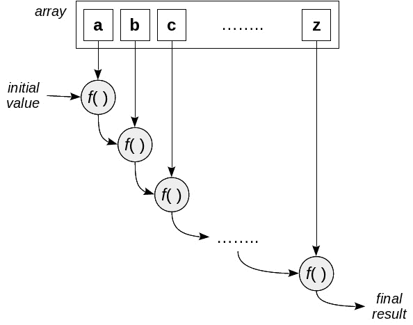
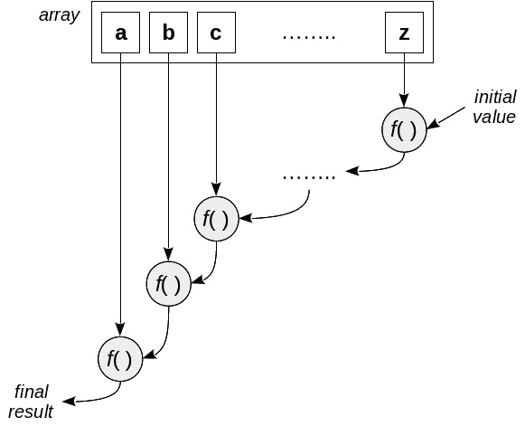
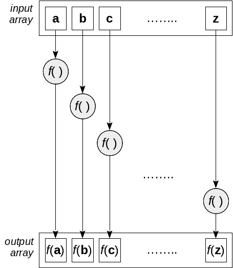
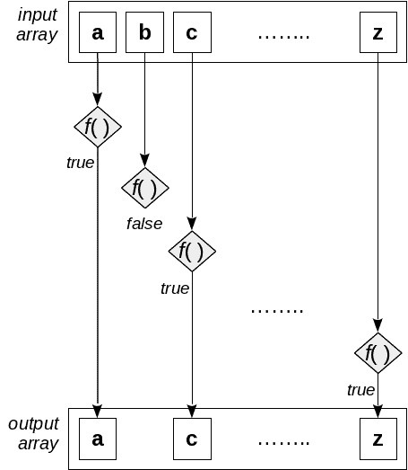
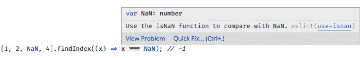
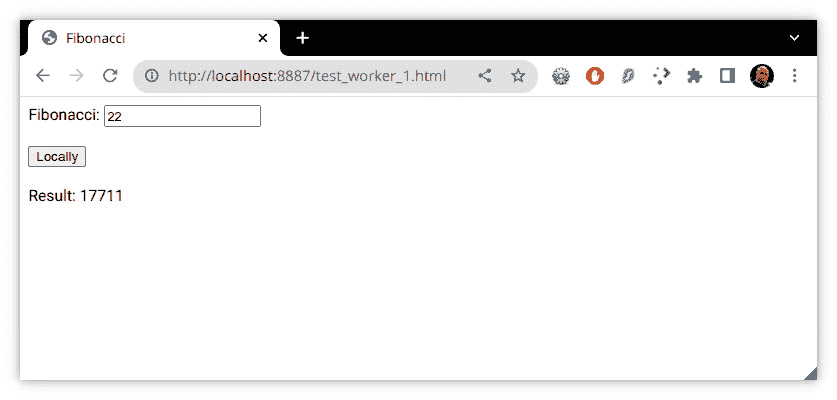
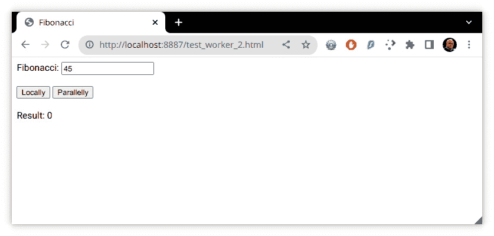
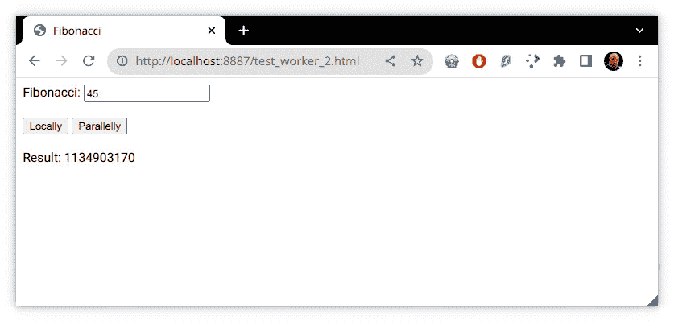

# 声明式编程 – 更好的风格

到目前为止，我们还没有真正能够欣赏到**函数式编程**（**FP**）在以高级、声明式方式工作时的可能性。在本章中，我们将纠正这一点，并通过使用一些**高阶函数**（**HOFs**）——即接受函数作为参数的函数，例如以下内容——来生成更短、更简洁、更易于理解的代码：

+   `reduce()` 和 `reduceRight()` 将操作应用于整个数组，将其缩减为单个结果

+   `map()` 通过对每个元素应用函数将一个数组转换成另一个数组

+   `flat()` 将数组中的数组转换成一个单一的数组

+   `flatMap()` 将映射和扁平化混合在一起

+   `forEach()` 通过抽象必要的循环代码来简化循环的编写

我们还将能够使用以下方法进行搜索和选择：

+   `filter()` 从数组中挑选一些元素

+   `find()` 和 `findIndex()` 用于搜索满足条件的元素

+   一对断言函数，`every()` 和 `some()`，用于检查数组中的布尔测试

使用这些函数将使你能够以更声明式的方式工作，你会发现你的焦点将转移到你需要做什么，而不是那么关注它是如何完成的；脏细节都隐藏在我们的函数内部。我们不会编写一系列可能嵌套的循环，而是将重点放在使用函数作为构建块来指定我们期望的结果。

我们将使用这些函数以声明式方式处理事件，正如我们将在*第十一章*中看到的，*实现设计模式*，当我们使用**观察者模式**时。我们还将能够以*流畅*的方式工作，其中函数的输出成为下一个函数的输入，这种风格我们将在稍后探讨。

# 转换

我们将要考虑的第一组操作是在数组上进行的，它基于一个函数来处理并产生某些结果。有几种可能的结果：使用 `reduce()` 操作的单个值，使用 `map()` 的新数组，或者使用 `forEach()` 的几乎所有类型的结果。

关注效率

如果你四处搜索，你将找到一些文章宣称这些函数效率低下，因为手动编写的循环可能更快。虽然这可能正确，但实际上并不重要。除非你的代码真的存在速度问题，并且你可以确定这种缓慢是由于使用这些 HOFs 而导致的，否则试图通过更长的代码来避免它们，这样做更有可能引入错误，这并没有太多意义。

让我们从考虑前面列出的函数列表开始，从最一般的一个开始，正如我们将看到的，它甚至可以用来模拟本章中其余的转换！

## 将数组缩减为值

回答这个问题：你有多少次需要遍历一个数组，执行一个操作（比如求和）来得到一个单一的结果（可能是所有数组值的总和）？可能很多很多次。这种操作通常可以通过应用 `reduce()` 和 `reduceRight()` 函数以函数式的方式实现。让我们从前者开始！

要折叠还是不折叠

是时候引入一些术语了！在通常的函数式编程（FP）用语中，我们说 `reduce()`，相应地，`reduceRight()` 被称为 **foldr**。在范畴论术语中，这两个操作都是 **猫形态学**：将容器中所有值缩减为一个单一结果。

`reduce()` 函数的内部工作原理在 *图 5**.1* 中展示：



图 5.1 – reduce() 操作的工作原理

看看 `reduce()` 如何遍历数组，将一个累加函数应用于每个元素和累积值。

为什么你应该总是尝试使用 `reduce()` 或 `reduceRight()` 而不是手写的循环？以下要点可能回答了这个问题：

+   循环控制的各个方面都自动处理，因此你甚至没有出现一个错误的可能性

+   初始化和处理结果值也是隐式完成的

+   除非你非常努力地使代码不纯并修改原始数组，否则你的代码将没有副作用

现在我们能够使用 `reduce()` 来处理数组，让我们看看它的实际应用案例。

### 求和数组

`reduce()` 的最常见应用示例，通常在所有教科书中和所有网页上都可以看到，就是计算数组中所有元素的总和。所以，为了保持传统，让我们从精确的这个例子开始！

要缩减一个数组，你必须提供一个 **二元** 函数（具有两个参数的函数；“二进制”是这个的另一个名称）和一个初始值。在我们的例子中，这个函数将累加其两个参数。最初，这个函数将应用于提供的初始值和数组的第一个元素。对我们来说，要提供的初始值是零，第一个结果将是数组的第一个元素本身。然后，这个函数将再次应用，这次是应用于前一个操作的结果和数组的第二个元素，因此第二个结果将是数组前两个元素的和。以这种方式沿着整个数组进行，最终结果将是所有元素的总和：

```js
// sum.ts
const myArray = [22, 9, 60, 12, 4, 56];
const sum = (x: number, y: number): number => x + y;
const mySum = myArray.reduce(sum, 0); // 163
```

你实际上不需要求和的定义——你只需写下 `myArray.reduce((x,y) => x+y, 0)` 即可——然而，当以这种方式编写时，代码的含义更清晰：你想要通过 `sum`-ming 所有元素来将数组缩减为一个单一值。（我们会忘记数据类型吗？不会的；TypeScript 可以自己推断所有隐含的类型。）

你不必编写循环，初始化一个变量来保存计算结果，然后遍历数组进行求和，你只需声明应该执行的操作。这就是我说使用我们将在本章中看到的函数进行编程时，允许你更声明性地工作，专注于“是什么”而不是“如何”的意思。

你甚至可以在不提供初始值的情况下使用 `reduce()`：如果你跳过了它，数组的第一项将被使用，内部循环将从数组的第二项开始；然而，如果你跳过了提供初始值，并且数组为空，那么你将得到一个运行时错误！有关更多详细信息，请参阅 [developer.mozilla.org/en-US/docs/Web/JavaScript/Reference/Global_Objects/Array/Reduce](http://developer.mozilla.org/en-US/docs/Web/JavaScript/Reference/Global_Objects/Array/Reduce)。

我们可以通过加入一点杂质来改变减少函数，以查看它是如何进行计算的。

```js
// continued...
const sumAndLog = (x: number, y: number): number => {
  console.log(`${x}+${y}=${x + y}`);
  return x + y;
};
myArray.reduce(sumAndLog, 0);
```

输出将如下所示：

```js
0+22=22
22+9=31
31+60=91
91+12=103
103+4=107
107+56=163
```

你可以看到第一个求和是通过将初始值（`0`）和数组的第一个元素相加来完成的，然后这个结果被用于第二个加法，依此类推。

名称中有什么？

之前看到的 *foldl* 名称的部分原因（至少，它的结尾，*l*）现在应该很清楚了：减少操作是从左到右进行的，从第一个元素到最后一个元素。然而，你可能想知道，如果它是由从右到左的语言（如阿拉伯语、希伯来语、波斯语或乌尔都语）的说话者定义的，它会被如何命名！

这个例子很常见，也很知名；让我们来做点更复杂的事情。正如我们将发现的，`reduce()` 将对许多不同的目标非常有用！

### 计算平均值

让我们再做一些工作。你如何计算一列数字的平均值？如果你在向某人解释这个，你的答案肯定会是类似于 *将列表中的所有元素相加，然后除以元素的数量* 这样的话。在编程术语中，这并不是一个过程性描述（你不会解释如何累加元素或遍历数组），而是一个声明性描述，因为你只是说明了要做什么，而不是如何做。

我们可以将计算描述转换为几乎无需解释的函数（在下一章的 *数组求平均值* 部分，我们将扩展数组以包括基于此代码的平均值方法）：

```js
// average.ts
const myArray = [22, 9, 60, 12, 4, 56];
const sum = (x: number, y: number): number => x + y;
const average = (arr: number[]): number =>
  arr.reduce(sum, 0) / arr.length;
console.log(average(myArray)); // 27.166667
```

`average()` 的定义遵循口头解释：从 0 开始累加数组的元素，然后除以数组的长度——更简单地说：不可能！

不太安全的减少

正如我们在上一节中提到的，你也可以不指定累减的初始值（`0`）来编写`arr.reduce(sum)`；这甚至更短，更接近所需计算的口头描述。然而，这不太安全，因为如果数组为空，它将失败（产生运行时错误）。因此，最好始终提供起始值。

然而，这并不是计算平均值的唯一方法。累减函数还传递了数组的当前位置索引以及数组本身，因此你可以做与上次不同的事情：

```js
// continued...
const sumOrDivide = (
  sum: number,
  val: number,
  ind: number,
  arr: number[]
) => {
  sum += val;
  return ind == arr.length - 1 ? sum / arr.length : sum;
};
const average2 = (arr: number[]): number =>
  arr.reduce(sumOrDivide, 0);
console.log(myArray.reduce(average2, 0)); // 27.166667
```

给定当前索引（以及显然，访问数组的长度），我们可以做一些小把戏：在这种情况下，我们的累减`sumOrDivide()`函数始终求和值，但在数组的末尾，它抛入一个除法，以便返回数组的平均值。这很酷，但从可读性的角度来看，我们可以同意我们最初看到的第一个版本更具有声明性，更接近数学定义，而不是这个第二个版本。

不纯性警告！

获取数组和索引意味着你也可以将函数转换为不纯的函数。避免这样做！任何看到`reduce()`调用的人都会自动假设它是一个纯函数，并且在使用它时肯定会引入错误。

这个例子和上一个例子需要计算单个结果，但有可能超越这一点，在单次遍历中计算多个值。让我们看看如何。

### 同时计算多个值

如果你需要计算两个或多个结果而不是单个值，这似乎是标准循环提供明确优势的情况，但你有一个可以使用的技巧。让我们再次回顾平均值的计算。我们可以通过循环和同时求和和计数所有数字来以传统方式完成它。嗯，`reduce()`只允许你产生一个结果，但你没有理由不能返回一个具有所需字段数量的对象，就像我们在*第四章**，*“不纯函数”*部分中做的那样：

```js
// continued...
const average3 = (arr: number[]): number => {
  const sc = arr.reduce(
    (ac, val) => ({
      sum: val + ac.sum,
      count: ac.count + 1,
    }),
    { sum: 0, count: 0 }
  );
  return sc.sum / sc.count;
};
console.log(average3(myArray)); // 27.166667
```

仔细审查代码。我们需要两个变量：一个用于总和，一个用于所有数字的计数。我们提供一个对象作为累加器的初始值，其中两个属性设置为`0`，我们的累减函数更新这两个属性。在获得`sum`和`count`的最终结果后，我们进行除法以得到所需的平均值。

顺便说一句，除了使用对象之外，还有其他选择。你也可以产生任何其他数据结构；让我们通过一个元组的例子来看看。这种相似性非常明显：

```js
// continued...
const average4 = (arr: number[]) => {
  const sc = arr.reduce(
    (ac, val) => [ac[0] + val, ac[1] + 1],
    [0, 0]
  );
  return sc[0] / sc[1];
};
console.log(average4(myArray)); // 27.166667
```

坦白说，我认为这比使用对象的方法更难以理解！请将此视为一种（并不特别推荐）同时计算多个值的方法！

我们现在已经看到了 `reduce()` 的几个使用示例，现在是时候来认识它的一个变体，`reduceRight()`，它的工作方式类似。

### 左右折叠

相补的 `reduceRight()` 方法与 `reduce()` 方法的工作方式相同，只是从数组的末尾开始，循环到数组的开头。（更多关于 `reduceRight()` 的信息请参阅 [developer.mozilla.org/en-US/docs/Web/JavaScript/Reference/Global_Objects/Array/ReduceRight](http://developer.mozilla.org/en-US/docs/Web/JavaScript/Reference/Global_Objects/Array/ReduceRight)。）对于许多操作（例如我们之前看到的平均值计算），这并没有区别，但在某些情况下会有所不同。请参阅 *图 5**.2*。

我们将在 *第八章* 的 *连接函数* 中看到一个明显的例子；这里让我们用一个更简单的例子来探讨：



图 5.2 – reduceRight() 操作与 reduce() 操作相同，但顺序相反

假设我们想要实现一个反转字符串的函数。（显然，我们也不知道 JavaScript 已经提供了 `reverse()` 方法！）一个解决方案可能是通过使用 `split()` 将字符串转换为数组，然后反转这个数组，最后使用 `join()` 使其再次成为整体：

```js
// reverse.ts
const reverseString = (str: string): string => {
  const arr = str.split("");
  arr.reverse();
  return arr.join("");
};
console.log(reverseString("MONTEVIDEO"));  // OEDIVETNOM
```

这个解决方案是可行的（是的，它可以缩短，但这不是重点），但让我们用另一种方式来做，只是为了实验 `reduceRight()`：

```js
// continued...
const reverseString2 = (str: string): string =>
  str.split("").reduceRight((x, y) => x + y, "");
console.log(reverseString2("OEDIVETNOM")); // MONTEVIDEO
```

注意，我们不需要为减少函数指定数据类型；就像本章前面提到的那样，TypeScript 能够自行推断它们。此外，如果你喜欢重用代码，看看 *问题 5.2*！

从前面的例子中，你还可以得到一个想法：如果你首先对一个数组应用 `reverse()`，然后使用 `reduce()`，效果将等同于直接对原始数组应用 `reduceRight()`。唯一需要注意的是：`reverse()` 会改变给定的数组，所以如果你反转原始数组，你将会造成一个意外的副作用！唯一的解决办法是首先生成数组的副本，然后再进行其他操作。这太麻烦了，所以最好使用 `reduceRight()`！

然而，我们还可以得出另一个结论，展示一个我们之前预测的结果：虽然比较繁琐，但使用 `reduce()` 可以模拟出与 `reduceRight()` 相同的结果——在后面的章节中，我们也会用它来模拟本章中的其他函数。现在让我们继续探讨另一个常见且强大的操作：**映射**。

## 应用操作 – map()

在计算机编程中，处理元素列表并对每个元素应用某种操作是一种相当常见的模式。编写系统性地遍历数组或集合中所有元素的循环，从第一个开始循环，直到最后一个结束，并对每个元素执行某种操作是一种基本的编码练习，通常在所有编程课程的第一天就会学到。我们已经在上一节中看到了这种类型的一种操作，即 `reduce()` 和 `reduceRight()`；现在让我们转向一个新的操作，称为 `map()`。

在数学中，`map()` 函数将输入数组转换为输出数组。

名字，名字，名字……

一些更多的术语：我们会说数组是一个 **函子**，因为它提供了一种具有一些预定义属性的映射操作，我们将在后面看到。在范畴论中，我们将在 *第十二章* *构建更好的容器* 中简要讨论，映射操作本身被称为 **态射**。

`map()` 操作的内部工作原理可以在 *图 5**.3* 中看到：



图 5.3 – map() 操作通过应用映射函数转换输入数组的每个元素

可用更多地图

jQuery 库提供了一个函数，`$.map(array, callback)`，它与 `map()` 方法类似。但请注意，它们之间有一些重要的区别。jQuery 函数处理数组的未定义值，而 `map()` 则跳过它们。此外，如果应用函数的结果是一个数组，jQuery 会将其扁平化并分别添加其各个元素，而 `map()` 只会将这些数组包含在结果中。Underscore 和 Ramda 也提供了类似的功能。最后，JavaScript 本身也提供了一种执行 `map()` 的替代方法：查看 [developer.mozilla.org/en-US/docs/Web/JavaScript/Reference/Global_Objects/Array/from](http://developer.mozilla.org/en-US/docs/Web/JavaScript/Reference/Global_Objects/Array/from) 中的 `Array.from()` 方法，并特别注意其第二个参数！

使用 `map()` 而不是直接使用循环的优势是什么？

+   第一，你不需要编写任何循环，这样就少了一个可能的错误来源

+   第二，你甚至不需要访问原始数组或索引位置，尽管它们都在那里供你使用，如果你真的需要的话

+   最后，会生成一个新的数组，所以你的代码是纯的（尽管，当然，如果你真的想产生副作用，你也可以！）

在这样做时只有两个注意事项：

+   在映射函数中始终返回一些内容。如果你忘记了这一点，那么你将只会产生一个填充了 `undefined` 值的数组，因为 JavaScript 总是为所有函数提供一个默认的 `return undefined`。

+   如果输入数组的元素是对象或数组，并且你将它们包含在输出数组中，那么 JavaScript 仍然允许访问原始元素。

此外，还有一个限制。在 JavaScript 中，`map()` 主要只适用于数组（你可以在 [developer.mozilla.org/en-US/docs/Web/JavaScript/Reference/Global_Objects/Array/map](http://developer.mozilla.org/en-US/docs/Web/JavaScript/Reference/Global_Objects/Array/map) 了解更多）；然而，在 *第十二章* 的 *扩展当前数据类型* 部分，*构建更好的容器* 中，我们将学习如何使其对其他基本类型也有效，例如数字、布尔值、字符串，甚至是函数。此外，像 Lodash、Underscore 和 Ramda 这样的库也提供了类似的功能。

正如我们之前使用 `reduce()` 一样，现在让我们看看 `map()` 在常见过程中的使用示例，以便你更好地欣赏其强大和便捷之处。

### 从对象中提取数据

让我们从简单的例子开始。假设我们有一些与一些南美国家和它们首都的坐标（纬度和经度）相关的地理数据（如下面的片段所示）。假设我们想计算这些城市的平均位置。（不，我不知道我们为什么要这样做。）我们该如何着手呢？

```js
// average.ts
const markers = [
  { name: "AR", lat: -34.6, lon: -58.4 },
  { name: "BO", lat: -16.5, lon: -68.1 },
  { name: "BR", lat: -15.8, lon: -47.9 },
  { name: "CL", lat: -33.4, lon: -70.7 },
  { name: "CO", lat:   4.6, lon: -74.0 },
  { name: "EC", lat:  -0.3, lon: -78.6 },
  { name: "PE", lat: -12.0, lon: -77.0 },
  { name: "PY", lat: -25.2, lon: -57.5 },
  { name: "UY", lat: -34.9, lon: -56.2 },
  { name: "VE", lat:  10.5, lon: -66.9 },
];
```

很多负面情绪？

如果你想知道所有数据是否都是负数，如果是的话，原因是什么，那是因为这里显示的国家都位于赤道以南和格林威治子午线以西。然而，一些南美国家，如哥伦比亚和委内瑞拉，具有正纬度。当我们学习 `some()` 和 `every()` 方法时，我们稍后会回到这些数据。

我们希望使用我们的 `average()` 函数（我们在本章早期开发了这个函数），但有一个问题：该函数只能应用于 *数字* 数组，而我们这里有一个 *对象* 数组。然而，我们可以玩一个花招：我们可以专注于计算平均纬度（我们可以在类似的方式中稍后处理经度）。我们可以将数组的每个元素映射到其纬度，然后我们将有 `average()` 函数的适当输入。解决方案可能如下所示：

```js
// continued...
const averageLat = average(markers.map((x) => x.lat));
const averageLon = average(markers.map((x) => x.lon));
console.log(averageLat, averageLon); // -15.76, -65.53
```

将数组映射以提取数据非常强大，但你必须小心。现在让我们看看一个看似正确但产生错误结果的情况！

### 隐式解析数字

使用 `map()` 通常比手动循环更安全、更简单，但一些边缘情况可能会让你陷入困境。比如说，你收到了一个表示数值的字符串数组，并想将它们解析成实际的数字。你能解释以下结果吗？

```js
["123.45", "67.8", "90"].map(parseFloat);
// [123.45, 67.8, 90]
["123.45", "-67.8", "90"].map(parseInt);
// [123, NaN, NaN]
```

让我们分析一下结果。当我们使用 `parseFloat()` 获取浮点数结果时，一切正常；然而，当我们想用 `parseInt()` 将结果截断为整数时，输出真的非常糟糕，出现了奇怪的 `NaN` 值。发生了什么？

答案在于一个隐式编程的问题。（我们已经在*第三章*的*不必要的错误*部分看到了一些隐式编程的用法，以及*第八章*的*连接函数*中我们将看到更多，但我们现在来看看以下代码，它将引导我们找到解决方案：）

```js
["123.45", "-67.8", "90"].map((x) => parseFloat(x));
// [123.45, -67.8, 90]
["123.45", "-67.8", "90"].map((x) => parseInt(x));
// [123, -67, 90]
```

`parseInt()`出现意外行为的原因是，此函数还可以接收第二个参数——即转换字符串为数字时要使用的基数。例如，调用`parseInt("100010100001", 2)`将把二进制数`100010100001`转换为十进制。

注意：

你可以在[developer.mozilla.org/en/docs/Web/JavaScript/Reference/Global_Objects/parseInt](http://developer.mozilla.org/en/docs/Web/JavaScript/Reference/Global_Objects/parseInt)上了解更多关于`parseInt()`的信息，其中详细解释了基数参数。你应该始终提供它，因为某些浏览器可能会将带前导零的字符串解释为八进制，这又将产生不希望的结果。

那么，当我们向`map()`提供`parseInt()`时会发生什么？记住，`map()`会使用三个参数调用你的映射函数：数组元素的值、它的索引和数组本身。当`parseInt`接收到这些值时，它会忽略数组，并假设提供的索引实际上是基数，由于原始字符串在给定的基数中不是有效的数字，因此会产生`NaN`值。

好的，一些函数在映射时可能会误导你，现在你知道该寻找什么了。让我们通过使用范围来编写通常需要手动循环的代码，继续提升我们的工作方式。

### 与范围一起工作

让我们现在转向一个辅助函数，它将在许多用途中很有用。我们想要一个`range(start,stop)`函数，它生成一个数字数组，其值从`start`（包含）到`stop`（不包含）：

```js
// range.ts
const range = (start: number, stop: number): number[] =>
  new Array(stop - start).fill(0).map((v, i) => start + i);
range(2, 7); // [2, 3, 4, 5, 6]
```

为什么使用`fill(0)`？在`map()`中，未定义的数组元素会被跳过，因此我们需要用某些东西填充它们，否则我们的代码将没有效果。

扩展你的范围

像 Underscore 和 Lodash 这样的库提供了我们`range()`函数的一个更强大的版本，允许我们以升序或降序进行，还可以指定要使用的步长——例如`_.range(0, -8, -2)`，它产生`[0, -2, -4, -6]`——但就我们的需求而言，我们编写的版本已经足够了。请参阅本章末尾的*问题*部分。

我们如何使用它？在接下来的部分，我们将看到使用`forEach()`进行受控循环的一些用法，但我们可以通过应用`range()`然后`reduce()`来重新实现我们的阶乘函数。这个想法是生成从 1 到`n`的所有数字，然后将它们相乘：

```js
// continued...
const factorialByRange = (n: number): number =>
  range(1, n + 1).reduce((x, y) => x * y, 1);
```

检查边界情况很重要，但该函数对零也有效；你能看出为什么吗？原因在于生成的范围是空的：调用是 `range(1,1)`，它返回一个空数组。然后，`reduce()` 不进行任何计算，并返回初始值（`1`），这是正确的。

在 *第七章*，*变换函数* 中，我们将有机会使用 `range()` 生成源代码；查看 *使用 eval() 进行柯里化* 和 *使用 eval() 进行部分应用* 部分。

你可以使用这些数字范围来生成其他类型的范围。例如，如果你需要一个包含字母表的数组，你当然可以（但很繁琐）写出 `["A", "B", "C"`... up to ...`"X", "Y", "Z"]`。一个更简单的解决方案是使用字母表的 ASCII 码生成范围，并将这些映射到字母：

```js
// continued...
const ALPHABET = range(
  "A".charCodeAt(0),
  "Z".charCodeAt(0) + 1
).map((x) => String.fromCharCode(x));
// ["A", "B", "C", ... "X", "Y", "Z"]
```

注意使用 `charCodeAt()` 获取字母的 ASCII 码，以及使用 `String.fromCharCode(x)` 将 ASCII 码转换为字符。

映射非常重要且经常使用，所以现在让我们分析你如何自己实现它，这可能会帮助你为更复杂的情况编写代码。

### 使用 reduce() 模拟 map()

在本章的早期，我们看到了如何使用 `reduce()` 实现 `reduceRight()`。现在，让我们看看 `reduce()` 如何也用于提供 `map()` 的 polyfill（虽然现在浏览器提供了这两种方法，但这将给你更多关于你可以用这些工具实现什么的想法）。

我们自己的 `myMap()` 是一行代码，但可能难以理解。我们将函数应用于数组的每个元素，并使用 `concat()` 将结果追加到结果数组（最初为空）。当循环完成对输入数组的处理时，结果数组将包含所需的输出值。在讨论数据类型之前，我们先看看一个普通的 JavaScript 版本：

```js
// map.js
const myMap = (arr, fn) =>
  arr.reduce((x, y) => x.concat(fn(y)), []);
```

我们将映射函数应用于每个数组元素，一个接一个，并将结果连接到累积的输出数组。

让我们用一个数组和一个简单的函数来测试这个。我们将使用原始的 `map()` 方法以及 `myMap()`，结果应该匹配！我们的映射函数将返回其输入的两倍：

```js
// continued...
const dup = (x: number): number => 2 * x;
console.log(myMap(myArray, dup));
console.log(myArray.map(dup));
// [44, 18, 120, 24, 8, 112] both times
```

第一条日志显示了由 `map()` 产生的预期结果。第二条输出给出了相同的结果，所以看起来 `myMap()` 是有效的！最后的输出只是检查原始输入数组没有被任何方式修改；映射操作应该始终产生一个新的数组。参见 *问题 5.3* 以更彻底地测试我们的 `myMap()` 函数。

让我们回顾一下 `myMap()` 函数并添加类型注解。所需的数据类型更复杂，我们将有一个通用函数：

```js
// map.ts
const myMap = <T, R>(arr: T[], fn: (x: T) => R): R[] =>
  arr.reduce(
    (x: R[], y: T): R[] => x.concat(fn(y)),
    [] as R[]
  );
```

我们的 `myMap()` 函数接收一个类型为 `T` 的元素数组和一个 `fn()` 映射函数，该函数将它的 `T` 参数转换为一个 `R` 类型的结果。映射的结果是一个 `R` 类型的元素数组。你自己检查累加函数；它的类型是否可理解？

让我们尝试一个不同的映射函数来验证我们的类型是否正确。我们将使用一个返回字符串而不是数字的函数——它只是在输入前后添加破折号，以生成一个字符串。

```js
// continued...
const addDashes = (x: number): string => `-${x}-`;
const myDashes = myArray.map(addDashes);
// [ '-22-', '-9-', '-60-', '-12-', '-4-', '-56-' ]
```

好吧，看起来我们的复杂类型定义是正确的！

本章的所有先前列表示例都集中在简单的数组上。但如果事情变得更复杂，比如说，你必须处理一个其元素本身也是数组的数组，会怎样？幸运的是，有一个解决办法。让我们继续前进。

## 处理数组的数组

到目前为止，我们已将一个包含（单个）值的数组作为输入进行处理，但如果你输入的是一个数组的数组会怎样？如果你认为这是一个牵强附会的案例，有许多可能的场景可以应用这种情况：

+   对于某些应用，你可能有一个距离表，在 JavaScript 中需要数组的数组：`distance[i][j]` 将是 `i` 和 `j` 之间的距离。你如何找到任意两点之间的最大距离？使用普通数组找到最大值很简单，但如何处理数组的数组？

+   一个更复杂的例子，同样在地理方面，是你可能查询一个地理 API 以获取与字符串匹配的城市，响应可能是一个包含国家的数组，每个国家都有一个包含州的数组，每个州本身都有一个包含匹配城市的数组：一个数组的数组数组！

在第一种情况下，你可能想要一个包含所有距离的单个数组，而在第二种情况下，一个包含所有城市的数组；你将如何管理这种情况？需要一个新操作，**扁平化**；让我们看看。

### 扁平化一个数组

在 ES2019 中，JavaScript 添加了两个操作：`flat()`，我们现在将探讨它，以及 `flatMap()`，我们稍后将会探讨。展示它们的作用比解释它们更容易——请耐心等待！

不允许使用 flat()？

如常发生的那样，并非所有浏览器都已更新以包含这些新方法，微软的 Internet Explorer 和其他浏览器在这方面存在缺陷，因此对于网络编程，将需要 polyfill。通常，为了获取更新的兼容性数据，请查看 *Can I use?* 网站，在本例中，请访问 [caniuse.com/#feat=array-flat](http://caniuse.com/#feat=array-flat)。一个好消息：自 2018 年 9 月以来，所有主要浏览器都原生支持此功能！

`flat()` 方法创建一个新的数组，将子数组的所有元素连接到所需的级别，默认为 `1`：

```js
const a = [[1, 2], [3, 4, [5, 6, 7]], 8, [[[9]]]];
console.log(a.flat()); // or a.flat(1)
[ 1, 2, 3, 4, [ 5, 6, 7 ], 8, [ [ 9 ] ] ]
console.log(a.flat(2));
[ 1, 2, 3, 4, 5, 6, 7, 8, [ 9 ]]
console.log(a.flat(Infinity));
[ 1, 2, 3, 4, 5, 6, 7, 8, 9 ]
```

那么，我们如何使用这个函数来解决我们的问题呢？使用 `flat()`、展开和 `Math.max()` 回答了第一个问题（正如我们在 *第一章**，成为函数式开发者* 的 *展开* 部分中看到的，我们当时可以使用我们写的 `maxArray()` 函数），我们还可以使用 `reduce()` 来增加多样性。假设我们有一个距离表：

```js
const distances = [
  [0, 20, 35, 40],
  [20, 0, 10, 50],
  [35, 10, 0, 30],
  [40, 50, 30, 0],
];
```

然后，我们可以通过几种方式找到我们的最大距离：我们或者扁平化数组，展开它，并使用 `Math.max()`，或者扁平化数组并使用归约来显式地找到最大值：

```js
// flat.js
const maxDist1 = Math.max(...distances.flat()); // 50
const maxDist2 = distances
  .flat()
  .reduce((p, d) => Math.max(p, d), 0); // also 50
```

让我们回到第二个问题。假设我们查询了一个地理 API，以获取名字中包含 `"LINCOLN"`（大小写不敏感）的城市，并得到了以下答案：

```js
// continued...
const apiAnswer = [
  {
    country: "AR",
    name: "Argentine",
    states: [
      {
        state: "1",
        name: "Buenos Aires",
        cities: [{city: 3846864, name: "Lincoln"}],
      },
    ],
  },
  {
    country: "GB",
    name: "Great Britain",
    states: [
      {
        state: "ENG",
        name: "England",
        cities: [{city: 2644487, name: "Lincoln"}],
      },
    ],
  },
  {
    country: "US",
    name: "United States of America",
    states: [
      {
        state: "CA",
        name: "California",
        cities: [{city: 5072006, name: "Lincoln"}],
      },
      .
      .
      .
      {
        state: "IL",
        name: "Illinois",
        cities: [
          {city: 4899911, name: "Lincoln Park"},
          {city: 4899966, name: "Lincoln Square"},
        ],
      },
    ],
  },
];
```

通过应用 `map()` 和 `flat()` 两次，我们可以提取城市列表：

```js
// continued...
console.log(
  apiAnswer
    .map(x => x.states)
    .flat()
    .map(y => y.cities)
    .flat()
);
/* Results:
[ { city: 3846864, name: 'Lincoln' },
  { city: 2644487, name: 'Lincoln' },
  { city: 5072006, name: 'Lincoln' },
  { city: 8531960, name: 'Lincoln' },
  { city: 4769608, name: 'Lincolnia' },
  { city: 4999311, name: 'Lincoln Park' },
  { city: 5072006, name: 'Lincoln' },
  { city: 4899911, name: 'Lincoln Park' },
  { city: 4899966, name: 'Lincoln Square' }
]
*/
```

我们已经看到了如何使用 `flat()` 来扁平化一个数组；现在让我们看看如何使用 `flatMap()`，这是 `flat()` 和 `map()` 的有趣混合，来进一步简化我们的编码，甚至进一步缩短我们前面的第二个解决方案！（如果你认为这个练习还不够难，其输出有点无聊，可以尝试 *问题 5.10* 以获得更具挑战性的版本！）

### 映射和扁平化 – `flatMap()`

基本上，`flatMap()` 函数所做的是首先应用一个 `map()` 函数，然后将映射操作的结果应用 `flat()` 函数。这是一个有趣的组合，因为它允许你生成一个具有不同元素数量的新数组。（使用正常的 `map()` 操作，输出数组将与输入数组长度完全相同）。如果你的映射操作生成一个包含两个或更多元素的数组，那么输出数组将包含许多输出值；如果你生成一个空数组，输出数组将包含较少的值。

让我们来看一个（某种意义上说不通）的例子。假设我们有一个名字列表，例如 `"Winston Spencer Churchill"`、`"Abraham Lincoln"` 和 `"Socrates"`。我们的规则是，如果一个名字包含多个单词，排除第一个（我们假设是名字，即姓氏），然后将剩下的（我们假设是姓氏）分开，但如果一个名字是一个单词，则将其删除（我们假设这个人没有姓氏）：

```js
// continued...
const names = [
  "Winston Spencer Churchill",
  "Plato",
  "Abraham Lincoln",
  "Socrates",
  "Charles Darwin",
];
const lastNames = names.flatMap((x) => {
  const s = x.split(" ");
  return s.length === 1 ? [] : s.splice(1);
});
// [ 'Spencer', 'Churchill', 'Lincoln', 'Darwin' ]
```

如我们所见，输出数组与输入数组的元素数量不同：仅仅因为这个原因，我们可以考虑 `flatMap()` 是 `map()` 的升级版，甚至包括一些 `filter()` 的方面，比如当我们排除单个名字时。

现在我们来看一个简单的例子。继续上节中林肯主题，让我们计算林肯的葛底斯堡演讲中包含多少个单词，这些单词以句子数组的形式给出。顺便说一句，这个演讲通常被认为有 272 个单词长，但我找到的版本并没有产生这个数字！这可能是因为有五个林肯亲笔撰写的演讲稿副本，加上另一个从事件中的速记笔记转录的版本。无论如何，我将把这个差异留给历史学家，并专注于编码！

我们可以使用 `flatMap()` 将每个句子拆分成一个单词数组，然后查看展平后的数组长度：

```js
const gettysburg = [
  "Four score and seven years ago our fathers",
  "brought forth, on this continent, a new nation,",
  "conceived in liberty, and dedicated to the",
  "proposition that all men are created equal.",
  "Now we are engaged in a great civil war,",
  "testing whether that nation, or any nation",
  "so conceived and so dedicated, can long endure.",
  "We are met on a great battle field of that",
  "war. We have come to dedicate a portion of",
  "that field, as a final resting place for",
  "those who here gave their lives, that that",
  "nation might live. It is altogether",
  "fitting and proper that we should do this.",
  "But, in a larger sense, we cannot dedicate,",
  "we cannot consecrate, we cannot hallow,",
  "this ground.",
  "The brave men, living and dead, who",
  "struggled here, have consecrated it far",
  "above our poor power to add or detract.",
  "The world will little note nor long",
  "remember what we say here, but it can",
  "never forget what they did here.",
  "It is for us the living, rather, to be",
  "dedicated here to the unfinished work",
  "which they who fought here have thus far",
  "so nobly advanced.",
  "It is rather for us to be here dedicated",
  "to the great task remaining before us—",
  "that from these honored dead we take",
  "increased devotion to that cause for",
  "which they here gave the last full",
  "measure of devotion— that we here highly",
  "resolve that these dead shall not have",
  "died in vain— that this nation, under",
  "God, shall have a new birth of freedom-",
  "and that government of the people, by",
  "the people, for the people, shall not",
  "perish from the earth.",
];
console.log(
  gettysburg.flatMap((s: string) => s.split(" ")).length
);
// 270 ...not 272?
```

让我们回到城市的问题。如果我们注意到每个 `map()` 后面都跟着 `flat()`，一个替代方案就立即显现出来。将这个解决方案与我们之前在 *Flattening an array* 部分中写的方案进行比较；它们基本上是相同的，但是将每个 `map()` 与其后面的 `flat()` 合并：

```js
// continued...
console.log(
  apiAnswer
    .flatMap((x) => x.states)
    .flatMap((y) => y.cities)
);
// same result as with separate map() and flat() calls
```

我们现在已经看到了新的操作。（是的，没有映射也可以解决本节中的问题，但这不会是本节的良好示例！有关单词计数问题的替代方案，请参阅 *问题 5.11*。）现在让我们学习如何模拟这些操作，以防你无法立即获得它们。

### 模拟 flat() 和 flatMap()

我们已经看到了如何使用 `reduce()` 来模拟 `map()`。现在让我们看看如何为 `flat()` 和 `flatMap()` 找到等效的方法，以获得更多的实践。我们还将加入一个递归版本，这是一个我们将在 *第九章* *设计函数* 中再次讨论的主题。正如之前提到的，我们并不是在追求最快、最小或任何特定的代码版本；相反，我们想要专注于使用这本书中我们一直在探讨的概念。

完全展平一个数组可以通过递归调用来完成。我们使用 `reduce()` 逐个处理数组元素，如果一个元素恰好是一个数组，我们就递归地展平它：

```js
// continued...
const flatAll = <T>(arr: T[]): T[] =>
  arr.reduce(
    (f: T[], v: T) =>
      f.concat(Array.isArray(v) ? flatAll(v) : v),
    [] as T[]
  );
```

如果你能先展平一个数组的单个级别，那么将数组展平到给定级别（不是无限；让我们留到以后再说）就很容易了。我们可以通过展开或使用 `reduce()` 来做到这一点。让我们编写一个 `flatOne()` 函数，它只展平数组的单个级别。这里有这个函数的两个版本；选择你喜欢的任何一个：

```js
// continued...
const flatOne1 = <T>(arr: T[]): T[] =>
  ([] as T[]).concat(...arr);
const flatOne2 = <T>(arr: T[]): T[] =>
  arr.reduce((f, v) => f.concat(v), [] as T[]);
```

使用这两个函数中的任何一个，我们都可以将多层数组展平，并且我们可以以两种不同的方式做到这一点。我们两个版本的 `flat()` 函数使用了我们之前的 `flatOne()` 和 `flatAll()` 函数，但第一个只使用标准循环，而第二个则以完全递归的方式工作。你更喜欢哪一个？

```js
// continued...
const flat1 = <T>(arr: T[], n = 1): T[] => {
  if (n === Infinity) {
    return flatAll(arr);
  } else {
    let result = arr;
    range(0, n).forEach(() => {
      result = flatOne(result);
    });
    return result;
  }
};
const flat2 =  <T>(arr: T[], n = 1): T[] => {
  n === Infinity
    ? flatAll(arr)
    : n === 1
    ? flatOne(arr)
    : flat2(flatOne(arr), n - 1);
```

我认为递归版本更优雅，更符合本书的主题。尽管如此，这完全取决于你——尽管如果你不熟悉三元运算符，那么递归版本肯定不适合你！

如果你希望对这些函数进行 polyfill（尽管我们的建议是不这么做），这并不复杂，并且与我们之前对 `average()` 方法所做的是类似的。我注意到了不要创建任何额外的函数：

```js
// continued...
if (!Array.prototype.flat) {
  Array.prototype.flat = function (this, n): any[] {
    if (n === undefined || n === 1) {
      return flatOne(this as any[]);
    } else if (n === Infinity) {
      return flatAll(this as any[]);
    } else {
      return flatOne(this as any[]).flat(n - 1);
    }
  };
}
```

我们的 `flatOneX()` 和 `flatAllX()` 方法只是我们之前开发的副本，你会在我们的实现末尾认出我们之前的 `flat2()` 函数的代码。

最后，模拟 `flatMap()` 本身很简单，我们可以跳过它，因为这只是一个先应用 `map()`，然后 `flat()` 的问题；没什么大不了的！

我们已经看到了如何以几种不同的方式处理数组，但有时你所需要的并不是我们看到的任何函数所提供的服务。让我们继续探讨更通用的循环方式，以获得更大的能力。

## 更通用的循环

我们之前看到的示例都是遍历数组，做一些工作。然而，有时你需要循环，但所需的过程并不真正适合 `map()` 或 `reduce()`。在这种情况下，我们能做什么呢？有一个 `forEach()` 方法可以帮助。（更多关于它的信息请参阅 [developer.mozilla.org/en-US/docs/Web/JavaScript/Reference/Global_Objects/Array/forEach](http://developer.mozilla.org/en-US/docs/Web/JavaScript/Reference/Global_Objects/Array/forEach)。）

你必须提供一个回调函数，该函数将接收值、索引以及你正在操作的数组。（后两个参数是可选的。）JavaScript 将负责循环控制，你可以在每个步骤做任何你想做的事情。例如，我们可以通过使用 `Object` 方法逐个复制源对象的属性并生成一个新对象来编程一个对象复制方法：

```js
// copy.ts
const objCopy = <T>(obj: T): T => {
  const copy = Object.create(Object.getPrototypeOf(obj));
  Object.getOwnPropertyNames(obj).forEach((prop: string) =>
    Object.defineProperty(
      copy,
      prop,
      Object.getOwnPropertyDescriptor(obj, prop) as string
    )
  );
  return copy;
};
const myObj = { fk: 22, st: 12, desc: "couple" };
const myCopy = objCopy(myObj);
console.log(myObj, myCopy);
// {fk: 22, st: 12, desc: "couple"}, twice
```

理念是：我们创建一个与原始 `obj` 具有相同原型的 `copy` 对象，然后对于原始对象中的每个属性，我们在副本中定义一个等效的属性。函数的签名清楚地表明输入和输出类型是相同的。一个特别的细节：鉴于我们正在编写的循环，我们知道 `Object.getOwnPropertyDescriptor(obj, prop)` 将是一个字符串（而不是 `undefined`），但 TypeScript 无法判断；添加 `as string` 解决了这个问题。

浅拷贝或深拷贝？

当然，我们本来可以写 `myCopy={...myObj}`，但那样有什么乐趣呢？这会更好，但我需要一个很好的例子来使用 `forEach()`。对此表示歉意！此外，该代码中还有一些隐藏的不便，我们将在 *第十章* *确保纯净性* 中解释，当我们尝试获取冻结的、不可修改的对象时。只是提示一下：新对象可能与旧对象共享值，因为我们有一个浅拷贝，而不是深拷贝。我们将在本书的后面部分了解更多关于这一点。

如果我们使用之前定义的 `range()` 函数，我们也可以执行类似于 `for(let i=0; i<10; i++)` 的常见循环。我们可以使用它来编写另一个阶乘 (!) 的版本：

```js
// loops.ts
import { range } from "./range";
const fact4 = (n: number): number => {
  let result = 1;
  range(1, n + 1).forEach((v) => (result *= v));
  return result;
};
console.log(fact4(5)); // 120
```

这个阶乘的定义确实符合通常的描述：它生成从 1 到 *n* 的所有数字（包括 n）并将它们相乘——简单！

为了提高通用性，考虑扩展 `range()` 以生成升序和降序的值范围，可能以除 1 以外的数字为步长。这将允许你用 `forEach()` 循环替换代码中的所有循环。

到目前为止，我们已经看到了许多处理数组以生成结果的方法，但其他目标可能也很有趣，所以现在让我们转向逻辑函数，这将简化我们的编码需求。

# 逻辑高阶函数

到目前为止，我们一直在使用高阶函数（HOFs）来生成新结果。然而，有些其他函数通过将谓词应用于数组的所有元素来生成逻辑结果。（顺便说一下，我们将在下一章看到更多关于高阶函数的内容。）

许多含义

一点术语：单词 **谓词** 可以用在几个意义上（如在谓词逻辑中），但对我们来说，在计算机科学中，它意味着 *一个返回 true 或 false 的函数*。好吧，这不是一个非常正式的定义，但对于我们的需求来说足够了。例如，说我们将根据谓词过滤数组意味着我们可以根据谓词的结果来决定哪些元素被包含或排除。

使用这些函数意味着你的代码将变得更短：你可以用一行代码得到与整个值集相对应的结果。

## 过滤数组

我们会遇到一个常见的需求，即根据特定条件过滤数组中的元素。`filter()` 方法允许你以与 `map()` 相同的方式检查数组中的每个元素。区别在于，你函数的结果决定了输入值是否会被保留在输出中（如果函数返回 `true`），或者是否会被跳过（如果函数返回 `false`）。同样，与 `map()` 类似，`filter()` 不会改变原始数组，而是生成一个包含所选项的新数组。你可以在 [developer.mozilla.org/en/docs/Web/JavaScript/Reference/Global_Objects/Array/filter](http://developer.mozilla.org/en/docs/Web/JavaScript/Reference/Global_Objects/Array/filter) 上了解更多关于 `filter()` 函数的信息。

见 *图 5**.4* 以了解输入和输出的示意图：



图 5.4 – filter() 方法选择满足给定谓词的数组元素

在过滤数组时，有几件事情需要记住：

+   `undefined`，由于这是一个假值，输出将是一个空数组

+   **复制的副本是浅层的**：如果输入数组元素是对象或数组，则原始元素仍然可以访问

让我们通过查看 `filter()` 的实际示例来深入了解，然后看看我们如何使用 `reduce()` 实现该功能。

### filter() 示例

让我们看看一个实际例子。假设一个服务返回了一个 JSON 对象，其中包含一个包含账户 `id` 值和 `balance` 的对象数组。我们如何获取具有负余额的 `“in the red”` ID 列表？输入数据可能如下所示：

```js
// filter.ts
const serviceResult = {
  accountsData: [
    { id: "F220960K", balance: 1024 },
    { id: "S120456T", balance: 2260 },
    { id: "J140793A", balance: -38 },
    { id: "M120396V", balance: -114 },
    { id: "A120289L", balance: 55000 },
  ],
};
```

我们可以用类似以下的方式获取违约账户。你可以检查 `delinquent` 变量的值是否正确地包含了具有负余额的两个账户 ID：

```js
// continued...
const delinquent = serviceResult.accountsData.filter(
  (v) => v.balance < 0
);
console.log(delinquent);
// two objects, with id's J140793A and M120396V
```

顺便说一句，鉴于过滤操作又产生了一个数组，如果你只想获取账户 ID，你可以通过映射输出只获取 `id` 字段：

```js
// continued...
const delinquentIds = delinquent.map((v) => v.id);
```

如果你不在乎中间结果，单行代码也可以工作得很好：

```js
// continued...
const delinquentIds2 = serviceResult.accountsData
  .filter((v) => v.balance < 0)
  .map((v) => v.id);
```

过滤是一个非常有用的功能，因此现在，为了更好地掌握它，让我们看看你如何模拟它，这可以作为你自己的更复杂、更强大的函数的基础。

### 使用 reduce() 模拟 filter()

正如我们之前使用 `map()` 一样，我们也可以通过使用 `reduce()` 创建自己的 `filter()` 版本。想法是相似的：遍历输入数组的所有元素，对其应用谓词，如果结果是 `true`，则将原始元素添加到输出数组中。当循环完成后，输出数组将只包含谓词为 `true` 的元素：

```js
// continued...
const myFilter = <T>(arr: T[], fn: (x: T) => boolean) =>
  arr.reduce(
    (x: T[], y: T) => (fn(y) ? x.concat(y) : x),
    []
  );
```

我们的功能是通用的；它接受一个类型为 `T` 的元素数组和一个接受类型为 `T` 的参数的谓词，该谓词生成一个类型为 `T` 的新元素数组。我们可以快速看到我们的函数按预期工作：

```js
myFilter(serviceResult.accountsData, (v) => v.balance < 0);
```

输出与我们在本节前面看到的相同的一对账户。

## 搜索数组

有时候，你不想过滤数组中的所有元素，而是想找到一个满足给定谓词的元素。有几个函数可以用来完成这个任务，具体取决于你的具体需求：

+   `find()` 遍历数组，并返回满足给定条件的第一个元素的值，如果没有找到，则返回 `undefined`

+   `findIndex()` 执行类似的任务，但它返回满足条件的第一个元素的索引，如果没有找到，则返回 `-1`

与 `includes()` 和 `indexOf()` 的相似性很明显；这些函数搜索的是特定值，而不是满足更一般条件的元素。我们可以轻松地编写等效的单行代码：

```js
arr.includes(value);  // arr.find(v => v === value) arr.indexOf(value);  // arr.findIndex(v => v === value)
```

回到我们之前使用的地理数据，我们可以很容易地使用 `find()` 方法找到一个给定的国家。例如，让我们获取巴西（`"BR"`）的数据；这只需要一行代码：

```js
// search.ts
import { markers } from "./average";
const brazilData = markers.find((v) => v.name === "BR");
// {name:"BR", lat:-15.8, lon:-47.9}
```

我们不能使用更简单的 `includes()` 方法，因为我们必须深入到对象中才能获取我们想要的字段。如果我们想获取国家在数组中的位置，我们会使用 `findIndex()`：

```js
// continued...
const brazilIndex = markers.findIndex(
  (v) => v.name === "BR"
);
// 2
```

好的，这很简单！那么特殊案例呢？这甚至可能是一个面试难题？继续阅读！

### 特殊搜索案例

假设你有一个数字数组，并想进行一个合理性检查，研究其中是否有任何是 `NaN`。你会怎么做？提示：不要尝试检查数组元素的类型——尽管 `NaN` 代表“不是一个数字”，但 `typeof NaN` 的值是 `"number"`。如果你尝试以明显的方式搜索，你会得到一个令人惊讶的结果：

```js
[1, 2, NaN, 4].findIndex((x) => x === NaN); // -1
```

这里发生了什么？这是一个有趣的 JavaScript 知识点：`NaN` 是唯一一个不等于自身的值。如果你需要查找 `NaN`，你必须使用新的 `isNaN()` 函数，如下所示：

```js
[1, 2, NaN, 4].findIndex(x => isNaN(x)); // 2
```

ESLint 会帮助 `use-isnan` 规则：有关更多信息，请参阅 eslint.org/docs/latest/rules/use-isnan。*图 5**.5* 展示了结果。



图 5.5 – ESLint 防止你犯与 NaN 相关的错误

这是一个值得了解的特殊情况；我必须处理过一次！现在，让我们像以前一样继续，通过使用 `reduce()` 模拟搜索方法，这样我们就可以看到更多该函数的强大功能示例。

### 使用 `reduce()` 模拟 find() 和 findIndex()

就像其他方法一样，让我们通过研究如何使用无所不能的 `reduce()` 实现我们展示的方法来结束本节。这是一个很好的练习，让你习惯于使用 HOFs（高阶函数），即使你实际上永远不会使用这些 polyfills（多项填充）！

`find()` 方法需要一点工作。我们以一个 `undefined` 值开始搜索，如果我们找到一个数组元素使得谓词为 `true`，我们将累计值更改为该数组：

```js
arr.find(fn); // or arr.find((x) => fn(x));
arr.reduce(
  (x, y) => (x === undefined && fn(y) ? y : x),
  undefined
);
```

在性能方面，它与标准的 `find()` 方法略有不同。语言规范（在 [tc39.es/ecma262/#sec-array.prototype.find](http://tc39.es/ecma262/#sec-array.prototype.find)）显示，搜索会在找到一个满足搜索条件的元素时停止。然而，我们的代码会继续处理数组的其余部分（因为这就是 `reduce()` 的工作方式），尽管它不会再次评估谓词；你能看出为什么吗？

对于 `findIndex()`，我们必须记住回调函数接收累计值、当前元素的数组以及当前元素的索引，但除此之外，等效表达式与 `find()` 的表达式非常相似；比较它们是值得花时间的：

```js
arr.findIndex(fn);
arr.reduce((x, y, i) => (x == -1 && fn(y) ? i : x), -1);
```

这里的初始累计值是 `-1`，如果没有元素满足谓词，它将是返回值。每当累计值仍然是 `-1`，但我们找到一个满足谓词的元素时，我们将累计值更改为数组索引。

好的，我们现在完成了搜索：让我们继续考虑更高级的谓词，这将简化测试数组以检查条件，但始终使用我们迄今为止一直在使用的声明式风格。

## 更高级的谓词 – every() 和 some()

我们将要考虑的最后几个函数将极大地简化遍历数组以测试条件。这些函数如下：

+   `every()`，当且仅当数组中的每个元素都满足给定的谓词时为 `true`

+   `some()`，当数组中至少有一个元素满足谓词时为 `true`

例如，我们可以快速检查关于所有国家坐标为负数的假设：

```js
// continued...
markers.every((v) => v.lat < 0 && v.lon < 0); // false
markers.some((v) => v.lat < 0 && v.lon < 0);  // true
```

如果我们想用 `reduce()` 的方式找到这两个函数的等价函数，两种替代方案显示了很好的对称性：

```js
arr.every(fn);
arr.reduce((x, y) => x && fn(y), true);
arr.some(fn);
arr.reduce((x, y) => x || fn(y), false);
```

第一次折叠操作评估 `fn(y)` 并将结果与之前的测试进行 AND 操作；最终结果为 `true` 的唯一方式是每个测试都成功。第二次折叠操作类似，但它将结果与之前的测试结果进行 OR 操作，除非每个测试都失败，否则将产生 `true`。

布尔对偶性

在布尔代数中，`every()` 和 `some()` 的替代公式表现出对偶性。这种对偶性与出现在 `x === x && true` 和 `x === x || false` 表达式中的对偶性相同；如果 `x` 是布尔值，并且我们交换 `&&` 和 `||`，以及 `true` 和 `false`，那么我们将一个表达式转换成另一个表达式，两者都是有效的。

在本节中，我们看到了如何检查给定的布尔条件。让我们通过发明我们自己的方法来检查负条件来完成。

## 检查负数 – none()

如果你愿意，你也可以将 `none()` 定义为 `every()` 的补集。这个新函数仅在数组的元素都不满足给定的谓词时为 `true`。实现这一点的最简单方法是通过注意，如果没有元素满足条件，那么所有元素都满足条件的否定：

```js
// continued...
const none = <T>(arr: T[], fn: (x: T) => boolean) =>
  arr.every((v) => !fn(v));
```

你可以通过修改数组原型将其转换为方法，就像我们之前看到的那样。这仍然是一个坏习惯，但这是我们开始寻找更好的方法来组合和链接函数之前的情况，我们将在 *第八章* *连接函数* 中这样做：

```js
// continued...
declare global {
  interface Array<T> {
    none(f: (x: T) => boolean): boolean;
  }
}
Array.prototype.none = function (fn) {
  return this.every((v) => !fn(v));
};
```

我们必须使用 `function()` 而不是箭头函数，原因与我们在之前场合看到的原因相同：我们需要 `this` 被正确分配。我们还需要添加一个全局定义，就像我们使用平均值时那样，这样 TypeScript 就不会反对新添加的 `none()` 方法。除此之外，这只是简单的编码，我们现在为所有数组都有一个可用的 `none()` 方法。在 *第六章* *生成函数* 中，我们将看到通过编写我们自己的适当的高阶函数（HOF）来否定函数的其他方法。

在本节和前一节中，我们处理了日常问题，并看到了如何声明式地解决它们。然而，当你开始使用 `async` 函数时，事情会有所变化。在下一节中，我们将看到需要新的解决方案。

# 使用异步函数

在前几节中我们学习的所有示例和代码都是为了与常用函数一起使用，具体来说就是**不是**`async`函数。当你想要进行映射、过滤、归约等操作，但使用的函数是一个`async`函数时，结果可能会让你感到惊讶。为了简化我们的工作并避免处理实际的 API 调用，让我们创建一个`fakeAPI(delay, value)`函数，该函数会在返回给定值之前延迟一段时间：

```js
// async.ts
const fakeAPI = <T>(delay: number, value: T): Promise<T> =>
  new Promise((resolve) =>
    setTimeout(() => resolve(value), delay)
  );
```

让我们再有一个函数来显示`fakeAPI()`返回的内容，这样我们就可以看到一切是否按预期工作：

```js
// continued...
const useResult = (x: any): void =>
  console.log(new Date(), x);
```

我们正在使用 ES2017 中的现代`async`和`await`功能来简化我们的代码，并且我们避免使用顶级`await`：

```js
// async.ts
(async () => {
  console.log("START");
  console.log(new Date());
  const result = await fakeAPI(1000, 229);
  useResult(result);
  console.log("END");
})();
/*
START
2022-10-29T01:28:12.986Z
2022-10-29T01:28:13.989Z 229
END
*/
```

结果是可以预见的：我们得到`START`文本，然后大约 1 秒（1,000 毫秒）后，得到伪造 API 调用的结果（`229`），最后是`END`文本。可能出什么问题？

顶级 await

为什么我们要使用在*第三章*“开始使用函数”中看到的立即调用模式？原因是自 Node.js 版本 14.8（2020 年 8 月）和浏览器自 2021 年以来，`await`在顶级的使用一直是可用的，所以它还没有得到广泛的应用。因此，由于你只能在`async`函数中使用`await`，我选择在这里使用 IIFE 以实现主要兼容性。

关键问题是我们在本章前面看到的所有函数都不是`async`-**感知的**，所以它们不会按你预期的那样工作。让我们开始探讨这个问题。

## 一些奇怪的行为

让我们从一个小测验开始：结果是你预期的吗？让我们看看几个涉及`async`调用的代码示例，并会发现一些意外的结果。首先，让我们看看一个典型的直接`async`调用序列：

```js
// continued...
(async () => {
  console.log("START SEQUENCE");
  const x1 = await fakeAPI(1000, 1);
  useResult(x1);
  const x2 = await fakeAPI(2000, 2);
  useResult(x2);
  const x3 = await fakeAPI(3000, 3);
  useResult(x3);
  const x4 = await fakeAPI(4000, 4);
  useResult(x4);
  console.log("END SEQUENCE");
})();
```

如果你运行这段代码，你会得到以下结果，这确实是你预期的——一个`START SEQUENCE`文本，四行单独的文本显示了伪造 API 调用的结果，以及最后的`END SEQUENCE`文本。这里没有什么特别的——一切正常！

```js
START SEQUENCE
2022-10-29T01:32:11.671Z 1
2022-10-29T01:32:13.677Z 2
2022-10-29T01:32:16.680Z 3
2022-10-29T01:32:20.683Z 4
END SEQUENCE
```

让我们尝试一个替代的第二版本，你可能会期望它与第一个版本等效。这里唯一的区别是我们使用循环来执行四个 API 调用；它应该是相同的，不是吗？（我们也可以使用我们之前看到的`range()`函数的`forEach()`循环，但这不会产生任何区别。）尽管在这个特定情况下不需要，但我仍然使用了 IIFE；你能看出为什么吗？

```js
// continued...
(() => {
  console.log("START FOREACH");
  [1, 2, 3, 4].forEach(async (n) => {
    const x = await fakeAPI(n * 1000, n);
    useResult(x);
  });
  console.log("END FOREACH");
})();
```

这段代码看起来确实与第一个例子相同，但它产生的是完全不同的结果！

```js
START FOREACH
END FOREACH
2022-10-29T01:34:06.287Z 1
2022-10-29T01:34:07.287Z 2
2022-10-29T01:34:08.286Z 3
2022-10-29T01:34:09.286Z 4
```

`END FOREACH`文本出现在 API 调用结果之前。发生了什么？答案是我们在前面提到过的：类似于`forEach()`这样的方法旨在与标准、同步函数调用一起使用，并且在与`async`函数调用一起使用时会表现得非常奇怪。

关键概念是 `async` 函数始终返回承诺，因此在我们得到 `START FOREACH` 文本后，循环实际上创建了四个承诺（最终将在某个时刻解决），*但不需要等待它们*，我们的代码继续打印 `END` `FOREACH` 文本。

问题不仅在于 `forEach()`，还影响了所有其他类似的方法。让我们看看我们如何解决这个问题，并编写 `async` 意识函数，让我们能够以声明式的方式继续工作，就像我们在本章前面所做的那样。

## `async` 准备循环

如果我们不能直接使用 `forEach()`、`map()` 等方法，我们就必须开发我们自己的新版本。让我们看看如何实现这一点。

### 遍历 `async` 调用

由于 `async` 调用返回承诺，我们可以通过从已解决的承诺开始，并将每个数组中的值的承诺链接到它，使用 `reduce()` 来模拟 `forEach()`。`then()` 方法将按正确顺序被调用，因此结果将是正确的。以下代码片段成功地得到了正确、预期的结果：

```js
// continued...
const forEachAsync = <T>(
  arr: T[],
  fn: (x: T) => any
): Promise<any> =>
  arr.reduce(
    (promise: Promise<void>, value: T) =>
      promise.then(() => fn(value)),
    Promise.resolve()
  );
(async () => {
  console.log("START FOREACH VIA REDUCE");
  await forEachAsync([1, 2, 3, 4], async (n) => {
    const x = await fakeAPI(n * 1000, n);
    useResult(x);
  });
  console.log("END FOREACH VIA REDUCE");
})();
```

结果如下：

```js
START FOREACH VIA REDUCE
2022-10-29T01:42:09.385Z 1
2022-10-29T01:42:11.388Z 2
2022-10-29T01:42:14.391Z 3
2022-10-29T01:42:18.392Z 4
END FOREACH VIA REDUCE
```

由于 `forEachAsync()` 返回一个承诺，我们必须记得在显示最终文本消息之前等待它。除了不要忘记所有的 `await` 语句外，代码与使用 `forEach()` 构建的代码类似，关键的区别在于这确实按预期工作！

### 映射 `async` 调用

我们可以使用其他函数吗？编写 `mapAsync()`，这是一个可以与 `async` 映射函数一起工作的 `map()` 版本，很简单，因为你可以利用 `Promise.all()` 将承诺数组转换为承诺：

```js
// continued...
const mapAsync = <T, R>(
  arr: T[],
  fn: (x: T) => Promise<R>
) => Promise.all(arr.map(fn));
(async () => {
  console.log("START MAP");
  const mapped = await mapAsync([1, 2, 3, 4], async (n) => {
    const x = await fakeAPI(n * 1000, n);
    return x * 10;
  });
  useResult(mapped);
  console.log("END MAP");
})();
```

我们得到以下结果：

```js
START MAP
2022-10-29T01:47:06.726Z [ 10, 20, 30, 40 ]
END MAP
```

解决方案的结构与 `forEachAsync()` 代码类似。就像之前一样，我们必须记得在继续处理之前等待 `mapAsync()` 的结果。除此之外，逻辑很简单，结果也符合预期；映射函数延迟一段时间，然后返回其输入参数的 10 倍，我们看到产生了正确的输出。

### 使用 `async` 调用进行过滤

使用 `async` 函数进行过滤稍微复杂一些。我们将不得不使用 `mapAsync()` 来生成一个包含 `true` 或 `false` 结果的数组，然后使用标准的 `filter()` 方法根据 `async` 过滤函数返回的结果从原始数组中挑选值。让我们尝试一个简单的例子，使用 `fakeFilter()` 函数调用 API 并只接受偶数结果，其中，对于我们的例子，`fakeFilter()` 接受偶数并拒绝奇数：

```js
// continued...
const fakeFilter = (value: number): Promise<boolean> =>
  new Promise((resolve) =>
    setTimeout(() => resolve(value % 2 === 0), 1000)
  );
```

需要的 `async` 过滤代码如下：

```js
// continued...
const filterAsync = <T>(
  arr: T[],
  fn: (x: T) => Promise<boolean>
) =>
  mapAsync(arr, fn).then((arr2) =>
    arr.filter((v, i) => Boolean(arr2[i]))
  );
(async () => {
  console.log("START FILTER");
  const filtered = await filterAsync(
    [1, 2, 3, 4],
    async (n) => {
      const x = await fakeFilter(n);
      return x;
    }
  );
  useResult(filtered);
  console.log("END FILTER");
})();
```

结果如下：

```js
START FILTER
2022-10-29T01:56:19.798Z [ 2, 4 ]
END FILTER
```

注意，`async` 调用的映射结果是一个布尔数组（`arr2`），然后我们使用 `filter()` 从原始值数组（`arr`）中选择元素；这可能会有些难以理解！

### 减少 `async` 调用

最后，找到`reduce()`的等效函数要复杂一些，但不像我们看到的其他函数那样复杂。关键思想与`forEachAsync()`相同：每个函数调用将返回一个 promise，必须等待它以在即将到来的`then()`中更新累加器。我们使用一个立即解析为累加器初始值的初始 promise 来设置这个迭代：

```js
// continued...
const reduceAsync = <T, R>(
  arr: T[],
  fn: (acc: R, val: T) => Promise<R>,
  init: R
) =>
  Promise.resolve(init).then((accum) =>
    forEachAsync(arr, async (v: T) => {
      accum = await fn(accum, v);
    }).then(() => accum)
  );
```

为了进行归约，让我们使用一个`async`的`fakeSum()`函数，该函数将累加 API 返回的值：

```js
// continued...
const fakeSum = (
  value1: number,
  value2: number
): Promise<number> =>
  new Promise((resolve) =>
    setTimeout(() => resolve(value1 + value2), 1000)
  );
(async () => {
  console.log("START REDUCE");
  const summed = await reduceAsync(
    [1, 2, 3, 4],
    async (_accum, n) => {
      const accum = await _accum;
      const x = await fakeSum(accum, n);
      useResult(`accum=${accum} value=${x} `);
      return x;
    },
    0
  );
  useResult(summed);
  console.log("END REDUCE");
})();
```

注意关键细节：在我们的归约函数中，我们必须首先`await`累加器的值，然后才能`await`我们`async`函数的结果。这是一个你必须注意的重要点：由于我们是以`async`方式归约的，获取累加器也是一个`async`过程，因此我们需要`await`累加器和新的 API 调用。

结果显示了四个中间值和最终结果：

```js
START REDUCE
2022-10-29T02:04:20.862Z accum=0 value=1
2022-10-29T02:04:21.864Z accum=1 value=3
2022-10-29T02:04:22.865Z accum=3 value=6
2022-10-29T02:04:23.866Z accum=6 value=10
2022-10-29T02:04:23.866Z 10
END REDUCE
```

通过查看这些等效项，我们已看到，尽管`async`函数在第一章开头我们研究的常规声明式方法中会产生问题，但它们也可以通过我们自己的类似新函数来处理，因此我们甚至可以保留这些情况的新风格。即使我们必须使用一组略有不同的函数，你的代码仍然将是声明式的、更紧凑的、更清晰的；这是一个全面的胜利！

# 与并行函数一起工作

JavaScript 通过`async`函数提供并发，这意味着即使单个 CPU 正在完成所有工作，也可以同时进行多个任务。**Web workers**（用于前端）和**工作线程**（用于后端）允许在不同的核心上并行处理，以获得更好的性能。这可以从主线程卸载工作并解决潜在问题，符合我们的 FP 方法。

在本节中，我们将看到如何通过使用与本章前几节类似的方式使用工作者来避免前端和后端编程中的瓶颈。 

## 无响应页面

让我们回到上一章*记忆化*部分中的斐波那契慢速执行代码。假设我们想要创建一个网页，允许用户输入一个数字并计算相应的斐波那契数，如图*图 5.6*所示。



图 5.6 – 斐波那契计算器

这个页面的代码非常基础——不，我甚至没有尝试进行任何样式设计；这不是问题所在！

```js
// workers/test_worker_1.html
<!DOCTYPE html>
<html lang="en">
  <head>
    <meta charset="UTF-8" />
    <title>Fibonacci</title>
  </head>
  <body>
    Fibonacci:
    <input id="num" type="number" min="0" value="0" />
    <br />
    <br />
    <button onclick="locally()">Locally</button>
    <br />
    <br />
    Result: <span id="res"></span>
    <script src="img/test_worker_1.js"></script>
  </body>
</html>
```

脚本代码如下：

```js
// workers/test_worker_1.ts
function fib(n: number): number {
  return n < 2 ? n : fib(n - 2) + fib(n - 1);
}
function getNumber(): number {
  return Number(
    (document.getElementById("num") as HTMLInputElement)
      .value
  );
}
function showResult(result: number): void {
  document.getElementById("res")!.innerText =
    String(result);
}
function locally(): void {
  showResult(fib(getNumber()));
}
```

当用户输入一个数字并点击**本地**按钮时，相应的斐波那契数将被计算并显示，但如果输入一个相当大的数字（比如说，大约 50），会发生什么？*图 5.7*说明了这个问题。


图 5.7 – 一个长时间运行的过程最终会阻塞浏览器

当代码运行时，页面会完全无响应，你无法点击任何地方或输入新数字。此外，如果某个进程需要太多的处理时间，浏览器会认为存在问题，并提示用户终止页面……这并不是我们想要的！

解决方案是什么？我们希望将计算任务卸载到工作者（worker），使其并行运行，从而释放浏览器。让我们看看我们如何以一种不太实用的方式设置它！

## 前端工作者

工作者（有关 Web 工作者 API，请参阅 developer.mozilla.org/en-US/docs/Web/API/Web_Workers_API；有关 Node.js 工作者线程，请参阅 nodejs.org/api/worker_threads.html）以类似的方式工作。它们是普通的 JavaScript 代码，可以监听消息，并在完成工作后，通过发送另一条消息来响应调用者。

对于我们的斐波那契计算，以下内容是必要的：

```js
// workers/web_fib_worker.ts
function fib(n: number): number {
  return n < 2 ? n : fib(n - 2) + fib(n - 1);
}
onmessage = (e: MessageEvent<number>) =>
  postMessage(fib(e.data));;
```

代码的最后一行提供了调用者和工作者之间的所有交互。在接收到消息`e`后，其`e.data`值被传递给`fib()`函数，并将结果发送回调用者。

这将如何使用？*图 5.8*显示了我们试图实现的结果。现在我们希望允许两种计算斐波那契数的方法：本地计算，如之前所述，但存在处理时间长的问题，或者通过将任务卸载到工作者来并行计算。



图 5.8 – 使用工作者作为选项计算斐波那契数

新的代码如下；我们将突出显示新增内容：

```js
// workers/test_worker_2.html
<!DOCTYPE html>
<html lang="en">
  <head>
    <meta charset="UTF-8" />
    <title>Fibonacci</title>
  </head>
  <body>
    Fibonacci:
    <input id="num" type="number" min="0" value="0" />
    <br />
    <br />
    <button onclick="locally()">Locally</button>
    <button onclick="parallelly()">Parallelly</button>
    <br />
    <br />
    Result: <span id="res"></span>
    <script src="img/test_worker_2.js"></script>
  </body>
</html>
```

新的脚本文件与之前的文件类似，只是在末尾添加了一些内容：

```js
// workers/test_worker_2.ts
.
.
.
const worker = new Worker(
  "http://localhost:8887/test_fib_worker.js"
);
worker.onmessage = (e: MessageEvent<number>) =>
  showResult(e.data);
/* eslint-disable-next-line */
function parallelly(): void {
  worker.postMessage(getNumber());
}
```

新的“并行”按钮调用相应的`parallelly()`函数。这个函数获取用户输入的数字，并通过消息将其发送到之前创建的工作者。该工作者的`onmessage`方法接收计算结果并在屏幕上显示。

使用这种方法，用户可以请求任何斐波那契数，而窗口将保持响应，不会弹出警告让用户关闭页面；请参见*图 5.9*。



图 5.9 – 即使计算时间很长，页面也能保持响应

好的，使用工作者（workers）在需要在前端执行大量计算时确实有帮助；让我们看看后端的一个类似实现。

## 后端工作者

让我们快速看一下后端工作者的一个例子，我们可以使用 Node.js 或类似的技术。这个例子将非常基础；在现实生活中，我们会包括路由定义和更多内容，但在这里我们只想关注工作者创建和使用。

我们的工作者与 Web 工作者类似；差异很容易理解：

```js
// workers/fib_worker.ts
import { parentPort } from "worker_threads";
function fib(n: number): number {
  return n < 2 ? n : fib(n - 2) + fib(n - 1);
}
parentPort!.on("message", (m: number) =>
  parentPort!.postMessage(fib(m))
);
```

理念完全相同；当`message`事件发生时，我们调用`fib()`来计算相应的斐波那契数，并使用`postMessage()`将其发送给调用者。

调用者代码也会很简单：

```js
// workers/fib_worker_test.ts
import { Worker } from "worker_threads";
const worker = new Worker("./fib_worker.js");
console.log("START");
worker.postMessage(40);
console.log("END");
worker.on("message", (msg) => {
  console.log("MESSAGE", msg);
  worker.terminate();
});
```

代码与前端代码完全类似。我们创建一个工作者（使用`new Worker()`调用），通过`postMessage()`向其发送消息，并监听工作者的`message`事件。当我们收到计算结果时，我们将其显示出来，并调用`terminate()`来终止工作者。运行此代码会产生以下简单结果——最后一行需要一段时间才能出现！

```js
START
END
MESSAGE 102334155
```

我们已经看到了如何在事件驱动编程中使用工作者，但这并不特别适合我们想要的函数式编程（FP）工作方式；让我们来解决这个问题。

## 工作者，函数式编程风格

工作者适合函数式编程（FP）编程的原因如下：

工作者在单独的上下文中运行，因此它们不能与 DOM 或全局变量交互。

所有通信都是通过消息完成的；否则，工作者将与它们的调用者分离。

+   传递给工作者及其返回的数据是副本；在传递之前进行序列化，在接收时进行反序列化。即使工作者修改了它接收到的参数，也不会对调用者造成任何问题。

我们可以处理事件，但最好是将工作者包装在承诺（promises）中，这样我们就可以应用上一节中开发的`async`函数。

事件或承诺？

工作者可以向它们的调用者发送多条消息。如果这种情况发生，承诺（promise）将不是一个好主意，因为它将在第一个结果后解决，而忽略未来的消息。在大多数情况下，期望只有一个结果，所以承诺是好的，但请记住还有其他可能性。

包装工作者的直接方法如下：

```js
// workers/fib_worker_test_with_promise.ts
import { Worker } from "worker_threads";
const callWorker = (filename: string, value: unknown) =>
  new Promise((resolve) => {
    const worker = new Worker(filename);
    worker.on("message", resolve);
    worker.postMessage(value);
  });
console.log("START");
const result = await callWorker("./fib_worker.js", 40);
console.log("AWAITED", result);
console.log("END");
/* Result:
START
AWAITED 102334155
END
*/
```

我们创建的`callWorker`对象是一个承诺，当工作者发送回结果时将解决。结果正如预期：`START`文本、工作者返回的`AWAITED`结果，以及`END`文本。请注意，我们正在使用无点（point-free）风格来处理`message`事件。

这些代码示例运行良好，但它们有一个性能问题：每次调用它们时，都会创建一个新的工作者（这意味着其 JavaScript 代码必须被读取、解析和处理），因此会有延迟。让我们考虑避免这种情况的方法。

## 长期存在的池化工作者

工作者可以保持未终止状态，并将能够接收新消息并回复它们。消息会被排队，所以如果你需要同时多次使用同一个工作者，将会有一个逻辑上的延迟；调用将按顺序进行。如果你需要一个工作者且它空闲，你可以直接调用它，但如果需要它且它正忙，创建一个新的工作者是有意义的。我们将保持一个线程池，并且每当有调用到来时，我们将检查是否有可用的工作者来处理它，或者是否需要首先创建一个新的工作者。

让我们看看如何做到这一点。首先，我们需要一个池：

```js
// workers/pool.ts
import { Worker } from "worker_threads";
type PoolEntry = {
  worker: Worker;
  filename: string;
  value: any;
  inUse: boolean;
};
const pool: PoolEntry[] = [];
```

`PoolEntry`对象将具有以下内容：

+   工作者对象。

+   与创建工作者时使用的路径对应的文件名。

+   上次使用此工作者时调用它的值（仅用于记录；我们可以没有它）。

+   使用`inUse`标志来显示它是否可用。`pool`只是一个`PoolEntry`对象的数组。

我们需要一个函数来允许我们调用工作者；让我们称它为`workerCall()`。我们必须指定要调用的函数的文件名以及传递给它的值。该函数首先将以非常声明性的方式检查是否存在一个合适的可用空闲工作者（具有相同的文件名且未被使用），如果找不到这种类型的工作者，它将创建一个新的工作者。然后，工作者将通过使用承诺（promise）来调用，就像上一节中那样，当结果返回时，工作者将被标记为未使用，准备接受新的调用：

```js
// continued...
export const workerCall = (
  filename: string,
  value: any
): Promise<any> => {
  let available = pool
    .filter((v) => !v.inUse)
    .find((x) => x.filename === filename);
  if (available === undefined) {
    // console.log("CREATING", filename, value);
    available = {
      worker: new Worker(filename),
      filename,
      value,
      inUse: true,
    } as PoolEntry;
    pool.push(available);
  } else {
    // console.log("REUSING", filename, available.value);
  }
  return new Promise((resolve) => {
    available!.inUse = true;
    available!.worker.on("message", (x) => {
      resolve(x);
      available!.inUse = false;
      // console.log("RESOLVING", filename, value, x);
    });
    available!.worker.postMessage(value);
  });
};
```

我们可以通过我们之前使用的斐波那契工作者以及一个新随机工作者来查看这是如何工作的，该随机工作者在返回随机数之前会延迟一段时间：

```js
// workers/random_worker.ts
import { parentPort } from "worker_threads";
async function random(n: number): Promise<number> {
  await new Promise((resolve) => setTimeout(resolve, n));
  return Math.floor(n * Math.random());
}
parentPort!.on("message", async (m) =>
  parentPort!.postMessage(await random(m))
);
```

我们可以验证这一点：

```js
// workers/pool_test.ts
import { workerCall } from "./pool";
const FIB_WORKER = "./fib_worker.js";
const RANDOM_WORKER = "./random_worker.js";
const showResult = (s: string) => (x: any) =>
  console.log(s, x);
workerCall(FIB_WORKER, 35).then(showResult("fib(35)"));
workerCall(RANDOM_WORKER, 3000).then(showResult("random"));
workerCall(FIB_WORKER, 20).then(showResult("fib(20)"));
workerCall(FIB_WORKER, 44).then(showResult("fib(44)"));
workerCall(FIB_WORKER, 10).then((x) => {
  console.log("fib(10)", x);
  workerCall(FIB_WORKER, 11).then((y) =>
    console.log("fib(11)", y)
  );
});
workerCall(RANDOM_WORKER, 2000).then(showResult("random"));
workerCall(RANDOM_WORKER, 1000).then(showResult("random"));
```

运行此代码的结果如下——但我禁用了`"Resolving"`日志行，因为我还以另一种方式记录了输出：

```js
CREATING ./fib_worker.js 35
CREATING ./random_worker.js 3000
CREATING ./fib_worker.js 20
CREATING ./fib_worker.js 44
CREATING ./fib_worker.js 10
CREATING ./random_worker.js 2000
CREATING ./random_worker.js 1000
fib(10) 55
REUSING ./test_fib_worker.js 10
fib(11) 89
fib(20) 6765
fib(35) 9227465
random 602
random 135
random 17
fib(44) 701408733
```

斐波那契数列的调用结果按顺序返回；这是合乎逻辑的，因为我们知道它们的计算时间会增长。对随机工作者的 3 次调用花费的时间稍长，但少于计算第 44 个斐波那契数的时间。

注意，我们直到第 10 个斐波那契数的结果返回后才请求第 11 个斐波那契数。我们的池正确地检测到它有一个可用的工作者可以使用，并且没有创建一个新的工作者。

你可以探索一些额外的想法（见本章末尾的*问题*部分），但我们实现了一个高效的解决方案，使我们能够在并行中运行函数式代码并获得良好的性能；这是一个不错的收获！

# 摘要

在本章中，我们开始使用高阶函数（HOFs）来展示一种更声明性的工作方式，代码更短、更易于表达。我们讨论了几个操作：我们使用了`reduce()`和`reduceRight()`从数组中获取单个结果，`map()`将函数应用于数组的每个元素，`forEach()`简化循环，`flat()`和`flatMap()`处理数组中的数组，`filter()`从数组中选择元素，`find()`和`findIndex()`在数组中进行搜索，以及`every()`和`some()`（加上我们自己编造的`none()`）来验证一般的逻辑条件。然后，我们考虑了一些处理`async`函数时可能出现的不预期情况，并为这些情况编写了特殊函数。最后，我们展示了如何以函数式的方式执行并行工作以获得额外的性能。

在*第六章* *生成函数*中，我们将继续使用高阶函数（HOFs），但我们将编写自己的函数来增强我们的编码表达力。

# 问题

5.1 `filter()` → `map()` → `reduce()`序列相当常见（即使有时你不会使用所有三个），我们将在*第十一章**，实现设计模式*的*功能设计模式*部分再次回到这个问题。这里的问题是，如何使用这些函数（以及没有其他函数！）来生成一个无序列表元素（`<ul>...</ul>`），稍后可以在屏幕上使用。你的输入是一个字符数组，例如以下内容（这个列表让我显得很老吗？），你必须生成一个与象棋或跳棋玩家对应的每个名称的列表：

```js
const characters = [
  { name: "Fred", plays: "bowling" },
  { name: "Barney", plays: "chess" },
  { name: "Wilma", plays: "bridge" },
  { name: "Betty", plays: "checkers" },
  .
  .
  .
  { name: "Pebbles", plays: "chess" },
];
```

输出将类似于以下内容（尽管如果你不生成空格和缩进也没有关系）。如果能使用`join()`会更容易，但在这个情况下，不允许这样做；只能使用提到的三个函数：

```js
<div>
  <ul>
    <li>Barney</li>
    <li>Betty</li>
    .
    .
    .
    <li>Pebbles</li>
  </ul>
</div>;
```

5.2 **更正式的测试**：在一些先前的例子中，例如在*使用 reduce()模拟 map()*部分，我们没有编写实际的单元测试，而是满足于进行一些控制台日志记录。你能编写适当的单元测试吗？

5.3 `reverseString2()`函数，我们使用了求和函数进行减少，但我们已经在*求和数组*部分写了一个`sum()`函数；我们为什么不能在这里使用它呢？为什么不呢？我们该如何解决这个问题？

```js
const reverseString2 = (str: string): string =>
  str.split("").reduceRight(sum, "");
```

5.4 `reverseString2()`函数（参见上一个问题），如果我们以相反的方式求和`x`和`y`，写成这样？

```js
const reversedReverse = (str: string): string =>
  str.split("").reduceRight((x, y) => y + x, "");
```

5.5 我们在这里看到的`range()`函数有很多用途，但缺乏一点通用性。你能扩展它以允许倒序范围，比如`range(10,1)`吗？（范围中的最后一个数字应该是什么？）你也能包括一个步长来指定范围内连续数字之间的差异吗？有了这个，`range(1,10,2)`将产生`[1, 3, 5, 7, 9]`。

5.6 `range()`函数。不是首先生成一个包含所有数字的整个数组然后再处理它们，基于生成器的解决方案一次生成一个范围数字。你能提供这样的实现吗？

5.7 `map(x => String.fromCharCode(x))`，你写了`map(String.fromCharCode)`？你能解释不同的行为吗？提示：我们在本章的另一个地方遇到过类似的问题。

5.8 `\n`代表换行符：

```js
let myData = [[1, 2, 3, 4], [5, 6, 7, 8], [9, 10, 11, 12]];
let myCSV = dataToCsv(myData);
// "1,2,3,4\n5,6,7,8\n9,10,11,12\n"
```

5.9 `flat1()`和`flat2()`在应用于有空位的数组时工作正常，例如`[22, , 9, , , 60, , ]`。为什么它们能工作？

5.10 **产生更好的输出**：修改城市查询，以产生一个包含城市名称、州和国家的字符串列表。

5.11 **仅限旧式代码**！你能不用任何映射或减少操作重写单词计数解决方案吗？这更像是一个 JavaScript 问题，而不是一个函数式编程问题，但为什么不试试呢？

5.12 `someArray`，并应用以下`filter()`，乍一看甚至不像是有效的 JavaScript 代码。新数组中会有什么，为什么？

```js
let newArray = someArray.filter(Boolean);
```

5.13 `fact4(0)`产生正确的结果，即 1 吗？为什么，或者为什么不呢？

5.14 `...Async()`函数不是方法；你能修改它们并将它们添加到`Array.prototype`中，以便我们可以编写，例如，`[1,2,3,4].mapAsync(…)`？顺便问一下，你的解决方案能否支持链式调用？

5.15 `forEach()`、`map()`、`filter()`和`reduce()`的`async`等价函数，但我们没有为`find()`、`findIndex()`、`some()`和`every()`做同样的事情；你能做到吗？

5.16 **排空泳池**：按照编码，工作者池的大小只能增加。你该如何防止它无限增长？尝试以下想法：每当有超过，比如说，10 个未使用的工作者时，从池中移除一些。

5.17 **排队进入池**：你不能同时运行无限数量的并行工作者。实现一个排队程序，以便所有调用都将被接受，但只有在使用中的工作者数量低于某个特定阈值时才会调用工作者。

5.18 上一个部分中的`showResult()`函数很有趣；它是如何工作的？这是一个返回函数的函数；FP（函数式编程）的一个最佳示例！

5.19 在*长生命周期的池工作者*部分，我们编写了以下内容——这是找到可用工作者的最佳方式吗？

```js
  let available = pool
    .filter((v) => !v.inUse)
    .find((x) => x.filename === filename);
```

5.20 `workerCall()`更适合现实世界的问题吗？
