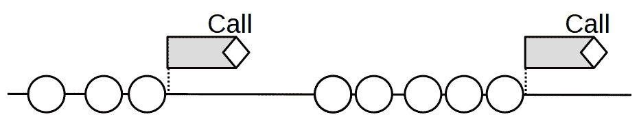
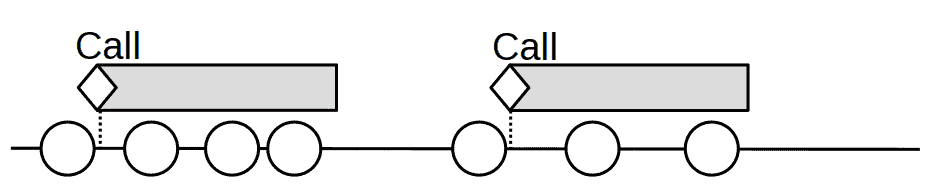
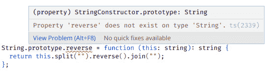

# 生成函数 – 高阶函数

在*第五章*，*声明式编程*中，我们使用了一些声明式代码，以便我们能够提高可读性并获得更紧凑、更短的代码。在本章中，我们将进一步探讨**高阶函数**（**HOFs**）并开发自己的。我们可以将我们预期得到的结果大致分为三类：

+   **包装函数**：这些函数在保持原有功能的同时，添加了一些新的功能。在这个类别中，我们可以考虑日志记录（为任何函数添加日志生成能力）、计时（为特定函数生成时间和性能数据），以及函数和承诺的缓存（缓存结果以避免未来的重复工作）。

+   `once()` 函数（我们曾在*第二章*，*函数式思维*中介绍过），它改变了原始函数，使其只运行一次；例如 `not()` 或 `invert()` 函数，它们会改变函数的返回值；与函数的元数相关的转换，它们会生成一个具有固定参数数量的新函数；以及节流和去抖函数，用于提高性能。

+   **其他生成**：这些提供新的操作，将函数转换为承诺，允许增强搜索功能，将方法从对象中解耦，将它们转换为普通函数，以及相反的操作，将函数转换为方法。我们将特别案例 – *转换器* – 留到*第八章*，*连接函数*中讨论。

# 包装函数 – 保持行为

在本节中，我们将考虑一些高阶函数，它们为其他函数提供包装，以某种方式增强它们，但不会改变它们原有的目标。从设计模式的角度来看（我们将在*第十一章*，*实现设计模式*中重新讨论），我们也可以谈论**装饰器**。这种模式基于向对象添加某些行为（在我们的情况下，是函数）而不影响其他对象的概念。装饰器这个术语也因其用于框架，如 Angular，或（在实验模式下）用于 JavaScript 的一般编程而流行。

等待装饰器

装饰器正在考虑在 JavaScript 中普遍采用。目前（截至 2022 年 12 月），它们处于第 3 阶段，候选级别，因此可能还需要一段时间才能达到第 4 阶段（完成，意味着“正式采用”）。您可以在[tc39.github.io/proposal-decorators/](http://tc39.github.io/proposal-decorators/)上阅读有关装饰器提案的更多信息，以及关于 JavaScript 采用过程的更多信息，称为 TC39，请参阅[tc39.es/process-document/](http://tc39.es/process-document/)。有关更多信息，请参阅*第十一章**，实现设计模式*中的*问题*部分。

至于术语*包装器*，它比你想象的更重要和普遍；事实上，JavaScript 广泛地使用它。在哪里？你已经知道对象属性和方法是通过点符号访问的。然而，你也知道你可以编写像`myString.length`或`22.9.toPrecision(5)`这样的代码，那么这些属性和方法从何而来，鉴于字符串和数字都不是对象？JavaScript 实际上在你的原始值周围创建了一个*包装对象*。这个对象继承了适用于包装值的所有方法。一旦完成所需的评估，JavaScript 就会丢弃刚刚创建的包装器。我们无法对这些短暂的包装器做任何事情，但有一个概念我们将回到，关于允许在不是适当类型的事物上调用方法的包装器。这是一个有趣的想法；参见*第十二章*，*构建更好的容器*，了解更多关于该技术的应用！

在本节中，我们将探讨三个示例：

+   向函数添加日志

+   从函数中获取时间信息

+   使用缓存（*记忆化*）来提高函数的性能

让我们开始工作！

## 日志记录

让我们从一个问题开始。当调试代码时，你通常需要添加一些日志信息来查看函数是否被调用，使用了什么参数，返回了什么，等等。（是的，当然，你可以简单地使用调试器并设置断点，但请耐心听我解释这个例子！）正常工作，这意味着你将不得不修改函数本身的代码，在进入和退出时，以产生一些日志输出。例如，你的原始代码可能如下所示：

```js
function someFunction(param1, param2, param3) {
  // do something
  // do something else
  // and a bit more,
  // and finally
  return some expression;
}
```

在这种情况下，你将不得不修改它，如下所示。在这里，我们需要添加一个`auxValue`变量来存储我们想要记录并返回的值：

```js
function someFunction(param1, param2, param3) {
  console.log(
    "entering someFunction: ",
    param1,
    param2,
    param3
  );
  // do something
  // do something else
  // and a bit more,
  // and finally
  const auxValue = ...some expression... ;
  console.log("exiting someFunction: ", auxValue);
  return auxValue;
}
```

如果函数可以在多个地方返回，你必须修改所有的`return`语句来记录要返回的值。如果你只是即时计算返回表达式，你需要一个辅助变量来捕获那个值。

在下一节中，我们将学习关于日志记录和一些特殊情况，例如抛出异常的函数，我们将更加纯粹地工作。

### 以函数式方式记录日志

通过修改你的函数来记录日志并不困难，但修改代码总是危险的，容易出错。所以，让我们戴上我们的 FP 帽子，并考虑一种新的方法来做这件事。我们有一个执行一些工作的函数，我们想知道它接收到的参数和返回的值。

在这里，我们可以编写一个 HOF（高阶函数），它将有一个单一参数——原始函数——并返回一个新的函数，该函数将按以下顺序执行：

1.  记录接收到的参数。

1.  调用原始函数，捕获其返回值。

1.  记录那个值。

1.  返回给调用者。

一个可能的解决方案如下，让我们首先使用纯 JavaScript 来关注实现：

```js
// logging.ts
function addLogging(fn) {
  return (...args) => {
    console.log(`entering ${fn.name}(${args})`);
    const valueToReturn = fn(...args);
    console.log(`exiting  ${fn.name}=>${valueToReturn}`);
    return valueToReturn;
  };
}
```

由`addLogging()`返回的函数表现如下：

+   第一行`console.log(...)`显示了原始函数的名称及其参数列表。

+   然后，调用原始函数`fn()`，并将返回值存储起来。第二行`console.log(...)`显示了函数名（再次）及其返回值。

+   最后，返回`fn()`计算出的值。

一个小注释：如果你是在 Node.js 应用程序中做这件事，你可能会选择比`console.log()`更好的日志记录方式，比如使用*Winston*、*Morgan*或*Bunyan*等库，具体取决于你想要记录什么。然而，我们的重点是了解如何包装原始函数，使用这些库所需的变化可以忽略不计。

现在让我们转向 TypeScript 实现：

```js
// continued...
function addLogging<T extends (...args: any[]) => any>(
  fn: T
): (...args: Parameters<T>) => ReturnType<T> {
  return (...args: Parameters<T>): ReturnType<T> => {
    console.log(`entering ${fn.name}(${args})`);
    const valueToReturn = fn(...args);
    console.log(`exiting  ${fn.name} => ${valueToReturn}`);
    return valueToReturn;
  };
}
```

我们的`addLogging()`函数适用于泛型函数`T`类型，并返回一个与原始函数类型完全相同的新函数：它的参数（`Parameters<T>`）是`T`的参数，它的结果（`ReturnType<T>`）也是与`T`相同的类型。我们将在本章和本书的其余部分多次使用这种定义。

现在让我们举一个例子。我们可以使用`addLogging()`与即将到来的函数——我同意，这些函数的编写方式过于复杂，只是为了有一个合适的例子！我们将有一个通过改变第二个数的符号然后加到第一个数上来完成减法的函数。而且，为了有一个错误情况，如果尝试从零减去，我们将让该函数抛出错误。（是的，当然，你可以从另一个数中减去零！但我无论如何都想有一种抛出错误的情况！）以下代码就是这样做的：

```js
// continued...
function subtract(a: number, b: number): number {
  if (b === 0) {
    throw new Error("We don't subtract zero!");
  } else {
    b = changeSign(b);
    return a + b;
  }
}
let changeSign = (a: number): number => -a;
// @ts-expect-error We want to reassign the function
subtract = addLogging(subtract);
subtract(8, 3);
console.log(); // to separate
changeSign = addLogging(changeSign);
subtract(7, 5);
```

那个`@ts-expect-error`注释是什么意思？TypeScript 拒绝以下行的赋值，说“不能将`subtract`赋值，因为它是一个函数.ts(2630)`。这种禁止可以保持代码的安全性，但既然我们非常确定我们不会更改`subtract()`的类型，我们可以包含这个注释，TypeScript 会让我们绕过它。

执行此操作的结果将是以下日志行：

```js
entering subtract(8,3)
exiting  subtract => 5
entering subtract(7,5)
entering changeSign(5)
exiting  changeSign => -5
exiting  subtract => 2
```

我们在代码中必须做的所有更改都是重新分配`subtract()`和`changeSign()`，这实际上是在所有地方用它们新的日志生成包装版本替换了它们。对这两个函数的任何调用都将产生这个输出。

这对大多数函数都很好，但如果包装函数抛出异常会发生什么呢？让我们看看。

### 考虑异常情况

让我们通过考虑一个调整来增强我们的日志记录函数。如果你的日志在函数抛出错误时会发生什么？幸运的是，这很容易解决。我们必须添加一个`try`/`catch`结构，如下面的代码所示：

```js
// continued...
function addLogging2<T extends (...args: any[]) => any>(
  fn: T
): (...args: Parameters<T>) => ReturnType<T> {
  return (...args: Parameters<T>): ReturnType<T> => {
    console.log(`entering ${fn.name}(${args})`);
    try {
      const valueToReturn = fn(...args);
      console.log(`exiting  ${fn.name}=>${valueToReturn}`);
      return valueToReturn;
    } catch (thrownError) {
      console.log(
        `exiting  ${fn.name}=>threw ${thrownError}`
      );
      throw thrownError;
    }
  };
}
```

通过这个更改，如果函数抛出错误，你也会得到适当的日志消息，异常将被重新抛出以进行处理。以下是一个快速演示：

```js
try {
  subtract2(11, 0);
} catch (e) {
  /* nothing */
}
/*
entering subtract(11,0)
exiting  subtract=>threw Error: We don't subtract zero!
*/
```

要获得更好的日志输出，其他更改将取决于你——添加日期和时间数据，增强参数的列表方式等等。然而，我们的实现仍然有一个重要的缺陷；让我们让它变得更好、更纯粹。

### 以更纯粹的方式工作

当我们编写`addLogging()`函数时，我们忽略了一些在*第四章*，“*正确行为*”中看到的教条，因为我们把一个不纯的元素（`console.log()`）包含在我们的代码中。因此，我们不仅失去了灵活性（你能否选择另一种日志记录方式？），而且也使我们的测试变得复杂。我们可以通过监视`console.log()`方法来测试它，但这并不干净：我们依赖于了解我们想要测试的函数的内部结构，而不是进行纯粹的黑盒测试。请看以下示例以获得更清晰的理解：

```js
// logging.test.ts
import { addLogging2 } from "./logging";
describe("a logging function", function () {
  afterEach(() => {
    // so count of calls to Math.random will be OK
    jest.restoreAllMocks();
  });
  it("should log twice with well behaved functions", () => {
    jest.spyOn(global.console, "log");
    let something = (a: number, b: number): string =>
      `result=${a}:${b}`;
    something = addLogging2(something);
    something(22, 9);
    expect(global.console.log).toHaveBeenCalledTimes(2);
    expect(global.console.log).toHaveBeenNthCalledWith(
      1,
      "entering something(22,9)"
    );
    expect(global.console.log).toHaveBeenNthCalledWith(
      2,
      "exiting  something=>result=22:9"
    );
  });
  it("should report a thrown exception", () => {
    jest.spyOn(global.console, "log");
    let subtractZero = (x: number) => subtract(x, 0);
    subtractZero = addLogging2(subtractZero);
    expect(() => subtractZero(10)).toThrow();
    expect(global.console.log).toHaveBeenCalledTimes(2);
    expect(global.console.log).toHaveBeenNthCalledWith(
      1,
      "entering subtractZero(10)"
    );
    expect(global.console.log).toHaveBeenNthCalledWith(
      2,
      "exiting  subtractZero=>threw Error: We don't subtract zero!"
    );
  });
  });
});
```

运行这个测试表明`addLogging()`的行为符合预期，因此这是一个解决方案。我们的第一个测试只是进行简单的减法运算，并验证是否以适当的数据调用了日志记录。第二个测试检查我们的（故意失败的）`subtract()`函数是否抛出错误，以验证是否生成了正确的日志。

即使如此，能够以这种方式测试我们的函数并不能解决我们提到的缺乏灵活性。我们应该注意我们在*第四章*中“*正确行为*”部分提到的内容，在*第四章*，“注入不纯函数”；日志函数应该作为参数传递给包装函数，这样我们就可以在需要时更改它：

```js
// logging3.ts
function addLogging3<T extends (...args: any[]) => any>(
  fn: T,
  logger = console.log.bind(console)
): (...args: Parameters<T>) => ReturnType<T> {
  return (...args: Parameters<T>): ReturnType<T> => {
    logger(`entering ${fn.name}(${args})`);
    try {
      const valueToReturn = fn(...args);
      logger(`exiting  ${fn.name}=>${valueToReturn}`);
      return valueToReturn;
    } catch (thrownError) {
      logger(`exiting  ${fn.name}=>threw ${thrownError}`);
      throw thrownError;
    }
  };
}
```

如果我们不采取任何行动，日志包装器将产生与上一节相同的结果。然而，我们可以提供一个不同的记录器——例如，使用 Node.js，我们可以使用*winston*日志工具（有关更多信息，请参阅[github.com/winstonjs/winston](http://github.com/winstonjs/winston)），结果将相应变化：

```js
// continued...
function subtract(...) { ... }
let changeSign = ... ;
// @ts-expect-error We want to reassign the function
subtract = addLogging3(subtract, myLogger);
subtract(8, 3);
console.log(); // to separate
changeSign = addLogging3(changeSign, myLogger);
subtract(7, 5);
/*
{"level":"debug","message":"entering subtract(8,3)"}
{"level":"debug","message":"exiting  subtract=>5"}
{"level":"debug","message":"entering subtract(7,5)"}
{"level":"debug","message":"entering changeSign(5)"}
{"level":"debug","message":"exiting  changeSign=>-5"}
{"level":"debug","message":"exiting  subtract=>2"}
*/
```

默认情况下，日志格式是 JSON。通常会将它路由到文件进行存储，因此它不如控制台输出清晰，但如果我们需要的话，可以重新格式化使其更易读。然而，这对我们的示例来说已经足够了，我们不会做任何其他的事情。

现在我们已经遵循了自己的建议，我们可以利用存根。测试代码实际上与之前相同；然而，我们正在使用一个没有任何提供功能或副作用`dummy.logger()`存根，因此从各方面来说都更安全。在这种情况下，最初被调用的实际函数`console.log()`不会造成任何伤害，但并不总是这样，因此使用存根是推荐的：

```js
// logging3.test.ts
import { addLogging3 } from "./logging3";
describe("addLogging3()", function () {
  it("should call the provided logger", () => {
    const logger = jest.fn();
    let something = (a: number, b: number): string =>
      `result=${a}:${b}`;
    something = addLogging3(something, logger);
    something(22, 9);
    expect(logger).toHaveBeenCalledTimes(2);
    expect(logger).toHaveBeenNthCalledWith(
      1,
      "entering something(22,9)"
    );
    expect(logger).toHaveBeenNthCalledWith(
      2,
      "exiting  something=>result=22:9"
    );
  });
  it("a throwing function should be reported", () => {
    const logger = jest.fn();
    let thrower = () => {
      throw "CRASH!";
    };
    thrower = addLogging3(thrower, logger);
    try {
      thrower();
    } catch (e) {
      expect(logger).toHaveBeenCalledTimes(2);
      expect(logger).toHaveBeenNthCalledWith(
        1,
        "entering thrower()"
      );
      expect(logger).toHaveBeenNthCalledWith(
        2,
        "exiting  thrower=>threw CRASH!"
      );
    }
  });
});
```

前面的测试与我们在之前编写的测试完全一样（尽管，为了多样性，在*以更纯净的方式工作*部分，我们使用了`expect(…).toThrow()`，而在这里我们使用了`try`/`catch`结构来测试抛出错误的函数）。我们使用了并检查了虚拟日志记录器，而不是处理原始的`console.log()`调用。以这种方式编写测试避免了所有可能由于副作用引起的问题，因此它更干净、更安全。

在应用函数式编程（FP）技术时，请记住，如果你在以某种方式使自己的工作复杂化——例如，使测试任何函数变得困难——那么你肯定是在做错事。在我们的例子中，仅仅因为`addLogging()`的输出是一个不纯函数，就应该引起警觉。当然，鉴于代码的简单性，在这个特定情况下，你可能会决定修复它不值得，你可以不进行测试，而且你不需要能够改变日志生成的方式。然而，长期的软件开发经验表明，迟早你会后悔这种决定，所以尽量选择更干净的解决方案。

现在我们已经处理了日志记录，我们将看看另一个需求：出于性能原因对函数进行计时。

## 计时函数

包装函数的另一个可能的应用是以完全透明的方式记录和记录每个函数调用的计时。简单来说，我们希望能够知道函数调用花费了多长时间，这很可能是为了性能研究。然而，就像我们处理日志一样，我们不想修改原始函数，而将使用高阶函数（HOF）。

优化的三条规则

如果你计划优化你的代码，请记住以下三条规则：*不要做*，*不要急于做*，*不要在没有测量的情况下做*。已经提到，很多糟糕的代码都源于早期的优化尝试，所以不要试图编写最优化的代码，不要在你认识到需要它之前尝试优化，不要在没有尝试通过测量应用程序的所有部分来确定减速原因的情况下随意进行。

沿着前面的例子，我们可以编写一个`addTiming()`函数，它给定任何函数，将产生一个包装版本，该版本将在控制台上输出计时数据，但除此之外将以完全相同的方式工作。数据类型与我们在上一节中看到的内容非常相似，所以让我们立即编写 TypeScript 代码：

```js
const myGet = (): number => performance.now();
const myPut = (
  text: string,
  name: string,
  tStart: number,
  tEnd: number
): void =>
  console.log(`${name} - ${text} ${tEnd - tStart} ms`);
function addTiming<T extends (...args: any[]) => any>(
  fn: T,
  { getTime, output } = {
    getTime: myGet,
    output: myPut,
  }
): (...args: Parameters<T>) => ReturnType<T> {
  return (...args: Parameters<T>): ReturnType<T> => {
    const tStart = getTime();
    try {
      const valueToReturn = fn(...args);
      output("normal exit", fn.name, tStart, getTime());
      return valueToReturn;
    } catch (thrownError) {
      output("exception!!", fn.name, tStart, getTime());
      throw thrownError;
    }
  };
}
```

沿着我们在上一节中对日志功能进行的增强，我们提供了独立的日志记录器和时间访问函数。鉴于我们可以注入不纯函数，为我们的`addTiming()`函数编写测试应该很容易。

我们可以在这里看到它是如何工作的：

```js
// continued...
function subtract(...) { ... }
let changeSign = ... ;
// @ts-expect-error We want to reassign the function
subtract = addTiming(subtract, myLogger);
subtract(8, 3);
console.log(); // to separate
changeSign = addTiming(changeSign, myLogger);
subtract(7, 5);
/*
subtract - normal exit 0.0217440128326416 ms
changeSign - normal exit 0.0014679431915283203 ms
subtract - normal exit 0.0415341854095459 ms
*/
```

准确性很重要

使用`performance.now()`提供最高的精度。如果你不需要该函数提供的那么高的精度（可以说，这是过度杀鸡用牛刀），你可以使用`Date.now()`代替。有关这些替代方案，请参阅[developer.mozilla.org/en-US/docs/Web/API/Performance/now](http://developer.mozilla.org/en-US/docs/Web/API/Performance/now)和[developer.mozilla.org/en/docs/Web/JavaScript/Reference/Global_Objects/Date/now](http://developer.mozilla.org/en/docs/Web/JavaScript/Reference/Global_Objects/Date/now)。考虑使用`console.time()`和`console.timeEnd()`；有关更多信息，请参阅[developer.mozilla.org/en-US/docs/Web/API/Console/time](http://developer.mozilla.org/en-US/docs/Web/API/Console/time)。

之前的代码与之前的`addLogging()`函数非常相似，这是合理的：在两种情况下，我们都在实际函数调用之前添加一些代码，然后在函数返回之后添加一些新代码。你甚至可以考虑编写一个*更高阶*的 HOF（高阶函数），它将接收三个函数并输出一个新的 HOF（例如`addLogging()`或`addTiming()`），该 HOF 会在开始时调用第一个函数，如果包装函数返回了一个值，则调用第二个函数，如果抛出了错误，则调用第三个函数！怎么样？

## 缓存函数

在*第四章*“行为规范”中，我们考虑了斐波那契函数的情况，并学习了如何通过手动操作将其转换为使用*缓存*的更高效版本：缓存计算值以避免重复计算。一个*缓存过的*函数会在之前找到结果的情况下避免重复执行过程。我们希望能够将任何函数转换为缓存过的版本，以便获得更优化的版本。然而，现实中的缓存解决方案还应考虑可用的 RAM，并有一些避免填满它的方法；然而，这超出了本书的范围，我们也不会探讨性能问题；这些优化也超出了本书的范围。

关于框架和缓存

一些缓存功能由 React（`useMemo()`钩子）或 Vue（`v-memo`指令）等工具提供，但这并不完全相同。在这些情况下，只保留前一个结果，如果值发生变化，则避免重新渲染。在我们讨论的这种缓存方式中，*所有*前一个值都会被缓存以供重用；React 和 Vue 只缓存一个值。

为了简化，我们只考虑具有单个非结构化参数的函数，并将具有更复杂参数（对象和数组）或多个参数的函数留待以后讨论。我们可以轻松处理的值类型是 JavaScript 的原始值：不是对象且没有方法的日期。JavaScript 有六种这样的值：`boolean`、`null`、`number`、`string`、`symbol` 和 `undefined`。通常，我们只看到前四种作为实际参数。你可以通过访问 [developer.mozilla.org/en-US/docs/Glossary/Primitive](http://developer.mozilla.org/en-US/docs/Glossary/Primitive) 了解更多。

我们的目标不是产生最佳的缓存化解决方案，但让我们研究一下这个主题，并产生几个缓存化高阶函数（HOF）的变体。首先，我们将处理具有单个参数的函数，然后考虑具有多个参数的函数。

### 简单缓存化

我们将使用之前提到的斐波那契函数，这是一个简单的情况：它接收一个数值参数。该函数如下所示：

```js
// fibonacci.ts
function fib(n: number): number {
  if (n == 0) {
    return 0;
  } else if (n == 1) {
    return 1;
  } else {
    return fib(n - 2) + fib(n - 1);
  }
}
```

我们之前创建的解决方案在概念上是通用的，但在实现上并不特别出色：我们必须直接修改函数的代码来利用这种缓存化。让我们看看如何自动完成这项工作，就像其他包装函数一样。解决方案将是一个 `memoize()` 函数，它将包装任何其他函数以应用缓存化。为了清晰起见，让我们首先使用 JavaScript，并且只针对具有单个数值参数的函数：

```js
// memoize.ts
const memoize = (fn) => {
  const cache = {};
  return (x) =>
    x in cache ? cache[x] : (cache[x] = fn(x));
};
```

这是如何工作的？返回的函数对于任何给定的参数，都会检查该参数是否已经被接收；也就是说，是否可以在缓存对象中找到它作为键。（参见 *问题 6.2* 了解缓存的不同实现。）如果是这样，则不需要计算，直接返回缓存值。否则，我们计算缺失的值并将其存储在缓存中。（我们使用闭包来隐藏缓存以防止外部访问。）在这里，我们假设缓存化的函数只接收一个参数（`x`）并且它是一个数值，这样就可以直接用作缓存对象的键值；我们稍后会考虑其他情况。

现在，我们需要转向 TypeScript；这是 `memoize()` 的等效版本。泛型数据类型与我们在 *以函数式方式记录* 部分中看到的是一样的，唯一的区别是现在我们处理的是接收单个数值参数的函数：

```js
// continued...
const memoize = <T extends (x: number) => any>(
  fn: T
): ((x: number) => ReturnType<T>) => {
  const cache = {} as Record<number, ReturnType<T>>;
  return (x) =>
    x in cache ? cache[x] : (cache[x] = fn(x));
};
```

缓存化是否有效？我们需要对其进行计时——幸运的是，我们有一个有用的 `addTiming()` 函数来做这件事！首先，我们计时原始的 `fib()` 函数。我们想要计时整个计算过程，而不是每个递归调用，因此我们编写了一个辅助的 `testFib()` 函数，这是我们将会计时的函数。

我们应该重复计时操作并计算平均值，但既然我们只想确认缓存化是否有效，我们可以容忍差异：

```js
const testFib = (n: number) => fib(n);
addTiming(testFib)(45); // 18,957 ms
addTiming(testFib)(40); //  1,691 ms
addTiming(testFib)(35); //    152 ms
```

当然，你的时间将取决于你的具体 CPU、RAM 等等。然而，结果似乎是有逻辑的：我们在*第四章*中提到的指数增长似乎存在，时间增长得很快。现在，让我们记忆化`fib()`。我们应该得到更短的时间……不是吗？

```js
const testMemoFib = memoize((n: number) => fib(n));
addTiming(testMemoFib)(45); // 19,401 ms
addTiming(testMemoFib)(45); //  0.005 ms – good!
addTiming(testMemoFib)(40); //  2,467 ms  ???
addTiming(testMemoFib)(35); //    174 ms  ???
```

出了点问题！时间应该下降，但它们几乎是一样的。这是因为一个常见的错误，我甚至在一些文章和网页中见过。我们在计时`testMemoFib()`，但除了计时之外，没有人调用那个函数，而计时只发生一次！内部，所有的递归调用都是到`fib()`，它没有被记忆化。如果我们再次调用`testMemoFib(45)`，*那个*调用将被缓存，并且它将几乎立即返回，但这个优化不适用于内部的`fib()`调用。这就是为什么`testMemoFib(40)`和`testMemoFib(35)`的调用没有被优化——当我们计算`testMemoFib(45)`时，那才是唯一被缓存的价值。

正确的解决方案如下：

```js
fib = memoize(fib);
addTiming(testFib)(45); // 0.1481 ms
addTiming(testFib)(45); // 0.0022 ms
addTiming(testFib)(40); // 0.0019 ms
addTiming(testFib)(35); // 0.0029 ms
```

现在，当计算`fib(45)`时，所有的中间斐波那契值（从`fib(0)`到`fib(45)`本身）都被存储起来，所以接下来的调用实际上没有多少工作要做。

现在我们知道了如何记忆化单参数函数，让我们看看多参数函数。

### 更复杂的记忆化

如果我们必须与一个接收两个或更多参数的函数一起工作，或者可以接收数组或对象作为参数，我们能做什么呢？当然，就像我们在*第二章*中讨论的“函数只做一次工作”的问题一样，我们可以简单地忽略这个问题：如果需要记忆化的函数是一元函数，我们就进行记忆化过程；否则，我们不做任何事情！

关于函数长度的讨论

函数的参数数量被称为函数的*arity*，或*valence*，JavaScript 将其作为函数的`length`属性提供；参见[developer.mozilla.org/en-US/docs/Web/JavaScript/Reference/Global_Objects/Function/length](http://developer.mozilla.org/en-US/docs/Web/JavaScript/Reference/Global_Objects/Function/length)。你可以用三种不同的方式说话：你可以说你有一个一元、二元、三元……的函数；你也可以说它是一元、二元、三元……；或者你可以说你有一个单子、二元、三元……。随便选一个！

我们的第一种尝试可能是只记忆化一元函数，其余的保持不变，如下面的代码所示：

```js
// continued...
const memoize2 = <
  T extends (x: number, ...y: any[]) => any
>(
  fn: T
): ((x: number, ...y: any[]) => ReturnType<T>) => {
  if (fn.length === 1) {
    const cache = {} as Record<number, ReturnType<T>>;
    return (x) =>
      x in cache ? cache[x] : (cache[x] = fn(x));
  } else {
    return fn;
  }
};
```

更加认真地工作，如果我们想要能够记忆化任何函数，我们必须找到一种方法来生成缓存键。为此，我们必须找到一种方法将任何参数转换为字符串。我们不能直接使用非原始值作为缓存键。我们可以尝试使用`strX = String(x)`之类的将值转换为字符串，但我们会遇到问题。对于数组来说，这似乎可以工作。然而，看看以下三个涉及不同数组但带有转折的案件：

```js
var a = [1, 5, 3, 8, 7, 4, 6];
String(a); // "1,5,3,8,7,4,6"
var b = [[1, 5], [3, 8, 7, 4, 6]];
String(b); // "1,5,3,8,7,4,6"
var c = [[1, 5, 3], [8, 7, 4, 6]];
String(c); // "1,5,3,8,7,4,6"
```

这三个案例产生了相同的结果。如果我们只考虑单个数组参数，我们可能可以应付，但当不同的数组产生相同的键时，这就成为一个问题。如果我们必须接收对象作为参数，情况会更糟，因为任何对象的`String()`表示法不可避免地是`"[object Object]"`：

```js
var d = {a: "fk"};
String(d); // "[object Object]"
var e = [{p: 1, q: 3}, {p: 2, q: 6}];
String(e); // "[object Object],[object Object]"
```

最简单的解决方案是使用`JSON.stringify()`将我们收到的任何参数转换为有用的、独特的字符串：

```js
var a = [1, 5, 3, 8, 7, 4, 6];
JSON.stringify(a); // "[1,5,3,8,7,4,6]"
var b = [[1, 5], [3, 8, 7, 4, 6]];
JSON.stringify(b); // "[[1,5],[3,8,7,4,6]]"
var c = [[1, 5, 3], [8, 7, 4, 6]];
JSON.stringify(c); // "[[1,5,3],[8,7,4,6]]"
var d = {a: "fk"}; JSON.stringify(d); // "{"a":"fk"}"
var e = [{p: 1, q: 3}, {p: 2, q: 6}];
JSON.stringify(e); // "[{"p":1,"q":3},{"p":2,"q":6}]"
```

为了性能，我们的逻辑应该是这样的：如果我们正在记忆化的函数接收到的参数是一个原始值，我们可以直接使用该参数作为缓存键。在其他情况下，我们会使用对参数数组应用`JSON.stringify()`的结果。我们增强的记忆化高阶函数（HOF）可能如下所示：

```js
// continued...
const memoize3 = <T extends (...x: any[]) => any>(
  fn: T
): ((...x: Parameters<T>) => ReturnType<T>) => {
  const cache = {} as Record<
    number | string,
    ReturnType<T>
  >;
  const PRIMITIVES = ["number", "string"];
  return (...args) => {
    const strX: number | string =
      args.length === 1 &&
      PRIMITIVES.includes(typeof args[0])
        ? args[0]
        : JSON.stringify(args);
    return strX in cache
      ? cache[strX]
      : (cache[strX] = fn(...args));
  };
};
```

在通用性方面，这是最安全的版本。如果你确定你将要处理的函数的参数类型，那么可以说我们的第一个版本更快。另一方面，如果你想编写更容易理解的代码，即使是以一些浪费的 CPU 周期为代价，你也可以选择一个更简单的版本：

```js
// continued...
const memoize4 = <T extends (...x: any[]) => any>(
  fn: T
): ((...x: Parameters<T>) => ReturnType<T>) => {
  const cache = {} as Record<string, ReturnType<T>>;
  return (...args) => {
    const strX = JSON.stringify(args);
    return strX in cache
      ? cache[strX]
      : (cache[strX] = fn(...args));
  };
};
```

速度者的诞生

如果你想了解顶级性能记忆化函数的开发，请阅读 Caio Gondim 的*我如何编写世界上最快的 JavaScript 记忆化库*文章，该文章可在网上找到，链接为[blog.risingstack.com/the-worlds-fastest-javascript-memoization-library/](https://blog.risingstack.com/the-worlds-fastest-javascript-memoization-library/)。

到目前为止，我们已经实现了几个有趣的记忆化函数，但我们将如何为它们编写测试？现在让我们分析这个问题。

### 记忆化测试

测试记忆化高阶函数（HOF）提出了一个有趣的问题——你将如何着手？第一个想法可能是查看缓存，但它是私有的且不可见的。然后，当然，我们可以修改`memoize()`使其使用全局缓存或以某种方式允许外部访问缓存，但这种内部审查是不被提倡的：你应该尝试仅基于外部属性进行测试。

承认我们不应该尝试检查缓存后，我们可以尝试时间控制：对于大数值的 `n` 调用函数 `fib(n)` 应该花费更长的时间，如果函数没有被记忆化。这当然是有可能的，但它也容易受到可能的失败的影响：测试之外的东西可能在完全错误的时间运行，而且有可能你的记忆化运行会比原始运行更长。好吧，这是可能的，但不太可能——但你的测试并不完全可靠。

我们可以思考计算一些斐波那契数并测试函数被调用的次数——一次直接调用，其余的调用都是由于递归。有关更多内容，请参阅 *问题 6.3*。前面的代码相当直接：我们正在使用我们之前开发的斐波那契函数，并测试它是否产生正确的值。例如，我们可以发现计算 `fib(6)` 需要 25 次调用，通过重新查看我们在 *第四章* 中看到的图表，“行为正确”，我们可以看到其中包含 25 个节点（每个节点代表对 `fib()` 的一个调用）：


图 6.1 – 计算 fib(6) 需要 25 次调用

第一个想法是计数，如这里所示——但这不会起作用！

```js
// memoize.test.ts
import { fib } from "./fibonacci";
import * as moduleFib from "./fibonacci";
describe("the original fib", function () {
  it("should repeat calculations", () => {
    jest.spyOn(moduleFib, "fib");
    expect(fib(6)).toBe(8);
    expect(fib).toHaveBeenCalledTimes(25);
  });
});
```

我们首先计算 `fib(6)`——它正确地返回 `8`——然后我们检查应该有 25 次对 `fib()` 的调用，但只找到一次；发生了什么？问题出在 Jest 上：当你监视一个函数时，你实际上是在监视一个调用你想要检查的函数的包装器。*这个*包装器函数只被调用了一次；我们的 `fib()` 函数被调用了 25 次，但 Jest 没有看到这一点！

我们不得不以一种非常非功能性的方式来做些别的事情！让我们测试一个修改过的 `fib()` 函数，它将更新一个外部计数器；我们将其称为 `fibM()`：

```js
// continued...
describe("the modified fib", function () {
  it("should repeat calculations", () => {
    let count = 0;
    const fibM = (n: number): number => {
      count++;
      if (n == 0) {
        return 0;
      } else if (n == 1) {
        return 1;
      } else {
        return fibM(n - 2) + fibM(n - 1);
      }
    };
    expect(fibM(6)).toBe(8);
    expect(count).toBe(25);
  });
});
```

现在测试通过了，我们再测试一下记忆化、修改过的版本怎么样？在这种情况下，由于缓存的结果，调用次数应该会更低。实际上，它应该是 `7`，因为我们需要从 `fib(6)` 到 `fib(0)` 的所有值：

```js
// continued...
describe("the memoized, modified fib", function () {
  it("should repeat calculations", () => {
    let count = 0;
    const fibMM = memoize((n: number): number => {
      count++;
      if (n == 0) {
        return 0;
      } else if (n == 1) {
        return 1;
      } else {
        return fibMM(n - 2) + fibMM(n - 1);
      }
    });
    expect(fibMM(6)).toBe(8);
    expect(count).toBe(7);
  });
```

在本节中，我们处理了几个示例，这些示例暗示了包装函数，以便它们能够继续工作，但增加了额外的功能。现在，让我们看看一个不同的案例，其中我们想要改变函数的工作方式。

### 记忆化承诺

让我们更进一步，考虑记忆化返回 promise 的`async`函数。在一个复杂的 Web 应用程序中，有许多相关的组件，完全有可能出现没有良好理由的冗余、重复的 API 调用，这会损害性能并产生糟糕的用户体验。例如，想象一个具有多个标签的仪表板风格的 Web 页面。每次用户选择一个标签时，都会发出几个 API 调用以获取页面所需的数据。然而，如果用户选择不同的标签但后来又返回到第一个标签，相同的 API 调用将再次发出。对于许多应用程序来说，数据基本上是恒定的，意味着“不是实时变化的。”因此，你不需要重新发送 API 调用；重用之前获取的数据也行。

一些解决方案并不实用：我们可以修改服务器以启用缓存，但如果这不可能呢？或者我们可以使用缓存，在每次调用之前检查数据是否已经被获取，但这将涉及手动修改每个 API 调用以首先检查缓存！我们想要一个不需要代码更改的解决方案，而记忆化（memoizing）就浮现在脑海中。

假设我们使用返回 promise 的`async`函数调用 API。鉴于我们开发的`memoize()`函数，我们可以记忆化`async`函数，这将是一个开始。第一次用一些参数调用该函数时，API 调用将会发出，并返回一个 promise（因为这是函数返回的内容）。如果你再次用相同的参数调用该函数，记忆化的 promise 将会立即返回。太好了！但是有一个问题……如果 API 调用失败会怎样？我们需要添加一些错误捕获逻辑：

```js
// memoize.ts
const promiseMemoize = <
  A,
  T extends (...x: any[]) => Promise<A>
>(
  fn: T
): ((...x: Parameters<T>) => Promise<A>) => {
  const cache = {} as Record<string, Promise<A>>;
  return (...args) => {
    const strX = JSON.stringify(args);
    return strX in cache
      ? cache[strX]
      : (cache[strX] = fn(...args).catch((x) => {
          delete cache[strX];
          return x;
        }));
  };
};
```

所有逻辑与之前相同，但有几点额外的细节：

+   我们现在明确指出，记忆化的函数返回一个泛型类型`A`的 promise (`Promise<A>`)

+   如果 promise 被拒绝，我们添加代码来删除缓存的 promise，以便未来的调用将再次发出

我们的新`promiseMemoize()`函数可以处理错误，允许未来重试被拒绝的调用；很好！现在让我们看看另一个不同的情况，我们想要改变函数的实际工作方式。

# 修改函数的行为

在上一节中，我们考虑了一些封装函数的方法，以便它们在某种程度上得到增强的同时，仍能保持其原始功能。现在，我们将转向修改函数的行为，以便新的结果与原始结果不同。

我们将涵盖以下主题：

+   再次探讨函数只工作一次的问题

+   取反或反转函数的结果

+   改变函数的阶数

+   函数节流和去抖动以提高性能

让我们开始吧！

## 一次性完成任务，再次探讨

在 (*第二章*，*函数式思考*) 中，我们通过一个例子了解了如何为简单问题开发函数式编程风格的解决方案：确保一个给定的函数只被调用一次。我们当时使用箭头函数定义了 `once()`；让我们为了多样性使用一个标准函数：

```js
// once.ts
function once<T extends (...args: any[]) => void>(
  f: T
): (...args: Parameters<T>) => void {
  let done = false;
  return ((...args: Parameters<T>) => {
    if (!done) {
      done = true;
      f(...args);
    }
  }) as T;
}
```

这是一个完全可接受的解决方案；它运行良好，我们没有任何反对意见。然而，我们可以考虑一个变体。我们可以观察到给定的函数只被调用了一次，但其返回值丢失了。这很容易修复：我们需要添加一个 `return` 语句。然而，这还不够；如果函数被多次调用，它应该返回什么？我们可以借鉴记忆化解决方案，为未来的调用存储函数的返回值。

让我们将函数的值存储在 `result` 变量中，以便我们可以在以后返回它：

```js
// continued...
function once2<T extends (...args: any[]) => any>(
  f: T
): (...args: Parameters<T>) => ReturnType<T> {
  let done = false;
  let result: ReturnType<T>;
  return ((...args: Parameters<T>): ReturnType<T> => {
    if (!done) {
      done = true;
      result = f(...args);
    }
    return result;
  }) as T;
}
```

第一次调用函数时，其值存储在 `result` 中；后续的调用只需返回该值，无需进行进一步处理。你也可以考虑使函数只对每一组参数工作一次。你不必为此做任何工作——`memoize()` 就足够了！

在 *第二章* 的 *产生更好的解决方案* 部分 (*Chapter 2*，*函数式思考*) 中，我们考虑了 `once()` 的一个可能的替代方案：另一个接受两个函数作为参数的高阶函数（HOF），允许第一个函数只被调用一次，从那时起调用第二个函数。在之前的代码中添加一个 `return` 语句并将其重写为一个标准函数，结果如下：

```js
// continued...
function onceAndAfter<T extends (...args: any[]) => any>(
  f: T,
  g: T
): (...args: Parameters<T>) => ReturnType<T> {
  let done = false;
  return ((...args: Parameters<T>): ReturnType<T> => {
    if (!done) {
      done = true;
      return f(...args);
    } else {
      return g(...args);
    }
  }) as T;
}
```

如果我们记得函数是一阶对象，我们可以重写这个例子。而不是使用一个标志来记住要调用哪个函数，我们可以使用一个 `toCall` 变量直接存储需要被调用的函数。从逻辑上讲，该变量将被初始化为第一个函数，但随后将更改为第二个函数。以下代码实现了这一变化：

```js
// continued...
function onceAndAfter2<T extends (...args: any[]) => any>(
  f: T,
  g: T
): (...args: Parameters<T>) => ReturnType<T> {
  let toCall = f;
  return ((...args: Parameters<T>): ReturnType<T> => {
    let result = toCall(...args);
    toCall = g;
    return result;
  }) as T;
}
```

`toCall` 变量被初始化为 `f`，因此第一次调用将会执行 `f()`，但随后 `toCall` 获取了 `g` 的值，这意味着所有后续的调用都将执行 `g()`。我们之前在这本书中看到的相同示例仍然有效：

```js
const squeak = (x: string) => console.log(x, "squeak!!");
const creak = (x: string) => console.log(x, "creak!!");
const makeSound = onceAndAfter2(squeak, creak);
makeSound("door"); // "door squeak!!"
makeSound("door"); // "door creak!!"
makeSound("door"); // "door creak!!"
makeSound("door"); // "door creak!!"
```

在性能方面，差异可能微不足道。展示这种进一步变体的原因是为了表明你应该记住，通过存储函数，你通常可以更简单地产生结果。在过程编程中使用标志来存储状态是一种常见的技术。然而，在这里，我们设法跳过了这种用法并产生了相同的结果。现在，让我们看看一些新的示例，展示如何包装函数以改变它们的行为。

## 逻辑否定一个函数

让我们考虑来自 *第五章*，*声明式编程* 的 `filter()` 方法。给定一个谓词，我们可以过滤数组，只包含那些谓词为真的元素。但你是如何进行反向过滤并排除那些谓词为真的元素的？

第一个解决方案应该是相当明显的：重新编写谓词以返回其原本返回值的相反。在提到的章节中，我们看到了以下示例：

```js
// not.ts
const delinquent = serviceResult.accountsData.filter(
  (v) => v.balance < 0
);
```

（有关 `serviceResult` 对象，请参阅前一章中的 *filter() 示例* 部分。）

因此，我们可以以相反的方式编写它，以这两种等效的方式之一。注意以下不同方式来编写相同的谓词以测试非负值：

```js
// continued...
const notDelinquent = serviceResult.accountsData.filter(
  (v) => v.balance >= 0
);
const notDelinquent2 = serviceResult.accountsData.filter(
  (v) => !(v.balance < 0)
);
```

这完全没问题，但我们的代码中也可以有类似以下的内容：

```js
// continued...
const isNegativeBalance = (v: AccountData) => v.balance < 0;
.
. many lines later
.
const delinquent2 = serviceResult.accountsData.filter(
  isNegativeBalance
);
```

在这种情况下，重写原始的 `isNegativeBalance()` 函数是不可能的。（另一种可能性：该函数可能定义在单独的模块中，你无法或不应修改。）然而，以函数式的方式工作，我们可以编写一个高阶函数，它将接受任何谓词，评估它，然后否定其结果。可能的实现相当简单，多亏了现代 JavaScript 语法 – 对于 TypeScript 版本，请参阅 *问题 6.5*：

```js
// continued...
const not = (fn) => (...args) => !fn(...args);
```

以这种方式工作，我们可以将前面的过滤器重写如下；为了测试非负余额，我们使用原始的 `isNegativeBalance()` 函数，该函数通过我们的 `not()` 高阶函数被否定：

```js
// continued...
const notDelinquent3 = serviceResult.accountsData.filter(
  not(isNegativeBalance)
);
```

我们可能还想尝试另一种解决方案。而不是反转条件（如我们所做的那样），我们可以编写一个新的过滤方法（可能是 `filterNot()`？），它将以与 `filter()` 相反的方式工作。以下代码显示了如何编写这个新函数。给定一个值数组 `arr` 和一个谓词 `fn`，我们将有如下内容：

```js
// continued...
const filterNot =
  <A, T extends (x: A) => boolean>(arr: A[]) =>
  (fn: T): A[] =>
    arr.filter(not((y) => fn(y)));
```

这个解决方案并不完全匹配 `filter()`，因为你不能将其用作方法，但我们可以将其添加到 `Array.prototype` 中，或者应用一些方法。我们将在 *第八章*，*连接函数* 中探讨这些想法。然而，更有趣的是注意到我们使用了否定函数，因此 `not()` 对于解决反向过滤问题的两种解决方案都是必要的。在即将到来的 *去方法化 – 将方法转换为函数* 部分，我们将看到我们还有另一个解决方案，因为我们可以将像 `filter()` 这样的方法与其应用的对象解耦，从而将其转换为通用函数。

关于否定函数与使用新的 `filterNot()` 函数，尽管这两种可能性同样有效，但我认为使用 `not()` 更清晰。如果你已经理解了过滤的工作原理，那么你可以几乎大声朗读代码，并且它将是可理解的：我们想要那些没有负余额的账户，对吧？现在，让我们考虑一个相关的问题：反转函数的结果。

## 反转结果

与前面的过滤问题类似，让我们回顾一下 *第三章* 的 *Injection – sorting it out* 部分的排序问题，即 *Starting Out with Functions*。在这里，我们想要用一种特定的方法对数组进行排序。因此，我们使用了 `sort()`，并向它提供了一个 `comparison` 函数，该函数基本上指出了两个字符串中哪一个应该排在前面。为了刷新你的记忆，给定两个字符串，该函数应该执行以下操作：

+   如果第一个字符串应该排在第二个字符串之前，则返回一个负数

+   如果字符串相同，则返回 `0`

+   如果第一个字符串应该排在第二个字符串之后，则返回一个正数

让我们回到我们之前查看的用于西班牙语排序的代码。我们必须编写一个专门的 `comparison` 函数，以便排序时考虑到西班牙语的字符排序规则，例如将字母 *ñ* 放在 *n* 和 *o* 之间，等等。这个代码如下：

```js
const spanishComparison = (a: string, b: string) =>
  a.localeCompare(b, "es");
palabras.sort(spanishComparison);
// sorts the array according to Spanish rules
```

我们面临着一个类似的问题：我们如何按降序排序？鉴于我们在上一节中看到的内容，一些选项应该立刻浮现在脑海中：

+   按升序排序，然后反转数组。虽然这解决了问题，但我们仍然只按升序排序，我们希望避免额外的反转步骤。

+   编写一个函数，将比较函数的结果反转。这将反转所有关于哪个字符串应该排在前面所做的决定，最终结果将是一个按完全相反的顺序排序的数组。

+   编写一个 `sortDescending()` 函数或方法，使其工作方式与 `sort()` 相反。

让我们选择第二个选项，编写一个 `invert()` 函数来改变比较结果。代码本身与 `not()` 的代码非常相似。再次检查 *问题 6.5* 以获取 TypeScript 的等效代码：

```js
// invert.ts
const invert = (fn) => (...args) => -fn(...args);
```

给定这个高阶函数（HOF），我们可以通过提供一个适当反转的 `comparison` 函数来按降序排序。看看最后几行，我们使用 `invert()` 来改变排序比较的结果：

```js
const spanishComparison = (a: string, b: string): number =>
  a.localeCompare(b, "es");
const palabras = [
  "ñandú",
  "oasis",
  "mano",
  "natural",
  "mítico",
  "musical",
];
palabras.sort(spanishComparison);
// "mano", "mítico", "musical", "natural", "ñandú", "oasis"
palabras.sort(invert(spanishComparison));
// "oasis", "ñandú", "natural", "musical", "mítico", "mano"
```

输出符合预期：当我们 `invert()` `comparison` 函数时，结果顺序相反。考虑到我们已经有一些带有预期结果的测试用例，编写单元测试应该相当容易，不是吗？

## 参数数量变化

回到 *第五章* 的 *Parsing numbers tacitly* 部分，在 *Programming Declaratively* 中，我们看到了使用 `parseInt()` 与 `reduce()` 产生问题，因为该函数的预期参数数量不正确，它接受了一个以上的参数——还记得之前的例子吗？

```js
["123.45", "-67.8", "90"].map(parseInt);
// [123, NaN, NaN]
```

我们有不止一种方法来解决这个问题。在提到的章节中，我们选择了箭头函数。这是一个简单的解决方案，并且具有易于理解的额外优势。在第 *第七章* *转换函数* 中，我们将探讨另一种基于偏应用的方法。现在，让我们使用一个高阶函数（HOF）。我们需要一个函数，它将接受另一个函数作为参数，并将其转换为单参数函数。使用 JavaScript 的展开操作符和箭头函数，这很容易处理：

```js
const unary = fn => (...args) => fn(args[0]);
```

以下是用 TypeScript 编写的示例：

```js
// arity.ts
const unary =
  <T extends (...x: any[]) => any>(
    fn: T
  ): ((arg: Parameters<T>[0]) => ReturnType<T>) =>
(x) => fn(x);
```

我们的 `unary()` 函数与一个通用的 `T` 函数一起工作。它产生一个新的函数，只有一个参数（第一个参数，`Parameters<T>[0]`），该参数返回与原始函数相同类型的结果（`ReturnType<T>`）。

使用这个函数，我们的数字解析问题就消失了：

```js
["123.45", "-67.8", "90"].map(unary(parseInt));
// [123, -67, 90]
```

不言而喻，定义进一步的 `binary()` 或 `ternary()` 函数，以及其他将任何函数转换为等价但限制参数版本的函数同样简单。我们不要做得太过分，只看看所有可能函数中的一小部分——有关更多信息，请参阅 *问题 6.10*：

```js
// continued...
const binary = fn => (...a) => fn(a[0], a[1]);
const ternary = fn => (...a) => fn(a[0], a[1], a[2]);
```

这方法可行，但逐个列出所有参数可能会变得令人厌烦。我们可以更进一步，通过使用数组操作和展开操作，创建一个通用函数来处理所有这些情况，如下所示：

```js
// continued...
const arity = (n, fn) => (...a) => fn(...a.slice(0, n));
```

使用这个通用的 `arity()` 函数，我们可以为 `unary()`、`binary()` 等函数提供不同的定义。我们甚至可以将之前的函数重写如下：

```js
const unary = fn => arity(1, fn);
const binary = fn => arity(2, fn);
const ternary = fn => arity(3, fn);
```

你可能会认为你不太可能需要应用这种解决方案，但比你预期的要多得多。通过遍历 JavaScript 的所有函数和方法，你可以快速生成一个以 `apply()`、`assign()`、`bind()`、`concat()`、`copyWithin()` 等开始的列表！如果你想在隐式方式下使用这些函数，你可能需要固定它们的参数数量，以便它们能够与固定数量的参数一起工作。

世间万物

如果你想查看 JavaScript 函数和方法的良好列表，请查看 [developer.mozilla.org/en-US/docs/Web/JavaScript/Guide/Functions](http://developer.mozilla.org/en-US/docs/Web/JavaScript/Guide/Functions) 和 [developer.mozilla.org/en-US/docs/Web/JavaScript/Reference/Methods_Index](http://developer.mozilla.org/en-US/docs/Web/JavaScript/Reference/Methods_Index)。至于隐式编程（或点免费风格），我们将在 *第八章* *连接函数* 中再次讨论。

然而，TypeScript 会遇到一个问题。TypeScript 处理静态类型，但 `arity()` 函数调用的结果类型是在运行时确定的。我们最多可以通过一系列重载来说明，给定一个具有多个参数的函数，应用 `arity()` 后的结果将有零个、一个、两个等不同可能性——但我们无法做得更多。

到目前为止，我们已经学习了如何包装函数，同时保持其原始行为或以某种方式改变它。现在，让我们考虑一些修改函数的其他方法。

## 阻尼和节流

让我们以两种限制函数何时以及如何频繁执行的技术来结束本节：**阻尼**和**节流**。这两种技术具有相同的概念，因此我们将一起探讨：

+   *阻尼*一个函数意味着我们延迟一段时间，直到我们实际调用该函数才执行任何操作

+   *节流*一个函数意味着我们延迟一段时间，在实际上调用函数之后不执行任何操作

这些技术在网页中非常高效，允许更好的性能。从某种意义上说，它们与记忆化（memoization）相关。通过记忆化，你修改一个函数，使其只会在某些给定参数的情况下被调用一次，但不会更多。在这里的技术中，我们不会走那么远——我们将允许函数再次执行，但以一种受限制的方式，并添加一些延迟。

### 阻尼函数

阻尼（debouncing）这一概念源自电子学，它涉及到等待直到达到一个稳定状态。例如，如果你编写了一个自动完成组件，每次用户输入一个字母时，你可能会查询一个 API 来获取可能的选择。然而，你并不想逐个按键地这样做，因为你会产生大量的调用，其中大部分你甚至不会使用，因为你只关心你最后做出的那个调用。其他常见的例子包括鼠标移动或页面滚动事件；你不想频繁地运行相关的处理程序，因为这会负面影响页面的性能。

如果你阻尼了 API 调用函数，你仍然可以每次按键时调用它，但直到一段时间内没有更多调用，不会进行任何 API 调用。请参见*图 6.2*中的示例；事件以圆圈表示，实际的调用只在最后一个事件之后的一段时间内发生，没有事件发生：



图 6.2 – 阻尼函数仅在调用暂停后执行

我们可以通过以下方式使用超时来实现这一点：

```js
// debounce.ts
const debounce = <T extends (...args: any[]) => void>(
  fn: T,
  delay = 1000
) => {
  let timer: ReturnType<typeof setTimeout>;
  return (...args: Parameters<T>): void => {
    clearTimeout(timer);
    timer = setTimeout(() => fn(...args), timeDelay);
  };
};
```

一个阻尼函数是一个新的函数，它可以被频繁调用，但在`计时器`运行之前不会执行任何操作。如果你调用一次函数，然后再次调用它，计时器将被重置并重新开始运行。函数真正执行其操作的唯一方式是在给定`延迟`期间没有新的调用。

### 限制函数

对于互补的节流转换，想象一个带有**FETCH**、**APPLY FILTERS**或**RETRIEVE**按钮的网页表单。当你点击它时，会发起 API 调用以获取一些数据。然而，如果用户不断点击，即使会得到相同的结果，也会发起过多的调用。我们希望节流调用，以便第一次调用通过，但进一步的调用将在一段时间后禁用。类似的使用场景也适用于*无限滚动*；当用户向下滚动页面时，你想要获取更多数据，但出于性能原因，你既不想非常频繁地执行，也不想等到用户到达底部（就像防抖那样），因为那样滚动就会停止。

节流与防抖类似，但节流函数运行后等待下一次运行，而防抖函数先等待然后运行。*图 6.3*显示了节流的工作原理。与上一节一样，事件以圆圈表示。在调用 API 之后，除非经过一段时间，否则不会进行进一步的调用：



图 6.3 – 节流函数第一次调用时运行，但随后延迟直到再次运行

```js
// throttle.ts
const throttle = <T extends (...args: any[]) => void>(
  fn: T,
  delay = 1000
) => {
  let timer: ReturnType<typeof setTimeout> | undefined;
  return (...args: Parameters<T>): void => {
    if (!timer) {
      timer = setTimeout(() => {
        timer = undefined;
      }, delay);
      fn(...args);
    }
  };
};
```

节流函数是一个新的函数，你可以按需多次调用，但它在第一次“做其事”后不会再次运行，直到某个`delay`。当你调用函数时，它首先检查是否设置了`timer`；如果是，则不会做任何事情。如果没有设置`timer`，则会设置一个超时，在一段时间后清除`timer`，然后调用函数。我们正在使用`timer`变量作为超时以及作为标志（“我们在等待吗？”）。

到目前为止，我们已经学习了如何包装函数，同时保持其原始行为或以某种方式修改它们。现在，让我们考虑一些修改函数的其他方法。

# 以其他方式更改函数

让我们通过考虑其他一些提供结果的函数来结束这一章，例如新的查找器、从对象中解耦的方法等。我们的例子将包括以下内容：

+   将操作（如使用`+`运算符进行加法）转换为函数

+   将函数转换为承诺

+   访问对象以获取属性的值

+   将方法转换为函数

+   寻找最优值的一种更好的方法

## 将操作转换为函数

我们已经看到几个需要编写函数来仅对一对数字进行加法或乘法运算的例子。例如，在*第五章*的“求和数组”部分中，*声明式编程*，我们不得不编写以下等效代码：

```js
const mySum = myArray.reduce(
  (x: number, y: number): number => x + y,
  0
);
```

在*第五章*的“处理范围”部分中，*声明式编程*，我们编写了以下代码来计算阶乘：

```js
const factorialByRange = (n: number): number =>
  range(1, n + 1).reduce((x, y) => x * y, 1);
```

如果我们可以将二元运算符转换为一个计算相同结果的函数，那就简单多了。前两个例子可以更简洁地写成如下。你能理解我们做出的改变吗？

```js
const mySum = myArray.reduce(binaryOp2("+"), 0);
const factorialByRange = (n: number): number =>
  range(1, n + 1).reduce(binaryOp2("*"), 1);
```

我们还没有查看 `binaryOp()` 的实现方式，但关键概念是，我们不再使用中缀运算符（就像我们在写 `22+9` 时使用的那样），我们现在有一个函数（就像我们能够将求和写成 `+(22,9)` 一样，这当然不是有效的 JavaScript）。让我们看看我们如何实现这一点。

### 实现操作

我们将如何编写这个 `binaryOp()` 函数？至少有两种方法：一种安全但较长的方案，另一种风险更高但更短的替代方案。第一种方案需要列出每个可能的运算符。以下代码通过使用较长的 switch 语句来实现这一点：

```js
// binaryOp.ts
const binaryOp1 = (op: string) => {
  switch (op) {
    case "+":
      return (x: number, y: number): number => x + y;
    case "-":
      return (x: number, y: number): number => x - y;
    case "*":
      return (x: number, y: number): number => x * y;
    //
    // etc.
    //
    default:
      throw new Error(`Unknown ${op} operator`);
  }
};
```

这个解决方案完全可行，但需要做太多的工作。顺便说一句，我们应该有单独的 `binaryMathOp()` 和 `binaryLogicalOp()` 函数；第一个会是 `(op: string) => ((x: number, y: number) => number)`，而第二个会是 `(op: string) => ((x: boolean, y: boolean) => boolean)`，因为，正如前一个部分中提到的，TypeScript 无法推断返回函数的类型。

另一个解决方案是更短但更危险的。请仅将其视为学习目的的示例；出于安全原因，不建议使用 `eval()`！我们的第二个版本将使用 `Function()` 创建一个新的函数，该函数使用所需的运算符，如下所示：

```js
// continued...
const binaryOp2 = (op) =>
  new Function("x", "y", `return x ${op} y;`);
```

再次强调，TypeScript 无法确定返回函数的类型，因为这将仅在运行时确定。因此，我们需要编写以下代码：

```js
// continued...
const binaryOp2 = (op: string) =>
  new Function("x", "y", `return x ${op} y;`) as (
    x: number,
    y: number
  ) => number;
```

我们不需要指定 `binaryOp2()` 的类型，因为 TypeScript 可以根据我们应用到的类型转换自行推断出 `(o: string) => (x: number, y: number) => number`。

（更简单）的出路

一些库，如 Lodash，已经提供了 `_.multiply()` 和 `_.sum()` 等函数，因此这是一个更直接的解决方案！你可以快速创建自己的，并创建自己的数学和逻辑基本函数的迷你库。

如果你遵循这个思路，你也可以定义一个 `unaryOp()` 函数，尽管它的应用较少。（我将这个实现留给你；它与我们已经写过的类似。）在*第七章*，*转换函数*中，我们将探讨通过使用部分应用来创建这个一元函数的另一种方法。

### 一个更方便的实现

让我们先不要急于求成。进行函数式编程（FP）并不总是意味着要深入到最简单的函数。例如，在这本书的一个即将到来的部分，我们需要一个函数来检查一个数字是否为负，我们将考虑（参见*第八章**，将函数转换为无参数风格*部分）使用 `binaryOp2()` 来编写它：

```js
const isNegative = curry(binaryOp2(">"))(0);
```

目前不必担心`curry()`函数（我们将在下一章中详细介绍）——其想法是将第一个参数固定为`0`，这样我们的函数将检查给定的`n`数字是否`0>n`。关键是，我们刚刚编写的函数不是很清晰。如果我们定义一个二元操作函数，它允许我们指定其中一个参数——左边的或右边的——以及要使用的运算符，我们会做得更好。在这里，我们可以编写以下两个函数，它们定义了左操作符或右操作符缺失的函数：

```js
// continued...
const binaryLeftOp =
  (x: number, op: string) => (y: number) =>
    binaryOp2(op)(x, y);
const binaryOpRight =
  (op: string, y: number) => (x: number) =>
    binaryOp2(op)(x, y);
```

使用这些新函数，我们可以写出以下两种定义中的任意一种，尽管我认为第二种更清晰。我更愿意测试一个数字是否小于`0`，而不是`0`是否大于该数字：

```js
const isNegative1 = binaryLeftOp(0, ">");
const isNegative2 = binaryOpRight("<", 0);
```

这有什么意义？不要追求一些基本的简单性或回到基础。我们可以将运算符转换为函数，但如果你能通过指定操作的两个参数之一来做得更好并简化你的编码，那就这么做吧！函数式编程（FP）的目的是帮助编写更好的代码，而创造人为的限制对任何人都没有帮助。

当然，对于像检查一个数字是否为负这样的简单函数，我永远不会想通过 currying、二元运算符、pointfree 风格或其他任何东西来使事情复杂化，我会毫不犹豫地写出以下内容：

```js
const isNegative3 = (x: number): boolean => x < 0;
```

到目前为止，我们已经看到了解决相同问题的几种方法。请记住，函数式编程（FP）并不强迫你选择一种做事的方式；相反，它为你提供了很多自由来决定走哪条路！

## 将函数转换为承诺

在 Node.js 中，大多数异步函数需要一个回调，例如`(err,data)=>{...}`：如果`err`是假的，函数执行成功，`data`是它的结果；否则，函数失败，`err`给出原因。（有关更多信息，请参阅[nodejs.org/api/errors.html#error-first-callbacks](http://nodejs.org/api/errors.html#error-first-callbacks)。）

然而，你可能更喜欢使用承诺。因此，我们可以考虑编写一个高阶函数（HOF），它将需要一个回调的函数转换为一个承诺，让你可以使用`then()`和`catch()`方法。（在*第十二章*，*构建更好的容器*中，我们将看到承诺实际上是*单子*，所以这种转换在另一个方面也很有趣。）这将是一些开发者的练习，因为 Node.js（自版本 8 起）已经提供了`util.promisify()`函数，它将异步函数转换为承诺。有关更多信息，请参阅[nodejs.org/dist/latest-v8.x/docs/api/util.html#util_util_promisify_original](http://nodejs.org/dist/latest-v8.x/docs/api/util.html#util_util_promisify_original)。

那么，我们该如何管理这个问题呢？转换过程相对简单。给定一个函数，我们生成一个新的函数：这个新函数会在调用原始函数并传入一些参数后，适当地`reject()`或`resolve()`一个承诺。

`promisify()`函数正是如此。它的参数是一个返回通用类型`E`的`err`错误或一些通用类型`D`的`data`的`fn`函数。`fn`的参数可以是任何类型，除了最后一个参数必须是回调；这需要使用自 TypeScript 4.0 版本以来可用的*可变参数*数据类型，从 2020 年开始：

```js
// promisify.ts
const promisify =
  <E, T extends any[], D>(
    fn: (...args: [...T, (err: E, data: D) => void]) => void
  ) =>
  (...args: T): Promise<D> =>
    new Promise((resolve, reject) =>
      fn(...args, (err: E, data: D) =>
        err ? reject(err) : resolve(data)
      )
    );
```

给定的`fn`函数被转换成一个承诺。这个承诺调用`fn`并使用一个特殊的回调：如果那个回调得到一个非空`err`值，承诺会因那个错误而被拒绝；否则，承诺会因`data`而被解决。

在 Node.js 中工作的时候，以下风格相当常见：

```js
const fs = require("fs");
const cb = (err, data) =>
  err
    ? console.log("ERROR", err)
    : console.log("SUCCESS", data);
fs.readFile("./exists.txt", cb);       // success, data
fs.readFile("./doesnt_exist.txt", cb); // fail, exception
```

您可以使用我们的`promisify()`函数来使用承诺，或者在当前版本的 Node.js 中，使用`util.promisify()`（但请参见本节末尾的内容！）：

```js
const fspromise = promisify(fs.readFile.bind(fs));
const goodRead = (data) =>
  console.log("SUCCESSFUL PROMISE", data);
const badRead = (err) =>
  console.log("UNSUCCESSFUL PROMISE", err);
fspromise("./readme.txt")    // success
  .then(goodRead)
  .catch(badRead);
fspromise("./readmenot.txt") // failure
  .then(goodRead)
  .catch(badRead);
```

现在，您可以使用`fspromise()`代替原始方法。为此，我们必须绑定`fs.readFile`，正如我们在*第三章**，从函数开始*的*不必要的错误*部分中提到的：

顺便说一句，当使用 Node.js 时，请注意，许多模块已经提供了基于承诺的 API，除了较老的基于回调的 API；例如，参见[nodejs.org/api/fs.html#promises-api](http://nodejs.org/api/fs.html#promises-api)并与[nodejs.org/api/fs.html#callback-api](http://nodejs.org/api/fs.html#callback-api)进行比较。

## 从对象中获取属性

我们可以生成一个简单的函数。从对象中提取属性是一个常见的操作。例如，在*第五章*，*声明式编程*中，我们需要获取纬度和经度来计算平均值。这段代码如下：

```js
// getField.ts
const markers = [
  { name: "UY", lat: -34.9, lon: -56.2 },
  { name: "AR", lat: -34.6, lon: -58.4 },
  { name: "BR", lat: -15.8, lon: -47.9 },
  // ...
  { name: "BO", lat: -16.5, lon: -68.1 },
];
let averageLat = average(markers.map(x => x.lat));
let averageLon = average(markers.map(x => x.lon));
```

当我们学习如何过滤数组时，我们看到了另一个例子；在我们的例子中，我们想要获取所有账户的 ID，这些账户的余额为负。在过滤掉所有其他账户后，我们仍然需要提取`id`字段：

```js
const delinquent = serviceResult.accountsData.filter(
  (v) => v.balance < 0
);
const delinquentIds = delinquent.map((v) => v.id);
```

我们需要什么？我们需要一个 HOF（高阶函数），它将接收一个属性的名称并生成一个新的函数，可以从对象中提取属性。使用箭头函数语法，这个函数很容易编写；`f`是我们想要的字段名称，而`obj`是从中获取字段的对象：

```js
// getField.ts
const getField = f => obj => obj[f];
```

完整的 TypeScript 版本要长一些，但并不多；主要，我们需要指定`f`必须是对象的一个键：

```js
// continued...
const getField = <D>(f: keyof D) => (obj: D) => obj[f];
```

使用这个函数，坐标提取过程可以写成如下形式：

```js
let averageLat = average(markers.map(getField("lat")));
let averageLon = average(markers.map(getField("lon")));
```

但这不会被接受！问题是 TypeScript 无法检测`getField()`调用结果的类型，因为这将由运行时决定。我们必须通过通知它我们的两个调用将返回数字来帮助它。我们可以将泛型数字返回函数的类型定义为`NumFn`，然后编写以下内容：

```js
type NumFn = (...args: any[]) => number;
const averageLat2 = average(
  markers.map(getField("lat") as NumFn)
);
const averageLon2 = average(
  markers.map(getField("lon") as NumFn)
);
```

为了多样化，我们可以使用一个辅助变量来获取拖欠的 ID，并避免使用类似于`NumFn`的额外类型，如下所示：

```js
const getId = getField("id") as (...args: any[]) => string;
const delinquent = serviceResult.accountsData.filter(
  (v) => v.balance < 0
);
const delinquentIds = delinquent.map(getId);
```

确保你完全理解这里发生的事情。`getField()`调用的结果是将在后续表达式中使用的函数。`map()`方法需要一个映射函数，这正是`getField()`产生的。

## 去方法化——将方法转换为函数

`filter()`和`map()`等方法仅适用于数组；然而，你可能希望将它们应用于`NodeList`或`String`等，这将很不幸。此外，我们专注于字符串，因此不得不将这些函数作为方法使用，这并不完全符合我们的初衷。最后，每次我们创建一个新函数（例如，我们在*第五章*的*检查负数*部分中看到的`none()`函数），它不能像它的同伴（在这种情况下是`some()`和`every()`）那样应用，除非你做一些原型技巧。这是正确的，不推荐这样做，但我们将探讨它；这是“说一套，做一套”的另一个案例。

请阅读*第十二章*中的*扩展当前数据类型*部分，即《构建更好的容器》，我们将在这里使`map()`函数适用于大多数基本类型。

那么，我们能做什么呢？我们可以应用古老的谚语“如果山不来穆罕默德，那么穆罕默德就去山”。我们不再担心无法创建新方法，而是将现有方法转换为函数。如果我们把每个方法转换成一个函数，它将作为其第一个参数接收它将工作的对象。我们可以这样做。

将方法从对象中解耦可以帮助你，一旦你实现了这种分离，一切都会变成函数，你的代码将会更简单。（记得我们在*逻辑上否定函数*部分写的内容，关于与`filter()`方法相比可能的`filterNot()`函数？解耦的方法在其他语言中的泛型函数工作方式相似，因为它们可以应用于不同的数据类型）。

重要 ABC：应用、绑定、调用

查看 developer.mozilla.org/en-US/docs/Web/JavaScript/Reference/Global_Objects/Function，了解`apply()`、`call()`和`bind()`的解释。我们将使用这些来实现我们的功能。回到*第一章*的*成为函数式开发者*，我们使用了展开运算符时，看到了`apply()`和`call()`之间的等价性。

在 JavaScript 中实现这种解耦有三种不同但相似的方法。列表中的第一个参数（`arg0`）将对应于对象，其他参数（`...args`）对应于被调用方法的实际参数。三个等效版本如下，任何一种都可以用作 `demethodize()` 函数；选择你喜欢的！让我们用一个纯 JavaScript 版本来理解它们是如何工作的；有关 TypeScript 版本的详细信息，请参阅 *问题 6.15*：

```js
// demethodize.ts
const demethodize1 =
  (fn) =>
  (arg0, ...args) =>
    fn.apply(arg0, args);
const demethodize2 =
  (fn) =>
  (arg0, ...args) =>
    fn.call(arg0, ...args);
const demethodize3 =
  (fn) =>
  (arg0, ...args) =>
    fn.bind(arg0, ...args)();
```

第四种方法

还有另一种方法来做这件事：`const demethodize = Function.prototype.bind.bind(Function.prototype.call)`。如果你想了解它是如何工作的，请阅读 Leland Richardson 的 *Clever Way to Demethodize Native JS Methods*，网址为 [www.intelligiblebabble.com/clever-way-to-demethodize-native-js-methods](http://www.intelligiblebabble.com/clever-way-to-demethodize-native-js-methods)。

让我们看看这些应用的一些例子！让我们从一个简单但也会起到警示作用的例子开始。我们可以将 `sort()` 方法转换为一个函数——但不要认为它会变得纯净！

```js
const sort = demethodize1(Array.prototype.sort);
const a = ["delta", "alfa", "beta", "gamma", "epsilon"];
const b = sort(a);
console.log(a, b);
// [ 'alfa', 'beta', 'delta', 'epsilon', 'gamma' ] twice!
```

现在，我们可以将 `sort()` 作为函数使用——但它仍然会产生相同的外部效应；`a` 和 `b` 是同一个数组，因为 `sort()` 仍然在原地工作。

更复杂的情况：我们可以使用 `map()` 来遍历一个字符串，而无需先将其转换为字符数组。比如说，如果你想将一个字符串拆分成单独的字母并将它们转换为大写；我们可以通过使用 `split()` 和 `toUpperCase()` 来实现这一点：

```js
const name = "FUNCTIONAL";
const result = name.split("").map((x) => x.toUpperCase());
// ["F", "U", "N", "C", "T", "I", "O", "N", "A", "L"]
```

通过去方法化 `map()` 和 `toUpperCase()`，我们可以简单地写出以下代码：

```js
const map = demethodize1(Array.prototype.map);
const toUpperCase = demethodize2(
  String.prototype.toUpperCase
);
const result2 = map(name, toUpperCase);
// ["F", "U", "N", "C", "T", "I", "O", "N", "A", "L"]
```

当然，对于这个特定的情况，我们可以将字符串转换为大写，然后将其拆分为单独的字母，就像 `name.toUpperCase().split("")` 一样，但这不会是一个很好的例子，因为这里使用了两次去方法化。

同样，我们可以将一系列十进制金额转换为带有千位分隔符和小数点的正确格式的字符串：

```js
const toLocaleString = demethodize3(
  Number.prototype.toLocaleString
);
const numbers = [2209.6, 124.56, 1048576];
const strings = numbers.map(toLocaleString);
console.log(strings);
/*
[ '2.209,6', '124,56', '1.048.576' ] // Uruguay Locale
*/
```

或者，鉴于前面的去方法化 `map()` 函数，我们也可以用 `map(numbers,` `toLocaleString)` 来进行映射。

将方法去方法化以将其转换为函数的想法将在各种情况下证明非常有用。我们已经在一些例子中看到了它的应用，这本书的其余部分还将出现更多这样的案例。

## 方法化——将函数转换为方法

在上一节中，我们看到了如何将方法从对象中分离出来，将它们转换成独立的、独立的函数。然后，为了公平起见，让我们考虑相应的转换，即向对象添加一个函数（作为方法）。我们应该称这个操作为 *方法化*，不是吗？

当我们在*第三章**的*添加缺失功能*部分定义和操作 polyfills 时，我们已经看到了一些这样的内容。修改原型通常是不受欢迎的，因为可能会与不同的库发生冲突，至少在理论上是这样。然而，这是一个有趣的技巧，所以无论如何让我们来研究它。

### 反转字符串

让我们从简单的例子开始。回到*第五章**的*左右折叠*部分，我们在*声明式编程*中定义了一个 `reverseString()` 函数来反转字符串。由于我们已经有了一个可以与数组一起工作的 `reverse()` 方法，我们可以为字符串实现一个 `reverse()` 方法。为了增加多样性，让我们对字符串反转逻辑进行新的实现。我们将添加一个布尔参数；如果设置为 `true`，函数将在字母之间添加破折号；这只是为了表明方法化也可以与具有更多参数的函数一起工作。我们想要实现的是以下内容：

```js
"ABCDE".reverse();     // "EDCBA"
"ABCDE".reverse(true); // "E-D-C-B-A"
```

需要的函数如下（作为一个好奇的观察，请注意，我们正在使用数组的 `reverse()` 方法来实现我们的 `reverse()` 字符串方法！）：

```js
// methodize.ts
function reverse(x: string, y = false): string {
  return x
    .split("")
    .reverse()
    .join(y ? "-" : "");
}
```

我们使用了一个标准函数（而不是箭头函数），因为如果没有额外的定义，`this` 将不会被绑定。另一个关键细节：函数的第一个参数必须是它将要操作的字符串。

现在，我们必须告诉 TypeScript 我们将扩展 `String.prototype` 对象以添加新方法（有关更多信息，请参阅 [www.typescriptlang.org/docs/handbook/declaration-files/templates/global-modifying-module-d-ts.html](http://www.typescriptlang.org/docs/handbook/declaration-files/templates/global-modifying-module-d-ts.html)）：

```js
// continued...
declare global {
  interface String {
    reverse(y?: boolean): string;
  }
}
```

没有这个定义（它也可以在单独的 `.d.ts` 文件中），当我们尝试分配新方法时，我们会得到 *图 6.4* 中显示的错误：



图 6.4 – 没有额外定义，您不能向现有对象添加新方法

我们如何向 `String.prototype` 对象添加新方法？本质上，我们想要实现以下内容：

```js
// continued...
String.prototype.reverse = function (
  this: string,
  y
): string {
  return reverse(this, y);
};
```

我们添加了一个调用我们原始函数的函数。注意，`this`（当前字符串对象）被作为第一个参数传递。其他参数保持不变。我们可以使用 `methodize()` 函数来实现所有这些；让我们首先在 JavaScript 中看看，然后再深入了解类型细节。我们想要做以下事情来实现这一点：

```js
// continued...
function methodize(obj, fn) {
  obj.prototype[fn.name] = function (...args) {
    return fn(this, ...args);
  };
}
```

这就是我们之前所做的事情。我们使用函数的名称作为新添加的方法的名称。在 TypeScript 中，这要复杂一些，但我们需要数据类型检查，所以让我们这样做：

```js
function methodize<
  T extends any[],
  O extends { prototype: { [key: string]: any } },
  F extends (arg0: any, ...args: T) => any
>(obj: O, fn: F) {
  obj.prototype[fn.name] = function (
    this: Parameters<F>[0],
    ...args: T
  ): ReturnType<F> {
    return fn(this, ...args);
  };
}
```

让我们看看我们添加的数据类型：

+   `T` 是我们将传递给新方法化函数的参数的泛型类型

+   `O` 是我们将添加新方法的那个对象的类型

+   `F`是我们将要方法化的函数；第一个参数（`arg0`）是关键，我们将分配`this`的值。其他参数（如果有）是`T`类型

我们如何使用这个`methodize()`函数？很简单，只需一行代码：

```js
methodize(String, reverse);
```

使用这种方法，我们可以按计划使用我们的新方法：

```js
console.log("MONTEVIDEO".reverse());
// OEDIVETNOM
console.log("MONTEVIDEO".reverse(true));
// O-E-D-I-V-E-T-N-O-M
```

### 数组求平均值

让我们再看一个例子，以突出一个可能的类型细节。我们将取我们在*第五章**计算平均值*部分中编写的`average()`函数，并将其添加到`Array.prototype`：

```js
// continued...
function average(x: number[]): number {
  return (
    x.reduce((x: number, y: number) => x + y, 0) / x.length
  );
}
```

问题是我们希望我们的函数只应用于数字数组。我们希望 TypeScript 能够检测并拒绝以下错误数据类型的数组行：

```js
const xx = ["FK", "ST", "JA", "MV"].average();
```

当编写添加方法的全局声明时，将出现错误：

```js
// methodize.ts
declare global {
  // eslint-disable @typescript-eslint/no-unused-vars
 interface Array<T> {
    average(): number;
  }
}
```

`Array`的定义必须绑定到泛型`Array<T>`。然而，我们的`average()`函数定义并不依赖于`T`。这意味着我们有一个未使用的定义，ESLint 会对此提出警告。由于我们无法在我们的函数中包含`T`，我们不得不告诉 ESLint 忽略这个错误；没有其他解决方案！

没有更多的事情了；我们现在可以方法化`average()`函数，并使用它作为一个方法：

```js
methodize(Array, average);
const myAvg = [22, 9, 60, 12, 4, 56].average(); // 27.166667
```

你现在可以按需扩展所有基类——但记住我们关于非常非常小心的建议！

## 寻找最佳值

让我们以创建`find()`方法的扩展来结束本节。假设我们想要找到一组数字中的最佳值——让我们假设是最大值——我们可以这样做：

```js
// optimum.ts
const findOptimum = (arr: number[]): number =>
  Math.max(...arr);
const myArray = [22, 9, 60, 12, 4, 56];
console.log(findOptimum(myArray)); // 60
```

现在，这种方法是否足够通用？至少存在两个问题。首先，你能确定一组数据的最佳值总是最大值吗？如果你在考虑几个抵押贷款，利率最低的那个可能是最好的，对吧？假设你总是想要一组数据的最大值是过于限制性的。

负的最大值？

你可以玩一个绕弯子的技巧：如果你改变数组中所有数字的符号，找到它的最大值，并改变它的符号，你实际上得到了数组的最低值。在我们的例子中，`-findOptimum(myArray.map((x) => -x))`会正确地产生`4`，但这不是容易理解的代码。

第二，这种寻找最大值的方法依赖于每个选项都有一个数值。但如果没有这样的值，你将如何找到最佳值？通常的方法是相互比较元素，并选择出类拔萃的那个：

1.  将第一个元素与第二个元素进行比较，并保留这两个元素中最好的。

1.  然后将该值与第三个元素进行比较，并保留最好的。

1.  继续这样做，直到你完成对所有元素的遍历。

以更通用的方式解决这个问题的方法是假设存在一个比较函数，它接受两个元素作为参数并返回最好的那个。如果你能将每个元素与一个数值相关联，比较函数就可以简单地比较这些值。在其他情况下，它可能需要进行任何必要的逻辑判断以决定哪个元素胜出。

让我们尝试创建一个适当的高阶函数；我们的新版本将使用 `reduce()` 如下所示：

```js
// continued...
const findOptimum2 =
  <T>(fn: (x: T, y: T) => T) =>
  (arr: T[]): T =>
    arr.reduce(fn);
```

这个通用函数接受一个返回 `T` 类型两个元素中最好的比较器，然后将其应用于 `T` 类型元素的数组以产生最佳结果。

通过这种方式，我们可以轻松地复制最大值和最小值查找函数；我们只需要提供适当的归约函数：

```js
const findMaximum = findOptimum2(
  (x: number, y: number): number => (x > y ? x : y)
);
const findMinimum = findOptimum2(
  (x: number, y: number): number => (x < y ? x : y)
);
console.log(findMaximum(myArray)); // 60
console.log(findMinimum(myArray)); // 4
```

让我们更进一步，比较非数值值。让我们想象一个超级英雄卡牌游戏：每张卡片代表一个英雄，并具有多个数值属性，例如 `strength`（力量）、`powers`（能力）和 `tech`（技术）。相应的类可能如下所示：

```js
class Card {
  name: string;
  strength: number;
  powers: number;
  tech: number;
  constructor(n: string, s: number, p: number, t: number) {
    this.name = n;
    this.strength = s;
    this.powers = p;
    this.tech = t;
  }
}
```

当两个英雄相互战斗时，胜利者是拥有更多具有更高值的类别的一方。让我们实现一个比较器来处理这种情况；一个合适的 `compareHeroes()` 函数可能如下所示：

```js
const compareHeroes = (card1: Card, card2: Card): Card => {
  const oneIfBigger = (x: number, y: number): number =>
    x > y ? 1 : 0;
  const wins1 =
    oneIfBigger(card1.strength, card2.strength) +
    oneIfBigger(card1.powers, card2.powers) +
    oneIfBigger(card1.tech, card2.tech);
  const wins2 =
    oneIfBigger(card2.strength, card1.strength) +
    oneIfBigger(card2.powers, card1.powers) +
    oneIfBigger(card2.tech, card1.tech);
  return wins1 > wins2 ? card1 : card2;
};
```

然后，我们可以将此应用于我们的英雄锦标赛。首先，让我们创建我们自己的英雄联盟：

```js
const codingLeagueOfAmerica = [
  new Card("Forceful", 20, 15, 2),
  new Card("Electrico", 12, 21, 8),
  new Card("Speediest", 8, 11, 4),
  new Card("TechWiz", 6, 16, 30),
];
```

使用这些定义，我们可以编写一个 `findBestHero()` 函数来获取最佳英雄：

```js
const findBestHero = findOptimum2(compareHeroes);
console.log(findBestHero(codingLeagueOfAmerica));
// Electrico is the top Card!
```

顺序很重要

当你根据一对一的比较对元素进行排序时，可能会产生意外结果。例如，根据我们的超级英雄比较规则，你可能会发现三个英雄，结果显示第一个打败了第二个，第二个打败了第三个，但第三个又打败了第一个！在数学术语中，比较函数是*非传递的*，并且对于该集合你没有*完全排序*。

通过这种方式，我们已经看到了几种修改函数以产生具有增强处理功能的新变体的方法；考虑你可能遇到的具体情况，并考虑是否高阶函数（HOF）可能对你有所帮助。

# 摘要

在本章中，我们学习了如何编写我们自己的高阶函数（HOFs），这些函数可以包装另一个函数以提供一些新功能，改变函数的目标以便它执行其他操作，甚至提供全新的功能，例如将方法从对象中解耦或创建更好的查找器。本章的主要收获是，你有一种修改函数行为的方法，而无需实际修改其代码；高阶函数可以有序地管理这一点。

在*第七章*，*转换函数*中，我们将继续使用高阶函数（HOFs）并学习如何通过使用柯里化和部分应用来产生具有预定义参数的现有函数的专用版本。

# 问题

6.1 使用函数`addLogging()`，并且它的类型并不简单。只是为了处理不同的语法，你能提供一个使用箭头函数的`addLogging()`的替代实现吗？

6.2 **映射内存**：我们通过使用对象作为缓存来实现我们的记忆化函数。然而，使用映射会更好；进行必要的更改。

6.3 `fib(50)`不使用记忆化？例如，一个调用和不需要进一步递归来计算`fib(0)`或`fib(1)`，而`fib(6)`需要 25 次调用。你能找到一个公式来完成这个计算吗？

6.4 `randomizer(fn1, fn2, ...)`，它将接收一个可变数量的函数作为参数，并返回一个新的函数，该函数将在每次调用时随机调用`fn1`、`fn2`等中的一个。你可以使用这个功能来平衡服务器上不同服务的调用，如果每个函数都执行 AJAX 调用。为了加分，确保没有函数会连续调用两次。

6.5 `not()`和`invert()`函数。

6.6 与布尔函数一起工作的`not()`函数以及与数值一起工作的`negate()`函数。你能更进一步，写一个单一的`opposite()`函数，该函数将根据需要表现为`not()`或`negate()`吗？

6.7 `invert()`，如建议所示。

6.8 `filterNot()`函数略有变化，如所示，TypeScript 会提出异议；为什么？

```js
const filterNot2 =
  <A, T extends (x: A) => boolean>(arr: A[]) =>
  (fn: T): A[] =>
    arr.filter(not(fn));
```

6.9 `arity()`函数工作得很好，但产生的函数没有正确的`length`属性。你能写一个不同的 arity-changing 函数，没有这个缺陷吗？

6.10 `binary()`和`ternary()`？

6.11 `async`函数，每次你用相同的参数调用它时，你都会得到相同的结果。但想象一下，我们正在调用一个每 5 分钟更新其数据的天气 API。我们不想只调用一次就再也不调用（就像记忆化一样），但我们也不想每次都调用。你能否向我们的`promiseMemoize()`函数添加节流行为，以便在给定延迟后，将再次调用 API？

6.12 一个`binaryOp()`函数，它将与数字一起工作，你应该考虑的所有操作符列表是什么？

6.13 `getField()`函数，我们还应该有一个`setField()`函数，所以你能定义它吗？当我们处理获取器、设置器和透镜时，在*第十章* *确保纯净性*时，我们需要这两个函数。请注意，`setField()`不应该直接修改一个对象；相反，它应该返回一个具有更改值的新对象——它应该是一个纯函数！

6.14 如果我们将`getField()`函数应用于一个空对象，会发生什么？它的行为应该是什么？如果需要，请修改该函数。在 JavaScript 和 TypeScript 中，这个问题有不同的答案；请小心！

6.15 `demethodize()`函数。提示：一旦你正确地得到其中一个，其他两个将非常相似！

6.16 `findMaximum()` 和 `findMinimum()`，我们编写了自己的函数来比较两个值——但 JavaScript 已经提供了相应的函数！你能根据这个提示想出我们代码的替代版本吗？

6.17 在我们的 `compareHeroes()` 函数中，`const wins2 = 3 – wins1`？这不会更快吗？或者甚至更好：根本避免计算 `wins2`，并将最后一行改为 `return wins1 >=` `2`？
