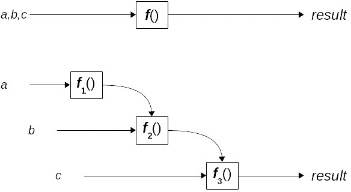
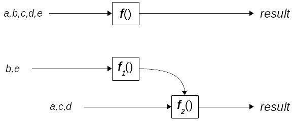
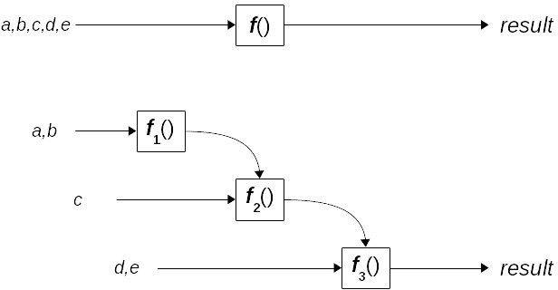

# 函数转换——柯里化和偏应用

在*第六章*“生成函数”中，我们看到了几种操纵函数的方法，以获得功能有所改变的新版本。在本章中，我们将探讨一种特定的转换，一种**工厂方法**，它允许你生成任何给定函数的新版本。

我们将考虑以下内容：

+   **柯里化**：一个经典的 FP 理论函数，它将具有许多参数的函数转换为一串一元函数

+   **偏应用**：这是 FP 中一个历史悠久的变化，通过固定函数的一些参数来产生新的函数版本

+   **部分柯里化**（我自己的名字）：可以看作是前两种转换的混合

本章中的技术将为你提供从其他函数生成函数的不同方法。公平地说，我们还将看到，其中一些技术可以通过简单的箭头函数来模拟，可能更加清晰。然而，由于你可能会在各种关于 FP 的文本和网页中遇到柯里化和偏应用，了解它们的意义和用法是很重要的，即使你选择更简单的方法。我们将在接下来的几节中探讨这些想法的几个应用。

# 一点理论

本章中我们将讨论的概念在某些方面非常相似，在其他方面则相当不同。常常会发现人们对它们的真正含义感到困惑，而且很多网页都误用了术语。你甚至可以说，本章中的所有变化在某种程度上都是大致等价的，因为它们允许你将一个函数转换成另一个函数，该函数固定了一些参数，而其他参数是自由的，最终得到相同的结果。好吧，我同意；这并不非常清楚！所以，让我们先澄清一下，并提供一些简短的定义，我们将在稍后进行扩展。（如果你觉得你的眼睛开始发花了，请跳过这一部分，稍后再回来！）是的，你可能会觉得以下描述有点令人困惑，但请耐心等待——我们将在稍后进行更详细的解释：

+   *柯里化*是将一个*m*元函数（即参数数为*m*的函数）转换为一串*m*个一元函数的过程，每个一元函数接收原始函数的一个参数，从左到右。（第一个函数接收原始函数的第一个参数，并返回一个接收第二个参数的第二个函数，该第二个函数返回一个接收第三个参数的第三个函数，以此类推。）当被一个参数调用时，每个函数都会产生序列中的下一个函数，最后一个函数执行实际的计算。

+   *部分应用* 是向一个 *m* 元函数提供 *n* 个参数，其中 *n* 小于或等于 *m*，将其转换为一个具有 (*m*-*n*) 个参数的函数。每次你提供一些参数，就会产生一个新的函数，具有更小的参数数量。当你提供最后一个参数时，实际的计算将被执行。

+   *部分 Currying* 是前两种思想的结合：你向一个 *m* 元函数提供 *n* 个参数（从左到右），并产生一个新的具有 (*m-n*) 个参数的函数。当这个新函数接收到其他参数时，也是从左到右，它将产生另一个函数。当提供最后一个参数时，函数将执行正确的计算。

在本章中，我们将看到这三种转换，它们需要什么，以及实现它们的方法。

# Currying

我们已经在 *第一章* 的 *箭头函数* 部分，以及 *第三章* 的 *一个参数还是多个参数？* 部分中提到了 *Currying*，但在 *成为函数式编程者* 和 *开始使用函数* 中，我们将更加详细地介绍。Currying 是一种技术，它使你能够只与单变量函数一起工作，即使你需要一个多变量函数。

简称“Currying”？

将多变量函数转换为一系列单变量函数（或者更严格地说，将具有多个操作数的算子减少为单个操作数算子的应用序列）的想法是由 Moses Schönfinkel 研究的。一些作者建议，不一定是在开玩笑，Currying 应该更正确地命名为 *Schönfinkeling*！

在接下来的章节中，我们将首先看到如何处理具有许多参数的函数，然后继续介绍如何手动 Currying 或使用 `bind()`。

## 处理多个参数

Currying 的想法本身很简单。如果你需要一个具有三个参数的函数，你可以使用箭头函数编写如下：

```js
// curryByHand.ts
const make3 = (a: string, b: number, c: string): string =>
  `${a}:${b}:${c}`;
```

或者，你可以有一系列函数，每个函数只有一个参数，如下所示：

```js
// continued...
const make3curried =
  (a: string) => (b: number) => (c: string) =>
    `${a}:${b}:${c}`;
```

或者，你可能想将它们视为嵌套函数，如下面的代码片段所示：

```js
// continued...
const make3curried2 = function (a: string) {
  return function (b: number) {
    return function (c: string) {
      return `${a}:${b}:${c}`;
    };
  };
};
```

在使用方面，使用每个函数的方式有一个本质的区别。虽然你会像通常那样调用第一个，例如 `make3("A",2,"Z")`，但这与第二个定义不兼容。让我们分析一下原因：`make3curried()` 是一个一元（单个参数）函数，所以我们应该写 `make3curried("A")`。但这是什么返回值？根据前面的定义，这也返回一个一元函数——而且那个函数也返回一个一元函数！所以，要得到与三元函数相同的结果的正确调用应该是 `make3curried("A")(2)("Z")`！请参见 *图 7.1*：



图 7.1 – 普通函数与 Currying 等价函数的区别

仔细研究这个例子——我们有一个函数，当我们向它应用一个参数时，我们得到第二个函数。向第二个函数应用参数产生第三个函数，最终应用产生所需的结果。这可以看作是理论计算中的无意义练习，但实际上它带来了一些优势，因为你可以始终使用一元函数，即使你需要更多参数的函数。

柯里化与去柯里化

由于存在柯里化转换，也存在去柯里化转换！在我们的例子中，我们会写 `make3uncurried = (a, b, c) => make3curried(a)(b)(c)` 来逆转柯里化过程，使其再次可用，一次提供所有参数。

在某些语言中，例如 Haskell，函数只能接受单个参数——然而，该语言的语法允许你以允许多个参数的方式调用函数。在我们的例子中，在 Haskell 中，编写 `make3curried "A" 2 "Z"` 将会生成 `"A:2:Z"`，甚至没有人需要意识到这涉及到三个函数调用，每个调用都有一个我们的参数。由于你不需要在参数周围写括号，也不需要用逗号分隔它们，所以你无法知道你提供的是三个单独的值而不是一个三元组。

柯里化在 Scala 或 Haskell 中是基本的，它们是完全函数式语言，但 JavaScript 具有足够的特性，允许我们在工作中定义和使用柯里化。这不会那么容易，因为毕竟它不是内置的——但我们能够处理。

因此，为了回顾基本概念，我们的原始 `make3()` 和 `make3curried()` 函数之间的关键区别如下：

+   `make3()` 是一个三元函数，但 `make3curried()` 是一元函数

+   `make3()` 返回一个字符串；`make3curried()` 返回另一个函数——该函数本身返回第二个函数，该函数返回第三个函数，最终返回一个字符串

+   你可以通过编写类似 `make3("A",2,"Z")` 的内容来生成一个字符串，它返回 `"A:2:Z"`，但你需要编写 `make3curried("A")(2)("Z")` 来得到相同的结果

为什么你要费这么大的力气？让我们看看一个简单的例子，然后我们还会看到更多例子。假设你有一个函数用来计算金额的增值税（VAT），如下所示：

```js
// continued...
const addVAT = (rate: number, amount: number): number =>
  amount * (1 + rate / 100);
addVAT(20, 500); // 600 -- that is, 500 + 20%
addVAT(15, 200); // 230 -- 200 +15%
```

如果你必须应用一个单一的、恒定的税率，你可以将 `addVAT()` 函数柯里化，以产生一个更专业的版本，该版本始终应用你给出的税率。例如，如果你的国家税率是 6%，那么你就可以有如下所示的内容：

```js
// continued...
const addVATcurried =
  (rate: number) =>
  (amount: number): number =>
    amount * (1 + rate / 100);
const addNationalVAT = addVATcurried(6);
addNationalVAT(1500); // 1590 -- 1500 + 6%
```

第一行定义了我们 VAT 计算函数的 curried 版本。给定一个税率，`addVATcurried()`返回一个新的函数，当给定一个金额时，最终将原始税率加到它上面。所以，如果国家税率是 6%，`addNationalVAT()`将是一个将 6%加到它所接收的任何金额上的函数。例如，如果我们计算`addNationalVAT(1500)`，就像前面的代码中那样，结果将是`1590`：$1,500 加上 6%的税。

当然，你有理由说，这种 currying 方法只是为了加 6%的税而有点过度，但简化才是关键。让我们再看一个例子。在你的应用程序中，你可能想使用如下函数添加一些日志：

```js
// continued...
function myLog(severity: string, logText?: string) {
  // display logText in an appropriate way,
  // according to its severity
  // ("NORMAL", "WARNING", or "ERROR")
}
```

然而，使用这种方法，每次你想显示一个正常的日志消息时，你都会写`myLog("NORMAL", "some normal text")`，对于警告，你会写`myLog("WARNING", "some warning text")`。你可以通过以下方式使用 currying 简化这一点，固定`myLog()`的第一个参数，如下所示，使用我们稍后将要看到的`curry()`函数。然后我们的代码可以是这样的：

```js
// continued...
myLog = curry(myLog);
const myNormalLog = myLog("NORMAL");
const myWarningLog = myLog("WARNING");
const myErrorLog = myLog("ERROR");
```

你得到了什么？现在，你可以写`myNormalLog("some normal text")`或`myWarningLog("some warning text")`，因为你已经 curried `myLog()`并固定了它的参数，这使得代码更简单、更容易阅读！

顺便说一句，如果你愿意，你也可以通过一步实现相同的结果，使用原始的非 curried `myLog()`函数，通过逐个 case 进行 currying：

```js
// continued...
const myNormalLog2 = curry(myLog)("NORMAL");
const myWarningLog2 = curry(myLog)("WARNING");
const myErrorLog2 = curry(myLog)("ERROR");
```

所以，有一个`curry()`函数让你可以固定一些参数，同时让其他参数仍然开放；让我们看看如何以三种不同的方式做到这一点。

## 手动 currying

在尝试更复杂的事情之前，我们可以手动 curry 一个函数，而不需要任何特殊的辅助函数或其他任何东西。实际上，如果我们想为特定情况实现 currying，没有必要做复杂的事情，因为我们可以用简单的箭头函数来处理。我们在`make3curried()`和`addVATcurried()`中都看到了这一点，所以没有必要重新审视这个想法。

相反，让我们看看一些自动完成这个任务的方法，这样我们就可以生成任何函数的等效 curried 版本，甚至不需要事先知道它的 arity。更进一步，我们应该编写一个更智能的函数版本，它可以根据接收到的参数数量以不同的方式工作。例如，我们可以有一个`sum(x,y)`函数，其行为如下所示：

```js
sum(3, 5); // 8; did you expect otherwise?
const add3 = sum(3);
add3(5);   // 8
sum(3)(5); // 8
```

我们可以通过手动实现这种行为。我们的函数可能如下所示——由于我们不会使用这种风格，让我们保持使用纯 JavaScript，不使用类型：

```js
// continued...
const sum = (x, y) => {
  if (x !== undefined && y !== undefined) {
    return x + y;
  } else if (x !== undefined && y == undefined) {
    return (z) => sum(x, z);
  } else {  // x,y both undefined
    return sum;
  }
};
```

让我们回顾一下我们在这里做了什么。我们手动编写的 curried 函数具有以下行为：

+   如果我们用两个参数调用它，它将它们相加并返回总和；这提供了我们的第一个用例，就像`sum(3,5)===8`。

+   如果只提供了一个参数，它将返回一个新的函数。这个新函数期望一个参数，并将返回该参数与原始参数的和：这正是我们在其他两个用例中期望的行为，例如`add2(3)===5`或`sum(2)(7)===9`。

+   最后，如果没有提供任何参数，它将返回自身。这意味着如果我们想的话，我们可以写`sum()(1)(2)`。（不，我想不出为什么要写那个。）

因此，我们可以在函数的定义本身中结合柯里化。然而，你必须同意处理每个函数中的所有特殊情况可能会很快变得麻烦且容易出错。所以，让我们找出一些通用的方法来完成相同的结果，而不需要特定的编码。

## 使用 bind()进行柯里化

我们可以通过使用`bind()`方法来找到柯里化的解决方案，这种方法我们在本书的几个地方已经应用过了。这允许我们固定一个参数（或者如果需要的话，可以固定多个参数；在这里我们不需要这么做，但稍后我们会用到它）并提供一个带有这个固定参数的函数。当然，许多库（如 Lodash、Underscore、Ramda 等）都提供了这个功能，但我们想看看如何自己实现它。

### 纯 JavaScript 版本

我们的实现相对较短，但需要一些解释。首先，让我们看看 JavaScript 版本，稍后再处理 TypeScript：

```js
// curry.js
function curry(fn) {
  return fn.length === 0
    ? fn()
    : (x) => curryByBind(fn.bind(null, x));
}
```

首先，要注意`curryByBind()`总是返回一个新的函数，它依赖于作为其参数提供的`fn`函数。如果函数没有（更多）参数（当`fn.length===0`）因为所有参数都已经绑定，我们可以通过使用`fn()`来评估它。否则，函数柯里化的结果将是一个接收单个参数并产生一个新的带有另一个固定参数的柯里化函数的新函数。让我们通过一个详细的例子来看看这个动作，再次使用我们在本章开头看到的`make3()`函数：

```js
// continued...
const make3 = (a, b, c) => `${a}:${b}:${c}`;
// f1 is the curried version of make3
const f1 = curry(make3);
// f2 is a function that will fix make3's 1st parameter
const f2 = f1("A");
// f3 is a function that will fix make3's 2nd parameter
const f3 = f2(2);
// "A2Z" will be now calculated, since we are providing
// the 3rd (last) make3's parameter
const f4 = f3("Z");
console.log(f4);
```

这段代码的解释如下：

+   第一个函数`f1()`还没有收到任何参数。当调用一个参数时，它将产生一个带有固定第一个参数的`make3()`的柯里化版本。

+   调用`f1("A")`会产生一个新的单参数函数`f2()`，它本身将产生一个带有其第一个参数设置为`"A"`的`make3()`的柯里化版本——但实际上，这个新函数最终会固定`make3()`的第二个参数。

+   同样，调用`f2(2)`会产生一个第三个一元函数`f3()`，它将产生一个`make3()`的版本，但固定其第三个参数，因为前两个参数已经被固定了。

+   最后，当我们计算`f3("Z")`时，这会将`make3()`的最后一个参数固定为`"Z"`，由于没有更多的参数了，三次绑定的`make3()`函数被调用，并产生了`"A:2:Z"`的结果。

你也可以做其他的调用序列，例如以下内容：

```js
// continued...
const f2b = f1("TEA")(4);
const f3b = f2b("TWO");
// "TEA:4:TWO"
const f1c = f1("IN")(10)("TION");
// "IN":10:"TION"
```

要手动柯里化函数，你可以使用 JavaScript 的 `.bind()` 方法。顺序如下：

```js
// continued…
const step1 = make3.bind(null, "A");
const step2 = step1.bind(null, 2);
const step3 = step2.bind(null, "Z");
console.log(step3()); // "A:2:Z"
```

在每一步中，我们提供一个额外的参数。（需要 `null` 值以提供上下文。如果这是一个附加到对象上的方法，我们将提供该对象作为 `.bind()` 的第一个参数。由于情况并非如此，因此预期为 `null`。）这与我们的代码所做的工作等效，只是最后一次，`curryByBind()` 实际上进行了计算，而不是像 `step3()` 那样让你去做。

### TypeScript 版本

现在我们已经在 JavaScript 中实现了这个功能，让我们看看如何定义柯里化的类型。我们必须递归地工作并考虑两种情况：

+   如果我们只对一个参数进行柯里化，该函数将直接产生所需的结果

+   如果我们对具有两个或更多参数的函数进行柯里化，我们将创建一个一元函数（具有第一个参数），该函数将返回一个（柯里化！）函数，该函数将处理其余的参数：

```js
// curry.ts
type Curry<P, R> = P extends [infer H]
  ? (arg: H) => R // only 1 arg
  : P extends [infer H, ...infer T] // 2 or more args
  ? (arg: H) => Curry<[...T], R>
  : never;
```

我们将有一个具有两个输入的通用类型：`P`，代表要处理的函数的参数，`R` 代表该函数的结果类型。如果 `P` 只有一个类型 `H`，我们返回一个函数，给定一个 `H` 类型的参数，返回一个 `R` 类型的结果。如果 `P` 由一个 `H` 类型的第一个（“头部”）和一些其他 `T` 类型（“尾部”）组成，我们返回一个函数，该函数将返回一个具有 `T` 类型参数的（柯里化）函数。

使用这种类型有一个额外的复杂性。TypeScript 无法验证我们的 `curryByBind()` 函数是否正确工作，因为它无法推断出，对于每个函数，我们最终会产生一个结果而不是另一个柯里化函数。有一个涉及只有一个签名（*one* signature）的重载函数的巧妙解决方案。关键是实现检查得更宽松，你可以使用 `any` 类型来通过。当然，这样工作并不完全类型安全；你必须确保函数类型正确，因为你实际上绕过了 TypeScript 的检查。在本章中，我们不得不做这类技巧不止一次：

```js
// continued…
function curry<A extends any[], R>(
  fn: (...args: A) => R
): Curry<A, R>;
function curry(fn: (...args: any) => any) {
  return fn.length === 0
    ? fn()
    : (x: any) => curry(fn.bind(null, x));
}
```

让我们回到我们的 `make3()` 示例。类型工作得非常完美：

```js
const f1 = curry(make3);
// (arg: string) => (arg: number) => (arg: string) => string
const f2 = f1("A");
// (arg: number) => (arg: string) => string
const f3 = f2(2);
// (arg: string) => string
const f4 = f3("Z");
// string
```

`f1` 的类型是关键；它表明我们的递归类型工作正如预期。`f2` 和 `f3` 的类型更短，而 `f4` 的类型是最终结果 `string` 的类型。

### 柯里化测试

测试这种转换相对简单，因为柯里化的可能方式并不多：

```js
// curry.test.js
describe("with curry", function () {
  it("you fix arguments one by one", () => {
    const make3a = curry(make3);
    const make3b = make3a("A")(2);
    const make3c = make3b("Z");
    expect(make3c).toBe(make3("A", 2, "Z"));
  });
});
```

你还能测试什么？也许可以添加只有一个参数的函数，但已经没有更多可以尝试的了。

# 部分应用

我们将要考虑的第二种转换允许你固定函数的一些参数，创建一个新的函数，该函数将接收其余的参数。让我们用一个无意义的例子来说明这一点。假设你有一个有五个参数的函数。你可能想要固定第二个和第五个参数，部分应用将生成一个新的函数版本，固定这两个参数，但留下其他三个参数开放供新的调用。如果你用三个必需的参数调用这个结果函数，它将通过使用原始的两个固定参数加上新提供的三个参数来产生正确的答案。

投影参数

在函数应用中仅指定一些参数，生成剩余参数的函数，这种思想被称为**投影**：你可以说你在将函数投影到剩余的参数上。我们不会使用这个术语，但我想在你在其他地方找到它时引用它。

让我们考虑一个使用`fetch()` API 的例子，它被广泛认为是进行 Ajax 调用的现代方式。你可能想要获取多个资源，始终为调用指定相同的参数（例如，请求头）并且只更改搜索的 URL。通过使用部分应用，你可以创建一个新的`myFetch()`函数，该函数将始终提供固定参数。

在获取数据

你可以在[developer.mozilla.org/en-US/docs/Web/API/Fetch_API/Using_Fetch](http://developer.mozilla.org/en-US/docs/Web/API/Fetch_API/Using_Fetch)上了解更多关于`fetch()`的信息。根据[caniuse.com/#search=fetch](http://caniuse.com/#search=fetch)，你可以在除（哦，惊喜！）Internet Explorer 之外的大多数浏览器中使用它，但你可以通过 polyfill 来绕过这个限制，例如在[github.com/github/fetch](http://github.com/github/fetch)上找到的一个。

假设我们有一个`partial()`函数实现了这种应用，让我们看看我们如何使用它来产生我们新的、专门的`fetch()`版本：

```js
const myFetch = partial(fetch, undefined, myParameters);
// undefined means the first argument for fetch
// is not yet defined; the second argument for
// fetch() is set to myParameters
myFetch("a/first/url")
  .then(/* do something */)
  .catch(/* on error */);
myFetch("a/second/url")
  .then(/* do something else */)
  .catch(/* on error */);
```

如果请求参数是`fetch()`的第一个参数，柯里化（currying）将有效。（我们稍后会更多地说到参数的顺序。）使用部分应用，你可以替换任何参数，无论哪个，所以在这种情况下，`myFetch()`最终成为一个一元函数。这个新函数将获取你想要的任何 URL 的数据，始终传递相同的参数集进行`GET`操作。

## 使用箭头函数进行部分应用

尝试手动进行部分应用，就像我们处理柯里化（currying）那样，过于复杂。例如，对于一个有 5 个参数的函数，你需要编写代码，允许用户提供 32 种可能的固定和未固定参数组合——32 等于 2 的 5 次方。即使你可以简化问题，编写和维护代码仍然会很困难。参见*图 7**.2*，展示了许多可能的组合之一：



图 7.2 – 部分应用可以先提供一些参数，然后提供剩余的参数，最终得到结果

然而，使用箭头函数进行部分应用要简单得多。以我们之前提到的例子为例，我们会有以下代码。在这种情况下，我们将假设我们想要将第二个参数固定为`22`，第五个参数固定为`1960`：

```js
const nonsense = (a, b, c, d, e) =>
  `${a}/${b}/${c}/${d}/${e}`;
const fix2and5 = (a, c, d) => nonsense(a, 22, c, d, 1960);
```

以这种方式进行部分应用相当简单，尽管我们可能想要找到一个更通用的解决方案。你可以通过从先前的函数中创建一个新的函数并固定更多的参数来设置任意数量的参数。（正如*第六章*，*生成函数*中提到的，可以使用包装器。）例如，你现在可能还想要将新函数`fix2and5()`的最后一个参数固定为`9`，如下面的代码所示；这没有什么更简单的了：

```js
const fixLast = (a, c) => fix2and5(a, c, 9);
```

如果你愿意，你也可以写成`nonsense(a, 22, c, 9, 1960)`，但事实仍然是，使用箭头函数固定参数很简单。现在，让我们考虑我们所说的更通用的解决方案。

## 使用闭包进行部分应用

如果我们想要能够固定任何参数组合的部分应用，我们必须有一种方法来指定哪些参数将被保留为自由参数，哪些参数将从该点开始固定。一些库，如 Underscore 和 Lodash，使用一个特殊的对象`_`来表示省略的参数。以这种方式，仍然使用相同的`nonsense()`函数，我们会编写以下内容：

```js
const fix2and5 = _.partial(nonsense)(_, 22, _, _, 1960);
```

我们可以通过有一个表示待定、尚未固定的参数的全局变量来做同样的事情，但让我们让它更简单，只用`undefined`来表示缺失的参数。

小心比较

在检查`undefined`时，请记住始终使用`===`运算符；使用`==`时，`null==undefined`会发生，你不想这样。有关更多信息，请参阅[developer.mozilla.org/en-US/docs/Web/JavaScript/Reference/Global_Objects/undefined](http://developer.mozilla.org/en-US/docs/Web/JavaScript/Reference/Global_Objects/undefined)。

我们想要编写一个函数，它将部分应用一些参数，并将剩余的参数留待将来使用。我们希望编写的代码类似于以下内容，并以与之前箭头函数相同的方式生成一个新的函数：

```js
const nonsense = (a, b, c, d, e) =>
  `${a}/${b}/${c}/${d}/${e}`;
const fix2and5 = partial(nonsense)(
  undefined,
  22,
  undefined,
  undefined,
  1960
);
// fix2and5 would become
//     (X0, X2, X3) => nonsense(X0, 22, X2, X3, 1960);
```

我们将如何实现这一点？我们的实现将使用闭包。（你可能需要回顾一下*第一章*，*成为函数式开发者*。）这种部分应用的方式在某种程度上类似于柯里化，因为每个函数都会产生一个新的函数，并带有更多的固定参数。我们新的实现将如下所示——而且，让我们再次从纯 JavaScript 开始：

```js
// partial.js
function partial(fn) {
  const partialize =
    (...args1) =>
    (...args2) => {
      for (
        let i = 0;
        i < args1.length && args2.length;
        i++
      ) {
        if (args1[i] === undefined) {
          args1[i] = args2.shift();
        }
      }
      const allParams = [...args1, ...args2];
      return allParams.includes(undefined) ||
        allParams.length < fn.length
        ? partialize(...allParams)
        : fn(...allParams);
    };
  return partialize();
}
```

哇——一段相当长的代码！关键是内部的`partialize()`函数。给定一个参数列表（`args1`），它产生一个接收第二个参数列表（`args2`）的函数：

+   首先，它将`args1`中所有可能的`undefined`值替换为`args2`中的值

+   然后，如果`args2`中还有任何参数，它也将它们追加到`args1`的参数中，生成`allParams`

+   最后，如果`allParams`不再包含任何`undefined`值并且足够长，它将调用原始函数

+   否则，它将部分化自身以等待更多的参数

一个例子会使它更清楚。让我们回到我们信任的`make3()`函数，并构建它的部分版本：

```js
const make3 = (a: string, b: number, c: string): string =>
  `${a}:${b}:${c}`;
const f0 = partial(make3);
const f1 = f0(undefined, 2);
```

`f1()`函数接收`[undefined, 2]`作为参数。现在，让我们创建一个新的函数：

```js
const f2 = f1("A");
```

发生了什么？先前的参数列表（`[undefined, 2]`）与新列表（一个元素——在这种情况下，`["A"]`）合并，生成一个现在接收`"A"`和`2`作为其前两个参数的函数。然而，这还不是最终的，因为原始函数需要三个参数。我们可以写出以下内容：

```js
const f3 = f2("Z");
```

然后，当前参数列表将与新参数合并，生成`["A",2,"Z"]`。由于列表现在完整，原始函数将被评估，生成`"A:2:Z"`作为最终结果。

这段代码的结构与其他我们在*柯里化与* *bind()*部分写过的其他高阶函数有显著的相似之处：

+   如果所有参数都已提供，将调用原始函数

+   否则，如果还需要一些参数（在柯里化时，这只是一个通过检查函数的`length`属性来计数参数的问题；在部分应用时，你还必须考虑存在一些`undefined`参数的可能性），高阶函数会调用自身以产生函数的新版本，该版本将等待缺失的参数

现在让我们来看一个带有其数据类型的 TypeScript 版本。

### 部分数据类型

我们将使用一个辅助类型，`Partialize<P,A>`。如果`P`是函数参数类型的元组，而`A`是函数调用参数类型的元组，`Partialize<>`将返回一个元组，其中包含`P`中在`A`中有`undefined`类型的类型：

```js
// partial.ts
type Partialize<
  P extends any[],
  A extends any[]
> = 0 extends P["length"]
  ? []
  : 0 extends A["length"]
  ? P
  : [P, A] extends [
      [infer PH, ...infer PT],
      [infer AH, ...infer AT]
    ]
  ? AH extends undefined
    ? [PH, ...Partialize<PT, AT>]
    : [...Partialize<PT, AT>]
  : never;
```

这是如何工作的？

+   如果`P`为空，输出也是空的。

+   如果`A`为空（没有更多的参数），输出是`P`。

+   如果`P`被分成`PH`（头部）和`PT`（尾部），并且`A`也被类似地分成`AH`和`AT`，那么如果`AH`是`undefined`，我们返回一个新类型，它包括`PH`（因为没有为其提供值）和`Partialize<PT,AT>`，以递归处理这两个元组的其余部分。否则，如果`AH`不是`undefined`，我们为相应的参数提供一个值，因此结果是`Partialize<PT,AT>`；我们不必关心与`PH`对应的参数。

使用递归使得这更难理解；让我们看看一些例子：

```js
// continued...
type p00 = Partialize<
  [boolean, number, string],
  [undefined, undefined, undefined]
>; // [boolean, number, string]
type p01 = Partialize<
  [boolean, number, string],
  [boolean, undefined, undefined]
>; // [number, string]
type p02 = Partialize<
  [boolean, number, string],
  [undefined, string, undefined]
>; // [boolean, string]
type p03 = Partialize<
  [boolean, number, string],
  [undefined, undefined, string]
>; // [boolean, number]
type p04 = Partialize<
  [boolean, number, string],
  [boolean, undefined, string]
>; // [number]
type p05 = Partialize<[boolean, number, string], [boolean]>;
// [number, string]
type p06 = Partialize<[boolean, number, string], []>;
// [boolean, number, string]
```

例如，`p04` 类型表明，如果你有一个期望三个参数（`boolean`、`number` 和 `string`）的函数，并且你用 `boolean`、`undefined` 值和 `string` 调用它，那么偏应用后的函数将只有一个 `number` 参数。`p05` 类型表明，如果你只使用 `boolean` 调用该函数，那么偏应用后的函数将有 `number` 和 `string` 作为参数。

然而，这并不完全正确。假设我们写的是以下内容：

```js
type p04 = Partialize<
  [boolean, number, string],
  [string, undefined, number]
>; // [number]
```

结果将是相同的；我们正在检查我们是否有正确数量的参数，但不是它们的类型。让我们再做一个辅助类型检查：

```js
// continued...
type TypesMatch<
  P extends any[],
  A extends any[]
> = 0 extends P["length"]
  ? boolean
  : 0 extends A["length"]
  ? boolean
  : [P, A] extends [
      [infer PH, ...infer PT],
      [infer AH, ...infer AT]?
    ]
  ? AH extends undefined
    ? TypesMatch<PT, AT>
    : PH extends AH
    ? TypesMatch<PT, AT>
    : never
  : never;
```

`TypesMatch` 获取两个类型列表 `P` 和 `A`：

+   如果任何一个列表为空，那没关系。

+   如果两个列表都不为空，它将它们分为头部和尾部，分别记为 `PH` 和 `PT`，以及 `AH` 和 `AT`。如果 `AH` 是 `undefined`，或者如果它与 `PH` 匹配，那么 `TypesMatch<>` 将继续分析两个尾部。

+   如果 `AH` 不是 `undefined` 但不匹配 `PH`，将生成 `never`（这表示错误）。

现在我们可以使用这个辅助定义来编写 `Partial<>` 泛型类型：

```js
// continued...
type Partial<P extends any[], R> = <A extends any[]>(
  ...x: A
) => TypesMatch<P, A> extends never
  ? never
  : P extends any[]
  ? 0 extends Partialize<P, A>["length"]
    ? (...x: [...P]) => R
    : Partial<Partialize<P, A>, R>
  : never;
```

在这里，`P` 代表函数参数的类型，`R` 代表其结果类型，`A` 代表函数参数的类型。我们首先检查 `P` 和 `A` 是否匹配类型。如果是这样，如果 `Partialize<P,A>` 为空，我们返回一个 `(...x: [...P]) => R` 函数；否则，我们（递归地）返回一个具有 `Partialize<P,A>` 参数类型的函数。

最后，我们拥有了编写 TypeScript 版本的 `partial()` 所需的一切：

```js
// continued...
function partial<P extends any[], R>(
  fn: (...a: P) => R
): Partial<P, R>;
function partial(fn: (...a: any) => any) {
  const partialize =
    (...args1: any[]) =>
    (...args2: any[]) => {
      for (
        let i = 0;
        i < args1.length && args2.length;
        i++
      ) {
        if (args1[i] === undefined) {
          args1[i] = args2.shift();
        }
      }
      const allParams = [...args1, ...args2];
      return allParams.includes(undefined) ||
        allParams.length < fn.length
        ? partialize(...allParams)
        : fn(...allParams);
    };
  return partialize();
}
```

值得注意的是，正如在柯里化示例中一样，我们使用了多个 `any` 类型，因为 TypeScript 并非特别擅长处理递归。这意味着我们必须格外小心我们的代码，因为将无法检测到错误。

### 偏测试

让我们通过编写一些测试来完成这个部分。以下是我们应该考虑的一些事情：

+   当我们进行偏应用时，产生的函数的 arity 应该减少

+   当参数顺序正确时，应该调用原始函数

我们可以写点像下面这样的东西，允许在不同位置修复参数。而不是使用间谍或模拟，我们可以直接与 `nonsense()` 函数一起工作，因为它相当高效：

```js
// partial.test.ts
function nonsense(
  a: number,
  b: number,
  c: number,
  d: number,
  e: number
) {
  return `${a}/${b}/${c}/${d}/${e}`;
}
describe("with partial()", function () {
  it("you could fix no arguments", () => {
    const nonsensePC0 = partial(nonsense);
    expect(nonsensePC0(0, 1, 2, 3, 4)).toBe(
      nonsense(0, 1, 2, 3, 4)
    );
  });
  it("you could fix only some initial arguments", () => {
    const nonsensePC1 = partial(nonsense)(1, 2, 3);
    expect(nonsensePC1(4, 5)).toBe(nonsense(1, 2, 3, 4,
      5));
  });
  it("you could skip some arguments", () => {
    const nonsensePC2 = partial(nonsense)(
      undefined,
      22,
      undefined,
      44
    );
    expect(nonsensePC2(11, 33, 55)).toBe(
      nonsense(11, 22, 33, 44, 55)
    );
  });
  it("you could fix only some last arguments", () => {
    const nonsensePC3 = partial(nonsense)(
      undefined,
      undefined,
      undefined,
      444,
      555
    );
    expect(nonsensePC3(111, 222, 333)).toBe(
      nonsense(111, 222, 333, 444, 555)
    );
  });
  it("you could fix ALL the arguments", () => {
    const nonsensePC4 = partial(nonsense)(6, 7, 8, 9, 0);
    expect(nonsensePC4).toBe(nonsense(6, 7, 8, 9, 0));
  });
  it("you could work in steps - (a)", () => {
    const nonsensePC5 = partial(nonsense);
    const nn = nonsensePC5(undefined, 2, 3);
    const oo = nn(undefined, undefined, 5);
    const pp = oo(1, undefined);
    const qq = pp(4);
    expect(qq).toBe(nonsense(1, 2, 3, 4, 5));
  });
  it("you could work in steps - (b)", () => {
    const nonsensePC6 = partial(nonsense)(undefined, 2, 3)(
      undefined,
      undefined,
      5
    )(
      1,
      undefined
    )(4);
    expect(nonsensePC6).toBe(nonsense(1, 2, 3, 4, 5));
  });
});
```

我们现在已经看到了柯里化和偏应用；让我们看看我们的第三个也是最后一个转换，它是我们之前方法的混合体。

# 偏柯里化

我们将要看的最后一个转换是柯里化和偏应用的混合体。如果你在谷歌上搜索它，你会在一些地方找到它被称为柯里化，在其他地方被称为偏应用，但事实上，它既不是柯里化也不是偏应用，所以我站在中间，称之为 *偏柯里化*！

给定一个函数，我们的想法是固定其前几个参数，并产生一个新的函数，该函数将接收其余的参数。然而，如果这个新函数接收到的参数更少，它将固定所提供的参数，并产生一个新的函数来接收其余的参数，直到所有参数都给出，最终结果可以计算。参见 *图 7.3**.3*：



图 7.3 – 部分柯里化是柯里化和部分应用的混合。你可以提供任意数量的参数，从左侧开始，直到所有参数都提供，然后计算结果

为了查看一个例子，让我们回到我们在前几节中使用过的 `nonsense()` 函数，如下所示。假设我们已经有了一个 `partialCurry()` 函数：

```js
const nonsense = (a, b, c, d, e) =>
  `${a}/${b}/${c}/${d}/${e}`;
const pcNonsense = partialCurry(nonsense);
const fix1And2 = pcNonsense(9, 22);
// fix1And2 is now a ternary function
const fix3 = fix1And2(60);
// fix3 is a binary function
const fix4and5 = fix3(12, 4);
// fix4and5 === nonsense(9,22,60,12,4), "9/22/60/12/4"
```

原始函数的元数是 `5`。当我们对那个函数进行部分柯里化并给它提供 `9` 和 `22` 参数时，它变成了一个三元函数，因为从原始的五个参数中，有两个已经固定。如果我们给那个三元函数提供一个单一参数 `(60)`，结果又是另一个函数：在这种情况下，是一个二元函数，因为我们现在已经固定了原始五个参数中的前三个。最后的调用，提供最后两个参数，然后执行实际计算所需结果的职责。

与柯里化和部分应用有一些共同点，但也有一些差异，如下所示：

+   原始函数被转换成一系列函数，每个函数都产生下一个函数，直到系列中的最后一个函数实际上执行其计算。

+   你总是从第一个参数（最左侧的一个）开始提供参数，就像柯里化一样，但你可以提供多个参数，就像部分应用一样。

+   当进行函数柯里化时，所有中间函数都是一元的，但在部分柯里化中，并不一定如此。然而，如果我们每次都提供一个参数，那么结果将需要与普通柯里化一样多的步骤。

因此，我们有我们的定义——现在让我们看看我们如何实现我们新的高阶函数；我们可能会在这个章节的上一节中重新使用一些概念。

## 使用 `bind()` 进行部分柯里化

与我们之前对柯里化所做的一样，部分柯里化有一个简单的方法。我们将利用 `bind()` 实际上可以同时固定多个参数的事实，并且我们首先查看 JavaScript 代码以增强清晰度：

```js
// partialCurry.js
function partialCurry(fn) {
  return fn.length === 0
    ? fn()
    : (...x) => partialCurry(fn.bind(null, ...x));
}
```

将代码与之前的 `curry()` 函数进行比较，你会看到主要但非常小的差异：

```js
function curry(fn) {
  return fn.length === 0
    ? fn()
    : (x) => curry(fn.bind(null, x));
}
```

机制完全相同。唯一的区别在于，在我们的新函数中，我们可以同时绑定多个参数，而在 `curry()` 中，我们总是只绑定一个。

在某种意义上，TypeScript 版本类似于 `partial()` 的版本。提供的参数必须与原始函数参数的类型匹配，因此我们将再次使用上一节中的 `TypesMatch<>` 类型。如果原始函数有多个参数，而我们只提供了其中几个，我们需要找出剩余的参数——我们的 `Minus<>` 类型将完成这项工作：

```js
// partialCurry.ts
type Minus<X, Y> = [X, Y] extends [
  [any, ...infer XT],
  [any, ...infer YT]
]
  ? Minus<XT, YT>
  : X;
```

基本上，如果两种类型都有多个元素，我们忽略第一个，并处理两种类型的尾部；否则，我们返回第一个。有了这个，我们可以编写 `PartialCurry<>` 类型：

```js
// partialCurry.ts
type PartialCurry<P extends any[], R> = <A extends any[]>(
  ...x: A
) => TypesMatch<P, A> extends never
  ? never
  : P extends any[]
  ? A["length"] extends P["length"]
    ? R
    : PartialCurry<Minus<P, A>, R>
  : never;
```

如果类型不匹配（提供了错误类型参数），结果将是错误，`never`。否则，如果我们提供了足够的参数，将产生原始的 `R` 结果类型；如果没有，我们将通过递归使用 `Minus<>` 产生一个参数更少的新的函数。

我们可以回顾一下之前的例子，使用 `make3()` 函数，唯一的区别是我们可以在更少的步骤中获取结果——或者更多，就像那个有点无意义的 `h7` 示例一样！

```js
const h1 = partialCurryByBind(make3);
const h2 = h1("A");
const h3 = h2(2, "Z");
console.log(h3); // A:2:Z
const h5 = h1("BE", 4);
const h6 = h5("YOU");
console.log(h6); // BE:4:YOU
const h7 = h5()()()("ME");
console.log(h7); // B:4:ME
```

顺便说一下，为了了解现有的可能性，你可以在柯里化时固定一些参数，如下所示：

```js
const h8 = partialCurryByBind(make3)("I",8);
const h9 = h8("SOME");
console.log(h9); // I:8:SOME
```

测试这个函数很容易，我们提供的例子是一个非常好的起点。然而，请注意，由于我们允许固定任意数量的参数，我们无法测试中间函数的参数数量。我们的测试可能如下所示：

```js
// partialCurry.test.ts
describe("with partialCurryByBind", function () {
  it("you could fix arguments in several steps", () => {
    const make3a = partialCurryByBind(make3);
    const make3b = make3a("MAKE", 1);
    const make3c = make3b("TRY");
    expect(make3c).toBe(make3("MAKE", 1, "TRY"));
  });
  it("you could fix arguments in a single step", () => {
    const make3a = partialCurryByBind(make3);
    const make3b = make3a("SET", 2, "IT");
    expect(make3b).toBe(make3("SET", 2, "IT"));
  });
  it("you could fix ALL the arguments", () => {
    const make3all = partialCurryByBind(make3);
    expect(make3all("SOME", 1, "KNOWS")).toBe(
      make3("SOME", 1, "KNOWS")
    );
  });
  it("you could fix one argument at a time", () => {
    const make3one =
      partialCurryByBind(make3)("READY")(2)("GO");
    expect(make3one).toBe(make3("READY", 2, "GO"));
  });
});
```

## 使用闭包进行部分柯里化

与部分应用类似，有一个解决方案可以与闭包一起使用。既然我们已经讨论了许多必要的细节，让我们直接进入代码，首先是 JavaScript 版本：

```js
// partialCurry.js
const partialCurryByClosure = (fn) => {
  const curryize =
    (...args1) =>
    (...args2) => {
      const allParams = [...args1, ...args2];
      return allParams.length < fn.length
        ? curryize(...allParams)
        : fn(...allParams);
    };
  return curryize();
};
```

如果你比较 `partialCurryByClosure()` 和 `partial()`，主要区别在于，在部分柯里化中，由于我们总是从左侧提供参数，并且无法跳过某些参数，所以你会将已有的参数与新参数连接起来，并检查是否足够。如果新的参数列表达到了原始函数期望的参数数量，你可以调用它并得到最终结果。在其他情况下，你只需使用 `curryize()`（在 `partial()` 中，我们有一个类似的 `partialize()` 函数）来获取一个新的中间函数，该函数将等待更多的参数。

使用 TypeScript，我们不需要任何新的类型，因为函数只是以不同的方式（内部）工作，但产生相同的结果：

```js
// partialCurry.ts
function partialByClosure<P extends any[], R>(
  fn: (...a: P) => R
): PartialCurry<P, R>;
function partialByClosure(fn: (...a: any) => any) {
  const curryize =
    (...args1: any[]) =>
    (...args2: any[]) => {
      const allParams = [...args1, ...args2];
      return allParams.length < fn.length
        ? curryize(...allParams)
        : fn(...allParams);
    };
  return curryize();
}
```

结果与上一节完全相同，所以不值得重复。你可以更改我们编写的测试，使用 `partialCurryByClosure()` 而不是 `partialCurryByBind()`，它们将正常工作。

# 最后的想法

让我们以一些简短的主题结束这一章。首先，我们应该考虑如何将本章的方法应用于具有可变数量参数的函数——这不是一个简单的问题，因为我们看到的所有代码都强烈依赖于函数的参数数量。

然后，我们将以两个关于柯里化和部分应用的哲学思考结束，这可能会引起一些讨论：

+   首先，许多库在参数顺序上都是错误的，这使得它们更难使用

+   其次，我通常甚至不使用本章中的高阶函数，而是追求更简单的 JavaScript 代码

这可能不是你现在所期望的，所以让我们首先解决具有未知数量的参数的函数的问题，然后更详细地讨论最后两点，这样你就会看到这并不是 *do as I say, not as I do*... 或是库的做法！

## 可变数量的参数

我们如何处理允许变量（可能未定义、不确定）数量的参数的函数？这是一个问题，因为我们在本章中开发的全部代码都依赖于 `fn.length`，即要处理的函数的元数。你可能想要柯里化 `reduce()` 函数，但你发现它的元数是 `1`，所以柯里化后的函数不会接受第二个参数。另一个例子：你可能有一个 `sumAll()` 函数如下，并且你想要对其应用 `partial()` 并得到一个具有三个参数的函数，但 `sumAll.length` 是 `0`，因为它的所有参数都是可选的：

```js
const sumAll = (...args: number[]): number =>
  args.reduce((x, y) => x + y, 0);
```

在本书的前两版中，我向 `curry()` 和其他函数添加了一个额外的参数，以便我可以覆盖输入函数的 `length` 属性：

```js
const curry = (fn, len = fn.length) =>
  len === 0
    ? fn()
    : (p) => curry(fn.bind(null, p), len - 1);
```

然而，目前我认为这并不是最好的方法。首先，TypeScript 无法理解函数将有多少个参数，这并不好。其次，我们实际上并不需要这个！根据我们在上一章 *Arity changing* 部分中看到的函数，如果你有一个 `fn()` 函数，你只想对其柯里化两个参数，你可以这样做 `curry(binary(fn))` – 这就解决了问题！

我认为组合函数比调整现有的良好实现更好，所以从现在开始，我推荐这种新的方法。请查看本章后面的 *Being functional* 部分，以了解更多关于这种用法的示例。

## 参数顺序

有一个问题不仅存在于像 Underscore 或 Lodash 的 `_.map(list, mappingFunction)` 或 `_.reduce(list, reducingFunction, initialValue)` 这样的函数中，也存在于我们在这本书中产生的某些函数中，例如 `demethodize()` 的结果。例如，请参阅 *第六章* 的 *Demethodizing – turning methods into functions* 部分，以回顾那个高阶函数。问题是它们的参数顺序实际上并不能帮助进行柯里化。

当柯里化一个函数时，你可能想要存储中间结果。当我们像以下代码中所做的那样做某事时，我们假设你将使用固定的参数重新使用柯里化函数，这意味着原始函数的第一个参数最不可能改变。现在让我们考虑一个具体的情况。回答这个问题：你更有可能使用`map()`将相同的函数应用于几个不同的数组，还是将几个不同的函数应用于同一个数组？在验证或转换的情况下，前者更有可能，但这不是我们得到的结果！

我们可以编写一个简单的函数来翻转二进制函数的参数，如下所示：

```js
const flip2 = fn => (p1, p2) => fn(p2, p1);
```

使用这个，你可以编写如下代码：

```js
const myMap = curry(flip2(demethodize(map)));
const makeString = (v) => String(v);
const stringify = myMap(makeString);
let x = stringify(anArray);
let y = stringify(anotherArray);
let z = stringify(yetAnotherArray);
```

最常见的用例是您将想要将函数应用于几个不同的列表；库函数和我们的非方法化函数都不能提供这一点。然而，通过使用`flip2()`，我们可以按照我们喜欢的风格工作。

（是的，在这个特定的情况下，我们可能通过使用偏应用而不是柯里化来解决我们的问题；通过这种方式，我们可以将`map()`的第二个参数固定，而无需进一步麻烦。然而，翻转参数以产生具有不同参数顺序的新函数也是一种常用的技术，你必须对此有所了解。）

对于像`reduce()`这样的情况，它通常接收三个参数（列表、函数和初始值），我们可能会选择这样做：

```js
const flip3 = (fn) => (p1, p2, p3) => fn(p2, p3, p1);
const myReduce = partialCurry(
  flip3(demethodize(Array.prototype.reduce))
);
const sum = (x, y) => x + y;
const sumAll = myReduce(sum, 0);
sumAll(anArray);
sumAll(anotherArray);
```

在这里，我们使用了偏柯里化来简化`sumAll()`的表达式。另一种选择是使用常规柯里化，然后我们会定义`sumAll = myReduce(sum)(0)`。

如果你想使用更神秘的参数重新排列函数，也可以，但你通常不需要比这两个更多的函数。对于真正复杂的情况，你可能会选择使用箭头函数（就像我们在定义`flip2()`和`flip3()`时做的那样）并清楚地说明你需要什么样的重新排序。

## 成为函数式编程者

现在我们即将结束本章，一个坦白是必要的：我并不总是使用柯里化和偏应用，就像之前展示的那样！不要误解我，我确实应用了这些技术——但有时它们会使代码更长、不那么清晰，并不一定更好。让我向你展示我是说什么。

如果我正在编写自己的函数，然后我想将其柯里化以固定第一个参数，与箭头函数相比，柯里化、偏应用或偏柯里化实际上并没有太大区别。我必须编写以下内容：

```js
const myFunction = (a, b, c) => { ... };
const myCurriedFn = curry(myFunction)(fix1st);
// and later in the code...
myCurriedFn(set2nd)(set3rd);
```

在同一行中将函数柯里化并给它一个第一个参数可能被认为不是很清晰；另一种方法需要添加一个变量和一行额外的代码。然而，未来的调用也不是很好；然而，偏柯里化使其更加直接，例如`myPartiallyCurriedFn(set2nd, set3rd)`。

在任何情况下，当我将最终代码与箭头函数的使用进行比较时，我认为其他解决方案并不真的更好；请对你下面的样本进行自己的评估：

```js
const myFunction = (a, b, c) => { ... };
const myFixedFirst = (b, c) => myFn(fix1st, b, c);
// and later...
myFixedFirst(set2nd, set3rd);
```

我认为柯里化和偏应用相当好的地方在于我的小型去方法化、预柯里化的基本高阶函数库。我有一套自己的函数，如下所示：

```js
const _plainMap = demethodize(Array.prototype.map);
const myMap = curry(binary(_plainMap));
const myMapX = curry(flipTwo(_plainMap));
const _plainReduce = demethodize(Array.prototype.reduce);
const myReduce = curry(ternary(_plainReduce));
const myReduceX = curry(flip3(_plainReduce));
const _plainFilter = demethodize(Array.prototype.filter);
const myFilter = curry(binary(_plainFilter));
const myFilterX = curry(flipTwo(_plainFilter));
// ...and more functions in the same vein
```

关于这段代码，以下是一些需要注意的点：

+   我将这些函数放在一个单独的模块中，并且只导出名为`myXXX()`的函数。

+   其他函数是私有的，我使用前导下划线来提醒自己。

+   我使用`my...`前缀来记住这些是我的函数，而不是正常的 JavaScript 函数。有些人可能更喜欢保留熟悉的名字，如`map()`或`filter()`，但我更喜欢独特的名字。

+   由于大多数 JavaScript 方法都有可变参数数量，我在*可变数量参数*部分描述了如何解决这个问题。

+   我总是为`reduce()`函数提供第三个参数（累加的初始值），因此我为该函数选择的是`3`个参数。

+   当对翻转函数进行柯里化时，你不需要指定参数数量，因为翻转已经为你做了这件事。

最终，这都归结于个人决定；尝试本章中我们探讨的技术，看看你更喜欢哪一种！

# 摘要

在本章中，我们考虑了一种通过以几种不同的方式将参数固定到现有函数上来产生函数的新方法：柯里化，它最初来自计算机理论；偏应用，它更灵活；以及偏柯里化，它结合了前两种方法的优点。使用这些转换，你可以简化你的编码，因为你可以在不费事的情况下生成更专业的通用函数版本。

在*第八章* *连接函数*中，我们将回顾我们在纯函数章节中探讨的一些概念，并考虑确保函数不会意外变得不纯的方法，通过寻找使它们的参数不可变的方法，使它们无法被修改。

# 问题

7.1 `sum()`函数，我们可以写成`sum()(3)(5)`并得到`8`。但如果我们写成`sum(3)()(5)`会发生什么呢？

7.2 `sumMany()`函数允许你以以下方式对不确定数量的数字进行求和。请注意，当函数没有参数被调用时，返回求和结果：

```js
let result = sumMany(9)(2)(3)(1)(4)(3)();
// 22
```

7.3 `eval()` – 是的，那个不安全、危险的`eval()`！如果你愿意避免`eval()`可能带来的潜在安全头痛，你可以用它来转换如下函数：

```js
const make3 = (a: string, b: number, c: string): string =>
  `${a}:${b}:${c}`;
```

你可以将其转换为柯里化等价形式：

```js
const make3curried = x1 => x2 => x3 => make3(x1, x2, x3);
```

尝试一下！提示：使用我们在 *第五章* 的 *使用范围* 部分中编写的 `range()` 函数，可能会缩短你的代码。另外，记住 `fn.length` 会告诉你 `fn()` 函数的参数数量。

7.4 `unCurry(fn, arity)` 函数接收一个（柯里化的）函数及其预期参数数量作为参数，并返回 `fn()` 的非柯里化版本——即一次接收所有参数并产生结果的函数（需要预期参数数量，因为你无法自己确定它）：

```js
const make3 = (a, b, c) => String(100 * a + 10 * b + c);
const make3c = curry(make3);
console.log(make3c(1)(2)(3)); // 123
const remake3 = uncurry(make3c, 3);
console.log(remake3(1, 2, 3)); // 123
```

7.5 `(a) => (b) => (c) => result`。然而，如果你使用部分柯里化，还有更多使用它的方法：(a,b) => (c) => result，(a) => (b,c) => result，甚至 (a,b,c) => result。你有多少种方式可以使用具有 *n* 个参数的部分柯里化函数？

7.6 在 `Function.prototype` 中提供一个 `curry()` 方法，使其像我们在本章中看到的 `curry()` 函数一样工作。完成以下代码应该会产生以下结果：

```js
Function.prototype.curry = function () {
  // ...your code goes here...
};
const sum3 = (a, b, c) => 100 * a + 10 * b + c;
sum3.curry()(1)(2)(4); // 124
const sum3C = sum3.curry()(2)(2);
sum3C(9); // 229
```

7.7 如果首先对两个或更多参数进行了测试，`Curry<>` 类型可以用一种等效但更简洁的方式编写。你能实现这个更改吗？

7.8 `Curry<>` 类型，我们通过编写 `P extends [infer H]` 来测试是否提供了一个单个参数——你能重写代码以使用 `["length"]` 吗？提示：我们在定义 `Partial<>` 类型时做过类似的事情：

```js
type Curry<P, R> = P extends [infer H]
  ? (arg: H) => R // only 1 arg
  : P extends [infer H, ...infer T] // 2 or more args
  ? (arg: H) => Curry<[...T], R>
  : never;
```

7.9 `applyStyle()` 函数将允许你以以下方式对字符串应用基本样式。可以使用柯里化或部分应用：

```js
const makeBold = applyStyle("b");
document.getElementById("myCity").innerHTML =
  makeBold("Montevideo");
// <b>Montevideo</b>, to produce Montevideo
const makeUnderline = applyStyle("u");
document.getElementById("myCountry").innerHTML =
  makeUnderline("Uruguay");
// <u>Uruguay</u>, to produce Uruguay
```

7.10 **神秘问题函数**：以下故意以不友好的方式编写的函数实际上做什么？

```js
const what = (who) => (...why) => who.length <= why.length
  ? who(...why) : (...when) => what(who)(...why, ...when);
```

7.11 `partial()` 和 `partialCurry()` 将作为方法提供。

7.12 **更多的柯里化**！这是另一个关于柯里化风格函数的建议：你能看出为什么它有效吗？提示——代码与我们本章中看到的内容有关：

```js
const curryN =
  (fn) =>
  (...args) =>
    args.length >= fn.length
      ? fn(...args)
      : curryN(fn.bind(null, ...args));
```
