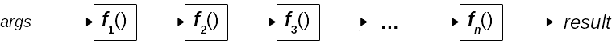
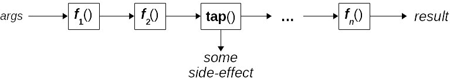
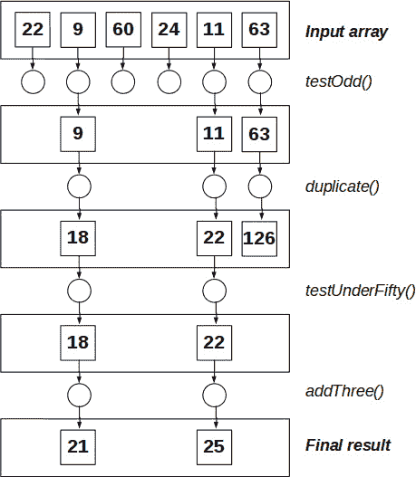
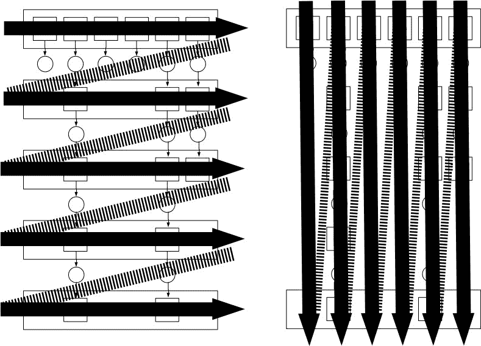
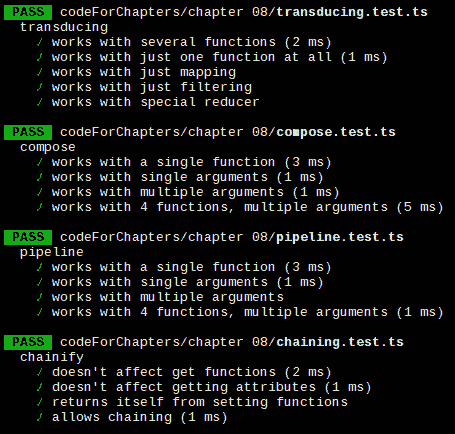

# 连接函数——流水线、组合以及更多

在*第七章* *变换函数*中，我们探讨了通过应用高阶函数构建新函数的方法。在本章中，我们将深入 FP 的核心，学习如何创建函数调用序列以及如何将它们组合以从几个更简单的组件中产生更复杂的结果。为此，我们将涵盖以下主题：

+   **流水线**：一种连接函数的方式，类似于 Unix/Linux 的管道

+   **链式操作**：流水线的一种变体，但仅限于对象

+   **组合**：一种起源于基本计算机理论的经典操作

+   `map`、`filter`或`reduce`操作

在此过程中，我们将涉及一些相关概念，例如以下内容：

+   **无状态风格**，通常与流水线和组合一起使用

+   **调试**组合或流水线函数，我们将准备一些辅助工具

+   **测试**这些函数，它们不会证明具有高复杂性

有了这些技术，你将能够将小函数组合成更大的函数，这是 FP（函数式编程）的一个特点，并将帮助你编写更好的代码。

# 流水线

**流水线**和**组合**是用于设置函数按顺序工作的技术，以便一个函数的输出成为下一个函数的输入。看待这个问题有两种方式：从计算机的角度和从数学的角度。在本节中，我们将探讨这两种方式。大多数 FP（函数式编程）文本都是从后者开始的，但鉴于我假设你们大多数人更倾向于计算机而不是数学，让我们从前者开始。

## Unix/Linux 中的管道

在 Unix/Linux 中，执行一个命令并将它的输出作为输入传递给第二个命令，该命令的输出将作为第三个命令的输入，依此类推，这被称为流水线。这是 Unix 哲学的一种相当常见的应用，正如管道概念创造者、贝尔实验室的 Douglas McIlroy 在贝尔实验室的文章中所解释的：

+   让每个程序只做好一件事。要完成一项新工作，最好是重新构建，而不是通过添加新功能来复杂化旧程序。

+   期望每个程序输出都成为另一个尚未知的程序的输入。

一点历史

考虑到 Unix 的历史重要性，我建议阅读一些在 1978 年 7 月的《贝尔系统技术期刊》中描述（当时新）操作系统的开创性文章，可以在[emulator.pdp-11.org.ru/misc/1978.07_-_Bell_System_Technical_Journal.pdf](http://emulator.pdp-11.org.ru/misc/1978.07_-_Bell_System_Technical_Journal.pdf)找到。引用的两个规则在序言文章的*风格*部分。

让我们考虑一个简单的例子来开始。假设我想知道目录中有多少个 LibreOffice 文本文档。有很多种方法可以做到这一点，但以下示例将做到。我们将执行三个命令，将每个命令的输出作为输入传递给下一个命令。假设我们有`cd /home/fkereki/Documents`然后执行以下操作（请忽略美元符号，它只是控制台提示符）：

```js
$ ls -1 | grep "odt$" | wc -l
4
```

这是什么意思？它是如何工作的？我们必须逐步分析这个过程：

+   管道的第一个部分，`ls -1`，将当前目录（根据我们的`cd`命令，即`/home/fkereki/Documents`）中的所有文件以单列形式列出，每行一个文件名

+   第一个命令的输出被提供给`grep "odt$"`，它过滤（只允许通过）以`"odt"`结尾的行，这是 LibreOffice Writer 的标准文件扩展名

+   过滤后的输出提供给计数命令`wc -l`，它计算其输入中的行数

更多关于管道（pipelining）的内容

你可以在 Dennis Ritchie 和 Ken Thompson 的《UNIX 时间共享系统》的*第 6.2 节*，*过滤器*中了解更多关于管道的信息，这本书也发表在之前提到的贝尔实验室期刊上。

从函数式编程（FP）的角度来看，这是一个关键概念。我们希望用简单、单一用途、较短的函数构建更复杂的操作。管道是 Unix shell 用来应用这个概念的工具。它通过简化执行命令、获取其输出并将其作为输入提供给另一个命令的工作来实现这一点。我们将在 JavaScript 中稍后应用类似的概念：



图 8.1 – JavaScript 中的管道与 Unix/Linux 中的管道类似。每个函数的输出成为下一个函数的输入

顺便说一句（而且——请放心，这不会变成一个 shell 教程！），你可以使管道接受参数。例如，如果我想计算有多少文件具有这种或那种扩展名，我可以创建一个如`cfe`这样的函数，代表*计数* *扩展名*：

```js
$ function cfe() {
ls -1 | grep "$1\$"| wc -l
}
```

然后，我可以使用`cfe`作为命令，给它传递所需的扩展名作为参数：

```js
$ cfe odt
4
$ cfe pdf
6
```

`cfe`执行我的管道并告诉我有四个`odt`文件（LibreOffice）和六个`pdf`文件；太棒了！我们也会想要编写类似的参数化管道：在我们的流程中，我们不受固定函数的限制；我们完全自由地决定要包含什么。在 Linux 上工作过之后，我们现在可以回到编码。让我们看看如何。

## 回顾一个例子

我们可以通过回顾前一章中的一个问题来开始将两端连接起来。你还记得我们在*第五章**，*从对象中提取数据*部分中计算一些地理数据的平均纬度和经度时的情况吗？基本上，我们开始于以下数据，问题是要计算给定点的平均纬度和经度：

```js
const markers = [
  { name: "AR", lat: -34.6, lon: -58.4 },
  { name: "BO", lat: -16.5, lon: -68.1 },
  { name: "BR", lat: -15.8, lon: -47.9 },
  { name: "CL", lat: -33.4, lon: -70.7 },
  { name: "CO", lat:   4.6, lon: -74.0 },
  { name: "EC", lat:  -0.3, lon: -78.6 },
  { name: "PE", lat: -12.0, lon: -77.0 },
  { name: "PY", lat: -25.2, lon: -57.5 },
  { name: "UY", lat: -34.9, lon: -56.2 },
  { name: "VE", lat:  10.5, lon: -66.9 },
];
```

根据我们所知，我们可以用以下方式编写解决方案：

+   能够从每个点中提取纬度（之后，经度）

+   使用该函数创建纬度数组

+   将结果数组管道化到我们在本章前面提到的*计算平均值*部分中编写的平均函数

要完成第一个任务，我们可以使用来自*第七章**，*转换函数*部分中的`myMap()`函数。对于第二个任务，我们可以使用来自*第六章**，*从对象获取属性*部分中的`getField()`函数。最后，对于第三个任务，我们将使用我们即将开发的（尚未编写的）`pipeline()`函数！完整地，我们的解决方案可能看起来像这样：

```js
const sum = (x: number, y: number): number => x + y;
const average = (arr: number[]) =>
  arr.reduce(sum, 0) / arr.length;
const myMap = curry(
  flip2(demethodize(Array.prototype.map))
);
const getAllLats = myMap(getField("lat")) as (
  arg: any
) => number[];
const averageLat = pipeline(getAllLats, average)(markers);
// and similar code to average longitudes
```

我们不得不在`getAllLats`中添加一些类型转换，这样 TypeScript 就会知道我们将应用该函数。

当然，你总是可以屈服于追求一行代码的诱惑，但这会使代码更清晰或更好吗？

```js
const averageLat2 = pipeline(
  curry(flip2(demethodize(Array.prototype.map)))(
    getField("lat")
  ) as (arg: any) => number[],
  average
)(markers);
```

这是否对你有意义将取决于你对 FP 的经验。无论如何，无论你选择哪种解决方案，事实仍然是，将管道化（以及稍后，组合）添加到你的工具集中可以帮助你编写更紧凑、声明性更强、更容易理解的代码。

现在，让我们学习如何正确地管道化函数。

## 创建管道

我们希望能够生成一个包含多个函数的管道。我们可以通过两种方式做到这一点：通过手动以问题特定的方式构建管道，或者使用更通用的结构，这些结构可以普遍应用。让我们看看这两种方法。

可能的管道提案

一个新的操作符`|>`正在考虑用于 JavaScript，但它目前仅处于第 2 阶段，这意味着它可能还需要一段时间才能被接受并可用。你可以阅读更多关于这个提案及其多变历史的资料，请参阅[github.com/tc39/proposal-pipeline-operator/blob/main/HISTORY.md](http://github.com/tc39/proposal-pipeline-operator/blob/main/HISTORY.md)。

### 手动构建管道

让我们用一个 Node.js 的例子来开始，类似于我们在本章早期构建的命令行管道。在这里，我们将手动构建所需的管道。我们需要一个函数来读取目录中的所有文件。我们可以用类似以下的方式做到这一点（尽管这并不推荐，因为在服务器环境中通常不推荐同步调用）：

```js
// pipeline.ts
function getDir(path) {
  const fs = require("fs");
  const files = fs.readdirSync(path);
  return files;
}
```

仅选择`odt`文件相当简单。我们从以下函数开始：

```js
// continued...
const filterByText = (
  text: string,
  arr: string[]
): string[] => arr.filter((v) => v.endsWith(text));
```

此函数接受一个字符串数组，并过滤掉不以给定文本结尾的元素，因此我们现在可以写出以下内容：

```js
// continued...
const filterOdt = (arr: string[]): string[] =>
  filterByText(".odt", arr);
```

更好的是，我们可以应用柯里化并采用无参数风格，正如在*第三章*的*不必要的错误*部分所示，*从函数开始入门*，并写成这样：

```js
// continued...
const filterOdt = curry(filterByText)(".odt");
```

过滤函数的两个版本是等价的；你使用哪个取决于你的喜好。最后，我们可以写出以下内容来计数数组中的元素。由于`length`不是一个函数，我们不能应用我们的去方法技巧：

```js
// continued...
const count = <T>(arr: T[]): number => arr.length;
```

使用这些函数，我们可以写出类似以下的内容：

```js
// continued...
const countOdtFiles = (path: string): number => {
  const files = getDir(path);
  const filteredFiles = filterOdt(files);
  const countOfFiles = count(filteredFiles);
  return countOfFiles;
};
countOdtFiles("/home/fkereki/Documents");
// 4, as with the command line solution
```

我们实际上在执行与 Linux 中相同的过程：获取文件，只保留`odt`文件，并计算由此产生的文件数量。如果你想要去除所有中间变量，你也可以选择一个单行定义，它以完全相同的方式执行相同的工作，尽管行数更少：

```js
const countOdtFiles2 = (path: string): number =>
  count(filterOdt(getDir(path)));
const c2 = countOdtFiles2("/home/fkereki/Documents");
// 4, again
```

这触及了问题的核心：我们文件计数函数的两个实现都有缺点。第一个定义使用几个中间变量来保存结果，并将原本在 Linux shell 中一行代码的多行函数。另一方面，第二个，更短的定义更难以理解，因为我们在看似相反的顺序中编写计算步骤！我们的流水线必须首先读取文件，然后过滤它们，最后计数，但这些函数在我们的定义中却是*相反的*！

我们无疑可以手动实现流水线，就像我们看到的，但如果我们采用更声明式的风格会更好。

让我们继续前进，尝试通过应用我们已看到的一些概念，更清晰地构建一个更好的流水线。

### 使用其他构造

如果我们从函数的角度思考，我们有一个函数列表，我们想要按顺序应用它们，从第一个开始，然后将第二个应用到第一个函数的结果上，然后将第三个应用到第二个函数的结果上，依此类推。如果我们正在修复两个函数的流水线，我们可以使用以下代码：

```js
// continued...
const pipeTwo =
  <AF extends any[], RF, RG>(
    f: (...args: AF[]) => RF,
    g: (arg: RF) => RG
  ) =>
  (...args: any[]) => g(f(...args));
```

这是我们在本章早期提供的基本定义：我们评估第一个函数，其输出成为第二个函数的输入；相对简单！输入很简单：要应用的第一个函数（`f()`）可以有任意数量的参数，但第二个函数（`g()`）必须只有一个参数，其类型与`f()`返回的类型相同。流水线的返回类型是`g()`的返回类型。

你可能会反对，说这个只有两个函数的管道有点太有限了！这并不像看起来那么无用，因为我们可以组合更长的管道——尽管我必须承认这需要太多的编写！假设我们想要编写我们之前章节中的三个函数管道；我们可以以两种不同但等效的方式做到这一点：

```js
// continued...
const countOdtFiles3 = (path: string): number =>
  pipeTwo(pipeTwo(getDir, filterOdt), count)(path);
const countOdtFiles4 = (path: string): number =>
  pipeTwo(getDir, pipeTwo(filterOdt, count))(path);
```

一点数学

我们正在利用管道是一种结合操作的事实。在数学中，结合性质是指我们可以通过先加 1+2，然后将其结果加到 3 上，或者先加 2+3，然后将结果加到 1 上，来计算 1+2+3；换句话说，1+2+3 等于(1+2)+3 或 1+(2+3)。

它们是如何工作的？它们是如何等效的？跟踪给定调用的执行将很有用；在这么多调用中很容易混淆！第一个实现可以一步一步地跟踪，直到最终结果，这与我们已知的结果相匹配：

```js
countOdtFiles3(path) ===
  pipeTwo(pipeTwo(getDir, filterOdt), count)
  pipeTwo(filterOdt(getDir(path)), count)(path)
  pipeTwo(count(filterOdt(getDir(path))))
```

第二种实现也得到了相同的结果：

```js
countOdtFiles4(path) ===
  pipeTwo(getDir, pipeTwo(filterOdt, count))(path)
  pipeTwo(getDir(path), pipeTwo(filterOdt, count))
  pipeTwo(filterOdt, count)(getDir(path))
  pipeTwo(count(filterOdt(getDir(path))))
```

两种推导都得到了相同的结果——实际上就是之前我们手写的那个——所以我们现在知道我们只需要两个高级函数的基本“管道”，但我们确实希望能够以更短、更紧凑的方式工作。一个初步的实现可以按照以下方式，稍后再来看代码：

```js
function pipeline(...fns) {
  return (...args) => {
    let result = fns0;
    for (let i = 1; i < fns.length; i++) {
      result = fnsi;
    }
    return result;
  };
}
pipeline(
  getDir,
  filterOdt,
  count
)("/home/fkereki/Documents"); // still 4
```

这确实有效——并且指定我们的文件计数管道更清晰，因为函数是按照正确的顺序给出的。然而，`pipeline()`函数的实现并不太符合函数式编程，它回到了旧的、命令式的、手动循环的方法。我们可以使用`reduce()`做得更好，就像在*第五章*中提到的，*声明式编程*。

理念是从第一个函数开始评估，将结果传递给第二个函数，然后是第三个函数，依此类推。通过这种方式，我们可以用更短的代码进行管道操作，再次，我们稍后再讨论代码编写：

```js
// continued...
function pipeline2(...fns) {
  return fns.reduce(
    (result, f) =>
      (...args) =>
        f(result(...args))
  );
}
```

这段代码更具声明性。然而，如果你使用我们的`pipeTwo()`函数来编写它，效果会更好，这个函数做的是同样的事情，但更简洁：

```js
// continued...
function pipeline3(...fns) {
  return fns.reduce(pipeTwo);
}
```

（使用箭头函数可以使代码更短。）你可以通过意识到它使用了我们之前提到的结合性质，将第一个函数管道到第二个函数；然后，它将这个结果管道到第三个函数，依此类推。

哪个版本更好？我认为引用`pipeTwo()`函数的版本更清晰：如果你知道`reduce()`是如何工作的，你就可以很容易地理解我们的管道是两个函数一次通过，从第一个开始——这与你对管道工作方式的理解相匹配。我们编写的其他版本或多或少是声明性的，但不是那么容易理解。

我们没有查看所有管道函数的打字，所以现在让我们来做这件事。

### 打字

当我们管道化多个函数时，一个函数的输出类型应该与下一个函数的参数类型相同。让我们有一个辅助的 `FnsMatchPipe<>` 类型来检查两个类型是否满足这个条件：

```js
// continued…
type FN = (...args: any[]) => any;
type FnsMatchPipe<FNS extends FN[]> =
  1 extends FNS["length"]
    ? boolean
    : FNS extends [
        infer FN1st extends FN,
        infer FN2nd extends FN,
        ...infer FNRest extends FN[]
      ]
    ? Parameters<FN2nd> extends [ReturnType<FN1st>]
      ? FnsMatchPipe<[FN2nd, ...FNRest]>
      : never
    : never;
```

这会递归地进行。如果我们管道中只有一个函数（`FNS` 的长度为 `1`），那么我们返回 `boolean` 来表示成功。如果我们有多个函数，我们取第一个和第二个函数，检查后者的参数是否与前者的返回类型相同，并从第二个函数开始递归检查类型。如果类型不匹配，我们返回 `never` 来标记失败。

现在，管道的类型是什么？其参数的类型将与第一个函数的参数类型匹配，其结果类型将与最后一个函数的结果类型匹配：

```js
// continued...
type Pipeline<FNS extends FN[]> =
  boolean extends FnsMatchPipe<FNS>
    ? 1 extends FNS["length"]
      ? FNS[0]
      : FNS extends [
          infer FNFIRST extends FN,
          ...FN[],
          infer FNLAST extends FN
        ]
      ? (...args: Parameters<FNFIRST>) => ReturnType<FNLAST>
      : never
    : never;
```

我们首先使用 `FnsMatchPipe<>` 验证函数的类型是否正确。如果类型匹配，整个管道的类型就是一个函数，该函数接收与管道中第一个函数相同类型的参数，并返回与最后一个管道函数相同类型的值。

现在，我们的管道可以正确编写了——我们得使用与上一章相同的“重载”来帮助 TypeScript 确定类型：

```js
// continued...
function pipeline<FNS extends FN[]>(
  ...fns: FNS
): Pipeline<FNS>;
function pipeline<FNS extends FN[]>(...fns: FNS): FN {
  return (...args: Parameters<FNS[0]>) => {
    let result = fns0;
    for (let i = 1; i < fns.length; i++) {
      result = fnsi;
    }
    return result;
  };
}
function pipeline2<FNS extends FN[]>(
  ...fns: FNS
): Pipeline<FNS>;
function pipeline2<FNS extends FN[]>(...fns: FNS): FN {
  return fns.reduce(
    (result, f) =>
      (...args) =>
        f(result(...args))
  );
}
function pipeline3<FNS extends FN[]>(
  ...fns: FNS
): Pipeline<FNS>;
function pipeline3<FNS extends FN[]>(
  ...fns: FNS
): (...fns: FNS) => FN {
  return fns.reduce(pipeTwo);
}
```

在我们查看连接函数的其他方法之前，让我们考虑如何调试我们的管道。

## 调试管道

现在，让我们转向一个实际问题：你如何调试你的代码？使用管道，你无法看到从函数到函数传递的内容，那么你该如何做？对此我们有两个答案：一个（同样）来自 Unix/Linux 世界，另一个（对于这本书来说最合适）使用包装器来提供一些日志。

### 使用 tee

我们将要使用的第一个解决方案意味着向管道中添加一个函数，该函数仅记录其输入。我们想要实现类似于 Linux 命令 `tee` 的功能，该命令可以拦截管道中的标准数据流并将其副本发送到另一个文件或设备。记住 `/dev/tty` 是通常的控制台，我们可以执行类似以下操作，并使用 `tee` 命令获取屏幕上的所有内容副本：

```js
$ ls -1 | grep "odt$" | tee /dev/tty | wc -l
...the list of files with names ending in odt...
4
```

我们可以轻松地编写一个类似的函数：

```js
// pipeline_debug.ts
const tee = <A>(arg: A) => {
  console.log(arg);
  return arg;
};
```

逗号的力量！

如果你了解逗号操作符的用法，你可以更简洁地编写 `const tee2 = <A>(arg: A) => (console.log(arg), arg)`——你看到为什么吗？查看 [developer.mozilla.org/en-US/docs/Web/JavaScript/Reference/Operators/Comma_Operator](http://developer.mozilla.org/en-US/docs/Web/JavaScript/Reference/Operators/Comma_Operator) 以获取答案！

我们的日志函数简短而直接：它将接收一个参数，列出它，并将其传递给管道中的下一个函数。我们可以在以下代码中看到它的工作情况：

```js
// continued...
console.log(
  pipeline3(
    getDir,
    tee,
    filterOdt,
    tee,
    count
  )("/home/fkereki/Documents")
);
...the list of all the files in the directory...
...the list of files with names ending in odt...
4
```

如果我们的 `tee()` 函数能够接收一个日志记录函数作为参数，就像在 *第六章* *以函数方式记录日志* 部分中提到的“*产生函数*”；那只是我们成功实现的那种改变。同样的优秀设计理念再次得到应用！

```js
// continued...
const tee2 = <A>(arg: A, logger = console.log) => {
  logger(arg);
  return arg;
};
```

这个函数与之前的 `tee()` 函数完全一样，尽管它将使我们能够更灵活地应用和测试。然而，在我们的情况下，这仅仅是对一个已经很容易测试的函数的额外增强。

让我们考虑一个更通用的拨号函数，它不仅限于进行一些日志记录。

### 拨入流程

如果你愿意，你可以编写一个增强的 `tee()` 函数来产生更多的调试信息，将报告的数据发送到文件或远程服务，等等——有许多你可以探索的可能性。你也可以探索一个更通用的解决方案，其中 `tee()` 只是一个特例，并允许我们创建个性化的拨号函数。这可以在以下图中看到：



图 8.2 – 拨号允许你在管道中应用一个函数，以便你可以检查数据在管道中流动的情况

当与管道一起工作时，你可能想在管道的中间放置一个日志记录函数，或者你可能想要某种其他类型的*窥探*函数——可能是为了将数据存储在某个地方，调用一个服务，或者产生某种副作用。我们可以有一个通用的 `tap()` 函数，让我们能够检查数据在管道中移动时的状态，它将以以下方式工作：

```js
// continued...
const tap = curry(<A>(fn: FN, x: A) => (fn(x), x));
```

这段代码是本书中看起来最复杂的代码之一，所以让我们来解释一下。我们想要产生一个函数，给定一个函数 `fn()` 和一个参数 `x`，将评估 `fn(x)`（以产生我们可能感兴趣的任何类型的副作用），但返回 `x`（这样管道就可以继续而不会受到干扰）。逗号操作符正好具有这种行为：如果你写类似 `(a, b, c)` 的东西，JavaScript 将按顺序评估三个表达式，并使用最后一个值作为表达式的值。

在这里，我们可以使用柯里化来产生几个不同的拨号函数。我们在上一节中编写的 `tee()` 函数也可以用以下方式编写：

```js
// continued...
const tee3 = tap(console.log);
```

顺便说一句，你也可以不使用柯里化来编写 `tap()`，但你必须承认这失去了一些神秘感！这在这里得到了演示：

```js
// continued...
const tap2 = (fn: FN) => <A>(x: A) => (fn(x), x);
```

这确实做了完全相同的工作，你将从这个 *手动柯里化* 部分 *第七章* *转换函数* 中认出这种柯里化的方式。现在我们已经学会了如何“拨入”管道，让我们通过回顾之前章节中探讨的一些概念，继续探索另一种日志记录方式。

### 使用日志包装器

我们提到的第二个想法是基于我们在*第六章**“日志记录”部分中编写的`addLogging()`函数。想法是将一些日志功能包装在函数中，以便在进入时打印参数，在退出时显示函数的结果：

```js
pipeline2(
  addLogging(getDir),
  addLogging(filterOdt),
  addLogging(count)
)("/home/fkereki/Documents");
entering getDir(/home/fkereki/Documents)
exiting  getDir=> ...list of files...
entering filterOdt(...list of files, again...)
exiting  => ...list of .odt files...
entering count(...list of .odt files ...)
exiting  count=>4
```

我们可以轻易地验证`pipeline()`函数是否正确执行——无论函数产生什么结果，都会作为输入传递给下一行中的函数，我们也可以理解每次调用发生了什么。当然，你不需要在管道中的每个函数中添加日志：你可能会在怀疑发生错误的地方这样做。

现在我们已经了解了如何组合函数，让我们看看在 FP 中定义函数的一种常见方式，*无点风格*，你可能会遇到。

## 无点风格

当你将函数组合在一起，无论是通过管道还是通过组合，正如我们将在本章后面看到的那样，你不需要任何中间变量来保存将成为后续函数参数的结果：它们是隐式的。同样，你可以编写不提及参数的函数；这被称为*无点风格*。

（顺便说一下，无点风格也被批评者称为*隐式编程*和*无意义编程*！术语“点”本身意味着函数参数，而无点则表示不命名这些参数。）

### 定义无点函数

你可以很容易地识别无点函数定义，因为它不需要`function`关键字或`=>`箭头。让我们回顾一下我们在本章中编写的某些先前函数，并检查它们。例如，我们原始的文件计数函数的定义如下：

```js
const countOdtFiles3 = (path: string): number =>
  pipeTwo(pipeTwo(getDir, filterOdt), count)(path);
const countOdtFiles4 = (path: string): number =>
  pipeTwo(getDir, pipeTwo(filterOdt, count))(path);
```

上述代码可以重写如下：

```js
// pointfree.ts
const countOdtFiles3b = pipeTwo(
  pipeTwo(getDir, filterOdt),
  count
);
const countOdtFiles4b = pipeTwo(
  getDir,
  pipeTwo(filterOdt, count)
);
```

新的定义不引用新定义函数的参数。

你可以通过检查管道中的第一个函数（在这种情况下是`getDir()`）以及它接收什么参数来推断这一点。（使用类型签名，正如我们将在*第十二章**“构建更好的容器”中看到的那样，对于文档来说非常有帮助，并且补充了 TypeScript 类型。）在我们的*回顾示例*部分，我们可以编写一个`getLat()`函数，以无点方式从对象中获取`lat`字段：

```js
const getLat = curry(getField)("lat");
```

相应的全风格定义应该是什么？你必须检查`getField()`函数（我们在*回顾示例*部分中看到了这个函数）以确定它期望一个对象作为参数。然而，通过编写以下内容来明确这种需求并没有太多意义：

```js
const getLat = (obj) => curry(getField)("lat")(obj);
```

如果你愿意编写所有这些，你可能希望坚持以下做法：

```js
const getLat = (obj) => obj.lat;
```

然后，你就根本不需要担心柯里化！

### 转换为无点风格

另一方面，你最好暂停一分钟，尽量不去编写纯函数式代码，无论如何。例如，考虑我们在*第六章*的*生产函数*中编写的`isNegativeBalance()`函数：

```js
const isNegativeBalance = v => v.balance < 0;
```

我们能否以纯函数式风格编写这个？是的，我们可以，我们将看到如何编写——但我不确定我们是否真的想这样编写代码！我们可以考虑构建一个由两个函数组成的管道：一个将提取给定对象的余额，而另一个将检查它是否为负。因此，我们将像这样编写我们的替代版本的余额检查函数：

```js
const isNegativeBalance2 = pipeline(getBalance,
  isNegative);
```

要从一个给定的对象中提取`balance`属性，我们可以使用`getField()`和一些柯里化，并编写以下代码：

```js
const getBalance = curry(getField)("balance");
```

对于第二个函数，我们可以编写以下代码：

```js
const isNegative = (x: number): boolean => x < 0;
```

我们的纯函数目标就这样消失了！相反，我们可以使用`binaryOp()`函数，这也是我们之前提到的同一章中的函数，再加上一些额外的柯里化，来编写以下代码：

```js
const isNegative = curry(binaryOp(">"))(0);
```

我之所以以相反的方式编写测试（`0>x`而不是`x<0`），只是为了方便。另一种选择是使用我在*第六章*的*更方便的实现*部分提到的增强函数，这部分内容稍微简单一些，如下所示：

```js
const isNegative = binaryOpRight("<", 0);
```

所以，最终，我们可以编写以下代码：

```js
const isNegativeBalance2 = pipeline(
  curry(getField)("balance"),
  curry(binaryOp(">"))(0)
);
```

或者，我们还可以编写以下代码：

```js
const isNegativeBalance3 = pipeline(
  curry(getField)("balance"),
  binaryOpRight("<", 0)
);
```

这是一种改进吗？我们新的`isNegativeBalance()`版本没有引用它们的参数，并且是完全的纯函数式，但使用纯函数式风格的想法应该是帮助提高代码的清晰度和可读性，而不是产生混淆和晦涩！我怀疑没有人会看我们这个函数的新版本，并认为它们比原始版本有优势。

如果你发现由于使用纯函数编程，你的代码变得越来越难以理解，请停止并撤销你的更改。记住这本书的教条：我们想要做函数式编程，但我们不想过分追求——使用纯函数式风格并不是强制性的！

在本节中，我们学习了如何构建函数管道——这是一个强大的技术。然而，对于对象和数组，我们还有一种你可能已经使用过的特殊技术：*链式调用*。现在让我们来看看这个。

# 链式和流畅接口

当你与对象或数组一起工作时，还有另一种将多个调用执行链接起来的方法：通过应用*链式调用*。例如，当你与数组一起工作时，如果你应用一个`map()`或`filter()`方法，结果会是一个新的数组，然后你可以对这个新数组应用另一个`map()`或`filter()`函数，依此类推。我们在*第五章*的*使用范围*部分定义`range()`函数时使用了这些方法，*声明式编程*：

```js
const range = (start: number, stop: number): number[] =>
  new Array(stop - start).fill(0).map((v, i) => start + i);
```

首先，我们创建了一个新的数组；然后，我们应用了`fill()`方法来更新它（副作用）并返回更新后的数组，最后我们应用了一个`map()`方法。后者方法生成了一个新的数组，我们可以对它进行进一步的映射、过滤或其他任何可用的方法。

让我们看看流畅 API 的一个常见例子，这些 API 通过链式操作工作，然后考虑我们如何在自己的 API 上实现这一点。

## 流畅 API 的示例

这种连续链式操作的风格也用于流畅的 API 或接口。仅举一个例子，图形`D3.js`库（更多关于它的信息请参阅[d3js.org](http://d3js.org)）经常使用这种风格。以下例子，取自[bl.ocks.org/mbostock/4063269](http://bl.ocks.org/mbostock/4063269)，展示了它的实际应用：

```js
var node = svg
  .selectAll(".node")
  .data(pack(root).leaves())
  .enter()
  .append("g")
  .attr("class", "node")
  .attr("transform", function (d) {
    return "translate(" + d.x + "," + d.y + ")";
  });
node
  .append("circle")
  .attr("id", function (d) {
    return d.id;
  })
  .attr("r", function (d) {
    return d.r;
  })
  .style("fill", function (d) {
    return color(d.package);
  });
```

每个方法都作用于前一个对象，并提供对新的对象的访问，未来的方法调用将应用于该对象（例如`selectAll()`或`append()`方法），或者更新当前对象（如`attr()`属性设置调用所做的那样）。这种风格并不独特，其他一些知名的库（比如 jQuery）也采用了它。

我们能自动化这一点吗？在这种情况下，答案是“可能，但我宁愿不这么做。”我认为使用`pipeline()`或`compose()`效果一样好，并且可以达到相同的目的。使用对象链式调用，你只能返回新的对象或数组或方法可以应用到的某种东西。（记住，如果你正在处理标准类型，如字符串或数字，除非你修改它们的原型，否则你不能向它们添加方法，这并不推荐！）然而，使用组合，你可以返回任何值；唯一的限制是下一个函数必须期望你提供的数据类型。

另一方面，如果你正在编写自己的 API，你可以通过让每个方法都返回`this`来提供一个流畅的接口——除非它需要返回其他内容！如果你在使用别人的 API，你也可以通过使用代理来玩一些小技巧。然而，请注意，可能会有一些情况导致你的代理代码可能失败：可能另一个代理正在使用，或者有一些 getter 或 setter 可能会引起问题，等等。

关于代理

你可能想了解一下代理对象，请参阅[developer.mozilla.org/en/docs/Web/JavaScript/Reference/Global_Objects/Proxy](http://developer.mozilla.org/en/docs/Web/JavaScript/Reference/Global_Objects/Proxy) – 它们非常强大，并允许实现有趣的元编程功能。然而，它们可能会让你陷入技术细节的陷阱，并且会导致代理代码的（尽管是轻微的）性能下降。

现在我们来看看如何链式调用，这样我们就可以对任何类进行操作。

## 链式调用方法

让我们来看一个基本的例子。我们有一个`City`类，它具有`name`、纬度(`lat`)和经度(`long`)属性：

```js
// chaining.ts
class City {
  name: string;
  lat: number;
  long: number;
  constructor(name: string, lat: number, long: number) {
    this.name = name;
    this.lat = lat;
    this.long = long;
  }
  getName() {
    return this.name;
  }
  setName(newName: string) {
    this.name = newName;
  }
  setLat(newLat: number) {
    this.lat = newLat;
  }
  setLong(newLong: number) {
    this.long = newLong;
  }
  getCoords() {
    return [this.lat, this.long];
  }
}
```

这是一个带有几个方法的常见类；一切都很正常。我们可以使用这个类如下，并提供关于我的家乡乌拉圭蒙得维的亚的详细信息：

```js
const myCity = new City(
  "Montevideo, Uruguay",
  -34.9011,
  -56.1645
);
console.log(myCity.getCoords(), myCity.getName());
// [ -34.9011, -56.1645 ] 'Montevideo, Uruguay'
```

如果我们希望设置器以流畅的方式处理，我们可以设置一个代理来检测这些调用并提供缺少的 `return this`。我们如何做到这一点？如果原始方法不返回任何内容，JavaScript 会默认包含一个 `return undefined` 语句，这样我们就可以检测方法返回的是否是 `undefined`，并用 `return this` 来替换它。当然，这是一个问题：如果我们有一个合法返回 `undefined` 的方法，我们会怎么办？因为它具有语义？我们可以有一个某种异常列表来告诉我们的代理在这些情况下不要添加任何内容，但让我们不要深入这个话题。

我们处理器的代码如下。每当调用一个对象的某个方法时，都会隐式地调用一个 `get()`，然后我们捕获它。如果我们得到一个函数，我们用一些自己的代码将其包装起来，这样它就会调用原始方法，然后决定是返回其值还是返回代理对象的引用。如果我们没有得到一个函数，我们就返回请求的属性的值。我们的 `chainify()` 函数将负责将处理器分配给一个对象并创建所需的代理：

```js
// chainify.ts
const chainify = <OBJ extends { [key: string]: any }>(
  obj: OBJ
): Chainify<OBJ> =>
  new Proxy(obj, {
    get(target, property, receiver) {
      if (typeof property === "string") {
        if (typeof target[property] === "function") {
          // requesting a method? return a wrapped version
          return (...args: any[]) => {
            const result = targetproperty;
            return result === undefined ? receiver :
              result;
          };
        } else {
          // an attribute was requested - just return it
          return target[property];
        }
      } else {
        return Reflect.get(target, property, receiver);
      }
    },
  });
```

我们必须检查被调用的 `get()` 是针对函数还是属性。在第一种情况下，我们用额外的代码包装方法，使其执行并返回其结果（如果有）或对象的引用。在第二种情况下，我们返回属性，这是预期的行为。（关于 `Reflect.get()` 的用法，请参阅 [developer.mozilla.org/en-US/docs/Web/JavaScript/Reference/Global_Objects/Reflect/get](http://developer.mozilla.org/en-US/docs/Web/JavaScript/Reference/Global_Objects/Reflect/get)。）

“链式化”对象的类型是什么？任何非函数的属性都是相同的。返回某些非 `void` 值的函数属性也是相同的。然而，如果一个函数返回 `void`，我们会将其包装，使其返回对象本身。`Chainify<>` 类型定义就是这样：

```js
// continued...
type Chainify<A extends { [key: string]: any }> = {
  [key in keyof A]: A[key] extends (...args: any[]) => any
    ? void extends ReturnType<A[key]>
      ? (...args: Parameters<A[key]>) => Chainify<A>
      : (...args: Parameters<A[key]>) => ReturnType<A[key]>
    : A[key];
};
```

通过这种方式，我们可以链式化任何对象，以便我们可以检查任何调用的方法。当我写这篇文章的时候，我正在印度浦那生活，所以让我们反映这个变化：

```js
const myCity2 = chainify(myCity);
console.log(
  myCity2
    .setName("Pune, India")
    .setLat(18.5626)
    .setLong(73.8087)
    .getCoords(),
  myCity.getName()
);
// [ 18.5626, 73.8087 ] 'Pune, India'
```

注意以下内容：

+   `myCity2`（已链式化）的类型与 `myCity` 的类型不同。例如，`myCity2.setLong()` 现在是 `setLong(newLong: number): Chainify<City>` 类型，而不是之前的 `setLong(newLong: number): void`。（参见 *问题 8.8*。）

+   我们以流畅的方式调用几个设置器，它们运行良好，因为我们的代理正在处理为后续调用提供值。

+   调用 `getCoords()` 和 `getName()` 被拦截，但由于它们已经返回了值，所以没有进行特殊处理。

以链式方式工作值得吗？这取决于你——但记住，可能会有一些情况下这种方法会失败，所以要保持警惕！现在，让我们继续探讨组合，这是连接函数的另一种最常见的方式。

# 组合

*组合*与管道化非常相似，但其根源在于数学理论。组合的概念是一系列函数调用的序列，其中一个函数的输出是下一个函数的输入——但顺序与管道化相反。因此，如果你有一系列函数，从左到右，当进行管道化时，要应用系列中的第一个函数是左边的那个，但当你使用组合时，你从最右边的一个开始。

让我们更深入地研究一下。当你定义了三个函数的组合，比如(`f`∘`g`∘`h`)，并将这个组合应用到`x`上，这相当于写出`f(g(h(x)))`。

重要的是要注意，与管道化一样，要应用的第一（实际上是列表中的最后一个）函数的 arity 可以是任何值，但所有其他函数都必须是一元的。此外，除了函数评估顺序的差异外，组合是 FP 中的一个重要工具：它抽象了实现细节（将你的焦点放在你需要完成的事情上，而不是实现它的具体细节），因此让你以更声明性的方式工作。

阅读提示

如果有帮助，你可以将(*f*∘*g*∘*h*)读作“*f*之后*g*之后*h*”，这样就可以清楚地看出*h*是第一个要应用的函数，而*f*是最后一个。

由于其与管道化的相似性，实现组合并不困难。然而，还有一些重要且有趣细节。在继续使用高阶函数和使用一些关于测试组合函数的考虑之后，让我们看看一些组合的例子。

## 组合的一些例子

这可能不会让你感到惊讶，但我们已经看到了几个组合的例子——或者至少，我们实现的一些解决方案在功能上等同于使用组合。让我们回顾一些这些例子，并尝试一些新的例子。

### 一元运算符

在*第六章*的*逻辑否定函数*部分，我们编写了一个`not()`函数，它接受另一个函数作为输入，并逻辑上反转其结果。我们使用该函数来否定对负余额的检查；这个示例代码（这里我使用纯 JavaScript，以保持清晰）可以是以下这样：

```js
const not = (fn) => (...args) => !fn(...args);
const positiveBalance = not(isNegativeBalance);
```

在该章节的另一个部分(*将操作转换为函数*)中，我给你留下了一个挑战，即编写一个`unaryOp()`函数，该函数将提供与常见 JavaScript 运算符等效的一元函数。如果你接受了这个挑战，你应该能够写出以下这样的代码：

```js
const logicalNot = unaryOp("!");
```

假设存在一个`compose()`函数，你也可以写成以下这样：

```js
const positiveBalance = compose(
  logicalNot,
  isNegativeBalance
);
```

你更喜欢哪一个？这是一个口味问题——但我认为第二个版本更好地阐明了我们试图做什么。使用`not()`函数时，你必须检查它做了什么才能理解通用代码。使用组合，你仍然需要知道`logicalNot()`是什么，但全局结构是开放的，可以查看。

再举一个类似的例子，你可以在同一章节的*结果反转*部分达到我们得到的结果。回想一下，我们有一个可以按照西班牙语规则比较字符串的函数，但我们想反转比较的结果，使其按降序排列：

```js
const changeSign = unaryOp("-");
palabras.sort(compose(changeSign, spanishComparison));
```

这段代码产生了与我们的先前排序问题相同的结果，但逻辑表达得更清晰，代码也更少：这是一个典型的函数式编程结果！让我们通过回顾我们之前讨论的另一个任务来查看一些通过组合函数的更多示例。

### 文件计数

我们还可以回到我们的管道。我们编写了一个单行函数来计算给定路径中的`odt`文件数量：

```js
const countOdtFiles2 = (path: string): number =>
  count(filterOdt(getDir(path)));
```

（至少暂时）忽略这个观察结果，即这段代码不如我们后来开发的管道版本清晰，我们也可以用组合的方式编写这个函数：

```js
const countOdtFiles2b = (path: string): number =>
  compose(count, filterOdt, getDir)(path);
countOdtFiles2b("/home/fkereki/Documents");
// 4, no change here
```

我们也可以将其写成一行：

```js
compose(count, filterOdt, getDir)("/home/fkereki/Documents");
```

即使它不如管道版本清晰（这仅是我的个人观点，可能因为我对 Linux 的喜爱而带有偏见），这种声明式实现清楚地表明我们依赖于组合三个不同的函数来得到我们的结果——这很容易看出，并且应用了从更简单的代码片段构建大型解决方案的理念。

让我们看看另一个旨在尽可能组合尽可能多函数的例子。

### 查找唯一单词

最后，让我们再举一个例子，我同意，这个例子也可以用于管道。假设你有一些文本，并想从中提取所有唯一的单词：你会如何操作？如果你按步骤思考（而不是一次性创建一个完整的解决方案），你可能会提出一个类似于以下解决方案：

1.  忽略所有非字母字符。

1.  将所有内容转换为大写。

1.  将文本拆分为单词。

1.  创建一个单词集合。

（为什么是集合？因为它会自动丢弃重复的值；有关更多信息，请参阅[developer.mozilla.org/en/docs/Web/JavaScript/Reference/Global_Objects/Set](http://developer.mozilla.org/en/docs/Web/JavaScript/Reference/Global_Objects/Set)。顺便说一下，我们将使用`Array.from()`方法将我们的集合转换为数组；有关更多信息，请参阅[developer.mozilla.org/en-US/docs/Web/JavaScript/Reference/Global_Objects/Array/from](http://developer.mozilla.org/en-US/docs/Web/JavaScript/Reference/Global_Objects/Array/from)）

现在，使用函数式编程，让我们解决每个问题：

```js
const removeNonAlpha = (str: string): string =>
  str.replace(/[^a-z]/gi, " ");
const toUpperCase = demethodize(
  String.prototype.toUpperCase
);
const splitInWords = (str: string): string[] =>
  str.trim().split(/\s+/);
const arrayToSet = (arr: string[]): Set<string> =>
  new Set(arr);
const setToList = (set: Set<string>): string[] =>
  Array.from(set).sort();
```

使用这些函数，结果可以写成以下形式：

```js
const getUniqueWords = compose(
  setToList,
  arrayToSet,
  splitInWords,
  toUpperCase,
  removeNonAlpha
);
```

由于你无法看到任何组合函数的参数，因此你也不需要显示`getUniqueWords()`的参数，所以在这种情况下，无参数风格是自然的。

现在，让我们测试我们的函数。为此，让我们将此函数应用于亚伯拉罕·林肯在葛底斯堡演讲的前两句话（我们在*第五章*的*映射和扁平化 – flatMap*部分的一个例子中已经使用过它，编程声明式），并打印出其中的 43 个不同单词（相信我，我已经数过了！）：

```js
const GETTYSBURG_1_2 = `Four score and seven years ago
our fathers brought forth on this continent, a new nation, conceived in liberty, and dedicated to the proposition that all men are created equal. Now we are engaged in a great civil war, testing whether that nation, or any nation so conceived and so dedicated, can long
endure.`;
console.log(getUniqueWords(GETTYSBURG_1_2));
// Output: 43 words, namely
  'A',           'AGO',       'ALL',
  'AND',         'ANY',       'ARE',
  'BROUGHT',     'CAN',       'CIVIL',
  'CONCEIVED',   'CONTINENT', 'CREATED',
  'DEDICATED',   'ENDURE',    'ENGAGED',
  'EQUAL',       'FATHERS',   'FORTH',
  'FOUR',        'GREAT',     'IN',
  'LIBERTY',     'LONG',      'MEN',
  'NATION',      'NEW',       'NOW',
  'ON',          'OR',        'OUR',
  'PROPOSITION', 'SCORE',     'SEVEN',
  'SO',          'TESTING',   'THAT',
  'THE',         'THIS',      'TO',
  'WAR',         'WE',        'WHETHER',
  'YEARS'
```

当然，你可以将`getUniqueWords()`编写得更简洁，但我想表达的观点是，通过将解决方案组合成几个更短的步骤，你的代码更清晰，更容易理解。然而，如果你认为流水线解决方案更好，这只是一种观点！

到目前为止，我们已经看到了许多函数组合的例子，但还有另一种管理方法——通过使用高阶函数。

## 使用高阶函数进行组合

显然，手动组合可以与流水线类似进行。例如，我们之前编写的独特单词计数函数可以用简单的 JavaScript 风格编写：

```js
const getUniqueWords1 = (str: string): string[] => {
  const str1 = removeNonAlpha(str);
  const str2 = toUpperCase(str1);
  const arr1 = splitInWords(str2);
  const set1 = arrayToSet(arr1);
  const arr2 = setToList(set1);
  return arr2;
};
console.log(getUniqueWords1(GETTYSBURG_1_2));
// Output: the same 43 words
```

或者，它可以用更简洁（但更晦涩！）的一行代码风格编写：

```js
const getUniqueWords2 = (str: string): string[] =>
  setToList(
    arrayToSet(
      splitInWords(toUpperCase(removeNonAlpha(str)))
    )
  );
console.log(getUniqueWords2(GETTYSBURG_1_2));
// Output: the same 43 words
```

这工作得很好，但就像我们在学习流水线时做的那样，让我们寻找一个更通用的解决方案，这样我们就不需要每次想要组合其他函数时都编写一个新的特定函数。

组合两个函数相对简单，只需要对我们的`pipeTwo()`函数进行少量修改，这是我们之前在本章中看到的。我们只需交换`f`和`g`以获得新的定义！

```js
// compose.ts
const pipeTwo =
  <F extends FN, G extends FN>(f: F, g: G) =>
  (...args: Parameters<F>): ReturnType<G> =>
    g(f(...args));
const composeTwo =
  <F extends FN, G extends FN>(f: F, g: G) =>
  (...args: Parameters<G>): ReturnType<F> =>
    f(g(...args));
```

唯一的区别是，在流水线中，你首先应用最左边的函数，而在组合中，你首先从最右边的函数开始。这种变化表明，我们本可以使用*第七章*的*参数顺序*部分中的`flipTwo()`高阶函数，变换函数。这更清晰吗？以下是代码：

```js
// continued...
const composeTwoByFlipping = flipTwo(pipeTwo);
```

无论如何，如果我们想组合超过两个函数，我们可以利用结合性质，并编写如下内容：

```js
const getUniqueWords3 = composeTwo(
  setToList,
  composeTwo(
    arrayToSet,
    composeTwo(
      splitInWords,
      composeTwo(toUpperCase, removeNonAlpha)
    )
  )
);
```

尽管这可行，但让我们追求一个更好的解决方案——我们可以提供几个。我们可以使用一个循环，就像我们编写第一个流水线函数时那样：

```js
// continued...
function compose(...fns) {
  return (...args) => {
    let result = fnsfns.length - 1;
    for (let i = fns.length - 2; i >= 0; i--) {
      result = fnsi;
    }
    return result;
  };
}
console.log(
  compose(
    setToList,
    arrayToSet,
    splitInWords,
    toUpperCase,
    removeNonAlpha
  )(GETTYSBURG_1_2)
);
// same output as earlier
```

我们还可以注意到，流水线和组合是相反方向的。在流水线中，我们从左到右应用函数，而在组合中，我们从右到左应用。因此，我们可以通过反转函数的顺序并执行流水线来达到与组合相同的结果；这是一个非常实用的解决方案，我真的很喜欢！如下所示：

```js
// continued...
function compose1(...fns) {
  return pipeline(...fns.reverse());
}
```

唯一棘手的部分是在调用`pipeline()`之前使用扩展运算符。在反转`fns`数组后，我们必须扩展其元素以正确调用`pipeline()`。

另一种解决方案，不那么声明式，是使用 `reduceRight()`，这样我们就不需要反转函数列表，而是反转处理它们的顺序：

```js
// continued...
function compose2(...fns) {
  return fns.reduceRight(
    (f, g) => (...args) => g(f(...args))
  );
}
console.log(
  compose2(
    setToList,
    arrayToSet,
    splitInWords,
    toUpperCase,
    removeNonAlpha
  )(GETTYSBURG_1_2)
);
// still same output
```

为什么以及如何使其工作？让我们看看这个调用的内部工作原理：

+   由于没有提供初始值，`f()` 是 `removeNonAlpha()`，而 `g()` 是 `toUpperCase()`，所以第一个中间结果是函数，`(...args) => toUpperCase(removeNonAlpha(...args))`；让我们称之为 `step1()`。

+   第二次，`f()` 是前一步的 `step1()`，而 `g()` 是 `splitInWords()`，所以新的结果是函数，`(...args) => splitInWords(step1(...args)))`，我们可以称之为 `step2()`。

+   第三次，以同样的方式，我们得到 `(...args) => arrayToSet(step2(...args))))`，我们称之为 `step3()`。

+   最后，结果是 `(...args) => setToList(step3(...args))`，一个函数；让我们称之为 `step4()`。

最终结果是一个接收 `(...args)` 的函数，它首先应用 `removeNonAlpha()`，然后是 `toUpperCase()`，依此类推，最后通过应用 `setToList()` 完成。

惊讶的是，我们也可以用 `reduce()` 使其工作——你能看出为什么吗？推理与之前所做的是相似的，所以我们将这个作为练习留给你：

```js
// continued...
function compose3(...fns) {
  return fns.reduceRight(pipeTwo);
}
```

一个对称的挑战！

在弄清楚 `compose3()` 的工作原理后，你可能想写一个使用 `reduceRight()` 的 `pipeline()` 版本，只是为了对称，使事情完整！

### 组合的数据类型

考虑到我们为管道化所做的，对于组合的数据类型来说几乎是一样的，我们将遵循并行处理的方式。首先，我们将有一个辅助类型来检查我们的函数类型是否可以正确组合：

```js
// compose.ts
type FnsMatchComp<FNS extends FN[]> =
  1 extends FNS["length"]
    ? boolean
    : FNS extends [
        ...infer FNInit extends FN[],
        infer FNPrev extends FN,
        infer FNLast extends FN
      ]
    ? Parameters<FNPrev> extends [ReturnType<FNLast>]
      ? FnsMatchComp<[...FNInit, FNPrev]>
      : never
    : never;
```

这基本上与我们为管道化所写的是一样的，只不过我们是从右到左处理函数。完成这个步骤后，我们现在可以编写我们的 `Compose<>` 类型：

```js
// continued...
type Compose<FNS extends FN[]> =
  boolean extends FnsMatchComp<FNS>
    ? 1 extends FNS["length"]
      ? FNS[0]
      : FNS extends [
          infer FNFIRST extends FN,
          ...FN[],
          infer FNLAST extends FN
        ]
      ? (...args: Parameters<FNLAST>) =>
        ReturnType<FNFIRST>
      : never
    : never;
```

这也是管道化中已有的，只是结果的类型是对称的。最后，我们可以将类型应用到我们的组合函数上；让我们看看一个例子，因为（从逻辑上讲！）类型对所有版本的代码都是相同的！

```js
function compose<FNS extends FN[]>(
  ...fns: FNS
): Compose<FNS>;
function compose<FNS extends FN[]>(...fns: FNS): FN {
  return (...args: Parameters<FNS[0]>) => {
    let result = fnsfns.length - 1;
    for (let i = fns.length - 2; i >= 0; i--) {
      result = fnsi;
    }
    return result;
  };
}
```

到目前为止，我们已经看到了我们可以用来使用管道化、链式和组合连接函数的重要方法。所有这些都工作得很好，但我们将看到有一个特殊情况会影响代码的性能，这需要一种新的处理组合的方式：*转换*。

# 转换

让我们考虑一个在 JavaScript 中发生性能问题的场景，当我们处理大型数组并应用多个`map()`、`filter()`或`reduce()`操作时。如果你从一个数组开始并应用这些操作（通过链式调用，如我们在本章前面所见），你会得到期望的结果。然而，会创建许多中间数组，处理它们，然后丢弃它们——这会导致延迟。如果你处理的是小型数组，额外的时间不会产生影响，但处理大型数组（如在大数据处理中，也许在 Node.js 中，你正在处理大型数据库查询的结果），那么你可能需要一些优化。我们将通过学习一个新的用于组合函数的工具来实现这一点：*转换*。

首先，让我们创建一些函数和数据。我们将使用一个无意义的例子来处理，因为我们不是关注实际的运算，而是关注一般的过程。我们将从一些过滤函数和一些映射函数开始：

```js
// transducing.ts
const testOdd = (x: number): boolean => x % 2 === 1;
const testUnderFifty = (x: number): boolean => x < 50;
const duplicate = (x: number): number => x + x;
const addThree = (x: number): number => x + 3;
```

现在，让我们将这些映射和过滤函数应用于一个数组。首先，我们去除偶数，复制奇数，去除超过 50 的结果，最后将 3 加到所有结果上：

```js
// continued...
const myArray = [22, 9, 60, 24, 11, 63];
const a0 = myArray
  .filter(testOdd)
  .map(duplicate)
  .filter(testUnderFifty)
  .map(addThree);
console.log(a0);
// Output: [ 21, 25 ]
```

下面的图示显示了这一系列操作是如何工作的：



图 8.3 – 连接 map/filter/reduce 操作会导致创建并随后丢弃中间数组

在这里，我们可以看到将多个`map()`、`filter()`和`reduce()`操作连接起来会导致创建并随后丢弃中间数组（在这个例子中是三个）——对于大型数组，这可能会变得很麻烦。

我们如何优化这个问题呢？这里的问题是处理过程将第一个转换应用于输入数组；然后，第二个转换应用于结果数组；然后是第三个，依此类推。一个替代方案是取输入数组的第一个元素，并按顺序对其应用所有转换。然后，你需要取输入数组的第二个元素，并对其应用所有转换，然后取第三个，依此类推。在伪代码中，区别在于这个：

```js
for each transformation to be applied:
    for each element in the input list:
        apply the transformation to the element
```

然后是这个方法：

```js
for each element in the input list:
    for each transformation to be applied:
        apply the transformation to the element
```

使用第一种逻辑，我们逐个转换，将其应用于每个列表，并生成一个新的列表。这需要产生几个中间列表。使用第二种逻辑，我们逐个元素地处理，并将所有转换按顺序应用于每个元素，以得到最终输出列表，而不创建任何中间列表。

现在，问题在于能够转置转换；我们如何做到这一点？我们在 *第五章* 中看到了这个关键概念，*声明式编程*，并且我们可以用 `reduce()` 来定义 `map()` 和 `filter()`。使用这些定义，而不是一系列不同的函数，我们将在每个步骤应用相同的操作（`reduce()`），这就是秘密！如图所示，我们通过组合所有转换来改变评估顺序，以便它们可以在单次遍历中应用，而无需任何中间数组：



图 8.4 – 通过应用转换器，我们将改变评估顺序但得到相同的结果

而不是应用第一个 `reduce()` 操作，将其结果传递给第二个，然后传递给第三个，依此类推，我们将所有归约函数组合成一个单一的函数！让我们分析一下。

## 组合归约器

实际上，我们想要的是将每个函数（`testOdd()`、`duplicate()` 等）转换成一个归约操作，该操作将调用以下归约器。几个高阶函数将有所帮助；一个用于映射函数，另一个用于过滤函数。有了这个想法，操作的结果将被传递到下一个操作，避免了中间数组：

```js
// continued...
const mapTR =
  <V, W>(fn: (x: V) => W) =>
  <A>(reducer: (am: A, wm: W) => A) =>
  (accum: A, value: V): A =>
    reducer(accum, fn(value));
const filterTR =
  <V>(fn: (x: V) => boolean) =>
  <A>(reducer: (af: A, wf: V) => A) =>
  (accum: A, value: V): A =>
    fn(value) ? reducer(accum, value) : accum;
```

这两个转换函数是 *转换器*：接受一个归约函数并返回一个新的归约函数的函数。（一些趣闻：单词 *transduce* 来自拉丁语，意为转换、运输、转换、改变、转换，并在许多不同的领域中得到应用，包括生物学、心理学、机器学习、物理学、电子学等。）

打字并不太难。对于映射，我们假设一个映射函数，它接收类型为 `V` 的值并产生类型为 `W` 的结果。通用的归约器接收类型为 `A` 的累加器和一个类型为 `W` 的值，并产生一个新的累加器，也是类型 `A`。对于过滤，过滤函数接收类型为 `V` 的值并产生一个 `Boolean` 值，而归约器接收类型为 `A` 的累加器和一个类型为 `V` 的值，返回类型 `A` 的结果。

我们如何使用这些转换器？我们可以编写如下代码，尽管我们稍后会想要一个更抽象、更通用的版本：

```js
// continued...
const testOddR = filterTR(testOdd);
const testUnderFiftyR = filterTR(testUnderFifty);
const duplicateR = mapTR(duplicate);
const addThreeR = mapTR(addThree);
```

我们原始的四个函数都经过了转换，因此它们将计算结果并调用归约器来处理这些结果。以 `addThreeR()` 为例，它将向其输入值加三，并将增加后的值传递给下一个归约器，在这种情况下是 `addToArray()`。

这将构建最终的结果数组。现在，我们可以一步完成整个转换：

```js
// continued...
const addToArray = (a: any[], v: any): any[] => {
  a.push(v);
  return a;
};
const a1 = myArray.reduce(
  testOddR(
    duplicateR(testUnderFiftyR(addThreeR(addToArray)))
  ),
  []
);
console.log(a1);
// Output: [ 21, 25 ], again
```

这听起来可能有些复杂，但它确实有效！然而，我们可以通过使用 `compose()` 函数来简化我们的代码：

```js
// continued...
const transduce = <A>(arr: A[], fns: FN[]) =>
  arr.reduce(compose(...fns)(addToArray), []);
console.log(
  transduce(myArray, [
    testOddR,
    duplicateR,
    testUnderFiftyR,
    addThreeR,
  ])
);
// Output: [ 21, 25 ], yet again
```

代码是相同的，但请注意`compose(...fns)(addToArray)`表达式：我们将所有映射和过滤函数（最后一个为`addToArray`）组合起来，以构建输出。然而，这并不像我们希望的那样通用：为什么我们必须创建一个数组？为什么我们不能有一个不同的最终 reducing 函数？我们可以通过进一步泛化做得更好。

## 为所有 reducer 进行泛化

为了能够与所有类型的 reducer 一起工作并产生它们构建的任何类型的输出，我们需要进行一些小的修改。想法很简单：让我们修改我们的`transduce()`函数，使其能够接受一个最终 reducer 和一个累加器的起始值：

```js
// continued...
const transduce2 = <A>(
  arr: A[],
  fns: FN[],
  reducer: FN = addToArray,
  initial: any = []
) => arr.reduce(compose(...fns)(reducer), initial);
console.log(
  transduce2(myArray, [
    testOddR,
    duplicateR,
    testUnderFiftyR,
    addThreeR,
  ])
);
// Output: [ 21, 25 ], always
```

为了使这个函数更易于使用，我们指定了我们的数组构建函数（以及一个空数组作为初始累加器值），这样如果你跳过这两个参数，你将得到一个生成数组的 reducer。现在，让我们看看另一个选项：不是数组，而是计算所有映射和过滤后的结果数字的总和：

```js
// continued...
console.log(
  transduce2(
    myArray,
    [testOddR, duplicateR, testUnderFiftyR, addThreeR],
    (acc, value) => acc + value,
    0
  )
);
// 46
```

通过使用 transducers，我们已经能够优化一系列`map`、`filter`和`reduce`操作，使得输入数组只处理一次，并直接产生输出结果（无论是数组还是单个值），而不创建任何中间数组；这是一个很好的改进！

我们已经看到了几种连接函数的方法；为了圆满结束，让我们看看如何为连接函数编写单元测试。

# 测试连接的函数

让我们通过考虑测试本章中我们看到的所有方式连接的函数来完成。由于管道和组合的机制相似，我们将查看两者的示例。除了由于函数评估的左到右或右到左顺序导致的逻辑差异外，它们不会有所不同。

## 测试管道函数

当涉及到管道时，我们可以从如何测试`pipeTwo()`函数开始，因为设置将与`pipeline()`相似。我们需要创建一些模拟并检查它们是否被正确地调用了正确的次数，以及每次调用时是否接收到了正确的参数。我们将它们设置为提供一个已知答案的调用。

通过这样做，我们可以检查函数的输出是否成为管道中下一个函数的输入：

```js
// pipetwo.test.ts
describe("pipeTwo", function () {
  it("works with single arguments", () => {
    const fn1 = jest.fn().mockReturnValue(1);
    const fn2 = jest.fn().mockReturnValue(2);
    const pipe = pipeTwo(fn1, fn2);
    const result = pipe(22);
    expect(fn1).toHaveBeenCalledTimes(1);
    expect(fn2).toHaveBeenCalledTimes(1);
    expect(fn1).toHaveBeenCalledWith(22);
    expect(fn2).toHaveBeenCalledWith(1);
    expect(result).toBe(2);
  });
  it("works with multiple arguments", () => {
    const fn1 = jest.fn().mockReturnValue(11);
    const fn2 = jest.fn().mockReturnValue(22);
    const pipe = pipeTwo(fn1, fn2);
    const result = pipe(12, 4, 56);
    expect(fn1).toHaveBeenCalledTimes(1);
    expect(fn2).toHaveBeenCalledTimes(1);
    expect(fn1).toHaveBeenCalledWith(12, 4, 56);
    expect(fn2).toHaveBeenCalledWith(11);
    expect(result).toBe(22);
  });
});
```

由于我们的函数始终接收两个函数作为参数，所以测试内容很少。测试之间的唯一区别是，一个显示了应用于单个参数的管道，而另一个显示了应用于多个参数的管道。

接下来是`pipeline()`，测试将非常相似。然而，我们可以添加一个针对单函数管道（一个边界情况！）的测试，以及一个包含四个函数的测试：

```js
// pipeline.test.ts
describe("pipeline", function () {
  it("works with a single function", () => {
    const fn1 = jest.fn().mockReturnValue(11);
    const pipe = pipeline(fn1);
    const result = pipe(60);
    expect(fn1).toHaveBeenCalledTimes(1);
    expect(fn1).toHaveBeenCalledWith(60);
    expect(result).toBe(11);
  });
  it("works with single arguments", () => {
    const fn1 = jest.fn().mockReturnValue(1);
    const fn2 = jest.fn().mockReturnValue(2);
    const pipe = pipeline(fn1, fn2);
    const result = pipe(22);
    expect(fn1).toHaveBeenCalledTimes(1);
    expect(fn2).toHaveBeenCalledTimes(1);
    expect(fn1).toHaveBeenCalledWith(22);
    expect(fn2).toHaveBeenCalledWith(1);
    expect(result).toBe(2);
  });
  it("works with multiple arguments", () => {
    const fn1 = jest.fn().mockReturnValue(11);
    const fn2 = jest.fn().mockReturnValue(22);
    const pipe = pipeline(fn1, fn2);
    const result = pipe(12, 4, 56);
    expect(fn1).toHaveBeenCalledTimes(1);
    expect(fn2).toHaveBeenCalledTimes(1);
    expect(fn1).toHaveBeenCalledWith(12, 4, 56);
    expect(fn2).toHaveBeenCalledWith(11);
    expect(result).toBe(22);
  });
  it("works with 4 functions, multiple arguments", () => {
    const fn1 = jest.fn().mockReturnValue(111);
    const fn2 = jest.fn().mockReturnValue(222);
    const fn3 = jest.fn().mockReturnValue(333);
    const fn4 = jest.fn().mockReturnValue(444);
    const pipe = pipeline(fn1, fn2, fn3, fn4);
    const result = pipe(24, 11, 63);
    expect(fn1).toHaveBeenCalledTimes(1);
    expect(fn2).toHaveBeenCalledTimes(1);
    expect(fn3).toHaveBeenCalledTimes(1);
    expect(fn4).toHaveBeenCalledTimes(1);
    expect(fn1).toHaveBeenCalledWith(24, 11, 63);
    expect(fn2).toHaveBeenCalledWith(111);
    expect(fn3).toHaveBeenCalledWith(222);
    expect(fn4).toHaveBeenCalledWith(333);
    expect(result).toBe(444);
  });
});
```

## 测试组合函数

对于组合，风格相同（除了函数评估的顺序相反），所以让我们看看一个单独的测试——在这里，我只是改变了前面测试中函数的顺序：

```js
// compose.test.ts
describe("compose", function () {
  // other tests, omitted here
  it("works with 4 functions, multiple arguments", () => {
    const fn1 = jest.fn().mockReturnValue(111);
    const fn2 = jest.fn().mockReturnValue(222);
    const fn3 = jest.fn().mockReturnValue(333);
    const fn4 = jest.fn().mockReturnValue(444);
    const comp = compose(fn4, fn3, fn2, fn1);
    const result = comp(24, 11, 63);
    expect(fn1).toHaveBeenCalledTimes(1);
    expect(fn2).toHaveBeenCalledTimes(1);
    expect(fn3).toHaveBeenCalledTimes(1);
    expect(fn4).toHaveBeenCalledTimes(1);
    expect(fn1).toHaveBeenCalledWith(24, 11, 63);
    expect(fn2).toHaveBeenCalledWith(111);
    expect(fn3).toHaveBeenCalledWith(222);
    expect(fn4).toHaveBeenCalledWith(333);
    expect(result).toBe(444);
  });
});
```

## 测试链式函数

为了测试`chainify()`函数，我选择使用我之前创建的`City`对象——我不想与模拟、存根、间谍等打交道；我想确保代码在正常条件下能够工作：

```js
// chaining.test.ts
class City {
// as above
}
let myCity: City;
let myCity2: Chainify<City>;
describe("chainify", function () {
  beforeEach(() => {
    myCity = new City(
      "Montevideo, Uruguay",
      -34.9011,
      -56.1645
    );
    myCity2 = chainify(myCity);
  });
  it("doesn't affect get functions", () => {
    expect(myCity2.getName()).toBe("Montevideo, Uruguay");
    expect(myCity2.getCoords()[0]).toBe(-34.9011);
    expect(myCity2.getCoords()[1]).toBe(-56.1645);
  });
  it("doesn't affect getting attributes", () => {
    expect(myCity2.name).toBe("Montevideo, Uruguay");
    expect(myCity2.lat).toBe(-34.9011);
    expect(myCity2.long).toBe(-56.1645);
  });
  it("returns itself from setting functions", () => {
    //    expect(myCity2.setName("Other
      name")).toBe(myCity2);
    expect(myCity2.setLat(11)).toBe(myCity2);
    expect(myCity2.setLong(22)).toBe(myCity2);
  });
  it("allows chaining", () => {
    const newCoords = myCity2
      .setName("Pune, India")
      .setLat(18.5626)
      .setLong(73.8087)
      .getCoords();
    expect(myCity2.name).toBe("Pune, India");
    expect(newCoords[0]).toBe(18.5626);
    expect(newCoords[1]).toBe(73.8087);
  });
});
```

## 测试转换函数

我们在本章的早期尝试了几个示例，很容易将它们转换为测试。我们还将添加针对边界情况（例如，只有一个函数，只有映射函数等）的新测试，以增加通用性。为了简单起见，我继续使用之前使用的相同数据数组以及映射和过滤函数：

```js
// transducing.test.ts
describe("transducing", () => {
  it("works with several functions", () => {
    expect(
      transduce(myArray, [
        testOddR,
        duplicateR,
        testUnderFiftyR,
        addThreeR,
      ])
    ).toEqual([21, 25]);
  });
  it("works with just one function at all", () => {
    expect(transduce(myArray, [testOddR])).toEqual([
      9, 11, 63,
    ]);
    expect(transduce(myArray, [addThreeR])).toEqual([
      25, 12, 63, 27, 14, 66,
    ]);
  });
  it("works with just mapping", () => {
    expect(
      transduce(myArray, [addThreeR, duplicateR])
    ).toEqual([50, 24, 126, 54, 28, 132]);
  });
  it("works with just filtering", () => {
    expect(
      transduce(myArray, [testOddR, testUnderFiftyR])
    ).toEqual([9, 11]);
  });
  it("works with special reducer", () => {
    expect(
      transduce2(
        myArray,
        [testOddR, duplicateR, testUnderFiftyR, addThreeR],
        (acc, value) => acc + value,
        0
      )
    ).toBe(46);
  });
});
```

所有这些测试的最终结果可以在以下屏幕截图中看到：



图 8.5 – 连接函数测试的成功运行

如我们所见，所有测试都成功通过；很好！

# 摘要

在本章中，我们学习了如何通过使用管道和组合以不同的方式连接几个其他函数来创建新函数。我们还探讨了流畅接口，它应用了链式调用，以及转换，这是一种将归约器组合起来以获得更快的转换序列的方法。使用这些方法，你将能够从现有函数中创建新函数，并继续以我们偏爱的声明性方式编程。

在*第九章* *设计函数*中，我们将继续学习函数设计，并研究递归的使用，这是函数式编程中的一个基本工具，它允许进行非常干净的算法设计。

# 问题

8.1 `headline(sentence)`函数将接收一个字符串作为参数，并返回一个适当的大写版本。单词之间用空格分隔。通过连接较小的函数来构建这个函数：

```js
console.log(headline("Alice's ADVENTURES in WoNdErLaNd"));
// Alice's Adventures In Wonderland
```

8.2 `done===true`) 或挂起 (`done===false`)。你的目标是生成一个包含给定人员 ID 的数组，该人员通过名称识别，应与责任字段匹配。通过使用组合或管道来解决此问题：

```js
const allTasks = {
  date: "2017-09-22",
  byPerson: [
    {
      responsible: "EG",
      tasks: [
        { id: 111, desc: "task 111", done: false },
        { id: 222, desc: "task 222", done: false },
      ],
    },
    {
      responsible: "FK",
      tasks: [
        { id: 555, desc: "task 555", done: false },
        { id: 777, desc: "task 777", done: true },
        { id: 999, desc: "task 999", done: false },
      ],
    },
    {
      responsible: "ST",
      tasks: [{ id: 444, desc: "task 444", done: true }],
    },
  ],
};
```

确保你的代码在例如，你要找的人没有出现在网络服务结果中时不会抛出异常！

8.3 **抽象思维**：假设你正在查看一些较旧的代码，并发现一个看起来像以下这样的函数。(我保留了模糊和抽象的名称，这样你就可以专注于结构而不是实际的功能)。你能将其转换为无点风格吗？

```js
function getSomeResults(things) {
  return sort(group(filter(select(things))));
}
```

8.4 使用`Pipeline<>`类型加上一个新的`Reverse<>`类型来创建`Compose<>`类型。这个新类型应该是什么？

8.5 **空管道？** 我们的管道函数是否可以与一个空的函数数组一起工作？你能修复这个问题吗？

8.6 我们编写的`addToArray()`函数实际上是不纯的？(如果你还不确定，请查看*第四章* *行为规范*中的*参数突变*部分！)如果我们按照以下方式编写它会更好吗？我们应该这样做吗？

```js
const addToArray = (a, v) => [...a, v];
```

8.7 `map()`操作？如果你只有`filter()`操作会怎样？

8.8 `myCity2` 对象与原始 `myCity` 对象的类型不同。它的确切类型是什么？
