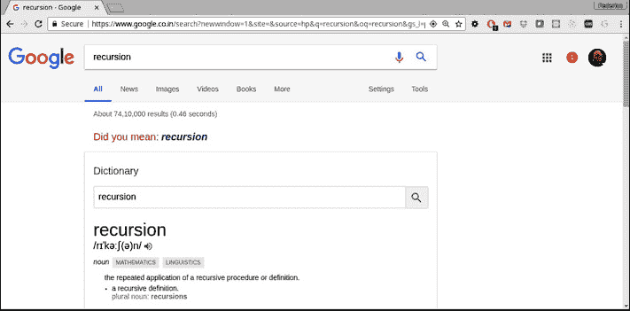
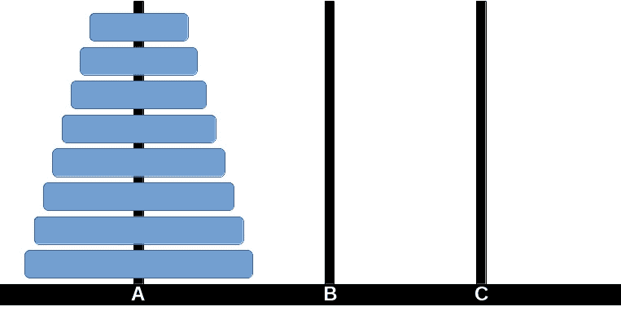
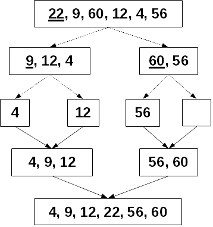
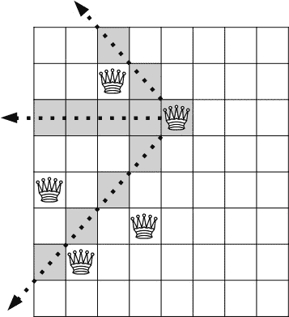
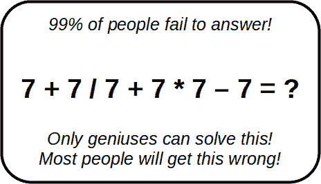
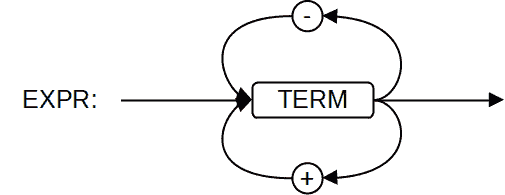
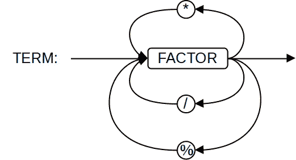
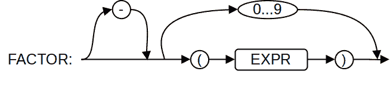
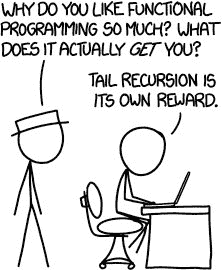

# 设计函数 – 递归

在*第八章* *连接函数*中，我们考虑了更多从现有函数组合创建新函数的方法。在这里，我们将探讨一个不同的主题：如何通过应用递归技术以典型的函数式方式设计和编写函数。

我们将涵盖以下主题：

+   理解递归是什么以及如何思考以产生递归解决方案

+   将递归应用于一些著名问题，例如找零或汉诺塔问题

+   使用递归而不是迭代来重新实现前面章节中的一些高阶函数

+   轻松编写搜索和回溯算法

+   遍历数据结构，如树，以处理文件系统目录或浏览器 DOM

+   理解互递归并将其应用于正确评估算术表达式等问题

+   解决由浏览器 JavaScript 引擎考虑引起的某些限制

# 使用递归

递归是函数式编程（FP）的关键技术，以至于某些语言不提供迭代或循环，而完全使用递归（我们之前提到的 Haskell 就是这样一个典型的例子）。计算机科学的一个基本事实是，你可以用递归做到的事情，你也可以用迭代（循环）做到，反之亦然。关键概念是，有许多算法的定义如果以递归方式工作会更容易。另一方面，递归并不总是被教授，许多程序员，即使知道了递归，也更愿意不使用它。因此，在本节中，我们将看到几个递归思维的例子，以便您可以将它们应用于您的函数式编码。

一个典型、经常引用且非常古老的计算机笑话！

词典定义：**递归**： (n) *参见* **递归**

但什么是递归？定义递归有很多方法，但我看到的最简单的一种是这样的：*一个函数一次又一次地调用自己，直到不再调用为止*。一个更复杂的情况是互递归，最简单的例子是我们有两个函数，`A()`和`B()`，每个函数都一次又一次地调用另一个，直到它们完成。

递归是解决多种问题的自然技术，例如以下问题：

+   数学定义，例如斐波那契数列或一个数的阶乘

+   与递归定义的结构相关的数据结构算法，例如列表（一个列表要么是空的，要么由一个头节点后跟一个节点列表组成）或树（树可以定义为称为根的特殊节点，它连接零个或多个树）

+   基于语法规则的编译器语法分析，这些规则本身又依赖于其他规则，这些规则又依赖于其他规则，如此等等

以及更多！它甚至出现在艺术和幽默中，如图 9**.1**所示：



图 9.1 – Google 自己也开玩笑说：如果你问及递归，它会回答，“你是指：递归”

除了一些不需要进一步计算的基本情况外，递归函数必须调用自己一次或多次以执行所需的计算的一部分。这个概念可能在这个阶段不是很清楚，所以在下文中，我们将看到我们如何进行递归思考，并通过应用这种技术解决几个常见问题。

## 递归思考

解决递归问题的关键是假设你已经有一个能够完成你需要的功能的函数，并且只是调用它。（这听起来是不是很奇怪？实际上，这是非常合适的：如果你想用递归解决问题，你必须首先解决它...) 另一方面，如果你试图在脑海中弄清楚递归调用是如何工作的，并试图跟随流程，你可能会迷失方向。所以，你需要做的是以下：

1.  假设你已经有一个合适的函数来解决你的问题。

1.  看看如何通过解决一个（或多个）更小的问题来解决大问题。

1.  使用*步骤 1*中想象出的函数来解决这些问题。

1.  决定你的基本情况是什么。确保它们足够简单，可以直接解决，而无需更多的调用。

考虑到这些要点，你可以通过递归解决问题，因为你将拥有你的递归解决方案的基本结构。

应用递归解决问题通常有三种常用方法：

+   **减少和征服**是最简单的情况，其中解决问题直接依赖于解决它自己的一个更简单的情况。

+   **分而治之**是一种更通用的方法。想法是尝试将你的问题分解为两个或更多更小的版本，递归地解决它们，并使用这些解决方案来解决原始问题。这种技术与*减少和征服*之间的唯一区别是，你必须解决两个或更多其他问题，而不仅仅是解决一个问题。

+   **动态规划**可以看作是*分而治之*的一种变体：基本上，你通过将复杂问题分解为一系列相对简单的同一问题的版本，并按顺序解决每个版本来解决问题；然而，这个策略中的关键思想是存储之前找到的解决方案，这样当你再次需要解决更简单的情况的解决方案时，你不会直接应用递归，而是使用存储的结果，避免不必要的重复计算。

在本节中，我们将探讨一些问题，并通过递归思考来解决它们。当然，我们将在本章的其余部分看到递归的更多应用；在这里，我们将专注于创建此类算法所需的关键决策和问题。

### 减少和征服 – 搜索

递归最常见的情况只涉及一个简单的情况。我们已经看到了一些这样的例子，比如无处不在的阶乘计算：要计算*n*的阶乘，你之前需要计算*n*-1 的阶乘。（参见*第一章*，*成为函数式编程者*。）现在让我们转向一个非数学的例子。

你也会使用这种减少和征服策略来搜索数组中的元素。如果数组为空，那么显然搜索的值不在那里；否则，如果它是数组的第一个元素或者它在数组的其余部分中，那么结果就在数组中。以下代码正是这样做的：

```js
// search.ts
const search = <A>(arr: A[], key: A): boolean => {
  if (arr.length === 0) {
    return false;
  } else if (arr[0] === key) {
    return true;
  } else {
    return search(arr.slice(1), key);
  }
};
```

这种实现直接反映了我们的解释，验证其正确性也很容易。

顺便说一句，作为一个预防措施，让我们看看同一概念的两种进一步实现。你可以稍微缩短搜索函数——它是否仍然清晰？

我们使用三元运算符来检测数组是否为空，并使用布尔`||`运算符在第一个元素是所需元素时返回`true`，否则返回递归搜索的结果：

```js
// continued...
const search2 = <A>(arr: A[], key: A): boolean =>
  arr.length === 0
    ? false
    : arr[0] === key || search2(arr.slice(1), key);
```

稀疏性可以更进一步！使用`&&`作为快捷方式是一种常见的习语：

```js
// continued...
const search3 = <A>(arr: A[], key: A): boolean =>
  !!arr.length &&
  (arr[0] === key || search3(arr.slice(1), key));
```

我并不是真的建议你以这种方式编写函数——相反，把它当作一个警告，提醒一些 FP 开发者试图追求最紧密、最短的解决方案，而不考虑清晰度！

### 减少和征服 – 计算幂

另一个经典的例子与高效计算数字的幂有关。如果你想计算，比如说，2 的 13 次幂（2¹³），那么你可以用 12 次乘法来完成；然而，你可以通过将 2¹³ 写成以下形式来做得更好：

= 2 乘以 212

= 2 乘以 46

= 2 乘以 163

= 2 乘以 16 乘以 162

= 2 乘以 16 乘以 2561

= 8192

这种总乘法次数的减少可能看起来不太令人印象深刻，但从算法复杂性的角度来看，它使我们能够将计算的阶数从 O(*n*)降低到 O(*log n*)。在一些需要将数字提高到非常高指数的加密相关方法中，这会带来显著差异。我们可以用几行代码实现这个递归算法，如下所示：

```js
// power.ts
const powerN = (base: number, power: number): number => {
  if (power === 0) {
    return 1;
  } else if (power % 2) {
    // odd power?
    return base * powerN(base, power - 1);
  } else {
    // even power?
    return powerN(base * base, power / 2);
  }
};
```

额外的速度

当用于生产实现时，使用位运算而不是取模和除法。检查一个数是否为奇数可以写成`power & 1`，而除以 2 可以通过`power >> 1`实现。这些替代计算比替换操作要快得多。

当达到基本情况（将某物提高到零次幂）或基于较小指数之前计算出的幂时，计算幂是简单的。（如果你愿意，可以为将某物提高到一次幂添加另一个基本情况。）这些观察表明，我们正在看到减少和征服递归策略的典型教材案例。

最后，我们的一些高阶函数，如`map()`、`reduce()`和`filter()`，也应用了这种技术；我们将在本章后面探讨这一点。

### 分而治之 – 汉诺塔

使用分而治之的策略，解决问题需要两个或更多的递归解决方案。首先，让我们考虑一个 19 世纪由法国数学家Édouard Lucas 发明的经典谜题。这个谜题涉及印度的寺庙，有 3 个柱子，第一个柱子上有 64 个直径递减的金盘。僧侣们必须按照两个规则将磁盘从第一个柱子移动到最后一个柱子：一次只能移动一个磁盘，较大的磁盘不能放在较小的磁盘上面。根据传说，当 64 个磁盘被移动时，世界将结束。这个谜题通常以“汉诺塔”的名字（是的，他们改变了国家！）进行营销，磁盘数量少于 10 个。见图 9.2*：



图 9.2 – 经典的汉诺塔问题有一个简单的递归解决方案

很长，很长的时间…

解决`n`个磁盘的问题需要 2^n-1 次移动。原始问题需要 264-1 次移动，每次移动一秒，需要超过 5840 亿年才能完成——这是一个非常长的时间，考虑到宇宙的年龄估计只有 1380 亿年！

假设我们已经有了一个函数，该函数可以解决使用剩余柱子作为额外辅助工具，将任意数量的磁盘从源柱子移动到目标柱子的问题。如果你已经有一个函数可以解决这个问题：`hanoi(disks, from, to, extra)`，那么考虑解决一般问题：如果你已经有了解决该问题的函数，你会怎么做：通过执行以下步骤来解决这个问题（这个函数仍然是未编写的！）：

1.  将除了最后一个磁盘之外的所有磁盘移动到额外的柱子。

1.  将最后一个磁盘移动到目的地柱子。

1.  将所有磁盘从额外的柱子（你之前放置它们的地方）移动到目的地。

但我们的基本情况又是什么呢？我们可以决定，移动单个磁盘时不需要函数；你只需直接移动磁盘即可。当编码时，它变成了以下这样：

```js
// hanoi.ts
const hanoi = (
  disks: number,
  from: Post,
  to: Post,
  extra: Post
) => {
  if (disks === 1) {
    console.log(
      `Move disk 1 from post ${from} to post ${to}`
    );
  } else {
    hanoi(disks - 1, from, extra, to);
    console.log(
      `Move disk ${disks} from post ${from} to post ${to}`
    );
    hanoi(disks - 1, extra, to, from);
  }
};
```

使用`Post`类型可能不是必需的，但仍然是好习惯。我们可以快速验证这段代码是否有效：

```js
hanoi (4, "A", "B", "C");
// move all disks from A to B
Move disk 1 from post A to post C
Move disk 2 from post A to post B
Move disk 1 from post C to post B
Move disk 3 from post A to post C
Move disk 1 from post B to post A
Move disk 2 from post B to post C
Move disk 1 from post A to post C
Move disk 4 from post A to post B
Move disk 1 from post C to post B
Move disk 2 from post C to post A
Move disk 1 from post B to post A
Move disk 3 from post C to post B
Move disk 1 from post A to post C
Move disk 2 from post A to post B
Move disk 1 from post C to post B
```

只有一个小细节需要考虑，这可以进一步简化函数。在这段代码中，我们的基本情况（不需要进一步递归的情况）是当`disks`等于一。你也可以通过让磁盘数量下降到零并简单地什么都不做来解决这个问题——毕竟，从一个柱子移动零个磁盘到另一个柱子什么也不做就能完成！修改后的代码如下：

```js
// continued...
const hanoi2 = (
  disks: number,
  from: Post,
  to: Post,
  extra: Post
) => {
  if (disks > 0) {
    hanoi(disks - 1, from, extra, to);
    console.log(
      `Move disk ${disks} from post ${from} to post ${to}`
    );
    hanoi(disks - 1, extra, to, from);
  }
};
```

在进行递归调用之前，我们不必检查是否有磁盘要移动，我们只需跳过检查，让函数在下一级测试是否有事情要做。

手动解决汉诺塔问题

如果你手动解这个谜题，有一个简单的解决方案：在奇数次移动时，总是将较小的磁盘移动到下一个柱子（如果磁盘总数是奇数）或上一个柱子（如果磁盘总数是偶数）。在偶数次移动时，做出唯一可能的移动，不涉及较小的磁盘。

所以，递归算法设计的原则是有效的：假设你已经有了你想要的功能，然后使用它来构建自己！

### 分而治之 – 排序

我们可以用排序来看到分而治之策略的另一个例子。一种排序数组的方法称为快速排序，基于以下步骤：

1.  如果你的数组有 0 个或 1 个元素，则无需操作；它已经排序了（这是基本情况）。

1.  选择数组中的一个元素（称为枢轴）并将数组的其余部分分成两个子数组：小于所选元素的元素和大于或等于所选元素的元素。

1.  递归排序每个子数组。

1.  要生成原始数组的排序版本，将两个排序结果连接起来，中间是枢轴。

让我们看看这个简单版本（有一些更好的优化实现，但我们现在对递归逻辑感兴趣）。通常，建议选择数组中的一个随机元素以避免一些性能边界情况，但为了我们的例子，让我们只取第一个：

```js
// quicksort.ts
const quicksort = <A>(arr: A[]): A[] => {
  if (arr.length < 2) {
    return arr;
  } else {
    const pivot = arr[0];
    const smaller = arr.slice(1).filter((x) => x < pivot);
    const greaterEqual = arr
      .slice(1)
      .filter((x) => x >= pivot);
    return [
      ...quicksort(smaller),
      pivot,
      ...quicksort(greaterEqual),
    ];
  }
};
console.log(quicksort([22, 9, 60, 12, 4, 56]));
// [4, 9, 12, 22, 56, 60]
```

我们可以在*图 9**.3*中看到这是如何工作的：每个数组和子数组的枢轴都被下划线标出。分割用虚线箭头表示，并用实线连接：



图 9.3 – 快速排序递归地对数组进行排序，应用分而治之策略将原始问题简化为更小的问题

容易出现的错误！

正确编写快速排序并非易事；请参阅本章末尾的*问题 9.8*，以获取一个几乎正确但并非完全正确的替代版本！

我们已经看到了将问题简化为其自身更简单版本的基本策略。现在让我们看看一个重要的优化，这是许多算法的关键。

### 动态规划 – 改变

第三种一般策略，*动态规划*，假设你将不得不解决许多更小的问题，但不是每次都使用递归，而是依赖于你存储之前找到的解决方案 – 也就是说，*记忆化*！在*第四章*的*行为规范*和后来在更优雅的*第六章*的*生成函数*中，我们已经看到了如何优化通常的斐波那契数列的计算，避免不必要的重复调用。现在让我们考虑另一个问题。

给定一定数量的美元和现有纸币的面额列表，计算我们可以用不同组合的纸币支付该金额的不同方式有多少种。假设你能够无限制地使用每种面额的纸币。我们该如何解决这个问题呢？让我们先考虑不需要进一步计算的基本情况。它们如下：

+   支付负值是不可能的，所以在这种情况下，我们应该返回 `0`

+   支付零美元只有一种方式（不给出任何纸币），所以在这种情况下，我们应该返回 `1`

+   如果没有提供任何纸币，就无法支付任何正金额，所以在这种情况下，也应该返回 `0`

最后，我们可以回答这个问题：使用给定的纸币组合支付 *N* 美元有多少种方式？我们可以考虑两种情况：我们完全不使用大面额纸币，只用小面额纸币支付金额，或者我们可以取一张大面额纸币并重新考虑这个问题。（现在我们先不考虑避免重复计算的问题。）

在第一种情况下，我们应该用相同的 *N* 值调用我们假设存在的函数，并从可用纸币列表中删除最大面额的纸币。

在第二种情况下，我们应该用 *N* 减去最大面额的纸币，保持纸币列表不变，如下面的代码所示：

```js
// makeChange.ts
const makeChange = (n: number, bills: number[]): number => {
  if (n < 0) {
    return 0; // no way of paying negative amounts
  } else if (n == 0) {
    return 1; // one single way of paying $0: with no bills
  } else if (bills.length == 0) {
    // here, n>0
    return 0; // no bills? no way of paying
  } else {
    return (
      makeChange(n, bills.slice(1)) +
      makeChange(n - bills[0], bills)
    );
  }
};
console.log(makeChange(64, [100, 50, 20, 10, 5, 2, 1]));
// 969 ways of paying $64
```

现在，让我们进行一些优化。这个算法经常需要反复重新计算相同的值。（为了验证这一点，在 `makeChange()` 中将 `console.log(n, bills.length)` 作为第一行添加——但要做好大量输出的准备！）然而，我们已经有了解决这个问题的解决方案：记忆化！由于我们正在将这种技术应用于二元函数，我们需要一个处理多个参数的记忆化算法版本。我们在 *第六章**,* *产生函数* 中看到了它：

```js
// continued...
const memoize4 = <T extends (...x: any[]) => any>(
  fn: T
): ((...x: Parameters<T>) => ReturnType<T>) => {
  const cache = {} as Record<string, ReturnType<T>>;
  return (...args) => {
    const strX = JSON.stringify(args);
    return strX in cache
      ? cache[strX]
      : (cache[strX] = fn(...args));
  };
};
const makeChange = memoize4((n, bills) => {
// ...same as above
});
```

`makeChange()` 的记忆化版本效率更高，你可以通过日志来验证。当然，你可以自己处理重复（例如，通过保留已计算值的数组），但在我看来，记忆化解决方案更好，因为它将两个函数组合起来，为给定的问题产生更好的解决方案。

## Higher-order functions revisited

经典的函数式编程技术完全不使用迭代，而是仅通过递归作为进行某些循环的唯一方式。让我们回顾一下我们在 *第五章* *编程声明式* 中已经看到的一些函数，例如 `map()`、`reduce()`、`find()` 和 `filter()`，看看我们如何仅通过递归来完成。

我们并不打算用我们的函数替换基本的 JavaScript 函数：我们的递归 polyfill 的性能可能会更差，仅仅因为函数使用了递归，我们不会从中获得任何优势。相反，我们想研究如何在递归方式下执行迭代，以便我们的努力更具教育意义而不是实际意义，好吗？

### 映射和过滤

映射和过滤在某种程度上很相似，因为两者都意味着遍历数组中的所有元素并对每个元素应用回调以产生输出。让我们首先制定映射逻辑，这将有几个要点需要解决，然后我们应该看到过滤已经变得几乎易如反掌，只需要做小的改动。

对于映射，鉴于我们正在开发递归函数，我们需要一个基本情况。幸运的是，这很简单：映射一个空数组会产生一个新的空数组。映射一个非空数组可以通过首先将映射函数应用于数组的第一个元素，然后递归映射数组的其余部分，最后，产生一个累积了两个结果的单一数组来完成。

基于这个想法，我们可以制定一个简单的初始版本：让我们称它为 `mapR()`，只是为了记住我们正在处理自己的、递归版本的 `map()`；然而，请注意——我们的 polyfill 有一些错误！我们将逐一解决它们。以下是编写我们自己的映射代码的第一次尝试：

```js
// map.ts
const mapR = <A, B>(arr: A[], cb: (x: A) => B): B[] =>
  arr.length === 0
    ? []
    : [cb(arr[0])].concat(mapR(arr.slice(1), cb));
```

让我们测试一下：

```js
const aaa = [1, 2, 4, 5, 7];
const timesTen = (x: number): number => x * 10;
console.log(aaa.map(timesTen));   // [10, 20, 40, 50, 70]
console.log(mapR(aaa, timesTen)); // [10, 20, 40, 50, 70]
```

太好了！我们的 `mapR()` 函数似乎产生了与 `map()` 相同的结果。然而，我们的回调函数不应该接收一些额外的参数吗，特别是数组中的索引和原始数组本身？（查看 `map()` 回调函数的定义，请参阅 [developer.mozilla.org/en/docs/Web/JavaScript/Reference/Global_Objects/Array/map](http://developer.mozilla.org/en/docs/Web/JavaScript/Reference/Global_Objects/Array/map)。）

我们的实施方案还没有完全准备好。让我们首先通过一个简单的例子来看看它是如何失败的：

```js
const timesTenPlusI = (v: number, i: number) => 10 * v + i;
console.log(aaa.map(timesTenPlusI)); // [10, 21, 42, 53,
  74]
console.log(mapR(aaa, timesTenPlusI));
```

如果你使用 JavaScript，最后的调用将产生 `[NaN, NaN, NaN, NaN, NaN]`——TypeScript 检测到错误，因为 `timesTenPlusI()` 的类型是错误的：

```js
Argument of type '(v: number, i: number) => number' is not assignable to parameter of type '(x: number) => number'.
```

生成适当的索引位置需要为递归添加一个额外的参数。尽管如此，这基本上很简单：当我们开始时，我们有 `index=0`，当我们递归调用我们的函数时，它带有 `index+1` 位置。访问原始数组还需要另一个参数，这个参数永远不会改变，现在我们有一个更好的映射函数：

```js
// continued...
const mapR2 = <A, B>(
  arr: A[],
  cb: (x: A, i: number, arr: A[]) => B,
  i = 0,
  orig = arr
): B[] =>
  arr.length == 0
    ? []
    : [cb(arr[0], i, orig)].concat(
        mapR2(arr.slice(1), cb, i + 1, orig)
      );
const senseless = (
  x: number,
  i: number,
  a: number[]
): number => x * 10 + i + a[i] / 10;
console.log(aaa.map(senseless));
// [10.1, 21.2, 42.4, 53.5, 74.7]
console.log(mapR2(aaa, senseless));
// [10.1, 21.2, 42.4, 53.5, 74.7]
```

太好了！当你用递归代替迭代时，你无法访问索引，所以如果你需要它（就像我们的情况一样），你必须自己生成它。这是一个常用的技术，所以制定我们的 `map()` 替代品是个好主意。

然而，函数中额外的参数并不好；开发者可能会意外地提供它们，结果将不可预测。所以，使用另一种常用的技术，让我们定义一个内部函数 `mapLoop()` 来处理循环。实际上，当你只使用递归时，这是实现循环的常用方法；看看以下代码，其中额外的函数在外部是不可访问的：

```js
// continued...
const mapR3 = <A, B>(
  orig: A[],
  cb: (x: A, i: number, a: A[]) => B
): B[] => {
  const mapLoop = (arr: A[], i: number): B[] =>
    arr.length == 0
      ? []
      : [cb(arr[0], i, orig)].concat(
          mapLoop(arr.slice(1), i + 1)
        );
  return mapLoop(orig, 0);
};
console.log(mapR3(aaa, senseless));
// [10.1, 21.2, 42.4, 53.5, 74.7], again
```

只有一个悬而未决的问题：如果原始数组有一些缺失的元素，它们应该在循环期间被跳过。让我们看看一个简单的例子，使用纯 JavaScript：

```js
[1, 2, , , 5].map(tenTimes)
// [10, 20, undefined × 2, 50]
```

（为什么是 JavaScript？TypeScript 会提出异议，因为要处理的数组有 `number | undefined` 类型，但 `timesTen()` 函数期望的是一个只有 `number` 类型的数组。顺便说一句，我还不得不禁用 ESLint 的 `no-sparse-array` 规则，它会捕获数组中意外的额外逗号。）

幸运的是，解决这个问题很简单——并且很高兴地知道在这里获得的所有经验都将帮助我们编写本节中的其他函数！你能理解以下代码中的修复，除了允许数组中的值是 `undefined` 的明显变化，我使用了辅助的 `Opt<>` 类型定义吗？

```js
// continued...
type Opt<X> = X | undefined;
const mapR4 = <A, B>(
  orig: Opt<A>[],
  cb: (x: A, i: number, a: Opt<A>[]) => B
): Opt<B>[] => {
  const mapLoop = (arr: Opt<A>[], i: number): Opt<B>[] =>
    arr.length == 0
      ? []
      : !(0 in arr) || arr[0] === undefined
      ? ([,] as Opt<B>[]).concat(
          mapLoop(arr.slice(1), i + 1)
        )
      : ([cb(arr[0] as A, i, orig)] as Opt<B>[]).concat(
          mapLoop(arr.slice(1), i + 1)
        );
  return mapLoop(orig, 0);
};
```

哇！这超出了我们的预期，但我们看到了几种技术：如何用递归代替迭代，如何在迭代中累积结果，以及如何生成和提供索引值——很好的建议！此外，编写过滤代码将会容易得多，因为我们能够应用与映射相同的逻辑。主要区别在于我们使用回调函数来决定一个元素是否进入输出数组，因此内部循环函数会稍微长一些：

```js
// filter.ts
type Opt<X> = X | undefined;
const filterR = <A>(
  orig: Opt<A>[],
  cb: (x: A, i: number, a: Opt<A>[]) => boolean
): A[] => {
  const filterLoop = (arr: Opt<A>[], i: number): A[] =>
    arr.length == 0
      ? []
      : !(0 in arr) ||
        arr[0] === undefined ||
        !cb(arr[0] as A, i, orig)
      ? filterLoop(arr.slice(1), i + 1)
      : ([arr[0]] as A[]).concat(
          filterLoop(arr.slice(1), i + 1) as A[]
        );
  return filterLoop(orig, 0);
};
```

好吧，我们成功地实现了两个基本的高阶函数，使用类似的递归函数。那么其他的高阶函数呢？

### 其他高阶函数

编写 `reduce()` 函数从一开始就有点棘手，因为你可以选择省略累加器的初始值。由于我们之前提到提供该值通常是更好的，让我们假设它会被提供；处理其他可能性不会太难。

基本情况很简单：如果数组为空，结果是累加器；否则，我们必须将 `reduce` 函数应用于当前元素和累加器，更新后者，然后继续处理数组的其余部分。这可能会因为三元运算符而有些令人困惑，但考虑到我们已经看到的所有内容，应该足够清晰。看看以下代码的细节：

```js
// reduce.ts
const reduceR = <A, B>(
  orig: A[],
  cb: (acc: B, x: A, i: number, a: A[]) => B,
  accum: B
) => {
  const reduceLoop = (arr: A[], accum: B, i: number): B =>
    arr.length == 0
      ? accum
      : !(0 in arr) || arr[0] === undefined
      ? reduceLoop(arr.slice(1), accum, i + 1)
      : reduceLoop(
          arr.slice(1),
          cb(accum, arr[0], i, orig),
          i + 1
        );
  return reduceLoop(orig, accum, 0);
};
let bbb = [1, 2, , 5, 7, 8, 10, 21, 40];
console.log(bbb.reduce((x, y) => x + y, 0));   // 94
console.log(reduce2(bbb, (x, y) => x + y, 0)); // 94
```

另一方面，`find()` 函数特别适合递归逻辑，因为找到某物的定义本身就是递归的：

+   你看看你首先想到的地方，如果你找到了你想要的东西，你就完成了

+   或者，你可以看看其他地方是否有什么是你想要的

我们只缺少基本情况，但这很简单，我们已经在本章前面看到了这一点 – 如果你没有地方可以搜索，那么你知道你的搜索不会成功：

```js
// find.ts
const findR = <A>(
  arr: A[],
  cb: (x: A) => boolean
): Opt<A> =>
  arr.length === 0
    ? undefined
    : cb(arr[0])
    ? arr[0]
    : findR(arr.slice(1), cb);
```

我们可以快速验证这是否有效：

```js
let aaa = [1, 12, , , 5, 22, 9, 60];
const isTwentySomething = x => 20 <= x && x <= 29; console.log(findR(aaa, isTwentySomething)); // 22
const isThirtySomething = x => 30 <= x && x <= 39; console.log(findR(aaa, isThirtySomething)); // undefined
```

让我们以我们的管道化函数结束。管道的定义适合快速实现：

+   如果我们想要管道化一个单一函数，那么这就是管道的结果

+   如果我们想要管道化多个函数，我们必须首先应用初始函数，然后将该结果作为输入传递给其他函数的管道

我们可以直接将其转换为代码：

```js
function pipelineR<FNS extends FN[]>(
  ...fns: FNS
): Pipeline<FNS>;
function pipelineR<FNS extends FN[]>(...fns: FNS): FN {
  return fns.length === 1
    ? fns[0]
    : (...args) =>
        pipelineR(...fns.slice(1))(fns0);
}
```

我们可以用一个简单的例子来验证其正确性。让我们将几个函数调用管道化，其中一个只是将其参数加 1，另一个乘以 10：

```js
const plus1 = (x: number): number => x + 1;
const by10 = (x: number): number => x * 10;
pipelineR(
  by10,
  plus1,
  plus1,
  plus1,
  by10,
  plus1,
  by10,
  by10,
  plus1,
  plus1,
  plus1
)(2);
// 23103
```

如果你遵循数学，你将能够检查管道是否正常工作。如果我们把基本情况设定为没有提供函数，我们可以有一个稍微不同的递归调用：

```js
// continued...
function pipelineR2<FNS extends FN[]>(
  ...fns: FNS
): Pipeline<FNS>;
function pipelineR2<FNS extends FN[]>(...fns: FNS): FN {
  return fns.length === 0
    ? (...args) => args[0]
    : (...args) =>
        pipelineR2(...fns.slice(1))(fns0);
}
```

无论如何，这些管道在 TypeScript 中不会工作，因为我们的 `Pipeline<>` 类型定义不允许空函数集 – 你能修复这个问题吗？

对于组合做同样的事情很容易，只是你不能使用扩展运算符来简化函数定义，你将不得不与数组索引一起工作——把它弄清楚！

## 搜索和回溯

搜索问题的解决方案，尤其是在没有直接算法且必须求助于试错的情况下，尤其适合递归。许多这些算法都落入以下方案：

+   在许多可用的选择中，选择一个。如果没有选项可用，你就失败了。

+   如果你可以选择，应用相同的算法，但找到其余问题的解决方案。

+   如果你成功，你就完成了。否则，尝试另一个选择。

你可以用类似的逻辑，稍作变化，找到给定问题的良好或可能最优的解决方案。每次你找到一个可能的解决方案，你就将其与之前可能找到的解决方案进行匹配，并决定保留哪一个。这可能会继续进行，直到所有可能的解决方案都被评估或找到一个足够好的解决方案。

许多问题都适用于这种逻辑。具体如下：

+   *找到迷宫的出口*—选择任何路径，将其标记为已走过，并尝试找到一条不会重复该路径的迷宫出口：如果你成功，你就完成了，如果你不成功，就回到选择不同的路径

+   *填写数独谜题*—如果一个空单元格只能包含一个数字，那么就分配它；否则，遍历所有可能的分配，并对每个分配，递归地尝试看是否可以填充谜题的其余部分

+   *下棋*—你不太可能能够跟随所有可能的移动序列，所以你选择最佳估计的位置

让我们将这些技术应用到两个问题上：解决八皇后问题和遍历完整的文件目录。

### 八皇后问题

八皇后问题是在 19 世纪发明的，涉及在标准棋盘上放置八个国际象棋皇后。限制是没有任何皇后能够攻击另一个皇后——这意味着没有一对皇后可以共享一行、一列或对角线。这个谜题可能要求任何解决方案或不同解决方案的总数，我们将尝试找到。

*n* 皇后变体

这个谜题也可以通过在一个 *n*x*n* 的方格板上工作来推广到 *n* 皇后问题。已知对于所有 *n* 的值都有解，除了 *n*=2（很容易看出原因：放置一个皇后后，整个棋盘都受到威胁）和 *n*=3（如果你在中心放置一个皇后，整个棋盘都受到威胁，如果你在一边放置一个皇后，只有两个格子不受威胁，但它们相互威胁，使得无法在这两个格子上放置皇后）。

让我们从顶层逻辑开始我们的解决方案。由于给定的规则，每一列将有一个皇后，所以我们使用一个 `places` 数组来记录每个皇后在给定列中的行。`SIZE` 常量可以修改以解决更一般的问题。我们将在 `solutions` 变量中计算找到的皇后分布。最后，`finder()` 函数将执行解决方案的递归搜索。代码的基本框架如下：

```js
// queens.ts
const SIZE = 8;
const places = Array(SIZE);
let solutions = 0;
finder();
console.log(`Solutions found: ${solutions}`);
```

让我们深入研究所需的逻辑。当我们想要在给定的行和列中放置一个皇后时，我们必须检查之前放置的皇后是否放置在同一行或从该行延伸出的对角线上。参见 *图 9**.4*：



图 9.4 – 在一列中放置皇后之前，我们必须检查之前放置的皇后的位置

让我们编写一个 `checkPlace(column, row)` 函数来验证是否可以在给定的方格中安全地放置一个皇后。最直接的方法是使用 `every()`，如下面的代码所示：

```js
// continued...
const checkPlace = (column: number, row: number): boolean =>
  places
    .slice(0, column)
    .every(
      (v, i) =>
        v !== row && Math.abs(v - row) !== column - i
    );
```

这种声明式的方法似乎最好：当我们放置一个皇后在某个位置时，我们想要确保每个之前放置的皇后都在不同的行和对角线上。一个递归解决方案也是可能的，所以让我们看看。我们如何知道一个方格是安全的？

+   基本情况是没有更多的列需要检查，方格是安全的

+   如果方格与任何其他皇后的行或对角线相同，则它不安全

+   如果我们已经检查了一列并且没有发现问题，我们现在可以递归地检查下一列

因此，检查列中的位置是否可以被皇后占据所需的替代代码如下：

```js
// continued...
const checkR = (column: number, row: number): boolean => {
  const checkColumn = (i: number): boolean => {
    if (i == column) {
      return true;
    } else if (
      places[i] == row ||
      Math.abs(places[i] - row) == column - i
    ) {
      return false;
    } else {
      return checkColumn(i + 1);
    }
  };
  return checkColumn(0);
};
```

代码是有效的，但我不会使用它，因为声明式版本更清晰。无论如何，在解决了这个检查之后，我们可以关注主要的 `finder()` 逻辑，这将执行递归搜索。过程按照我们最初描述的方式进行：尝试放置一个皇后的可能位置，如果这是可接受的，使用相同的搜索程序尝试放置剩余的皇后。我们从列 0 开始，我们的基例是当我们到达最后一列时，这意味着所有皇后都已成功放置：我们可以打印出解决方案，计数它，并返回以寻找新的配置。

获得良好的输出

查看我们如何使用 `map()` 和一个简单的箭头函数来按列打印皇后的行，数字在 1 到 8 之间，而不是 0 和 7。在棋类游戏中，行数从 1 到 8 编号（列从 a 到 h，但在这里这不重要）。

查看以下代码，它应用了我们之前描述的逻辑：

```js
// continued...
const finder = (column = 0) => {
  if (column === SIZE) {
    // all columns tried out?
    // if so, print and count solution
    console.log(JSON.stringify(places.map((x) => x + 1)));
    solutions++;
  } else {
    const testRowsInColumn = (j: number) => {
      if (j < SIZE) {
        if (checkR(column, j)) {
          places[column] = j;
          finder(column + 1);
        }
        testRowsInColumn(j + 1);
      }
    };
    testRowsInColumn(0);
  }
};
```

内部的 `testRowsInColumn()` 函数也扮演了迭代角色，但以递归的方式。想法是尝试在每个可能的行放置一个皇后，从零开始：如果方格是安全的，`finder()` 被调用以从下一列开始搜索。无论是否找到解决方案，都会尝试列中的所有行，因为我们感兴趣的是解决方案的总数。在其他搜索问题中，你可能只满足于找到任何解决方案，并在那里停止搜索。

我们已经走到这一步，所以让我们找到我们问题的答案！

```js
[1,5,8,6,3,7,2,4]
[1,6,8,3,7,4,2,5]
[1,7,4,6,8,2,5,3]
[1,7,5,8,2,4,6,3]
[2,4,6,8,3,1,7,5]
[2,5,7,1,3,8,6,4]
[2,5,7,4,1,8,6,3]
[2,6,1,7,4,8,3,5]
   ...
   ... 70 lines snipped out
   ...
[8,2,4,1,7,5,3,6]
[8,2,5,3,1,7,4,6]
[8,3,1,6,2,5,7,4]
[8,4,1,3,6,2,7,5]
Solutions found: 92
```

每个解决方案都给出了皇后的行位置，按列逐列给出，总共有 92 个解决方案。

### 遍历树结构

定义中包含递归的数据结构自然适用于递归技术。让我们考虑一下，例如，如何遍历完整的文件系统目录，列出其所有内容。递归在哪里？如果你考虑到每个目录都可以执行以下任一操作，答案就很简单：

+   为空——一个没有要执行的事情的基例

+   包含一个或多个条目，每个条目本身是文件或目录

让我们解决一个完整的递归目录列表——这意味着当我们遇到一个目录时，我们也会列出其内容，如果这些内容中包含更多目录，我们也会列出它们，依此类推。我们将使用与 `getDir()`（来自*第八章**，手动构建管道*部分）中相同的节点函数，以及一些额外的函数来测试目录条目是否是符号链接（我们不会跟随它以避免可能的无穷循环），是目录（这将需要递归列表）或普通文件：

```js
// directory.ts
import * as fs from "fs";
const recursiveDir = (path: string) => {
  console.log(path);
  fs.readdirSync(path).forEach((entry) => {
    if (entry.startsWith(".")) {
      // skip it!
    } else {
      const full = path + "/" + entry;
      const stats = fs.lstatSync(full);
      if (stats.isSymbolicLink()) {
        console.log("L ", full); // symlink, don't follow
      } else if (stats.isDirectory()) {
        console.log("D ", full);
        recursiveDir(full);
      } else {
        console.log("  ", full);
      }
    }
  });
};
```

列表很长但正确。我选择在我的开源 SUSE Linux 笔记本电脑上列出 `/boot` 目录，结果如下：

```js
recursiveDir("/boot");
/boot
/boot/System.map-4.11.8-1-default
/boot/boot.readme
/boot/config-4.11.8-1-default D  /boot/efi
D    /boot/efi/EFI
D    /boot/efi/EFI/boot
/boot/efi/EFI/boot/bootx64.efi
/boot/efi/EFI/boot/fallback.efi
...
... many omitted lines
...
L    /boot/initrd
/boot/initrd-4.11.8-1-default
/boot/message
/boot/symtypes-4.11.8-1-default.gz
/boot/symvers-4.11.8-1-default.gz
/boot/sysctl.conf-4.11.8-1-default
/boot/vmlinux-4.11.8-1-default.gz  L  /boot/vmlinuz
/boot/vmlinuz-4.11.8-1-default
```

我们可以将相同的结构应用到类似的问题上：遍历 DOM 结构。我们可以从给定的元素开始，使用相同的方法列出所有标签：我们列出节点，并通过应用相同的算法列出所有子节点。基本情况与之前相同：当一个节点没有子节点时，不再进行递归调用。你可以在下面的代码中看到这一点：

```js
// dom.ts
const traverseDom = (node: Element, depth = 0) => {
  console.log(
    `${"| ".repeat(depth)}<${node.nodeName.toLowerCase()}>`
  );
  for (let i = 0; i < node.children.length; i++) {
    traverseDom(node.children[i], depth + 1);
  }
};
```

我们使用`depth`变量来知道我们距离原始元素有多少层。我们也可以用它来使遍历逻辑在某个级别停止；在我们的例子中，我们只使用它来添加一些横线和空格，以便根据 DOM 层次结构中的位置适当地缩进每个元素。这个函数的结果在下面的代码中显示。很容易列出更多信息，而不仅仅是元素标签，但我只想关注递归过程：

```js
traverseDom(document.body);
<body>
| <script>
| <div>
| | <div>
| | | <a>
| | | <div>
| | | | <ul>
| | | | | <li>
| | | | | | <a>
| | | | | | | <div>
| | | | | | | | <div>
| | | | | | | <div>
| | | | | | | | <br>
| | | | | | | <div>
| | | | | | <ul>
| | | | | | | <li>
| | | | | | | | <a>
| | | | | | | <li>
...etc.!
```

然而，这里有一个丑陋的点：为什么我们要通过循环遍历所有子节点？我们应该知道得更好！问题在于我们从 DOM 得到的结构实际上并不是一个数组。然而，有一个解决办法——我们可以使用`Array.from()`从它创建一个真正的数组，然后编写一个更声明性的解决方案。下面的代码以更好的方式解决了这个问题：

```js
// continued...
const traverseDom2 = (node: Element, depth = 0) => {
  console.log(
    `${"| ".repeat(depth)}<${node.nodeName.toLowerCase()}>`
  );
  Array.from(node.children).forEach((child) =>
    traverseDom2(child, depth + 1)
  );
};
```

写`[...node.children].forEach()`也可以，但使用`Array.from()`会让任何读者更清楚地知道我们正在尝试将看起来像数组的东西转换成数组，但实际上并不是。

我们已经看到了许多关于递归使用的方法，我们也看到了它的许多应用；然而，有些情况下你可能会遇到问题，所以现在让我们考虑一些可能对特定问题有帮助的调整。

# 相互递归

递归不必像有一个调用自身的函数那样“简单”和“直接”。我们可以有更复杂的情况，作为一组函数，每个函数调用一个或多个其他函数，但不一定调用自身。（然而，请注意这也是允许的。）

从相互递归的角度思考更困难。对于简单的递归，你必须想象你已经有一个函数来做某事，然后你使用它（本身！）来做那件事。在相互递归中，你必须考虑一组函数，每个函数通过同时依赖于整个函数集（包括其他函数，以及可能包括自身）来完成自己的部分。

让我们先考察一个简单的案例，然后尝试一个“实际应用”。

## 奇数和偶数

你如何确定一个（非负）整数是奇数还是偶数？这确实是一个简单的问题（但参见*问题 9.11*），如果我们意识到以下事实，我们就可以得到一个有趣的解决方案：

+   零是偶数

+   如果一个数是偶数，当你从它减去 1 时，你会得到一个奇数

+   如果一个数不是偶数，那么它是奇数：

```js
function isEven(n: number): boolean {
  if (n === 0) {
    return true;
  } else {
    return isOdd(n - 1);
  }
}
function isOdd(n: number): boolean {
  return !isEven(n);
}
console.log("22.. isEven?", isEven(22));
console.log("9... isOdd?", isOdd(5));
console.log("60... isOdd?", isOdd(10));
```

这是如何工作的？每个函数（`isEven()`和`isOdd()`）都依赖于另一个函数来产生结果。我们如何知道 9 是奇数？计算如下：

```js
is 9 odd?
Is 9 not even?
Is 8 odd?
Is 8 not even?
Is 7 odd?
Is 7 not even?
   ...
   ... several lines skipped
   ...
Is 1 odd?
Is 1 not even?
Is 0 odd?
Is 0 not even?
```

在最后调用之后，整个调用塔都会得到解决；9 被报告为奇数（幸运的是！）

你可以说，这实际上不是一个很好的相互递归的例子，因为你可以轻松地替换`isEven()`中的`isOdd()`代码以获得单递归版本：

```js
// continued…
function isEven2(n: number): boolean {
  if (n === 0) {
    return true;
  } else {
    return !isEven2(n - 1);
  }
}
function isOdd2(n: number): boolean {
  return !isEven2(n);
}
```

然而，我们可以用另一种方式来做这件事，这也会包括相互递归：

```js
// continued...
function isEven3(n: number): boolean {
  if (n === 0) {
    return true;
  } else {
    return isOdd3(n - 1);
  }
}
function isOdd3(n: number): boolean {
  if (n === 0) {
    return false;
  } else {
    return isEven3(n - 1);
  }
}
```

所以，不要认为相互递归总能被简化掉；有时，这实际上并不可能或不切实际。

回到代码，应该很明显，没有人会以这种方式实现奇偶性测试。尽管如此，这个例子为实施更复杂的函数铺平了道路：解析和评估算术表达式，这将涉及多个相互递归的函数，正如我们接下来将要看到的。

## 进行算术运算

让我们看看一个更完整的问题，这个问题也经常（！）在网上出现，如图*图 9.5*中的谜题。我们将实现一组相互递归的函数，这些函数可以按照运算符的标准优先级规则正确评估算术表达式。



图 9.5 – 常见谜题要求评估算术表达式

为了解决这个问题，我们首先将看到一个工具，它让我们能够正确处理操作：*铁路图*。我们想要评估一个表达式，我们可以这样说，一个表达式要么是一个单独的项，要么是几个项相加或相减。*图 9.6*以图形方式展示了这一点。想象箭头是铁路轨道，你遵循的任何从左到右的路径都代表一个可能的表达式。



图 9.6 – 算术表达式的铁路语法图

现在，什么是项？项要么是一个单一因子，要么是通过对多个因子进行乘法、除法或取模运算的结果，如图*图 9.7*所示。注意，根据这两条规则，*2*3+5*被正确地评估为*(2*3)+5*，因为*2*3*和*5*是项。



图 9.7 – 项的铁路语法：乘法、除法和取模运算在加法或减法之前执行

我们还需要一个图，用于因子。因子可以是一个单独的数字或括号内的表达式。我们将在开头允许一个可选的负号，因此-3 是被接受的。*图 9.8*显示了所需的图。



图 9.8 – 因子以可选的负号开头，可以是数字或括号内的表达式

我们将使用三个函数来实现所需的评估，每个函数对应一个图。在常规的编译器或解释器代码中，我们有一个读取输入并将其拆分为*标记*的第一阶段，以及一个处理这些标记以执行所需操作的第二阶段。在我们的情况下，标记将是数字（单个数字，为了简单起见）、运算符和括号。我们将编写的代码如下：

```js
function evaluate(str: string) {
  const PLUS = "+";
  const MINUS = "-";
  const TIMES = "*";
  const DIVIDES = "/";
  const MODULUS = "%";
  const LPARENS = "(";
  const RPARENS = ")";
  let curr = 0;
  const tokens = str
    .split("")
    .map((x) => (Number.isNaN(Number(x)) ? x : Number(x)));
  return expression();
  function expression(): number { ... }
  function term(): number { ... }
  function factor(): number { ... }
}
```

我们定义了一些常量（`PLUS`、`MINUS`等）以提高清晰度。给定一个如`"7+7/7+7*7-7"`的字符串，我们将其拆分为标记数组；我们注意评估数字。最后，我们有一个`curr`变量指向当前正在处理的标记。输入表达式的评估将由三个函数完成，这些函数将使用相互递归：

```js
  function expression(): number {
  let accum = term();
  while (
    tokens[curr] === PLUS ||
    tokens[curr] === MINUS
  ) {
    if (tokens[curr] === PLUS) {
      curr++;
      accum += term();
    } else if (tokens[curr] === MINUS) {
      curr++;
      accum -= term();
    }
  }
  return accum;
}
```

`expression()`函数首先调用`term()`来获取第一个项的值，如果发现加法或减法，则循环。在我们的例子中，这意味着函数首先评估一个 7，然后加上 7/7，接着也加上 7*7，最后减去最后的 7。 (是的，结果是 50。)处理完一个标记后，`curr`会增加以继续处理剩余的标记。

`term()`的代码风格相似；唯一的区别是它如何处理乘法等：

```js
function term(): number {
  let accum = factor();
  while (
    tokens[curr] === TIMES ||
    tokens[curr] === DIVIDES ||
    tokens[curr] === MODULUS
  ) {
    if (tokens[curr] === TIMES) {
      curr++;
      accum *= factor();
    } else if (tokens[curr] === DIVIDES) {
      curr++;
      accum /= factor();
    } else if (tokens[curr] === MODULUS) {
      curr++;
      accum %= factor();
    }
  }
  return accum;
}
```

这个函数会被调用以评估 7，然后是 7/7，接着是 7*7，最后再是另一个 7。

最后，`factor()`略有不同：

```js
function factor(): number {
  let mult = 1;
  if (tokens[curr] === MINUS) {
    mult = -1;
    curr++; // skip MINUS
  }
  let result = 0;
  if (tokens[curr] === LPARENS) {
    curr++; // skip LPARENS
    result = expression();
    curr++; // skip RPARENS
  } else {
    result = tokens[curr] as number;
    curr++;
  }
  return mult * result;
}
```

如果存在初始减号，`mult`变量将是`-1`，否则是`+1`。这里没有循环，只有一个选择：如果看到一个左括号，我们跳过它，递归地评估包含的表达式，跳过右括号，并返回表达式的值。另一种情况是我们有一个数字，我们返回它。无论我们返回什么，我们都会乘以`mult`值以产生正确的结果。

如果你分析递归调用，我们有`expression()`调用`term()`，`term()`调用`factor()`，`factor()`调用`recursive()`——这是一个三重的循环！相互递归更难理解且更难正确实现，因为编写此类代码时，你必须预见几个函数将做什么。然而，对于正确的问题（如这里所示），它是一个非常强大的技术。

# 递归技术

虽然递归是一种非常好的技术，但你可能会因为其内部实现的方式而遇到一些问题。每个函数调用，无论是递归的还是非递归的，都需要在 JavaScript 的内部栈中有一个条目。当你使用递归时，每个递归调用本身又算作另一个调用，你可能会发现，在某些情况下，你的代码会因为多次调用而崩溃并抛出错误，仅仅是因为内存不足。另一方面，在大多数当前的 JavaScript 引擎中，你可能有几千个挂起的递归调用而不会出现问题——但在早期的浏览器和较小的机器上，这个数字可能会降到几百，甚至更低。因此，可以认为，目前你不太可能遇到任何特定的内存问题。

无论如何，让我们在接下来的几节中回顾一下问题，并探讨一些可能的解决方案。即使你实际上无法应用它们，它们也代表了有效的 FP（函数式编程）思想，你可能在其他问题中找到它们的应用。我们将探讨以下解决方案：

+   **尾调用优化**，一种加快递归**传递风格**（**CPS**）的技术，是函数式编程中的一个重要技术，可以帮助处理递归

+   几种有趣命名的技术，**跳板**和**thunks**，它们也是标准的 FP 工具

+   **递归消除**，一种超出本书范围的技术，但仍然可以应用

## 尾调用优化

当一个递归调用不是递归调用时？这样表述，这个问题可能没有太多意义，但有一个常见的优化——对于其他语言来说，遗憾的是，但不是 JavaScript！——可以解释答案。如果递归调用是函数将要做的最后一件事，那么这个调用可以转换成一个简单的跳转到函数的开始，而不需要创建一个新的栈条目。（为什么？栈条目是不需要的：递归调用完成后，函数就没有其他事情要做了，因此没有必要进一步保存函数进入时推入栈中的任何元素。）原始的栈条目就不再需要了，可以被一个新的条目所取代，对应于最近的调用。

实现讽刺

递归调用，一种典型的 FP 技术，被一个基本的命令式`GO` `TO`语句实现，这可以被认为是一种终极讽刺！

这些调用被称为**尾调用**（出于显而易见的原因）并且效率更高，不仅因为节省了栈空间，而且因为跳转比任何其他替代方案都要快得多。如果浏览器实现了这个增强功能，它将使用**尾调用优化**（**TCO**）；然而，查看[kangax.github.io/compat-table/es6/](http://kangax.github.io/compat-table/es6/)上的兼容性表格，在撰写本文时（2022 年底），唯一提供 TCO 的浏览器是 Safari。



图 9.9 – 要理解这个笑话，你必须先理解它！

一个简单的（尽管是非标准的）测试可以让你验证你的浏览器是否提供 TCO。我在网上找到了这段代码的几个地方，但我很抱歉不能证明原始作者的姓名，尽管我相信它是来自匈牙利的 Csaba Hellinger。调用 `detectTCO()` 会让你知道你的浏览器是否使用 TCO：

```js
// tailRecursion.ts
function detectTCO() {
  const outerStackLen = new Error().stack!.length;
  return (function inner() {
    const innerStackLen = new Error().stack!.length;
    return innerStackLen <= outerStackLen;
  })();
}
```

`Error().stack` 的结果不是 JavaScript 标准，但现代浏览器支持它，尽管方式略有不同。（我不得不添加“`!`”符号，这样 TypeScript 才会接受 `stack` 会存在。）无论如何，想法是当一个具有长名称的函数调用另一个具有短名称的函数时，堆栈跟踪应该执行以下操作：

+   如果浏览器实现了 TCO，它应该会变得更短，因为较长的函数名称的旧条目将被较短的函数名称的条目所替换

+   在没有尾调用优化（TCO）的情况下，它应该会变得更长，因为没有消除原始的栈条目，就会创建一个新的完全新的栈条目

我在我的 Linux 笔记本电脑上使用 Chrome，并添加了一个 `console.log()` 语句来显示 `Error().stack`。你可以看到两个栈条目（`inner()` 和 `detectTCO()`）都是 *活跃的*，所以没有 TCO：

```js
Error
at inner (<anonymous>:6:13)
at detectTCO (<anonymous>:9:6) at <anonymous>:1:1
```

当然，还有另一种方法来了解你的环境是否包括 TCO：尝试以下（实际上什么也不做！）函数，使用足够大的数字。如果你能够用像 100,000 或 1,000,000 这样的数字运行它，你可以合理地确信你的 JavaScript 引擎正在执行 TCO！一个可能的函数如下：

```js
// continued...
function justLoop(n: number): void {
  n && justLoop(n - 1); // until n is zero
}
```

让我们通过一个简短的测验来结束这一节，以确保我们理解什么是尾调用。我们在 *第一章* “成为函数式程序员”（但在这里用 TypeScript 编写）中看到的阶乘函数中的递归调用是尾调用吗？

```js
function fact(n: number): number {
  if (n === 0) {
    return 1;
  } else {
    return n * fact(n - 1);
  }
}
```

想一想，因为答案很重要！你可能倾向于肯定回答，但正确答案是 *否*。这有一个很好的原因，并且是一个关键点：在递归调用完成后，并且已经计算出 `fact(n-1)` 的值之后，函数仍然有工作要做。（所以递归调用实际上并不是函数要做的最后一件事。）如果你以这种方式写函数，你可以更清楚地看到这一点：

```js
function fact2(n: number): number {
  if (n === 0) {
    return 1;
  } else {
    const aux = fact2(n - 1);
    return n * aux;
  }
}
```

从这一节中应该有两个要点：浏览器通常不提供 TCO，即使提供了，如果你的调用不是实际的尾调用，你也无法利用它。既然我们已经知道了问题是什么，让我们看看一些函数式编程的方法来绕过它！

## Continuation-passing style

我们已经知道，如果我们有堆叠太高的递归调用，我们的逻辑将会失败。另一方面，我们知道尾递归应该减轻这个问题，但由于浏览器的实现，它们并没有这样做！然而，有一种解决办法。让我们首先考虑如何通过使用一个著名的 FP 概念——**延续**——将递归调用转换为尾递归调用，然后我们将把解决 TCO 限制的问题留到下一节。（我们在*第三章*，*从函数开始*中提到了延续，但没有深入探讨。）

在 FP 术语中，一个表示进程状态的延续允许处理继续。这可能太抽象了，所以让我们看看这意味着什么。关键思想是当你调用一个函数时，你也提供了一个将在返回时被调用的延续（实际上是一个简单的函数）。

让我们来看一个简单的例子。假设你有一个返回一天中时间的函数，并且你想要在控制台上显示这个时间。通常的做法可能是如下所示：

```js
function getTime(): string {
  return new Date().toTimeString();
}
console.log(getTime()); // "21:00:24 GMT+0530 (IST)"
```

如果你正在做 CPS，你会将一个延续传递给`getTime()`函数。而不是返回一个计算值，函数将调用延续，并将值作为参数传递：

```js
function getTime2(cont: FN) {
  return cont(new Date().toTimeString());
}
getTime2(console.log); // similar result as above
```

有什么区别？关键是我们可以应用这个机制将递归调用转换为尾递归调用，因为所有后续的代码都将由递归调用本身提供。为了使这一点更清楚，让我们回顾一下显式表示我们不是在执行尾递归的阶乘函数版本：

```js
function fact2(n: number): number {
  if (n === 0) {
    return 1;
  } else {
    const aux = fact2(n - 1);
    return n * aux;
  }
}
```

我们将向函数添加一个新的延续参数。`fact(n-1)`调用的结果我们如何处理？我们将它乘以`n`，所以让我们提供一个将执行这一操作的延续。我将阶乘函数重命名为`factC()`，以清楚地表明我们正在处理延续，如下面的代码所示：

```js
// continued...
function factC(
  n: number,
  cont: (x: number) => number
): number {
  if (n === 0) {
    return cont(1);
  } else {
    return factC(n - 1, (x) => cont(n * x));
  }
}
```

我们如何得到最终结果呢？很简单——我们可以调用`factC()`，并传递一个将在返回时返回其给定内容的延续：

```js
console.log(factC(7, x => x)); // 5040, correctly
factC(7, console.log);         // same result
```

标识符组合子

在 FP 中，一个返回其参数作为结果的函数通常被称为`identity()`，这是显而易见的。在组合逻辑（我们不会使用）中，我们会提到**I 组合子**。

你能理解它是如何工作的吗？那么让我们尝试一个更复杂的案例，使用斐波那契函数，它包含两个递归调用，如下所示的高亮代码：

```js
// continued...
const fibC = (n: number, cont: FN): number => {
  if (n <= 1) {
    return cont(n);
  } else {
    return fibC(n - 2, (p) =>
      fibC(n - 1, (q) => cont(p + q))
    );
  }
};
```

这更复杂：我们用`n-2`和说无论那个调用返回什么，都调用`fibC()`，并且当*那个*调用返回时，将两个调用的结果相加，并将那个结果传递给原始延续。

让我们再来看一个例子，这个例子涉及一个具有未定义递归调用次数的循环。到那时，你应该对如何将 CPS 应用到你的代码中有所了解——尽管我必须承认这可能会变得非常复杂！

在本章前面的*遍历树结构*部分，我们看到了这个函数。想法是打印出 DOM 结构，如下所示：

```js
<body>
| <script>
| <div>
| | <div>
| | | <a>
| | | <div>
| | | | <ul>
| | | | | <li>
| | | | | | <a>
| | | | | | | <div>
| | | | | | | | <div>
| | | | | | | <div>
| | | | | | | | <br>
| | | | | | | <div>
| | | | | | <ul>
| | | | | | | <li>
| | | | | | | | <a>
| | | | | | | <li>
...etc.!
```

我们当时设计的函数如下：

```js
// dom.ts
const traverseDom2 = (node: Element, depth = 0) => {
  console.log(
    `${"| ".repeat(depth)}<${node.nodeName.toLowerCase()}>`
  );
  Array.from(node.children).forEach((child) =>
    traverseDom2(child, depth + 1)
  );
};
```

让我们先从使其完全递归开始，去掉`forEach()`循环。我们之前已经见过这种技术，所以我们可以继续到以下结果；注意以下代码是如何通过递归形成循环的。此外，注意我们添加了很多`return`语句，即使它们实际上并不需要；我们很快就会看到这样做的原因：

```js
// continued...
const traverseDom3 = (node: Element, depth = 0): void => {
  console.log(
    `${"| ".repeat(depth)}<${node.nodeName.toLowerCase()}>`
  );
  const traverseChildren = (
    children: Element[],
    i = 0
  ): void => {
    if (i < children.length) {
      traverseDom3(children[i], depth + 1);
      return traverseChildren(children, i + 1); // loop
    }
    return;
  };
  return traverseChildren(Array.from(node.children));
};
```

现在，我们必须向`traverseDom3()`添加一个延续。与之前的情况唯一的不同是，该函数不返回任何内容，所以我们不会向延续传递任何参数。还要记住`traverseChildren()`循环末尾的隐式返回；我们必须调用延续：

```js
// continued...
const traverseDom3C = (
  node: Element,
  depth = 0,
  cont: FN = () => {
    /*  nothing */
  }
): void => {
  console.log(
    `${"| ".repeat(depth)}<${node.nodeName.toLowerCase()}>`
  );
  const traverseChildren = (
    children: Element[],
    i = 0
  ): void => {
    if (i < children.length) {
      return traverseDom3C(children[i], depth + 1, () =>
        traverseChildren(children, i + 1)
      );
    }
    return cont();
  };
  return traverseChildren(Array.from(node.children));
};
```

我们选择为`cont`提供一个默认值，这样我们就可以像以前一样调用`traverseDom3C(document.body)`。如果我们尝试这个逻辑，它是可行的，但尚未解决潜在的高数量挂起调用的问题；让我们在下一节中寻找这个问题的解决方案。

## 跳床和 thunks

对于我们问题的最后一个解决方案，我们必须考虑问题的原因。每个挂起的递归调用都会创建一个新的栈条目。每当栈变得太空时，程序就会崩溃，我们的算法就结束了。所以，如果我们能想出一个避免栈增长的方法，我们就应该自由了。在这种情况下，解决方案相当强有力，需要*thunks*和*trampoline*——让我们看看它们是什么！

首先，一个`new Date().toISOString()`；然而，如果你提供一个计算这个值的 thunk，你只有在实际调用它时才会得到值：

```js
// trampoline.ts
const getIsoDT = () => new Date().toISOString(); // a thunk
const isoDT = getIsoDT(); // getting the thunk's value
```

这有什么用？递归的问题在于一个函数会调用自己，然后再次调用自己，然后再次调用自己，如此等等，直到栈溢出。我们不会直接调用自己，而是让函数返回一个 thunk，当它执行时，实际上会递归地调用函数。因此，而不是让栈越来越长，它实际上会非常平坦，因为函数永远不会真正调用自己；当你调用函数时，栈会增加一个位置，然后当函数返回其 thunk 时，它会立即回到其大小。

但谁来做递归呢？这就是**trampoline**概念出现的地方。trampoline 只是一个循环，它调用一个函数，获取其返回值，如果它是一个 thunk，那么它会调用它，以便递归继续，但以一种平坦、线性的方式！当 thunk 评估返回一个实际值而不是新函数时，循环才会退出。看看以下代码：

```js
// continued...
const trampoline = (fn: FN): any => {
  while (typeof fn === "function") {
    fn = fn();
  }
  return fn;
};
```

我们如何将这个应用到实际函数中？让我们从一个简单的函数开始，该函数从 1 加到*n*，但以递归、保证导致栈崩溃的方式。我们的简单`sumAll()`函数可能是以下这样：

```js
// continued...
const sumAll = (n: number): number =>
  n == 0 ? 0 : n + sumAll(n - 1);
```

然而，如果我们开始尝试这个函数，我们最终会出错并崩溃，如下面的示例所示：

```js
console.log(sumAll(10));
console.log(sumAll(100));
console.log(sumAll(1_000));
console.log(sumAll(10_000));
console.log(sumAll(100_000));
// Output:
55
5050
500500
50005000
RangeError: Maximum call stack size exceeded
```

栈问题迟早会出现，这取决于你的机器、内存大小等因素——但无疑它会出现的。让我们用 CPS（Continuation Passing Style）重写这个函数，使其成为尾递归。我们将应用之前看到的相同技术，如下面的代码所示：

```js
// continued...
const sumAllC = (n: number, cont: FN): number =>
  n === 0 ? cont(0) : sumAllC(n - 1, (v) => cont(v + n));
```

然而，这仍然会像之前一样崩溃；最终，栈增长过多。让我们给代码应用一个简单的规则：每当你即将从调用返回时，相反，返回一个 thunk，当它执行时，将执行你实际上想要做的调用。以下代码实现了这个更改：

```js
// continued...
const sumAllT = (n: number, cont: FN): (() => number) =>
  n === 0
    ? () => cont(0)
    : () => sumAllT(n - 1, (v) => () => cont(v + n));
```

每当原本要调用一个函数时，我们现在返回一个 thunk。我们如何运行这个函数呢？这是缺失的细节。你需要一个初始调用，它将第一次调用 `sumAllT()`，并且（除非函数是用零个参数调用的）将立即返回一个 thunk。`trampoline` 函数将调用这个 thunk，这将导致新的调用，以此类推，直到我们最终得到一个只返回值的 thunk，然后计算将结束：

```js
// continued...
const sumAll2 = n => trampoline(sumAllT(n, x => x));
console.log(sumAll2(1_000_000)); // no problem now!
```

实际上，你可能不希望有一个单独的 `sumAllT()` 函数，所以你会选择类似以下这样的方案：

```js
const sumAll3 = (n: number): number => {
  const sumAllT = (n: number, cont: FN) =>
    n === 0
      ? () => cont(0)
      : () => sumAllT(n - 1, (v) => () => cont(v + n));
  return trampoline(sumAllT(n, (x) => x));
};
console.log(sumAll3(1_000_000)); // no stack crash
```

剩下的唯一问题是：如果我们的递归函数的结果不是一个值而是一个函数，我们会怎么办？问题将出现在 `trampoline()` 代码上，只要 thunk 评估的结果是一个函数，它就会一次又一次地返回去评估它。最简单的解决方案是返回一个 thunk，但包裹在一个对象中，如下面的代码所示：

```js
// continued...
class Thunk {
  fn: FN;
  constructor(fn: FN) {
    this.fn = fn;
  }
}
const trampoline2 = (thk: Thunk) => {
  while (
    typeof thk === "object" &&
    thk.constructor.name === "Thunk"
  ) {
    thk = thk.fn();
  }
  return thk;
};
```

现在的区别是，你将返回一个 `Thunk` 对象，而不是返回一个 thunk，这样我们新的 trampolining 函数就可以区分实际的 thunk（它被期望被调用和执行）和任何其他类型的结果（它被期望被返回）。

因此，如果你有一个递归算法，但由于栈限制而无法运行，你可以通过以下步骤合理地修复它：

1.  使用延续将所有递归调用改为尾递归。

1.  将所有 `return` 语句替换，使它们返回 thunks。

1.  将对原始函数的调用替换为 `trampoline` 调用来开始计算。

当然，这并不是免费的。你会注意到，当使用这个机制时，会有额外的开销，包括返回 thunks、评估它们等等，所以你可以预期总时间会增加。尽管如此，如果替代方案是有一个无法解决问题的解决方案，这仍然是一个低廉的代价！

## 递归消除

还有一种你可能想要探索的可能性，但它超出了 FP（函数式编程）的范畴，进入了算法设计的领域。在计算机科学中，任何使用递归实现的算法都有一个不使用递归的等价版本，而是依赖于栈。有方法可以将递归算法系统地转换为迭代算法，所以如果你已经用尽了所有选项（也就是说，即使延续或 thunks 也无法帮助你），那么你就有最后一个机会通过将所有递归替换为迭代来实现你的目标。我们不会深入探讨这一点——正如我所说的，这种消除与 FP 关系不大——但重要的是要知道这个工具存在，你可能能够使用它。

# 摘要

在本章中，我们看到了如何使用递归，这是 FP（函数式编程）的一个基本工具，作为一种强大的技术来创建算法，这些算法在其他情况下可能需要更复杂的解决方案。我们首先考虑了递归是什么以及如何以递归的方式思考问题，然后看到了一些不同领域问题的递归解决方案，最后分析了深递归可能存在的问题以及如何解决它们。

在*第十章* *确保纯净性*中，我们将回到本书中较早出现的一个概念，即函数纯净性，并看到一些技术，这些技术将帮助我们通过确保参数和数据结构的不可变性来保证函数不会产生任何副作用。

# 问题

9.1 如何以递归方式实现`reverse(str: string)`函数？最好的方法就是使用标准的字符串`reverse()`方法，如[developer.mozilla.org/en-US/docs/Web/JavaScript/Reference/Global_Objects/Array/reverse](http://developer.mozilla.org/en-US/docs/Web/JavaScript/Reference/Global_Objects/Array/reverse)中详细说明的那样，但这对于一个关于递归的问题来说是不够的，对吧？

9.2 **爬楼梯**：假设你想要爬上有*n*个台阶的楼梯。每次你抬起脚，你可以爬上一阶或两阶。你有多少种不同的方式可以爬上那个楼梯？例如，你可以用五种不同的方式爬上四阶楼梯：

+   每次只迈一步

+   每次总是迈两步

+   先迈两步，然后迈一步，再迈一步

+   先迈一步，然后迈两步，再迈一步

+   先迈一步，然后迈另一步，最后迈两步

9.3 **递归排序**：许多排序算法可以用递归来描述；你能实现它们吗？

+   **选择排序**：找到数组的最大元素，移除它，递归地对剩余部分进行排序，然后将最大元素推到已排序剩余部分的末尾

+   **插入排序**：取数组的第一个元素，对剩余的元素进行排序，最后将移除的元素插入到已排序剩余部分的正确位置

+   **归并排序**：将数组分为两部分，对每一部分进行排序，最后将两个已排序的部分合并成一个有序列表

9.4 `greaterEqual`。你能预见任何可能的问题吗？以下代码突出了开发者与我们之前看到的原始版本所做的更改：

```js
const quicksort = <A>(arr: A[]): A[] => {
  if (arr.length < 2) {
    return arr;
  } else {
    const pivot = arr[0];
    const smaller = arr.filter((x) => x < pivot);
    const greaterEqual = arr.filter((x) => x >= pivot);
    return [
      ...quicksort(smaller),
      ...quicksort(greaterEqual),
    ];
  }
};
```

9.5 通过避免两次调用`filter()`来使`quicksort()`更高效。类似于我们在*第五章*中看到的“同时计算多个值”部分，*声明式编程*，编写一个`partition(arr, pr)`函数，给定一个`arr`数组和一个`fn()`谓词，将返回两个数组：第一个数组包含`arr`中`fn`为真的值，第二个数组包含`arr`中其余的值：

```js
const partition = <A>(
  arr: A[],
  fn: (x: A) => boolean
): [A[], A[]] => { … };
const quicksort = <A>(arr: A[]): A[] => {
  if (arr.length < 2) {
    return arr;
  } else {
    const pivot = arr[0];
    const [smaller, greaterEqual] = partition(
      arr.slice(1),
      (x) => x < pivot
    );
    return [
      ...quicksort(smaller),
      pivot,
      ...quicksort(greaterEqual),
    ];
  }
};
```

9.6 `findR()`函数，我们没有提供所有可能的参数给`cb()`回调。你能修复这个问题吗？你的解决方案应该类似于我们为`map()`和其他函数所做的那样。（而且，如果你还能允许数组中有空位，那就更好了。）

9.7 使用递归实现`every()`和`some()`：你能做到吗？

9.8 **对称的皇后**：在我们之前解决的八皇后问题中，只有一个解决方案显示了皇后的放置对称性。你能修改你的算法来找到它吗？

9.9 `INTERNATIONAL`和`CONTRACTOR`是`N...T...R...A...T...O`。尝试使用和不用 memoizing 来运行它，看看有什么区别！

9.10 `isOdd()`？有很多！

9.11 使用 trampoline 来避免栈溢出问题实现`isOdd()`和`isEven()`。

9.12 `isEven()`/`isOdd()`如下，但它有一个严重的错误；你能找到它吗？

```js
function isEven(n: number): boolean {
  if (n === 0) {
    return true;
  } else {
    return isOdd(n - 1);
  }
}
function isOdd(n: number): boolean {
  if (n === 1) {
    return true;
  } else {
    return isEven(n - 1);
  }
}
```

9.13 `expression()`和`term()`，它们不使用`while`，接下来是——它们正确吗？

```js
function expression(): number {
  for (let accum = term(); ; ) {
    if (tokens[curr] === PLUS) {
      curr++; // skip PLUS
      accum += term();
    } else if (tokens[curr] === MINUS) {
      curr++; // skip MINUS
      accum -= term();
    } else {
      return accum;
    }
  }
}
function term(): number {
  for (let accum = factor(); ; ) {
    if (tokens[curr] === TIMES) {
      curr++; // skip TIMES
      accum *= factor();
    } else if (tokens[curr] === DIVIDES) {
      curr++; // skip DIVIDES
      accum /= factor();
    } else if (tokens[curr] === MODULUS) {
      curr++; // skip MODULUS
      accum %= factor();
    } else {
      return accum;
    }
  }
}
```

9.14 `"^"`，到我们的算术表达式评估器中。（是的，JavaScript 中的指数运算符是`"**"`，而不是`"^"`，但我希望为了简单起见使用单字符标记。）务必正确实现优先级，并使运算符具有右结合性：`2³⁴`应该被评估为`(2^(3⁴))`，而不是`((2³)⁴)`。

9.15 **易出错的评估**：我们的评估算法容易出错，因为它期望表达式在语法上是有效的。你如何增强它？
