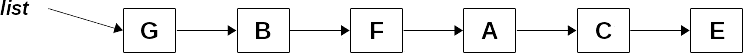
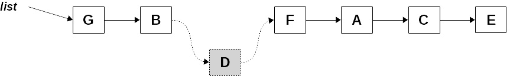
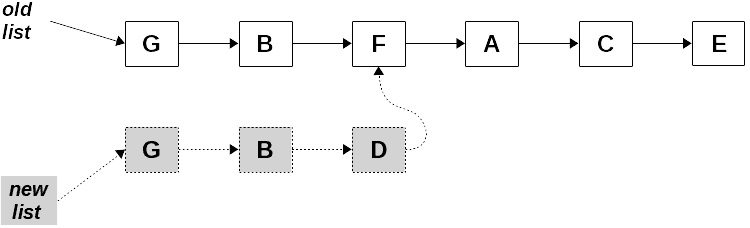
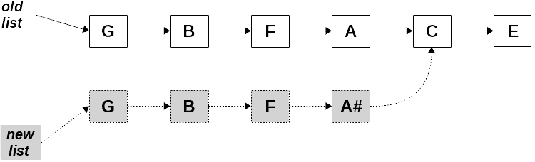
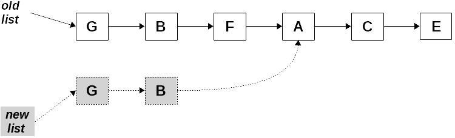
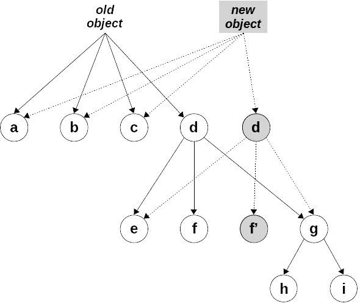

# 10

# 确保纯净性 – 不可变性

在 *第四章* *行为规范* 中，当我们考虑纯函数及其优势时，我们看到修改接收到的参数或全局变量等副作用是导致不纯的常见原因。现在，在处理 FP 的许多方面和工具的几个章节之后，让我们来谈谈 *不可变性* 的概念——如何以这种方式处理对象，使得意外修改它们变得更困难，甚至更好，变得不可能。

我们不能强迫开发者以安全、受保护的方式工作。然而，如果我们找到一种方法使数据结构不可变（这意味着它们不能直接更改，除非通过一些接口，该接口永远不会允许我们修改原始数据，而是产生新的对象），那么我们将有一个可执行的解决方案。在本章中，我们将探讨两种不同的方法来处理这样的不可变对象和数据结构：

+   *基本的 JavaScript 方法*，如冻结对象，以及克隆以创建新对象而不是修改现有对象

+   *持久数据结构*，具有允许我们更新它们而不改变原始数据，也不需要克隆一切的方法，以提高性能

警告！

本章中的代码不是生产就绪的；我想专注于主要观点，而不是所有关于属性、获取器、设置器、透镜、原型等细节，这些细节你应该考虑到一个完整、无懈可击的解决方案。对于实际开发，我建议使用第三方库，但只有在确认它确实适用于你的情况之后。我们将推荐几个这样的库，但当然，还有更多你可以使用的库。

# 直接使用 JavaScript 的方式

最大的副作用之一是函数修改其参数或全局对象的可能性。所有非原始对象都作为引用传递，所以如果你/当你修改它们时，原始对象将会改变。如果我们想阻止这种情况（而不仅仅依赖于开发者的善意和良好的编码习惯），我们可能需要考虑一些简单的 JavaScript 技术来禁止这些副作用：

+   避免直接修改它们所应用的对象的突变函数

+   使用 `const` 声明来防止变量被更改

+   冻结对象，使其无法以任何方式被修改

+   创建（更改）对象的副本以避免修改原始对象

+   使用获取器和设置器来控制更改的内容和方式

+   使用函数式概念 – *透镜* – 来访问和设置属性

让我们更详细地看看每种技术。

## 突变函数

一个常见的不期望问题的来源是，有几个 JavaScript 方法是突变者，它们会修改底层对象。（有关突变者的更多信息，请参阅[developer.mozilla.org/en-US/docs/Web/JavaScript/Reference/Global_Objects/Array#Mutator_methods](http://developer.mozilla.org/en-US/docs/Web/JavaScript/Reference/Global_Objects/Array#Mutator_methods)。）在这种情况下，仅仅使用这些方法，您就会产生可能甚至没有意识到的副作用。数组是最基本的问题来源，而问题方法列表并不短：

+   `copyWithin()`允许您在数组内部复制元素

+   `fill()`用给定的值填充数组

+   `push()`和`pop()`允许您在数组的末尾添加或删除元素

+   `shift()`和`unshift()`的工作方式与`push()`和`pop()`相同，但是在数组的开始处

+   `splice()`允许您在数组的任何位置添加或删除元素

+   `reverse()`和`sort()`在原地修改数组，反转或排序其元素

让我们看看我们在*第四章**，* *行为规范*中的*“参数突变”*部分看到的例子：

```js
// maxStrings.ts
const maxStrings = (a: string[]) => a.sort().pop();
const countries = [
  "Argentina",
  "Uruguay",
  "Brasil",
  "Paraguay",
];
console.log(maxStrings(countries)); // "Uruguay"
```

我们的`maxStrings()`函数返回数组中的最大值，但也会修改原始数组；这是`sort()`和`pop()`突变函数的副作用。在这种情况下和其他情况下，您可能需要生成数组的副本，然后使用它；展开运算符和`.slice()`都很有用：

```js
const maxStrings2 = (a: string[]): string =>
  [...a].sort().pop() as string;
const maxStrings3 = (a: string[]): string =>
  a.slice().sort().pop() as string;
console.log(maxStrings2(countries)); // "Uruguay"
console.log(maxStrings3(countries)); // "Uruguay"
console.log(countries);
// ["Argentina", "Uruguay", "Brasil", "Paraguay"]
// unchanged
```

我们`maxStrings()`函数的新版本现在都是功能性的，没有副作用，因为突变方法已经应用于原始参数的副本。顺便说一句，如果您对两个新函数中的`as string`部分感到好奇，那是因为 TypeScript 会警告您数组可能为空，而我正在告诉它我保证数组不会这样。

当然，设置方法也是突变者，并且逻辑上会产生副作用，因为它们几乎可以做任何事情。如果这种情况发生，您将不得不选择本章后面描述的其他一些解决方案。

## 常量

如果突变不是由于使用某些 JavaScript 方法引起的，那么我们可能想要尝试使用`const`定义，但不幸的是，这根本行不通。在 JavaScript 中，`const`意味着对象或数组的*引用*不能改变（您不能将其分配给不同的对象），但您仍然可以修改其属性。我们可以在以下代码中看到这一点：

```js
const myObj = { d: 22, m: 9 };
console.log(myObj);
// {d: 22, m: 9}
myObj = { d: 12, m: 4 };
// Uncaught TypeError: Assignment to constant variable.
myObj.d = 12; // but this is fine!
myObj.m = 4;
console.log(myObj);
// {d: 12, m: 4}
```

您不能通过为其分配新值来修改`myObj`的值，但您可以修改其当前值，这样只有对象的引用是恒定的，而不是对象的值本身。（顺便说一句，这种情况也会发生在数组上。）因此，如果您在所有地方都使用`const`，那么您将只能防止直接对对象和数组的赋值。更多微妙的副作用，例如更改属性或数组元素，仍然可能发生，所以这不是一个解决方案。

有两种方法可以工作——*冻结*以提供不可修改的结构，以及*克隆*以产生修改后的新对象。这些可能不是禁止修改对象的最佳方法，但它们可以用作临时解决方案。让我们更详细地看看它们，从冻结开始。

## 冻结

如果我们想要避免程序员意外或故意修改对象的可能性，冻结它是一个有效的解决方案。对象一旦被冻结，任何修改尝试都将静默失败——JavaScript 不会报告错误或抛出异常，但也不会改变对象。

在以下示例中，如果我们尝试进行与上一节相同的更改，它们将没有任何效果，`myObj`将保持不变：

```js
const myObj2 = { d: 22, m: 9 };
console.log(myObj2);
// {d: 22, m: 9}
Object.freeze(myObj2);
myObj2.d = 12; // won't have effect...
myObj2.m = 4;
console.log(myObj2);
// Object {d: 22, m: 9}
```

密封还是冻结？

不要混淆冻结和密封——`Object.seal()`当应用于对象时，禁止你向其添加或删除属性。这意味着对象的结构是不可变的，但属性本身可以更改。`Object.freeze()`不仅覆盖了密封属性，还使它们不可更改。有关更多信息，请参阅[developer.mozilla.org/en/docs/Web/JavaScript/Reference/Global_Objects/Object/seal](http://developer.mozilla.org/en/docs/Web/JavaScript/Reference/Global_Objects/Object/seal)和[developer.mozilla.org/en/docs/Web/JavaScript/Reference/Global_Objects/Object/freeze](http://developer.mozilla.org/en/docs/Web/JavaScript/Reference/Global_Objects/Object/freeze)。

这个解决方案只有一个问题——冻结对象是一个浅层操作，它冻结了属性本身，类似于`const`声明所做的那样。如果任何属性本身是对象或数组，它们仍然可以被修改。我们在这里只考虑数据；你可能还想冻结函数，例如，但对于大多数用例，你想要保护的是数据：

```js
const myObj3 = {
  d: 22,
  m: 9,
  o: { c: "MVD", i: "UY", f: { a: 56 } },
};
Object.freeze(myObj3);
console.log(myObj3);
// {d:22, m:9, o:{c:"MVD", i:"UY", f:{ a:56}}}
```

这只部分成功，正如我们尝试更改一些属性时可以看到的：

```js
myObj3.d = 8888;     // won't work, as earlier
myObj3.o.f.a = 9999; // oops, does work!!
console.log(myObj3);
// {d:22, m:9, o:{c:"MVD", i:"UY", f:{ a:9999 }}}
```

修改`myObj3.d`不起作用，因为对象已被冻结，但这并不适用于`myObj3`内的对象，因此修改`myObj3.o.f.a`是有效的。

如果我们想要使我们的对象达到真正的不可变性，我们需要编写一个将冻结对象所有级别的例程。幸运的是，通过应用递归可以轻松实现这一点。（我们在上一章的*遍历树结构*部分看到了递归的类似应用。）主要思路是首先冻结对象本身，然后递归地冻结其每个属性。我们必须确保我们只冻结对象的自身属性；我们不应该干扰对象的原型，例如：

```js
// deepFreeze.ts
const deepFreeze = <O extends OBJ>(obj: O): O => {
  if (
    obj &&
    typeof obj === "object" &&
    !Object.isFrozen(obj)
  ) {
    Object.freeze(obj);
    Object.getOwnPropertyNames(obj).forEach((prop) =>
      deepFreeze(obj[prop])
    );
  }
  return obj;
};
```

注意，与`Object.freeze()`的工作方式相同，`deepFreeze()`也会原地冻结对象。我想保持操作的原始语义，以便返回的对象始终是原始对象。如果我们想以更纯粹的方式工作，我们应该首先复制原始对象（我们将在下一节中学习如何做），然后冻结它。至于 TypeScript，返回的值与输入类型相同；被冻结的对象与类型无关。

还存在一个小问题，但结果非常糟糕——如果一个对象包含了对自身的引用会发生什么？如果我们跳过冻结已经冻结的对象，我们可以避免这个问题；向后循环引用将被忽略，因为它们引用的对象已经冻结了。所以，我们编写的逻辑处理了这个问题，没有更多的事情要做！

如果我们对一个对象应用`deepFreeze()`，我们可以安全地将它传递给任何函数，因为我们知道它不可能被修改。你还可以使用这个属性来测试一个函数是否修改了它的参数——将它们深度冻结，调用函数，如果函数依赖于修改其参数，则它将无法工作，因为更改将被默默地忽略。那么，如果一个函数涉及到接收到的对象，我们如何从函数中返回一个结果呢？这可以通过许多方式解决。一种简单的方法是使用克隆，正如我们将要看到的。

在本节中，我们处理了我们可以使用的方法之一来避免对象的变化。（检查本章末尾的*问题*部分，了解另一种通过代理冻结对象的方法。）现在，让我们看看一种涉及克隆的替代方法。

## 克隆和修改

如果不允许修改对象，你必须创建一个新的对象。例如，如果你使用 Redux，一个 reducer 是一个接收当前状态和一个动作（本质上是一个包含新数据的对象）的函数，并产生新的状态。修改当前状态是完全禁止的，我们可以通过始终使用冻结对象来避免这个错误，就像我们在上一节中看到的那样。为了满足 reducer 的要求，我们必须能够克隆原始状态，并根据接收到的动作对其进行修改。结果对象将成为新的状态。

为了使事情更加完整，我们也应该冻结返回的对象，就像我们对原始状态所做的那样。但让我们从开始说起——我们如何克隆一个对象？当然，你可以手动完成这个操作，但在处理大型、复杂对象时，你不会希望考虑这一点。（你可能想回顾一下*第五章*中的*更通用的循环*部分，我们在那里编写了一个基本的`objCopy()`函数，它提供了一种与我们在这里展示的不同方法。）例如，如果你想克隆`oldObject`以生成`newObject`，手动操作将意味着大量的代码：

```js
const oldObject = {
  d: 22,
  m: 9,
  o: { c: "MVD", i: "UY", f: { a: 56 } },
};
const newObject = {
  d: oldObject.d,
  m: oldObject.m,
  o: {
    c: oldObject.o.c,
    i: oldObject.o.i,
    f: { a: oldObject.o.f.a },
  },
};
```

这种手动解决方案显然需要做很多工作，而且容易出错；你可能会忘记一个属性！寻求更自动化的解决方案，在 JavaScript 中有几种简单的方法可以复制数组或对象，但它们都存在同样的问题。你可以使用`Object.assign()`或者通过展开来创建一个（浅层）对象的副本：

```js
const myObj = { d: 22, m: 9 };
const newObj1 = Object.assign({}, myObj);
const newObj2 = { ...myObj };
```

要创建一个（浅层）数组的副本，你可以使用`slice()`或者展开，就像我们在本章前面的*突变函数*部分看到的那样：

```js
const myArray = [1, 2, 3, 4];
const newArray1 = myArray.slice();
const newArray2 = [...myArray];
```

这些解决方案有什么问题？如果一个对象或数组包含对象（这些对象可能自身也包含对象），我们将遇到我们在冻结时遇到的问题——对象是通过引用复制的，这意味着新对象的变化也会改变旧对象：

```js
const oldObject = {
  d: 22,
  m: 9,
  o: { c: "MVD", i: "UY", f: { a: 56 } },
};
const newObject2 = Object.assign({}, oldObject);
newObject2.d = 8888;
newObject2.o.f.a = 9999;
console.log(newObject2);
// {d:8888, m:9, o: {c:"MVD", i:"UY", f: {a:9999}}} -- ok
console.log(oldObject);
// {d:22, m:9, o: {c:"MVD", i:"UY", f: {a:9999}}} -- oops!!
```

在这种情况下，注意当我们改变`newObject`的一些属性时发生了什么。改变`newObject.d`没有问题，但改变`newObject.o.f.a`也影响了`oldObject`，因为`newObject.o`和`oldObject.o`实际上指向的是同一个对象。

新时代，旧章节

自 2022 年以来，一个新的`structuredClone()`函数已经可用，所以如果你的浏览器支持它，这些页面上的代码就不需要了。更多信息，请查看[developer.mozilla.org/en-US/docs/Web/API/structuredClone](http://developer.mozilla.org/en-US/docs/Web/API/structuredClone)。

基于 JSON，有一个简单的解决方案。如果我们`stringify()`原始对象，然后`parse()`结果，我们将得到一个与旧对象完全不同的新对象：

```js
// deepCopy.ts
const jsonCopy = <O extends OBJ>(obj: O): O =>
  JSON.parse(JSON.stringify(obj));
```

通过使用`JSON.stringify()`，我们可以将我们的对象转换成一个字符串。然后，`JSON.parse()`从这个字符串中创建一个新的对象——很简单！这对数组和对象都适用，但有一个问题。如果任何对象的属性有构造函数，它们不会被调用；结果将始终由普通的 JavaScript 对象组成。（这并不是`jsonCopy()`的唯一问题；参见*问题 10.2*。）我们可以通过`Date()`简单地看到这一点：

```js
const myDate = new Date();
const newDate = jsonCopy(myDate);
console.log(typeof myDate, typeof newDate);
// object string
```

虽然`myDate`是一个对象，但`newDate`实际上是一个包含日期和时间的字符串，即我们在转换时的日期和时间，"`2023-01-15T09:23:55.125Z`"。

我们可以采用递归解决方案，就像我们处理深度冻结时做的那样，逻辑相当相似。每当我们找到一个确实是对象的属性时，我们会调用适当的构造函数：

```js
// continued...
const deepCopy = <O extends OBJ>(obj: O): O => {
  let aux: O = obj;
  if (obj && typeof obj === "object") {
    aux = new (obj as any).constructor(); // TS hack!
    Object.getOwnPropertyNames(obj).forEach((prop) => {
      aux[prop as keyof O] = deepCopy(obj[prop]);
    });
  }
  return aux;
};
```

每当我们发现一个对象的属性实际上是一个对象时，我们在继续之前会调用它的构造函数。这解决了我们遇到的问题，无论是日期还是任何对象！如果我们运行前面的代码，但使用`deepCopy()`而不是`jsonCopy()`，我们将得到`object object`作为输出，正如预期的那样。如果我们检查类型和构造函数，一切都会匹配。

由于 TypeScript 与类相比更适合与构造函数一起使用，因此需要进行一些小的修改——编写 `obj as any` 可以使类型检查工作，但这并不优雅。此外，我们还需要编写 `prop as keyof O`，因为否则 TypeScript 会抗议 `prop` 可以是任何东西，而不一定是原始类型的键。

数据更改实验现在也将正常工作：

```js
let oldObject = {
  d: 22,
  m: 9,
  o: { c: "MVD", i: "UY", f: { a: 56 } },
};
let newObject = deepCopy(oldObject);
newObject.d = 8888;
newObject.o.f.a = 9999;
console.log(newObject);
// {d:8888, m:9, o:{c:"MVD", i:"UY", f:{a:9999}}}
console.log(oldObject);
// {d:22, m:9, o:{c:"MVD", i:"UY", f:{a:56}}} -- unchanged!
```

让我们检查最后几行。修改 `newObject` 对 `oldObject` 没有影响，因此两个对象是完全独立的。

现在我们知道了如何复制一个对象，我们可以遵循以下步骤：

1.  接收一个（冻结的）对象作为参数。

1.  制作一个副本，它不会被冻结。

1.  从这个副本中取出我们可以在代码中使用的数据。

1.  随意修改副本。

1.  冻结它。

1.  将其作为函数的结果返回。

所有这些都是可行的，尽管有些繁琐。此外，还有一些限制——我们无法复制私有属性或涉及符号的属性，我们也不会复制获取器和设置器，并且与元数据相关的功能也将缺失。让我们接受这一点，并添加几个将有助于将一切整合在一起的函数。

## 获取器和设置器

当遵循上一节末尾提供的步骤时，你可能已经注意到，每次你想更新一个字段时，事情都会变得麻烦且容易出错。让我们使用一种常见的技术来添加一对函数：获取器和设置器。它们如下所示：

+   *获取器* 可以通过解冻对象来从冻结对象中获取值，以便使用。

+   *设置器* 允许你修改对象的任何属性。你可以通过创建一个新的更新版本，而保留原始版本不变来实现这一点。

让我们构建我们的获取器和设置器。

### 获取属性

在 *第六章* 的 *从对象获取属性* 部分，我们编写了一个简单的 `getField()` 函数，它可以处理从对象中获取单个属性。 (参见该章节的 *问题 6.13* 以获取缺失的配套 `setField()` 函数。) 让我们看看我们如何编写这个函数。我们可以有一个直接的版本，如下所示：

```js
// getByPath.ts
const getField =
  <O extends OBJ>(f: keyof O) =>
  (obj: O) =>
    obj[f];
```

我们甚至可以通过应用柯里化来做得更好，从而得到一个更通用的版本：

```js
// continued...
const getField2 = curry(getField);
```

我们可以通过组合一系列 `getField()` 应用来从对象中获取深层属性，但这会很麻烦。相反，让我们创建一个函数，它将接收一个路径——一个字段名称数组——并返回对象对应的部分，或者在路径不存在时返回 `undefined`。在这里使用递归是合适的，并且可以简化编码！观察以下代码：

```js
// continued...
const getByPath = <O extends OBJ>(
  arr: string[],
  obj: O
): any => {
  if (arr[0] in obj) {
    return arr.length > 1
      ? getByPath(arr.slice(1), obj[arr[0]])
      : deepCopy(obj[arr[0]]);
  } else {
    return undefined;
  }
};
```

基本上，我们查找路径中的第一个字符串是否存在于对象中。如果不存在，操作失败，因此我们返回 `undefined`。如果成功，并且路径中还有更多的字符串，我们使用递归继续深入对象；否则，我们返回属性的深层副本。

一旦一个对象被冻结，我们就无法解冻它，因此我们必须求助于创建它的一个新副本；`deepCopy()`非常适合做这件事。让我们试试我们的新函数：

```js
const myObj4 = deepFreeze({
  d: 22,
  m: 9,
  o: { c: "MVD", i: "UY", f: { a: 56 } },
});
console.log(getByPath(["d"], myObj4));
// 22
console.log(getByPath(["o"], myObj4));
// {c: "MVD", i: "UY", f: {a: 56}}
console.log(getByPath(["o", "c"], myObj4));
// "MVD"
console.log(getByPath(["o", "f", "a"], myObj4));
// 56
```

我们还可以检查返回的对象是否未冻结：

```js
const fObj = getByPath(["o", "f"], myObj4);
console.log(fObj);
// {a: 56}
fObj.a = 9999;
console.log(fObj);
// {a: 9999} -- it's not frozen
```

在这里，我们可以看到我们可以直接更新`fObj`对象，这意味着它没有被冻结。现在我们已经编写了获取器，我们可以创建一个设置器。

### 通过路径设置属性

现在，我们可以编写一个类似的`setByPath()`函数，它将接受一个路径、一个值和一个对象，并更新对象。这不是一个纯函数，但我们将用它来编写一个纯函数——稍后你就会看到！以下是代码：

```js
// setByPath.ts
const setByPath = <O extends OBJ>(
  arr: string[],
  value: any,
  obj: O
): O => {
  if (!(arr[0] in obj)) {
    (obj as any)[arr[0]] =
      arr.length === 1
        ? null
        : Number.isInteger(arr[1])
        ? []
        : {};
  }
  if (arr.length > 1) {
    return setByPath(arr.slice(1), value, obj[arr[0]]);
  } else {
    obj[arr[0] as keyof O] = value;
    return obj;
  }
};
```

在这里，我们使用递归进入对象，如果需要，创建新的属性，直到我们走完整个路径。在创建属性时有一个关键细节，那就是我们需要数组还是对象。（为什么需要对`obj`进行`as any`类型转换？这是 TypeScript 的一个问题，它反对`obj[arr[0]]`，因此我们必须“欺骗”它。奇怪的是，使用`Reflect.set()`也行！）我们可以通过检查路径中的下一个元素来确定这一点——如果是数字，则需要数组；否则，对象即可。

当我们到达路径的末尾时，我们分配新的给定值。

无缝、不可变的对象

如果你喜欢这种方式，可以查看`seamless-immutable`库，它以这种方式工作。名字中的“无缝”部分暗示了这样一个事实，即你仍然使用正常的对象——尽管是冻结的——这意味着你可以使用`map()`、`reduce()`等。你可以在[github.com/rtfeldman/seamless-immutable](http://github.com/rtfeldman/seamless-immutable)了解更多信息。

现在，你可以编写一个函数，该函数能够接受一个冻结的对象并更新其内部的属性，返回一个新的、同样冻结的对象：

```js
// continued...
const updateObject = <O extends OBJ>(
  arr: string[],
  obj: O,
  value: any
) => {
  const newObj = deepCopy(obj);
  setByPath(arr, value, newObj);
  return deepFreeze(newObj);
};
```

让我们看看它是如何工作的。为此，我们将对我们一直在使用的`myObj3`对象进行几次更新：

```js
const myObj3 = {
  d: 22,
  m: 9,
  o: { c: "MVD", i: "UY", f: { a: 56 } },
};
const new1 = updateObject(["m"], myObj3, "sep");
console.log(new1);
// {d: 22, m: "sep", o: {c: "MVD", i: "UY", f: {a: 56}}};
const new2 = updateObject(["b"], myObj3, 220960);
console.log(new2);
// {d: 22, m: 9, o: {c: "MVD", i: "UY", f: {a: 56}}, b:
  220960};
const new3 = updateObject(["o", "f", "a"], myObj3, 9999);
console.log(new3);
// {d: 22, m: 9, o: {c: "MVD", i: "UY", f: {a: 9999}}};
const new4 = updateObject(
  ["o", "f", "j", "k", "l"],
  myObj3,
  "deep"
);
console.log(new4);
// {d: 22, m: 9, o: {c: "MVD", i: "UY", f: {a: 56, j: {k:
  "deep"}}}};
```

给定这对函数，我们终于找到了一种保持不可变性的方法：

+   对象必须从一开始就冻结

+   从对象中获取数据使用`getByPath()`

+   设置数据使用`updateObject()`，它内部使用`setByPath()`

在本节中，我们学习了如何以保持对象不可变的方式从对象中获取和设置值。现在让我们看看这个概念的变体——**镜头**——它不仅允许我们获取和设置值，还可以对数据进行函数应用。

## 镜头

另一种获取和设置值的方法被称为*光学*，包括*透镜*（我们现在将研究）和*棱镜*（我们将在本章后面讨论）。什么是透镜？它们是在对象中聚焦于特定位置的功能方式（另一个光学术语！），这样我们就可以以非突变的方式访问或修改其值。在本节中，我们将查看一些透镜用法的示例，并考虑两种实现方式——首先是一个基于对象的简单实现，然后是一个更完整的实现，后者之所以有趣，是因为我们将使用的一些技术。

### 使用透镜

这两种实现将共享基本功能，所以让我们先跳过透镜是什么或它们是如何构建的，而是看看它们用法的示例。首先，让我们创建一个我们将要使用的示例对象——关于一个作家（他的名字听起来很熟悉...)和他的书籍的一些数据：

```js
const author = {
  user: "fkereki",
  name: {
    first: "Federico",
    middle: "",
    last: "Kereki",
  },
  books: [
    { name: "Google Web Toolkit", year: 2010 },
    { name: "Functional Programming", year: 2017 },
    { name: "Javascript Cookbook", year: 2018 },
  ],
};
```

我们将假设存在几个函数；我们将在接下来的章节中看到它们的实现。透镜依赖于给定属性的存在一个获取器和设置器，我们可以通过直接使用`lens()`，或者更简短的`lensProp()`来构建一个。让我们为`user`属性创建一个透镜：

```js
const lens1 = lens(getField("user"), setField("user"));
```

这定义了一个聚焦于`user`属性的透镜。由于这是一个常见的操作，它也可以更紧凑地写出来：

```js
const lens1 = lensProp("user");
```

这两个透镜都允许我们聚焦于我们使用它们的任何对象的`user`属性。使用透镜，有三个基本操作，我们将遵循传统，使用大多数（如果不是所有）库使用的名称：

+   `view()`：用于访问属性的值

+   `set()`：用于修改属性的值

+   `over()`：用于将函数应用于属性并更改其值

让我们假设函数是柯里化的，就像我们在上一章中看到的那样。因此，要访问`user`属性，我们可以写出以下内容：

```js
console.log(view(lens1)(author));
// fkereki
```

`view()`函数将其第一个参数作为透镜。当应用于对象时，它产生透镜聚焦的任何值的值——在我们的例子中，是`user`属性。当然，你可以应用一系列`view()`函数来到达对象的更深层部分：

```js
console.log(
  view(lensProp("last"))(view(lensProp("name"))(author))
);
// Kereki
```

在本节关于光学的部分，我们将始终使用完全柯里化的函数，这不仅是为了多样性，也因为通常就是这样应用这些函数的，正如你将在任何教科书中看到的那样。

而不是编写一系列`view()`调用，我们将组合透镜，以便我们可以更深入地聚焦于对象。让我们看看最后一个示例，它展示了我们如何访问一个数组：

```js
const lensBooks = lensProp("books");
console.log(
  "The author wrote " +
    view(lensBooks)(author).length +
    " book(s)"
);
// The author wrote 3 book(s)
```

在未来，如果作者结构有任何变化，只需简单更改`lensBooks`的定义就足以保持其余代码不变。

透镜在其他地方？

你也可以使用透镜来访问其他结构；参考*问题 10.8*了解如何使用透镜与数组一起使用，以及*问题 10.9*了解如何使用透镜使其与映射一起工作。

接下来，`set()` 函数允许我们设置 lenses 的焦点值：

```js
console.log(set(lens1)("FEFK")(author));
/*
{
  user: 'FEFK',
  name: { first: 'Federico', middle: '', last: 'Kereki' },
  books: [
    { name: 'Google Web Toolkit', year: 2010 },
    { name: 'Functional Programming', year: 2017 },
    { name: 'Javascript Cookbook', year: 2018 }
  ]
}
*/
```

`set()` 的结果是具有更改值的新对象。以完全柯里化的方式使用此函数可能会令人惊讶，但如果我们使用之前章节中的 `curry()` 或 `partialCurry()` 函数，我们也可以将 `set(lens1, "FEFK", author)` 写出来。

使用 `over()` 类似，它返回一个新的对象，但在这个例子中，通过应用映射函数来更改值：

```js
const triple = (x: string): string => x + x + x;
const newAuthor = over(lens1)(triple)(author);
console.log(newAuthor);
/*
{
  user: 'fkerekifkerekifkereki',
  name: { first: 'Federico', middle: '', last: 'Kereki' },
  books: [
    { name: 'Google Web Toolkit', year: 2010 },
    { name: 'Functional Programming', year: 2017 },
    { name: 'Javascript Cookbook', year: 2018 }
  ]
}
*/
```

一个基本问题是，为什么 `user` 等于 `"fkerekifkerekifkereki"`，而不是 `"FEFKFEFKFEFK"`？我们的 lens 在使用设置器时不会修改对象，而是提供一个新对象，因此我们将 `triple()` 应用到原始对象的用户属性上。

你可以用 lenses 做更多的事情，但现在我们只关注这三个。（这里有一个建议——看看 *问题 10.7*，了解如何使用 lenses 访问实际上不存在于对象中的虚拟属性的一个有趣想法。）

为了完成本节，我建议查看一些第三方光学库（[github.com/stoeffel/awesome-fp-js#lenses](http://github.com/stoeffel/awesome-fp-js#lenses) 和 [tinyurl.com/jslenses](http://tinyurl.com/jslenses) 有几个建议），以了解所有可用的功能。现在我们已经了解了使用 lenses 时可以期待什么，让我们学习如何实现它们。

### 使用对象实现 lenses

实现一个 lens 的最简单方法是通过一个具有两个属性的对象来表示它——一个获取器和设置器。在这种情况下，我们会得到类似这样的东西：

```js
// lensesWithObjects.ts
const getField =
  <O extends OBJ>(attr: string) =>
  (obj: O) =>
    obj[attr];
const setField =
  <O extends OBJ>(attr: string) =>
  (value: any) =>
  (obj: O): O => ({ ...obj, [attr]: value });
```

我们已经看到了类似的 `getField()` 和 `setField()` 函数；前者从一个对象中获取一个特定的属性，而后者返回一个具有单个更改属性的新的对象。我们现在可以定义我们的 `lens`：

```js
// continued...
type GET<O extends OBJ> = ReturnType<typeof getField<O>>;
type SET<O extends OBJ> = ReturnType<typeof setField<O>>;
const lens = <O extends OBJ>(
  getter: GET<O>,
  setter: SET<O>
) => ({
  getter,
  setter,
});
const lens = (getter: GET, setter: SET): LENS => ({
  getter,
  setter,
});
const lensProp = (attr: string) =>
  lens((getField as any)(attr), setField(attr));
```

这很容易理解——给定一个获取器和设置器，`lens()` 创建一个具有这两个属性的对象，而 `lensProp()` 通过使用 `getField()` 和 `setField()` 与 `lens()` 创建一个获取器/设置器对，这非常直接。现在我们有了我们的 lens，我们如何实现之前章节中看到的三个基本函数？查看一个属性需要应用获取器；为了保持柯里化风格，让我们手动进行柯里化：

```js
// continued...
type LENS<O extends OBJ> = ReturnType<typeof lens<O>>;
const view =
  <O extends OBJ>(someLens: LENS<O>) =>
  (someObj: O) =>
    someLens.getter(someObj);
```

通用 `LENS<>` 类型是 `lens()` 函数返回的类型。

同样，设置一个属性只是应用设置器的问题：

```js
// continued...
const set =
  <O extends OBJ>(someLens: LENS<O>) =>
  (newVal: any) =>
  (someObj: O) =>
    someLens.setter(newVal)(someObj);
```

最后，将映射函数应用于一个属性是一个“一石二鸟”的操作——我们使用获取器来获取属性的当前值，我们将函数应用于它，然后我们使用设置器来存储计算出的结果：

```js
// continued...
const over =
  <O extends OBJ>(someLens: LENS<O>) =>
  (mapFn: (arg: any) => any) =>
  (someObj: O) =>
    someLens.setter(mapFn(someLens.getter(someObj)))(
      someObj
    );
```

这需要仔细研究。我们使用 lens 的 `getter()` 函数从输入对象中获取一些属性，我们将映射函数应用于获取的值，然后我们使用 lens 的 `setter()` 函数来生成一个新的具有更改属性的对象。

现在我们已经可以执行所有三种操作，我们有了工作的透镜！关于组合呢？透镜有一个独特的特性——它们是反向组合的，从左到右，所以你从最通用的开始，以最具体的结束。这确实与直觉相反；我们将在下一节中更详细地了解这一点，但现在，我们将保持传统：

```js
// continued...
const composeTwoLenses = <O extends OBJ>(
  lens1: LENS<O>,
  lens2: LENS<O>
) => ({
  getter: (obj: O) => lens2.getter(lens1.getter(obj)),
  setter: (newVal: any) => (obj: O) =>
    lens1.setter(lens2.setter(newVal)(lens1.getter(obj)))(
      obj
    ),
});
```

代码有点令人印象深刻，但并不难理解。两个透镜组合的获取器是使用第一个透镜的获取器，然后应用第二个透镜的获取器到该结果上。组合的设置器稍微复杂一些，但遵循相同的思路；你能看到它是如何工作的吗？现在，我们可以轻松地组合透镜；让我们从一个虚构的无意义对象开始：

```js
const deepObject = {
  a: 1,
  b: 2,
  c: {
    d: 3,
    e: {
      f: 6,
      g: { i: 9, j: { k: 11 } },
      h: 8,
    },
  },
};
```

现在，我们可以定义一些透镜：

```js
const lC = lensProp("c");
const lE = lensProp("e");
const lG = lensProp("g");
const lJ = lensProp("j");
const lK = lensProp("k");
```

我们可以尝试以几种不同的方式组合我们的新透镜，只是为了变化，以检查一切是否正常工作：

```js
const lJK = composeTwoLenses(lJ, lK);
const lGJK = composeTwoLenses(lG, lJK);
const lEGJK = composeTwoLenses(lE, lGJK);
const lCEGJK1 = composeTwoLenses(lC, lEGJK);
console.log(view(lCEGJK1)(deepObject));
const lCE = composeTwoLenses(lC, lE);
const lCEG = composeTwoLenses(lCE, lG);
const lCEGJ = composeTwoLenses(lCEG, lJ);
const lCEGJK2 = composeTwoLenses(lCEGJ, lK);
console.log(view(lCEGJK2)(deepObject));
/*
11 both times
*/
```

使用 `lCEGJ1`，我们编写了一些透镜，从后者开始。使用 `lCEGJ2`，我们从透镜的开始部分开始，但结果是一样的。现在，让我们尝试设置一些值。我们想要将 `k` 属性设置为 `60`。我们可以通过使用刚刚应用的相同透镜来完成这个操作：

```js
const setTo60 = set(lCEGJK1)(60)(deepObject);
/*
{
  a: 1,
  b: 2,
  c: {
    d: 3,
    e: {
      f: 6,
      g: { i: 9, j: { k: 60 } },
      h: 8,
    },
  },
};
*/
```

组合透镜工作得非常完美，值已经改变。（此外，还返回了一个新对象；原始对象未修改，正如我们所希望的。）为了完成，让我们验证我们是否可以使用 `over()` 与我们的透镜一起使用，并尝试复制 `k` 值，使其变为 `22`。为了变化，让我们使用另一个组合透镜，尽管我们知道它以相同的方式工作：

```js
const setToDouble = over(lCEGJK2)((x) => x * 2)(deepObject);
/*
{
  a: 1,
  b: 2,
  c: {
    d: 3,
    e: {
      f: 6,
      g: { i: 9, j: { k: 22 } },
      h: 8,
    },
  },
};
*/
```

现在，我们已经学会了如何以简单的方式实现透镜。然而，让我们考虑一种不同的方法来实现相同的目标，即使用实际函数来表示透镜。这将允许我们以标准方式执行组合，而无需任何特殊的透镜函数。

### 使用函数实现透镜

之前使用对象实现的透镜实现效果很好，但我们想看看一种不同的做事方式，这将使我们能够使用更高级的函数概念。这将涉及我们在 *第十二章*，*构建更好的容器* 中将要更详细分析的一些概念，但在这里，我们将只使用我们需要的，这样你就不必现在就去读那章！我们的透镜将以与之前相同的方式工作，只是由于它们将是函数，我们将能够不使用任何特殊的组合代码来组合它们。

这里的关键概念是什么？透镜将是一个基于获取器和设置器对的功能，它将构建一个 *容器*（实际上是一个对象，但让我们使用容器名称）并具有一个 `value` 属性和一个 `map` 方法（在 *第十二章*，*构建更好的容器* 中，我们将看到这是一个 *函子*，但你现在不需要知道这一点）。通过具有特定的映射方法，我们将实现我们的 `view()`、`set()` 和 `over()` 函数。

我们的定义 `lens()` 函数如下。我们将在稍后解释其细节：

```js
// lensesWithFunctions.ts
const lens =
  <O extends OBJ>(getter: GET<O>, setter: SET<O>) =>
  (fn: FN) =>
  (obj: O) =>
    fn(getter(obj)).map((value: any) =>
      setter(value)(obj));
```

让我们考虑它的参数：

+   `getter` 和 `setter` 参数与之前相同。

+   `fn` 函数是“魔法调料”，让一切工作；根据我们想要对透镜做什么，我们将提供一个特定的函数。我们将在稍后了解更多关于这个！

+   `obj` 参数是我们想要应用透镜的对象。

让我们编写我们的 `view()` 函数。为此，我们需要一个辅助类 `Constant`，它给定一个值 `v`，产生一个具有该值的容器和一个返回相同容器的 `map` 函数：

```js
// continued...
class Constant<V> {
  private value: V;
  map: FN;
  constructor(v: V) {
    this.value = v;
    this.map = () => this;
  }
}
```

现在，我们可以编写 `view()` 代码了：

```js
// continued...
const view =
  <O extends OBJ, V>(someLens: LENS<O>) =>
  (obj: O) =>
    someLens((x: V) => new Constant(x))(obj).value;
const user = view(lensProp("user"), author);
/*
fkereki
*/
```

这里发生了什么？让我们一步一步地跟踪；这有点棘手！

1.  我们使用 `lensProp()` 创建一个聚焦于 `user` 属性的透镜。

1.  我们的 `view()` 函数将构建常数的函数传递给 `lens()`。

1.  我们的 `lens()` 函数使用获取器来访问 `author` 对象中的用户属性。

1.  然后，我们接收到的值被用来创建一个常数容器。

1.  调用 `map()` 方法，它返回相同的容器。

1.  访问容器的 `value` 属性，这就是在第 *3* 步中获取器的返回值。哇！

在掌握这些之后，让我们继续学习 `set()` 和 `over()`，这需要不同的辅助函数来创建一个值可能变化的容器：

```js
// continued...
class Variable<V> {
  private value: V;
  map: FN;
  constructor(v: V) {
    this.value = v;
    this.map = (fn) => new Variable(fn(v));
  }
}
```

在这种情况下（与 `Constant` 对象相反），`map()` 方法确实做了些事情——当提供一个函数时，它将此函数应用于容器的值，并返回一个新的 `Variable` 对象，带有结果值。现在可以实施 `set()` 函数：

```js
// continued...
const set =
  <O extends OBJ, V>(someLens: LENS<O>) =>
  (newVal: V) =>
  (obj: O) =>
    someLens(() => new Variable(newVal))(obj).value;
const changedUser = set(lensProp("user"))("FEFK")(author);
/*
{
  user: 'FEFK',
  name: { first: 'Federico', middle: '', last: 'Kereki' },
  books: [
    { name: 'Google Web Toolkit', year: 2010 },
    { name: 'Functional Programming', year: 2017 },
    { name: 'Javascript Cookbook', year: 2018 }
  ]
}
*/
```

在这种情况下，当透镜调用容器的 `map()` 方法时，它将产生一个新的容器和一个新值，这产生了所有差异。为了理解它是如何工作的，请遵循我们之前看到的 `get()` 的相同六个步骤——唯一的区别将在 *第 5* 步，那里将产生一个新的、不同的容器。

现在我们已经成功通过了这段（确实有点棘手！）代码，`over()` 函数很简单，唯一的区别是，你不再映射到一个给定的值，而是使用提供的映射函数 `mapfn` 来计算容器的新值：

```js
// continued...
const over =
  <O extends OBJ, V>(someLens: LENS<O>) =>
  (mapfn: FN) =>
  (obj: O) =>
    someLens((x: V) => new Variable(mapfn(x)))(obj).value;
const newAuthor = over(lensProp("user"))(triple)(author);
/*
{
  user: 'fkerekifkerekifkereki',
  name: { first: 'Federico', middle: '', last: 'Kereki' },
  books: [
    { name: 'Google Web Toolkit', year: 2010 },
    { name: 'Functional Programming', year: 2017 },
    { name: 'Javascript Cookbook', year: 2018 }
  ]
}
*/
```

如您所见，`set()` 和 `over()` 之间的区别在于，在前者中，你提供一个值来替换原始值，而在后者中，你提供一个函数来计算新值。除此之外，两者相似。

最后，让我们验证 `compose()` 是否可以应用于基于函子（functor）的透镜：

```js
// continued...
const lastName = view(
  compose(lensProp("name"), lensProp("last"))
)(author);
/*
Kereki
*/
```

在这里，我们为 `name` 和 `last` 创建了两个单独的透镜，并使用我们之前在 *第八章* 中开发的相同的 `compose()` 函数将它们组合起来，*连接函数*。使用这个组合透镜，我们没有任何问题地关注了作者的姓氏，所以一切如预期进行。

方向错误吗？

透镜应该从左到右组合似乎与逻辑相悖；这似乎是倒退的。这是让开发者感到困扰的事情，如果你在谷歌上搜索解释，你会找到很多。为了自己回答这个问题，我建议详细说明`compose()`是如何工作的——两个函数就足够了——然后替换透镜的定义；你会看到为什么以及如何一切都能正常工作。

现在我们已经了解了透镜，我们可以继续了解**棱镜**，另一种光学工具。

## 棱镜

如我们在上一节所见，透镜在处理产品类型时很有用。然而，棱镜在处理*求和*类型时很有用。但它们是什么？（我们将在本书的最后一章更详细地探讨产品类型和联合类型。）产品类型总是由相同的选项构建而成，例如一个类中的对象，而求和类型可能具有不同的结构——例如额外的或缺失的属性。当你使用透镜时，你假设你要应用透镜的对象具有已知结构且没有变化，但如果对象具有不同的结构，你将使用什么？答案是棱镜。让我们首先看看它们是如何使用的；然后，我们将检查它们的实现。

### 使用棱镜

使用棱镜与使用透镜类似，但要注意当某个属性不存在时会发生什么。让我们看看上一节的一个例子：

```js
const author = {
  user: "fkereki",
  name: {
    first: "Federico",
    middle: "",
    last: "Kereki",
  },
  books: [
    { name: "Google Web Toolkit", year: 2010 },
    { name: "Functional Programming", year: 2017 },
    { name: "Javascript Cookbook", year: 2018 },
  ],
};
```

如果我们想使用棱镜访问`user`属性，我们会写一些类似以下的内容（现在不用担心细节）：

```js
const pUser = prismProp("user");
console.log(preview(pUser, author).toString());
/*
fkereki
*/
```

这里，我们使用`prismProp()`函数定义了一个棱镜，这与我们之前的`lensProp()`函数类似。然后，我们使用棱镜与`preview()`函数一起使用，这与透镜中的`get()`函数类似，结果与使用透镜一样——没有惊喜。如果我们请求一个不存在的别名属性会发生什么？让我们看看：

```js
const pPseudonym = prismProp("pseudonym");
console.log(preview(pPseudonym, author).toString());
/*
undefined
*/
```

到目前为止，我们可能没有看到任何区别，但让我们看看如果我们尝试组合具有多个缺失属性的透镜或棱镜会发生什么。假设你想使用透镜访问一个（缺失的！）`pseudonym.usedSince`属性，而不采取预防措施并检查属性是否存在。在这里，你会得到以下输出：

```js
const lPseudonym = lensProp("pseudonym");
const lUsedSince = lensProp("usedSince");
console.log(
  "PSEUDONYM, USED SINCE",
  view(compose(lPseudonym, lUsedSince))(author)
);
/*
TypeError: Cannot read property 'usedSince' of undefined
.
. many more error lines, snipped out
.
*/
```

另一方面，由于棱镜已经考虑了缺失的值，这不会引起任何问题，我们会得到一个`undefined`结果；这就是为什么`preview()`有时被称为`getOptional()`的原因：

```js
const pUsedSince = prismProp("usedSince");
console.log(
  preview(compose(pPseudonym, pUsedSince))(
    author
  ).toString()
);
/*
undefined
*/
```

如果我们想设置一个值会发生什么？与`set()`函数类似的是`review()`函数；让我们看看它将如何工作。想法是，无论我们指定什么属性，只有在属性已经存在的情况下才会设置该属性。所以，如果我们尝试更改`user.name`属性，这将起作用：

```js
const fullAuthor2 = review(
  compose(prismProp("name"), prismProp("first")),
  "FREDERICK",
  author
);
```

然而，如果我们尝试修改（不存在的）`pseudonym`属性，将返回原始的、未更改的对象：

```js
const fullAuthor3 = review(pPseudonym, "NEW ALIAS", author);
// returns author, unchanged
```

因此，使用棱镜可以处理所有可能的缺失或可选字段。我们如何实现这种新的光学类型？使用了新的名称（`preview()` 和 `review()` 代替 `get()` 和 `set()`），但这个差异很小。让我们看看。

### 实现棱镜

我们如何实现棱镜？我们将从我们的透镜实现中汲取灵感并做出一些更改。在获取属性时，我们必须检查我们正在处理的对象是否不是 `null` 或 `undefined`，以及我们想要的属性是否在对象中。我们可以通过对我们原始的 `getField()` 函数进行一些小的更改来做到这一点：

```js
// prisms.ts
const getFieldP =
  <O extends OBJ>(attr: string) =>
  (obj: O) =>
    obj && attr in obj ? obj[attr] : undefined;
```

在这里，我们检查对象和属性的存在性 – 如果一切正常，我们返回 `obj[attr]`；否则，我们返回 `undefined`。`setField()` 的更改非常相似：

```js
// continued...
const setFieldP =
  <O extends OBJ>(attr: string) =>
  (value: any) =>
  (obj: O): O =>
    obj && attr in obj
      ? { ...obj, [attr]: value }
      : { ...obj };
```

如果对象和属性都存在，我们通过更改属性值返回一个新的对象；否则，我们返回对象的副本。这就是全部！定义其他函数直接基于 `lens()`、`lensProp()` 等等，所以我们将跳过这一点。

现在我们已经学会了如何以函数式的方式访问对象，让我们分析那些可以非常高效地修改而不需要原始对象完整副本的持久化数据结构。

# 创建持久化数据结构

如果你想在数据结构中更改某些内容，只是直接去更改它，你的代码将充满副作用。另一方面，每次都复制完整的结构是时间和空间的浪费。有一个中间方案与此有关，即持久化数据结构，如果处理得当，可以在创建新结构的同时应用更改。

既然有那么多可能的数据结构可以工作，我们只需看看几个例子：

+   与列表一起工作，这是最简单的数据结构之一

+   与对象一起工作，这是 JavaScript 程序中非常常见的需求

+   处理数组，这将证明更难处理

让我们开始吧！

## 与列表一起工作

让我们考虑一个简单的程序 – 假设你有一个列表并想向其中添加一个新元素。你会怎么做？在这里，我们可以假设每个节点都是一个 `NodeList` 对象：

```js
// lists.ts
class ListNode<T> {
  value: T;
  next: ListNode<T> | null;
  constructor(value: any, next = null) {
    this.value = value;
    this.next = next;
  }
}
```

可能的列表如下所示 – `list` 变量将指向第一个元素。看看下面的图；你能说出列表中缺少什么，以及在哪里吗？



图 10.1 – 初始列表

如果你想在 B 和 F（示例列表代表音乐家会理解的概念，即**大三和弦**，但缺少 D 音）之间添加 D，最简单的解决方案是添加一个新节点并更改一个现有节点。这将导致以下结果：



图 10.2 – 列表中现在有一个新元素——我们必须修改一个现有的元素来执行添加操作

然而，以这种方式工作显然是非函数性的，我们显然正在修改数据。有另一种工作方式——创建一个持久数据结构，其中所有更改（插入、删除和修改）都是单独进行的，注意不要修改现有数据。另一方面，如果结构的一部分可以重用，这是为了提高性能。进行持久更新将返回一个新的列表，其中一些节点是前一个的一些副本，但原始列表没有任何更改。这可以在以下图中看到：



图 10.3 – 虚线元素显示新返回的列表，它与旧列表共享一些元素

以这种方式更新结构需要复制一些元素以避免修改原始结构，但列表的一部分是共享的。

当然，我们也会处理更新或删除。再次从以下图中显示的列表开始，如果我们想更新其第四个元素，解决方案意味着创建一个新的列表子集，包括第四个元素，同时保持其余部分不变：



图 10.4 – 我们列表中的更改元素

删除元素也会类似。让我们按照以下方式删除原始列表中的第三个元素 F：



图 10.5 — 删除第三个元素后的原始列表

使用列表或其他结构始终可以解决以提供数据持久性。目前，让我们专注于对我们来说可能最重要的工作类型——处理简单的 JavaScript 对象。毕竟，所有数据结构都是 JavaScript 对象，所以如果我们能处理对象，我们就能处理其他结构。

## 更新对象

此方法也可以应用于更常见的需求，例如修改对象。这对于 Redux 用户来说是一个非常不错的想法——一个 reducer 可以被编程为接收旧状态作为参数，并生成一个带有最小必要更改的更新版本，而不会以任何方式改变原始状态。

假设你有一个以下对象：

```js
myObj = {
    a: ...,
    b: ...,
    c: ...,
    d: {
        e: ...,
        f: ...,
        g: {
            h: ...,
            i: ...
        }
    }
};
```

假设你想以持久的方式修改`myObj.d.f`属性的值。而不是复制整个对象（使用我们之前编写的`deepCopy()`函数），我们可以创建一个新的对象，它与前一个对象有多个共同属性，但对于修改的部分有新的属性。这可以在以下图中看到：



图 10.6 – 一种持久编辑对象的方法 – 即通过共享一些属性和创建其他属性

旧对象和新对象共享大多数属性，但新的 `d` 和 `f` 属性，所以你在创建新对象时最小化了更改。

如果你想手动完成这项工作，你需要以一种非常繁琐的方式写下类似以下的内容。大多数属性都来自原始对象，但 `d` 和 `d.f` 是新的：

```js
newObj = {
  a: myObj.a,
  b: myObj.b,
  c: myObj.c,
  d: {
    e: myObj.d.e,
    f: the new value,
    g: myObj.d.g,
  },
};
```

在本章前面，当我们决定编写一个克隆函数时，我们看到了一些类似的代码。这里，让我们尝试一种不同的解决方案。实际上，这种更新可以自动化：

```js
// objects.ts
const setIn = <O extends OBJ>(
  arr: (string | number)[],
  value: any,
  obj: O
): O => {
  const newObj = Number.isInteger(arr[0]) ? [] : {};
  Object.keys(obj).forEach((k) => {
    (newObj as any)[k] = k !== arr[0] ? obj[k] : null;
  });
  (newObj as any)[arr[0]] =
    arr.length > 1
      ? setIn(arr.slice(1), value, obj[arr[0]])
      : value;
  return newObj as O;
};
```

逻辑是递归的，但并不复杂。首先，我们在当前级别确定我们需要什么类型的对象——一个数组还是一个对象。然后，我们将原始对象的所有属性复制到新对象中，除了我们要更改的属性。最后，我们将该属性设置为给定的值（如果我们已经完成了属性名称的路径），或者我们使用递归进一步复制。

排序参数

注意参数的顺序 – 首先是路径，然后是值，最后是对象。我们正在应用将最稳定的参数放在前面，最易变的参数放在后面的概念。如果你将这个函数 currying 化，你可以将相同的路径应用到几个不同的值和对象上，如果你固定路径和值，你仍然可以使用这个函数与不同的对象一起使用。

让我们尝试这个逻辑。我们将从一个多级且具有多个对象数组的无意义对象开始，以增加多样性：

```js
const myObj1 = {
  a: 111,
  b: 222,
  c: 333,
  d: {
    e: 444,
    f: 555,
    g: {
      h: 666,
      i: 777,
    },
    j: [{ k: 100 }, { k: 200 }, { k: 300 }],
  },
};
```

我们可以通过更改 `myObj.d.f` 为新值来测试这一点：

```js
let myObj2 = setIn(["d", "f"], 88888, myObj1);
/*
{
  a: 111,
  b: 222,
  c: 333,
  d: {
    e: 444,
    f: 88888,
    g: { h: 666, i: 777 },
    j: [{ k: 100 }, { k: 200 }, { k: 300 }],
  }
}
*/
console.log(myObj1.d === myObj2.d);     // false
console.log(myObj1.d.f === myObj2.d.f); // false
console.log(myObj1.d.g === myObj2.d.g); // true
```

底部的日志验证了算法是否正确工作 – `myObj2.d` 是一个新对象，但 `myObj2.d.g` 重新使用了 `myObj1` 的值。

更新第二个对象中的数组让我们测试逻辑在这些情况下的工作情况：

```js
const myObj3 = setIn(["d", "j", 1, "k"], 99999, myObj2);
/*
{
  a: 111,
  b: 222,
  c: 333,
  d: {
    e: 444,
    f: 88888,
    g: { h: 666, i: 777 },
    j: [{ k: 100 }, { k: 99999 }, { k: 300 }],
  }
}
*/
console.log(myObj1.d.j === myObj3.d.j);       // false
console.log(myObj1.d.j[0] === myObj3.d.j[0]); // true
console.log(myObj1.d.j[1] === myObj3.d.j[1]); // false
console.log(myObj1.d.j[2] === myObj3.d.j[2]); // true
```

我们可以将 `myObj1.d.j` 数组中的元素与新创建的对象中的元素进行比较。你会发现数组是一个新的，但有两个元素（那些未更新的）仍然是 `myObj1` 中的相同对象。

这显然不足以解决问题。我们的逻辑可以更新现有字段，甚至如果它不存在，还可以添加它，但你还需要消除旧属性。库通常提供更多函数，但让我们现在专注于删除属性，这样我们可以看看我们可以对对象进行的其他一些重要结构更改：

```js
// continued...
const deleteIn = <O extends OBJ>(
  arr: (string | number)[],
  obj: O
): O => {
  const newObj = Number.isInteger(arr[0]) ? [] : {};
  Object.keys(obj).forEach((k) => {
    if (k !== arr[0]) {
      (newObj as any)[k] = obj[k];
    }
  });
  if (arr.length > 1) {
    (newObj as any)[arr[0]] = deleteIn(
      arr.slice(1),
      obj[arr[0]]
    );
  }
  return newObj as O;
};
```

这里的逻辑与 `setIn()` 的逻辑相似。区别在于我们并不总是从原始对象复制所有属性到新对象；我们只在没有到达路径属性数组的末尾时才这样做。在更新后的测试系列中继续，我们得到以下结果：

```js
const myObj4 = deleteIn(["d", "g"], myObj3);
const myObj5 = deleteIn(["d", "j"], myObj4);
console.log(myObj5);
// { a: 111, b: 222, c: 333, d: { e: 444, f: 88888 } }
```

使用这对函数，我们可以通过以高效的方式修改、添加和删除，而不必无谓地创建新对象来管理持久化对象。

一个小贴士

最著名的用于处理不可变对象的库是名为`immutable.js`的库，可以在[immutable-js.com/](http://immutable-js.com/)找到。它唯一的弱点是它的文档臭名昭著地晦涩难懂。然而，有一个简单的解决方案——查看[untangled.io/the-missing-immutable-js-manual/](http://untangled.io/the-missing-immutable-js-manual/)上的*The Missing Immutable.js Manual*，那里有你需要的一切示例，你将不会遇到任何麻烦！

## 一个最后的注意事项

使用持久化数据结构需要一些克隆操作，但你是如何实现一个持久化数组的呢？如果你思考这个问题，你会意识到在这种情况下，除了在每次操作后克隆整个数组之外，没有其他出路。这意味着像更新数组中的一个元素这样的操作，原本是常数时间的，现在将需要与数组大小成比例的时间。

复杂度问题

在算法复杂度方面，更新操作从 O(1)变成了 O(*n*)。同样，访问一个元素可能变成 O(*log n*)的操作，其他操作，如映射和归约，也可能观察到类似的减速。

我们如何避免这种情况？没有简单的解决方案。例如，你可能发现数组在内部表示为二叉搜索树（甚至更复杂的数据结构），而持久化库提供了必要的接口，这样你仍然可以将其用作数组，而不会注意到内部差异。

当使用这类库时，没有克隆的不可变更新的优势可能会部分被一些可能变慢的操作所抵消。如果这成为你应用程序的瓶颈，你可能不得不改变实现不可变性的方式，甚至想方设法改变你的基本数据结构以避免时间损失，或者至少最小化它。

# 总结

在本章中，我们探讨了两种不同的方法（由常用的不可变库使用）通过处理不可变对象和数据结构来避免副作用——一种基于使用 JavaScript 的对象冻结，以及一些特殊的克隆逻辑，另一种基于应用持久数据结构的概念，这些方法允许进行各种更新，而不改变原始数据或需要完全克隆。

在 *第十一章* *实现设计模式* 中，我们将关注面向对象程序员经常提出的问题——设计模式在函数式编程（FP）中是如何使用的？它们是必需的、可用的还是可用的？它们是否仍然在实践，但新的焦点是函数而不是对象？我们将通过几个示例来回答这些问题，展示它们在哪里以及如何与常规的面向对象（OOP）实践等效或不同。

# 问题

10.1 `jsonCopy()` 函数在处理日期时存在问题，但这并非全部。如果我们尝试复制包含映射的对象会发生什么？集合？正则表达式？函数？

10.2 `jsonCopy()`；`deepCopy()` 在处理相同类型的对象时表现如何？它可以被增强吗？

10.3 `JSON.stringify()` 在处理此类情况时会提出抗议。你该如何修复我们的 `deepCopy()` 函数以避免这个问题？我们在 `deepFreeze()` 函数中处理了这个问题，但那个解决方案在这里不能使用；需要不同的方法。

10.4 `freezeByProxy(obj)` 函数将应用这个想法来禁止对对象的所有类型的更新（添加、修改或删除属性）。记住，如果一个对象有其他对象作为属性，你需要递归地工作！

10.5 `insertAfter(list, newKey, oldKey)` 函数将创建一个新的列表，但在 `oldKey` 节点之后添加一个带有 `newKey` 的新节点。在这里，你需要假设列表中的节点是由以下逻辑创建的：

```js
type MUSICAL_KEY = string;
class Node {
  key: MUSICAL_KEY;
  next: Node | null;
  constructor(key: MUSICAL_KEY, next: Node | null) {
    this.key = key;
    this.next = next;
  }
}
const c3 =
  new Node("G",
    new Node("B",
      new Node("F",
        new Node("A",
          new Node("C",
            new Node("E", null)
          )
        )
      )
    )
  );
```

10.6 `composeLenses()` 函数将允许你组合尽可能多的简单透镜，而不是像 `composeTwoLenses()` 那样仅限于两个，正如我们在 *第八章* *连接函数**中做的那样，当我们从 `composeTwo()` 转换到通用的 `compose()` 函数时。

10.7 `getField()` 和 `setField()`。然后，我们使用组合来访问更深的属性。你能通过提供一个路径来创建一个透镜，从而允许更短的代码吗？

10.8 `author` 和返回以 LAST NAME, FIRST NAME 格式的作者全名？其次，你能写一个 setter，给定一个全名，将其分成两半并设置其首尾名吗？有了这两个函数，你可以编写以下内容：

```js
const fullNameLens = lens(
...your getter...,
...your setter...
);
console.log(view(fullNameLens, author));
/*
Kereki, Federico
*/
console.log(set(fullNameLens, "Doe, John", author));
/*
{
  user: 'fkereki',
  name: { first: ' John', middle: '', last: 'Doe' },
…
}
*/
```

10.9 **数组的透镜？** 如果你创建了以下代码中的透镜并将其应用于数组，会发生什么？如果存在问题，你能修复它吗？

```js
const getArray = curry((ind, arr) => arr[ind]);
const setArray = curry((ind, value, arr) => {
  arr[ind] = value;
  return arr;
});
const lensArray = (ind) =>
  lens(getArray(ind), setArray(ind));
```

10.10 `lensMap()` 函数来创建一个可以用来访问和修改映射的透镜。你可能需要查看以下内容以获取有关克隆映射的更多信息：[developer.mozilla.org/en-US/docs/Web/JavaScript/Reference/Global_Objects/Map](http://developer.mozilla.org/en-US/docs/Web/JavaScript/Reference/Global_Objects/Map)。你的函数应该声明如下。你还将不得不编写几个辅助函数：

```js
const lensMap = key => lens(getMap(key), setMap(key));
```
