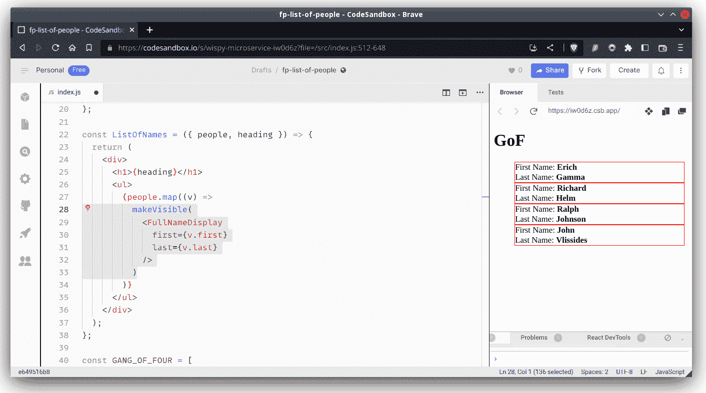

# 以函数式方式实现设计模式

在 *第十章* *确保纯净性* 中，我们看到了解决不同问题的几个函数式技术。然而，习惯于使用 OOP 的程序员可能会发现我们遗漏了一些在命令式编码中常用的一些知名公式和解决方案。由于设计模式是众所周知的，程序员可能已经了解它们在其他语言中的应用，因此了解函数式实现是如何进行的非常重要。

在本章中，我们将考虑 OOP 中常见的 **设计模式** 提供的解决方案，以查看其在 FP 中的等效模式。这将帮助您从 OOP 过渡到更函数式的方法，并通过查看问题的替代解决方案来了解 FP 的力量和方法。

尤其是我们将研究以下主题：

+   **设计模式** 的概念及其适用范围

+   一些 OOP 标准模式和如果需要我们在 FP 中有什么替代方案

+   **观察者模式**，它导致 **响应式编程**，一种处理事件的声明式方法

+   FP 设计模式，与 OOP 模式无关

在本章中，我们不会过多地担心打字和 TypeScript，因为我们想专注于模式，最小化并抽象其他所有内容。

# 理解设计模式

在软件工程中最相关的书籍之一是 *《设计模式：可复用面向对象软件元素》*（1994），由 **四人帮**（**GoF**）—— Erich Gamma、Richard Helm、Ralph Johnson 和 John Vlissides 所著。这本书介绍了大约二十个 OOP 模式，并被认为在计算机科学中非常重要。

**模式** 实际上是一个建筑设计的概念，最初由建筑师 Christopher Alexander 定义。然而，在软件术语中，**设计模式** 是一种适用于软件设计中常见问题的通用、可重用解决方案。它不是具体的完成和编码的设计，而是一种描述解决方案（也用 *模板* 一词）的描述，可以解决在许多上下文中出现的问题。鉴于它们的优点，设计模式是开发者可以用于不同类型的系统、编程语言和环境中的最佳实践。

GoF 书籍显然专注于 OOP，其中一些模式不适用于或应用于 FP。其他模式是不必要的或无关的，因为函数式语言已经为相应的面向对象问题提供了标准解决方案。即使存在这种困难，由于大多数程序员已经接触过 OOP 设计模式，并且通常试图在其他上下文中（如 FP）应用它们，因此考虑原始问题并查看如何产生新的解决方案是有意义的。标准基于对象的解决方案可能不适用，但问题仍然存在，因此了解如何解决它们仍然有效。

模式通常用四个基本、基本元素来描述：

+   一个简单、简短的**名称**，用于描述问题、解决方案及其后果。当与同事交谈、解释设计决策或描述特定实现时，名称很有帮助。

+   模式适用的**上下文** – 需要解决方案的具体情况，可能还需要满足一些附加条件。

+   一个**解决方案**，列出解决给定情况所需的元素（类、对象、函数、关系等）。

+   应用该模式可能产生的**后果**（结果和权衡）。你可能从解决方案中获得一些收益，但也可能意味着一些损失。

在本章中，我们假设你已经了解我们将描述和使用的所有设计模式，因此我们只会提供一些关于它们的细节。相反，我们将关注 FP 如何使问题变得无关紧要（因为应用函数式技术解决它的方法很明显）或者以某种方式解决它。

此外，我们不会涵盖所有 GoF 模式；我们只会关注那些最有趣的，也就是说，那些在应用函数式编程（FP）与面向对象编程（OOP）相比能带来更多差异的模式。

## 设计模式类别

根据它们的焦点，设计模式通常被分为几个不同的类别。以下列表中的前三个出现在原始 GoF 书中，但后来又增加了更多类别。具体如下：

+   **行为设计模式**涉及对象之间的交互和通信。与其关注对象是如何创建或构建的，关键考虑的是如何将它们连接起来，以便在执行复杂任务时能够协作，最好是以提供已知优势的方式，例如减少耦合或增强内聚性。

+   **创建型设计模式**处理以适合当前问题的方式创建对象的方法。通过它们，你可以决定在几个替代对象之间进行选择，这样程序可以以不同的方式工作，这取决于可能在编译时或运行时已知的参数。

+   **结构设计模式**涉及对象的组合，从许多单个部分形成更大的结构，并实现对象之间的关系。一些模式暗示了继承或接口的实现，而其他模式则使用不同的机制，所有这些机制都是为了能够在运行时动态地改变对象的组合方式。

+   **并发模式**处理多线程编程。尽管函数式编程（FP）通常非常合适（例如，考虑到缺乏赋值和副作用），但由于我们使用的是 JavaScript，这些模式对我们来说并不非常相关。

+   **架构模式**更倾向于高层次，比我们之前列出的模式范围更广，并为软件架构问题提供一般性解决方案。就目前而言，我们在这本书中不考虑这些问题，因此我们也不会处理这些问题。

这些类别并不是固定不变的，或者说是不可动摇的。在 GoF（Gang of Four）原始书籍出版 15 年后，其三位作者中的三位（参见[www.informit.com/articles/article.aspx?p=1404056](http://www.informit.com/articles/article.aspx?p=1404056)上的*Design Patterns 15 Years Later: An Interview with Erich Gamma, Richard Helm, and Ralph Johnson*文章）提出了一组新的类别列表——*核心*、*创建型*（类似于原始类别，但增加了*依赖注入*模式，我们将在稍后研究）、*外围*和*其他*。

旧的好习惯

耦合和内聚是早在面向对象编程流行之前就使用的术语；它们可以追溯到 20 世纪 60 年代末，当时 Larry Constantine 的*结构化设计*一书出版。耦合衡量任何两个模块之间的相互依赖性，而内聚性与所有模块组件真正属于一起的程度有关。低耦合和高内聚是软件设计值得追求的目标，因为它们意味着相关的事物靠近，而不相关的事物分离。

沿着这个思路，你还可以将设计模式分类为*对象模式*（涉及对象之间的动态关系）和*类模式*，它们处理类与子类之间的关系（这些关系在编译时静态定义）。我们不会过多关注这种分类，因为我们的观点更多地与行为和功能有关，而不是类和对象。

如前所述，我们现在可以很容易地观察到这些类别高度倾向于面向对象编程（OOP），前三个类别直接提到了对象。然而，为了不失一般性，我们将超越定义，记住我们试图解决的问题，然后探讨与函数式编程（FP）类似的解决方案，这些解决方案虽然可能不是 100%等同于面向对象的解决方案，但精神上将以并行的方式解决相同的问题。让我们继续前进，首先考虑我们为什么要处理模式！

## 我们需要设计模式吗？

一个有趣的观点认为，设计模式只是为了修补编程语言的不足。其理由是，如果你可以用一种简单、直接和直截了当的方式用给定的编程语言解决问题，那么你可能根本不需要设计模式。（例如，如果你的语言不提供递归，你必须自己实现它；否则，你就可以直接使用它，无需进一步操作。）然而，研究模式让你思考解决问题的不同方式，这是它们的一个优点。

在任何情况下，对于面向对象（OOP）开发者来说，了解 FP 如何帮助解决某些问题而无需进一步工具是有趣的。在下一节中，我们将考虑几个知名的设计模式，并探讨为什么我们不需要它们或我们如何可以轻松实现它们。事实上，我们已经在文本中应用了几个模式，因此我们也会指出那些例子。

然而，我们不会尝试将所有设计模式都表达或转换为函数式编程（FP）术语。例如，单例模式基本上需要一个单一的全局对象，这在某种程度上与函数式程序员所习惯的一切相悖。鉴于我们对 FP 的方法（记得本书第一章中的“Sorta Functional Programming”（SFP）吗？），我们也不会介意，如果需要单例，我们可能会考虑使用它，即使 FP 没有合适的等价物。（而且，正如我们很快就会看到的，每次你从一个模块导入时，你都在使用一个单例！）

最后，必须说的是，我们的观点可能会影响人们认为是什么模式以及不是什么模式。对某些人来说可能是模式的东西，对其他人来说可能只是微不足道的细节。鉴于 FP 让我们能够以简单的方式解决某些特定问题，我们已经在前几章中看到了这样的例子，我们将发现一些这样的情况。

# 面向对象设计模式

在本节中，我们将回顾一些 GoF 设计模式，检查它们是否与 FP 相关，并研究如何实现它们。当然，有些设计模式没有 FP 解决方案。例如，没有单例的等价物，这暗示了全局访问对象的外来概念。此外，虽然你可能不再需要面向对象的特定模式，但开发者仍然会以这些模式为思考方式。而且，由于我们不会完全采用函数式编程，如果某些 OOP 模式适用，为什么不用它呢，即使它不是完全函数式的？

我们将考虑以下内容：

+   **门面**（Façade）和**适配器**（Adapter）为其他代码提供新的接口

+   **装饰器**（Decorator）（也称为**包装器**（Wrapper））向现有代码添加新功能

+   **策略**（Strategy）、**模板**（Template）和**命令**（Command）通过传递函数作为参数来让你微调算法

+   **依赖注入**（Dependency Injection）有助于解耦组件并简化测试

+   **观察者**（Observer），它导致响应式编程，一种声明式处理事件的方式

+   其他不完全符合相应面向对象（OOP）模式的模式

让我们通过分析几个让你以不同方式使用代码的类似模式开始我们的研究。

## 门面（Facade）和适配器（Adapter）

在这两种模式中，让我们从外观（Facade）开始，或者更准确地说，外观（Façade）。这是为了解决为类或库的方法提供不同接口的问题。想法是为系统提供一个新的接口，使其更容易使用。你可以说外观提供了一个更好的控制面板来访问某些功能，消除了用户的困难。

S 还是 K？

*外观*或*外观*？原始单词是一个建筑术语，意为“建筑物的正面”，源自法语。根据这个来源和通常的撇号（ç）字符的发音，它的发音有点像*fuh-sahd*。另一种拼写可能与国际键盘上缺少国际字符有关，并提出了以下问题——你不应该读作*fah-Kade*吗？你可能会将这个问题视为*凯尔特人*的相反，发音为*Keltic*，将*s*音变为*k*音。

我们想要解决的主要问题是以更简单的方式使用外部代码。（当然，如果这是你的代码，你可以直接处理这类问题；我们必须假设你无法——或者不应该——尝试修改其他代码。这通常发生在你使用任何可在网络上获得的库时，例如。）关键是实现一个模块，它将提供一个更适合你需求的接口。你的代码将使用你的模块，而不会直接与原始代码交互。

假设你想进行 Ajax 调用，而你唯一的选择是使用一些具有非常复杂界面的困难库。使用模块，你可能编写如下内容，与一个想象中的、难以使用的 Ajax 库一起工作：

```js
// simpleAjax.js
import * as hard from "hardajaxlibrary";
// import the other library that does Ajax calls
// but in a hard, difficult way, requiring complex code
const convertParamsToHardStyle = (params) => {
  // do some internal steps to convert params
  // into whatever the hard library may require
};
const makeStandardUrl = (url) => {
  // make sure the URL is in the standard
  // way for the hard library
};
const getUrl = (url, params, callback) => {
  const xhr = hard.createAnXmlHttpRequestObject();
  hard.initializeAjaxCall(xhr);
  const standardUrl = makeStandardUrl(url);
  hard.setUrl(xhr, standardUrl);
  const convertedParams = convertParamsToHardStyle(params);
  hard.setAdditionalParameters(params);
  hard.setCallback(callback);
  if (hard.everythingOk(xhr)) {
    hard.doAjaxCall(xhr);
  } else {
    throw new Error("ajax failure");
  }
};
const postUrl = (url, params, callback) => {
  // some similarly complex code
  // to do a POST using the hard library
};
export { getUrl, postUrl };
// the only methods that will be seen
```

现在，如果你需要执行`GET`或`POST`操作，你不必通过提供的复杂 Ajax 库的所有复杂性，可以使用提供更简单工作方式的新外观。开发者将编写`import {getUrl, postUrl} from "simpleAjax"`并更合理地工作。

现在，随着浏览器对`import`/`export`的支持，代码将像之前显示的那样工作。在那之前（或者出于向后兼容性的原因），实现将需要使用立即执行函数表达式（**IIFE**），如*第三章*中“立即调用”部分所述，*开始使用函数*，使用**揭示模块**模式。那么实现该模式的办法如下：

```js
const simpleAjax = (function () {
  const hard = require("hardajaxlibrary");
  const convertParamsToHardStyle = (params) => {
    // ...
  };
  const makeStandardUrl = (url) => {
    // ...
  };
  const getUrl = (url, params, callback) => {
    // ...
  };
  const postUrl = (url, params, callback) => {
    // ...
  };
  return { getUrl, postUrl };
})();
```

*揭示模块*名称的原因现在应该很明显了。在先前的代码中，由于 JavaScript 的作用域规则，`simpleAjax`可见的属性只有`simpleAjax.getUrl`和`simpleAjax.postUrl`；使用立即执行函数表达式（IIFE）让我们能够安全地实现模块（以及，因此，外观），使实现细节保持私有。

关于模块和单例

在现代 JavaScript 中，模块是单例模式的一个例子。（在数学中，“单例”是一个只有一个元素的集合。）如果你在代码的几个不同地方导入一个模块，所有引用都将指向同一个对象，这正是单例模式在面向对象代码中要求的。

现在，适配器模式与之类似，因为它也是旨在定义一个新的接口。然而，虽然外观（Façade）模式定义了一个新的接口来旧代码，适配器模式用于当你需要为新代码实现旧接口时，因此它会匹配你已有的内容。如果你正在使用模块，很明显，适用于外观模式的相同类型的解决方案在这里也会起作用，所以我们不需要详细研究它。现在，让我们继续探讨一个我们在这本书中之前已经看到过的著名模式！

## 装饰器或包装器

装饰器模式（也称为包装器）在你想要以动态方式向对象添加额外职责或功能时非常有用。让我们考虑一个简单的例子，我们将用一些 React 代码来展示它。（如果你不知道这个框架，不用担心；例子会很容易理解。使用 React 的想法是因为它能够很好地利用这个模式。此外，我们已经看到了纯 JavaScript 高阶函数的例子，所以看到一些新内容是好的。）假设我们想在屏幕上显示一些元素，并且出于调试目的，我们想在对象周围显示一个细红色的边框。你该如何做？

如果你使用面向对象编程（OOP），你必须创建一个新的子类来提供扩展的功能。对于这个特定的例子，你可能提供一个带有 CSS 类名的属性，该类名提供所需的样式，但让我们保持对面向对象编程的关注；使用 CSS 并不总是解决这个软件设计问题，所以我们想要一个更通用的解决方案。新的子类将知道如何显示自己带有边框，并且你将使用这个子类来显示任何你想要边框可见的对象。

通过我们对高阶函数的经验，我们可以通过在另一个函数中*包装*原始函数来以不同的方式解决这个问题，该函数将提供额外的功能。

注意，我们在*第六章*“包装函数 – 保持行为”部分已经看到了一些包装的例子。例如，在该部分中，我们看到了如何包装函数以产生新的版本，这些版本可以记录输入和输出，提供计时信息，甚至记住调用以避免未来的延迟。这次，我们将这个概念应用于装饰一个视觉组件，但原则是相同的。

让我们定义一个简单的 React 组件`ListOfNames`，它可以显示一个标题和一组人员名单，对于后者，我们将使用`FullNameDisplay`组件。这些元素的代码如下所示：

```js
const FullNameDisplay = ({ first, last }) => {
  return (
    <div>
      First Name: <b>{first}</b>
      <br />
      Last Name: <b>{last}</b>
    </div>
  );
};
const ListOfNames = ({ people, heading }) => {
  return (
    <div>
      <h1>{heading}</h1>
      <ul>
        {people.map((v) => (
          <FullNameDisplay first={v.first} last={v.last} />
        ))}
      </ul>
    </div>
  );
};
```

`ListOfNames` 组件使用映射创建一个 `FullNameDisplay` 组件来显示每个人的数据。我们的应用程序的逻辑可能是以下这样：

```js
import { createRoot } from "react-dom/client";
const GANG_OF_FOUR = [
  { first: "Erich", last: "Gamma" },
  { first: "Richard", last: "Helm" },
  { first: "Ralph", last: "Johnson" },
  { first: "John", last: "Vlissides" }
];
const FullNameDisplay = ...
const ListOfNames = ...
const rootElement = document.getElementById("root");
const root = createRoot(rootElement);
root.render(
  <ListOfNames people={GANG_OF_FOUR} heading="GoF" />
);
```

照我说的做...

在现实生活中，你不会把每个组件的所有代码都放在同一个源代码文件中——你可能会有一两个 CSS 文件。然而，在我们的例子中，把所有东西放在一个地方并使用内联样式就足够了，所以请耐心一点，记住这句话 *“照我说的做，别照我做的做。”*

我们可以快速在 [codesandbox.io/](http://codesandbox.io/) 的在线 React 沙盒中测试结果；如果你想要其他选项，请谷歌搜索 `react online sandbox`。界面设计没什么可说的（所以请不要批评我的糟糕网页！）因为我们现在对设计模式感兴趣；参考 *图 11.1*，如下所示：


图 11.1 – 我们组件的原始版本显示了一个（没什么可说的）名字列表

在 React 中，内联组件是用 JSX（内联 HTML 风格）编写的，并编译成对象，这些对象随后被转换成 HTML 代码以供显示。每当调用 `render()` 方法时，它都会返回一个对象结构。因此，我们将编写一个函数，它将组件作为参数，并返回一个新的 JSX，一个包裹的对象。在我们的例子中，我们希望将原始组件包裹在 `<div>` 中，并添加所需的边框：

```js
const makeVisible = (component) => {
  return (
    <div style={{ border: "1px solid red" }}>
      {component}
    </div>
  );
};
```

如果你愿意，你可以让这个函数知道它是在开发模式还是生产模式下执行；在后一种情况下，它将简单地返回原始组件参数而不做任何更改，但现在我们不必担心这个问题。

我们现在必须将 `ListOfNames` 改为使用包裹组件；新版本如下所示：

```js
const ListOfNames = ({ people, heading }) => {
  return (
    <div>
      <h1>{heading}</h1>
      <ul>
        {people.map((v) =>
          makeVisible(<FullNameDisplay
            first={v.first}
            last={v.last} />)
        )}
      </ul>
    </div>
  );
};
```

装饰过的代码按预期工作：每个 `ListOfNames` 组件现在都被另一个组件包裹，为它们添加了所需的边框；参考 *图 11.2*，如下所示：



图 11.2 – 装饰过的 ListOfNames 组件看起来仍然没什么特别的，但现在它显示了一个添加的边框

在前面的章节中，我们看到了如何装饰一个函数，将其包裹在另一个函数中，以便它执行额外的代码并添加一些功能。在这里，我们看到了如何将相同的解决方案风格应用于提供 *高阶组件*（在 React 术语中称为），并包裹在额外的 `<div>` 中以提供一些视觉上的独特细节。

一个 Redux 装饰器

如果你使用过 Redux 和 `react-redux` 包，你可能已经注意到后者的 `connect()` 方法在相同的意义上也是一个装饰器；它接收一个组件类，并返回一个新的组件类，该类连接到存储库，以便在你的表单中使用。有关更多详细信息，请参阅 [github.com/reduxjs/react-redux](http://github.com/reduxjs/react-redux)。

让我们转向另一组模式，这些模式将允许我们改变函数的执行方式。

## 策略、模板和命令

策略模式适用于你想要能够通过改变方式来改变类、方法或函数，可能以动态的方式，即通过改变它实际执行预期任务的方式。例如，一个 GPS 应用程序可能需要根据人是步行、骑自行车还是开车来应用不同的策略，在两个地点之间找到一条路径。在这种情况下，可能需要最快的或最短的路线。问题是相同的，但必须根据给定条件应用不同的算法。

这听起来熟悉吗？如果是的话，那是因为我们之前已经遇到过类似的问题。当我们想要以不同的方式对一组字符串进行排序时，在 *第三章*，*从函数开始*，我们需要一种指定应用排序方式的方法，或者说，如何比较两个给定的字符串并确定哪个应该排在前面。根据语言的不同，我们必须应用不同的比较方法来排序。

在尝试 FP 解决方案之前，让我们考虑更多实现我们的路由函数的方法。你可以通过编写足够大的代码片段来做到这一点，该代码片段接收一个声明要使用哪个算法的参数，以及起点和终点。有了这些参数，函数可以进行切换或类似操作，以应用正确的路径查找逻辑。代码大致相当于以下片段：

```js
function findRoute(byMeans, fromPoint, toPoint) {
  switch (byMeans) {
    case "foot":
    /*
    find the shortest road for a walking person
    */
    case "bicycle":
    /*
    find a route apt for a cyclist
    */
    case "car-fastest":
    /*
    find the fastest route for a car driver
    */
    case "car-shortest":
    /*
    find the shortest route for a car driver
    */
    default:
    /*
    plot a straight line, or throw an error,
    or whatever suits you
    */
  }
}
```

这种解决方案并不理想，你的函数是许多不同函数的总和，这并不提供高度的凝聚力。如果你的语言不支持 lambda 函数（例如，Java 在 2014 年 Java 8 发布之前就是这样），那么这个 OOP（面向对象编程）解决方案需要定义实现你可能想要的策略的不同类的类，创建一个适当的对象，并将其传递出去。

在 JavaScript 中使用 FP（函数式编程），实现策略变得非常简单；你不需要使用像 `byMeans` 这样的变量来切换，而是提供一个路由查找函数（以下代码中的 `routeAlgorithm()`），该函数将实现所需的路径逻辑：

```js
function findRoute(routeAlgorithm, fromPoint, toPoint) {
  return routeAlgorithm(fromPoint, toPoint);
}
```

你仍然需要实现所有期望的策略（这是不可避免的）并决定传递给 `findRoute()` 的函数，但现在这个函数与路由逻辑独立，如果你想要添加新的路由算法，你就不需要修改 `findRoute()`。

如果你考虑模板模式，区别在于策略允许你使用完全不同的方式来实现结果，而模板提供了一个包含一些实现细节留给方法来指定的总体算法（或模板）。同样，你可以提供实现策略模式的函数；你也可以为模板模式提供它们。

最后，命令模式还受益于能够将函数作为参数传递的能力。这种模式旨在能够将请求封装为一个对象，因此对于不同的请求，你有不同参数化的对象。鉴于我们可以将函数作为参数传递给其他函数，就没有必要有封装对象。

我们在*第三章*的*“使用函数入门”*部分的*“React-Redux reducer”*部分也看到了这种模式的类似使用。第三章*，*“使用函数入门”*。在那里，我们定义了一个表，其中的每个条目都是一个回调，每当需要时就会被调用。我们可以直接说命令模式只是作为回调函数工作的**面向对象**（OO）替代。

现在，让我们考虑一个相关的模式，依赖注入，它也将允许我们改变方法或函数的工作方式。

## 依赖注入

在基本术语中，依赖注入是一种模式，其中对象或函数接收它完成工作所需的任何其他对象或函数，这导致更少的耦合和更多的灵活性。使用这种技术，一个服务可以在多个环境中工作或使用不同的配置，并且改变它可能不需要修改其代码。

为了使事情更清晰，让我们考虑一个服务，它使用 Node 和 Express 实现，接收一个请求，与其他实体交互（可能查询数据库，访问一些文件存储桶，向消息队列发送消息，调用其他服务等），并最终构建一个响应发送回去。这有什么问题吗？一个快速的答案可能是“*没有问题！*”因为它工作得很好，这也是许多服务实现的方式。然而，进一步挖掘，我们可能会决定答案应该是“*一切都有问题！*”为什么？

对于任何一段代码，总有三个主要关注点：

+   *它是否易于理解？* 我们服务的代码可能难以理解，因为它将业务逻辑关注点与实现细节混合在一起，涉及到次要问题，比如如何查询数据库和访问存储桶。

+   *它是否可维护？* 如果我们想知道改变我们服务代码的简单程度，问题就变成了可能有多少种改变的理由。业务逻辑的改变始终是一个可能；这是必要的。然而，其他改变（比如使用 Redis 代替 MySQL 或者向数据库表添加记录而不是向队列发送消息）与服务的业务目标无关，也会要求代码的改变。

+   *可测试性？* 我们可能需要也可能不需要维护代码（实际上，如果需要任何更改，那将是未来的事情），但我们今天必须测试我们的代码。我们将如何进行？这会容易吗？

最后一个是我们现在关心的事项。与其他实体的所有交互都是明显的不纯函数，因此我们可以以三种方式设置我们的测试。

+   我们可以与独立的、特殊的环境一起工作。每个开发者都需要一个完整的环境（包括数据库、队列、服务器等），以便代码可以像现实中一样运行。为了进行测试，开发者首先应该以已知的方式设置一切，然后检查数据库是否被正确修改，是否发送了正确的消息，等等。所有这些都是可能的，但成本高昂，设置困难，而且主要很慢——在每次测试之前，你必须重置一切，在每次测试之后，你必须检查一切。

+   我们可以使用完全模拟的外部实体。像 Jest 或 Jasmine 这样的工具允许我们模拟实体，因此我们的代码，而不是处理实际的数据库、队列、服务等等，将与模拟的实体（透明地）交互，这些实体模仿了所需的行为。这要高效得多（因为不需要真实的环境，没有实际的数据库被更新，没有消息真正被发送，等等），但模拟所有所需的行为仍然是一项大量工作。

+   我们可以先让服务不那么不纯！我们之前在*第四章*中看到了这种方法，*行为规范*，它允许我们轻松编写测试。

现在我们来探讨实际细节，并考虑一个可能的服务。

### 实现一个服务

假设我们有一个端点，它通过在数据库中搜索客户并在搜索后向队列发送消息来响应`GET /client/:id`请求。

我们将根据它将接收的*端口*（接口）和*适配器*（接口实现）来编写我们的服务代码。在我们的情况下，端口将（抽象地）定义我们的服务应该如何与其他实体交互，而适配器将（具体地）实现所需的功能。有了这个想法，我们将能够提供不同的适配器，为不同的环境提供灵活性。在生产环境中，我们将提供能够工作、访问数据库、发送消息等的适配器，但在测试中，我们将能够注入带有简单“什么也不做”的模拟实现。

任何其他名称的架构

这种架构风格自然被称为“端口和适配器”，但它也被称为“六边形架构”——一个更吸引人的名字！不要试图弄清楚为什么使用“六边形”这个词；它只是指在图中使用六边形来表示服务，没有其他含义！

让我们看看这是如何工作的。如果我们的服务需要在数据库中通过其 ID 查找客户，我们必须定义一个合适的接口，一个“查找客户”端口。我们可以定义以下内容：

```js
type FindClientPort = (
  id: number
) => Promise<ClientType | null>;
```

这个定义说明我们的端口将接收一个数值 ID 作为参数，并返回一个承诺，该承诺将解析为一个`ClientType`对象或`null`。（我们无法指定语义方面，但听起来返回的对象很可能是找到的客户端；`null`将代表搜索失败。）我们还需要一个实际实现：

```js
const findClientFromDBAdapter: FindClientPort = async (
  id: number
) => {
  // access the database, do the search, etc., and
  // return a promise to get the client from DB
};
```

命名很重要；端口定义并没有说明客户端将从哪里来，但适配器会说明。我们可以有不同的适配器，它们会在其他地方（如密钥存储、电子表格或文件系统）寻找客户端，但它们都会实现相同的接口。

当然，根据我们的服务定义，我们还需要一个端口和适配器来发送消息。我们该如何编写我们的服务呢？代码如下：

```js
function getClientService(id: number,
  { findClient, sendMsg } =
  { findClient: findClientFromDBAdapter,
    sendMsg: sendMsgToMQAdapter }) {
  ...
}
```

我们在做什么？我们的服务接收`id`和一个可选的对象，该对象提供两个适配器。如果省略此对象，我们的服务将使用与数据库和消息队列一起工作的默认适配器。在我们的服务器中，处理`/client/:id`端点的代码将使用`getClientService(req.params.id)`，因此与实际的数据库和消息队列一起工作。但我们如何测试我们的服务？这正是我们现在需要看到的。

### 测试一个服务

在上一节中，我们看到了如何在生产环境中调用我们的服务。然而，对于测试，我们会采取不同的做法，例如以下内容：

```js
findClientMock = jest.fn().mockResolvedValue(...);
sendMsgMock = jest.fn().mockReturnValue(...);
result = await getClientService(22,
  { findClient: findClientMock,
    sendMsg: sendMsgMock });
expect(findClientMock).toHaveBeenCalledWith(22);
expect(sendMsgMock).toHaveBeenCalledWith(...);
expect(result).toMatchObject(...);
```

我们首先定义几个模拟函数；`findClientMock`将模拟数据库中的搜索，而`sendMsgMock`将返回成功消息发送操作会返回的内容。现在我们可以用模拟调用我们的`getClientService()`，然后验证（模拟）适配器是否被正确使用，并且服务返回正确的答案。

现在我们来讨论一个经典的模式，它引入了一个新术语，*响应式编程*，这个术语在当今被广泛使用。

## 观察者和响应式编程

观察者模式的想法是定义实体之间的联系，以便当一个实体发生变化时，所有依赖的实体都会自动更新。一个*可观察对象*可以发布其状态的变化，并且其观察者（已订阅可观察对象）将收到此类变化的通知。

目前没有可观察对象

有一个提议要将可观察对象添加到 JavaScript 中（见[github.com/tc39/proposal-observable](http://github.com/tc39/proposal-observable)），但截至 2023 年 1 月，它仍然处于第一阶段，自 2020 年末以来没有活动。因此，目前使用库仍然是强制性的。

有一个扩展这个概念的概念叫做**响应式编程**，它涉及到异步的事件流（如鼠标点击或按键）或数据（来自 API 或 WebSockets），以及应用程序的不同部分通过传递回调来订阅观察这些流，这些回调将在出现新内容时被调用。

我们不会自己实现响应式编程；相反，我们将使用 RxJS，这是由微软最初开发的响应式扩展（*ReactiveX*）的 JavaScript 实现。RxJS 在 Angular 框架中广泛使用，也可以用于其他前端框架，如 React 或 Vue，或者后端使用 Node.js。了解更多关于 RxJS 的信息，请访问[rxjs-dev.firebaseapp.com](http://rxjs-dev.firebaseapp.com)和[www.learnrxjs.io](http://www.learnrxjs.io)。

我们将在这些部分展示的技术，令人困惑地被称为`map()`、`filter()`和`reduce()`，用于处理这些流并选择要处理的事件以及如何处理。好吧，现在可能有些令人困惑，所以请耐心一点，我们先看看一些概念，然后是一些 FRP 的示例——或者你可以称它为什么！我们将看到以下内容：

+   你在处理 FRP 时需要了解的几个基本概念和术语

+   你将使用到的许多可用操作符之一。

+   几个示例——检测多击并提供自动完成搜索。

让我们继续分析每个项目，从你需要了解的基本思想开始。

### 基本概念和术语

使用 FRP 需要习惯几个新术语，所以让我们从一份简短的词汇表开始：

+   `$`; 请参阅[angular.io/guide/rx-library#naming-conventions](http://angular.io/guide/rx-library#naming-conventions)。

+   `next()`、`error()`和`complete()`，当有值可用时、出错时以及流结束时，`observable`会分别调用这些方法。

+   来自*第五章*，*声明式编程*的`map()`、`filter()`等，让你以声明式的方式对流应用转换。

+   我们在*第八章*，*连接函数*中开发的`pipeline()`函数。

+   `subscribe()`方法，提供一个观察者。

观察一个有趣的方法是它们完成了这个表格的底部一行——检查一下。你可能对*单个*列非常熟悉，但可能对*多个*列不太熟悉：

|  | **单个** | **多个** |
| --- | --- | --- |
| **拉** | `Function` | `Iterator` |
| **推** | `Promise` | `Observable` |

我们如何解释这个表格？行区分了拉（你调用某个东西）和推（你被调用），而列表示你得到多少个值——一个或多个。有了这些描述，我们可以看到以下内容：

+   一个`function`被调用并返回一个单一值。

+   一个`promise`会调用你的代码（`then()`方法中的回调），也只有一个值。

+   一个`iterator`每次被调用时都会返回一个新的值——至少直到序列结束。

+   一个`observable`会在流中的每个值上调用你的代码（前提是你已经`subscribe()`到该`observable`）。

可以将`Observables`和`promises`比较一下：

+   它们本质上都是`async`的，你的回调将在不确定的未来时间被调用。

+   承诺不能被取消，但你可以从一个`observable`中`unsubscribe()`。

+   承诺在创建时立即开始执行；可观察对象是惰性的，直到观察者对它们执行 `subscribe()` 操作之前，不会发生任何事情

可观察对象的真正力量来自于你可以使用的各种操作符；让我们看看其中的一些。

### 可观察对象的操作符

基本上，操作符只是函数。创建操作符可以用来从许多不同的来源创建可观察对象，而可连接操作符可以应用于修改流，产生一个新的可观察对象；我们将看到许多这样的家族，但为了完整的列表和描述，你应该访问 [www.learnrxjs.io/learn-rxjs/operators](http://www.learnrxjs.io/learn-rxjs/operators) 和 [rxjs.dev/guide/operators](http://rxjs.dev/guide/operators)。

此外，我们不会涵盖如何安装 RxJS；有关所有可能性，请参阅 [rxjs.dev/guide/installation](http://rxjs.dev/guide/installation)。特别是，在我们的示例中，针对浏览器，我们将从 CDN 安装 RxJS，这会创建一个全局的 `rxjs` 变量，类似于 jQuery 的 `$` 或 Lodash 的 `_` 变量。

让我们先创建可观察对象，然后继续转换它们。对于创建，以下表格解释了你可以使用的一些几个操作符：

| **操作符** | **用法** |
| --- | --- |
| `Ajax` | 创建一个用于 Ajax 请求的可观察对象，我们将发出返回的响应 |
| `from` | 从数组、可迭代对象或承诺中产生一个可观察对象 |
| `fromEvent` | 将事件（例如鼠标点击）转换为可观察序列 |
| `interval` | 以周期性间隔发出值 |
| `of` | 从给定的一组值生成一个序列 |
| `range` | 在一个范围内产生一个值的序列 |
| `timer` | 在初始延迟后，以周期性间隔发出值 |

为了提供一个基本的例子，以下三个可观察对象都将产生从 1 到 10 的值序列，我们将在本章稍后看到更多实际示例：

```js
const obs1$ = from([1, 2, 3, 4, 5, 6, 7, 8, 9, 10]);
const obs2$ = of(1, 2, 3, 4, 5, 6, 7, 8, 9, 10);
const obs3$ = range(1, 10);
```

可用的可连接操作符数量太多，无法在本节中全部涵盖，所以我们只简要介绍一些家族，并描述它们的基本概念，提及一两个特定的例子。以下表格列出了最常见的家族及其最常用的操作符：

| **家族** | **描述** |
| --- | --- |

| **组合** | 这些操作符允许我们结合来自几个不同可观察对象的信息，包括以下内容：

+   `concat()` 用于将可观察对象依次放入队列中

+   `merge()` 用于从多个可观察对象中创建一个单一的可观察对象

+   `pairWise()` 用于输出前一个值和当前值作为一个数组

+   `startWith()` 用于在一个可观察对象中注入一个值

|

| **条件** | 这些操作符根据条件产生值，包括以下内容：

+   `defaultIfEmpty()` 如果可观察对象在完成之前没有发出任何内容，则发出一个值

+   `every()` 如果所有值都满足谓词则发出 true，否则发出 false

+   `iif()` 根据条件订阅两个可观察对象之一，例如三元 `?` 操作符

|

| **错误处理** | 这些（显然！）适用于错误条件，包括以下内容：

+   `catchError()` 用于优雅地处理可观察者中的错误

+   `retry()` 和 `retryWhen()` 用于重试可观察者序列（最可能的是与 HTTP 请求相关的）

|

| **过滤** | 可能是最重要的家族，提供了许多操作符，通过选择哪些元素将被处理或忽略，并应用不同的条件类型进行选择。其中一些更常见的包括以下内容：

+   `debounce()` 和 `debounceTime()` 用于处理时间上过于接近的值

+   `distinctUntilChanged()` 仅在新值与最后一个值不同时发出

+   `filter()` 仅发出满足给定谓词的值

+   `find()` 仅发出满足条件的第一个值

+   `first()` 和 `last()` 用于选择序列的第一个或最后一个值

+   `skip()`、`skipUntil()` 和 `skipWhile()` 用于丢弃值

+   `take()` 和 `takeLast()` 用于从序列的开始或末尾选择给定数量的值

+   `takeUntil()` 和 `takeWhile()` 用于选择值等更多操作

|

| **转换** | 另一个非常常用的家族，包括用于转换序列值的操作符。许多可能性中包括以下内容：

+   `buffer()` 和 `bufferTime()` 用于收集值并将它们作为数组发出

+   `groupBy()` 根据某些属性将值分组在一起

+   `map()` 将给定的映射函数应用于序列中的每个元素

+   `partition()` 根据给定的谓词将可观察者分成两个

+   `pluck()` 用于从每个元素中选择一些属性

+   `reduce()` 将值序列缩减为单个值

+   `scan()` 与 `reduce()` 类似，但会发出所有中间值

+   `toArray()` 收集所有值并将它们作为单个数组发出

|

| **工具** | 一系列具有不同功能的操作符，包括以下内容：

+   `tap()` 执行副作用，类似于我们在 *第八章* 的 *Tapping into a flow* 部分中看到的，*连接函数*

+   `delay()` 用于延迟序列值一段时间

+   `finalize()` 在可观察者完成或产生错误时调用一个函数

+   `repeat()` 与 `retry()` 类似，但用于正常（即非错误）情况

+   `timeout()` 如果在给定持续时间之前没有产生值，则产生错误

|

哇，这有很多操作符！我们已经排除了很多，你甚至可以编写自己的操作符，所以请务必查看文档。顺便说一句，理解操作符使用宝石图会更简单；我们这里不会使用它们，但请阅读 [reactivex.io/documentation/observable.html](http://reactivex.io/documentation/observable.html) 以获得基本解释，然后查看 [rxmarbles.com](http://rxmarbles.com) 以了解操作符的许多交互式示例及其功能。

让我们通过几个示例来结束本节，展示这些方法在你自己的编码中的应用可能性。

### 检测多击

假设你出于某种原因决定，用户应该能够进行三击或四击操作，并且点击次数以某种方式具有意义并产生某种结果。浏览器在检测单击或双击并让你响应方面做得很好，但三击（或更多）点击并不容易实现。

然而，我们可以用一点 FRP 来凑合。让我们从一个真正基础的布局开始，包括一个用户应该点击的文本 span。代码如下：

```js
<html>
  <head>
    <title>Multiple click example</title>
    <script
      type="text/javascript"
      src="img/rxjs.umd.js"
    ></script>
  </head>
  <body>
    <span id="mySpan"
      >Click this text many times (quickly)</span
    >
    <script>
      // our code goes here...
    </script>
  </body>
</html>
```

这是最简单的；你只是在屏幕上得到一些文本，敦促你进行多击。参见 *图 11**.3*：


图 11.3 – 用于检测三击的非常简单的屏幕

为了检测这些多击，我们需要一些 RxJS 函数，所以让我们从这些函数开始：

```js
const { fromEvent, pipe } = rxjs;
const { buffer, filter } = rxjs.operators;
```

我们很快就会使用这些函数。我们如何检测三击（或更多）点击？让我们直接来看这里给出的代码：

```js
const spanClick$ = fromEvent(
  document.getElementById("mySpan"),
  "click"
);
spanClick$
  .pipe(
    buffer(spanClick$.pipe(debounceTime(250))),
    map((list) => list.length),
    filter((x) => x >= 3)
  )
  .subscribe((e) => {
    console.log(`${e} clicks at ${new Date()}`);
  });
/*
5 clicks at Fri Feb 03 2023 18:08:42 GMT-0300
3 clicks at Fri Feb 03 2023 18:08:45 GMT-0300
6 clicks at Fri Feb 03 2023 18:08:47 GMT-0300
4 clicks at Fri Feb 03 2023 18:08:51 GMT-0300
*/
```

逻辑很简单：

1.  我们使用 `fromEvent()` 创建一个可观察对象来监听我们对 span 的鼠标点击。

1.  现在，一个棘手的问题——我们使用 `buffer()` 将来自应用 `debounceTime()` 的点击序列中的许多事件连接起来，所以所有在 250 毫秒间隔内发生的点击都将被组合成一个数组。

1.  然后，我们应用 `map()` 将每个点击数组转换为它的长度——毕竟，我们关心的是点击次数，而不是它们的详细信息。

1.  我们通过过滤掉小于 `3` 的值来完成，这样只有较长的点击序列会被处理。

1.  订阅只是记录点击，但在你的应用程序中，它应该做更多相关的事情。

如果你愿意，你可以手动检测多击，编写自己的代码；参见 *问题 11.3* 在 *问题* 部分。让我们用一个更长的例子来完成，并进行一些类型搜索，调用一些外部 API。

### 提供类型搜索

让我们再做一个网络示例：类型搜索。通常的设置是有一个文本框，用户在其中输入，网页查询 API 以提供完成搜索的方式。重要的是何时以及如何进行搜索，并尽可能避免不必要地调用后端服务器。一个（完全基础的）HTML 页面可能如下所示（参见本节后面的 *图 11**.4*）：

```js
<html>
  <head>
    <title>Cities search</title>
    <script
      type="text/javascript"
      src="img/rxjs.umd.js"
    ></script>
  </head>
  <body>
    Find cities:
    <input type="text" id="myText" />
    <br />
    <h4>Some cities...</h4>
    <div id="myResults"></div>
    <script>
      // typeahead code goes here...
    </script>
  </body>
</html>
```

现在我们有一个单行文本框，用户将在其中输入，下面是我们将显示 API 提供的内容的区域。我们将使用 GeoDB Cities API（见[geodb-cities-api.wirefreethought.com](http://geodb-cities-api.wirefreethought.com)），它提供了许多搜索选项，来搜索以用户输入内容开头的城市。为了让它不干扰我们，让我们看看`getCitiesOrNull()`函数，它将返回搜索结果的承诺（如果输入了某些内容）或`null`（如果没有输入任何内容，则没有城市）。这个承诺的结果将用于填充页面上的`myResults`分区。让我们看看代码是如何实现的：

```js
const URL = `http://` +
  `geodb-free-service.wirefreethought.com/v1/geo/cities`;
const getCitiesOrNull = (text) => {
  if (text) {
    const citySearchUrl =
      `${URL}?` +
      `hateoasMode=false&` +
      `sort=-population&` +
      `namePrefix=${encodeURIComponent(text)}`;
    return;
    fetch(citySearchUrl);
  } else {
    return Promise.resolve(null);
  }
};
```

代码很简单——如果提供了文本，我们生成城市搜索的 URL 并使用`fetch()`获取 API 数据。完成这个操作后，让我们看看如何生成所需的可观察对象。我们需要一些 RxJS 函数，所以首先，让我们有一些定义：

```js
const { fromEvent, pipe } = rxjs;
const {
  debounceTime,
  distinctUntilChanged,
  filter,
  map,
  reduce,
  switchMap,
} = rxjs.operators;
```

我们稍后会使用所有这些函数。现在，我们可以编写代码来实现自动完成：

```js
const textInput$ = fromEvent(
  document.getElementById("myText"),
  "input"
).pipe(
  map((e) => e.target.value),
  debounceTime(200),
  filter((w) => w.length === 0 || w.length > 3),
  distinctUntilChanged(),
  switchMap((w) => getCitiesOrNull(w))
);
```

这需要一步一步来：

1.  我们使用`fromEvent()`构造函数来观察`myText`输入字段上的输入事件（每次用户输入时）。

1.  我们使用`map()`来获取事件的目标值，即输入字段的完整文本。

1.  我们使用`debounceTime(200)`，这样可观察对象就不会在用户停止输入 0.2 秒（200 毫秒）内发出——如果用户没有完成他们的查询，调用 API 有什么用？

1.  我们接着使用`filter()`来丢弃只有一、二或三个字符长的输入，因为这对我们的搜索来说不够长。我们接受空字符串（因此我们会清空结果区域）和四个或更多字符长的字符串。

1.  然后，我们使用`distinctUntilChanged()`，所以如果搜索字符串与之前相同（用户可能添加了一个字符但很快退格删除了它），则不会发出任何内容。

1.  最后，我们将`switchMap()`更改为取消对可观察对象的先前订阅，并使用`getCitiesOrNull()`创建一个新的订阅。

我们如何使用它？我们订阅可观察对象，并在我们得到结果时使用它们来显示值。以下是一个可能的示例代码：

```js
textInput$.subscribe(async (fetchResult) => {
  domElem = document.getElementById("myResults");
  if (fetchResult !== null) {
    result = await fetchResult.json();
    domElem.innerHTML = result.data
      .map((x) => `${x.city}, ${x.region}, ${x.country}`)
      .join("<br />");
  } else {
    domElem.innerHTML = "";
  }
});
```

一个重要的点——承诺被解决，因此序列的最终值就是承诺产生的值。如果结果不是`null`，我们得到一个城市数组，然后我们使用`map()`和`join()`来生成（非常基础的！）HTML 输出；否则，我们清空结果区域。

让我们试一试。如果你开始输入，直到你输入至少四个字符并稍作停顿（见*图 11**.4*，如下所示）：


图 11.4——我们的城市搜索不会在少于四个字符时触发

当你达到四个字符并暂停一下时，可观察对象将发出一个事件，我们将进行第一次搜索——在这种情况下，搜索以`MONT`开头的城市（见*图 11.5*）：


图 11.5 – 达到四个字符后，将触发搜索

最后，随着你添加更多字符，将进行新的 API 调用，细化搜索（见*图 11.6*）。


图 11.6 – 使用更多字符来细化搜索

我们能从这些例子中学到什么？使用可观察对象进行事件处理，使我们能够实现关于事件生产和事件消费的良好关注点分离，流处理声明式风格使数据流更清晰。请注意，即使是 HTML 代码也没有引用点击方法或类似的东西；完整的代码是分开的。

我们现在已经看到了大多数有趣的模式；让我们以一些其他模式结束，这些模式可能与它们的经典 OOP 伙伴完全相同或不完全相同。

## 其他模式

让我们通过简要查看一些可能或可能不如此等效的模式来结束本节。

+   **柯里化和部分应用**（我们在*第七章*中看到，*转换函数*）：这可以被视为与函数的*工厂*大约等效。给定一个通用函数，你可以通过固定一个或多个参数来产生特殊案例，这本质上就是工厂所做的——谈论函数而不是对象。

+   `map()`或`reduce()`：这些可以被视为迭代器模式的应用。容器元素的遍历与容器本身解耦。你也可以为不同的对象提供不同的`map()`方法来遍历各种数据结构。

+   **持久数据结构**：如*第十章*中提到的*确保纯净性*，这些允许实现备忘录模式。核心思想是，给定一个对象，能够回到之前的状态。正如我们所看到的，数据结构的每个更新版本都不会影响之前的版本，因此你可以轻松地添加一个机制来提供早期状态并*回滚*到它。

+   一个`find()`来确定哪个处理器将处理请求（所需的处理器是列表中第一个接受请求的处理器），然后简单地执行所需的过程。

记住开头的警告——使用这些模式时，与 FP 技术的匹配可能不如我们之前看到的那些完美。然而，目的是展示一些常见的 FP 模式可以应用，并且会产生与 OOP 解决方案相同的结果，尽管实现方式不同。

现在，在看过几个 OOP 等效模式之后，让我们转向更具体的 FP 模式。

# 函数式设计模式

看过几个 OOP 设计模式后，可能会觉得说没有经过批准、官方或甚至广泛接受的类似模式列表似乎是一种欺骗。然而，确实存在一些标准 FP 解决方案，这些问题可以被视为设计模式，而且我们在这本书中已经涵盖了其中大部分。

可能的模式列表有哪些候选人？让我们尝试准备一个——但请记住，这只是个人观点。此外，我要承认，我并不是试图模仿通常的模式定义风格；我只会提到一个一般性问题，并参考 JavaScript 中的 FP 如何解决它，而且我不会试图为模式找到好、简短且易于记忆的名称：

+   `filter()`、`map()` 和 `reduce()`，正如我们在本章以及之前在 *第五章* *声明式编程* 中所看到的，是一种从问题中去除复杂性的方法。（通常的 `MapReduce` 网络框架是这一概念的扩展，它允许在多个服务器之间进行分布式处理，即使实现和细节并不完全相同。）与其将循环和处理作为一个步骤执行，你应该将问题视为一系列按顺序应用的步骤，直到获得最终、所需的结果。

以其他方式循环

JavaScript 还包括 *迭代器*，这是另一种遍历集合的方法。使用迭代器并不特别符合函数式编程，但你可能想了解一下它们，因为它们可能能够简化某些情况。更多信息请参阅 [developer.mozilla.org/en-US/docs/Web/JavaScript/Reference/Iteration_protocols](http://developer.mozilla.org/en-US/docs/Web/JavaScript/Reference/Iteration_protocols)。

+   **使用 thunks 进行惰性评估**：惰性评估的想法是在实际需要之前不进行任何计算。在某些编程语言中，这是内置的。然而，在 JavaScript（以及大多数命令式语言）中，采用的是 *贪婪评估*，即表达式一旦绑定到某个变量就会立即被评估。（另一种说法是，JavaScript 是一种 *严格的编程语言*，具有 *严格的范式*，只允许在所有参数都完全评估后调用函数。）这种评估在需要精确指定评估顺序时是必要的，主要是因为这种评估可能产生副作用。

在更声明式和纯的 FP 中，你可以通过传递一个 thunks（我们在 *第九章* *设计函数* 中的 *Trampolines 和 thunks* 部分使用过）来延迟这种评估，这个 thunks 只在需要时计算所需值，而不会提前计算。

生成更多结果

您还可以查看 JavaScript 生成器，这是延迟评估的另一种方式，尽管它与 FP 没有特别的关系。更多关于它们的信息，请参阅[developer.mozilla.org/en-US/docs/Web/JavaScript/Reference/Global_Objects/Generator](http://developer.mozilla.org/en-US/docs/Web/JavaScript/Reference/Global_Objects/Generator)。生成器和承诺的组合称为`async`函数，这可能对您感兴趣；请参阅[developer.mozilla.org/en-US/docs/Web/JavaScript/Reference/Statements/async_function](http://developer.mozilla.org/en-US/docs/Web/JavaScript/Reference/Statements/async_function)。

+   **持久性数据结构用于不可变性**：正如我们在*第十章*中看到的，*确保纯净性*，在处理某些框架时，拥有不可变的数据结构是强制性的，并且通常也是推荐的，因为它有助于对程序进行推理或调试。（在本章的早期，我们也提到了如何以这种方式实现*备忘录*面向对象（OOP）模式。）每当您需要表示结构化数据时，使用持久数据结构的 FP 解决方案在许多方面都有帮助。

+   在尝试访问相应对象之前，请检查`null`。这种模式旨在将一个值封装在对象或函数中，以便无法直接操作，并且可以更功能性地管理检查。我们将在*第十二章*中进一步讨论这一点，*构建更好的容器*。

正如我们所说的，函数式编程（FP）的力量在于，它没有几十种标准的设计模式（这只是在 GoF 书中；如果你阅读其他文本，列表会变得更长！），还没有一个标准或公认的函数式模式列表。

# 摘要

在本章中，我们通过展示如何以比使用类和对象更简单的方式解决相同的基本问题，将面向对象（OO）的思维方式和我们通常在编码时使用的模式与 FP 风格连接起来。我们看到了几个常见的设计模式，并且我们已经看到，即使在实现可能有所不同的情况下，相同的概念也适用于 FP，因此现在您有了一种将那些众所周知的解决方案结构应用于 JavaScript 编码的方法。

在*第十二章*中，*构建更好的容器*，我们将处理一系列 FP 概念，为您提供更多关于可以使用工具的想法。我承诺这本书不会过于理论化，而是更实用，我们将努力保持这种风格，即使一些展示的概念可能看起来有些抽象或遥远。

# 问题

11.1 **装饰方法，未来的方式**：在*第六章*，*生成函数*中，我们编写了一个装饰器来为任何函数启用日志记录。目前，方法装饰器正在考虑纳入 JavaScript 的未来版本：有关更多信息，请参阅 [tc39.github.io/proposal-decorators](http://tc39.github.io/proposal-decorators)。（第二阶段草案意味着该功能很可能被纳入标准，尽管可能会有一些添加或小的变化。TypeScript 现在提供装饰器，但警告说 *“装饰器是一个可能在未来版本中更改的实验性功能”*；更多信息请参阅 [www.typescriptlang.org/docs/handbook/decorators.html](http://www.typescriptlang.org/docs/handbook/decorators.html)。）研究以下代码，看看是什么让接下来的代码运行起来：

```js
const logging = (target, name, descriptor) => {
  const savedMethod = descriptor.value;
  descriptor.value = function (...args) {
    console.log(`entering ${name}: ${args}`);
    try {
      const valueToReturn = savedMethod.bind(this)(...args);
      console.log(`exiting ${name}: ${valueToReturn}`);
      return valueToReturn;
    } catch (thrownError) {
      console.log(`exiting ${name}: threw ${thrownError}`);
      throw thrownError;
    }
  };
  return descriptor;
};
```

一个工作示例如下：

```js
class SumThree {
  constructor(z) {
    this.z = z;
  }
  @logging
  sum(x, y) {
    return x + y + this.z;
  }
}
new SumThree(100).sum(20, 8);
// entering sum: 20,8
// exiting sum: 128
```

以下是一些关于 `logging()` 代码的问题：

+   为什么需要 `savedMethod` 变量？

+   为什么在分配新的 `descriptor.value` 时使用 `function()` 而不是箭头函数？

+   为什么使用 `.bind()`？

+   什么是 `descriptor`？

11.2 `addBar()` 函数，它将为 `Foo` 类添加一些混合，使得代码能够按所示运行。创建的 `fooBar` 对象应该有两个属性（`fooValue` 和 `barValue`）和两个方法（`doSomething()` 和 `doSomethingElse()`），这些方法简单地显示一些文本和属性，如下所示：

```js
class Foo {
  constructor(fooValue) {
    this.fooValue = fooValue;
  }
  doSomething() {
    console.log("something: foo... ", this.fooValue);
  }
}
const addBar = (BaseClass) => {
  /*
  your code goes here
  */
};
const fooBar = new (addBar(Foo))(22, 9);
fooBar.doSomething();
// something: foo... 22
fooBar.somethingElse();
// something else: bar... 9
console.log(Object.keys(fooBar));
// ["fooValue", "barValue"]
```

你能包括一个第三个混合函数 `addBazAndQux()`，使得 `addBazAndQux(addBar(Foo))` 能够为 `Foo` 添加更多的属性和方法吗？

11.3 **手动多击**：你能编写自己的多击检测代码，使其工作方式与我们的示例完全相同吗？

11.4 首先使用 `false` 值，然后使用 `true` 值？

11.5 **客观地寻找路线**：以面向对象的方式工作，路线寻找问题可能会以另一种方式解决，涉及类和子类。如何？（提示：这个问题的答案是我们在本章中提到的一个模式。）
