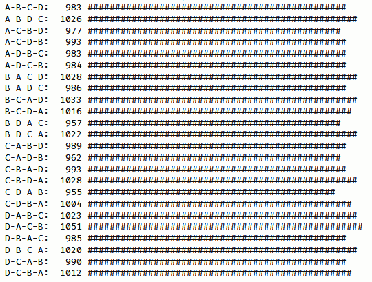

# 构建更好的容器 - 函数式数据类型

在*第十一章* *实现设计模式* 中，我们讨论了如何使用函数来实现不同的结果。在本章中，我们将从函数式角度探讨数据类型。我们将考虑如何实现我们自己的数据类型，以及一些可以帮助我们组合操作或确保其纯度的特性，从而使我们的函数式编程变得更加简单和简洁。

我们将涉及几个主题：

+   **从函数式角度**的**数据类型**。尽管 JavaScript 不是一种类型语言，但为了补充我们对 TypeScript 的使用，我们需要更好地理解类型和函数。

+   **容器**，包括函子和神秘的单子，以结构化数据流。

+   **函数作为结构**，我们将看到另一种使用函数来表示数据类型的方法，并加入不可变性作为额外的特性。

就这样，让我们开始吧！

# 指定数据类型

尽管 JavaScript 是一种动态语言，但没有静态或显式的类型声明和控制，并不意味着你可以简单地忽略类型。即使语言不允许你指定变量或函数的类型，你仍然在用类型工作——即使只是在你的脑海中。指定类型有如下优势：

+   TypeScript 可以检测编译时错误，避免许多 bug。

+   如果你从 JavaScript 迁移到更函数式的语言，如 Elm（见[elm-lang.org](http://elm-lang.org)），这将有所帮助。

+   它作为文档，让未来的开发者了解他们必须传递给函数的参数类型以及函数将返回的类型。Ramda 库中的所有函数都是以这种方式进行文档化的。

+   这也将帮助我们理解本节后面将要介绍的功能性数据结构，我们将探讨一种处理结构的方法，类似于你在像 Haskell 这样的完全函数式语言中所做的那样。

为什么在整本书都使用 TypeScript 之后，我们又要讨论类型呢？原因在于，在大多数函数式编程文本中，使用了一种不同的风格。TypeScript 定义只是，嗯，TypeScript，但我们将在这里看到的定义可以应用于任何其他语言。让我们暂时忘记 TypeScript，开始思考一个新的类型系统。我们将从函数开始，这是最相关的类型，然后考虑其他定义。

## 函数的签名

函数的参数和结果的指定由签名给出。类型签名基于称为 **Hindley–Milner**（**HM**）的类型系统，该系统影响了几个（主要是函数式）语言，包括 Haskell，尽管符号与原始论文中的不同。该系统甚至可以推断出没有直接给出的类型，就像 TypeScript 或 Flow 一样。而不是提供关于编写正确签名的规则的枯燥、正式的解释，让我们通过例子来工作。我们只需要知道以下内容：

+   我们将把类型声明写成注释

+   函数名首先写出来，然后是 `::`，这可以读作 *is of type* 或 *has type*

+   可选约束可能随后，后面跟着一个双箭头（粗箭头）`⇒`（或在基本 ASCII 格式下，如果无法输入箭头，则为 `=>`）

+   函数的输入类型随后，后面跟着 `→`（或 `->`，取决于你的键盘）

+   函数的结果类型位于最后

小心箭头！

提前警告：查看我们将使用的箭头样式；它们与 TypeScript 使用的不同！我们将使用“细”箭头代替 `=>`，使用“粗”箭头来指定泛型约束；请小心！

现在，我们可以从一些例子开始。让我们定义一个将单词转换为大写的简单函数的类型，并为 `Math.random` 函数做同样的处理：

```js
// firstToUpper :: String → String
const firstToUpper = (s: string): string =>
  s[0].toUpperCase() + s.substring(1).toLowerCase();
// Math.random :: () → Number
```

这些是简单的情况——这里只考虑签名；我们对实际的函数不感兴趣。箭头表示函数。第一个函数接收一个字符串作为参数并返回一个新的字符串。第二个函数不接收任何参数（如空括号所示）并返回一个浮点数。因此，我们可以将第一个签名读作 `firstToUpper()` *是一个接收字符串并返回字符串的函数类型*。我们可以类似地谈论被诟病的（从不纯性角度看）`Math.random()` 函数，唯一的区别是它不接收参数。

将新的类型定义与 TypeScript 进行比较，很明显它们非常相似。然而，新的风格更清晰。你也可以用以下方式定义 `firstToUpper()`，不指定结果类型（因为 TypeScript 可以推断出来），但使用 HM 类型，你必须提供所有细节，提供更多的清晰度：

```js
// firstToUpper :: String → String
const firstToUpper = (s: string) =>
  s[0].toUpperCase() + s.substring(1).toLowerCase();
```

另一个细节是，在这种指定类型的新方式中，类型描述独立存在，没有与编程语言的细节混合——你不需要理解 JavaScript、TypeScript 或任何其他语言就能弄清楚函数中涉及的类型。

我们已经研究了具有零个或一个参数的函数，但对于具有多个参数的函数呢？有两个答案。如果我们在一个严格的函数式风格中工作，我们总是会进行柯里化（如我们在 *第七章*，*转换函数*）中看到的），所以所有的函数都会是一元函数。另一个解决方案是将参数类型列表括起来。我们可以在以下代码中看到这两个解决方案：

```js
// sum3C :: Number → Number → Number → Number
const sum3C = curry(
  (a: number, b: number, c: number): number => a + b + c
);
// sum3 :: (Number, Number, Number) → Number
const sum3 = (a: number, b: number, c: number) => a + b +
  c;
```

记住，`sum3c()` 实际上是 `(a) => (b) => (c) => a + b + c`；这解释了第一个签名，它也可以读作以下内容：

```js
// sum3C :: Number → (Number → (Number → (Number)))
const sum3C = curry(
  (a: number, b: number, c: number): number => a + b + c
);
```

在你向函数提供第一个参数之后，你将剩下一个新的函数，它也期望一个参数，并返回一个第三个函数，当给定一个参数时，将产生最终结果。我们不会使用括号，因为我们始终假设从右到左的这种分组。

现在，关于接受函数作为参数的高阶函数，我们该怎么办呢？`map()` 函数提出了一个问题：它可以与任何类型的数组一起工作。此外，映射函数可以产生任何类型的输出。对于这些情况，我们可以指定泛型类型，由小写字母标识。这些泛型类型可以代表任何可能的类型。对于数组本身，我们使用括号。因此，我们将有如下所示的内容：

```js
// map :: [a] → (a → b) → [b]
const map = curry(<A, B>(arr: A[], fn: (x: A) => B) =>
  arr.map(fn)
);
```

让 `a` 和 `b` 代表相同的类型是完全有效的，例如，在应用于数字数组的映射中，它会产生另一个数字数组。关键是，原则上，`a` 和 `b` 可能代表不同的类型，这是我们之前描述的。这个定义要求在 TypeScript 中使用泛型类型，在我们的例子中是 `A` 和 `B`。

注意，如果我们没有进行柯里化，签名将是 `([a], (a → b)) → [b]`，这显示了一个接收两个参数（类型为 `a` 的元素数组和一个从类型 `a` 映射到类型 `b` 的函数）并产生类型为 `b` 的元素数组作为其结果的函数。

我们可以类似地写出以下内容：

```js
// filter :: [a] → (a → Boolean) → [a]
const filter = curry(<A>(arr: A[], fn: (x: A) => B) =>
  arr.filter(fn)
);
```

现在是时候考虑 `reduce()` 的签名了。务必仔细阅读它，看看你是否能弄清楚为什么它被写成这样。你可能更喜欢将签名的第二部分想象成 `((b, a) →` `b)`：

```js
// reduce :: [a] → (b → a → b) → b → b
const reduce = curry(
  <A, B>(arr: A[], fn: (a: B, v: A) => B, acc: B) =>
    arr.reduce(fn, acc)
);
```

最后，如果你正在定义一个方法而不是函数，你使用波浪线箭头，例如 `~>`：

```js
// String.repeat :: String ⇝ Number → String
```

到目前为止，我们已经为函数定义了数据类型，但我们对这个主题还没有完成。让我们考虑一些其他的情况。

## 其他数据类型选项

我们还缺少什么？让我们看看你可能使用的其他选项。*产品类型* 是一组总是在一起出现的值，通常与对象一起使用。对于 *元组*（即具有固定数量元素（可能是不同类型）的数组），我们可以写出如下内容：

```js
// getWeekAndDay :: String → (Number × String)
const getWeekAndDay = (
  yyyy_mm_dd: string
): [number, string] => {
  let weekNumber: number;
  let dayOfWeekName: string;
  .
  .
  .
  return [weekNumber, dayOfWeekName];
};
```

对于对象，我们可以采用与 JavaScript 已经使用的定义非常相似的定义。让我们想象我们有一个`getPerson()`函数，它接收一个 ID 并返回一个包含有关人员数据的对象：

```js
// getPerson :: Number → { id:Number × name:String }
const getPerson = (
  personId: number
): { id: number; name: string } => {
  .
  .
  .
  return { id: personId, name: personName };
};
```

*求和类型*（也称为*联合类型*）被定义为可能值的列表。例如，我们的`getField()`函数来自*第六章*，*生成函数*，返回一个属性的值或`undefined`。为此，我们可以写出以下签名：

```js
// getField :: String → Object → a | undefined
const getField =
  <A>(attr: string) =>
  (obj: { [key: string]: A }) =>
    obj[attr];
```

我们也可以定义一个类型（联合或否则）并在进一步的定义中使用它。例如，可以直接比较和排序的数据类型有数字、字符串和布尔值，因此我们可以写出以下定义：

```js
// Sortable :: Number | String | Boolean
```

之后，我们可以指定比较函数可以用`Sortable`类型来定义，但要注意：这里有一个隐藏的问题！

```js
// compareFunction :: (Sortable, Sortable) → Number
```

之前的定义将允许我们编写一个接收，比如说，一个`number`和一个`Boolean`的函数。它并没有说这两种类型应该是相同的。然而，有一个解决办法。如果你对某些数据类型有约束，你可以在实际的签名之前表达它们，使用一个粗箭头，如下面的代码所示：

```js
// compareFunction :: Sortable a ⇒ (a, a) → Number
```

现在的定义是正确的，因为所有相同类型（用相同的字母表示，在这种情况下是`a`）的出现必须完全相同。一个替代方案，但需要输入更多文字，就是用联合来写出所有三种可能性：

```js
// compareFunction ::
//    ((Number, Number) |
//    (String, String)  |
//    (Boolean, Boolean)) → Number
```

实际上，这个定义并不非常精确，因为你可以比较任何类型，即使它没有太多意义。然而，为了这个例子，请耐心一点！如果你想刷新你对排序和比较函数的记忆，请参阅[developer.mozilla.org/en/docs/Web/JavaScript/Reference/Global_Objects/Array/sort](http://developer.mozilla.org/en/docs/Web/JavaScript/Reference/Global_Objects/Array/sort)。

到目前为止，我们一直在使用标准的类型定义。然而，当使用 JavaScript 时，我们必须考虑其他可能性，例如具有可选参数的函数，甚至具有不确定数量的参数的函数。我们可以使用`...`来表示任意数量的参数，并添加`?`来表示可选类型，如下所示：

```js
// unary :: ((b, ...) → a) → (b → a)
```

我们在之前引用的同一章中定义的`unary()`高阶函数接受任何函数作为参数，并返回一个一元函数作为其结果。我们可以表明原始函数可以接收任意数量的参数，但结果只使用了第一个。这个数据类型定义如下：

```js
// parseInt :: (String, Number?) → Number
```

标准的`parseInt()`函数提供了一个可选参数的例子，尽管强烈建议不要省略第二个参数（基数）；实际上，你可以跳过它。

优秀的定义？

查看 github.com/fantasyland/fantasy-land/和 sanctuary.js.org/#types 以获取关于类型在 JavaScript 中应用的更正式定义和描述。

从现在开始，在本章的整个过程中，我们不仅将使用 TypeScript，我们还将向方法和函数添加 HM 签名，这样你就可以习惯它们。现在让我们改变方向，覆盖一个高度重要的话题：*容器*。

# 构建容器

在*第五章*“声明式编程”和随后的*第八章*“函数连接”中，我们看到了将映射应用于数组所有元素的能力——甚至更好的是，能够链式执行一系列类似操作——这是生成更好、更易于理解的代码的绝佳方式。

然而，有一个问题：`map()`方法（或其等效的未方法化版本，我们在*第六章*“生成函数”中讨论过）仅适用于数组，我们可能希望能够将映射和链式操作应用于其他数据类型。那么，我们能做什么呢？

让我们考虑不同的实现方式，这将为我们提供几个新的工具，以更好地进行函数式编程。基本上，有两种可能的解决方案：我们可以向现有类型添加新方法（尽管这将有限，因为我们只能将其应用于基本 JavaScript 类型）或者将类型包装在某种容器中，这将允许映射和链式操作。

首先，在转向使用包装器之前，让我们先扩展当前的数据类型，这将引导我们进入深度的函数式领域，涉及诸如函子（functors）和单子（monads）等实体。

## 扩展当前数据类型

如果我们要将映射添加到基本 JavaScript 数据类型，我们需要首先考虑我们的选项：

+   对于`null`、`undefined`和`Symbol`，应用映射听起来并不那么有趣。

+   我们在`Boolean`、`Number`和`String`数据类型上有一些有趣的可能性，因此我们可以检查其中的一些。

+   将映射应用于一个对象是微不足道的：我们只需添加一个`map()`方法，该方法必须返回一个新的对象。

+   最后，尽管它们不是基本数据类型，但我们也可以考虑特殊案例，例如日期或函数，我们可以为它们添加`map()`方法。

正如本书的其余部分一样，我们坚持使用纯 JavaScript 和 TypeScript，但你应该研究 Lodash、Underscore 或 Ramda 等库，这些库已经提供了我们在这里开发的功能。

在所有这些映射操作中，一个需要考虑的关键点是返回的值应该与原始类型相同。当我们使用`Array.map()`时，结果也是一个数组，类似的考虑必须适用于任何其他`map()`方法实现（你可以观察到结果数组可能具有与原始数组不同的元素类型，但它仍然是一个数组）。

我们可以用布尔值做什么呢？首先，让我们接受布尔值不是容器，因此它们并不真正以与数组相同的方式表现。显然，布尔值只能有布尔值，而数组可以包含任何类型的元素。然而，接受这种差异，我们可以通过向其中添加一个新的`map()`方法来扩展`Boolean.prototype`（尽管，如我之前提到的，这通常不推荐），并确保映射函数返回的任何内容都被转换成一个新的布尔值。对于后者，解决方案将与以下类似：

```js
// Boolean.map :: Boolean ⇝ (Boolean → a) → Boolean
Boolean.prototype.map = function (
  this: boolean,
  fn: (x: boolean) => any
) {
  return !!fn(this);
};
```

我们已经看到了如何向一个方法添加一个（假的）`this`参数的例子，以让 TypeScript 知道`this`的类型是什么——在这种情况下，是一个布尔值。`!!`运算符强制结果成为一个布尔值。`Boolean(fn(this))`也可以使用。这种解决方案也可以应用于数字和字符串，如下面的代码所示：

```js
// Number.map :: Number ⇝ (Number → a) → Number
Number.prototype.map = function (
  this: number,
  fn: (x: number) => number
) {
  return Number(fn(this));
};
// String.map :: String ⇝ (String → a) → String
String.prototype.map = function (
  this: string,
  fn: (x: string) => string
) {
  return String(fn(this));
};
```

与布尔值一样，我们正在强制映射操作的结果转换为正确的数据类型。顺便说一句，TypeScript 不会直接接受这些新的`map()`定义；参见*问题 12.1*以修复此问题。

最后，如果我们想要将映射应用于一个函数，那意味着什么呢？映射一个函数应该产生一个函数。对于`f.map(g)`的逻辑解释将是先应用`f()`，然后对结果应用`g()`。因此，`f.map(g)`应该等同于写作`x => g(f(x))`或者，等价地，`pipe(f,g)`。这个定义比之前的例子更复杂（但在我看来，在 HM 中比在 TypeScript 中更简单），所以请仔细研究：

```js
// Function.map :: (a → b) ⇝ (b → c) → (a → c)
Function.prototype.map = function <A, B, C>(
  this: (x: A) => B,
  fn: (y: B) => C
): (x: A) => C {
  return (x: A) => fn(this(x));
};
```

验证这一点很简单，以下代码是展示如何做到这一点的简单示例。`times10()`映射函数被应用于计算`plus1(3)`的结果，因此结果是 40：

```js
const plus1 = (x) => x + 1;
const times10 = (y) => 10 * y;
console.log(plus1.map(by10)(3));
// 40: first add 1 to 3, then multiply by 10
```

通过这种方式，我们就完成了关于我们可以用基本 JavaScript 类型实现什么内容的讨论，但如果我们想将其应用于其他数据类型，我们需要一个更通用的解决方案。我们希望能够将映射应用于任何类型的值，为此，我们需要创建一个容器。我们将在下一节中这样做。

## 容器和函子

在上一节中我们所做的工作是有效的，并且可以无问题地使用。然而，我们希望考虑一个更通用的解决方案，我们可以将其应用于任何数据类型。由于并非 JavaScript 中的所有事物都提供所需的`map()`方法，我们可能必须扩展类型（就像我们在上一节中所做的那样）或应用我们在*第十一章*中考虑的设计模式：用包装器包装我们的数据类型，该包装器将提供所需的`map()`操作。

特别是，我们将执行以下操作：

+   首先看看如何构建一个基本的容器，包装一个值

+   将容器转换成更强大的函子

+   学习如何使用特殊的函子`Maybe`处理缺失值

### 包装一个值——一个基本容器

让我们暂停一下，考虑一下我们需要从这个包装器中得到什么。有两个基本要求：

+   我们必须有一个`map()`方法

+   我们需要一个简单的方式来封装一个值

要开始，让我们创建一个基本的容器。任何只包含一个值的对象都可以，但我们希望有一些额外的功能，所以我们的对象不会那么简单；我们将在代码之后解释这些差异：

```js
// container.ts
class Container<A> {
  protected x: A;
  constructor(x: A) {
    this.x = x;
  }
  map(fn: (_: A) => any) {
    return fn(this.x);
  }
}
```

我们需要记住的一些基本考虑因素如下：

+   我们希望能够在容器中存储一些值，因此构造函数负责这一点。

+   使用`protected`属性可以避免外部“篡改”，但允许子类访问。（参见*问题 12.2*中的一些 JavaScript 考虑因素。）

+   我们需要能够使用`map()`，因此提供了一个方法来实现这一点。

我们的基本容器已经准备好了，但我们也可以添加一些其他方法以方便使用，如下所示：

+   要获取容器的值，我们可以使用`map((x) => x)`，但对于更复杂的容器来说，这不会起作用，因此我们将添加一个`valueOf()`方法来获取包含的值。

+   能够列出容器无疑有助于调试。`toString()`方法将非常有用。

+   由于我们不需要每次都写`new Container()`，我们可以添加一个静态的`of()`方法来完成同样的工作。

函数式编程的一个禁忌？

在函数式编程的世界中，使用类来表示容器（以及后来的函子和单子）可能看起来像是异端或罪恶...但记住，我们不想过于教条，使用类可以简化我们的编码。同样，可以争论说，你永远不应该从容器中取出值——但使用`valueOf()`方法有时非常方便，所以我们不会那么限制。

考虑到所有这些，我们的容器如下：

```js
// continued...
class Container<A> {
  protected x: A;
  constructor(x: A) {
    this.x = x;
  }
  static of<B>(x: B): Container<B> {
    return new Container(x);
  }
  map(fn: (_: A) => any) {
    return fn(this.x);
  }
  toString() {
    return `${this.constructor.name}(${this.x})`;
  }
  valueOf() {
    return this.x;
  }
}
```

现在，我们可以使用这个容器来存储一个值，并使用`map()`来对那个值应用任何函数，但这与我们使用变量所能做的并没有太大区别！让我们再增强一下这一点。

### 增强我们的容器 – 函子

我们希望拥有封装的值，那么`map()`函数究竟应该返回什么？如果我们想要能够链式调用操作，唯一合理的答案就是它应该返回一个新的封装对象。在真正的函数式风格中，当我们对一个封装值应用映射时，结果将是一个新的封装值，我们可以继续对其操作。

任何名称的映射

与`map()`不同，这个操作有时被称为`fmap()`，代表*函子映射*。名称变更的理由是为了避免扩展`map()`的含义。然而，由于我们正在使用一个支持重用名称的语言，我们可以保留它。

我们可以将我们的`Container`类扩展以实现这一变化，并得到一个增强的容器：一个*函子*。`of()`和`map()`方法将需要一些小的改动。为此，我们将创建一个新的类，如下面的代码所示：

```js
// functor.ts
class Functor<A> extends Container<A> {
  static of<B>(x: B) {
    return new Functor(x);
  }
  map<B>(fn: (_: A) => B): Functor<B> {
    return Functor.of(fn(this.x));
  }
}
```

在这里，`of()` 方法产生一个 `Functor` 对象，`map()` 方法也是如此。通过这些变化，我们刚刚定义了在范畴论中什么是 *函子*！（或者，如果你想真正技术化，由于 `of()` 方法，它是一个 *带点函子*——但让我们保持简单。）我们不会深入理论细节，但大致来说，函子是一些容器，允许我们对其内容应用 `map()`，产生相同类型的新容器。如果你听起来很熟悉，那是因为你已经知道函子了：数组！当你对数组应用 `map()` 时，结果是包含转换（映射）值的新数组。

额外要求

函子有更多的要求。首先，包含的值可能是多态的（任何类型），就像数组一样。其次，必须存在一个函数，其映射会产生相同的包含值——`(x) => x` 就为我们做了这件事。最后，应用两个连续的映射必须产生与应用它们的组合相同的结果。这意味着 `container.map(f).map(g)` 必须与 `container.map(compose(g,f))` 相同。

让我们暂停一下，考虑我们的函数和方法签名：

```js
// of :: Functor f ⇒ a → f a
// Functor.toString :: Functor f ⇒ f a ⇝ String
// Functor.valueOf :: Functor f ⇒ f a ⇝ a
// Functor.map :: Functor f ⇒ f a ⇝ (a → b) → f b
```

第一个函数 `of()` 是最简单的：给定任何类型的值，它会产生该类型的函子。接下来的两个也比较容易理解：给定一个函子，`toString()` 总是返回一个字符串（这不足为奇！），如果函子包含的值是给定类型，`valueOf()` 会产生相同类型的值。第三个 `map()` 更有趣。给定一个接受类型 `a` 的参数并产生类型 `b` 的结果的函数，将其应用于包含类型 `a` 的值的函子会产生包含类型 `b` 的值的函子。这正是我们之前描述的。

Promises 和 Functors

你可以将函子与承诺进行比较，至少在一个方面。在函子中，你无法直接对其值进行操作，而是必须使用 `map()` 应用一个函数。在承诺中，你完全一样，但使用 `then()`！实际上，还有更多的类比，我们很快就会看到。

就目前而言，函子不允许或预期产生副作用、抛出异常或展示任何其他在产生容器结果之外的行为。它们的主要用途是提供一种方式来操作值、对其应用操作、组合结果等，而不改变原始值——从这个意义上说，我们再次回到了不可变性。

然而，你可以说这还不够，因为在日常编程中，处理异常、未定义或空值等情况是非常常见的。所以，让我们先看看更多关于函子的例子。之后，我们将进入单子的领域，看看更复杂的处理。让我们实验一下！

### 使用 Maybe 处理缺失值

编程中常见的一个问题是处理缺失值。这种情况可能有多种原因：一个 Web 服务的 Ajax 调用可能返回了一个空结果，一个数据集可能是空的，一个可选属性可能从对象中缺失，等等。在常规的命令式风格中，处理这种情况需要在每个地方添加`if`语句或三元运算符来捕获可能缺失的值以避免某些运行时错误。我们可以通过实现一个`Maybe`函子来表示可能（或可能*不*）存在的值来做得更好！我们将使用两个类，`Just`（表示*仅仅某个值*）和`Nothing`，它们都是函子。`Nothing`函子尤其简单，具有平凡的方法：

```js
// maybe.ts
class Nothing extends Maybe<any> {
  constructor() {
    super(null);
  }
  isNothing() {
    return true;
  }
  toString() {
    return "Nothing()";
  }
  map(_fn: FN) {
    return this;
  }
}
```

`isNothing()`方法返回`true`，`toString()`返回恒定的文本，而`map()`无论给定什么函数都总是返回自身。

接下来，`Just`函子也是一个基本的函子，增加了`isNothing()`方法（它总是返回`false`，因为`Just`对象不是`Nothing`），以及一个现在返回`Maybe`的`map()`方法：

```js
// continued...
class Just<A> extends Maybe<A> {
  static of<B>(x: B): Maybe<B> {
    if (x === null || x === undefined) {
      throw new Error("Just should have a value");
    } else {
      return new Just(x);
    }
  }
  isNothing() {
    return false;
  }
  map<B>(fn: (_: A) => B): Just<B> {
    return new Just(fn(this.x));
  }
}
```

最后，我们的`Maybe`类包含了构建`Nothing`或`Just`所需的所有逻辑。如果它接收到一个`undefined`或`null`值，将构建`Nothing`；在其他情况下，结果是`Just`。`of()`方法具有完全相同的行为：

```js
// continued...
abstract class Maybe<A> extends Functor<A> {
  static of<B>(x: B): Maybe<B> {
    return x === null || x === undefined
      ? new Nothing()
      : new Just(x);
  }
  isNothing() {
    /* abstract */
  }
  map<B>(fn: (_: A) => B): Maybe<B> {
    return Maybe.of(fn(this.x));
  }
}
```

我们使用一个`abstract`类，因为你不应该直接写`new Maybe(…)`；你应该使用`Maybe.of()`或直接构建`Just`或`Nothing`。（如果你想知道如何在 JavaScript 中这样做，请参阅*问题 12.3*。）我们可以通过尝试对一个有效值或缺失值应用操作来快速验证这一点。让我们看看这个的两个例子：

```js
const plus1 = x => x + 1;
Maybe.of(2209).map(plus1).map(plus1).toString();
// "Just(2211)"
Maybe.of(null).map(plus1).map(plus1).toString();
// "Nothing()"
```

当我们将`plus1()`（两次）应用于`Maybe.of(2209)`时，一切正常，我们最终得到了一个`Just(2011)`值。另一方面，当我们将相同的操作序列应用于`Maybe.of(null)`值时，最终结果是`Nothing`，即使我们尝试用`null`值进行数学运算，也没有错误。一个`Maybe`函子可以通过跳过操作并返回一个包装的`null`值来处理映射缺失值。这意味着这个函子包含了一个抽象的检查，它不会让错误发生。

（在本章的后面部分，我们将看到`Maybe`实际上可以是一个函子而不是函子，我们还将检查更多关于函子的例子。）

让我们看看它使用的一个更现实的例子。

#### 处理变化的 API 结果

假设我们正在用 Node.js 编写一个小型的服务器端服务，用于获取某个城市的天气警报，并生成一个不太时尚的 HTML `<table>` 表格，作为某个服务器端生成的网页的一部分。（是的，我知道你应该尽量避免在页面上使用表格，但我只想举一个简单的 HTML 生成示例，实际结果并不重要。）如果我们使用 *Dark Sky* API（有关此 API 的更多信息以及如何注册，请参阅 [darksky.net](http://darksky.net)），来获取警报，我们的代码可能如下所示，都是相当正常的。注意错误情况下的回调；你将在下面的代码中看到原因：

```js
import request from "superagent";
const getAlerts = (
  lat: number,
  long: number,
  callback: FN
) => {
  const SERVER = "https://api.darksky.net/forecast";
  const UNITS = "units=si";
  const EXCLUSIONS = "exclude=minutely,hourly,daily,flags";
  const API_KEY = "you.need.to.get.your.own.api.key";
  request
    .get(
      `${SERVER}/${API_
        KEY}/${lat},${long}?${UNITS}&${EXCLUSIONS}`
    )
    .end(function (err, res) {
      if (err) {
        callback({});
      } else {
        callback(JSON.parse(res.text));
      }
    });
};
```

这样的调用（经过大量编辑和缩小尺寸）的输出可能如下所示：

```js
{
  latitude: 29.76,
  longitude: -95.37,
  timezone: "America/Chicago",
  offset: -5,
  currently: {
    time: 1503660334,
    summary: "Drizzle",
    icon: "rain",
    temperature: 24.97,
    .
    .
    .
    uvIndex: 0,
  },
  alerts: [
    {
      title: "Tropical Storm Warning",
      regions: ["Harris"],
      severity: "warning",
      time: 1503653400,
      expires: 1503682200,
      description:
        "TROPICAL STORM WARNING REMAINS IN EFFECT... WIND -        LATEST LOCAL FORECAST: Below tropical storm force wind         ... CURRENT THREAT TO LIFE AND PROPERTY: Moderate ...        Locations could realize roofs peeled off buildings,        chimneys toppled, mobile homes pushed off foundations         or overturned ...",
      uri: "https://alerts.weather.gov/cap/wwacapget.php?x=      TX125862DD4F88.TropicalStormWarning.125862DE8808TX.      HGXTCVHGX.73ee697556fc6f3af7649812391a38b3",
    },
    .
    .
    .
    {
      title: "Hurricane Local Statement",
      regions: ["Austin", ... , "Wharton"],
      severity: "advisory",
      time: 1503748800,
      expires: 1503683100,
      description:
        "This product covers Southeast Texas **HURRICANE         HARVEY DANGEROUSLY APPROACHING THE TEXAS COAST** ...        The next local statement will be issued by the National         Weather Service in Houston/Galveston TX around 1030 AM         CDT, or sooner if conditions warrant.\n",
      uri: "https://alerts.weather.gov/...",
    },
  ],
};
```

我是在美国德克萨斯州休斯顿获取的这些信息，那天飓风哈维正在接近该州。如果你在正常的日子里调用 API，数据将不会包括 `alerts:[...]` 部分。在这里，我们可以使用 `Maybe` 函子来处理接收到的数据，无论是否有任何警报：

```js
import os from "os";
const produceAlertsTable = (weatherObj: typeof resp) =>
  Maybe.of(weatherObj)
    .map((w: typeof resp) => w.alerts)
    .map((a) =>
      a.map(
        (x) =>
          `<tr><td>${x.title}</td>` +
          `<td>${x.description.substr(0,
            500)}...</td></tr>`
      )
    )
    .map((a) => a.join(os.EOL))
    .map((s) => `<table>${s}</table>`);
getAlerts(29.76, -95.37, (x) =>
  console.log(produceAlertsTable(x).valueOf())
);
```

当然，你可能不会仅仅记录 `produceAlertsTable()` 包含的结果的值。最可能的选择是再次使用 `map()`，并使用一个函数来输出表格，将其发送到客户端，或者执行你需要做的任何事情。在任何情况下，最终的输出看起来可能如下所示：

```js
<table><tr><td>Tropical Storm Warning</td><td>...TROPICAL STORM WARNING REMAINS IN EFFECT... ...STORM SURGE WATCH REMAINS IN EFFECT... * WIND -
LATEST LOCAL FORECAST: Below tropical storm force wind - Peak Wind Forecast: 25-35 mph with gusts to 45 mph - CURRENT THREAT TO LIFE AND PROPERTY: Moderate - The wind threat has remained nearly steady from the previous assessment. - Emergency plans should include a reasonable threat for strong tropical storm force wind of 58 to 73 mph. - To be safe, earnestly prepare for the potential of significant...</td></tr>
<tr><td>Flash Flood Watch</td><td>...FLASH FLOOD WATCH REMAINS IN EFFECT
THROUGH MONDAY MORNING... The Flash Flood Watch continues for * Portions of Southeast Texas...including the following counties...Austin...Brazoria...Brazos...Burleson...
Chambers...Colorado...Fort Bend...Galveston...Grimes...
Harris...Jackson...Liberty...Matagorda...Montgomery...Waller... Washington and Wharton. * Through Monday morning * Rainfall from Harvey will cause devastating and life threatening flooding as a prolonged heavy rain and flash flood thre...</td></tr>
<tr><td>Hurricane Local Statement</td><td>This product covers Southeast
Texas **PREPARATIONS FOR HARVEY SHOULD BE RUSHED TO COMPLETION THIS MORNING** NEW INFORMATION --------------- * CHANGES TO WATCHES AND
WARNINGS: - None * CURRENT WATCHES AND WARNINGS: - A Tropical Storm Warning and Storm Surge Watch are in effect for Chambers and Harris - A Tropical Storm Warning is in effect for Austin, Colorado, Fort Bend, Liberty, Waller, and Wharton - A Storm Surge Warning and Hurricane Warning are in effect for Jackson and Matagorda - A Storm S...</td></tr></table>
```

前面代码的输出可以在以下屏幕截图中看到：


图 12.1 – 输出表格看起来并不怎么样，但生成它的逻辑并没有使用任何 if 语句

如果我们用蒙得维的亚，乌拉圭的坐标调用 `getAlerts(-34.9, -54.60, ...)`，由于该城市没有警报，`getField("alerts")` 函数将返回 `undefined`——由于该值被 `Maybe` 函子识别，尽管接下来的所有 `map()` 操作仍然会执行，但实际上没有人会做任何事情，最终结果将是 `null` 值。

我们在编写错误逻辑时利用了这种行为。如果在调用服务时发生错误，我们仍然会调用原始回调来生成表格，但提供一个空对象。即使这个结果出乎意料，我们也会很安全，因为相同的防护措施将避免导致运行时错误。

作为最后的增强，我们可以添加一个 `orElse()` 方法，在未提供值时提供一个默认值。如果 `Maybe` 是 `Nothing`，则添加的方法将返回默认值，否则返回 `Maybe` 值本身：

```js
// continued...
class Maybe<A> extends Functor<A> {
  .
  .
  .
  orElse(v: any) {
    /* abstract */
  }
}
class Nothing extends Functor<any> {
  .
  .
  .
  orElse(v: any) {
    return v;
  }
}
class Just<A> extends Functor<A> {
  .
  .
  .
  orElse(v: any) {
    return this.x;
  }
}
```

使用这个新方法代替 `valueOf()`，尝试获取没有天气警告的地方的警报，只会返回默认结果。在我们之前提到的例子中，尝试获取蒙得维的亚的警报，而不是 `null` 值，我们会得到以下适当的结果：

```js
getAlerts(-34.9, -54.6, (x) =>
  console.log(
    produceAlertsTable(x).orElse(
      "<span>No alerts today.</span>"
    )
  )
);
```

通过这种方式，我们已经看到了处理与 API 一起工作时不同情况的一个示例。让我们快速回顾一下之前章节中的另一个主题，并看看棱镜的更好实现。

#### 实现棱镜

常见的棱镜实现（我们首次在 *第十章**，确保纯净性*）部分中遇到），而不是返回某个值或 `undefined` 并让调用者检查发生了什么，而是选择返回 `Maybe`，这已经为我们提供了处理缺失值的简单方法。在我们的新实现（我们很快就会看到）中，上述章节中的示例将看起来像这样：

```js
const author = {
  user: "fkereki",
  name: {
    first: "Federico",
    middle: "",
    last: "Kereki",
  },
  books: [
    { name: "Google Web Toolkit", year: 2010 },
    { name: "Functional Programming", year: 2017 },
    { name: "Javascript Cookbook", year: 2018 },
  ],
};
```

如果我们想要访问 `author.user` 属性，结果将不同：

```js
const pUser = prismProp("user");
console.log(review(pUser, author).toString());
/*
Just("fkereki")
*/
```

同样地，如果我们请求一个不存在的别名属性，而不是 `undefined`（如我们之前版本的 `Prism`），我们会得到 `Nothing`：

```js
const pPseudonym = prismProp("pseudonym"); console.log(review(pPseudonym, author).toString());
/*
Nothing()
*/
```

因此，如果你已经习惯了处理 `Maybe` 值，那么这个 `Prism` 的新版本会更好用。我们需要做些什么来实现这个功能呢？我们只需要一个改动；我们的 `Constant` 类现在需要返回 `Maybe` 而不是值，因此我们将有一个新的 `ConstantP` (`P` 代表 `Prism`) 类：

```js
class ConstantP<V> {
  private value: Maybe<V>;
  map: FN;
  constructor(v: V) {
    this.value = Maybe.of(v);
    this.map = () => this;
  }
}
```

我们将不得不重写 `preview()` 以使用新的类，这样改动就完成了：

```js
const preview = curry(
  (prismAttr, obj) =>
    prismAttr((x) => new ConstantP(x))(obj).value
);
```

因此，让 `Prism` 与 `Maybe` 一起工作并不那么困难，现在我们有了处理可能缺失属性的一致方式。以这种方式工作，我们可以简化我们的编码并避免许多对空值的测试和其他类似情况。然而，我们可能想要做得更多；例如，我们可能想知道为什么没有警报：是服务错误吗？还是只是一个正常情况？仅仅在最后得到空值是不够的，为了满足这些新要求，我们需要向我们的函子添加一些额外的功能（我们将在下一节中看到），并进入 *单子* 的领域。

## 单子

单子在程序员中有着奇特的名声。知名开发者 Douglas Crockford 曾著名地提到一个诅咒，认为“*一旦你最终理解了单子，你立即失去了向其他人解释它们的能力!* ”另一方面，如果你决定回到基础并阅读 Saunders Mac Lane 的 *工作数学家的范畴学*（范畴理论的创始人之一），你可能会发现一个多少有些令人不安的解释——这并不是特别有启发性！

在 X 中的单子就是 X 的内射函子范畴中的幺半群，其中乘积 × 被内射函子的组合所替代，单位集由恒等内射函子所构成。

单子和模范函数之间的区别在于前者添加了一些额外的功能；我们很快就会看到它们添加了哪些功能。让我们先看看新的要求，然后再考虑一些常见且有用的单子。与模范函数一样，我们将有一个基本的单子，你可以将其视为一个 *抽象* 版本，以及特定的 *单子类型*，它们是针对解决特定情况的具体实现。

你想阅读的一切

要阅读关于模范函数、单子和它们家族的精确和细致的描述（但侧重于理论方面，有很多代数定义），请尝试查看 [github.com/fantasyland/fantasy-land/](http://github.com/fantasyland/fantasy-land/) 的 *Fantasy Land Specification*。请别说我没有警告你：该页面的另一个名称是 *代数* *JavaScript Specification*！

### 添加操作

让我们考虑一个简单的问题。假设你有一对函数，它们使用 `Maybe` 模范函数：第一个函数尝试根据其键搜索某些内容（比如，客户或产品），第二个函数尝试从找到的任何内容中提取一些属性（我故意说得模糊，因为这个问题与我们可能正在处理的任何对象或事物无关）。这两个函数都产生 `Maybe` 结果以避免可能的错误。我们使用一个模拟的搜索函数只是为了帮助我们理解这个问题。对于偶数键，它返回假数据，对于奇数键，它抛出异常。这个搜索的代码非常简单：

```js
const fakeSearchForSomething = (key: number) => {
  if (key % 2 === 0) {
    return { key, some: "whatever", other: "more data" };
  } else {
    throw new Error("Not found");
  }
};
```

使用这个搜索，我们的 `findSomething()` 函数将尝试进行搜索，并在成功调用时返回 `Maybe.of()`（一个 `Just`），在出错时返回 `Maybe.of(null)`（一个 `Nothing`）：

```js
const findSomething = (key: number) => {
  try {
    const something = fakeSearchForSomething(key);
    return Maybe.of(something);
  } catch (e) {
    return Maybe.of(null);
  }
};
```

这样，我们可能会认为可以编写这两个函数来进行一些搜索，但并不是所有事情都会顺利；你能看到这里的问题吗？

```js
const getSome = (something: any) =>
  Maybe.of(something.map((x: any) => x.some));
const getSomeFromSomething = (key: number) =>
  getSome(findSomething(key));
```

这个序列中的问题是 `getSome()` 的输出是一个 `Maybe` 值，它本身又包含一个 `Maybe` 值，所以结果被双重封装，正如我们可以通过执行几个调用所看到的，对于偶数（将返回 `"whatever"`）和奇数（将是一个错误），如下所示：

```js
const xxx = getSomeFromSomething(2222).valueOf().valueOf();
// "whatever"
const yyy = getSomeFromSomething(9999).valueOf().valueOf();
// undefined
```

如果在这个玩具问题中避免在 `getSome()` 中使用 `Maybe.of()`，这个问题就可以轻松解决，但这类问题可能会以许多更复杂的方式出现。例如，你可能会从一个对象中构建一个 `Maybe`，该对象的某个属性恰好是一个 `Maybe`，当你访问该属性时，你将遇到相同的情况：你将得到一个双重封装的值。

现在，我们将探讨单子。一个单子应该提供以下操作：

+   一个构造函数。

+   一个将值插入到单子中的函数：我们的 `of()` 方法。

+   一个允许我们链式操作的功能：我们的 `map()` 方法。

+   一个可以移除额外包装器的函数：我们将称之为`unwrap()`。它将解决我们之前的多重包装问题。有时，这个函数被称为`flatten()`。

为了简化我们的编码，我们还将有一个用于链式调用的函数，另一个用于应用函数的函数，但我们会稍后讨论这些。让我们看看在实际的 JavaScript 代码中，单子（monad）看起来是什么样子。数据类型规范与函子（functor）的规范非常相似，所以我们在这里不再重复：

```js
// monad.ts
class Monad<A> extends Functor<A> {
  static of<B>(x: B): Monad<B> {
    return new Monad(x);
  }
  map<B>(fn: (_: A) => B): Monad<B> {
    return new Monad(fn(this.x));
  }
  unwrap(): any {
    const myValue = this.x;
    return myValue instanceof Monad
      ? myValue.unwrap()
      : this;
  }
}
```

我们使用递归来连续移除包装器，直到包装的值不再是容器为止。使用这种方法，我们可以轻松地避免双重包装，并且我们可以像这样重写我们之前麻烦的函数：

```js
const getSomeFromSomething = key => getSome(findSomething(key)).unwrap();
```

然而，这类问题可能会在不同级别上重复出现。例如，如果我们进行一系列的`map()`操作，任何中间结果最终可能会被双重包装。你可以通过记住在每次`map()`之后调用`unwrap()`来解决此问题——请注意，即使实际上不需要这样做，你也可以这样做，因为`unwrap()`的结果将是完全相同的对象（你能看到为什么吗？）。但我们可以做得更好！让我们定义一个`chain()`操作（有时也称为`flatMap()`，这有点令人困惑，因为我们已经为另一个含义赋予了它的名字；有关更多信息，请参阅*第五章*，*声明式编程*），这个操作将为我们完成这两件事：

```js
// continued...
class Monad<A> extends Functor<A> {
  .
  .
  .
  chain<B>(fn: (_: A) => B) {
    return this.map(fn).unwrap();
  }
}
```

只剩下最后一个操作。假设你有一个有两个参数的柯里化函数——这没什么奇怪的！如果你将这个函数提供给`map()`操作，会发生什么？

```js
const add = (x: number) => (y: number) => x + y;
// or curry((x,y) => x+y)
const something = Monad.of(2).map(add);
```

`something`会是什么？鉴于我们只提供了一个参数来添加，该应用的结果将是一个函数——但不是一个普通的函数，而是一个被包装的函数！（由于函数是一等对象，将函数包装在单子中没有逻辑障碍，对吧？）我们想用这样的函数做什么？为了能够将这个包装函数应用于一个值，我们需要一个新的方法：`ap()`。它的值会是什么？在这种情况下，它可以是普通的数字，也可以是其他操作的结果而被单子包装的数字。由于我们总是可以用`Map.of()`将普通数字映射到一个包装的数字，让我们让`ap()`以单子作为其参数；新的方法如下：

```js
// continued...
class Monad<A> extends Functor<A> {
  .
  .
  .
  ap<B, C extends FN>(this: Monad<C>, m: Monad<B>) {
    return m.map(this.x);
  }
}
```

使用这个，你就可以做以下事情：

```js
const monad5 = something.ap(Monad.of(3));
console.log(monad5.toString())
// Monad(5)
```

你可以使用单子来持有值或函数，并按需与其他单子和链式操作交互。所以，正如你所看到的，单子并没有什么大技巧，它们只是具有一些额外方法的函子。现在，让我们看看我们如何将它们应用于我们的原始问题，并以更好的方式处理错误。

### 处理替代方案——Either 单子

在某些情况下，知道一个值缺失可能就足够了，但在其他情况下，你可能希望能够提供一个解释。如果我们使用不同的函子，我们可以得到这样的解释，这个函子将取两个可能值之一——一个与问题、错误或失败相关联，另一个与正常执行或成功相关联：

+   一个**左**值，它应该是 null，但如果存在，则表示一些特殊值（例如，错误消息或抛出的异常），这些值不能被映射

+   一个**正确**的值，它代表函子的正常值，并且可以被映射

我们可以像为`Maybe`所做的那样构建这个单子（实际上，添加的操作使`Maybe`扩展`Monad`变得更好）。构造函数将接收一个左值和一个右值。如果左值存在，它将成为`Either`单子的值；否则，将使用右值。由于我们已经为所有我们的函子提供了`of()`方法，我们也需要为`Either`提供一个。`Left`单子与我们之前的`Nothing`非常相似：

```js
// either.ts
class Left extends Monad<any> {
  isLeft() {
    return true;
  }
  map(_: any) {
    return this;
  }
}
```

同样，`Right`与我们之前的`Just`相似：

```js
// continued...
class Right<A> extends Monad<A> {
  isLeft() {
    return false;
  }
  map(fn: (_: A) => any) {
    return Either.of(null, fn(this.x));
  }
}
```

现在我们已经掌握了这两个单子，我们可以编写我们的`Either`单子。这和之前的`Maybe`相似，这并不令人惊讶，对吧？

```js
// continued...
abstract class Either<A, B> extends Monad<A | B> {
  static of<C, D>(left: C, right?: D): Left | Right<D> {
    return right === undefined || right === null
      ? new Left(left)
      : new Right(right);
  }
  isLeft() {
    /* */
  }
}
```

`map()`方法是关键。如果这个函子有一个左值，它将不会被进一步处理；在其他情况下，映射将被应用于右值，并且结果将被包装。现在，我们如何用这个来增强我们的代码？关键思想是让每个涉及的方法都返回一个`Either`单子；`chain()`将用于依次执行操作。获取警报将是第一步——我们用`AJAX FAILURE`消息或 API 调用的结果调用回调，如下所示：

```js
const getAlerts2 = (lat, long, callback) => {
  const SERVER = "https://api.darksky.net/forecast";
  const UNITS = "units=si";
  const EXCLUSIONS = "exclude=minutely,hourly,daily,flags";
  const API_KEY = "you.have.to.get.your.own.key";
  request
    .get(
      `${SERVER}/${API_KEY}/${lat},${long}` +
        `?${UNITS}&${EXCLUSIONS}`
    )
    .end((err, res) =>
      callback(
        err
          ? Either.of("AJAX FAILURE", null)
          : Either.of(null, JSON.parse(res.text))
      )
    );
};
```

然后，一般的过程是这样的。我们再次使用`Either`单子。如果没有警报，我们将返回一个`"NO ALERTS"`消息，而不是一个数组：

```js
const produceAlertsTable2 = (weatherObj: typeof resp) => {
  return weatherObj
    .chain((obj: typeof resp) => {
      const alerts = getField("alerts")(obj);
      return alerts
        ? Either.of(null, alerts)
        : Either.of("NO ALERTS", null);
    })
    .chain((a) =>
      a.map(
        (x) =>
          `<tr><td>${x.title}</td>` +
          `<td>${x.description.substr(0,
            500)}...</td></tr>`
      )
    )
    .chain((a) => a.join(os.EOL))
    .chain((s) => `<table>${s}</table>`);
};
```

注意我们如何使用`chain()`，这样多个包装器就不会有问题。现在，我们可以测试多种情况并得到适当的结果——至少，对于全球当前的天气状况来说是这样！

+   对于德克萨斯州的休斯顿，我们仍然得到一个 HTML 表格

+   对于乌拉圭的蒙得维的亚，我们得到一条消息说没有警报

+   对于坐标错误的点，我们了解到 AJAX 调用失败了：太好了！

```js
// Houston, TX, US:
getAlerts2(29.76, -95.37, (x) =>
  console.log(produceAlertsTable2(x).toString())
);
// Right("...a table with alerts: lots of HTML code...");
// Montevideo, UY
getAlerts2(-34.9, -54.6, (x) =>
  console.log(produceAlertsTable2(x).toString())
);
// Left("NO ALERTS");
// A point with wrong coordinates
getAlerts2(444, 555, (x) =>
  console.log(produceAlertsTable2(x).toString())
);
// Left("AJAX FAILURE");
```

我们还没有完成`Either`单子的工作。很可能你的代码将涉及调用函数。让我们看看如何通过使用这个单子的一个变体来更好地实现这一点。

### 调用一个函数——Try 单子

如果我们调用可能会抛出异常的函数，并且想以函数式的方式这样做，我们可以使用`Try`单子来封装函数结果或异常。基本思想与`Either`单子相同。唯一的不同在于构造函数，它接收一个函数并调用它：

+   如果没有问题，返回的值将成为单子的右值

+   如果有异常，它将成为`left`值

这可以在以下代码中看到：

```js
// try.ts
class Try<A> extends Either<A, string> {
  // @ts-expect-error Call to super() not needed
  constructor(fn: () => A, msg?: string) {
    try {
      return Either.of(null, fn()) as Either<A, string>;
    } catch (e: any) {
      return Either.of(msg || e.message, null) as Either<
        string,
        string
      >;
    }
  }
}
```

为什么使用`@ts-expect-error`注解？构造函数应该要么调用`super()`，要么返回一个完全构建的方法，但 TypeScript 总是期望前者，因此我们必须告诉它我们在这里知道我们在做什么。

现在，我们可以以良好的方式调用任何函数，并捕获异常。例如，我们一直在使用的`getField()`函数，如果它被一个`null`参数调用，将会崩溃：

```js
const getField = attr => obj => obj[attr];
```

在*第十章*的*实现 prisms*部分中，*确保纯净性*，我们编写了一个`getFieldP()`函数，它可以处理`null`值，但在这里，我们将使用`Try` monad 重写它，因此，它还将与其他组合函数很好地协同工作。我们的 getter 的替代实现如下：

```js
const getField2 = (attr: string) => (obj: OBJ | null) =>
  new Try(() => obj![attr], "NULL OBJECT");
```

我们可以通过尝试将我们的新函数应用于一个空值来检查这是否有效：

```js
const x = getField2("somefield")(null);
console.log(x.isLeft()); // true
console.log(x.toString()); // Left(NULL OBJECT)
```

还有更多的 monads，当然，你甚至可以定义自己的，所以我们不可能涵盖所有这些。然而，让我们参观最后一个——你已经使用过，但没有意识到它的 monad 特性！

### 意料之外的 monads——承诺

让我们通过提及另一个你可能已经使用过但名称不同的 monad 来结束关于 monad 的这部分内容：承诺！之前，我们提到过，functors（记住，monads 也是 functors）至少在一点上与承诺有共同之处：使用方法来访问值。然而，相似之处远不止于此！

+   `Promise.resolve()`对应于`Monad.of()`——如果你向`.resolve()`传递一个值，你将得到一个解析为该值的承诺，如果你提供一个承诺，你将得到一个新的承诺，其值将是原始承诺的值（有关更多信息，请参阅[developer.mozilla.org/en-US/docs/Web/JavaScript/Reference/Global_Objects/Promise/resolve](http://developer.mozilla.org/en-US/docs/Web/JavaScript/Reference/Global_Objects/Promise/resolve)）。这是一个解包行为！

+   `Promise.then()`代表`Monad.map()`以及`Monad.chain()`，考虑到提到的解包行为。

我们没有直接匹配`Monad.ap()`的对应物，但我们可以添加一些类似以下代码的东西（这将由 TypeScript 拒绝，但我们已经看到了如何解决这个问题）：

```js
Promise.prototype.ap = function (promise2) {
  return this.then((x) => promise2.map(x));
};
```

承诺——永不消失

即使你选择了现代的`async`和`await`特性，在内部，它们基于承诺。此外，在某些情况下，你可能仍然需要`Promise.race()`和`Promise.all()`，所以即使你选择了完整的 ES8 编码，你也很可能会继续使用承诺。

这是对本节的适当结束。之前，你发现普通的数组实际上是函子。现在，就像 Monsieur Jourdain（莫里哀戏剧《Le Bourgeois Gentilhomme》中的角色，《The Bourgeois Gentleman》）发现他一生都在用散文说话一样，你现在知道你已经在不知不觉中使用了单子！到目前为止，我们已经学习了如何构建不同类型的容器。现在，让我们学习函数如何也能作为容器，以及所有种类的数据结构！

# 函数作为数据结构

到目前为止，我们已经学习了如何使用函数来处理或转换其他函数以处理数据结构或创建数据类型。现在，我们将通过展示一个函数如何实现数据类型，成为其自己的容器来结束这一章。实际上，这是λ演算的一个基本理论点（如果你想了解更多，可以查阅*Church 编码*和*Scott 编码*），所以我们可以说，我们确实回到了这本书的开头，回到了函数式编程的起源！我们将从一个考虑二叉树的不同函数式语言，Haskell 的偏离开始，然后转向在 JavaScript 中实现作为函数的树。这次经历将帮助你弄清楚如何处理其他数据结构。

## Haskell 中的二叉树

考虑一个二叉树。这样的树可能为空，或者由一个节点（树的*根节点*）及其两个子节点组成：一个*左*二叉树和一个*右*二叉树。没有子节点的节点称为*叶节点*。

树的许多类型

在*第九章* *设计函数*中，我们处理了更通用的树结构，例如文件系统或浏览器 DOM 本身，这些结构允许一个节点有任意数量的子节点。在本节中的树的情况下，每个节点总是有两个子节点，尽管它们中的每一个都可能为空。这种差异可能看起来很小，但允许空子树可以使你定义所有节点都是二元的。

让我们用 Haskell 语言做一个偏离。在其中，我们可能会写如下内容；`a`将是节点中持有的任何值的类型：

```js
data Tree a = Nil | Node a (Tree a) (Tree a)
```

在 Haskell 语言中，模式匹配常用于编码。例如，我们可以如下定义一个空函数：

```js
empty :: Tree a -> Bool empty Nil = True
empty (Node root left right) = False
```

这是什么意思？除了数据类型定义之外，逻辑很简单：如果树是`Nil`（类型定义中的第一个可能性），那么树肯定是空的；否则，树不是空的。最后一行可能写成`empty _ = False`，使用`_`作为占位符，因为你实际上并不关心树的组件；它不是`Nil`的事实就足够了。

在二叉搜索树（其中根节点大于其左子树的所有值，小于其右子树的所有值）中搜索一个值的方式类似：

```js
contains :: (Ord a) => (Tree a)
     -> a -> Bool contains Nil _ = False
contains (Node root left right) x
| x == root = True
| x   < root = contains left x
| x   > root = contains right x
```

这里匹配了哪些模式？我们现在有四种模式，必须按顺序考虑：

1.  空树（`Nil`——我们寻找什么并不重要，所以只需写 `_`）不包含搜索值。

1.  如果树不为空，且根匹配搜索值（`x`），我们就完成了。

1.  如果根不匹配且大于搜索值，答案在搜索左子树时找到。

1.  否则，答案是通过搜索右子树找到的。

有一个重要的要点需要记住：对于这种数据类型，它是两种可能类型的联合，我们必须提供两个条件，并且模式匹配将用于决定应用哪一个。请记住这一点！

## 作为二叉树的函数

我们能否用函数做类似的事情？答案是肯定的：我们将用函数本身来表示一棵树（或任何其他结构），而不是用一组函数处理的数据结构，也不是用具有一些方法的对象，而只是一个函数。此外，我们将得到一个 100%不可变的函数数据结构，如果更新，将产生一个新的副本。我们将不使用对象来完成所有这些；在这里，闭包将提供所需的结果。

这是如何工作的呢？我们将应用与本章前面所讨论的类似的概念，因此函数将充当容器，并产生其包含值的映射作为其结果。让我们从后往前看，首先看看我们将如何使用新的数据类型。然后，我们将通过实现细节进行说明。

创建一棵树可以通过使用两个函数来完成：`EmptyTree()` 和 `Tree(value, leftTree, rightTree)`。例如，假设我们希望创建一个类似于以下图表的树：


图 12.2 – 二叉搜索树

我们可以使用以下代码创建它：

```js
// functionAsTree.ts
const myTree: TREE = NewTree(
  22,
  NewTree(
    9,
    NewTree(4, EmptyTree(), EmptyTree()),
    NewTree(12, EmptyTree(), EmptyTree())
  ),
  NewTree(
    60,
    NewTree(56, EmptyTree(), EmptyTree()),
    EmptyTree()
  )
);
```

如何处理这个结构？根据数据类型描述，每次处理树时，你必须考虑两种情况：非空树和空树。在前面的代码中，`myTree()` 是一个接收两个函数作为参数的函数，每个参数对应两种数据类型情况之一。第一个函数将使用节点值和左右树作为参数被调用，而第二个函数将不接收任何参数：

```js
// continued...
type TREE<A> = (
  _nonEmptyTree: (
    _x: A,
    _left: TREE<A>,
    _right: TREE<A>
  ) => any,
  _emptyTree: () => any
) => any;
```

要获取一棵树的根，我们可以写类似以下的内容：

```js
const myRoot = myTree(
  (value) => value,
  () => null
);
```

如果我们处理的是非空树，我们期望第一个函数被调用并返回根的值。对于空树，第二个函数应该被调用，然后返回一个 `null` 值。

同样，如果我们想计算树中有多少个节点，我们会写以下内容：

```js
// continued...
const treeCount = <A>(tree: TREE<A>): number =>
  tree(
    (value, left, right) =>
      1 + treeCount(left) + treeCount(right),
    () => 0
  );
console.log(treeCount(myTree));
```

对于非空树，第一个函数将返回 `1`（对于根），然后加上根的左右子树的节点计数。对于空树，计数是简单的 `0`。明白了吗？

现在，我们可以展示 `NewTree()` 和 `EmptyTree()` 函数。它们如下所示：

```js
// continued...
const NewTree =
  <A>(value: A, left: TREE<A>, right: TREE<A>): TREE<A> =>
  (destructure, _) =>
    destructure(value, left, right);
const EmptyTree =
  <A>(): TREE<A> =>
  (_, destructure) =>
    destructure();
```

`destructure()` 函数是你将作为参数传递的内容（这个名字来自 JavaScript 中的解构语句，它允许你将对象属性分离成不同的变量）。你必须提供这个函数的两个版本。如果树不为空，第一个函数将被执行；对于空树，第二个函数将被运行（这模仿了 Haskell 代码中的情况选择，除了我们将非空树的情况放在第一位，空树放在最后）。以下划线命名的变量用作占位符，代表一个否则会被忽略的参数，但同时也表明假设有两个参数；通常，初始的下划线意味着某个参数没有被使用。

这可能难以理解，所以让我们看看更多的例子。如果我们需要访问树中的特定元素，我们有以下三个函数：

```js
// continued...
const treeRoot = <A>(tree: TREE<A>): A | null =>
  tree(
    (value, _left, _right) => value,
    () => null
  );
```

我们如何判断一棵树是否为空？看看你是否能弄清楚以下简短代码行为什么能工作：

```js
// continued...
const treeIsEmpty = <A>(tree: TREE<A>): boolean =>
  tree(
    () => false,
    () => true
  );
```

让我们再看看这个的几个更多例子。例如，我们可以从树中构建一个对象，这有助于调试。我添加了逻辑来避免包含左或右空子树，因此生成的对象会更紧凑；查看以下代码中的两个 `if` 语句：

```js
// continued...
const treeToObject = <A>(tree: TREE<A>): OBJ =>
  tree(
    (value, left, right) => {
      const leftBranch = treeToObject(left);
      const rightBranch = treeToObject(right);
      const result: OBJ = { value };
      if (leftBranch) {
        result.left = leftBranch;
      }
      if (rightBranch) {
        result.right = rightBranch;
      }
      return result;
    },
    () => null
  );
```

注意到递归的使用，正如在*第九章*“设计函数”中的*遍历树结构*部分所展示的，以生成左右子树的等价对象。这个函数的一个例子如下；我编辑了输出以使其更清晰：

```js
console.log(treeToObject(myTree));
/*
{
  value: 22,
  left: {
    value: 9,
    left: {
      value: 4,
    },
    right: { value: 12 },
  },
  right: {
    value: 60,
    left: {
      value: 56,
    },
  },
};
*/
```

我们能否搜索一个节点？当然可以，其逻辑与我们在上一节中看到的定义紧密相关。（我们本可以稍微缩短代码，但我希望与 Haskell 版本保持一致；对于更简洁的版本，请参阅*问题 12.6*。）我们的 `treeSearch()` 函数可能如下所示：

```js
// continued...
const treeSearch = <A>(
  findValue: A,
  tree: TREE<A>
): boolean =>
  tree(
    (value, left, right) =>
      findValue === value
        ? true
        : findValue < value
        ? treeSearch(findValue, left)
        : treeSearch(findValue, right),
    () => false
  );
```

如果我们想要的值是根节点，我们就找到了它；如果它小于根节点，我们递归地搜索左子树，如果大于，则搜索右子树。

为了结束这一节，让我们也看看如何向树中添加新节点。仔细研究代码；你会注意到当前树没有被修改，而是生成了一个新的树。当然，鉴于我们正在使用函数来表示我们的树数据类型，应该很明显，我们无法修改旧的结构：它默认是不可变的。树插入函数可能如下所示：

```js
// continued...
const treeInsert = <A>(
  newValue: A,
  tree: TREE<A>
): TREE<A> =>
  tree(
    (value, left, right) =>
      newValue <= value
        ? NewTree(value, treeInsert(newValue, left), right)
        : NewTree(value, left, treeInsert(newValue,
          right)),
    () => NewTree(newValue, EmptyTree(), EmptyTree())
  );
```

当尝试插入一个新键时，如果其值小于或等于树的根，我们产生一个新的树，其当前根作为其自己的根，保持旧的右子树，但将其左子树更改为包含新值（这将递归完成）。如果键大于根，变化就不会是对称的；它们将是类似的。如果我们尝试插入一个新键并发现自己有一个空树，我们用具有新值作为根的新树替换那个空结构，并带有空左子树和右子树。

我们可以轻松地测试这个逻辑，但最简单的方法是验证我们之前显示的二叉树（*图 12**.2*）是通过以下操作序列生成的：

```js
let myTree = EmptyTree();
myTree = treeInsert(22, myTree);
myTree = treeInsert(9, myTree);
myTree = treeInsert(60, myTree);
myTree = treeInsert(12, myTree);
myTree = treeInsert(4, myTree);
myTree = treeInsert(56, myTree);
// The resulting tree is:
{
  value: 22,
  left: {
    value: 9,
    left: { value: 4 },
    right: { value: 12 },
  },
  right: { value: 60, left: { value: 56 } },
}
```

我们可以通过提供用于比较值的比较函数来使这个插入函数更加通用。这样，我们就可以轻松地将二叉树调整为表示一个通用映射。一个节点的值实际上是一个对象，例如 `{key:... , data:...}`，提供的函数将比较 `newValue.key` 和 `value.key` 以确定添加新节点的地方。当然，如果两个键相等，我们会改变当前树的根。新的树插入代码如下。让我们从类型和比较开始：

```js
// continued...
type NODE<K, D> = { key: K; data: D };
const compare = <K, D>(
  obj1: NODE<K, D>,
  obj2: NODE<K, D>
) =>
  obj1.key === obj2.key ? 0 : obj1.key < obj2.key ? -1 : 1;
```

树插入代码现在是以下内容：

```js
// continued...
const treeInsert2 = <K, D>(
  comparator: typeof compare<K, D>,
  newValue: NODE<K, D>,
  tree: TREE<NODE<K, D>>
): TREE<NODE<K, D>> =>
  tree(
    (value, left, right) =>
      comparator(newValue, value) === 0
        ? NewTree(newValue, left, right)
        : comparator(newValue, value) < 0
        ? NewTree(
            value,
            treeInsert2(comparator, newValue, left),
            right
          )
        : NewTree(
            value,
            left,
            treeInsert2(comparator, newValue, right)
          ),
    () => NewTree(newValue, EmptyTree(), EmptyTree())
  );
```

我们还需要什么？当然，我们可以编写各种函数：删除节点、计数节点、确定树的高度、比较两个树等等。然而，为了获得更多的可用性，我们实际上应该通过实现一个 `map()` 函数将结构转换为函子。幸运的是，使用递归，这证明是容易的——我们将映射函数应用于树根，并在左子树和右子树上递归地使用 `map()`，如下所示：

```js
// continued...
const treeMap = <A, B>(
  fn: (_x: A) => B,
  tree: TREE<A>
): TREE<B> =>
  tree(
    (value, left, right) =>
      NewTree(
        fn(value),
        treeMap(fn, left),
        treeMap(fn, right)
      ),
    () => EmptyTree()
  );
```

我们可以继续提供更多示例，但这不会改变我们可以从这个工作中得出的重要结论：

+   我们正在处理一个数据结构（一个递归的数据结构）并用一个函数来表示它

+   我们没有使用外部变量或对象来处理数据：而是使用闭包

+   该数据结构满足我们在*第十章*“确保纯净性”中分析的所有要求，即它是不可变的，所有的更改总是产生新的结构

+   该树是一个函子，提供了所有相应的优势

在本节中，我们探讨了 FP 的另一个应用，以及一个函数如何实际上成为一个结构本身，而这并不是我们通常习惯的！

# 摘要

在本章中，我们探讨了数据类型的理论，并从函数式角度学习了如何使用和实现它们。我们从定义函数签名开始，以帮助我们理解后来观察到的多个操作所隐含的转换，该语法独立于 TypeScript 的语法。然后，我们继续定义了几个容器，包括函子（functors）和单子（monads），并看到了它们如何被用来增强函数组合。最后，我们学习了函数可以直接自身使用，没有任何额外负担，以实现函数式数据结构，从而简化错误处理。

在这本书中，我们探讨了 JavaScript 和 TypeScript 的 FP（函数式编程）的几个特性。我们从一个定义和一些实际例子开始，然后转向重要的考虑因素，如纯函数、避免副作用、不可变性、可测试性、从其他函数构建新函数，以及基于函数连接和数据容器的数据流实现。我们探讨了大量的概念，但我相信你将能够将它们付诸实践，并开始编写更高品质的代码——试试看，非常感谢你阅读这本书！

# 问题

12.1 `全局`声明；你能添加这个声明吗？

12.2 `符号`!

12.3 `Maybe`和`Either`单子，但这些类型的类仅在 TypeScript 中可用。你能想出一个在 JavaScript 中工作的替代方法吗？

12.4 使用`Maybe`或`Either`单子来简化代码。

12.5 **扩展你的树**：为了得到我们函数式二叉搜索树的更完整实现，实现以下函数：

+   计算树的高度，或者等价地，从根到任何其他节点的最大距离

+   按升序列出树的所有键

+   从树中删除一个键

12.6 `treeSearch()`函数可以被缩短——你能做到吗？是的，这更像是 JavaScript 问题而不是函数式问题，我并不是说更短的代码一定是更好的，但许多程序员似乎是这样认为的，所以了解这种风格是好的，仅因为你有可能会遇到它。

12.7 **函数式列表**：与二叉树的精神相同，实现函数式列表。由于列表被定义为要么是空的，要么是一个节点（*头*），后面跟着另一个列表（*尾*），你可能想从以下内容开始，这与我们的二叉搜索树非常相似：

```js
type LIST<A> = (
  _nonEmptyList: (_head: A, _tail: LIST<A>) => any,
  _emptyList: LIST<A>
) => any;
const NewList =
  <A>(head: A, tail: LIST<A>): LIST<A> =>
  (f: FN, _g: FN) =>
    f(head, tail);
const EmptyList =
  <A>(): LIST<A> =>
  (f: FN, g: FN) =>
    g();
```

这里有一些简单的单行操作来帮助你开始；注意它们在风格上与我们为二叉树所写的非常相似：

```js
const listHead = <A>(list: LIST<A>): A | null =>
  list(
    (head: A, _tail: LIST<A>) => head,
    () => null
  );
const listTail = <A>(list: LIST): LIST<A> | null =>
  list(
    (head: A, tail: LIST<A>) => tail,
    () => null
  );
const listIsEmpty = <A>(list: LIST<A>): boolean =>
  list(
    (_head: A, _tail: LIST<A>) => false,
    () => true
  );
const listSize = <A>(list: LIST<A>): number =>
  list(
    (head: A, tail: LIST<A>) => 1 + listSize(tail),
    () => 0
  );
```

你可以考虑以下操作：

+   将列表转换为数组，反之亦然

+   反转一个列表

+   将一个列表追加到另一个列表的末尾

+   连接两个列表

不要忘记`listMap()`函数！此外，`listReduce()`和`listFilter()`函数也会很有用。

12.8 `true`和`false`布尔值，但我们没有像`&&`、`||`或`!`这样的运算符。虽然我们可以通过一些（可能是重复的）编码来弥补它们的缺失，但我们可以让函数产生相同的结果；你能看到吗？沿着二叉树的思路思考。我们可以用一个函数来表示布尔值，该函数接受一对函数作为参数，并在布尔值为真时应用第一个函数，否则应用第二个函数。

# 问题答案

这里提供了本书各章节中包含的问题的解决方案（部分或全部解决）。在许多情况下，还有额外的题目，以便你可以选择进一步工作。

# 第一章，成为函数式编程者——几个问题

1.1 **TypeScript，请！**以下是对章节中代码的完整注释版本。这是阶乘函数的代码：

```js
// question_01_typescript_please.ts
function fact(n: number): number {
  if (n === 0) {
    return 1;
  } else {
    return n * fact(n - 1);
  }
}
const fact2 = (n: number): number => {
  if (n === 0) {
    return 1;
  } else {
    return n * fact2(n - 1);
  }
};
const fact3 = (n: number): number =>
  n === 0 ? 1 : n * fact3(n - 1);
```

这是展开示例的代码：

```js
// continued...
function sum3(a: number, b: number, c: number): number {
  return a + b + c;
}
const x: [number, number, number] = [1, 2, 3];
const y = sum3(...x); // equivalent to sum3(1,2,3)
const f = [1, 2, 3];
const g = [4, ...f, 5];
const h = [...f, ...g];
const p = { some: 3, data: 5 };
const q = { more: 8, ...p };
const numbers = [2, 2, 9, 6, 0, 1, 2, 4, 5, 6];
const minA = Math.min(...numbers); // 0
const maxArray = (arr: number[]) => Math.max(...arr);
const maxA = maxArray(numbers); // 9
```

为什么我们需要指定`x`的类型，但不指定`f`、`g`、`h`、`p`和`q`的类型？问题是 TypeScript 检查`sum3()`的调用，为此，它需要确保`x`被定义为包含三个数字的数组。

TypeScript 能够推断出`sum3()`返回一个数字，但最好还是指定它，以防止未来可能出现的错误，你可能会返回一个不是数字的东西。

`newCounter()`函数不需要类型定义；TypeScript 能够推断出类型。（参见后面的*问题 1.7*。）

1.2 `new`。因此，我们可以合理地认为我们应该能够将类作为参数传递给其他函数。`makeSaluteClass()`创建了一个类（即一个特殊函数），它使用闭包来记住`term`的值。我们在本书中已经看到了更多这样的例子。

类的 TypeScript 代码如下：

```js
// question_01_classes_as_1st_class.ts
const makeSaluteClass = (term: string) =>
  class {
    x: string;
    constructor(x: string) {
      this.x = x;
    }
    salute(y: string) {
      console.log(`${this.x} says "${term}" to ${y}`);
    }
  };
const Spanish = makeSaluteClass("HOLA");
new Spanish("ALFA").salute("BETA");
// ALFA says "HOLA" to BETA
new (makeSaluteClass("HELLO"))("GAMMA").salute("DELTA");
// GAMMA says "HELLO" to DELTA
const fullSalute = (
  c: ReturnType<typeof makeSaluteClass>,
  x: string,
  y: string
) => new c(x).salute(y);
const French = makeSaluteClass("BON JOUR");
fullSalute(French, "EPSILON", "ZETA");
// EPSILON says "BON JOUR" to ZETA
```

注意 TypeScript 的`ReturnType<>`实用类型的使用，以指定`c`将通过调用`makeSaluteClass()`创建。

1.3 `f`，我们让它从`1`增加到`n`。我们必须小心，以确保`factUp(0) ===` `1`：

```js
// question_01_climbing_factorial.ts
const factUp = (n: number, f = 1): number =>
  n <= f ? f : f * factUp(n, f + 1);
```

你不需要指定`f`的类型为`number`；TypeScript 会自动推断出来。

这个解决方案可能会让你担心，因为没有人阻止用两个参数调用`factUp()`——但我们需要省略第二个参数，因此它将被初始化为`1`。我们可以如下解决这个缺陷：

```js
// continued...
const factUp2 = (n: number): number => {
  const factAux = (f: number): number =>
    n <= f ? f : f * factAux(f + 1);
  return factAux(1);
};
```

内部的`factAux()`函数基本上是我们之前的`factUp()`函数，除了它不需要`n`参数，因为它在其作用域内可用。我们新的`factUp2()`函数调用`factAux()`，提供其需要的默认值`1`。

如果你喜欢使用默认值，你可以使用以下代码：

```js
// continued...
const factUp3 = (n: number): number => {
  const factAux = (f = 1): number =>
    n <= f ? f : f * factAux(f + 1);
  return factAux();
};
```

要测试这些函数，可以在*问题 1.5*中找到的测试（对于正确值）将进行测试。

1.4 **阶乘错误**：避免重复测试的关键是编写一个函数，它会检查参数的值以确保其有效性，如果是这样，就调用一个内部函数来执行阶乘本身，而不必担心错误的参数：

```js
// question_01_factorial_errors.ts
const carefulFact = (n: number): number | never => {
  if (
    typeof n === "number" &&
    n >= 0 &&
    n === Math.floor(n)
  ) {
    const innerFact = (n: number): number =>
      n === 0 ? 1 : n * innerFact(n - 1);
    return innerFact(n);
  } else {
    throw new Error("Wrong parameter for carefulFact2");
  }
};
```

按顺序，我们检查 `n` 必须是一个数字，不能是负数，并且是一个整数。当识别到错误的参数时，我们抛出一个错误。顺便说一句，这就是 `number | never` 类型指定的原因；此函数的使用者直接认识到有时（即当抛出异常时）不会返回任何值。

1.5 **阶乘测试**：以下测试有效：

```js
// question_01_factorial_testing.test.ts
import { carefulFact } from "./question_1.4";
describe("Correct cases", () => {
  test("5! = 120", () => expect(carefulFact(5)).toBe(120));
  test("0! = 1", () => expect(carefulFact(0)).toBe(1));
});
describe("Errors", () => {
  test("Should reject 3.1", () => {
    expect(() => carefulFact(3.1)).toThrow();
  });
  test("Should reject -4", () => {
    expect(() => carefulFact(-3)).toThrow();
  });
  test("Should reject -5.2", () => {
    expect(() => carefulFact(-3)).toThrow();
  });
});
```

运行测试套件显示我们达到了 100% 的覆盖率。

1.6 `++` 操作符（更多信息请参阅 [developer.mozilla.org/en-US/docs/Web/JavaScript/Reference/Operators/Increment](http://developer.mozilla.org/en-US/docs/Web/JavaScript/Reference/Operators/Increment))，你可以将 `newCounter()` 简化为以下形式：

```js
// question_01_code_squeezing.ts
const shorterCounter = () => {
  let count = 0;
  return () => ++count;
};
```

使用箭头函数并不难理解，但请注意，许多开发者可能对使用 `++` 作为前缀操作符有疑问或怀疑，因此这个版本可能更难理解。

ESLint 有一个 `no-plusplus` 规则，禁止使用 `++` 和 `--`。由于我并不反对使用它们，所以我不得不禁用这个规则；有关更多信息，请参阅 [eslint.org/docs/latest/user-guide/configuring/rules](http://eslint.org/docs/latest/user-guide/configuring/rules)。

1.7 `newCounter()` 不接受任何参数并返回一个数字，答案是 `() => number`。

如果你正在使用 Visual Studio Code，有一种更快的方法来做这件事：悬停会提供答案，就像 *图 1* 中所示。


图 1 – Visual Studio Code 帮助输入

# 第二章，函数式思考 – 第一个示例

2.1 `fn` 变量本身作为标志。在调用 `fn()` 之后，我们将变量设置为 `null`。在调用 `fn()` 之前，我们通过使用短路 `&&` 操作符检查它是否不是 `null`：

```js
// question_02_no_extra_variables.ts
const once = <FNType extends (...args: any[]) => any>(
  fn: FNType | null
) =>
  ((...args: Parameters<FNType>) => {
    fn && fn(...args);
    fn = null;
  }) as FNType;
```

我们需要做一个小改动，让 TypeScript 知道 `fn` 可能是 `null`；否则，它会反对 `fn = null` 的赋值。

2.2 **交替函数**：就像我们在上一个问题中所做的那样，我们交换函数，然后进行调用。在这里，我们使用解构赋值来更紧凑地编写交换。有关更多信息，请参阅 [developer.mozilla.org/en-US/docs/Web/JavaScript/Reference/Operators/Destructuring_assignment#swapping_variables](http://developer.mozilla.org/en-US/docs/Web/JavaScript/Reference/Operators/Destructuring_assignment#swapping_variables)：

```js
// question_02_alternating_fns.ts
const alternator = <FNType extends (...args: any[]) =>
  any>(
  fn1: FNType,
  fn2: FNType
) =>
  ((...args: Parameters<FNType>) => {
    [fn1, fn2] = [fn2, fn1];
    return fn2(...args);
  }) as FNType;
```

我们可以这样编写测试：

```js
// question_02_alternating_fns.test.ts
import { alternator } from "./question_2.2";
describe("alternator", () => {
  it("calls the two functions alternatively", () => {
    const funcA = jest.fn().mockReturnValue("A");
    const funcB = jest.fn().mockReturnValue("B");
    const testFn = jest.fn(alternator(funcA, funcB));
    expect(testFn()).toEqual("A");
    expect(testFn()).toEqual("B");
    expect(testFn()).toEqual("A");
    expect(testFn()).toEqual("B");
    expect(testFn()).toEqual("A");
    expect(testFn()).toEqual("B");
    expect(testFn).toHaveBeenCalledTimes(6);
    expect(funcA).toHaveBeenCalledTimes(3);
    expect(funcB).toHaveBeenCalledTimes(3);
  });
});
```

我们设置了两个模拟函数，一个将返回 `"A"`，另一个返回 `"B"`，然后我们测试连续调用在这两个值之间交替。

2.3 `limit` 大于 `0`。如果是这样，我们将其减 1 并调用原始函数；否则，我们不做任何事情：

```js
// question_02_everything_has_a_limit.ts
const thisManyTimes =
  <FNType extends (...args: any[]) => any>(
    fn: FNType,
    limit: number
  ) =>
  (...args: Parameters<FNType>) => {
    if (limit > 0) {
      limit--;
      return fn(...args);
    }
  };
```

我们可以这样编写测试：

```js
// question_02_everything_has_a_limit.test.ts
import { thisManyTimes } from "./question_2.3";
describe("thisManyTimes", () => {
  it("calls the function 2 times, nothing after", () => {
    const fn = jest.fn();
    const testFn = jest.fn(thisManyTimes(fn, 2));
    testFn(); // works
    testFn(); // works
    testFn(); // nothing now
    testFn(); // nothing now
    testFn(); // nothing now
    testFn(); // nothing now
    expect(testFn).toHaveBeenCalledTimes(6);
    expect(fn).toHaveBeenCalledTimes(2);
  });
});
```

我们的 `testFn()` 函数被设置为调用 `fn()` 两次，不再调用；测试确认了这种行为。

2.4 `once()`，所以如果 `fn()` 发生崩溃，我们将 `done` 重置为 `false` 以允许新的尝试：

```js
// question_02_allow_for_crashing.ts
const onceIfSuccess = <
  FNType extends (...args: any[]) => any
>(
  fn: FNType
) => {
  let done = false;
  return ((...args: Parameters<FNType>) => {
    if (!done) {
      done = true;
      try {
        return fn(...args);
      } catch {
        done = false;
      }
    }
  }) as FNType;
};
```

我们可以通过一个简单的例子看到这是如何工作的；我们的 `crashTwice()` 函数将抛出两次错误并在之后正常工作：

```js
// question_02_allow_for_crashing.manual.ts
import { onceIfSuccess } from "./question_2.4";
let count = 0;
const crashTwice = () => {
  count++;
  if (count <= 2) {
    console.log("CRASH!");
    throw new Error("Crashing...");
  } else {
    console.log("OK NOW");
  }
};
const doIt = onceIfSuccess(crashTwice);
doIt(); // CRASH!
doIt(); // CRASH!
doIt(); // OK NOW
doIt(); // nothing
doIt(); // nothing
doIt(); // nothing
```

我们可以按照以下方式编写测试：

```js
// question_02_allow_for_crashing.test.ts
import { onceIfSuccess } from "./question_2.4";
describe("onceIfSuccess", () => {
  it("should run once if no errors", () => {
    const myFn = jest.fn();
    const onceFn = jest.fn(onceIfSuccess(myFn));
    onceFn();
    onceFn();
    onceFn();
    expect(onceFn).toHaveBeenCalledTimes(3);
    expect(myFn).toHaveBeenCalledTimes(1);
  });
  it("should run again if an exception", () => {
    const myFn = jest.fn()
      .mockImplementationOnce(() => {
        throw new Error("ERROR 1");
      })
      .mockImplementationOnce(() => {
        throw new Error("ERROR 2");
      })
      .mockReturnValue(22);
    const onceFn = jest.fn(onceIfSuccess(myFn));
    expect(onceFn).toThrow();
    expect(onceFn).toThrow();
    expect(onceFn()).toBe(22); // OK now (returns 22)
    onceFn(); // nothing
    onceFn(); // nothing
    onceFn(); // nothing
    expect(onceFn).toHaveBeenCalledTimes(6);
    expect(myFn).toHaveBeenCalledTimes(3);
  });
});
```

我们需要检查两种情况：当被调用的函数正常工作以及当它至少崩溃一次。第一种情况就像我们为 `once()` 编写的测试一样，所以这里没有新的内容。对于第二种情况，我们设置了一个模拟的 `myFn()` 函数，该函数会抛出两次错误并在之后返回一个常规值；测试验证了预期的行为。

2.5 **拒绝箭头函数**：代码本质上相同，但类型信息的放置不同：

```js
// question_02_say_no_to_arrows.ts
function once<FNType extends (...args: any[]) => any>(
  fn: FNType
): FNType {
  let done = false;
  return function (...args: Parameters<FNType>) {
    if (!done) {
      done = true;
      return fn(...args);
    }
  } as FNType;
}
```

# 第三章，从函数开始——一个核心概念

3.1 `type` 被认为是标记一个语句，实际上并没有做什么：它是一个 `(t)` 表达式，没有被使用。因此，代码被认为是有效的，并且由于它没有显式的 `return` 语句，隐式返回的值是 `undefined`。

修正后的代码如下所示：

```js
const simpleAction = (t:string) => ({
  type: t;
});
```

查看 [developer.mozilla.org/en-US/docs/Web/JavaScript/Reference/Statements/label](http://developer.mozilla.org/en-US/docs/Web/JavaScript/Reference/Statements/label) 了解更多关于标签的信息，以及 developer.mozilla.org/en-US/docs/Web/JavaScript/Reference/Functions/Arrow_functions#Returning_object_literals 了解更多关于返回对象的信息。

3.2 `useArguments2()`，但使用 `useArguments()`，你会得到一个错误，因为箭头函数没有定义参数：

```js
useArguments(22,9,60);
Uncaught ReferenceError: arguments is not defined
```

3.3 **三种更多类型**：我们有以下内容：

+   `fn1` 是 `(y: number) => (z: number) =>` `number`

+   `fn2` 是 `(z: number) =>` `number`

+   `fn3` 只是 `number`

3.4 **一行代码即可解决问题**：它确实有效！（是的，在这种情况下，一行回答是合适的！）

3.5 `State`，我们将有一个包含你应用程序所需所有字段的对象。对于通用版本，我们可以写出以下内容，但具体的描述会更好：

```js
type State = Record<string, unknown>;
```

我们会用类似以下的方式定义所有可能的行为类型：

```js
type ActionType = "CREATE" | "DELETE" | "UPDATE";
```

我们将有一个包含 `type` 和可选 `payload` 的动作对象：

```js
type Action = {
  type: ActionType;
  payload: Record<string, unknown> | null;
};
```

（如果你能详细定义可能有的有效负载，而不是像前面代码中那样使用通用定义，那会好得多。）

我们的 `doAction()` 函数如下所示：

```js
function doAction(state: State, action: Action) {
  const newState: State = {};
  switch (action?.type) {
    …
  }
}
```

对于 `dispatchTable`，我们将有如下内容：

```js
const dispatchTable: Record<
  ActionType,
  (state: State, action: Action) => State
> = {
  CREATE: (state, action) => {
    // update state, generating newState,
    // depending on the action data
    // to create a new item
    const NewState: State = {
      /* updated State */
    };
    return NewState;
  },
  …
};
```

最后，我们会写出以下内容：

```js
function doAction2(state: State, action: Action) {
  return dispatchTable[action.type]
    ? dispatchTableaction.type
    : state;
}
```

3.6 `console(...), window.store.set(...)`) 代码，但错误并不在那里：因为逗号操作符的工作方式，JavaScript 首先执行日志记录，然后是设置。真正的问题是 `oldSet()` 没有绑定到 `window.store` 对象，所以第二行应该如下所示：

```js
const oldSet = window.store.set.bind(window.store);
```

重新阅读 *使用方法* 部分，了解更多相关信息，并查看 *问题 11.1* 了解另一种日志记录方式——即使用装饰器。

3.7 `bind()`不可用，你可以使用闭包，`that`技巧（我们在*处理 this 值*部分看到过），以及`apply()`方法，如下所示：

```js
// question_03_bindless_binding.ts
function bind(context) {
  var that = this;
  return function() {
    return that.apply(context, arguments);
  };
}
```

我们可以做一些类似于我们在*添加缺失函数*部分所做的事情。

或者，为了变化，我们可以使用基于`||`操作符的常用惯用语：如果`Function.prototype.bind`存在，评估将立即停止，并使用现有的`bind()`方法；否则，应用我们新的函数：

```js
Function.prototype.bind =
  Function.prototype.bind || function(context) {
  var that = this;
  return function() {
    return that.apply(context, arguments);
  };
};
```

3.8 `compare(a,b)`比较函数必须返回一个正数，如果`a>b`，一个负数，如果`a<b`，或者`0`，如果`a`等于`b`。当你从`ab`中减去时，你会得到那个结果，所以它有效。（当然，这假设没有任何数字是`Infinity`或`NaN`。）关于这一点，请参阅[developer.mozilla.org/en-US/docs/Web/JavaScript/Reference/Global_Objects/Array/sort#description](https://developer.mozilla.org/en-US/docs/Web/JavaScript/Reference/Global_Objects/Array/sort#description)。

3.9 `-`”，所以这有点正确，但数字本身仍然是按字符串排序的，所以无论如何结果都是错误的。在以下示例中，最低的数字是`-666`，在排序后应该是第一个元素：

```js
let someNumbers = [3, 20, 100, -44, -5, -666];
someNumbers.sort();  // [-44, -5, -666, 100, 20, 3]
```

3.10 **字典序排序**：假设我们有一个字符串数组。为了高效地按字典序排序，一个解决方案如下：

1.  将字符串数组转换为具有添加的`sortBy`字段的对象数组。

1.  对于每个字符串，生成相应的用于排序的字符串，并将值放入`sortBy`字段。

1.  按照`sortBy`排序数组。

1.  删除添加的字段，将排序后的数组转换为原始的字符串数组。

3.11 `console.log()`方法可以接受任何数量和类型的参数，并且不会返回任何内容，所以它的类型是`(...args:` `any[]): void`。

# 第四章，行为规范 – 纯函数

4.1 **必须返回吗？**如果一个纯函数不返回任何内容，这意味着该函数没有做任何事情，因为它不能修改其输入，并且没有其他副作用。

4.2 `string | undefined`，因为`.pop()`方法在输入数组为空时返回`undefined`。

4.3 `fib2()`在 IIFE 中；`fibC()`与`fib2()`等效，但有一个内部的`cache`：

```js
// question_04_go_for_a_closure.ts
const fibC = (() => {
  const cache: number[] = [];
  const fib2 = (n: number): number => {
    if (cache[n] === undefined) {
      if (n === 0) {
        cache[0] = 0;
      } else if (n === 1) {
        cache[1] = 1;
      } else {
        cache[n] = fib2(n - 2) + fib2(n - 1);
      }
    }
    return cache[n];
  };
  return fib2;
})();
```

4.4 **最小化函数**：它之所以有效，是因为`fib(0)=0`和`fib(1)=1`，所以对于`*n*<2`，`fib(*n*)`等于`*n*`。

4.5 `a`和`b`代表两个连续的斐波那契数。这种实现相当高效！

4.6 **舍入类型**：完整的定义，包括结果类型，如下所示：

```js
const roundFix2 = (
  accum: number,
  n: number
): {
  accum: number;
  nRounded: number;
} => ...
```

4.7 **元组传递**：在这种情况下，我们将返回一个包含两个数字的数组，因此我们可以写出以下内容：

```js
// question_04_tuples_to_go.ts
type AccumRoundedType = [number, number];
const roundFix2a = (
  accum: number,
  n: number
): AccumRoundedType => {
  const nRounded = accum > 0 ? Math.ceil(n) :
    Math.floor(n);
  accum += n - nRounded;
  return [accum, nRounded];
};
const roundFix2b = ([
  accum,
  n,
]: AccumRoundedType): AccumRoundedType => {
  const nRounded = accum > 0 ? Math.ceil(n) :
    Math.floor(n);
  accum += n - nRounded;
  return [accum, nRounded];
};
```

测试与我们已经写过的非常相似；这里，我们有我们之前代码的简略版本，突出显示所需的变化：

```js
// question_04_tuples_to_go.test.ts
describe("roundFix2a", function () {
  it("rounds 3.14159->3 if differences are 0", () => {
    const [accum, nRounded] = roundFix2a(0.0, 3.14159);
    expect(accum).toBeCloseTo(0.14159);
    expect(nRounded).toBe(3);
  });
  it("rounds 2.71828->3 if differences are 0.14159", () =>
    {
    const [accum, nRounded] = roundFix2a(0.14159, 2.71828);
    expect(accum).toBeCloseTo(-0.14013);
    expect(nRounded).toBe(3);
  });
});
describe("roundFix2b", function () {
  it("rounds 2.71828->2 if differences are -0.14013", () =>
    {
    const [accum, nRounded] = roundFix2b([
      -0.14013, 2.71828,
    ]);
    expect(accum).toBeCloseTo(0.57815);
    expect(nRounded).toBe(2);
  });
  it("rounds 3.14159->4 if differences are 0.57815", () =>
    {
    const [accum, nRounded] = roundFix2b([
      0.57815, 3.14159,
    ]);
    expect(accum).toBeCloseTo(-0.28026);
    expect(nRounded).toBe(4);
  });
});
```

4.8 `calculateDeb2()`仍然会尝试调用 API。提供一个包含依赖项的对象使注入成为一个**全有或全无**的选项。

4.9 `"Math failure?"` 消息。这个问题与 JavaScript 内部使用二进制而不是十进制有关，并且浮点精度有限。在十进制中，0.1、0.2 和 0.3 有一个固定的、简短的表示，但在二进制中，它们有无限的表示，就像十进制中的 1/3=0.33333... 一样。如果你在测试后写出 `a+b` 的值，你会得到 0.30000000000000004 – 这就是为什么在 JavaScript 中测试相等性时必须非常小心。

4.10 **违反规则**：一些属性不再总是有效。为了简化我们的示例，让我们假设两个数字如果它们之间的差异不超过 0.1，则彼此接近。如果是这样，那么我们就有以下情况：

+   0.5 接近 0.6，0.6 接近 0.7，但 0.5 不接近 0.7

+   0.5 接近 0.6，0.7 接近 0.8，但 *0.5+0.7=1.2* 不接近 *0.6+0.8=1.4*，并且 *0.5*0.7=0.35* 也不接近 *0.6*0.8=0.48*。

+   0.5 接近 0.4，0.2 接近 0.3，但 *0.5-0.2=0.3* 不接近 *0.4-0.3=0.1*，并且 *0.5/0.2=2.5* 也不接近 *0.4/0.3=1.333*

另一些引用的属性始终有效。

4.11 **打乱类型**：这种类型定义允许我们的函数处理任何类型的数组（字符串、数字、对象等），并说明输出数组的类型将与输入数组的类型相同。

4.12 `<T>(arr: T[]) => void`。更多信息请参阅 www.typescriptlang.org/docs/handbook/2/functions.html。

在它上面使用 `JSON.stringify()` 并保存结果。在打乱顺序后，对打乱顺序的数组的一个副本进行排序，并再次使用 `JSON.stringify()`。这两个 JSON 字符串应该相等。这消除了所有其他测试，因为它确保数组不会改变其长度或元素，这也适用于包含重复元素的数组：

```js
// question_04_a_shuffle_test.test.ts
describe("shuffleTest", function () {
  it("doesn't change the array length or elements", () => {
    const a = [22, 9, 60, 22, 12, 4, 56, 22, 60];
    const oldA = JSON.stringify([...a].sort());
    shuffle(a);
    const newA = JSON.stringify([...a].sort());
    expect(oldA).toBe(newA);
  });
});
```

4.14 `shuffle` 函数工作良好，一个想法是多次打乱一个小数组，并计算出现多少种可能的输出；最终的计数应该相似，尽管不一定相等（因为随机因素），在我的文章 [blog.openreplay.com/forever-functional-shuffling-an-array-not-as-trivial-as-it-sounds/](https://blog.openreplay.com/forever-functional-shuffling-an-array-not-as-trivial-as-it-sounds/) 中，我通过打乱一个四个字母（A 到 D）的数组 24,000 次来测试 Fisher–Yates 算法，并得到了以下结果：



所有可能的 24 种排序都产生了（见 *第一章**，成为函数式程序员*中的 *递归* 部分），并且结果都相当接近 1,000；最高和最低计数之间的差异只有大约 10%。这并不是彻底的统计确认 – 对于那，我们得应用统计频率测试，如 χ²（卡方）、Kolmogorov–Smirnov 或 Anderson–Darling – 但至少我们得到了一个概念，即打乱并没有工作得很差。

当我应用（据称是好的！）算法时，计数结果更加不平衡：


最高计数是最低计数的 14 倍以上；我们可以肯定地说，并非所有排列的可能性都是相等的，因此流行的洗牌算法显然是不够好的。

4.15 **通过排序进行洗牌**：为了得到一个随机序列，我们可以给每个数组元素分配一个随机数，并按该数进行排序；结果将是一个完全随机的洗牌：

```js
// question_04_shuffling_by_sorting.ts
const sortingShuffle = <T>(arr: T[]): T[] =>
  arr
    .map((v) => ({ val: v, key: Math.random() }))
    .sort((a, b) => a.key - b.key)
    .map((o) => o.val);
```

第一个 `.map()` 将每个数组元素转换为一个对象，其中原始值在 `val`，随机值在 `key`。然后我们按 `key` 值对数组进行排序，使用 *问题 3.8* 中显示的技术。最后，我们撤销第一个映射，只得到原始值。

最后的评论：这段代码确实是函数式的，并返回一个新的数组，而不是在原地修改原始参数。

# 第五章，声明式编程 – 更好的风格

5.1 `filter()`、`map()` 和 `reduce()`，但这个问题的目的是让你思考如何仅使用这些方法来管理。使用 `join()` 或其他额外的字符串函数会使问题更容易解决。例如，找出添加包围 `<div><ul> ... </ul></div>` 标签的方法是棘手的，因此我们必须使第一个 `reduce()` 操作产生一个数组，这样我们就可以继续工作：

```js
const characters = [
  { name: "Fred", plays: "bowling" },
  { name: "Barney", plays: "chess" },
  { name: "Wilma", plays: "bridge" },
  { name: "Betty", plays: "checkers" },
  { name: "Pebbles", plays: "chess" },
];
const list = characters
  .filter(
    (x) => x.plays === "chess" || x.plays == "checkers"
  )
  .map((x) => `<li>${x.name}</li>`)
  .reduce((a, x) => [a[0] + x], [""])
  .map((x) => `<div><ul>${x}</ul></div>`)
  .reduce((a, x) => x);
console.log(list);
/* Output is a single line; here output is wrapped
<div><ul><li>Barney</li><li>Betty</li><li>Pebbles</li>
</ul></div>
*/
```

访问 `map()` 或 `reduce()` 回调的数组参数和索引参数也会提供解决方案：

```js
const list2 = characters
  .filter(
    (x) => x.plays === "chess" || x.plays == "checkers"
  )
  .map(
    (x, i, t) =>
      `${i === 0 ? "<div><ul>" : ""}` +
      `<li>${x.name}</li>` +
      `${i == t.length - 1 ? "</ul></div>" : ""}`
  )
  .reduce((a, x) => a + x, "");
// exact same result
```

我们还可以这样做：

```js
const list3 = characters
  .filter(
    (x) => x.plays === "chess" || x.plays == "checkers"
  )
  .map((x) => `<li>${x.name}</li>`)
  .reduce(
    (a, x, i, t) =>
      a + x + (i === t.length - 1 ? "</ul></div>" : ""),
    "<div><ul>"
  );
// again, the same result
```

研究这三个示例：它们将帮助你深入了解这些高阶函数，并提供你独立工作的想法。

5.2 `map()` 方法和新 `myMap()` 函数，但不是使用 `JSON.stringify()`，而是使用 Jest 的 `toEqual()` 方法来比较结果。有关更多信息，请参阅 *问题 5.5* 的答案。

5.3 `sum()` 函数，这样 TypeScript 不会反对。箭头函数不支持重载，因此我们必须改变定义 `sum()` 的方式：

```js
function sum(x: number, y: number): number;
function sum(x: string, y: string): string;
function sum(x: any, y: any): string | number {
  return x + y;
}
```

现在 `reverseString2()` 可以正常工作，并且对数字数组求和也可以正常工作：

```js
const reverseString2 = (str: string): string =>
  str.split("").reduceRight(sum, "");
console.log(reverseString2("MONTEVIDEO"));
// OEDIVETNOM
const myArray = [22, 9, 60, 12, 4, 56];
console.log(myArray.reduce(sum, 0));
// 163
```

如果你尝试执行 `sum(22,"X")` 或 `sum(false,{a:1})` 这样的操作，TypeScript 会拒绝它，因为它不会匹配定义的重载：

```js
describe("myMap", () => {
  const myArray = [22, 9, 60, 12, 4, 56];
  it("duplicates values", () => {
    const dup = (x: number): number => 2 * x;
    expect(myArray.map(dup)).toEqual(myMap(myArray, dup));
  });
  it("add dashes", () => {
    const addDashes = (x: number): string => `-${x}-`;
    expect(myArray.map(addDashes)).toEqual(
      myMap(myArray, addDashes)
    );
  });
});
```

5.4 **反转反转？** 在这种情况下，它将返回与输入字符串相同的输出字符串；检查一下！

5.5 `1` 用于前者，`-1` 用于后者。我们使用了 `Math.sign()` 来实现这一点：

```js
const range2 = (
  from: number,
  to: number,
  step = Math.sign(to - from)
): number[] => {
  const arr = [];
  do {
    arr.push(from);
    from += step;
  } while (
    (step > 0 && to > from) ||
    (step < 0 && to < from)
  );
  return arr;
};
```

另一种实现方式首先计算所需的数组大小，然后使用 `fill()` 和 `map()` 来填充它。我们必须小心，如果 `start` 和 `stop` 相等，以避免除以零：

```js
const range2b = (
  start: number,
  stop: number,
  step: number = Math.sign(stop - start)
): number[] =>
  new Array(
    step === 0 ? 1 : Math.ceil((stop - start) / step)
  )
    .fill(0)
    .map((v, i) => start + i * step);
```

一些计算范围的示例显示了我们在选项方面的多样性：

```js
range2(1, 10);        // [1, 2, 3, 4, 5, 6, 7, 8, 9]
range2(1, 10, 2);     // [1, 3, 5, 7, 9]
range2(1, 10, 3);     // [1, 4, 7]
range2(1, 10, 6);     // [1, 7]
range2(1, 10, 11);    // [1]
range2(21, 10);       // [21, 20, 19, ... 13, 12, 11]
range2(21, 10, -3);   // [21, 18, 15, 12]
range2(21, 10, -4);   // [21, 17, 13]
range2(21, 10, -7);   // [21, 14]
range2(21, 10, -12);  // [21]
```

编写 Jest 测试很简单；以下代码仅显示了前面代码的三个案例：

```js
describe("range2()", () => {
  it("works from 1 to 10", () =>
    expect(range2(1, 10)).toEqual([
      1, 2, 3, 4, 5, 6, 7, 8, 9,
    ]));
  it("works from 1 to 10 by 2", () =>
    expect(range2(1, 10, 2)).toEqual([1, 3, 5, 7, 9]));
  it("works from 21 down to 10 by -4", () =>
    expect(range2(21, 10, -4)).toEqual([21, 17, 13]));
});
```

使用这个新的 `range2()` 函数意味着你可以以函数式的方式编写更多样化的循环，无需使用 `for(...)` 语句。

5.6 `from`) 然后通过累加 `step` 值来更新它，直到结果值超出范围：

```js
function* range4(
  from: number,
  to: number,
  step: number = Math.sign(to - from)
): Generator<number> {
  do {
    yield from;
    from += step;
  } while (
    (step > 0 && to >= from) ||
    (step < 0 && to <= from)
  );
}
```

我们可以用几种不同的方式为这个函数编写测试：手动多次调用生成器，使用扩展运算符一次性获取所有值，或者使用 `for..of` 构造。

```js
describe("range4", () => {
  it("generates 2..5", () => {
    const range = range4(2, 5);
    expect(range.next().value).toBe(2);
    expect(range.next().value).toBe(3);
    expect(range.next().value).toBe(4);
    expect(range.next().value).toBe(5);
    expect(range.next().value).toBe(undefined);
  });
  it("generates 5..2", () => {
    const range = range4(5, 2);
    expect([...range]).toEqual([5, 4, 3, 2]);
  });
  it("generates 1..10 by 2", () => {
    const numbers = [];
    for (const i of range4(1, 10, 2)) {
      numbers.push(i);
    }
    expect(numbers).toEqual([1, 3, 5, 7, 9]);
  });
});
```

5.7 `String.fromCharCode()` 不是一元函数；它可以接收任意数量的参数。当你写 `map(String.fromCharCode)` 时，回调函数会接收到三个参数（当前值、索引和数组），这会导致意外的结果。使用来自 *Arity changing* 部分的 `unary()`，在 *第六章**，生成函数* 也会工作。要了解更多信息，请访问 [developer.mozilla.org/en-US/docs/Web/JavaScript/Reference/Global_Objects/String/fromCharCode](http://developer.mozilla.org/en-US/docs/Web/JavaScript/Reference/Global_Objects/String/fromCharCode)。

5.8 **生成 CSV**：一个初步解决方案，以及一些辅助函数，如下所示；你能理解每个函数的作用吗？

```js
const myData = [
  [1, 2, 3, 4],
  [5, 6, 7, 8],
  [9, 10, 11, 12],
];
const concatNumbers = (a: string, b: number): string =>
  !a ? `${b}` : `${a},${b}`;
const concatLines = (c: string, d: string): string =>
  c + "\n" + d;
const makeCSV = (data: number[][]) =>
  data
    .map((x) => x.reduce(concatNumbers, ""))
    .reduce(concatLines, "");
console.log(makeCSV(myData));
/*
1,2,3,4
5,6,7,8
9,10,11,12
*/
```

可能有一个替代的一行解决方案，但不是很清晰——你同意吗？

```js
const makeCSV2 = (data: number[][]) =>
  data
    .map((x: number[]) =>
      x.reduce(
        (a: string, b: number): string =>
          !a ? `${b}` : `${a},${b}`,
        ""
      )
    )
    .reduce((c: string, d: string) => c + "\n" + d, "");
```

5.9 `flat1()` 和 `flat2()` 依赖于 `flatOne()`。如果该函数（在其两个提供的实现中的任何一个）发现一个空数组位置，它不会将其输出 `concat()` 到任何东西。

5.10 **生成更好的输出**：为此，你可能需要进行一些额外的映射，如下所示：

```js
const better = apiAnswer
  .flatMap((c) =>
    c.states.map((s) => ({ ...s, country: c.name }))
  )
  .flatMap((s) =>
    s.cities.map((t) => ({
      ...t,
      state: s.name,
      country: s.country,
    }))
  )
  .map((t) => `${t.name}, ${t.state}, ${t.country}`);
console.log(better);
/*
[
  'Lincoln, Buenos Aires, Argentine',
  'Lincoln, England, Great Britain',
  'Lincoln, California, United States of America',
  'Lincoln, Rhode Island, United States of America',
  'Lincolnia, Virginia, United States of America',
  'Lincoln Park, Michigan, United States of America',
  'Lincoln, Nebraska, United States of America',
  'Lincoln Park, Illinois, United States of America',
  'Lincoln Square, Illinois, United States of America'
]
*/
```

5.11 使用 `join()` 将单个长字符串构建出来，使用 `split()` 将该字符串分割成单词，最后查看结果数组的长度：

```js
const words = gettysburg.join(" ").split(" ").length; // 270
```

5.12 `Boolean(x)` 与 `!!x` 相同，将表达式从 `truthy` 或 `falsy` 转换为 `true` 或 `false`，因此 `filter()` 操作从数组中移除了所有 `falsy` 元素。

5.13 `fact4(0)` 返回预期的 `1`。调用 `range(1,1)` 产生一个空数组，因此原始的 `result` (`1`) 值被返回，没有进一步的变化。

5.14 `forEach()`、`map()` 等等，并开发了一个允许链式调用的 `async` 数组类。

5.15 使用 `mapAsync()` 获取异步值并将原始函数应用于返回的数组。对于 `some()` 的一个示例如下：

```js
const someAsync = <T>(
  arr: T[],
  fn: (x: T) => Promise<boolean>
) =>
  mapAsync(arr, fn).then((mapped) => mapped.some(Boolean));
```

我们可以用两种不同的方式为这个函数编写测试：等待调用的结果，或者使用 Jest 的 `.resolves` 来编写更短的代码：

```js
describe("someAsync", () => {
  it("succeeds if sometimes OK", async () => {
    const someEven = await someAsync(
      [1, 2, 3, 4],
      fakeFilter
    );
    expect(someEven).toBeTruthy();
  });
  it("fails if never OK", () => {
    expect(
      someAsync([1, 3, 5, 7, 9], fakeFilter)
    ).resolves.toBeFalsy();
  });
});
```

5.16 在调用 `workerCall()` 或当我们重置一个工作线程使其不再使用时。让我们选择第二个方案，以便尽可能快地完成调用。我们将添加一个 `MAX_NOT_IN_USE` 常量，其阈值是未使用的工作线程数量，并添加一个 `notInUse()` 断言作为重构：

```js
const notInUse = (p: PoolEntry): boolean => !p.inUse;
const MAX_NOT_IN_USE = 10;
```

然后，我们将 `workerCall()` 函数的最后部分修改如下：

```js
  return new Promise((resolve) => {
    available!.inUse = true;
    available!.worker.on("message", (x) => {
      resolve(x);
      available!.inUse = false;
      while (
        pool.filter(notInUse).length > MAX_NOT_IN_USE
      ) {
        const notUsed = pool.findIndex(notInUse);
        pool[notUsed].worker.terminate();
        pool.splice(notUsed, 1);
      }
    });
    available!.worker.postMessage(value);
  });
```

当未使用的工作线程数量超过我们的限制时，我们会找到一个工作线程来移除，`terminate()` 它，并从工作线程池中移除。

5.17 **为池排队**：这个问题有一个有趣的方式来处理承诺作为屏障，最初拒绝但最终允许程序通过。想法是在向池中添加工人之前检查运行中的工人数量是否太多。如果是这样，就按以前的方式进行，如果不是，就将某些东西添加到队列中（我们稍后会看到是什么），这样我们就可以稍后运行该工人。每当工人响应时，我们将检查队列中是否有任何东西允许它运行。

我们首先添加三件事：

```js
const queue: ((v?: any) => void)[] = [];
let running = 0;
const MAX_TO_USE = 5;
```

我们处理等待的方式是通过创建一个承诺，我们将在稍后某个时间点最终解决它。这解释了奇怪的`queue`数据类型，它包含了解决函数。`running`变量将计算正在运行的工人数，而`MAX_TO_USE`是`running`可能的最大值。

要与队列一起工作，我们将有两个函数：

```js
const enqueue = (resolve2: (v?: any) => void) => {
  if (running < MAX_TO_USE) {
    running++;
    resolve2();
  } else {
    queue.push(resolve2);
  }
};
const dequeue = () => {
  const resolve2 = queue.shift();
  resolve2 && resolve2();
};
```

`enqueue()`函数检查正在运行的工人数；如果少于`MAX_TO_USE`，则增加`running`（因为一个工人将要运行）然后调用`resolve2()`以允许相应的请求前进。如果有太多的正在运行的工人，则将需要调用的函数推入队列。`dequeue()`函数只是尝试从队列中获取前面的元素，如果有东西，它将调用出列的值以允许队列中的请求继续。

修改后的`workerCall()`函数现在如下所示：

```js
export const workerCall = (
  filename: string,
  value: any
): Promise<any> => {
  return new Promise((resolve) => {
    new Promise((resolve2) => enqueue(resolve2)).then(
      () => {
        let available = pool
          .filter(notInUse)
          .find((x) => x.filename === filename);
        if (available === undefined) {
          available = {
            worker: new Worker(filename),
            filename,
            value,
            inUse: true,
          } as PoolEntry;
          pool.push(available);
        }
        available!.inUse = true;
        available!.worker.on("message", (x) => {
          resolve(x);
          available!.inUse = false;
          dequeue();
        });
        available!.worker.postMessage(value);
      }
    );
  });
};
```

`new Promise((resolve2) => …)`这一行是我们提到的屏障；只有当其`resolve2()`函数被调用时，它才会允许工作继续（在`then()`中）——这可以通过`enqueue()`（如果有很少的正在运行的工人）或`dequeue()`（当某个之前正在运行的工人结束时）来完成。

5.18 **显示结果**：基本上，给定一个字符串，它返回一个期望单个参数的日志函数，并列出该字符串和参数。我们将在*第六章* *生产函数*中看到实现类似结果的其他方法。

5.19 `filter()`遍历所有工人，然后`find()`遍历过滤后的那些。这可以通过以下方式在单次遍历中实现：

```js
  let available = pool
    .find((v) => !v.inUse && v.filename === filename);
```

5.20 `"error"`事件，如果工人在执行过程中发生错误，则会触发。在这种情况下，应该将工人标记为未使用（因为它已经完成了工作）并且应该拒绝承诺。`workerCall()`函数的最后部分应该看起来像这样：

```js
  return new Promise((resolve, reject) => {
    available!.inUse = true;
    available!.worker.on("message", (x) => {
      resolve(x);
      available!.inUse = false;
    });
    available!.worker.on("error", (x) => {
      reject(x);
      available!.inUse = false;
    });
    available!.worker.postMessage(value);
  });
```

对于一个“工业级”的库，你应该处理所有可能的事件；查看 developer.mozilla.org/en-US/docs/Web/API/Worker#events 和 nodejs.org/api/worker_threads.html#class-worker 以获取更多相关信息。

# 第六章，生产函数 – 高阶函数

6.1 **使用箭头**：只需要做些小的改动：

```js
const addLogging = <T extends (...args: any[]) => any>(
  fn: T
): ((...args: Parameters<T>) => ReturnType<T>) => {
  return (...args: Parameters<T>): ReturnType<T> => {
    console.log(`entering ${fn.name}(${args})`);
    const valueToReturn = fn(...args);
    console.log(`exiting  ${fn.name}=>${valueToReturn}`);
    return valueToReturn;
  };
};
```

6.2 `memoize4()`。我们不是使用对象作为`cache`，而是创建一个映射。我们检查映射中是否有搜索到的`strX`键，在调用原始函数后设置新值，并从缓存中获取返回值。`return`中的`as`部分是为了让 TypeScript 知道`get()`将成功，因为搜索不会失败：

```js
const memoize4 = <T extends (...x: any[]) => any>(
  fn: T
): ((...x: Parameters<T>) => ReturnType<T>) => {
  const cache = new Map() as Map<string, ReturnType<T>>;
  return (...args) => {
    const strX = JSON.stringify(args);
    if (!cache.has(strX)) {
      cache.set(strX, fn(...args));
    }
    return cache.get(strX) as ReturnType<T>;
  };
};
```

6.3 `calc(n)`是评估`fib(n)`所需的调用次数。分析显示所有必要计算的树，我们得到以下结果：

+   calc(0)=1

+   calc(1)=1

+   对于*n*>1，calc(*n*)=1 + calc(*n*-1) + calc(*n*-2)

最后一行遵循这样一个事实：当我们调用`fib(n)`时，我们有一个调用，加上对`fib(n-1)`和`fib(n-2)`的调用。电子表格显示`calc(50)`是 40,730,022,147 – 相当高！

如果你关心一些代数，可以证明 calc(*n*)=5fib(*n*-1)+fib(*n*-4)-1，或者随着*n*的增长，calc(*n*)大约是(1+√5)=3.236 倍 fib(*n*)的值 – 但由于这不是一本数学书，我不会提及这些结果！

6.4 `shuffle()`函数来自*第四章*，*行为规范*，我们可以编写以下代码。在打乱其余函数之前，我们从列表中删除第一个函数，并在数组的末尾将其添加回来，以避免重复调用：

```js
const randomizer =
  <T extends (...x: any[]) => any>(...fns: T[]) =>
  (
    ...args: Parameters<T>
  ): ((...args: Parameters<T>) => ReturnType<T>) => {
    const first: T = fns.shift() as T;
    fns = shuffle(fns);
    fns.push(first);
    return fns0;
  };
```

当我们将值赋给`first`时，需要添加`as T`；否则，TypeScript 会提出异议，因为如果`fns`为空，`fns.shift()`将返回`undefined`。检查`fns`不为空也不是一个坏主意；你能添加它吗？

快速验证表明它满足我们所有的要求：

```js
const say1 = () => console.log(1);
const say22 = () => console.log(22);
const say333 = () => console.log(333);
const say4444 = () => console.log(4444);
const rrr = randomizer(say1, say22, say333, say4444);
rrr(); // 333
rrr(); // 4444
rrr(); // 333
rrr(); // 22
rrr(); // 333
rrr(); // 22
rrr(); // 333
rrr(); // 4444
rrr(); // 1
rrr(); // 4444
```

一个小考虑：由于`randomizer()`的编写方式，列表中的第一个函数在第一次调用时永远不会被调用。你能提供一个更好的版本，这样就不会有这个轻微的缺陷，以便列表中的所有函数都有相同的机会在第一次被调用吗？

6.5 **不在 TypeScript 中**：以下代码可以完成任务。函数之间的唯一区别是，一个与返回布尔值的函数一起工作，另一个与返回数字值的函数一起工作：

```js
const not =
  <T extends (...args: any[]) => boolean>(fn: T) =>
  (...args: Parameters<T>): boolean =>
    !fn(...args);
const invert =
  <T extends (...args: any[]) => number>(fn: T) =>
  (...args: Parameters<T>): number =>
    -fn(...args);
```

6.6 使用`typeof`检查返回值是数字还是布尔值，在决定返回什么之前。我们必须声明输入函数要么是返回布尔值的函数，要么是返回数字值的函数：

```js
const opposite =
  <T extends (...args: any[]) => number | boolean>(fn: T)
    =>
  (…args: Parameters<T>): ReturnType<T> => {
    const result = fn(...args);
    return (
      typeof result === "boolean" ? !result : -result
    ) as any;
  };
```

6.7 **反转测试**：我们可以快速将文本中显示的示例转换为实际测试；我们将把它留给你自己来编写更多测试：

```js
import { invert } from "../invert";
describe("invert", () => {
  it("can be used to sort Spanish words", () => {
    const spanishComparison = (
      a: string,
      b: string
    ): number => a.localeCompare(b, "es");
    const palabras = [
   "  "ñandú",
   "  "oasis",
   "  "mano",
   "  "natural",
   "  "mítico",
   "  "musical",
    ];
    expect(
      palabras.sort(invert(spanishComparison))
    ).toEqual([
   "  "oasis",
   "  "ñandú",
   "  "natural",
   "  "musical",
   "  "mítico",
   "  "mano",
    ]);
  });
});
```

6.8 `filter()`期望接收一个具有三个参数（`A`、`number`和`A[]`类型）的函数，而`not(fn)`的类型不匹配。

6.9 `eval()` – 通常不是一个好主意！尽管如此，如果你坚持并坚持，我们可以编写一个保留`function.length`版本的`arity()`，如下所示；让我们称它为`arityL()`：

```js
import { range } from "../../chapter 05/range";
function arityL<T extends (...args: any[]) => any>(
  n: number,
  fn: T
): (...x: Parameters<T>) => ReturnType<T> {
  const args1n = range(0, n)
    .map((i) => `x${i}`)
    .join(",");
  return eval(`(${args1n}) => ${fn.name}(${args1n})`);
}
```

如果你将`arityL()`应用于`Number.parseInt`，结果如下。产生的函数具有正确的`length`属性，它们的实际实现已在注释中给出：

```js
const parseInt1 = arityL(parseInt, 1);
// (x0) => parseInt(x0,x1) parseInt1.length === 1
const parseInt2 = arity(Number.parseInt,2)
// (x0,x1) => parseInt(x0,x1) parseInt2.length === 2
```

然而，请注意，TypeScript 无法确定结果的函数类型，因为这将是在运行时知道的。

6.10 **许多变元**！如果我们只使用 JavaScript，以下就会这样做：

```js
const binary = (fn) => (...a) => fn(a[0], a[1]);
const ternary = (fn) => (...a) => fn(a[0], a[1], a[2]);
```

添加数据类型，我们得到以下：

```js
const binary =
  <T extends (...x: any[]) => any>(
    fn: T
  ): ((
    arg0: Parameters<T>[0],
    arg1: Parameters<T>[1]
  ) => ReturnType<T>) =>
  (x, y) =>
    fn(x, y);
const ternary =
  <T extends (...x: any[]) => any>(
    fn: T
  ): ((
    arg0: Parameters<T>[0],
    arg1: Parameters<T>[1],
    arg2: Parameters<T>[2]
  ) => ReturnType<T>) =>
  (x, y, z) =>
    fn(x, y, z);
```

6.11 **节流承诺**：每次我们实际进行调用时，我们都会设置一个计时器，该计时器最终会从缓存中删除承诺。默认情况下，让我们有一个 5 分钟的延迟。我们将有一个计时器池，每个承诺一个计时器。在调用 API 时发生错误的情况下，我们将删除被拒绝的承诺及其对应的计时器：

```js
const promiseThrottle = <
  A,
  T extends (...x: any[]) => Promise<A>
>(
  fn: T,
  delay = 300_000  /* 5 minutes */
): ((...x: Parameters<T>) => Promise<A>) => {
  const cache = {} as Record<string, Promise<A>>;
  const timers = {} as Record<
    string,
    ReturnType<typeof setTimeout>
  >;
  return (...args) => {
    const strX = JSON.stringify(args);
    if (!(strX in timers)) {
      timers[strX] = setTimeout(() => {
        delete cache[strX];
        delete timers[strX];
      }, delay);
    }
    return strX in cache
      ? cache[strX]
      : (cache[strX] = fn(...args).catch((x) => {
          delete cache[strX];
          delete timers[strX];
          return x;
        }));
  };
};
```

6.12 `+`, `-`, `*`, `/`, `**`, 和 `%`），所有位运算符（`&`, `|`, 和 `^`），所有逻辑运算符（`&&` 和 `||`），所有位移运算符（`<<`, `>>`, 和 `>>>`），所有比较运算符（`>`, `>=`, `<`, `<=`, `==`, `===`, `!=`, 和 `!==`），以及新的空值合并运算符（`??`）。逗号运算符也可以包括在内。有关更多关于这个主题的信息，请参阅[developer.mozilla.org/en-US/docs/Web/JavaScript/Guide/Expressions_and_Operators](http://developer.mozilla.org/en-US/docs/Web/JavaScript/Guide/Expressions_and_Operators)：

6.13 **缺少伴随者**：一个简单的单行版本可以是以下这样。在这里，我们使用展开操作来获取原始对象的一个浅拷贝，然后通过使用计算属性名来设置指定的属性为新值。有关更多详细信息，请参阅[developer.mozilla.org/en-US/docs/Web/JavaScript/Reference/Operators/Object_initializer](http://developer.mozilla.org/en-US/docs/Web/JavaScript/Reference/Operators/Object_initializer)：

```js
const setField = <D>(
  attr: keyof D,
  value: any,
  obj: D
) => ({
  ...obj,
  [attr]: value,
});
```

在*第十章*，*确保纯净性*中，我们写了`deepCopy()`，当涉及到创建一个全新的对象而不是浅拷贝时，这会比展开操作更好。通过使用这个，我们会有以下：

```js
const setField2 = <D>(
  attr: keyof D,
  value: any,
  obj: D
) => ({
  ...deepCopy(obj),
  [attr]: value,
});
```

最后，你也可以考虑修改`updateObject()`函数，它也来自*第十章*，*确保纯净性*，通过删除冻结代码；我将把它留给你。

6.14 `null` 对象会抛出错误：

```js
const getField = attr => obj => obj[attr];
getField("someField")(null);
// Uncaught TypeError: Cannot read property 'a' of null
```

使用 TypeScript，代码将无法编译，因为首先`"someField"`不是属性名，其次`null`不是一个有效的对象：

```js
const getField =
  <D>(f: keyof D) =>
  (obj: D) =>
    obj[f];
```

然而，仍然可以在 TypeScript 的背后做一些事情，并使代码被接受，异常被抛出。在函数中抛出异常通常在 FP（函数式编程）中不是很好。你可以选择产生`undefined`，或者与 monads 一起工作，就像在*第十二章*，*构建更好的容器*中一样。`getField()`的一个更安全的版本会添加一个保护措施，并返回`obj && obj[f]`。

6.15 **类型化去方法化**：三个完整的定义如下：

```js
const demethodize1 =
  <T extends (arg0: any, ...args: any[]) => any>(fn: T) =>
  (arg0: any, ...args: Parameters<T>) =>
    fn.apply(arg0, args);
const demethodize2 =
  <T extends (arg0: any, ...args: any[]) => any>(fn: T) =>
  (arg0: any, ...args: Parameters<T>): ReturnType<T> =>
    fn.call(arg0, ...args);
const demethodize3 =
  <T extends (arg0: any, ...args: any[]) => any>(fn: T) =>
  (arg0: any, ...args: Parameters<T>): ReturnType<T> =>
    fn.bind(arg0, ...args)();
```

6.16 `Math.max()` 和 `Math.min()` 如下：

```js
const findMaximum2 = findOptimum2((x, y) => Math.max(x,
  y));
const findMinimum2 = findOptimum2((x, y) => Math.min(x,
  y));
```

另一种写法可以是首先定义以下内容：

```js
const max = (...arr: number[]): number => Math.max(...arr);
const min = (...arr: number[]): number => Math.min(...arr);
```

然后，我们可以用无点风格来写：

```js
const findMaximum3 = findOptimum2(max);
const findMinimum3 = findOptimum2(min);
```

6.17 **比较英雄**：第一个建议的更改不会允许某些特征中出现平局，即没有英雄能打败另一个。实际上，这指出了我们逻辑中的一个问题；如果第一个英雄没有打败第二个，我们就假设后者打败了前者，不允许英雄之间有平局。

# 第七章，函数转换——柯里化和部分应用

7.1 `sum(3)` 返回一个已经绑定 `3` 的函数；`sum(3)()` 返回相同的结果，而 `sum(3)()(5)` 产生结果。

7.2 `sumMany()` 函数完成了工作：

```js
const sumMany = (total: number) => (value?: number) =>
  value === undefined ? total : sumMany(total + value);
sumMany(2)(2)(9)(6)(0)(-3)(); // 16
```

在 JavaScript 中，这个函数没有问题；但在 TypeScript 中，我们会遇到一个反对意见，因为它无法确定 `sumMany(2)` 是一个函数，而不是一个数字。

一个小细节：你能修复函数，让 `sumMany()` 返回 `0` 吗？

7.3 **使用 eval() 柯里化**？让我们首先在 JavaScript 中看看这个例子：

```js
// curryByEval.js
function curryByEval(fn) {
  return eval(`${range(0, fn.length)
    .map((i) => `x${i}`)
    .join("=>")} => ${fn.name}(${range(0, fn.length)
    .map((i) => `x${i}`)
    .join(",")})`);
}
```

这是一段相当难消化的代码，实际上，它应该被编码在几行中，以便更容易理解。让我们看看当它应用于 `make3()` 函数作为输入时是如何工作的：

1.  `range()` 函数生成一个包含 `[``0,1,2]` 值的数组。

1.  我们使用 `map()` 生成一个包含 `["``x0","x1","x2"]` 值的新数组。

1.  我们在这个数组中的值上使用 `join()` 生成 `x0=>x1=>x2`，这将是我们将要评估的代码的开始。

1.  然后我们添加一个箭头，函数的名称，以及一个开括号，来构成我们新生成代码的中间部分：`=>` `make3(`。

1.  我们再次使用 `range()`、`map()` 和 `join()`，但这次是为了生成一个参数列表：`x0,x1,x2`。

1.  我们最终添加一个闭括号，然后应用 `eval()`，我们得到了 `make3()` 的柯里化版本。

在遵循所有这些步骤之后，在我们的例子中，生成的函数如下：

```js
curryByEval(make3); // x0=>x1=>x2 => make3(x0,x1,x2)
```

类型基本上与我们的 `curry()` 函数相同，因为我们得到相同的参数和相同的输出。然而，请注意，我们绝对是在对 TypeScript “撒谎”，因为它无法推断出 `eval()` 返回了什么；这完全取决于我们不要出错！无需多言，我们可以写出以下内容：

```js
function curryByEval<A extends any[], R>(
  fn: (...args: A) => R
): Curry<A, R>;
function curryByEval(fn: (...args: any) => any) {
  const pp = `${range(0, fn.length)
    .map((i) => `x${i}`)
    .join("=>")} => ${fn.name}(${range(0, fn.length)
    .map((i) => `x${i}`)
    .join(",")})`;
}
```

我们看到我们可以通过使用 `eval()` 来进行柯里化——但还有一个问题：如果原始函数没有名字，转换就不会工作。我们可以通过包含要柯里化的函数的实际代码来绕过函数名的问题：

```js
function curryByEval2<A extends any[], R>(
  fn: (...args: A) => R
): Curry<A, R>;
function curryByEval2(fn: (...args: any) => any) {
  return eval(`${range(0, fn.length)
    .map((i) => `x${i}`)
    .join("=>")} =>
    (${fn.toString()})
    (${range(0, fn.length)
      .map((i) => `x${i}`)
      .join(",")})`);
}
```

唯一的改变是，我们不是包含原始函数的名称，而是替换它的实际代码：

```js
curryByEval2(make3);
// x0=>x1=>x2=> ((a, b, c) => `${a}:${b}:${c}`)(x0,x1,x2)
```

7.4 **取消柯里化**：我们可以类似地做我们之前做过的事情：

```js
const uncurry = (fn, len) =>
  eval(
    `(${range(0, len)
      .map((i) => `x${i}`)
      .join(",")}) => ${fn.name}${range(0, len)
      .map((i) => `(x${i})`)
      .join("")}`
  );
```

之前在柯里化时，给定一个 `arity` 为 `3` 的 `fn()` 函数，我们会生成以下内容：

```js
x0=>x1=>x2=> make3(x0,x1,x2)
```

现在，要取消一个函数的柯里化（比如 `curriedFn()`），我们想要做的是非常相似的：唯一的区别是括号的位置：

```js
(x0,x1,x2) => curriedFn(x0)(x1)(x2)
```

预期的行为如下——让我们使用上一个问题的最后一个结果：

```js
const curriedMake3 = (x0) => (x1) => (x2) =>
  ((a, b, c) => `${a}:${b}:${c}`)(x0, x1, x2);
console.log(uncurry(curriedMake3, 3).toString());
// (x0,x1,x2) => curriedMake3(x0)(x1)(x2)
```

如果你想要考虑一个没有名称的“去 curry”函数的情况，你可以应用我们在上一个问题中做的相同更改，并在输出中包含`fn.toString()`。

7.5 **让我数数方式**：如果函数有*n*个参数，那么有 2n-1 种调用它的方法。这意味着我们的三个参数函数可以以 22=4 种方式调用（正确！），具有两个参数的函数将允许 21=2 种方式，而只有一个参数的函数将只允许 20=1 种方式。

7.6 `curry()`版本，使其使用此：

```js
Function.prototype.curry = function () {
  return this.length === 0
    ? this()
    : (p) => this.bind(this, p).curry();
};
```

7.7 **更短的类型**：之前建议的测试缩短了代码。我们本质上是在说“如果至少有一个参数，则返回一个 curried 函数；否则，返回*值*”：

```js
type Curry2<P, R> = P extends [infer H, ...infer T]
  ? (arg: H) => Curry2<[...T], R>
  : R;
```

7.8 通过以下方式检查`P["length"]`来使`P`具有单一类型 – 而要访问这个单一类型，我们将不得不编写`P[0]`：

```js
type Curry<P extends any[], R> = 1 extends P["length"]
  ? (arg: P[0]) => R // only 1 arg
  : P extends [infer H, ...infer T] // 2 or more args
  ? (arg: H) => Curry<[...T], R>
  : never;
```

7.9 使用`applyStyle()`或通过我们的`curry()`函数 – 让我们看看两种方式：

```js
const applyStyle =
  (style: string) =>
  (text: string): string =>
    `<${style}>${text}</${style}>`;
const makeBold = applyStyle("b");
console.log(makeBold("Montevideo"));
// <b>Montevideo</b>
const applyStyle2 = (style: string, text: string): string
  =>
  `<${style}>${text}</${style}>`;
const makeUnderline = curry(applyStyle2)("u");
console.log(makeUnderline("Uruguay"));
// <u>Uruguay</u>
```

7.10 `what()`函数如下：

```js
const partial =
  (fn) =>
  (...params) =>
    fn.length <= params.length
      ? fn(...params)
      : (...otherParams) =>
          partial(fn)(...params, ...otherParams);
```

7.11 `this`。

7.12 `curryN()`函数是`partialCurry()`的另一种版本。唯一的区别是，如果你向函数提供了所有参数，这个新的`curryN()`函数将直接调用 curried 函数，而`partialCurry()`将首先将函数绑定到所有参数，然后递归调用它以返回最终结果 – 但结果将完全相同。

# 第八章，连接函数 – 管道、组合和更多

8.1 `split()`、`map()`和`join()`。使用来自*第六章*的`demethodize()`，*生成函数*和来自*第七章*的`flipTwo()`，*转换函数*也是可能的：

```js
const split = (str: string) => (text: string) =>
  text.split(str);
const map =
  (fn: (x: string) => string) => (arr: string[]) =>
    arr.map(fn);
const firstToUpper = (word: string): string =>
  word[0].toUpperCase() + word.substring(1).toLowerCase();
const join = (str: string) => (arr: string[]) =>
  arr.join(str);
const headline = pipeline(
  split(" "),
  map(firstToUpper),
  join(" ")
);
```

管道工作如预期：我们将字符串拆分为单词，将每个单词映射为其首字母大写，然后将数组元素连接起来再次形成字符串。我们本可以使用`reduce()`来完成最后一步，但`join()`已经完成了我们需要的功能，所以为什么还要重新发明轮子呢？

```js
console.log(headline("Alice's ADVENTURES in WoNdErLaNd"));
// Alice's Adventures In Wonderland
```

8.2 **待办任务**：以下管道完成了工作：

```js
const getField = attr => obj => obj[attr]; const filter =
  fn => arr => arr.filter(fn); const map = fn => arr =>
  arr.map(fn);
const reduce = (fn, init) => arr => arr.reduce(fn, init);
const pending = (listOfTasks, name) => pipeline(
getField("byPerson"),
filter(t => t.responsible === name), map(t => t.tasks),
reduce((y, x) => x, []), filter(t => t && !t.done),
  map(getField("id"))
)(allTasks || {byPerson: []}); //
```

`reduce()`调用可能令人困惑。到那时，我们正在处理一个只有一个元素的数组 – 一个对象 – 我们想要管道中的对象，而不是数组。即使负责的人不存在，或者所有任务都已完成，这段代码仍然可以工作；你能看出为什么吗？此外，请注意，如果`allTasks`是`null`，必须提供一个具有`byPerson`属性的`object`，以便未来的函数不会崩溃！为了更好的解决方案，我认为单子更好：参见*问题 12.1*以获取更多信息。

8.3 **以抽象术语思考**：简单的解决方案意味着组合。我更喜欢它，而不是管道，以便保持函数列表的顺序：

```js
const getSomeResults2 = compose(sort, group, filter, select);
```

8.4 **反转类型**：我们可以通过递归来反转类型列表：

```js
type Reverse<FNS extends FN[]> = 1 extends FNS["length"]
  ? [FNS[0]]
  : FNS extends [
      infer FN1st extends FN,
      ...infer FNRest extends FN[]
    ]
  ? [...Reverse<FNRest>, FN1st]
  : never;
```

通过这种方式，我们可以用`Pipeline<>`来定义`Compose<>`：

```js
type Compose<FNS extends FN[]> = Pipeline<Reverse<FNS>>;
function compose1<FNS extends FN[]>(
  ...fns: FNS
): Compose<FNS> {
  return pipeline(...fns.reverse()) as Compose<FNS>;
}
```

我们在这里使用类型转换而不是重载，让 TypeScript 知道我们正在处理什么类型。

8.5 我们编写的 `pipeline()` 函数在访问 `fns[0]` 时没有检查 `fns` 数组是否为空，所以它不会工作。`pipeline1()` 和 `pipeline2()` 函数使用没有初始值的 `reduce()`，所以它们也会失败。我们必须添加一个初始测试，如果没有提供函数（`fns.length===0`），我们只需将输入值作为结果返回。

8.6 **未检测到的杂质？** 是的，这个函数是不纯的，但如果我们直接使用它，就会完全符合我们在 *第一章* 的 *理论与实践* 部分提到的 **Sorta Functional Programming** （SFP）风格。我们使用的版本不是纯的，但按照我们的使用方式，最终结果仍然是纯的：我们在原地修改数组，但我们创建的是一个新数组。另一种实现方式是纯的，也可以工作，但会慢一些，因为它每次调用都会创建一个全新的数组。所以，接受这一点杂质有助于我们获得性能更好的函数；我们可以接受这一点！

8.7 在 `map()` 操作中，你可以通过将所有映射函数管道化到一个单独的函数中，应用单个 `map()`。对于 `filter()` 操作，这会变得有点困难，但这里有一个提示：使用 `reduce()` 来按顺序应用所有过滤器，并使用一个精心设计的累积函数。

8.8 `chainify()`，`myCity2` 的类型是 `Chainify<City>`。属性类型与之前相同，但现在返回 `void` 的方法现在返回相同类型的 `Chainify<City>` 对象：

```js
{
    name: string;
    lat: number;
    long: number;
    extra: boolean;
    getName: () => string;
    setName: (newName: string) => Chainify<City>;
    setLat: (newLat: number) => Chainify<City>;
    setLong: (newLong: number) => Chainify<City>;
    getCoords: () => number[];
}
```

# 第九章，设计函数 – 递归

9.1 可以通过 `reverse("ONTEVIDEO")+"M"` 找到 `reverse("MONTEVIDEO")`。同样，`reverse("ONTEVIDEO")` 将等于 `reverse("NTEVIDEO")+"O"`，以此类推：

```js
const reverse = (str: string): string =>
  str.length === 0 ? "" : reverse(str.slice(1)) + str[0];
```

9.2 **爬楼梯步骤**：要爬一个有 *n* 级的楼梯，我们可以有两种行动方式：

+   先爬一个单级楼梯，然后爬一个 (*n*-1) 级的楼梯

+   一次爬两级楼梯，然后爬一个 (*n*-2) 级的楼梯

因此，如果我们调用 `ladder(*n*)` 来表示爬楼梯的方式数，我们知道 `ladder(n)= ladder(*n*-1) + ladder(*n*-2)`。加上事实 `ladder(0)=1`（没有台阶的楼梯只有一种爬法：什么都不做）和 `ladder(1)=1`，解决方案是 `ladder(*n*)` 等于 (*n*-1) 项斐波那契数！看看这个：`ladder(2)=2`，`ladder(3)=3`，`ladder(4)=5`，以此类推。

9.3 使用 `max` 函数)，创建一个不包含该元素的数组的新副本，对副本进行排序，然后将 `max` 添加到排序副本的末尾。看看我们是如何处理修改器函数以避免修改原始数组的，注意这段排序代码只适用于数字，因为我们找到 `max` 的方式：

```js
const selectionSort = (arr: number[]): number[] => {
  if (arr.length === 0) {
    return [];
  } else {
    const max = Math.max(...arr);
    const rest = [...arr];
    rest.splice(arr.indexOf(max), 1);
    return [...selectionSort(rest), max];
  }
};
selectionSort([2, 2, 0, 9, 1, 9, 6, 0]);
// [0, 0, 1, 2, 2, 6, 9, 9]
```

9.4 如果 `smaller` 是一个空数组，而 `greaterEqual` 等于要排序的整个数组，那么逻辑将进入无限循环。

原始代码永远不会进入循环，因为每次遍历都会移除一个元素（枢轴），所以你一定会达到一个没有剩余元素可以排序的状态。

9.5 **更高的效率**：以下代码为我们完成了这项工作。在这里，我们使用三元运算符来决定将新项目推送到哪里：

```js
const partition = <A>(
  arr: A[],
  fn: (x: A) => boolean
): [A[], A[]] =>
  arr.reduce(
    (result: [A[], A[]], elem: A) => {
      result[fn(elem) ? 0 : 1].push(elem);
      return result;
    },
    [[], []]
  );
```

9.6 `mapR()`，所以我将跳过重复的解释——唯一的区别在于 `return` 值，现在是一个来自数组（`findLoop()` 中的 `arr[0]`）的值，而不是 `mapR()` 中的映射整个数组：

```js
type Opt<X> = X | undefined;
const findR = <A>(
  orig: Opt<A>[],
  cb: (x: A, i: number, a: Opt<A>[]) => boolean
): Opt<A> => {
  const findLoop = (arr: Opt<A>[], i: number): Opt<A> =>
    arr.length === 0
      ? undefined
      : !(0 in arr) || arr[0] === undefined
      ? findLoop(arr.slice(1), I + 1)
      : cb(arr[0], i, orig)
      ? arr[0]
      : findLoop(arr.slice(1), i + 1);
  return findLoop(orig, 0);
};
```

9.7 `mapR()` 示例，所以我不会对循环、类型等进行注释。当编程 `everyR()` 时，我们必须小心处理空数组或缺失的位置；标准的 `every()` 方法认为它们返回 `true`，所以我们将这样做：

```js
type Opt<X> = X | undefined;
const everyR = <A>(
  orig: Opt<A>[],
  cb: (x: A, i: number, a: Opt<A>[]) => boolean
): boolean => {
  const everyLoop = (arr: Opt<A>[], i: number): boolean =>
    arr.length === 0
      ? true
      : !(0 in arr) || arr[0] === undefined
      ? true
      : !cb(arr[0], i, orig)
      ? false
      : everyLoop(arr.slice(1), i + 1);
  return everyLoop(orig, 0);
};
```

当编程 `someR()` 时，一个空数组意味着一个错误的结果，但空位将被跳过：

```js
type Opt<X> = X | undefined;
const someR = <A>(
  orig: Opt<A>[],
  cb: (x: A, i: number, a: Opt<A>[]) => boolean
): boolean => {
  const someLoop = (arr: Opt<A>[], i: number): boolean =>
    arr.length === 0
      ? false
      : !(0 in arr) || arr[0] === undefined
      ? someLoop(arr.slice(1), i + 1)
      : cb(arr[0], i, orig)
      ? true
      : someLoop(arr.slice(1), i + 1);
  return someLoop(orig, 0);
};
```

9.8 **对称皇后**：找到仅对称解的关键如下。在第一个四个皇后（试探性地）放置在棋盘的前半部分之后，我们不需要尝试其他皇后的所有可能位置；它们会自动根据第一个确定：

```js
const SIZE = 8;
const places = Array(SIZE);
const checkPlace = (column: number, row: number): boolean
  =>
  places
    .slice(0, column)
    .every(
      (v, i) =>
        v !== row && Math.abs(v - row) !== column - i
    );
const symmetricFinder = (column = 0): void => {
  if (column === SIZE) {
    console.log(JSON.stringify(places.map((x) => x + 1)));
  } else if (column <= SIZE / 2) {
    // first half of the board?
    const testRowsInColumn = (j: number): void => {
      if (j < SIZE) {
        if (checkPlace(column, j)) {
          places[column] = j;
          symmetricFinder(column + 1);
        }
        testRowsInColumn(j + 1);
      }
    };
    testRowsInColumn(0);
  } else {
    // second half of the board
    const symmetric = SIZE - 1 - places[SIZE - 1 - column];
    if (checkPlace(column, symmetric)) {
      places[column] = symmetric;
      symmetricFinder(column + 1);
    }
  }
};
```

调用 `symmetricFinder()` 产生四个解，它们本质上是一样的。画图并检查它们以确保解是正确的！

```js
[3,5,2,8,1,7,4,6]
[4,6,8,2,7,1,3,5]
[5,3,1,7,2,8,6,4]
[6,4,7,1,8,2,5,3]
```

9.9 `a` 和 `b`，可以通过以下递归方式找到：

+   如果 `a` 的长度为零，或者如果 `b` 的长度为零，则返回零

+   如果 `a` 和 `b` 的第一个字符匹配，答案是 1 加上 `a` 和 `b` 的 LCS，两者都减去它们的初始字符

+   如果 `a` 和 `b` 的第一个字符不匹配，答案是以下两个结果中的较大者：

    +   LCS（最长公共子序列）的 `a` 减去其初始字符，以及 `b`

    +   `a` 和 `b` 的 LCS 减去其初始字符

我们可以如下实现。我们手动进行记忆化以避免重复计算；我们也可以使用我们的记忆化函数：

```js
const LCS = (strA: string, strB: string): number => {
  // memoization "by hand"
  const cache: { [k: string]: number } = {};
  const innerLCS = (strA: string, strB: string): number =>
    {
    const key = strA + "/" + strB;
    let ret: number;
    if (!(key in cache)) {
      if (strA.length === 0 || strB.length === 0) {
        ret = 0;
      } else if (strA[0] === strB[0]) {
        ret = 1 + innerLCS(strA.substr(1), strB.substr(1));
      } else {
        ret = Math.max(
          innerLCS(strA, strB.substr(1)),
          innerLCS(strA.substr(1), strB)
        );
      }
      cache[key] = ret;
    }
    return cache[key];
  };
  return innerLCS(strA, strB);
};
console.log(LCS("INTERNATIONAL", "CONTRACTOR"));
// 6, as in the text
```

作为额外的练习，你可以不仅产生 LCS 的长度，还可以产生涉及到的字符。

9.10 `2` 并检查余数是否为 `1`：

```js
function isOdd1(n: number): boolean {
  return n % 2 === 1;
}
```

你可以通过执行 `return Boolean(n % 2)` 来得到另一个解决方案：

```js
function isOdd2(n: number): boolean {
  return Boolean(n % 2);  // or !!(n % 2) instead
}
```

另一种方法是除以 2 并检查是否有分数部分：

```js
function isOdd3(n: number): boolean {
  return Math.floor(n / 2) !== n / 2;
}
```

如果一个数字是奇数，将其除以 2 并将其前驱除以 2，两个结果都有相同的整数部分（例如，9/2 和 8/2 都有整数部分 4）：

```js
function isOdd4(n: number): boolean {
  return Math.floor(n / 2) === Math.floor((n - 1) / 2);
}
```

使用位操作速度快；奇数将会有其最低有效位设置为 `1`：

```js
function isOdd5(n: number): boolean {
  return (n & 1) === 1;
}
```

与 `isOdd1()` 类似，你可以通过执行 `return Boolean(n & 1)` 来得到另一种变体：

```js
function isOdd6(n: number): boolean {
  return Boolean(n & 1); // or !!(n & 1) instead
}
```

二进制中的移位也有效；如果我们把数字右移一位（丢弃其最低有效位），然后把这个数字左移一位，对于奇数，我们不会得到相同的结果：

```js
function isOdd7(n: number): boolean {
  return (n >> 1) << 1 !== n;
}
```

右移等同于除以 2 并保留整数部分，所以这个解决方案基本上与第三个相同：

```js
function isOdd8(n: number): boolean {
  return n >> 1 === (n - 1) >> 1;
}
```

奇数以 1、3、5、7 或 9 结尾，因此我们也可以查看数字的字符串表示并检查其值：

```js
function isOdd9(n: number): boolean {
  return "13579".includes(String(n).at(-1)!);
}
```

我们可以通过使用 `find()` 或 `indexOf()` 来处理字符串；我将把这些版本留给你。

9.11 `trampoline()`：

```js
function isEven(n: number, cont: FN): () => boolean {
  if (n === 0) {
    return trampoline(() => cont(true));
  } else {
    return trampoline(() => isOdd(n - 1, (v) => cont(v)));
  }
}
function isOdd(n: number, cont: FN): () => boolean {
  return trampoline(() => isEven(n, (v) => cont(!v)));
}
```

例如，`isEven()` 函数中的第一个 `return` 之前是 `return true`；现在我们使用 trampoline 技巧调用一个带有 `true` 的 continuation。现在我们可以通过提供一个仅返回计算值的适当 continuation 来完成工作：

```js
function isEvenT(n: number): boolean {
  return trampoline(isEven(n, (x) => x));
}
function isOddT(n: number): boolean {
  return trampoline(isOdd(n, (x) => x));
}
console.log("22.. isEven?", isEvenT(22));  // true
console.log("9... isOdd?", isOddT(5));     // true
console.log("63... isEven?", isEvenT(63)); // false
console.log("60... isOdd?", isOddT(60));   // false
```

9.12 `isEven(1)` 或 `isOdd(2)`，你会得到一个无限循环；你能看出为什么？（如果你用任何奇数或偶数分别替换 `1` 和 `2`，也会发生相同的情况。）提示：问题出在递归的基本情况上。

9.13 使用 `for(;;)` 循环和 `return` 语句的 `while()`。

9.14 `power()` 函数位于 `term()` 和 `factor()` 之间，因此其优先级将被正确放置。


图 2 – Power 表示指数序列

我们将修改 `term()` 以调用 `power()` 而不是 `factor()`：

```js
function term(): number {
  let accum = power();
  while (
    tokens[curr] === TIMES ||
    tokens[curr] === DIVIDES ||
    tokens[curr] === MODULUS
  ) {
    if (tokens[curr] === TIMES) {
      curr++;
      accum *= power();
    } else if (tokens[curr] === DIVIDES) {
      curr++;
      accum /= power();
    } else if (tokens[curr] === MODULUS) {
      curr++;
      accum %= power();
    }
  }
  return accum;
}
```

为了正确计算“塔”如 2³⁴，我们将 `2`、`3` 和 `4` 存储在一个数组中，然后从右到左进行归约：我们首先计算 3⁴，然后计算 2^(3⁴ 的计算结果)：

```js
function power(): number {
  const tower = [factor()];
  while (tokens[curr] === POWER) {
    curr++;
    tower.push(factor());
  }
  while (tower.length > 1) {
    tower[tower.length - 2] **= tower[tower.length - 1];
    tower.pop();
  }
  return tower[0];
}
```

9.15 **易出错的评估**：以下是一些想法：

+   在跳过一个标记时，检查它是否正确；例如，`factor()` 跳过了第二个括号，但实际上并没有检查它是否正确，因此它会将“（1+2]”评估为 3，尽管这是错误的。

+   添加一个特殊的字符串结束（EOS）标记，以检查评估是否在该标记处结束。

+   每次前进到下一个标记时，请检查您是否没有超出 `tokens` 数组的末尾。

# 第十章，确保纯净性 – 不可变性

10.1 在以下示例中，`jsonCopy()`，但不要假设没有更多问题：

```js
const agent = {
  error: new Error("It's stirred; I ordered it shaken"),
  map: new Map([["James", "Bond"]]),
  set: new Set([0, 0, 7]),
  regex: /007/,
  useLicense() {
    console.log("Bang! Bang!");
  },
};
console.log(jsonCopy(agent));
/*
{ error: {}, map: {}, set: {}, regex: {} }
*/
```

四个属性被转换成了空对象，而函数被忽略了。

10.2 `deepCopy()` 函数略有改进；与上一个问题中的相同代理对象，复制产生以下结果：

```js
/*
{
  error: Error: It's stirred; I ordered it shaken
    ...many lines snipped out
  map: Map(0) {},
  set: Set(0) {},
  regex: /(?:)/,
  useLicense: [Function: useLicense]
}
*/
```

错误和函数已正确转换。map 和 set 已转换为正确的类型，但它们是空的；可以通过添加逻辑来修复，该逻辑将扫描原始对象并将它们的副本插入到新对象中。（*问题 10.10* 可能有所帮助。）最后，克隆正则表达式稍微困难一些，但搜索“*clone regexp in JavaScript*”将找到几个实现。

10.3 `deepCopy2()` 函数如下：

```js
const deepCopy2 = <O extends OBJ>(obj: O): O => {
  const mapped = new Map<O, O>();
  const deepCopy = (obj: O): O => {
    let aux: O = obj;
    if (obj && typeof obj === "object") {
      if (mapped.has(obj)) {
        return mapped.get(obj) as O;
      }
      aux = new (obj as any).constructor();
      mapped.set(obj, aux);
      Object.getOwnPropertyNames(obj).forEach((prop) => {
        (aux as any)[prop as keyof O] =
          deepCopy(obj[prop]);
      });
    }
    return aux;
  };
  return deepCopy(obj);
};
```

我们将使用 `mapped` 变量进行映射。当我们发现需要克隆一个 `obj` 对象时，我们首先检查（`mapped.has(obj)`）是否已经执行过，如果是，则从映射中返回值。如果这是一个新的、尚未复制的对象，我们将将其及其 `aux` 复制添加到映射中（`mapped.set(obj,aux)`）以供将来参考。

我们可以通过一个简单的例子来验证其工作原理：

```js
const circular = {
  a: 1,
  b: { c: 3, d: { e: 5, f: null } }
};
circular.b.d.f = circular.b as any;
console.log(deepCopy2(circular));
/*
{
  a: 1,
  b: <ref *1> { c: 3, d: { e: 5, f: [Circular *1] } }
}
*/
```

如果我们在`circular`上使用`deepCopy()`，我们将得到一个`RangeError: Maximum call stack size exceeded`异常。然而，使用我们新的`deepCopy2()`函数，循环引用问题得以解决。

10.4 **通过代理冻结**：如请求，代理允许你拦截对象上的更改。（有关更多信息，请参阅[developer.mozilla.org/en-US/docs/Web/JavaScript/Reference/Global_Objects/Proxy](http://developer.mozilla.org/en-US/docs/Web/JavaScript/Reference/Global_Objects/Proxy)）我们使用递归将代理应用到所有属性，以防某些属性本身是对象：

```js
const proxySetAll = (obj: OBJ): OBJ => {
  Object.keys(obj).forEach((v) => {
    if (typeof obj[v] === "object") {
      obj[v] = proxySetAll(obj[v]);
    }
  });
  return new Proxy(obj, {
    set() {
      throw new Error("DON'T MODIFY ANYTHING IN ME");
    },
    deleteProperty() {
      throw new Error("DON'T DELETE ANYTHING IN ME");
    },
  }) as OBJ;
};
```

以下是在前面的代码中的输出。对于现实生活中的实现，你可能会需要除了`DON'T MODIFY ANYTHING IN ME`消息之外的其他东西，当然！

```js
const myObj = proxySetAll({
  a: 5,
  b: 6,
  c: { d: 7, e: 8 },
});
myObj.a = 777;
// Uncaught Error: DON'T MODIFY ANYTHING IN ME
myObj.f = 888;
// Uncaught Error: DON'T MODIFY ANYTHING IN ME
delete myObj.b;
// Uncaught Error: DON'T DELETE ANYTHING IN ME
```

10.5 **持久地插入到列表中**：使用递归有助于如下：

+   如果列表为空，我们无法插入新键。

+   如果我们处于一个键值为`oldKey`的节点，我们将创建一个指向以`newKey`为其值的新节点和指向原始节点列表其余部分的指针的该节点的克隆。

+   如果我们处于一个键值不是`oldKey`的节点，我们将创建该节点的克隆，并将新键（递归地）插入到原始节点列表的其余部分：

```js
type NODE_PTR = Node | null;
const insertAfter = (
  list: NODE_PTR,
  newKey: string,
  oldKey: string
): NODE_PTR => {
  if (list === null) {
    return null;
  } else if (list.key === oldKey) {
    return new Node(list.key, new Node(newKey, list.next));
  } else {
    return new Node(
      list.key,
      insertAfter(list.next, newKey, oldKey)
    );
  }
};
```

在以下代码中，我们可以看到这个工作。新列表类似于*图 10*.2 中显示的列表。然而，仅打印列表（`c3`和`newList`）是不够的；你将无法区分新节点或旧节点，所以我包括了一些比较：

```js
const c3 =
  new Node("G",
    new Node("B",
      new Node("F",
        new Node("A",
          new Node("C",
            new Node("E", null))))));
const newList = insertAfter(c3, "D", "B");
console.log(c3 === newList);
// false
console.log(c3!.key === newList!.key);
// true (both are "G")
console.log(c3!.next === newList!.next);
// false
console.log(c3!.next!.key === newList!.next!.key);
// true (both are "B")
console.log(c3!.next!.next === newList!.next!.next);
// false
console.log(c3!.next!.next!.key === "F");
// true
console.log(newList!.next!.next!.key === "D");
// true
console.log(
  c3!.next!.next!.next === newList!.next!.next!.next!.next
);
// true – after F, the list is the old one
```

需要很多`!`非空断言来通知 TypeScript 没有`null`值。

一个新问题：在先前的逻辑中，如果没有找到`oldKey`，则不会插入任何内容。你能改变逻辑，使得在这种情况下，新节点被添加到列表的末尾吗？

10.6 `reduce()`。让我们编写`composeManyLenses()`函数并将其应用于文本中显示的相同示例：

```js
const composeManyLenses = <O extends OBJ>(
  ...lenses: LENS<O>[]
) =>
  lenses.reduce((acc, lens) => composeTwoLenses(acc,
    lens));
```

使用前面看到的`deepObject`示例，以及所有获取`c`、`e`、`g`等值的透镜，我们得到以下内容：

```js
const deepObject = {
  a: 1,
  b: 2,
  c: {
    d: 3,
    e: {
      f: 6,
      g: { i: 9, j: { k: 11 } },
      h: 8,
    },
  },
};
console.log(
  view(composeManyLenses(lC, lE, lG, lJ, lK), deepObject)
);
// 11, same as earlier
```

10.7 `getField()` 到 `getByPath()`。

10.8 `fullName` 属性：

```js
const lastNameLens = composeTwoLenses(
  lensProp("name"),
  lensProp("last")
);
const firstNameLens = composeTwoLenses(
  lensProp("name"),
  lensProp("first")
);
const fullNameGetter = <O extends OBJ>(obj: O): string =>
  `${view(lastNameLens)(obj)},
    ${view(firstNameLens)(obj)}`;
```

基于单个值设置多个属性并不总是可能的，但如果我们假设传入的名称是`LAST,FIRST`格式，我们可以通过逗号分割它，并将两部分分别分配给姓氏和名字：

```js
const fullNameSetter =
  <O extends OBJ>(fullName: string) =>
  (obj: O): O => {
    const parts = fullName.split(",");
    return set(firstNameLens)(parts[1])(
      set(lastNameLens)(parts[0])(obj)
    ) as O;
  };
const fullNameLens = lens(fullNameGetter, fullNameSetter);
```

10.9 `view()` 函数将工作得很好，但`set()`和`over()`在纯方式下不会工作，因为`setArray()`不会返回一个新数组；相反，它会在原地修改当前数组。查看以下问题以了解相关的问题。

10.10 **映射中的透镜**：从映射中获取值没有问题，但对于设置，我们需要克隆映射：

```js
const getMap =
  <K, V>(key: K) =>
  (map: Map<K, V>) =>
    map.get(key);
const setMap =
  <K, V>(key: K) =>
  (value: V) =>
  (map: Map<K, V>) =>
    new Map(map).set(key, value);
const lensMap = <K, V>(key: K) =>
  lens(getMap<K, V>(key), setMap<K, V>(key));
```

# 第十一章，以函数式方式实现设计模式

11.1 **装饰方法，未来的方式**：正如我们之前提到的，装饰器目前不是一个固定的、最终确定的功能。然而，通过遵循 [tc39.github.io/proposal-decorators/](http://tc39.github.io/proposal-decorators/)，我们可以编写以下代码：

```js
const logging = (target, name, descriptor) => {
  const savedMethod = descriptor.value;
  descriptor.value = function (...args) {
    console.log(`entering ${name}: ${args}`);
    try {
      const valueToReturn =
        savedMethod.bind(this)(...args);
      console.log(`exiting ${name}: ${valueToReturn}`);
      return valueToReturn;
    } catch (thrownError) {
      console.log(`exiting ${name}: threw ${thrownError}`);
      throw thrownError;
    }
  };
  return descriptor;
};
```

我们想给一个方法添加 `@logging` 装饰器。我们将原始方法保存在 `savedMethod` 中，并替换为一个新方法，该新方法将记录接收到的参数，调用原始方法以保存其返回值，记录该值，并最终返回它。如果原始方法抛出异常，我们将捕获它，报告它，并再次抛出，以便它可以按预期进行处理。这个简单示例如下：

```js
class SumThree {
  constructor(z) {
    this.z = z;
  }
  @logging
  sum(x, y) {
    return x + y + this.z;
  }
}
new SumThree(100).sum(20, 8);
// entering sum: 20,8
// exiting sum: 128
```

11.2 接收 `Base` 类并扩展它的 `addBar()` 函数。在这种情况下，我决定添加一个新的属性和一个新的方法。扩展类的构造函数调用原始构造函数并创建 `barValue` 属性。新类既有原始的 `doSomething()` 方法，也有新的 `somethingElse()` 方法：

```js
const addBar = (Base) =>
  class extends Base {
    constructor(fooValue, barValue) {
      super(fooValue);
      this.barValue = barValue;
    }
    somethingElse() {
      console.log(
        "something added: bar... ",
        this.barValue
      );
    }
  };
```

11.3 `event.detail`；你可以在 [developer.mozilla.org/en-US/docs/Web/API/UIEvent/detail](http://developer.mozilla.org/en-US/docs/Web/API/UIEvent/detail) 上了解更多信息。

11.4 带有布尔值的 `flags` 数组，你不需要任何特殊的比较函数；`flags.sort()` 可以“直接使用”并将 `false` 值放在前面，`true` 值放在后面。这是因为标准排序是通过将值转换为字符串，然后比较它们来实现的；当你这样做时，布尔值变为 `"false"` 和 `"true"`，由于 `"false"` 小于 `"true"`，所以一切顺利！

11.5 `RouteFinder` 类及其几个子类，如 `ByFootRouteFinder`、`BicycleRouteFinder` 等，每个子类以不同的方式实现 `findRouteAlgorithm()` 方法，并有一个工厂来选择要实例化的子类。

# 第十二章，构建更好的容器 - 函数式数据类型

12.1 `map()` 方法到布尔值、数字和字符串：

```js
declare global {
  interface Boolean {
    map(_f: (_x: boolean) => boolean): boolean;
  }
}
declare global {
  interface Number {
    map(_f: (_x: number) => number): number;
  }
}
declare global {
  interface String {
    map(_f: (_x: string) => string): string;
  }
}
```

以下是一些示例：

```js
Boolean.prototype.map = function (
  this: boolean,
  fn: (_x: boolean) => any
) {
  return !!fn(this);
};
const t = true;
const f = false;
const negate = (x: boolean) => !x;
console.log(t.map(negate), f.map(negate));
// false true
Number.prototype.map = function (
  this: number,
  fn: (_x: number) => number
) {
  return Number(fn(this));
};
const n = 22;
const add1 = (n: number) => n + 1;
console.log(n.map(add1));
// 23
String.prototype.map = function (
  this: string,
  fn: (_x: string) => string
) {
  return String(fn(this));
};
const s = "Montevideo";
const addBangs = (s: string): string => s + "!!!";
console.log(s.map(addBangs));
// Montevideo!!!
```

12.2 `Symbol`，其值是在模块内部定义的，并且没有导出，所以没有人可以访问相应的属性：

```js
const VALUE = Symbol("Value");
class Container {
  constructor(x) {
    this[VALUE] = x;
  }
  map(fn) {
    return fn(this[VALUE]);
  }
  .
  . other methods
  .
}
```

使用 `Symbol` 有助于隐藏字段：属性键不会出现在 `Object.keys()` 或 `for...in` 或 `for...of` 循环中，这使得它们更加难以篡改。（如果你还没有使用过 JavaScript 符号，可能是它最不为人知的原始数据类型，你可能想查看 [developer.mozilla.org/en-US/docs/Glossary/symbol](http://developer.mozilla.org/en-US/docs/Glossary/symbol)。）

`map()` 方法能够访问“受保护”的属性，因为它可以访问 `VALUE` 符号，但如果没有那个，就无法获取该属性。

12.3 `XXX` 类应该是一个抽象类，它应该像这样开始：

```js
class XXX {
  constructor(...) {
    if (this.constructor === XXX) {
      throw new Error("Cannot initialize XXX class")
    }
    .
    . rest of the constructor
    .
  }
  .
  . other methods
  .
}
```

12.4 **可能是任务吗？** 以下代码显示了一个比我们之前看到的更简单的解决方案：

```js
const pending = Maybe.of(listOfTasks)
  .map(getField("byPerson"))
  .map(filter((t) => t.responsible === name))
  .map((t) => tasks)
  .map((t) => t[0])
  .map(filter((t) => !t.done))
  .map(getField("id"))
  .valueOf();
```

在这里，我们依次应用一个函数，因为我们知道如果这些函数中的任何一个产生空结果（或者如果原始的`listOfTasks`是 null），调用序列将继续。最终，你将得到一个任务 ID 数组或一个`null`值。

12.5 **扩展你的树**：如果你以递归方式计算，树的高度计算很简单。空树的高度为零，而非空树的高度是一（对于根节点）加上其左右子树的最大高度：

```js
const treeHeight = <A>(tree: TREE<A>): number =>
  tree(
    (val, left, right) =>
      1 + Math.max(treeHeight(left), treeHeight(right)),
    () => 0
  );
```

按顺序列出键是一个众所周知的要求。由于树是按照这种方式构建的，你首先列出左子树的键，然后是根，最后是右子树的键，所有这些都是在递归方式下完成的：

```js
const treeList = <A>(tree: TREE<A>): void =>
  tree(
    (value, left, right) => {
      treeList(left);
      console.log(value);
      treeList(right);
    },
    () => {
      // nothing
    }
  );
```

最后，从二叉搜索树中删除一个键要复杂一些。首先，你必须找到将要被删除的节点，然后有几种情况：

+   如果节点没有子树，删除操作很简单。

+   如果节点只有一个子树，你只需用它的子树替换节点

+   如果节点有两个子树，那么你必须这样做：

    +   在树中找到具有更大键的最小键

    +   将其放在节点的位置

由于这个算法在所有计算机科学教科书中都有很好的覆盖，所以我不会在这里详细介绍：

```js
const treeRemove = <A>(
  toRemove: A,
  tree: TREE<A>
): TREE<A> =>
  tree(
    (val, left, right) => {
      const findMinimumAndRemove = (
        tree: TREE<A> /* never empty */
      ): { min: A; tree: TREE<A> } =>
        tree(
          (value, left, right) => {
            if (treeIsEmpty(left)) {
              return { min: value, tree: right };
            } else {
              const result = findMinimumAndRemove(left);
              return {
                min: result.min,
                tree: Tree(value, result.tree, right),
              };
            }
          },
          () => {
            /* not needed */
          }
        );
      if (toRemove < val) {
        return Tree(val, treeRemove(toRemove, left),
          right);
      } else if (toRemove > val) {
        return Tree(val, left, treeRemove(toRemove,
          right));
      } else if (treeIsEmpty(left) && treeIsEmpty(right)) {
        return EmptyTree();
      } else if (treeIsEmpty(left) !== treeIsEmpty(right))
        {
        return tree(
          (val, left, right) =>
            left(
              () => left,
              () => right
            ),
          () => {
            /* not needed */
          }
        );
      } else {
        const result = findMinimumAndRemove(right);
        return Tree(result.min, left, result.tree);
      }
    },
    () => tree
  );
```

12.6 `||`运算符：

```js
const treeSearch2 = <A>(
  findValue: A,
  tree: TREE<A>
): boolean =>
  tree(
    (value, left, right) =>
      findValue === value ||
      (findValue < value
        ? treeSearch2(findValue, left)
        : treeSearch2(findValue, right)),
    () => false
  );
```

此外，鉴于第二个三元运算符中的两个备选方案非常相似，你还可以在那里进行一些简化：

```js
const treeSearch3 = <A>(
  findValue: A,
  tree: TREE<A>
): boolean =>
  tree(
    (value, left, right) =>
      findValue === value ||
      treeSearch3(
        findValue,
        findValue < value ? left : right
      ),
    () => false
  );
```

记住：短并不意味着好！然而，我发现了很多这种代码紧缩的例子，如果你也接触过这些，那就更好了。

12.7 **函数列表**：让我们添加已经提供的样本。如果我们能够将列表转换成数组，反之亦然，我们可以简化与列表的交互：

```js
const listToArray = <A>(list: LIST<A>): A[] =>
  list(
    (head, tail) => [head, ...listToArray(tail)],
    () => []
  );
const listFromArray = <A>(arr: A[]): LIST<A> =>
  arr.length
    ? NewList(arr[0], listFromArray(arr.slice(1)))
    : EmptyList();
```

将两个列表连接在一起并将一个值追加到列表中都有简单的递归实现。我们还可以通过使用追加函数来反转列表：

```js
const listConcat = <A>(list1: LIST<A>, list2: LIST<A>) =>
  list1(
    (head, tail) => NewList(head, listConcat(tail, list2)),
    () => list2
  );
const listAppend = <A>(list: LIST<A>, value: A): LIST<A> =>
  list(
    (head, tail) => NewList(head, listAppend(tail, value)),
    () => NewList(value, EmptyList())
  );
const listReverse = <A>(list: LIST<A>): LIST<A> =>
  list(
    (head, tail) => listAppend(listReverse(tail), head),
    () => EmptyList()
  );
```

最后，基本的`map()`、`filter()`和`reduce()`操作是很有用的：

```js
const listMap = <A, B>(
  list: LIST<A>,
  fn: (_x: A) => B
): LIST<B> =>
  list(
    (head, tail) => NewList(fn(head), listMap(tail, fn)),
    EmptyList
  );
const listFilter = <A>(
  list: LIST<A>,
  fn: (_x: A) => boolean
): LIST<A> =>
  list(
    (head, tail) =>
      fn(head)
        ? NewList(head, listFilter(tail, fn))
        : listFilter(tail, fn),
    EmptyList
  );
const listReduce = <A, B>(
  list: LIST<A>,
  fn: (_acc: B, _val: A) => B,
  accum: B
): B =>
  list(
    (head, tail) => listReduce(tail, fn, fn(accum, head)),
    () => accum
  );
```

以下是一些留给你的练习。生成一个可打印的列表版本：

+   比较两个列表，看它们是否有相同的值，且顺序相同

+   在列表中搜索一个值

+   获取、更新或删除列表中第*n*个位置上的值

12.8 `BOOLEAN`类型和两个特殊函数`TRUE`和`FALSE`，它们将代表通常的`true`和`false`值：

```js
type BOOLEAN = (_true: any, _false: any) => any;
const TRUE: BOOLEAN = (trueValue: any, __: any) =>
  trueValue;
const FALSE: BOOLEAN = (__: any, falseValue: any) =>
  falseValue;
```

`BOOLEAN`类型接收两个值并返回其中一个。一个`TRUE`布尔值返回这两个值中的第一个；一个`FALSE`布尔值返回第二个。我们可以这样构造和检查变量：

```js
const MakeBool = (value: boolean) => (value ? TRUE :
  FALSE);
const valueOf = (boolValue: BOOLEAN): boolean =>
  boolValue(true, false);
console.log("LOG T  ", valueOf(TRUE));
console.log("LOG F  ", valueOf(FALSE));
// true false
console.log("VAL T  ", valueOf(MakeBool(true)));
console.log("VAL F  ", valueOf(MakeBool(false)));
// true false
```

我们现在可以定义运算符：

```js
const NOT = (boolValue: BOOLEAN): BOOLEAN =>
  boolValue(FALSE, TRUE);
const AND = (
  boolLeft: BOOLEAN,
  boolRight: BOOLEAN
): BOOLEAN => boolLeft(boolRight, FALSE);
const OR = (
  boolLeft: BOOLEAN,
  boolRight: BOOLEAN
): BOOLEAN => boolLeft(TRUE, boolRight);
const XOR = (
  boolLeft: BOOLEAN,
  boolRight: BOOLEAN
): BOOLEAN => boolLeft(NOT(boolRight), boolRight);
const EQU = (
  boolLeft: BOOLEAN,
  boolRight: BOOLEAN
): BOOLEAN => boolLeft(boolRight, NOT(boolRight));
const IMP = (
  boolLeft: BOOLEAN,
  boolRight: BOOLEAN
): BOOLEAN => boolLeft(boolRight, TRUE);
```

这些不是唯一可能的情况，但我将留给你去发现其他替代方案。最后，我们可以有一个`ifElse()`函数来处理这些`BOOLEAN`值和 thunks：

```js
const ifElse = (
  boolValue: BOOLEAN,
  fnTRUE: FN,
  fnFALSE: FN
) => boolValue(fnTRUE, fnFALSE)();
ifElse(
  TRUE,
  () => console.log("I'm true"),
  () => console.log("I'm false")
);
// true
ifElse(
  FALSE,
  () => console.log("I'm true"),
  () => console.log("I'm false")
);
// false
```

最后的评论：这段代码展示了你可以用函数做更多的事情，但这并不意味着你应该这样去做！你可以在[www.usrsb.in/Building-Data-Structures-from-Functions.html](http://www.usrsb.in/Building-Data-Structures-from-Functions.html)阅读以下内容：

最后，这可能会让你觉得这不过是一个无用的编程技巧。从某种意义上说，这是正确的。我永远不会在我的代码中使用这个技巧。这个技巧之所以有价值，是因为它实际上符合 lambda 演算的更广泛背景，而 lambda 演算是一种计算数学抽象。

我无法用更好的方式来表达这一点！

# 参考书目

以下文本可在网上免费获取：

+   *《ECMA-262：ECMAScript 2022 语言规范》*，最新版（目前为第 13 版）可在[www.ecma-international.org/ecma-262/](http://www.ecma-international.org/ecma-262/)找到。这提供了当前版本 JavaScript 的官方标准。

+   *《优雅的 JavaScript》第二版*，由*Marijn Haverbeke*著，可在[eloquentjavascript.net/](http://eloquentjavascript.net/)找到

+   *《JavaScript 急速入门（ES2022 版）》*，由*Dr. Axel Rauschmayer*著，可在[exploringjs.com/impatient-js/](http://exploringjs.com/impatient-js/)找到

+   *《JavaScript 函数式编程》*，由*Kyle Simpson*著，可在[github.com/getify/Functional-Light-JS](http://github.com/getify/Functional-Light-JS)找到

+   *《JavaScript Allongé（第六版）》*，由*Reginald Braithwaite*著，可在[leanpub.com/javascriptallongesix/read](http://leanpub.com/javascriptallongesix/read)找到

+   *《教授弗里斯比的函数式编程指南》*，由*Dr. Boolean*（*Brian Lonsdorf*）著，可在[github.com/MostlyAdequate/mostly-adequate-guide](http://github.com/MostlyAdequate/mostly-adequate-guide)找到

如果你更喜欢纸质书籍，可以参考以下列表：

+   *《JavaScript 函数式编程入门》*，由*Anto Aravinth*著，*Apress*出版社，2017 年

+   *《探索函数式 JavaScript》*，由*Cristian Salcescu*著，（独立出版），2019 年

+   *《函数式 JavaScript》*，由*Michael Fogus*著，*O'Reilly Media*，2013 年

+   *《JavaScript 函数式编程》*，由*Dan Mantyla*著，*Packt Publishing*，2015 年

+   *《JavaScript 函数式编程》*，由*Luis Atencio*著，*Manning Publications*，2016 年

+   *《通过函数式思维驯服复杂软件——Grokking Simplicity》*，由*Eric Normand*著，*Manning Publications*，2021 年

+   *《使用 TypeScript 进行实战函数式编程》*，由*Remo Jansen*著，*Packt Publishing*，2019 年

+   *《函数式编程导论》*，由*Richard Bird 和 Philip Wadler*著，*Prentice Hall International*，1988 年。这是一个更理论的观点，并不特别针对 JavaScript

+   *《JavaScript 设计模式》*，由*Ross Harmes 和 Dustin Díaz*著，*Apress*，2008 年

+   *《JavaScript 忍者秘籍》*，由*John Resig 和 Bear Bibeault*著，*Manning Publications*，2012 年

+   *《TypeScript 4 设计模式和最佳实践》*，由*Theo Despoudis*著，*Packt Publishing*，2021 年

同样有趣，尽管对函数式编程的关注较少，以下是一些内容：

+   *高性能 JavaScript*，作者 *Nicholas Zakas*，*O’Reilly Media*，2010

+   *JavaScript 模式*，作者 *Stoyan Stefanov*，*O’Reilly Media*，2010

+   *JavaScript：良好的部分*，作者 *Douglas Crockford*，*O’Reilly Media*，2008

+   *使用 Promises 的 JavaScript*，作者 *Daniel Parker*，*O’Reilly Media*，2015

+   *学习 JavaScript 设计模式*，作者 *Addy Osmani*，*O’Reilly Media*，2012

+   *精通 JavaScript 设计模式*，第二版，作者 *Simon Timms*，*Packt Publishing*，2016

+   *精通 JavaScript 高性能*，作者 *Chad Adams*，*Packt Publishing*，2015

+   *JavaScript 性能优化*，作者 *Tom Barker*，*Apress*，2012

这些标题都是关于响应式函数式编程主题的：

+   *精通响应式 JavaScript*，作者 *Erich de Souza Oliveira*，*Packt Publishing*，2017

+   *使用 Node.js 进行响应式编程*，作者 *Fernando Doglio*，*Apress*，2016

+   *使用 RxJS 进行响应式编程*，作者 *Sergi Mansilla*，*The Pragmatic Programmers*，2015
