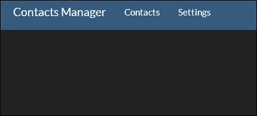
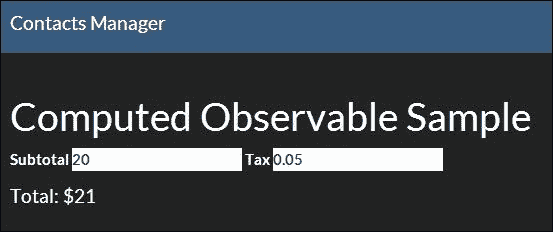

# 第一章. Knockout 基础知识

虽然预期您对 JavaScript 和**KnockoutJS**都有经验，但我们仍将介绍基础知识以建立共同的基础。如果不介绍至少基础知识，这本书就不完整。之后，我们将查看构建一个简单的应用来创建和管理联系信息。这个应用将在整本书中用来探索 Knockout 的新技术，并了解它们如何融入应用开发的大过程。在本章中，您将学习如何：

+   定义视图模型

+   编写标准绑定

+   使用扩展器

+   使用模板

+   将所有这些部分组合成一个功能应用

这涵盖了 Knockout 的大部分标准功能。在下一章中，我们将探讨创建自己的绑定来扩展 Knockout。

即使您之前使用过 Knockout 并且认为不需要复习，我也鼓励您至少阅读涵盖`联系人列表`应用示例的部分。在我们探索更高级概念的过程中，我们将使用这个示例。

在我们开始之前，让我们设置我们的开发环境。

# 环境设置

我们将使用一个简单的**Node.js**服务器来托管我们的应用，因为它可以在任何操作系统上运行。如果您还没有安装，请按照[`nodejs.org/download`](http://nodejs.org/download)上的说明安装 Node.js。

我们将使用**Git**来管理每章的代码。如果您还没有安装，请按照[`git-scm.com/book/en/Getting-Started-Installing-Git`](http://git-scm.com/book/en/Getting-Started-Installing-Git)上的说明安装 Git。本书的代码可以从[`www.packtpub.com`](http://www.packtpub.com)下载。每个章节开始所需的全部代码都可以在名为`cp[章节编号]-[示例]`的分支中找到。例如，我们将查看的第一个示例将位于`cp1-computeds`分支中。

首先，从[`github.com/tyrsius/MasteringKnockout`](https://github.com/tyrsius/MasteringKnockout)克隆仓库。您可以使用提供的下载链接或运行以下命令：

```js
git clone git@github.com:tyrsius/MasteringKnockout

```

然后，使用以下命令检出第一个示例：

```js
git checkout cp1

```

所有示例都遵循相同的模式。在根目录下是一个包含样板 Node.js 服务器的`server.js`文件。在客户端目录中包含应用的所有代码。要运行应用，请在命令行中运行以下命令：

```js
node server.js

```

保持命令行窗口开启，否则服务器将停止运行。然后，打开您的网络浏览器并导航到`http://localhost:3000`。如果您正确设置了环境，您应该会看到如以下截图所示的空`联系人列表`应用：



`cp1` 分支包含一些空白页的骨架。直到我们到达 **联系人** 应用程序，大部分示例将不会有 **联系人** 或 **设置** 页面；它们将在主页上展示代码。

## 查看示例

书中提供了运行代码的示例。它们位于 Git 仓库的分支中。你可以通过检出分支查看它们，使用以下命令：

```js
git checkout [BranchName]

```

由于仓库是一个功能应用，大部分代码与示例无关。`client` 目录包含 `index.html` 和 `shell.html` 页面，以及 `app`、`content` 和 `lib` 目录。`app` 目录是我们 JavaScript 的位置。`content` 目录包含包含的 CSS，而 `lib` 包含第三方代码（Knockout、jQuery 和 Twitter Bootstrap）。

包含的 Node 服务器具有一个非常简单的视图组合，将页面的内容放置在壳的 `{{ body }}` 部分中。如果你使用过任何服务器端 MVC 框架，例如 Ruby on Rails 或 ASP.NET MVC，你会对这一点很熟悉。这种机制与 Knockout 无关，但它将帮助我们保持代码分离，当我们添加文件时。壳位于 `shell.html` 文件中。你可以查看它，但它与示例没有直接关系。示例的 HTML 代码在 `client/index.html` 文件中。示例的 JavaScript 代码在 `client/app/sample.js` 文件中。

## JavaScript 的兼容性

在整本书中，我们将使用依赖于 ECMAScript 5 特性的代码，这些特性在所有现代浏览器上都得到支持。我鼓励你使用兼容的浏览器运行这些示例。如果你不能，或者如果你有兴趣在旧环境中运行它们，你可以使用 **polyfill**。polyfill 是一个 JavaScript 库，它向旧环境添加标准功能，以便它们能够运行现代代码。对于 ECMAScript 5 函数，我推荐 **Sugar.js**。对于 CSS3 媒体查询支持，我推荐 **Respond.js**。

# Knockout 概述

Knockout 是一个为 **模型-视图-视图模型**（**MVVM**）开发设计的库。这种模式是 Martin Fowler 的展示模型的子模式，它鼓励将 **用户界面**（**UI**）与领域模型的企业逻辑分离。为了促进这种分离，Knockout 提供了实现此模式所需的三个必要组件，即视图的声明性语法（数据绑定 HTML 属性）、从视图模型通知更改的机制（可观察对象）以及介于两者之间的数据绑定器（Knockout 的绑定处理程序）。

我们将在这里介绍数据绑定和可观察对象语法；绑定处理程序语法及其用法将在下一章介绍。

使用 MVVM 模式意味着你的视图模型使用 JavaScript 操作数据，并且你的 HTML 视图使用声明式数据绑定语法来描述。你的 JavaScript 代码不应直接访问或修改视图——数据绑定应该通过将你的可观测对象转换为 HTML 并使用绑定处理程序来处理这一点。

要考虑视图和视图模型之间的分离，最好的方式是考虑是否两个不同的视图可以使用你的视图模型。虽然这通常不会这样做，但将其牢记在心仍然很有帮助，因为它迫使你保持它们之间的分离。MVVM 允许你在不影响视图模型的情况下重新设计视图。

# 可观测对象

Knockout 通过发布/订阅模式在应用程序的不同部分之间保持数据同步，例如 UI 和视图模型。Knockout 中的发布者是可观测对象。如果您之前在 **Windows Presentation Foundation** (**WPF**) 开发中使用过 MVVM，那么可观测对象可以被视为 Knockout 的 `INotifyPropertyChanged` 实现。

要构建一个可观测对象，需要在全局 `ko` 对象上调用 `observable` 函数：

```js
this.property = ko.observable('default value');
```

`observable` 函数返回一个新的可观测对象。如果使用值调用 `ko.observable`，则返回具有该值的可观测对象。

### 注意

Knockout 可观测对象之所以是 JavaScript 函数而不是普通属性，是为了支持旧版浏览器，如不支持属性上的获取器和设置器的 Internet Explorer 6。如果没有这种能力，设置属性将没有机制来通知订阅者关于更改的信息。

可观测对象是 JavaScript 函数，它们记录读取其值的订阅者，然后在值更改时调用这些订阅者。这是通过 Knockout 的依赖跟踪机制完成的。

通过不带任何参数调用它们来读取可观测对象。要写入可观测对象，请使用值作为第一个也是唯一的参数调用它（其他参数将被忽略）：

```js
var total = vm.total();// read value
vm.total(50);// write new value
```

### 小贴士

**下载示例代码**

您可以从您在 [`www.packtpub.com`](http://www.packtpub.com) 的账户下载您购买的所有 Packt 书籍的示例代码文件。如果您在其他地方购买了这本书，您可以访问 [`www.packtpub.com/support`](http://www.packtpub.com/support) 并注册以直接将文件通过电子邮件发送给您。

可观测对象可以包含任何合法的 JavaScript 值：原始值、数组、对象、函数，甚至其他可观测对象（尽管这可能不是很有用）。值是什么并不重要；可观测对象仅仅提供了一个机制来报告该值何时被更改。

## 可观测数组

尽管标准可观察对象可以包含数组，但它们并不适合跟踪数组中的变化。这是因为可观察对象正在寻找数组值的更改，而不是数组本身的引用，添加或删除元素不会影响引用。由于这是大多数人期望在数组上看起来像更改通知的样子，Knockout 提供了`observableArray`：

```js
this.users = ko.observableArray(myUsers);
```

与可观察对象一样，数组可以用初始值构造。通常，您通过调用它或通过传递参数设置其值来访问可观察对象。对于可观察数组，情况略有不同。由于数组的值是其引用，设置该值将改变整个数组。相反，您通常想要通过添加或删除元素来操作数组。考虑以下操作：

```js
this.users().push(new User("Tim"));
```

通过调用`this.users()`，在将新用户推送到它之前检索了底层数组。在这种情况下，Knockout 没有意识到数组已更改，因为更改是对数组本身而不是可观察对象进行的。为了允许 Knockout 正确跟踪更改，这些更改需要应用于可观察对象，而不是底层值。

要做到这一点，Knockout 在可观察对象上提供了标准的数组方法，即`push`、`pop`、`shift`、`unshift`、`sort`、`reverse`和`splice`。调用应该如下所示：

```js
this.users.push(new User("Tim"));
```

注意，我们不是从可观察对象中检索数组，而是直接在可观察对象上调用`push`。这将确保订阅者通过更新后的数组收到更改通知。

## 计算可观察对象

可观察对象是手动设置的属性，无论是通过您的代码还是通过 UI 的绑定。计算可观察对象是那些通过对其依赖项的变化自动更新其值的属性，如下面的代码所示：

```js
var subtotal = ko.observable(0);
var tax = ko.observable(0.05);
var total  = ko.computed(function() {
  return parseFloat(subtotal()) * (1 + parseFloat(tax()));
});
```

在这个例子中，`subtotal`和`tax`是`total`计算可观察对象的依赖项。对于第一次，计算可观察对象计算了访问过的任何其他可观察对象的记录并为它们创建了一个订阅。结果是，每当`subtotal`或`tax`发生变化时，`total`就会重新计算并通知其订阅者。将计算可观察对象视为声明性值可能会有所帮助；您将它们的值定义为公式，它们将保持自身更新。

`parseFloat`调用是为了确保它们被视为数字而不是字符串，这会导致连接而不是算术运算。由于 Knockout 将数据绑定到 HTML 属性，这些属性始终是字符串，因此数据绑定的更新会产生字符串。当我们讨论扩展器时，您将看到另一种管理此问题的方法。

您可以在`cp1-computeds`分支上看到这个示例的样本：



尝试更改一些数字并观察`总`计算值自动更新。您可以通过查看`client/app/sample.js`文件来看到 viewmodel 代码中只包含这个示例。

### 可写计算可观察对象

之前的`total`示例是一个只读计算。虽然它们不太常见，但也可以使计算可观察量可写。要做到这一点，将一个包含`read`和`write`函数的对象传递给`ko.computed`：

```js
var subtotal = ko.observable(0);
var tax = ko.observable(0.05);
var total  = ko.computed({
  write: function(newValue) {
      subtotal(newValue / (1 + parseFloat(self.tax())));
  },
  read: function() {
      parseFloat(subtotal()) * (1 + parseFloat(tax()));
 }
});
```

当有东西尝试向当前的`total`计算写入时，它将通过`write`函数更新`subtotal`可观察量。这是一个非常强大的技术，但并不总是必要的。在某些情况下，无法直接写入`total`可能是一件好事，例如当`total`可能涉及对项目列表条件性地应用税费时。你应该只在有道理这样做的时候使用可写计算。

你可以在`cp1-writecomputed`分支中看到这个示例。现在的`total`计算绑定到了一个`input`元素，例如`subtotal`和`tax`属性，值的更改将反映回`subtotal`可观察量。

### 纯计算可观察量

非纯计算可观察量在它们的任何依赖项发生变化时都会重新评估自己，即使没有订阅者接收更新的值。如果计算也有故意的副作用，这种重新评估可能是有用的，但如果没有任何副作用，它将浪费内存和处理器的周期。另一方面，纯计算可观察量在没有订阅者时不会重新评估。

纯计算可观察量有两种状态：**监听**和**睡眠**。当一个纯计算有订阅者时，它将处于监听状态，并表现得就像一个正常的计算一样。当一个纯计算没有订阅者时，它将进入睡眠状态并取消所有依赖订阅。当它醒来时，纯计算将重新评估自身以确保其值正确。

当一个值可能长时间未被使用时，纯计算可观察量非常有用，因为它们不会重新评估。然而，由于纯计算在从睡眠状态访问时总是会重新评估，它有时可能表现得不如正常计算可观察量。由于正常计算只有在它们的依赖项发生变化时才会重新评估，因此频繁从睡眠状态唤醒的计算可观察量可能会更频繁地评估其依赖项。

创建纯计算有两种方式：使用`ko.pureComputed`或通过将`{ pure: true }`作为`ko.computed`的第三个参数传递：

```js
var total = ko.pureComputed(function() {
  return parseFloat(subtotal()) * (1 + parseFloat(tax()));
});
//OR
var total = ko.computed(function() {
  return parseFloat(subtotal()) * (1 + parseFloat(tax()));
}, this, { pure: true });
```

### 注意

纯计算可观察量是在 Knockout 3.2 中引入的，而这本书是在那时尚未发布。没有任何代码示例利用纯计算可观察量，尽管许多示例本可以从它们中受益。

## 手动订阅

有时候，当可观察量发生变化时，你需要做的不仅仅是更新依赖值，例如根据你可观察量的新值发起一个网络请求以获取更多数据。可观察量提供了一个`subscribe`函数，允许你注册一个函数，当可观察量更新时将被调用。

订阅在 Knockout 中使用与绑定处理程序和计算属性使用的相同内部机制来接收更改。

这是在可观察对象上设置订阅的一个示例：

```js
var locationId = ko.observable();
locationId.subscribe(function (newLocationId) {
  webService.getLocationDetails(newLocationId);
});
```

当 `locationId` 被更新时，无论是由 UI 绑定还是 JavaScript 中的其他地方触发，此订阅都会被调用。

`subscribe` 函数还允许你为订阅提供一个目标以及你想要订阅的事件名称。目标是为你提供的订阅处理程序设置的 `this` 的值。事件默认为更改，它接收更新后的值，但也可以是 `beforeChange`，它在更改发生之前调用，并带有旧值：

```js
locationId.subscribe(function (oldValue) {
  console.log("the location " + oldValue + " is about to change");
}, self, 'beforeChange');});
```

最后，你可以通过捕获订阅并调用 dispose 来停止订阅继续触发。如果你想要停止处理程序或创建只触发一次的订阅，这可能会很有用：

```js
var subscription = locationId.subscribe(function (newValue) {
  console.log("the location " + oldValue + " is about to change");
  subscription.dispose();
});
```

一旦订阅被销毁，它就不能重新启动。如果你需要它，你必须重新创建订阅。

`cp1-subscribe` 分支有一个订阅示例，它在 JavaScript 控制台中记录 `subtotal` 可观察对象的任何更改，以及一个停止订阅的按钮。尝试更改小计或总价值，并注意控制台消息。更改总价值会导致小计更新，这就是为什么它仍然触发订阅。记住，来自任何来源的更改都会导致可观察对象向所有订阅者报告更改。这就是为什么更新 `total` 计算属性会导致视图模型属性的 `input` 元素更新；`input` 元素是视图模型属性的订阅者。

# 定义视图模型

视图模型是视图与之绑定的属性的对象；它们形成绑定上下文。它是你视图中的数据和操作的表示（我们将在本章后面的 *控制流绑定* 部分详细讨论它们）。像 JavaScript 中的常规对象一样，实际上有很多方法可以创建它们，但 Knockout 引入了一些特定的挑战。

## this 和 self 关键字

在 JavaScript 中，`this` 有一个特殊的意义；它指的是调用函数的对象。从对象中调用的函数将那个对象设置为 `this`。然而，对于由代码匿名调用的函数，这仅仅是对象的 *内部*，其行为是不同的。考虑以下视图模型：

```js
function Invoice() {
  this.subtotal = ko.observable();
  this.total = ko.computed(function() {
  return this.subtotal() * 1.08; //Tax Rate
  });
}
```

计算属性中的函数不是 `Invoice` 对象的属性。因为它在另一个上下文中运行，所以它的 `this` 值将是窗口对象，而不是 `Invoice` 对象。它将无法找到 `subtotal` 属性。有两种处理方法。

第一种是通过使用 `ko.computed` 函数的第二个参数将函数绑定到 `this`：

```js
function Invoice() {
  this.subtotal = ko.observable();
  this.total = ko.computed(function() {
    return this.subtotal() * 1.08; //Tax Rate
  }, this);
}
```

这给计算可观察值提供了一个对最初定义它的 `Invoice` 的引用，这允许计算可观察值在正确的上下文中调用提供的函数。

确保计算可观察值可以引用 `subtotal` 的第二种方式是捕获 `this` 的值在一个闭包中。然后你可以使用这个闭包安全地引用父视图模型的属性。这样的闭包有几个传统名称：`that`、`_this` 或 `self`。

我更喜欢使用 `self`，因为它在视觉上与 `this` 区分开来，同时仍然具有相似的含义，但最终决定权在你：

```js
function Invoice() {
  var self = this;
  self.subtotal = ko.observable();
  self.total = ko.computed(function() {
return self.subtotal() * 1.08; //Tax Rate
  });
}
```

我发现第二种方法更容易记住。如果你总是使用 `self` 来引用模型，它总是会起作用。如果你在计算属性内部有另一个匿名函数，你必须记得绑定该函数；无论你嵌套多深，`self` 作为一个闭包都会继续工作。`self` 变量作为闭包在视图模型中定义的任何函数内部工作，包括订阅。当 `self` 没有被使用时，这也很容易被发现，这在调试代码时非常有帮助。

## 原型问题

如果你正在处理将被其他视图模型继承的视图模型，你可能会认为将所有基本可观察属性放在原型上是正确的做法。在纯 JavaScript 中，如果你正在继承一个对象，尝试改变存储在原型上的属性的值；该属性将被添加到继承对象中，而原型保持不变。然而，在使用 Knockout 中的可观察值时，情况并非如此。可观察值是函数，它们的值是通过调用它们并传递单个参数来设置的，而不是通过为新值赋值。因为原型继承会导致多个对象引用同一个可观察值；可观察值不能安全地放在视图模型的原型上。非可观察函数仍然可以安全地包含在原型中。例如，考虑以下对象：

```js
var protoVm = {
  name: ko.observable('New User')
};

var base1 = Object.create(protoVm);
var base2 = Object.create(protoVm);

base2.name("Base2");
```

最后一行将导致两个对象的名字都被更新，因为它引用的是同一个函数。这个例子可以在 `cp1-prototype` 分支中看到，该分支包括两个绑定到每个视图模型名称的输入元素。由于它们实际上是同一个可观察值，改变一个将影响另一个。

## 序列化视图模型

当你准备好将你的视图模型发送到服务器，或者真正需要处理它们的值而不是可观察值时，Knockout 提供了两个非常实用的实用方法：

+   `ko.toJS`：这个函数接受一个对象，并对其进行深拷贝，展开所有可观察值，到一个新的 JavaScript 对象中，其属性是正常的（非可观察）JavaScript 值。这个函数非常适合获取视图模型的副本。

+   `ko.toJSON`：这个函数使用 `ko.toJS` 的输出与 `JSON.stringify` 结合，生成一个包含提供对象的 JSON 字符串。这个函数接受与 `JSON.stringify` 相同的参数。

# 数据绑定语法

Knockout 利用 HTML5 `data-*`属性规范来定义其`data-bind`属性。尽管所有 HTML 属性都是字符串，但 Knockout 将它们解析为 name:value 对。名称指的是要使用的绑定处理程序，而值指的是绑定将使用的值：

```js
<button data-bind="enable: canSave">Save</button>
```

`data-bind`属性也可以包含由逗号分隔的多个绑定。这允许在元素上绑定多个属性：

```js
<input data-bind="value: firstName, enable: canEdit" />
```

在前面的示例中，`enable`绑定使用`canEdit`作为值。当`canEdit`为`false`时，绑定将在按钮元素上设置`disabled`属性，当`canEdit`为`true`时，将移除`disabled`属性。如果`canEdit`是一个可观察的值，`enable`绑定将在`canEdit`更新时更新。如果`canEdit`是一个字面量值，例如`true`，它将只使用该值来设置初始状态。

`Enable`是一个**单向绑定**；它将更新元素值，但不会用元素值更新值。这是因为当使用`enable`来控制元素时，Knockout 假设不会有任何程序更新元素。更新应在视图模型中发生，绑定处理程序应负责确保视图保持同步。

当用户更新数据绑定输入元素的 UI 时，这些更改需要同步到视图模型。这是通过**双向绑定**完成的，例如`value`绑定：

```js
<input data-bind="value: firstName" />
```

此绑定将`input`元素的初始值设置为`firstName`属性的当前值，之后，它将确保元素值或属性的任何更改都会导致对方更新。如果用户在输入框中输入某些内容，`firstName`属性将接收该值。如果`firstName`属性被程序更新，输入框的值也将被更新。

这些都是绑定到视图模型简单属性的示例。这是最常见的情况，但 Knockout 也支持更复杂的场景。

### 注意

对于标准 Knockout 绑定处理程序的完整列表，请参阅 Knockout 文档([`knockoutjs.com/documentation/introduction.html`](http://knockoutjs.com/documentation/introduction.html))。

## 嵌套属性的绑定

在前面的示例中，Knockout 解析了属性的绑定值并查找当前视图模型上的该属性。您也可以提供深层属性引用。考虑以下对象：

```js
var viewmodel = {
  user: {
    firstName: ko.observable('Tim'),
    age: ko.observable(27)
  }
};
```

我们可以通过使用标准的点表示法直接绑定到视图模型用户的`firstName`属性：

```js
<input data-bind="value: user.firstName" />
```

## 函数绑定

如果您使用`click`或`event`绑定来绑定一些 UI 事件，绑定期望属性是一个函数。函数将接收当前模型（绑定上下文）作为其第一个参数，并将 JavaScript 事件作为第二个参数（尽管您不需要这样做非常频繁）。

在这个例子中，父视图模型通过 `click` 绑定接收要删除的联系人，因为 `foreach` 循环为每个联系人创建了一个嵌套绑定上下文。绑定中的父引用将上下文移动到父视图模型以获取对删除函数的访问：

```js
<ul data-bind="foreach: contacts">
    <li>
      <span data-bind="text: name"></span>
      <button data-bind="click: $parent.remove">Remove</button>
    </li>
</ul>

var ViewModel = function() {
    var self = this;
    self.contacts = ko.observableArray([{ name: 'Tim' }, { name: 'Bob' }]);
    self.remove = function (contact) {
         self.contacts.remove(contact);
    };
};
```

## 使用表达式进行绑定

除了属性引用外，Knockout 还支持将 JavaScript 表达式用作绑定值。对于期望 true 或 false 值的绑定，例如 enable，我们可以使用布尔表达式来设置它们：

```js
<button data-bind="enable: age > 18">Approve</button>
```

我们还可以使用三元表达式来控制表达式的结果。这在布尔值不期望的情况下很有用，例如文本绑定：

```js
Old enough to Drink in the U.S. 
<span data-bind="text: age > 18 ? 'Yes' : 'No'"></span>
```

现在 `span` 将以 `Yes` 作为内容。

这两种表达式形式都将使用依赖跟踪来重新运行，如果它们在第一次运行时从可观察值中读取。如果 `age` 是一个可观察值，我们可以更新它，并且元素的绑定将重新评估表达式，如果结果改变，将更改文本或启用状态。

## 使用函数表达式进行绑定

设置绑定值的最后一种方法是使用函数。您可以通过在绑定中引用它来调用函数：

```js
<button data-bind="enable: canApprove(age)">Approve</button>
```

您也可以直接在绑定中将匿名函数作为字符串写入。当为 `click` 绑定创建函数时，参数是绑定上下文（视图模型）和 JavaScript `click` 事件。如果您使用属性名绑定到视图模型函数，它将接收相同的参数：

```js
<button data-bind="text: 
function(data) { console.log(data.age)  }">Log Age</button>
```

虽然这是可能的，但我不会鼓励这样做。它将逻辑直接放在视图中，而不是属于视图模型的视图模型中。您只应在非常特殊的情况下使用这种方法。将方法放在视图模型上并仅使用属性引用要好得多。

## 在绑定中使用括号

尝试弄清楚在绑定中使用括号以使用可观察值作为值时可能会令人困惑。Knockout 通过在简单绑定表达式中不要求括号来尝试提供帮助，如下所示：

```js
<input data-bind="value: firstName" />
```

在这个例子中，`firstName` 属性可以是可观察的或字面值，并且它将正常工作。然而，在绑定中有两种情况下需要括号：当绑定到嵌套属性和当绑定到表达式时。考虑以下视图模型：

```js
var viewmodel = {
  user: ko.observable({
    firstName: ko.observable('Tim'),
    age: ko.observable(27)
  })
};
```

这里用户对象是一个可观察属性，以及它的每个属性也是如此。如果我们现在想写相同的绑定，它需要在 `user` 函数上包含括号，但不在 `firstName` 属性上：

```js
<input data-bind="value: user().firstName" />
```

在我们直接绑定到属性的情况下，该属性的括号永远不需要。这是因为 Knockout 足够智能，能够理解如何在绑定中访问它给出的可观察值的值。

然而，如果我们绑定到一个表达式，它们总是需要的：

```js
<button data-bind="enable: user().age > 18">Approve</button>
<button data-bind="enable: user().age() > 18">Approve</button>
```

这两个绑定都不会导致错误，但第一个绑定不会按预期工作。这是因为第一个表达式将尝试在 `age` 可观察对象本身（它是一个函数，而不是一个数字）上评估，而不是在可观察对象的值上。第二个表达式正确地比较了可观察对象的值与 `18`，产生了预期的结果。

## 使用 ko.toJSON 进行调试

因为 `ko.toJSON` 接受 `JSON.stringify` 的 `spaces` 参数，所以你可以在文本绑定中使用它来获取一个格式良好、易于阅读的 viewmodel 的实时副本：

```js
<pre data-bind="text: ko.toJSON($root, null, 2)"></pre>
```

`cp1-databind` 分支有一个每个这些绑定的交互式示例。

# 控制流绑定

到目前为止，我们已经查看了一向绑定和双向绑定，它们通过 HTML 元素的属性设置或同步数据。Knockout 使用一种不同的绑定来通过添加或删除节点来修改 DOM。这些是控制流绑定，包括 `foreach`、`if`、`with` 和 `template`。

所有的控制流绑定实际上是通过从 DOM 中移除其内容并创建一个内存中的模板来工作的。这个模板用于根据需要添加和移除内容。

控制流绑定（除了 `if`）还引入了一个绑定上下文层次结构。你的根绑定上下文是传递给 `ko.applyBindings` 的 viewmodel。`data-bind` 属性可以访问当前上下文中的属性。控制流绑定（除了 `if`）创建一个子绑定上下文，这意味着控制流绑定模板内的 `data-bind` 属性可以访问它们上下文中的属性，而不是根上下文。子上下文内的绑定可以访问特殊属性，以便它们可以导航上下文层次结构。最常用的有：

+   `$parent`：这访问了直接父级的绑定上下文。在这个例子中，`group` 和 `$parent.group` 指的是同一个属性，因为 `$parent` 访问的是人之外的上下文：

    ```js
    <span data-bind="text: group"></span>
    <div data-bind="with: person">
      <span data-bind="text: name"></span>
    <span data-bind="text: $parent.group"></span>
      </div>
    ```

+   `$parents[n]`：这是一个父级上下文的数组。`$parents[0]` 数组与 `$parent` 相同。

+   `$root`：这是根 viewmodel，在层次结构中处于最高层。

+   `$data`：这是当前 viewmodel，在 `foreach` 循环内很有用。

    ### 注意

    对于上下文属性的完整列表，请参阅 Knockout 文档中的它们，链接为 [`knockoutjs.com/documentation/binding-context.html`](http://knockoutjs.com/documentation/binding-context.html)。

## if 绑定

`if` 绑定接受一个要评估的值或表达式，并且只有在值或表达式为真（在 JavaScript 的意义上）时才渲染包含的模板。如果表达式是假的，模板将从 DOM 中移除。当表达式变为真时，模板将被重新创建，并且任何包含的 `data-bind` 属性都将重新应用。`if` 绑定不会创建一个新的绑定上下文：

```js
<div data-bind="if: isAdmin">
  <span data-bind="text: user.username"></span>
  <button data-bind="click: deleteUser">Delete</button>
</div>
```

当 `isAdmin` 为 `false` 或 `null` 时，这个 `div` 将为空。如果 `isAdmin` 的值被更新，绑定将重新评估并根据需要添加或删除模板。

此外，还有一个 `ifnot` 绑定，它只是反转了表达式。如果你想在不需要添加感叹号和括号的情况下仍然使用属性引用，这会很有用。以下两行是等价的：

```js
<div data-bind="if: !isAdmin()" >
<div data-bind="ifnot: isAdmin">
```

在第一个例子中需要括号，因为它是一个表达式，而不是属性名。在第二个例子中不需要括号，因为它是一个简单的属性引用。

## With 绑定

`with` 绑定使用提供的值创建一个新的绑定上下文，这导致绑定在绑定元素内的作用域被限制到新的上下文中。这两个代码片段在功能上是相似的：

```js
<div>
  First Name:
<span data-bind="text: selectedPerson().firstName"></span>
  Last Name:
<span data-bind="text: selectedPerson().lastName"></span>
</div>

<div data-bind="with: selectedPerson">
  First Name:
<span data-bind="text: firstName"></span>
  Last Name:
<span data-bind="text: lastName"></span>
</div>
```

虽然节省一些键盘输入并使你的绑定更容易阅读是件好事，但 `with` 绑定的真正好处是它是一个隐式的 `if` 绑定。如果值是 `null` 或 `undefined`，HTML 元素的内容将从 DOM 中移除。在可能的情况下，这可以节省你为每个后代绑定进行空值检查的需要。

## The foreach binding

`foreach` 绑定创建一个隐式模板，使用 HTML 元素的内容，并为数组中的每个元素重复该模板。

这个 viewmodel 包含了一个我们需要渲染的人的列表：

```js
var viewmodel = {
  people: [{name: 'Tim'}, {name: 'Justin}, {name: 'Mark'}]
}
```

使用这个绑定，我们为 `li` 元素创建一个隐式模板：

```js
<ul data-bind="foreach: people">
  <li data-bind="text: name"></li>
</ul>
```

这个绑定会生成以下 HTML：

```js
<ul>
  <li>Tim</li>
  <li>Justin</li>
  <li>Mark</li>
</ul>
```

这里需要注意的是，`li` 元素绑定的是 `name`，这是人的属性。在 `foreach` 绑定内部，绑定上下文是子元素。如果你需要引用子元素本身，你可以使用 `$data` 或为 `foreach` 绑定提供一个别名。

当数组只包含你想要绑定的原始数据时，`$data` 选项很有用：

```js
var viewmodel = {
  people: ['Tim', 'Justin, 'Mark']
}
...
<ul data-bind="foreach: people">
  <li data-bind="text: $data"></li>
</ul>
```

`alias` 选项可以清理你的代码，但它特别有用，当你有一个嵌套上下文并且想要引用父级时。参考以下代码：

```js
<ul data-bind="foreach: { data: categories, as: 'category' }">
    <li>
        <ul data-bind="foreach: { data: items, as: 'item' }">
          <li>
            <span data-bind="text: category.name"></span>:
            <span data-bind="text: item"></span>
          </li>
         </ul>
    </li>
</ul>
```

这可以通过 `$parent` 实现，当然，但使用 `alias` 时更易于阅读。

# 模板绑定

模板绑定是一个特殊的控制流绑定。它为每个其他控制流绑定都有一个参数。可能更准确地说，其他控制流绑定都是模板绑定的 **别名**：

```js
  <ul data-bind="foreach: { data: categories, as: 'category' }">
  <ul data-bind="template: { foreach: categories, as: 'category' }">
```

这两个在功能上是等价的。模板绑定 `as` 有一个参数用于 `if` 和 `data`（它们一起构成了 `with` 绑定）。

然而，与其他控制流绑定不同，它还可以使用 `name` 参数从命名源生成模板。默认情况下，Knockout 只查找具有与 `name` 参数匹配的 `id` 参数的 `<script>` 标签：

```js
<div data-bind="template: { name: 'person-template', data: seller }"></div>
<script type="text/html" id="person-template">
    <h3 data-bind="text: name"></h3>
    <p>Credits: <span data-bind="text: credits"></span></p>
</script>
```

要停止 `script` 块作为 JavaScript 执行，你需要一个虚拟的脚本类型，例如 `text/html` 或 `text/ko`。Knockout 不会将绑定应用于脚本元素，但它将它们用作模板的源。

虽然在 `foreach` 或 `with` 中看到的内联模板使用得更为常见，但命名模板有三个非常重要的用途。

## 可重用模板

由于模板可以引用外部源来生成 HTML，因此可以有多个模板绑定指向单个源：

```js
<div>
  <div data-bind="template: { name: 'person', data: father} "></div>
  <div data-bind="template: { name: 'person', data: mother} "></div>
</div>
...
<script type="text/html" id="person">
  <h3 data-bind="text: name"></h3>
  <strong>Age: </strong>
<span data-bind="text: age"></span><br>
  <strong>Location: </strong>
<span data-bind="text: location"></span><br>
  <strong>Favorite Color: </strong>
<span data-bind="text: favoriteColor"></span><br>
</script>
```

`cp1-reuse` 分支有一个这个技巧的例子。

## 递归模板

由于模板本身参与数据绑定，因此模板可以绑定到自身。如果一个模板引用了自己，结果就是递归：

```js
<div data-bind="template: { name: 'personTemplate', data: forefather} "></div>

<script type="text/html" id="personTemplate">
  <h4 data-bind="text: name"></h4>
  <ul data-bind="foreach: children">
    <li data-bind="template: 'personTemplate'"></li>
  </ul>
</script>
```

在上一个模板中使用的模板引用是使用缩写绑定，它直接使用模板的名称。当使用这种缩写时，当前绑定上下文用于模板的 `data` 参数，这在像这样的 `foreach` 循环中是完美的。当使用递归模板时，这是一种常见的技巧，因为信息树是最常见的地方，可以找到视觉递归。

这个递归模板的例子在 `cp1-recurse` 分支中。

## 动态模板

上一个例子中模板的名称是一个字符串，但它也可以是一个属性引用。将模板名称绑定到一个可观察的变量允许你控制要渲染哪个模板。这可能在交换视图模型的模板在显示和编辑模式之间非常有用。考虑这个模板绑定：

```js
<div data-bind="template: { name: template, data: father} "></div>
```

这个模板绑定由一个像这样的视图模型属性支持：

```js
self.template = ko.computed(function() {
  return self.editing() ? 'editTemplate' : 'viewTemplate';
});
```

如果我们将 `editing` 属性从 `true` 更改为 `false`，模板将重新渲染从 `viewTemplate` 到 `editTemplate`。这允许我们通过编程方式在它们之间切换。

一个动态编辑/查看模板的例子在 `cp1-dynamic` 分支中。

在一个高级场景中，你可以使用这种技术来在页面上创建一个通用的容器来显示完全不同的视图。同时切换模板名称和数据将模拟导航，创建一个**单页应用程序**（**SPA**）。当我们到达第四章 Chapter 4，*使用组件和模块进行应用程序开发*时，我们将查看一个类似的技术。

# 无容器控制流

到目前为止，我们已经探讨了使用控制流绑定（`if`、`with`、`foreach` 和 `template`）以及 HTML 元素上的标准 `data-bind` 属性。还可能使用没有元素的控制流绑定，通过使用 Knockout 解析的特殊注释标签。这被称为无容器控制流。

添加一个`<!— ko -->`注释开始一个以`<!-- /ko -->`注释结束的虚拟元素。这个虚拟元素会导致控制流绑定将所有包含的元素视为子元素。以下代码块演示了如何通过虚拟注释容器对兄弟元素进行分组：

```js
<ul>
    <li>People</li>
    <li>Locations</li>
    <!-- ko if: isAdmin -->
    <li>Users</li>
    <li>Admin</li>
    <!-- /ko -->
</ul>
```

列表元素只允许特定的元素作为子元素。前面的无容器语法将`if`绑定应用于列表中的最后两个元素，这会导致它们根据`isAdmin`属性添加或从 DOM 中删除：

```js
<ul>
    <li>Nav Header</li>
    <!-- ko foreach: navigationItems -->
    <li><span data-bind="text: $data"></span></li>
    <!-- /ko -->
</ul>
```

前面的无容器语法允许我们有一个`foreach`绑定来创建一个项目列表，同时保持列表顶部的标题项。

所有的控制流绑定都可以这样使用。前面的两个例子可以在`cp1-containerless`分支中看到。

# 扩展器

最后要介绍的是扩展器（别担心，还有很多高级内容要介绍）。扩展器提供了一种修改单个可观察对象的方法。扩展器的两种常见用途如下：

+   向可观察对象添加属性或函数

+   在可观察对象周围添加包装器以修改写入或读取

## 简单扩展器

添加扩展器就像向`ko.extenders`对象添加一个新函数一样简单，使用你想要使用的名称。这个函数接收被扩展的可观察对象（称为目标）作为第一个参数，并且任何传递给扩展器的配置作为第二个参数接收，如下面的代码所示：

```js
ko.extenders.recordChanges = function(target, options) {
  target.previousValues = ko.observableArray();
  target.subscribe(function(oldValue) {
    target.previousValues.push(oldValue);
  }, null, 'beforeChange');
  return target;
};
```

这个扩展器将在可观察对象上创建一个新的`previousValues`属性。这个新属性是一个可观察数组，当原始可观察对象发生变化时（当然当前值已经在可观察对象中），旧值会被推送到它里面。

扩展器必须返回目标的原因是扩展器的结果是新的可观察对象。这种需求在查看扩展器是如何被调用的时候很明显：

```js
var amount = ko.observable(0).extend({ recordChanges: true});
```

发送到`recordChanges`的`true`值作为`options`参数被扩展器接收。这个值可以是任何 JavaScript 值，包括对象和函数。

你也可以在同一个调用中将多个扩展器添加到可观察对象中。发送到`extend`方法的对象将为它包含的每个属性调用一个可观察对象：

```js
var amount = ko.observable(0).extend({ recordChanges: true,anotherExtender: { intOption: 1});
```

当在可观察对象上调用`extend`方法时，通常是在其初始创建期间，`extend`调用的结果才是实际存储的内容。如果目标没有返回，`amount`变量就不会是预期的可观察对象。

要访问扩展的值，您可以使用 JavaScript 中的 `amount.previousValues()`，或者如果从绑定中访问则为 `amount.previousValues`。注意 `amount` 后面没有括号；因为 `previousValues` 是可观察者的一个属性，而不是可观察者值的属性，它可以直接访问。这可能一开始不太明显，但只要您记住可观察者和可观察者包含的值是两个不同的 JavaScript 对象，这应该是有意义的。

这个扩展器的一个例子在 `cp1-extend` 分支中。

## 带有选项的扩展器

之前的示例没有向 `recordChanges` 扩展器传递任何选项，它只是使用 `true`，因为该属性需要一个有效的 JavaScript 值。如果您想为扩展器提供一个配置，您可以将其作为此值传递，并通过使用另一个对象作为值来实现复杂的配置。

如果我们想要提供一个不希望记录的值的列表，我们可以修改扩展器以使用选项作为数组：

```js
ko.extenders.recordChanges = function(target, options) {
  target.previousValues = ko.observableArray();
  target.subscribe(function(oldValue) {
    if (!(options.ignore && options.ignore.indexOf(oldValue) !== -1))
      target.previousValues.push(oldValue)
  }, null, 'beforeChange');
  return target;
};
```

然后，我们可以使用数组调用扩展器：

```js
var history = ko.observable(0).extend({ 
  recordChanges: { ignore: [0, null] } 
});
```

现在，我们的 `history` 可观察者不会为 `0` 或 `null` 记录值。

## 替换目标的扩展器

扩展器的另一个常见用途是将可观察者包装在一个计算可观察者中，该计算可观察者修改读取或写入，在这种情况下，它会返回新的可观察者而不是原始目标。

让我们把 `recordChanges` 扩展器再进一步，并实际上阻止 `ignore` 数组中的写入（不要在意名为 `recordChanges` 的扩展器在现实世界中永远不应该做这样的事情！）：

```js
ko.extenders.recordChanges = function(target, options) {
  var ignore = options.ignore instanceof Array ? options.ignore : [];
  //Make sure this value is available
  var result = ko.computed({
    read: target,
    write: function(newValue) {
      if (ignore.indexOf(newValue) === -1) {
        result.previousValues.push(target());
        target(newValue);
      } else {
        target.notifySubscribers(target());
      }
    }
  }).extend({ notify: 'always'});

  result.previousValues = ko.observableArray();

  //Return the computed observable
  return result;
};
```

这有很多更改，所以让我们来分解它们。

首先，为了使 `ignore` 更容易引用，我设置了一个新变量，该变量将是 `options.ignore` 属性或一个空数组。默认为空数组让我们可以跳过后面的 null 检查，这使得代码更容易阅读。其次，我创建了一个可写的计算可观察者。`read` 函数只是将路由到目标可观察者，但 `write` 函数只有在 `ignore` 选项不包含新值时才会写入目标。否则，它将通知目标订阅者旧值。这是必要的，因为如果 UI 绑定在可观察者上触发了更改，则需要撤销非法更改。UI 元素已经更新，最容易将其更改回原来的方式是通过标准绑定通知机制，该机制已经监听更改。

最后的更改是位于 `result` 上的 `notify: always` 扩展器。这是 Knockout 的默认扩展器之一。通常，一个可观察者只有在值被修改时才会向订阅者报告更改。为了使可观察者能够拒绝更改，它需要能够通知订阅者其当前未更改的值。通知扩展器强制可观察者始终报告更改，即使它们是相同的。

最后，扩展器返回新的计算可观察值而不是目标，这样任何尝试写入值的人都会针对计算进行操作。

`cp1-extendreplace`分支有一个这种绑定的例子。注意，尝试输入包含在忽略选项中（`0`或空字符串）的值会立即被撤销。

# 联系人列表应用程序

是时候将这些概念组合成一个可用的应用程序了。孤立的样本只能带你走这么远。我们将详细介绍`cp1-contacts`分支中的应用程序。应用程序的功能全部在**联系人**页面上，您可以通过浏览器中的导航栏访问它。在我们开始深入代码之前，我鼓励您先玩一下这个应用程序（它确实会持久化数据）。这将有助于理解代码中的关系。

## 概述

该应用程序有三个主要的 JavaScript 对象：

+   联系人模型

+   **联系人**页面视图模型

+   模拟数据服务

应用程序仅使用`index.html`文件中的 HTML，但这两个部分基本上是独立的。

+   输入表单（创建和编辑）

+   联系人列表

示例中的 JavaScript 代码遵循**立即调用的函数表达式**（**IIFE**）模式（有时发音为“iffy”），以隔离代码与全局作用域，并使用一个名为`app`的命名空间在文件之间共享代码：

```js
(function(app, $, ko) {
  /* CODE IN HERE */
})(window.app = window.app || {}, jQuery, ko);
```

这绝对不是组织 JavaScript 代码的唯一方式，你可能有一个你更喜欢的模式。如果你想更好地理解这个模式，这里有一些在线资源：

+   [`benalman.com/news/2010/11/immediately-invoked-function-expression/`](http://benalman.com/news/2010/11/immediately-invoked-function-expression/)

+   [`addyosmani.com/blog/essential-js-namespacing/`](http://addyosmani.com/blog/essential-js-namespacing/)

## 联系人模型

`client/app/contacts.js`文件定义了我们的基本联系人对象。让我们逐个分析它。

它从一个标准的可观察属性声明开始，并带有一些默认值。有许多理由以不同的方式组织代码，但对于较小的模型，我更喜欢将它们的所有可持久属性一起放在顶部：

```js
app.Contact = function(init) {
  var self = this;
  self.id = ko.observable(0);
  self.firstName = ko.observable('');
  self.lastName = ko.observable('');
  self.nickname = ko.observable('');
  self.phoneNumber = ko.observable('');
  /* More below */
```

接下来是`displayName`属性，一些简单的逻辑来生成一个漂亮的“标题”用于 UI 显示。这里使用了 JavaScript 的或运算符（`||`），以确保我们不会尝试在`null`或`undefined`值上读取`length`属性，在这种情况下，会返回一个默认值。这实际上使得它在赋值时成为一个空合并运算符：

```js
self.displayName = ko.computed(function() {
      var nickname = self.nickname() || '';
      if (nickname.length > 0)
        return nickname;
      else if ((self.firstName() || '').length > 0)
        return self.firstName() + ' ' + self.lastName();
      else
        return 'New Contact';
    });
```

接下来是一个更新模型的实用方法，它接受一个对象并将其属性合并进来。我通常在我的所有模型上放一个类似的方法，这样我就可以有一个标准的方式来更新它们。再一次，我们使用 `||` 作为安全网，以防方法在没有参数的情况下被调用（在现实世界中，你希望有一个更强的检查，确保 `update` 是一个对象而不是原始值或数组）：

```js
//Generic update method, merge all properties into the viewmodel
self.update = function(update) {
  data = update || {};
  Object.keys(data).forEach(function(prop) {
    if (ko.isObservable(self[prop]))
      selfprop;
  });
};

//Set the initial values using our handy-dandy update method.
self.update(init);
```

还要注意，在定义 `update` 函数之后，模型会使用构造函数参数来调用它。这使得构造函数能够从现有数据以及部分数据中创建新的模型。这在反序列化数据时非常有用，例如，从 Ajax 请求中获取 JSON。

最后，我们有 `toJSON` 方法。JavaScript 中的标准 `JSON.stringify` 方法会查找这个方法，以便对象可以控制其序列化方式。Knockout 的 `ko.toJSON` 在展开所有可观察对象之后会调用 `JSON.stringify`，这样序列化就会得到值而不是函数。

由于我们模型的序列化形式是我们将尝试持久化的形式，通常是通过使用 Ajax 将其发送到服务器，我们不希望包含诸如我们的计算显示名称之类的东西。我们的 `toJSON` 方法覆盖通过仅删除属性来处理这个问题：

```js
//Remove unwanted properties from serialized data
    self.toJSON = function() {
      var copy = ko.toJS(self);
      delete copy.displayName;
      return copy;
    };
```

使用 `ko.toJS` 进行复制很重要。我们不希望从实际模型中删除 `displayName`；我们只想从序列化模型中移除它。如果我们用 `copy = self` 创建变量，我们只会得到对同一个对象的引用。`ko.toJS` 方法是一种简单的方式，可以获取一个纯 JavaScript 复制，我们可以安全地从中删除属性而不影响原始对象。

## 联系人页面视图模型

`client/app/contactspage.js` 文件定义了 **Contacts** 页面的视图模型。与我们的联系人模型不同，该页面做的不仅仅是暴露一些可观察属性，它也不是为了从现有数据中构建而设计的。它不是通过接受一个对象来控制其起始值，这对于一个页面来说没有太多意义，其构造函数的参数是为了依赖注入设计的；它的构造函数参数接受其外部依赖项。

在这个例子中，`dataService` 是页面视图模型使用的依赖项：

```js
app.ContactsPageViewmodel = function(dataService)
```

简单来说，如果你不熟悉依赖注入，它允许我们定义我们的页面针对一个 API（有时称为合同或接口）的方法来获取和保存数据。这对我们来说特别有用，因为在本示例应用程序中，我们没有使用真实的 Ajax，而是用一个只向 DOM 的本地存储写入的对象来模拟它：

```js
ko.applyBindings(new app.ContactsPageViewmodel(app.mockDataService));
```

### 注意

更多关于 DOM 本地存储的信息，请参阅 Mozilla 开发者网络上的页面：[`developer.mozilla.org/en-US/docs/Web/Guide/API/DOM/Storage`](https://developer.mozilla.org/en-US/docs/Web/Guide/API/DOM/Storage)。

然而，当我们稍后编写实际的 Ajax 服务时，我们的 `ContactsPageViewmodel` 实际上不需要任何更改。我们只需用不同的 `dataService` 参数来构建它。只要它们公开相同的方法（相同的 API），它就会正常工作。

构造函数内的第一个部分是用于联系列表的。我们公开一个可观察数组，并从我们的数据服务获取联系：

```js
self.contacts = ko.observableArray();

dataService.getContacts(function(contacts) {
  self.contacts(contacts);
});
```

我们将回调传递给 `getContacts` 调用，因为我们的数据服务提供了一个异步 API。当数据服务完成获取我们的联系后，它将使用它们调用回调。我们的回调需要做的只是将它们放入 `contacts` 数组。

下一段代码是用来控制单个联系 **CRUD**（**创建、读取、更新、删除**）操作的。首先，我们公开一个我们将用于所有编辑的可观察对象：

```js
self.entryContact = ko.observable(null);

    self.newEntry = function() {
      self.entryContact(new app.Contact());
    };
    self.cancelEntry = function() {
      self.entryContact(null);
    };
```

我们的 UI 将将编辑表单绑定到 `entryContact` 属性。在这里，条目联系属性承担双重职责；它包含正在创建或编辑的联系，并指示正在发生编辑。如果条目联系为空，则表示我们不在编辑；如果它有一个对象，则表示我们正在编辑。UI 将使用 `with` 和 `if` 绑定来根据此逻辑控制显示哪些内容。

`newEntry` 和 `cancelEntry` 函数为 UI 提供了在两种状态之间切换的手段。

对于编辑现有联系，我们只需公开另一个函数，该函数接受一个联系并将其设置为条目联系：

```js
self.editContact = function(contact) {
      self.entryContact(contact);
    };
```

对于真正的编辑，我们需要的最后一件事是能够持久化我们的更改。正如现实世界一样，我们有三种情况，即创建新对象、保存现有对象和删除现有对象。

创建和更新都将使用 `entryContact` 属性来完成，我们希望能够为两者绑定相同的表单，这意味着我们需要针对单个函数：

```js
self.saveEntry = function() {
  if (self.entryContact().id() === 0) {
    dataService.createContact(self.entryContact(), function() {
      self.contacts.push(self.entryContact());
      self.entryContact(null);
    });
  } else {
    dataService.updateContact(self.entryContact(), function() {
      self.entryContact(null);
    });
  }
};
```

在内部，我们的 `saveEntry` 方法会检查非默认的 `id` 值，以确定是创建新对象还是更新现有对象。这两种情况都是调用数据服务，使用条目联系并带有回调来清除 `entryContact` 属性（因为我们已经完成了编辑）。在创建的情况下，我们希望在清空条目联系之前，将新创建的联系添加到我们本地的联系列表中：

```js
self.contacts.push(self.entryContact());
self.entryContact(null);
```

你可能会认为联系会在第二行被置为空，但这并不是事实。`entryContact` 属性是一个可观察对象，其值是一个联系。第一行读取这个值并将其推入 `contacts` 数组。第二行将 `entryContact` 属性的值设置为 `null`；它不会影响刚刚推入的联系。这就像我们在将对象添加到数组后将其变量设置为空一样。变量是对对象的引用，将变量设置为空会移除引用，而不是对象本身。

与之相比，删除函数很简单：

```js
self.deleteContact = function(contact) {
      dataService.removeContact(contact.id(), function() {
        self.contacts.remove(contact);
      });
    };
```

它将使用现有的联系人，比如`editContact`所做的那样，并调用数据服务。当我们删除联系人时，我们只需要`id`属性。回调将在服务完成后使用 Knockout 提供的`remove`函数从联系人列表中删除联系人。

页面上最后的功能是搜索机制。它从一个可观察的变量开始跟踪搜索，并有一个清除搜索的功能：

```js
self.query = ko.observable('');
self.clearQuery = function() { self.query(''); };
```

`query`属性将被用来过滤掉任何没有匹配或部分匹配属性的联系人。如果我们想要尽可能灵活，我们可以对每个属性进行搜索。然而，由于我们的联系人列表只显示计算出的`displayName`和电话号码，返回匹配我们未显示的属性的搜索结果看起来会很奇怪。这是代码示例中从联系人列表中进行过滤的计算可观察变量：

```js
self.displayContacts = ko.computed(function() {  
  //No query, just return everything
  if (self.query() === '')
    return self.contacts();
  var query = self.query().toLowerCase();
  //Otherwise, filter all contacts using the query
  return ko.utils.arrayFilter(self.contacts(), function(c) {
    return c.displayName().toLowerCase().indexOf(query) !== -1 
        || c.phoneNumber().toLowerCase().indexOf(query) !== -1;
  });
});
```

### 注意

如果你想过滤联系人的所有属性，它们在代码库中以注释的形式列出。它们可以通过取消注释每一行轻松重新启用。

首先，我们检查查询是否为空，因为如果为空，我们不会过滤任何东西，所以我们不想浪费周期去迭代联系人。

在开始之前，我们调用`toLowerCase()`函数对查询进行转换，以避免任何大小写敏感的问题。然后，我们在联系人上迭代。Knockout 在`ko.utils`对象上提供了几个数组相关的实用方法（以及其他功能）。`arrayFilter`函数接受一个数组和迭代函数，该函数会在数组的每个元素上被调用。如果函数返回`true`，`arrayFilter`将包括该元素在其返回值中；否则，它将过滤掉该元素。我们迭代器需要做的只是比较我们想要保留的过滤属性（记得首先将它们转换为小写）。

现在如果 UI 绑定到`displayContacts`，搜索功能将过滤 UI。

然而，如果我们每次查询更新时都要遍历所有联系人，特别是如果查询在每次按键时更新，我们可能会遇到大量联系人列表的较差性能。为了解决这个问题，我们可以在我们的过滤计算上使用标准的 Knockout `rateLimit` 扩展器来阻止它过于频繁地更新：

```js
self.displayContacts = ko.computed(function() {
  /* computed body */
}).extend({
  rateLimit: {
    timeout: 100,
    method: 'notifyWhenChangesStop'
  }
});
```

这个扩展器有两个模式：`notifyAtFixedRate`和`notifyWhenChangesStop`。这两个选项将节流或去抖动计算。

### 注意

如果你不太熟悉节流和去抖动函数，[`drupalmotion.com/article/debounce-and-throttle-visual-explanation`](http://drupalmotion.com/article/debounce-and-throttle-visual-explanation)上有很好的解释和视觉演示。

这让我们可以控制计算重新评估自身的频率。前面的例子只有在所有依赖项停止变化 100 毫秒后，计算才会重新评估一次。这将允许在查询输入稳定下来时更新 UI，同时仍然看起来像用户输入时那样进行过滤。

### 关于模型与视图模型的一个哲学思考

在客户端-服务器应用程序中，模型和视图模型之间的界限可能会变得模糊，即使阅读了 Knockout 的文档([`knockoutjs.com/documentation/observables.html`](http://knockoutjs.com/documentation/observables.html))，也可能不清楚我们的联系人对象是否真的是模型或视图模型。大多数人可能会争辩说它是一个视图模型，因为它有可观察属性。我喜欢将这些较小的对象视为模型，并将视图模型视为包含操作和视图表示的对象，例如我们的**联系人**页面视图模型中的`removeContact`操作或`entryContact`属性。

## 模拟数据服务

通常，你会使用 Ajax 调用，可能配合 jQuery，来检索数据并将数据从服务器提交和检索。因为这是一本关于 Knockout 的书，而不是 Node.js，我想尽量保持服务器尽可能瘦。从“精通 Knockout”的角度来看，我们调用一个制作 Ajax 请求的 JavaScript 对象或将其存储在 DOM 中并不重要。只要我们正在处理看起来和功能像异步服务的东西，我们就可以探索 Knockout 视图模型如何与之交互。话虽如此，数据服务中确实有一些功能会在 Ajax 数据服务对象中使用，并且从 Knockout 应用程序开发的角度来看是很有趣的。

你可能在前一节中注意到，当**联系人**页面视图模型与数据服务通信时，它并没有处理 JSON，而是处理真实的 JavaScript 对象。实际上，甚至不是普通的 JavaScript 对象，而是我们的联系人模型。这是因为数据服务的一部分责任，无论是模拟还是真实的 Ajax 服务，都是抽象化服务机制的知识。在我们的情况下，这意味着在 JSON 和我们的 Knockout 模型之间进行转换：

```js
createContact: function(contact, callback) {
  $.ajax({
      type: "POST",
      url: "/contacts",
      data: ko.toJS(contact)
    })
    .done(function(response) {
      contact.id(response.id);
      callback()
    });
}
```

如果将我们的模拟数据服务中的`createContact`方法重写为使用真实的 Ajax（此代码在`mockDataService.js`文件中作为注释），那么它看起来是这样的。数据服务是我们应用程序的一部分，因此它知道它正在处理可观察属性，并且需要将它们转换为纯 JavaScript 以便 jQuery 能够正确序列化，因此它使用`ko.toJS`解包它提供的联系人。然后，在`done`处理程序中，它从服务器的响应中获取`id`，并使用它更新联系人的可观察`id`属性。最后，它调用回调来表示已完成。

您可能会想知道为什么它没有将`contact`作为参数传递给回调。当然可以，但这是不必要的。原始调用者已经有了联系人，调用者唯一需要的是新的`id`值。我们已经更新了`id`，由于它是可观察的，任何订阅者都会获取那个新值。如果我们需要在设置`id`值之前进行一些特殊处理，那将是另一种情况，并且我们可以通过将`id`作为参数传递来引发回调。

## 视图

希望您已经稍微玩过这个应用程序。如果您还没有，现在就是时候了。我会等待。

当您添加或编辑联系人时，您可能会注意到联系人列表被移除。您可能没有注意到的是，URL 并没有改变；当我们在这两个视图之间切换时，浏览器实际上并没有进行导航。尽管它们在同一个 HTML 文件中，但这两个不同的视图基本上是独立的，并且它们通过`with`和`ifnot`绑定来控制。

### 编辑表单

这是在添加或编辑联系人时显示的内容：

```js
<form class="form" role="form" data-bind="with: entryContact, submit: saveEntry">
      <h2 data-bind="text: displayName"></h2>
      <div class="form-group">
        <label for="firstName" class="control-label">First Name</label>
        <input type="text" class="form-control" id="firstName"placeholder="First Name" data-bind="value: firstName">
      </div>
      <div class="form-group">
        <label for="lastName" class="control-label">Last Name</label>
        <input type="text" class="form-control" id="lastName" placeholder="First Name" data-bind="value: lastName">
      </div>
      <div class="form-group">
        <label for="nickname" class="control-label">Nickname</label>
        <input type="text" class="form-control" id="nickname" placeholder="First Name" data-bind="value: nickname">
      </div>
      <div class="form-group">
        <label for="phoneNumber" class="control-label">Phone Number</label>
        <input type="tel" class="form-control" id="phoneNumber" placeholder="First Name" data-bind="value: phoneNumber">
      </div>
      <div class="form-group">
        <button type="submit" class="btn btn-primary">Save</button>
        <button data-bind="click: $parent.cancelEntry" class="btn btn-danger">Cancel</button>
      </div>
    </form>
```

由于`with`绑定也是隐式的`if`绑定，因此当`entryContact`属性为 null 或 undefined 时，整个表单会被隐藏。

表单的其余部分相当直接。使用`submit`绑定，以便点击保存按钮或按任何字段的回车键都会调用提交处理程序，显示显示名称的标题，每个字段的值绑定，一个带有`type="submit"`的保存按钮（以便它使用提交处理程序），以及一个绑定到`$parent.cancelEntry`的取消按钮。记住，`$parent`作用域是必要的，因为`with`绑定在`entry`联系人上创建了一个绑定上下文，而`cancelEntry`是`ContactPageViewmodel`上的一个函数。

### 联系人列表

列表从`entryContact`属性的`ifnot`绑定开始，确保只有在上一个表单隐藏的情况下才会显示。我们只想一次看到其中一个：

```js
<div data-bind="ifnot: entryContact">
  <h2>Contacts</h2>
  <div class="row">
    <div class="col-xs-8">
      <input type="search" class="form-control" data-bind="value: query, valueUpdate: 'afterkeydown'" placeholder="Search Contacts">
    </div>
    <div class="col-xs-4">
      <button class="btn btn-primary" data-bind="click: newEntry">Add Contact</button>
    </div>
  </div>
  <ul class="list-unstyled" data-bind="foreach: displayContacts">
    <li>
      <h3>
        <span data-bind="text: displayName"></span> 
          <small data-bind="text: phoneNumber"></small>
        <button class="btn btn-sm btn-default" data-bind="click: $parent.editContact">Edit</button>
        <button class="btn btn-sm btn-danger" data-bind="click: $parent.deleteContact">Delete</button>
      </h3>
    </li>
  </ul>
</div>
```

搜索输入具有`value`绑定以及`valueUpdate`选项。值更新选项控制`value`绑定何时报告更改。默认情况下，更改在失去焦点时报告，但`afterkeydown`设置会导致在输入获得新字母后立即报告更改。这将导致搜索实时更新，但请记住，显示的联系人有一个`rateLimit`扩展器，它将更新延迟到 100 毫秒。

在搜索框旁边有一个按钮用于添加新的联系人。然后，当然，联系人列表通过在`displayContacts`属性上的`foreach`绑定来绑定。如果它直接绑定到`contacts`，则列表将不会显示过滤功能。根据您的应用程序，您甚至可能希望保留未过滤的联系人列表为私有，并且仅公开过滤后的列表。最佳选项实际上取决于您正在做什么，在大多数情况下，使用您的个人偏好是完全可以的。

在联系人列表中，每个条目都显示了电话号码的显示名称，并有一个按钮来编辑或删除联系人。由于 `foreach` 在单个联系人上创建了一个绑定上下文，而编辑和删除功能在父级上，因此 `click` 绑定使用了 `$parent` 上下文属性。`click` 绑定还将当前模型发送到每个编辑和删除函数，这样这些函数就不必通过遍历整个列表来尝试找到正确的 JavaScript 对象。

这就是应用程序的全部内容。我们有一个带有搜索功能的列表视图，它可以切换到易于重用的视图，用于编辑和创建。

# 摘要

在本章的大部分内容中，我们回顾了标准 Knockout 的使用。希望我没有在细节中迷失你的注意力。重要的是，在我们继续使用自定义功能扩展 Knockout 或构建更大的应用程序之前，你必须对可观察对象和数据绑定的基本使用感到舒适。这包括：

+   `**扩展器**`**: 这包括创建扩展器和扩展可观察对象**

+   ****模板**：这告诉我们控制流的工作方式，什么是绑定上下文，内联模板与命名模板，以及无容器控制流**

**在下一章中，我们将通过创建自己的绑定处理程序来为 Knockout 添加新的功能。**
