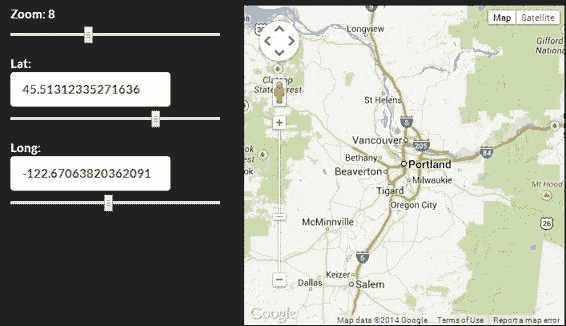

# 第二章. 使用自定义绑定处理器扩展 Knockout

Knockout 的标准绑定很棒。它们解决了您在开发 Web 应用时可能遇到的大多数一般性问题。但总有提供特殊功能的需求，无论是您正在开发自己的库还是只是尝试为您的应用添加一些样式。当这种情况发生时，您将通过您在所有其他地方使用的相同绑定系统来提供该功能。幸运的是，Knockout 使扩展此系统变得容易。在本章中，我们将探讨如何创建我们自己的绑定处理器。我们将涵盖以下主题：

+   绑定处理器包含的内容

+   创建新的绑定处理器

+   使用自定义绑定处理器与第三方库集成

+   管理绑定上下文

+   使用无容器控制流语法与自定义绑定

为新的和更复杂的 HTML 交互创建自定义绑定处理器是开发功能丰富应用的关键。虽然基础知识容易学习，但扩展点足够多，可以支持几乎任何用例。我们将查看许多示例，以获得绑定处理器能够做什么以及我们如何最好地利用它们的稳固概念。

# 数据绑定模式

本节主要涉及哲学。如果您已经对**模型-视图-视图模型**（**MVVM**）模式和绑定处理器背后的**是什么**和**为什么**有了稳固的理解，那么您可能想要跳到下一节，*绑定处理器的组成部分*。

好的，让我们来谈谈模式和最佳实践。如果您之前没有使用过 WPF，那么 MVVM 模式可能是 Knockout 中最令人困惑的事情。MVVM 是微软提出的一个模式。它并没有在.NET 社区之外得到很多关注，并且由于它与更受欢迎的 MVC 模式相似，因此混淆几乎是必然的。

在 MVVM 中，视图模型应该代表视图的抽象。考虑 iOS 中的这两个消息线程列表：


它们都显示一个线程列表，每个线程都包含一个标题，显示与之相关的人员，最近消息的摘录，以及时间戳。可以选中或删除一个线程。要选择一条消息，您可以触摸它。要删除一条消息，您可以向左滑动以显示**删除**按钮，然后按下**删除**按钮来删除线程。尽管如此，您可能已经注意到了行为上的差异。左侧的列表将整个线程向左滑动以显示**删除**按钮，使线程部分离开屏幕。右侧的列表将按钮叠加在线程上方，隐藏了时间戳。

这些差异完全是数据展示的一部分。这两个视图都可以，并且应该由同一个视图模型支持。它们都显示相同的数据并允许相同的操作。

要使用预期的行为（幻灯片显示或幻灯片叠加）来消费这些数据，视图需要从除视图模型之外的其他东西那里获得支持。在 MVVM 模式中，这是绑定处理器的领域，尽管绑定处理器在缩写中没有字母，但它仍然是这个谜题的关键部分。由于视图模型不应该知道与视图相关的概念，如按钮、点击或手指触摸，而视图应该完全是声明性的，因此需要一个绑定处理器来将两者粘合在一起。

这里的基本原理是关注点的分离。视图关注 UI 元素和交互。视图模型关注代码对象和动作，而绑定处理器关注在视图模型之间通用地转换特定的 UI 元素或动作。

既然这些都已经说清楚，那么是时候开始创建一些自定义绑定处理器了！

# 绑定处理器的组件

绑定处理器通过向`ko.bindingHandlers`对象添加对象来定义，就像扩展器一样。它们由一个`init`和一个`update`函数组成。

当绑定首次应用于元素时，`init`函数会运行，无论是调用`ko.applyBindings`还是通过控制流绑定（如`template`或`foreach`）创建元素。它应该用于所有一次性工作，例如将事件处理器或销毁回调附加到元素上。

`update`函数在`init`之后运行，当绑定首次应用时。每当任何可观察的依赖项发生变化时，它都会再次运行。`update`函数确定其依赖项的方式与计算可观察项相同。如果在更新运行时访问了可观察项，它会订阅该可观察项。`update`函数应用于保持 UI 与视图模型的变化同步：

```js
ko.bindingHandlers.yourBindingName = {
    init: function(element, valueAccessor, allBindings, viewModel, bindingContext) {
        // This will be called when the binding is first applied
        // Set up any initial state, event handlers, etc. here
    },
    update: function(element, valueAccessor, allBindings, viewModel, bindingContext) {
        // This will be called once when the binding is first applied
        // and again whenever dependant observables change.
        // Update the DOM element based on the supplied values here.
    }
};
```

两个函数都接收以下参数：

+   `Element`：这是绑定应用到的 DOM 元素。

+   `valueAccessor`：这是一个函数，将返回绑定表达式的结果。例如，如果绑定是`value: name`，则`valueAccessor`将返回`name`属性。如果`name`是可观察的，则仍然需要调用它或将它传递给`ko.unwrap`（此函数将在下一节中介绍）以获取值。如果绑定是`value: name() + '!'`，则`valueAccessor`将返回结果字符串。

+   `allBindings`：这是一个具有`get`和`has`函数的对象，用于访问元素上的其他绑定。

+   `Viewmodel`：在 Knockout 的早期版本中，这提供了对视图模型的访问，但自 Knockout 3.0 以来，它已被弃用，转而使用`bindingContext.$data`或`bindingContext.$rawData`。

+   `bindingContext`：这是一个对象，包含当前绑定的绑定上下文。它具有特殊的绑定上下文属性，如`$parent`和`$root`。此参数是在 Knockout 3.0 中引入的。

## 使用自定义绑定处理器

一旦添加到`ko.bindingHandler`对象中，自定义绑定与普通绑定没有区别。如果你添加了一个名为`flash`的绑定处理程序，你可以在具有标准`data-bind`属性的 HTML 元素上使用它：

```js
<p data-bind="flash: vmProperty">Flashy! (bum dum tish)</p>
```

# 简单绑定处理程序

绑定处理程序可以从非常简单到完全独立的应用程序。由于绑定处理程序的目的在于在表示层（HTML）和视图模型（JavaScript）之间进行转换，因此绑定处理程序的复杂性直接与 UI 交互和绑定数据的复杂性相关。简单的任务，如使用动画隐藏或显示元素，将具有非常薄的处理器，而数据绑定在交互式地图元素上将需要更多的逻辑。

## 动画绑定处理程序

由于 DOM 交互是 jQuery 的主要用途，并且鉴于其流行程度，在 Knockout 绑定处理程序中使用 jQuery 并不罕见。Knockout 文档中的典型自定义绑定处理程序示例是一个用于隐藏和显示元素的绑定，使用 jQuery 的`slideUp`和`slideDown`方法，而不是使用标准的`visible`绑定来切换它们的开和关：

```js
ko.bindingHandlers.slideVisible = {
    init: function(element, valueAccessor) {
        var value = ko.unwrap(valueAccessor());
        $(element).toggle(value);
    },
    update: function(element, valueAccessor, allBindings) {
        var value = ko.unwrap(valueAccessor());
        var duration = allBindings.get('slideDuration') || 400;

        if (value === true)
            $(element).slideDown(duration); //show
        else
            $(element).slideUp(duration); //hide
    }
};
```

此示例同时使用了`init`和`update`函数。这里的`init`函数是必要的，以确保一个初始值为假的值在绑定首次应用时不会导致元素向上滑动，反之亦然。如果没有它，`update`函数会立即运行并尝试通过滑动隐藏元素。`init`函数确保元素已经处于正确的可见状态，因此当绑定首次运行时不会发生动画。

`ko.unwrap`是一个实用方法，如果调用时带有一个参数，它将返回一个可观察值的值；否则，它将直接返回第一个参数。如果你不确定是否有可观察值，这是一个完美的选择，因为它可以安全地用任何东西调用。大多数自定义绑定应该能够支持可观察值和非可观察值，所以你应该始终解包`valueAccessor`参数，除非你有充分的理由不这样做。

检查`allBindings.get('slideDuration')`允许使用可配置的值来设置幻灯片的计时。`allBinding`对象使我们能够访问同一元素上使用的其他绑定，通常用于收集可选的配置值：

```js
<p data-bind="slideVisible: isShowing, slideDuration: 200">Quick</p>
```

这允许视图决定元素隐藏和显示的速度。由于动画速度是演示的一部分，因此从视图配置它是有意义的。如果你想使用视图模型的可观察值`slideDuration`，你可以修改该行以解包值：

```js
var duration = ko.unwrap(allBindings.get('slideDuration')) || 400;
```

此绑定的一个示例在`cp2-slide`分支中。

## 与第三方控件协同工作

`slideVisible`绑定是一个完美的简单绑定；它有一个基本的`init`函数来启动绑定，并且有一个`update`函数，当视图模型发生变化时修改 DOM。然而，它是一个**单向绑定**，只监视视图模型的变化。**双向绑定**还需要监视 DOM 元素的变化并将其发送回视图模型。通常，这是通过在`init`函数中附加事件处理器来实现的；记住，`update`函数会在依赖项每次更改时运行，所以在那里附加事件处理器会导致事件处理器被多次附加。

绑定处理器也可以用来与第三方控件集成。尽管 HTML5 有一个原生的`datepicker`控件，但你可能需要一个更向后兼容的控件。jQuery 的`datepicker`控件是一个很好的即用型控件，但它需要调用`$(element).datepicker()`来将标准输入元素转换为日期选择器。绑定处理器是运行视图初始化逻辑的完美位置：

```js
ko.bindingHandlers.datepicker = {
    init: function(element, valueAccessor, allBindingsAccessor) {
        var options = allBindingsAccessor().datepickerOptions || {},
            $el = $(element);

        //initialize datepicker with some optional options
        $el.datepicker(options);

        //handle the field changing
        ko.utils.registerEventHandler(element, "change", function() {
            var observable = valueAccessor();
            observable($el.datepicker("getDate"));
        });

        //handle disposal (if KO removes by the template binding)
        ko.utils.domNodeDisposal.addDisposeCallback(element, function() {
            $el.datepicker("destroy");
        });

    },
    update: function(element, valueAccessor) {
        var value = ko.unwrap(valueAccessor()),
            $el = $(element),
            current = $el.datepicker("getDate");

        if (value - current !== 0) {
            $el.datepicker("setDate", value);   
        }
    }
};
```

要在 HTML 中使用此绑定，请将其应用于一个输入元素：

```js
<input data-bind="datepicker: myDate, datepickerOptions: { mandate: new Date() }" />
```

### 注意

此示例来自 R. P. Niemeyer 在 Stack Overflow 上的答案，可以在[`stackoverflow.com/a/6400701/788260`](http://stackoverflow.com/a/6400701/788260)找到。

此绑定的`init`函数首先存储 jQuery 包装的元素，然后检查选项。jQuery UI 的 UI 日期选择器([`jqueryui.com/datepicker`](http://jqueryui.com/datepicker))有很多选项，允许绑定控制配置是标准的。

接下来是使用`$el.datepicker(options)`对元素进行 jQuery 化。这附加了允许 jQuery 隐藏和显示弹出日期选择器控件并将其选择路由到输入元素的`value`的事件处理器。然后，使用 Knockout 的`ko.utils.registerEventHandler`，它附加了一个事件处理器，该处理器接受新的`value`并将其写入提供的可观察对象。

在某些情况下，我们可能想查看`valueAccessor`参数是否是可观察的，这样即使针对静态值，绑定也可以用来设置元素的初始值。你在这里需要使用你的最佳判断；在这种情况下，绑定的整个目的就是收集用户输入，所以在这种情况下与非可观察值一起工作是没有意义的。如果你确实想进行检查，你可以按以下方式更改事件处理器部分：

```js
if (ko.isObservable(valueAccessor())) {
  ko.utils.registerEventHandler(element, "change", function () {
        var observable = valueAccessor();
        observable($el.datepicker("getDate"));
    });
}
```

`ko.isObservable`函数是一个实用方法，如果第一个参数是`observable`、`observableArray`或`computed`可观察对象，则返回`true`。当`valueAccessor`参数不是可观察对象时，根本不需要附加更改处理器，因为我们不会对新的值做任何事情。

`init`函数中的最后一部分是一个**销毁处理程序**。当元素从 DOM 中移除时，绑定就会被销毁，这通常发生在`template`或`foreach`等控制流绑定更新自身时。jQuery 的`datepicker`控件期望调用`$el.datepicker("destroy")`来清理事件处理器（如果有的话），并从 DOM 中移除弹出元素。记住，弹出元素是由 jQuery 在这个绑定处理程序内部添加的，所以 Knockout 的模板系统并不了解它们。《ko.utils.domNodeDisposal.addDisposeCallback》注册了当模板系统从 DOM 中移除节点时将被调用的处理器。这是一个重要的步骤，任何时候你的绑定处理程序修改了 DOM。

`update`函数处理可观察的变化，但由于它需要在元素值和 JavaScript `Dates`代码之间进行转换，它必须执行自己的相等性检查。它不是查看元素值，而是使用`$el.datepicker("getDate")`，这返回一个真实的 JavaScript 日期。

要查看这个绑定的实际效果，你可以查看`cp2-datepicker`分支。我添加了一个与日期选择器绑定相同视图模型属性的`span`元素，这样你可以轻松地看到值的变化。

## 使用绑定修改 DOM

前两个绑定主要是数据与展示逻辑之间的转换器，但绑定处理程序可以做得更多。绑定也可以用来向页面添加新元素。如果你想提供一个 1-5 星级的 UI，你应该考虑使用带有`options`和`value`绑定的`select`元素。虽然这可以工作，但更常见的方法是提供一系列用户可以点击的星星，点击会激活被点击的星星和所有之前的星星。Knockout 教程网站([`learn.knockoutjs.com/#/?tutorial=custombindings`](http://learn.knockoutjs.com/#/?tutorial=custombindings))提供了一个很好的解决方案，它用一系列样式化的`span`元素替换了节点的内容：

```js
ko.bindingHandlers.starRating = {
    init: function(element, valueAccessor) {
        $(element).addClass("starRating");
        for (var i = 0; i < 5; i++) {
           $("<span>").appendTo(element);
}

        // Handle mouse events on the stars
        $("span", element).each(function(index) {
            $(this).hover(
                function() { 
                  $(this).prevAll().add(this)
                    .addClass("hoverChosen");
                }, 
                function() { 
                  $(this).prevAll().add(this)
                    .removeClass("hoverChosen");
                }                
            ).click(function() { 
                var observable = valueAccessor();
                observable(index + 1); 
            });
        });            
    },
    update: function(element, valueAccessor) {
        // Give the first x stars the "chosen" class
        // where x <= rating
        var observable = valueAccessor();
        $("span", element).each(function(index) {
            $(this).toggleClass("chosen", index < observable());
        });
    }
};
```

你可以这样在元素上使用这个绑定：

```js
<span data-bind="text: name"></span>
<span data-bind="starRating: rating"></span>
```

结果是一个看起来很不错的控件，对于之前填写过在线调查的人来说会感到熟悉：


此绑定的`init`函数设置了三件事。首先，它向绑定节点添加五个 span 元素作为子元素，这些元素将作为评分的星级。其次，它添加了悬停处理程序，将`hoverChosen`类应用到光标下的星级以及所有前面的星级。星级是累积的，所以如果我们悬停在第三个星级上，我们应该看到前三个星级填充。最后，它为每个星级添加了一个点击处理程序，该处理程序使用星级所代表的数字更新`bound`属性。由于它使用循环的索引，该循环从`0`开始，因此它将`1`添加到值上。再次，我们看到绑定假定所使用的属性是可观察的。如果我们想支持只读显示，我们就会修改绑定以在尝试更新之前检查属性是否可观察。

此绑定的`update`函数与我们之前看到的函数不同。它不是使用`valueAccesor`属性的新值来设置原始绑定元素的属性，而是遍历星级并使用 jQuery 的`toggleClass`来设置或删除所选类，仅应用于索引在或低于新值的星级。视图模型仍然只知道一个整数值，而视图只知道绑定元素正在使用`starRating`来展示该数字。绑定处理程序抽象出星级元素，并处理数字值与所选星级之间的转换。

此绑定假定存在应用于星级 span 的 CSS 类。您可以在`cp2-stars`分支中看到此绑定和 CSS 的交互式示例。

## 将新绑定应用到新子元素

在上一个示例中，我们查看如何创建子元素以使用一些样式来展示我们的数据。它是使用 jQuery 来管理在绑定初始化期间添加的子元素类。然而，当使用 Knockout 绑定时，有时使用内置的绑定处理程序来处理这类事情更有意义。幸运的是，我们可以在元素创建后添加 Knockout 绑定。

Knockout 提供了一个实用函数`ko.applyBindingsToNode`，用于手动将绑定应用到元素上。该函数接受一个绑定元素的对象。对象上的每个属性都将用于查找绑定处理程序，并将属性的值传递给绑定。它还接受一个可选的视图模型或绑定上下文作为第三个参数；如果省略，它将使用当前的绑定上下文：

```js
init: function(element, valueAccessor) {
    var childElementToBind = document.createElement('input');
  element.appendChild(childElementToBind);

  ko.applyBindingsToNode(childElementToBind, {
    value: valueAccessor()
  });
}
```

这将在原始元素之后添加一个新的输入元素，并将一个`value`绑定应用到原始的可观察对象上。`applyBindingsToNode`调用接受一个新的输入元素和一个将应用`value`绑定的对象。`valueAccessor`属性返回原始属性并将其传递给绑定，本质上是将新的输入绑定到与原始绑定相同的属性。

如果我们想要创建一个添加带有新标签的输入的绑定，它可能看起来像这样：

```js
ko.bindingHandlers.labelInput = {
      init: function(element, valueAccessor) {
          var input = document.createElement('input'),
            label = document.createElement('label'),
            labelText = valueAccessor().label,
            inputValue = valueAccessor().value;

          label.innerHTML = labelText;
          label.appendChild(input);

      element.appendChild(label);

      ko.applyBindingsToNode(input, {
        value: inputValue,
        valueUpdate: 'afterkeydown'
      });
      }
```

其绑定可以使用如下方式：

```js
<div data-bind="labelInput: { label: 'Custom', value: name }"></div>
```

此绑定创建一个新的标签和输入，并将其作为子元素附加到原始绑定上。标签的文本设置为绑定的 `label` 属性，而绑定的 `value` 则绑定到输入节点。希望您现在可以开始看到绑定处理程序如何被用来创建不仅自己的行为，还可以创建自己的自定义元素。

此绑定的一个示例可以在 `cp2-applynode` 分支中看到。

### 应用访问器

`applyBindingsToNode` 方法在 Knockout 的所有版本中都可用，但如果您使用的是 Knockout 3.0 或更高版本，则还有一个方法可用。`applyBindingAccessorsToNode` 方法的工作方式与 `applyBindingsToNode` 类似，它将绑定对象作为第一个参数，并将可选的绑定上下文作为第三个参数。然而，它不是直接获取第二个参数属性的值，而是获取一个提供 `valueAccessor` 属性的函数。之前的 `apply` 调用在被转换后看起来如下：

```js
ko. applyBindingAccessorsToNode (input, {
  value: function() { return inputValue },
  valueUpdate: function() { return 'afterkeydown' }
});
```

此方法实际上是 `applyBindingsToNode` 在将其提供的值转换为值访问器函数（如之前的那些）后内部调用的。使用 `applyBindingAccessorsToNode` 获得的少量间接步骤减少了性能。然而，更大的好处在于当绑定的值是一个表达式而不是一个简单的属性时。一个表达式只有在从使用它的绑定内部评估时才能建立依赖关系。值访问器函数将在稍后评估，允许它们正确地与表达式一起工作。

## 控制绑定处理程序的顺序

在罕见的情况下，您可能需要确保绑定处理程序按特定顺序发生。截至 Knockout 3.0，通过将绑定处理程序的 `after` 属性设置为必须首先处理的绑定数组，这是可能的。例如，您可以定义一个需要首先处理值和选项的绑定：

```js
ko.bindingHandlers.valuePlus = {
    'after': ['options', 'value'],
    'init': function (element, valueAccessor, allBindings) {
        /* some code /*
     }
}
```

几个默认绑定都利用了这一点。`value` 绑定依赖于 `options` 和 `foreach`；`checked` 绑定依赖于 `value` 和 `attr`。

应该注意的是，如果您创建了两个具有相互 `after` 引用的绑定，Knockout 如果试图将这两个绑定应用到同一元素上，将会抛出一个循环依赖异常。

# 高级绑定处理程序

到目前为止，我们一直在查看处理一个或两个属性并导致相当简单的单一用途控制的绑定处理程序。在之前的示例中，我们开始查看创建新子元素的绑定处理程序，并且这种技术允许我们创建更复杂的绑定行为。绑定还可以与复杂元素（如图表或地图控件）交互（例如，Google 地图小部件），为 viewmodel 提供一个干净的 API，以便与之交互。

## 使用图表绑定复杂数据

第一次我们考虑与第三方控件集成时，是与日期选择器的单属性双向绑定。每次我们与第三方 UI 工具一起工作时，目标是通过绑定将它们从视图和视图模型中抽象出来；即使这些工具是用于复杂结构，如图表。

Charts.js ([`www.chartjs.org`](http://www.chartjs.org)) 是一个流行的 JavaScript 库，用于显示数据，正如你所猜想的，是图形图表。不深入探讨图表工作细节，一个由绑定处理程序提出的挑战是，图表没有用于制作增量更新的 API。整个图表需要重新渲染以进行更新。这需要访问`canvas`元素以及画布的 2D 上下文。如果我们创建画布在`init`函数中，在`update`函数中获取该元素可能会很棘手。让我们看看一个这样的例子（这是示例代码）：

```js
ko.bindingHandlers.doughnutChart = {
    init: function(element, valueAccessor) {
        var canvas = document.createElement('canvas'),
            options = ko.utils.extend(defaultChartOptions, valueAccessor());

        element.appendChild(canvas);
    },
    update: function(element, valueAccessor) {
        var chartContext = canvas.getContext('2d')

        /* Drawing code */

        new Chart(chartContext).Doughnut(data, options);
    }
};
//HTML
<div data-bind="doughnutChart: {data: chartSeries}"></div>
```

你可以在`init`函数中看到，一个新的画布元素已经被创建并附加到绑定元素上。然而，变量（`canvas`）需要在`update`函数中用于绘图，但实际上它并不在那里可用。

Knockout 提供了两个实用方法，`ko.utils.domData.set(element, key, value)`和`ko.utils.domData.get(element, key)`，它们可以用于在绑定元素上设置值。它们可以存储任何 JavaScript 值，包括 DOM 节点引用，因此我们当然可以在这里使用它们：

```js
ko.bindingHandlers.doughnutChart = {
    init: function(element, valueAccessor) {
        var canvas = document.createElement('canvas'),
            options = ko.utils.extend(defaultChartOptions, valueAccessor());

        ko.utils.domData.set(element, 'canvas', canvas);

        element.appendChild(canvas);
    },
    update: function(element, valueAccessor) {
        var canvas = ko.utils.domData.get(element, 'canvas'),
            chartContext = canvas.getContext('2d');

        /* Drawing code */

        new Chart(chartContext).Doughnut(data, options);
    }
};
```

这将有效。然而，这也意味着元素不仅包含画布作为子元素，还作为属性；这也意味着每次更新运行时都需要检索该元素。

另一种方法是在`init`函数中创建一个具有对画布或甚至上下文的闭包的计算可观察对象。这听起来像是创建了一个额外的对象，但请记住，绑定中的`update`函数实际上被包裹在一个计算中，以利用依赖检测的优势。使用这种方法，我们的绑定将看起来像这样：

```js
ko.bindingHandlers.doughnutChart = {
    init: function(element, valueAccessor) {
        var canvas = document.createElement('canvas'),
            options = ko.utils.extend(defaultChartOptions, valueAccessor()),
            chartContext = canvas.getContext('2d');

        element.appendChild(canvas);        

        ko.computed(function() { 
  canvas.height = ko.unwrap(options.height);
          canvas.width = ko.unwrap(options.width);

          var data = ko.toJS(options.data).map(function(x) {
            return {
              value: parseFloat(x.value),
              color: x.color.indexOf('#') === 0 ? "#" + x.color : x.color
            }
          });

            new Chart(chartContext).Doughnut(data, options);
        }, null, {disposeWhenNodeIsRemoved: element});
    }
};
```

使用这种方法时需要考虑的一点是计算的可处置性。计算构造函数的第三个参数是一个`options`对象，我们可以通过指定元素来指定计算应该与 DOM 节点的移除一起被销毁。这个选项可以在前面的例子中看到。

在示例中需要注意的另一件事是`init`函数中的`options`变量。你应该熟悉扩展对象的概念，但以防万一，请记住，扩展（也称为合并）是指选择一个目标对象，并通过复制其所有属性来使用源对象更新它。结果是具有两者组合值的对象，在目标对象也有值的情况下，使用源对象的值。Knockout 在`ko.utils.extend`上提供了一个`extend`方法。我在这里使用它来使所有的图表`options`都是可选的，通过在绑定之前提供这些默认值：

```js
var defaultChartOptions = { 
    height: 300, 
    width: 300,
    animation: false
  };
```

必须提供的是图表显示所需的数据。Chart.js 要求 Doughnut 图表提供一个包含值和颜色的对象数组。为了提供一个人性化的绑定，我们可以让绑定负责确保数据被清理，这包括将值解析为数字并确保我们的颜色值以哈希（`#`）开头，用于十六进制代码。除了高度和宽度的一些选项外，我们的最终计算结果可能如下所示：

```js
ko.computed(function() {

  canvas.height = ko.unwrap(options.height);
  canvas.width = ko.unwrap(options.width);

  var data = ko.toJS(options.data).map(function(x) {
    return {
      value: parseFloat(x.value),
      color: x.color.indexOf('#') === 0 ? x.color : "#" + x.color
    };
  });

  new Chart(chartContext).Doughnut(data, options);
}, null, {disposeWhenNodeIsRemoved: element});
```

这个绑定的一个示例，包括一些用于更改数据的绑定，可以在`cp2-charts`分支中找到。

### 动态调整图表类型

Chart.js 中的三个图表——Doughnut、Pie 和 Polar Area——使用相同的值/颜色对数据结构。如果你想支持在兼容的图表之间切换，你可以添加类型作为绑定选项。我们的计算结果将如下所示：

```js
var chart = new Chart(chartContext),
  chartType = ko.unwrap(options.type);

if (circularChartTypes.indexOf(chartType) === -1) {
  throw new Error('Chart Type ' + chartType + 'is not a Circular Chart Type');
}

chartchartType;
```

为了表明这种新的绑定支持多种类型，我们可以更新名称，然后像这样使用它：

```js
<div data-bind="circularChart: { 
            data: chartSeries, 
            width: chartWidth, 
            height: chartHeight, 
            type: selectedChartType 
}"></div>
```

这个修改后的示例可以在`cp2-charts2`分支中看到。

## 通过绑定公开 API

Chart.js 示例展示了针对多个属性的绑定。虽然我们能够通过修改绑定可观察的高度、宽度和类型来控制图表，但它不允许我们与图表进行交互。我们无法点击或拖动图表来更新其数据的可观察值。我们将要查看的最后一种自定义绑定技术是处理复杂交互控件；这些控件绑定多个或复杂的数据并允许用户输入。通过这样做，我们可以通过 UI 或编程方式消费控件 API。我们将使用的示例是 Google Maps API 的绑定。

我们的抽象目标之一是保持 UI 如何完成任务与 UI 声明的分离。对我们来说，`visible`绑定通过向元素添加`style="display: none;"`来实现隐藏并不重要；我们只关心当绑定的属性为`truthy`时，元素才会可见。

抽象的另一个目标是让第三方数据结构不进入我们的 viewmodel 代码，特别是如果第三方代码仅由绑定处理程序使用。我们的 viewmodel 不关心它的纬度和经度是否被地图使用，更不用说是一个来自 Google 的地图。这是 UI 的业务。然而，我们仍然需要将数据整理成正确的格式，如果我们希望它与第三方 API 友好地交互。在这里，绑定处理程序再次救命！

Google Maps JavaScript API 功能强大且功能丰富。我们将查看一个简单的绑定，它允许我们控制地图的中心点（纬度和经度），以及地图的缩放级别。我们将在我们的绑定中隐藏 Google Maps API 的所有细节。我们的 viewmodel 将是简单的，只有这三个属性：

```js
var BindingSample = function() {
  var self = this;

  self.zoom = ko.observable(8);
  self.latitude = ko.observable(45.51312335271636);
  self.longitude = ko.observable(-122.67063820362091);
};
```

希望任何合理的映射 API 都会允许我们使用这些属性，这允许我们的 viewmodel 对它们中的任何一个进行重用。我们希望我们的 HTML 也是可重用的，因此它应该使用一个与地图提供者无关的语法：

```js
<div data-bind="map: { lat: latitude, long: longitude, zoom:zoom }"  ></div>
```

到目前为止一切顺利；这里没有新的内容。让我们看看那个映射绑定处理程序：

```js
ko.bindingHandlers.map = {
   init: function(element, valueAccessor) {
      var data = valueAccessor(),
         options = ko.utils.extend(ko.maps.defaults, data),
         //just get the relevant options
         mapOptions = {
            zoom: ko.unwrap(options.zoom),
            center: new google.maps.LatLng(ko.unwrap(options.lat), 
              ko.unwrap(options.long)),
            mapTypeId: options.mapType
         },
         map = new google.maps.Map(element, mapOptions);

      ko.computed(function() {
         map.setZoom(parseFloat(ko.unwrap(options.zoom)));
      }, null, { disposeWhenNodeIsRemoved: element });

      ko.computed(function() {
         map.panTo(new google.maps.LatLng(ko.unwrap(options.lat), ko.unwrap(options.long)));
      }, null, { disposeWhenNodeIsRemoved: element });

      google.maps.event.addListener(map, 'center_changed', function() {
         var center = map.getCenter();
         if (ko.isObservable(data.lat)) {
            data.lat(center.lat());
    }
         if (ko.isObservable(data.long)) {
            data.long(center.lng());
    }
      });

      if (ko.isObservable(data.zoom)) {
         google.maps.event.addListener(map, 'zoom_changed', function() {
            data.zoom(map.getZoom());
         });
      }
   }
};
```

到现在为止，开始部分应该是熟悉的了；我们正在获取`valueAccessor`参数，使用一些默认值（参见前面的示例）并将它们扩展到绑定数据。下一行使用 Google Maps API 创建一个新的映射，并提供了元素和我们的选项。

接下来，我们设置两个计算值，以便在缩放或纬度/经度值变化时更新地图。使用计算方法而不是绑定处理程序的`update`方法的优势在于，`update`方法将在`valueAccessor`属性的任何部分发生变化时触发。如果只有一个值发生变化，例如缩放，我们不想更新地图位置。我们必须找出哪个值发生了变化，这意味着在绑定中跟踪它。在这里，这两个计算值只有在它们的依赖项发生变化时才会重新运行，确保我们不会进行不必要的调用以更新地图。

最后，我们在地图上有一对事件监听器，用于在用户与地图交互时更新我们的可观察值。这些使用 Google Maps API 的`addListener`来获取更新，无论地图是移动的，这可以通过鼠标拖动或使用键盘箭头完成，以及当缩放改变时。`panTo`函数只是一个动画的`move`命令；如果新位置足够接近，`panTo`将平滑地进入。

就这样！如果我们的代码更新了这些值，地图将会移动。如果用户移动地图，绑定的可观察值将会更新。我们在第三方 UI 控件上实现了多属性的双向绑定！

显然，如果我们想支持更多的 Google Maps API，这个绑定可以做得更大，但这应该能给你一个如何做到这一点的概念。不要害怕制作更大的绑定。这本书中的例子都是出于必要而做得很小——它们告诉我这将打印在死树上——但你应该自由地制作你完成任务所需的任何大小的绑定。我宁愿选择一个更大、更灵活的绑定，也不愿选择一个更小、更不灵活的绑定。

如果你想查看这个绑定的示例，请查看 `cp2-maps` 分支。它有几个输入绑定到地图上，这样你就可以看到双向更新。玩起来很有趣。



## 绑定上下文和子绑定

我们迄今为止创建的所有绑定处理程序都尊重标准绑定上下文。在本节中，我们将探讨修改绑定上下文的技术。这允许对元素如何绑定以及它们绑定的数据进行精细控制。

### 注意

根据 Knockout 文档的说明（[`knockoutjs.com/documentation/custom-bindings-controlling-descendant-bindings.html`](http://knockoutjs.com/documentation/custom-bindings-controlling-descendant-bindings.html)），这些方法通常不用于应用程序开发。它们可能只对构建在 Knockout 之上的库或框架开发者有用。

### 控制子绑定

你可以通过从绑定处理程序的 `init` 函数返回 `controlsDescendantBindings` 来告诉 Knockout 你的绑定处理程序负责所有子节点的绑定。这个典型例子是 `stopBinding` 处理程序：

```js
ko.bindingHandlers.stopBinding = {
    init: function(element, valueAccessor) {
        return { controlsDescendantBindings: ko.unwrap(valueAccessor()) };
    }
};
```

这将阻止当前绑定上下文继续遍历这些元素的后代，除非启动另一个绑定上下文，否则它们将保持初始未绑定状态：

```js
<div data-bind="stopBinding: true">
  <h4 data-bind="text: 'Bound'">Unbound</h4>
</div>
```

在应用绑定后，这个 `div` 元素中的标题仍然会显示为 `Unbound`，因为 `stopBinding` 停止了所有子绑定的应用。你可以在 `cp2-stopbinding` 分支中看到一个绑定示例。注意，如果你将 `stopBinding` 改为 `false`，标题将显示为 `Bound`。

所以这就是基本概念，但我们能做什么呢？嗯，在打断当前绑定上下文后，我们可以用另一个上下文来替换它！

### 子绑定上下文

可能最常用的绑定上下文操作是创建一个子上下文，其 `$parent` 是当前上下文。`template`、`with` 和 `foreach` 绑定会为它们绑定的数据执行此操作。子上下文可以使用特殊属性 `$parent` 访问其父上下文，并且可以使用 `$root` 访问顶级视图模型（传递给 `ko.applyBindings` 的那个）。你可以通过在绑定处理程序传递的 `bindingContext` 参数上调用 `createChildContext` 来创建自己的子上下文。

这里有一个通过合并两个对象来创建子上下文的绑定示例：

```js
ko.bindingHandlers.merge = {
    init: function(element, valueAccessor, allBindings, viewmodel, bindingContext) {

        var value = valueAccessor(),
          merge = ko.utils.extend(value.target, value.source);
          child = bindingContext.createChildContext(merge);

    ko.applyBindingsToDescendants(child, element);          

        // Don't bind the descendants
      return { controlsDescendantBindings: true };
    }
};
```

此绑定使用两个属性，`target`和`source`，并使用 Knockout 实用方法`extend`将它们合并在一起。注意，因为我们正在将绑定应用于后代，我们必须返回`controlsDescendantBindings`标志。考虑以下视图模型：

```js
var BindingSample = function() {
   var self = this;
   self.name = 'Scout Retreat';
   self.springCourse = { knots: true, woodworking: true, metalworking: true };
   self.summerCourse = { rafting: true, diving: true, tracking: false };
};
```

我们可以使用`merge`绑定将模板绑定到春季和夏季课程的组合属性上：

```js
<div data-bind="merge: { source: springCourse, target: summerCourse }">
  <h3 data-bind="text: $parent.name"></h3>
  <div>
    <label for="knots">Knots</label>
    <input type="checkbox" id="knots" disabled data-bind="checked: knots">
  </div>
  <div>
    <label for="woodworking">Woodworking</label>
    <input type="checkbox" id="woodworking" disabled data-bind="checked: woodworking">
<div>
    <label for="tracking">Tracking</label>
    <input type="checkbox" id="tracking" disabled data-bind="checked: tracking">
  </div>
  </div>
  <!-- More inputs -->
</div> 
```

注意，在合并绑定中，我们可以使用`$parent.name`来获取视图模型的名字。因为子绑定是从合并绑定处理器内部的绑定上下文中创建的，所以原始层次结构仍然可以访问。你可以在`cp2-mergecontext`分支中看到一个工作示例。

### 扩展绑定上下文

没有在层次结构中创建新的子节点，就可以修改当前的绑定上下文。嗯，差不多吧。扩展绑定上下文会克隆当前上下文的同时添加属性。其他绑定处理器、兄弟或父节点，不会受到这种变化的影响。

如果我们稍微修改前面的示例，你可以很容易地看到扩展和创建子节点之间的区别：

```js
ko.bindingHandlers.merge = {
    init: function(element, valueAccessor, allBindings, viewmodel, bindingContext) {

        var value = valueAccessor(),
         merge = ko.utils.extend(value.target, value.source);
         context = bindingContext.extend(merge);

      ko.applyBindingsToDescendants(context, element);         

        // Also tell KO *not* to bind the descendants itself, otherwise they will be bound twice
      return { controlsDescendantBindings: true };
    }
};
```

这对 HTML 绑定的唯一影响是名称不再需要首先调用`$parent`：

```js
<div data-bind="merge: { source: springCourse, target: summerCourse }">
  <h3 data-bind="text: name"></h3>
```

你可以在`cp2-mergecontext2`分支中看到这个示例。

扩展和创建子上下文在潜在用途方面非常相似。这完全取决于你正在做什么，以及添加层是否会有所帮助。然而，还有另一种修改绑定上下文的方法，它是一个完全不同的概念。

### 设置新的$root 上下文

在某些情况下，可能更希望创建一个新的绑定上下文层次结构，而不是向现有的一个添加层。这将允许绑定处理器将其自身或它管理的上下文作为`$root`绑定上下文提供给任何后代绑定。

这种用法的一个例子是使用递归模板的绑定处理器：

```js
var treeTemplate = '<div>Name: <span data-bind="text:name"></span><br>'
   +'Root: <span data-bind="text: isRoot ? \'Self\' : $root.name"></span><br>'
   +'<ul data-bind="foreach: { data: children, as: \'child\' }">'
      +'<li data-bind="tree: { data: child, children: $root.__children, name: $root.__name, isRoot: false }"></li>'
   +'</ul></div>';

ko.bindingHandlers.tree = {
    init: function(element, valueAccessor, allBindings, viewmodel, bindingContext) {

      var value = valueAccessor();
      var context =  { 
         __name: value.name,
         __children: value.children,
         //Default to true since template specifies
         isRoot: value.isRoot === undefined || value.isRoot,
         name: value.data[value.name],
         children: value.data[value.children],
      };

      element.innerHTML = treeTemplate;

      if (context.isRoot) {
         ko.applyBindings(context, element.firstChild);
    }
      else {
      ko.applyBindingsToDescendants(bindingContext.extend(context), element);   
    }       

      // Also tell KO *not* to bind the descendants itself, otherwise they will be bound twice
      return { controlsDescendantBindings: true };
    }
};
```

此绑定使用递归模板来显示一个对象及其所有子对象，同时允许原始绑定定义用于填充此数据的属性。根节点的名字在所有使用`$root`绑定上下文属性的子节点上使用，而不是需要通过计数当前深度回溯树。这是通过调用`ko.applyBindings`完成的，与其它`apply`调用不同，它使用第一个参数创建一个全新的绑定上下文。通常，这个调用用于启动应用程序，并且当没有提供第二个参数时，它应用于整个窗口。第二个参数将此新上下文限制在提供的元素上。`tree`绑定使用当前元素的`firstChild`。即使`controlsDescendantBindings`标志阻止 Knockout 绑定后代，当前元素仍然被绑定，并且对其应用绑定将导致双重绑定错误发生。

要使用此绑定，viewmodel 可以从任何自同对象开始，例如一个有孩子的个人：

```js
var BindingSample = function() {
   var self = this;

   self.person = { 
      fullName: 'Alexander Hamilton',
      descendants: [ /* self-same children */]
   };
};
```

然后，使用 `tree` 绑定来显示这些信息，而无需使用一个特殊的 viewmodel 来匹配属性：

```js
<div data-bind="tree: { 
               data: person, 
               children: 'descendants', 
               name: 'fullName'
}"></div>
```

这允许我们的 `tree` 绑定处理任何递归结构。你可以在 `cp2-rootcontext` 分支中看到此绑定的一个示例。

# 带有自定义绑定的无容器语法

在第一章中，我们讨论了无容器绑定；通过注释应用，在它们的 "子" 节点周围创建虚拟容器的绑定。现在，我们已经很好地理解了如何创建自己的绑定处理器，是时候学习如何制作无容器绑定了。

首先，我们将创建一个普通绑定，然后看看我们需要做什么才能让它支持虚拟元素。假设你想要一个对其子元素进行排序的绑定。它需要遍历它们，检查一些属性，然后重新排列 DOM，使它们按顺序排列。通常，排序是通过使用 `foreach` 绑定对排序的 `observableArray` 属性进行操作来实现的，但我们将创建一个按 DOM 节点宽度排序的排序绑定，这会考虑到可能影响它的任何 CSS。viewmodel 会很难获取这些信息以确定正确的排序顺序，并且 HTML 元素和宽度不属于 viewmodel 逻辑：

```js
ko.bindingHandlers.widthSort = {
    init: function(element, valueAccessor) {
      // Pull out each of the child elements into an array
      var children = [];
      for (var i = element.children.length - 1; i >= 0; i--) {
         var child = element.children[i];
         //Don't take empty text nodes, they are not real nodes
         if (!isWhitespaceNode(child))
            children.push(child);
      };

      //Width calc must be done while the node is still in the DOM
      children.sort(function(a, b) {
         return $(a).width() <= $(b).width() ? -1 : 1;
      });

      while(children.length) {
         //Append will remove the node if it's already in the DOM
         element.appendChild(children.shift());
      }
   }
};
```

此绑定将使用一个虚拟属性，因为我们实际上并没有检查它：

```js
<ul data-bind="widthSort: true">
```

绑定首先会从绑定元素中获取所有真实子节点。`isWhitespaceNode` 检查只是寻找 HTML 中的空白，这些空白来自标签之间的换行。我们想忽略这些节点，因为它们会破坏 `with` 检查：

```js
function isWhitespaceNode(node) {
  return !(/[^\t\n\r ]/.test(node.textContent)) 
          && node.nodeType == 3;
}
```

在从元素中获取可用的子节点后，它会根据它们的宽度按升序对它们进行排序。然后，它会遍历排序后的子节点，并将它们追加到绑定元素中。节点的删除是自动的，因为 DOM 只允许节点存在一次。这产生了我们的宽度排序列表。你可以在 `cp2-sort` 分支中看到这个示例。它用于对以下列表进行排序：

```js
<ul data-bind="widthSort: true">
   <li>Jimmy Dean</li>
   <li>Sara Lee</li>
   <li>Famous Amos</li>
   <li>Orville Redenbacher</li>
   <li>Dr. Pepper</li>
</ul>
```

### 注意

由于宽度排序使用实际的像素宽度，奥维尔·雷登巴赫最终排在凯洛格兄弟之后，尽管他们的字符数相同。除非，当然，你使用的是等宽字体。

## 使用虚拟元素 API

如果你现在尝试将此绑定用作虚拟元素绑定，你会得到一个错误提示，告诉你这不会工作。Knockout 需要在绑定可以以这种方式使用之前设置一个标志：

```js
ko.virtualElements.allowedBindings.widthSort = true;
```

这个标志告诉 Knockout，`widthSort`将与虚拟元素一起工作，所以 Knockout 不会阻止你尝试。尽管如此，它仍然不起作用，因为我们的绑定正在调用元素的子节点。注释节点与常规 JavaScript API 不兼容，但 Knockout 提供了一个将工作的虚拟元素 API。这些函数存在于`ko.virtualElements`对象上：

+   `childNodes(containerElement)`: 这个方法返回`containerElement`的子节点数组。

+   `emptyNode(containerElement)`: 这个方法从`containerElement`中移除所有子节点。这也会清理节点上附加的任何数据，以防止内存泄漏。

+   `firstChild(containerElement)`: 这个方法返回第一个子元素，如果没有子节点，则返回 null。

+   `insertAfter(containerElement, nodeToInsert, insertAfter)`: 这个方法将`nodeToInsert`添加到`containerElement`中`insertAfter`节点之后。

+   `nextSibling(node)`: 这个方法返回节点的下一个兄弟节点，如果没有则返回 null。

+   `prepend(containerElement, nodeToPrepend)`: 这个方法将`nodeToPrepend`作为`containerElement`的第一个子节点插入。

+   `setDomNodeChildren(containerElement, arrayOfNodes)`: 这个方法在插入`arrayOfNodes`作为子节点之前，会从`containerElement`中移除任何子节点（清理附加的数据）。

所有这些函数都将虚拟元素视为一个具有子节点的真实 DOM 节点。它们也与常规 DOM 节点兼容，因此相同的函数将适用于常规和无容器绑定。

将`widthSort`绑定处理器更新为使用此 API 的示例如下：

```js
ko.bindingHandlers.widthSort = {
   init: function(element, valueAccessor) {
      // Pull out each of the child elements into an array
      var children = [],
         childNodes = ko.virtualElements.childNodes(element);
      for (var i = childNodes.length - 1; i >= 0; i--) {
         var child = childNodes[i];
         //Don't take empty text nodes, they are not real nodes
         if (!isWhitespaceNode(child)) {
             children.push(child);
    }
      };

      //Width calc must be done while the node is still in the DOM
      children.sort(function(a, b) {
         return $(a).width() <= $(b).width() ? -1 : 1;
      });

      ko.virtualElements.setDomNodeChildren(element, children);
   }
};
```

唯一的两个变化是使用`childNodes`来获取排序的子节点，以及使用`setDomNodeChildren`来设置内容而不是遍历排序后的子节点。现在，我们的绑定应该支持无容器语法。

虚拟元素版本的示例在`cp2-sort2`分支中。为了演示，HTML 已经被更新，使得第一个元素不在排序中，这是没有虚拟元素支持我们无法做到的：

```js
<ul class="oddball clearfix">
   <li>Jimmy Dean</li>
   <!-- ko widthSort: true -->
   <li>Sara Lee</li>
   <li>Famous Amos</li>
   <li>Orville Redenbacher</li>
   <li>Johnny Appleseed</li>
   <li>The Kellog Brothers</li>
   <!-- /ko -->
</ul>
```

# 摘要

如果从所有这些例子中提取出一个要点，那应该是绑定处理器只负责与 DOM 的交互。在我们的第一个例子中，我们将`slideVisible`绑定作为一个动画替换标准`visible`绑定。这种从正常的“即时”隐藏和显示到“动画”隐藏和显示的改变完全由我们的视图模型解耦。这样做的好处是它将这两部分完全分离，允许它们独立发展和演变。

在本章中，我们介绍了简单和复杂的绑定处理器、绑定上下文管理以及使用虚拟元素 API 来支持无容器绑定。在下一章中，我们将探讨绑定和节点的预处理器。
