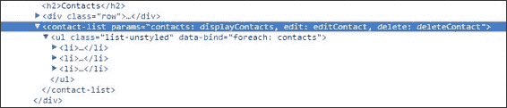
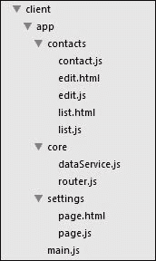

# 第四章. 使用组件和模块进行应用程序开发

好的，现在是时候回到应用程序开发上了。我们之前在 第一章 简单提到了这一点，*Knockout 基础*；我们将在本章继续探讨。本章主要介绍如何在现代网页应用程序中使用 Knockout。在本章中，我们将探讨以下主题：

+   使用 RequireJS 的模块

+   创建可重用组件

+   使用自定义组件加载器扩展 Knockout

+   **单页应用**（SPA）路由

由于 Knockout 是一个库——它在主页上自豪地宣称这一点——它并不涵盖你在完整的网页应用程序中需要的所有内容。这使得 Knockout 能够通过专注于有限的功能集来专业化，但将决定如何构建应用程序其余部分的任务留给了你，即开发者。我们本章中介绍的方法并不是唯一可用的选项——我们没有那么多时间或空间来介绍——但它们应该提供足够的通用指导，帮助你做出自己的决定，同时考虑到 Knockout 的优势。

我们还将把 `联系人列表` 应用程序转换成一个单页应用（SPA）——一个使用 JavaScript 来更改当前视图模板的应用程序，模拟页面变化而不是使用浏览器导航。这种模式已经变得如此流行，以至于大多数开发者在开发新的 JavaScript 网页客户端时都认为这是理所当然的，因此了解 Knockout 如何适应这种开发模式是很重要的。

# RequireJS – AMD 视图模型

RequireJS ([`requirejs.org/`](http://requirejs.org/)) 是一个你应该已经听说过的库，即使没有使用过。这本书仍然是关于 Knockout 的，如果你计划在应用程序中使用 RequireJS，你应该先了解它，但在这里我仍会给你一个简要概述。

## RequireJS 概述

RequireJS 的目的是允许你的代码被分割成声明其依赖关系的模块，以便在运行时注入。这有几个重要的好处。当 RequireJS 加载你的 JavaScript 时，你不需要在 HTML 中使用 `script` 标签包含每个脚本。由于 RequireJS 根据依赖关系加载脚本，你不必担心它们加载的顺序。随着每个模块的依赖关系被注入，模块可以很容易地使用模拟进行测试。此外，RequireJS 还将加载的所有对象保持在全局作用域之外，这除了被视为良好的通用实践外，还减少了命名空间冲突的可能性。

默认情况下，RequireJS 将在运行时按需异步加载所有脚本。在某些情况下，这种延迟加载是有益的，但在生产中，你通常希望将代码打包成一个单独的文件。为此，RequireJS 提供了其优化器 **r.js**。RequireJS 甚至可以通过将多个文件组打包在一起，然后在运行时按需加载这些组来结合这些技术。最好的部分是，无论你处于哪种工作模式，你的代码都不需要改变！

### 注意

我们不会介绍 `r.js`，但如果你在开发 Web 应用程序，调查这一点可能值得（见 [`requirejs.org/docs/optimization.html`](http://requirejs.org/docs/optimization.html)）。

## 异步模块定义

**异步模块定义（AMD**）是 RequireJS 中的一个重要概念：它声明了一个函数，其返回值表示模块。在形式上，它与我们在 第一章，*Knockout 基础* 中看到的 **立即执行函数表达式（IEFE**）并没有太大的不同。这是一个典型的模块定义：

```js
define('moduleName', ['pathto/dependency'], dependency'], function(injectedModule) {
  return //Some module code;
});
```

`define` 方法构成了文件中的第一个也是唯一的顶层语句。RequireJS 实际上通过忽略对 `define` 的多次调用来强制执行每个文件一个模块的限制。`define` 调用接受以下三个参数，前两个是可选的：

+   **模块名称**：此参数通常被忽略，因为引用模块的标准方式是通过它们的路径。因此，我们不会使用此参数。

+   **依赖项**：这是一个模块名称或路径的数组，该模块依赖于它们。路径不需要 `.js` 后缀；RequireJS 已经知道它正在加载 JavaScript。

+   **模块函数**：此函数接收前一个数组中的每个依赖项作为参数，并应返回模块。

当 RequireJS 尝试加载一个模块时，它会通过路径或名称定位该模块，并运行在该文件中找到的 `define` 方法。首先，它会检查所有依赖项是否已加载；如果尚未加载，它会递归地异步并行加载它们。当所有依赖模块加载完成后，它会运行模块函数，并将每个依赖项作为参数传入，其顺序与它们作为依赖项声明的顺序相同。模块加载函数的返回值是传递给任何需要它作为依赖项的模块的参数值。

## 启动 RequireJS

实际上，有几种方法可以使用 RequireJS 启动应用程序，但到目前为止，最常见的方法是使用一个指向应用程序初始脚本的 `script` 标签：

```js
<script type="text/javascript" src="img/require-2.1.js" data-main="/app/main"></script>
```

`data-main` 属性指示哪个脚本将配置 RequireJS 并启动应用程序。请注意，与正常模块路径一样，`.js` 后缀不是必需的。

这个`script`标签通常放在你的 shell（或布局）文件中，它替换了 RequireJS 负责加载的所有`script`标签。在许多情况下，这意味着唯一的 JavaScript `script`标签就是加载 RequireJS 的那个。这是 RequireJS 的一个杀手级特性：在我们开发过程中，我们不再需要在 HTML 代码中添加`script`标签。

注意路径以正斜杠开头，这使得它是一个绝对路径。这是必需的，因为 shell 被用于多个页面，相对路径在像`/contacts/1`这样的 URL 上不会工作，因为它会在`/contacts/app/main.js`中寻找我们的脚本。

## 配置

`main.js`文件（AMD 应用的入口点的传统名称）通常在开始之前包含一个配置部分。以下是我们将要使用的配置：

```js
require.config({
  paths: {
    'knockout': '/lib/knockout-3.2.0',
    'bootstrap': '/lib/bootstrap-3.1.1',
    'jquery': '/lib/jquery-2.1.1.min'
  },
  shim: {
    'bootstrap': {
      deps: ['jquery'],
      exports: '$.fn.popover'
    }
  }
});
```

`paths`部分允许我们将路径映射到模块名称，以便在依赖数组中使用。这对于所有库代码来说是一个好习惯，这样我们的应用程序代码就可以使用简单、一致的名字。再次强调，使用绝对路径是很重要的。

`shim`部分对于加载依赖于全局对象的脚本来说是必要的。在前面的例子中，`bootstrap`的 shim 将 jQuery 声明为一个依赖项，并指示它导出`$.fn.popover`。通常，你会寻找一个新的命名空间，比如`$.bootstrap`，但是因为`bootstrap`没有创建一个单一的端点；我们正在寻找它添加的插件之一。任何导出的值都可以在这里使用；`popover`只是被选中的那个。

许多库开始支持以 AMD 方式加载：它们寻找 RequireJS 或其他模块加载器，并在它们可用时使用它们。尽管并非所有库都这样做，但 JavaScript 库的标准模式一直是只在全球范围内寻找依赖项。因为`bootstrap`需要`jQuery`，但没有向 RequireJS 表明这个依赖项，如果我们尝试正常加载它，它将会失败。shim 告诉 RequireJS 这个库是一个旧的全球作用域风格的脚本，并手动指示其依赖项。`exports`部分提供了一个对象，RequireJS 可以查找以检查脚本是否已加载完成。RequireJS 将等待指定的对象存在，然后才允许任何依赖于`bootstrap`的 AMD 开始。本质上，`shim`部分是 RequireJS 如何使用非 AMD 代码作为异步依赖项的方式。如果你需要使用 jQuery 插件或其他非 AMD 兼容的库，只需为它们创建一个 shim 即可。

RequireJS 配置有许多其他选项——太多以至于无法在这里全部涵盖。如果你想了解更多，请查看他们的文档，可在[`requirejs.org/docs/api.html#config`](http://requirejs.org/docs/api.html#config)找到。

## 启动应用

现在已经配置了 RequireJS，是时候启动应用程序了。包含我们配置的主要脚本也是 RequireJS 寻找初始模块的地方，它看起来像这样：

```js
require.config({
  //config
});

define(['jquery', 'knockout', 'contactsPage', 'bootstrap'], function($, ko, ContactsPageViewmodel) {
    $(document).ready(function() {
      ko.applyBindings(new ContactsPageViewmodel());
    });
});
```

主要模块就像其他模块一样，只不过 RequireJS 会在其依赖项可用时立即运行它。这段代码就是之前在 **联系人** 页面的脚本中使用的启动代码。你可能注意到这个模块的依赖项名称与传入的参数名称不匹配。jQuery 被注入为 `$`，Knockout 为 `ko`，**联系人** 页面构造函数为 `ContactsPageViewModel`。所有这些都是它们对应对象的常规 JavaScript 名称。模块按照依赖项数组的顺序注入；RequireJS 实际上并不查看参数的名称。这与标准函数没有区别；调用者不关心参数的名称，只关心顺序。尽管如此，这对新用户来说并不总是显而易见的。

你可能也注意到了 `bootstrap` 甚至没有参数。这是因为 `bootstrap` 没有自己的对象；它所做的只是向 jQuery 添加函数。然而，RequireJS 不会在它被依赖项要求之前加载它（或在这种情况下模拟它）。以这种方式初始化插件式依赖项是很常见的，因为我们希望它们在应用启动时就能可用。

要查看转换为 AMD 模块后的 `Contacts List` 应用程序，请打开 `cp4-contacts` 分支。代码已经位于 IEFE 块中，所以变化不大。`app` 对象不再需要，因为命名空间已经被依赖注入所取代。除了 RequireJS 之外的所有 `script` 标签都已从 HTML 代码中删除。应用程序仍然以相同的方式运行，但通过使用 RequireJS，我们不再需要担心加载脚本。现在这看起来可能是一个小的收益，但当你应用开始增长时，这将会产生很大的影响。

## 文本插件

管理 HTML 模板可能很棘手，因为没有原生的方式来引用或嵌入外部 HTML 文件，就像脚本那样。如果你熟悉 Knockout 社区，你可能遇到过一些旨在解决此问题的插件，例如 *Knockout-External-Templates*（该插件已停止开发）。RequireJS 通过文本插件干净地解决了这个问题。文本插件的工作方式与标准模块非常相似：你声明对外部文本的依赖，然后 RequireJS 就像正常 JavaScript 模块一样将其注入到模块中。

要开始使用，你应该将文本库添加到你的 RequireJS 配置中。使用如 `text` 这样的名称是标准的：

```js
require.config({
  paths: {
    'text': '/lib/require-text-2.0.12',
    'knockout': '/lib/knockout-3.2.0',
    'bootstrap': '/lib/bootstrap-3.1.1',
    'jquery': '/lib/jquery-2.1.1.min'
  }
});
```

一旦文本插件可用，你就可以在外部文件中使用它，例如：

```js
define(['text!some.html'], function (htmlString) {

});
```

如果文本插件位于你应用的根目录，并且你使用 `text!` 前缀为依赖项，则此配置部分是可选的。由于我们一直在不同的文件夹中放置第三方库，因此配置是必要的。

在下一节中，我们将探讨如何将这种能力与组件结合，以创建具有外部、隔离的 HTML 视图的可重用模板。

# 组件

在 3.2 版本中，Knockout 通过将模板（视图）与视图模型结合使用来添加组件，以创建可重用、行为驱动的 DOM 对象。Knockout 组件受到了 Web 组件的启发，这是一组新的（并且在撰写本文时是实验性的）标准，允许开发者定义与 JavaScript 配对的自定义 HTML 元素，从而创建打包的控件。与 Web 组件类似，Knockout 允许开发者使用自定义 HTML 标签在 DOM 中表示这些组件。Knockout 还允许在标准 HTML 元素上使用绑定处理器来实例化组件。Knockout 通过注入一个 HTML 模板来绑定组件，该模板绑定到其自己的视图模型。

这可能是 Knockout 一直添加到核心库中的单个最大功能。我们之所以从 RequireJS 开始，是因为组件可以可选地通过模块加载器加载和定义，包括它们的 HTML 模板！这意味着我们的整个应用程序（甚至 HTML）都可以定义在独立的模块中，而不是作为一个单一层次结构，并且异步加载。

## 基本组件注册

与通过仅向 Knockout 添加对象来创建的扩展器和绑定处理器不同，组件是通过调用 `ko.components.register` 函数来创建的：

```js
ko.components.register('contact-list, {
  viewModel: function(params) { },
  template: //template string or object
});
```

这将创建一个名为 `contact-list` 的新组件，它使用 `viewModel` 函数返回的对象作为绑定上下文，并将模板作为其视图。建议您使用小写、由连字符分隔的名称来命名组件，以便它们可以轻松地在 HTML 中用作自定义元素。

要使用这个新创建的组件，您可以使用自定义元素或组件绑定。以下所有三个标签产生等效的结果：

```js
<contact-list params="data: contacts"><contact-list>
<div data-bind="component: { name: 'contact-list', params: { data: contacts }"></div>
<!-- ko component: { name: 'contact-list', params: { data: contacts } --><!-- /ko -->
```

显然，自定义元素语法更干净、更容易阅读。需要注意的是，自定义元素不能是自闭合标签。这是 HTML 解析器的限制，并且**不能**由 Knockout 控制。

使用组件绑定的一个优点是组件的名称可以是可观察的。如果组件的名称发生变化，则之前的组件将被销毁（就像控制流绑定将其移除时一样），并且将初始化新的组件。

自定义元素的 `params` 属性的工作方式与 `data-bound` 属性类似。逗号分隔的键/值对被解析以创建一个属性包，并将其提供给组件。值可以包含 JavaScript 字面量、可观察属性或表达式。还可以在不使用视图模型的情况下注册组件，在这种情况下，由 `params` 创建的对象将直接用作绑定上下文。

要查看这一点，我们将将联系人列表转换为组件：

```js
<contact-list params="contacts: displayContacts, 
  edit: editContact, 
  delete: deleteContact">
</contact-list>
```

列表的 HTML 代码被替换为一个带有列表参数以及两个按钮（`edit` 和 `delete`）的回调的自定义元素：

```js
ko.components.register('contact-list', {
  template: 
  '<ul class="list-unstyled" data-bind="foreach: contacts">'
    +'<li>'
      +'<h3>'
        +'<span data-bind="text: displayName"></span> <small data-bind="text: phoneNumber"></small> '
        +'<button class="btn btn-sm btn-default" data-bind="click: $parent.edit">Edit</button> '
        +'<button class="btn btn-sm btn-danger" data-bind="click: $parent.delete">Delete</button>'
      +'</h3>'
    +'</li>'
  +'</ul>'
});
```

此组件注册使用内联模板。您可以在`cp4-inline-component`分支中看到此组件。一切看起来和运行都相同，但生成的 HTML 现在包括我们的自定义元素。



### IE 8 及以上版本的自定义元素

IE 9 及更高版本以及所有其他主要浏览器在自定义元素注册之前在 DOM 中看到自定义元素没有问题。然而，较旧版本的 IE 如果没有注册，将会移除该元素。注册可以通过 Knockout，使用`ko.components.register('component-name')`，或者使用标准的`document.createElement('component-name')`表达式语句来完成。这些中的一个必须放在自定义元素之前，无论是包含它们的脚本在 DOM 中首先出现，还是自定义元素在运行时被添加。

当使用 RequireJS 时，首先在 DOM 中不会有所帮助，因为加载是异步的。如果您需要支持较旧的 IE 版本，建议您在`body`标签顶部或`head`标签中包含一个单独的脚本以注册自定义元素名称：

```js
<!DOCTYPE html>
<html>
  <body>
    <script>
      document.createElement('my-custom-element');
    </script>
    <script src='require.js' data-main='app/startup'></script>

    <my-custom-element></my-custom-element>
  </body>
</html>
```

一旦完成此操作，组件将在 IE 6 及以上版本中正常工作，即使有自定义元素。

## 模板注册

发送到注册的配置的`template`属性可以采用以下任何一种格式：

```js
ko.components.register('component-name', {
  template: [OPTION]
});
```

### 元素 ID

考虑以下代码语句：

```js
template: { element: 'component-template' }
```

如果您在 DOM 中指定元素的 ID，则该元素的内部内容将用作组件的模板。尽管在 IE 中尚不支持，但模板元素是一个很好的候选者，因为浏览器不会在视觉上渲染模板元素的内容。

此方法可以在`cp4-component-id`分支中看到。

### 元素实例

考虑以下代码语句：

```js
template: { element: instance }
```

您可以将实际的 DOM 元素传递给模板以供使用。这在模板是程序性构建的场景中可能很有用。与元素 ID 方法一样，只有元素的内部内容将被用作模板：

```js
var template = document.getElementById('contact-list-template');
ko.components.register('contact-list', {
  template: { element: template }
});
```

此方法可以在`cp4-component-instance`分支中看到。

### DOM 节点数组

考虑以下代码语句：

```js
template: [nodes]
```

如果您将 DOM 节点数组传递给模板配置，则整个数组将用作模板，而不仅仅是子节点：

```js
var template = document.getElementById('contact-list-template')
nodes = Array.prototype.slice.call(template.content.childNodes);
ko.components.register('contact-list', {
  template: nodes
});
```

这可以在`cp4-component-arrray`分支中看到。

### 文档片段

考虑以下代码语句：

```js
template: documentFragmentInstance
```

如果您传递一个文档片段，则整个片段将用作模板，而不仅仅是子节点：

```js
var template = document.getElementById('contact-list-template');
ko.components.register('contact-list', {
  template: template.content
});
```

此示例之所以有效，是因为模板元素将它们的内容包裹在一个文档片段中，以阻止正常的渲染。使用内容是 Knockout 在提供模板元素时内部使用的相同方法。此示例可以在`cp4-component-fragment`分支中看到。

### HTML 字符串

我们在上一节中看到了 HTML 字符串的示例。虽然直接使用值可能不太常见，但如果您的构建系统提供了它，提供字符串将是一件简单的事情。

### 使用 AMD 模块注册模板

考虑以下代码语句：

```js
template: { require: 'module/path' }
```

如果将`require`属性传递给模板的配置对象，默认模块加载器将加载该模块并将其用作模板。该模块可以返回上述任何格式。这对于 RequireJS 文本插件特别有用：

```js
ko.components.register('contact-list', {
  template: { require: 'text!contact-list.html'}
});
```

使用这种方法，我们可以将 HTML 模板提取到其自己的文件中，极大地提高了其组织性。仅此一点，对开发来说就是一个巨大的好处。这可以在`cp4-component-text`分支中看到示例。

## 视图模型注册

就像模板注册一样，视图模型可以使用几种不同的格式进行注册。为了演示这一点，我们将使用我们联系列表组件的简单视图模型：

```js
function ListViewmodel(params) {
  this.contacts = params.contacts;
  this.edit = params.edit;
  this.delete = function(contact) {
    console.log('Mock Deleting Contact', ko.toJS(contact));
  };
};
```

为了验证事情是否正确连接，您将想要一个交互式的东西；因此，我们使用假的`delete`函数。

### 构造函数

考虑以下代码语句：

```js
viewModel: Constructor
```

如果您将函数提供给`viewModel`属性，它将被视为构造函数。当组件实例化时，`new`将在该函数上调用，`params`对象作为其第一个参数：

```js
ko.components.register('contact-list', {
  template: { require: 'text!contact-list.html'},
  viewModel: ListViewmodel //Defined above
});
```

这种方法可以在`cp4-components-constructor`分支中看到。

### 单例对象

考虑以下代码语句：

```js
viewModel: { instance: singleton }
```

如果您希望所有组件实例都由一个共享对象支持——尽管这不被推荐——您可以将其作为配置对象的`instance`属性传递。由于对象是共享的，因此不能使用此方法将参数传递给视图模型。

### 工厂函数

考虑以下代码语句：

```js
viewModel: { createViewModel: function(params, componentInfo) {} }
```

这种方法很有用，因为它将组件的容器元素提供给`componentInfo.element`的第二个参数。它还为您提供了执行任何其他设置的机会，例如修改或扩展构造函数参数。`createViewModel`函数应返回一个视图模型组件的实例：

```js
ko.components.register('contact-list', {
  template: { require: 'text!contact-list.html'},
  viewModel: { createViewModel: function(params, componentInfo) {
    console.log('Initializing component for', componentInfo.element);
    return new ListViewmodel(params);
  }}
});
```

这个示例可以在`cp4-component-factory`分支中看到。

### 使用 AMD 模块注册视图模型

考虑以下代码语句：

```js
viewModel: { require: 'module-path' }
```

就像模板一样，视图模型可以使用返回上述任何格式的 AMD 模块进行注册。

在`cp4-component-module`分支中，您可以看到一个示例。组件注册已移动到`main.js`文件。

## 注册 AMD

除了单独将模板和视图模型注册为 AMD 模块外，您还可以通过 require 调用将整个组件注册：

```js
ko.components.register('contact-list', { require: 'contact-list' });
```

AMD 模块将返回整个组件配置：

```js
define(['knockout', 'text!contact-list.html'], function(ko, templateString) {
  function ListViewmodel(params) {
    this.contacts = params.contacts;
    this.edit = params.edit;
    this.delete = function(contact) {
      console.log('Mock Deleting Contact', ko.toJS(contact));
    };
  }

  return { template: templateString, viewModel: ListViewmodel };
});
```

如 Knockout 文档所指出的，这种方法有几个优点：

+   注册调用只是一个`require`路径，易于管理。

+   组件由两部分组成：一个 JavaScript 模块和一个 HTML 模块。这既提供了简单的组织，又实现了清晰的分离。

+   RequireJS 优化器（`r.js`）可以使用 HTML 模块上的文本依赖来将 HTML 代码与捆绑输出捆绑在一起。这意味着你的整个应用程序，包括 HTML 模板，在生产中可以是一个单独的文件（或者如果你想利用懒加载，可以是一组捆绑包）。

你可以在`cp4-component-amd`分支中看到这个例子。这是组件推荐的模式，也是本章其余示例将使用的一种模式。

## 观察组件参数的变化

组件参数将通过以下三种方式之一通过`params`对象传递到组件的视图模型：

+   不需要发生任何观察表达式评估，值被直接传递：

    ```js
    <component params="name: 'Timothy Moran'"></component>
    <component params="name: nonObservableProperty"></component>
    <component params="name: observableProperty"></component>
    <component params="name: viewModel.observableSubProperty"></component>
    ```

    在所有这些情况下，值都是直接传递到`params`对象上的组件。这意味着这些值的更改将改变实例化视图模型上的属性，除了第一种情况（字面值）。观察值可以被正常订阅。

+   需要评估一个观察表达式，因此它被包装在一个计算观察值中：

    ```js
    <component params="name: name() + '!'"></component>
    ```

    在这种情况下，`params.name`不是原始属性。调用`params.name()`将评估计算包装器。尝试修改值将会失败，因为计算值是不可写的。值可以被正常订阅。

+   一个观察表达式评估一个观察实例，因此它被包装在一个展开表达式结果的观察值中：

    ```js
    <component params="name: isFormal() ? firstName : lastName"></component>
    ```

    在这个例子中，`firstName`和`lastName`都是观察属性。如果你调用`params.name()`返回的是观察值，你需要调用`params.name()()`来获取实际值，这看起来相当丑陋。相反，Knockout 会自动展开表达式，使得调用`params.name()`返回`firstNam`e 或`lastName`的实际值。

如果你需要访问实际的观察实例，例如写入它们的值，尝试写入`params.name`将会失败，因为它是一个计算观察值。为了获取未包装的值，你可以使用`params.$raw`对象，它提供了未包装的值。在这种情况下，你可以通过调用`params.$raw.name('New')`来更新名称。

通常情况下，应该通过从绑定表达式中移除逻辑并将其放置在视图模型中的计算观察值中来避免这种情况。

## 组件的生命周期

当应用组件绑定时，Knockout 会执行以下步骤。

1.  组件加载器异步创建视图模型工厂和模板。这个结果被缓存，所以每个组件只执行一次。

1.  模板被克隆并注入到容器中（无论是自定义元素还是具有组件绑定的元素）。

1.  如果组件有一个视图模型，它将被实例化。这是同步完成的。

1.  组件绑定到 viewmodel 或 `params` 对象。

1.  组件保持 *活动* 状态，直到它被销毁。

1.  组件被销毁。如果 viewmodel 有一个 `dispose` 方法，它将被调用，然后模板将从 DOM 中移除。

## 组件的销毁

如果组件因组件绑定名称或控制流绑定（例如，`if` 和 `foreach`）更改而被 Knockout 从 DOM 中移除，组件将被销毁。如果组件的 viewmodel 有一个 `dispose` 函数，它将被调用。组件视图中的正常 Knockout 绑定将被自动销毁，就像在正常控制流情况下一样。然而，由 viewmodel 设置的任何内容都需要手动清理。以下是一些 viewmodel 清理的示例：

+   可以使用 `clearInterval` 来移除 `setInterval` 回调。

+   可以通过调用它们的 `dispose` 方法来移除计算可观察对象。纯计算可观察对象不需要销毁。仅由绑定或其他 viewmodel 属性使用的计算可观察对象也不需要销毁，因为垃圾回收会捕获它们。

+   可以通过调用它们的 `dispose` 方法来销毁可观察订阅。

+   事件处理器可以由不属于正常 Knockout 绑定的组件创建。

你可以在 `cp4-dispose` 分支中看到一个简单的销毁处理器。它只是将日志记录到控制台以演示它何时会触发；尝试编辑一个联系人以使控制流从页面上删除列表。

## 将组件与数据绑定结合使用

在使用组件绑定的自定义元素上使用的 `data-bind` 属性只有一个限制：绑定处理器不能使用 `controlsDescendantBindings`。这不是一个新的限制；控制后代的两个绑定不能在单个元素上，因为组件控制后代绑定，不能与也控制后代的绑定处理器结合。尽管如此，这仍然值得记住，因为你可能会倾向于在组件上放置一个 `if` 或 `foreach` 绑定；这样做将导致错误。相反，用元素或无容器绑定包裹组件：

```js
<ul data-bind='foreach: allProducts'>
  <product-details params='product: $data'></product-details>
</ul>
```

还值得注意的是，如 `text` 和 `html` 这样的绑定将替换它们所在元素的内容。当与组件一起使用时，这可能会导致组件丢失，因此这不是一个好主意。

**自定义组件加载器**

到目前为止，我们已经介绍了默认组件加载器的行为。它非常灵活，对于许多开发者来说，它将足够满足大多数用例。然而，可以实现自定义组件加载功能。实际上，你可以同时激活多个组件加载器，每个加载器提供不同的功能。

本节将处理创建自定义组件加载器。如果你对默认加载器的功能感到满意，你可能想跳过这一节，继续到单页应用程序路由。

首先，让我们了解一下组件加载系统是如何工作的。组件加载只对每个组件执行一次。Knockout 缓存已加载的组件。此缓存提供了以下两个公共函数：

+   `ko.components.get(name, callback)`: 此函数遍历所有加载器，直到其中一个返回一个组件。此组件被缓存，然后使用它调用回调。

+   `ko.components.clearCachedDefinition(name)`: 此函数从注册表中删除组件。

Knockout 在 `ko.components.loaders` 上维护一个加载器数组。默认情况下，此数组只包含一个加载器，它也位于 `ko.components.defaultLoader` 上。当组件绑定请求组件或你调用 `ko.components.get` 时，Knockout 会遍历加载器，对每个组件调用 `getConfig`，直到它得到一个非空对象。然后将此配置传递给每个加载器，直到返回一个有效的组件对象。加载的组件随后被缓存。一个有效的组件对象具有以下属性：

+   `template`: 这是一个 DOM 节点数组

+   `createViewModel(params, componentInfo)`: 这是一个可选的工厂方法，用于构建组件

## 实现组件加载器

所有方法在组件加载器上都是可选的，因为 Knockout 会遍历每个加载器上的每个方法，直到它得到一个有效响应，然后再在下一个方法上重复执行。所有组件加载器函数都是通过提供回调来异步执行的。记住，结果将被缓存，除非手动使用 `ko.components.clearCachedDefinition(componentName)` 清除。以下是用以实现组件加载器的常用方法：

+   `getConfig(name, callback)`: 这返回一个组件配置对象。配置对象是任何加载器的 `loadComponent` 函数可以理解的内容。

+   `loadComponent(name, componentConfig, callback)`: 这提供了类型为 `{ template: domNodeArray, createViewModel(params, componentInfo) }` 的组件对象。

+   `loadTemplate(name, templateConfig, callback)`: 这提供了用作模板的 DOM 节点数组。

+   `loadViewModel(name, viewModelConfig, callback)`: 这提供了用作 `createViewModel(params, componentInfo)` 工厂函数的功能。

要实现一个方法，只需将其包含在你的加载器中。若要使你的加载器跳过它已实现的方法，请调用 `callback(null)`。

最后两个方法不是由 Knockout 组件系统直接调用，而是由默认加载器的 `loadComponent` 方法调用。

## 默认加载器

要了解如何使自定义加载器上的方法成为可选的，你必须了解默认加载器的工作方式。默认加载器有一个内部注册表用于组件配置——不要与组件缓存混淆。默认加载器将以下方法添加到`ko.components`对象中，以便与组件配置注册表一起工作：

+   `ko.components.register(name, configuration)`: 这在前一节中已详细说明

+   `ko.components.isRegistered(name)`: 如果组件配置在注册表中，则返回`true`；否则，返回`false`

+   `ko.unregister(name)`: 如果存在，则移除命名配置

当 Knockout 首次尝试加载一个组件时，它会遍历`ko.components.loaders`中的每个加载器，并对每个加载器调用`getConfig`，直到其中一个返回非空对象。然后，它将配置对象传递给每个加载器的`loadComponent`，直到其中一个返回非空组件对象。如果除了默认加载器之外的加载器从`loadComponent`返回组件，则链在此处结束。

然而，默认加载器的`loadComponent`方法会在每个加载器（包括自身）上调用`loadTemplate`和`loadViewModel`，直到它获得模板和 viewmodel。这些调用是独立的；默认加载器将取它得到的第一个模板和第一个 viewmodel，即使它们来自不同的加载器。如果你的自定义加载器比默认加载器具有更高的优先级，或者默认加载器无法理解你的配置，你的自定义加载器将有机会通过实现`loadTemplate`或`loadViewModel`来提供自己的模板和/或 viewmodel。

## 注册自定义加载器

与`ko.bindingHandlers`和`ko.extenders`都是对象不同，`ko.components.loaders`是一个数组。一旦你创建了自定义加载器，你可以将其添加到`loaders`数组中。`loaders`数组的顺序决定了优先级；Knockout 总是从第一个到最后一个遍历加载器：

+   对于具有较低优先级的自定义加载器，使用`ko.components.loaders.push(loader)`

+   对于具有更高优先级的自定义加载器，使用`ko.components.loaders.unshift(loader)`

+   对于细粒度控制的自定义加载器，使用`ko.components.loaders.splice(priority, 0, loader)`，其中 priority 是新加载器的 0 索引排名

如果你从`ko.component.loaders`中移除默认加载器，那么`loadTemplate`和`loadViewModel`将不再被调用（除非它们被另一个自定义加载器调用）。由于可以简单地添加一个具有更高优先级的自定义加载器，因此移除默认加载器的价值很小。

## 注册自定义元素

自定义元素通过包装组件绑定在 Knockout 中工作。有两种选项可以用来让 Knockout 将自定义元素视为组件：

+   调用`ko.components.register('component-name', { /* config */ })`.

+   覆盖`ko.components.getComponentNameForNode(node)`，使其返回组件的名称。只要存在可以加载此方法返回的名称的加载器，组件就不需要注册。默认加载器只会加载使用`ko.components.register`注册的组件。

## 使用自定义配置加载组件

好的，现在是时候看看一个例子了。这个例子是从 Knockout 组件的文档中取出的。假设您正在使用我们自己的异步加载库来加载 HTML，并且希望您的自定义加载器使用它。这可能是对 JavaScript 加载器的例子，文档中提供了这个例子，但在这里它足够相似，以至于可以省略。它将使用自己的配置属性名称，以避免与默认加载器混淆：

```js
ko.components.register('contact-list', {
  template: { fromUrl: 'contact-list.html', maxCacheAge: 100 },
  viewModel: { require: 'contact-list'  }
});
```

由于默认加载器将此配置传递给每个加载器的`loadTemplate`方法，我们只需实现该方法即可：

```js
var templateFromUrlLoader = {
  loadTemplate: function(name, templateConfig, callback) {
    if (templateConfig.fromUrl) {
      // Uses jQuery's ajax facility to load the markup from a file
      var fullUrl = '/app/' + templateConfig.fromUrl + '?cacheAge=' + templateConfig.maxCacheAge;
      $.get(fullUrl, function(markupString) {
        callback($.parseHTML(markupString));
      });
    } else {
      // Unrecognized config format. Let another loader handle it.
      callback(null);
   }
  }
};
```

如果此加载器具有`fromUrl`属性，它将使用 jQuery 检索和解析模板；否则，它将不执行任何操作。剩下要做的就是将加载器添加到 Knockout 中：

```js
ko.components.loaders.unshift(templateFromUrlLoader);
```

您可以在`cp4-loader`分支中看到这个自定义加载器；它在`main.js`文件中。

Knockout 的默认组件加载器已经足够灵活，但能够提供自己的自定义加载器，用于配置和实例化，使 Knockout 组件系统能够与您想要创建的任何格式一起工作。

# 单页应用程序（SPA）路由

Knockout（或任何 MV*框架）的吸引力很大一部分在于其模板引擎允许我们在不与服务器通信的情况下重新渲染页面的一部分。能够在客户端进行增量页面更新意味着更低的延迟，使应用程序感觉更加敏捷。SPA 通过让 JavaScript 客户端控制页面间的导航，将这一概念提升到了新的水平。当浏览器导航时，它必须重新渲染整个页面，这意味着重新加载 JavaScript、HTML、CSS 以及一切。当 JavaScript**导航**时，它只需要更改 HTML 的一部分，这在大多数情况下会更快。

Knockout 可以相对容易地提供这种虚拟页面更改功能，但 SPA 的一个重要组成部分是页面更改仍然更新 URL。这有助于用户检查是否发生了更改，但更重要的是，这意味着如果用户刷新页面或分享链接，应用程序将转到正确的页面。如果没有 URL 更新，用户将始终停留在主页。这个功能通常被称为**路由**。Knockout 不提供此机制。

为了探索 Knockout 如何适应 SPA 场景，我们将使用 SammyJS ([`sammyjs.org/`](http://sammyjs.org/))。SammyJS 是一个流行的用于路由的库；Knockout 甚至在其教程网站上使用了它。当然，还有许多其他选项，但无论您使用哪个库，概念都应该非常相似。

## SammyJS 概述

SammyJS 的默认路由使用哈希更改导航，它使用 URL 哈希来存储当前状态。由于浏览器不会将哈希发送到服务器，服务器始终将 URL 视为对主页的请求。一旦页面加载，Sammy 将检查哈希并定位到匹配的路由（如果存在）。如果找到路由，它将运行该路由的回调。回调负责执行导航所需的任何应用程序逻辑。以下代码演示了这一点：

```js
var app = Sammy('#appHost', function() {
  //Home route
   this.get('#/', function() {
    //Load home page
  });
  this.get('#/contacts/:id', function() {
    var contactId = this.params.id;
    //Load contact
  });
}).run('#/');
```

这是一个典型的 Sammy 应用程序配置。`Sammy` 对象是一个函数，它接受一个元素的 ID，它将作用域处理程序，并返回应用程序对象。在初始化处理程序内部，它为每个 HTTP 动词提供了注册路由的方法。前面的示例注册了 `#/`（一个标准的 *主页* 路由）和 `#/contacts/:id` 路由。路由中的 `:id` 部分表示一个将匹配任何内容并提供路由回调中 `params` 对象内值的参数。

从 `Sammy()` 返回的应用程序对象将在调用 `run()` 之前不会启动，`run()` 方法应该等待 DOM 准备就绪。`run()` 方法接受一个默认路由，如果没有哈希（例如，当导航到裸域名 URL 时），将加载该路由。

## 控制导航

SammyJS 监控 `window.location.hash` 属性的任何变化，并运行匹配的路由处理程序。这可能在用户点击带有包含哈希的 `href` 属性的 a 标签时发生，或者通过 JavaScript 设置 `window.location.hash`。在视图中使用 window 对象通常是不推荐的，因为它在单元测试中很难模拟。如果以后需要更改，也最好将导航逻辑集中化。为此，我们将导航封装到一个路由模块中。目前，它只需要一个方法：

```js
define(function() {
  return {
    navigate: function(path) {
      window.location.hash = '#' + path;
    }
  };
});
```

一旦注入了 RequireJS，可以通过调用 `router.navigate` 来导航视图模型。

## 创建页面组件

在单页应用（SPA）和通用网页应用中组织 Knockout 视图模型有许多不同的方法。正如我们刚刚学习了如何创建组件，我们将探讨一种将每个页面结构化为组件的方法。这给我们带来了一些明显的优势：

+   页面将相互解耦

+   每个页面都将有自己的 HTML 和 JavaScript 文件，这感觉是自然的

+   在外壳上绑定单个组件可以保持页面的 *主体*，同时为导航栏保持静态布局

在某个时候，我们需要引入一个文件夹结构来组织这些文件，所以我们不妨现在就开始。



主页（它只是一个问候）已经被移除，但占位符设置页面仍然存在，这样我们至少有两个链接来测试导航。路由器和模拟数据服务已经被移动到`core`文件夹（我更喜欢这个名字，因为它比`common`更短）。其余的代码，包括联系模型和两个页面，已经被移动到`contacts`文件夹。`main.js`起始文件没有移动。

你当然可以以任何你想要的方式分组文件；到目前为止我们所涵盖的内容都不会要求任何特定的文件结构。

### 编辑页面

之前，两个页面都是由一个视图模型管理的，该视图模型通过使用一个空的*编辑*联系人在这两个页面之间切换。然而，很明显，这个组合视图模型承担了多个角色。将编辑代码拆分应该会减少一些混淆：

```js
define(['knockout', 'text!contacts/edit.html', 'core/dataService', 'core/router', 'contacts/contact'], 
function(ko, templateString, dataService, router, Contact) {

  function ContactEditViewmodel(params) {
    self.entryContact = ko.observable(new Contact());
    if (params && params.id) {
      dataService.getContact(params.id, function(contact) {
        if (contact)
        self.entryContact(contact);
      });
    }

    self.cancelEntry = function() {
      router.navigate('/');
    };
    self.saveEntry = function() {

      var action = self.entryContact().id() === 0 
      ? dataService.createContact 
      : dataService.updateContact;

      action(self.entryContact(), function() {
        router.navigate('/');
      });
    };
    self.dispose = function() {
      self.entryContact(null);
    };
  }

  return { 
    template: templateString, 
    viewModel: ContactEditViewmodel 
  };
});
```

这里只有三个真正的变化：

+   首先，而不是清除`entryContact`对象来表示编辑已完成，视图模型调用`router.navigate('/')`。由于我们不再有主页，列表页面将用作默认页面，它将绑定到`/`路由。

+   其次，由于编辑将基于导航而不是直接设置`entryContact`对象，视图模型使用`params`组件来查找 ID。如果没有 ID，则假定我们正在创建一个新的联系人；如果存在 ID，则从数据服务中加载联系人。

+   最后，添加了一个`dispose`方法，它将清除`entryContact`对象。这实际上并不是必要的，但它展示了清理将如何进行。

HTML 代码实际上并没有真正改变，只是现在它将位于自己的文件中。

### 列表页面

列表页面将成为新的主页。像编辑页面一样，它需要使用路由器导航到编辑页面，而不是使用`entryContact`对象。列表页面不需要任何参数：

```js
define(['knockout', 'text!contacts/list.html', 'core/dataService', 'core/router'], 
function(ko, templateString, dataService, router) {

  function ContactsListViewmodel() {
    var self = this;

    self.contacts = ko.observableArray();

    dataService.getContacts(function(contacts) {
      self.contacts(contacts);
    });
    self.newEntry = function() { router.navigate('/contacts/new'); };
    self.editContact = function(contact) { router.navigate('/contacts/' + contact.id()); };

    self.deleteContact = function(contact) {
      dataService.removeContact(contact.id(), function() {
        self.contacts.remove(contact);
       });
    };

    self.query = ko.observable('');
    self.clearQuery = function() { self.query(''); };

    self.displayContacts = ko.computed(function() {
      //Same as before
    });

    self.dispose = function() {
      self.contacts.removeAll();
    };
  }

  return { 
    template: templateString, 
    viewModel: ContactsListViewmodel 
  };
});
```

在这里，HTML 代码也没有发生太多变化，只是`contact-list`组件已经被移除，因此它的视图被重新添加到列表页面。

## 协调页面

到目前为止，示例服务器负责通过执行字符串替换将每个页面放入我们的 shell/layout HTML 中。为了获得真实 SPA 的体验，我们将更改服务器以返回一个索引文件，而不会对其进行任何解析或渲染：

```js
<!DOCTYPE html>
<html>
  <head>
    //Same as before
  </head>
  <body>
    <!-- Navbar -->
    <nav class="navbar navbar-default" role="navigation">
      //Same as before
    </nav>

    <!-- Main Application Body -->
    <div id="appHost" class="container" data-bind="if: name">
      <!-- ko component: { name: name, params: data } --><!-- /ko -->
    </div>
    <script type="text/javascript" src="img/require-2.1.js" data-main="/app/main"></script>
  </body>
</html>
```

上一段代码中的`appHost`元素包含一个无容器组件绑定，该绑定使用一个可观察的`name`和`params`值。它被一个`if`绑定包裹，确保组件绑定在页面被选中之前不活跃。根视图模型只需要提供`name`和`params`属性。

因此，我们的 `main.js` 将包含一个简单的视图模型，其中包含每个属性。当路由被激活时，SammyJS 路由处理程序将设置此视图模型。`main.js` 文件还将负责将页面组件注册到 Knockout。它很长，所以我们将其分成几个部分：

```js
define(['jquery', 'knockout', 'sammy', 'bootstrap'], function($, ko, Sammy) {
  var pageVm = {
    name: ko.observable(),
    data: ko.observable(),
    setRoute: function(name, data) {
      //Set data first, otherwise component will get old data
      this.data(data);
      this.name(name);
    }
  };

  //Sammy Setup
  Var sammyConfig = /* see below */

  $(document).ready(function() {
    sammyConfig.run('#/');
    ko.applyBindings(pageVm);
  });
});
```

SammyJS 已被添加为依赖项并注入。RequireJS 的配置没有显示，但它不需要一个垫片。SammyJS 作为 AMD 运行得很好。`pageVm` 对象通过两个可观察属性和一个用于设置它们的辅助方法创建。顺序很重要，因为组件视图模型是同步实例化的，并且当组件名称更改时，绑定到 `params` 对象的数据需要已经就绪；否则，组件将在 `params` 对象设置之前初始化。

在 SammyJS 设置完成后，文档就绪处理程序使用默认路由启动它，然后使用 `pageVm` 对象应用绑定。

一种执行 SammyJS 配置的方法是写出每个组件注册和路由处理程序，如下所示：

```js
ko.components.register('contact-edit', { require: 'contacts/edit' });
self.get('#/contacts/:id', function() {
  pageVm.setRoute('contact-edit', { id: this.params.id });
});
```

个人而言，我认为这最终会变得有点混乱。它还在 `register` 和 `setRoute` 中重复了组件名称。SammyJS 还不允许你在单个调用中将多个路由绑定到同一个处理程序；你必须将它们都写出来。这对于主页来说尤其令人烦恼，因为 SammyJS 将空路由和 `#/` 路由视为不同的路由，尽管它们都传统上意味着 *主页*。为了解决这些问题，我们可以将组件和路由定义组合成一个页面对象，然后遍历它们：

```js
var sammyConfig = Sammy('#appHost', function() {
  var self = this;
  var pages = [
    { route: ['/', '#/'], component: 'contact-list', 	module: 'contacts/list'}, { route: ['#/contacts/new', '#/contacts/:id'], component: 'contact-edit', 	module: 'contacts/edit' }, { route: '#/settings', component: 'settings-page', module: 'settings/page' }
  ];

  pages.forEach(function(page) {
    //Register the component, only needs to happen
    ko.components.register(page.component, { require: page.module });

    //Force routes to be an array
    if (!(page.route instanceof Array))
    page.route = [page.route];

    //Register routes with Sammy
    page.route.forEach(function(route) {
      self.get(route, function() {

        //Collect the parameters, if present
        var params = {};
        ko.utils.objectForEach(this.params, function(name, value) {
          params[name] = value;
        });

        //Set the page
        pageVm.setRoute(page.component, params);
      });
    });
  });
});
```

更好了。现在，很容易看出路由和组件之间的关系，并且为单个组件定义多个路由很简单。它还消除了重复的组件名称。

`instanceof` 检查使我们能够通过始终将其作为数组来使用 `page.route` 属性。`params` 部分将包括由路由处理程序捕获的任何参数，并将它们作为组件绑定用于 `params` 对象的数据传递。

我们刚刚讨论的所有代码都可以在 `cp4-spa` 分支中看到。确保使用应用中的每个页面，并注意 URL 的变化。如果你访问一个页面，例如特定的联系人页面，并刷新浏览器，SammyJS 将确保加载正确的页面而不是总是跳转到主页。这给应用程序带来了非常自然的感觉。你也应该注意到，在页面之间切换几乎没有延迟（取决于你的 CPU）。为了比较，尝试在 `cp4-contacts` 分支中查看 `/contacts` 和 `/settings` 页面之间的变化。SPA 导航要快得多。

# 摘要

到现在为止，你应该对如何构建 Knockout 网络应用程序有一个或两个好的想法，特别是关于如何构建单页应用程序。Knockout 组件功能为你提供了一个强大的工具，帮助你创建可重用、行为驱动的 DOM 元素，编写自定义加载器允许你完全控制组件的使用方式。RequireJS AMD 模式通过将 JavaScript 和 HTML 分割成独立的模块，使得应用程序的组织变得简单。因为这些模块使用依赖注入，因此创建单元测试的模拟也是可能的。最后，你看到了 SammyJS 如何通过组件控制页面来创建快速的客户端 JavaScript 导航。

在下一章中，我们将探讨 Durandal 框架，这将使单页应用程序的开发变得更加简单。
