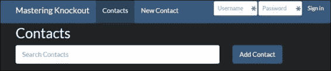

# 第六章：高级 Durandal

在上一章中，我们介绍了 Durandal 框架的大部分基本用法。到现在，你应该已经能够舒适地使用它来启动应用程序。在本章中，我们将继续探讨 Durandal，通过介绍一些更高级的框架特性以及查看一些有用的模式，这些模式将帮助我们解决在 SPA 开发中遇到的常见挑战。

+   使用事件进行发布和订阅

+   应用程序登录场景

+   高级组合

+   嵌套路由

+   自定义模态对话框

+   绑定到纯 JavaScript 对象

# 发布和订阅

新开发者开始使用 Knockout 时面临的一个非常常见的问题是，如何在没有与主视图模型或视图模型对象之间的单一层次结构或任何其他形式的直接引用的情况下在视图模型之间进行通信。这类硬依赖通常被认为是不良做法，但需要在不同的视图模型之间发送消息的需求是不可避免的。

发布-订阅（pub/sub）模式是解决此问题的流行解决方案。Durandal 通过 `Events` 模块为你提供了一个简单的 pub/sub 实现。你可以通过两种方式使用事件系统：通过默认包含在 `durandal/app` 对象上的事件，或者通过将事件添加到自己的对象上。

## 事件模块

事件系统包括 `events` 模块和 `subscription` 类。`events` 模块，由 `durandal/events` 需要，为你提供了 `includeIn` 方法来向对象添加事件。当调用 `Events.includeIn(obj)` 时，以下函数将被添加到 `obj` 中：

+   `on`: 这用于在对象上订阅事件

+   `off`: 这用于取消订阅事件

+   `trigger`: 这用于引发事件

+   `proxy`: 这将返回一个可以调用来引发事件的函数

### 订阅事件

`on` 方法可以用两种不同的方式使用。要提供一个回调和一个可选的上下文（回调的 `this` 值），将它们作为参数传递。从 `on`，`obj` 将被返回，以便可以添加链式订阅：

```js
obj.on('contact:added', self.contacts.push, self.contacts)
.on('contact:deleted', self.contacts.remove, self.contacts);
```

要获取订阅对象，只需将事件名称提供给 `on`。`on` 返回的内容将是一个订阅对象，它提供了一个 `then` 和一个 `off` 方法。`then` 方法可以用来附加一个回调：

```js
obj.on('contact:added').then(function(newContact) {
  self.contacts.push(newContact);
});
```

`then` 方法也返回订阅，允许你存储订阅引用。

你可以使用以空格分隔的事件名称参数的名称列表同时订阅多个事件。你也可以使用 `all` 事件名称来订阅对象上的所有事件。

#### 从事件中取消订阅

移除回调的方式与添加回调的方式类似，这取决于你是否使用 `on` 添加了回调，或者是在订阅上使用 `then`。

如果你使用`on`进行了订阅，你可以通过调用带有相同事件名称和回调的`off`来取消订阅。要移除该事件名称（或名称）的所有回调，不要向第二个参数提供回调。要移除具有特定上下文的所有回调，请向第三个参数提供上下文：

```js
//Remove a specific callback on an event
obj.off('contact:added', self.contacts.push);

//Remove all callbacks for a context (will remove both added and deleted from above example)
obj.off(undefined, undefined, self.contacts);

//Remove all callbacks
obj.off();
```

如果你使用了订阅对象，只需在订阅上调用`off`：

```js
var subscription = obj.on('contact:added').then(self.contacts.push);
//unsubscribe
sSubscription.off();
```

### 触发事件

在对象上触发事件类似于订阅它们。您可以使用单个事件名称、多个用空格分隔的事件名称，或者使用特殊的`all`事件名称来触发所有事件。

当事件被触发时，它们可以向订阅事件的回调传递参数。尽管触发的事件可以使用任何数量的参数，但当它们始终使用单个参数时，与回调一起工作会更容易：

```js
obj.trigger('contact:added', newContact);
obj.trigger('contact:added contact:approved', newApprovedContact);
obj.trigger('all', superImportantEventData);
```

### 代理事件

事件代理是一种方法，它将引发预选事件（或事件列表），并将其参数作为事件参数传递。以下两个方法是等价的：

```js
obj.trigger('contact:added', newContact);
//
var contactAdded = obj.proxy('contact:added');
contactAdded(newContact);
```

代理的优点是它们是可重用的，并且可以被存储或传递。这样做可以与其他系统共享代理，或者只是在几个地方有一个单独的事件引发函数。将一个函数表示为具有固定参数的另一个函数的这种做法被称为**柯里化**。

代理的事件名称可以是`trigger`可以使用的任何字符串，包括`all`。

## 应用程序事件

由于`app`对象是一个单例，它自带事件，因此这些事件对于应用范围内的消息传递非常有用。独立顶级组件之间的通信，例如页面视图模型，是应用范围内消息传递的良好候选者。

假设我们希望在添加新联系人时引发一个事件，以减少服务器的负载，这样列表页就可以获取新联系人而无需去服务器刷新整个列表。为了在`activate`方法中停止加载列表，它将被转换为一个单例，该单例重用相同的加载承诺：

```js
function ContactListVM() {
  // ...
  var singleActivate = dataService.getContacts()
  .then(function(contacts) {
    self.contacts(contacts);
  });

  self.activate = function() {
    return singleActivate;
  };
  //...
};

return new ContactListVM();
```

由于返回给`activate`的承诺只运行一次，因此当页面多次导航时，列表不会重新加载。

列表页的视图模型现在需要创建一个事件订阅来接收新的联系人。Durandal 为事件名称的约定是指定源和事件类型，由冒号分隔。此约定是推荐的，但不是必需的；Durandal 不会将冒号视为事件名称的分隔符。例如，以下是在导航期间路由器引发的两个事件：

```js
router:navigation:complete
router:navigation:cancelled
```

要订阅新联系人的事件，列表页可以使用以下订阅：

```js
app.on('contact:added').then(function(newContact) {
  self.contacts.push(newContact);
});
```

然而，由于唯一采取的操作是将`newContact`参数发送到`contacts.push`，因此将其作为带有上下文的回调来写会更简洁：

```js
app.on('contact:added', self.contacts.push, self.contacts);
```

这两种方法等价。需要注意的是，定义上下文的第三个参数是必要的；否则，`push` 函数将被调用，并且在没有处于联系人数组上下文的情况下失败。

新/编辑页面现在可以在创建联系人后使用 `contact:added` 事件发布此事件：

```js
self.saveEntry = function() {
  if (self.contact().id() === 0) {
    dataService.createContact(self.contact())
    .then(function(contact) {
      app.trigger('contact:added', contact);
    });
  } else {
    //Edit
  }
};
```

这将发送 `createContact` 承诺返回的联系人作为触发事件的参数。然而，由于这是将参数发送到另一个单函数的另一个案例，它可以使用代理来编写：

```js
var contactAdded = app.proxy('contact:added');
self.saveEntry = function() {
  if (self.contact().id() === 0) {
  dataService.createContact(self.contact())
    .then(contactAdded)
  } else {
    //edit
  }
};
```

你可以在 `cp6-pubsub` 分支中看到一个示例。

## 模块作用域的事件

除了应用范围内的 pub/sub，Durandal 还提供了一种简单的方法将事件方法添加到任何对象中，允许事件具有作用域。调用 `Events.includeIn(obj)` 将创建与 `app` 对象默认具有相同的事件处理方法：`on`、`off`、`trigger` 和 `proxy`。

数据服务是处理与联系人添加（或修改）相关事件的理想选择，因为只有已经具有对其引用的模块才会对这些事件感兴趣。将 `contact:added` 事件从新/编辑页面移至数据服务也确保了如果另一个模块尝试添加联系人，事件仍然会触发：

```js
var dataService = {};
Events.includeIn(dataService);
//other methods omitted
dataService.createContact = function(contact) {
  contact.id(UUID.generate());
  contacts[contact.id()] = ko.toJS(contact);
  saveAllContacts();
  return getTimeoutPromise(contact).then(function() {
    dataService.trigger('contact:added', contact);
    return contact;
  });
};
```

这将为 `dataService` 对象添加事件方法，并在 `createContact` 方法的返回承诺中引发 `contact:added` 事件。

列表页面视图模型的变化只是引用 `dataService` 对象而不是 `app` 进行事件订阅：

```js
dataService.on('contact:added', self.contacts.push, self.contacts);
```

需要做的就这些。现在 `dataService` 对象正在充当联系人事件的作用域。你可以在 `cp6-event` 分支中看到这个示例。

# 处理登录

由于各种原因，处理登录可能很棘手，而且有数百种不同的技术。Web 应用程序登录通常分为两类：要么你的网站可以自由浏览而不需要登录（随时登录），要么它使用并要求用户首先登录（需要登录）。每个类别所面临的挑战不同，因此最佳解决方案也不同。

## 需要登录

直到最近，几乎所有需要登录的网站都使用某种重定向模式向用户展示登录页面，这通常是一种不愉快的体验。除了页面加载时间的问题之外，返回原始请求的 URL 通常意味着包含原始 URL 的查询字符串参数。如果原始 URL 本身就有查询字符串，它们要么丢失，要么附加到 URL 查询值上。

单页应用（SPAs）可以通过在当前 URL 上显示登录页面来绕过重定向问题；没有重定向意味着整个过程更快，没有查询字符串的麻烦，用户也不会因为 URL 变化而感到不适。然而，他们面临一个不同的挑战：如何处理外壳？你可以将登录表单放在外壳旁边，并通过绑定在它们之间切换，但这会使外壳充满登录标记。你可以使用模态对话框来显示登录表单，这样外壳就不会受到影响，但外壳要么是空的，要么显示应该通过登录才能访问的信息。

Durandal 的`setRoot`方法真正简化了这个问题。如果用户需要登录，将登录表单设置为根意味着外壳甚至不会被加载。登录完成后，外壳可以设置为根；外壳的标记保持不变，用户永远不会看到他们不应该看到的内容：

1.  首先，我们的应用程序在`main.js`中的启动将使用`setRoot`跳转到登录或外壳，这取决于用户是否已经登录（比如，来自 cookie）：

    ```js
    define(['durandal/system', 'durandal/app', 'common/extensions', 'services/mock'],
    function(system, app, extensions, dataService) {

      ///Same as before

      app.title = 'Mastering Knockout';
      app.start().then(function () {
        app.setRoot(dataService.isLoggedIn() ? 'shell/shell' : 'login/page');
      });
    });
    ```

1.  这依赖于`dataService`对象，执行同步检查以查看`isLoggedIn`是否为`true`，但它可以轻松支持一个异步的，只需将其钩入`app.start`承诺：

    ```js
    app.start()
    .then(dataService.isLoggedIn)
    .then(function (isLoggedIn) {
      app.setRoot(isLoggedIn ? 'shell/shell' : 'login/page');
    });
    ```

一旦登录过程完成，登录视图模型只需调用`setRoot`来设置外壳。就是这样！实际上，登录视图模型中唯一的其他属性是`username`、`password`和失败的登录标志。登录完成后，外壳将像之前一样启动，激活路由器，并组合正确的页面。在登录发生时，无需担心管理空状态，因为外壳直到`setRoot`被调用之前都不会被加载。

你可以在`cp6-login`分支中看到这个示例。登录模块包含一个标准的视图模型和视图。要登录，可以使用任何登录详情，其中用户名和密码相同。显然，在实际应用中，你希望创建一个服务器请求。

需要注意的一个重要问题是注销功能。在示例中，它位于外壳中，但在实际应用中，它应该重构为外部服务——可能是同一个服务，该服务包含用于获取和设置登录 cookie 的方法，以便集中管理登录行为。在单页应用（SPAs）中，由于没有发生导航，清理登录用户在应用状态中的所有数据可能是一个挑战，尤其是当你有单例时。尝试创建一个删除所有这些数据的方法容易出错；很容易遗漏重要数据，并且随着应用的扩展，需要不断维护。相反，简单地重新加载浏览器会更安全。导航，即使是刷新，也会完全重置 JavaScript 状态，确保之前登录用户的所有内容都不会留在内存中。`location.reload`方法是一个简单的方法来实现这一点，但如果用户在包含敏感 URL 的页面上，这可能不是最佳方法。一个更安全的方法是将位置设置为域名根：

```js
location.href = '/';
```

## 任何时间登录

允许用户浏览和可选登录的网站与门控登录网站相比面临不同的挑战。一些允许可选登录的网站仍然有单独的登录页面，并仍然使用重定向参数将用户送回原始位置，但这对用户来说体验更加不愉快，因为它似乎是不必要的。当然，如果你允许通过 HTTP 浏览并需要重定向到 HTTPS 以执行登录，这可能就是必要的，但这更是始终要求使用 HTTPS 的理由！如果你选择重定向路径到达 HTTPS 页面，那么前面的方法对你来说也将不起作用，因为前面的方法没有使用浏览器导航来更改页面。

如果你总是需要在正常浏览时使用 HTTPS，那么你可以允许用户登录而不干扰当前页面。你可以使用与门控登录相同的技巧，但不需要隐藏登录后的信息，有更不侵入性的方法。

一种常见的方法，也是最不侵入性的方法之一，是在导航栏中包含一个内联登录表单。



登录后，导航栏将与之前的导航栏相同，显示登录名和注销按钮。这个导航栏的小部分可以由一个登录视图模型支持，该模型被组合到外壳中，从而将登录实现细节分离：

```js
<nav role="navigation" class="collapse navbar-collapse" id="navbar-collapse-group">
  <ul class="nav navbar-nav" data-bind="foreach: router.navigationModel">
    <li data-bind="css: { active: isActive }">
      <a class="" data-bind="attr: { href: hash }, text: title"></a>
    </li>
  </ul>
  <div class="nav navbar-nav navbar-right">
    <!-- ko compose: login --><!-- /ko -->
  </div>
</nav>
```

对于此功能，登录视图模型不需要做太多改变，但注销功能可以移动到其中，因为它不再由外壳控制。你可以在`cp6-login-nav`分支中看到一个例子。尝试登录并注意导航栏如何变化。

### 响应用户的登录变化

内联登录表单是有效的，但你的应用程序可能需要以某种方式响应当前登录的用户，例如，只允许登录用户创建、编辑或删除联系人。有两种处理方式：要么使用一些事件和 Knockout 可观察对象的组合来更新页面，要么在用户登录时重新加载页面。

可能采取页面重新加载的路线会更简单，但这实际上取决于你的应用程序。如果你使用任意登录并允许用户在不登录的情况下查看大多数页面，你可能不需要维护每个页面的两个独立版本。相反，你可能使用`if/visible`绑定来隐藏仅限登录用户的内容。如果是这种情况，那么更新这些可观察对象不会太费力。

然而，如果你因为登录用户和未登录用户之间的差异足够大，而维护每个页面的两个独立版本，那么页面重新加载的方法可能更好。由于重新加载路由不需要太多解释，让我们看看第一个案例。

对于隐藏编辑控件这种简单情况，Knockout 可观察对象就足够了。数据服务中的登录检查函数是一个很好的地方来放置多个视图模型将依赖的可观察对象，因为它已经是一个共享组件。在更大的应用程序中，你可能想要将数据服务分成多个服务，以服务于特定的角色，如登录和联系人 CRUD：

```js
dataService.loginName = ko.observable(storage.get('loginToken'));
dataService.isLoggedIn = ko.computed(function() {
  return dataService.loginName() != null;
});
dataService.tryLogin = function(username, password) {
  var success = username === password;
  if (success) {
    storage.set('loginToken', username);
    dataService.loginName(username);
  }

  return getTimeoutPromise(success);
};
dataService.logout = function() {
  dataService.loginName(null);
  storage.remove('loginToken');
};
```

在这里，`loginName`决定`isLoggedIn`是否为`true`。如果存储中有保存的令牌，则初始设置`loginName`参数，并在用户登录或注销时更新。需要使用这些字段中的任何一个的地方有三个：列表页面、列表项和外壳。列表页面将使用它来显示用户是否可以编辑联系人：

```js
self.canEdit = ko.computed(function() {
  return dataService.isLoggedIn();
});
```

这个属性被项目列表用来隐藏或显示按钮：

```js
<!-- ko if: $parent.canEdit -->
  <button class="btn btn-sm btn-default" data-part="edit-btn" data-bind="click: $parent.editContact">Edit</button>
  <button class="btn btn-sm btn-danger" data-bind="click: $parent.deleteContact">Delete</button>
<!-- /ko -->
```

为了额外的安全性，这些按钮背后的方法也应该检查`canEdit`属性。`delete`按钮没有显示，但它使用与以下代码中显示的相同的检查：

```js
self.editContact = function(contact) {
  if (!self.canEdit()) {
    return;
  }
  router.navigate('contacts/' + contact.id());
};
```

同样，为了确保用户不能通过手动输入 URL 来访问编辑页面，它应该使用`canActivate`检查来阻止匿名用户的导航：

```js
self.canActivate = function() {
  return dataService.isLoggedIn();
};
```

最后，外壳希望在用户未登录时从导航栏中删除路由。一种方法是在外壳上创建一个计算的可观察数组，在用户未登录时过滤掉路由：

```js
router.map([
  { route: '', moduleId: 'contacts/list', title: 'Contacts', nav: true },
  { route: 'contacts/new', moduleId: 'contacts/edit', title: 'New Contact', nav: true, auth: true },
  { route: 'contacts/:id', moduleId: 'contacts/edit', title: 'Contact Details', nav: false }
])
.buildNavigationModel()
.mapUnknownRoutes('shell/error', 'not-found');

this.navigationModel = ko.computed(function() {
  var navigationModel = router.navigationModel();
  if (dataService.isLoggedIn()) {
    return navigationModel;
  } else
  return navigationModel.filter(function(route) {
    return !route.auth;
  });
});
```

这个模型将在用户未登录时删除任何具有`auth: true`属性的路线，这使得将来添加需要登录的页面变得容易。

这个例子可以在`cp6-login-event`分支中看到。为了便于看到注销过渡，这个分支在用户注销时不会重新加载页面；相反，它只是清除存储并更新数据服务上的可观察对象。

# 保护路由

在上一节中，我们使用页面视图模型上的`canActivate`检查来确保用户只有在登录时才能访问页面。这很有效，但如果需要为多个页面设置门控，或者需要使用页面可能没有的逻辑，则可以将此逻辑添加到路由器中。

`guardRoute`方法是一个可选方法，路由器将使用它来筛选每个尝试的导航。它接收正在激活的模块和路由指令作为参数。如果从`guardRoute`返回`true`或对`true`的承诺，则导航将正常继续。如果返回一个字符串或对字符串的承诺，它将被用作重定向路由。如果返回`false`或对`false`的承诺，则导航将被取消：

```js
router.guardRoute = function(model, instruction) {
  return !(instruction.config.auth && !dataService.isLoggedIn());
};
```

此路由守卫可以替换编辑页面的`canActivate`方法，因为它将在路由有`auth:true`且用户未登录时取消导航。然而，取消导航有时可能看起来像是应用程序没有响应，例如当按下后退按钮时。可以通过将当前页面重定向到错误页面来改进：

```js
router.guardRoute = function(model, instruction) {
  return !(instruction.config.auth && !dataService.isLoggedIn()) || 'shell/error';
};
```

此示例可以在`cp6-guard-route`分支中看到。

# 高级组成

在第五章中，我们介绍了 Durandal 的组成系统的基本和常用用法。本节将介绍进一步的组成技术，如缓存、转换和组成模式。

## 视图缓存

默认情况下，当组成模块更改时，由组成绑定渲染的视图将被丢弃。这导致组成绑定的 DOM 内容始终只是当前模块的视图。组成绑定上的`cacheView`选项将改变此行为，使 Durandal 可以保留任何组成的视图。如果使用已绑定到视图的相同对象重新激活模块，则不会重新创建。`compose`和`router`绑定都具有此选项：

```js
<div class="page-host">
  <!-- ko router: { cacheViews: false }--> <!-- /ko -->
</div>
```

你可以在`cp6-cache`分支中看到这个示例。如果你打开控制台，你可以看到在重新访问列表或编辑页面时，不再触发附加和绑定事件。你还可以通过调试器断点看到，视图模型只会在第一次构建。

当与缓存视图一起工作时，需要格外小心。由于模块是单例且仅构建一次，因此`activate`方法负责设置数据或清除旧数据。例如，以前，编辑页面仅在构建期间将其`contact`属性设置为新的实例。如果页面是在新条目模式下（没有 ID）加载的，则需要重置联系人：

```js
self.activate = function(id) {
  //Id is only present when editing
  if (id) {
    return dataService.getContact(id).then(self.contact);
  }
  else
  self.contact(new Contact());
};
```

如果不这样做，用户在创建或编辑了之前的联系人后尝试创建新的联系人时，将不会看到空表单。

即使将 `cacheViews` 属性设置为 `true`，如果模型实例已更改，Durandal 也不会缓存 DOM 视图。在 `cp6-cache2` 分支中，构造函数从列表页面返回，你可以看到即使 `cacheViews` 已设置，仍然会构建一个新的实例并将其附加到 DOM 上。

## 过渡

Durandal 的 `router` 和 `compose` 绑定有一个钩子，允许组合视图使用动画进行过渡。要使用它，请在绑定上的 `transition` 属性提供值：

```js
<!-- ko router: { 
  cacheViews: false, 
  transition: 'entrance' 
}--> <!-- /ko -->
```

默认提供 `entrance` 过渡；它通过轻微的滑动效果淡出当前视图并淡入下一个视图。你可以在 `cp6-entrance` 分支中看到它。请注意，为了使此动画正常工作，组合需要在具有 CSS `position: relative` 属性的元素中发生，因为动画使用绝对定位。

`durandal/composition` 模块还有一个 `defaultTransitionName` 属性，它将为所有未指定自己过渡的所有组合使用提供的过渡。

要创建自己的过渡，你需要一个模块，该模块返回一个 Durandal 可以调用来运行过渡的函数。过渡函数将接收组合设置并需要返回一个表示其完成的承诺。设置对象中有许多值，但最有用的两个是 `activeView`，它是正在过渡出的视图，以及 `child`，它是正在过渡到的视图。

这里是一个使用 jQuery UI 的滑动效果的定制过渡示例。它假设 jQueryUI 已经在 RequireJS 中设置好：

```js
define(['durandal/system', 'jquery', 'jquery-ui'], function(system, $) {

  var outDuration = 400,
  outDirection = 'down'
  inDuration = 400,
  inDirection = 'up',
  easing = 'swing';

  return function slideAnimation(settings) {

    var currentView = settings.activeView,
    newView = settings.child;

    return system.defer(function(defer) {
      function endTransition() {
        defer.resolve();
      }

      function slideIn() {
        $(newView).show('slide', { direction: inDirection, easing: easing }, inDuration, endTransition);
      }

      if (currentView) {
        $(currentView).hide('slide', { direction: outDirection, easing: easing }, outDuration, newView ? slideIn : endTransition);
      } else {
        $(newView).show();
        endTransition();
      }

    }).promise();
  };
});
```

该模块返回动画函数，该函数本身返回一个表示动画的承诺。动画函数提取当前视图和下一个视图，然后设置回调以使用 jQuery 结束视图并滑动新视图。最后的 `if` 块确保只有当当前视图存在时才对其执行操作。如果不存在，则不会创建动画（因为没有东西可以滑动出去），视图将直接显示。

默认情况下，Durandal 通过在名称后附加 `'transitions/'` 来查找过渡，以获取 RequireJS 路径。这就是为什么标准的 Durandal RequireJS 配置中定义了过渡路径。如果你想将过渡保存在其他位置（如 `app` 文件夹），则可以在 RequireJS 中将路径映射到另一个文件夹，或者你可以覆盖组合模块的 `convertTransitionToModuleId` 函数以提供自己的查找逻辑。

此示例可以在 `cp6-transition` 分支中看到。此分支使用 `app` 目录中 `transitions` 文件夹的 RequireJS 路径，该文件夹包含前面的滑动动画。

## 模板模式

在上一章中，我们介绍了小部件，它通过使用 `data-part` 属性覆盖组合元素的部分来提供功能。此功能也适用于使用 `mode: 'templated'` 选项的 viewmodel 组合。

使用的示例小部件有些牵强，因为联系人列表并不是一个可重用的部件。对于列表，尤其是复杂项，更常见的技巧是为列表项创建一个模块，并通过`foreach`绑定来组合它。

将复杂列表项与其显示的页面分开，可以保持列表项特有的属性和方法。这是驱动视图模型和模块分离的相同模块化逻辑。它让页面视图模型更多地关注页面整体采取的动作，并让项目专注于自身。联系人列表项并不复杂到需要这样做，但你可以想象出这样的案例。

将联系人列表小部件替换为`compose/foreach`绑定很简单：

```js
<ul class="list-unstyled" data-bind="foreach: displayContacts">
  <li data-bind="compose: $data"></li>
</ul>
```

这允许将项目本身移动到自己的文件中，即`listItem.html`：

```js
<h3 data-bind="with: contact">
  <span data-bind="text: displayName"></span>
  <small data-bind="text: phoneNumber" data-part="phone"></small>
  <div class="inline" data-part="btn-container">"
    <button class="btn btn-sm btn-default" data-part="edit-btn" data-bind="click: edit">Edit</button>
  </div>
</h3>
```

这是之前使用的相同模板，只是没有删除按钮。列表项的视图模型很简单，只包含一个`contact`对象和一个`edit`函数：

```js
define(['knockout', 'plugins/router'], function(ko, router) {
  return function ListItem(contact) {
    var self = this;

    self.contact = contact;

    self.edit = function() {
      router.navigate('contacts/' + self.contact.id());
   };
  };
});
```

最后要做的事情是在列表页面上构建列表项，而不仅仅是使用裸露的联系人模型：

```js
self.activate = function() {
  return dataService.getContacts()
  .then(function(contacts) {
    var listItems = contacts.map(function(contact) {
      return new ListItem(contact);
    })
    self.contacts(listItems);
  });;
};
```

你可以在`cp6-list-item`分支中看到这个示例。这只是一个设置，但真正追求的是通过`data-part`属性覆盖列表项视图。数据部分覆盖在组合中与在部件中工作方式相同：

```js
<ul class="list-unstyled" data-bind="foreach: displayContacts">
  <li data-bind="compose: { model: $data, mode: 'templated' }">
    <div data-part="btn-container" class="inline">
      <button class="btn btn-sm btn-default" data-bind="click: edit">Edit</button>
      <button data-bind="click: $root.deleteContact" class="btn btn-sm btn-danger">Delete</button>
    </div>
  </li>
</ul>
```

在这里，整个`btn-container`元素被覆盖，以便添加删除按钮。记住，`data-part`属性的作用域是它们将被放置的视图，在这种情况下是`listItem`。`edit`函数已经在这个作用域中，但`deleteContact`函数在`listItem`的父级中，可以使用模板元素的`$root`属性来访问。

这个示例可以在`cp6-template-compose`分支中看到。

# 子路由

另一个常见场景是需要支持路由内的路由；这有时被称为**嵌套**或**子**路由。例如，你可能有多个页面位于父`/about`路由下，这些页面由`/about/author`和`/about/publisher` URL 表示，它们被显示为主`/about`页面的不同子部分。

要做到这一点，父路由必须捕获子路由。它可以使用通配符路由或`hasChildRoutes`属性来完成：

```js
router.map([
  { route: 'about', moduleId: 'about/index', title: 'About', nav: true, hasChildRoutes: true }
  //OR
  { route: 'about*children', moduleId: 'about/index', title: 'About', nav: true }
]);
```

两种方式都行，但请注意，`about*children`通配符路由需要在星号（`*`）之后至少有一个字符；`about*`路由无法正确捕获子路由。我个人认为`hasChildRoutes`属性有更明确的目的。

接下来，创建子路由的视图模型创建一个子路由：

```js
define(['plugins/router'], function(router) {
  var childRouter = router.createChildRouter()
  .makeRelative({
    moduleId: 'about',
    fromParent: true
  }).map([
  { route: ['author', ''], moduleId: 'author', title: 'Author', nav: true },
  { route: 'publisher', moduleId: 'publisher', title: 'Publisher', nav: true }
  ]).buildNavigationModel();

  return {
    router:childRouter
  };
});
```

`createChildRouter`函数返回根路由的子路由。你只能有一个根路由，但它可以有任意数量的子路由，子路由也可以有子路由。

`makeRelative` 函数接受一个可选对象。`moduleId` 选项指示所有子路由的模块都以前缀提供的模块开头，本质上使路由相对于一个文件夹。这不是必需的，但它可以使路由更短。`fromParent` 选项使子路由从 `route` 属性继承其父级的 URL。

最后，该模块将 `childRouter` 作为路由暴露，以便其视图可以使用与 shell 相同的语法绑定到它。这是 `about` 父页面的视图：

```js
<h1>About</h1>
//Text removed for clarity
<ul class="nav nav-tabs" role="tablist" data-bind="foreach: router.navigationModel">
  <li data-bind="css: { active: isActive }">
    <a class="" data-bind="attr: { href: hash }, text: title"></a>
  </li>
</ul>
<div class="page-sub-host">
  <!-- ko router: { cacheViews: false }--> <!-- /ko -->
</div>
```

这个例子可以在 `cp6-child-router` 分支中看到。关于页面及其子路由位于 `app/about` 文件夹中，并且路由已经被添加到导航栏中。

## 动态子路由

当为具有参数的父路由创建子路由，例如 `/contacts/23/bio`，需要额外的配置才能允许子路由相对于 `/contacts/:id` 动态父路由。为了看到这个例子，我们将向我们的联系人页面添加一个传记和位置部分。

联系人编辑路由需要表明它有子路由。相同的选项可用，但对于 splat 路由有一个注意事项——你必须手动指定 `hash`：

```js
{ route: 'contacts/:id', moduleId: 'contacts/edit', title: 'Contact Details', nav: false, hasChildRoutes: true },
//OR
{ route: 'contacts/:id*children', moduleId: 'contacts/edit', title: 'Contact Details', nav: false, hash: 'contacts/:id' },
```

如果没有手动指定 hash，子路由将无法从 splat 路由创建正确的 URL。如果你使用 `hasChildRoutes` 标志，则不需要这样做。

子路由定义几乎相同，除了 `dynamicHash` 属性：

```js
var childRouter = router.createChildRouter()
.makeRelative({
  moduleId: 'contacts/edit',
  fromParent: true,
  dynamicHash: ':id'
}).map([
  { route: ['details', ''], moduleId: 'details', title: 'Details', nav: true },
  { route: 'bio', moduleId: 'bio', title: 'Biography', nav: true },
  { route: 'location', moduleId: 'location', title: 'Location', nav: true }
]).buildNavigationModel();
```

`dynamicHash` 属性控制子路由 URL 的创建方式，因为它们需要包含 `route` 参数。但这就足够了！之后，这些路由就可以在参数化 URL 上使用了。

你可以在 `cp6-dynamic-child-routes` 分支中看到这个例子。编辑页面的子路由已经被放置在 `contacts/edit` 文件夹中以进行组织。此外，传记和位置页面仅包含占位文本。

# 自定义模态对话框

在 Durandal 中，对话上下文是控制模态对话框的 viewmodel。它有一个用于添加模态对话框宿主的方法，即模态内容将被放置在内的 DOM 节点。

Durandal 提供了两个模态对话框：消息框和默认上下文。Durandal 提供的消息框向默认上下文添加了一些简单的 DOM 元素，这对于向用户显示简短消息非常有用。默认对话框上下文可以托管任何可组合模块，包括消息框。如果你想使用自己的对话框，例如 Twitter Bootstrap 中包含的对话框，可以将其添加为对话框上下文。

对话上下文是一个对象，可以在 DOM 中创建一个对话，其中内容可以添加。自定义上下文使用以下 API：

+   `addHost(dialog)`: 此函数负责创建对话框本身，通过将其添加到 DOM 中。它必须将参数中的 `dialog.host` 属性分配给此 DOM 节点，该节点将被用作组合的父节点，用于组成模块。

+   `removeHost(dialog)`: 此函数移除对话框的 DOM 并执行任何清理操作。

+   `compositionComplete(child, parent, context)`: 这是一个组合钩子，上下文可以使用它来执行任何设置。要获取 `dialog` 对象（来自其他两个函数的参数），请调用 `dialog.getDialog(context.model)`。

当您对模态窗口有不同的需求时，自定义对话框上下文非常有用。例如，Twitter Bootstrap 对话框使用与 Bootstrap 框架其余部分相同的响应式 CSS 系统，使其非常适合需要在桌面和手机上使用的对话框。您可能还希望将一些对话框显示为圆形弹出窗口，以便与其他应用程序使用的模态框区分开来。

使用自定义对话框是通过 `dialog` 模块完成的，该模块使用 `'plugins/dialog'` 注入。您可以使用 `dialog.addContext` 函数添加自定义对话框上下文，该函数接受与先前 API 匹配的上下文。第一个参数是新上下文名称，第二个是上下文对象：

```js
dialog.addContext('bootstrap', {
  addHost: function (dialogInstance) {
    //Create dialog, add to DOM
  },
  removeHost: function (dialogInstance) {
    //Remove dialog from DOM
  },
  compositionComplete: function (child, parent, context) {
    //Perform setup
  }
});
```

在可以使用对话框之前，需要完成此设置，因此在任何应用程序设置中都进行此操作是很好的。在即将到来的示例中，这将在 `common/extensions` 模块中完成。

每个上下文方法的实际设置逻辑取决于您添加的对话框。这就是 Bootstrap 模态框设置的样貌：

```js
addHost: function (dialogInstance) {
  var body = $('body'),
  host = $('<div class="modal fade"><div class="modal-dialog"><div class="modal-content"></div></div></div>');
  host.appendTo(body);
  dialogInstance.host = host.find('.modal-content').get(0);
  dialogInstance.modalHost = host;
}
```

与 Durandal 模态框不同，其中内容容器和对话框元素相同，Bootstrap 模态框期望内容容器位于对话框元素内部。内容的 DOM 元素放置在 `dialogInstance.host` 属性中，Durandal 将使用它来组成模块。外部的模态框元素存储在 `modalHost` 属性中，它将仅由我们自定义的 Bootstrap 上下文中的函数使用：

```js
compositionComplete: function (child, parent, context) {
  var dialogInstance = dialog.getDialog(context.model),
  $child = $(child);
  $(dialogInstance.modalHost).modal({ backdrop: 'static', keyboard: false, show: true });

  //Setting a short timeout is need in IE8, otherwise we could do this straight away
  setTimeout(function () {
    $child.find('.autofocus').first().focus();
  }, 1);

  if ($child.hasClass('autoclose') || context.model.autoclose) {
    $(dialogInstance.blockout).click(function () {
      dialogInstance.close();
    });
  }
}
```

这是从实际运行 Bootstrap `$.modal()` 代码的地方，因为模态框的大小和位置需要已经存在的一个完全组成的模块。它使用 `modalHost` 属性而不是 `host` 属性，因为 Bootstrap 期望模态容器。此外，处理程序被设置为支持标准的 Durandal 自动聚焦和自动关闭类：

```js
removeHost: function (dialogInstance) {
  $(dialogInstance.modalHost).modal('hide');''''''
}
```

`removeHost` 函数负责执行隐藏模态框和背景所需的步骤。

最后，我们在编辑联系人视图模型中通过指定 `dialog.show` 的上下文参数来使用这个新的模态框：

```js
self.show = function() {
  return dialog.show(self, null, ''bootstrap'');
};
```

如果你查看`cp6-bootstrap-dialog`分支，这个上下文将被添加。当按下列表页上的**添加联系人**按钮时，会打开的来自第五章，*Durandal – Knockout 框架*的模态对话框已被恢复。你可以看到这个新的对话框具有 Bootstrap 滑动进入动画，内容是响应式的。

还有一个可以用来显示自定义对话框的方法。`addContext`方法会自动使用上下文名称创建一个辅助方法。对于 Bootstrap 上下文，该方法为`dialog.showBootrap`：

```js
self.show = function() {
  return dialog.showBootstrap(self);
};
```

你可以在`cp6-bootstrap-dialog2`分支中看到这个示例。

## 替换默认上下文

有多个对话框上下文当然很有用，但如果你正在添加自定义对话框上下文，那么很可能你希望它成为默认的对话框上下文。拥有一个 Bootstrap 模态对话框很棒，但标准消息框仍然使用非响应的 Durandal 上下文。要更改这一点，只需将`dialog.show`方法替换为在未明确提供上下文时指定你的上下文的方法：

```js
var oldShow = dialog.show;
dialog.show = function(obj, data, context) {
  return oldShow.call(dialog, obj, data, context || 'bootstrap');
};
```

这将导致所有常规调用对话框模块都使用此上下文，而不会影响代码手动控制用于特殊场景的对话框上下文的能力：

```js
//Shows using the Bootstrap dialog
app.showMessage('Are you sure you want to delete ' + contact.displayName() + '?', 'Delete Contact?', ['No', 'Yes']);
//Shows using the Bootstrap dialog
self.show = function() {
  return dialog.show(self);
};
//Uses the bubble context, equivalent to calling dialog.showBubble();
self.show = function() {
  return dialog.show(self, null, 'bubble');
};
```

在`cp6-bootstrap-dailog3`分支中，你可以看到删除确认消息框以及添加联系人的模态对话框都使用了 Bootstrap 对话框上下文。

如果你仍然需要访问默认上下文，考虑向对话框对象添加一个常规辅助函数，例如`dialog.showDefault`或`dialog.showOld`：

```js
var oldShow = dialog.show;
dialog.show = function(obj, data, context) {
  return oldShow.call(dialog, obj, data, context || 'bootstrap');
};
dialog.showDefault = oldShow;
```

# 使用激活器

路由器会自动使用激活生命周期，但有时你希望在不需要将工作绑定到 URL 的情况下使用它，这实际上相当简单。激活器只是一个计算可观察的，其写入函数强制执行生命周期。可以通过调用`durandal/activator`模块中的`activator.create()`来创建激活器。

在这个示例中，我们将在列表页添加一个内联*快速编辑*，允许在不导航到另一个页面的情况下编辑联系人。它将利用现有的编辑页面视图模型进行一些小的修改，因为它已经有一个`canDeactivate`方法，当存在未保存的更改时，会通过确认模态对话框提示用户。列表页的激活器将自动挂钩到相同的逻辑。

这个示例在`cp6-activator`分支中。在我们深入探讨其工作原理之前，你可能想先玩一玩。只需使用列表页上的快速编辑按钮，联系人就会被加载到搜索框下方的编辑表单中。

列表页需要一个激活器和设置激活器的函数：

```js
self.editContact = activator.create();
self.quickEdit = function(listItem) {
  self.editContact(new ContactVM(listItem.contact, function() {
    self.editContact(null);
  }));
};
```

`quickEdit` 函数，它将被绑定到列表项上的按钮，将 `editContact` 激活器设置为编辑页面视图模型的新实例。它为新的视图模型提供要编辑的联系人，并提供一个回调来清除 `editContact` 对象。HTML 只需要一个按钮来调用它：

```js
<ul class="list-unstyled" data-bind="foreach: displayContacts">
  <li data-bind="compose: { model: $data, mode: 'templated' }">
    <div data-part="btn-container" class="inline">
      <button class="btn btn-sm btn-default" data-bind="click: edit">Edit</button>
      <button class="btn btn-sm btn-default" data-bind="click: $root.quickEdit">Quick Edit</button>
      <button data-bind="click: $root.deleteContact" class="btn btn-sm btn-danger">Delete</button>
    </div>
  </li>
  </ul>
```

要使用此功能，编辑页面视图模型在保存或取消时需要调用关闭回调——即第二个构造函数参数——其方式与处理关闭对话框的方式相似：

```js
function EditContactVm(initContact, closeCallback) {

  ///...

  self.close = function(result) {
    if (closeCallback) {
      closeCallback();
    } else if (dialog.getDialog(self)) {
      dialog.close(self, result);
    } else {
      router.navigate('''');
    }
  };
```

实际上，这就是我们利用取消激活保护器所需的一切，该保护器已经在编辑视图模型上。还有一些额外的逻辑来处理保存更改，但这与激活器的使用没有直接关系。如果你尝试使用快速编辑，进行一些更改，点击 **取消**，将会提示你。如果你点击 **否**，项目将不会被取消激活。如果你在存在未保存更改的情况下尝试使用不同的快速编辑，也会被提示。所有这些保护逻辑都由 `editContact` 作为激活器可观察对象为你处理。

除了可以通过调用 `editContact(newValue)` 使用正常可观察模式进行写入外，激活器还有一个 `activateItem` 方法。`activateItem` 的第一个参数是 `newValue`，第二个参数是 `activationData`，它允许你向新设置的 `activate` 方法发送属性包。这将被用作 `editContact.activateItem(newValue, data)`。

与本书中的大多数示例相比，这个示例为了简洁而非常牵强。过度加载编辑页面视图模型，使其内部意识到它被用于三个不同的上下文，这不是一个好的设计，也不建议在实际应用中使用。

# 将绑定到普通 JavaScript 对象

我们将要介绍的 Durandal 的最后一部分是可观察插件，它允许数据绑定通过在底层转换它们来使用正常的视图模型属性作为可观察对象。

可观察插件使用 `defineProperty` 创建的 JavaScript 获取器和设置器，这是 ECMAScript 5 规范的一部分。只有现代浏览器支持这个功能，所以如果你的应用程序需要在 Internet Explorer 8 中工作，可观察插件将无法使用。

使用可观察插件消除了 Knockout 语法中最常见的抱怨之一：括号。所有属性访问都使用纯语法执行，无论是读取还是赋值：

```js
function Contact() {
  var self = this;
  self.firstName = '';
  self.lastName = '';
  self.reset = function() {
    self.firstName = '';
    self.lastName = ''
  };
};

var viewmodel = new Contact();

//HTML
<input data-bind="value: firstName" />
<input data-bind="value: lastName" />
<button data-bind="click: reset">Reset</button>
```

在数据绑定过程中，一切都被可观察插件转换成了可观察对象。尽管可以使用 `ko.observable` 创建 Knockout 可观察对象，但通常是不必要的。

然而，这确实会影响你所有的代码，因为使用括号来访问属性将不再有效；它们不再是函数了！使用可观察插件意味着你的应用程序代码将进行彻底的转换。

## 可观察插件设置

使用可观察插件，就像任何插件一样，需要在调用`app.start`之前安装它：

```js
app.configurePlugins({
  router:true,
  dialog: true,
  observable: true
});
app.start().then(function () {
  app.setRoot('shell/shell');
});
```

如果您需要手动使用插件，它需要通过`plugins/observable`模块导入。

## 订阅和扩展

当您不再手动创建可观察对象时，您将必须使用可观察插件来访问底层可观察对象以设置订阅或添加扩展器。这可以通过将可观察模块作为具有`observable(object, 'property')`的函数调用来完成。可观察模块通过`'plugins/observable'`注入：

```js
function Contact() {
  //Same as before

  observable(self, 'firstName').subscribe(function(value){
    console.log('First name changed.');
  });

  observable(self, 'firstName').extend({
    rateLimit: {
      timeout: 100,
      method: 'notifyWhenChangesStop'
    }
  });
};
```

这可以在任何时候进行，即使属性尚未转换为可观察对象，因为调用可观察模块会立即将属性转换为可观察对象。

## 计算可观察对象

计算可观察对象使用`observable.defineProperty`创建：

```js
observable.defineProperty(self, 'displayName', function() {
  var nickname = self.nickname || '';
  if (nickname.length > 0) {
    return nickname;
  } else if ((self.firstName || '').length > 0) {
    return self.firstName + ' ' + self.lastName;
  } else {
    return 'New Contact';
  }
});
```

`defineProperty`方法还返回底层的计算可观察对象，以便可以扩展或订阅它。

尽管如此，计算可观察对象有一个注意事项。如果任何东西在依赖项转换为可观察对象之前尝试访问计算值，那么计算值将无法注册这些依赖项；其值将永远不会更新：

```js
return function Contact(init) {
  var self = this;

  self.id = 0;
  self.firstName = '';
  self.lastName = '';
  self.nickname = '';
  self.phoneNumber = '';

  observable.defineProperty(self, 'displayName', function() {
    var nickname = self.nickname || '';
    if (nickname.length > 0)
    return nickname;
    else if ((self.firstName || '').length > 0)
    return self.firstName + ' ' + self.lastName;
    else
    return 'New Contact';
  });

  //This will break the display name property
  var name = self.displayName;
}
```

为了防止这种情况发生，需要手动将依赖项`firstName`、`lastName`和`nickname`转换为可观察对象。这可以通过在可观察模块上调用`convertObject`来完成：

```js
observable.convertObject(self);
observable.defineProperty(self, 'displayName', function() {
  //
});
```

这确保了第一次访问`displayName`时，它读取的是可观察属性而不是常规属性。

由于这种*错误*在发生时可能难以追踪，因此始终在 viewmodel 构造函数中调用`convertObject`是一个好的实践。它不会引起任何性能损失，因为它与可观察插件在数据绑定时使用的是同一个方法。如果您需要更细粒度的控制转换，可以使用`observable.convertProperty(object, 'propertyName')`逐个转换属性。

## 承诺

除了将常规 JavaScript 属性视为可观察对象外，可观察插件还允许通过将属性转换为可观察对象并设置一个回调来更新它在解决承诺时绑定的承诺：

```js
self.contacts = dataService.getContacts()
.then(function(contacts) {
  return contacts.map(function(contact) {
    return new ListItem(contact);
  });
});
```

在转换为可观察对象后，联系人数组仍然可以正常绑定。实际上，在示例代码中，进行此更改不需要任何 HTML 更改。

## 样本

您可以在`cp6-observable`分支中看到所有这些绑定方法的示例。所有代码都已转换为使用带有可观察插件的纯 JavaScript 属性。

所有应用程序代码中的括号都已删除，包括模拟数据服务。现在应该更容易阅读。

在列表 viewmodel 上，使用前面的联系人承诺示例，它替换了`activate`方法。`displayContacts`计算值使用可观察插件创建，并且仍然应用了`rateLimit`扩展器。

`Contact` 模型使用 `convertObject` 方法手动转换为可观察对象，因为 `state` 上的脏标志将尝试读取 `displayName` 计算值。

编辑页面上的唯一更改是移除了括号。

# 摘要

Durandal 致力于通过提供一个以视图-视图模型为中心的框架来补充 Knockout 的 MVVM 哲学，该框架专注于组合。如果你喜欢 Knockout（你应该喜欢；毕竟，你在读这本书！），你可能会希望将 Durandal 视为一个自然的扩展。Durandal 提供的工具在简化单页应用（SPAs）的开发方面大有裨益。

在下一章中，我们将离开 Durandal 并深入探索 Knockout 的内部机制。
