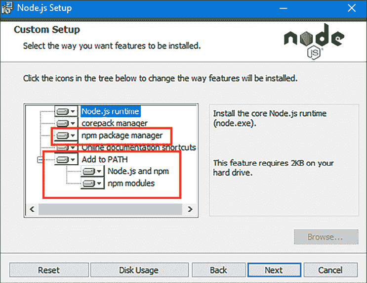

# 使用 Node.js 工具

在本章中，我解释了开始使用 **Node.js** 的简单过程，从准备开发所需的基本步骤开始。我解释了如何使用 Node.js 执行 JavaScript 代码，然后介绍了 Node.js 开发的真正力量：**Node 包管理器**（**npm**）。`npm` 是在开发过程中做大部分工作的工具，负责从下载和安装 JavaScript 包、报告安全漏洞到运行开发命令的所有事情。*表 2.1* 总结了本章内容。

表 2.1：章节总结

| 问题 | 解决方案 | 列表 |
| --- | --- | --- |
| 执行 JavaScript 文件。 | 使用 `node` 命令。 | *5* |
| 为使用 JavaScript 包的项目初始化。 | 使用 `npm init` 命令。 | *6* |
| 向项目中添加 JavaScript 包。 | 使用 `npm install` 命令。使用 `--save-dev` 参数为开发工具包。 | *7, 8* |
| 列出项目中使用的包。 | 使用 `npm list` 命令。 | *9, 10* |
| 列出项目中使用的包报告的安全漏洞。 | 使用 `npm audit` 命令。 | *N/A* |
| 在包中执行代码。 | 将 `node_modules/.bin` 文件夹添加到路径或使用 `npx` 命令。 | *11–17* |
| 启动项目使用的开发工具。 | 在 `package.json` 文件的脚本部分定义命令，并使用 `npm start` 或 `npm run` 命令。 | *18–22* |

# 准备工作

准备 Node.js 开发的关键步骤，正如你所预期的，是安装 Node.js 及其支持工具。我在本书中使用的 Node.js 版本是 20.9.0，这是写作时的 **长期支持**（**LTS**）版本。在你阅读本书时，可能会有更晚的版本可用，但你应该坚持使用这个版本中的示例。

Node.js 版本 20.10.0 的完整安装程序可在 [`nodejs.org/download/release/v20.10.0`](https://nodejs.org/download/release/v20.10.0) 获取。下载并运行适用于您平台的安装程序，确保已选中 **npm 包管理器** 和 **添加到 PATH** 选项，如图 *图 2.1* 所示：



图 2.1：安装 Node.js

安装完成后，打开一个新的命令提示符并运行 *列表 2.1* 中显示的命令：

列表 2.1：运行 Node.js

```js
node -v 
```

如果安装成功，你将看到以下版本号显示：

```js
v20.10.0 
```

安装程序应该已经设置了包管理器，这在 Node.js 开发中起着关键作用。运行 *列表 2.2* 中显示的命令以确保包管理器正在运行：

列表 2.2：运行包管理器

```js
npm -v 
```

如果安装成功，你将看到以下版本号：

```js
10.1.0 
```

## 安装 Git

一些包依赖于流行的版本控制系统 **Git**。从 [`git-scm.com/downloads`](https://git-scm.com/downloads) 下载你平台的安装程序，并按照安装说明进行操作。

安装完成后，使用命令提示符运行 *列表 2.3* 中所示的命令以检查 Git 是否正常工作。你可能需要手动配置可执行路径：

列表 2.3：检查 Git

```js
git --version 
```

在撰写本文时，Git for Windows 和 Linux 的最新版本是 2.42.0。

## 选择代码编辑器

需要一个编辑器来编写 Node.js 将要执行的代码，任何支持 JavaScript 和 TypeScript 的编辑器都可以用来跟随本书中的示例。如果你还没有首选的编辑器，那么 Visual Studio Code ([`code.visualstudio.com`](https://code.visualstudio.com)) 已经成为最受欢迎的编辑器，因为它既好又免费，而且我在编写本书时使用的也是这个编辑器。

如果你使用的是 Visual Studio Code，运行命令 code 以启动编辑器或使用安装过程中创建的程序图标，你将看到 *图 2.2* 中所示的欢迎屏幕。（在使用命令 code 之前，你可能需要将 Visual Studio Code 添加到你的命令提示符路径中。）

![图片 B21959_02_02.png]

图 2.2：Visual Studio Code 欢迎屏幕

# 使用 Node.js

Node.js 的整个目的就是执行 JavaScript 代码。打开命令提示符，导航到一个方便的位置，创建一个名为 `tools` 的文件夹。将一个名为 `hello.js` 的文件添加到 `tools` 文件夹中，其内容如 *列表 2.4* 所示：

列表 2.4：工具文件夹中 hello.js 文件的内容

```js
console.log("Hello, World"); 
```

Node.js API 有一些功能也由现代 JavaScript 浏览器提供，包括 `console.log` 方法，该方法将消息写入控制台。在 `tools` 文件夹中运行 *列表 2.5* 中所示的命令以执行 JavaScript 代码：

列表 2.5：执行 JavaScript 代码

```js
node hello.js 
```

`node` 命令启动 Node.js 运行时并执行指定的 JavaScript 文件，产生以下输出：

```js
Hello, World 
```

关于执行 JavaScript 代码，这就是所有需要了解的内容。Node.js 提供的其他功能都是通过 API 传递的，这些 API 在本书的其余部分进行了描述，从 *第四章* 开始。

# 理解 npm 工具

`node` 命令通常不直接使用，大多数开发活动都依赖于与 Node.js 一起安装的 `npm` 工具。`npm` 的主要功能是提供对 `npm` 仓库 ([npmjs.com](http://npmjs.com)) 的访问，该仓库包含了一个令人难以置信的开源 JavaScript 包集合，可以将它们添加到项目中。`npm` 已经从其原始目的扩展到添加相关功能，并已成为使用 Node.js 不可或缺的一部分，正如我在以下章节中所描述的。为了快速参考，*表 2.2* 列出了 `npm` 支持的最有用的命令，`npm` 是包管理器命令。

| 名称 | 描述 |
| --- | --- |

|

```js
`npm init` 
```

| 此命令创建一个 `package.json` 文件，用于跟踪项目的包。 |
| --- |

|

```js
`npm install` 
```

| 此命令将包添加到项目中。`--save-dev` 参数用于安装开发期间使用但不是应用程序一部分的包。 |
| --- |

|

```js
`npm list` 
```

| 此命令列出已添加到项目中的所有包。`--all` 参数将包依赖项包含在输出中。 |
| --- |

|

```js
`npm audit` 
```

| 此命令报告项目中使用的包中报告的安全漏洞。 |
| --- |

|

```js
`npm start` 
```

| 此命令执行在 `package.json` 文件中定义的 `start` 脚本。 |
| --- |

|

```js
`npm stop` 
```

| 此命令执行在 `package.json` 文件中定义的 `stop` 脚本。 |
| --- |

|

```js
`npm restart` 
```

| 此命令执行在 `package.json` 文件中定义的 `restart` 脚本。 |
| --- |

|

```js
`npm test` 
```

| 此命令执行在 `package.json` 文件中定义的 `test` 脚本。 |
| --- |

|

```js
`npm run` 
```

| 此命令执行在 `package.json` 文件中定义的自定义命令。 |
| --- |

|

```js
`npx` 
```

| 此命令执行一个包。 |
| --- |

表 2.2：有用的 `npm` 命令

## 初始化项目

`npm` 依赖于一个名为 `package.json` 的配置文件，该文件描述了开发项目，跟踪它所依赖的包，并存储与包相关的配置设置。在 `tools` 文件夹中运行 *列表 2.6* 中显示的命令以创建示例项目的 `package.json` 文件：

列表 2.6：初始化项目

```js
npm init -y 
```

`init` 命令提示用户输入要放入 `package.json` 文件中的值，但 `-y` 参数选择默认值，这些默认值适用于大多数项目，包括本章的示例。`init` 命令创建一个包含以下内容的 `package.json` 文件：

```js
{
  "name": "tools",
  "version": "1.0.0",
  "description": "",
  "main": "hello.js",
  "scripts": {
    "test": "echo \"Error: no test specified\" && exit 1"
  },
  "keywords": [],
  "author": "",
  "license": "ISC"
} 
```

`package.json` 文件的大部分初始内容描述了项目，以便它可以发布到包注册表，这就是为什么会有版本号和许可证的设置。在后面的部分中，将向文件中添加更多设置，您可以在 [`docs.npmjs.com/cli/v10/configuring-npm/package-json`](https://docs.npmjs.com/cli/v10/configuring-npm/package-json) 查看支持的设置完整列表。

## 管理包

`npm` 的主要功能是管理项目中使用的包。这可能看起来不是什么大事，但 Node.js 开发的一个令人信服的方面是庞大的开源包库，这些包在公共注册表中可用 ([npmjs.com](http://npmjs.com))。`npm` 提供对注册表的访问，负责下载和安装包，并管理包之间的依赖关系以避免冲突。

使用 `npm install` 命令将包添加到项目中。在 `tools` 文件夹中运行 *列表 2.7* 中显示的命令以将包添加到示例项目：

列表 2.7：添加包

```js
npm install bootstrap@5.3.0 
```

`npm install` 命令将包添加到项目中，参数指定了包的名称（在本例中为 `bootstrap`），后面跟着一个 `@` 符号，然后是版本号。您可以省略 `@` 符号和版本号，在这种情况下，将安装最新版本，但指定安装包时最好具体指定。

*清单 2.7* 中的命令将优秀的 Bootstrap CSS/JavaScript 包添加到项目中。作为此过程的一部分，`npm` 会查看 Bootstrap 依赖的包并将它们也安装上。一旦命令执行完成，您将在 `package.json` 文件中看到一个新部分：

```js
{
  "name": "tools",
  "version": "1.0.0",
  "description": "",
  "main": "hello.js",
  "scripts": {
    "test": "echo \"Error: no test specified\" && exit 1"
  },
  "keywords": [],
  "author": "",
  "license": "ISC",
 **"dependencies": {**
 **"bootstrap": "⁵.3.0"**
 **}**
} 
```

`dependencies` 部分用于跟踪项目中使用的包。`package.json` 文件中的版本号前加上一个撇号（`^` 字符），这是 `npm` 系统用于指定版本号范围的组成部分，如 *表 2.3* 中所述：

| 名称 | 描述 |
| --- | --- |
| `*` | 使用星号可以接受要安装的包的任何版本。 |
| `5.3.0` | 直接表达版本号将只接受与精确匹配的版本号的包，例如，`5.3.0`。 |
| `>5.3.0` `>=3.3.0` | 在版本号前加上 `>` 或 `>=` 可以接受任何大于或等于给定版本的包版本。 |
| `<5.3.0` `<=5.3.0` | 在版本号前加上 `<` 或 `<=` 可以接受任何小于或等于指定版本的包版本。 |
| `~5.3.0` | 在版本号前加上波浪号（`~` 字符）可以接受安装的版本，即使补丁级别数字（三个版本号中的最后一个）不匹配。例如，指定 `~5.3.0` 将接受版本 `5.3.1` 或 `5.3.2`（这将包含对版本 `5.3.0` 的补丁），但不接受版本 `5.4.0`（这将是一个新的次要版本） |
| `⁵.3.0` | 在版本号前加上撇号（`^` 字符）将接受版本，即使次要版本号（三个版本号中的第二个）或补丁号不匹配。例如，指定 `⁵.3.0` 将允许版本 `5.4.0` 和 `5.5.0`，但不允许版本 `6.0.0`。 |

表 2.3：`npm` 版本号

**使用精确版本号**

当我在 *清单 2.7* 中指定 `bootstrap@5.3.0` 时，`npm` 通过将版本解释为 `⁵.3.0` 给自己留了一些余地。解决包之间依赖和冲突的过程是一个复杂的过程，通过扩大可接受版本的范围可以简化这个过程。这种方法依赖于这样的想法，即版本 `5.4.0`（例如），将与版本 `5.3.0` 兼容，并且不会包含破坏性更改。

如果您不能依赖包来维护兼容性，那么您可以配置 `npm` 使用精确版本号，通过运行此命令：

```js
`npm config set save-exact false` 
```

`npm` 将仅使用您指定的版本，但代价是解决包之间的依赖和版本冲突可能更加困难。

包存储在 `node_modules` 文件夹中，该文件夹是自动创建的。`npm` 为它下载的每个包创建一个文件夹，随着包及其依赖项的解决，文件夹的数量可能会很多。

为了确保依赖项得到一致解决，`npm` 创建了 `package-lock.json` 文件，其中包含已安装的包的完整列表以及具体的版本号。

### 安装开发包

`package.json` 文件的 `dependencies` 部分用于存放应用程序运行所需的包。`npm` 命令还可以用来添加仅在开发期间需要的包，例如编译器和调试器。运行 `tools` 文件夹中显示的 *清单 2.8* 命令，将开发包添加到项目中：

*清单 2.8*：将开发包添加到示例项目

```js
npm install --save-dev typescript@5.2.2 tsc-watch@6.0.4 
```

`--save-dev` 参数指定了一个开发包，此命令安装了仅在开发期间需要的两个包。`typescript` 包包括 TypeScript 编译器，用于将 TypeScript 代码编译成 Node.js 可以执行的 JavaScript。`tsc-watch` 包是一个有用的附加组件，它可以监视 TypeScript 文件的变化，并自动编译和执行它们。

检查 `package.json` 文件，你会看到一个新的配置部分：

```js
{
  "name": "tools",
  "version": "1.0.0",
  "description": "",
  "main": "hello.js",
  "scripts": {
    "test": "echo \"Error: no test specified\" && exit 1",
    "start": "tsc message.ts"
  },
  "keywords": [],
  "author": "",
  "license": "ISC",
  "dependencies": {
    "bootstrap": "⁵.3.0"
  },
 **"devDependencies": {**
 **"tsc-watch": "****⁶.0.4",**
 **"typescript": "⁵.2.2"**
 **}**
} 
```

`devDependencies` 部分用于跟踪开发包，当应用程序准备部署时，这些包不需要被包含。新的部分包含了 *清单 2.8* 中命令指定的包。

**选择包和工具**

JavaScript 从一个广泛且动态的开源包生态系统中受益，这些包可以解决你可能会遇到的几乎所有问题。选择如此之多，以至于很难决定使用哪些包，尤其是由于不断有在线文章声称某个新的包是构建应用程序的热门方式。

令人遗憾的是，大多数项目因缺乏支持而失败。某个人，在某个地方，对某个包的工作方式感到沮丧，并决定编写自己的替代品。他们意识到其他人可能也会从中受益，并利他地决定将他们的代码发布给任何人使用。大多数情况下，这就是故事的结局，要么是因为没有多少人遇到相同的挫折，要么是因为新包以不适合其他项目的方式解决了问题。

在许多方面，这是最好的结果——至少对于原始开发者来说是这样——因为一旦一个包开始获得用户，开发者就会开始收到修复、功能和一般支持的请求。开源包的想法是大家共同参与，但这种情况往往并不发生。包开发者的负担可能会很大，用户需求可能无限且具有侵略性，而且——未付费的——工作量可能会失控。许多开始变得流行的包在这个时候就会被放弃，因为原始开发者无法应对维护工作，而且没有人愿意伸出援手。

只有少数包能够超越这个阶段。原始开发者成功地招募到帮助解决问题和编写新功能，并将包置于类似项目的地位。原始开发者可能会转向其他项目，但这个包变得足够重要，以至于其他人愿意承担这项任务，项目得以继续。在这个阶段，包成熟了，可以广泛使用，并且几乎总是成为那些在线文章中引起所有人愤怒的不时尚的方法。

我的建议是选择适合你正在进行的项目的包。对于主流的商业开发，我推荐使用那些已经克服了这些障碍并成为稳定且维护良好的包。这些包每周的下载量很高（你可以在 `npm.js` 上看到），定期更新，并且有一个积极参与并回应问题和查询的团队。这些包将在你的项目生命周期内持续得到支持，让你能够在稳固的平台之上交付你的特性。正是这类包，我在整本书中都在使用。

对于爱好和实验性项目，我建议使用不太成熟的包。这些包的支持可能不会那么好，你将遇到更多问题，需要做更多工作才能让一切正常运行，但你将学到更多，也许会更有趣。

无论你如何选择包，记住你正在受益于他人的无私奉献。如果你可以的话，那么就为使用的包做出贡献。几乎每个包都有一个等待修复的 bug 列表，这是一个参与的好方法。如果你不自信贡献代码，那么可以考虑进行财务捐助。许多项目接受捐赠，甚至最大的和最广泛使用的包也由接受个人和公司支持者的基金会管理。

### 列出包

你可能在一个项目中只依赖少数几个包，但每个包都有依赖项，很容易在项目中积累成百上千个小包，每个包都贡献了一小部分功能。要查看已添加到项目中的包集，请在 `tools` 文件夹中运行 *列表 2.9* 中显示的命令：

列表 2.9：列出已安装的包

```js
npm list 
```

输出对应于本章早期部分使用的 `npm install` 命令，尽管你可能看到略有不同的版本号：

```js
+-- bootstrap@5.3.0
+-- tsc-watch@6.0.4
`-- typescript@5.2.2 
```

在幕后，`npm` 检查了这些包以发现它们的依赖项，并安装了这些包，这可以通过在 `tools` 文件夹中运行 *清单 2.10* 命令来查看：

清单 2.10：列出包和依赖项

```js
npm list --all 
```

`--all` 参数告诉 `npm` 列出依赖项，并产生类似于以下内容的输出，尽管你可能看到不同的细节：

```js
+-- bootstrap@5.3.0
+-- tsc-watch@6.0.4
| +-- cross-spawn@7.0.3
| | +-- path-key@3.1.1
| | +-- shebang-command@2.0.0
| | | `-- shebang-regex@3.0.0
| | `-- which@2.0.2
| |   `-- isexe@2.0.0
| +-- node-cleanup@2.1.2
| +-- ps-tree@1.2.0
| | `-- event-stream@3.3.4
| |   +-- duplexer@0.1.2
| |   +-- from@0.1.7
| |   +-- map-stream@0.1.0
| |   +-- pause-stream@0.0.11
| |   | `-- through@2.3.8 deduped
| |   +-- split@0.3.3
| |   | `-- through@2.3.8 deduped
| |   +-- stream-combiner@0.0.4
| |   | `-- duplexer@0.1.2 deduped
| |   `-- through@2.3.8
| +-- string-argv@0.3.2
| `-- typescript@5.2.2 deduped
`-- typescript@5.2.2 
```

当你运行此命令时，你可能会看到一些细微的差异。大多数项目依赖于一个深层的包树，`npm` 会负责解决每个包的依赖项，并自动下载所有必需的包。

### 检查包安全漏洞

项目中大量的 JavaScript 包使得难以确切知道你正在使用哪些包，以及这些包是否报告了安全漏洞。

为了解决这个问题，包仓库维护了一个已知问题的列表。当 `npm` 解决包依赖项时，它会检查它正在安装的所有包与漏洞列表，如果发现任何问题，则发出警告。以下是一个安装包含漏洞的依赖项的包的命令示例：

```js
npm install --save-dev nodemon@2.0.20 
```

由于 JavaScript 包依赖项的动态性质，此命令在本书出版时可能不会产生相同的效果，但当我运行此命令时，我收到了以下响应：

```js
added 32 packages, and audited 54 packages in 3s
5 packages are looking for funding
  run `npm fund` for details
**3 moderate severity vulnerabilities** 
```

`npm` 已经在已安装的包中识别出三个安全问题。有关更多详细信息，我运行了以下命令：

```js
npm audit 
```

`npm audit` 命令报告潜在问题。在这种情况下，存在一个名为 `semver` 的包，其版本号在 7.0.0 到 7.5.1 之间存在问题：

```js
# npm audit report
semver  7.0.0 - 7.5.1
Severity: moderate
semver vulnerable to Regular Expression Denial of Service - https://github.com/advisories/GHSA-c2qf-rxjj-qqgw
fix available via `npm audit fix --force`
Will install nodemon@3.0.1, which is a breaking change
node_modules/simple-update-notifier/node_modules/semver
  simple-update-notifier  1.0.7 - 1.1.0
  Depends on vulnerable versions of semver
  node_modules/simple-update-notifier
    nodemon  2.0.19 - 2.0.22
    Depends on vulnerable versions of simple-update-notifier
    node_modules/nodemon
3 moderate severity vulnerabilities 
```

输出提供了一个可以找到详细信息的 URL，并建议安装顶级包的较新版本——由 `npm install` 命令添加的包——可以修复问题，尽管这可能会引入破坏性更改，可能导致现有代码无法工作。

存在一个 `npm audit fix` 命令，它试图将包移动到已修复的版本，但可能会与深度嵌套的依赖项发生问题，因此应谨慎使用。

对于本书中使用的包，你应该使用我指定的版本，即使有关于安全漏洞的警告，也要确保示例按预期工作。对于真实项目，你应该评估每个报告的漏洞，并确定是否可以通过不破坏代码的方式移动到修补过的包。在项目中进行相应的更改后，可能并不总是能够完全移除所有有漏洞的包，只有你自己才能决定对你项目来说什么是合理的。

为了清楚起见，我并不是建议你忽略安全警告。我是在说，并非所有警告都是针对所有项目中可能发生的问题，而且有时你可能会决定坚持使用有漏洞的包，因为对你的项目风险较低，并且升级包所需的工作量很大。你也可能会形成这样的观点，即开发者包的问题风险较小，因为这些包在项目部署时不会被包括在内。

## 执行包

一些包包括可以用来执行包功能的外壳脚本，这些脚本安装在 `node_modules/.bin` 文件夹中。例如，*列表 2.10* 中添加的包包含一个 `tsc` 脚本，该脚本启动 TypeScript 编译器。将一个名为 `message.ts` 的文件添加到 `tools` 文件夹中，内容如 *列表 2.11* 所示。（`ts` 文件扩展名表示 TypeScript 文件。）

列表 2.11：工具文件夹中 message.ts 文件的内容

```js
function writeMessage(msg: string) {
    console.log(`Message: ${msg}`);
}
writeMessage("This is the message"); 
```

TypeScript 代码必须在 Node.js 执行之前编译成纯 JavaScript。我在 *第三章* 中更详细地描述了此过程，但本章中，只需知道我需要使用 *列表 2.8* 中添加到项目中的包提供的 `tsc` 命令即可。

第一步是将包含脚本的文件夹添加到用于搜索命令的路径中。如果你使用 PowerShell，即我在 Windows 机器上开发时使用的工具，请执行 *列表 2.12* 中显示的命令：

列表 2.12：在 PowerShell 中设置路径

```js
$env:path += ';.\node_modules\.bin' 
```

*列表 2.13* 展示了 Bourne shell 的等效命令，这在 Linux 机器上常见：

列表 2.13：在 Bourne shell 中设置路径

```js
PATH=$PATH:./node_modules/.bin/ 
```

提供外壳脚本的包通常支持一系列命令外壳。对于其编译器，`typescript` 包将三个文件添加到 `node_modules/.bin` 文件夹中：`tsc`（支持 Bourne shell）、`tsc.ps1`（支持 PowerShell）和 `tsc.cmd`（支持较旧的 Windows 命令提示符）。

这些并不是添加到 `.bin` 文件夹的唯一脚本文件。`typescript` 包还添加了用于 `tsserver` 命令的脚本，该命令用于将 TypeScript 集成到开发工具中，如编辑器，但本书中不需要。其他包在 `npm` 安装包并解决依赖关系时添加条目。

在 `tools` 文件夹中运行 *列表 2.14* 中显示的命令以运行编译器：

列表 2.14：运行包命令

```js
tsc message.ts 
```

命令不会产生任何消息，但在 `tools` 文件夹中创建了一个名为 `message.js` 的文件，内容如下：

```js
...
function writeMessage(msg) {
    console.log("Message: ".concat(msg));
}
writeMessage("This is the message");
... 
```

在 `tools` 文件夹中运行 *列表 2.15* 中显示的命令以使用 Node.js 执行编译后的 JavaScript 代码：

列表 2.15：执行 JavaScript 代码

```js
node message.js 
```

Node.js 运行时执行 TypeScript 编译器创建的文件中的代码，生成以下输出：

```js
Message: This is the message 
```

### 使用 npx 命令

并非所有包都安装脚本，另一种执行包功能的方法是使用`npx`命令。添加到`node_modules`文件夹中的每个包都有自己的`package.json`文件。除了跟踪包的依赖关系外，`package.json`文件还定义了一个`bin`部分，该部分定义了`npx`可以执行的命令。对于*列表 2.8*中添加的包，`package.json`文件位于`node_modules/typescript`文件夹中，并包含以下`bin`部分：

```js
...
"bin": {
    "tsc": "./bin/tsc",
    "tsserver": "./bin/tsserver"
},
... 
```

`bin`部分的条目定义了一个命令和一个将被该命令执行的 JavaScript 文件。`typescript`包为`tsc`和`tsserver`命令定义了`bin`条目，这些条目对应于上一节中使用的 shell 脚本。在`tools`文件夹中运行*列表 2.16*中显示的命令以使用`npx`执行 TypeScript 编译器：

列表 2.16：执行 TypeScript 编译器

```js
npx tsc message.ts 
```

此命令与*列表 2.14*中的命令具有相同的效果。当多个包定义了同名命令时，可以使用`--package`参数，如*列表 2.17*所示：

列表 2.17：指定包

```js
npx --package=typescript tsc message.ts 
```

如果包含该命令的包未安装，则`npx`命令将下载该包到缓存文件夹中，然后执行该命令。

## 使用脚本命令

`npm`支持一组通过在`package.json`文件的`scripts`部分添加条目来自定义的命令。一开始这可能感觉有点奇怪，但它是一种强大而简洁地使用 JavaScript 包提供功能的方式。`npm`支持以下基本命令：

+   `start`

+   `stop`

+   `restart`

+   `test`

项目不一定需要每个命令，使用这些命令也没有固定的规则，但惯例是使用`start`命令启动开发工具，并使用`test`命令运行单元测试，这些内容我在*第八章*中进行了描述。

*列表 2.18*在`scripts`部分添加了一个条目：

列表 2.18：在工具文件夹中的`package.json`文件中配置命令

```js
{
  "name": "tools",
  "version": "1.0.0",
  "description": "",
  "main": "hello.js",
  "scripts": {
    "test": "echo \"Error: no test specified\" && exit 1",
    **"start"****: "tsc-watch message.ts --onSuccess \"node message.js\""**  },
  "keywords": [],
  "author": "",
  "license": "ISC",
  "dependencies": {
    "bootstrap": "⁵.3.0"
  },
  "devDependencies": {
    "tsc-watch": "⁶.0.4",
    "typescript": "⁵.2.2"
  }
} 
```

`scripts`部分的每个条目都由一个命令名称和相关动作组成。*列表 2.18*中`start`命令关联的动作运行`tsc-watch`命令，这是一个围绕 TypeScript 编译器的包装器，它监视 TypeScript 文件的变化，并且可以配置在编译成功时执行命令。（`test`命令是在创建`package.json`文件时自动添加的，仅打印出错误消息。）

我可以直接从命令行运行`tsc-watch`命令，无论是使用包添加到`node_modules/.bin`文件夹中的 shell 脚本，还是使用`npx`命令，但随着命令的复杂化，记住语法并正确输入它们变得越来越困难。`package.json`文件中的新条目让我可以一次性定义命令，然后始终一致地调用它。在`tools`文件夹中运行*列表 2.19*中显示的命令：

列表 2.19：运行脚本命令

```js
npm start 
```

`npm start` 命令告诉 `npm` 执行 `package.json` 文件中定义的 `start` 动作，产生以下输出：

```js
09:19:15 - Starting compilation in watch mode...
09:19:16 - Found 0 errors. Watching for file changes.
Message: This is the message 
```

*列表 2.20* 对 TypeScript 文件进行了一些小的修改：

列表 2.20：在工具文件夹中的 message.ts 文件中进行修改

```js
function writeMessage(msg: string) {
    console.log(`Message: ${msg}`);
}
**writeMessage("This is the new message");** 
```

当你保存修改后的文件时，变更会被检测到，TypeScript 文件会被编译，然后使用 Node.js 来执行 JavaScript，产生以下输出：

```js
...
Message: This is the new message
... 
```

大多数网络应用程序项目开发依赖于持续运行的工具，这些工具会监控文件变更，本书将遵循这种模式。使用 *Control+C* 停止命令，一旦你看到了输出。

### 定义自定义命令

除了内置命令外，`npm` 还支持自定义命令，如 *列表 2.21* 所示：

列表 2.21：在工具文件夹中的 package.json 文件中定义自定义脚本命令

```js
...
"scripts": {
  "test": "echo \"Error: no test specified\" && exit 1",
  "start": "tsc-watch message.ts --onSuccess \"node message.js\"",
  **"go": "tsc message.ts && node message.js"**
},
... 
```

新命令的名称是 `go`，它编译 `message.ts` TypeScript 文件，然后使用 Node.js 来执行编译后的 JavaScript。

**提示**

由 `&&` 分隔的命令会顺序执行。由单个 `&` 分隔的命令会并行执行。

自定义命令使用 `npm run` 执行，如 *列表 2.22* 所示：

列表 2.22：执行自定义脚本命令

```js
npm run go 
```

自定义命令的名称跟随 `npm run`，因此 `npm run go` 执行自定义的 `go` 命令，产生以下输出：

```js
Message: This is the new message 
```

# 摘要

在本章中，我解释了为本书做准备的基本设置过程，并介绍了核心 Node.js 工具：

+   Node.js 开发需要 Node.js 安装程序、Git 版本控制系统以及一个 JavaScript/TypeScript 代码编辑器，例如 Visual Studio Code。

+   使用 `node` 命令执行 JavaScript 文件。

+   Node.js 提供的大部分功能都是通过它提供的 API 展示的，这正是本书的主题。

+   **node 包管理器**（**npm**）用于下载 JavaScript 包、执行命令、运行开发工具和启动单元测试。

在下一章中，我将提供一个基础，描述了遵循本书示例所需的必要 JavaScript 和 TypeScript 功能。
