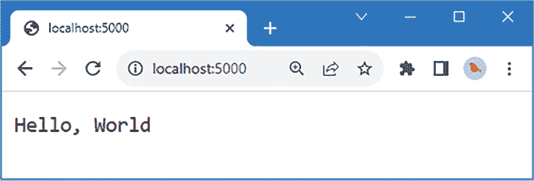
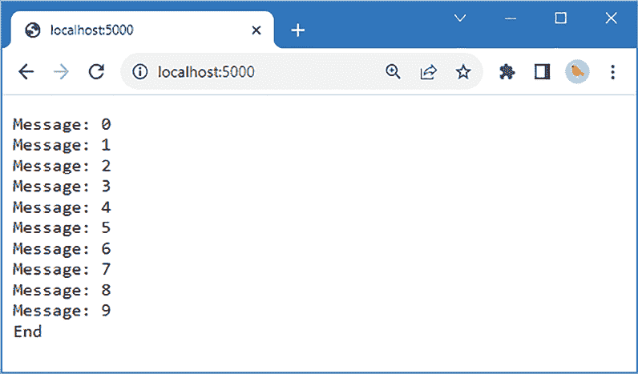
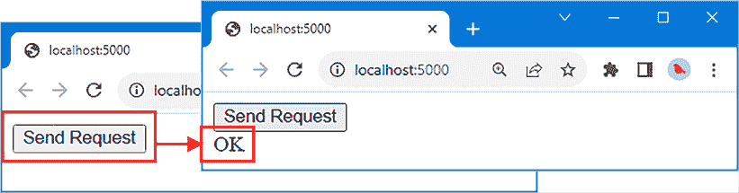
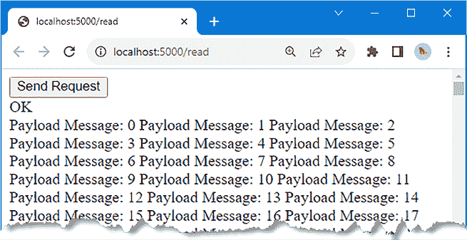
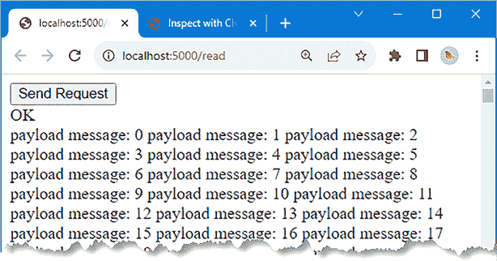
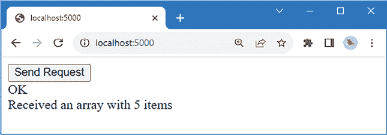

# 使用 Node.js 流

服务器端开发中需要完成的主要任务之一是传输数据，无论是读取客户端或浏览器发送的数据，还是以某种方式传输或存储的数据。在本章中，我将介绍 Node.js 处理数据源和数据目的地的 API，称为 *流*。我将解释流背后的概念，展示如何使用流来处理 HTTP 请求，并解释为什么在服务器端项目中应谨慎使用一个常见的数据源——文件系统。*表 6.1* 将流置于上下文中。

表 6.1：将流置于上下文中

| 问题 | 答案 |
| --- | --- |
| 它们是什么？ | 流被 Node.js 用于表示数据源或目的地，包括 HTTP 请求和响应。 |
| 为什么它们有用？ | 流不暴露数据产生或消费的细节，这使得相同的代码可以处理来自任何源的数据。 |
| 如何使用它们？ | Node.js 提供流来处理 HTTP 请求。流 API 用于从 HTTP 请求中读取数据并将数据写入 HTTP 响应。 |
| 有没有陷阱或限制？ | 流 API 可能有点难以处理，但使用第三方包可以改进这一点，这些包通常提供更方便的方法来执行常见任务。 |
| 有没有替代方案？ | 流对于 Node.js 开发至关重要。第三方包可以简化流的工作，但了解流的工作原理对于出现问题时是有帮助的。 |

*表 6.2* 总结了本章将涵盖的内容。

表 6.2：章节总结

| 问题 | 解决方案 | 列表 |
| --- | --- | --- |
| 将数据写入流 | 使用 `write` 或 `end` 方法。 | 4 |
| 设置响应头 | 使用 `setHeader` 方法。 | 5–7 |
| 管理数据缓冲 | 使用 `write` 方法的返回结果并处理 `drain` 事件。 | 8–9 |
| 从流中读取数据 | 处理 `data` 和 `end` 事件或使用迭代器。 | 10–15 |
| 连接流 | 使用 `pipe` 方法。 | 16 |
| 转换数据 | 扩展 `Transform` 类并使用流对象模式。 | 17–19 |
| 服务器端静态文件 | 使用 Express 静态中间件或使用 `sendFile` 和 `download` 方法。 | 20–26 |
| 编码和解码数据 | 使用 Express JSON 中间件和 `json` 响应方法。 | 27–28 |

# 准备本章内容

在本章中，我将继续使用在 *第四章* 中创建并在 *第三章* 中修改的 `webapp` 项目。为了准备本章内容，请将 `src` 文件夹中 `server.ts` 文件的全部内容替换为 *清单 6.1* 中显示的代码。

**提示**

您可以从 [`github.com/PacktPublishing/Mastering-Node.js-Web-Development`](https://github.com/PacktPublishing/Mastering-Node.js-Web-Development) 下载本章的示例项目——以及本书中所有其他章节的示例项目。有关如何获取帮助以运行示例的说明，请参阅 *第一章*。

列表 6.1：替换 src 文件夹中 server.Ts 文件的内容

```js
import { createServer } from "http";
import express, {Express } from "express";
import { basicHandler } from "./handler";
const port = 5000;
const expressApp: Express = express();
expressApp.get("/favicon.ico", (req, resp) => {
    resp.statusCode = 404;
    resp.end();
});
expressApp.get("*", basicHandler);
const server = createServer(expressApp);
server.listen(port,
    () => console.log(`HTTP Server listening on port ${port}`)); 
```

Express 路由器过滤掉 favicon 请求，并将所有其他 HTTP GET 请求传递给一个名为`basicHandler`的函数，该函数是从`handler`模块导入的。为了定义处理程序，将`src`文件夹中的`handler.ts`文件的内容替换为*列表 6.2*中显示的代码。

列表 6.2：src 文件夹中 handler.ts 文件的内容

```js
import { IncomingMessage, ServerResponse } from "http";
export const basicHandler = (req: IncomingMessage, resp: ServerResponse) => {
    resp.end("Hello, World");
}; 
```

尽管使用了 Express 进行路由请求，但此处理程序使用了 Node.js 的`IncomingMessage`和`ServerResponse`类型。我将在*使用第三方增强功能*部分演示 Express 提供的增强功能，但我会从 Node.js 提供的内置功能开始。

本章中的一些示例需要图像文件。创建`static`文件夹，并向其中添加一个名为`city.png`的图像文件。只要将其命名为`city.png`，您可以使用任何 PNG 图像文件，或者您可以下载我在代码库中使用的纽约市天际线的公共领域全景图，如*图 6.1*所示。


图 6.1：静态文件夹中的 The city.png 文件

在`webapp`文件夹中运行*列表 6.3*中显示的命令以启动编译 TypeScript 文件并执行生成的 JavaScript 的监视器。

列表 6.3：启动项目

```js
npm start 
```

打开一个网页浏览器并请求`http://localhost:5000`。你将看到*图 6.2*中显示的结果。



图 6.2：运行示例项目

# 理解流

理解流的最佳方式是暂时忽略数据，并思考一下水。想象你在一个房间里，有一根带水龙头的水管从一堵墙上进入。你的任务是构建一个收集水管中水的设备。显然，管道的另一端连接着产生水的设备，但你只能看到水龙头，因此你的设备设计将由你所知的内容决定：你必须创建一个可以连接到管道并在水龙头打开时接收水的设备。对你正在处理的系统有如此有限的视角可能会感觉像是一种限制，但管道可以连接到任何水源，无论水来自河流还是水库，你的设备都能正常工作；它只是通过水龙头通过管道流过的水，而且总是被一致地消耗。

在管道的另一端，水的生产者有一个管道，他们将水泵入这个管道。水生产者看不到你连接在管道另一端的东西，也不知道你将如何使用这水。这并不重要，因为水生产者只需要将他们的水通过管道推送出去，无论这些水是用来驱动水车、填满游泳池还是运行淋浴。你可以改变连接到你的管道的设备，但这并不会对生产者产生影响，他们仍然以同样的方式将水泵入同一个管道。

在 Web 开发的世界里，*流*解决了数据分布的问题，就像管道解决了水分布的问题一样。像管道一样，流也有两端。一端是数据生产者，也称为*写者*，他们将一系列数据值放入流中。另一端是数据消费者，也称为*读者*，他们从流中接收一系列数据值。写者和读者各自有自己的 API，允许他们与流一起工作，如图 6.3 所示。


图 6.3：溪流的解剖结构

这种安排有两个重要的特点。第一个特点是数据以写入时的相同顺序到达，这就是为什么流通常被描述为数据值的*序列*。

第二个特点是数据值可以随着时间的推移写入流中，这样写者就不必在写入第一个值之前准备好所有数据值。这意味着读者可以在写者仍在准备或计算序列中的后续值时接收并开始处理数据。这使得流适用于广泛的数据源，并且它们与 Node.js 编程模型集成良好，正如本章中的示例将展示的那样。

# 使用 Node.js 流

`streams`模块包含表示不同类型流的类，其中最重要的两个在*表 6.3*中描述。

表 6.3：有用的流类

| 名称 | 描述 |
| --- | --- |
| `可写` | 这个类提供了向流中写入数据的 API。 |
| `可读` | 这个类提供了从流中读取数据的 API。 |

在 Node.js 开发中，流的一端通常连接到 JavaScript 环境之外的东西，比如网络连接或文件系统，这使得数据可以以相同的方式读取和写入，无论数据是去往还是来自何方。

在 Web 开发中，流的最重要用途是它们用来表示 HTTP 请求和响应。用于表示 HTTP 请求和响应的`IncomingMessage`和`ServerResponse`类是从`Readable`和`Writable`类派生出来的。

## 将数据写入流

`Writable` 类用于将数据写入流。`Writable` 类提供的最有用的功能在 *表 6.4* 中描述，并在接下来的章节中解释。

表 6.4：有用的可写功能

| 名称 | 描述 |
| --- | --- |
| `write(data, callback)` | 此方法将数据写入流，并在数据被刷新时调用可选的回调函数。数据可以表示为 `string`、`Buffer` 或 `Uint8Array`。对于字符串值，可以指定一个可选的编码。该方法返回一个 `boolean` 值，指示流是否能够接受更多数据而不超过其缓冲区大小，如 *避免过度数据缓冲* 部分所述。 |
| `end(data, callback)` | 此方法通知 Node.js 将不再发送数据。参数是一个可选的最终数据块，以及一个可选的回调函数，当数据完成时将被调用。 |
| `destroy(error)` | 此方法立即销毁流，而不等待任何挂起的数据被处理。 |
| `closed` | 如果流已被关闭，此属性返回 `true`。 |
| `destroyed` | 如果调用了 `destroy` 方法，此属性返回 `true`。 |
| `writable` | 如果流可以写入，则此属性返回 `true`，这意味着流尚未结束，未遇到错误或被销毁。 |
| `writableEnded` | 如果调用了 `end` 方法，此属性返回 `true`。 |
| `writableHighWaterMark` | 此属性返回数据缓冲区的大小（以字节为单位）。当缓冲的数据量超过此值时，`write` 方法将返回 `false`。 |
| `errored` | 如果流遇到错误，此属性返回 `true`。 |

`Writable` 类也会发出事件，其中最有用的将在 *表 6.5* 中描述。

表 6.5：有用的可写事件

| 名称 | 描述 |
| --- | --- |
| `close` | 当流被关闭时，会发出此事件。 |
| `drain` | 当流可以无缓冲地接受数据时，会发出此事件。 |
| `error` | 当发生错误时，会发出此事件。 |
| `finish` | 当调用 `end` 方法并且流中的所有数据都已处理时，会发出此事件。 |

使用可写流的基本方法是在所有数据都发送到流中之前调用 `write` 方法，然后调用 `end` 方法，如 *列表 6.4* 所示。

列表 6.4：在 src 文件夹中的 handler.ts 文件中写入数据

```js
import { IncomingMessage, ServerResponse } from "http";
export const basicHandler = (req: IncomingMessage, resp: ServerResponse) => {
    **for (let i = 0****; i < 10; i++) {**
 **resp.write(`Message: ${i}\n`);**
 **}**

 **resp.end("End");**
}; 
```

保存更改，允许 Node.js 重新启动，然后请求 `http://localhost:5000`。处理程序将将其数据写入响应流，产生 *图 6.4* 中所示的结果。



图 6.4：将数据写入 HTTP 响应流

容易将流端点想象成一条直通最终数据接收者的管道，在这个例子中是网络浏览器，但这种情况很少见。大多数流的端点是 Node.js API 与操作系统交互的部分，在这种情况下，是处理操作系统网络栈以发送和接收数据的代码。这种间接关系导致了一些重要的考虑因素，如下文所述。

### 理解流增强

一些流被增强以简化开发，这意味着你写入流的数据不一定总是接收端接收到的数据。例如，在 HTTP 响应的情况下，Node.js HTTP API 通过确保所有响应都符合 HTTP 协议的基本要求来帮助开发，即使程序员没有明确使用提供来设置状态码和头部的功能。要查看 *列表 6.4* 中的示例写入流的内容，请打开一个新的命令提示符并运行 *列表 6.5* 中显示的 Linux 命令。

列表 6.5：在 Linux 中发送 HTTP 请求

```js
curl --include http://localhost:5000 
```

如果你是一名 Windows 用户，请使用 PowerShell 运行 *列表 6.6* 中显示的命令。

列表 6.6：在 Windows 中发送 HTTP 请求

```js
(Invoke-WebRequest http://localhost:5000).RawContent 
```

这些命令可以轻松显示 Node.js 发送的整个响应。*列表 6.4* 中的代码仅使用了 `write` 和 `end` 方法，但 HTTP 响应将如下所示：

```js
...
HTTP/1.1 200 OK
Connection: keep-alive
Keep-Alive: timeout=5
Transfer-Encoding: chunked
Date: Wed, 01 Nov 2023 19:46:02 GMT
X-Powered-By: Express
Message: 0
Message: 1
Message: 2
Message: 3
Message: 4
Message: 5
Message: 6
Message: 7
Message: 8
Message: 9
End
... 
```

Node.js HTTP API 确保响应是合法的 HTTP，通过添加 HTTP 版本号、状态码和消息以及最小的一组头部。这是一个有用的功能，它有助于说明你不能假设你写入流的数据就是到达另一端的数据。

`ServerResponse` 类展示了另一种流增强方式，即为你提供写入流内容的方法或属性，如 *列表 6.7* 所示。

列表 6.7：在 src 文件夹的 handler.ts 文件中使用流增强方法

```js
import { IncomingMessage, ServerResponse } from "http";
export const basicHandler = (req: IncomingMessage, resp: ServerResponse) => {
    **resp.setHeader("Content-Type", "text/plain");**
    for (let i = 0; i < 10; i++) {
        resp.write(`Message: ${i}\n`);
    }

    resp.end("End");
}; 
```

在幕后，`ServerResponse` 类将传递给 `setHeader` 方法的参数与用于响应的默认内容合并。`ServerResponse` 类从 `Writable` 派生，并实现了 *表 6.4* 中描述的方法和属性，但增强功能使得向特定于 HTTP 请求的流写入内容（如设置响应中的标题）变得更加容易。如果你再次运行 *列表 6.6* 或 *列表 6.7* 中显示的命令，你将看到调用 `setHeader` 方法的效果：

```js
...
HTTP/1.1 200 OK
Connection: keep-alive
Keep-Alive: timeout=5
Transfer-Encoding: chunked
**Content-Type: text/plain**
Date: Wed, 01 Nov 2023 21:19:45 GMT
X-Powered-By: Express
... 
```

### 避免过度数据缓冲

可写流在创建时带有一个缓冲区，数据在处理之前存储在其中。缓冲区是一种提高性能的方式，允许数据生产者以比流端点处理速度更快的爆发方式将数据写入流。

每次流处理一块数据时，我们说它已经*清空*了数据。当流缓冲区中的所有数据都被处理完毕时，我们说流缓冲区已经被*清空*。可以存储在缓冲区中的数据量被称为*高水位标记*。

可写流始终接受数据，即使它必须增加其缓冲区的大小，但这是不理想的，因为它会增加在流清空其包含的数据期间可能需要的内存需求。

理想的方法是向流写入数据，直到其缓冲区满，然后等待该数据被清空后再写入更多数据。为了帮助实现这一目标，`write`方法返回一个`boolean`值，表示流是否可以在不超出其目标高水位标记的情况下接收更多数据。

*列表 6.8*使用`write`方法返回的值来指示流缓冲区何时达到容量。

列表 6.8：在 src 文件夹中的 handler.ts 文件中检查流容量

```js
import { IncomingMessage, ServerResponse } from "http";
export const basicHandler = (req: IncomingMessage, resp: ServerResponse) => {
    resp.setHeader("Content-Type", "text/plain");
   **for (let i = 0; i <** **10_000; i++) {**
 **if (resp.write(`Message: ${i}\n`)) {**
 **console.log("Stream buffer is at capacity");**
 **}**
 **}**

    resp.end("End");
}; 
```

你可能需要增加`for`循环使用的最大值，但对我来说，快速向流写入 10,000 条消息将可靠地达到流限制。使用浏览器请求`http://localhost:5000`，你将看到 Node.js 控制台产生如下消息：

```js
...
Stream buffer is at capacity
Stream buffer is at capacity
Stream buffer is at capacity
... 
```

可写流在其缓冲区被清空时发出`drain`事件，此时可以写入更多数据。在*列表 6.9*中，数据被写入 HTTP 响应流，直到`write`方法返回`false`，然后停止写入，直到接收到`drain`事件。（如果你想知道单个数据块何时被清空，则可以将回调函数传递给流的`write`方法。）

列表 6.9：在 src 文件夹中的 handler.ts 文件中避免过多的数据缓冲

```js
import { IncomingMessage, ServerResponse } from "http";
export const basicHandler = (req: IncomingMessage, resp: ServerResponse) => {
    resp.setHeader("Content-Type", "text/plain");
    **let i = 0;**
 **let canWrite = true;**
 **const writeData = () => {**
**console.log("Started writing data");** 
 **do {**
 **canWrite = resp.write(`Message: ${i++}\n`);**
 **} while (i < 10_000 && canWrite);**
 **console.****log("Buffer is at capacity");**
 **if (i < 10_000) {**
 **resp.once("drain", () => {**
 **console.log("Buffer has been drained");**
**writeData();**
 **});**
 **} else {**
 **resp.end("End");**
 **}**
 **}**
 **writeData();**
}; 
```

`writeData`函数进入一个`do...while`循环，将数据写入流，直到`write`方法返回`false`。使用`once`方法注册一个处理程序，该处理程序将在`drain`事件触发时被调用，并调用`writeData`函数以恢复写入。一旦所有数据都已写入，将调用`end`方法以最终化流。

**避免提前结束陷阱**

一个常见的错误——而且我经常犯的错误——是将对`end`方法的调用放在写入数据的回调函数之外，如下所示：

```js
`...`
`const writeData = () => {`
 `console.log("Started writing data");` 
 `do {`
 ``canWrite = resp.write(`Message: ${i++}\n`);``
 `} while (i < 10_000 && canWrite);`
 `console.log("Buffer is at capacity");`
 `if (i < 10_000) {`
 `resp.once("drain", () => {`
 `console.log("Buffer has been drained");`
 `writeData();`
 `});`
 `}`
`}`
`writeData();`
`resp.end("End");`
`...` 
```

结果可能会有所不同，但通常是一个错误，因为回调将在流关闭后调用`write`方法，或者由于`drain`事件不会触发，所以不会将所有数据写入流。为了避免这种错误，确保在数据写入后，在回调函数中调用`end`方法。

使用浏览器请求`http://localhost:5000`，你将看到 Node.js 控制台消息显示，当缓冲区达到容量时写入停止，一旦缓冲区被清空，写入将恢复：

```js
...
Started writing data
Buffer is at capacity
Buffer has been drained
Started writing data
... 
```

## 从流中读取数据

网络应用程序中数据的最重要来源是 HTTP 请求体。示例项目需要做一些准备工作，以便客户端代码可以带有请求体的 HTTP 请求。将名为 `index.html` 的文件添加到 `static` 文件夹中，其内容如 *列表 6.10* 所示。

列表 6.10：static 文件夹中 index.html 文件的内容

```js
<!DOCTYPE html>
<html>
    <head>
        <script>
            document.addEventListener('DOMContentLoaded', function() {
                document.getElementById("btn")
                    .addEventListener("click", sendReq);
            });
            sendReq = async () => {
                let payload = "";
                for (let i = 0; i < 10_000; i++) {
                    payload += `Payload Message: ${i}\n`;
                }
                const response = await fetch("/read", {
                    method: "POST", body: payload
                })
                document.getElementById("msg").textContent
                     = response.statusText;
                document.getElementById("body").textContent
                    = await response.text();
            }
        </script>
    </head>
    <body>
       <button id="btn">Send Request</button>
       <div id="msg"></div>
       <div id="body"></div>
    </body>
</html> 
```

这是一个包含一些 JavaScript 代码的简单 HTML 文档。我将在本章后面进行改进，包括将 JavaScript 和 HTML 内容分别放入单独的文件中，但这对开始来说已经足够了。*列表 6.10* 中的 JavaScript 代码使用浏览器的 Fetch API 发送包含 1,000 行文本的 HTTP POST 请求。*列表 6.11* 更新现有的请求处理器，使其以 HTML 文件的内容作为响应。

列表 6.11：在 src 文件夹的 handler.ts 文件中更新处理器

```js
import { IncomingMessage, ServerResponse } from "http";
**import { readFileSync } from "fs";**
export const basicHandler = (req: IncomingMessage, resp: ServerResponse) => { 
    **resp.write(readFileSync("static/index.html"));**
 **resp.end();**
}; 
```

我使用 `readFileSync` 函数对 `index.html` 文件进行阻塞读取，这很简单，但正如我在本章后面解释的那样，这不是读取文件的最佳方式。为了创建一个将用于读取浏览器发送的数据的新处理器，将名为 `readHandler.ts` 的文件添加到 `src` 文件夹中，其内容如 *列表 6.12* 所示。目前，此处理器是一个占位符，在响应结束时不会产生任何内容。

列表 6.12：src 文件夹中 readHandler.ts 文件的内容

```js
import { IncomingMessage, ServerResponse } from "http";
export const readHandler = (req: IncomingMessage, resp: ServerResponse) => {
    // TODO - read request body
    resp.end();
} 
```

*列表 6.13* 通过添加一个匹配 POST 请求并将它们发送到新处理器的路由来完成准备工作。

列表 6.13：在 src 文件夹的 server.ts 文件中添加路由

```js
import { createServer } from "http";
import express, {Express } from "express";
import { basicHandler } from "./handler";
**import { readHandler } from "./readHandler";**
const port = 5000;
const expressApp: Express = express();
expressApp.get("/favicon.ico", (req, resp) => {
    resp.statusCode = 404;
    resp.end();
});
expressApp.get("*", basicHandler);
**expressApp.post("/read", readHandler);**
const server = createServer(expressApp);
server.listen(port,
    () => console.log(`HTTP Server listening on port ${port}`)); 
```

使用浏览器请求 `http://localhost:5000`，你将看到由 HTML 文档定义的按钮。点击按钮，浏览器将发送 HTTP POST 请求并显示从响应中接收到的状态消息，如图 *图 6.5* 所示。浏览器呈现的内容完全未加样式，但这对目前来说已经足够了。



图 6.5：发送 HTTP POST 请求

### 理解 Readable 类

`Readable` 类用于从流中读取数据。*表 6.6* 描述了 `Readable` 类最有用的功能。

*表 6.6*：有用的 Readable 功能

| 名称 | 描述 |
| --- | --- |
| `pause()` | 调用此方法会指示流暂时停止发出 `data` 事件。 |
| `resume()` | 调用此方法会指示流恢复发出 `data` 事件。 |
| `isPaused()` | 如果流的 `data` 事件已被暂停，则此方法返回 `true`。 |
| `pipe(writable)` | 此方法用于将流的数据传输到 `Writable`。 |
| `destroy(error)` | 此方法立即销毁流，而不等待任何挂起的数据被处理。 |
| `closed` | 如果流已被关闭，则此属性返回 `true`。 |
| `destroyed` | 如果已调用 `destroy` 方法，则此属性返回 `true`。 |
| `errored` | 如果流遇到错误，则此属性返回 `true`。 |

`Readable` 类也会触发事件，其中最有用的描述在 *表 6.7* 中。

表 6.7：有用的 Readable 事件

| 名称 | 描述 |
| --- | --- |
| `data` | 当流处于流动模式且提供对流中数据的访问时触发此事件。有关详细信息，请参阅 *使用事件读取数据* 部分。 |
| `end` | 当没有更多数据可从流中读取时触发此事件。 |
| `close` | 当流关闭时触发此事件。 |
| `pause` | 当调用 `pause` 方法暂停数据读取时触发此事件。 |
| `resume` | 当调用 `resume` 方法重新启动数据读取时触发此事件。 |
| `error` | 如果从流中读取数据时发生错误，则触发此事件。 |

### 使用事件读取数据

可以使用事件从流中读取数据，如 *清单 6.14* 所示，其中使用回调函数处理数据。

清单 6.14：在 src 文件夹中的 readHandler.ts 文件中读取数据

```js
import { IncomingMessage, ServerResponse } from "http";
export const readHandler = (req: IncomingMessage, resp: ServerResponse) => **{**
 **req.setEncoding("utf-8");**
 **req.on("data", (data: string) => {**
 **console****.log(data);**
 **});**
 **req.on("end", () => {**
 **console.log("End: all data read");**
 **resp.end();**
 **});** 
} 
```

当从流中读取到可读数据时，会触发 `data` 事件，并且该事件可用于处理回调函数。数据作为 `Buffer` 传递给回调函数，它表示无符号字节的数组，除非已使用 `setEncoding` 方法指定字符编码，在这种情况下，数据以 `string` 的形式表示。

此示例将字符编码设置为 UTF-8，以便 `data` 事件的回调函数将接收 `string` 类型的值，然后使用 `console.log` 方法将其写入。

当从流中读取所有数据时，会触发 `end` 事件。为了避免我之前描述的早期结束陷阱的变体，我仅在可读流的 `end` 方法触发时调用响应的 `end` 方法。使用浏览器请求 `http://localhost:5000` 并点击 **发送请求** 按钮，你将看到一系列 Node.js 控制台消息，因为数据正从流中读取：

```js
...
Payload Message: 0
Payload Message: 1
Payload Message: 2
Payload Message: 3
...
Payload Message: 9997
Payload Message: 9998
Payload Message: 9999
End: all data read
... 
```

JavaScript 主线程确保 `data` 事件按顺序处理，但基本思想是尽可能快地读取和处理数据，以便一旦有可读数据，就会尽快触发 `data` 事件。

### 使用迭代器读取数据

`Readable` 类的实例可以用作 `for` 循环中的数据源，这可以提供一种更熟悉的方式来从流中读取数据，如 *清单 6.15* 所示。

清单 6.15：在 src 文件夹中的 readHandler.ts 文件中循环读取数据

```js
import { IncomingMessage, ServerResponse } from "http";
**export const readHandler = async (req: IncomingMessage, resp: ServerResponse) => {**
    req.setEncoding("utf-8");
 **for await (const data of req) {**
 **console.log(data);**
 **}**
 **console.****log("End: all data read");**
 **resp.end();**
} 
```

`async` 和 `await` 关键字必须按照示例所示使用，但结果是 `for` 循环会从流中读取数据，直到全部消耗完毕。此示例产生的输出与 *清单 6.14* 相同。

### 将数据管道传输到可写流

使用 `pipe` 方法将一个 `Readable` 流连接到一个 `Writeable` 流，确保所有数据都从 `Readable` 流中读取，并写入到 `Writeable` 流中，无需进一步干预，如 *列表 6.16* 所示。

列表 6.16：在 src 文件夹中的 readHandler.ts 文件中将数据管道传输到

```js
import { IncomingMessage, ServerResponse } from "http";
export const readHandler = async (req: IncomingMessage, resp: ServerResponse) => {
    **req.pipe(resp);**
} 
```

这是传输数据流之间最简单的方法，一旦所有数据传输完成，`Writeable` 流会自动调用 `end` 方法。使用浏览器请求 `http://localhost:5000` 并点击 **发送请求** 按钮。HTTP 请求中发送的数据会被管道传输到 HTTP 响应中，并在浏览器窗口中显示，如 *图 6.6* 所示。



图 6.6：管道数据

# 数据转换

使用 `Transform` 类创建对象，称为 *transformers*，它们从 `Readable` 流接收数据，以某种方式处理它，然后传递出去。Transformers 通过 `pipe` 方法应用于流，如 *列表 6.17* 所示。

列表 6.17：在 src 文件夹中的 readHandler.ts 文件中创建 Transformer

```js
import { IncomingMessage, ServerResponse } from "http";
**import { Transform } from "stream";**
export const readHandler = async (req: IncomingMessage, resp: ServerResponse) => {
 **req.pipe(createLowerTransform()).pipe(resp);**
**}**
**const** **createLowerTransform = () =>  new Transform({**
 **transform(data, encoding, callback) {**
 **callback(null, data.toString().toLowerCase());**
 **}**
**});** 
```

`Transform` 构造函数的参数是一个对象，其 `transform` 属性值是一个函数，当有数据要处理时会被调用。该函数接收三个参数：要处理的数据块，可以是任何数据类型，一个字符串编码类型，以及一个回调函数，用于传递转换后的数据。在这个例子中，接收到的数据被转换成字符串，然后调用 `toLowerCase` 方法。结果传递给回调函数，其参数是一个表示已发生任何错误的对象和转换后的数据。

Transformer 通过 `pipe` 方法应用，在这种情况下，数据链被连接起来，以便从 HTTP 请求中读取的数据被转换，然后写入到 HTTP 响应中。请注意，必须为每个请求创建一个新的 `Transform` 对象，如下所示：

```js
...
req.pipe(**createLowerTransform()**).pipe(resp);
... 
```

使用浏览器请求 `http://localhost:5000`，并点击 **发送请求** 按钮。浏览器显示的内容，来自 HTTP 响应体，都是小写，如 *图 6.7* 所示。



图 6.7：使用简单的 transformer

## 使用对象模式

Node.js API 创建的流，如用于 HTTP 请求或文件的流，仅适用于字符串和字节数组。这并不总是方便的，因此一些流，包括 transformers，可以使用 *对象模式*，允许读取或写入对象。为了准备这个例子，*列表 6.18* 更新了静态 HTML 文件中包含的 JavaScript 代码，以发送包含 JSON 格式对象的请求。

列表 6.18：在静态文件夹中的 index.html 文件中发送 JSON 请求体

```js
...
<script>
    document.addEventListener('DOMContentLoaded', function() {
        document.getElementById("btn").addEventListener("click", sendReq);
    });
    sendReq = async () => {
        **let payload = [];**
 **for (let i = 0; i < 5; i++) {**
 **payload.push({ id: i, message: `Payload Message: ${i}\n`****});**
 **}**
        const response = await fetch("/read", {
           ** method: "POST", body: JSON.stringify****(payload),**
 **headers: {**
 **"Content-Type": "application/json"**
 **}**
        });
        document.getElementById("msg").textContent = response.statusText;
        document.getElementById("body").textContent = await response.text();
    }
</script>
... 
```

客户端发送的数据仍然可以以字符串或字节数组的形式读取，但可以使用转换器将请求数据包转换为 JavaScript 对象，或将 JavaScript 对象转换为字符串或字节数组，这被称为 *对象模式*。使用两个 `Transform` 构造函数配置设置来告诉 Node.js 转换器将如何行为，如 *表 6.8* 所述。

表 6.8：Transform 构造函数配置设置

| 名称 | 描述 |
| --- | --- |
| `readableObjectMode` | 当设置为 `true` 时，转换器将消费字符串/字节数据并产生一个对象。 |
| `writableObjectMode` | 当设置为 `true` 时，转换器将消费一个对象并产生字符串/字节数据。 |

*列表 6.19* 展示了一个将 `readableObjectMode` 设置为 `true` 的转换器，这意味着它将从 HTTP 请求有效载荷中读取字符串数据，但在读取数据时产生一个 JavaScript 对象。

列表 6.19：在 src 文件夹中的 readHandler.ts 文件中解析 JSON

```js
import { IncomingMessage, ServerResponse } from "http";
import { Transform } from "stream";
export const readHandler = async (req: IncomingMessage, resp: ServerResponse) => {   
    **if (req.headers["content-type"] == "application/json") {**
 **req.pipe(createFromJsonTransform()).on("data", (payload) =>** **{**
 **if (payload instanceof Array) {**
 **resp.write(`Received an array with ${payload.length} items`)**
 **}  else {**
 **resp.write("Did not receive an array");**
 **}**
 **resp.end****();**
 **});**
 **} else {**
 **req.pipe(resp);**
 **}**
}
**const createFromJsonTransform = () => new Transform({**
 **readableObjectMode: true,**
 **transform(data, encoding, callback****) {**
 **callback(null, JSON.parse(data));**
 **}**
**});** 
```

如果 HTTP 请求有一个 `Content-Type` 头部指示有效载荷是 JSON，那么转换器将用于解析数据，该数据是通过 `data` 事件由请求处理器接收的。解析后的有效载荷将被检查以确定它是否是一个数组，如果是，则使用其长度来生成响应。使用浏览器请求 `http://localhost:5000`（或确保重新加载浏览器，以便 *列表 6.18* 中的更改生效），点击 **发送请求** 按钮，你将看到 *图 6.8* 中显示的响应。



图 6.8：在对象模式下使用转换器

# 使用第三方增强功能

在接下来的章节中，我描述了 Express 包提供的有用增强功能，用于处理流和与 HTTP 相关的任务。Express 不是唯一提供这些功能的包，但对于新项目来说是一个好的默认选择，并为你提供了一个比较替代方案的基础。

## 文件处理

对于 Web 服务器来说，最重要的任务之一是响应对文件的请求，这些请求为客户端应用程序的客户端部分提供所需的 HTML、JavaScript 和其他静态内容。

Node.js 在 `fs` 模块中提供了一个全面的 API 来处理文件，并且它支持读取和写入流，还包括一些便利的功能，例如 `readFileSync` 函数，我使用它来读取 HTML 文件的內容。

我没有详细描述 API 的原因是因为在 Web 服务器项目中直接处理文件非常危险，应尽可能避免。存在很大的风险创建恶意请求，其路径试图访问预期位置之外的文件。通过个人经验，我了解到在任何情况下都不应让客户端在服务器上创建或修改文件。

我参与过许多项目，在这些项目中，恶意请求能够覆盖系统文件，或者通过写入大量数据来简单地压倒服务器，导致存储空间耗尽。

处理文件的最佳方式是使用经过良好测试的包，而不是编写自定义代码，这就是为什么我没有描述`fs`模块的功能。

**注意**

如果你决定忽略我的警告，你可以在[`nodejs.org/dist/latest-v20.x/docs/api/fs.html`](https://nodejs.org/dist/latest-v20.x/docs/api/fs.html)找到`fs`模块及其提供的详细功能的说明。

Express 包集成了对文件请求的支持。为了准备，将名为`client.js`的文件添加到`static`文件夹中，其内容如*列表 6.20*所示。

列表 6.20：静态文件夹中 client.js 文件的内容

```js
document.addEventListener('DOMContentLoaded', function() {
    document.getElementById("btn").addEventListener("click", sendReq);
});
sendReq = async () => {
    let payload = [];
    for (let i = 0; i < 5; i++) {
        payload.push({ id: i, message: `Payload Message: ${i}\n`});
    }
    const response = await fetch("/read", {
        method: "POST", body: JSON.stringify(payload),
        headers: {
            "Content-Type": "application/json"
        }
    })
    document.getElementById("msg").textContent = response.statusText;
    document.getElementById("body").textContent = await response.text();
} 
```

这与早期示例中使用的相同 JavaScript 代码，但被放入了单独的文件中，这是向客户端分发 JavaScript 的典型方式。*列表 6.21*更新了 HTML 文件，以链接到新的 JavaScript 文件，并且还包括了在本章开头添加到项目中的图像文件。

列表 6.21：在静态文件夹中的 index.html 文件中更改内容

```js
<!DOCTYPE html>
<html>
    <head>
       ** <script src="img/client.js"></script>**
    </head>
    <body>
       ****
       <button id="btn">Send Request</button>
       <div id="msg"></div>
       <div id="body"></div>
    </body>
</html> 
```

准备好内容后，下一步是配置 Express 以提供文件服务。Express 自带对中间件组件的支持，这意味着可以检查和拦截服务器接收到的所有 HTTP 请求的处理程序。中间件组件通过`use`方法设置，*列表 6.22*设置了 Express 提供的用于提供文件的中间件组件。

列表 6.22：在 src 文件夹中的 server.ts 文件中添加对静态文件的支持

```js
import { createServer } from "http";
import express, {Express } from "express";
**//import { basicHandler } from "./handler";**
import { readHandler } from "./readHandler";
const port = 5000;
const expressApp: Express = express();
**// expressApp.get("/favicon.ico", (req, resp) => {**
**//     resp.statusCode = 404;**
**//     resp.end();**
**// });**
**//expressApp.get("*", basicHandler);**
expressApp.post("/read", readHandler);
**expressApp.use(express.static("static"));**
const server = createServer(expressApp);
server.listen(port,
    () => console.log(`HTTP Server listening on port ${port}`)); 
```

`express`对象，它是`express`模块的默认导出，定义了一个名为`static`的方法，该方法创建用于提供静态文件的中间件组件。`static`方法的参数是包含文件的目录，也命名为`static`。结果是可以通过`Express.use`方法注册的请求处理程序。

中间件组件将尝试将请求 URL 与`static`目录中的文件匹配。包含文件的目录名称从 URL 中省略，因此对`http://localhost:5000/client.js`的请求将由返回`static`文件夹中`client.js`文件的內容来处理。

`static`方法可以接受一个配置对象，但默认值选择得很好，适用于大多数项目，包括将`index.html`作为请求的默认值。

**提示**

如果你需要更改设置，你可以在[`expressjs.com/en/4x/api.html#express.static`](https://expressjs.com/en/4x/api.html#express.static)查看选项。

中间件组件设置响应头以帮助客户端处理使用的文件内容。这包括设置 `Content-Length` 头以指定文件包含的数据量，以及 `Content-Type` 头以指定数据类型。

注意，我可以从示例中移除一些现有的处理器。`favicon.ico` 请求的处理器不再需要，因为新的中间件将在请求不存在文件时自动生成“未找到”的响应。通配符路由也不再需要，因为 `static` 中间件会对请求响应以 `index.html` 文件的内容。使用浏览器请求 `http://localhost:5000`，你将看到 *图 6.9* 中显示的响应，它还显示了浏览器接收到的数据类型。


图 6.9: 使用 Express 静态中间件

### 从客户端包提供文件

静态文件的一个来源是添加到 Node.js 项目中，但其文件旨在由浏览器（或其他 HTTP 客户端）消费的包。一个很好的例子是 Bootstrap CSS 包，它包含用于为浏览器显示的 HTML 内容添加样式的 CSS 样式表和 JavaScript 文件。

如果你正在使用 Angular 或 React 等客户端框架，这些 CSS 和 JavaScript 文件将在项目构建过程中作为单个压缩文件合并。

对于不使用这些框架的项目，使文件可用的最简单方法是设置静态文件中间件的额外实例。为了准备，请在 `webapp` 文件夹中运行 *列表 6.23* 中显示的命令，将 Bootstrap 包添加到示例项目中。

列表 6.23: 将包添加到示例项目

```js
npm install bootstrap@5.3.2 
```

*列表 6.24* 配置 Express 从包目录中提供文件。

列表 6.24\. 在 src 文件夹的 server.ts 文件中添加中间件

```js
import { createServer } from "http";
import express, {Express } from "express";
import { readHandler } from "./readHandler";
const port = 5000;
const expressApp: Express = express();
expressApp.post("/read", readHandler);
expressApp.use(express.static("static"));
**expressApp.use(express.static("node_modules/bootstrap/dist"));**
const server = createServer(expressApp);
server.listen(port,
    () => console.log(`HTTP Server listening on port ${port}`)); 
```

需要了解你正在使用的包的一些知识。在 Bootstrap 包的情况下，我知道客户端使用的文件位于 `dist` 文件夹中，因此这是我在设置中间件客户端时指定的文件夹。最后一步是添加对 Bootstrap 样式表的引用并应用其包含的样式，如 *列表 6.25* 所示。

列表 6.25\. 在 static 文件夹的 index.html 文件中添加样式表引用

```js
<!DOCTYPE html>
<html>
    <head>
        <script src="img/client.js"></script>
       ** <****link href="css/bootstrap.min.css" rel="stylesheet" />**
    </head>
    <body>
       
       **<button id="btn" class="****btn btn-primary my-2">Send Request</button>**
       <div id="msg"></div>
       <div id="body"></div>
    </body>
</html> 
```

`bootstrap.min.css` 文件包含我想要使用的样式，这些样式通过向类中添加 `button` 元素来应用。使用浏览器请求 `http://localhost:5000`，你将看到样式的效果，如 *图 6.10* 所示。

**注意**

有关 Bootstrap 包提供的功能详情，请参阅 [`getbootstrap.com`](https://getbootstrap.com)，其中一些我在后面的章节中使用。如果您无法使用 Bootstrap，还有其他 CSS 包可用。一个流行的替代方案是 Tailwind ([`tailwindcss.com`](https://tailwindcss.com))，但快速网络搜索将向您展示一个长长的可供考虑的替代方案列表。


图 6.10：使用第三方包的静态内容

### 发送和下载文件

`Response` 类，通过它 Express 提供了 `ServerResponse` 的增强功能，定义了 *表 6.9* 中描述的方法来直接处理文件。

表 6.9：文件有用的响应方法

| 名称 | 描述 |
| --- | --- |
| `sendFile(path, config)` | 此方法发送指定文件的內容。响应 `Content-Type` 头基于文件扩展名设置。 |
| `download(path)` | 此方法发送指定文件的內容，使得大多数浏览器会提示用户保存文件。 |

`sendFile` 和 `download` 方法很有用，因为它们提供了使用 `static` 中间件无法解决的问题的解决方案。*列表 6.26* 创建了使用这些方法的简单路由。

列表 6.26：在 src 文件夹的 server.ts 文件中添加路由

```js
import { createServer } from "http";
**import** **express, {Express, Request, Response } from "express";**
import { readHandler } from "./readHandler";
const port = 5000;
const expressApp: Express = express();
expressApp.post("/read", readHandler);
**expressApp.get("/sendcity", (req, resp****) => {**
 **resp.sendFile("city.png", { root: "static"});**
**});**
**expressApp.get("/downloadcity", (req: Request, resp: Response) => {**
 **resp.****download("static/city.png");**
**});**
expressApp.get("/json", (req: Request, resp: Response) => {
    resp.json("{name: Bob}");
});

expressApp.use(express.static("static"));
expressApp.use(express.static("node_modules/bootstrap/dist"));
const server = createServer(expressApp);
server.listen(port,
    () => console.log(`HTTP Server listening on port ${port}`)); 
```

当您需要以文件内容作为响应，但请求路径不包含文件名时，`sendFile` 方法很有用。参数是文件名和一个配置对象，其 root 属性指定包含文件的目录。

`download` 方法设置 `Content-Disposition` 响应头，导致大多数浏览器将文件内容视为应保存的下载。使用浏览器请求 `http://localhost:5000/sendcity` 和 `http://localhost:5000/downloadcity`。第一个 URL 将导致浏览器在浏览器窗口中显示图片。第二个 URL 将提示用户保存文件。这两个响应都显示在 *图 6.11* 中。


图 6.11：使用文件响应增强功能

## 自动解码和编码 JSON

Express 包包括一个自动解码 JSON 响应体的中间件组件，执行与本章前面创建的流转换器相同的任务。*列表 6.27* 通过调用 `express` 模块的默认导出上定义的 `json` 方法来启用此中间件。

列表 6.27：在 src 文件夹的 server.ts 文件中启用 JSON 中间件

```js
import { createServer } from "http";
import express, {Express, Request, Response } from "express";
import { readHandler } from "./readHandler";
const port = 5000;
const expressApp: Express = express();
**expressApp.use(express.json());**
expressApp.post("/read", readHandler);
expressApp.get("/sendcity", (req, resp) => {
    resp.sendFile("city.png", { root: "static"});
});
expressApp.get("/downloadcity", (req: Request, resp: Response) => {
    resp.download("static/city.png");
});
expressApp.get("/json", (req: Request, resp: Response) => {
    resp.json("{name: Bob}");
});

expressApp.use(express.static("static"));
expressApp.use(express.static("node_modules/bootstrap/dist"));
const server = createServer(expressApp);
server.listen(port,
    () => console.log(`HTTP Server listening on port ${port}`)); 
```

中间件组件必须在读取响应体的路由之前注册，这样 JSON 请求在匹配到处理器之前就会被解析。

**注意**

`json` 方法可以接受一个配置对象，该对象可以改变 JSON 解析的方式。默认值适用于大多数项目，但请参阅 [`expressjs.com/en/4x/api.html#express.json`](https://expressjs.com/en/4x/api.html#express.json) 了解可用选项的详细信息。

通过 Express 提供对 `IncomingRequest` 类增强的 `Request` 类定义了一个 `body` 属性，该属性被分配给 JSON 中间件创建的对象。

提供对 `ServerResponse` 增强的 `Response` 主体定义了一个 `json` 方法，该方法接受一个序列化为 JSON 的对象，并将其用作响应主体。

*列表 6.28* 更新了处理程序以使用 `Request` 类，禁用了自定义转换器，并向客户端发送 JSON 响应。

列表 6.28：在`src`文件夹中的`readHandler.ts`文件中使用 JSON 对象

```js
import { IncomingMessage, ServerResponse } from "http";
**//import { Transform } from "stream";**
**import { Request, Response } from "express";**
export const readHandler = async (req: Request, resp: Response) => {   
    **if (req.headers["content-type"] == "application/json") {**
 **const payload = req.body;**
 **if (payload instanceof Array) {**
**//resp.write(`Received an array with ${payload.length} items`)**
 **resp.json({arraySize: payload.length});**
 **}  else {**
 **resp.write("Did not receive an array");**
        }
        resp.end();
    } else {
        req.pipe(resp);
    }
}
**// const createFromJsonTransform = () => new Transform({**
**//     readableObjectMode: true,**
**//     transform(data, encoding, callback) {**
**//         callback(null, JSON.parse(data));**
**//     }**
**// });** 
```

使用网络浏览器请求 `http://localhost:5000`，然后点击 **发送请求** 按钮。响应将确认 JSON 请求主体被解析为 JavaScript 数组，并且响应也以 JSON 的形式发送，如图 *6.12* 所示。


图 6.12：使用 Express JSON 中间件

# 摘要

在本章中，我描述了 Node.js 提供的 API 功能，用于读取和写入数据，尤其是在处理 HTTP 请求时：

+   流被用作数据源和目的地的抽象表示，包括 HTTP 请求和响应。

+   当数据写入流时，数据会被缓冲，但避免过度缓冲是一个好主意，因为它可能会耗尽系统资源。

+   数据可以通过处理事件或使用`for`循环从流中读取。

+   数据可以从可读流管道传输到可写流。

+   数据在管道传输过程中可以被转换，并且可以是在 JavaScript 对象和字符串/字节数组之间。

+   Node.js 提供了一个 API 来处理文件，但第三方包是在网络服务器项目中处理文件的最安全方式。

+   第三方包，如 Express，提供了对 Node.js 流的增强，以执行常见任务，例如解码 JSON 数据。

在下一章中，我将描述 Node.js 与其他组件一起工作的两个方面，以交付应用程序。
