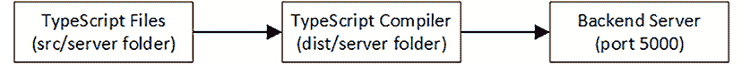
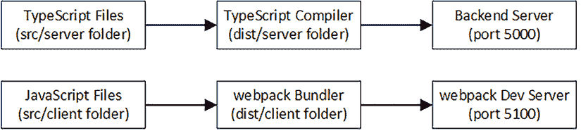
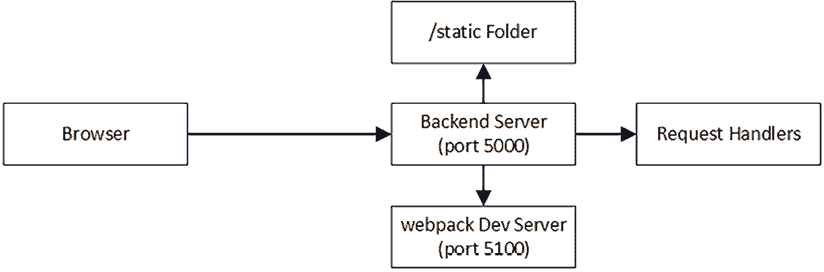
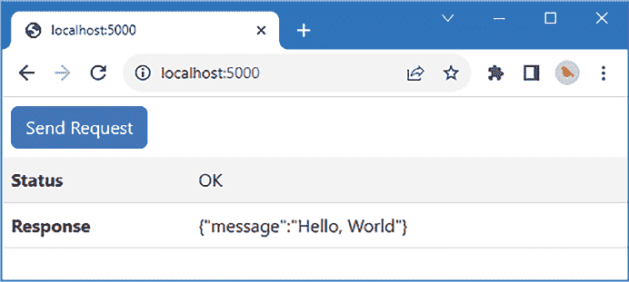

# 创建示例项目

在本章中，我将使用*第一部分*中描述的功能创建整个本书本部分使用的示例项目。在后面的章节中，我将开始添加新功能，但本章完全是关于构建基础。

**提示**

您可以从[`github.com/PacktPublishing/Mastering-Node.js-Web-Development`](https://github.com/PacktPublishing/Mastering-Node.js-Web-Development)下载本章的示例项目——以及本书中所有其他章节的示例项目。有关运行示例时遇到问题的帮助，请参阅*第一章*。

# 理解项目

示例项目将使用本书*第一部分*中介绍的功能和包。后端服务器将使用 TypeScript 编写，代码文件将位于`src/server`文件夹中。TypeScript 编译器将 JavaScript 文件写入`dist/server`文件夹，在那里它们将由 Node.js 运行时执行，该运行时将监听端口`5000`上的 HTTP 请求，如图*图 9.1*所示。



图 9.1：后端服务器

应用程序的客户端部分将比后端简单，仅用于发送请求并处理响应以演示服务器端功能。客户端代码将使用 JavaScript 编写，并使用 webpack 打包。该捆绑包将由 webpack 开发服务器提供，该服务器将监听端口 5100 上的 HTTP 请求，如图*图 9.2*所示。



图 9.2：添加项目的客户端部分

浏览器将向端口 5000 的后端服务器发出请求。Express 路由器将用于将请求匹配到处理函数，从单个`/test` URL 开始。对静态内容（如 HTML 文件和图片）的请求将从`static`文件夹提供，使用 Express 的`static`中间件组件。

所有其他请求都将转发到 webpack 服务器，这将允许请求客户端捆绑包并允许实时重新加载功能工作，如图*图 9.3*所示。



图 9.3：路由请求

# 创建项目

打开一个新的命令提示符，导航到一个方便的位置，并创建一个名为`part2app`的文件夹。导航到`part2app`文件夹，并运行*列表 9.1*中显示的命令以初始化项目并创建`package.json`文件。

列表 9.1：初始化项目

```js
npm init -y 
```

在接下来的章节中，我将介绍创建项目不同部分的过程，从后端服务器开始。我首先安装每个应用程序部分所需的 JavaScript 包，所有这些包都在本书*第一部分*中介绍过。

## 安装应用程序包

应用程序包是指其功能集成到后端服务器或客户端代码中的那些。*表 9.1*描述了本章中使用的应用程序包。

表 9.1：本章中使用的应用包

| 名称 | 描述 |
| --- | --- |

|

```js
`bootstrap` 
```

| 此包包含用于样式化客户端内容的 CSS 样式和 JavaScript 代码。 |
| --- |

|

```js
`express` 
```

| 此包包含简化 HTTP 请求处理的 Node.js API 的增强功能。 |
| --- |

|

```js
`helmet` 
```

| 此包在 HTTP 响应中设置与安全相关的头信息。 |
| --- |

|

```js
`http-proxy` 
```

| 此包转发 HTTP 请求，并将用于将后端服务器连接到 webpack 开发服务器。 |
| --- |

要安装这些包，请在 `part2app` 文件夹中运行 *列表 9.2* 中显示的命令。

列表 9.2：安装应用包

```js
npm install bootstrap@5.3.2
npm install express@4.18.2
npm install helmet@7.1.0
npm install http-proxy@1.18.1 
```

## 安装开发工具包

开发工具包提供在开发期间使用的功能，但在应用部署时不会被包含。*表 9.2* 描述了本章中使用的工具包。

表 9.2：本章中使用的开发工具包

| 名称 | 描述 |
| --- | --- |

|

```js
`@tsconfig/node20` 
```

| 此文件包含与 Node.js 一起工作的 TypeScript 编译器配置设置。 |
| --- |

|

```js
`npm-run-all` 
```

| 此包允许同时启动多个命令。 |
| --- |

|

```js
`tsc-watch` 
```

| 此包包含 TypeScript 文件的监视器。 |
| --- |

|

```js
`typescript` 
```

| 此包包含 TypeScript 编译器。 |
| --- |

|

```js
`webpack` 
```

| 此包包含 webpack 打包器。 |
| --- |

|

```js
`webpack-cli` 
```

| 此包包含 webpack 的命令行界面。 |
| --- |

|

```js
`webpack-dev-server` 
```

| 此包包含 webpack 开发 HTTP 服务器。 |
| --- |

要安装这些包，请在 `part2app` 文件夹中运行 *列表 9.3* 中显示的命令。

列表 9.3：安装开发工具包

```js
npm install --save-dev @tsconfig/node20
npm install --save-dev npm-run-all@4.1.5
npm install --save-dev tsc-watch@6.0.4
npm install --save-dev typescript@5.2.2
npm install --save-dev webpack@5.89.0
npm install --save-dev webpack-cli@5.1.4
npm install --save-dev webpack-dev-server@4.15.1 
```

## 安装类型包

最终包包含两个开发包使用的类型描述，这使得它们在使用 TypeScript 时更容易使用，如 *表 9.3* 所述。

表 9.3：类型描述包

| 名称 | 描述 |
| --- | --- |

|

```js
`@types/express` 
```

| 此包包含 Express API 的描述 |
| --- |

|

```js
`@types/node` 
```

| 此包包含 Node.js API 的描述 |
| --- |

要安装这些包，请在 `part2app` 文件夹中运行 *列表 9.4* 中显示的命令。

列表 9.4：安装类型包

```js
npm install --save-dev @types/express@4.17.20
npm install --save-dev @types/node@20.6.1 
```

# 创建配置文件

要创建 TypeScript 编译器的配置，请将一个名为 `tsconfig.json` 的文件添加到 `part2app` 文件夹中，其内容如 *列表 9.5* 所示。

您的代码编辑器可能会报告 `tsconfig.json` 文件错误，但这些错误将在您启动 *列表 9.12* 中的开发工具时得到解决。

列表 9.5：part2app 文件夹中 tsconfig.json 文件的内容

```js
{
    "extends": "@tsconfig/node20/tsconfig.json",
     "compilerOptions": {                     
         "rootDir": "src/server", 
         "outDir": "dist/server/"
     },
     "include": ["src/server/**/*"]
} 
```

此文件基于 *列表 9.4* 中添加到项目中的 `@tsconfig/node20` 包中的配置。`rootDir` 和 `include` 设置用于告诉编译器处理 `src/server` 文件夹中的文件。`outDir` 设置告诉编译器将处理后的 JavaScript 文件写入 `dist/server` 文件夹。

要创建 webpack 的配置文件，请将一个名为 `webpack.config.mjs` 的文件添加到 `part2app` 文件夹中，其内容如 *列表 9.6* 所示。

*清单 9.6*：part2app 文件夹中 webpack.config.mjs 文件的内容

```js
import path from "path";
import { fileURLToPath } from 'url';
const __dirname = path.dirname(fileURLToPath(import.meta.url));
export default  {
    mode: "development",
    entry: "./src/client/client.js",
    devtool: "source-map",  
    output: {
        path: path.resolve(__dirname, "dist/client"),
        filename: "bundle.js"
    },
    devServer: {
        static: ["./static"],       
        port: 5100,
        client: { webSocketURL: "http://localhost:5000/ws" }
    }
}; 
```

此配置文件告诉 webpack 将它在`src/client`文件夹中找到的 JavaScript 文件打包，并将创建的包写入`dist/client`文件夹。（尽管，如*第一部分*中所述，webpack 将在开发期间将包文件保留在内存中，并且只有在准备部署应用程序时才会将文件写入磁盘。）

为了定义启动开发工具将使用的命令，请将*清单 9.7*中显示的设置添加到`package.json`文件中。

*清单 9.7*：part2app 文件夹中 package.json 文件中定义的脚本

```js
...
"scripts": {
   ** "server": "****tsc-watch --noClear --onsuccess \"node dist/server/server.js\"",**
 **"client": "webpack serve",**
 **"start": "npm-run-all --parallel server client"**
},
... 
```

`server`命令使用`tsc-watch`包编译后端 TypeScript 代码并执行生成的 JavaScript。`client`命令启动`webpack`开发 HTTP 服务器。`start`命令使用`npm-run-all`命令，以便可以同时启动`client`和`server`命令。

# 创建后端服务器

创建`src/server`文件夹，并向其中添加一个名为`server.ts`的文件，其内容如*清单 9.8*所示。

*清单 9.8*：src/server 文件夹中 server.ts 文件的内容

```js
import { createServer } from "http";
import express, {Express } from "express";
import { testHandler } from "./testHandler";
import httpProxy from "http-proxy";
import helmet from "helmet";
const port = 5000;
const expressApp: Express = express();
const proxy = httpProxy.createProxyServer({
    target: "http://localhost:5100", ws: true
});
expressApp.use(helmet());
expressApp.use(express.json());
expressApp.post("/test", testHandler);
expressApp.use(express.static("static"));
expressApp.use(express.static("node_modules/bootstrap/dist"));
expressApp.use((req, resp) => proxy.web(req, resp));
const server = createServer(expressApp);
server.on('upgrade', (req, socket, head) => proxy.ws(req, socket, head));
server.listen(port,
    () => console.log(`HTTP Server listening on port ${port}`)); 
```

该代码创建了一个监听 5000 端口的 HTTP 服务器。Express 包用于解码 JSON 请求体、提供静态内容并将未处理请求转发到 webpack HTTP 服务器。

Express 路由器用于匹配发送到`/test` URL 的 HTTP POST 请求。为了创建处理器，请将一个名为`testHandler.ts`的文件添加到`src/server`文件夹中，其内容如*清单 9.9*所示。

*清单 9.9*：src/server 文件夹中 testHandler.ts 文件的内容

```js
import { Request, Response } from "express";
export const testHandler = async (req: Request, resp: Response) => {  
    resp.setHeader("Content-Type", "application/json")
    resp.json(req.body);
    resp.end();      
} 
```

处理器设置响应的`Content-Type`头，并将请求体写入响应，这相当于回显客户端发送的数据。在*第一部分*中，我使用了`pipe`方法来实现类似的效果，但在这个例子中不会起作用，因为 Express JSON 中间件将读取请求体并解码包含在其中的 JSON 数据到 JavaScript 对象，这意味着请求流中没有数据可读。因此，我使用`Request.body`属性创建响应，这是 JSON 中间件创建的对象可以找到的地方。

# 创建 HTML 和客户端 JavaScript 代码

为了定义将发送到浏览器的 HTML 文档，创建一个名为`static`的文件夹，并在其中添加一个名为`index.html`的文件，其内容如*清单 9.10*所示。

*清单 9.10*：static 文件夹中 index.html 文件的内容

```js
<!DOCTYPE html>
<html>
    <head>
        <script src="img/bundle.js"></script>
        <link href="css/bootstrap.min.css" rel="stylesheet" />
    </head>
    <body>
        <button id="btn" class="btn btn-primary m-2">Send Request</button>
        <table class="table table-striped">
            <tbody>
                <tr><th>Status</th><td id="msg"></td></tr>
                <tr><th>Response</th><td id="body"></td></tr>
            </tbody>
       </table>
    </body>
</html> 
```

此文件包含一个按钮，用于向后端服务器发送 HTTP 请求，以及一个用于显示响应详细信息的表格。为了创建响应按钮并发送请求的 JavaScript 代码，请将一个名为`client.js`的文件添加到`src/client`文件夹中，其内容如*清单 9.11*所示。

*清单 9.11*：src/client 文件夹中 client.js 文件的内容

```js
document.addEventListener('DOMContentLoaded', function() {
    document.getElementById("btn").addEventListener("click", sendReq);
});
sendReq = async () => {
    const response = await fetch("/test", {
        method: "POST", body: JSON.stringify({message: "Hello, World"}),
        headers: { "Content-Type": "application/json" }
    });
    document.getElementById("msg").textContent = response.statusText;
    document.getElementById("body").innerHTML = await response.text();
}; 
```

该文件中的 JavaScript 代码使用浏览器提供的 API 向 `/test` URL 发送 HTTP POST 请求，并显示从后端服务器收到的响应详情。

# 运行示例应用程序

剩下的就是确保示例应用程序按预期工作。在 `part2app` 文件夹中运行 *列表 9.12* 中显示的命令以启动开发工具。

列表 9.12：启动开发工具

```js
npm start 
```

给工具一点启动时间，然后使用网页浏览器请求 `http://localhost:5000`。浏览器将接收到定义在 *列表 9.10* 中的 HTML 文档，其中包含由 webpack 提供的包的链接。点击 **发送请求** 按钮，客户端 JavaScript 将向后端服务器发送 HTTP 请求，产生如图 *9.4* 所示的响应。



图 9.4：运行示例应用程序

# 摘要

在本章中，我创建了将在本书的这一部分中使用的示例项目，使用了 *第一部分* 中描述的包和功能。在下一章中，我将描述构建 Web 应用程序所需的关键特性，从使用模板生成 HTML 内容开始。
