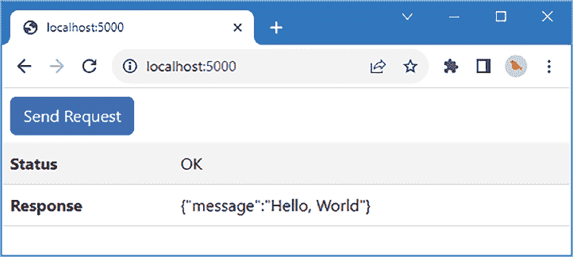
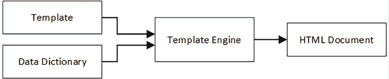
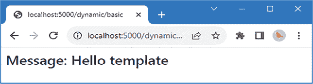
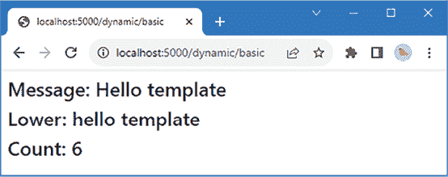
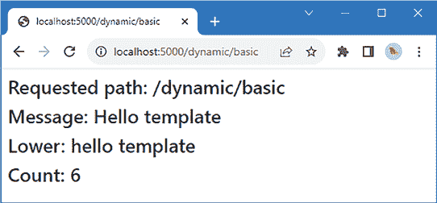
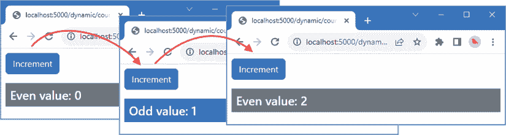
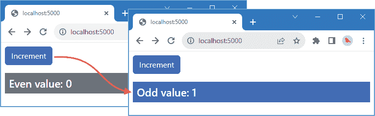
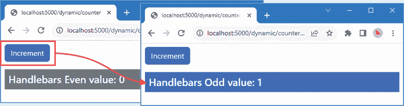
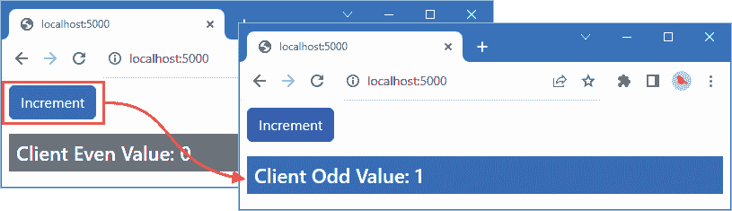

# 使用 HTML 模板

本章我将描述模板如何用于生成 HTML 内容，使应用程序能够根据用户的需求或应用程序的状态数据来调整内容显示。

与本书中描述的许多主题一样，一旦您了解了它们的工作原理，模板就更容易理解。因此，我将首先创建一个简单的自定义模板系统，仅使用 JavaScript 和 Node.js API 提供的功能，以解释各个部分是如何组合在一起的。我将演示*服务器端模板*，其中后端服务器生成 HTML 内容，以及*客户端模板*，其中浏览器生成内容。

本章中使用的自定义模板具有教育意义，但用于实际项目过于有限，因此我还介绍了一个具有更多功能和更好性能的流行模板包，它适合用于实际项目。*表 10.1*将 HTML 模板置于上下文中。

表 10.1：将 HTML 模板置于上下文中

| 问题 | 答案 |
| --- | --- |
| 它们是什么？ | HTML 模板是包含占位符的 HTML 文档，这些占位符会被动态内容替换，以反映应用程序的状态。 |
| 它们为什么有用？ | 模板允许用户展示的内容反映应用程序状态的变化，并且是大多数网络应用程序的关键构建块。 |
| 它们是如何使用的？ | 有许多优秀的模板包可用，并且流行的框架通常包括模板系统。 |
| 存在哪些陷阱或限制？ | 重要的是找到一个您觉得易于阅读的格式，但除此之外，模板引擎是网络应用程序项目的积极补充。 |
| 有没有替代方案？ | 您可以使用 JavaScript 代码完全生成内容，但这通常难以维护。如果您使用的是 React 或 Angular 等框架，可能无法避免使用模板。 |

*表 10.2*总结了本章内容。

表 10.2：章节总结

| 问题 | 解决方案 | 列表 |
| --- | --- | --- |
| 动态渲染 HTML 元素 | 使用混合 HTML 元素和表达式的模板引擎，这些表达式被评估以产生数据值。 | *1-4, 11-15, 21-27* |
| 评估模板表达式 | 使用`eval`关键字将字符串表达式评估为 JavaScript 语句。 | *5, 6* |
| 将模板拆分为更易于管理的部分 | 使用部分模板/视图。 | *7-10* |
| 在浏览器中动态渲染 HTML 元素 | 将模板编译成浏览器加载的包中包含的 JavaScript 代码。 | *16-20, 28-31* |

# 为本章做准备

本章使用的是在第九章中创建的`part2app`项目。为此章节做准备不需要任何更改。打开命令提示符，在`part2app`文件夹中运行*列表 10.1*中显示的命令以启动开发工具。

**提示**

您可以从[`github.com/PacktPublishing/Mastering-Node.js-Web-Development`](https://github.com/PacktPublishing/Mastering-Node.js-Web-Development)下载本章的示例项目——以及本书中所有其他章节的示例项目。有关运行示例时遇到问题的帮助，请参阅*第一章*。

列表 10.1：启动开发工具

```js
npm start 
```

打开一个网页浏览器，请求`http://localhost:5000`，然后点击**发送请求**按钮。浏览器将向后端服务器发送请求，并显示结果详情，如图*10.1*所示。



图 10.1：运行示例应用程序

# 使用服务器端 HTML 模板

服务器端 HTML 模板允许后端服务器动态生成内容，发送给浏览器的内容是根据单个请求定制的。定制可以采取任何形式，但一个典型的例子是包括特定于用户的内容，例如包括用户的姓名。

HTML 模板需要三个要素：一个包含占位符部分的*模板*文件，动态内容将被插入其中；一个*数据字典*或*上下文*，它提供了将决定特定动态内容生成的值；以及一个*模板引擎*，它处理视图和字典，生成一个包含已插入动态内容的 HTML 文档，该文档可以用作对 HTTP 请求的响应，如图*10.2*所示。



图 10.2：HTML 模板的组成部分

处理模板的任务被称为*渲染*，它完全发生在后端服务器上。渲染生成一个普通的 HTML 文档，从浏览器的角度来看，它与常规静态内容没有区别。（还有另一种类型的模板，它作为 JavaScript 发送到浏览器，由客户端渲染以创建 HTML 内容，如*使用客户端 HTML 模板*部分所述）。

## 创建一个简单的模板引擎

创建一个简单的模板引擎来帮助理解它们的工作原理很容易，但要创建一个可用于生产的模板引擎则要困难得多。在本节中，我将创建一个简单的模板，然后介绍一个更优秀、更快、功能更丰富的开源模板引擎包。

我将首先创建模板，这将有助于将所有内容置于上下文中。创建`part2app/templates/server`文件夹，并向其中添加一个名为`basic.custom`的文件，其内容如图*列表 10.2*所示。

**提示**

大多数代码编辑器都可以配置为理解具有非标准扩展名（如 `.custom`）的文件包含一个已知的格式，例如 HTML。例如，如果你使用 Visual Studio Code，请在窗口的右下角点击 **纯文本**，然后选择单个文件的格式或设置关联，以便所有 `.custom` 文件都像 HTML 一样处理，这将使在遵循示例时更容易发现错误。

清单 10.2：templates/server 文件夹中 basic.custom 文件的内容

```js
<!DOCTYPE html>
<html>
    <head><link href="/css/bootstrap.min.css" rel="stylesheet" /></head>
    <body>
        <h3 class="m-2">Message: {{ message }}</h3>
    </body>
</html> 
```

此模板是一个完整的 HTML 文档，包含一个占位符，该占位符由双大括号（`{{` 和 `}}` 字符）表示。大括号内的内容是一个 *模板表达式*，当模板渲染时将被评估，并用于替换占位符。

虽然双大括号 `{{` 和 `}}` 字符是一个流行的选择，但并非所有模板引擎都使用这些字符，重要的是表示占位符的字符序列不太可能出现在模板的静态部分中，这就是为什么你通常会看到重复字符序列或特殊字符的使用。

### 创建自定义模板引擎

Express 包集成了对模板引擎的支持，这使得实验和学习它们的工作方式变得容易。将一个名为 `custom_engine.ts` 的文件添加到 `src/server` 文件夹中，其内容如图 *清单 10.3* 所示。

清单 10.3：src/server 文件夹中 custom_engine.ts 文件的内容

```js
import { readFile } from "fs";
import { Express } from "express";
const renderTemplate = (path: string, context: any,
    callback: (err: any, response: string | undefined) => void) => {
    readFile(path, (err, data) => {
        if (err != undefined) {
            callback("Cannot generate content", undefined);
        } else {
            callback(undefined, parseTemplate(data.toString(), context));           
        }
    });
};
const parseTemplate = (template: string, context: any) => {
    const expr = /{{(.*)}}/gm;
    return template.toString().replaceAll(expr, (match, group) => {
        return context[group.trim()] ?? "(no data)"
    });               
}
export const registerCustomTemplateEngine = (expressApp: Express) =>
    expressApp.engine("custom", renderTemplate); 
```

`renderTemplate` 函数将由 Express 调用来渲染模板。参数是一个包含模板文件路径的 `string`，一个提供模板渲染上下文数据的 `object`，以及一个回调函数，用于向 Express 提供渲染内容或错误（如果发生错误）。

`renderTemplate` 函数使用 `readFile` 函数读取模板文件的内容，然后调用 `parseTemplate` 函数，该函数使用正则表达式搜索 `{{` 和 `}}` 字符。对于每个匹配项，回调函数将上下文对象中的数据值插入到结果中，如下所示：

```js
...
const expr = /{{(.*)}}/gm;
return template.toString().replaceAll(expr, (match, group) => {
   ** return context[group.trim()] ?? "(no data)"**
});
... 
```

这是一个基本的方法，而真正的引擎更复杂，并且更仔细地寻找模板表达式，但这足以演示这个想法。`registerCustomTemplateEngine` 函数通过调用 `Express.engine` 方法将模板引擎注册到 Express 中，指定文件扩展名和 `renderTemplate` 函数：

```js
...
export const registerCustomTemplateEngine = (expressApp: Express) =>
    expressApp.**engine**("custom", renderTemplate);
... 
```

此语句告诉 Express 使用 `renderTemplate` 函数来渲染具有 `.custom` 文件扩展名的模板文件。

### 设置自定义模板引擎

流程的最后部分是配置 Express 并创建一个与模板匹配的路线，如图 *清单 10.4* 所示。

清单 10.4：在 src/server 文件夹中的 server.ts 文件中设置模板引擎

```js
import { createServer } from "http";
import express, {Express } from "express";
import { testHandler } from "./testHandler";
import httpProxy from "http-proxy";
import helmet from "helmet";
**import { registerCustomTemplateEngine } from "./custom_engine";**
const port = 5000;
const expressApp: Express = express();
const proxy = httpProxy.createProxyServer({
    target: "http://localhost:5100", ws: true
});
**registerCustomTemplateEngine(expressApp);**
**expressApp.set("views", "templates/server");**
expressApp.use(helmet());
expressApp.use(express.json());
**expressApp.****get("/dynamic/:file", (req, resp) => {**
 **resp.render(`${req.params.file}.custom`, { message: "Hello template" });**
});
expressApp.post("/test", testHandler);
expressApp.use(express.static("static"));
expressApp.use(express.static("node_modules/bootstrap/dist"));
expressApp.use((req, resp) => proxy.web(req, resp));
const server = createServer(expressApp);
server.on('upgrade', (req, socket, head) => proxy.ws(req, socket, head));
server.listen(port,
    () => console.log(`HTTP Server listening on port ${port}`)); 
```

调用*列表 10.4*中定义的`registerCustomTemplateEngine`设置自定义模板引擎。默认情况下，Express 在`views`文件夹中查找模板文件。

*视图*和*视图引擎*是模板和模板引擎的别名，但为了保持术语的一致性，我使用了`ExpressApp.set`方法来更改模板文件的位置：

```js
...
expressApp.**set**("views", "templates/server");
... 
```

Express 配置属性的完整集合可以在[`expressjs.com/en/4x/api.html#app.set`](https://expressjs.com/en/4x/api.html#app.set)找到，而`views`属性用于指定包含模板文件的目录。

Express 路由器用于匹配将由模板处理的请求，如下所示：

```js
...
expressApp.**get**("/dynamic/:file", (req, resp) => {
    resp.**render**(`${req.params.file}.custom`, { message: "Hello template" });
});
... 
```

`get`方法创建一个匹配以`/dynamic`开头的路径的路由，并将下一个路径段捕获到名为`file`的路由参数中。请求处理器调用`Response.render`方法，该方法负责渲染模板。`file`路由参数用于创建渲染方法的第一个参数，即模板文件的名称。第二个参数是一个对象，为模板引擎提供上下文数据，以帮助它生成内容。在这个例子中，上下文对象定义了一个`message`属性，其值将包含在渲染输出中。

要测试自定义模板引擎，请使用浏览器请求`http://localhost:5000/dynamic/basic`。URL 中的`dynamic`部分将与新的 Express 路由匹配，而`basic`部分对应于模板文件夹中的`basic.custom`文件。自定义视图引擎将处理模板文件，并将结果写入响应，如图*10.3*所示。



图 10.3：使用自定义模板引擎

## 在模板中评估表达式

将数据值插入模板是一个好的开始，但大多数模板引擎都支持评估 JavaScript 代码片段并将结果插入输出中。*列表 10.5*向模板添加了一些模板表达式。

列表 10.5：在 templates/server 文件夹中的 basic.custom 文件中添加表达式

```js
<!DOCTYPE html>
<html>
    <head><link href="/css/bootstrap.min.css" rel="stylesheet" /></head>
    <body>
        <h3 class="m-2">Message: {{ message }}</h3>
        **<h3 class="m-2">Lower: {{ message.toLowerCase() }}</h3>**
 **<h3 class="****m-2">Count: {{ 2 * 3 }}</h3>**
    </body>
</html> 
```

*列表 10.6*通过使用 JavaScript 的`eval`函数为模板引擎添加了对评估表达式的支持。

**注意**

JavaScript 的`eval`函数很危险，尤其是如果有可能与用户提供的内容或数据一起使用，因为它可以用来执行任何 JavaScript 代码。这本身就是一个使用经过良好测试的模板引擎包（如在使用模板包部分介绍的那个）的充分理由。

列表 10.6：在 src/server 文件夹中的 custom_engine.ts 文件中评估表达式

```js
import { readFile } from "fs";
import { Express } from "express";
const renderTemplate = (path: string, context: any,
    callback: (err: any, response: string | undefined) => void) => {
    readFile(path, (err, data) => {
        if (err != undefined) {
            callback("Cannot generate content", undefined);
        } else {
            callback(undefined, parseTemplate(data.toString(), context));           
        }
    });
};
const parseTemplate = (template: string, context: any) => {
   ** const ctx = Object****.keys(context)**
 **.map((k) => `const ${k} = context.${k}`)**
 **.join(";");**
    const expr = /{{(.*)}}/gm;
    return template.toString().replaceAll(expr, (match, group) => {
      **  return eval(`****${ctx};${group}`);**
    });
}
export const registerCustomTemplateEngine = (expressApp: Express) =>
    expressApp.engine("custom", renderTemplate); 
```

使用`eval`的困难之处在于确保在评估表达式时上下文数据作为局部变量可用。为了确保上下文数据在作用域内，我为上下文对象的每个属性创建一个字符串，并将这些字符串与要评估的表达式组合起来，如下所示：

```js
...
"const message = context.message; message.toLowerCase()"
... 
```

这种方法确保表达式有一个`message`值可以使用，例如。使用`eval`有一些严重的风险，但对于示例应用程序来说是可以的，尽管需要重复的是，在实际项目中，尤其是在处理用户提供的资料时，应该使用真正的模板包。使用浏览器窗口请求`http://localhost:5000/dynamic/basic`，你将看到*图 10.4*中显示的结果。（浏览器不会自动重新加载，所以你可能需要发出新的请求或重新加载浏览器）。



图 10.4：在模板中评估 JavaScript 表达式

## 添加模板功能

评估表达式的功能为创建附加功能提供了一个基础，这些功能可以轻松地编写为 JavaScript 函数并添加到解析模板时使用的上下文中。将名为`custom_features.ts`的文件添加到`src/server`文件夹中，其内容如*列表 10.7*所示。

**编译模板**

大多数真实的模板引擎都会编译它们的模板，这意味着模板会被转换成一系列可以调用来生成内容的 JavaScript 函数。这不会改变生成的内容，但它可以提高性能，因为输出可以在不需要读取和搜索模板文件的情况下创建。客户端模板也会被编译，以便 JavaScript 函数可以呈现给浏览器。你可以在本章后面的*使用模板包*部分看到一个此过程的示例。

列表 10.7：src/server 文件夹中 custom_features.ts 文件的内容

```js
import { readFileSync } from "fs";
export const style = (stylesheet: string) => {
    return `<link href="/css/${stylesheet}" rel="stylesheet" />`;
}
export const partial = (file: string, context: any) => {
    const path = `./${context.settings.views}/${file}.custom`;
    return readFileSync(path, "utf-8");
} 
```

此文件定义了一个接受样式表名称并返回一个`link`元素的`style`函数。`partial`函数读取另一个模板文件，并返回其内容以包含在整体内容中。`partial`函数接收一个上下文对象，它使用该对象来定位请求的文件：

```js
...
const path = `./${**context.settings.views**}/${file}.custom`;
... 
```

Express 提供的上下文对象传递给模板引擎，它有一个`settings`属性，该属性返回一个包含应用程序配置的对象。其中设置属性之一是`views`，它返回模板文件的位置（`templates/server`文件夹）。*列表 10.8*修改了模板以使用这些新功能。

**注意**

*列表 10.7*中的`partial`函数执行一个阻塞操作来读取文件内容。正如*第四章*中解释的，这是应该尽可能避免的事情，我仅为了简单起见使用了`readFileSync`函数。

列表 10.8：在 templates/server 文件夹中的 basic.custom 文件中使用模板功能

```js
<!DOCTYPE html>
<html>
    **<head>{{ @style("bootstrap.min.css") }}</head>**
    <body>
        **{{ @partial("message") }}**
        <h3 class="m-2">Message: {{ message }}</h3>
        <h3 class="m-2">Lower: {{ message.toLowerCase() }}</h3>
        <h3 class="m-2">Count: {{ 2 * 3 }}</h3>
    </body>
</html> 
```

新功能使用`@`前缀访问，这使得在解析模板时很容易找到它们。在*列表 10.8*中，`@style`表达式将调用`style`函数来创建 Bootstrap CSS 文件的`link`元素，而`@partial`表达式将调用`partial`函数来加载名为`message`的模板。为了创建将由`@partial`表达式加载的模板——称为*部分模板*——在`templates/server`文件夹中创建一个名为`message.custom`的文件，其内容如*列表 10.9*所示。

列表 10.9：在 templates/server 文件夹中的 message.custom 的内容

```js
<div class="bg-primary text-white m-2 p-2">
    {{ message }}
</div> 
```

### 将表达式映射到功能

剩下的只是将模板中的`@`表达式转换为调用*列表 10.7*中函数的 JavaScript 语句。以下是一个表达式示例：

```js
...
{{ @partial("message") }}
... 
```

上述表达式将被翻译成以下内容：

```js
...
features.partial("message", context);
... 
```

一旦翻译完成，结果可以像任何其他表达式一样进行评估。*列表 10.10*将模板引擎更改为支持新功能。

列表 10.10：在 src/server 文件夹中的 custom_engine.ts 文件中支持模板功能

```js
import { readFile } from "fs";
import { Express } from "express";
**import * as features from "./custom_features";**
const renderTemplate = (path: string, context: any,
    callback: (err: any, response: string | undefined) => void) => {
    readFile(path, (err, data) => {
        if (err != undefined) {
            callback("Cannot generate content", undefined);
        } else {
            **callback(****undefined, parseTemplate(data.toString(),**
 **{ ...context, features }));**
        }
    });
};
const parseTemplate = (template: string, context: any) => {
    const ctx = Object.keys(context)
        .map((k) => `const ${k} = context.${k}`)
        .join(";");
    const expr = /{{(.*)}}/gm;
    return template.toString().replaceAll(expr, (match, group) => {
        **const evalFunc= (expr: string) => {**
 **return eval(****`${ctx};${expr}`)**
 **}**
 **try {**
 **if (group.trim()[0] === "@") {**
 **group = `features.${group.trim().substring(1)}****`;**
 **group = group.replace(/\)$/m, ", context, evalFunc)");**
 **}**
 **let result = evalFunc(group);**
 **if (expr.test(result)) {**
 **result = parseTemplate(result, context);**
 **}**
 **return result;**
 **} catch (****err: any) {**
 **return err;**
 **}**
    });
}
export const registerCustomTemplateEngine = (expressApp: Express) =>
    expressApp.engine("custom", renderTemplate); 
```

在*列表 10.7*中定义的函数被导入并赋予`features`前缀。字符串操作将`@`表达式转换为函数名，并添加`context`属性和`eval`函数。这允许表达式访问上下文对象、它包含的设置以及使用上下文评估表达式的功能。`@`特征的结果可能包含其他模板表达式；因此，使用正则表达式递归解析结果。

使用浏览器请求`http://localhost:5000/dynamic/basic`，你将看到新功能产生的输出，如*图 10.5*所示。



图 10.5：添加模板功能

## 使用模板创建简单的往返应用

模板引擎很简单，但它恰好有足够的功能来创建一个基本的应用程序，根据用户交互改变显示的 HTML，这是任何网络应用的关键功能。为了演示，我将向用户展示一个按钮，该按钮增加计数器的值，计数器的值将导致向用户展示不同的内容。这是一个*往返应用*的例子，其中每次交互都需要向服务器发送 HTTP 请求以获取新的 HTML 文档来显示给用户。

第一步是将表示 HTTP 请求的对象添加到自定义模板引擎提供的上下文数据中，如*列表 10.11*所示。

列表 10.11：在 src/server 文件夹中的 server.ts 文件中添加上下文数据

```js
...
expressApp.get("/dynamic/:file", (req, resp) => {
   ** resp.render(`${req.params.file}.custom`, {**
**message: "Hello template", req**
 **});**
});
... 
```

接下来，将一个名为`counter.custom`的文件添加到`templates/server`文件夹中，其内容如*列表 10.12*所示。

列表 10.12：在 templates/server 文件夹中的 counter.custom 文件的内容

```js
<!DOCTYPE html>
<html>
    <head>{{ @style("bootstrap.min.css") }}</head>
    <body>
        <a class="btn btn-primary m-2"
            href="/dynamic/counter?c={{ Number(req.query.c ?? 0) + 1}}">
                Increment
        </a>
        <div>
            {{ @conditional("(req.query.c ?? 0) % 2", "odd", "even") }}       
        </div>
    </body>
</html> 
```

此模板包含一个锚点元素（`a`标签），当点击时，会使用包含名为`c`的查询字符串参数的 URL 从后端服务器请求新的 HTML 文档。请求 URL 中包含的`c`的值总是比显示给用户的值多 1，因此点击按钮的效果是增加计数器。

模板包含一个`@conditional`表达式，该表达式将被用来渲染`c`的奇偶值对应的不同的部分模板。`@conditional`的参数是一个要评估的表达式和两个部分模板名称，当表达式评估时，将用于`true`和`false`结果。

要创建用于奇数值的部分模板，请将名为`odd.custom`的文件添加到`templates/server`文件夹中，其内容如*列表 10.13*所示。

列表 10.13：templates/server 文件夹中 odd.custom 文件的内容

```js
<h4 class="bg-primary text-white m-2 p-2">
    Odd value: {{ req.query.c ?? 0}}
</h4> 
```

要创建用于偶数值的部分模板，请将名为`even.custom`的文件添加到`templates/server`文件夹中，其内容如*列表 10.14*所示。

列表 10.14：templates/server 文件夹中 even.custom 文件的内容

```js
<h4 class="bg-secondary text-white m-2 p-2">
    Even value: {{ req.query.c ?? 0}}
</h4> 
```

剩下的步骤是实现`@conditional`表达式作为模板功能，如*列表 10.15*所示。

列表 10.15：在 src/server 文件夹中的 custom_features.ts 文件中添加条件功能

```js
import { readFileSync } from "fs";
export const style = (stylesheet: string) => {
    return `<link href="/css/${stylesheet}" rel="stylesheet" />`;
}
export const partial = (file: string, context: any) => {
    const path = `./${context.settings.views}/${file}.custom`;
    return readFileSync(path, "utf-8");
}
**export const conditional = (expression: string,**
 **trueFile: string, falseFile: string, context: any,**
 **evalFunc: (expr: string) => any) => {**
 **return partial(evalFunc(expression) ? trueFile : falseFile, context);**
**}** 
```

`conditional`函数接受一个表达式、两个文件路径、一个上下文对象和一个用于评估表达式的函数。表达式被评估，结果传递给`partial`函数，有效地根据表达式是否评估为`true`或`false`选择部分视图。

使用浏览器请求`http://localhost:5000/dynamic/counter`并点击**增加**按钮。每次点击都会导致浏览器请求一个类似`http://localhost:5000/dynamic/counter?c=1`的 URL，`c`的值用于选择响应中的 HTML 内容，如图*图 10.6*所示。



图 10.6：使用模板创建简单的往返应用

# 使用客户端 HTML 模板

之前示例的一个缺点是，每次点击“增加”时，都会生成并发送一个新的 HTML 文档到浏览器，即使只有 HTML 的一个部分发生了变化。

*客户端 HTML 模板*执行与它们的服务器端对应模板相同的任务，但模板由在浏览器中运行的 JavaScript 代码解析。这允许一种有针对性的方法，即修改选定的元素，这比等待新的 HTML 文档更具有响应性。这是**单页应用**（**SPAs**）的基础，其中向客户端发送单个 HTML 文档，然后由 JavaScript 代码进行修改。

客户端模板的主要困难在于它们必须完全用 JavaScript 编写，这可能会使以易于阅读和维护的方式表达 HTML 内容变得尴尬。

最受欢迎的客户端框架，如 React 和 Angular，使用比纯 JavaScript 更容易阅读的客户端模板格式，但它们使用编译器将模板转换为 JavaScript 函数，以便将其添加到浏览器接收的 JavaScript 包中。

大型框架使用的模板具有其他好处，例如，使组合模板以创建复杂内容变得容易，并确保 HTML 元素的更新尽可能高效。

但是，抛开这些特性不谈，客户端生成内容的过程与服务器端生成内容的过程相似。了解客户端模板涉及的问题的一个好方法是使用客户端 JavaScript 重新创建上一节中的反例。首先，将一个名为`counter_custom.js`的文件添加到`src/client`文件夹中，其内容如*清单 10.16*所示。

**客户端与服务器端模板**

大多数 Web 应用程序项目倾向于混合使用服务器端和客户端模板，因为每种类型的模板都解决不同的问题。

服务器端模板需要为每个 HTML 文档建立 HTTP 连接，这可能会影响性能。然而，这种性能损失可以通过浏览器接收 HTML 文档内容后显示速度的快慢来抵消。

客户端模板对变化的响应更高效，且无需进行额外的 HTTP 请求，但这种优势可能会因为最初需要传输 JavaScript 代码和状态数据而被削弱。当使用 React 或 Angular 等框架时，框架的 JavaScript 也必须传输，这可能在设备能力较弱和网络不可靠的地区成为障碍。

为了弥合差距，提供两者的最佳特性，一些框架提供了**服务器端渲染**（**SSR**）功能，其中模板在服务器上渲染以创建一个往返版本的应用程序，该版本可以由浏览器快速显示。一旦服务器渲染的内容显示出来，浏览器请求 JavaScript 代码，并过渡到单页应用程序。SSR 在近年来有所改进，但仍然笨拙，并不适合所有项目。

清单 10.16：`src/client`文件夹中`counter_custom.js`文件的内容

```js
import { Odd } from "./odd_custom";
import { Even } from "./even_custom";
export const Counter = (context) => `
    <button class="btn btn-primary m-2" action="incrementCounter">
        Increment
    </button>
    <div>
        ${ context.counter % 2 ? Odd(context) : Even(context) }
    </div>` 
```

本例中的模板是返回 HTML 字符串的 JavaScript 函数，这是创建客户端模板的最简单方式，并且不需要编译器。JavaScript 模板函数将接收一个`context`参数，该参数包含当前应用程序状态。

JavaScript 字符串功能使得将数据值插入 HTML 字符串变得容易。在这种情况下，函数接收到的`context`对象上`counter`属性的值用于在`Odd`和`Even`函数之间进行选择，这比服务器端模板示例中的等效功能更简单。

这种方法的一个问题是处理元素事件可能很困难。不仅示例应用程序的内容安全策略阻止了内联事件处理器，而且定义使用 HTML 字符串中的上下文数据的处理函数可能也很困难。

为了解决这个问题，我在*10.16*列表中的`button`元素上添加了一个`action`属性，其值为`incrementCounter`。按钮的事件将被允许在 HTML 文档中向上传播，我将使用`action`属性的值来决定如何响应。

要创建显示偶数值的局部视图，将名为`even_custom.js`的文件添加到`src/client`文件夹中，其内容如*10.17*列表所示。

列表 10.17：src/client 文件夹中 even_custom.js 文件的内容

```js
export const Even = (context) => `
    <h4 class="bg-secondary text-white m-2 p-2">
        Even value: ${ context.counter }
    </h4>` 
```

该函数返回的 HTML 字符串包括`counter.couter`属性的值。要创建奇数值的模板，在`src/client`文件夹中创建一个名为`odd_custom.js`的文件，其内容如*列表 10.18*所示。

列表 10.18：src/client 文件夹中 odd_custom.js 文件的内容

```js
export const Odd = (context) => `
    <h4 class="bg-primary text-white m-2 p-2">
        Odd value: ${ context.counter }
    </h4>` 
```

*列表 10.19*替换了`client.js`文件中的代码，以使用新的模板函数并定义它们所需的功能。

列表 10.19：src/client 文件夹中 client.js 文件的内容替换

```js
import { Counter } from "./counter_custom";
const context = {
    counter: 0
}
const actions = {
    incrementCounter: () => {
        context.counter++; render();
    }
}
const render = () => {
    document.getElementById("target").innerHTML = Counter(context);
}
document.addEventListener('DOMContentLoaded', () => {
    document.onclick = (ev) => {
        const action = ev.target.getAttribute("action")
        if (action && actions[action]) {
            actions[action]()
        }
    }
    render();
}); 
```

当`DOMContentLoaded`事件被触发，这表示浏览器已经完成了解析 HTML 文档时，会创建一个用于`click`事件的监听器，并调用`render`函数。

`render`函数调用`Counter`模板函数，并使用它接收到的 HTML 字符串来设置一个`id`为`target`的 HTML 元素的内容。当接收到`click`事件时，会检查事件的目标是否有`action`属性，并使用其值从`actions`对象中选择一个要执行的功能。示例中有一个动作，它增加`context`对象的`counter`属性，并调用`render`函数来更新向用户展示的内容。

最终一步是从静态 HTML 文档中移除现有内容，并创建一个将用客户端模板内容填充的元素，如图*10.20*所示。

列表 10.20：static 文件夹中 index.html 文件中的 HTML 文档准备

```js
<!DOCTYPE html>
<html>
    <head>
        <script src="img/bundle.js"></script>
        <link href="css/bootstrap.min.css" rel="stylesheet" />
    </head>
    <body>
        **<div id="target"></div>**
 **<!-- <button id="btn" class="btn btn-primary m-2">Send Request</button>**
 **<table class="table table-striped">**
 **<tbody>**
 **<tr><th>Status</th><td id="msg"></td></tr>**
 **<tr><th>Response</th><td id="body"></td></tr>**
 **</tbody>**
 **</table> -->**
    </body>
</html> 
```

使用浏览器请求`http://localhost:5000`，你将看到由服务器端模板生成的相同内容。不同之处在于，当点击**增量**按钮时，状态变化由渲染客户端模板处理，如图*10.7*所示，无需从后端服务器请求新的 HTML 文档。



图 10.7：使用简单的客户端模板

# 使用模板包

本章迄今为止的示例已经展示了如何使用模板来渲染内容，并展示了如何轻松创建一些基本功能。对于实际项目，采用 JavaScript 可用的优秀模板包中的一种更为合理。在 `part2app` 文件夹中运行 *清单 10.21* 中显示的命令，以安装最广泛使用的模板包之一，名为 Handlebars，以及一个将其集成到 Express 中的包。

清单 10.21：安装模板包

```js
npm install handlebars@4.7.8
npm install express-handlebars@7.1.2 
```

有许多模板包可供选择，它们都提供了类似的功能。包之间主要的不同在于模板的编写方式和表达式的表示方式。`{{` 和 `}}` 字符是一个表示表达式的常见方式，并且因为它们的括号形状像胡子，所以被称为 mustache 模板。`Handlebars` 包 ([`handlebarsjs.com`](https://handlebarsjs.com)) 使用这种表达方式，正如其名称所暗示的那样。这是我习惯的 JavaScript 模板风格，当选择模板包时，熟悉度有很大的帮助。

**注意**

如果你不喜欢 mustache 风格的模板，还有其他选择。Pug 包 ([`pugjs.org`](https://pugjs.org)) 依赖于缩进来结构化模板，这是一个流行的选择，而 **嵌入式 JavaScript** (**EJS**) ([`ejs.co`](https://ejs.co)) 包使用 `<%` 和 `%>` 序列。不考虑风格偏好，所有这些包都编写得很好，并且有良好的支持水平。

## 使用服务器端模板包

Handlebars 模板是*无逻辑的*，这意味着它们不能包含用于生成内容的 JavaScript 片段。相反，定义辅助函数来实现生成内容所需的逻辑。将一个名为 `template_helpers.ts` 的文件添加到 `src/server` 文件夹中，其内容如 *清单 10.22* 所示。

清单 10.22：`src/server` 文件夹中 template_helpers.ts 文件的内容

```js
export const style = (stylesheet: any) => {
    return `<link href="/css/${stylesheet}" rel="stylesheet" />`;
}
export const valueOrZero = (value: any) => {
    return value !== undefined ? value : 0;
}
export const increment = (value: any) =>  {
    return Number(valueOrZero(value)) + 1;
}
export const isOdd = (value: any) => {
    return Number(valueOrZero(value)) % 2;
} 
```

`style` 函数接受样式表的名称并为其生成一个链接元素。`valueOrZero` 函数检查一个值是否已定义，如果没有，则返回零。`increment` 函数增加一个值。`isOdd` 函数如果值是奇数则返回 `true`。

### 定义模板

集成 Handlebars 到 Express 的包支持 *布局*，这些布局包含在模板中通常会被重复的公共元素。创建 `templates/server/layouts` 文件夹，并向其中添加一个名为 `main.handlebars` 的文件，其内容如 *清单 10.23* 所示。

清单 10.23：`templates/server/layouts` 文件夹中 main.handlebars 文件的内容

```js
<!DOCTYPE html>
<html>
    <head>
        {{{ style "bootstrap.min.css" }}}
    </head>
    <body>
        {{{ body }}}
    </body>
</html> 
```

在此布局中有两个表达式。第一个调用在 *清单 10.22* 中定义的 `style` 辅助函数，使用 `bootstrap.min.css` 字符串作为参数（辅助函数的参数由空格分隔，而不是括号）。另一个表达式是 `body`，其中插入已请求的内容模板。

布局中的表达式用三个大括号（`{{{` 和 `}}}`）表示，这告诉 Handlebars 将结果插入模板而不进行 HTML 安全转义。在处理从用户接收的数据时必须小心，大多数模板引擎会自动格式化内容，以便浏览器不会将其解释为 HTML。三个大括号的序列告诉 Handlebars 将结果传递而不进行格式化，这是当表达式生成 HTML 时所需的。

为了创建示例项目的主体服务器端模板，请将名为 `counter.handlebars` 的文件添加到 `templates/server` 文件夹中，其内容如 *清单 10.24* 所示。

列表 10.24：`templates/server` 文件夹中 counter.handlebars 的内容

```js
<a class="btn btn-primary m-2"
    href="/dynamic/counter?c={{ increment req.query.c }}">
        Increment
</a>
{{#if (isOdd req.query.c) }}
    {{> odd }}
{{else}}
    {{> even }}
{{/if}} 
```

这是示例中需要的最复杂的模板。使用 `increment` 辅助函数创建浏览器在点击锚元素时请求的 URL：

```js
...
href="/dynamic/counter?c=**{{ increment req.query.c }}**">
... 
```

双大括号表示一个模板表达式，可以格式化为 HTML 安全。此表达式调用 `increment` 辅助函数，并使用查询参数的值作为参数。辅助函数将增加它接收的值，并将结果包含在锚元素的 `href` 属性的值中。

其他表达式更复杂。首先，有一个 `if`/`else` 表达式，如下所示：

```js
...
**{{#if (isOdd req.query.c) }}**
    {{> odd }}
**{{else}}**
    {{> even }}
**{{/if}}**
... 
```

`#if` 表达式将被评估，其结果用于确定是否将第一个或第二个块中的内容包含在结果中。在这个例子中，结果将应用进一步的模板表达式：

```js
...
{{#if (isOdd req.query.c)}}
    **{{> odd }}**
{{else}}
    **{{> even }}**
{{/if}}
... 
```

`>` 字符告诉模板引擎加载一个部分模板。如果 `#if` 表达式为 `true`，则使用 `odd` 部分模板，否则使用 `even` 部分模板。*表 10.3* 描述了最有用的模板功能。

**注意**

您必须在 `{{` 序列和其余表达式之间插入一个空格（或任何其他字符），否则模板引擎将报告错误。因此，`{{/if}}` 是可以的，但 `{{ /if }}` 将不会工作。

表 10.3：有用的模板功能

| 名称 | 描述 |
| --- | --- |

|

```js
`{{#if val}}` 
```

| 如果表达式的值为 `true`，则内容将被包含在输出中。还有一个 `{{else}}` 子句，可以用来创建 `if/then/else` 效果。 |
| --- |

|

```js
`{{#unless val}}` 
```

| 如果表达式的值为 `false`，则内容将被包含在输出中。 |
| --- |

|

```js
`{{> partial }}` 
```

| 此表达式将指定的部分模板插入到结果中。 |
| --- |

|

```js
`{{each arr }}` 
```

| 此表达式重复数组中的每个元素的一组元素，如 *第十二章* 中所示。 |
| --- |

要创建偶数值的局部模板，请创建 `templates/server/partials` 文件夹，并向其中添加一个名为 `even.handlebars` 的文件，其内容如 *列表 10.25* 所示。

列表 10.25：templates/server/partials 文件夹中 even.handlebars 文件的内容

```js
<h4 class="bg-secondary text-white m-2 p-2">
    Handlebars Even value: {{ valueOrZero req.query.c }}
</h4> 
```

局部模板包含一个使用 `valueOrZero` 辅助函数的表达式，用于显示查询字符串中的 `c` 值或如果没有值则显示零。向 `templates/server/partials` 文件夹添加一个名为 `odd.handlebars` 的文件，其内容如 *列表 10.26* 所示。

列表 10.26：templates/server/partial 文件夹中 odd.handlebars 文件的内容

```js
<h4 class="bg-primary text-white m-2 p-2">
    Handlebars Odd value: {{ valueOrZero req.query.c}}
</h4> 
```

使用 Handlebars 重新创建示例还有其他方法，它具有一些优秀的功能，但这种方法最接近之前创建的自定义引擎。最后一步是配置应用程序以使用 Handlebars，如 *列表 10.27* 所示。

列表 10.27：在 src/server 文件夹中的 server.ts 文件中设置模板引擎

```js
import { createServer } from "http";
import express, {Express } from "express";
import { testHandler } from "./testHandler";
import httpProxy from "http-proxy";
import helmet from "helmet";
**//import { registerCustomTemplateEngine } from "./custom_engine";**
**import { engine } from "express-handlebars";**
**import * as helpers from "./template_helpers"****;**
const port = 5000;
const expressApp: Express = express();
const proxy = httpProxy.createProxyServer({
    target: "http://localhost:5100", ws: true
});
**//registerCustomTemplateEngine(expressApp);**
expressApp.set("views", "templates/server");
**expressApp.engine("handlebars", engine****());**
**expressApp.set("view engine", "handlebars");**
expressApp.use(helmet());
expressApp.use(express.json());
**expressApp.get("/dynamic/:file"****, (req, resp) => {**
 **resp.render(`${req.params.file}.handlebars`,**
 **{ message: "Hello template", req,**
 **helpers: { ...helpers }**
 **});**
**});**
expressApp.post("/test", testHandler);
expressApp.use(express.static("static"));
expressApp.use(express.static("node_modules/bootstrap/dist"));
expressApp.use((req, resp) => proxy.web(req, resp));
const server = createServer(expressApp);
server.on('upgrade', (req, socket, head) => proxy.ws(req, socket, head));
server.listen(port,
    () => console.log(`HTTP Server listening on port ${port}`)); 
```

`express-handlebars` 包用于将 Handlebars 模板引擎集成到 Express 中。一个不同之处在于帮助函数被添加到用于渲染模板的上下文对象中，但除此之外，配置与自定义引擎相似。

**注意**

Handlebars 与 Express 的集成提供了在 `render` 方法调用之外提供额外数据值（称为局部变量）的支持。*第十五章* 展示了如何使用此功能在模板中包含身份验证详细信息。

使用浏览器请求 `http://localhost:5000/dynamic/counter`，你将看到往返应用程序，但由真实的模板包渲染，局部模板中添加了“Handlebars”一词以强调更改，如 *图 10.8* 所示。



图 10.8：使用包进行服务器端模板

## 使用客户端模板的包

许多模板包也可以在浏览器中使用来创建客户端模板，但这需要在发送到浏览器的 HTML 文档中的 `script` 元素中包装模板，这样做很麻烦。因此，大多数模板包都提供了与流行的构建工具和打包器（如 webpack）的集成，这些工具将模板编译成 JavaScript 代码。在 `part2app` 文件夹中运行 *列表 10.28* 中显示的命令以添加一个集成 Handlebars 到 webpack 的包。

列表 10.28：安装集成包

```js
npm install --save-dev handlebars-loader@1.7.3 
```

需要修改 webpack 配置文件以添加对编译 Handlebars 模板的支持，如 *列表 10.29* 所示。

列表 10.29：在 part2app 文件夹中的 webpack.config.mjs 文件中更改配置

```js
import path from "path";
import { fileURLToPath } from 'url';
const __dirname = path.dirname(fileURLToPath(import.meta.url));
export default  {
    mode: "development",
    entry: "./src/client/client.js",
    devtool: "source-map",   
    output: {
        path: path.resolve(__dirname, "dist/client"),
        filename: "bundle.js"
    },
    devServer: {
        static: ["./static"],        
        port: 5100,
        client: { webSocketURL: "http://localhost:5000/ws" }
    },
  **  module: {**
 **rules: [**
 **{ test: /\.handlebars$/, loader: "handlebars-loader" }**
 **]**
 **},**
 **resolve: {**
**alias: {**
 **"@templates": path.resolve(__dirname, "templates/client")**
 **}**
 **}**
}; 
```

`module` 配置部分添加了对处理 Handlebars 模板的支持。`resolve` 部分创建了一个别名，以便可以从模板创建的 JavaScript 文件使用 `@templates` 导入，而不是在 `import` 语句中使用相对路径。

Webpack 无法检测其配置文件的变化，因此停止构建工具并再次运行`npm start`命令，以便新的配置生效。

要定义客户端模板，请在`templates/client`文件夹中添加一个名为`counter_client.handlebars`的文件，其内容如*列表 10.30*所示。

列表 10.30：`templates/client`文件夹中`counter_client.handlebars`文件的内容

```js
<button class="btn btn-primary m-2" action="incrementCounter">
    Increment
</button>
<div>
    {{#if (isOdd counter) }}
        <h4 class="bg-primary text-white m-2 p-2">
            Client Odd Value: {{ counter }}
        </h4>               
    {{else}}
        <h4 class="bg-secondary text-white m-2 p-2">
            Client Even Value: {{ counter }}
        </h4>      
    {{/if}}
</div> 
```

所有 Handlebars 功能在客户端模板中都是可用的，包括部分模板，但我为了简单起见将它们全部组合在一起。内联事件处理器的安全内容策略限制仍然适用，因此我使用了`button`元素的`action`属性来标识当按钮被点击时应执行的操作。

客户端只需要一个助手。将一个名为`isOdd.js`的文件添加到`templates/client`文件夹中，其内容如*列表 10.31*所示。

列表 10.31：`templates/client`文件夹中`isOdd.js`文件的内容

```js
export default (value) => value % 2; 
```

文件的位置由`handlebars-loader`包指定，默认配置中模板助手函数定义在单独的文件中，助手名称用作文件名，与使用它们的模板并列。*列表 10.32*更新了`client.js`文件以使用 Handlebars 模板。

列表 10.32：在`src/client`文件夹中的`client.js`文件中使用模板

```js
**//import { Counter } from "./counter_custom";**
**import * as** **Counter from "@templates/counter_client.handlebars";**
const context = {
    counter: 0
}
const actions = {
    incrementCounter: () => {
        context.counter++; render();
    }
}
const render = () => {
    document.getElementById("target").innerHTML = Counter(context);
}
document.addEventListener('DOMContentLoaded', () => {
    document.onclick = (ev) => {
        const action = ev.target.getAttribute("action")
        if (action && actions[action]) {
            actions[action]()
        }
    }
    render();
}); 
```

编译后的模板是替换我在本章早期定义的定制函数的即插即用替代品。当 webpack 构建客户端包时，Handlebars 模板文件被编译成 JavaScript。（如果您在*列表 10.32*中保存更改时收到构建错误，请停止开发工具，并使用`npm start`命令重新启动它们）。

使用浏览器请求`http://localhost:5000`，您将看到如图*图 10.9*所示的客户端应用程序。



图 10.9：使用客户端模板的包

# 摘要

在本章中，我演示了服务器端和客户端模板的工作原理，以及如何使用它们生成 HTML 内容。以下信息也得到了涵盖：

+   模板是静态内容和数据值占位符的混合体。

+   当模板被渲染时，结果是反映应用程序当前状态的 HTML 文档或片段。

+   模板可以由 Node.js 作为服务器端模板渲染，或者由在浏览器中运行的 JavaScript 作为客户端模板渲染。

+   客户端模板通常被编译成 JavaScript 函数，以便浏览器可以轻松渲染。

+   有许多优秀的开源模板包可用，它们都提供类似的功能，但使用不同的模板文件格式。

在下一章中，我将解释如何使用 HTML 表单从用户那里接收数据，以及如何在接收到数据时验证数据。
